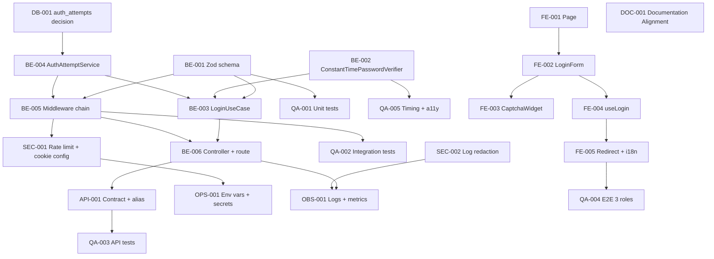

# Development Tasks — PB-P1-003 / US-003: Iniciar sesión con email y contraseña

## 1. Metadata

| Field | Value |
|---|---|
| User Story ID | US-003 |
| Source User Story | `management/user-stories/US-003-login-email-password.md` |
| Source Technical Specification | `management/technical-specs/P1/PB-P1-003/US-003-technical-spec.md` |
| Decision Resolution Artifact | `management/user-stories/decision-resolutions/US-003-decision-resolution.md` |
| Priority | P1 |
| Backlog ID | PB-P1-003 |
| Backlog Title | Login con email/password + logout |
| Backlog Execution Order | Tercer ítem de P1 (después de PB-P1-001 y PB-P1-002) |
| User Story Position in Backlog Item | 1 de 2 (US-005 cubre logout) |
| Related User Stories in Backlog Item | US-003 (login), US-005 (logout) |
| Epic | EPIC-AUTH-001 — Authentication & User Access |
| Backlog Item Dependencies | PB-P0-001, PB-P0-004, PB-P0-006, PB-P0-007 |
| Feature | Login con credenciales |
| Module / Domain | Auth |
| Backlog Alignment Status | Found |
| Task Breakdown Status | Ready for Sprint Planning |
| Created Date | 2026-06-25 |
| Last Updated | 2026-06-25 |

---

## 2. Source Validation

| Source | Found | Used | Notes |
|---|---|---|---|
| User Story | Yes | Yes | `Approved with Minor Notes`; PO/BA Decisions Applied formalizadas |
| Technical Specification | Yes | Yes | `Ready for Task Breakdown` |
| Decision Resolution Artifact | Yes | Yes | 5 decisiones PO/BA formalizadas |
| Product Backlog Prioritized | Yes | Yes | PB-P1-003 mapeado |
| ADRs | Yes | Yes | ADR-SEC-001 (cookies), ADR-SEC-003 (argon2id) |

---

## 3. Backlog Execution Context

### Parent Backlog Item

PB-P1-003 implementa el acceso recurrente al producto. Requiere PB-P0-001 (`users`), PB-P0-004 (REST + error envelope), PB-P0-006 (`SessionCookieIssuer`, `CaptchaService`) y PB-P0-007 (rate limiting + middleware chain). US-003 entrega el login; US-005 entrega el logout sobre la misma cookie.

### Execution Order Rationale

US-003 se ejecuta primero dentro de PB-P1-003 porque emite la cookie de sesión que US-005 invalida. Sus dependencias P0 están cerradas y reutiliza componentes ya construidos para US-001 (`SessionCookieIssuer`, `CaptchaService`, rate-limit middleware, error envelope).

### Related User Stories in Same Backlog Item

| User Story | Role in Backlog Item | Suggested Order |
|---|---|---|
| US-003 | Login con email/password + cookie firmada + captcha condicional | 1 |
| US-005 | Logout explícito (invalida cookie) | 2 |

---

## 4. Task Breakdown Summary

| Area | Number of Tasks | Notes |
|---|---:|---|
| Backend (BE) | 6 | Schema, use case, password verifier, auth attempts service, middlewares, controller |
| API Contract (API) | 1 | Endpoint REST + alias `/me` ↔ `/api/v1/users/me` |
| Database / Prisma (DB) | 1 | Decisión `auth_attempts` (In-Memory vs migración) |
| Frontend (FE) | 5 | Page, form, captcha condicional, mutation, i18n+redirect |
| Security / Authorization (SEC) | 2 | Configuración rate limit + redacción de logs |
| QA / Testing (QA) | 5 | Unit, integration, API, E2E 3 roles, timing + a11y |
| DevOps / Environment (OPS) | 1 | Variables, secrets, captcha por entorno |
| Observability / Audit (OBS) | 1 | Eventos y métricas de login |
| Documentation / Traceability (DOC) | 1 | Documentation Alignment (Doc 19 §10, Doc 8, Doc 16 §23) |

**Total: 23 tareas**

---

## 5. Traceability Matrix

| Acceptance Criterion | Technical Spec Section | Task IDs |
|---|---|---|
| AC-01 (login exitoso) | §7, §8, §9, §12 | TASK-PB-P1-003-US-003-BE-001..006, API-001, FE-001..005, SEC-001, QA-001..004 |
| AC-02 (redirección por rol) | §8, §9 | TASK-PB-P1-003-US-003-FE-005, QA-004 |
| AC-03 (sesión persistente 30d) | §7, §12 | TASK-PB-P1-003-US-003-BE-002, SEC-001, QA-003 |
| AC-04 (sesión existente → 409) | §7 (sessionGuardForLogin), §9 | TASK-PB-P1-003-US-003-BE-005, API-001, QA-003 |
| AC-05 (rate limit 429) | §7, §9, §12 | TASK-PB-P1-003-US-003-BE-005, SEC-001, OPS-001, QA-003 |
| EC-01 (credenciales inválidas) | §7, §12 | TASK-PB-P1-003-US-003-BE-002, BE-003, QA-001, QA-005 |
| EC-02 (captcha condicional N=3) | §7, §10, §12 | TASK-PB-P1-003-US-003-BE-004, BE-005, DB-001, FE-003, QA-002, QA-003 |

---

## 6. Development Tasks

### TASK-PB-P1-003-US-003-BE-001 — Definir `LoginRequestSchema` (Zod) y `LoginInput` DTO

| Field | Value |
|---|---|
| Area | Backend |
| Type | Implementation |
| Priority | Must |
| Estimate | XS |
| Depends On | — |
| Source AC(s) | AC-01, EC-01, EC-02 |
| Technical Spec Section(s) | §7 (DTOs / Schemas, Validation Rules) |
| Backlog ID | PB-P1-003 |
| User Story ID | US-003 |
| Owner Role | Backend |
| Status | To Do |

#### Objective

Definir el contrato de entrada del endpoint con Zod (`LoginRequestSchema`) y el DTO `LoginRequestDto` reutilizables por validation middleware y por el use case.

#### Scope

##### Include

- `apps/api/src/modules/auth/application/schemas/LoginRequestSchema.ts` (Zod).
- Tipo `LoginRequestDto` inferido vía `z.infer`.
- Trim de email + validación `email`; password no vacío; `captchaToken` opcional.

##### Exclude

- Lógica de captcha condicional (la decide el middleware).

#### Implementation Notes

- Mensajes Zod genéricos para no exponer pistas.

#### Acceptance Criteria Covered

AC-01, EC-01, EC-02.

#### Definition of Done

- [ ] Schema + DTO tipados.
- [ ] Tests unitarios del schema.
- [ ] Importado por `LoginController` y `validationMiddleware`.

---

### TASK-PB-P1-003-US-003-BE-002 — Implementar `ConstantTimePasswordVerifier`

| Field | Value |
|---|---|
| Area | Backend |
| Type | Implementation |
| Priority | Must |
| Estimate | S |
| Depends On | — |
| Source AC(s) | AC-01, EC-01 |
| Technical Spec Section(s) | §7 (Use Cases), §12 (Authentication), §17 (timing risk) |
| Backlog ID | PB-P1-003 |
| User Story ID | US-003 |
| Owner Role | Backend |
| Status | To Do |

#### Objective

Encapsular `argon2id.verify` con parámetros mínimos (`memoryCost=19MiB, timeCost=2, parallelism=1`) y garantizar la ejecución del hash aun si el usuario no existe (mitigación timing).

#### Scope

##### Include

- `apps/api/src/modules/auth/application/services/ConstantTimePasswordVerifier.ts`.
- Hash dummy precalculado para ramas sin usuario.
- Soporte `bcrypt(12)` como fallback documentado.

##### Exclude

- Configuración global de argon2 (heredada de US-001 / PB-P0-006).

#### Acceptance Criteria Covered

AC-01, EC-01.

#### Definition of Done

- [ ] Servicio implementado y testeado.
- [ ] Latencia comparable en email existente vs inexistente.

---

### TASK-PB-P1-003-US-003-BE-003 — Implementar `LoginUseCase`

| Field | Value |
|---|---|
| Area | Backend |
| Type | Implementation |
| Priority | Must |
| Estimate | M |
| Depends On | TASK-PB-P1-003-US-003-BE-001, BE-002, BE-004 |
| Source AC(s) | AC-01, AC-03, EC-01 |
| Technical Spec Section(s) | §7 (Use Cases / Application Services), §12 |
| Backlog ID | PB-P1-003 |
| User Story ID | US-003 |
| Owner Role | Backend |
| Status | To Do |

#### Objective

Implementar el caso de uso `LoginUseCase` que orquesta validación, recuperación del usuario, verificación de contraseña en tiempo constante, manejo del contador IP+email y emisión de la cookie de sesión.

#### Scope

##### Include

- `apps/api/src/modules/auth/application/use-cases/LoginUseCase.ts`.
- Integración con `UserRepository.findByEmailCI`.
- Integración con `ConstantTimePasswordVerifier`.
- Integración con `AuthAttemptService` (registrar fallo, resetear éxito).
- Llamada a `SessionCookieIssuer.issue(user)` (PB-P0-006).
- Mapeo a respuesta `AuthUserResponseDto` (Doc 16 §22.4).

##### Exclude

- Detección de sesión existente (se hace en middleware previo).
- Captcha (lo verifica el middleware condicional).

#### Acceptance Criteria Covered

AC-01, AC-03, EC-01.

#### Definition of Done

- [ ] Use case con tests unitarios cubriendo éxito, password incorrecto, email inexistente y sesión.
- [ ] No registra password, hash ni `captchaToken`.

---

### TASK-PB-P1-003-US-003-BE-004 — Implementar `AuthAttemptService` (contador IP+email, ventana 10 min)

| Field | Value |
|---|---|
| Area | Backend |
| Type | Implementation |
| Priority | Must |
| Estimate | M |
| Depends On | TASK-PB-P1-003-US-003-DB-001 |
| Source AC(s) | EC-02 |
| Technical Spec Section(s) | §7 (Application Services), §10 (DB) |
| Backlog ID | PB-P1-003 |
| User Story ID | US-003 |
| Owner Role | Backend |
| Status | To Do |

#### Objective

Implementar el servicio que registra fallos consecutivos por combinación IP+email candidato y determina cuándo activar el captcha condicional con `N=3` y ventana deslizante de 10 min.

#### Scope

##### Include

- `apps/api/src/modules/security/auth-attempts/AuthAttemptService.ts` con puerto `AuthAttemptRepository`.
- Adapter `InMemoryAuthAttemptRepository` por defecto.
- Adapter `PostgresAuthAttemptRepository` opcional si se aprueba la migración.
- Operaciones: `recordFailure(ip, email, reason)`, `isCaptchaRequired(ip, email): boolean`, `resetOnSuccess(ip, email)`, `pruneExpired()`.

##### Exclude

- Lógica de rate limit global (delegada al middleware canónico de PB-P0-007).

#### Acceptance Criteria Covered

EC-02.

#### Definition of Done

- [ ] Cobertura unitaria de frontera `N=3`, reset y expiración.
- [ ] Adapter In-Memory activo por defecto.

---

### TASK-PB-P1-003-US-003-BE-005 — Implementar cadena de middlewares de `/auth/login`

| Field | Value |
|---|---|
| Area | Backend |
| Type | Implementation |
| Priority | Must |
| Estimate | M |
| Depends On | TASK-PB-P1-003-US-003-BE-001, BE-004 |
| Source AC(s) | AC-04, AC-05, EC-02 |
| Technical Spec Section(s) | §7 (Controllers / Routes), §12 |
| Backlog ID | PB-P1-003 |
| User Story ID | US-003 |
| Owner Role | Backend |
| Status | To Do |

#### Objective

Componer `correlationMiddleware → loggingMiddleware → rateLimitMiddleware('auth.login') → sessionGuardForLogin → validationMiddleware(LoginRequestSchema) → captchaConditionalMiddleware → controller`.

#### Scope

##### Include

- `apps/api/src/modules/auth/interfaces/http/middlewares/sessionGuardForLogin.ts` → traduce sesión activa a `409 ALREADY_AUTHENTICATED`.
- `apps/api/src/modules/auth/interfaces/http/middlewares/captchaConditionalMiddleware.ts` → consulta `AuthAttemptService.isCaptchaRequired` y verifica `captchaToken` con `CaptchaService` (PB-P0-006). Devuelve `400 CAPTCHA_REQUIRED` / `400 CAPTCHA_INVALID`.
- Configuración de `rateLimitMiddleware` con clave `auth.login` (`10/IP/10min`).

##### Exclude

- Implementación del `CaptchaService` (heredada de PB-P0-006).

#### Acceptance Criteria Covered

AC-04, AC-05, EC-02.

#### Definition of Done

- [ ] Cadena registrada en el router de `auth`.
- [ ] Tests de integración por cada respuesta esperada.

---

### TASK-PB-P1-003-US-003-BE-006 — Implementar `AuthController.login` y route binding

| Field | Value |
|---|---|
| Area | Backend |
| Type | Implementation |
| Priority | Must |
| Estimate | S |
| Depends On | TASK-PB-P1-003-US-003-BE-003, BE-005 |
| Source AC(s) | AC-01 |
| Technical Spec Section(s) | §7 (Controllers / Routes), §9 |
| Backlog ID | PB-P1-003 |
| User Story ID | US-003 |
| Owner Role | Backend |
| Status | To Do |

#### Objective

Controlador delgado que invoca `LoginUseCase`, escribe la cookie y serializa `AuthUserResponseDto`. Mapear excepciones de dominio al error envelope (`401 AUTHENTICATION_REQUIRED`).

#### Scope

##### Include

- `apps/api/src/modules/auth/interfaces/http/AuthController.login`.
- Registro de la ruta `POST /api/v1/auth/login`.

##### Exclude

- Implementación del `errorHandler` global (provisto por PB-P0-004).

#### Acceptance Criteria Covered

AC-01.

#### Definition of Done

- [ ] Controller cubierto por test de API.
- [ ] Set-Cookie con flags canónicos.

---

### TASK-PB-P1-003-US-003-API-001 — Documentar contrato `POST /auth/login` y alias `/me` ↔ `/api/v1/users/me`

| Field | Value |
|---|---|
| Area | API Contract |
| Type | Documentation |
| Priority | Must |
| Estimate | S |
| Depends On | TASK-PB-P1-003-US-003-BE-006 |
| Source AC(s) | AC-01, AC-02, AC-04, AC-05 |
| Technical Spec Section(s) | §9 (API Contract), §16 (Documentation Alignment) |
| Backlog ID | PB-P1-003 |
| User Story ID | US-003 |
| Owner Role | Backend / Tech Lead |
| Status | To Do |

#### Objective

Publicar el contrato OpenAPI/JSON del endpoint y confirmar el alias `GET /me` ↔ `GET /api/v1/users/me` para consumo del frontend, en consistencia con US-001.

#### Scope

##### Include

- Sección OpenAPI/Swagger para `POST /auth/login` (request, success, error codes).
- Alias router `/api/v1/users/me` apuntando al handler de `/me`.

##### Exclude

- Implementación de `GET /me` (provista por PB-P0-004 / US-001).

#### Acceptance Criteria Covered

AC-01, AC-02, AC-04, AC-05.

#### Definition of Done

- [ ] Contrato publicado.
- [ ] Alias documentado en API Design.

---

### TASK-PB-P1-003-US-003-DB-001 — Decidir y aplicar persistencia del contador (`InMemory` por defecto)

| Field | Value |
|---|---|
| Area | Database / Prisma |
| Type | Setup |
| Priority | Must |
| Estimate | S |
| Depends On | — |
| Source AC(s) | EC-02 |
| Technical Spec Section(s) | §10 (Database / Prisma Design), §17 (Risks) |
| Backlog ID | PB-P1-003 |
| User Story ID | US-003 |
| Owner Role | Backend / Tech Lead |
| Status | To Do |

#### Objective

Confirmar la elección de almacenamiento del contador IP+email para MVP (In-Memory) y dejar abierta la migración a tabla `auth_attempts` con índice compuesto si el equipo de operaciones escala a multi-instancia.

#### Scope

##### Include

- ADR breve o nota técnica registrando la decisión.
- Si se elige Postgres: migración reversible y modelo Prisma `AuthAttempt` con índices `(ip, emailCandidate, attemptedAt desc)` y `(attemptedAt)`.

##### Exclude

- Implementación del servicio (cubierto por BE-004).

#### Acceptance Criteria Covered

EC-02.

#### Definition of Done

- [ ] Nota/ADR creada.
- [ ] Migración aplicada solo si la opción elegida es Postgres.

---

### TASK-PB-P1-003-US-003-FE-001 — Implementar página `/[locale]/auth/login`

| Field | Value |
|---|---|
| Area | Frontend |
| Type | Implementation |
| Priority | Must |
| Estimate | S |
| Depends On | — |
| Source AC(s) | AC-01, AC-02 |
| Technical Spec Section(s) | §8 (Routes / Pages) |
| Backlog ID | PB-P1-003 |
| User Story ID | US-003 |
| Owner Role | Frontend |
| Status | To Do |

#### Objective

Crear la ruta App Router con layout localizado e integrar `LoginForm`.

#### Scope

##### Include

- `apps/web/app/[locale]/auth/login/page.tsx` (Client Component).
- Carga de mensajes i18n.

##### Exclude

- Lógica de redirección por rol (cubierta por FE-005).

#### Acceptance Criteria Covered

AC-01, AC-02.

#### Definition of Done

- [ ] Página renderiza form en los 4 locales.

---

### TASK-PB-P1-003-US-003-FE-002 — Implementar `LoginForm` con React Hook Form + Zod

| Field | Value |
|---|---|
| Area | Frontend |
| Type | Implementation |
| Priority | Must |
| Estimate | S |
| Depends On | TASK-PB-P1-003-US-003-FE-001 |
| Source AC(s) | AC-01, EC-01 |
| Technical Spec Section(s) | §8 (Components / Forms) |
| Backlog ID | PB-P1-003 |
| User Story ID | US-003 |
| Owner Role | Frontend |
| Status | To Do |

#### Objective

Form controlado con validación cliente (Zod) y manejo de error envelope (mensaje genérico `aria-live polite`).

#### Scope

##### Include

- `LoginForm.tsx`, `EmailInput`, `PasswordInput`, `LoginErrorBanner`.
- Renderizado del banner `429` con cuenta regresiva `Retry-After`.

##### Exclude

- Captcha (cubierto por FE-003).
- Redirección (cubierto por FE-005).

#### Acceptance Criteria Covered

AC-01, EC-01.

#### Definition of Done

- [ ] Errores genéricos visibles.
- [ ] Componentes accesibles.

---

### TASK-PB-P1-003-US-003-FE-003 — Integrar `CaptchaWidget` condicional

| Field | Value |
|---|---|
| Area | Frontend |
| Type | Implementation |
| Priority | Must |
| Estimate | S |
| Depends On | TASK-PB-P1-003-US-003-FE-002 |
| Source AC(s) | EC-02 |
| Technical Spec Section(s) | §8 (Components), §12 |
| Backlog ID | PB-P1-003 |
| User Story ID | US-003 |
| Owner Role | Frontend |
| Status | To Do |

#### Objective

Mostrar el widget de captcha cuando el backend responda `400 CAPTCHA_REQUIRED` o `400 CAPTCHA_INVALID`, y enviar el `captchaToken` en el siguiente intento.

#### Scope

##### Include

- `CaptchaWidget.tsx` reusable (lee site-key público).
- Reset del widget tras error.

##### Exclude

- Selección del proveedor captcha (heredada de PB-P0-006).

#### Acceptance Criteria Covered

EC-02.

#### Definition of Done

- [ ] Captcha solo aparece cuando aplica.
- [ ] Token enviado en payload.

---

### TASK-PB-P1-003-US-003-FE-004 — Implementar mutation `useLogin` (TanStack Query)

| Field | Value |
|---|---|
| Area | Frontend |
| Type | Implementation |
| Priority | Must |
| Estimate | S |
| Depends On | TASK-PB-P1-003-US-003-FE-002 |
| Source AC(s) | AC-01, AC-04 |
| Technical Spec Section(s) | §8 (State Management / Data Fetching) |
| Backlog ID | PB-P1-003 |
| User Story ID | US-003 |
| Owner Role | Frontend |
| Status | To Do |

#### Objective

Wrap del endpoint con `credentials: 'include'`, invalidación de `useUserMe` y mapeo de errores envelope a estados de UI.

#### Scope

##### Include

- `apps/web/lib/hooks/useLogin.ts` y `authApi.login`.
- Invalida `useUserMe` en `onSuccess`.

##### Exclude

- Redirección (FE-005).

#### Acceptance Criteria Covered

AC-01, AC-04.

#### Definition of Done

- [ ] `useLogin` testeado con MSW.

---

### TASK-PB-P1-003-US-003-FE-005 — Redirección por rol e i18n de mensajes

| Field | Value |
|---|---|
| Area | Frontend |
| Type | Implementation |
| Priority | Must |
| Estimate | S |
| Depends On | TASK-PB-P1-003-US-003-FE-004 |
| Source AC(s) | AC-02 |
| Technical Spec Section(s) | §8 (Routes, i18n) |
| Backlog ID | PB-P1-003 |
| User Story ID | US-003 |
| Owner Role | Frontend |
| Status | To Do |

#### Objective

Tras login exitoso, consumir `GET /api/v1/users/me` y redirigir a `/[locale]/organizer|vendor|admin`. Publicar catálogo i18n en los 4 locales.

#### Scope

##### Include

- `useUserMe.ts`, lógica `router.replace`.
- `messages/{es-LATAM,es-ES,pt,en}/login.json`.

##### Exclude

- Implementación de los layouts por rol.

#### Acceptance Criteria Covered

AC-02.

#### Definition of Done

- [ ] Redirección verificada por rol.
- [ ] Mensajes i18n completos.

---

### TASK-PB-P1-003-US-003-SEC-001 — Configurar rate limit `auth.login` y atributos canónicos de cookie

| Field | Value |
|---|---|
| Area | Security / Authorization |
| Type | Setup |
| Priority | Must |
| Estimate | S |
| Depends On | TASK-PB-P1-003-US-003-BE-005 |
| Source AC(s) | AC-01, AC-03, AC-05 |
| Technical Spec Section(s) | §12 (Security & Authorization), §17 |
| Backlog ID | PB-P1-003 |
| User Story ID | US-003 |
| Owner Role | Backend / Security Lead |
| Status | To Do |

#### Objective

Configurar el bucket `auth.login` del rate limiter (`10/IP/10min`) y los flags de la cookie (`HttpOnly`, `Secure` no-local, `SameSite=Lax`, `Path=/`, `Max-Age=2592000`) reutilizando `SessionCookieIssuer`.

#### Scope

##### Include

- Configuración por entorno en `config/rateLimit.ts`.
- Wrapper de `SessionCookieIssuer` con `Max-Age=30d` documentado como override formal de Doc 19 §10.

##### Exclude

- Cambios al `SessionCookieIssuer` (PB-P0-006).

#### Acceptance Criteria Covered

AC-01, AC-03, AC-05.

#### Definition of Done

- [ ] Configuración mergeada.
- [ ] Test de respuesta `Set-Cookie` correcto.

---

### TASK-PB-P1-003-US-003-SEC-002 — Garantizar redacción de logs (sin password, hash ni captchaToken)

| Field | Value |
|---|---|
| Area | Security / Authorization |
| Type | Implementation |
| Priority | Must |
| Estimate | XS |
| Depends On | — |
| Source AC(s) | AC-01, EC-01, EC-02 |
| Technical Spec Section(s) | §12 (Sensitive Data Handling), §14 (Observability) |
| Backlog ID | PB-P1-003 |
| User Story ID | US-003 |
| Owner Role | Backend / Security Lead |
| Status | To Do |

#### Objective

Asegurar que el logger redacta campos sensibles (`password`, `password_hash`, `captchaToken`) en cualquier evento del módulo `auth`.

#### Scope

##### Include

- Lista de redacción en `logger.ts`.
- Test que falla si un campo sensible aparece en el output.

##### Exclude

- Cambios al transporte del logger.

#### Acceptance Criteria Covered

AC-01, EC-01, EC-02.

#### Definition of Done

- [ ] Test de redacción verde.

---

### TASK-PB-P1-003-US-003-QA-001 — Tests unitarios (use case, schema, servicios)

| Field | Value |
|---|---|
| Area | QA / Testing |
| Type | Test |
| Priority | Must |
| Estimate | S |
| Depends On | TASK-PB-P1-003-US-003-BE-001, BE-002, BE-003, BE-004 |
| Source AC(s) | AC-01, EC-01, EC-02 |
| Technical Spec Section(s) | §13 (Unit Tests) |
| Backlog ID | PB-P1-003 |
| User Story ID | US-003 |
| Owner Role | QA |
| Status | To Do |

#### Objective

Cubrir con Vitest las ramas del use case, el schema Zod y `AuthAttemptService` (frontera `N=3`, reset, expiración) y `ConstantTimePasswordVerifier`.

#### Scope

##### Include

- `LoginUseCase.test.ts`, `LoginRequestSchema.test.ts`, `AuthAttemptService.test.ts`, `ConstantTimePasswordVerifier.test.ts`.

##### Exclude

- Tests de integración HTTP (QA-002/QA-003).

#### Acceptance Criteria Covered

AC-01, EC-01, EC-02.

#### Definition of Done

- [ ] Cobertura del módulo ≥ 85%.

---

### TASK-PB-P1-003-US-003-QA-002 — Tests de integración de middleware chain

| Field | Value |
|---|---|
| Area | QA / Testing |
| Type | Test |
| Priority | Must |
| Estimate | S |
| Depends On | TASK-PB-P1-003-US-003-BE-005 |
| Source AC(s) | AC-04, AC-05, EC-02 |
| Technical Spec Section(s) | §13 (Integration Tests) |
| Backlog ID | PB-P1-003 |
| User Story ID | US-003 |
| Owner Role | QA |
| Status | To Do |

#### Objective

Verificar la composición real de middlewares: `sessionGuard → validation → captchaConditional → controller` con casos positivos y negativos.

#### Scope

##### Include

- Tests para `409`, `400 CAPTCHA_REQUIRED`, `400 CAPTCHA_INVALID`, `400 VALIDATION_ERROR`.

##### Exclude

- Casos puramente de schema (cubiertos en QA-001).

#### Acceptance Criteria Covered

AC-04, AC-05, EC-02.

#### Definition of Done

- [ ] Cada middleware probado en cadena.

---

### TASK-PB-P1-003-US-003-QA-003 — Tests de API con Supertest

| Field | Value |
|---|---|
| Area | QA / Testing |
| Type | Test |
| Priority | Must |
| Estimate | M |
| Depends On | TASK-PB-P1-003-US-003-BE-006, API-001 |
| Source AC(s) | AC-01, AC-03, AC-04, AC-05, EC-01, EC-02 |
| Technical Spec Section(s) | §13 (API Tests) |
| Backlog ID | PB-P1-003 |
| User Story ID | US-003 |
| Owner Role | QA |
| Status | To Do |

#### Objective

Cubrir todas las respuestas del endpoint y la lectura de `GET /api/v1/users/me`.

#### Scope

##### Include

- `200` con cookie firmada con flags correctos (`HttpOnly`, `Secure`, `SameSite=Lax`, `Path=/`, `Max-Age=2592000`).
- `400 VALIDATION_ERROR`, `400 CAPTCHA_REQUIRED`, `400 CAPTCHA_INVALID`.
- `401 AUTHENTICATION_REQUIRED` en email inexistente y password incorrecto (mensaje idéntico).
- `409 ALREADY_AUTHENTICATED`.
- `429 RATE_LIMIT_EXCEEDED` con `Retry-After`.
- `GET /api/v1/users/me` post-login.

##### Exclude

- E2E (QA-004).

#### Acceptance Criteria Covered

AC-01, AC-03, AC-04, AC-05, EC-01, EC-02.

#### Definition of Done

- [ ] Todas las respuestas verificadas.

---

### TASK-PB-P1-003-US-003-QA-004 — E2E para los 3 roles con Playwright

| Field | Value |
|---|---|
| Area | QA / Testing |
| Type | Test |
| Priority | Must |
| Estimate | M |
| Depends On | TASK-PB-P1-003-US-003-FE-005 |
| Source AC(s) | AC-01, AC-02, EC-02 |
| Technical Spec Section(s) | §13 (E2E Tests), §15 (Seed / Demo) |
| Backlog ID | PB-P1-003 |
| User Story ID | US-003 |
| Owner Role | QA |
| Status | To Do |

#### Objective

Recorrer login → `/users/me` → redirección al layout correspondiente para organizer, vendor, admin; reproducir captcha condicional tras 3 fallos.

#### Scope

##### Include

- `e2e/login-3-roles.spec.ts`, escenario captcha.
- Uso de seeds de Doc 11.

##### Exclude

- Tests de logout.

#### Acceptance Criteria Covered

AC-01, AC-02, EC-02.

#### Definition of Done

- [ ] 3 roles cubiertos.
- [ ] Captcha condicional disparado y resuelto.

---

### TASK-PB-P1-003-US-003-QA-005 — Tests de seguridad (timing) y accesibilidad

| Field | Value |
|---|---|
| Area | QA / Testing |
| Type | Test |
| Priority | Must |
| Estimate | S |
| Depends On | TASK-PB-P1-003-US-003-BE-002, FE-002 |
| Source AC(s) | EC-01 |
| Technical Spec Section(s) | §13 (Security / Accessibility Tests), §17 (Risks) |
| Backlog ID | PB-P1-003 |
| User Story ID | US-003 |
| Owner Role | QA / Security Lead |
| Status | To Do |

#### Objective

Verificar mitigación de timing (p95 email existente vs inexistente dentro del umbral configurado) y accesibilidad axe sobre `/auth/login`.

#### Scope

##### Include

- Suite de regresión de timing (Vitest + Supertest con muestreo controlado).
- `axe` test sobre la página de login en los 4 locales.

##### Exclude

- Penetration testing.

#### Acceptance Criteria Covered

EC-01.

#### Definition of Done

- [ ] Test de timing aprobado.
- [ ] axe sin violaciones críticas.

---

### TASK-PB-P1-003-US-003-OPS-001 — Variables de entorno, secrets y captcha por entorno

| Field | Value |
|---|---|
| Area | DevOps / Environment |
| Type | Setup |
| Priority | Must |
| Estimate | S |
| Depends On | TASK-PB-P1-003-US-003-SEC-001 |
| Source AC(s) | AC-01, AC-03, AC-05 |
| Technical Spec Section(s) | §17 (Risks), §12 |
| Backlog ID | PB-P1-003 |
| User Story ID | US-003 |
| Owner Role | DevOps |
| Status | To Do |

#### Objective

Definir variables y secrets requeridos: `SESSION_SECRET`, `SESSION_COOKIE_MAX_AGE_SECONDS=2592000`, `RATE_LIMIT_LOGIN_PER_IP_PER_10MIN=10`, `CAPTCHA_PROVIDER`, `CAPTCHA_SECRET`, `CAPTCHA_TEST_TOKEN=__test__` solo en non-prod.

#### Scope

##### Include

- `.env.example`, manifiestos por entorno (Doc 21).
- Inyección por Secrets Manager en prod/preview.

##### Exclude

- Provisión real de secrets (operada por DevOps Lead).

#### Acceptance Criteria Covered

AC-01, AC-03, AC-05.

#### Definition of Done

- [ ] Variables documentadas y aplicadas.

---

### TASK-PB-P1-003-US-003-OBS-001 — Instrumentar eventos y métricas de login

| Field | Value |
|---|---|
| Area | Observability / Audit |
| Type | Implementation |
| Priority | Must |
| Estimate | S |
| Depends On | TASK-PB-P1-003-US-003-BE-006 |
| Source AC(s) | AC-01, EC-01, EC-02, AC-05 |
| Technical Spec Section(s) | §14 (Observability & Audit) |
| Backlog ID | PB-P1-003 |
| User Story ID | US-003 |
| Owner Role | Backend / Observability |
| Status | To Do |

#### Objective

Emitir eventos `auth.login.success` / `auth.login.failure` con razones tipadas y métricas `auth_login_total{result}`, `auth_login_latency_seconds{result}`, `auth_login_captcha_required_total`, `auth_login_rate_limited_total`.

#### Scope

##### Include

- Logger estructurado + correlación.
- Exposición de métricas Prometheus-style si el stack actual lo soporta.

##### Exclude

- Dashboards (parte de OBS general).

#### Acceptance Criteria Covered

AC-01, EC-01, EC-02, AC-05.

#### Definition of Done

- [ ] Eventos visibles con `correlationId`.

---

### TASK-PB-P1-003-US-003-DOC-001 — Documentation Alignment (Doc 19 §10, Doc 8 UC-AUTH-002, Doc 16 §23)

| Field | Value |
|---|---|
| Area | Documentation / Traceability |
| Type | Documentation |
| Priority | Should |
| Estimate | XS |
| Depends On | — |
| Source AC(s) | AC-03, EC-02 |
| Technical Spec Section(s) | §16 (Documentation Alignment Required) |
| Backlog ID | PB-P1-003 |
| User Story ID | US-003 |
| Owner Role | Tech Lead / BA |
| Status | To Do |

#### Objective

Reflejar en la documentación los overrides ya formalizados: cookie `Max-Age=30d`, captcha condicional `N=3` y path canónico `GET /api/v1/users/me`.

#### Scope

##### Include

- Nota de override en Doc 19 §10 (`Max-Age=30d`).
- Nota de override en Doc 8 UC-AUTH-002 (captcha condicional `N=3`).
- Aclaración del alias `/me` ↔ `/api/v1/users/me` en Doc 16 §23.

##### Exclude

- Creación de ADRs (no requerida según Decision Resolution).

#### Acceptance Criteria Covered

AC-03, EC-02.

#### Definition of Done

- [ ] Notas insertadas con referencia a US-003 y PB-P1-003.

---

## 7. Required QA Tasks

| Task ID | Test Type | Purpose |
|---|---|---|
| TASK-PB-P1-003-US-003-QA-001 | Unit | Use case, schema, servicios |
| TASK-PB-P1-003-US-003-QA-002 | Integration | Middleware chain |
| TASK-PB-P1-003-US-003-QA-003 | API | Códigos del error envelope + cookie + `/users/me` |
| TASK-PB-P1-003-US-003-QA-004 | E2E | Login para 3 roles + captcha condicional |
| TASK-PB-P1-003-US-003-QA-005 | Security + Accessibility | Timing + axe |

---

## 8. Required Security Tasks

| Task ID | Security Concern | Purpose |
|---|---|---|
| TASK-PB-P1-003-US-003-SEC-001 | Rate limit + cookie | `10/IP/10min` y atributos canónicos `Max-Age=30d` |
| TASK-PB-P1-003-US-003-SEC-002 | Redacción de logs | Evitar fuga de `password`, `password_hash`, `captchaToken` |
| TASK-PB-P1-003-US-003-QA-005 | Mitigación timing | Garantizar hash incondicional |

---

## 9. Required Seed / Demo Tasks

| Task ID | Seed/Demo Concern | Purpose |
|---|---|---|
| TASK-PB-P1-003-US-003-QA-004 | E2E con seeds 3 roles | Login organizer/vendor/admin desde Doc 11 |
| TASK-PB-P1-003-US-003-OPS-001 | Captcha `__test__` en non-prod | Habilitar demo y CI |

---

## 10. Observability / Audit Tasks

| Task ID | Concern | Purpose |
|---|---|---|
| TASK-PB-P1-003-US-003-OBS-001 | Logs + métricas | Auditar login success/failure, captcha y rate limit |

---

## 11. Documentation / Traceability Tasks

| Task ID | Document / Artifact | Purpose |
|---|---|---|
| TASK-PB-P1-003-US-003-API-001 | API Design (Doc 16 §22 + alias §23) | Contrato + alias `/me` |
| TASK-PB-P1-003-US-003-DOC-001 | Doc 19 §10, Doc 8 UC-AUTH-002, Doc 16 §23 | Documentation Alignment Required |

---

## 12. Dependency Graph

---

## 13. Suggested Implementation Order

### Phase 1 — Foundation

- DB-001 (decisión de persistencia)
- BE-001 (schema)
- BE-002 (`ConstantTimePasswordVerifier`)
- BE-004 (`AuthAttemptService`)

### Phase 2 — Core Implementation

- BE-005 (middleware chain)
- BE-003 (`LoginUseCase`)
- BE-006 (controller + route)
- API-001 (contract + alias)
- FE-001..005 en paralelo con backend listo

### Phase 3 — Validation / Security / QA

- SEC-001, SEC-002
- OPS-001
- OBS-001
- QA-001..005

### Phase 4 — Documentation / Review

- DOC-001

---

## 14. Risks & Mitigations

| Risk | Impact | Mitigation | Related Task |
|---|---|---|---|
| Contador en memoria → inconsistencia multi-instancia | Captcha no se dispara correctamente al escalar | Adapter Postgres listo; documentar elección | DB-001, BE-004 |
| Timing attack | Posible enumeración | Hash incondicional + test de timing | BE-002, QA-005 |
| Rate limit mal configurado | Bloqueo legítimo o ineficaz | Configuración por entorno + tests API | SEC-001, OPS-001, QA-003 |
| Captcha bypass en CI | Falsos positivos | Token `__test__` solo non-prod | OPS-001 |
| Override Doc 19 §10 no documentado | Confusión futura | DOC-001 anota override formal | DOC-001 |

---

## 15. Out of Scope Confirmation

- Logout (US-005).
- Recuperación de contraseña (US-004).
- OAuth Google (US-008 / P4).
- MFA / SSO / magic link / biometría.
- Manejo diferenciado de cuentas `suspended` (Decisión PO US-003 #4).
- Cambios al esquema `users` (provistos por PB-P0-001).
- Selección formal de proveedor captcha (PB-P0-006).

---

## 16. Readiness for Sprint Planning

| Check | Status |
|---|---|
| Product Backlog mapping found | Pass |
| Every AC maps to tasks | Pass |
| Technical Spec used when available | Pass |
| QA tasks included | Pass |
| Security tasks included if applicable | Pass |
| Seed/demo tasks included if applicable | Pass |
| Observability tasks included if applicable | Pass |
| Documentation tasks included if applicable | Pass |
| Task dependencies clear | Pass |
| Tasks small enough | Pass |
| Ready for Sprint Planning | Yes |

---

## 17. Final Recommendation

`Ready for Sprint Planning`.

US-003 cuenta con Technical Specification `Ready for Task Breakdown`, decisiones PO/BA formalizadas y dependencias P0 cerradas. 23 tareas cubren AC-01..05 y EC-01..02 con QA, seguridad, observabilidad, seed/demo y documentación. Próximo paso: Sprint Planning de PB-P1-003 (incluir también US-005 para cerrar el backlog item).
