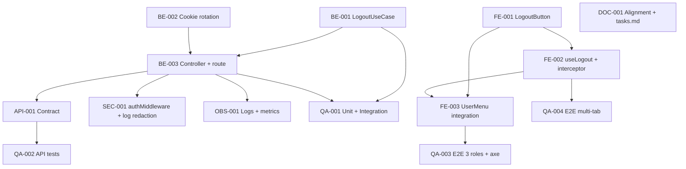

# Development Tasks — PB-P1-003 / US-005: Cerrar sesión

## 1. Metadata

| Field | Value |
|---|---|
| User Story ID | US-005 |
| Source User Story | `management/user-stories/US-005-logout-session.md` |
| Source Technical Specification | `management/technical-specs/P1/PB-P1-003/US-005-technical-spec.md` |
| Decision Resolution Artifact | `management/user-stories/decision-resolutions/US-005-decision-resolution.md` |
| Priority | P1 |
| Backlog ID | PB-P1-003 |
| Backlog Title | Login con email/password + logout |
| Backlog Execution Order | Tercer ítem de P1 |
| User Story Position in Backlog Item | 2 de 2 |
| Related User Stories in Backlog Item | US-003 (login), US-005 (logout) |
| Epic | EPIC-AUTH-001 — Authentication & User Access |
| Backlog Item Dependencies | PB-P0-004, PB-P0-006, US-003 |
| Feature | Logout explícito |
| Module / Domain | Auth |
| Backlog Alignment Status | Found |
| Task Breakdown Status | Ready for Sprint Planning |
| Created Date | 2026-06-25 |
| Last Updated | 2026-06-25 |

---

## 2. Source Validation

| Source | Found | Used | Notes |
|---|---|---|---|
| User Story | Yes | Yes | `Approved with Minor Notes`; PO/BA Decisions Applied formalizadas |
| Technical Specification | Yes | Yes | `Ready for Task Breakdown` |
| Decision Resolution Artifact | Yes | Yes | 4 decisiones PO/BA |
| Product Backlog Prioritized | Yes | Yes | PB-P1-003 mapeado |
| ADRs | Yes | Yes | ADR-SEC-001 (cookies firmadas) |

---

## 3. Backlog Execution Context

### Parent Backlog Item

PB-P1-003 entrega el ciclo completo de sesión. US-005 cierra el ítem al invalidar la cookie emitida por US-003.

### Execution Order Rationale

US-005 ejecuta después de US-003 porque depende de la cookie y del `authMiddleware`. Sus componentes externos (`SessionCookieIssuer`, error envelope, router con `methodNotAllowedHandler`) están entregados.

### Related User Stories in Same Backlog Item

| User Story | Role in Backlog Item | Suggested Order |
|---|---|---|
| US-003 | Login | 1 |
| US-005 | Logout | 2 |

---

## 4. Task Breakdown Summary

| Area | Number of Tasks | Notes |
|---|---:|---|
| Backend (BE) | 3 | Use case, controller, rotación cookie |
| API Contract (API) | 1 | Documentar contrato `/auth/logout` + `405` |
| Frontend (FE) | 3 | `LogoutButton`, `useLogout`, integración `UserMenu` + i18n |
| Security / Authorization (SEC) | 1 | Verificación `authMiddleware` + logs |
| QA / Testing (QA) | 4 | Unit/Integration, API, E2E 3 roles, multi-pestaña + a11y |
| Observability / Audit (OBS) | 1 | Eventos y métricas |
| Documentation / Traceability (DOC) | 1 | Documentation Alignment Doc 19 §9.6 + consolidar `tasks.md` PB-P1-003 |

**Total: 14 tareas**

---

## 5. Traceability Matrix

| Acceptance Criterion | Technical Spec Section | Task IDs |
|---|---|---|
| AC-01 (logout exitoso) | §7, §9, §12 | TASK-PB-P1-003-US-005-BE-001..003, API-001, SEC-001, QA-001..002 |
| AC-02 (estado cliente limpio) | §8 | TASK-PB-P1-003-US-005-FE-001..003, QA-003 |
| AC-03 (no reuso de cookie) | §7, §12, §17 | TASK-PB-P1-003-US-005-BE-002, QA-002 |
| EC-01 (sin sesión → 401) | §7, §9, §12 | TASK-PB-P1-003-US-005-BE-003, SEC-001, QA-002, QA-003 |
| EC-02 (multi-pestaña) | §8, §17 | TASK-PB-P1-003-US-005-FE-002, QA-004 |
| EC-03 (`405`) | §7 (router), §9 | TASK-PB-P1-003-US-005-API-001, QA-002 |

---

## 6. Development Tasks

### TASK-PB-P1-003-US-005-BE-001 — Implementar `LogoutUseCase`

| Field | Value |
|---|---|
| Area | Backend |
| Type | Implementation |
| Priority | Must |
| Estimate | XS |
| Depends On | — |
| Source AC(s) | AC-01 |
| Technical Spec Section(s) | §7 (Use Cases), §14 |
| Backlog ID | PB-P1-003 |
| User Story ID | US-005 |
| Owner Role | Backend |
| Status | To Do |

#### Objective

Implementar `LogoutUseCase.execute(ctx)` que invoca `SessionCookieIssuer.invalidate(res)` y emite `auth.logout.success`.

#### Scope

##### Include

- `apps/api/src/modules/auth/application/use-cases/LogoutUseCase.ts`.

##### Exclude

- Persistencia en `sessions` (Out of Scope).

#### Acceptance Criteria Covered

AC-01.

#### Definition of Done

- [ ] Use case testeado.
- [ ] Sin side effects fuera de cookie + log.

---

### TASK-PB-P1-003-US-005-BE-002 — Rotación de cookie con `Set-Cookie Max-Age=0`

| Field | Value |
|---|---|
| Area | Backend |
| Type | Implementation |
| Priority | Must |
| Estimate | XS |
| Depends On | TASK-PB-P1-003-US-005-BE-001 |
| Source AC(s) | AC-01, AC-03 |
| Technical Spec Section(s) | §7, §9, §12 |
| Backlog ID | PB-P1-003 |
| User Story ID | US-005 |
| Owner Role | Backend |
| Status | To Do |

#### Objective

Asegurar que `SessionCookieIssuer.invalidate(res)` emite `Set-Cookie: session=; Max-Age=0; Path=/; HttpOnly; Secure; SameSite=Lax` con los flags canónicos en todos los entornos.

#### Scope

##### Include

- Validación en `SessionCookieIssuer` (heredado de PB-P0-006) del método `invalidate`.

##### Exclude

- Cambios al firmado (no se rota `SESSION_SECRET`).

#### Acceptance Criteria Covered

AC-01, AC-03.

#### Definition of Done

- [ ] Test verifica el `Set-Cookie` exacto.

---

### TASK-PB-P1-003-US-005-BE-003 — Controller y ruta `POST /auth/logout` con `authMiddleware`

| Field | Value |
|---|---|
| Area | Backend |
| Type | Implementation |
| Priority | Must |
| Estimate | S |
| Depends On | TASK-PB-P1-003-US-005-BE-001, BE-002 |
| Source AC(s) | AC-01, EC-01 |
| Technical Spec Section(s) | §7 (Controllers / Routes), §12 |
| Backlog ID | PB-P1-003 |
| User Story ID | US-005 |
| Owner Role | Backend |
| Status | To Do |

#### Objective

Registrar `POST /api/v1/auth/logout` con la cadena `correlation → logging → authMiddleware → controller`. Controller invoca `LogoutUseCase` y responde `204`.

#### Scope

##### Include

- `AuthController.logout`.
- Registro en el router de `auth`.

##### Exclude

- `methodNotAllowedHandler` (provisto por PB-P0-004; sólo verificar).

#### Acceptance Criteria Covered

AC-01, EC-01.

#### Definition of Done

- [ ] Ruta operativa.
- [ ] `401` ante sesión inválida.

---

### TASK-PB-P1-003-US-005-API-001 — Documentar contrato `/auth/logout` y `405`

| Field | Value |
|---|---|
| Area | API Contract |
| Type | Documentation |
| Priority | Must |
| Estimate | XS |
| Depends On | TASK-PB-P1-003-US-005-BE-003 |
| Source AC(s) | AC-01, EC-01, EC-03 |
| Technical Spec Section(s) | §9 |
| Backlog ID | PB-P1-003 |
| User Story ID | US-005 |
| Owner Role | Backend / Tech Lead |
| Status | To Do |

#### Objective

Publicar el contrato OpenAPI/JSON con `204`, `401`, `405` y atributos del `Set-Cookie`.

#### Scope

##### Include

- Sección OpenAPI/Swagger.

##### Exclude

- Implementación del `methodNotAllowedHandler` (heredado).

#### Acceptance Criteria Covered

AC-01, EC-01, EC-03.

#### Definition of Done

- [ ] Contrato publicado.

---

### TASK-PB-P1-003-US-005-FE-001 — `LogoutButton` reusable

| Field | Value |
|---|---|
| Area | Frontend |
| Type | Implementation |
| Priority | Must |
| Estimate | XS |
| Depends On | — |
| Source AC(s) | AC-02 |
| Technical Spec Section(s) | §8 (Components, Accessibility) |
| Backlog ID | PB-P1-003 |
| User Story ID | US-005 |
| Owner Role | Frontend |
| Status | To Do |

#### Objective

Botón accesible (label/ícono) con `aria-label`, focus visible y soporte de los 4 locales.

#### Scope

##### Include

- `apps/web/components/auth/LogoutButton.tsx`.
- Mensajes `userMenu.logout` en los 4 locales.

##### Exclude

- Lógica de mutation (FE-002).

#### Acceptance Criteria Covered

AC-02.

#### Definition of Done

- [ ] Componente accesible.

---

### TASK-PB-P1-003-US-005-FE-002 — `useLogout` (TanStack Query) + redirección + interceptor `401`

| Field | Value |
|---|---|
| Area | Frontend |
| Type | Implementation |
| Priority | Must |
| Estimate | S |
| Depends On | TASK-PB-P1-003-US-005-FE-001 |
| Source AC(s) | AC-02, EC-02 |
| Technical Spec Section(s) | §8 (State Management, Data Fetching) |
| Backlog ID | PB-P1-003 |
| User Story ID | US-005 |
| Owner Role | Frontend |
| Status | To Do |

#### Objective

Mutation `useLogout` que invalida queries `auth.*`/`me.*`, redirige al login y trata `401` igual que éxito. Confirmar que el interceptor global de `401` (US-003) redirige también en pestañas adicionales.

#### Scope

##### Include

- `useLogout.ts`, `authApi.logout`, `queryClient.removeQueries` con predicate.
- Validar el interceptor global ya existente.

##### Exclude

- Configuración del `QueryClient` (heredada).

#### Acceptance Criteria Covered

AC-02, EC-02.

#### Definition of Done

- [ ] Mutation testeada con MSW.

---

### TASK-PB-P1-003-US-005-FE-003 — Integrar `LogoutButton` en `UserMenu` para 3 layouts

| Field | Value |
|---|---|
| Area | Frontend |
| Type | Implementation |
| Priority | Must |
| Estimate | XS |
| Depends On | TASK-PB-P1-003-US-005-FE-001, FE-002 |
| Source AC(s) | AC-02 |
| Technical Spec Section(s) | §8 (Components) |
| Backlog ID | PB-P1-003 |
| User Story ID | US-005 |
| Owner Role | Frontend |
| Status | To Do |

#### Objective

Montar `LogoutButton` en `UserMenu` para los layouts `organizer`, `vendor`, `admin`.

#### Scope

##### Include

- Modificaciones al `UserMenu` en los 3 layouts.

##### Exclude

- Creación de nuevos layouts.

#### Acceptance Criteria Covered

AC-02.

#### Definition of Done

- [ ] Botón visible en los 3 layouts.

---

### TASK-PB-P1-003-US-005-SEC-001 — Verificar `authMiddleware` y redacción de logs

| Field | Value |
|---|---|
| Area | Security / Authorization |
| Type | Implementation |
| Priority | Must |
| Estimate | XS |
| Depends On | TASK-PB-P1-003-US-005-BE-003 |
| Source AC(s) | AC-01, EC-01 |
| Technical Spec Section(s) | §12, §14 |
| Backlog ID | PB-P1-003 |
| User Story ID | US-005 |
| Owner Role | Security Lead / Backend |
| Status | To Do |

#### Objective

Confirmar que `authMiddleware` está aplicado al endpoint y que ningún log expone el token de sesión.

#### Scope

##### Include

- Test que verifica `401` sin sesión.
- Test que verifica que el logger redacta `session`.

##### Exclude

- Cambios al middleware.

#### Acceptance Criteria Covered

AC-01, EC-01.

#### Definition of Done

- [ ] Tests verdes.

---

### TASK-PB-P1-003-US-005-QA-001 — Unit + integration tests

| Field | Value |
|---|---|
| Area | QA / Testing |
| Type | Test |
| Priority | Must |
| Estimate | S |
| Depends On | TASK-PB-P1-003-US-005-BE-001, BE-003 |
| Source AC(s) | AC-01 |
| Technical Spec Section(s) | §13 (Unit, Integration) |
| Backlog ID | PB-P1-003 |
| User Story ID | US-005 |
| Owner Role | QA |
| Status | To Do |

#### Objective

Cubrir `LogoutUseCase` y la composición de middlewares (`auth → controller`).

#### Scope

##### Include

- `LogoutUseCase.test.ts`, integration `auth → controller`.

##### Exclude

- API tests (QA-002).

#### Acceptance Criteria Covered

AC-01.

#### Definition of Done

- [ ] Cobertura ≥ 85% del use case.

---

### TASK-PB-P1-003-US-005-QA-002 — API tests con Supertest

| Field | Value |
|---|---|
| Area | QA / Testing |
| Type | Test |
| Priority | Must |
| Estimate | S |
| Depends On | TASK-PB-P1-003-US-005-API-001 |
| Source AC(s) | AC-01, AC-03, EC-01, EC-03 |
| Technical Spec Section(s) | §13 (API Tests) |
| Backlog ID | PB-P1-003 |
| User Story ID | US-005 |
| Owner Role | QA |
| Status | To Do |

#### Objective

Verificar `204` + `Set-Cookie Max-Age=0`, `401` sin sesión, `405` ante `GET` y que `GET /me` posterior responde `401` con la cookie rotada.

#### Scope

##### Include

- `apps/api/test/modules/auth/logout.api.test.ts`.

##### Exclude

- E2E (QA-003/QA-004).

#### Acceptance Criteria Covered

AC-01, AC-03, EC-01, EC-03.

#### Definition of Done

- [ ] Todas las respuestas verificadas.

---

### TASK-PB-P1-003-US-005-QA-003 — E2E logout para 3 roles + accesibilidad

| Field | Value |
|---|---|
| Area | QA / Testing |
| Type | Test |
| Priority | Must |
| Estimate | S |
| Depends On | TASK-PB-P1-003-US-005-FE-003 |
| Source AC(s) | AC-02 |
| Technical Spec Section(s) | §13 (E2E, Accessibility) |
| Backlog ID | PB-P1-003 |
| User Story ID | US-005 |
| Owner Role | QA |
| Status | To Do |

#### Objective

Login → click logout en `UserMenu` → redirección a login para los 3 roles. Ejecutar `axe` sobre `UserMenu` con botón visible.

#### Scope

##### Include

- `e2e/logout-3-roles.spec.ts`.
- `axe` integrado.

##### Exclude

- Multi-pestaña (QA-004).

#### Acceptance Criteria Covered

AC-02.

#### Definition of Done

- [ ] 3 roles cubiertos y axe sin violaciones críticas.

---

### TASK-PB-P1-003-US-005-QA-004 — E2E multi-pestaña

| Field | Value |
|---|---|
| Area | QA / Testing |
| Type | Test |
| Priority | Must |
| Estimate | S |
| Depends On | TASK-PB-P1-003-US-005-FE-002 |
| Source AC(s) | EC-02 |
| Technical Spec Section(s) | §13 (E2E), §17 |
| Backlog ID | PB-P1-003 |
| User Story ID | US-005 |
| Owner Role | QA |
| Status | To Do |

#### Objective

Logout en pestaña A → próximo request protegido en pestaña B recibe `401` global → redirección a login.

#### Scope

##### Include

- `e2e/logout-multitab.spec.ts` con `browser.newContext`.

##### Exclude

- Otros flujos.

#### Acceptance Criteria Covered

EC-02.

#### Definition of Done

- [ ] Test estable.

---

### TASK-PB-P1-003-US-005-OBS-001 — Eventos y métricas de logout

| Field | Value |
|---|---|
| Area | Observability / Audit |
| Type | Implementation |
| Priority | Must |
| Estimate | XS |
| Depends On | TASK-PB-P1-003-US-005-BE-003 |
| Source AC(s) | AC-01, EC-01 |
| Technical Spec Section(s) | §14 |
| Backlog ID | PB-P1-003 |
| User Story ID | US-005 |
| Owner Role | Backend / Observability |
| Status | To Do |

#### Objective

Emitir `auth.logout.success` / `auth.logout.no_session` con `correlationId` y métricas `auth_logout_total{result}`, `auth_logout_latency_seconds`.

#### Scope

##### Include

- Logger + métricas.

##### Exclude

- Dashboards.

#### Acceptance Criteria Covered

AC-01, EC-01.

#### Definition of Done

- [ ] Eventos visibles.

---

### TASK-PB-P1-003-US-005-DOC-001 — Documentation Alignment Doc 19 §9.6 + consolidar `tasks.md` de PB-P1-003

| Field | Value |
|---|---|
| Area | Documentation / Traceability |
| Type | Documentation |
| Priority | Should |
| Estimate | XS |
| Depends On | — |
| Source AC(s) | AC-01 |
| Technical Spec Section(s) | §16 |
| Backlog ID | PB-P1-003 |
| User Story ID | US-005 |
| Owner Role | Tech Lead / BA |
| Status | To Do |

#### Objective

Anotar en Doc 19 §9.6 la elección MVP (rotación de cookie) y consolidar el archivo `management/development-tasks/P1/PB-P1-003/tasks.md` con las tareas de US-003 + US-005, ahora que el ciclo de sesión está completo.

#### Scope

##### Include

- Nota de alignment en Doc 19 §9.6.
- Generación del `tasks.md` consolidado (referencias a `US-003-development-tasks.md` y `US-005-development-tasks.md`).

##### Exclude

- Creación de ADRs.

#### Acceptance Criteria Covered

AC-01.

#### Definition of Done

- [ ] Notas y consolidación entregadas.

---

## 7. Required QA Tasks

| Task ID | Test Type | Purpose |
|---|---|---|
| TASK-PB-P1-003-US-005-QA-001 | Unit + Integration | Use case y composición de middlewares |
| TASK-PB-P1-003-US-005-QA-002 | API | `204`/`401`/`405` + cookie rotada |
| TASK-PB-P1-003-US-005-QA-003 | E2E + Accessibility | 3 roles + axe |
| TASK-PB-P1-003-US-005-QA-004 | E2E multi-pestaña | Propagación `401` global |

---

## 8. Required Security Tasks

| Task ID | Security Concern | Purpose |
|---|---|---|
| TASK-PB-P1-003-US-005-SEC-001 | `authMiddleware` + redacción de logs | Sin sesión → `401`; sin tokens en logs |
| TASK-PB-P1-003-US-005-BE-002 | Cookie rotation | `Set-Cookie Max-Age=0` correcto |

---

## 9. Required Seed / Demo Tasks

| Task ID | Seed/Demo Concern | Purpose |
|---|---|---|
| TASK-PB-P1-003-US-005-QA-003 | E2E 3 roles | Reutiliza seeds existentes |

---

## 10. Observability / Audit Tasks

| Task ID | Concern | Purpose |
|---|---|---|
| TASK-PB-P1-003-US-005-OBS-001 | Logs + métricas | Auditar `auth.logout.*` |

---

## 11. Documentation / Traceability Tasks

| Task ID | Document / Artifact | Purpose |
|---|---|---|
| TASK-PB-P1-003-US-005-API-001 | Doc 16 §22.3 (logout) | Contrato actualizado |
| TASK-PB-P1-003-US-005-DOC-001 | Doc 19 §9.6 + `tasks.md` consolidado | Alignment + cierre del backlog item |

---

## 12. Dependency Graph

---

## 13. Suggested Implementation Order

### Phase 1 — Foundation

- BE-001 (`LogoutUseCase`)
- BE-002 (cookie rotation)
- BE-003 (controller + route)

### Phase 2 — Core Implementation

- API-001
- FE-001..003

### Phase 3 — Validation / Security / QA

- SEC-001
- OBS-001
- QA-001..004

### Phase 4 — Documentation / Review

- DOC-001 (alignment + consolidación `tasks.md` PB-P1-003)

---

## 14. Risks & Mitigations

| Risk | Impact | Mitigation | Related Task |
|---|---|---|---|
| Reuso de cookie portada fuera del navegador | Sesión sigue válida hasta `Max-Age` | Limitación MVP documentada; ADR a `sessions` si se promueve | BE-002, DOC-001 |
| Tests multi-pestaña inestables | Falsos negativos | `expect.poll` y contextos separados | QA-004 |
| Race condition cookie expirada al clic | `401` en vez de `204` | Frontend trata `401` igual que éxito | FE-002 |
| `Secure` en local rompe rotación | Cookie no rotada en HTTP | Convenir `Secure` solo en no-local (heredado de US-003) | BE-002 |

---

## 15. Out of Scope Confirmation

- Logout selectivo por dispositivo.
- Listado de sesiones activas.
- Tabla `sessions` con `sid` revocado.
- Modal de confirmación.
- Logout silencioso por inactividad.

---

## 16. Readiness for Sprint Planning

| Check | Status |
|---|---|
| Product Backlog mapping found | Pass |
| Every AC maps to tasks | Pass |
| Technical Spec used when available | Pass |
| QA tasks included | Pass |
| Security tasks included if applicable | Pass |
| Seed/demo tasks included if applicable | Pass |
| Observability tasks included if applicable | Pass |
| Documentation tasks included if applicable | Pass |
| Task dependencies clear | Pass |
| Tasks small enough | Pass |
| Ready for Sprint Planning | Yes |

---

## 17. Final Recommendation

`Ready for Sprint Planning`.

US-005 cuenta con Technical Specification `Ready for Task Breakdown` y decisiones PO/BA formalizadas. 14 tareas cubren AC-01..03 y EC-01..03. Próximo paso: incluir US-005 en Sprint Planning junto a US-003 y consolidar `tasks.md` de PB-P1-003 al cerrar la implementación.
