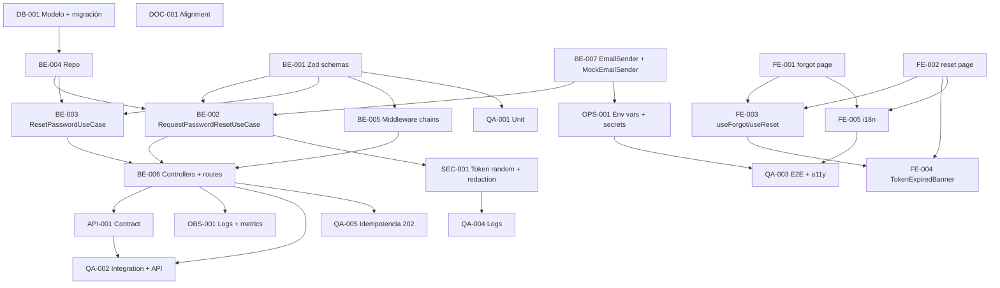

# Development Tasks — PB-P1-004 / US-004: Recuperar mi contraseña vía email

## 1. Metadata

| Field | Value |
|---|---|
| User Story ID | US-004 |
| Source User Story | `management/user-stories/US-004-recover-password.md` |
| Source Technical Specification | `management/technical-specs/P1/PB-P1-004/US-004-technical-spec.md` |
| Decision Resolution Artifact | `management/user-stories/decision-resolutions/US-004-decision-resolution.md` |
| Priority | P1 |
| Backlog ID | PB-P1-004 |
| Backlog Title | Recuperación de contraseña |
| Backlog Execution Order | Cuarto ítem de P1 |
| User Story Position in Backlog Item | 1 de 1 |
| Related User Stories in Backlog Item | US-004 |
| Epic | EPIC-AUTH-001 — Authentication & User Access |
| Backlog Item Dependencies | PB-P0-001, PB-P0-006, PB-P0-007, PB-P1-003 |
| Feature | Recuperación de contraseña |
| Module / Domain | Auth |
| Backlog Alignment Status | Found |
| Task Breakdown Status | Ready for Sprint Planning |
| Created Date | 2026-06-25 |
| Last Updated | 2026-06-25 |

---

## 2. Source Validation

| Source | Found | Used | Notes |
|---|---|---|---|
| User Story | Yes | Yes | `Approved with Minor Notes` |
| Technical Specification | Yes | Yes | `Ready for Task Breakdown` |
| Decision Resolution Artifact | Yes | Yes | 4 decisiones PO/BA |
| Product Backlog Prioritized | Yes | Yes | PB-P1-004 mapeado |
| ADRs | Yes | Yes | ADR-SEC-001, ADR-SEC-003 |

---

## 3. Backlog Execution Context

### Parent Backlog Item

PB-P1-004 entrega la recuperación autoservida con email simulado. Habilita el cierre del bloque P1 de auth.

### Execution Order Rationale

US-004 ejecuta después de PB-P1-003 porque reutiliza `CaptchaService`, `rateLimitMiddleware`, error envelope y `argon2id` (definidos por PB-P0-006/PB-P0-007 y US-001/US-003).

### Related User Stories in Same Backlog Item

| User Story | Role in Backlog Item | Suggested Order |
|---|---|---|
| US-004 | Recuperación de contraseña | 1 |

---

## 4. Task Breakdown Summary

| Area | Number of Tasks | Notes |
|---|---:|---|
| Backend (BE) | 6 | Schemas, repo, use cases, controllers, middleware chain |
| API Contract (API) | 1 | Contrato OpenAPI |
| Database / Prisma (DB) | 1 | Modelo + migración `password_reset_tokens` |
| Frontend (FE) | 5 | Pages, forms, mutations, captcha, i18n |
| Security / Authorization (SEC) | 1 | Token random + redacción de logs |
| Observability / Audit (OBS) | 1 | Eventos y métricas |
| Notifications (BE complementario) | 1 | `EmailSender` puerto + `MockEmailSender` |
| QA / Testing (QA) | 5 | Unit, integration, API, E2E, security/redacción + a11y |
| DevOps / Environment (OPS) | 1 | Variables, secrets, adapter por entorno |
| Documentation / Traceability (DOC) | 1 | Alignment Doc 19 §11 + SEC-POL-AUTH-005 |

**Total: 23 tareas**

---

## 5. Traceability Matrix

| Acceptance Criterion | Technical Spec Section | Task IDs |
|---|---|---|
| AC-01 | §7, §9, §10, §12 | TASK-PB-P1-004-US-004-BE-001..006, BE-007, API-001, SEC-001, QA-001..003 |
| AC-02 | §7, §10, §12 | TASK-PB-P1-004-US-004-BE-003, BE-006, DB-001, SEC-001, QA-001..003 |
| AC-03 | §7, §14 | TASK-PB-P1-004-US-004-BE-002, OBS-001, QA-002 |
| AC-04 | §7, §12 | TASK-PB-P1-004-US-004-BE-005, OPS-001, QA-003 |
| AC-05 | §7, §8 | TASK-PB-P1-004-US-004-BE-001, FE-003, QA-001, QA-003 |
| EC-01 | §7, §9 | TASK-PB-P1-004-US-004-BE-003, BE-006, FE-004, QA-003 |
| EC-02 | §7 | TASK-PB-P1-004-US-004-BE-003, QA-003 |
| EC-03 | §7 | TASK-PB-P1-004-US-004-BE-003, QA-003 |

---

## 6. Development Tasks

### TASK-PB-P1-004-US-004-DB-001 — Modelo Prisma + migración `password_reset_tokens`

| Field | Value |
|---|---|
| Area | Database / Prisma |
| Type | Implementation |
| Priority | Must |
| Estimate | S |
| Depends On | — |
| Source AC(s) | AC-01, AC-02 |
| Technical Spec Section(s) | §10 |
| Backlog ID | PB-P1-004 |
| User Story ID | US-004 |
| Owner Role | Backend |
| Status | To Do |

#### Objective

Definir el modelo Prisma `PasswordResetToken` y la migración con índices descritos en el spec.

#### Scope

##### Include

- Update de `prisma/schema.prisma`.
- Migración reversible (`<timestamp>_create_password_reset_tokens`).
- Índices `@@unique([tokenHash])`, `@@index([userId])`, `@@index([expiresAt])`.

##### Exclude

- Job de limpieza de expirados.

#### Acceptance Criteria Covered

AC-01, AC-02.

#### Definition of Done

- [ ] Migración aplicada.
- [ ] Generación de cliente Prisma verificada.

---

### TASK-PB-P1-004-US-004-BE-001 — Definir schemas Zod (`ForgotPasswordRequestSchema`, `ResetPasswordRequestSchema`)

| Field | Value |
|---|---|
| Area | Backend |
| Type | Implementation |
| Priority | Must |
| Estimate | XS |
| Depends On | — |
| Source AC(s) | AC-01, AC-05 |
| Technical Spec Section(s) | §7 (DTOs / Schemas) |
| Backlog ID | PB-P1-004 |
| User Story ID | US-004 |
| Owner Role | Backend |
| Status | To Do |

#### Objective

Schemas Zod y DTOs inferidos, incluyendo la política Doc 19 §11.2 en `newPassword`.

#### Scope

##### Include

- `apps/api/src/modules/auth/application/schemas/{Forgot,Reset}PasswordRequestSchema.ts`.

##### Exclude

- Validación de captcha (middleware).

#### Acceptance Criteria Covered

AC-01, AC-05.

#### Definition of Done

- [ ] Schemas + tests unitarios.

---

### TASK-PB-P1-004-US-004-BE-002 — `RequestPasswordResetUseCase`

| Field | Value |
|---|---|
| Area | Backend |
| Type | Implementation |
| Priority | Must |
| Estimate | M |
| Depends On | TASK-PB-P1-004-US-004-BE-001, BE-004, BE-007, DB-001 |
| Source AC(s) | AC-01, AC-03 |
| Technical Spec Section(s) | §7 (Use Cases), §14 |
| Backlog ID | PB-P1-004 |
| User Story ID | US-004 |
| Owner Role | Backend |
| Status | To Do |

#### Objective

Use case que orquesta: captcha verificado → lookup de `User` por email CI → si existe, genera token random ≥32 bytes, hashea (sha256) y persiste con TTL 30 min → invoca `EmailSender`. Responde "void" al controlador, que siempre emite `202`.

#### Scope

##### Include

- `apps/api/src/modules/auth/application/use-cases/RequestPasswordResetUseCase.ts`.
- Logs `auth.reset.requested` / `.no_email` / `.authenticated`.

##### Exclude

- Cambios al captcha middleware.

#### Acceptance Criteria Covered

AC-01, AC-03.

#### Definition of Done

- [ ] Tests unitarios cubren existente/inexistente/captcha.

---

### TASK-PB-P1-004-US-004-BE-003 — `ResetPasswordUseCase` con transacción atómica

| Field | Value |
|---|---|
| Area | Backend |
| Type | Implementation |
| Priority | Must |
| Estimate | M |
| Depends On | TASK-PB-P1-004-US-004-BE-001, BE-004, DB-001 |
| Source AC(s) | AC-02, EC-01..03 |
| Technical Spec Section(s) | §7, §10, §12 |
| Backlog ID | PB-P1-004 |
| User Story ID | US-004 |
| Owner Role | Backend |
| Status | To Do |

#### Objective

Use case que recupera el token por hash, valida política Doc 19 §11.2, hashea con `argon2id` y aplica el cambio en una transacción Prisma con marcado `consumed_at`.

#### Scope

##### Include

- `apps/api/src/modules/auth/application/use-cases/ResetPasswordUseCase.ts`.
- Mapeo de errores a `400 TOKEN_USED/INVALID`, `410 GONE_TOKEN_EXPIRED`, `422 VALIDATION_ERROR`.

##### Exclude

- Invalidación de otras sesiones (Out of Scope).

#### Acceptance Criteria Covered

AC-02, EC-01..03.

#### Definition of Done

- [ ] Tests unitarios cubren cada rama.

---

### TASK-PB-P1-004-US-004-BE-004 — `PasswordResetTokenRepository`

| Field | Value |
|---|---|
| Area | Backend |
| Type | Implementation |
| Priority | Must |
| Estimate | S |
| Depends On | TASK-PB-P1-004-US-004-DB-001 |
| Source AC(s) | AC-01, AC-02 |
| Technical Spec Section(s) | §7 (Repository / Persistence) |
| Backlog ID | PB-P1-004 |
| User Story ID | US-004 |
| Owner Role | Backend |
| Status | To Do |

#### Objective

Repositorio Prisma con `create`, `findByHash`, `markConsumed` (recibe `tx` o crea propia).

#### Scope

##### Include

- `apps/api/src/modules/auth/infrastructure/PasswordResetTokenRepository.ts`.

##### Exclude

- Job de limpieza.

#### Acceptance Criteria Covered

AC-01, AC-02.

#### Definition of Done

- [ ] Tests con Prisma Test Client.

---

### TASK-PB-P1-004-US-004-BE-005 — Cadena de middlewares `/reset-request` y `/reset`

| Field | Value |
|---|---|
| Area | Backend |
| Type | Implementation |
| Priority | Must |
| Estimate | S |
| Depends On | TASK-PB-P1-004-US-004-BE-001 |
| Source AC(s) | AC-04, EC-01..03 |
| Technical Spec Section(s) | §5, §7 |
| Backlog ID | PB-P1-004 |
| User Story ID | US-004 |
| Owner Role | Backend |
| Status | To Do |

#### Objective

Configurar las dos cadenas: `correlation → logging → rateLimit('auth.reset.request') → captchaConditionalMiddleware → validation(Forgot) → controller` y `correlation → logging → rateLimit('auth.reset') → validation(Reset) → controller`.

#### Scope

##### Include

- Buckets de rate limit `auth.reset.request` (3/email/h) y `auth.reset` (5/IP/10min).

##### Exclude

- Implementación de `rateLimitMiddleware` (heredada).

#### Acceptance Criteria Covered

AC-04, EC-01..03.

#### Definition of Done

- [ ] Cadenas operativas.

---

### TASK-PB-P1-004-US-004-BE-006 — `AuthController.{requestPasswordReset,resetPassword}` y rutas

| Field | Value |
|---|---|
| Area | Backend |
| Type | Implementation |
| Priority | Must |
| Estimate | S |
| Depends On | TASK-PB-P1-004-US-004-BE-002, BE-003, BE-005 |
| Source AC(s) | AC-01, AC-02 |
| Technical Spec Section(s) | §7 (Controllers), §9 |
| Backlog ID | PB-P1-004 |
| User Story ID | US-004 |
| Owner Role | Backend |
| Status | To Do |

#### Objective

Controladores delgados + binding en el router `auth`.

#### Scope

##### Include

- Respuesta `202` neutra en `/reset-request`; `204` en `/reset`.

##### Exclude

- Implementación de `errorHandler` global.

#### Acceptance Criteria Covered

AC-01, AC-02.

#### Definition of Done

- [ ] Endpoints registrados.

---

### TASK-PB-P1-004-US-004-BE-007 — `EmailSender` puerto + `MockEmailSender`

| Field | Value |
|---|---|
| Area | Backend (Notifications) |
| Type | Implementation |
| Priority | Must |
| Estimate | S |
| Depends On | — |
| Source AC(s) | AC-01 |
| Technical Spec Section(s) | §5, §7, §14 |
| Backlog ID | PB-P1-004 |
| User Story ID | US-004 |
| Owner Role | Backend |
| Status | To Do |

#### Objective

Puerto `EmailSender.sendPasswordResetEmail({ to, link, locale })` y adapter `MockEmailSender` con log estructurado.

#### Scope

##### Include

- `apps/api/src/modules/notifications/EmailSender.ts`, `MockEmailSender.ts`.
- Selección por entorno con `EMAIL_SENDER_PROVIDER=mock|real`.

##### Exclude

- Adapter real (SMTP). Reservado a ADR futuro.

#### Acceptance Criteria Covered

AC-01.

#### Definition of Done

- [ ] Log estructurado con destinatario y link visibles en CI.

---

### TASK-PB-P1-004-US-004-API-001 — Contrato OpenAPI `/auth/password/reset-request` y `/reset`

| Field | Value |
|---|---|
| Area | API Contract |
| Type | Documentation |
| Priority | Must |
| Estimate | XS |
| Depends On | TASK-PB-P1-004-US-004-BE-006 |
| Source AC(s) | AC-01, AC-02, EC-01..03 |
| Technical Spec Section(s) | §9 |
| Backlog ID | PB-P1-004 |
| User Story ID | US-004 |
| Owner Role | Backend / Tech Lead |
| Status | To Do |

#### Objective

Publicar el contrato OpenAPI con request/response y catálogo de errores.

#### Scope

##### Include

- Sección OpenAPI.

##### Exclude

- Implementación.

#### Acceptance Criteria Covered

AC-01, AC-02, EC-01..03.

#### Definition of Done

- [ ] Contrato publicado.

---

### TASK-PB-P1-004-US-004-FE-001 — Página `/[locale]/auth/forgot-password`

| Field | Value |
|---|---|
| Area | Frontend |
| Type | Implementation |
| Priority | Must |
| Estimate | S |
| Depends On | — |
| Source AC(s) | AC-01 |
| Technical Spec Section(s) | §8 (Routes / Pages) |
| Backlog ID | PB-P1-004 |
| User Story ID | US-004 |
| Owner Role | Frontend |
| Status | To Do |

#### Objective

Página con `ForgotPasswordForm` + captcha + mensaje neutro siempre.

#### Scope

##### Include

- `app/[locale]/auth/forgot-password/page.tsx`.

##### Exclude

- Reset (FE-002).

#### Acceptance Criteria Covered

AC-01.

#### Definition of Done

- [ ] Renderiza en 4 locales.

---

### TASK-PB-P1-004-US-004-FE-002 — Página `/[locale]/auth/reset-password`

| Field | Value |
|---|---|
| Area | Frontend |
| Type | Implementation |
| Priority | Must |
| Estimate | S |
| Depends On | — |
| Source AC(s) | AC-02, AC-05 |
| Technical Spec Section(s) | §8 |
| Backlog ID | PB-P1-004 |
| User Story ID | US-004 |
| Owner Role | Frontend |
| Status | To Do |

#### Objective

Página con `ResetPasswordForm`, lectura de `token` desde query string y manejo de la política Doc 19 §11.2 en cliente.

#### Scope

##### Include

- `app/[locale]/auth/reset-password/page.tsx`.

##### Exclude

- `TokenExpiredBanner` (FE-004).

#### Acceptance Criteria Covered

AC-02, AC-05.

#### Definition of Done

- [ ] Renderiza y valida en cliente.

---

### TASK-PB-P1-004-US-004-FE-003 — Mutations `useForgotPassword` + `useResetPassword`

| Field | Value |
|---|---|
| Area | Frontend |
| Type | Implementation |
| Priority | Must |
| Estimate | S |
| Depends On | TASK-PB-P1-004-US-004-FE-001, FE-002 |
| Source AC(s) | AC-01, AC-02, AC-04, AC-05 |
| Technical Spec Section(s) | §8 |
| Backlog ID | PB-P1-004 |
| User Story ID | US-004 |
| Owner Role | Frontend |
| Status | To Do |

#### Objective

Mutations TanStack Query con manejo de error envelope (`410`, `400`, `422`, `429`) y redirección post-éxito en reset.

#### Scope

##### Include

- `apps/web/lib/hooks/{useForgotPassword,useResetPassword}.ts`.
- `authApi.requestPasswordReset`, `authApi.resetPassword`.

##### Exclude

- Captcha widget (heredado).

#### Acceptance Criteria Covered

AC-01, AC-02, AC-04, AC-05.

#### Definition of Done

- [ ] Tests con MSW.

---

### TASK-PB-P1-004-US-004-FE-004 — `TokenExpiredBanner` con CTA "Solicitar nuevo enlace"

| Field | Value |
|---|---|
| Area | Frontend |
| Type | Implementation |
| Priority | Must |
| Estimate | XS |
| Depends On | TASK-PB-P1-004-US-004-FE-002, FE-003 |
| Source AC(s) | EC-01 |
| Technical Spec Section(s) | §8 |
| Backlog ID | PB-P1-004 |
| User Story ID | US-004 |
| Owner Role | Frontend |
| Status | To Do |

#### Objective

Mostrar banner accesible cuando el backend responde `410` con CTA para retornar a forgot-password.

#### Scope

##### Include

- `apps/web/components/auth/TokenExpiredBanner.tsx`.

##### Exclude

- Lógica de mutation.

#### Acceptance Criteria Covered

EC-01.

#### Definition of Done

- [ ] Banner accesible (`aria-live`).

---

### TASK-PB-P1-004-US-004-FE-005 — i18n `forgotPassword.*` / `resetPassword.*`

| Field | Value |
|---|---|
| Area | Frontend |
| Type | Implementation |
| Priority | Must |
| Estimate | XS |
| Depends On | TASK-PB-P1-004-US-004-FE-001, FE-002 |
| Source AC(s) | AC-01, AC-02 |
| Technical Spec Section(s) | §8 (i18n) |
| Backlog ID | PB-P1-004 |
| User Story ID | US-004 |
| Owner Role | Frontend |
| Status | To Do |

#### Objective

Catálogos de mensajes para 4 locales.

#### Scope

##### Include

- `apps/web/messages/{es-LATAM,es-ES,pt,en}/{forgotPassword,resetPassword}.json`.

##### Exclude

- Cadenas relacionadas al login (US-003).

#### Acceptance Criteria Covered

AC-01, AC-02.

#### Definition of Done

- [ ] Catálogos completos.

---

### TASK-PB-P1-004-US-004-SEC-001 — Token random + redacción de logs

| Field | Value |
|---|---|
| Area | Security / Authorization |
| Type | Implementation |
| Priority | Must |
| Estimate | XS |
| Depends On | TASK-PB-P1-004-US-004-BE-002, BE-007 |
| Source AC(s) | AC-01, AC-02 |
| Technical Spec Section(s) | §12 (Sensitive Data Handling) |
| Backlog ID | PB-P1-004 |
| User Story ID | US-004 |
| Owner Role | Security Lead / Backend |
| Status | To Do |

#### Objective

Garantizar `randomBytes(32)` para el token y redacción de `token`, `newPassword`, `captchaToken` en el logger.

#### Scope

##### Include

- Configurar logger con redacción extendida (`token`, `newPassword`, `captchaToken`).

##### Exclude

- Cambios al transporte del logger.

#### Acceptance Criteria Covered

AC-01, AC-02.

#### Definition of Done

- [ ] Test que falla si aparece un campo sensible.

---

### TASK-PB-P1-004-US-004-OBS-001 — Eventos y métricas

| Field | Value |
|---|---|
| Area | Observability / Audit |
| Type | Implementation |
| Priority | Must |
| Estimate | XS |
| Depends On | TASK-PB-P1-004-US-004-BE-006 |
| Source AC(s) | AC-01, AC-02, AC-03 |
| Technical Spec Section(s) | §14 |
| Backlog ID | PB-P1-004 |
| User Story ID | US-004 |
| Owner Role | Backend / Observability |
| Status | To Do |

#### Objective

Emitir eventos `auth.reset.*` con `correlationId` y métricas asociadas.

#### Scope

##### Include

- Logger + métricas.

##### Exclude

- Dashboards.

#### Acceptance Criteria Covered

AC-01, AC-02, AC-03.

#### Definition of Done

- [ ] Eventos visibles.

---

### TASK-PB-P1-004-US-004-OPS-001 — Variables, secrets y adapter de email por entorno

| Field | Value |
|---|---|
| Area | DevOps / Environment |
| Type | Setup |
| Priority | Must |
| Estimate | S |
| Depends On | TASK-PB-P1-004-US-004-BE-007 |
| Source AC(s) | AC-04 |
| Technical Spec Section(s) | §17 |
| Backlog ID | PB-P1-004 |
| User Story ID | US-004 |
| Owner Role | DevOps |
| Status | To Do |

#### Objective

Definir y aplicar `PASSWORD_RESET_TOKEN_TTL_MIN=30`, `EMAIL_SENDER_PROVIDER=mock`, `RATE_LIMIT_RESET_REQUEST_PER_EMAIL_PER_HOUR=3`, `RATE_LIMIT_RESET_PER_IP_PER_10MIN=5`. Bandera de warning si Mock activo en prod.

#### Scope

##### Include

- `.env.example`, manifiestos por entorno.

##### Exclude

- Provisión de secrets (DevOps Lead).

#### Acceptance Criteria Covered

AC-04.

#### Definition of Done

- [ ] Variables documentadas.

---

### TASK-PB-P1-004-US-004-QA-001 — Unit tests (use cases, schemas, repo)

| Field | Value |
|---|---|
| Area | QA / Testing |
| Type | Test |
| Priority | Must |
| Estimate | S |
| Depends On | TASK-PB-P1-004-US-004-BE-001..004 |
| Source AC(s) | AC-01, AC-02, AC-03, AC-05 |
| Technical Spec Section(s) | §13 (Unit) |
| Backlog ID | PB-P1-004 |
| User Story ID | US-004 |
| Owner Role | QA |
| Status | To Do |

#### Objective

Cubrir ambos use cases, schemas, repo y `MockEmailSender` con Vitest.

#### Scope

##### Include

- Tests unitarios respectivos.

##### Exclude

- API tests (QA-002).

#### Acceptance Criteria Covered

AC-01, AC-02, AC-03, AC-05.

#### Definition of Done

- [ ] Cobertura ≥ 85% del módulo.

---

### TASK-PB-P1-004-US-004-QA-002 — Integration + API tests

| Field | Value |
|---|---|
| Area | QA / Testing |
| Type | Test |
| Priority | Must |
| Estimate | M |
| Depends On | TASK-PB-P1-004-US-004-BE-006, API-001 |
| Source AC(s) | AC-01..03, EC-01..03 |
| Technical Spec Section(s) | §13 (Integration / API) |
| Backlog ID | PB-P1-004 |
| User Story ID | US-004 |
| Owner Role | QA |
| Status | To Do |

#### Objective

Verificar cadenas de middlewares y respuestas del error envelope completo, incluyendo idempotencia `202`.

#### Scope

##### Include

- Tests Supertest para `202`, `204`, `400`, `410`, `422`, `429`.
- Transacción atómica con rollback simulado.

##### Exclude

- E2E (QA-003).

#### Acceptance Criteria Covered

AC-01..03, EC-01..03.

#### Definition of Done

- [ ] Todas las respuestas verificadas.

---

### TASK-PB-P1-004-US-004-QA-003 — E2E + accesibilidad + rate limit

| Field | Value |
|---|---|
| Area | QA / Testing |
| Type | Test |
| Priority | Must |
| Estimate | M |
| Depends On | TASK-PB-P1-004-US-004-FE-005, OPS-001 |
| Source AC(s) | AC-01, AC-02, AC-04, EC-01 |
| Technical Spec Section(s) | §13 (E2E, Accessibility) |
| Backlog ID | PB-P1-004 |
| User Story ID | US-004 |
| Owner Role | QA |
| Status | To Do |

#### Objective

Flujo completo Playwright: `forgot` → capturar link desde log de `MockEmailSender` → `reset` → `login`. Caso `410`. Validar rate limit por email/IP. `axe` sobre las dos páginas.

#### Scope

##### Include

- `e2e/forgot-reset-login.spec.ts`.

##### Exclude

- Tests de SMTP real.

#### Acceptance Criteria Covered

AC-01, AC-02, AC-04, EC-01.

#### Definition of Done

- [ ] E2E estable y accesible.

---

### TASK-PB-P1-004-US-004-QA-004 — Test de redacción de logs

| Field | Value |
|---|---|
| Area | QA / Testing |
| Type | Test |
| Priority | Must |
| Estimate | XS |
| Depends On | TASK-PB-P1-004-US-004-SEC-001 |
| Source AC(s) | AC-01, AC-02 |
| Technical Spec Section(s) | §13 (Security) |
| Backlog ID | PB-P1-004 |
| User Story ID | US-004 |
| Owner Role | QA / Security |
| Status | To Do |

#### Objective

Falla si `token`, `newPassword` o `captchaToken` aparecen en logs.

#### Scope

##### Include

- Test sobre logger.

##### Exclude

- Penetration testing.

#### Acceptance Criteria Covered

AC-01, AC-02.

#### Definition of Done

- [ ] Test verde.

---

### TASK-PB-P1-004-US-004-QA-005 — Idempotencia `202` y respuestas neutras

| Field | Value |
|---|---|
| Area | QA / Testing |
| Type | Test |
| Priority | Must |
| Estimate | XS |
| Depends On | TASK-PB-P1-004-US-004-BE-006 |
| Source AC(s) | AC-01, AC-03 |
| Technical Spec Section(s) | §13 (Security) |
| Backlog ID | PB-P1-004 |
| User Story ID | US-004 |
| Owner Role | QA |
| Status | To Do |

#### Objective

Verificar SEC-POL-AUTH-005: `/reset-request` siempre responde `202` con cuerpo idéntico, exista o no el email.

#### Scope

##### Include

- Comparación de respuestas y headers.

##### Exclude

- Timing (no obligatorio en este endpoint).

#### Acceptance Criteria Covered

AC-01, AC-03.

#### Definition of Done

- [ ] Test verde.

---

### TASK-PB-P1-004-US-004-DOC-001 — Documentation Alignment (Doc 19 §11 + SEC-POL-AUTH-005)

| Field | Value |
|---|---|
| Area | Documentation / Traceability |
| Type | Documentation |
| Priority | Should |
| Estimate | XS |
| Depends On | — |
| Source AC(s) | AC-01 |
| Technical Spec Section(s) | §16 |
| Backlog ID | PB-P1-004 |
| User Story ID | US-004 |
| Owner Role | Tech Lead / BA |
| Status | To Do |

#### Objective

Anotar en Doc 19 §11 el override formal a TTL 30 min y en SEC-POL-AUTH-005 el cambio a `202 Accepted`.

#### Scope

##### Include

- Notas en Doc 19 con referencias a US-004 y PB-P1-004.

##### Exclude

- Creación de ADRs.

#### Acceptance Criteria Covered

AC-01.

#### Definition of Done

- [ ] Notas insertadas.

---

## 7. Required QA Tasks

| Task ID | Test Type | Purpose |
|---|---|---|
| TASK-PB-P1-004-US-004-QA-001 | Unit | Use cases, schemas, repo, mock sender |
| TASK-PB-P1-004-US-004-QA-002 | Integration + API | Middlewares + catálogo de errores + transacción |
| TASK-PB-P1-004-US-004-QA-003 | E2E + Accessibility | Forgot → reset → login + axe + `410` + rate limit |
| TASK-PB-P1-004-US-004-QA-004 | Security | Redacción de logs |
| TASK-PB-P1-004-US-004-QA-005 | Security | Idempotencia `202` |

---

## 8. Required Security Tasks

| Task ID | Security Concern | Purpose |
|---|---|---|
| TASK-PB-P1-004-US-004-SEC-001 | Token random + redacción de logs | Evitar fuga de secretos |
| TASK-PB-P1-004-US-004-QA-004 | Logs | Validar la redacción |
| TASK-PB-P1-004-US-004-QA-005 | Anti-enumeración | Idempotencia `202` |

---

## 9. Required Seed / Demo Tasks

| Task ID | Seed/Demo Concern | Purpose |
|---|---|---|
| TASK-PB-P1-004-US-004-QA-003 | E2E con seed | Reutiliza usuarios seed |

---

## 10. Observability / Audit Tasks

| Task ID | Concern | Purpose |
|---|---|---|
| TASK-PB-P1-004-US-004-OBS-001 | Logs + métricas | Auditar `auth.reset.*` |

---

## 11. Documentation / Traceability Tasks

| Task ID | Document / Artifact | Purpose |
|---|---|---|
| TASK-PB-P1-004-US-004-API-001 | Doc 16 §22.3 (contrato) | Contrato OpenAPI |
| TASK-PB-P1-004-US-004-DOC-001 | Doc 19 §11 + SEC-POL-AUTH-005 | Documentation Alignment Required |

---

## 12. Dependency Graph

---

## 13. Suggested Implementation Order

### Phase 1 — Foundation

- DB-001 (modelo + migración)
- BE-001 (schemas)
- BE-007 (`EmailSender` + `MockEmailSender`)

### Phase 2 — Core Implementation

- BE-004 (repo)
- BE-002 (`RequestPasswordResetUseCase`)
- BE-003 (`ResetPasswordUseCase`)
- BE-005 (middleware chains)
- BE-006 (controllers + routes)
- API-001 (contrato)
- FE-001..005 en paralelo

### Phase 3 — Validation / Security / QA

- SEC-001
- OBS-001
- OPS-001
- QA-001..005

### Phase 4 — Documentation / Review

- DOC-001

---

## 14. Risks & Mitigations

| Risk | Impact | Mitigation | Related Task |
|---|---|---|---|
| `MockEmailSender` activo en prod | Falsa señal de email enviado | Warning startup; gate por entorno | OPS-001 |
| Token plano en logs | Toma de cuenta | Redacción + test | SEC-001, QA-004 |
| Transacción no atómica en `/reset` | Inconsistencia password vs token | Tx Prisma + test que provoca rollback | BE-003, QA-002 |
| Rate limit mal configurado | Bloqueo legítimo / ineficaz | Variables por entorno + tests | OPS-001, QA-003 |

---

## 15. Out of Scope Confirmation

- SMTP real obligatorio (mock por defecto).
- Invalidación de otras sesiones.
- Regla "≠ anterior".
- SMS / WhatsApp / 2FA / preguntas de seguridad.
- Cambios al esquema `users` más allá de `password_hash`.

---

## 16. Readiness for Sprint Planning

| Check | Status |
|---|---|
| Product Backlog mapping found | Pass |
| Every AC maps to tasks | Pass |
| Technical Spec used when available | Pass |
| QA tasks included | Pass |
| Security tasks included if applicable | Pass |
| Seed/demo tasks included if applicable | Pass |
| Observability tasks included if applicable | Pass |
| Documentation tasks included if applicable | Pass |
| Task dependencies clear | Pass |
| Tasks small enough | Pass |
| Ready for Sprint Planning | Yes |

---

## 17. Final Recommendation

`Ready for Sprint Planning`.

US-004 cuenta con Technical Specification `Ready for Task Breakdown`, decisiones PO/BA formalizadas, schema y dependencias resueltas. 23 tareas cubren AC-01..05 y EC-01..03 con QA, seguridad, observabilidad, ops y documentación. Próximo paso: incluir en Sprint Planning.
