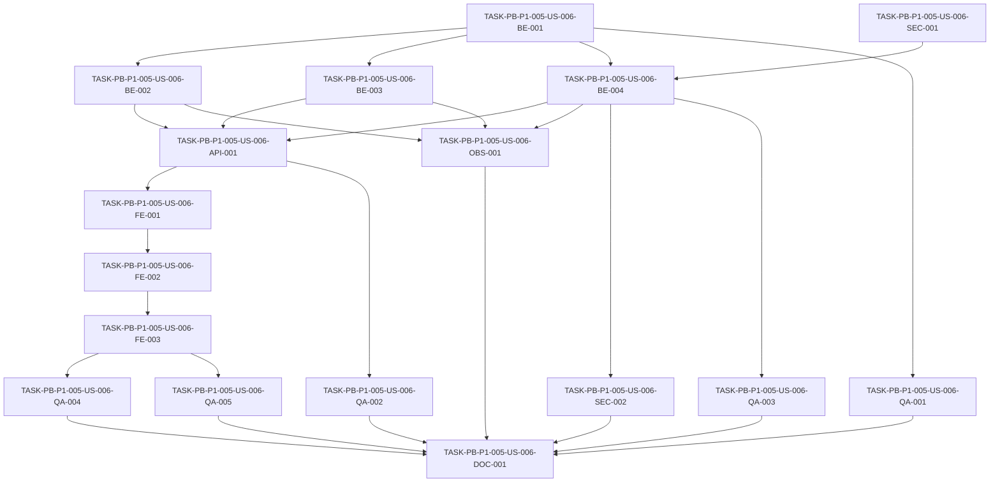

# Development Tasks — PB-P1-005 / US-006: Ver y editar mi perfil propio

## 1. Metadata

| Field | Value |
|---|---|
| User Story ID | US-006 |
| Source User Story | `management/user-stories/US-006-view-edit-own-profile.md` |
| Source Technical Specification | `management/technical-specs/P1/PB-P1-005/US-006-technical-spec.md` |
| Decision Resolution Artifact | No requerido (decisiones formalizadas en PB-P1-005 y `PO/BA Decisions Applied`) |
| Priority | P1 |
| Backlog ID | PB-P1-005 |
| Backlog Title | Perfil propio + cambio de idioma |
| Backlog Execution Order | 23 (18 P0 + PB-P1-001..004 = 22; 5ª de P1) |
| User Story Position in Backlog Item | 1 de 2 |
| Related User Stories in Backlog Item | US-006 (núcleo), US-007 (companion — selector i18n con nombres nativos) |
| Epic | EPIC-AUTH-001 — Authentication & User Access |
| Backlog Item Dependencies | PB-P1-003 (sesión activa); transitivas: PB-P0-004 (REST foundation), PB-P0-006 (cookies HTTP-only), PB-P0-007 (rate limit + argon2), PB-P0-008 (RBAC + ownership), PB-P0-012/013 (FE bootstrap + TanStack Query + i18n) |
| Feature | Gestión de perfil propio + cambio de idioma |
| Module / Domain | Auth / Users |
| Backlog Alignment Status | Found |
| Task Breakdown Status | Ready for Sprint Planning |
| Created Date | 2026-06-25 |
| Last Updated | 2026-06-25 |

---

## 2. Source Validation

| Source | Found | Used | Notes |
|---|---|---|---|
| User Story | Yes | Yes | `Approved with Minor Notes`, status válido para tasks. |
| Technical Specification | Yes | Yes | `Ready for Task Breakdown`. Fuente primaria. |
| Decision Resolution Artifact | No | No | No fue necesario; sin blockers. |
| Product Backlog Prioritized | Yes | Yes | PB-P1-005 ubicado en posición 23. |
| ADRs | Yes | Yes | ADR-SEC-001 (token/injection), ADR-SEC-003 (argon2id). |

---

## 3. Backlog Execution Context

### Parent Backlog Item

`PB-P1-005 — Perfil propio + cambio de idioma`. Agrupa la pantalla `/[locale]/profile` para organizer/vendor/admin. Incluye lectura/edición de perfil mínimo, cambio inmediato de idioma y cambio de contraseña con invalidación de "otras sesiones" (PB-P1-005 acceptance summary + línea 120).

### Execution Order Rationale

Las 18 historias P0 entregan la fundación (DB, REST, cookies, captcha, RBAC, FE bootstrap, TanStack Query, i18n, seed, CI). En P1, primero se entregan registro (PB-P1-001/002) y autenticación operativa (PB-P1-003, PB-P1-004). Recién entonces existe sesión real, `argon2.verify` operativo y mecanismo de invalidación validado por US-005, lo que habilita US-006 como primera de PB-P1-005. US-007 (companion) se ejecuta a continuación reutilizando los componentes UI introducidos aquí.

### Related User Stories in Same Backlog Item

| User Story | Role in Backlog Item | Suggested Order |
|---|---|---|
| US-006 — Ver y editar mi perfil propio | Núcleo: lectura/edición + cambio de idioma + cambio de contraseña. | 1 |
| US-007 — Selector de idioma con nombres nativos (companion) | Refina UX i18n y casos de prueba específicos de idioma. | 2 |

---

## 4. Task Breakdown Summary

| Area | Number of Tasks | Notes |
|---|---:|---|
| Backend (BE) | 4 | DTOs/policy + GET/PATCH + endpoint idioma + ChangePassword |
| API Contract (API) | 1 | Registro de rutas y middleware chain |
| Frontend (FE) | 3 | API client + componentes + página con re-hidratación i18n |
| Security (SEC) | 2 | Rate limit + verificación de redacción |
| QA / Testing (QA) | 5 | Unit + API + integration + E2E + a11y |
| Observability (OBS) | 1 | Eventos estructurados con correlationId |
| Documentation (DOC) | 1 | `tasks.md` consolidado de PB-P1-005 |
| AI / PromptOps | 0 | No aplica |
| Database / Prisma | 0 | Sin migraciones nuevas |
| Seed / Demo | 0 | Sin cambios al seed |
| DevOps | 0 | Cubierto por SEC-001 (rate limit) y la chain existente |
| **Total** | **17** | |

---

## 5. Traceability Matrix

| Acceptance Criterion | Technical Spec Section | Task IDs |
|---|---|---|
| AC-01 — Ver perfil | §6, §7 (Use Cases / Controllers), §8 (Page / `useMe`), §9 (GET) | BE-002, API-001, FE-001, FE-002, FE-003, QA-002, QA-004 |
| AC-02 — Editar datos básicos | §6, §7 (UpdateOwnProfile + whitelist), §8 (`ProfileForm`), §9 (PATCH) | BE-001, BE-002, API-001, FE-001, FE-002, FE-003, QA-001, QA-002, QA-004, OBS-001 |
| AC-03 — Cambio inmediato de idioma | §6, §7 (UpdatePreferredLanguage), §8 (`LanguageSelector` + re-hidratación), §9 (PATCH /preferred-language) | BE-001, BE-003, API-001, FE-001, FE-002, FE-003, QA-002, QA-004 |
| AC-04 — Cambiar contraseña | §6, §7 (ChangePassword transacción), §9 (POST /change-password), §12 (Security), §14 (Observabilidad) | BE-001, BE-004, API-001, SEC-001, SEC-002, FE-001, FE-002, FE-003, QA-001, QA-002, QA-003, QA-004, OBS-001 |
| EC-01 — Email ignorado (whitelist) | §6, §7 (DTO `.strip()`) | BE-001, QA-001, QA-002 |
| EC-02 — `currentPassword` errónea | §7 (use case + error mapping), §12 | BE-004, QA-002, OBS-001 |
| EC-03 — Editar perfil ajeno | §12 (negativos), API-001 routing | API-001, QA-002 |
| EC-04 — Política de password | §7 (passwordPolicySchema), §12 | BE-001, BE-004, QA-001, QA-002 |
| EC-05 — Idioma no soportado | §7 (enum Zod), §8 (selector cerrado) | BE-001, BE-003, FE-002, QA-002 |

---

## 6. Development Tasks

### TASK-PB-P1-005-US-006-BE-001 — DTOs Zod, `passwordPolicySchema` y utilidad de whitelist

| Field | Value |
|---|---|
| Area | Backend |
| Type | Implementation |
| Priority | Must |
| Estimate | S |
| Depends On | PB-P0-007 (`argon2` wrapper, middleware chain) |
| Source AC(s) | AC-02, AC-03, AC-04, EC-01, EC-04, EC-05 |
| Technical Spec Section(s) | §6, §7 (DTOs/Schemas), §12 |
| Backlog ID | PB-P1-005 |
| User Story ID | US-006 |
| Owner Role | Backend |
| Status | To Do |

#### Objective

Crear los schemas Zod (`UpdateProfileRequestDto`, `UpdatePreferredLanguageRequestDto`, `ChangePasswordRequestDto`), el `passwordPolicySchema` (Doc 19 §11.2) y la utilidad/configuración para que el PATCH genérico ignore silenciosamente campos no permitidos (whitelist).

#### Scope

##### Include

- `UpdateProfileRequestDto` con `.strip()` (silent ignore de `email`, `role`, otros) y reglas VR-01 (`name` 2–120), VR-02 (`phone` E.164 nullable opcional), VR-03 (`preferredLanguage` enum).
- `UpdatePreferredLanguageRequestDto` con `.strict()` y enum del set MVP.
- `ChangePasswordRequestDto` con `.strict()` y `passwordPolicySchema` aplicado a `newPassword`.
- `passwordPolicySchema`: ≥10 caracteres, ≥1 letra, ≥1 número (la verificación de "no igual al localpart del email" se ejecuta en el use case porque depende del usuario autenticado).
- Constante `E164_REGEX` documentada con su origen.

##### Exclude

- Integración con `libphonenumber-js` (decisión técnica menor; queda como mejora futura — Tech Spec §17).
- Migraciones de DB.

#### Implementation Notes

- Reutilizar utilidades de validación compartidas creadas en PB-P0-003.
- Los mensajes de error deben permitir i18n (claves estables) y alimentar el error envelope estándar.
- El `passwordPolicySchema` se exporta para uso compartido por backend y, si existe el paquete compartido, por frontend.

#### Acceptance Criteria Covered

- AC-02 (whitelist), AC-03 (enum), AC-04 (política), EC-01, EC-04, EC-05.

#### Definition of Done

- [ ] Schemas exportados desde `src/modules/auth/users-me/dto`.
- [ ] `passwordPolicySchema` con tests unit que cubren longitud, letra, número y caso límite.
- [ ] `UpdateProfileRequestDto.strip()` verificado por unit test (entrada con `email`/`role` → salida sin esos campos, sin error).
- [ ] `UpdatePreferredLanguageRequestDto` rechaza cualquier key extra.

---

### TASK-PB-P1-005-US-006-BE-002 — Use cases y controller para `GET/PATCH /api/v1/users/me`

| Field | Value |
|---|---|
| Area | Backend |
| Type | Implementation |
| Priority | Must |
| Estimate | M |
| Depends On | BE-001 |
| Source AC(s) | AC-01, AC-02, EC-01 |
| Technical Spec Section(s) | §6, §7 (Use Cases / Controllers), §9 |
| Backlog ID | PB-P1-005 |
| User Story ID | US-006 |
| Owner Role | Backend |
| Status | To Do |

#### Objective

Implementar `GetMyProfileUseCase` y `UpdateOwnProfileUseCase` con su controller thin `UsersMeController.getMe` / `updateMe`, devolviendo `UserProfileResponseDto` sin exponer `password_hash`.

#### Scope

##### Include

- `GetMyProfileUseCase` que obtiene el `User` autenticado vía `UserRepository.findById(sessionContext.userId)`.
- `UpdateOwnProfileUseCase` que aplica patch ya validado por Zod y persiste vía `UserRepository.updateProfile`.
- Mapper a `UserProfileResponseDto` con `createdAt`/`updatedAt` en ISO-8601.
- Manejo de errores con el error envelope.

##### Exclude

- Cambio de password.
- Endpoint dedicado de idioma (BE-003).

#### Implementation Notes

- Controller thin: validación → use case → mapper → respuesta.
- Inyectar `UserRepository` por DI.
- Asegurar que `password_hash` jamás se incluye en la respuesta.

#### Acceptance Criteria Covered

- AC-01, AC-02, EC-01.

#### Definition of Done

- [ ] `GET /api/v1/users/me` retorna 200 con el DTO esperado para sesión válida.
- [ ] `PATCH /api/v1/users/me` actualiza sólo campos permitidos.
- [ ] `password_hash` jamás presente en la respuesta.
- [ ] Integration tests unitarios para los use cases con mocks de `UserRepository`.

---

### TASK-PB-P1-005-US-006-BE-003 — `UpdatePreferredLanguageUseCase` + endpoint dedicado

| Field | Value |
|---|---|
| Area | Backend |
| Type | Implementation |
| Priority | Must |
| Estimate | S |
| Depends On | BE-001 |
| Source AC(s) | AC-03, EC-05 |
| Technical Spec Section(s) | §6, §7, §9 |
| Backlog ID | PB-P1-005 |
| User Story ID | US-006 |
| Owner Role | Backend |
| Status | To Do |

#### Objective

Crear el atajo `PATCH /api/v1/users/me/preferred-language` que actualiza únicamente `preferred_language` y devuelve el `UserProfileResponseDto` actualizado.

#### Scope

##### Include

- `UpdatePreferredLanguageUseCase` que invoca `UserRepository.updateProfile({ preferredLanguage })`.
- Controller `UsersMeController.updatePreferredLanguage`.
- Reuso del mapper a `UserProfileResponseDto`.

##### Exclude

- Cambio de otros campos (queda en el PATCH genérico de BE-002).

#### Implementation Notes

- Mantener equivalencia funcional con el PATCH genérico cuando sólo cambia `preferredLanguage`.

#### Acceptance Criteria Covered

- AC-03, EC-05.

#### Definition of Done

- [ ] Endpoint registrado y operativo.
- [ ] Unit tests para enum (NT-05 cubierto a nivel handler).
- [ ] Respuesta refleja `preferred_language` actualizado.

---

### TASK-PB-P1-005-US-006-BE-004 — `ChangePasswordUseCase` con transacción e invalidación de otras sesiones

| Field | Value |
|---|---|
| Area | Backend |
| Type | Implementation |
| Priority | Must |
| Estimate | L |
| Depends On | BE-001, SEC-001 |
| Source AC(s) | AC-04, EC-02, EC-04 |
| Technical Spec Section(s) | §6, §7 (transacción + rollback), §12, §14 |
| Backlog ID | PB-P1-005 |
| User Story ID | US-006 |
| Owner Role | Backend |
| Status | To Do |

#### Objective

Implementar `ChangePasswordUseCase` que verifica `currentPassword` con `argon2.verify`, valida la política completa (incluyendo no-localpart del email del usuario actual), actualiza `password_hash`, invalida las "otras sesiones" del usuario manteniendo la actual, todo dentro de una transacción con rollback ante fallo de la invalidación. Devuelve `204 No Content`.

#### Scope

##### Include

- Verificación de `currentPassword` en tiempo constante.
- Comparación de `newPassword` con `localpart(email)` del usuario autenticado.
- `prisma.$transaction` que combina `updatePasswordHash` con la invalidación de sesiones (operación de servicio); rollback explícito si la invalidación falla.
- Mantenimiento de la cookie de la sesión actual.
- Mapeo de errores: 401 `INVALID_CURRENT_PASSWORD`, 422 `CURRENT_PASSWORD_REQUIRED`, 422 `PASSWORD_POLICY_VIOLATION`.

##### Exclude

- Listado de sesiones, logout selectivo.
- Re-login forzado.

#### Implementation Notes

- Reusar el wrapper `SessionCookieIssuer.invalidateOthers` (o equivalente) consistente con el patrón adoptado en US-005 (Doc 19 §9.6).
- Si la estrategia es lista in-memory, la rollback elimina el cambio en DB y registra `user.password.change.failed` con `reason="SESSION_INVALIDATION_FAILED"`.
- No exponer detalles de la verificación argon2 en logs.

#### Acceptance Criteria Covered

- AC-04, EC-02, EC-04.

#### Definition of Done

- [ ] Endpoint `POST /api/v1/users/me/change-password` operativo y devuelve 204.
- [ ] Sesión actual sigue válida tras el cambio.
- [ ] Otras sesiones reciben 401 en el próximo request (test de integración).
- [ ] Rollback verificado por test (mock de invalidación fallando).

---

### TASK-PB-P1-005-US-006-API-001 — Registro de rutas `/api/v1/users/me*` y wiring de middleware chain

| Field | Value |
|---|---|
| Area | API Contract |
| Type | Implementation |
| Priority | Must |
| Estimate | S |
| Depends On | BE-002, BE-003, BE-004, SEC-001 |
| Source AC(s) | AC-01, AC-02, AC-03, AC-04, EC-03 |
| Technical Spec Section(s) | §9, §12 |
| Backlog ID | PB-P1-005 |
| User Story ID | US-006 |
| Owner Role | Backend |
| Status | To Do |

#### Objective

Registrar las cuatro rutas en el router central bajo `/api/v1/users/me*`, encadenando `authMiddleware` y, sólo para `change-password`, el `rateLimitMiddleware` configurado por SEC-001.

#### Scope

##### Include

- Definición de rutas y métodos:
  - `GET /api/v1/users/me`
  - `PATCH /api/v1/users/me`
  - `PATCH /api/v1/users/me/preferred-language`
  - `POST /api/v1/users/me/change-password`
- Verificación de que no exista ruta `PATCH /api/v1/users/:userId` que permita editar perfil ajeno (EC-03).
- Manejo `405 METHOD_NOT_ALLOWED` consistente con PB-P0-004.

##### Exclude

- Implementación de los use cases (BE-002..004).

#### Implementation Notes

- Mantener el orden middleware: `correlationId → authMiddleware → rateLimit (sólo change-password) → handler`.
- Documentar en el código que la convención `/users/me*` es la canónica del proyecto (alignment con Doc 16 §23 pendiente).

#### Acceptance Criteria Covered

- Todos los AC (acceso al endpoint), EC-03.

#### Definition of Done

- [ ] Rutas registradas y accesibles.
- [ ] `authMiddleware` aplicado a las cuatro rutas.
- [ ] Rate limit aplicado únicamente a `change-password`.
- [ ] Tests Supertest verifican que las rutas existen y los middlewares actúan.

---

### TASK-PB-P1-005-US-006-SEC-001 — Configurar rate limit en `POST /users/me/change-password` (5/usuario/h)

| Field | Value |
|---|---|
| Area | Security |
| Type | Setup |
| Priority | Must |
| Estimate | S |
| Depends On | PB-P0-007 (`rateLimitMiddleware` base) |
| Source AC(s) | AC-04 |
| Technical Spec Section(s) | §12, §17 |
| Backlog ID | PB-P1-005 |
| User Story ID | US-006 |
| Owner Role | Backend |
| Status | To Do |

#### Objective

Configurar la política de rate limit para `POST /api/v1/users/me/change-password` en 5 intentos por usuario por hora, devolviendo `429 TOO_MANY_REQUESTS` con `Retry-After` cuando se excede (Doc 19 §12).

#### Scope

##### Include

- Política `change-password: 5/user/h`.
- Header `Retry-After` en la respuesta 429.
- Registro de evento `user.password.change.failed` con `reason="RATE_LIMITED"`.

##### Exclude

- Modificación del middleware base (queda de PB-P0-007).

#### Implementation Notes

- Identificación del usuario via `sessionContext.userId` (no por IP).

#### Acceptance Criteria Covered

- AC-04 (caso NT-09).

#### Definition of Done

- [ ] Configuración aplicada y verificada por test (6º request consecutivo devuelve 429).
- [ ] Header `Retry-After` presente.

---

### TASK-PB-P1-005-US-006-SEC-002 — Verificación de redacción de logs para campos sensibles

| Field | Value |
|---|---|
| Area | Security |
| Type | Test |
| Priority | Must |
| Estimate | S |
| Depends On | BE-004 |
| Source AC(s) | AC-04 |
| Technical Spec Section(s) | §12 (Sensitive Data Handling), §14 |
| Backlog ID | PB-P1-005 |
| User Story ID | US-006 |
| Owner Role | Backend / QA |
| Status | To Do |

#### Objective

Garantizar que `password`, `newPassword`, `currentPassword`, `password_hash` y cookies de sesión jamás aparezcan en logs (ADR-SEC-001, Doc 19 §11.3).

#### Scope

##### Include

- Ajustes a la configuración de pino (extender la lista de campos a redactar si es necesario).
- Test que captura un log durante un cambio de password exitoso y otro fallido, verificando ausencia de los campos sensibles.

##### Exclude

- Cambio del logger base (PB-P0-003).

#### Acceptance Criteria Covered

- AC-04 (cobertura indirecta vía SEC).

#### Definition of Done

- [ ] Snapshot de log durante flujos de password no contiene los campos sensibles.
- [ ] Configuración del logger versionada.

---

### TASK-PB-P1-005-US-006-FE-001 — `usersApi`, schemas y hooks TanStack Query + MSW handlers

| Field | Value |
|---|---|
| Area | Frontend |
| Type | Implementation |
| Priority | Must |
| Estimate | M |
| Depends On | API-001 |
| Source AC(s) | AC-01, AC-02, AC-03, AC-04 |
| Technical Spec Section(s) | §8 (Data Fetching / State), §9 |
| Backlog ID | PB-P1-005 |
| User Story ID | US-006 |
| Owner Role | Frontend |
| Status | To Do |

#### Objective

Implementar el cliente HTTP `usersApi` (con `credentials: 'include'`), schemas Zod paralelos a backend, y los hooks `useMe`, `useUpdateProfile`, `useUpdatePreferredLanguage`, `useChangePassword`, junto con los MSW handlers para dev/test.

#### Scope

##### Include

- `usersApi.me`, `usersApi.update`, `usersApi.updatePreferredLanguage`, `usersApi.changePassword`.
- Hooks que mapean errores del envelope a `ApiError` (`AUTHENTICATION_REQUIRED`, `INVALID_CURRENT_PASSWORD`, etc.).
- Invalidación de la query `['me']` tras cada mutation.
- Handlers MSW que reproducen los códigos 200/204/401/422/429.

##### Exclude

- Componentes UI (FE-002).

#### Implementation Notes

- Mantener nombres de campos en `camelCase` para alinear con DTOs.
- Si existe un paquete compartido de schemas, reutilizar; si no, mantener schemas locales co-located.

#### Acceptance Criteria Covered

- AC-01..AC-04.

#### Definition of Done

- [ ] Hooks operativos con TanStack Query.
- [ ] Handlers MSW cubren happy/negative.
- [ ] Tests de hooks verifican invalidación de `['me']`.

---

### TASK-PB-P1-005-US-006-FE-002 — Componentes `ProfileForm`, `ChangePasswordForm`, `LanguageSelector`, `ProfileTabs`

| Field | Value |
|---|---|
| Area | Frontend |
| Type | Implementation |
| Priority | Must |
| Estimate | M |
| Depends On | FE-001 |
| Source AC(s) | AC-01, AC-02, AC-03, AC-04 |
| Technical Spec Section(s) | §8 (Components / Forms / Accessibility / i18n) |
| Backlog ID | PB-P1-005 |
| User Story ID | US-006 |
| Owner Role | Frontend |
| Status | To Do |

#### Objective

Construir los componentes de UI con React Hook Form + Zod, incluyendo selector de idioma con nombres nativos y manejo de loading/error/success.

#### Scope

##### Include

- `ProfileForm`: `name`, `phone` (opcional), `preferredLanguage`; `email`/`role` readOnly.
- `ChangePasswordForm`: `currentPassword`, `newPassword`, `confirmNewPassword` (validación cliente).
- `LanguageSelector`: opciones `Español LATAM`, `Español`, `Português`, `English` → códigos del set MVP.
- `ProfileTabs`: tabs/acordeón Datos básicos / Seguridad.
- Loading skeletons, toasts y banners de error.

##### Exclude

- Página `/[locale]/profile` (FE-003).

#### Implementation Notes

- Labels asociados, `aria-invalid`, `aria-describedby`, `role="status"`/`aria-live="polite"`.
- Mensajes localizados.

#### Acceptance Criteria Covered

- AC-01..AC-04 (UI).

#### Definition of Done

- [ ] Componentes renderizan con i18n.
- [ ] Validación cliente activa.
- [ ] Tests de componente con Testing Library.

---

### TASK-PB-P1-005-US-006-FE-003 — Página `/[locale]/profile` con re-hidratación inmediata de `next-intl`

| Field | Value |
|---|---|
| Area | Frontend |
| Type | Implementation |
| Priority | Must |
| Estimate | M |
| Depends On | FE-002 |
| Source AC(s) | AC-01, AC-02, AC-03, AC-04 |
| Technical Spec Section(s) | §8 (Routes / i18n), §17 |
| Backlog ID | PB-P1-005 |
| User Story ID | US-006 |
| Owner Role | Frontend |
| Status | To Do |

#### Objective

Ensamblar la página `/[locale]/profile` que integra los componentes, hidrata con `useMe`, gestiona redirección a login si `401`, y aplica el cambio de idioma inmediatamente re-hidratando `next-intl` y navegando al mismo path con el nuevo segmento `[locale]`.

#### Scope

##### Include

- Client Component con gating de sesión.
- Re-hidratación de `next-intl` tras `useUpdatePreferredLanguage` exitoso (sin recarga completa).
- Redirect a `/[locale]/login` cuando `useMe` retorna `401`.

##### Exclude

- Cambios al provider global de i18n más allá de la propagación local.

#### Implementation Notes

- Usar `router.replace` con el nuevo `locale` y `queryClient.invalidateQueries(['me'])`.
- Soporte responsive mobile-first.

#### Acceptance Criteria Covered

- AC-01..AC-04.

#### Definition of Done

- [ ] Página renderiza correctamente para los tres roles autenticados.
- [ ] Cambio de idioma se refleja inmediatamente sin recarga.
- [ ] Sesión expirada redirige al login.

---

### TASK-PB-P1-005-US-006-QA-001 — Tests unit (`passwordPolicySchema`, whitelist, mappers)

| Field | Value |
|---|---|
| Area | QA / Testing |
| Type | Test |
| Priority | Must |
| Estimate | S |
| Depends On | BE-001 |
| Source AC(s) | AC-02, AC-04, EC-01, EC-04 |
| Technical Spec Section(s) | §13 (Unit Tests) |
| Backlog ID | PB-P1-005 |
| User Story ID | US-006 |
| Owner Role | QA / Backend |
| Status | To Do |

#### Objective

Cubrir con Vitest la lógica fina del backend: política de password, whitelist `.strip()`, mappers a `UserProfileResponseDto`.

#### Scope

##### Include

- Casos: contraseña corta, sin letra, sin número, igual al localpart del email; entradas con `email`/`role` ignoradas; mapper omite `password_hash`.

##### Exclude

- Pruebas de transporte HTTP (cubiertas por QA-002).

#### Acceptance Criteria Covered

- AC-02 (whitelist), AC-04, EC-01, EC-04.

#### Definition of Done

- [ ] Cobertura unit para los módulos listados >90%.
- [ ] Tests verdes en CI.

---

### TASK-PB-P1-005-US-006-QA-002 — Tests API (Supertest) TS-01..06, NT-01..10, AUTH-TS-01..04

| Field | Value |
|---|---|
| Area | QA / Testing |
| Type | Test |
| Priority | Must |
| Estimate | M |
| Depends On | API-001, BE-002, BE-003, BE-004, SEC-001 |
| Source AC(s) | AC-01..AC-04, EC-01..EC-05, NT-* y AUTH-TS-* |
| Technical Spec Section(s) | §13 (API Tests) |
| Backlog ID | PB-P1-005 |
| User Story ID | US-006 |
| Owner Role | QA |
| Status | To Do |

#### Objective

Validar contratos y comportamiento de los cuatro endpoints con Supertest, cubriendo happy path, negativos, autorización y rate limit.

#### Scope

##### Include

- TS-01..06 (lectura, edición parcial, idioma vía PATCH genérico y endpoint dedicado, change-password éxito).
- NT-02..10 (incluye 429 rate limit).
- AUTH-TS-01..04 (sesión, sin sesión, recurso ajeno, sesión expirada).

##### Exclude

- TS-07 (invalidación de otras sesiones, QA-003).
- TS-08 (E2E, QA-004).
- AUTH-TS-05 (cubierto por QA-003).

#### Acceptance Criteria Covered

- AC-01..AC-04, EC-01, EC-02, EC-03, EC-04, EC-05.

#### Definition of Done

- [ ] Tests verdes en CI.
- [ ] Códigos de error verificados contra el envelope.

---

### TASK-PB-P1-005-US-006-QA-003 — Test integración: invalidación de otras sesiones + rollback

| Field | Value |
|---|---|
| Area | QA / Testing |
| Type | Test |
| Priority | Must |
| Estimate | M |
| Depends On | BE-004 |
| Source AC(s) | AC-04 |
| Technical Spec Section(s) | §13 (Integration Tests), §17 |
| Backlog ID | PB-P1-005 |
| User Story ID | US-006 |
| Owner Role | QA / Backend |
| Status | To Do |

#### Objective

Verificar TS-07 y AUTH-TS-05: tras un cambio de password exitoso, la sesión actual sigue válida y otras cookies del mismo usuario reciben 401 al siguiente request; ante fallo de invalidación, la transacción revierte el cambio de hash.

#### Scope

##### Include

- Setup con dos cookies simuladas de un mismo usuario.
- Mock que fuerza fallo de invalidación para validar rollback.

##### Exclude

- E2E (QA-004).

#### Acceptance Criteria Covered

- AC-04, EC-02.

#### Definition of Done

- [ ] Test verde verificando estado final consistente en éxito y rollback en fallo.

---

### TASK-PB-P1-005-US-006-QA-004 — E2E Playwright `TS-08` flujo completo de perfil

| Field | Value |
|---|---|
| Area | QA / Testing |
| Type | Test |
| Priority | Must |
| Estimate | M |
| Depends On | FE-003, BE-002, BE-003, BE-004 |
| Source AC(s) | AC-01..AC-04 |
| Technical Spec Section(s) | §13 (E2E) |
| Backlog ID | PB-P1-005 |
| User Story ID | US-006 |
| Owner Role | QA |
| Status | To Do |

#### Objective

E2E que cubre login → abrir `/profile` → editar nombre → cambiar idioma a `English` (UI re-renderiza inmediatamente) → cambiar password con datos válidos → toast → recargar → verificar persistencia.

#### Scope

##### Include

- Verificación de focus management y mensajes de error tras enviar formularios inválidos.
- Verificación de cambio inmediato de idioma sin recarga completa.

##### Exclude

- Tests AI (no aplica).

#### Acceptance Criteria Covered

- AC-01..AC-04.

#### Definition of Done

- [ ] Test verde en pipeline E2E.

---

### TASK-PB-P1-005-US-006-QA-005 — Accesibilidad axe-core sobre `/profile`

| Field | Value |
|---|---|
| Area | QA / Testing |
| Type | Test |
| Priority | Should |
| Estimate | S |
| Depends On | FE-003 |
| Source AC(s) | AC-01..AC-04 (accesibilidad transversal) |
| Technical Spec Section(s) | §13 (Accessibility Tests) |
| Backlog ID | PB-P1-005 |
| User Story ID | US-006 |
| Owner Role | QA |
| Status | To Do |

#### Objective

Verificar reglas WCAG aplicables con axe-core sobre la pantalla `/profile` en los cuatro idiomas soportados.

#### Scope

##### Include

- Labels, roles, contrast (en modo claro/oscuro si aplica), focus visible.
- Anuncios accesibles tras éxito/error.

##### Exclude

- Pruebas manuales con lector de pantalla (mejora futura).

#### Acceptance Criteria Covered

- AC-01..AC-04 (accesibilidad).

#### Definition of Done

- [ ] Run de axe-core sin violaciones críticas.

---

### TASK-PB-P1-005-US-006-OBS-001 — Eventos estructurados con `correlationId`

| Field | Value |
|---|---|
| Area | Observability |
| Type | Implementation |
| Priority | Must |
| Estimate | S |
| Depends On | BE-002, BE-003, BE-004 |
| Source AC(s) | AC-02, AC-03, AC-04 |
| Technical Spec Section(s) | §14 |
| Backlog ID | PB-P1-005 |
| User Story ID | US-006 |
| Owner Role | Backend |
| Status | To Do |

#### Objective

Emitir eventos estructurados con `correlationId` y `userId` por cada operación: `user.profile.viewed`, `user.profile.updated` (con `changedFields[]`), `user.preferred-language.updated` (`from`, `to`), `user.password.changed` (con `sessionsInvalidatedCount` si está disponible), `user.password.change.failed` (`reason`), `auth.ownership.violation` cuando aplique.

#### Scope

##### Include

- Definición de los nombres de evento como constantes.
- Niveles de log: `debug`/`info`/`warn` según el caso.

##### Exclude

- Dashboards / métricas dedicadas.

#### Acceptance Criteria Covered

- AC-02, AC-03, AC-04.

#### Definition of Done

- [ ] Eventos verificados por test (al menos uno por evento clave).
- [ ] `correlationId` presente en todos.

---

### TASK-PB-P1-005-US-006-DOC-001 — Inicializar/actualizar `tasks.md` consolidado de PB-P1-005

| Field | Value |
|---|---|
| Area | Documentation |
| Type | Documentation |
| Priority | Must |
| Estimate | XS |
| Depends On | Todas las tareas anteriores |
| Source AC(s) | N/A (artefacto de trazabilidad) |
| Technical Spec Section(s) | §19 (Task Generation Notes) |
| Backlog ID | PB-P1-005 |
| User Story ID | US-006 |
| Owner Role | Tech Lead |
| Status | To Do |

#### Objective

Inicializar `management/development-tasks/P1/PB-P1-005/tasks.md` con el listado de tareas de US-006 marcadas como completas/pendientes; dejar espacio para US-007 cuando entre al workflow.

#### Scope

##### Include

- Resumen ejecutivo del backlog item.
- Tabla maestra de tareas (Task ID, Area, Estimate, Status, Depends On).
- Sección US-007 pendiente con TBD.

##### Exclude

- Reescritura de los archivos `*-development-tasks.md` por US.

#### Acceptance Criteria Covered

- N/A — artefacto de coordinación.

#### Definition of Done

- [ ] Archivo `tasks.md` creado y referenciado desde la documentación de planning.
- [ ] Lista de tareas verificada contra este archivo.

---

## 7. Required QA Tasks

| Task ID | Test Type | Purpose |
|---|---|---|
| TASK-PB-P1-005-US-006-QA-001 | Unit | Política de password, whitelist, mappers |
| TASK-PB-P1-005-US-006-QA-002 | API (Supertest) | TS-01..06, NT-01..10, AUTH-TS-01..04 |
| TASK-PB-P1-005-US-006-QA-003 | Integration | TS-07 + AUTH-TS-05 + rollback |
| TASK-PB-P1-005-US-006-QA-004 | E2E (Playwright) | TS-08 — flujo completo |
| TASK-PB-P1-005-US-006-QA-005 | Accessibility | axe-core sobre `/profile` |

---

## 8. Required Security Tasks

| Task ID | Security Concern | Purpose |
|---|---|---|
| TASK-PB-P1-005-US-006-SEC-001 | Rate limit en `change-password` (Doc 19 §12) | 5/usuario/h, respuesta 429 con `Retry-After` |
| TASK-PB-P1-005-US-006-SEC-002 | Redacción de logs (ADR-SEC-001, Doc 19 §11.3) | Verificar que password/hash/tokens no llegan a logs |

---

## 9. Required Seed / Demo Tasks

No aplica. PB-P0-014 ya provee los usuarios demo con `password_hash` y `preferred_language` adecuados para ejecutar el flujo completo.

---

## 10. Observability / Audit Tasks

| Task ID | Concern | Purpose |
|---|---|---|
| TASK-PB-P1-005-US-006-OBS-001 | Eventos estructurados de perfil / password / idioma | Trazabilidad operativa, auditoría y soporte al demo académico |

---

## 11. Documentation / Traceability Tasks

| Task ID | Document / Artifact | Purpose |
|---|---|---|
| TASK-PB-P1-005-US-006-DOC-001 | `management/development-tasks/P1/PB-P1-005/tasks.md` | Vista consolidada del backlog item; placeholder para US-007 |

---

## 12. Dependency Graph

---

## 13. Suggested Implementation Order

### Phase 1 — Foundation

- TASK-PB-P1-005-US-006-BE-001 (DTOs + passwordPolicy).
- TASK-PB-P1-005-US-006-SEC-001 (rate limit config).

### Phase 2 — Core Implementation

- TASK-PB-P1-005-US-006-BE-002 (GET/PATCH /me).
- TASK-PB-P1-005-US-006-BE-003 (PATCH /preferred-language).
- TASK-PB-P1-005-US-006-BE-004 (change-password con transacción).
- TASK-PB-P1-005-US-006-API-001 (rutas + middleware chain).
- TASK-PB-P1-005-US-006-OBS-001 (eventos estructurados).
- TASK-PB-P1-005-US-006-FE-001 (api client + hooks + MSW).
- TASK-PB-P1-005-US-006-FE-002 (componentes).
- TASK-PB-P1-005-US-006-FE-003 (página + i18n inmediato).

### Phase 3 — Validation / Security / QA

- TASK-PB-P1-005-US-006-SEC-002 (redacción logs).
- TASK-PB-P1-005-US-006-QA-001 (unit).
- TASK-PB-P1-005-US-006-QA-002 (API Supertest).
- TASK-PB-P1-005-US-006-QA-003 (integración + rollback).
- TASK-PB-P1-005-US-006-QA-004 (E2E).
- TASK-PB-P1-005-US-006-QA-005 (a11y).

### Phase 4 — Documentation / Review

- TASK-PB-P1-005-US-006-DOC-001 (`tasks.md` consolidado).

---

## 14. Risks & Mitigations

| Risk | Impact | Mitigation | Related Task |
|---|---|---|---|
| Estrategia de invalidación de "otras sesiones" depende del patrón de US-005; cambio futuro impactaría aquí. | Medio | Encapsular en wrapper único (`SessionCookieIssuer.invalidateOthers`) — pruebas garantizan contrato. | BE-004, QA-003 |
| Cambio inmediato de idioma falla por desincronización entre `next-intl` y URL `[locale]`. | Bajo | Test E2E + invalidación explícita de `['me']`. | FE-003, QA-004 |
| `email`/`role` silenciosamente ignorados pueden confundir al QA. | Bajo | Documentado en NT-02; comportamiento verificado por test. | QA-002 |
| Inconsistencia entre Doc 16 (`/me`) y la convención adoptada (`/users/me*`) al generar el OpenAPI snapshot. | Medio | Alignment registrado; tarea de DOC (PB-P0-005) consolidará. | DOC-001 |
| Rate limit aplica a usuarios comprometidos legítimos si están bajo ataque. | Bajo | `Retry-After` claro + mensajes localizados; documentado. | SEC-001 |

---

## 15. Out of Scope Confirmation

- Cambio de email (Future con re-verificación).
- Cambio de rol por el usuario.
- Eliminación de cuenta auto-servicio.
- Avatar / foto del `User`.
- MFA / 2FA.
- Listado de sesiones activas / logout selectivo.
- Re-login forzado tras cambio de password.
- Cambio de moneda preferida del usuario (BR-I18N-008).
- Migraciones de DB.
- Reescritura de los endpoints `/users/me*` ya entregados por US-094.
- Propagación de `preferred_language` del usuario al motor IA.

---

## 16. Readiness for Sprint Planning

| Check | Status |
|---|---|
| Product Backlog mapping found | Pass |
| Every AC maps to tasks | Pass |
| Technical Spec used when available | Pass |
| QA tasks included | Pass |
| Security tasks included if applicable | Pass |
| Seed/demo tasks included if applicable | N/A |
| Observability tasks included if applicable | Pass |
| Documentation tasks included if applicable | Pass |
| Task dependencies clear | Pass |
| Tasks small enough | Pass (1 L, 6 M, 8 S, 2 XS) |
| Ready for Sprint Planning | Yes |

---

## 17. Final Recommendation

`Ready for Sprint Planning`.

La descomposición cubre todos los Acceptance Criteria (AC-01..AC-04) y edge cases (EC-01..EC-05) de US-006, respeta el orden de PB-P1-005 dentro del backlog, reutiliza componentes ya entregados por PB-P0-006/007 y US-094, no introduce migraciones, y mantiene los alineamientos documentales como no bloqueantes. US-007 se sumará al `tasks.md` consolidado cuando ingrese al workflow.
