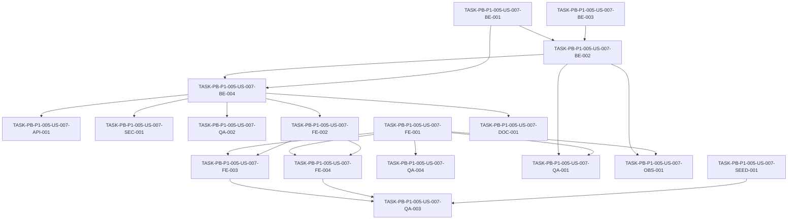

# Development Tasks — PB-P1-005 / US-007: Cambiar mi idioma preferido entre los 4 soportados

## 1. Metadata

| Field | Value |
|---|---|
| User Story ID | US-007 |
| Source User Story | `management/user-stories/US-007-change-preferred-language.md` |
| Source Technical Specification | `management/technical-specs/P1/PB-P1-005/US-007-technical-spec.md` |
| Decision Resolution Artifact | No requerido |
| Priority | P1 |
| Backlog ID | PB-P1-005 |
| Backlog Title | Perfil propio + cambio de idioma |
| Backlog Execution Order | 23 (18 P0 + PB-P1-001..004 = 22, esta es la 5ª de P1) |
| User Story Position in Backlog Item | 2 de 2 |
| Related User Stories in Backlog Item | US-006, US-007 |
| Epic | EPIC-I18N-001 (cross-cuts EPIC-AUTH-001) |
| Backlog Item Dependencies | PB-P1-003; transitivamente PB-P0-004, PB-P0-006, PB-P0-007, PB-P0-008, PB-P0-012, PB-P0-013 |
| Feature | Selección de idioma preferido (selector global + persistencia por usuario) |
| Module / Domain | Auth / I18N (Users) |
| Backlog Alignment Status | Found |
| Task Breakdown Status | Ready for Sprint Planning |
| Created Date | 2026-06-25 |
| Last Updated | 2026-06-25 |

---

## 2. Source Validation

| Source | Found | Used | Notes |
|---|---|---|---|
| User Story | Yes | Yes | Status `Approved` |
| Technical Specification | Yes | Yes | Status `Ready for Task Breakdown` |
| Decision Resolution Artifact | No | No | No requerido (sin blockers) |
| Product Backlog Prioritized | Yes | Yes | PB-P1-005 (US-006, US-007) |
| ADRs | Yes | Yes | ADR-FE-001 (Next.js + App Router) |

---

## 3. Backlog Execution Context

### Parent Backlog Item

`PB-P1-005 — Perfil propio + cambio de idioma`. Agrupa la pantalla `/[locale]/profile` (US-006) y el detalle UX del selector global multi-locale (US-007). Compatible con los 3 roles autenticados.

### Execution Order Rationale

Después de la fundación P0 y de US-001..005 (registro, login, logout, reset password), PB-P1-005 habilita la auto-gestión del perfil. US-007 se ejecuta después o en paralelo a US-006 porque reutiliza la mayoría de los hooks y la integración del header introducida en US-006.

### Related User Stories in Same Backlog Item

| User Story | Role in Backlog Item | Suggested Order |
|---|---|---|
| US-006 — Ver y editar mi perfil propio | Pantalla principal de perfil, password, integración inicial del `LanguageSelector` | 1 |
| US-007 — Cambiar idioma preferido | Selector global del header, flujo anónimo, endpoint dedicado `/me/preferred-language` | 2 (paralelizable) |

---

## 4. Task Breakdown Summary

| Area | Number of Tasks | Notes |
|---|---:|---|
| Backend | 4 | DTO + use case + repo + controller/ruta |
| API Contract | 1 | Documentación OpenAPI del endpoint dedicado |
| Security | 1 | Verificación ownership/negativos |
| Frontend | 4 | Componente `LanguageSelector`, hook, integración Header, integración `/profile` |
| QA | 4 | Unit, integration/API, E2E, accesibilidad |
| Seed / Demo | 1 | Usuarios seed por locale |
| Observability | 1 | Eventos estructurados + i18n missing-key |
| Documentation | 1 | Alineación Doc 16 (endpoints duales) |
| **Total** | **17** | |

Rango de Task IDs: `TASK-PB-P1-005-US-007-BE-001` … `TASK-PB-P1-005-US-007-DOC-001`.

---

## 5. Traceability Matrix

| Acceptance Criterion | Technical Spec Section | Task IDs |
|---|---|---|
| AC-01 — Cambio desde `/profile` | §6, §8 | TASK-PB-P1-005-US-007-FE-004, TASK-PB-P1-005-US-007-QA-002 |
| AC-02 — Cambio desde selector global | §6, §8 | TASK-PB-P1-005-US-007-FE-001, FE-002, FE-003, QA-003 |
| AC-03 — Persistencia entre sesiones | §6, §8 | TASK-PB-P1-005-US-007-FE-004, QA-003 |
| EC-01 — Locale no soportado | §6, §7 | TASK-PB-P1-005-US-007-BE-001, QA-002 |
| EC-02 — Falta de diccionarios | §6, §8 | TASK-PB-P1-005-US-007-FE-001, OBS-001, QA-002 |
| EC-03 — Anónimo cambia idioma | §6, §8 | TASK-PB-P1-005-US-007-FE-001, FE-002, QA-003 |
| VR-01/VR-02 | §7 | TASK-PB-P1-005-US-007-BE-001 |
| SEC-01..03 | §12 | TASK-PB-P1-005-US-007-SEC-001, QA-002 |

---

## 6. Development Tasks

### TASK-PB-P1-005-US-007-BE-001 — DTO Zod `UpdatePreferredLanguageRequestDto`

| Field | Value |
|---|---|
| Area | Backend |
| Type | Implementation |
| Priority | Must |
| Estimate | XS |
| Depends On | — |
| Source AC(s) | EC-01, VR-01, VR-02 |
| Technical Spec Section(s) | §7 DTOs / Schemas, §9 API |
| Backlog ID | PB-P1-005 |
| User Story ID | US-007 |
| Owner Role | Backend |
| Status | To Do |

#### Objective

Definir el DTO Zod para el request y response del endpoint dedicado de cambio de idioma.

#### Scope

##### Include

- `LanguageCodeSchema = z.enum(['es-LATAM', 'es-ES', 'pt', 'en'])`.
- `UpdatePreferredLanguageRequestDto`.
- `UpdatePreferredLanguageResponseDto`.
- Tests unitarios de validación (valores válidos, inválidos, faltantes).

##### Exclude

- Migraciones de BD.
- Controlador y use case (tareas separadas).

#### Implementation Notes

Ubicar en `apps/api/src/modules/users/dto/UpdatePreferredLanguageRequestDto.ts`. Reusar el enum global `LanguageCode` si ya existe en `apps/api/src/shared/enums/`.

#### Acceptance Criteria Covered

- EC-01 (rechazo de locale no soportado).
- VR-01, VR-02.

#### Definition of Done

- [ ] DTO definido y exportado.
- [ ] Tests unitarios verdes para los 4 locales válidos y para casos negativos.
- [ ] Tipo TypeScript inferido y consumido por el use case.

---

### TASK-PB-P1-005-US-007-BE-002 — `UpdatePreferredLanguageUseCase`

| Field | Value |
|---|---|
| Area | Backend |
| Type | Implementation |
| Priority | Must |
| Estimate | S |
| Depends On | TASK-PB-P1-005-US-007-BE-001 |
| Source AC(s) | AC-01, AC-02 |
| Technical Spec Section(s) | §7 Use Cases |
| Backlog ID | PB-P1-005 |
| User Story ID | US-007 |
| Owner Role | Backend |
| Status | To Do |

#### Objective

Implementar el use case que actualiza `preferred_language` del usuario autenticado y emite el evento estructurado.

#### Scope

##### Include

- Clase `UpdatePreferredLanguageUseCase` con dependencia `UserRepository`.
- Emisión de `user.preferred-language.updated` con `correlationId`.
- Retorno `{ id, preferredLanguage, updatedAt }`.
- Tests unitarios con repositorio mockeado.

##### Exclude

- Lógica HTTP (controlador).
- Persistencia directa fuera del repositorio.

#### Implementation Notes

Mantener pureza: el use case recibe `{ userId, preferredLanguage }` ya validados. Reutilizar el logger estructurado del módulo `users`.

#### Acceptance Criteria Covered

- AC-01, AC-02.

#### Definition of Done

- [ ] Use case implementado.
- [ ] Tests unitarios (happy path + errores del repositorio).
- [ ] Evento emitido verificado en tests.

---

### TASK-PB-P1-005-US-007-BE-003 — Método `UserRepository.updatePreferredLanguage`

| Field | Value |
|---|---|
| Area | Backend |
| Type | Implementation |
| Priority | Must |
| Estimate | XS |
| Depends On | — |
| Source AC(s) | AC-01, AC-02 |
| Technical Spec Section(s) | §7 Repository |
| Backlog ID | PB-P1-005 |
| User Story ID | US-007 |
| Owner Role | Backend |
| Status | To Do |

#### Objective

Añadir el método `updatePreferredLanguage(userId, code)` al repositorio Prisma de `User`.

#### Scope

##### Include

- Método en `UserRepository`.
- Actualización de `preferred_language` y `updated_at`.
- Tests de integración con Prisma test container.

##### Exclude

- Migración (no aplica).
- Controlador.

#### Implementation Notes

Usar `prisma.user.update({ where: { id }, data: { preferredLanguage } })`. Aprovechar el tipo generado `LanguageCode`.

#### Acceptance Criteria Covered

- AC-01, AC-02.

#### Definition of Done

- [ ] Método añadido.
- [ ] Test de integración Prisma verifica el `UPDATE`.

---

### TASK-PB-P1-005-US-007-BE-004 — Controlador y ruta `PATCH /api/v1/users/me/preferred-language`

| Field | Value |
|---|---|
| Area | Backend |
| Type | Implementation |
| Priority | Must |
| Estimate | S |
| Depends On | BE-001, BE-002, BE-003 |
| Source AC(s) | AC-01, AC-02, EC-01 |
| Technical Spec Section(s) | §7 Controllers, §9 API |
| Backlog ID | PB-P1-005 |
| User Story ID | US-007 |
| Owner Role | Backend |
| Status | To Do |

#### Objective

Exponer el handler delgado y registrar la ruta protegida por `authMiddleware`.

#### Scope

##### Include

- Método `UsersController.updatePreferredLanguage`.
- Registro en `routes.ts`.
- Aplicación de `authMiddleware`, `validateBody(UpdatePreferredLanguageRequestDto)`.
- Mapeo de errores a `400 VALIDATION_ERROR`, `401 UNAUTHENTICATED`, `422`.

##### Exclude

- Lógica de negocio (delegada al use case).

#### Implementation Notes

Obtener `userId` desde `req.user.id`. Devolver `200` con el DTO de response. Tests Supertest (cookie de sesión válida vs ausente vs locale inválido).

#### Acceptance Criteria Covered

- AC-01, AC-02, EC-01.

#### Definition of Done

- [ ] Ruta operativa con `authMiddleware`.
- [ ] Tests Supertest verdes (happy, 400, 401, 422).
- [ ] Sin secretos ni `console.log`.

---

### TASK-PB-P1-005-US-007-API-001 — Documentación OpenAPI del endpoint

| Field | Value |
|---|---|
| Area | API Contract |
| Type | Documentation |
| Priority | Must |
| Estimate | XS |
| Depends On | BE-004 |
| Source AC(s) | AC-01, AC-02 |
| Technical Spec Section(s) | §9 API |
| Backlog ID | PB-P1-005 |
| User Story ID | US-007 |
| Owner Role | Backend |
| Status | To Do |

#### Objective

Generar la documentación OpenAPI (vía `zod-to-openapi` o equivalente) para `PATCH /users/me/preferred-language` y actualizar el snapshot CI.

#### Scope

##### Include

- Schema OpenAPI request/response.
- Códigos de error.
- Actualización del snapshot.

##### Exclude

- Cambios al endpoint `PATCH /users/me` (cubierto por US-006).

#### Implementation Notes

Alinear con la convención usada por US-094.

#### Acceptance Criteria Covered

- AC-01, AC-02.

#### Definition of Done

- [ ] Snapshot OpenAPI actualizado.
- [ ] CI verde.

---

### TASK-PB-P1-005-US-007-SEC-001 — Verificación de ownership y escenarios negativos

| Field | Value |
|---|---|
| Area | Security / Authorization |
| Type | Test |
| Priority | Must |
| Estimate | S |
| Depends On | BE-004 |
| Source AC(s) | SEC-01..03, AUTH-TS-01, AUTH-TS-02 |
| Technical Spec Section(s) | §12 Security |
| Backlog ID | PB-P1-005 |
| User Story ID | US-007 |
| Owner Role | QA |
| Status | To Do |

#### Objective

Garantizar que el endpoint solo opera sobre el usuario autenticado y rechaza accesos anónimos o manipulaciones.

#### Scope

##### Include

- Test: sesión activa → 200.
- Test: sin cookie → 401.
- Test: body con `userId` ajeno → ignorado, mutación restringida al `req.user.id`.
- Test: cookie expirada/inválida → 401.

##### Exclude

- Tests de roles (no aplica diferenciación de rol).

#### Implementation Notes

Reutilizar harness de cookies HTTP-only.

#### Acceptance Criteria Covered

- SEC-01..03, AUTH-TS-01..02.

#### Definition of Done

- [ ] 4 tests verdes.

---

### TASK-PB-P1-005-US-007-FE-001 — Componente `LanguageSelector`

| Field | Value |
|---|---|
| Area | Frontend |
| Type | Implementation |
| Priority | Must |
| Estimate | M |
| Depends On | — |
| Source AC(s) | AC-01, AC-02, EC-02, EC-03 |
| Technical Spec Section(s) | §8 Components, §8 Accessibility, §8 i18n |
| Backlog ID | PB-P1-005 |
| User Story ID | US-007 |
| Owner Role | Frontend |
| Status | To Do |

#### Objective

Construir el dropdown accesible con etiquetas nativas para los 4 locales.

#### Scope

##### Include

- Componente Client en `apps/web/src/components/i18n/LanguageSelector.tsx`.
- Render con `useLocale()`, opciones nativas, `aria-label`, navegación por teclado.
- Estados loading/disabled durante la mutación.
- Detección de sesión: si autenticado, dispara mutación; si anónimo, omite mutación.

##### Exclude

- Hook de mutación (FE-002).
- Integración con Header (FE-003) y con `/profile` (FE-004).

#### Implementation Notes

Para sesión anónima: usar `router.replace(pathname, { locale })` de `next-intl` y setear cookie `NEXT_LOCALE`. Mostrar nombres nativos: `Español LATAM`, `Español`, `Português`, `English`.

#### Acceptance Criteria Covered

- AC-02, EC-02, EC-03.

#### Definition of Done

- [ ] Componente exportado y storybook/visualización básica.
- [ ] A11y validado con `axe-core`.
- [ ] Tests unitarios de render y callback.

---

### TASK-PB-P1-005-US-007-FE-002 — Hook `useUpdatePreferredLanguage` + cliente API

| Field | Value |
|---|---|
| Area | Frontend |
| Type | Implementation |
| Priority | Must |
| Estimate | S |
| Depends On | BE-004 |
| Source AC(s) | AC-01, AC-02 |
| Technical Spec Section(s) | §8 State Management, §8 Data Fetching |
| Backlog ID | PB-P1-005 |
| User Story ID | US-007 |
| Owner Role | Frontend |
| Status | To Do |

#### Objective

Encapsular la mutación TanStack Query y la integración con el cliente HTTP central.

#### Scope

##### Include

- Método `usersApi.updatePreferredLanguage(payload)`.
- Hook `useUpdatePreferredLanguage` con `onSuccess` (invalidación `['me']` + navegación `next-intl` + toast) y `onError` (toast con `errorCode`).
- Tests unitarios con MSW.

##### Exclude

- Componente UI (FE-001).

#### Implementation Notes

Configurar `mutationKey: ['users','me','preferred-language']`.

#### Acceptance Criteria Covered

- AC-01, AC-02.

#### Definition of Done

- [ ] Hook y cliente API implementados.
- [ ] Tests MSW verdes.

---

### TASK-PB-P1-005-US-007-FE-003 — Integración del `LanguageSelector` en el `Header` global

| Field | Value |
|---|---|
| Area | Frontend |
| Type | Implementation |
| Priority | Must |
| Estimate | S |
| Depends On | FE-001, FE-002 |
| Source AC(s) | AC-02, EC-03 |
| Technical Spec Section(s) | §8 Routes / Pages, §8 Components |
| Backlog ID | PB-P1-005 |
| User Story ID | US-007 |
| Owner Role | Frontend |
| Status | To Do |

#### Objective

Montar el selector en el `Header` compartido por rutas autenticadas y públicas.

#### Scope

##### Include

- Inserción del `LanguageSelector` en `Header.tsx`.
- Layout responsive (mobile-first).
- Tests visuales/regresión con Playwright.

##### Exclude

- Cambios en otros componentes del header.

#### Acceptance Criteria Covered

- AC-02, EC-03.

#### Definition of Done

- [ ] Selector visible en rutas autenticadas y anónimas.
- [ ] Sin regresiones de layout reportadas por Playwright.

---

### TASK-PB-P1-005-US-007-FE-004 — Integración del `LanguageSelector` en `/[locale]/profile` y sincronización post-login

| Field | Value |
|---|---|
| Area | Frontend |
| Type | Implementation |
| Priority | Must |
| Estimate | S |
| Depends On | FE-001, FE-002 |
| Source AC(s) | AC-01, AC-03 |
| Technical Spec Section(s) | §6 Functional Interpretation, §8 Routes / Pages |
| Backlog ID | PB-P1-005 |
| User Story ID | US-007 |
| Owner Role | Frontend |
| Status | To Do |

#### Objective

Integrar el selector dentro del form de perfil (US-006) y sincronizar el `locale` con `User.preferred_language` al iniciar sesión.

#### Scope

##### Include

- Inclusión del componente en la sección Datos básicos del form.
- Layout sync en `apps/web/src/app/[locale]/layout.tsx`: lee `GET /me`, compara con `useLocale()` y redirige/replace si difieren; sincroniza cookie `NEXT_LOCALE`.
- Tests de integración con MSW.

##### Exclude

- Cambio de password u otros campos de perfil (US-006).

#### Acceptance Criteria Covered

- AC-01, AC-03.

#### Definition of Done

- [ ] Integración verificada en `/profile`.
- [ ] Tests de sincronización post-login verdes.

---

### TASK-PB-P1-005-US-007-QA-001 — Tests unitarios del módulo `users` (DTO + use case + componente)

| Field | Value |
|---|---|
| Area | QA / Testing |
| Type | Test |
| Priority | Must |
| Estimate | S |
| Depends On | BE-001, BE-002, FE-001 |
| Source AC(s) | EC-01, VR-01, VR-02, AC-02 |
| Technical Spec Section(s) | §13 Testing — Unit |
| Backlog ID | PB-P1-005 |
| User Story ID | US-007 |
| Owner Role | QA |
| Status | To Do |

#### Objective

Consolidar la cobertura unitaria del DTO, el use case y el componente.

#### Scope

##### Include

- Casos para los 4 locales válidos.
- Rechazo de no soportados.
- Render del componente con cada locale activo.

##### Exclude

- Tests E2E (QA-003).

#### Acceptance Criteria Covered

- EC-01, VR-01, VR-02, AC-02.

#### Definition of Done

- [ ] Suite unit ≥ umbrales de cobertura del módulo.

---

### TASK-PB-P1-005-US-007-QA-002 — Tests integration/API (TS-01, TS-04, NT-01..03)

| Field | Value |
|---|---|
| Area | QA / Testing |
| Type | Test |
| Priority | Must |
| Estimate | S |
| Depends On | BE-004 |
| Source AC(s) | AC-01, EC-01, EC-02 |
| Technical Spec Section(s) | §13 Testing — Integration / API |
| Backlog ID | PB-P1-005 |
| User Story ID | US-007 |
| Owner Role | QA |
| Status | To Do |

#### Objective

Cubrir el flujo BE end-to-end vía Supertest y el fallback de diccionario.

#### Scope

##### Include

- TS-01 happy path con sesión.
- TS-04 fallback `en` cuando falta una key.
- NT-01 locale no soportado.
- NT-02 anónimo.
- NT-03 body vacío.

##### Exclude

- Tests E2E navegacionales (QA-003).

#### Acceptance Criteria Covered

- AC-01, EC-01, EC-02.

#### Definition of Done

- [ ] Suite verde en CI.

---

### TASK-PB-P1-005-US-007-QA-003 — Tests E2E Playwright (TS-02, TS-03, TS-05)

| Field | Value |
|---|---|
| Area | QA / Testing |
| Type | Test |
| Priority | Must |
| Estimate | M |
| Depends On | FE-003, FE-004 |
| Source AC(s) | AC-02, AC-03, EC-03 |
| Technical Spec Section(s) | §13 Testing — E2E |
| Backlog ID | PB-P1-005 |
| User Story ID | US-007 |
| Owner Role | QA |
| Status | To Do |

#### Objective

Validar el flujo end-to-end del cambio de idioma vía Playwright.

#### Scope

##### Include

- TS-02 cambio inmediato desde el header.
- TS-03 persistencia tras logout/login.
- TS-05 selector anónimo no llama API (interceptor verifica ausencia de request).

##### Exclude

- Tests unit (QA-001) e integration (QA-002).

#### Acceptance Criteria Covered

- AC-02, AC-03, EC-03.

#### Definition of Done

- [ ] Tests E2E verdes en CI con los usuarios seed por locale.

---

### TASK-PB-P1-005-US-007-QA-004 — Tests de accesibilidad y cobertura por locale

| Field | Value |
|---|---|
| Area | QA / Testing |
| Type | Test |
| Priority | Must |
| Estimate | S |
| Depends On | FE-001 |
| Source AC(s) | AC-02, Accessibility |
| Technical Spec Section(s) | §13 Testing — Accessibility, §8 i18n |
| Backlog ID | PB-P1-005 |
| User Story ID | US-007 |
| Owner Role | QA |
| Status | To Do |

#### Objective

Garantizar accesibilidad y cobertura mínima de los 4 locales en rutas demo principales.

#### Scope

##### Include

- `axe-core` sobre `LanguageSelector` (open/closed).
- Navegación por teclado.
- Verificación de cobertura de claves i18n por locale en rutas demo.

##### Exclude

- A11y de otros componentes del header.

#### Acceptance Criteria Covered

- A11y, AC-02.

#### Definition of Done

- [ ] Sin violaciones críticas de a11y.
- [ ] Reporte de cobertura por locale generado.

---

### TASK-PB-P1-005-US-007-SEED-001 — Usuarios seed por locale

| Field | Value |
|---|---|
| Area | Seed / Demo Data |
| Type | Setup |
| Priority | Must |
| Estimate | XS |
| Depends On | — |
| Source AC(s) | AC-03 (apoyo demo) |
| Technical Spec Section(s) | §15 Seed |
| Backlog ID | PB-P1-005 |
| User Story ID | US-007 |
| Owner Role | Backend |
| Status | To Do |

#### Objective

Garantizar que el seed incluya al menos un usuario por cada locale soportado.

#### Scope

##### Include

- Actualización de la matriz seed para cubrir `es-LATAM`, `es-ES`, `pt`, `en`.
- Verificación que el reset (PB-P0-016) preserva la matriz.

##### Exclude

- Datos de eventos/vendors.

#### Acceptance Criteria Covered

- Demo support.

#### Definition of Done

- [ ] Seed actualizado.
- [ ] Reset verificado.

---

### TASK-PB-P1-005-US-007-OBS-001 — Eventos estructurados y diccionario missing-key

| Field | Value |
|---|---|
| Area | Observability / Audit |
| Type | Implementation |
| Priority | Must |
| Estimate | XS |
| Depends On | BE-002, FE-001 |
| Source AC(s) | EC-02 |
| Technical Spec Section(s) | §14 Observability |
| Backlog ID | PB-P1-005 |
| User Story ID | US-007 |
| Owner Role | Backend / Frontend |
| Status | To Do |

#### Objective

Emitir `user.preferred-language.updated` con `correlationId` y `i18n.dictionary.missing-key` en el frontend.

#### Scope

##### Include

- Logger BE estructurado.
- Handler FE `onError` de `next-intl` que reporta keys faltantes.

##### Exclude

- Dashboards de métricas.

#### Acceptance Criteria Covered

- EC-02.

#### Definition of Done

- [ ] Eventos visibles en logs.
- [ ] Test verifica emisión.

---

### TASK-PB-P1-005-US-007-DOC-001 — Documentación de alineación Doc 16 (endpoints duales)

| Field | Value |
|---|---|
| Area | Documentation / Traceability |
| Type | Documentation |
| Priority | Should |
| Estimate | XS |
| Depends On | BE-004 |
| Source AC(s) | — |
| Technical Spec Section(s) | §16 Documentation Alignment |
| Backlog ID | PB-P1-005 |
| User Story ID | US-007 |
| Owner Role | Tech Lead |
| Status | To Do |

#### Objective

Documentar el patrón de coexistencia entre `PATCH /me` y `PATCH /me/preferred-language` en el runbook y en el README del módulo `users`.

#### Scope

##### Include

- Nota en el README del módulo `users` y/o runbook de demo.
- Referencia a la corrección UC-AUTH-007 → UC-AUTH-006 + UC-I18N-001.

##### Exclude

- Re-escritura de Doc 16.

#### Acceptance Criteria Covered

- Documentation alignment.

#### Definition of Done

- [ ] Documentación actualizada.

---

## 7. Required QA Tasks

| Task ID | Test Type | Purpose |
|---|---|---|
| TASK-PB-P1-005-US-007-QA-001 | Unit | DTO + use case + componente |
| TASK-PB-P1-005-US-007-QA-002 | Integration / API | TS-01, TS-04, NT-01..03 |
| TASK-PB-P1-005-US-007-QA-003 | E2E | TS-02, TS-03, TS-05 |
| TASK-PB-P1-005-US-007-QA-004 | A11y + cobertura locale | A11y, NFR-I18N-001/002 |

---

## 8. Required Security Tasks

| Task ID | Security Concern | Purpose |
|---|---|---|
| TASK-PB-P1-005-US-007-SEC-001 | Ownership `/users/me`, anónimo, manipulación de `userId` | Garantizar enforcement backend |

---

## 9. Required Seed / Demo Tasks

| Task ID | Seed/Demo Concern | Purpose |
|---|---|---|
| TASK-PB-P1-005-US-007-SEED-001 | Cobertura por locale | Apoyar demo y E2E |

---

## 10. Observability / Audit Tasks

| Task ID | Concern | Purpose |
|---|---|---|
| TASK-PB-P1-005-US-007-OBS-001 | Eventos estructurados + dictionary missing-key | KPI multi-idioma y diagnóstico i18n |

---

## 11. Documentation / Traceability Tasks

| Task ID | Document / Artifact | Purpose |
|---|---|---|
| TASK-PB-P1-005-US-007-DOC-001 | README módulo users + runbook demo | Coexistencia endpoints + corrección UC |

---

## 12. Dependency Graph

---

## 13. Suggested Implementation Order

### Phase 1 — Foundation

- BE-001 (DTO)
- BE-003 (Repository method)
- FE-001 (LanguageSelector)
- SEED-001 (Usuarios seed por locale)

### Phase 2 — Core Implementation

- BE-002 (Use case)
- BE-004 (Controller + ruta)
- API-001 (OpenAPI)
- FE-002 (Hook + cliente API)
- FE-003 (Integración Header)
- FE-004 (Integración /profile + sync post-login)
- OBS-001 (Eventos)

### Phase 3 — Validation / Security / QA

- SEC-001 (Negativos backend)
- QA-001 (Unit)
- QA-002 (Integration / API)
- QA-003 (E2E)
- QA-004 (A11y + cobertura locale)

### Phase 4 — Documentation / Review

- DOC-001 (README + runbook)

---

## 14. Risks & Mitigations

| Risk | Impact | Mitigation | Related Task |
|---|---|---|---|
| Diccionarios incompletos en uno de los 4 locales | UI inconsistente | Fallback `en` + cobertura QA por locale | QA-004 |
| Cache TanStack Query no invalidada | UI con datos previos | `invalidateQueries(['me'])` en `onSuccess` | FE-002 |
| Desincronización cookie anónima ↔ `User.preferred_language` post-login | Locale "salta" al loguearse | Sync en layout `[locale]` | FE-004 |
| Flash de contenido en idioma anterior | UX | Usar `router.replace` de next-intl, no `window.location` | FE-001 |

---

## 15. Out of Scope Confirmation

- Cambio del `Event.language_code` (US-082 / PB-P1-047).
- Cambio del `Vendor.languages_supported`.
- Traducción dinámica con IA, RTL, locales adicionales (FR, IT, etc.).
- Detección automática agresiva por `Accept-Language` para autenticados.
- Cambio de moneda preferida del usuario.
- Migraciones DB.
- Implementación inicial de los endpoints `/api/v1/users/me*` (US-094 / PB-P0-007).
- MFA y re-login forzado tras cambio de idioma.

---

## 16. Readiness for Sprint Planning

| Check | Status |
|---|---|
| Product Backlog mapping found | Pass |
| Every AC maps to tasks | Pass |
| Technical Spec used when available | Pass |
| QA tasks included | Pass |
| Security tasks included if applicable | Pass |
| Seed/demo tasks included if applicable | Pass |
| Observability tasks included if applicable | Pass |
| Documentation tasks included if applicable | Pass |
| Task dependencies clear | Pass |
| Tasks small enough | Pass |
| Ready for Sprint Planning | Yes |

---

## 17. Final Recommendation

`Ready for Sprint Planning`

El desglose cubre íntegramente los AC, edge cases, validaciones y expectativas de seguridad/observabilidad/QA del Technical Specification. Las tareas son atómicas, testeables y respetan el orden dictado por el Product Backlog (PB-P1-005, posición 2 de 2). La generación de Development Tasks puede entregarse a sprint planning de inmediato.
