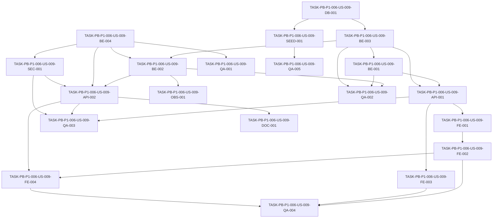

# Development Tasks — PB-P1-006 / US-009: Crear un evento mediante wizard

## 1. Metadata

| Field | Value |
|---|---|
| User Story ID | US-009 |
| Source User Story | `management/user-stories/US-009-create-event-wizard.md` |
| Source Technical Specification | `management/technical-specs/P1/PB-P1-006/US-009-technical-spec.md` |
| Decision Resolution Artifact | No aplica |
| Priority | P1 |
| Backlog ID | PB-P1-006 |
| Backlog Title | Wizard de creación de evento |
| Backlog Execution Order | 24 (P0: 18 + posición 6 en P1) |
| User Story Position in Backlog Item | 1 de 1 |
| Related User Stories in Backlog Item | US-009 |
| Epic | EPIC-EVT-001 — Organizer Event Management |
| Backlog Item Dependencies | PB-P1-003, PB-P0-001 |
| Feature | Wizard de creación de eventos |
| Module / Domain | Events |
| Backlog Alignment Status | Found |
| Task Breakdown Status | Ready for Sprint Planning |
| Created Date | 2026-06-25 |
| Last Updated | 2026-06-25 |

---

## 2. Source Validation

| Source | Found | Used | Notes |
|---|---|---|---|
| User Story | Yes | Yes | `Approved`, alineada con FR/UC/BR. |
| Technical Specification | Yes | Yes | `Ready for Task Breakdown`. |
| Decision Resolution Artifact | No | No | Sin blockers; decisiones formalizadas. |
| Product Backlog Prioritized | Yes | Yes | PB-P1-006 encontrado. |
| ADRs | Yes | Yes | ADR-BE-003 aplica (reglas en Application/Domain). |

---

## 3. Backlog Execution Context

### Parent Backlog Item

PB-P1-006 — Wizard de creación de evento. Habilita el resto de los flujos del organizador (ciclo de vida, dashboard, IA, presupuesto, cotizaciones). Entrega un único endpoint de escritura (`POST /api/v1/events`) y un endpoint de lectura de catálogo (`GET /api/v1/event-types`).

### Execution Order Rationale

Se ejecuta inmediatamente después de las fundaciones P0 y de los flujos P1 de autenticación y perfil (`PB-P1-001`..`PB-P1-005`), porque sin un evento en `draft` no se pueden activar el ciclo de vida (PB-P1-007), el dashboard (PB-P1-008) ni los flujos IA (PB-P1-011+). Posición global 24.

### Related User Stories in Same Backlog Item

| User Story | Role in Backlog Item | Suggested Order |
|---|---|---|
| US-009 | Wizard completo de creación de evento | 1 |

---

## 4. Task Breakdown Summary

| Area | Number of Tasks | Notes |
|---|---:|---|
| Database / Prisma (DB) | 1 | Índices y default `status='draft'`. |
| Seed / Demo Data (SEED) | 1 | 6 `EventType` activos con i18n. |
| Backend (BE) | 4 | DTO, use cases, repositorios. |
| API Contract (API) | 2 | Controllers `POST /events`, `GET /event-types`. |
| Security / Authorization (SEC) | 1 | Role guard + `.strict()` + owner desde sesión. |
| Observability / Audit (OBS) | 1 | Log `event.created` + correlation ID. |
| Frontend (FE) | 4 | Página, wizard, hooks, persistencia local. |
| QA / Testing (QA) | 5 | Unit, integration, API, E2E + a11y, seed. |
| Documentation / Traceability (DOC) | 1 | Alineación PB ↔ PO 8.1 #7 + `docs/16`. |
| **Total** | **20** | |

---

## 5. Traceability Matrix

| Acceptance Criterion | Technical Spec Section | Task IDs |
|---|---|---|
| AC-01 — Wizard crea evento `draft` y redirige | §7, §8, §9, §10 | TASK-PB-P1-006-US-009-BE-002, TASK-PB-P1-006-US-009-API-002, TASK-PB-P1-006-US-009-FE-002, TASK-PB-P1-006-US-009-FE-004, TASK-PB-P1-006-US-009-QA-003, TASK-PB-P1-006-US-009-QA-004 |
| AC-02 — 6 tipos soportados | §7, §10, §15 | TASK-PB-P1-006-US-009-SEED-001, TASK-PB-P1-006-US-009-BE-001, TASK-PB-P1-006-US-009-API-001, TASK-PB-P1-006-US-009-FE-003, TASK-PB-P1-006-US-009-QA-005 |
| AC-03 — Idioma por defecto desde perfil | §8 | TASK-PB-P1-006-US-009-FE-002, TASK-PB-P1-006-US-009-QA-003 |
| AC-04 — Selección moneda local o USD | §8 | TASK-PB-P1-006-US-009-FE-002, TASK-PB-P1-006-US-009-QA-004 |
| AC-05 — Moneda inmutable | §7, §12 | TASK-PB-P1-006-US-009-BE-002, TASK-PB-P1-006-US-009-BE-004, TASK-PB-P1-006-US-009-QA-001 |
| EC-01 — Fecha en el pasado | §7 | TASK-PB-P1-006-US-009-BE-004, TASK-PB-P1-006-US-009-QA-001, TASK-PB-P1-006-US-009-QA-003 |
| EC-02 — Moneda fuera del catálogo | §7 | TASK-PB-P1-006-US-009-BE-004, TASK-PB-P1-006-US-009-QA-001, TASK-PB-P1-006-US-009-QA-003 |
| EC-03 — EventType inactivo | §7 | TASK-PB-P1-006-US-009-BE-002, TASK-PB-P1-006-US-009-QA-002 |
| EC-04 — Idioma fuera de catálogo | §7 | TASK-PB-P1-006-US-009-BE-004, TASK-PB-P1-006-US-009-QA-001, TASK-PB-P1-006-US-009-QA-003 |
| SEC-01..05 | §12 | TASK-PB-P1-006-US-009-SEC-001, TASK-PB-P1-006-US-009-QA-003 |

---

## 6. Development Tasks

### TASK-PB-P1-006-US-009-DB-001 — Migración Prisma: índices y default `status` en `events`

| Field | Value |
|---|---|
| Area | Database / Prisma |
| Type | Implementation |
| Priority | Must |
| Estimate | S |
| Depends On | — |
| Source AC(s) | AC-01, AC-02 |
| Technical Spec Section(s) | §10 |
| Backlog ID | PB-P1-006 |
| User Story ID | US-009 |
| Owner Role | Backend |
| Status | To Do |

#### Objective

Asegurar que la tabla `events` cuenta con default `status='draft'` (si no proviene de PB-P0-001) y con índices que soporten las consultas del organizador.

#### Scope

##### Include

* Agregar `idx_events_owner_user_id (owner_user_id)`.
* Agregar `idx_events_owner_status (owner_user_id, status)`.
* Verificar/agregar default `status='draft'` en el modelo Prisma.
* Generar migración reversible.

##### Exclude

* Tablas `event_types` y `locations` (cubiertas por PB-P0-001).
* Cambios a otros índices ajenos a Events.

#### Implementation Notes

* Validar primero el estado actual del schema generado por PB-P0-001.
* Si los índices ya existen, marcar la tarea como `Pass` documentando el match.

#### Acceptance Criteria Covered

AC-01, AC-02.

#### Definition of Done

- [ ] Migración Prisma creada y aplicada en entorno de test.
- [ ] `prisma migrate status` limpio.
- [ ] PR documenta justificación del índice compuesto.

---

### TASK-PB-P1-006-US-009-SEED-001 — Seed de 6 `EventType` activos con i18n

| Field | Value |
|---|---|
| Area | Seed / Demo Data |
| Type | Implementation |
| Priority | Must |
| Estimate | S |
| Depends On | TASK-PB-P1-006-US-009-DB-001 |
| Source AC(s) | AC-02 |
| Technical Spec Section(s) | §15 |
| Backlog ID | PB-P1-006 |
| User Story ID | US-009 |
| Owner Role | Backend |
| Status | To Do |

#### Objective

Cargar los 6 `EventType` canónicos (`wedding`, `xv`, `baptism`, `baby_shower`, `birthday`, `corporate`) con `is_active=true` y display names en `es-LATAM`, `es-ES`, `pt`, `en`.

#### Scope

##### Include

* Definir el seed idempotente para los 6 tipos.
* Cargar nombres legibles para los 4 locales.
* Integrar el seed al pipeline existente.

##### Exclude

* Plantillas IA por tipo (otras US).
* Categorías sugeridas por tipo.

#### Implementation Notes

* Mantener `code` estable porque será FK semántica del catálogo.

#### Acceptance Criteria Covered

AC-02.

#### Definition of Done

- [ ] `pnpm db:seed` reproducible.
- [ ] `GET /api/v1/event-types` devuelve los 6 tipos tras el seed.

---

### TASK-PB-P1-006-US-009-BE-001 — Implementar `ListActiveEventTypesUseCase`

| Field | Value |
|---|---|
| Area | Backend |
| Type | Implementation |
| Priority | Must |
| Estimate | XS |
| Depends On | TASK-PB-P1-006-US-009-DB-001 |
| Source AC(s) | AC-02 |
| Technical Spec Section(s) | §7 |
| Backlog ID | PB-P1-006 |
| User Story ID | US-009 |
| Owner Role | Backend |
| Status | To Do |

#### Objective

Exponer un use case que retorne los `EventType` con `is_active=true`.

#### Scope

##### Include

* Use case en capa Application.
* Mapeo a DTO de respuesta (`code`, `displayName`, `isActive`).

##### Exclude

* Edición de tipos (admin).

#### Implementation Notes

* No incluir tipos inactivos bajo ninguna circunstancia.

#### Acceptance Criteria Covered

AC-02.

#### Definition of Done

- [ ] Use case implementado y cubierto por unit test (ver QA-002).

---

### TASK-PB-P1-006-US-009-BE-002 — Implementar `CreateEventUseCase` con ownership y currency inmutable

| Field | Value |
|---|---|
| Area | Backend |
| Type | Implementation |
| Priority | Must |
| Estimate | M |
| Depends On | TASK-PB-P1-006-US-009-BE-003, TASK-PB-P1-006-US-009-BE-004 |
| Source AC(s) | AC-01, AC-05, EC-03 |
| Technical Spec Section(s) | §7, §12 |
| Backlog ID | PB-P1-006 |
| User Story ID | US-009 |
| Owner Role | Backend |
| Status | To Do |

#### Objective

Implementar el use case que crea el `Event` en `draft`, asigna `owner_user_id` desde la sesión y persiste `currency_code` como inmutable.

#### Scope

##### Include

* Revalidar `EventType.isActive` antes de insertar (defensa frente a EC-03).
* Asignar `status='draft'` y `owner_user_id` desde el contexto de ejecución.
* Devolver el `Event` recién creado.

##### Exclude

* Update / cancel / soft delete (PB-P1-007).
* Notificaciones.

#### Implementation Notes

* Encapsular reglas en la capa Domain según ADR-BE-003.
* Centralizar el error `EVENT_TYPE_INACTIVE` con código HTTP 400.

#### Acceptance Criteria Covered

AC-01, AC-05, EC-03.

#### Definition of Done

- [ ] Use case implementado.
- [ ] Cubierto por tests unit + integration (QA-002).
- [ ] Documentación inline mínima del invariante de moneda.

---

### TASK-PB-P1-006-US-009-BE-003 — Repositorios Prisma (`Event`, `EventType`)

| Field | Value |
|---|---|
| Area | Backend |
| Type | Implementation |
| Priority | Must |
| Estimate | S |
| Depends On | TASK-PB-P1-006-US-009-DB-001 |
| Source AC(s) | AC-01, AC-02 |
| Technical Spec Section(s) | §7, §10 |
| Backlog ID | PB-P1-006 |
| User Story ID | US-009 |
| Owner Role | Backend |
| Status | To Do |

#### Objective

Implementar `EventPrismaRepository.create` y `EventTypePrismaRepository.findActive` / `findByCode`.

#### Scope

##### Include

* Acceso a Prisma encapsulado en la capa Infrastructure.
* Conversión entre modelo Prisma y entidad de dominio.

##### Exclude

* Queries de listado o reporting (otras US).

#### Implementation Notes

* `findActive` debe usar `where: { isActive: true }` y orden estable por `displayOrder` si existe en el schema base.

#### Acceptance Criteria Covered

AC-01, AC-02.

#### Definition of Done

- [ ] Métodos implementados.
- [ ] Tests integration en QA-002.

---

### TASK-PB-P1-006-US-009-BE-004 — `CreateEventDTO` Zod estricto

| Field | Value |
|---|---|
| Area | Backend |
| Type | Implementation |
| Priority | Must |
| Estimate | S |
| Depends On | — |
| Source AC(s) | AC-01, AC-04, AC-05, EC-01, EC-02, EC-04 |
| Technical Spec Section(s) | §7 |
| Backlog ID | PB-P1-006 |
| User Story ID | US-009 |
| Owner Role | Backend |
| Status | To Do |

#### Objective

Definir el `CreateEventDTO` con Zod `.strict()` cubriendo VR-01..VR-07.

#### Scope

##### Include

* Enums `event_type_code`, `currency_code`, `language_code`, `country_code`.
* Refinement para fecha futura.
* Rechazo de propiedades extra (`.strict()`).

##### Exclude

* DTO de actualización (cubierto en PB-P1-007).

#### Implementation Notes

* Compartir el enum de monedas con el frontend mediante un módulo común.

#### Acceptance Criteria Covered

AC-01, AC-04, AC-05, EC-01, EC-02, EC-04.

#### Definition of Done

- [ ] Schema exportado y reutilizable.
- [ ] Tests unitarios en QA-001.

---

### TASK-PB-P1-006-US-009-API-001 — Controller `GET /api/v1/event-types`

| Field | Value |
|---|---|
| Area | API Contract |
| Type | Implementation |
| Priority | Must |
| Estimate | XS |
| Depends On | TASK-PB-P1-006-US-009-BE-001, TASK-PB-P1-006-US-009-BE-003 |
| Source AC(s) | AC-02 |
| Technical Spec Section(s) | §9 |
| Backlog ID | PB-P1-006 |
| User Story ID | US-009 |
| Owner Role | Backend |
| Status | To Do |

#### Objective

Exponer el endpoint `GET /api/v1/event-types` que retorna sólo los `EventType` activos.

#### Scope

##### Include

* Controlador delgado que invoca `ListActiveEventTypesUseCase`.
* Respuesta `200 OK` con array de `EventTypeResponseDTO`.

##### Exclude

* Caching server-side dedicado (manejado en TanStack Query frontend).

#### Implementation Notes

* Reusar middleware de sesión y role guard.

#### Acceptance Criteria Covered

AC-02.

#### Definition of Done

- [ ] Endpoint disponible.
- [ ] API test en QA-003.

---

### TASK-PB-P1-006-US-009-API-002 — Controller `POST /api/v1/events`

| Field | Value |
|---|---|
| Area | API Contract |
| Type | Implementation |
| Priority | Must |
| Estimate | S |
| Depends On | TASK-PB-P1-006-US-009-BE-002, TASK-PB-P1-006-US-009-BE-004, TASK-PB-P1-006-US-009-SEC-001 |
| Source AC(s) | AC-01 |
| Technical Spec Section(s) | §9 |
| Backlog ID | PB-P1-006 |
| User Story ID | US-009 |
| Owner Role | Backend |
| Status | To Do |

#### Objective

Exponer el endpoint `POST /api/v1/events` para crear un evento en `draft`.

#### Scope

##### Include

* Validación con `CreateEventDTO`.
* Invocación de `CreateEventUseCase` con `owner_user_id` desde la sesión.
* `201 Created` con `Location: /api/v1/events/:id`.

##### Exclude

* Endpoints de update/cancel.

#### Implementation Notes

* Manejo de errores delegado al error handler global.

#### Acceptance Criteria Covered

AC-01.

#### Definition of Done

- [ ] Endpoint disponible y documentado.
- [ ] API tests en QA-003.

---

### TASK-PB-P1-006-US-009-SEC-001 — Role guard `Organizer` y enforcement de owner desde sesión

| Field | Value |
|---|---|
| Area | Security / Authorization |
| Type | Implementation |
| Priority | Must |
| Estimate | S |
| Depends On | TASK-PB-P1-006-US-009-BE-004 |
| Source AC(s) | SEC-01..SEC-05 |
| Technical Spec Section(s) | §12 |
| Backlog ID | PB-P1-006 |
| User Story ID | US-009 |
| Owner Role | Backend |
| Status | To Do |

#### Objective

Asegurar que `POST /api/v1/events` y `GET /api/v1/event-types` requieren rol `Organizer` y que `owner_user_id`, `status` e `id` se derivan exclusivamente del backend.

#### Scope

##### Include

* Middleware `requireRole('Organizer')`.
* DTO `.strict()` con campos no aceptables marcados.
* Inyección de `owner_user_id` desde el contexto de sesión.

##### Exclude

* Lógica de admin actions.

#### Implementation Notes

* Confirmar que el role guard reutiliza el utilitario establecido en PB-P0 SEC.

#### Acceptance Criteria Covered

SEC-01, SEC-02, SEC-03, SEC-04, SEC-05.

#### Definition of Done

- [ ] Guards y DTO listos.
- [ ] Tests negativos en QA-003.

---

### TASK-PB-P1-006-US-009-OBS-001 — Log estructurado `event.created` y correlation ID

| Field | Value |
|---|---|
| Area | Observability / Audit |
| Type | Implementation |
| Priority | Must |
| Estimate | XS |
| Depends On | TASK-PB-P1-006-US-009-BE-002 |
| Source AC(s) | AC-01 |
| Technical Spec Section(s) | §14 |
| Backlog ID | PB-P1-006 |
| User Story ID | US-009 |
| Owner Role | Backend |
| Status | To Do |

#### Objective

Emitir un log estructurado `event.created` al crear el evento, con `correlation_id`, `owner_user_id`, `event_id`, `event_type_code`, `currency_code`, `language_code`, `country_code`.

#### Scope

##### Include

* Hook al final del `CreateEventUseCase` o en el controller.
* Propagación de `X-Correlation-Id` por middleware estándar.

##### Exclude

* Métricas Prometheus dedicadas (cubiertas por OBS de plataforma).

#### Implementation Notes

* No emitir PII adicional.

#### Acceptance Criteria Covered

AC-01.

#### Definition of Done

- [ ] Log presente y verificado en CloudWatch local.
- [ ] Test unitario que verifica los campos del log (mockeando el logger).

---

### TASK-PB-P1-006-US-009-FE-001 — Página `/[locale]/organizer/events/new` con guard

| Field | Value |
|---|---|
| Area | Frontend |
| Type | Implementation |
| Priority | Must |
| Estimate | S |
| Depends On | TASK-PB-P1-006-US-009-API-001 |
| Source AC(s) | AC-01 |
| Technical Spec Section(s) | §8 |
| Backlog ID | PB-P1-006 |
| User Story ID | US-009 |
| Owner Role | Frontend |
| Status | To Do |

#### Objective

Crear la ruta `/[locale]/organizer/events/new` con guard de sesión y rol, renderizando el wizard.

#### Scope

##### Include

* Server-side check de sesión (Next middleware o page guard).
* Loading skeleton mientras carga el catálogo.

##### Exclude

* Dashboard del evento (PB-P1-008).

#### Implementation Notes

* Reutilizar layouts del shell del organizador.

#### Acceptance Criteria Covered

AC-01.

#### Definition of Done

- [ ] Página accesible para `Organizer`.
- [ ] Redirige a login si no hay sesión.

---

### TASK-PB-P1-006-US-009-FE-002 — Componente `EventCreationWizard` (stepper + RHF + Zod)

| Field | Value |
|---|---|
| Area | Frontend |
| Type | Implementation |
| Priority | Must |
| Estimate | M |
| Depends On | TASK-PB-P1-006-US-009-FE-001 |
| Source AC(s) | AC-01, AC-03, AC-04, EC-01, EC-02, EC-04 |
| Technical Spec Section(s) | §8 |
| Backlog ID | PB-P1-006 |
| User Story ID | US-009 |
| Owner Role | Frontend |
| Status | To Do |

#### Objective

Implementar el wizard de 4 pasos con stepper accesible, RHF, validación Zod por paso y selección semántica de moneda (local|USD) e idioma con default desde el perfil del usuario.

#### Scope

##### Include

* `StepIndicator` con `aria-current`.
* `EventTypeStep`, `DateLocationStep`, `GuestsBudgetStep`, `CurrencyLanguageConfirmationStep`.
* Inicialización de `language_code` desde `preferred_language` del usuario.
* Mapeo `country_code → currency_code` para "moneda local".

##### Exclude

* Persistencia parcial (cubierto en FE-004).

#### Implementation Notes

* i18n vía `next-intl` con namespace `events.create.*`.
* `aria-live` para errores agregados.

#### Acceptance Criteria Covered

AC-01, AC-03, AC-04, EC-01, EC-02, EC-04.

#### Definition of Done

- [ ] Wizard navegable con teclado.
- [ ] Errores asociados a su input con `aria-describedby`.
- [ ] Verificado en QA-004.

---

### TASK-PB-P1-006-US-009-FE-003 — Hook `useEventTypes` y `EventTypeStep`

| Field | Value |
|---|---|
| Area | Frontend |
| Type | Implementation |
| Priority | Must |
| Estimate | S |
| Depends On | TASK-PB-P1-006-US-009-API-001 |
| Source AC(s) | AC-02, EC-03 |
| Technical Spec Section(s) | §8 |
| Backlog ID | PB-P1-006 |
| User Story ID | US-009 |
| Owner Role | Frontend |
| Status | To Do |

#### Objective

Consumir `GET /api/v1/event-types` con TanStack Query y renderizar el selector de tipo dentro del wizard.

#### Scope

##### Include

* `staleTime: 5min`, `retry` configurable.
* Render de los 6 tipos activos con copy i18n.

##### Exclude

* Manejo de tipos inactivos (no se muestran).

#### Implementation Notes

* Gestionar estado de error con un banner accesible.

#### Acceptance Criteria Covered

AC-02.

#### Definition of Done

- [ ] Hook implementado.
- [ ] Test con MSW dentro de QA-004.

---

### TASK-PB-P1-006-US-009-FE-004 — Hook `useCreateEvent` y persistencia opcional en `localStorage`

| Field | Value |
|---|---|
| Area | Frontend |
| Type | Implementation |
| Priority | Must |
| Estimate | S |
| Depends On | TASK-PB-P1-006-US-009-API-002, TASK-PB-P1-006-US-009-FE-002 |
| Source AC(s) | AC-01 |
| Technical Spec Section(s) | §8 |
| Backlog ID | PB-P1-006 |
| User Story ID | US-009 |
| Owner Role | Frontend |
| Status | To Do |

#### Objective

Implementar `useCreateEvent` con TanStack Mutation y persistencia opcional del borrador en `localStorage` por usuario, limpiándose en éxito o cancelación.

#### Scope

##### Include

* Clave `eventflow:wizard:create-event:<userId>`.
* Limpieza tras `201` o al disparar "Cancelar".

##### Exclude

* Persistencia server-side.

#### Implementation Notes

* Documentar TTL del borrador y comportamiento al cambiar de usuario.

#### Acceptance Criteria Covered

AC-01.

#### Definition of Done

- [ ] Mutation funcional y navegación al detalle.
- [ ] Cobertura en QA-004.

---

### TASK-PB-P1-006-US-009-QA-001 — Tests Vitest de `CreateEventDTO` (VR-01..VR-07 + `.strict()`)

| Field | Value |
|---|---|
| Area | QA / Testing |
| Type | Test |
| Priority | Must |
| Estimate | S |
| Depends On | TASK-PB-P1-006-US-009-BE-004 |
| Source AC(s) | AC-05, EC-01, EC-02, EC-04 |
| Technical Spec Section(s) | §13 |
| Backlog ID | PB-P1-006 |
| User Story ID | US-009 |
| Owner Role | QA |
| Status | To Do |

#### Objective

Cubrir las reglas VR-01..VR-07 y el rechazo de propiedades extra del DTO.

#### Scope

##### Include

* Casos positivos por enum.
* Casos negativos (fecha pasada, moneda inválida, idioma inválido, propiedades extra).

##### Exclude

* Tests de controlador (cubiertos en QA-003).

#### Implementation Notes

* Usar parametrización de tests para los enums.

#### Acceptance Criteria Covered

AC-05, EC-01, EC-02, EC-04.

#### Definition of Done

- [ ] 100% de las VR cubiertas.

---

### TASK-PB-P1-006-US-009-QA-002 — Tests Vitest del `CreateEventUseCase` y `ListActiveEventTypesUseCase`

| Field | Value |
|---|---|
| Area | QA / Testing |
| Type | Test |
| Priority | Must |
| Estimate | M |
| Depends On | TASK-PB-P1-006-US-009-BE-002, TASK-PB-P1-006-US-009-BE-001, TASK-PB-P1-006-US-009-BE-003 |
| Source AC(s) | AC-01, AC-02, EC-03 |
| Technical Spec Section(s) | §13 |
| Backlog ID | PB-P1-006 |
| User Story ID | US-009 |
| Owner Role | QA |
| Status | To Do |

#### Objective

Cubrir el comportamiento del use case y del repositorio en aislamiento e integración con Prisma de test.

#### Scope

##### Include

* Happy path por tipo (6 casos).
* `EventType` inactivo → error.
* `owner_user_id` desde el contexto siempre.
* `status='draft'` aunque venga otro valor.

##### Exclude

* End-to-end UI.

#### Implementation Notes

* Mock del repositorio para unit; Prisma real con base de test para integration.

#### Acceptance Criteria Covered

AC-01, AC-02, EC-03.

#### Definition of Done

- [ ] Cobertura unit + integration.

---

### TASK-PB-P1-006-US-009-QA-003 — API tests Supertest (positivos, negativos y autorización)

| Field | Value |
|---|---|
| Area | QA / Testing |
| Type | Test |
| Priority | Must |
| Estimate | M |
| Depends On | TASK-PB-P1-006-US-009-API-001, TASK-PB-P1-006-US-009-API-002, TASK-PB-P1-006-US-009-SEC-001 |
| Source AC(s) | AC-01, AC-02, AC-03, EC-01, EC-02, EC-04, SEC-01..05 |
| Technical Spec Section(s) | §13 |
| Backlog ID | PB-P1-006 |
| User Story ID | US-009 |
| Owner Role | QA |
| Status | To Do |

#### Objective

Cubrir los endpoints `POST /events` y `GET /event-types` con casos positivos, NT-01..NT-07 y AUTH-TS-01..04.

#### Scope

##### Include

* Happy path con respuesta `201` y `Location`.
* Negativos: fecha pasada, moneda inválida, idioma inválido, EventType inactivo, anónimo, Vendor, payload con `owner_user_id`.
* `GET /event-types` retorna sólo activos.

##### Exclude

* E2E UI.

#### Implementation Notes

* Sembrar un EventType inactivo en el setup para EC-03.

#### Acceptance Criteria Covered

AC-01, AC-02, AC-03, EC-01, EC-02, EC-04, SEC-01..05.

#### Definition of Done

- [ ] Suite Supertest verde en CI.

---

### TASK-PB-P1-006-US-009-QA-004 — E2E Playwright + a11y axe del wizard

| Field | Value |
|---|---|
| Area | QA / Testing |
| Type | Test |
| Priority | Must |
| Estimate | M |
| Depends On | TASK-PB-P1-006-US-009-FE-002, TASK-PB-P1-006-US-009-FE-003, TASK-PB-P1-006-US-009-FE-004 |
| Source AC(s) | AC-01, AC-02, AC-03, AC-04 |
| Technical Spec Section(s) | §13 |
| Backlog ID | PB-P1-006 |
| User Story ID | US-009 |
| Owner Role | QA |
| Status | To Do |

#### Objective

Cubrir el flujo completo del wizard end-to-end (TS-03) y validar accesibilidad con axe-core.

#### Scope

##### Include

* Navegación entre los 4 pasos.
* Persistencia opcional verificada.
* Redirect al dashboard.
* Axe sin violaciones críticas en cada paso.

##### Exclude

* Backend mocks: usar backend real en el entorno de test.

#### Implementation Notes

* Usar el storage state del organizador semilla.

#### Acceptance Criteria Covered

AC-01, AC-02, AC-03, AC-04.

#### Definition of Done

- [ ] Suite Playwright verde en CI.

---

### TASK-PB-P1-006-US-009-QA-005 — Verificación del seed de `EventType`

| Field | Value |
|---|---|
| Area | QA / Testing |
| Type | Test |
| Priority | Must |
| Estimate | XS |
| Depends On | TASK-PB-P1-006-US-009-SEED-001 |
| Source AC(s) | AC-02 |
| Technical Spec Section(s) | §13, §15 |
| Backlog ID | PB-P1-006 |
| User Story ID | US-009 |
| Owner Role | QA |
| Status | To Do |

#### Objective

Verificar que el seed produce los 6 `EventType` activos con display names en los 4 locales requeridos.

#### Scope

##### Include

* Test integration sobre la base de datos sembrada.

##### Exclude

* Plantillas IA por tipo (otras US).

#### Implementation Notes

* Marcar como prerequisito de tests E2E que dependan del catálogo.

#### Acceptance Criteria Covered

AC-02.

#### Definition of Done

- [ ] Test verde en CI.

---

### TASK-PB-P1-006-US-009-DOC-001 — Documentar alineación PB ↔ Decisión PO 8.1 #7 y contratos en `docs/16`

| Field | Value |
|---|---|
| Area | Documentation / Traceability |
| Type | Documentation |
| Priority | Should |
| Estimate | S |
| Depends On | TASK-PB-P1-006-US-009-API-002 |
| Source AC(s) | AC-04, AC-05 |
| Technical Spec Section(s) | §16, §9 |
| Backlog ID | PB-P1-006 |
| User Story ID | US-009 |
| Owner Role | Tech Lead |
| Status | To Do |

#### Objective

Cerrar la alineación documental marcada en la Tech Spec §16 y agregar los contratos de `POST /api/v1/events` y `GET /api/v1/event-types` en `docs/16`.

#### Scope

##### Include

* Nota explícita en `docs/8.1` confirmando que la elección moneda local|USD es semántica y el catálogo operativo es {GTQ, EUR, MXN, COP, USD}.
* Sección en `docs/16` con request/response y errores del endpoint.

##### Exclude

* Modificaciones a ADRs.

#### Implementation Notes

* Mantener formato consistente con otras entradas de `docs/16`.

#### Acceptance Criteria Covered

AC-04, AC-05.

#### Definition of Done

- [ ] PRs de documentación mergeados.
- [ ] Trazabilidad PB ↔ Tech Spec verificada en `docs/8.1`.

---

## 7. Required QA Tasks

| Task ID | Test Type | Purpose |
|---|---|---|
| TASK-PB-P1-006-US-009-QA-001 | Unit (Vitest) | Reglas de validación del DTO. |
| TASK-PB-P1-006-US-009-QA-002 | Unit + Integration | Use cases y repositorios. |
| TASK-PB-P1-006-US-009-QA-003 | API (Supertest) | Contratos `POST /events` y `GET /event-types`, negativos y autorización. |
| TASK-PB-P1-006-US-009-QA-004 | E2E (Playwright + axe) | Wizard completo y accesibilidad. |
| TASK-PB-P1-006-US-009-QA-005 | Integration | Seed de `EventType`. |

---

## 8. Required Security Tasks

| Task ID | Security Concern | Purpose |
|---|---|---|
| TASK-PB-P1-006-US-009-SEC-001 | RBAC `Organizer`, owner desde sesión, `.strict()` DTO | Asegurar SEC-01..SEC-05. |
| TASK-PB-P1-006-US-009-QA-003 | Negativos 401/403 + payload con `owner_user_id` | Verificar enforcement en endpoints. |

---

## 9. Required Seed / Demo Tasks

| Task ID | Seed/Demo Concern | Purpose |
|---|---|---|
| TASK-PB-P1-006-US-009-SEED-001 | 6 `EventType` activos con i18n | Habilitar el wizard y E2E. |
| TASK-PB-P1-006-US-009-QA-005 | Verificación del seed | Garantía de integridad del catálogo. |

---

## 10. Observability / Audit Tasks

| Task ID | Concern | Purpose |
|---|---|---|
| TASK-PB-P1-006-US-009-OBS-001 | Log `event.created` + `X-Correlation-Id` | Trazabilidad operativa del flujo. |

---

## 11. Documentation / Traceability Tasks

| Task ID | Document / Artifact | Purpose |
|---|---|---|
| TASK-PB-P1-006-US-009-DOC-001 | `docs/8.1`, `docs/16` | Cerrar alineación PB ↔ PO 8.1 #7 y publicar contratos del endpoint. |

---

## 12. Dependency Graph

---

## 13. Suggested Implementation Order

### Phase 1 — Foundation

1. TASK-PB-P1-006-US-009-DB-001
2. TASK-PB-P1-006-US-009-SEED-001
3. TASK-PB-P1-006-US-009-BE-004

### Phase 2 — Core Implementation

4. TASK-PB-P1-006-US-009-BE-003
5. TASK-PB-P1-006-US-009-BE-001
6. TASK-PB-P1-006-US-009-BE-002
7. TASK-PB-P1-006-US-009-SEC-001
8. TASK-PB-P1-006-US-009-OBS-001
9. TASK-PB-P1-006-US-009-API-001
10. TASK-PB-P1-006-US-009-API-002
11. TASK-PB-P1-006-US-009-FE-001
12. TASK-PB-P1-006-US-009-FE-003
13. TASK-PB-P1-006-US-009-FE-002
14. TASK-PB-P1-006-US-009-FE-004

### Phase 3 — Validation / Security / QA

15. TASK-PB-P1-006-US-009-QA-001
16. TASK-PB-P1-006-US-009-QA-002
17. TASK-PB-P1-006-US-009-QA-003
18. TASK-PB-P1-006-US-009-QA-005
19. TASK-PB-P1-006-US-009-QA-004

### Phase 4 — Documentation / Review

20. TASK-PB-P1-006-US-009-DOC-001

---

## 14. Risks & Mitigations

| Risk | Impact | Mitigation | Related Task |
| --- | --- | --- | --- |
| Race condition con `EventType.is_active` entre `GET` y `POST` | Medio | Revalidación en use case y test específico EC-03 | BE-002, QA-002, QA-003 |
| Cambio futuro de `currency_code` rompe BR-EVENT-007 | Alto | Inmutabilidad enforced en domain y test de regresión documentado | BE-002, QA-001, DOC-001 |
| Borrador en `localStorage` conserva datos sensibles | Bajo | Limpieza en éxito/cancelación y nota documental | FE-004 |
| Mapeo `countryCode → currencyCode` ausente para algún país | Bajo | Fallback explícito a USD y tabla mantenida en FE | FE-002 |

---

## 15. Out of Scope Confirmation

* `PATCH /events/:id` y demás endpoints del ciclo de vida (PB-P1-007).
* Dashboard, listado y filtros (PB-P1-008).
* Cualquier funcionalidad IA (PB-P1-011+).
* Persistencia server-side del borrador del wizard.
* Conversión automática de moneda.
* Creación de tipos de evento ad hoc por el organizador.

---

## 16. Readiness for Sprint Planning

| Check                                      | Status |
| ------------------------------------------ | ------ |
| Product Backlog mapping found              | Pass   |
| Every AC maps to tasks                     | Pass   |
| Technical Spec used when available         | Pass   |
| QA tasks included                          | Pass   |
| Security tasks included if applicable      | Pass   |
| Seed/demo tasks included if applicable     | Pass   |
| Observability tasks included if applicable | Pass   |
| Documentation tasks included if applicable | Pass   |
| Task dependencies clear                    | Pass   |
| Tasks small enough                         | Pass   |
| Ready for Sprint Planning                  | Yes    |

---

## 17. Final Recommendation

`Ready for Sprint Planning`

El desglose cubre los 5 AC y los 4 EC del User Story, mapea cada tarea a una sección de la Technical Specification, respeta el orden del Product Backlog (PB-P1-006, posición global 24) y entrega las 9 áreas exigidas por la skill (DB, SEED, BE, API, SEC, OBS, FE, QA, DOC) sin introducir scope creep. Todas las tareas son XS/S/M y existen tests para cada criterio de aceptación, así como validaciones de seguridad y verificación del seed.
