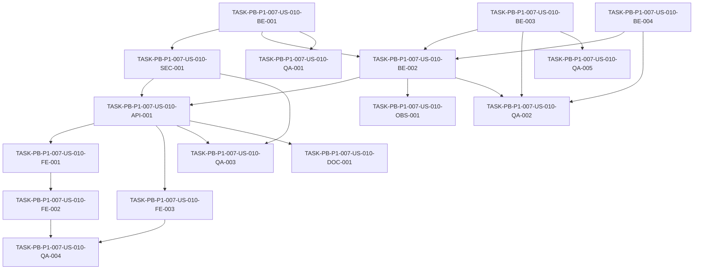

# Development Tasks — PB-P1-007 / US-010: Editar mi evento (excepto moneda)

## 1. Metadata

| Field | Value |
|---|---|
| User Story ID | US-010 |
| Source User Story | `management/user-stories/US-010-edit-own-event.md` |
| Source Technical Specification | `management/technical-specs/P1/PB-P1-007/US-010-technical-spec.md` |
| Decision Resolution Artifact | No aplica |
| Priority | P1 |
| Backlog ID | PB-P1-007 |
| Backlog Title | Ciclo de vida del evento (edit / cancel / soft delete) |
| Backlog Execution Order | 25 (P0: 18 + posición 7 en P1) |
| User Story Position in Backlog Item | 1 de 3 |
| Related User Stories in Backlog Item | US-010, US-011, US-012 |
| Epic | EPIC-EVT-001 — Organizer Event Management |
| Backlog Item Dependencies | PB-P1-006 |
| Feature | Edición de evento propio |
| Module / Domain | Events |
| Backlog Alignment Status | Found |
| Task Breakdown Status | Ready for Sprint Planning |
| Created Date | 2026-06-25 |
| Last Updated | 2026-06-25 |

---

## 2. Source Validation

| Source | Found | Used | Notes |
|---|---|---|---|
| User Story | Yes | Yes | `Approved`. |
| Technical Specification | Yes | Yes | `Ready for Task Breakdown`. |
| Decision Resolution Artifact | No | No | Sin blockers. |
| Product Backlog Prioritized | Yes | Yes | PB-P1-007. |
| ADRs | Yes | Yes | ADR-BE-003 aplica. |

---

## 3. Backlog Execution Context

### Parent Backlog Item

PB-P1-007 — Ciclo de vida del evento (edit / cancel / soft delete). Cubre tres operaciones del organizador sobre un evento existente. Esta US implementa solo la edición.

### Execution Order Rationale

Se ejecuta inmediatamente después de PB-P1-006 (creación). US-010 es la primera del backlog item para establecer la inmutabilidad de moneda y el flujo de actualización antes de implementar cancel y soft delete.

### Related User Stories in Same Backlog Item

| User Story | Role in Backlog Item | Suggested Order |
|---|---|---|
| US-010 | Editar campos permitidos | 1 |
| US-011 | Cancelar `active` con cascada | 2 |
| US-012 | Soft delete sólo en `draft` | 3 |

---

## 4. Task Breakdown Summary

| Area | Number of Tasks | Notes |
|---|---:|---|
| Backend (BE) | 4 | DTO, use case, service de recálculo, repositorios. |
| API Contract (API) | 1 | `PATCH /api/v1/events/:id`. |
| Security / Authorization (SEC) | 1 | Ownership opaque + role guard + DTO strict. |
| Observability / Audit (OBS) | 1 | Log `event.updated`. |
| Frontend (FE) | 3 | Page, form, hook + diálogo. |
| QA / Testing (QA) | 5 | Unit, integration, API, E2E + a11y. |
| Documentation (DOC) | 1 | `docs/9` y `docs/16`. |
| **Total** | **16** | |

---

## 5. Traceability Matrix

| Acceptance Criterion | Technical Spec Section | Task IDs |
|---|---|---|
| AC-01 — Edición exitosa | §7, §9 | BE-002, BE-001, BE-003, API-001, FE-002, QA-002, QA-003 |
| AC-02 — Recálculo preserva overrides | §7, §10 | BE-002, BE-003, QA-002 |
| AC-03 — Bloqueo en terminales | §7 | BE-002, QA-003 |
| AC-04 — Cambio de idioma propaga | §7 | BE-001, BE-002, QA-002 |
| EC-01 — Currency en payload | §7, §12 | BE-001, SEC-001, QA-001, QA-003 |
| EC-02 — Override manual | §7 | BE-003, QA-002 |
| EC-03 — Concurrencia | §8 | FE-002, DOC-001 |
| SEC-01..05 | §12 | SEC-001, OBS-001, QA-003 |

(Identificadores de tarea abreviados; ver §6 para los IDs completos.)

---

## 6. Development Tasks

### TASK-PB-P1-007-US-010-BE-001 — `UpdateEventDTO` Zod `.strict()` parcial

| Field | Value |
|---|---|
| Area | Backend |
| Type | Implementation |
| Priority | Must |
| Estimate | S |
| Depends On | — |
| Source AC(s) | AC-01, AC-04, EC-01 |
| Technical Spec Section(s) | §7 |
| Backlog ID | PB-P1-007 |
| User Story ID | US-010 |
| Owner Role | Backend |
| Status | To Do |

#### Objective

Definir el DTO de actualización parcial con whitelist explícita y rechazo de campos inmutables.

#### Scope

##### Include

* `.strict()`, `.partial()`, enums consistentes con `CreateEventDTO`.
* Mensaje `IMMUTABLE_FIELD` mapeado en el handler.

##### Exclude

* Cancel/soft delete (otras US).

#### Implementation Notes

* Compartir enums entre US-009 y US-010 desde un módulo común.

#### Acceptance Criteria Covered

AC-01, AC-04, EC-01.

#### Definition of Done

- [ ] Schema exportado.
- [ ] Tests en QA-001.

---

### TASK-PB-P1-007-US-010-BE-002 — `UpdateEventUseCase` con ownership y estado válido

| Field | Value |
|---|---|
| Area | Backend |
| Type | Implementation |
| Priority | Must |
| Estimate | M |
| Depends On | TASK-PB-P1-007-US-010-BE-001, TASK-PB-P1-007-US-010-BE-003 |
| Source AC(s) | AC-01, AC-02, AC-03, AC-04 |
| Technical Spec Section(s) | §7, §12 |
| Backlog ID | PB-P1-007 |
| User Story ID | US-010 |
| Owner Role | Backend |
| Status | To Do |

#### Objective

Implementar el use case que valida ownership (opaque 404), valida estado editable, aplica el patch y dispara recálculo cuando cambia `event_date`.

#### Scope

##### Include

* `event.owner_user_id === session.userId` o `EventNotFoundForOwner`.
* `status ∈ {draft, active}` o `EventLocked`.
* Transacción que envuelve update + recálculo.

##### Exclude

* Cancel y soft delete.

#### Implementation Notes

* Mantener excepciones de dominio mapeadas en el controller.

#### Acceptance Criteria Covered

AC-01, AC-02, AC-03, AC-04.

#### Definition of Done

- [ ] Use case implementado.
- [ ] Cobertura en QA-002.

---

### TASK-PB-P1-007-US-010-BE-003 — `RecalculateEventTaskDueDatesService` (respeta `manual_override`)

| Field | Value |
|---|---|
| Area | Backend |
| Type | Implementation |
| Priority | Must |
| Estimate | M |
| Depends On | — |
| Source AC(s) | AC-02, EC-02 |
| Technical Spec Section(s) | §7, §10 |
| Backlog ID | PB-P1-007 |
| User Story ID | US-010 |
| Owner Role | Backend |
| Status | To Do |

#### Objective

Implementar el servicio de recálculo de `EventTask.due_date` para tareas IA cuando cambia `event_date`, preservando `manual_override=true`.

#### Scope

##### Include

* `updateMany` filtrado por `event_id`, `ai_generated=true`, `manual_override=false`.
* Cálculo `due_date = newEventDate - relative_offset_days`.
* Fallback: si la columna `manual_override` aún no existe, recalcular todas las tareas IA y registrar log de advertencia.

##### Exclude

* Edición individual de tareas (US-018).

#### Implementation Notes

* Documentar el fallback en el código y en el log de advertencia.

#### Acceptance Criteria Covered

AC-02, EC-02.

#### Definition of Done

- [ ] Servicio implementado.
- [ ] Tests integration en QA-002.

---

### TASK-PB-P1-007-US-010-BE-004 — Repositorios `EventPrismaRepository.update` y `EventTaskPrismaRepository.recalculateDueDates`

| Field | Value |
|---|---|
| Area | Backend |
| Type | Implementation |
| Priority | Must |
| Estimate | S |
| Depends On | — |
| Source AC(s) | AC-01, AC-02 |
| Technical Spec Section(s) | §10 |
| Backlog ID | PB-P1-007 |
| User Story ID | US-010 |
| Owner Role | Backend |
| Status | To Do |

#### Objective

Extender los repositorios para soportar update parcial y recálculo de fechas.

#### Scope

##### Include

* `update(eventId, patch)` con campos whitelisted.
* `recalculateDueDates(eventId, newEventDate, opts)`.

##### Exclude

* Cancelación y soft delete.

#### Implementation Notes

* Reusar el patrón establecido en US-009.

#### Acceptance Criteria Covered

AC-01, AC-02.

#### Definition of Done

- [ ] Métodos implementados y cubiertos por integration tests (QA-002).

---

### TASK-PB-P1-007-US-010-API-001 — Controller `PATCH /api/v1/events/:id`

| Field | Value |
|---|---|
| Area | API Contract |
| Type | Implementation |
| Priority | Must |
| Estimate | S |
| Depends On | TASK-PB-P1-007-US-010-BE-001, TASK-PB-P1-007-US-010-BE-002, TASK-PB-P1-007-US-010-SEC-001 |
| Source AC(s) | AC-01, AC-03 |
| Technical Spec Section(s) | §9 |
| Backlog ID | PB-P1-007 |
| User Story ID | US-010 |
| Owner Role | Backend |
| Status | To Do |

#### Objective

Exponer el endpoint de actualización parcial.

#### Scope

##### Include

* Mapeo de excepciones a códigos HTTP 200/400/401/403/404/409.

##### Exclude

* Otros endpoints del backlog item.

#### Implementation Notes

* Manejar 404 opaque consistente con la decisión de la Tech Spec.

#### Acceptance Criteria Covered

AC-01, AC-03.

#### Definition of Done

- [ ] Endpoint disponible.
- [ ] Tests API en QA-003.

---

### TASK-PB-P1-007-US-010-SEC-001 — Ownership opaque + role guard + DTO strict

| Field | Value |
|---|---|
| Area | Security / Authorization |
| Type | Implementation |
| Priority | Must |
| Estimate | S |
| Depends On | TASK-PB-P1-007-US-010-BE-001 |
| Source AC(s) | SEC-01..05 |
| Technical Spec Section(s) | §12 |
| Backlog ID | PB-P1-007 |
| User Story ID | US-010 |
| Owner Role | Backend |
| Status | To Do |

#### Objective

Asegurar role guard `Organizer`, ownership opaque (404) y rechazo de campos inmutables en el DTO.

#### Scope

##### Include

* Role guard, ownership check temprano en el use case.
* `.strict()` confirmado.

##### Exclude

* Auditoría extendida.

#### Implementation Notes

* Documentar la decisión 404 vs 403 en `docs/19`.

#### Acceptance Criteria Covered

SEC-01..05.

#### Definition of Done

- [ ] Guards activos en el controller.
- [ ] Tests negativos en QA-003.

---

### TASK-PB-P1-007-US-010-OBS-001 — Log `event.updated` con `changed_fields` y `recalculated_tasks_count`

| Field | Value |
|---|---|
| Area | Observability / Audit |
| Type | Implementation |
| Priority | Must |
| Estimate | XS |
| Depends On | TASK-PB-P1-007-US-010-BE-002 |
| Source AC(s) | AC-01, AC-02 |
| Technical Spec Section(s) | §14 |
| Backlog ID | PB-P1-007 |
| User Story ID | US-010 |
| Owner Role | Backend |
| Status | To Do |

#### Objective

Emitir un log estructurado con los campos modificados y el conteo de tareas recalculadas.

#### Scope

##### Include

* `correlation_id`, `event_id`, `owner_user_id`, `changed_fields[]`, `recalculated_tasks_count`.

##### Exclude

* `AdminAction` (no aplica).

#### Implementation Notes

* No emitir valores sensibles, solo claves modificadas.

#### Acceptance Criteria Covered

AC-01, AC-02.

#### Definition of Done

- [ ] Log presente.
- [ ] Test unit verifica los campos.

---

### TASK-PB-P1-007-US-010-FE-001 — Página `/[locale]/organizer/events/:id/edit`

| Field | Value |
|---|---|
| Area | Frontend |
| Type | Implementation |
| Priority | Must |
| Estimate | S |
| Depends On | TASK-PB-P1-007-US-010-API-001 |
| Source AC(s) | AC-01 |
| Technical Spec Section(s) | §8 |
| Backlog ID | PB-P1-007 |
| User Story ID | US-010 |
| Owner Role | Frontend |
| Status | To Do |

#### Objective

Crear la ruta de edición del evento con guard de sesión y rol; cargar el evento previo.

#### Scope

##### Include

* Skeleton al cargar el evento.
* Redirección al dashboard tras éxito.

##### Exclude

* Cancel / soft delete (US-011/US-012).

#### Implementation Notes

* Si `getById` no existe, definir hook mínimo o coordinar con PB-P1-008.

#### Acceptance Criteria Covered

AC-01.

#### Definition of Done

- [ ] Página accesible para `Organizer` dueño.
- [ ] Manejo de 404/409 con mensajes amistosos.

---

### TASK-PB-P1-007-US-010-FE-002 — `EventEditForm` + `CurrencyReadonlyField` + `RecalcConfirmationDialog`

| Field | Value |
|---|---|
| Area | Frontend |
| Type | Implementation |
| Priority | Must |
| Estimate | M |
| Depends On | TASK-PB-P1-007-US-010-FE-001 |
| Source AC(s) | AC-01, AC-02, AC-04, EC-01, EC-03 |
| Technical Spec Section(s) | §8 |
| Backlog ID | PB-P1-007 |
| User Story ID | US-010 |
| Owner Role | Frontend |
| Status | To Do |

#### Objective

Construir el formulario de edición con campo de moneda readonly, validación por campo, envío de `dirtyFields` y diálogo informativo al cambiar la fecha.

#### Scope

##### Include

* `EventEditForm` con RHF + Zod.
* `CurrencyReadonlyField` con tooltip accesible.
* `RecalcConfirmationDialog` al detectar `event_date` modificado.

##### Exclude

* Edición de tareas individuales.

#### Implementation Notes

* Mapear códigos de error: `IMMUTABLE_FIELD`, `EVENT_LOCKED`, `NOT_FOUND`.

#### Acceptance Criteria Covered

AC-01, AC-02, AC-04, EC-01, EC-03.

#### Definition of Done

- [ ] Form funcional.
- [ ] Cobertura por QA-004.

---

### TASK-PB-P1-007-US-010-FE-003 — Hook `useUpdateEvent`

| Field | Value |
|---|---|
| Area | Frontend |
| Type | Implementation |
| Priority | Must |
| Estimate | S |
| Depends On | TASK-PB-P1-007-US-010-API-001 |
| Source AC(s) | AC-01 |
| Technical Spec Section(s) | §8 |
| Backlog ID | PB-P1-007 |
| User Story ID | US-010 |
| Owner Role | Frontend |
| Status | To Do |

#### Objective

Implementar mutation TanStack para la actualización y manejar éxito/errores.

#### Scope

##### Include

* Invalidaciones de cache del evento.
* Redirección y toast en éxito.

##### Exclude

* Persistencia local (no requerida para edición).

#### Implementation Notes

* Reusar el cliente HTTP estándar.

#### Acceptance Criteria Covered

AC-01.

#### Definition of Done

- [ ] Hook implementado y cubierto en QA-004.

---

### TASK-PB-P1-007-US-010-QA-001 — Tests Vitest de `UpdateEventDTO` (VR-01..VR-09 + `.strict()`)

| Field | Value |
|---|---|
| Area | QA / Testing |
| Type | Test |
| Priority | Must |
| Estimate | S |
| Depends On | TASK-PB-P1-007-US-010-BE-001 |
| Source AC(s) | EC-01, AC-04, VR-01..VR-09 |
| Technical Spec Section(s) | §13 |
| Backlog ID | PB-P1-007 |
| User Story ID | US-010 |
| Owner Role | QA |
| Status | To Do |

#### Objective

Cubrir cada regla de validación y el rechazo de campos inmutables.

#### Scope

##### Include

* Casos por cada enum y por cada campo opcional.
* Casos negativos para `currency_code`, `status`, `owner_user_id`, `id`, `event_type_code`.

##### Exclude

* Tests de controller (QA-003).

#### Implementation Notes

* Parametrizar enums.

#### Acceptance Criteria Covered

EC-01, AC-04.

#### Definition of Done

- [ ] 100% de VR cubiertas.

---

### TASK-PB-P1-007-US-010-QA-002 — Tests de use case y servicio de recálculo

| Field | Value |
|---|---|
| Area | QA / Testing |
| Type | Test |
| Priority | Must |
| Estimate | M |
| Depends On | TASK-PB-P1-007-US-010-BE-002, TASK-PB-P1-007-US-010-BE-003, TASK-PB-P1-007-US-010-BE-004 |
| Source AC(s) | AC-01, AC-02, AC-04, EC-02 |
| Technical Spec Section(s) | §13 |
| Backlog ID | PB-P1-007 |
| User Story ID | US-010 |
| Owner Role | QA |
| Status | To Do |

#### Objective

Cubrir el comportamiento del `UpdateEventUseCase` y del `RecalculateEventTaskDueDatesService`.

#### Scope

##### Include

* Happy paths en `draft`/`active`.
* Recálculo con/sin `manual_override`.
* Cambio de idioma.
* Estado terminal lanza `EventLocked`.

##### Exclude

* E2E UI.

#### Implementation Notes

* Mockear repos para unit, usar Prisma de test para integration.

#### Acceptance Criteria Covered

AC-01, AC-02, AC-04, EC-02.

#### Definition of Done

- [ ] Suites verdes.

---

### TASK-PB-P1-007-US-010-QA-003 — API tests Supertest (positivos, negativos y autorización)

| Field | Value |
|---|---|
| Area | QA / Testing |
| Type | Test |
| Priority | Must |
| Estimate | M |
| Depends On | TASK-PB-P1-007-US-010-API-001, TASK-PB-P1-007-US-010-SEC-001 |
| Source AC(s) | AC-01, AC-03, EC-01, SEC-01..05 |
| Technical Spec Section(s) | §13 |
| Backlog ID | PB-P1-007 |
| User Story ID | US-010 |
| Owner Role | QA |
| Status | To Do |

#### Objective

Cubrir `PATCH /events/:id` con happy path y NT-01..NT-09 y AUTH-TS-01..05.

#### Scope

##### Include

* Casos 200, 400 (validation, immutable, language), 401, 403, 404, 409.

##### Exclude

* Cancel y soft delete.

#### Implementation Notes

* Sembrar eventos en cada estado para cubrir NT-03.

#### Acceptance Criteria Covered

AC-01, AC-03, EC-01, SEC-01..05.

#### Definition of Done

- [ ] Suite Supertest verde.

---

### TASK-PB-P1-007-US-010-QA-004 — E2E Playwright + a11y axe del formulario

| Field | Value |
|---|---|
| Area | QA / Testing |
| Type | Test |
| Priority | Must |
| Estimate | M |
| Depends On | TASK-PB-P1-007-US-010-FE-002, TASK-PB-P1-007-US-010-FE-003 |
| Source AC(s) | AC-01, AC-02, AC-04 |
| Technical Spec Section(s) | §13 |
| Backlog ID | PB-P1-007 |
| User Story ID | US-010 |
| Owner Role | QA |
| Status | To Do |

#### Objective

Validar el flujo completo desde el dashboard, incluyendo el diálogo de recálculo y la lectura readonly de moneda.

#### Scope

##### Include

* Cambio de fecha que dispara el diálogo.
* Submit exitoso y mensajes de error.
* Axe-core sin violaciones críticas.

##### Exclude

* Mocks de backend; usar backend real con seed.

#### Implementation Notes

* Usar storage state del organizador semilla.

#### Acceptance Criteria Covered

AC-01, AC-02, AC-04.

#### Definition of Done

- [ ] Suite Playwright verde.

---

### TASK-PB-P1-007-US-010-QA-005 — Tests específicos de tareas IA preservando overrides

| Field | Value |
|---|---|
| Area | QA / Testing |
| Type | Test |
| Priority | Must |
| Estimate | S |
| Depends On | TASK-PB-P1-007-US-010-BE-003 |
| Source AC(s) | AC-02, EC-02 |
| Technical Spec Section(s) | §13, §10 |
| Backlog ID | PB-P1-007 |
| User Story ID | US-010 |
| Owner Role | QA |
| Status | To Do |

#### Objective

Verificar que el recálculo respeta `manual_override` y aplica el fallback cuando la columna no existe.

#### Scope

##### Include

* Caso A: column existente, mezcla de tareas con/sin override.
* Caso B: column no existente, recalcula todas + log de advertencia.

##### Exclude

* Generación IA real (otras US).

#### Implementation Notes

* Usar feature flag o detección dinámica para el fallback.

#### Acceptance Criteria Covered

AC-02, EC-02.

#### Definition of Done

- [ ] Tests verdes en ambos modos.

---

### TASK-PB-P1-007-US-010-DOC-001 — Actualizar `docs/9` y `docs/16` con la edición parcial

| Field | Value |
|---|---|
| Area | Documentation / Traceability |
| Type | Documentation |
| Priority | Should |
| Estimate | S |
| Depends On | TASK-PB-P1-007-US-010-API-001 |
| Source AC(s) | AC-01 |
| Technical Spec Section(s) | §16, §9 |
| Backlog ID | PB-P1-007 |
| User Story ID | US-010 |
| Owner Role | Tech Lead |
| Status | To Do |

#### Objective

Documentar en `docs/9` la inclusión de `estimated_guests` y `notes` como editables y agregar el contrato del `PATCH` en `docs/16`.

#### Scope

##### Include

* Nota en `docs/9` confirmando whitelist.
* Sección en `docs/16` con request/response y errores.
* Nota en `docs/19` sobre 404 opaque vs 403.

##### Exclude

* Cambios a ADRs.

#### Implementation Notes

* Mantener consistencia de formato con entradas existentes.

#### Acceptance Criteria Covered

AC-01.

#### Definition of Done

- [ ] PRs de documentación mergeados.

---

## 7. Required QA Tasks

| Task ID | Test Type | Purpose |
|---|---|---|
| TASK-PB-P1-007-US-010-QA-001 | Unit | Validación DTO. |
| TASK-PB-P1-007-US-010-QA-002 | Unit + Integration | Use case + servicio. |
| TASK-PB-P1-007-US-010-QA-003 | API | Contratos y autorización. |
| TASK-PB-P1-007-US-010-QA-004 | E2E + a11y | Formulario completo. |
| TASK-PB-P1-007-US-010-QA-005 | Integration | Recálculo con/sin `manual_override`. |

---

## 8. Required Security Tasks

| Task ID | Security Concern | Purpose |
|---|---|---|
| TASK-PB-P1-007-US-010-SEC-001 | Ownership opaque + role guard + DTO strict | Asegurar SEC-01..05. |
| TASK-PB-P1-007-US-010-QA-003 | Negativos 401/403/404 + campos inmutables | Verificación en endpoints. |

---

## 9. Required Seed / Demo Tasks

`No aplica`.

(El seed de US-009 es suficiente para este flujo.)

---

## 10. Observability / Audit Tasks

| Task ID | Concern | Purpose |
|---|---|---|
| TASK-PB-P1-007-US-010-OBS-001 | Log `event.updated` | Auditoría operativa básica. |

---

## 11. Documentation / Traceability Tasks

| Task ID | Document / Artifact | Purpose |
|---|---|---|
| TASK-PB-P1-007-US-010-DOC-001 | `docs/9`, `docs/16`, `docs/19` | Documentar whitelist, contrato del PATCH y política 404 opaque. |

---

## 12. Dependency Graph

---

## 13. Suggested Implementation Order

### Phase 1 — Foundation

1. TASK-PB-P1-007-US-010-BE-001
2. TASK-PB-P1-007-US-010-BE-003
3. TASK-PB-P1-007-US-010-BE-004

### Phase 2 — Core Implementation

4. TASK-PB-P1-007-US-010-BE-002
5. TASK-PB-P1-007-US-010-SEC-001
6. TASK-PB-P1-007-US-010-OBS-001
7. TASK-PB-P1-007-US-010-API-001
8. TASK-PB-P1-007-US-010-FE-001
9. TASK-PB-P1-007-US-010-FE-003
10. TASK-PB-P1-007-US-010-FE-002

### Phase 3 — Validation / Security / QA

11. TASK-PB-P1-007-US-010-QA-001
12. TASK-PB-P1-007-US-010-QA-002
13. TASK-PB-P1-007-US-010-QA-005
14. TASK-PB-P1-007-US-010-QA-003
15. TASK-PB-P1-007-US-010-QA-004

### Phase 4 — Documentation / Review

16. TASK-PB-P1-007-US-010-DOC-001

---

## 14. Risks & Mitigations

| Risk | Impact | Mitigation | Related Task |
| --- | --- | --- | --- |
| Recálculo masivo degrada P95 | Medio | `updateMany` único y medición en QA-005 | BE-003, QA-005 |
| `manual_override` aún no existe | Medio | Fallback documentado en BE-003 | BE-003, QA-005 |
| Decisión 404 vs 403 confunde clientes | Bajo | Documentación en `docs/19` | DOC-001 |
| Concurrencia "last writer wins" | Bajo | Documentado; UX actualiza al recargar | FE-002, DOC-001 |

---

## 15. Out of Scope Confirmation

* Cancelación del evento (US-011).
* Soft delete (US-012).
* Edición de tareas individuales (US-018).
* Audit trail extendido.
* Lock optimista.
* Cualquier IA.

---

## 16. Readiness for Sprint Planning

| Check                                      | Status |
| ------------------------------------------ | ------ |
| Product Backlog mapping found              | Pass   |
| Every AC maps to tasks                     | Pass   |
| Technical Spec used when available         | Pass   |
| QA tasks included                          | Pass   |
| Security tasks included if applicable      | Pass   |
| Seed/demo tasks included if applicable     | N/A    |
| Observability tasks included if applicable | Pass   |
| Documentation tasks included if applicable | Pass   |
| Task dependencies clear                    | Pass   |
| Tasks small enough                         | Pass   |
| Ready for Sprint Planning                  | Yes    |

---

## 17. Final Recommendation

`Ready for Sprint Planning`

El desglose cubre los 4 AC, los 3 EC y los 9 NT del User Story, mapea cada tarea a una sección de la Technical Specification y respeta el orden del Product Backlog (PB-P1-007, posición global 25). Se incluye fallback documentado para la dependencia condicional con `EventTask.manual_override` (US-018).
