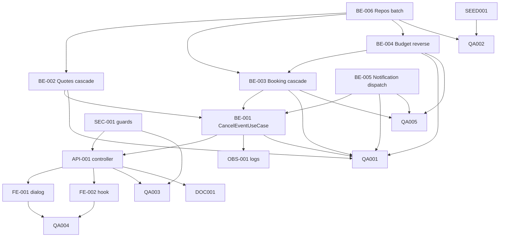

# Development Tasks — PB-P1-007 / US-011: Cancelar mi evento

## 1. Metadata

| Field | Value |
|---|---|
| User Story ID | US-011 |
| Source User Story | `management/user-stories/US-011-cancel-own-event.md` |
| Source Technical Specification | `management/technical-specs/P1/PB-P1-007/US-011-technical-spec.md` |
| Decision Resolution Artifact | No aplica |
| Priority | P1 |
| Backlog ID | PB-P1-007 |
| Backlog Title | Ciclo de vida del evento (edit / cancel / soft delete) |
| Backlog Execution Order | 25 |
| User Story Position in Backlog Item | 2 de 3 |
| Related User Stories in Backlog Item | US-010, US-011, US-012 |
| Epic | EPIC-EVT-001 — Organizer Event Management |
| Backlog Item Dependencies | PB-P1-006 |
| Feature | Cancelación de evento propio |
| Module / Domain | Events |
| Backlog Alignment Status | Found |
| Task Breakdown Status | Ready for Sprint Planning |
| Created Date | 2026-06-25 |
| Last Updated | 2026-06-25 |

---

## 2. Source Validation

| Source | Found | Used | Notes |
|---|---|---|---|
| User Story | Yes | Yes | Approved. |
| Technical Specification | Yes | Yes | Ready for Task Breakdown. |
| Decision Resolution Artifact | No | No | Sin blockers. |
| Product Backlog Prioritized | Yes | Yes | PB-P1-007. |
| ADRs | Yes | Yes | ADR-BE-003 (reglas en Application/Domain). |

---

## 3. Backlog Execution Context

### Parent Backlog Item

PB-P1-007 — Ciclo de vida del evento. US-011 entrega cancelación con cascada.

### Execution Order Rationale

Posición 2 dentro del backlog item; reutiliza ownership/role guards y patrones transaccionales de US-010.

### Related User Stories in Same Backlog Item

| User Story | Role in Backlog Item | Suggested Order |
|---|---|---|
| US-010 | Editar | 1 |
| US-011 | Cancelar con cascada | 2 |
| US-012 | Soft delete (`draft`) | 3 |

---

## 4. Task Breakdown Summary

| Area | Number of Tasks | Notes |
|---|---:|---|
| Backend (BE) | 6 | Use case + 4 servicios + repositorios. |
| API Contract (API) | 1 | `POST /events/:id/cancel`. |
| Security / Authorization (SEC) | 1 | Role guard + ownership opaque. |
| Observability / Audit (OBS) | 1 | Log `event.cancelled`. |
| Frontend (FE) | 2 | Dialog + hook. |
| QA / Testing (QA) | 5 | Unit, integration, API, E2E + a11y, cascada/reverso. |
| Seed / Demo (SEED) | 1 | Semilla de cascada de demo. |
| Documentation (DOC) | 1 | `docs/9`, `docs/16`, `docs/19`. |
| **Total** | **18** | |

---

## 5. Traceability Matrix

| Acceptance Criterion | Technical Spec Section | Task IDs (abreviados) |
|---|---|---|
| AC-01 — Cancel desde `active` | §7 | BE-001, API-001, FE-001, QA-002, QA-003 |
| AC-02 — Bloqueo posterior | §7 | BE-001, QA-003 |
| AC-03 — Cascada QuoteRequest/Quote | §7, §10 | BE-002, BE-006, QA-002 |
| AC-04 — Cascada BookingIntent + reverso committed | §7, §10 | BE-003, BE-004, QA-002 |
| AC-05 — Notificaciones a vendors | §7, §14 | BE-005, OBS-001, QA-002 |
| EC-01..04 | §7, §13 | BE-001, BE-003, BE-005, QA-002, QA-005 |
| SEC-01..05 | §12 | SEC-001, OBS-001, QA-003 |

---

## 6. Development Tasks

### TASK-PB-P1-007-US-011-BE-001 — `CancelEventUseCase` con transacción y guardas de estado

| Field | Value |
|---|---|
| Area | Backend |
| Type | Implementation |
| Priority | Must |
| Estimate | M |
| Depends On | TASK-PB-P1-007-US-011-BE-002, TASK-PB-P1-007-US-011-BE-003, TASK-PB-P1-007-US-011-BE-005 |
| Source AC(s) | AC-01, AC-02, EC-01, EC-03 |
| Technical Spec Section(s) | §7 |
| Backlog ID | PB-P1-007 |
| User Story ID | US-011 |
| Owner Role | Backend |
| Status | To Do |

#### Objective

Orquestar la cancelación del evento con validación de estado, cascada y reverso de committed dentro de `prisma.$transaction`; notificaciones post-commit.

#### Scope

##### Include

* Validación ownership (404 opaque), estado válido (409).
* Update `Event.status='cancelled'`.
* Llamadas a `QuoteCascadeCancelService`, `BookingCascadeCancelService`.
* Recolección de vendors afectados para notificación.

##### Exclude

* Soft delete, reactivación.

#### Implementation Notes

* Lock optimista por `updated_at` para idempotencia.

#### Acceptance Criteria Covered

AC-01, AC-02, EC-01, EC-03.

#### Definition of Done

- [ ] Use case implementado.
- [ ] Tests unit/integration en QA-002.

---

### TASK-PB-P1-007-US-011-BE-002 — `QuoteCascadeCancelService`

| Field | Value |
|---|---|
| Area | Backend |
| Type | Implementation |
| Priority | Must |
| Estimate | S |
| Depends On | — |
| Source AC(s) | AC-03 |
| Technical Spec Section(s) | §7, §10 |
| Backlog ID | PB-P1-007 |
| User Story ID | US-011 |
| Owner Role | Backend |
| Status | To Do |

#### Objective

Cancelar en batch las `QuoteRequest` en `{sent, viewed, responded}` y las `Quote` activas asociadas del evento.

#### Scope

##### Include

* `updateMany` con filtros por `eventId` y estados activos.
* Retornar IDs y vendors afectados.

##### Exclude

* Notificaciones (otro servicio).

#### Implementation Notes

* Si `Quote.cancelled_at/by` no existen, dejar el field sin tocar y registrar dependencia.

#### Acceptance Criteria Covered

AC-03.

#### Definition of Done

- [ ] Servicio + tests integration en QA-002.

---

### TASK-PB-P1-007-US-011-BE-003 — `BookingCascadeCancelService` con reverso de committed

| Field | Value |
|---|---|
| Area | Backend |
| Type | Implementation |
| Priority | Must |
| Estimate | M |
| Depends On | TASK-PB-P1-007-US-011-BE-004 |
| Source AC(s) | AC-04, EC-02 |
| Technical Spec Section(s) | §7, §10 |
| Backlog ID | PB-P1-007 |
| User Story ID | US-011 |
| Owner Role | Backend |
| Status | To Do |

#### Objective

Cancelar `BookingIntent` en `{pending, confirmed_intent}` y revertir `BudgetItem.committed` cuando estaba en `confirmed_intent`.

#### Scope

##### Include

* `updateMany` con `cancelled_at`, `cancelled_by='system_event_cancel'`, `cancellation_reason='event_cancelled'`.
* Llamadas a `BudgetCommitReverseService` por cada booking confirmado.

##### Exclude

* Notificaciones.

#### Implementation Notes

* Procesar por categoría para minimizar updates al `budget_items`.

#### Acceptance Criteria Covered

AC-04, EC-02.

#### Definition of Done

- [ ] Servicio + tests integration en QA-002 y QA-005.

---

### TASK-PB-P1-007-US-011-BE-004 — `BudgetCommitReverseService`

| Field | Value |
|---|---|
| Area | Backend |
| Type | Implementation |
| Priority | Must |
| Estimate | S |
| Depends On | — |
| Source AC(s) | AC-04 |
| Technical Spec Section(s) | §7, §10 |
| Backlog ID | PB-P1-007 |
| User Story ID | US-011 |
| Owner Role | Backend |
| Status | To Do |

#### Objective

Decrementar `BudgetItem.committed` para la categoría afectada por la cancelación de cada `BookingIntent.confirmed_intent`.

#### Scope

##### Include

* Update atómico con guardia `committed >= amount`.

##### Exclude

* Reglas de revert para escenarios distintos al evento cancelado.

#### Implementation Notes

* Documentar comportamiento si `committed` cae bajo cero.

#### Acceptance Criteria Covered

AC-04.

#### Definition of Done

- [ ] Servicio + tests en QA-005.

---

### TASK-PB-P1-007-US-011-BE-005 — `NotificationDispatchService` con fallback log

| Field | Value |
|---|---|
| Area | Backend |
| Type | Implementation |
| Priority | Must |
| Estimate | S |
| Depends On | — |
| Source AC(s) | AC-05, EC-04 |
| Technical Spec Section(s) | §7, §14 |
| Backlog ID | PB-P1-007 |
| User Story ID | US-011 |
| Owner Role | Backend |
| Status | To Do |

#### Objective

Despachar notificaciones in-app por vendor afectado y log estructurado `email.simulated.sent` (BR-NOTIF-003).

#### Scope

##### Include

* Batch a `notifications` cuando el módulo está disponible.
* Fallback log estructurado si la tabla no existe.

##### Exclude

* Envío real de email.

#### Implementation Notes

* La función se ejecuta post-commit; los errores se registran como warnings.

#### Acceptance Criteria Covered

AC-05, EC-04.

#### Definition of Done

- [ ] Servicio + tests unit.

---

### TASK-PB-P1-007-US-011-BE-006 — Extensiones de repositorios

| Field | Value |
|---|---|
| Area | Backend |
| Type | Implementation |
| Priority | Must |
| Estimate | S |
| Depends On | — |
| Source AC(s) | AC-01, AC-03, AC-04 |
| Technical Spec Section(s) | §10 |
| Backlog ID | PB-P1-007 |
| User Story ID | US-011 |
| Owner Role | Backend |
| Status | To Do |

#### Objective

Agregar métodos batch a los repositorios involucrados.

#### Scope

##### Include

* `EventPrismaRepository.markCancelled`.
* `QuoteRequestPrismaRepository.cancelByEvent`.
* `QuotePrismaRepository.cancelByQuoteRequests`.
* `BookingIntentPrismaRepository.cancelByEvent`.
* `BudgetItemPrismaRepository.decrementCommitted`.

##### Exclude

* Lectura optimizada para resumen del cancel-preview.

#### Implementation Notes

* Aceptar `tx` opcional para participar en transacciones.

#### Acceptance Criteria Covered

AC-01, AC-03, AC-04.

#### Definition of Done

- [ ] Métodos + integration tests en QA-002.

---

### TASK-PB-P1-007-US-011-API-001 — Controller `POST /api/v1/events/:id/cancel`

| Field | Value |
|---|---|
| Area | API Contract |
| Type | Implementation |
| Priority | Must |
| Estimate | S |
| Depends On | TASK-PB-P1-007-US-011-BE-001, TASK-PB-P1-007-US-011-SEC-001 |
| Source AC(s) | AC-01, AC-02 |
| Technical Spec Section(s) | §9 |
| Backlog ID | PB-P1-007 |
| User Story ID | US-011 |
| Owner Role | Backend |
| Status | To Do |

#### Objective

Exponer el endpoint y mapear errores a códigos HTTP.

#### Scope

##### Include

* DTO `{}` strict; respuesta `EventCancellationResultDTO`.

##### Exclude

* `cancel-preview`.

#### Implementation Notes

* Mantener consistencia con códigos de US-010 (404 opaque, 409 EVENT_LOCKED).

#### Acceptance Criteria Covered

AC-01, AC-02.

#### Definition of Done

- [ ] Endpoint disponible.
- [ ] API tests en QA-003.

---

### TASK-PB-P1-007-US-011-SEC-001 — Role guard + ownership opaque + DTO strict

| Field | Value |
|---|---|
| Area | Security / Authorization |
| Type | Implementation |
| Priority | Must |
| Estimate | XS |
| Depends On | — |
| Source AC(s) | SEC-01..05 |
| Technical Spec Section(s) | §12 |
| Backlog ID | PB-P1-007 |
| User Story ID | US-011 |
| Owner Role | Backend |
| Status | To Do |

#### Objective

Asegurar role guard `Organizer`, ownership opaque (404) y DTO `.strict()`.

#### Scope

##### Include

* Reuso de middleware estándar.

##### Exclude

* Auditoría extendida.

#### Acceptance Criteria Covered

SEC-01..05.

#### Definition of Done

- [ ] Guards activos.

---

### TASK-PB-P1-007-US-011-OBS-001 — Log `event.cancelled` con conteos y warnings

| Field | Value |
|---|---|
| Area | Observability / Audit |
| Type | Implementation |
| Priority | Must |
| Estimate | XS |
| Depends On | TASK-PB-P1-007-US-011-BE-001 |
| Source AC(s) | AC-01, AC-05 |
| Technical Spec Section(s) | §14 |
| Backlog ID | PB-P1-007 |
| User Story ID | US-011 |
| Owner Role | Backend |
| Status | To Do |

#### Objective

Emitir log estructurado con `from_status`, conteos por entidad y `notifications_emitted`. Warnings en fallos de notificación.

#### Acceptance Criteria Covered

AC-01, AC-05.

#### Definition of Done

- [ ] Log verificado en tests unit.

---

### TASK-PB-P1-007-US-011-FE-001 — `CancelEventDialog` + `CancelImpactSummary`

| Field | Value |
|---|---|
| Area | Frontend |
| Type | Implementation |
| Priority | Must |
| Estimate | M |
| Depends On | TASK-PB-P1-007-US-011-API-001 |
| Source AC(s) | AC-01, AC-02, AC-05 |
| Technical Spec Section(s) | §8 |
| Backlog ID | PB-P1-007 |
| User Story ID | US-011 |
| Owner Role | Frontend |
| Status | To Do |

#### Objective

Implementar el modal de doble confirmación con resumen de impacto.

#### Scope

##### Include

* Trampa de foco, retorno al disparador.
* Resumen de vendors y bookings impactados.
* Manejo de errores `EVENT_LOCKED`/`NOT_FOUND`.

##### Exclude

* Captura de `cancellation_reason` libre.

#### Implementation Notes

* Diferenciar visualmente el botón destructivo.

#### Acceptance Criteria Covered

AC-01, AC-02, AC-05.

#### Definition of Done

- [ ] Modal accesible y cubierto por QA-004.

---

### TASK-PB-P1-007-US-011-FE-002 — Hook `useCancelEvent`

| Field | Value |
|---|---|
| Area | Frontend |
| Type | Implementation |
| Priority | Must |
| Estimate | XS |
| Depends On | TASK-PB-P1-007-US-011-API-001 |
| Source AC(s) | AC-01 |
| Technical Spec Section(s) | §8 |
| Backlog ID | PB-P1-007 |
| User Story ID | US-011 |
| Owner Role | Frontend |
| Status | To Do |

#### Objective

Mutation TanStack con invalidación de cache y redirect al listado.

#### Acceptance Criteria Covered

AC-01.

#### Definition of Done

- [ ] Hook implementado + cobertura en QA-004.

---

### TASK-PB-P1-007-US-011-QA-001 — Tests unit `CancelEventUseCase` y servicios colaboradores

| Field | Value |
|---|---|
| Area | QA / Testing |
| Type | Test |
| Priority | Must |
| Estimate | S |
| Depends On | TASK-PB-P1-007-US-011-BE-001, BE-002, BE-003, BE-004, BE-005 |
| Source AC(s) | AC-01..AC-05, EC-01..EC-04 |
| Technical Spec Section(s) | §13 |
| Backlog ID | PB-P1-007 |
| User Story ID | US-011 |
| Owner Role | QA |
| Status | To Do |

#### Objective

Cubrir comportamientos en aislamiento de cada componente.

#### Acceptance Criteria Covered

AC-01..AC-05, EC-01..EC-04.

#### Definition of Done

- [ ] Suite verde.

---

### TASK-PB-P1-007-US-011-QA-002 — Tests integration de cascada y notificaciones

| Field | Value |
|---|---|
| Area | QA / Testing |
| Type | Test |
| Priority | Must |
| Estimate | M |
| Depends On | TASK-PB-P1-007-US-011-BE-001..006, TASK-PB-P1-007-US-011-SEED-001 |
| Source AC(s) | AC-01, AC-03, AC-04, AC-05 |
| Technical Spec Section(s) | §13 |
| Backlog ID | PB-P1-007 |
| User Story ID | US-011 |
| Owner Role | QA |
| Status | To Do |

#### Objective

Validar el flujo end-to-end de cascada con Prisma de test, incluida la emisión de notificaciones y el reverso de committed.

#### Acceptance Criteria Covered

AC-01, AC-03, AC-04, AC-05.

#### Definition of Done

- [ ] Suite integration verde.

---

### TASK-PB-P1-007-US-011-QA-003 — API tests Supertest (positivos, negativos, autorización)

| Field | Value |
|---|---|
| Area | QA / Testing |
| Type | Test |
| Priority | Must |
| Estimate | M |
| Depends On | TASK-PB-P1-007-US-011-API-001, TASK-PB-P1-007-US-011-SEC-001 |
| Source AC(s) | AC-01, AC-02, SEC-01..05 |
| Technical Spec Section(s) | §13 |
| Backlog ID | PB-P1-007 |
| User Story ID | US-011 |
| Owner Role | QA |
| Status | To Do |

#### Objective

Cubrir 200/401/403/404/409 y idempotencia.

#### Acceptance Criteria Covered

AC-01, AC-02, SEC-01..05.

#### Definition of Done

- [ ] Suite verde.

---

### TASK-PB-P1-007-US-011-QA-004 — E2E Playwright + a11y axe del modal

| Field | Value |
|---|---|
| Area | QA / Testing |
| Type | Test |
| Priority | Must |
| Estimate | M |
| Depends On | TASK-PB-P1-007-US-011-FE-001, TASK-PB-P1-007-US-011-FE-002 |
| Source AC(s) | AC-01, AC-02 |
| Technical Spec Section(s) | §13 |
| Backlog ID | PB-P1-007 |
| User Story ID | US-011 |
| Owner Role | QA |
| Status | To Do |

#### Objective

Validar doble confirmación, redirect y accesibilidad.

#### Acceptance Criteria Covered

AC-01, AC-02.

#### Definition of Done

- [ ] Suite verde.

---

### TASK-PB-P1-007-US-011-QA-005 — Tests del reverso de committed y fallback de notificación

| Field | Value |
|---|---|
| Area | QA / Testing |
| Type | Test |
| Priority | Must |
| Estimate | S |
| Depends On | TASK-PB-P1-007-US-011-BE-003, TASK-PB-P1-007-US-011-BE-004, TASK-PB-P1-007-US-011-BE-005 |
| Source AC(s) | AC-04, AC-05, EC-04 |
| Technical Spec Section(s) | §13 |
| Backlog ID | PB-P1-007 |
| User Story ID | US-011 |
| Owner Role | QA |
| Status | To Do |

#### Objective

Verificar reverso de `BudgetItem.committed` con `confirmed_intent` y el fallback log de `NotificationDispatchService`.

#### Acceptance Criteria Covered

AC-04, AC-05, EC-04.

#### Definition of Done

- [ ] Tests verdes en ambos modos.

---

### TASK-PB-P1-007-US-011-SEED-001 — Semilla de demo con cascada

| Field | Value |
|---|---|
| Area | Seed / Demo Data |
| Type | Implementation |
| Priority | Should |
| Estimate | S |
| Depends On | — |
| Source AC(s) | AC-03, AC-04, AC-05 |
| Technical Spec Section(s) | §15 |
| Backlog ID | PB-P1-007 |
| User Story ID | US-011 |
| Owner Role | Backend |
| Status | To Do |

#### Objective

Asegurar que el seed produce al menos un evento `active` con 2 `QuoteRequest` y un `BookingIntent.confirmed_intent` para el demo de cascada.

#### Acceptance Criteria Covered

AC-03, AC-04, AC-05.

#### Definition of Done

- [ ] Seed idempotente.

---

### TASK-PB-P1-007-US-011-DOC-001 — Documentar contrato y políticas

| Field | Value |
|---|---|
| Area | Documentation / Traceability |
| Type | Documentation |
| Priority | Should |
| Estimate | S |
| Depends On | TASK-PB-P1-007-US-011-API-001 |
| Source AC(s) | AC-01, AC-02, SEC-01..05 |
| Technical Spec Section(s) | §16, §9, §12 |
| Backlog ID | PB-P1-007 |
| User Story ID | US-011 |
| Owner Role | Tech Lead |
| Status | To Do |

#### Objective

Documentar en `docs/9` la denominación FR-EVENT-011 / UC-EVENT-006, agregar el contrato del `POST /events/:id/cancel` en `docs/16` y la política 404 opaque en `docs/19`.

#### Definition of Done

- [ ] PRs de documentación mergeados.

---

## 7. Required QA Tasks

| Task ID | Test Type | Purpose |
|---|---|---|
| QA-001 | Unit | Use case + servicios. |
| QA-002 | Integration | Cascada + notificaciones. |
| QA-003 | API | Contratos y autorización. |
| QA-004 | E2E + a11y | Modal y redirect. |
| QA-005 | Integration | Reverso de committed + fallback. |

---

## 8. Required Security Tasks

| Task ID | Security Concern | Purpose |
|---|---|---|
| SEC-001 | Role guard + ownership opaque | Asegurar SEC-01..05. |
| QA-003 | Negativos 401/403/404 | Verificación. |

---

## 9. Required Seed / Demo Tasks

| Task ID | Seed/Demo Concern | Purpose |
|---|---|---|
| SEED-001 | Evento con cascada | Demo de cancelación. |

---

## 10. Observability / Audit Tasks

| Task ID | Concern | Purpose |
|---|---|---|
| OBS-001 | Log `event.cancelled` + warnings | Auditoría operativa. |

---

## 11. Documentation / Traceability Tasks

| Task ID | Document | Purpose |
|---|---|---|
| DOC-001 | `docs/9`, `docs/16`, `docs/19` | Alineación documental. |

---

## 12. Dependency Graph

---

## 13. Suggested Implementation Order

### Phase 1 — Foundation

1. BE-006 — repos batch.
2. BE-004 — budget reverse.
3. BE-002 — quotes cascade.
4. BE-005 — notification dispatch.

### Phase 2 — Core Implementation

5. BE-003 — booking cascade (depende de BE-004).
6. BE-001 — `CancelEventUseCase`.
7. SEC-001 — guards.
8. OBS-001 — logs.
9. API-001 — controller.
10. SEED-001 — seed.
11. FE-002 — hook.
12. FE-001 — dialog.

### Phase 3 — Validation / Security / QA

13. QA-001.
14. QA-002.
15. QA-005.
16. QA-003.
17. QA-004.

### Phase 4 — Documentation / Review

18. DOC-001.

---

## 14. Risks & Mitigations

| Risk | Impact | Mitigation | Related Task |
| --- | --- | --- | --- |
| Cascada masiva degrada P95 | Medio | `updateMany` + medición en QA-002 | BE-002/003, QA-002 |
| Doble click cancela dos veces | Medio | Lock optimista por `Event.status` + idempotencia | BE-001 |
| Reverso bajo cero de `committed` | Bajo | Guard `committed >= amount` | BE-004 |
| Notificación falla | Bajo | Best-effort + log warning + reintento | BE-005, OBS-001, QA-005 |

---

## 15. Out of Scope Confirmation

* Reactivación.
* Soft delete (US-012).
* `cancellation_reason` libre.
* Reembolsos/penalizaciones.
* Edición de tareas tras cancelar.

---

## 16. Readiness for Sprint Planning

| Check                                      | Status |
| ------------------------------------------ | ------ |
| Product Backlog mapping found              | Pass   |
| Every AC maps to tasks                     | Pass   |
| Technical Spec used when available         | Pass   |
| QA tasks included                          | Pass   |
| Security tasks included if applicable      | Pass   |
| Seed/demo tasks included if applicable     | Pass   |
| Observability tasks included if applicable | Pass   |
| Documentation tasks included if applicable | Pass   |
| Task dependencies clear                    | Pass   |
| Tasks small enough                         | Pass   |
| Ready for Sprint Planning                  | Yes    |

---

## 17. Final Recommendation

`Ready for Sprint Planning`

El desglose cubre los 5 AC, 4 EC y 6 NT del User Story, formaliza la cascada controlada (quotes, bookings, committed) y la entrega best-effort de notificaciones. Las dependencias con `Quote.cancelled_*` y módulo `Notification` quedan documentadas con fallback.
