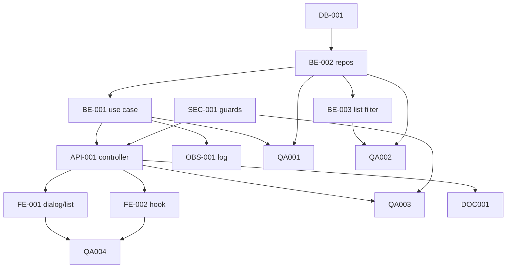

# Development Tasks — PB-P1-007 / US-012: Eliminar mi evento en estado draft (soft delete)

## 1. Metadata

| Field | Value |
|---|---|
| User Story ID | US-012 |
| Source User Story | `management/user-stories/US-012-soft-delete-draft-event.md` |
| Source Technical Specification | `management/technical-specs/P1/PB-P1-007/US-012-technical-spec.md` |
| Decision Resolution Artifact | No aplica |
| Priority | P1 |
| Backlog ID | PB-P1-007 |
| Backlog Title | Ciclo de vida del evento (edit / cancel / soft delete) |
| Backlog Execution Order | 25 |
| User Story Position in Backlog Item | 3 de 3 |
| Related User Stories in Backlog Item | US-010, US-011, US-012 |
| Epic | EPIC-EVT-001 — Organizer Event Management |
| Backlog Item Dependencies | PB-P1-006 |
| Feature | Soft delete de evento `draft` |
| Module / Domain | Events |
| Backlog Alignment Status | Found |
| Task Breakdown Status | Ready for Sprint Planning |
| Created Date | 2026-06-25 |
| Last Updated | 2026-06-25 |

---

## 2. Source Validation

| Source | Found | Used | Notes |
|---|---|---|---|
| User Story | Yes | Yes | Approved (Should Have). |
| Technical Specification | Yes | Yes | Ready for Task Breakdown. |
| Decision Resolution Artifact | No | No | Sin blockers. |
| Product Backlog Prioritized | Yes | Yes | PB-P1-007. |
| ADRs | Yes | Yes | ADR-BE-003 (reglas en Application/Domain). |

---

## 3. Backlog Execution Context

### Parent Backlog Item

PB-P1-007 — Ciclo de vida del evento.

### Execution Order Rationale

Posición 3 de 3; reutiliza el ownership opaque y los patrones establecidos en US-010 y US-011.

### Related User Stories in Same Backlog Item

| User Story | Role in Backlog Item | Suggested Order |
|---|---|---|
| US-010 | Editar | 1 |
| US-011 | Cancelar | 2 |
| US-012 | Soft delete `draft` | 3 |

---

## 4. Task Breakdown Summary

| Area | Number of Tasks | Notes |
|---|---:|---|
| Database / Prisma (DB) | 1 | Migración + índice parcial. |
| Backend (BE) | 3 | Use case, repositorio, ajustes de lectura. |
| API Contract (API) | 1 | `DELETE /events/:id`. |
| Security / Authorization (SEC) | 1 | Role guard + ownership opaque. |
| Observability / Audit (OBS) | 1 | Log `event.deleted`. |
| Frontend (FE) | 2 | Modal + hook + acción en listado. |
| QA / Testing (QA) | 4 | Unit, integration, API, E2E + a11y. |
| Seed / Demo (SEED) | 1 | Evento `draft` semilla. |
| Documentation (DOC) | 1 | `docs/9`, `docs/16`, `docs/8`. |
| **Total** | **15** | |

---

## 5. Traceability Matrix

| Acceptance Criterion | Technical Spec Section | Task IDs (abreviados) |
|---|---|---|
| AC-01 — Soft delete `draft` | §7, §10 | DB-001, BE-001, BE-002, API-001, FE-001, FE-002, QA-001, QA-002, QA-003 |
| AC-02 — Listado excluye soft-deleted | §7, §10 | BE-003, QA-002, QA-003 |
| AC-03 — GET por ID 404 para soft-deleted | §7 | BE-003, QA-002, QA-003 |
| EC-01 — Estado no `draft` | §7 | BE-001, QA-001, QA-003 |
| EC-02 — Doble click | §7 | BE-001, QA-001 |
| EC-03 — Admin lista soft-deleted | §16 | DOC-001 |
| SEC-01..05 | §12 | SEC-001, OBS-001, QA-003 |

---

## 6. Development Tasks

### TASK-PB-P1-007-US-012-DB-001 — Migración de `deleted_at`/`deleted_by` e índice parcial

| Field | Value |
|---|---|
| Area | Database / Prisma |
| Type | Implementation |
| Priority | Must |
| Estimate | S |
| Depends On | — |
| Source AC(s) | AC-01, AC-02 |
| Technical Spec Section(s) | §10 |
| Backlog ID | PB-P1-007 |
| User Story ID | US-012 |
| Owner Role | Backend |
| Status | To Do |

#### Objective

Asegurar columnas `Event.deleted_at` y `Event.deleted_by` (si no existen) e instalar el índice parcial `idx_events_active_owner ON events(owner_user_id) WHERE deleted_at IS NULL`.

#### Scope

##### Include

* Migración Prisma reversible.
* Índice parcial.

##### Exclude

* Cambios a otras tablas.

#### Implementation Notes

* Si las columnas ya existen por PB-P0-001, sólo agregar el índice parcial.

#### Acceptance Criteria Covered

AC-01, AC-02.

#### Definition of Done

- [ ] Migración aplicada.

---

### TASK-PB-P1-007-US-012-BE-001 — `SoftDeleteEventUseCase`

| Field | Value |
|---|---|
| Area | Backend |
| Type | Implementation |
| Priority | Must |
| Estimate | S |
| Depends On | TASK-PB-P1-007-US-012-BE-002 |
| Source AC(s) | AC-01, EC-01, EC-02 |
| Technical Spec Section(s) | §7 |
| Backlog ID | PB-P1-007 |
| User Story ID | US-012 |
| Owner Role | Backend |
| Status | To Do |

#### Objective

Implementar el use case con guard de estado y ownership opaque.

#### Scope

##### Include

* Validación de estado `draft`.
* Lanzar `EventNotFoundForOwner` (404) y `EventInvalidState` (409).

##### Exclude

* Cascada (no aplica).

#### Implementation Notes

* Documentar que nunca se ejecuta hard delete.

#### Acceptance Criteria Covered

AC-01, EC-01, EC-02.

#### Definition of Done

- [ ] Use case implementado.
- [ ] Cobertura en QA-001.

---

### TASK-PB-P1-007-US-012-BE-002 — Repositorio `softDelete` + `findOwnedActive`

| Field | Value |
|---|---|
| Area | Backend |
| Type | Implementation |
| Priority | Must |
| Estimate | XS |
| Depends On | TASK-PB-P1-007-US-012-DB-001 |
| Source AC(s) | AC-01, AC-03 |
| Technical Spec Section(s) | §10 |
| Backlog ID | PB-P1-007 |
| User Story ID | US-012 |
| Owner Role | Backend |
| Status | To Do |

#### Objective

Extender `EventPrismaRepository` con `softDelete(eventId, deletedBy, deletedAt)` y `findOwnedActive(eventId, ownerUserId)`.

#### Scope

##### Include

* Aceptar `tx` opcional.

##### Exclude

* Hard delete.

#### Implementation Notes

* `findOwnedActive` filtra `deleted_at IS NULL` y `owner_user_id == ownerUserId`.

#### Acceptance Criteria Covered

AC-01, AC-03.

#### Definition of Done

- [ ] Métodos + tests integration en QA-002.

---

### TASK-PB-P1-007-US-012-BE-003 — Aplicar filtro `deleted_at IS NULL` en lectura

| Field | Value |
|---|---|
| Area | Backend |
| Type | Implementation |
| Priority | Must |
| Estimate | S |
| Depends On | TASK-PB-P1-007-US-012-BE-002 |
| Source AC(s) | AC-02, AC-03 |
| Technical Spec Section(s) | §7, §10 |
| Backlog ID | PB-P1-007 |
| User Story ID | US-012 |
| Owner Role | Backend |
| Status | To Do |

#### Objective

Asegurar que `ListMyEventsUseCase` y `GetEventByIdUseCase` excluyen eventos con `deleted_at != null`.

#### Scope

##### Include

* Confirmar/insertar el filtro en consultas existentes (coordinado con PB-P1-008/US-013).
* Cobertura por test API.

##### Exclude

* Endpoints admin (FR-EVENT-010).

#### Implementation Notes

* Si PB-P1-008 todavía no se entregó, este task entrega los filtros del organizador como parte de US-012.

#### Acceptance Criteria Covered

AC-02, AC-03.

#### Definition of Done

- [ ] Filtros aplicados.
- [ ] API tests en QA-003.

---

### TASK-PB-P1-007-US-012-API-001 — Controller `DELETE /api/v1/events/:id`

| Field | Value |
|---|---|
| Area | API Contract |
| Type | Implementation |
| Priority | Must |
| Estimate | XS |
| Depends On | TASK-PB-P1-007-US-012-BE-001, TASK-PB-P1-007-US-012-SEC-001 |
| Source AC(s) | AC-01 |
| Technical Spec Section(s) | §9 |
| Backlog ID | PB-P1-007 |
| User Story ID | US-012 |
| Owner Role | Backend |
| Status | To Do |

#### Objective

Exponer el endpoint, mapear excepciones y responder `204 No Content`.

#### Acceptance Criteria Covered

AC-01.

#### Definition of Done

- [ ] Endpoint disponible.
- [ ] API tests en QA-003.

---

### TASK-PB-P1-007-US-012-SEC-001 — Role guard + ownership opaque + estado válido

| Field | Value |
|---|---|
| Area | Security / Authorization |
| Type | Implementation |
| Priority | Must |
| Estimate | XS |
| Depends On | — |
| Source AC(s) | SEC-01..05 |
| Technical Spec Section(s) | §12 |
| Backlog ID | PB-P1-007 |
| User Story ID | US-012 |
| Owner Role | Backend |
| Status | To Do |

#### Objective

Asegurar role guard `Organizer`, ownership opaque (404) y prohibición de hard delete a nivel repositorio.

#### Acceptance Criteria Covered

SEC-01..05.

#### Definition of Done

- [ ] Guards activos.

---

### TASK-PB-P1-007-US-012-OBS-001 — Log `event.deleted`

| Field | Value |
|---|---|
| Area | Observability / Audit |
| Type | Implementation |
| Priority | Must |
| Estimate | XS |
| Depends On | TASK-PB-P1-007-US-012-BE-001 |
| Source AC(s) | AC-01 |
| Technical Spec Section(s) | §14 |
| Backlog ID | PB-P1-007 |
| User Story ID | US-012 |
| Owner Role | Backend |
| Status | To Do |

#### Objective

Emitir log estructurado con `correlation_id`, `event_id`, `owner_user_id`.

#### Acceptance Criteria Covered

AC-01.

#### Definition of Done

- [ ] Log verificado en tests unit.

---

### TASK-PB-P1-007-US-012-FE-001 — `DeleteDraftDialog` + acción en `EventListRow`

| Field | Value |
|---|---|
| Area | Frontend |
| Type | Implementation |
| Priority | Must |
| Estimate | S |
| Depends On | TASK-PB-P1-007-US-012-API-001 |
| Source AC(s) | AC-01, AC-02 |
| Technical Spec Section(s) | §8 |
| Backlog ID | PB-P1-007 |
| User Story ID | US-012 |
| Owner Role | Frontend |
| Status | To Do |

#### Objective

Implementar el modal accesible y la acción "Eliminar borrador" en filas del listado, visible sólo para `status='draft'`.

#### Acceptance Criteria Covered

AC-01, AC-02.

#### Definition of Done

- [ ] Modal accesible.
- [ ] Cobertura por QA-004.

---

### TASK-PB-P1-007-US-012-FE-002 — Hook `useDeleteEvent`

| Field | Value |
|---|---|
| Area | Frontend |
| Type | Implementation |
| Priority | Must |
| Estimate | XS |
| Depends On | TASK-PB-P1-007-US-012-API-001 |
| Source AC(s) | AC-01 |
| Technical Spec Section(s) | §8 |
| Backlog ID | PB-P1-007 |
| User Story ID | US-012 |
| Owner Role | Frontend |
| Status | To Do |

#### Objective

Implementar la mutation TanStack con invalidación del listado.

#### Acceptance Criteria Covered

AC-01.

#### Definition of Done

- [ ] Hook implementado.

---

### TASK-PB-P1-007-US-012-QA-001 — Tests unit del use case

| Field | Value |
|---|---|
| Area | QA / Testing |
| Type | Test |
| Priority | Must |
| Estimate | S |
| Depends On | TASK-PB-P1-007-US-012-BE-001, TASK-PB-P1-007-US-012-BE-002 |
| Source AC(s) | AC-01, EC-01, EC-02 |
| Technical Spec Section(s) | §13 |
| Backlog ID | PB-P1-007 |
| User Story ID | US-012 |
| Owner Role | QA |
| Status | To Do |

#### Objective

Cubrir comportamientos del `SoftDeleteEventUseCase`.

#### Definition of Done

- [ ] Suite verde.

---

### TASK-PB-P1-007-US-012-QA-002 — Tests integration de lectura y soft delete

| Field | Value |
|---|---|
| Area | QA / Testing |
| Type | Test |
| Priority | Must |
| Estimate | S |
| Depends On | TASK-PB-P1-007-US-012-BE-003, TASK-PB-P1-007-US-012-BE-002 |
| Source AC(s) | AC-01, AC-02, AC-03 |
| Technical Spec Section(s) | §13 |
| Backlog ID | PB-P1-007 |
| User Story ID | US-012 |
| Owner Role | QA |
| Status | To Do |

#### Objective

Verificar listado y detalle con Prisma de test, antes y después del soft delete.

#### Definition of Done

- [ ] Suite verde.

---

### TASK-PB-P1-007-US-012-QA-003 — API tests Supertest (positivos, negativos, autorización)

| Field | Value |
|---|---|
| Area | QA / Testing |
| Type | Test |
| Priority | Must |
| Estimate | S |
| Depends On | TASK-PB-P1-007-US-012-API-001, TASK-PB-P1-007-US-012-SEC-001 |
| Source AC(s) | AC-01, EC-01, SEC-01..05 |
| Technical Spec Section(s) | §13 |
| Backlog ID | PB-P1-007 |
| User Story ID | US-012 |
| Owner Role | QA |
| Status | To Do |

#### Objective

Cubrir 204/401/403/404/409.

#### Definition of Done

- [ ] Suite verde.

---

### TASK-PB-P1-007-US-012-QA-004 — E2E Playwright + a11y axe del listado

| Field | Value |
|---|---|
| Area | QA / Testing |
| Type | Test |
| Priority | Must |
| Estimate | S |
| Depends On | TASK-PB-P1-007-US-012-FE-001, TASK-PB-P1-007-US-012-FE-002 |
| Source AC(s) | AC-01, AC-02 |
| Technical Spec Section(s) | §13 |
| Backlog ID | PB-P1-007 |
| User Story ID | US-012 |
| Owner Role | QA |
| Status | To Do |

#### Objective

Validar el flujo del modal desde el listado y la accesibilidad del componente destructivo.

#### Definition of Done

- [ ] Suite verde.

---

### TASK-PB-P1-007-US-012-SEED-001 — Evento `draft` semilla para demo

| Field | Value |
|---|---|
| Area | Seed / Demo Data |
| Type | Implementation |
| Priority | Should |
| Estimate | XS |
| Depends On | — |
| Source AC(s) | AC-01 |
| Technical Spec Section(s) | §15 |
| Backlog ID | PB-P1-007 |
| User Story ID | US-012 |
| Owner Role | Backend |
| Status | To Do |

#### Objective

Asegurar que el seed incluye al menos un evento `draft` para la demo de eliminación.

#### Definition of Done

- [ ] Seed idempotente.

---

### TASK-PB-P1-007-US-012-DOC-001 — Documentar contrato y diferencia admin/organizador

| Field | Value |
|---|---|
| Area | Documentation / Traceability |
| Type | Documentation |
| Priority | Should |
| Estimate | S |
| Depends On | TASK-PB-P1-007-US-012-API-001 |
| Source AC(s) | AC-01, AC-02, EC-03 |
| Technical Spec Section(s) | §16, §9 |
| Backlog ID | PB-P1-007 |
| User Story ID | US-012 |
| Owner Role | Tech Lead |
| Status | To Do |

#### Objective

Confirmar en `docs/9` las trazas correctas (FR-EVENT-012, UC-EVENT-006, BR-EVENT-010), agregar el contrato del `DELETE` en `docs/16` y documentar la diferencia entre listado del organizador y listado admin (FR-EVENT-007 vs FR-EVENT-010).

#### Definition of Done

- [ ] PRs de documentación mergeados.

---

## 7. Required QA Tasks

| Task ID | Test Type | Purpose |
|---|---|---|
| QA-001 | Unit | Use case. |
| QA-002 | Integration | Listado/detalle filtran soft-deleted. |
| QA-003 | API | Contratos y autorización. |
| QA-004 | E2E + a11y | Modal del listado. |

---

## 8. Required Security Tasks

| Task ID | Security Concern | Purpose |
|---|---|---|
| SEC-001 | Role guard + ownership opaque | SEC-01..05. |
| QA-003 | Negativos 401/403/404/409 | Verificación. |

---

## 9. Required Seed / Demo Tasks

| Task ID | Seed/Demo Concern | Purpose |
|---|---|---|
| SEED-001 | Evento `draft` semilla | Demo de eliminación. |

---

## 10. Observability / Audit Tasks

| Task ID | Concern | Purpose |
|---|---|---|
| OBS-001 | Log `event.deleted` | Auditoría operativa. |

---

## 11. Documentation / Traceability Tasks

| Task ID | Document | Purpose |
|---|---|---|
| DOC-001 | `docs/9`, `docs/16` | Alineación documental y diferencia admin/organizador. |

---

## 12. Dependency Graph

---

## 13. Suggested Implementation Order

### Phase 1 — Foundation

1. DB-001.
2. BE-002.

### Phase 2 — Core Implementation

3. BE-001.
4. SEC-001.
5. OBS-001.
6. BE-003.
7. API-001.
8. SEED-001.
9. FE-002.
10. FE-001.

### Phase 3 — Validation / Security / QA

11. QA-001.
12. QA-002.
13. QA-003.
14. QA-004.

### Phase 4 — Documentation / Review

15. DOC-001.

---

## 14. Risks & Mitigations

| Risk | Impact | Mitigation | Related Task |
| --- | --- | --- | --- |
| Filtro `deleted_at IS NULL` ausente en otros endpoints | Alto | BE-003 confirma filtros en listado/detalle | BE-003 |
| Hard delete accidental | Alto | Repositorio sin método `delete` | BE-002, SEC-001 |
| Endpoint usado sobre `active` | Bajo | 409 inmediato | BE-001 |
| Modal no accesible | Medio | QA-004 con axe | QA-004 |

---

## 15. Out of Scope Confirmation

* Restauración self-service o admin.
* Hard delete.
* Eliminación en estados distintos a `draft`.
* Papelera.
* Purga automática.

---

## 16. Readiness for Sprint Planning

| Check                                      | Status |
| ------------------------------------------ | ------ |
| Product Backlog mapping found              | Pass   |
| Every AC maps to tasks                     | Pass   |
| Technical Spec used when available         | Pass   |
| QA tasks included                          | Pass   |
| Security tasks included if applicable      | Pass   |
| Seed/demo tasks included if applicable     | Pass   |
| Observability tasks included if applicable | Pass   |
| Documentation tasks included if applicable | Pass   |
| Task dependencies clear                    | Pass   |
| Tasks small enough                         | Pass   |
| Ready for Sprint Planning                  | Yes    |

---

## 17. Final Recommendation

`Ready for Sprint Planning`

El desglose cubre los 3 AC, 3 EC y 7 NT del User Story, asegura la prohibición de hard delete, la consistencia del filtro `deleted_at IS NULL` y la diferenciación documentada con el listado admin (FR-EVENT-010).
