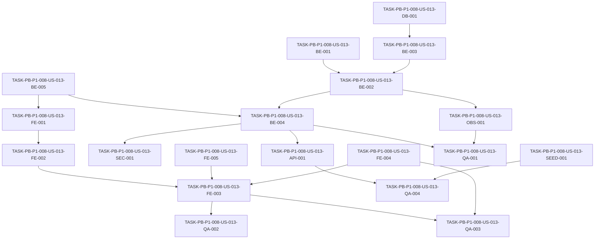

# Development Tasks — PB-P1-008 / US-013: Listar y filtrar mis eventos

## 1. Metadata

| Field | Value |
|---|---|
| User Story ID | US-013 |
| Source User Story | management/user-stories/US-013-list-filter-own-events.md |
| Source Technical Specification | management/technical-specs/P1/PB-P1-008/US-013-technical-spec.md |
| Decision Resolution Artifact | management/user-stories/decision-resolutions/US-013-decision-resolution.md (no existe — no fue necesario) |
| Priority | P1 |
| Backlog ID | PB-P1-008 |
| Backlog Title | Listar/filtrar eventos y ver dashboard del evento |
| Backlog Execution Order | 26 |
| User Story Position in Backlog Item | 1 de 2 |
| Related User Stories in Backlog Item | US-013, US-014 |
| Epic | EPIC-EVT-001 — Organizer Event Management |
| Backlog Item Dependencies | PB-P1-007, PB-P1-016, PB-P1-019 |
| Feature | Listado y filtrado de eventos propios |
| Module / Domain | Events |
| Backlog Alignment Status | Found |
| Task Breakdown Status | Ready for Sprint Planning |
| Created Date | 2026-06-25 |
| Last Updated | 2026-06-25 |

---

## 2. Source Validation

| Source | Found | Used | Notes |
|---|---|---|---|
| User Story | Yes | Yes | Status: Approved (with Minor Notes). |
| Technical Specification | Yes | Yes | Ready for Task Breakdown. |
| Decision Resolution Artifact | No | No | No fue requerido. |
| Product Backlog Prioritized | Yes | Yes | PB-P1-008, posición 1 de 2. |
| ADRs | Yes | Yes | ADR-API-001 (versionado), ADR-API-004 (correlation id). |

---

## 3. Backlog Execution Context

### Parent Backlog Item

PB-P1-008 cubre listado/filtros (US-013) y dashboard por evento (US-014). Esta entrega aborda exclusivamente US-013. Las dependencias funcionales con PB-P1-007 (ciclo de vida) están satisfechas (aporta `deleted_at` y `status` reales). PB-P1-016 (HITL) y PB-P1-019 (filtros del checklist) aplican a US-014.

### Execution Order Rationale

US-013 es la primera US del backlog item y la página de entrada del rol Organizer. Habilita la navegación a US-009..US-012, ya entregadas. No requiere componentes nuevos de IA, migración ni cambios de seed.

### Related User Stories in Same Backlog Item

| User Story | Role in Backlog Item | Suggested Order |
|---|---|---|
| US-013 | Listado y filtrado de eventos propios | 1 |
| US-014 | Dashboard por evento | 2 |

---

## 4. Task Breakdown Summary

| Area | Number of Tasks | Notes |
|---:|---:|---|
| DB | 1 | Validación de índice existente, sin migración. |
| BE | 5 | Zod schema, use case, repository, controller, observability. |
| API | 1 | Contract test del envelope y códigos. |
| SEC | 1 | Tests negativos y aislamiento por owner. |
| FE | 5 | API client, hook, página, componentes, i18n. |
| OBS | 1 | Logging estructurado de listado y descartes. |
| QA | 4 | Integration, E2E, accesibilidad, validación de performance. |
| SEED | 1 | Verificación de cobertura del seed para escenarios demo. |
| DOC | 1 | Housekeeping de traceability en PB-P1-008. |
| **Total** | **20** |  |

---

## 5. Traceability Matrix

| Acceptance Criterion | Technical Spec Section | Task IDs |
|---|---|---|
| AC-01 Listado por defecto | 7, 9, 10 | TASK-PB-P1-008-US-013-DB-001, TASK-PB-P1-008-US-013-BE-002, TASK-PB-P1-008-US-013-BE-003, TASK-PB-P1-008-US-013-BE-004, TASK-PB-P1-008-US-013-API-001, TASK-PB-P1-008-US-013-FE-003, TASK-PB-P1-008-US-013-QA-001 |
| AC-02 Filtro combinado | 6, 7, 9 | TASK-PB-P1-008-US-013-BE-001, TASK-PB-P1-008-US-013-BE-002, TASK-PB-P1-008-US-013-FE-002, TASK-PB-P1-008-US-013-FE-003, TASK-PB-P1-008-US-013-QA-001 |
| AC-03 Paginación explícita | 6, 7, 9 | TASK-PB-P1-008-US-013-BE-001, TASK-PB-P1-008-US-013-BE-003, TASK-PB-P1-008-US-013-FE-004, TASK-PB-P1-008-US-013-QA-001 |
| AC-04 Estado vacío | 8 | TASK-PB-P1-008-US-013-FE-003, TASK-PB-P1-008-US-013-FE-005, TASK-PB-P1-008-US-013-QA-002 |
| AC-05 Idioma de la respuesta | 7, 8 | TASK-PB-P1-008-US-013-BE-002, TASK-PB-P1-008-US-013-FE-001, TASK-PB-P1-008-US-013-FE-005, TASK-PB-P1-008-US-013-QA-001 |
| EC-01 Filtros inválidos | 7, 14 | TASK-PB-P1-008-US-013-BE-001, TASK-PB-P1-008-US-013-OBS-001, TASK-PB-P1-008-US-013-QA-001 |
| EC-02 `pageSize` fuera de rango | 7 | TASK-PB-P1-008-US-013-BE-001, TASK-PB-P1-008-US-013-QA-001 |
| EC-03 `page` posterior a `totalPages` | 7 | TASK-PB-P1-008-US-013-BE-003, TASK-PB-P1-008-US-013-QA-001 |
| SEC-01..SEC-05 | 12 | TASK-PB-P1-008-US-013-BE-004, TASK-PB-P1-008-US-013-SEC-001, TASK-PB-P1-008-US-013-QA-003 |

---

## 6. Development Tasks

### TASK-PB-P1-008-US-013-DB-001 — Validar uso del índice `idx_events_owner_status_date`

| Field | Value |
|---|---|
| Area | DB |
| Type | Test |
| Priority | Must |
| Estimate | XS |
| Depends On | — |
| Source AC(s) | AC-01, AC-02 |
| Technical Spec Section(s) | 10, 17 |
| Backlog ID | PB-P1-008 |
| User Story ID | US-013 |
| Owner Role | Backend |
| Status | To Do |

#### Objective

Verificar que el plan de consulta utiliza el índice existente `idx_events_owner_status_date (owner_id, status, event_date)` para los filtros combinados que ejecutará US-013.

#### Scope

##### Include

* Test de integración que ejecuta `EXPLAIN` sobre el query generado por Prisma para los filtros típicos (`owner_id`, `status`, `event_date`).
* Documentar resultado en el test.

##### Exclude

* Crear migraciones o índices nuevos.
* Tuning de PostgreSQL.

#### Implementation Notes

* Usar test DB con seed cargado.
* Si el optimizador no usa el índice por cardinalidad insuficiente, registrar issue y continuar; no es bloqueante para sprint.

#### Acceptance Criteria Covered

* AC-01, AC-02 (performance subyacente).

#### Definition of Done

- [ ] Test `events.list.index.spec.ts` corre en CI.
- [ ] El test reporta el `Index Scan` esperado o falla con mensaje claro.
- [ ] PR review por Backend Lead.

---

### TASK-PB-P1-008-US-013-BE-001 — `ListMyEventsQuerySchema` con parser tolerante

| Field | Value |
|---|---|
| Area | BE |
| Type | Implementation |
| Priority | Must |
| Estimate | S |
| Depends On | — |
| Source AC(s) | AC-02, AC-03, EC-01, EC-02 |
| Technical Spec Section(s) | 7 |
| Backlog ID | PB-P1-008 |
| User Story ID | US-013 |
| Owner Role | Backend |
| Status | To Do |

#### Objective

Implementar el schema Zod para query params con comportamiento tolerante: descartar inválidos, aplicar defaults y clampear `pageSize`.

#### Scope

##### Include

* `status?`, `eventTypeCode?`, `eventDateFrom?`, `eventDateTo?`, `page` (default 1, min 1), `pageSize` (default 20, min 1, max 100), `sort` (default `event_date`).
* Devolver `{ valid: ParsedFilters, dropped: DroppedFilter[] }` para registrar descartes.

##### Exclude

* Validación dinámica contra DB de `eventTypeCode` (eso lo hará el use case con la lista activa cargada en cache simple).

#### Implementation Notes

* Usar `safeParse` por campo para no abortar todo el parseo.
* Clampear (no rechazar) cuando `pageSize > 100`.

#### Acceptance Criteria Covered

* AC-02, AC-03, EC-01, EC-02.

#### Definition of Done

- [ ] Schema implementado y exportado.
- [ ] Unit tests cubren defaults, clamps, descartes.
- [ ] PR review.

---

### TASK-PB-P1-008-US-013-BE-002 — `ListMyEventsUseCase`

| Field | Value |
|---|---|
| Area | BE |
| Type | Implementation |
| Priority | Must |
| Estimate | M |
| Depends On | TASK-PB-P1-008-US-013-BE-001, TASK-PB-P1-008-US-013-BE-003 |
| Source AC(s) | AC-01, AC-02, AC-05 |
| Technical Spec Section(s) | 7 |
| Backlog ID | PB-P1-008 |
| User Story ID | US-013 |
| Owner Role | Backend |
| Status | To Do |

#### Objective

Implementar el caso de uso de aplicación que orquesta validación, repositorio y mapeo a DTO, propagando el locale para nombres localizables.

#### Scope

##### Include

* Validación contra la lista activa de `EventType` para `eventTypeCode`.
* Llamada a `EventRepository.findByOwnerPaginated`.
* Mapeo a `EventListItemDto` con `currency` y `eventTypeLabel` localizado.

##### Exclude

* Acceso directo a Prisma desde el use case.

#### Implementation Notes

* Recibir `locale` desde el controller para resolver `eventTypeLabel`.

#### Acceptance Criteria Covered

* AC-01, AC-02, AC-05.

#### Definition of Done

- [ ] Unit tests cubren happy path, descartes, mapeo y locale.
- [ ] PR review.

---

### TASK-PB-P1-008-US-013-BE-003 — `EventRepository.findByOwnerPaginated`

| Field | Value |
|---|---|
| Area | BE |
| Type | Implementation |
| Priority | Must |
| Estimate | M |
| Depends On | TASK-PB-P1-008-US-013-DB-001 |
| Source AC(s) | AC-01, AC-03, EC-03 |
| Technical Spec Section(s) | 7, 10 |
| Backlog ID | PB-P1-008 |
| User Story ID | US-013 |
| Owner Role | Backend |
| Status | To Do |

#### Objective

Implementar el método del repositorio que ejecuta `findMany + count` en `$transaction`, filtrando por owner y `deleted_at IS NULL`, con paginación y orden.

#### Scope

##### Include

* `orderBy: [{ eventDate: 'asc' }, { createdAt: 'desc' }]`.
* `skip`, `take` calculados a partir de `page`, `pageSize`.
* Retorno `{ items, totalItems }`.

##### Exclude

* Proyección al DTO (lo hace el use case).

#### Implementation Notes

* Filtros opcionales agregados condicionalmente al `where`.

#### Acceptance Criteria Covered

* AC-01, AC-03, EC-03.

#### Definition of Done

- [ ] Integration test con DB real cubre los filtros, exclusión `deleted_at` y orden.
- [ ] PR review.

---

### TASK-PB-P1-008-US-013-BE-004 — Controller `EventsController.list` + guards

| Field | Value |
|---|---|
| Area | BE |
| Type | Implementation |
| Priority | Must |
| Estimate | S |
| Depends On | TASK-PB-P1-008-US-013-BE-002 |
| Source AC(s) | AC-01, SEC-01..SEC-05 |
| Technical Spec Section(s) | 7, 12 |
| Backlog ID | PB-P1-008 |
| User Story ID | US-013 |
| Owner Role | Backend |
| Status | To Do |

#### Objective

Registrar `GET /api/v1/events`, conectar middleware de auth y guard de rol `organizer`, e invocar el use case.

#### Scope

##### Include

* Registro de ruta en `router`.
* Extracción de `currentUser` y `Accept-Language`.
* Respuesta `200` con envelope estándar.

##### Exclude

* Lógica de negocio (queda en el use case).

#### Implementation Notes

* `admin` debe recibir `403` sin redirección.

#### Acceptance Criteria Covered

* AC-01, SEC-01..SEC-05.

#### Definition of Done

- [ ] Ruta registrada con middlewares correctos.
- [ ] Tests Supertest verifican 200/401/403.
- [ ] PR review.

---

### TASK-PB-P1-008-US-013-BE-005 — Tipos compartidos `EventListItemDto` y `PaginationDto`

| Field | Value |
|---|---|
| Area | BE |
| Type | Implementation |
| Priority | Should |
| Estimate | XS |
| Depends On | — |
| Source AC(s) | AC-01, AC-03 |
| Technical Spec Section(s) | 7, 9 |
| Backlog ID | PB-P1-008 |
| User Story ID | US-013 |
| Owner Role | Backend |
| Status | To Do |

#### Objective

Definir DTOs del envelope para reuso por el frontend (cliente compartido) y por tests de contrato.

#### Scope

##### Include

* `EventListItemDto`, `PaginationDto`, `ListMyEventsResponseDto`.

##### Exclude

* Generación OpenAPI (cubierta por PB-P0-005 si aplica).

#### Implementation Notes

* Mantener nombres `camelCase` consistentes con `docs/16`.

#### Acceptance Criteria Covered

* AC-01, AC-03.

#### Definition of Done

- [ ] Tipos publicados en el módulo `events` y consumidos por controller y tests.
- [ ] PR review.

---

### TASK-PB-P1-008-US-013-API-001 — Contract test del envelope y códigos

| Field | Value |
|---|---|
| Area | API |
| Type | Test |
| Priority | Must |
| Estimate | S |
| Depends On | TASK-PB-P1-008-US-013-BE-004 |
| Source AC(s) | AC-01, AC-03 |
| Technical Spec Section(s) | 9 |
| Backlog ID | PB-P1-008 |
| User Story ID | US-013 |
| Owner Role | QA |
| Status | To Do |

#### Objective

Validar la forma exacta de la respuesta (`items`, `pagination { page, pageSize, totalItems, totalPages }`) y los códigos 200/401/403.

#### Scope

##### Include

* Supertest contra el endpoint con casos representativos.

##### Exclude

* Pruebas E2E con UI.

#### Implementation Notes

* Validar usando snapshot del envelope con esquema Zod o JSON Schema.

#### Acceptance Criteria Covered

* AC-01, AC-03.

#### Definition of Done

- [ ] Test corre en CI y bloquea regresiones del contrato.
- [ ] PR review.

---

### TASK-PB-P1-008-US-013-SEC-001 — Tests de aislamiento por owner y negativos

| Field | Value |
|---|---|
| Area | SEC |
| Type | Test |
| Priority | Must |
| Estimate | S |
| Depends On | TASK-PB-P1-008-US-013-BE-004 |
| Source AC(s) | SEC-01..SEC-05 |
| Technical Spec Section(s) | 12 |
| Backlog ID | PB-P1-008 |
| User Story ID | US-013 |
| Owner Role | QA |
| Status | To Do |

#### Objective

Verificar que el endpoint respeta `organizer` 200, `vendor` 403, `admin` 403 y anónimo 401, y que un organizer no ve eventos de otro.

#### Scope

##### Include

* AUTH-TS-01..AUTH-TS-04 (NT-01, NT-02, NT-03).

##### Exclude

* Pen-testing.

#### Implementation Notes

* Usar seed con al menos dos organizers con eventos distintos.

#### Acceptance Criteria Covered

* SEC-01..SEC-05.

#### Definition of Done

- [ ] Tests verdes en CI.
- [ ] Aislamiento por owner verificado.
- [ ] PR review.

---

### TASK-PB-P1-008-US-013-FE-001 — Cliente API `eventsApi.list`

| Field | Value |
|---|---|
| Area | FE |
| Type | Implementation |
| Priority | Must |
| Estimate | XS |
| Depends On | TASK-PB-P1-008-US-013-BE-005 |
| Source AC(s) | AC-01, AC-02, AC-03, AC-05 |
| Technical Spec Section(s) | 8 |
| Backlog ID | PB-P1-008 |
| User Story ID | US-013 |
| Owner Role | Frontend |
| Status | To Do |

#### Objective

Implementar el cliente que invoca `GET /api/v1/events` propagando `Accept-Language`.

#### Scope

##### Include

* Tipado de request y response usando los DTOs compartidos.

##### Exclude

* Caching (queda a cargo de TanStack Query).

#### Implementation Notes

* Manejar 401/403 propagando errores tipados.

#### Acceptance Criteria Covered

* AC-01, AC-02, AC-03, AC-05.

#### Definition of Done

- [ ] Unit tests con MSW.
- [ ] PR review.

---

### TASK-PB-P1-008-US-013-FE-002 — Hook `useEvents` (TanStack Query)

| Field | Value |
|---|---|
| Area | FE |
| Type | Implementation |
| Priority | Must |
| Estimate | S |
| Depends On | TASK-PB-P1-008-US-013-FE-001 |
| Source AC(s) | AC-02, AC-03 |
| Technical Spec Section(s) | 8 |
| Backlog ID | PB-P1-008 |
| User Story ID | US-013 |
| Owner Role | Frontend |
| Status | To Do |

#### Objective

Hook que envuelve `eventsApi.list` con `queryKey: ['events', 'mine', filters]` y `staleTime` corto.

#### Scope

##### Include

* Tipado de filtros.
* Soporte de `keepPreviousData` para paginación.

##### Exclude

* Mutaciones (no aplica en US-013).

#### Implementation Notes

* Documentar la convención de `invalidateQueries` para que US-009..US-012 puedan refrescar.

#### Acceptance Criteria Covered

* AC-02, AC-03.

#### Definition of Done

- [ ] Unit tests con MSW.
- [ ] PR review.

---

### TASK-PB-P1-008-US-013-FE-003 — Página `/[locale]/organizer/events`

| Field | Value |
|---|---|
| Area | FE |
| Type | Implementation |
| Priority | Must |
| Estimate | M |
| Depends On | TASK-PB-P1-008-US-013-FE-002, TASK-PB-P1-008-US-013-FE-005 |
| Source AC(s) | AC-01, AC-02, AC-04 |
| Technical Spec Section(s) | 8 |
| Backlog ID | PB-P1-008 |
| User Story ID | US-013 |
| Owner Role | Frontend |
| Status | To Do |

#### Objective

Implementar la página con `EventFilters`, `EventList`, `EventCard`, `Pagination` y `EmptyState`, sincronizando filtros con `useSearchParams`.

#### Scope

##### Include

* Loading skeleton, error banner con retry, estado vacío con CTA.
* Layout responsive.

##### Exclude

* Componentes ajenos al listado (perfil, sidebar global).

#### Implementation Notes

* CTA del estado vacío enlaza a `/[locale]/organizer/events/new` (US-009).

#### Acceptance Criteria Covered

* AC-01, AC-02, AC-04.

#### Definition of Done

- [ ] Componentes implementados y tipados.
- [ ] Story de componentes (si aplica) o tests con MSW.
- [ ] PR review.

---

### TASK-PB-P1-008-US-013-FE-004 — Componente `Pagination` accesible

| Field | Value |
|---|---|
| Area | FE |
| Type | Implementation |
| Priority | Must |
| Estimate | S |
| Depends On | — |
| Source AC(s) | AC-03 |
| Technical Spec Section(s) | 8 |
| Backlog ID | PB-P1-008 |
| User Story ID | US-013 |
| Owner Role | Frontend |
| Status | To Do |

#### Objective

Componente reusable de paginación con `aria-current="page"`, `aria-label` por control y manejo por teclado.

#### Scope

##### Include

* Botones primero/anterior/siguiente/último y números de página.

##### Exclude

* Paginación cursor.

#### Implementation Notes

* No depende de la página; reusable por otras vistas futuras.

#### Acceptance Criteria Covered

* AC-03.

#### Definition of Done

- [ ] Unit tests + accesibilidad axe.
- [ ] PR review.

---

### TASK-PB-P1-008-US-013-FE-005 — i18n del listado (`organizer.events` en 4 locales)

| Field | Value |
|---|---|
| Area | FE |
| Type | Implementation |
| Priority | Must |
| Estimate | S |
| Depends On | — |
| Source AC(s) | AC-04, AC-05 |
| Technical Spec Section(s) | 8 |
| Backlog ID | PB-P1-008 |
| User Story ID | US-013 |
| Owner Role | Frontend |
| Status | To Do |

#### Objective

Agregar las claves de traducción del listado, estado vacío, filtros y paginación para `es-LATAM`, `es-ES`, `pt`, `en`.

#### Scope

##### Include

* Todos los textos visibles.

##### Exclude

* Etiquetas devueltas por el backend (las gestiona el use case).

#### Implementation Notes

* Verificar fallback a `es-LATAM`.

#### Acceptance Criteria Covered

* AC-04, AC-05.

#### Definition of Done

- [ ] Claves cargadas y verificadas en lint de i18n.
- [ ] PR review.

---

### TASK-PB-P1-008-US-013-OBS-001 — Logging estructurado `events.list`

| Field | Value |
|---|---|
| Area | OBS |
| Type | Implementation |
| Priority | Must |
| Estimate | XS |
| Depends On | TASK-PB-P1-008-US-013-BE-002 |
| Source AC(s) | EC-01 |
| Technical Spec Section(s) | 14 |
| Backlog ID | PB-P1-008 |
| User Story ID | US-013 |
| Owner Role | Backend |
| Status | To Do |

#### Objective

Emitir `logger.info({ event: 'events.list', correlationId, ownerId, filtersApplied, filtersDropped, page, pageSize, totalItems, durationMs })` en cada invocación exitosa.

#### Scope

##### Include

* Cobertura de errores con `logger.error`.

##### Exclude

* Sinks o dashboards nuevos.

#### Implementation Notes

* Reusar el correlation id propagado por middleware (ADR-API-004).

#### Acceptance Criteria Covered

* EC-01.

#### Definition of Done

- [ ] Test verifica payload del log.
- [ ] PR review.

---

### TASK-PB-P1-008-US-013-QA-001 — Suite API/Integration completa

| Field | Value |
|---|---|
| Area | QA |
| Type | Test |
| Priority | Must |
| Estimate | M |
| Depends On | TASK-PB-P1-008-US-013-BE-004, TASK-PB-P1-008-US-013-OBS-001 |
| Source AC(s) | AC-01..AC-05, EC-01..EC-03 |
| Technical Spec Section(s) | 13 |
| Backlog ID | PB-P1-008 |
| User Story ID | US-013 |
| Owner Role | QA |
| Status | To Do |

#### Objective

Cubrir TS-01..TS-05 y NT-04..NT-07 a nivel API con Supertest contra DB de test.

#### Scope

##### Include

* Paginación por defecto, filtros combinados, `page=2`, `Accept-Language`, filtros inválidos, `pageSize` fuera de rango, `page` posterior a `totalPages`, exclusión `deleted_at`.

##### Exclude

* Tests E2E con UI.

#### Implementation Notes

* Verificar también el log estructurado en EC-01.

#### Acceptance Criteria Covered

* AC-01..AC-05, EC-01..EC-03.

#### Definition of Done

- [ ] Todos los tests verdes en CI.
- [ ] PR review.

---

### TASK-PB-P1-008-US-013-QA-002 — E2E del listado y estado vacío

| Field | Value |
|---|---|
| Area | QA |
| Type | Test |
| Priority | Must |
| Estimate | M |
| Depends On | TASK-PB-P1-008-US-013-FE-003 |
| Source AC(s) | AC-01, AC-02, AC-04 |
| Technical Spec Section(s) | 13 |
| Backlog ID | PB-P1-008 |
| User Story ID | US-013 |
| Owner Role | QA |
| Status | To Do |

#### Objective

Validar end-to-end con Playwright el happy path con filtros y el estado vacío con CTA.

#### Scope

##### Include

* Dos perfiles de organizer del seed: con muchos eventos y sin eventos.

##### Exclude

* Flujos de creación/edición.

#### Implementation Notes

* Reutilizar setup de Playwright del repo.

#### Acceptance Criteria Covered

* AC-01, AC-02, AC-04.

#### Definition of Done

- [ ] Tests verdes en CI.
- [ ] PR review.

---

### TASK-PB-P1-008-US-013-QA-003 — Accesibilidad axe + teclado

| Field | Value |
|---|---|
| Area | QA |
| Type | Test |
| Priority | Must |
| Estimate | S |
| Depends On | TASK-PB-P1-008-US-013-FE-003, TASK-PB-P1-008-US-013-FE-004 |
| Source AC(s) | AC-01, AC-03, AC-04 |
| Technical Spec Section(s) | 13 |
| Backlog ID | PB-P1-008 |
| User Story ID | US-013 |
| Owner Role | QA |
| Status | To Do |

#### Objective

Cubrir accesibilidad en la página renderizada (con datos y vacía) y la navegación de filtros y paginación por teclado.

#### Scope

##### Include

* axe-core sobre la página.
* Navegación por teclado.

##### Exclude

* Auditoría WCAG completa.

#### Implementation Notes

* Reusar utilidades de accesibilidad ya configuradas.

#### Acceptance Criteria Covered

* AC-01, AC-03, AC-04.

#### Definition of Done

- [ ] Tests verdes en CI.
- [ ] PR review.

---

### TASK-PB-P1-008-US-013-QA-004 — Validación de performance (NFR-PERF-001)

| Field | Value |
|---|---|
| Area | QA |
| Type | Test |
| Priority | Should |
| Estimate | S |
| Depends On | TASK-PB-P1-008-US-013-API-001, TASK-PB-P1-008-US-013-SEED-001 |
| Source AC(s) | AC-01, AC-02, AC-03 |
| Technical Spec Section(s) | 13, 14, 17 |
| Backlog ID | PB-P1-008 |
| User Story ID | US-013 |
| Owner Role | QA |
| Status | To Do |

#### Objective

Verificar VC-PERF-001: P95 < 1.5 s para el endpoint bajo dataset de demo.

#### Scope

##### Include

* Ejecutar suite mínima de carga del endpoint.

##### Exclude

* Pruebas de carga sostenida; no es objetivo MVP.

#### Implementation Notes

* Reusar utilidades existentes; reportar resultado en el PR.

#### Acceptance Criteria Covered

* AC-01..AC-03 (performance subyacente).

#### Definition of Done

- [ ] Reporte adjunto al PR.
- [ ] Si P95 ≥ 1.5 s, abrir issue de optimización.

---

### TASK-PB-P1-008-US-013-SEED-001 — Verificación de cobertura del seed para demo

| Field | Value |
|---|---|
| Area | SEED |
| Type | Test |
| Priority | Must |
| Estimate | XS |
| Depends On | — |
| Source AC(s) | AC-01, AC-02, AC-04 |
| Technical Spec Section(s) | 15 |
| Backlog ID | PB-P1-008 |
| User Story ID | US-013 |
| Owner Role | QA |
| Status | To Do |

#### Objective

Confirmar que el seed actual incluye al menos un organizer con >20 eventos (paginación demo) y un organizer sin eventos (estado vacío demo).

#### Scope

##### Include

* Script de verificación o test idempotente sobre el seed.

##### Exclude

* Generación de nuevos datos (no es necesario).

#### Implementation Notes

* Si faltan, abrir tarea en PB-P0-014 (no en esta US).

#### Acceptance Criteria Covered

* AC-01, AC-02, AC-04 (cobertura demo).

#### Definition of Done

- [ ] Verificación corre en CI o como script `seed:verify`.
- [ ] PR review.

---

### TASK-PB-P1-008-US-013-DOC-001 — Housekeeping de traceability en PB-P1-008

| Field | Value |
|---|---|
| Area | DOC |
| Type | Documentation |
| Priority | Should |
| Estimate | XS |
| Depends On | — |
| Source AC(s) | — |
| Technical Spec Section(s) | 16 |
| Backlog ID | PB-P1-008 |
| User Story ID | US-013 |
| Owner Role | Tech Lead |
| Status | To Do |

#### Objective

Corregir la traceability declarada en PB-P1-008 (`FR-EVENT-009..011 · UC-EVENT-005..006`) para alinearla con los IDs reales de listado (`FR-EVENT-007 · UC-EVENT-003`) y de dashboard (cuando se generen para US-014).

#### Scope

##### Include

* Actualizar `management/artifacts/4-Product-Backlog-Prioritized.md` en la sección PB-P1-008.

##### Exclude

* Modificar otras secciones del backlog.

#### Implementation Notes

* Tarea no bloqueante; puede ejecutarse en paralelo con la implementación.

#### Acceptance Criteria Covered

* No aplica (housekeeping documental).

#### Definition of Done

- [ ] PR de documentación aprobado.

---

## 7. Required QA Tasks

| Task ID | Test Type | Purpose |
|---|---|---|
| TASK-PB-P1-008-US-013-API-001 | Contract | Validar envelope y códigos. |
| TASK-PB-P1-008-US-013-QA-001 | API/Integration | Cubrir TS-01..TS-05 y EC-01..EC-03. |
| TASK-PB-P1-008-US-013-QA-002 | E2E | Happy path con filtros y estado vacío. |
| TASK-PB-P1-008-US-013-QA-003 | Accesibilidad | axe + teclado. |
| TASK-PB-P1-008-US-013-QA-004 | Performance | VC-PERF-001 / NFR-PERF-001. |
| TASK-PB-P1-008-US-013-DB-001 | Integration | Verificar uso del índice. |

---

## 8. Required Security Tasks

| Task ID | Security Concern | Purpose |
|---|---|---|
| TASK-PB-P1-008-US-013-SEC-001 | Owner isolation, RBAC, 401/403 | Validar SEC-01..SEC-05 y BR-AUTH-009. |

---

## 9. Required Seed / Demo Tasks

| Task ID | Seed/Demo Concern | Purpose |
|---|---|---|
| TASK-PB-P1-008-US-013-SEED-001 | Cobertura de seed para demo | Confirmar disponibilidad de escenarios de paginación y vacío. |

---

## 10. Observability / Audit Tasks

| Task ID | Concern | Purpose |
|---|---|---|
| TASK-PB-P1-008-US-013-OBS-001 | Logging estructurado | Trazar listado, filtros descartados y duración con correlation id. |

---

## 11. Documentation / Traceability Tasks

| Task ID | Document / Artifact | Purpose |
|---|---|---|
| TASK-PB-P1-008-US-013-DOC-001 | `management/artifacts/4-Product-Backlog-Prioritized.md` | Alinear traceability de PB-P1-008 con los IDs reales. |

---

## 12. Dependency Graph

---

## 13. Suggested Implementation Order

### Phase 1 — Foundation

* TASK-PB-P1-008-US-013-DB-001
* TASK-PB-P1-008-US-013-BE-001
* TASK-PB-P1-008-US-013-BE-005
* TASK-PB-P1-008-US-013-FE-005
* TASK-PB-P1-008-US-013-SEED-001

### Phase 2 — Core Implementation

* TASK-PB-P1-008-US-013-BE-003
* TASK-PB-P1-008-US-013-BE-002
* TASK-PB-P1-008-US-013-BE-004
* TASK-PB-P1-008-US-013-OBS-001
* TASK-PB-P1-008-US-013-FE-001
* TASK-PB-P1-008-US-013-FE-002
* TASK-PB-P1-008-US-013-FE-004
* TASK-PB-P1-008-US-013-FE-003

### Phase 3 — Validation / Security / QA

* TASK-PB-P1-008-US-013-API-001
* TASK-PB-P1-008-US-013-SEC-001
* TASK-PB-P1-008-US-013-QA-001
* TASK-PB-P1-008-US-013-QA-002
* TASK-PB-P1-008-US-013-QA-003
* TASK-PB-P1-008-US-013-QA-004

### Phase 4 — Documentation / Review

* TASK-PB-P1-008-US-013-DOC-001

---

## 14. Risks & Mitigations

| Risk | Impact | Mitigation | Related Task |
|---|---|---|---|
| Plan de consulta no usa índice esperado | Performance por debajo de NFR-PERF-001 | Validar con EXPLAIN | TASK-PB-P1-008-US-013-DB-001 |
| Cobertura del seed insuficiente para paginación/vacío | Demo y E2E inestables | Verificación previa | TASK-PB-P1-008-US-013-SEED-001 |
| Filtros inválidos silenciosos confunden a integradores | Bugs en FE/QA | Documentación y log estructurado | TASK-PB-P1-008-US-013-OBS-001, TASK-PB-P1-008-US-013-QA-001 |
| `count` paralelo penaliza P95 con datasets grandes | Latencia | Medir en TASK-PB-P1-008-US-013-QA-004; optimizar fuera de scope si emerge | TASK-PB-P1-008-US-013-QA-004 |

---

## 15. Out of Scope Confirmation

No se implementará en esta US:

* Dashboard por evento (US-014).
* Búsqueda full-text avanzada.
* Filtros por rango de presupuesto.
* Vista calendario.
* Export CSV/PDF.
* Endpoint admin `/admin/events`.
* Filtros guardados o vistas personalizadas.
* Nuevas migraciones o índices.
* IA, recomendaciones o automatizaciones.

---

## 16. Readiness for Sprint Planning

| Check                                      | Status |
| ------------------------------------------ | ------ |
| Product Backlog mapping found              | Pass   |
| Every AC maps to tasks                     | Pass   |
| Technical Spec used when available         | Pass   |
| QA tasks included                          | Pass   |
| Security tasks included if applicable      | Pass   |
| Seed/demo tasks included if applicable     | Pass   |
| Observability tasks included if applicable | Pass   |
| Documentation tasks included if applicable | Pass   |
| Task dependencies clear                    | Pass   |
| Tasks small enough                         | Pass   |
| Ready for Sprint Planning                  | Yes    |

---

## 17. Final Recommendation

`Ready for Sprint Planning`.

Las 20 tareas cubren todas las áreas declaradas por la Technical Specification, mapean a todos los AC y a las reglas de seguridad, observabilidad, i18n, accesibilidad y performance. Ninguna tarea supera `M`. El único elemento documental no bloqueante es el housekeeping del backlog (TASK-PB-P1-008-US-013-DOC-001), que puede paralelizarse con la implementación.
