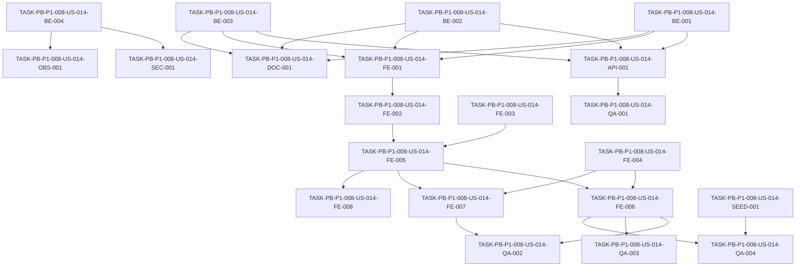

# Development Tasks — PB-P1-008 / US-014: Ver el dashboard de progreso de mi evento

## 1. Metadata

| Field | Value |
|---|---|
| User Story ID | US-014 |
| Source User Story | management/user-stories/US-014-view-event-dashboard.md |
| Source Technical Specification | management/technical-specs/P1/PB-P1-008/US-014-technical-spec.md |
| Decision Resolution Artifact | management/user-stories/decision-resolutions/US-014-decision-resolution.md (no existe — no fue necesario) |
| Priority | P1 |
| Backlog ID | PB-P1-008 |
| Backlog Title | Listar/filtrar eventos y ver dashboard del evento |
| Backlog Execution Order | 26 |
| User Story Position in Backlog Item | 2 de 2 |
| Related User Stories in Backlog Item | US-013, US-014 |
| Epic | EPIC-EVT-001 — Organizer Event Management |
| Backlog Item Dependencies | PB-P1-007, PB-P1-016, PB-P1-019 |
| Feature | Dashboard del evento |
| Module / Domain | Events |
| Backlog Alignment Status | Found |
| Task Breakdown Status | Ready for Sprint Planning |
| Created Date | 2026-06-25 |
| Last Updated | 2026-06-25 |

---

## 2. Source Validation

| Source | Found | Used | Notes |
|---|---|---|---|
| User Story | Yes | Yes | Status: Approved (with Minor Notes). |
| Technical Specification | Yes | Yes | Ready for Task Breakdown; resuelve composición frontend. |
| Decision Resolution Artifact | No | No | No fue requerido. |
| Product Backlog Prioritized | Yes | Yes | PB-P1-008, posición 2 de 2. |
| ADRs | Yes | Yes | ADR-FE-001/002, ADR-API-001/004. |

---

## 3. Backlog Execution Context

### Parent Backlog Item

PB-P1-008 cubre listado (US-013, ya con tareas) y dashboard (US-014, esta entrega). Dependencias del backlog item satisfechas funcionalmente: PB-P1-007 (status/deleted_at), PB-P1-016 (HITL, base para tareas confirmadas), PB-P1-019 (cálculo % done).

### Execution Order Rationale

US-014 es la pieza final del backlog item y se ejecuta después de US-013. Reutiliza sub-endpoints existentes con dos extensiones backward-compatible y una proyección opcional, sin nuevas migraciones ni endpoints.

### Related User Stories in Same Backlog Item

| User Story | Role in Backlog Item | Suggested Order |
|---|---|---|
| US-013 | Listado y filtrado de eventos propios | 1 |
| US-014 | Dashboard del evento | 2 |

---

## 4. Task Breakdown Summary

| Area | Number of Tasks | Notes |
|---:|---:|---|
| BE | 4 | `confirmedBookingIntent`, `upcomingDays`, `status` en QR, ownership 404. |
| API | 1 | Contract tests de los nuevos query params y campo opcional. |
| SEC | 1 | Tests IDOR explícitos y autorización completa. |
| FE | 8 | Clientes API extendidos, 4 hooks, página orquestadora, 6 cards atómicas, banner read-only, i18n + moneda. |
| OBS | 1 | Logging `idor_attempt` y correlation-id por página. |
| QA | 4 | Integration, E2E, accesibilidad, medición TTI. |
| SEED | 1 | Verificación de cobertura demo. |
| DOC | 1 | `docs/16` + extender housekeeping de traceability PB-P1-008. |
| **Total** | **21** |  |

---

## 5. Traceability Matrix

| Acceptance Criterion | Technical Spec Section | Task IDs |
|---|---|---|
| AC-01 Carga del dashboard | 6, 7, 8, 9 | TASK-PB-P1-008-US-014-BE-001, TASK-PB-P1-008-US-014-BE-002, TASK-PB-P1-008-US-014-FE-001, TASK-PB-P1-008-US-014-FE-002, TASK-PB-P1-008-US-014-FE-005, TASK-PB-P1-008-US-014-FE-006, TASK-PB-P1-008-US-014-QA-001 |
| AC-02 Evento `draft` sin plan IA | 8 | TASK-PB-P1-008-US-014-FE-005, TASK-PB-P1-008-US-014-FE-006, TASK-PB-P1-008-US-014-QA-002 |
| AC-03 Warning de overcommit | 6, 8 | TASK-PB-P1-008-US-014-FE-005, TASK-PB-P1-008-US-014-QA-001 |
| AC-04 Estado vacío parcial | 6, 8 | TASK-PB-P1-008-US-014-FE-005, TASK-PB-P1-008-US-014-FE-006, TASK-PB-P1-008-US-014-QA-002 |
| AC-05 Idioma y moneda | 6, 8 | TASK-PB-P1-008-US-014-FE-008, TASK-PB-P1-008-US-014-QA-001 |
| EC-01/EC-02 Read-only | 6, 8 | TASK-PB-P1-008-US-014-FE-007, TASK-PB-P1-008-US-014-QA-002 |
| EC-03 Sección caída | 6, 8 | TASK-PB-P1-008-US-014-FE-002, TASK-PB-P1-008-US-014-FE-005, TASK-PB-P1-008-US-014-QA-002 |
| EC-04 IDOR 404 | 7, 12, 14 | TASK-PB-P1-008-US-014-BE-004, TASK-PB-P1-008-US-014-SEC-001, TASK-PB-P1-008-US-014-OBS-001 |
| SEC-01..SEC-05 | 12 | TASK-PB-P1-008-US-014-BE-004, TASK-PB-P1-008-US-014-SEC-001 |
| TS-06 NFR-PERF-003 | 13, 14, 17 | TASK-PB-P1-008-US-014-QA-004 |

---

## 6. Development Tasks

### TASK-PB-P1-008-US-014-BE-001 — Extender `ListEventTasksUseCase` con `upcomingDays`

| Field | Value |
|---|---|
| Area | BE |
| Type | Implementation |
| Priority | Must |
| Estimate | S |
| Depends On | — |
| Source AC(s) | AC-01 |
| Technical Spec Section(s) | 7, 9 |
| Backlog ID | PB-P1-008 |
| User Story ID | US-014 |
| Owner Role | Backend |
| Status | To Do |

#### Objective

Aceptar `?upcomingDays=<int>` en `GET /api/v1/events/:eventId/tasks` para filtrar por `due_date BETWEEN today AND today + upcomingDays`.

#### Scope

##### Include

* Extender Zod schema (clamp `[1, 60]`).
* Filtro en el repository sin romper otros consumidores.

##### Exclude

* Renombres o reordenamientos del schema.

#### Implementation Notes

* "Hoy" usa la zona horaria del servidor y se documenta.

#### Acceptance Criteria Covered

* AC-01.

#### Definition of Done

- [ ] Unit tests del schema y del use case.
- [ ] Integration test con DB de test.
- [ ] PR review.

---

### TASK-PB-P1-008-US-014-BE-002 — Extender `ListQuoteRequestsUseCase` con `status`

| Field | Value |
|---|---|
| Area | BE |
| Type | Implementation |
| Priority | Must |
| Estimate | S |
| Depends On | — |
| Source AC(s) | AC-01 |
| Technical Spec Section(s) | 7, 9 |
| Backlog ID | PB-P1-008 |
| User Story ID | US-014 |
| Owner Role | Backend |
| Status | To Do |

#### Objective

Aceptar `?status=<enum>` en `GET /api/v1/events/:eventId/quote-requests` con parseo tolerante (valores fuera del enum se descartan silenciosamente).

#### Scope

##### Include

* Extender Zod schema.
* Aplicar el filtro en el repository.

##### Exclude

* Mutaciones.

#### Implementation Notes

* Documentar el conjunto soportado como `active` (alias del set `submitted|in_progress|received`, según el enum vigente).

#### Acceptance Criteria Covered

* AC-01.

#### Definition of Done

- [ ] Unit + integration tests.
- [ ] PR review.

---

### TASK-PB-P1-008-US-014-BE-003 — Proyección `confirmedBookingIntent` en detalle del evento

| Field | Value |
|---|---|
| Area | BE |
| Type | Implementation |
| Priority | Must |
| Estimate | S |
| Depends On | — |
| Source AC(s) | AC-01 |
| Technical Spec Section(s) | 7, 10 |
| Backlog ID | PB-P1-008 |
| User Story ID | US-014 |
| Owner Role | Backend |
| Status | To Do |

#### Objective

Proyectar el `BookingIntent` confirmado (campo opcional) en `EventDetailDto`. Si existe `BookingIntent.confirmed_intent`, usarlo; si no, derivar del primer `BookingIntent` con `status = 'confirmed'`.

#### Scope

##### Include

* `include` Prisma con filtro.
* Campos proyectados: `id, vendorId, totalAmount, currency, confirmedAt`.

##### Exclude

* Cambios al modelo o nuevos campos persistidos.

#### Implementation Notes

* Mantener el DTO backward-compatible (campo opcional).

#### Acceptance Criteria Covered

* AC-01.

#### Definition of Done

- [ ] Unit test con/sin booking confirmado.
- [ ] Integration test contra DB.
- [ ] PR review.

---

### TASK-PB-P1-008-US-014-BE-004 — Política IDOR 404 verificada en endpoints consumidos

| Field | Value |
|---|---|
| Area | BE |
| Type | Implementation |
| Priority | Must |
| Estimate | XS |
| Depends On | — |
| Source AC(s) | EC-04, SEC-05 |
| Technical Spec Section(s) | 12 |
| Backlog ID | PB-P1-008 |
| User Story ID | US-014 |
| Owner Role | Backend |
| Status | To Do |

#### Objective

Verificar y, si fuese necesario, ajustar que los 4 sub-endpoints consumidos respondan `404` (no `403`) ante evento ajeno o inexistente, conforme a la política IDOR de `docs/19`.

#### Scope

##### Include

* `GET /events/:id`, `/events/:id/tasks`, `/events/:id/budget`, `/events/:id/quote-requests`.
* Ajuste del middleware `SEC-POL-EVENT-001` si actualmente responde `403`.

##### Exclude

* Cambios en otros endpoints fuera de US-014.

#### Implementation Notes

* Coordinar con el módulo de auth si el middleware se comparte.

#### Acceptance Criteria Covered

* EC-04, SEC-05.

#### Definition of Done

- [ ] Tests de IDOR (cubiertos por SEC-001) en verde.
- [ ] PR review.

---

### TASK-PB-P1-008-US-014-API-001 — Contract tests de query params y campo opcional

| Field | Value |
|---|---|
| Area | API |
| Type | Test |
| Priority | Must |
| Estimate | S |
| Depends On | TASK-PB-P1-008-US-014-BE-001, TASK-PB-P1-008-US-014-BE-002, TASK-PB-P1-008-US-014-BE-003 |
| Source AC(s) | AC-01 |
| Technical Spec Section(s) | 9 |
| Backlog ID | PB-P1-008 |
| User Story ID | US-014 |
| Owner Role | QA |
| Status | To Do |

#### Objective

Validar el contrato de los sub-endpoints consumidos: `upcomingDays` en tasks, `status` en quote-requests, y `confirmedBookingIntent` opcional en detalle del evento.

#### Scope

##### Include

* Snapshot/JSON Schema del envelope.

##### Exclude

* E2E.

#### Implementation Notes

* Usar Supertest contra DB de test.

#### Acceptance Criteria Covered

* AC-01.

#### Definition of Done

- [ ] Tests verdes en CI.
- [ ] PR review.

---

### TASK-PB-P1-008-US-014-SEC-001 — Tests de IDOR y autorización completa

| Field | Value |
|---|---|
| Area | SEC |
| Type | Test |
| Priority | Must |
| Estimate | M |
| Depends On | TASK-PB-P1-008-US-014-BE-004 |
| Source AC(s) | SEC-01..SEC-05, EC-04 |
| Technical Spec Section(s) | 12 |
| Backlog ID | PB-P1-008 |
| User Story ID | US-014 |
| Owner Role | QA |
| Status | To Do |

#### Objective

Verificar `organizer` dueño (200), otro organizer (404 IDOR), vendor (403), admin (403), anónimo (401) en los 4 sub-endpoints consumidos por el dashboard.

#### Scope

##### Include

* AUTH-TS-01..AUTH-TS-05.
* IDOR explícito por sub-endpoint.

##### Exclude

* Pen-testing.

#### Implementation Notes

* Usar seed con al menos dos organizers con eventos distintos.

#### Acceptance Criteria Covered

* SEC-01..SEC-05, EC-04.

#### Definition of Done

- [ ] Tests verdes en CI.
- [ ] PR review.

---

### TASK-PB-P1-008-US-014-FE-001 — Clientes API extendidos (tasks, quote-requests, events, budget)

| Field | Value |
|---|---|
| Area | FE |
| Type | Implementation |
| Priority | Must |
| Estimate | S |
| Depends On | TASK-PB-P1-008-US-014-BE-001, TASK-PB-P1-008-US-014-BE-002, TASK-PB-P1-008-US-014-BE-003 |
| Source AC(s) | AC-01 |
| Technical Spec Section(s) | 8 |
| Backlog ID | PB-P1-008 |
| User Story ID | US-014 |
| Owner Role | Frontend |
| Status | To Do |

#### Objective

Ajustar las firmas de `tasksApi.listByEvent({ upcomingDays })`, `quoteRequestsApi.listByEvent({ status })`, `eventsApi.detail()` (campo opcional) y `budgetApi.detail()`.

#### Scope

##### Include

* Tipado de inputs y outputs.
* Propagación de `Accept-Language` y correlation-id por página.

##### Exclude

* Cambios en endpoints fuera de dashboard.

#### Implementation Notes

* Reutilizar el interceptor HTTP existente.

#### Acceptance Criteria Covered

* AC-01.

#### Definition of Done

- [ ] Unit tests con MSW.
- [ ] PR review.

---

### TASK-PB-P1-008-US-014-FE-002 — Hooks TanStack Query por sección

| Field | Value |
|---|---|
| Area | FE |
| Type | Implementation |
| Priority | Must |
| Estimate | S |
| Depends On | TASK-PB-P1-008-US-014-FE-001 |
| Source AC(s) | AC-01, EC-03 |
| Technical Spec Section(s) | 8 |
| Backlog ID | PB-P1-008 |
| User Story ID | US-014 |
| Owner Role | Frontend |
| Status | To Do |

#### Objective

Hooks `useEventDetail`, `useEventTasks`, `useEventBudget`, `useEventActiveQuotes` con `queryKey` estables y `staleTime` corto.

#### Scope

##### Include

* `refetch` por hook para `Retry` de la card.

##### Exclude

* Mutaciones.

#### Implementation Notes

* `useEventTasks` puede aceptar `{ upcomingDays }` y reusarse para la card "Próximas".

#### Acceptance Criteria Covered

* AC-01, EC-03.

#### Definition of Done

- [ ] Unit tests con MSW.
- [ ] PR review.

---

### TASK-PB-P1-008-US-014-FE-003 — Componentes base `CardSkeleton`, `CardErrorBanner`, `EmptyCard`, `WarningBadge`

| Field | Value |
|---|---|
| Area | FE |
| Type | Implementation |
| Priority | Must |
| Estimate | S |
| Depends On | — |
| Source AC(s) | AC-04, EC-03, AC-03 |
| Technical Spec Section(s) | 8 |
| Backlog ID | PB-P1-008 |
| User Story ID | US-014 |
| Owner Role | Frontend |
| Status | To Do |

#### Objective

Implementar primitivas reusables de loading, error, empty y badge de warning con accesibilidad correcta.

#### Scope

##### Include

* `WarningBadge` con `role="status"` y `aria-live="polite"`.

##### Exclude

* Animaciones complejas.

#### Implementation Notes

* Estilos vía tokens existentes.

#### Acceptance Criteria Covered

* AC-03, AC-04, EC-03.

#### Definition of Done

- [ ] Unit tests + axe.
- [ ] PR review.

---

### TASK-PB-P1-008-US-014-FE-004 — Componente `ReadOnlyBanner` para `cancelled`/`completed`

| Field | Value |
|---|---|
| Area | FE |
| Type | Implementation |
| Priority | Must |
| Estimate | XS |
| Depends On | — |
| Source AC(s) | EC-01, EC-02 |
| Technical Spec Section(s) | 8 |
| Backlog ID | PB-P1-008 |
| User Story ID | US-014 |
| Owner Role | Frontend |
| Status | To Do |

#### Objective

Banner que se muestra cuando `event.status ∈ {cancelled, completed}` y disable de CTAs de mutación.

#### Scope

##### Include

* Variantes copy por status.

##### Exclude

* Mutaciones reales.

#### Implementation Notes

* Mensajes i18n.

#### Acceptance Criteria Covered

* EC-01, EC-02.

#### Definition of Done

- [ ] Unit tests.
- [ ] PR review.

---

### TASK-PB-P1-008-US-014-FE-005 — Cards de contenido (`EventSummary`, `Progress`, `UpcomingTasks`, `Budget`, `ActiveQuotes`, `BookingIntent`)

| Field | Value |
|---|---|
| Area | FE |
| Type | Implementation |
| Priority | Must |
| Estimate | L |
| Depends On | TASK-PB-P1-008-US-014-FE-002, TASK-PB-P1-008-US-014-FE-003 |
| Source AC(s) | AC-01, AC-02, AC-03, AC-04, EC-03 |
| Technical Spec Section(s) | 8 |
| Backlog ID | PB-P1-008 |
| User Story ID | US-014 |
| Owner Role | Frontend |
| Status | To Do |

#### Objective

Implementar las 6 cards consumiendo los hooks, con loading/empty/error/success y CTAs específicos por sección.

#### Scope

##### Include

* `EventSummaryCard`, `ProgressCard` (cálculo `done / (total - skipped)` o consumo del agregado de PB-P1-019 si está disponible), `UpcomingTasksCard` (consume `upcomingDays=7`), `BudgetCard` con `WarningBadge` cuando `committed > planned`, `ActiveQuotesCard`, `BookingIntentCard`.

##### Exclude

* Charting.

#### Implementation Notes

* CTAs hacia US-009 (crear), PB-P1-018 (crear primera tarea), módulo de presupuesto y de quotes.

#### Acceptance Criteria Covered

* AC-01..AC-04, EC-03.

#### Definition of Done

- [ ] Unit tests por card.
- [ ] Manual smoke OK.
- [ ] PR review.

---

### TASK-PB-P1-008-US-014-FE-006 — Página `/[locale]/organizer/events/:eventId` (`EventDashboard`)

| Field | Value |
|---|---|
| Area | FE |
| Type | Implementation |
| Priority | Must |
| Estimate | M |
| Depends On | TASK-PB-P1-008-US-014-FE-004, TASK-PB-P1-008-US-014-FE-005 |
| Source AC(s) | AC-01, AC-02, AC-04 |
| Technical Spec Section(s) | 8 |
| Backlog ID | PB-P1-008 |
| User Story ID | US-014 |
| Owner Role | Frontend |
| Status | To Do |

#### Objective

Orquestador de cards con layout responsive, propagación de `correlation-id` y manejo del 404 IDOR (página 404 estándar).

#### Scope

##### Include

* Grid responsive (mobile stack; desktop 2–3 columnas).
* Estructura semántica con `<main>` y `<section aria-labelledby>`.

##### Exclude

* Personalización por usuario.

#### Implementation Notes

* Catch global de `useEventDetail` 404 → render 404 page.

#### Acceptance Criteria Covered

* AC-01, AC-02, AC-04.

#### Definition of Done

- [ ] Componente operativo.
- [ ] PR review.

---

### TASK-PB-P1-008-US-014-FE-007 — Disable de CTAs y modo read-only por `status`

| Field | Value |
|---|---|
| Area | FE |
| Type | Implementation |
| Priority | Must |
| Estimate | XS |
| Depends On | TASK-PB-P1-008-US-014-FE-004, TASK-PB-P1-008-US-014-FE-005 |
| Source AC(s) | EC-01, EC-02 |
| Technical Spec Section(s) | 8 |
| Backlog ID | PB-P1-008 |
| User Story ID | US-014 |
| Owner Role | Frontend |
| Status | To Do |

#### Objective

Centralizar la lógica de read-only en un hook `useEventIsReadOnly(event)` y aplicar disable consistente en CTAs de las cards.

#### Scope

##### Include

* `event.status ∈ {cancelled, completed}` → read-only.

##### Exclude

* Cambios server-side.

#### Implementation Notes

* Documentar el contrato del hook.

#### Acceptance Criteria Covered

* EC-01, EC-02.

#### Definition of Done

- [ ] Unit tests.
- [ ] PR review.

---

### TASK-PB-P1-008-US-014-FE-008 — i18n + formato monetario por evento

| Field | Value |
|---|---|
| Area | FE |
| Type | Implementation |
| Priority | Must |
| Estimate | S |
| Depends On | TASK-PB-P1-008-US-014-FE-005 |
| Source AC(s) | AC-05 |
| Technical Spec Section(s) | 8 |
| Backlog ID | PB-P1-008 |
| User Story ID | US-014 |
| Owner Role | Frontend |
| Status | To Do |

#### Objective

Cargar el namespace `organizer.events.dashboard` para 4 locales y wrapper `formatCurrency(amount, currency, locale)` usando `Intl.NumberFormat`.

#### Scope

##### Include

* Todos los textos visibles del dashboard.

##### Exclude

* Conversión automática de moneda.

#### Implementation Notes

* Verificar fallback a `es-LATAM`.

#### Acceptance Criteria Covered

* AC-05.

#### Definition of Done

- [ ] Lint i18n pasa.
- [ ] PR review.

---

### TASK-PB-P1-008-US-014-OBS-001 — Logging `idor_attempt` + correlation-id por página

| Field | Value |
|---|---|
| Area | OBS |
| Type | Implementation |
| Priority | Must |
| Estimate | XS |
| Depends On | TASK-PB-P1-008-US-014-BE-004 |
| Source AC(s) | EC-04 |
| Technical Spec Section(s) | 14 |
| Backlog ID | PB-P1-008 |
| User Story ID | US-014 |
| Owner Role | Backend |
| Status | To Do |

#### Objective

Emitir `logger.warn({ event: 'event.detail.idor_attempt', correlationId, attemptedEventId, currentUserId })` en cada falla de ownership y propagar un único correlation-id por carga de página desde el frontend.

#### Scope

##### Include

* Interceptor FE para correlation-id.
* Log estructurado en BE.

##### Exclude

* Sinks nuevos.

#### Implementation Notes

* Reusar el correlation-id middleware (ADR-API-004).

#### Acceptance Criteria Covered

* EC-04.

#### Definition of Done

- [ ] Tests del payload del log.
- [ ] PR review.

---

### TASK-PB-P1-008-US-014-QA-001 — Suite Integration/API del dashboard

| Field | Value |
|---|---|
| Area | QA |
| Type | Test |
| Priority | Must |
| Estimate | M |
| Depends On | TASK-PB-P1-008-US-014-API-001 |
| Source AC(s) | AC-01, AC-03, AC-05 |
| Technical Spec Section(s) | 13 |
| Backlog ID | PB-P1-008 |
| User Story ID | US-014 |
| Owner Role | QA |
| Status | To Do |

#### Objective

Cubrir TS-01 (datos agregados) y TS-04 (overcommit) a nivel integration, y TS-05 (`Accept-Language`) a nivel API.

#### Scope

##### Include

* Casos con/sin `confirmedBookingIntent`, con `upcomingDays`, con `status=active`.

##### Exclude

* UI.

#### Implementation Notes

* Mover assertions específicos de schema a TASK-PB-P1-008-US-014-API-001.

#### Acceptance Criteria Covered

* AC-01, AC-03, AC-05.

#### Definition of Done

- [ ] Tests verdes en CI.
- [ ] PR review.

---

### TASK-PB-P1-008-US-014-QA-002 — E2E del dashboard

| Field | Value |
|---|---|
| Area | QA |
| Type | Test |
| Priority | Must |
| Estimate | M |
| Depends On | TASK-PB-P1-008-US-014-FE-006, TASK-PB-P1-008-US-014-FE-007 |
| Source AC(s) | AC-02, AC-04, EC-01, EC-02, EC-03 |
| Technical Spec Section(s) | 13 |
| Backlog ID | PB-P1-008 |
| User Story ID | US-014 |
| Owner Role | QA |
| Status | To Do |

#### Objective

Playwright: TS-02 (estado vacío con CTAs), TS-03 (skeletons), EC-01 (cancelled), EC-02 (completed), EC-03 (sección caída con `Retry`).

#### Scope

##### Include

* Stubs con fallas dirigidas (MSW o interceptor de Playwright) para EC-03.

##### Exclude

* Cross-browser exhaustivo.

#### Implementation Notes

* Reusar setup E2E del repo.

#### Acceptance Criteria Covered

* AC-02, AC-04, EC-01, EC-02, EC-03.

#### Definition of Done

- [ ] Tests verdes en CI.
- [ ] PR review.

---

### TASK-PB-P1-008-US-014-QA-003 — Accesibilidad axe + teclado

| Field | Value |
|---|---|
| Area | QA |
| Type | Test |
| Priority | Must |
| Estimate | S |
| Depends On | TASK-PB-P1-008-US-014-FE-006 |
| Source AC(s) | AC-01, AC-04 |
| Technical Spec Section(s) | 13 |
| Backlog ID | PB-P1-008 |
| User Story ID | US-014 |
| Owner Role | QA |
| Status | To Do |

#### Objective

Validar accesibilidad de la página renderizada (con datos y sin datos) y navegación por teclado entre cards y CTAs.

#### Scope

##### Include

* axe-core sin violaciones críticas.

##### Exclude

* Auditoría WCAG completa.

#### Implementation Notes

* Verificar `aria-labelledby` y `role="status"` del warning.

#### Acceptance Criteria Covered

* AC-01, AC-04.

#### Definition of Done

- [ ] Tests verdes en CI.
- [ ] PR review.

---

### TASK-PB-P1-008-US-014-QA-004 — Medición TTI (NFR-PERF-003)

| Field | Value |
|---|---|
| Area | QA |
| Type | Test |
| Priority | Should |
| Estimate | S |
| Depends On | TASK-PB-P1-008-US-014-FE-006, TASK-PB-P1-008-US-014-SEED-001 |
| Source AC(s) | TS-06 |
| Technical Spec Section(s) | 13, 14, 17 |
| Backlog ID | PB-P1-008 |
| User Story ID | US-014 |
| Owner Role | QA |
| Status | To Do |

#### Objective

Medir TTI del dashboard en condiciones de demo y verificar `< 3 s`. Si no se logra, abrir issue y evaluar endpoint agregado en iteración posterior.

#### Scope

##### Include

* Medición dirigida con Playwright o Lighthouse simplificado.

##### Exclude

* Pruebas de carga sostenida.

#### Implementation Notes

* Reusar utilidades existentes.

#### Acceptance Criteria Covered

* AC-01 (performance subyacente).

#### Definition of Done

- [ ] Reporte adjunto al PR.
- [ ] Si TTI ≥ 3 s, abrir issue de optimización.

---

### TASK-PB-P1-008-US-014-SEED-001 — Verificación de cobertura del seed para demo

| Field | Value |
|---|---|
| Area | SEED |
| Type | Test |
| Priority | Must |
| Estimate | XS |
| Depends On | — |
| Source AC(s) | AC-01, AC-02, AC-04, EC-01, EC-02 |
| Technical Spec Section(s) | 15 |
| Backlog ID | PB-P1-008 |
| User Story ID | US-014 |
| Owner Role | QA |
| Status | To Do |

#### Objective

Confirmar que el seed cubre los escenarios demo: evento `active` con tareas+presupuesto+quotes+booking confirmado; evento `draft` sin tareas; eventos `cancelled` y `completed`.

#### Scope

##### Include

* Script de verificación o test idempotente.

##### Exclude

* Generación de nuevos datos (si faltan, abrir tarea en PB-P0-014).

#### Implementation Notes

* Reusar el seed:verify de US-013.

#### Acceptance Criteria Covered

* AC-01, AC-02, AC-04, EC-01, EC-02.

#### Definition of Done

- [ ] Verificación corre en CI o como script.
- [ ] PR review.

---

### TASK-PB-P1-008-US-014-DOC-001 — Actualizar `docs/16` + extender housekeeping de PB-P1-008

| Field | Value |
|---|---|
| Area | DOC |
| Type | Documentation |
| Priority | Should |
| Estimate | XS |
| Depends On | TASK-PB-P1-008-US-014-BE-001, TASK-PB-P1-008-US-014-BE-002, TASK-PB-P1-008-US-014-BE-003 |
| Source AC(s) | — |
| Technical Spec Section(s) | 16 |
| Backlog ID | PB-P1-008 |
| User Story ID | US-014 |
| Owner Role | Tech Lead |
| Status | To Do |

#### Objective

Documentar en `docs/16-API-Design-Specification.md` los nuevos query params (`upcomingDays`, `status`) y el campo opcional `confirmedBookingIntent`. Extender el housekeeping ya planificado (`TASK-PB-P1-008-US-013-DOC-001`) para alinear la traceability del backlog con los IDs de dashboard (FR-EVENT-008, UC-EVENT-004). Aclarar en `docs/5-User-Roles-Permissions-Matrix.md` que el admin lee el dashboard sólo vía endpoint admin auditado (US-016).

#### Scope

##### Include

* Cambios documentales puntuales.

##### Exclude

* Cambios funcionales.

#### Implementation Notes

* Coordinar PR con el housekeeping de US-013.

#### Acceptance Criteria Covered

* No aplica (housekeeping documental).

#### Definition of Done

- [ ] PR de documentación aprobado.

---

## 7. Required QA Tasks

| Task ID | Test Type | Purpose |
|---|---|---|
| TASK-PB-P1-008-US-014-API-001 | Contract | Validar `upcomingDays`, `status` y `confirmedBookingIntent`. |
| TASK-PB-P1-008-US-014-QA-001 | Integration/API | Cubrir TS-01, TS-04, TS-05. |
| TASK-PB-P1-008-US-014-QA-002 | E2E | Cubrir TS-02, TS-03, EC-01..EC-03. |
| TASK-PB-P1-008-US-014-QA-003 | Accesibilidad | axe + teclado. |
| TASK-PB-P1-008-US-014-QA-004 | Performance | TS-06 / NFR-PERF-003. |

---

## 8. Required Security Tasks

| Task ID | Security Concern | Purpose |
|---|---|---|
| TASK-PB-P1-008-US-014-SEC-001 | RBAC + ownership + IDOR | Cubrir SEC-01..SEC-05 y EC-04. |

---

## 9. Required Seed / Demo Tasks

| Task ID | Seed/Demo Concern | Purpose |
|---|---|---|
| TASK-PB-P1-008-US-014-SEED-001 | Cobertura demo | Confirmar que el seed sostiene los escenarios principales del dashboard. |

---

## 10. Observability / Audit Tasks

| Task ID | Concern | Purpose |
|---|---|---|
| TASK-PB-P1-008-US-014-OBS-001 | IDOR + correlation-id por página | Trazar intentos IDOR y correlacionar las queries paralelas con un único id. |

---

## 11. Documentation / Traceability Tasks

| Task ID | Document / Artifact | Purpose |
|---|---|---|
| TASK-PB-P1-008-US-014-DOC-001 | `docs/16`, `docs/5`, `management/artifacts/4-Product-Backlog-Prioritized.md` | Documentar query params nuevos, aclarar acceso admin y extender housekeeping PB-P1-008. |

---

## 12. Dependency Graph

---

## 13. Suggested Implementation Order

### Phase 1 — Foundation

* TASK-PB-P1-008-US-014-BE-001
* TASK-PB-P1-008-US-014-BE-002
* TASK-PB-P1-008-US-014-BE-003
* TASK-PB-P1-008-US-014-BE-004
* TASK-PB-P1-008-US-014-FE-003
* TASK-PB-P1-008-US-014-FE-004
* TASK-PB-P1-008-US-014-FE-008
* TASK-PB-P1-008-US-014-SEED-001

### Phase 2 — Core Implementation

* TASK-PB-P1-008-US-014-API-001
* TASK-PB-P1-008-US-014-OBS-001
* TASK-PB-P1-008-US-014-FE-001
* TASK-PB-P1-008-US-014-FE-002
* TASK-PB-P1-008-US-014-FE-005
* TASK-PB-P1-008-US-014-FE-006
* TASK-PB-P1-008-US-014-FE-007

### Phase 3 — Validation / Security / QA

* TASK-PB-P1-008-US-014-SEC-001
* TASK-PB-P1-008-US-014-QA-001
* TASK-PB-P1-008-US-014-QA-002
* TASK-PB-P1-008-US-014-QA-003
* TASK-PB-P1-008-US-014-QA-004

### Phase 4 — Documentation / Review

* TASK-PB-P1-008-US-014-DOC-001

---

## 14. Risks & Mitigations

| Risk | Impact | Mitigation | Related Task |
|---|---|---|---|
| TTI > 3 s con 4 queries paralelas | NFR-PERF-003 no cumplido | Render progresivo; prefetch del detalle; medir en CI; endpoint agregado como mejora futura si emerge problema | TASK-PB-P1-008-US-014-QA-004 |
| Cálculo de % progreso depende de PB-P1-019 | Duplicación de lógica | Consumir agregado cuando exista; fallback a cálculo en FE | TASK-PB-P1-008-US-014-FE-005 |
| Middleware actual responde 403 en lugar de 404 ante IDOR | Inconsistencia con `docs/19` | Ajuste y verificación con tests | TASK-PB-P1-008-US-014-BE-004, TASK-PB-P1-008-US-014-SEC-001 |
| `confirmed_intent` no existe en el modelo | Card vacía | Derivar del primer `BookingIntent.status='confirmed'` | TASK-PB-P1-008-US-014-BE-003 |

---

## 15. Out of Scope Confirmation

No se implementará en esta US:

* Endpoint agregado `/events/:id/dashboard`.
* Vista admin (US-016 / PB-P1-010).
* Mutaciones desde el dashboard.
* Charting avanzado, export PDF, widgets configurables.
* Conversión automática de moneda.
* Migraciones o índices nuevos.
* `AdminAction` desde estos endpoints.

---

## 16. Readiness for Sprint Planning

| Check                                      | Status |
| ------------------------------------------ | ------ |
| Product Backlog mapping found              | Pass   |
| Every AC maps to tasks                     | Pass   |
| Technical Spec used when available         | Pass   |
| QA tasks included                          | Pass   |
| Security tasks included if applicable      | Pass   |
| Seed/demo tasks included if applicable     | Pass   |
| Observability tasks included if applicable | Pass   |
| Documentation tasks included if applicable | Pass   |
| Task dependencies clear                    | Pass   |
| Tasks small enough                         | Pass (FE-005 es `L` por agrupar 6 cards; aceptable, se ejecuta en paralelo por card si conviene) |
| Ready for Sprint Planning                  | Yes    |

---

## 17. Final Recommendation

`Ready for Sprint Planning`.

Las 21 tareas cubren todas las áreas definidas en la Technical Specification, mapean a todos los AC y a las reglas de seguridad/observabilidad/i18n/accesibilidad/performance. Ningún endpoint nuevo, ninguna migración, ningún AdminAction. La única tarea `L` (FE-005 — 6 cards) puede paralelizarse internamente si el equipo opta por dividir por card. La tarea de documentación (DOC-001) se coordina con el housekeeping de US-013.
