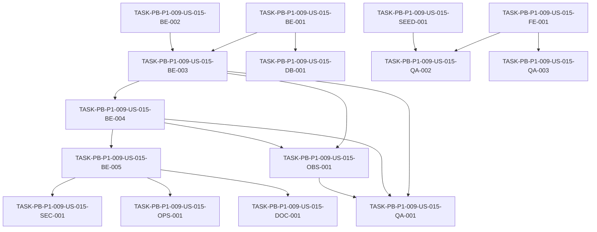

# Development Tasks — PB-P1-009 / US-015: El sistema cierra automáticamente mi evento 2 días después de la fecha

## 1. Metadata

| Field | Value |
|---|---|
| User Story ID | US-015 |
| Source User Story | management/user-stories/US-015-auto-complete-event-job.md |
| Source Technical Specification | management/technical-specs/P1/PB-P1-009/US-015-technical-spec.md |
| Decision Resolution Artifact | management/user-stories/decision-resolutions/US-015-decision-resolution.md (no existe — no fue necesario) |
| Priority | P1 |
| Backlog ID | PB-P1-009 |
| Backlog Title | Job AutoComplete del evento (T+2) |
| Backlog Execution Order | 27 |
| User Story Position in Backlog Item | 1 de 1 |
| Related User Stories in Backlog Item | US-015 |
| Epic | EPIC-EVT-001 — Organizer Event Management |
| Backlog Item Dependencies | PB-P1-007 |
| Feature | Auto-completion job |
| Module / Domain | Events |
| Backlog Alignment Status | Found |
| Task Breakdown Status | Ready for Sprint Planning |
| Created Date | 2026-06-25 |
| Last Updated | 2026-06-25 |

---

## 2. Source Validation

| Source | Found | Used | Notes |
|---|---|---|---|
| User Story | Yes | Yes | Status: Approved (with Minor Notes). |
| Technical Specification | Yes | Yes | Ready for Task Breakdown. |
| Decision Resolution Artifact | No | No | No fue requerido. |
| Product Backlog Prioritized | Yes | Yes | PB-P1-009, 1 de 1. |
| ADRs | Yes | Yes | ADR-BE-001/002/004 + ADR-API-004. |

---

## 3. Backlog Execution Context

### Parent Backlog Item

PB-P1-009 contiene una sola US. Dependencias del backlog item satisfechas (PB-P1-007). Habilita PB-P1-038 (US-065 reseñas verificadas).

### Execution Order Rationale

Posición 27 (18 P0 + 9 P1). Job intra-proceso sin endpoints HTTP. No bloquea otras tareas P1; debe completarse antes de iniciar PB-P1-038.

### Related User Stories in Same Backlog Item

| User Story | Role in Backlog Item | Suggested Order |
|---|---|---|
| US-015 | Job AutoComplete intra-proceso del evento T+2 | 1 |

---

## 4. Task Breakdown Summary

| Area | Number of Tasks | Notes |
|---:|---:|---|
| DB | 1 | Verificación de índice parcial existente. |
| BE | 5 | Repository (2 métodos), use case, job, env config. |
| SEC | 1 | Verificación de no-endpoint y `JOBS_ENABLED=false`. |
| FE | 1 | i18n badge `completed`. |
| OBS | 1 | Logs estructurados con correlationId por runId. |
| QA | 3 | Unit/integration, E2E smoke, accesibilidad badge. |
| SEED | 1 | Verificación de cobertura demo. |
| OPS | 1 | Operatoria `JOBS_ENABLED` y cadencia. |
| DOC | 1 | `docs/14` (cadencia configurable) + housekeeping backlog. |
| **Total** | **15** |  |

---

## 5. Traceability Matrix

| Acceptance Criterion | Technical Spec Section | Task IDs |
|---|---|---|
| AC-01 Cierre automático | 7, 10, 14 | TASK-PB-P1-009-US-015-DB-001, TASK-PB-P1-009-US-015-BE-001, TASK-PB-P1-009-US-015-BE-002, TASK-PB-P1-009-US-015-BE-003, TASK-PB-P1-009-US-015-BE-004, TASK-PB-P1-009-US-015-OBS-001, TASK-PB-P1-009-US-015-QA-001 |
| AC-02 Idempotencia | 7 | TASK-PB-P1-009-US-015-BE-003, TASK-PB-P1-009-US-015-QA-001 |
| AC-03 Eventos excluidos | 7, 10 | TASK-PB-P1-009-US-015-BE-001, TASK-PB-P1-009-US-015-QA-001 |
| AC-04 Clock injectable | 7, 13 | TASK-PB-P1-009-US-015-BE-003, TASK-PB-P1-009-US-015-QA-001 |
| AC-05 Log start/end | 14 | TASK-PB-P1-009-US-015-OBS-001, TASK-PB-P1-009-US-015-QA-001 |
| AC-06 Badge surface | 8 | TASK-PB-P1-009-US-015-FE-001, TASK-PB-P1-009-US-015-QA-002, TASK-PB-P1-009-US-015-QA-003 |
| EC-01 Estados excluidos | 7, 10 | TASK-PB-P1-009-US-015-BE-001, TASK-PB-P1-009-US-015-QA-001 |
| EC-02 Clock fake | 13 | TASK-PB-P1-009-US-015-BE-003, TASK-PB-P1-009-US-015-QA-001 |
| EC-03 Multi-instancia | 12, 13 | TASK-PB-P1-009-US-015-BE-005, TASK-PB-P1-009-US-015-SEC-001, TASK-PB-P1-009-US-015-OPS-001 |
| EC-04 Falla parcial | 7, 14 | TASK-PB-P1-009-US-015-BE-003, TASK-PB-P1-009-US-015-OBS-001, TASK-PB-P1-009-US-015-QA-001 |
| EC-05 Sin elegibles | 7, 14 | TASK-PB-P1-009-US-015-BE-003, TASK-PB-P1-009-US-015-QA-001 |
| SEC-01..SEC-04 | 12 | TASK-PB-P1-009-US-015-BE-005, TASK-PB-P1-009-US-015-SEC-001 |

---

## 6. Development Tasks

### TASK-PB-P1-009-US-015-DB-001 — Validar uso del índice parcial `idx_events_auto_complete_candidates`

| Field | Value |
|---|---|
| Area | DB |
| Type | Test |
| Priority | Must |
| Estimate | XS |
| Depends On | TASK-PB-P1-009-US-015-BE-001 |
| Source AC(s) | AC-01 |
| Technical Spec Section(s) | 10, 17 |
| Backlog ID | PB-P1-009 |
| User Story ID | US-015 |
| Owner Role | Backend |
| Status | To Do |

#### Objective

Verificar con `EXPLAIN` que la query de `findExpiredActive` usa el índice parcial existente `idx_events_auto_complete_candidates (event_date) WHERE status='active'`.

#### Scope

##### Include

* Test de integración con DB de test cargada con seed básico.

##### Exclude

* Crear migraciones o índices nuevos.

#### Implementation Notes

* Si el optimizador no usa el índice por cardinalidad insuficiente, registrar la observación y continuar; no es bloqueante.

#### Acceptance Criteria Covered

* AC-01.

#### Definition of Done

- [ ] Test `find-expired-active.index.spec.ts` corre en CI.
- [ ] PR review.

---

### TASK-PB-P1-009-US-015-BE-001 — `EventRepository.findExpiredActive(now)`

| Field | Value |
|---|---|
| Area | BE |
| Type | Implementation |
| Priority | Must |
| Estimate | S |
| Depends On | — |
| Source AC(s) | AC-01, AC-03, EC-01 |
| Technical Spec Section(s) | 7, 10 |
| Backlog ID | PB-P1-009 |
| User Story ID | US-015 |
| Owner Role | Backend |
| Status | To Do |

#### Objective

Implementar el método del repositorio que devuelve `{ id, eventDate }` para eventos `active`, no soft-deleted, con `event_date <= now - 2 días`.

#### Scope

##### Include

* Proyección mínima en Prisma (`select`).
* Integration test contra DB de test.

##### Exclude

* Lógica de actualización (en BE-002).

#### Implementation Notes

* Calcular `now - 2 días` en el caller (use case) y pasar como argumento `now`.

#### Acceptance Criteria Covered

* AC-01, AC-03, EC-01.

#### Definition of Done

- [ ] Integration test verde.
- [ ] PR review.

---

### TASK-PB-P1-009-US-015-BE-002 — `EventRepository.markCompleted(eventId, fields)`

| Field | Value |
|---|---|
| Area | BE |
| Type | Implementation |
| Priority | Must |
| Estimate | S |
| Depends On | — |
| Source AC(s) | AC-01, AC-02 |
| Technical Spec Section(s) | 7, 10 |
| Backlog ID | PB-P1-009 |
| User Story ID | US-015 |
| Owner Role | Backend |
| Status | To Do |

#### Objective

Implementar `updateMany` con filtro defensivo (`id`, `status='active'`, `deletedAt: null`) que setea `status='completed'`, `autoCompleted=true`, `completedAt`.

#### Scope

##### Include

* Devolver el número de filas afectadas para detectar races.
* Integration test que cubre el caso de race (evento ya `completed`).

##### Exclude

* Batch update.

#### Implementation Notes

* Usar `prisma.event.updateMany` para que el filtro defensivo opere.

#### Acceptance Criteria Covered

* AC-01, AC-02.

#### Definition of Done

- [ ] Integration test verde.
- [ ] PR review.

---

### TASK-PB-P1-009-US-015-BE-003 — `AutoCompletePastEventsUseCase` con `Clock` injectable

| Field | Value |
|---|---|
| Area | BE |
| Type | Implementation |
| Priority | Must |
| Estimate | M |
| Depends On | TASK-PB-P1-009-US-015-BE-001, TASK-PB-P1-009-US-015-BE-002 |
| Source AC(s) | AC-01, AC-02, AC-04, EC-02, EC-04, EC-05 |
| Technical Spec Section(s) | 7, 13 |
| Backlog ID | PB-P1-009 |
| User Story ID | US-015 |
| Owner Role | Backend |
| Status | To Do |

#### Objective

Implementar el use case que orquesta `findExpiredActive` → `markCompleted` por evento con try/catch por evento, transacción corta y `Clock` inyectado.

#### Scope

##### Include

* Devolver `{ affectedCount, errors[] }`.
* Unit tests con `Clock` fake (varios escenarios: 0, 1, N elegibles; falla parcial).

##### Exclude

* Logs (van en OBS-001).

#### Implementation Notes

* Procesamiento secuencial por evento; sin paralelismo en MVP.

#### Acceptance Criteria Covered

* AC-01, AC-02, AC-04, EC-02, EC-04, EC-05.

#### Definition of Done

- [ ] Unit tests verdes con `Clock` fake.
- [ ] Integration test end-to-end con DB sembrada.
- [ ] PR review.

---

### TASK-PB-P1-009-US-015-BE-004 — `AutoCompletePastEventsJob` con scheduler intra-proceso

| Field | Value |
|---|---|
| Area | BE |
| Type | Implementation |
| Priority | Must |
| Estimate | S |
| Depends On | TASK-PB-P1-009-US-015-BE-003 |
| Source AC(s) | AC-01 |
| Technical Spec Section(s) | 7 |
| Backlog ID | PB-P1-009 |
| User Story ID | US-015 |
| Owner Role | Backend |
| Status | To Do |

#### Objective

Implementar el job que invoca el use case según la cadencia configurada, generando `runId` y propagando `clock` real.

#### Scope

##### Include

* Registro vía `node-cron` o equivalente intra-proceso.
* `runId = job-` + uuid.

##### Exclude

* Colas externas; Cloud Scheduler.

#### Implementation Notes

* No relanzar errores; el use case ya captura por evento.

#### Acceptance Criteria Covered

* AC-01.

#### Definition of Done

- [ ] Tests verifican que el job invoca el use case con `clock` real.
- [ ] PR review.

---

### TASK-PB-P1-009-US-015-BE-005 — Config env (`JOBS_ENABLED`, `JOBS_AUTOCOMPLETE_CRON`) + registrador gated

| Field | Value |
|---|---|
| Area | BE |
| Type | Implementation |
| Priority | Must |
| Estimate | XS |
| Depends On | TASK-PB-P1-009-US-015-BE-004 |
| Source AC(s) | EC-03, SEC-01..SEC-04 |
| Technical Spec Section(s) | 12, 18 |
| Backlog ID | PB-P1-009 |
| User Story ID | US-015 |
| Owner Role | Backend |
| Status | To Do |

#### Objective

Añadir variables de entorno con validación Zod y registrar el scheduler sólo si `JOBS_ENABLED=true`.

#### Scope

##### Include

* `JOBS_ENABLED: boolean (default false)`, `JOBS_AUTOCOMPLETE_CRON: string (default '30 0 * * *')`.
* Test de bootstrap: con `false` el job no se programa.

##### Exclude

* Cambios a otras variables de entorno.

#### Implementation Notes

* La validación de la expresión cron puede delegarse a la librería del scheduler.

#### Acceptance Criteria Covered

* EC-03, SEC-01..SEC-04.

#### Definition of Done

- [ ] Tests verdes.
- [ ] PR review.

---

### TASK-PB-P1-009-US-015-SEC-001 — Verificación de no-endpoint y `JOBS_ENABLED=false`

| Field | Value |
|---|---|
| Area | SEC |
| Type | Test |
| Priority | Must |
| Estimate | XS |
| Depends On | TASK-PB-P1-009-US-015-BE-005 |
| Source AC(s) | SEC-01..SEC-04, EC-03 |
| Technical Spec Section(s) | 12 |
| Backlog ID | PB-P1-009 |
| User Story ID | US-015 |
| Owner Role | QA |
| Status | To Do |

#### Objective

Confirmar que (1) no existe endpoint HTTP que dispare el job y (2) con `JOBS_ENABLED=false` el job no se programa.

#### Scope

##### Include

* Grep/test de rutas que descarte `/jobs/auto-complete*`.
* Test bootstrap con `JOBS_ENABLED=false`.

##### Exclude

* Pen-testing.

#### Implementation Notes

* Verificación reproducible en CI.

#### Acceptance Criteria Covered

* SEC-01..SEC-04, EC-03.

#### Definition of Done

- [ ] Tests verdes.
- [ ] PR review.

---

### TASK-PB-P1-009-US-015-FE-001 — i18n badge `completed` en 4 locales

| Field | Value |
|---|---|
| Area | FE |
| Type | Implementation |
| Priority | Must |
| Estimate | XS |
| Depends On | — |
| Source AC(s) | AC-06 |
| Technical Spec Section(s) | 8 |
| Backlog ID | PB-P1-009 |
| User Story ID | US-015 |
| Owner Role | Frontend |
| Status | To Do |

#### Objective

Asegurar que `EventStatusBadge` soporta la variante `completed` y que las claves i18n existen en `es-LATAM`, `es-ES`, `pt`, `en`.

#### Scope

##### Include

* `aria-label` localizado.

##### Exclude

* Refactor del badge.

#### Implementation Notes

* Verificar con lint i18n.

#### Acceptance Criteria Covered

* AC-06.

#### Definition of Done

- [ ] Claves cargadas; lint i18n pasa.
- [ ] PR review.

---

### TASK-PB-P1-009-US-015-OBS-001 — Logs estructurados `start`/`end`/`error` con `correlationId=job-<runId>`

| Field | Value |
|---|---|
| Area | OBS |
| Type | Implementation |
| Priority | Must |
| Estimate | XS |
| Depends On | TASK-PB-P1-009-US-015-BE-003, TASK-PB-P1-009-US-015-BE-004 |
| Source AC(s) | AC-05, EC-04, EC-05 |
| Technical Spec Section(s) | 14 |
| Backlog ID | PB-P1-009 |
| User Story ID | US-015 |
| Owner Role | Backend |
| Status | To Do |

#### Objective

Emitir los tres logs canónicos con los campos definidos en §14 de la spec.

#### Scope

##### Include

* Tests del payload del log.

##### Exclude

* Sinks o dashboards nuevos.

#### Implementation Notes

* Reusar logger existente; sin APM externo.

#### Acceptance Criteria Covered

* AC-05, EC-04, EC-05.

#### Definition of Done

- [ ] Tests verifican logs canónicos.
- [ ] PR review.

---

### TASK-PB-P1-009-US-015-QA-001 — Suite unit + integration del job y use case

| Field | Value |
|---|---|
| Area | QA |
| Type | Test |
| Priority | Must |
| Estimate | M |
| Depends On | TASK-PB-P1-009-US-015-BE-003, TASK-PB-P1-009-US-015-BE-004, TASK-PB-P1-009-US-015-OBS-001 |
| Source AC(s) | AC-01..AC-05, EC-01..EC-05, NT-01..NT-06 |
| Technical Spec Section(s) | 13 |
| Backlog ID | PB-P1-009 |
| User Story ID | US-015 |
| Owner Role | QA |
| Status | To Do |

#### Objective

Cubrir TS-01..TS-05, NT-01..NT-06 y EC-01..EC-05 a nivel unit + integration con `Clock` fake y DB de test.

#### Scope

##### Include

* Idempotencia, falla parcial, sin elegibles, eventos excluidos por estado y por soft-delete, eventos futuros.

##### Exclude

* E2E con UI.

#### Implementation Notes

* Datos sembrados por test para aislamiento.

#### Acceptance Criteria Covered

* AC-01..AC-05, EC-01..EC-05.

#### Definition of Done

- [ ] Tests verdes en CI.
- [ ] PR review.

---

### TASK-PB-P1-009-US-015-QA-002 — E2E smoke del badge "Completed"

| Field | Value |
|---|---|
| Area | QA |
| Type | Test |
| Priority | Must |
| Estimate | S |
| Depends On | TASK-PB-P1-009-US-015-FE-001, TASK-PB-P1-009-US-015-SEED-001 |
| Source AC(s) | AC-06 |
| Technical Spec Section(s) | 13 |
| Backlog ID | PB-P1-009 |
| User Story ID | US-015 |
| Owner Role | QA |
| Status | To Do |

#### Objective

Verificar con Playwright que, tras correr el job en entorno demo, el badge "Completed" se renderiza correctamente en los 4 locales.

#### Scope

##### Include

* Cambio de locale entre `es-LATAM`, `es-ES`, `pt`, `en`.

##### Exclude

* Cross-browser exhaustivo.

#### Implementation Notes

* Reusar setup E2E.

#### Acceptance Criteria Covered

* AC-06.

#### Definition of Done

- [ ] Tests verdes en CI.
- [ ] PR review.

---

### TASK-PB-P1-009-US-015-QA-003 — Accesibilidad del badge `completed`

| Field | Value |
|---|---|
| Area | QA |
| Type | Test |
| Priority | Should |
| Estimate | XS |
| Depends On | TASK-PB-P1-009-US-015-FE-001 |
| Source AC(s) | AC-06 |
| Technical Spec Section(s) | 13 |
| Backlog ID | PB-P1-009 |
| User Story ID | US-015 |
| Owner Role | QA |
| Status | To Do |

#### Objective

Verificar contraste suficiente y `aria-label` del badge con axe-core en la página del dashboard.

#### Scope

##### Include

* axe sobre el componente renderizado.

##### Exclude

* Auditoría WCAG completa.

#### Implementation Notes

* Cobertura mínima alineada con NFR de accesibilidad existente.

#### Acceptance Criteria Covered

* AC-06.

#### Definition of Done

- [ ] Test verde en CI.
- [ ] PR review.

---

### TASK-PB-P1-009-US-015-SEED-001 — Verificación / sembrar evento elegible para demo

| Field | Value |
|---|---|
| Area | SEED |
| Type | Test |
| Priority | Should |
| Estimate | XS |
| Depends On | — |
| Source AC(s) | AC-01, AC-06 |
| Technical Spec Section(s) | 15 |
| Backlog ID | PB-P1-009 |
| User Story ID | US-015 |
| Owner Role | QA |
| Status | To Do |

#### Objective

Confirmar que el seed cuenta con al menos un evento `active` con `event_date = today - 3 días`. Si falta, abrir PR en PB-P0-014 o añadir un fixture específico.

#### Scope

##### Include

* Script o test de verificación.

##### Exclude

* Cambios profundos al seed (van en PB-P0-014).

#### Implementation Notes

* Reusar utilidad `seed:verify`.

#### Acceptance Criteria Covered

* AC-01, AC-06 (cobertura demo).

#### Definition of Done

- [ ] Verificación corre en CI o como script.
- [ ] PR review.

---

### TASK-PB-P1-009-US-015-OPS-001 — Operatoria `JOBS_ENABLED` y cadencia en exactamente una réplica

| Field | Value |
|---|---|
| Area | OPS |
| Type | Setup |
| Priority | Must |
| Estimate | XS |
| Depends On | TASK-PB-P1-009-US-015-BE-005 |
| Source AC(s) | EC-03 |
| Technical Spec Section(s) | 12, 18 |
| Backlog ID | PB-P1-009 |
| User Story ID | US-015 |
| Owner Role | DevOps |
| Status | To Do |

#### Objective

Configurar el entorno productivo y demo para que `JOBS_ENABLED=true` aplique a exactamente una réplica; documentar la operatoria.

#### Scope

##### Include

* Variables de entorno por réplica.
* Documentación operativa en runbook.

##### Exclude

* Provisión de scheduler externo.

#### Implementation Notes

* Documentar que la cadencia default es `30 0 * * *` y queda configurable por env.

#### Acceptance Criteria Covered

* EC-03.

#### Definition of Done

- [ ] Variables aplicadas en demo y prod.
- [ ] Runbook actualizado.
- [ ] PR review.

---

### TASK-PB-P1-009-US-015-DOC-001 — Actualizar `docs/14` (cadencia configurable) + housekeeping PB-P1-009

| Field | Value |
|---|---|
| Area | DOC |
| Type | Documentation |
| Priority | Should |
| Estimate | XS |
| Depends On | TASK-PB-P1-009-US-015-BE-005 |
| Source AC(s) | — |
| Technical Spec Section(s) | 16 |
| Backlog ID | PB-P1-009 |
| User Story ID | US-015 |
| Owner Role | Tech Lead |
| Status | To Do |

#### Objective

Aclarar en `docs/14` que la cadencia del job es parámetro operativo (default `30 0 * * *`, opción `0 * * * *`) y extender el housekeeping de traceability del backlog para alinear PB-P1-009 con `FR-EVENT-009 · UC-EVENT-005` (puede consolidarse con los PR de housekeeping de US-013/US-014).

#### Scope

##### Include

* Cambios documentales puntuales.

##### Exclude

* Cambios funcionales.

#### Implementation Notes

* Coordinar con el PR de housekeeping de US-013/US-014 para un solo merge documental.

#### Acceptance Criteria Covered

* No aplica (housekeeping documental).

#### Definition of Done

- [ ] PR de documentación aprobado.

---

## 7. Required QA Tasks

| Task ID | Test Type | Purpose |
|---|---|---|
| TASK-PB-P1-009-US-015-QA-001 | Unit + Integration | Cubrir AC-01..AC-05, EC-01..EC-05 y NT-01..NT-06. |
| TASK-PB-P1-009-US-015-QA-002 | E2E smoke | Cubrir AC-06 con cambio de locale. |
| TASK-PB-P1-009-US-015-QA-003 | Accesibilidad | Badge accesible con axe. |
| TASK-PB-P1-009-US-015-DB-001 | Integration | Verificar uso del índice parcial. |

---

## 8. Required Security Tasks

| Task ID | Security Concern | Purpose |
|---|---|---|
| TASK-PB-P1-009-US-015-SEC-001 | Ausencia de endpoint + control multi-instancia | Confirmar superficie cero y `JOBS_ENABLED=false`. |

---

## 9. Required Seed / Demo Tasks

| Task ID | Seed/Demo Concern | Purpose |
|---|---|---|
| TASK-PB-P1-009-US-015-SEED-001 | Cobertura demo | Confirmar evento elegible en el seed. |

---

## 10. Observability / Audit Tasks

| Task ID | Concern | Purpose |
|---|---|---|
| TASK-PB-P1-009-US-015-OBS-001 | Logs estructurados | Trazar ejecuciones con `correlationId=job-<runId>`. |

---

## 11. Documentation / Traceability Tasks

| Task ID | Document / Artifact | Purpose |
|---|---|---|
| TASK-PB-P1-009-US-015-DOC-001 | `docs/14`, `management/artifacts/4-Product-Backlog-Prioritized.md` | Cadencia configurable + alinear traceability PB-P1-009. |

---

## 12. Dependency Graph

---

## 13. Suggested Implementation Order

### Phase 1 — Foundation

* TASK-PB-P1-009-US-015-BE-001
* TASK-PB-P1-009-US-015-BE-002
* TASK-PB-P1-009-US-015-DB-001
* TASK-PB-P1-009-US-015-FE-001
* TASK-PB-P1-009-US-015-SEED-001

### Phase 2 — Core Implementation

* TASK-PB-P1-009-US-015-BE-003
* TASK-PB-P1-009-US-015-BE-004
* TASK-PB-P1-009-US-015-BE-005
* TASK-PB-P1-009-US-015-OBS-001

### Phase 3 — Validation / Security / QA

* TASK-PB-P1-009-US-015-SEC-001
* TASK-PB-P1-009-US-015-QA-001
* TASK-PB-P1-009-US-015-QA-002
* TASK-PB-P1-009-US-015-QA-003

### Phase 4 — Documentation / Review

* TASK-PB-P1-009-US-015-OPS-001
* TASK-PB-P1-009-US-015-DOC-001

---

## 14. Risks & Mitigations

| Risk | Impact | Mitigation | Related Task |
|---|---|---|---|
| Multi-instancia ejecuta dos veces | Waste + posible doble log | `JOBS_ENABLED` y operatoria | TASK-PB-P1-009-US-015-BE-005, TASK-PB-P1-009-US-015-OPS-001 |
| Índice no usado por el planner | Performance | EXPLAIN en CI | TASK-PB-P1-009-US-015-DB-001 |
| Falla parcial aborta el job | Eventos no procesados | try/catch por evento + log error | TASK-PB-P1-009-US-015-BE-003, TASK-PB-P1-009-US-015-OBS-001 |
| Locale incorrecto en badge | UX confusa en demo | Lint i18n + E2E con cambio de locale | TASK-PB-P1-009-US-015-FE-001, TASK-PB-P1-009-US-015-QA-002 |

---

## 15. Out of Scope Confirmation

No se implementará en esta US:

* Notificación al organizador.
* Cron externo (Cloud Scheduler / Kubernetes CronJob).
* Colas (BullMQ, SQS).
* `AdminAction` por evento auto-completado.
* Migraciones o índices nuevos.
* Endpoints HTTP de cualquier tipo.

---

## 16. Readiness for Sprint Planning

| Check                                      | Status |
| ------------------------------------------ | ------ |
| Product Backlog mapping found              | Pass   |
| Every AC maps to tasks                     | Pass   |
| Technical Spec used when available         | Pass   |
| QA tasks included                          | Pass   |
| Security tasks included if applicable      | Pass   |
| Seed/demo tasks included if applicable     | Pass   |
| Observability tasks included if applicable | Pass   |
| Documentation tasks included if applicable | Pass   |
| Task dependencies clear                    | Pass   |
| Tasks small enough                         | Pass   |
| Ready for Sprint Planning                  | Yes    |

---

## 17. Final Recommendation

`Ready for Sprint Planning`.

Las 15 tareas cubren todas las áreas declaradas por la Technical Specification y mapean a todos los AC y reglas operativas. Ninguna tarea excede `M`. Las observaciones documentales son no bloqueantes y se cubren en `TASK-PB-P1-009-US-015-DOC-001`, coordinable con los housekeeping de US-013/US-014.
