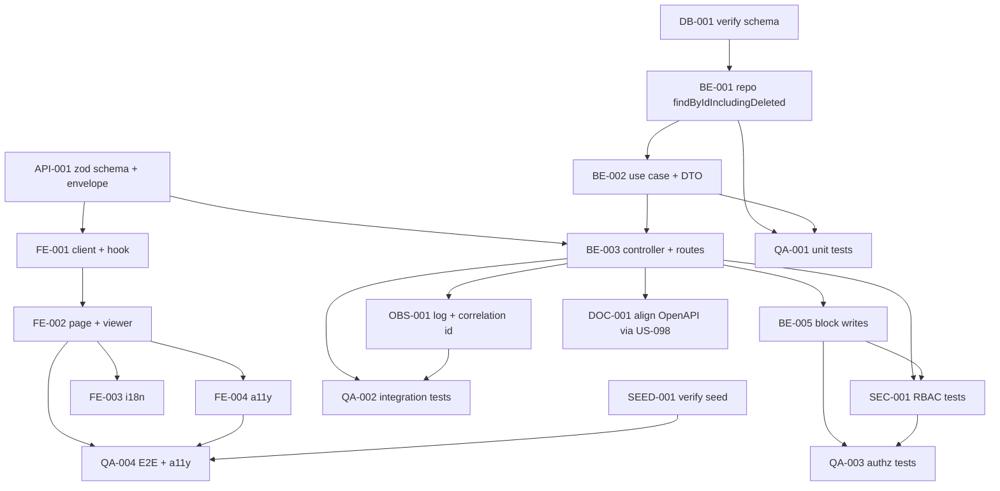

# Development Tasks — PB-P1-010 / US-016: Admin ve evento del organizador en solo lectura (auditado)

## 1. Metadata

| Field | Value |
|---|---|
| User Story ID | US-016 |
| Source User Story | `management/user-stories/US-016-admin-view-event-readonly.md` |
| Source Technical Specification | `management/technical-specs/P1/PB-P1-010/US-016-technical-spec.md` |
| Decision Resolution Artifact | No aplica |
| Priority | P1 |
| Backlog ID | PB-P1-010 |
| Backlog Title | Lectura admin de eventos (auditada) |
| Backlog Execution Order | 28 (P0: 18 + posición 10 en P1) |
| User Story Position in Backlog Item | 1 de 1 |
| Related User Stories in Backlog Item | US-016 |
| Epic | EPIC-EVT-001 — Organizer Event Management |
| Backlog Item Dependencies | PB-P1-007, PB-P0-001 |
| Feature | Vista admin solo lectura del evento |
| Module / Domain | Events / Admin |
| Backlog Alignment Status | Found |
| Task Breakdown Status | Ready for Sprint Planning |
| Created Date | 2026-06-25 |
| Last Updated | 2026-06-25 |

---

## 2. Source Validation

| Source | Found | Used | Notes |
|---|---|---|---|
| User Story | Yes | Yes | Approved with Minor Notes (alineación documental no bloqueante). |
| Technical Specification | Yes | Yes | Ready for Task Breakdown. Fuente primaria de implementación. |
| Decision Resolution Artifact | No | No | No se requirió; decisiones formalizadas (PO 8.1 #16, BR-EVENT-014, NFR-OBS-001). |
| Product Backlog Prioritized | Yes | Yes | PB-P1-010 confirmado. Dependencias: PB-P1-007, PB-P0-001. |
| ADRs | Yes | Yes | ADR-API-001 (REST), ADR-SEC-002 (sesión HTTP-Only). |

---

## 3. Backlog Execution Context

### Parent Backlog Item

PB-P1-010 — Lectura admin de eventos (auditada). Habilita al rol `Admin` a consultar eventos del organizador en solo lectura, con auditoría obligatoria en `AdminAction(view_event)`. Endpoint: `GET /api/v1/admin/events/:id`. Dependencias: PB-P1-007 (admin/auth), PB-P0-001 (esquema base con `admin_actions`).

### Execution Order Rationale

Se ejecuta después de PB-P0-001 (esquema y enum `admin_action_type` con `view_event`) y de PB-P1-007 (admin auth operativa). No bloquea otras US y prepara la base para PB-P1-044 (UI admin completa) y para US-078 (listado admin). Es una US pequeña, sin escrituras y sin IA.

### Related User Stories in Same Backlog Item

| User Story | Role in Backlog Item | Suggested Order |
|---|---|---|
| US-016 | Vista de detalle de evento en read-only con auditoría | 1 |

---

## 4. Task Breakdown Summary

| Area | Number of Tasks | Notes |
|---:|---:|---|
| Database / Prisma (DB) | 1 | Verificación de columna `correlation_id` y enum `view_event`. |
| Backend (BE) | 5 | Repos, use case, controller, middleware, bloqueo de escritura. |
| API Contract (API) | 1 | Validación del path + envelope unificado. |
| Security / Authorization (SEC) | 1 | RBAC `Admin` y matriz negativa específica. |
| Frontend (FE) | 4 | Página, viewer, hook, cliente API. |
| Observability / Audit (OBS) | 1 | Logging estructurado `admin.event.view` + correlation ID. |
| QA / Testing (QA) | 4 | Unit + integración + E2E + a11y. |
| Seed / Demo (SEED) | 1 | Verificación de seed admin + evento soft-deleted. |
| Documentation / Traceability (DOC) | 1 | Coordinación con US-098 para OpenAPI snapshot. |
| **Total** | **19** | |

---

## 5. Traceability Matrix

| Acceptance Criterion | Technical Spec Section | Task IDs |
|---|---|---|
| AC-01: Lectura admin con auditoría | §7 Use Cases, §10 DB, §14 Observability | TASK-PB-P1-010-US-016-DB-001, TASK-PB-P1-010-US-016-BE-001, TASK-PB-P1-010-US-016-BE-002, TASK-PB-P1-010-US-016-BE-003, TASK-PB-P1-010-US-016-OBS-001, TASK-PB-P1-010-US-016-QA-002 |
| AC-02: Acciones de escritura bloqueadas | §7 Controllers, §9 API, §12 Security | TASK-PB-P1-010-US-016-BE-005, TASK-PB-P1-010-US-016-SEC-001, TASK-PB-P1-010-US-016-QA-003 |
| AC-03: Badge "Modo lectura" | §8 Frontend, §13 A11y | TASK-PB-P1-010-US-016-FE-002, TASK-PB-P1-010-US-016-QA-004 |
| EC-01: Evento soft-deleted | §7 Repository, §8 Components | TASK-PB-P1-010-US-016-BE-001, TASK-PB-P1-010-US-016-FE-002, TASK-PB-P1-010-US-016-QA-002, TASK-PB-P1-010-US-016-SEED-001 |
| EC-02: Evento inexistente | §7 Error Handling, §9 API | TASK-PB-P1-010-US-016-BE-003, TASK-PB-P1-010-US-016-API-001, TASK-PB-P1-010-US-016-QA-002 |
| EC-03: UUID inválido | §7 DTOs / Schemas, §9 API | TASK-PB-P1-010-US-016-API-001, TASK-PB-P1-010-US-016-QA-002 |
| VR-01: `eventId` UUID v4 | §7 DTOs, §9 API | TASK-PB-P1-010-US-016-API-001 |
| VR-02: Sin campos editables internos | §7 DTOs | TASK-PB-P1-010-US-016-BE-002 |
| SEC-01..04: RBAC + auditoría + correlation | §12 Security, §14 Observability | TASK-PB-P1-010-US-016-SEC-001, TASK-PB-P1-010-US-016-OBS-001, TASK-PB-P1-010-US-016-QA-003 |
| AUTH-TS-01..03 / NT-01..05 | §12 Security | TASK-PB-P1-010-US-016-SEC-001, TASK-PB-P1-010-US-016-QA-003 |
| TS-06: E2E con seed | §13 Testing, §15 Seed | TASK-PB-P1-010-US-016-SEED-001, TASK-PB-P1-010-US-016-QA-004 |

---

## 6. Development Tasks

### TASK-PB-P1-010-US-016-DB-001 — Verificar enum `view_event` y columna `admin_actions.correlation_id`

| Field | Value |
|---|---|
| Area | Database / Prisma |
| Type | Setup |
| Priority | Must |
| Estimate | XS |
| Depends On | PB-P0-001 |
| Source AC(s) | AC-01 |
| Technical Spec Section(s) | §10 Database / Prisma Design; §16 Documentation Alignment |
| Backlog ID | PB-P1-010 |
| User Story ID | US-016 |
| Owner Role | Backend |
| Status | To Do |

#### Objective

Confirmar que el esquema actual de PostgreSQL/Prisma soporta `AdminAction(action='view_event', correlation_id=...)` sin requerir migraciones nuevas dentro de esta US.

#### Scope

##### Include

* Inspección de `prisma/schema.prisma` y migraciones existentes.
* Verificación del enum `admin_action_type` (debe incluir `view_event`).
* Verificación de la columna `admin_actions.correlation_id` y su tipo.
* Verificación de índices `admin_actions(actor_user_id)` y `admin_actions(target_event_id)`.

##### Exclude

* Creación de migraciones nuevas (si falta `correlation_id`, escalar a US-099 / PB-P0-001 — no crear migración ad-hoc en esta US).

#### Implementation Notes

* Si `correlation_id` no existe, crear ticket dependiente a US-099 y registrar la limitación: el log estructurado continúa propagando `correlation_id`, pero `AdminAction` queda sin ese campo hasta que se resuelva.

#### Acceptance Criteria Covered

* AC-01 (cobertura preparatoria).

#### Definition of Done

- [ ] Enum `view_event` confirmado en Prisma y BD.
- [ ] Columna `admin_actions.correlation_id` confirmada o escalada como blocker técnico (no de la US).
- [ ] Índices existentes confirmados.
- [ ] Resultado documentado en el ticket (sí/no para cada verificación).

---

### TASK-PB-P1-010-US-016-BE-001 — Implementar `EventRepository.findByIdIncludingDeleted`

| Field | Value |
|---|---|
| Area | Backend |
| Type | Implementation |
| Priority | Must |
| Estimate | S |
| Depends On | TASK-PB-P1-010-US-016-DB-001 |
| Source AC(s) | AC-01, EC-01, EC-02 |
| Technical Spec Section(s) | §7 Repository / Persistence |
| Backlog ID | PB-P1-010 |
| User Story ID | US-016 |
| Owner Role | Backend |
| Status | To Do |

#### Objective

Extender el repositorio de eventos para permitir lectura por id incluyendo registros con `deleted_at IS NOT NULL`, exclusivo para el contexto admin.

#### Scope

##### Include

* Método `findByIdIncludingDeleted(id: string): Promise<Event | null>` en `EventPrismaRepository`.
* Cargar relación mínima `owner: { id, display_name }`.
* Tests unitarios del repositorio con Prisma in-memory o test DB.

##### Exclude

* Métodos de mutación.
* Exposición del método fuera de los use cases admin.

#### Implementation Notes

* No reemplazar el `findById` por defecto del contexto del organizador.
* Encapsular el método dentro del módulo admin o exponerlo como interfaz separada para mantener el aislamiento del módulo de eventos del organizador.

#### Acceptance Criteria Covered

* AC-01, EC-01, EC-02.

#### Definition of Done

- [ ] Método implementado y exportado.
- [ ] Tests unitarios verdes.
- [ ] No se introduce regresión en queries existentes de `events`.

---

### TASK-PB-P1-010-US-016-BE-002 — Implementar `AdminViewEventUseCase` y `AdminEventReadDTO`

| Field | Value |
|---|---|
| Area | Backend |
| Type | Implementation |
| Priority | Must |
| Estimate | M |
| Depends On | TASK-PB-P1-010-US-016-BE-001 |
| Source AC(s) | AC-01, VR-02 |
| Technical Spec Section(s) | §7 Use Cases / Application Services; §7 DTOs / Schemas; §7 Transactions |
| Backlog ID | PB-P1-010 |
| User Story ID | US-016 |
| Owner Role | Backend |
| Status | To Do |

#### Objective

Orquestar la lectura del evento por id y la inserción transaccional del `AdminAction` correspondiente.

#### Scope

##### Include

* `AdminViewEventUseCase.execute({ eventId, actor, correlationId })`.
* `AdminEventReadAssembler` que mapea `Event` → `AdminEventReadDTO`.
* Transacción Prisma envolviendo `findByIdIncludingDeleted` + `AdminActionRepository.create`.
* Manejo de `null` → `NotFoundError`.
* Tests unitarios con repos mockeados (happy, soft-deleted, not found, fallo de auditoría revierte).

##### Exclude

* Filtros de listado o paginación.
* Cualquier mutación de `Event`.

#### Implementation Notes

* `AdminEventReadDTO` debe excluir campos editables internos no requeridos por la vista.
* La transacción debe revertirse si la inserción de `AdminAction` falla, y devolver `500` controlado.

#### Acceptance Criteria Covered

* AC-01, VR-02, EC-01, EC-02.

#### Definition of Done

- [ ] Use case y assembler implementados.
- [ ] DTO definido con whitelist explícita de campos.
- [ ] Tests unitarios verdes (4 escenarios mínimos).

---

### TASK-PB-P1-010-US-016-BE-003 — Implementar `AdminEventsController.show` y rutas

| Field | Value |
|---|---|
| Area | Backend |
| Type | Implementation |
| Priority | Must |
| Estimate | S |
| Depends On | TASK-PB-P1-010-US-016-BE-002, TASK-PB-P1-010-US-016-API-001 |
| Source AC(s) | AC-01, EC-02, EC-03 |
| Technical Spec Section(s) | §7 Controllers / Routes; §7 Error Handling |
| Backlog ID | PB-P1-010 |
| User Story ID | US-016 |
| Owner Role | Backend |
| Status | To Do |

#### Objective

Exponer `GET /api/v1/admin/events/:id` con la pila de middlewares y mapping de errores al envelope unificado.

#### Scope

##### Include

* `AdminEventsController.show(req, res)` con `requireAuth`, `requireRole('admin')`, `validateParams(adminEventIdParamsSchema)`, `withCorrelationId`.
* Registro de la ruta en `routes/admin/events.routes.ts`.
* Mapping de `NotFoundError` → `404 EVENT_NOT_FOUND` y `ZodError` → `400 VALIDATION`.

##### Exclude

* Lógica de negocio (vive en el use case).
* Bloqueo de mutaciones admin (cubierto por BE-005).

#### Implementation Notes

* El controlador debe ser delgado: validar input, invocar use case, devolver `200`.
* Header `x-correlation-id` debe estar presente en la respuesta.

#### Acceptance Criteria Covered

* AC-01, EC-02, EC-03.

#### Definition of Done

- [ ] Ruta registrada y respondiendo `200` con DTO.
- [ ] Códigos `400`/`401`/`403`/`404` mapeados.
- [ ] Header de correlación presente en la respuesta.

---

### TASK-PB-P1-010-US-016-BE-005 — Bloquear verbos de escritura admin sobre `/admin/events/:id`

| Field | Value |
|---|---|
| Area | Backend |
| Type | Implementation |
| Priority | Must |
| Estimate | XS |
| Depends On | TASK-PB-P1-010-US-016-BE-003 |
| Source AC(s) | AC-02 |
| Technical Spec Section(s) | §7 Controllers / Routes; §12 Security |
| Backlog ID | PB-P1-010 |
| User Story ID | US-016 |
| Owner Role | Backend |
| Status | To Do |

#### Objective

Garantizar que `PATCH`, `DELETE` y cualquier acción de cancelación admin sobre `/admin/events/:id` respondan `403 FORBIDDEN` con `code='FORBIDDEN_WRITE'`.

#### Scope

##### Include

* Handler catch-all o handlers explícitos por método.
* Envelope unificado de error.

##### Exclude

* Implementar mutaciones reales (no existen para admin sobre eventos en MVP).

#### Implementation Notes

* Preferir handlers explícitos por método para facilitar tests negativos.

#### Acceptance Criteria Covered

* AC-02.

#### Definition of Done

- [ ] PATCH/DELETE responden `403 FORBIDDEN_WRITE`.
- [ ] No se aceptan rutas de cancelación admin para esta entidad.

---

### TASK-PB-P1-010-US-016-API-001 — Definir `adminEventIdParamsSchema` y envelope de error

| Field | Value |
|---|---|
| Area | API Contract |
| Type | Implementation |
| Priority | Must |
| Estimate | XS |
| Depends On | — |
| Source AC(s) | VR-01, EC-02, EC-03 |
| Technical Spec Section(s) | §7 DTOs / Schemas; §9 API Contract |
| Backlog ID | PB-P1-010 |
| User Story ID | US-016 |
| Owner Role | Backend |
| Status | To Do |

#### Objective

Especificar el contrato de entrada/salida del endpoint en términos de validación y errores.

#### Scope

##### Include

* `adminEventIdParamsSchema` (Zod) validando `id: string().uuid()`.
* Confirmar mapping a envelope unificado (`code`, `message`, `details?`, `correlationId`).

##### Exclude

* Generación del snapshot OpenAPI (cubierto por DOC-001 → US-098).

#### Implementation Notes

* Reutilizar utilidades existentes del módulo de validación.

#### Acceptance Criteria Covered

* VR-01, EC-02, EC-03.

#### Definition of Done

- [ ] Schema disponible y testeado en BE-003.
- [ ] Envelope de error consistente con el del proyecto.

---

### TASK-PB-P1-010-US-016-SEC-001 — Verificar RBAC `Admin` y matriz de autorización negativa

| Field | Value |
|---|---|
| Area | Security / Authorization |
| Type | Implementation |
| Priority | Must |
| Estimate | S |
| Depends On | TASK-PB-P1-010-US-016-BE-003, TASK-PB-P1-010-US-016-BE-005 |
| Source AC(s) | SEC-01, SEC-02, AC-02 |
| Technical Spec Section(s) | §12 Security & Authorization |
| Backlog ID | PB-P1-010 |
| User Story ID | US-016 |
| Owner Role | Backend |
| Status | To Do |

#### Objective

Garantizar que `requireRole('admin')` rechaza `organizer`, `vendor` y anónimos, y que las mutaciones admin sobre el endpoint quedan bloqueadas.

#### Scope

##### Include

* Tests de integración cubriendo AUTH-TS-01..03 y NT-01..05.
* Documentar la política en el módulo (`README` del módulo admin opcional).

##### Exclude

* Cambios al middleware base de RBAC (vive en su propia US).

#### Implementation Notes

* Reutilizar fábrica de usuarios test ya existente para los roles.

#### Acceptance Criteria Covered

* SEC-01..04, AC-02.

#### Definition of Done

- [ ] Suite de tests negativos verde.
- [ ] 401 vs 403 diferenciados correctamente.

---

### TASK-PB-P1-010-US-016-FE-001 — Implementar cliente `adminApi.getEvent(id)` y hook `useAdminEvent`

| Field | Value |
|---|---|
| Area | Frontend |
| Type | Implementation |
| Priority | Must |
| Estimate | S |
| Depends On | TASK-PB-P1-010-US-016-API-001 |
| Source AC(s) | AC-01 |
| Technical Spec Section(s) | §8 Data Fetching; §8 State Management |
| Backlog ID | PB-P1-010 |
| User Story ID | US-016 |
| Owner Role | Frontend |
| Status | To Do |

#### Objective

Permitir que la página admin consuma el endpoint con TanStack Query y maneje los estados de carga/error.

#### Scope

##### Include

* `adminApi.getEvent(id)` con `credentials: 'include'`.
* Hook `useAdminEvent(eventId)` con `queryKey: ['admin','event', eventId]`.
* Tipado del DTO compartido (idealmente importado de un paquete común si existe).
* Tests con MSW para 200, 401, 403, 404, 400.

##### Exclude

* Caching avanzado o prefetching SSR.

#### Implementation Notes

* `staleTime` por defecto del proyecto.
* Manejo de errores se traduce a estados consumibles por la UI.

#### Acceptance Criteria Covered

* AC-01.

#### Definition of Done

- [ ] Hook y cliente implementados.
- [ ] Tests MSW verdes para los 5 códigos.

---

### TASK-PB-P1-010-US-016-FE-002 — Implementar página `/[locale]/admin/events/[id]` y `AdminEventViewer`

| Field | Value |
|---|---|
| Area | Frontend |
| Type | Implementation |
| Priority | Must |
| Estimate | M |
| Depends On | TASK-PB-P1-010-US-016-FE-001 |
| Source AC(s) | AC-01, AC-03, EC-01, EC-02 |
| Technical Spec Section(s) | §8 Routes / Pages; §8 Components; §8 Loading/Error States |
| Backlog ID | PB-P1-010 |
| User Story ID | US-016 |
| Owner Role | Frontend |
| Status | To Do |

#### Objective

Renderizar el detalle del evento en modo solo lectura con badge "Modo lectura" y banner condicional para soft delete.

#### Scope

##### Include

* `app/[locale]/admin/events/[id]/page.tsx` (client component).
* `AdminEventViewer`, `EventReadOnlySummary`, `ReadOnlyBadge`, `DeletedEventBanner`.
* Skeleton de carga, pantalla 404, manejo 401/403.

##### Exclude

* Acciones primarias o controles de edición.
* Comparación de versiones / timeline.

#### Implementation Notes

* Inputs renderizados como `<input readOnly>` o `<dl>` semántico.
* Botón "Volver al listado" enlaza con la ruta provista por US-078.

#### Acceptance Criteria Covered

* AC-01, AC-03, EC-01, EC-02.

#### Definition of Done

- [ ] Página accesible vía ruta indicada.
- [ ] Badge y banner condicional renderizados.
- [ ] Estados loading/empty/error implementados.

---

### TASK-PB-P1-010-US-016-FE-003 — i18n para `admin.events.detail.*` en 4 locales

| Field | Value |
|---|---|
| Area | Frontend |
| Type | Implementation |
| Priority | Must |
| Estimate | XS |
| Depends On | TASK-PB-P1-010-US-016-FE-002 |
| Source AC(s) | AC-03, EC-01, EC-02 |
| Technical Spec Section(s) | §8 i18n |
| Backlog ID | PB-P1-010 |
| User Story ID | US-016 |
| Owner Role | Frontend |
| Status | To Do |

#### Objective

Agregar claves de traducción para textos de la vista en es/en/pt/fr.

#### Scope

##### Include

* Claves `admin.events.detail.title`, `readOnlyBadge`, `deletedBanner`, `backToList`, `errors.notFound`, `errors.forbidden`.

##### Exclude

* Cambios al pipeline i18n (vive en su propia US).

#### Implementation Notes

* Mantener tono neutral LATAM en `es`.

#### Acceptance Criteria Covered

* AC-03, EC-01, EC-02.

#### Definition of Done

- [ ] Claves presentes en los 4 locales.
- [ ] Lint i18n del proyecto pasa.

---

### TASK-PB-P1-010-US-016-FE-004 — Cumplir accesibilidad mínima de la vista

| Field | Value |
|---|---|
| Area | Frontend |
| Type | Implementation |
| Priority | Must |
| Estimate | XS |
| Depends On | TASK-PB-P1-010-US-016-FE-002 |
| Source AC(s) | AC-03, EC-01 |
| Technical Spec Section(s) | §8 Accessibility |
| Backlog ID | PB-P1-010 |
| User Story ID | US-016 |
| Owner Role | Frontend |
| Status | To Do |

#### Objective

Garantizar etiquetas, roles y contraste accesibles en la vista admin.

#### Scope

##### Include

* `aria-readonly="true"` o `role="group"` en campos.
* Banner soft-delete con `role="status"` y `aria-live="polite"`.
* Foco accesible al botón "Volver al listado".

##### Exclude

* Auditoría completa A11y de toda la sección admin.

#### Implementation Notes

* Alinearse con la suite mínima de PB-P1-022 / US-131.

#### Acceptance Criteria Covered

* AC-03, EC-01.

#### Definition of Done

- [ ] Atributos ARIA verificados.
- [ ] Navegación por teclado verificada.

---

### TASK-PB-P1-010-US-016-OBS-001 — Logging estructurado `admin.event.view` con correlation ID

| Field | Value |
|---|---|
| Area | Observability / Audit |
| Type | Implementation |
| Priority | Must |
| Estimate | XS |
| Depends On | TASK-PB-P1-010-US-016-BE-003 |
| Source AC(s) | AC-01, SEC-04 |
| Technical Spec Section(s) | §14 Observability & Audit |
| Backlog ID | PB-P1-010 |
| User Story ID | US-016 |
| Owner Role | Backend |
| Status | To Do |

#### Objective

Emitir un log estructurado por cada lectura del detalle, propagando el `correlation_id` desde el header al log y al registro `AdminAction`.

#### Scope

##### Include

* Campos: `actor_user_id`, `target_event_id`, `correlation_id`, `latency_ms`, `result`.
* Reutilización del logger del proyecto (US-113).

##### Exclude

* Métricas Prometheus si la infraestructura aún no las soporta.

#### Implementation Notes

* Si la columna `admin_actions.correlation_id` no existe (DB-001), registrar solo en log estructurado y dejar TODO ligado a US-099.

#### Acceptance Criteria Covered

* AC-01, SEC-04.

#### Definition of Done

- [ ] Log emitido con todos los campos.
- [ ] Correlation ID propagado al `AdminAction` cuando es posible.

---

### TASK-PB-P1-010-US-016-QA-001 — Tests unitarios de use case y repositorio

| Field | Value |
|---|---|
| Area | QA / Testing |
| Type | Test |
| Priority | Must |
| Estimate | S |
| Depends On | TASK-PB-P1-010-US-016-BE-001, TASK-PB-P1-010-US-016-BE-002 |
| Source AC(s) | AC-01, EC-01, EC-02 |
| Technical Spec Section(s) | §13 Unit Tests |
| Backlog ID | PB-P1-010 |
| User Story ID | US-016 |
| Owner Role | QA |
| Status | To Do |

#### Objective

Cubrir con Vitest los caminos del use case (happy, soft-deleted, not found, fallo de auditoría) y el repositorio extendido.

#### Scope

##### Include

* Suite `AdminViewEventUseCase.spec.ts`.
* Suite `EventPrismaRepository.findByIdIncludingDeleted.spec.ts`.

##### Exclude

* Tests de UI.

#### Implementation Notes

* Usar fábricas y mocks ya existentes en el módulo.

#### Acceptance Criteria Covered

* AC-01, EC-01, EC-02.

#### Definition of Done

- [ ] 4 escenarios cubiertos en el use case.
- [ ] Repo unitariamente cubierto.

---

### TASK-PB-P1-010-US-016-QA-002 — Tests de integración del endpoint

| Field | Value |
|---|---|
| Area | QA / Testing |
| Type | Test |
| Priority | Must |
| Estimate | S |
| Depends On | TASK-PB-P1-010-US-016-BE-003, TASK-PB-P1-010-US-016-OBS-001 |
| Source AC(s) | AC-01, EC-01, EC-02, EC-03 |
| Technical Spec Section(s) | §13 Integration Tests |
| Backlog ID | PB-P1-010 |
| User Story ID | US-016 |
| Owner Role | QA |
| Status | To Do |

#### Objective

Validar el endpoint contra una BD de prueba con Supertest + Prisma.

#### Scope

##### Include

* TS-01 (happy + `AdminAction` persistido con `correlation_id`).
* TS-03 (soft delete con auditoría).
* TS-04 (404 sin auditoría).
* TS-05 (400 sin auditoría).

##### Exclude

* Casos UI.

#### Implementation Notes

* Validar transaccionalidad: si se fuerza el fallo del insert, el endpoint responde error y no persiste evento "leído".

#### Acceptance Criteria Covered

* AC-01, EC-01, EC-02, EC-03.

#### Definition of Done

- [ ] Suite verde en CI.

---

### TASK-PB-P1-010-US-016-QA-003 — Tests de autorización (RBAC y bloqueo de escritura)

| Field | Value |
|---|---|
| Area | QA / Testing |
| Type | Test |
| Priority | Must |
| Estimate | S |
| Depends On | TASK-PB-P1-010-US-016-BE-005, TASK-PB-P1-010-US-016-SEC-001 |
| Source AC(s) | AC-02, SEC-01..04 |
| Technical Spec Section(s) | §13 API Tests; §12 Security |
| Backlog ID | PB-P1-010 |
| User Story ID | US-016 |
| Owner Role | QA |
| Status | To Do |

#### Objective

Garantizar la matriz de autorización y el bloqueo de mutaciones admin.

#### Scope

##### Include

* AUTH-TS-01 (admin → 200 + AdminAction).
* AUTH-TS-02 (organizer → 403).
* AUTH-TS-03 (anónimo → 401).
* NT-01, NT-02 (organizer/vendor → 403).
* NT-03, NT-04 (PATCH/DELETE admin → 403).
* NT-05 (sin sesión → 401).

##### Exclude

* Tests funcionales positivos (cubiertos en QA-002).

#### Implementation Notes

* Reutilizar fábricas de auth ya existentes.

#### Acceptance Criteria Covered

* AC-02, SEC-01..04.

#### Definition of Done

- [ ] 8 escenarios verdes.
- [ ] 401 vs 403 diferenciados.

---

### TASK-PB-P1-010-US-016-QA-004 — E2E Playwright + accesibilidad

| Field | Value |
|---|---|
| Area | QA / Testing |
| Type | Test |
| Priority | Must |
| Estimate | S |
| Depends On | TASK-PB-P1-010-US-016-FE-002, TASK-PB-P1-010-US-016-FE-004, TASK-PB-P1-010-US-016-SEED-001 |
| Source AC(s) | AC-01, AC-03, EC-01 |
| Technical Spec Section(s) | §13 E2E Tests; §13 Accessibility Tests |
| Backlog ID | PB-P1-010 |
| User Story ID | US-016 |
| Owner Role | QA |
| Status | To Do |

#### Objective

Validar end-to-end que el admin abre el detalle de un evento (incluido uno soft-deleted) en modo lectura y que la página cumple a11y básica.

#### Scope

##### Include

* Test Playwright "admin lee evento activo".
* Test Playwright "admin lee evento soft-deleted con banner".
* Test axe sobre la página detalle.

##### Exclude

* Pruebas de rendimiento.

#### Implementation Notes

* Reutilizar el setup de seed/reset demo (US-085..088 y US-140).

#### Acceptance Criteria Covered

* AC-01, AC-03, EC-01.

#### Definition of Done

- [ ] Suite Playwright verde.
- [ ] axe sin violaciones bloqueantes.

---

### TASK-PB-P1-010-US-016-SEED-001 — Verificar seed admin + evento soft-deleted

| Field | Value |
|---|---|
| Area | Seed / Demo Data |
| Type | Setup |
| Priority | Must |
| Estimate | XS |
| Depends On | PB-P1-035, PB-P1-036 |
| Source AC(s) | EC-01, TS-06 |
| Technical Spec Section(s) | §15 Seed / Demo Data Impact |
| Backlog ID | PB-P1-010 |
| User Story ID | US-016 |
| Owner Role | DevOps |
| Status | To Do |

#### Objective

Confirmar que el seed actual provee al menos un usuario admin y un evento con `deleted_at IS NOT NULL` requeridos por la demo y los tests E2E.

#### Scope

##### Include

* Verificación de seed en `apps/api/prisma/seed*.ts` (o ruta equivalente).
* No crear datos nuevos si ya existen.

##### Exclude

* Reescritura del seed.

#### Implementation Notes

* Si falta el evento `soft-deleted`, abrir tarea menor en el seed (no en esta US).

#### Acceptance Criteria Covered

* EC-01, TS-06.

#### Definition of Done

- [ ] Verificación documentada.
- [ ] Si falta dato, ticket abierto a la US de seed correspondiente.

---

### TASK-PB-P1-010-US-016-DOC-001 — Alinear OpenAPI snapshot con US-098

| Field | Value |
|---|---|
| Area | Documentation / Traceability |
| Type | Documentation |
| Priority | Should |
| Estimate | XS |
| Depends On | TASK-PB-P1-010-US-016-BE-003 |
| Source AC(s) | AC-01 |
| Technical Spec Section(s) | §9 API Contract; §16 Documentation Alignment |
| Backlog ID | PB-P1-010 |
| User Story ID | US-016 |
| Owner Role | Backend |
| Status | To Do |

#### Objective

Coordinar la inclusión de `GET /api/v1/admin/events/:id` (y los 403 de `PATCH/DELETE`) en el snapshot OpenAPI gestionado por US-098.

#### Scope

##### Include

* PR/issue de coordinación con US-098 con el contrato y los códigos.

##### Exclude

* Regenerar todo el snapshot.

#### Implementation Notes

* Esta tarea no bloquea release si el snapshot es regenerable automáticamente desde el código.

#### Acceptance Criteria Covered

* AC-01 (alineación documental).

#### Definition of Done

- [ ] Snapshot actualizado o ticket abierto en US-098.

---

## 7. Required QA Tasks

| Task ID | Test Type | Purpose |
|---|---|---|
| TASK-PB-P1-010-US-016-QA-001 | Unit | Cobertura del use case y repositorio. |
| TASK-PB-P1-010-US-016-QA-002 | Integration | Endpoint + transacción + auditoría. |
| TASK-PB-P1-010-US-016-QA-003 | API / Security | Matriz RBAC y bloqueo de escritura. |
| TASK-PB-P1-010-US-016-QA-004 | E2E + A11y | Demo admin con seed y accesibilidad. |

---

## 8. Required Security Tasks

| Task ID | Security Concern | Purpose |
|---|---|---|
| TASK-PB-P1-010-US-016-SEC-001 | RBAC `Admin` + bloqueo de mutaciones | Garantizar source of truth de autorización en backend. |
| TASK-PB-P1-010-US-016-BE-005 | Bloqueo de PATCH/DELETE admin | Endurecer la regla de solo lectura. |

---

## 9. Required Seed / Demo Tasks

| Task ID | Seed/Demo Concern | Purpose |
|---|---|---|
| TASK-PB-P1-010-US-016-SEED-001 | Admin + evento soft-deleted en seed | Habilitar EC-01 y demo de gobernanza. |

---

## 10. Observability / Audit Tasks

| Task ID | Concern | Purpose |
|---|---|---|
| TASK-PB-P1-010-US-016-OBS-001 | Log `admin.event.view` + correlation ID | Cumplir NFR-OBS-001 y SEC-04. |

---

## 11. Documentation / Traceability Tasks

| Task ID | Document / Artifact | Purpose |
|---|---|---|
| TASK-PB-P1-010-US-016-DOC-001 | `/docs/16-API-Design-Specification.md` (OpenAPI snapshot vía US-098) | Documentation Alignment Required. |

---

## 12. Dependency Graph

---

## 13. Suggested Implementation Order

### Phase 1 — Foundation

* TASK-PB-P1-010-US-016-DB-001
* TASK-PB-P1-010-US-016-API-001
* TASK-PB-P1-010-US-016-SEED-001

### Phase 2 — Core Implementation

* TASK-PB-P1-010-US-016-BE-001
* TASK-PB-P1-010-US-016-BE-002
* TASK-PB-P1-010-US-016-BE-003
* TASK-PB-P1-010-US-016-BE-005
* TASK-PB-P1-010-US-016-OBS-001
* TASK-PB-P1-010-US-016-FE-001
* TASK-PB-P1-010-US-016-FE-002
* TASK-PB-P1-010-US-016-FE-003
* TASK-PB-P1-010-US-016-FE-004

### Phase 3 — Validation / Security / QA

* TASK-PB-P1-010-US-016-SEC-001
* TASK-PB-P1-010-US-016-QA-001
* TASK-PB-P1-010-US-016-QA-002
* TASK-PB-P1-010-US-016-QA-003
* TASK-PB-P1-010-US-016-QA-004

### Phase 4 — Documentation / Review

* TASK-PB-P1-010-US-016-DOC-001

---

## 14. Risks & Mitigations

| Risk | Impact | Mitigation | Related Task |
| ---- | ------ | ---------- | ------------ |
| `admin_actions.correlation_id` ausente en el esquema | Auditoría sin id de correlación. | Verificación temprana y escalamiento a US-099; mientras tanto, registrar `correlation_id` solo en log estructurado. | DB-001, OBS-001 |
| Mutaciones admin no bloqueadas explícitamente | Riesgo de bypass de la regla read-only. | Handler explícito + tests negativos. | BE-005, QA-003 |
| Vista UI con controles editables por descuido | Percepción de riesgo de mutación. | Componente dedicado sin acciones primarias y test E2E. | FE-002, QA-004 |
| Latencia adicional por insert síncrono de `AdminAction` | Mayor tiempo de respuesta del endpoint. | Reusar índices existentes y monitorear con NFR-OBS-001. | OBS-001 |

---

## 15. Out of Scope Confirmation

* No se implementan endpoints de listado/filtrado/paginación admin (US-078 / PB-P1-044).
* No se implementan métricas operativas admin (US-079).
* No se implementa visor de `AdminAction` (US-080).
* No se implementa edición, cancelación, eliminación o restauración admin del evento.
* No se implementa suplantación de identidad.
* No se implementa notificación al organizador al ser consultado por admin.
* No se implementa exportación/descarga del detalle.
* No se implementan migraciones nuevas ni índices nuevos.
* No se introduce IA.

---

## 16. Readiness for Sprint Planning

| Check                                      | Status |
| ------------------------------------------ | ------ |
| Product Backlog mapping found              | Pass   |
| Every AC maps to tasks                     | Pass   |
| Technical Spec used when available         | Pass   |
| QA tasks included                          | Pass   |
| Security tasks included if applicable      | Pass   |
| Seed/demo tasks included if applicable     | Pass   |
| Observability tasks included if applicable | Pass   |
| Documentation tasks included if applicable | Pass   |
| Task dependencies clear                    | Pass   |
| Tasks small enough                         | Pass   |
| Ready for Sprint Planning                  | Yes    |

---

## 17. Final Recommendation

**Ready for Sprint Planning.** La US está aprobada, la Technical Spec es la fuente primaria, el mapeo a PB-P1-010 está confirmado y todos los AC quedan cubiertos por tareas atómicas, con dependencias claras y sin scope creep. Las alineaciones documentales se atienden vía DOC-001 (coordinación con US-098) y no bloquean la planificación.
