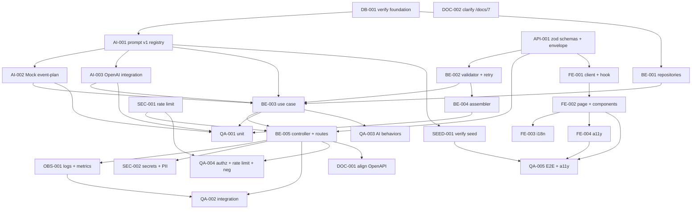

# Development Tasks — PB-P1-011 / US-017: Generar plan IA de mi evento (AI-001)

## 1. Metadata

| Field | Value |
|---|---|
| User Story ID | US-017 |
| Source User Story | `management/user-stories/US-017-generate-ai-event-plan.md` |
| Source Technical Specification | `management/technical-specs/P1/PB-P1-011/US-017-technical-spec.md` |
| Decision Resolution Artifact | No aplica |
| Priority | P1 |
| Backlog ID | PB-P1-011 |
| Backlog Title | Generar plan IA del evento (timeline + categorías) |
| Backlog Execution Order | 29 (P0: 18 + posición 11 en P1) |
| User Story Position in Backlog Item | 1 de 1 |
| Related User Stories in Backlog Item | US-017 |
| Epic | EPIC-AIP-001 — AI-Assisted Event Planning |
| Backlog Item Dependencies | PB-P0-009, PB-P0-010, PB-P0-011, PB-P1-006, PB-P0-007, PB-P0-014 |
| Feature | AI-001 — Generación de plan IA |
| Module / Domain | AI / Events |
| Backlog Alignment Status | Found |
| Task Breakdown Status | Ready for Sprint Planning |
| Created Date | 2026-06-25 |
| Last Updated | 2026-06-25 |

---

## 2. Source Validation

| Source | Found | Used | Notes |
|---|---|---|---|
| User Story | Yes | Yes | Approved with Minor Notes; status enum y endpoint canónico aplicados. |
| Technical Specification | Yes | Yes | Ready for Task Breakdown; fuente primaria. |
| Decision Resolution Artifact | No | No | Decisiones PO ya formalizadas (8.1 #9, #15). |
| Product Backlog Prioritized | Yes | Yes | PB-P1-011; deps PB-P0-009..011, PB-P1-006, PB-P0-007, PB-P0-014. |
| ADRs | Yes | Yes | ADR-AI-001 (LLMProvider), ADR-API-001 (REST), ADR-SEC-002 (sesión). |

---

## 3. Backlog Execution Context

### Parent Backlog Item

PB-P1-011 — Generar plan IA del evento (AI-001). Habilita la primera invocación IA visible al organizador, con HITL, fallback Mock determinista, persistencia trazable en `AIRecommendation` y rate limit IA `SEC-POL-AI-007` (20/usuario/hora). Reutiliza fundación IA (`LLMProvider`, `MockAIProvider`, prompt registry, `AIRecommendation`).

### Execution Order Rationale

Se ejecuta después de toda la fundación IA y de la creación de eventos. Prerrequisito de US-025, US-026 y US-018. No bloquea US no IA.

### Related User Stories in Same Backlog Item

| User Story | Role in Backlog Item | Suggested Order |
|---|---|---|
| US-017 | Generación inicial del plan IA con HITL pending | 1 |

---

## 4. Task Breakdown Summary

| Area | Number of Tasks | Notes |
|---:|---:|---|
| AI / PromptOps (AI) | 3 | Registro `EventPlanPrompt v1`, extensión Mock, integración OpenAI. |
| Database / Prisma (DB) | 1 | Verificación de fundación IA + enum y FKs. |
| Backend (BE) | 5 | Repos, validador, use case, assembler, controller. |
| API Contract (API) | 1 | Schemas Zod (params + input + output) y envelope. |
| Security / Authorization (SEC) | 2 | Aplicar rate limit y verificar Secrets Manager. |
| Frontend (FE) | 4 | Cliente, hook, página, componentes; i18n y a11y como subtarea separada. |
| Observability / Audit (OBS) | 1 | Logs `ai.event-plan.*` + métricas + correlation ID. |
| QA / Testing (QA) | 5 | Unit, integration, AI behaviors, autorización/rate limit, E2E + a11y. |
| Seed / Demo (SEED) | 1 | Verificar prompt y eventos por idioma. |
| Documentation / Traceability (DOC) | 2 | OpenAPI vía US-098 + aclaración cap en /docs/7. |
| **Total** | **25** | |

---

## 5. Traceability Matrix

| Acceptance Criterion | Technical Spec Section | Task IDs |
|---|---|---|
| AC-01: Generación exitosa | §7 UseCase, §9 API, §10 DB, §14 OBS | AI-001, AI-002, BE-001, BE-002, BE-003, BE-004, BE-005, API-001, FE-001, FE-002, OBS-001, QA-001, QA-002 |
| AC-02: Idioma respetado | §7 Payload, §11 AI Input | AI-002, BE-003, QA-002 |
| AC-03: Trazabilidad completa | §7 Persistence, §10 DB, §14 OBS | BE-001, BE-003, OBS-001, QA-002 |
| AC-04: HITL pending inicial | §7 UseCase, §11 HITL | BE-003, BE-005, FE-002, QA-002 |
| EC-01: Timeout 60s | §7 Error Handling, §11 Provider | AI-002, AI-003, BE-003, QA-003 |
| EC-02: JSON inválido | §7 Validator, §11 Fallback | BE-002, BE-003, QA-003 |
| EC-03: Provider error | §11 Provider | AI-003, BE-003, QA-003 |
| EC-04: Rate limit 429 | §12 Security, §7 Middlewares | SEC-001, QA-004 |
| VR-01..05 | §7 DTOs, §9 API | API-001, BE-005, QA-004 |
| SEC-01..06 | §12 Security | SEC-001, SEC-002, QA-004 |
| AUTH-TS-01..05 / NT-01..07 | §12 Security | SEC-001, QA-004 |
| TS-03 E2E | §13 Testing, §15 Seed | SEED-001, QA-005 |
| Accesibilidad | §8 A11y | FE-004, QA-005 |
| Documentation Alignment | §16 Doc Alignment | DOC-001, DOC-002 |

---

## 6. Development Tasks

### TASK-PB-P1-011-US-017-DB-001 — Verificar fundación IA: enum, FKs e índices

| Field | Value |
|---|---|
| Area | Database / Prisma |
| Type | Setup |
| Priority | Must |
| Estimate | XS |
| Depends On | PB-P0-009, PB-P0-010, PB-P0-011 |
| Source AC(s) | AC-01, AC-03 |
| Technical Spec Section(s) | §10 Database / Prisma Design; §16 Documentation Alignment |
| Backlog ID | PB-P1-011 |
| User Story ID | US-017 |
| Owner Role | Backend |
| Status | To Do |

#### Objective

Confirmar que `ai_recommendations`, `ai_prompt_versions`, enum `ai_recommendation_status` y los índices/FKs existentes están operativos para `event_plan`.

#### Scope

##### Include

* Inspección de `prisma/schema.prisma` y migraciones.
* Verificación del enum (incluye `pending|accepted|rejected|discarded|failed|expired`).
* Verificación de FKs `ai_recommendations.event_id → events.id` y `ai_recommendations.prompt_version_id → ai_prompt_versions.id`.
* Verificación del índice `(event_id, type, status, created_at)`.

##### Exclude

* Creación de migraciones nuevas (si falta algo, escalar a PB-P0-001 / US-099/100).

#### Implementation Notes

* No crear migraciones ad-hoc.

#### Acceptance Criteria Covered

* AC-01 (preparatoria), AC-03 (preparatoria).

#### Definition of Done

- [ ] Verificación documentada (sí/no por ítem).
- [ ] Cualquier gap escalado a la US correspondiente.

---

### TASK-PB-P1-011-US-017-AI-001 — Registrar `EventPlanPrompt v1` en registry y `ai_prompt_versions`

| Field | Value |
|---|---|
| Area | AI / PromptOps |
| Type | Implementation |
| Priority | Must |
| Estimate | S |
| Depends On | TASK-PB-P1-011-US-017-DB-001 |
| Source AC(s) | AC-01, AC-02, AC-03 |
| Technical Spec Section(s) | §11 Prompt Version; §10 DB |
| Backlog ID | PB-P1-011 |
| User Story ID | US-017 |
| Owner Role | AI |
| Status | To Do |

#### Objective

Crear el archivo de prompt versionado (`v1`) y semillar el registro correspondiente en `ai_prompt_versions`.

#### Scope

##### Include

* `prompts/EventPlanPrompt/v1.yaml` con plantilla soportando 4 locales.
* Mecanismo de seed/upsert en `ai_prompt_versions` (vía registry US-121).
* Test unitario que carga el prompt activo por key.

##### Exclude

* Versiones posteriores (`v2+`).
* Otros prompts del epic AIP.

#### Implementation Notes

* El template debe permitir interpolar `event_type_code`, `event_date`, `guest_count`, `budget_estimated`, `currency_code`, `city`, `language_code`.

#### Acceptance Criteria Covered

* AC-01, AC-02, AC-03.

#### Definition of Done

- [ ] Archivo del prompt creado y versionado.
- [ ] Registro upsert en `ai_prompt_versions` (idempotente).
- [ ] Lookup por key retorna `v1` activo.

---

### TASK-PB-P1-011-US-017-AI-002 — Extender `MockAIProvider` con respuesta determinista por idioma

| Field | Value |
|---|---|
| Area | AI / PromptOps |
| Type | Implementation |
| Priority | Must |
| Estimate | S |
| Depends On | TASK-PB-P1-011-US-017-AI-001 |
| Source AC(s) | AC-01, AC-02, EC-01 |
| Technical Spec Section(s) | §11 Provider; §15 Seed/Demo |
| Backlog ID | PB-P1-011 |
| User Story ID | US-017 |
| Owner Role | AI |
| Status | To Do |

#### Objective

Garantizar que `MockAIProvider.generateStructured` devuelve un plan estructurado válido y determinista para `EventPlanPrompt v1` en los 4 idiomas.

#### Scope

##### Include

* Fixture por idioma (es/en/pt/fr) cumpliendo `EventPlanSchema`.
* Selector por `input.language_code`.
* Tests unitarios.

##### Exclude

* Variabilidad o aleatoriedad.

#### Implementation Notes

* Reutilizar la convención del `MockAIProvider` existente (US-119); marcar `fallback_used=true` cuando la invocación viene del path de fallback.

#### Acceptance Criteria Covered

* AC-01, AC-02, EC-01.

#### Definition of Done

- [ ] Fixtures por idioma listos.
- [ ] Tests verdes (4 idiomas).

---

### TASK-PB-P1-011-US-017-AI-003 — Integrar `OpenAIProvider` con timeout y mapping de errores

| Field | Value |
|---|---|
| Area | AI / PromptOps |
| Type | Implementation |
| Priority | Must |
| Estimate | M |
| Depends On | TASK-PB-P1-011-US-017-AI-001 |
| Source AC(s) | AC-01, EC-01, EC-02, EC-03 |
| Technical Spec Section(s) | §11 Provider; §17 Risks |
| Backlog ID | PB-P1-011 |
| User Story ID | US-017 |
| Owner Role | AI |
| Status | To Do |

#### Objective

Implementar/ajustar `OpenAIProvider.generateStructured` para soportar `EventPlanPrompt v1`, aplicar timeout 60 s y mapear errores canónicos (`AI_TIMEOUT`, `AI_PROVIDER_ERROR`, `AI_INVALID_OUTPUT`).

#### Scope

##### Include

* Llamada al SDK con `AbortController` + 60 s.
* Mapping de errores a tipos del dominio.
* Tests unitarios con SDK mockeado.

##### Exclude

* AnthropicProvider operativo (queda stub).
* Streaming responses.

#### Implementation Notes

* No exponer secretos; consumir `OPENAI_API_KEY` desde variable de entorno provista por Secrets Manager.

#### Acceptance Criteria Covered

* AC-01, EC-01, EC-02, EC-03.

#### Definition of Done

- [ ] Provider responde a `event_plan` con plan válido en happy path simulado.
- [ ] Timeouts y errores mapeados.
- [ ] Tests unitarios verdes.

---

### TASK-PB-P1-011-US-017-API-001 — Definir Zod schemas (params, input, output) y envelope de error

| Field | Value |
|---|---|
| Area | API Contract |
| Type | Implementation |
| Priority | Must |
| Estimate | S |
| Depends On | — |
| Source AC(s) | VR-01..05, AC-01 |
| Technical Spec Section(s) | §7 DTOs / Schemas; §9 API Contract |
| Backlog ID | PB-P1-011 |
| User Story ID | US-017 |
| Owner Role | Backend |
| Status | To Do |

#### Objective

Especificar el contrato Zod de entrada y salida y reutilizar el envelope unificado del proyecto.

#### Scope

##### Include

* `eventPlanParamsSchema` (`{ eventId: uuid }`).
* `EventPlanInputSchema` (payload del prompt).
* `EventPlanSchema` (output IA).
* Tests unitarios de los schemas (válidos/erróneos).

##### Exclude

* Generación del snapshot OpenAPI (DOC-001 → US-098).

#### Implementation Notes

* `.strict()` para input/output del LLM (evitar campos extra).

#### Acceptance Criteria Covered

* VR-01..05, AC-01.

#### Definition of Done

- [ ] Schemas disponibles e importables por use case y controlador.
- [ ] Tests verdes.

---

### TASK-PB-P1-011-US-017-BE-001 — Repositorios: `EventRepository.findOwnedById`, `AIRecommendationPrismaRepository`, `AIPromptVersionPrismaRepository`

| Field | Value |
|---|---|
| Area | Backend |
| Type | Implementation |
| Priority | Must |
| Estimate | S |
| Depends On | TASK-PB-P1-011-US-017-DB-001 |
| Source AC(s) | AC-01, AC-03, VR-02 |
| Technical Spec Section(s) | §7 Repository / Persistence; §10 DB |
| Backlog ID | PB-P1-011 |
| User Story ID | US-017 |
| Owner Role | Backend |
| Status | To Do |

#### Objective

Habilitar acceso a `Event` con ownership, persistencia de `AIRecommendation` y lookup del prompt activo.

#### Scope

##### Include

* `EventRepository.findOwnedById(eventId, ownerUserId)` (extender si no existe).
* `AIRecommendationPrismaRepository.create(input)`.
* `AIPromptVersionPrismaRepository.findActiveByPromptKey(key)`.
* Tests unitarios con Prisma in-memory o test DB.

##### Exclude

* Métodos de mutación de eventos.

#### Implementation Notes

* `findOwnedById` debe excluir eventos `deleted` por defecto.

#### Acceptance Criteria Covered

* AC-01, AC-03, VR-02.

#### Definition of Done

- [ ] Métodos implementados y testeados.
- [ ] Sin regresiones en queries existentes.

---

### TASK-PB-P1-011-US-017-BE-002 — `EventPlanOutputValidator` con Zod + retry policy

| Field | Value |
|---|---|
| Area | Backend |
| Type | Implementation |
| Priority | Must |
| Estimate | S |
| Depends On | TASK-PB-P1-011-US-017-API-001 |
| Source AC(s) | EC-02 |
| Technical Spec Section(s) | §7 Application Services |
| Backlog ID | PB-P1-011 |
| User Story ID | US-017 |
| Owner Role | Backend |
| Status | To Do |

#### Objective

Validar el output del LLM y encapsular la política de 1 reintento.

#### Scope

##### Include

* `EventPlanOutputValidator.validate(raw): EventPlan | ZodError`.
* Helper `withRetryOnSchemaError(fn, maxRetries=1)`.
* Tests unitarios.

##### Exclude

* Telemetría detallada (cubierta por OBS-001).

#### Implementation Notes

* Conservar el `raw` truncado para logging sin PII.

#### Acceptance Criteria Covered

* EC-02.

#### Definition of Done

- [ ] Validador y helper implementados.
- [ ] Tests con casos válido/inválido/retry.

---

### TASK-PB-P1-011-US-017-BE-003 — `GenerateEventPlanUseCase` (orquestación)

| Field | Value |
|---|---|
| Area | Backend |
| Type | Implementation |
| Priority | Must |
| Estimate | M |
| Depends On | TASK-PB-P1-011-US-017-BE-001, TASK-PB-P1-011-US-017-BE-002, TASK-PB-P1-011-US-017-AI-001, TASK-PB-P1-011-US-017-AI-002, TASK-PB-P1-011-US-017-AI-003 |
| Source AC(s) | AC-01, AC-02, AC-03, AC-04, EC-01, EC-02, EC-03 |
| Technical Spec Section(s) | §7 Use Cases; §11 AI |
| Backlog ID | PB-P1-011 |
| User Story ID | US-017 |
| Owner Role | Backend |
| Status | To Do |

#### Objective

Orquestar lectura del evento, lookup del prompt, invocación al LLM (con timeout y retry de validación), fallback determinista en demo y persistencia transaccional.

#### Scope

##### Include

* `GenerateEventPlanUseCase.execute({ eventId, actor, correlationId })`.
* Selección de provider por env (`LLM_PROVIDER`, `AI_DEMO_MODE`).
* Persistencia `AIRecommendation` (éxito y falla).
* Mapping a `EventPlanResponseDTO` con `EventPlanAssembler`.

##### Exclude

* HITL accept/edit/discard (US-025).
* Regeneración con feedback (US-026).

#### Implementation Notes

* La llamada al LLM ocurre fuera de la transacción Prisma; el insert ocurre al final con los metadatos.

#### Acceptance Criteria Covered

* AC-01..04, EC-01..03.

#### Definition of Done

- [ ] Use case implementado con todas las ramas.
- [ ] Cobertura unitaria de 8 escenarios mínimos.

---

### TASK-PB-P1-011-US-017-BE-004 — `EventPlanAssembler`

| Field | Value |
|---|---|
| Area | Backend |
| Type | Implementation |
| Priority | Must |
| Estimate | XS |
| Depends On | TASK-PB-P1-011-US-017-BE-002 |
| Source AC(s) | AC-01, AC-04 |
| Technical Spec Section(s) | §7 Application Services |
| Backlog ID | PB-P1-011 |
| User Story ID | US-017 |
| Owner Role | Backend |
| Status | To Do |

#### Objective

Mapear `(AIRecommendation, EventPlan)` a `EventPlanResponseDTO`.

#### Scope

##### Include

* Whitelist explícita de campos.
* Tests unitarios.

##### Exclude

* Lógica de negocio.

#### Acceptance Criteria Covered

* AC-01, AC-04.

#### Definition of Done

- [ ] DTO retornado conforme al contrato.

---

### TASK-PB-P1-011-US-017-BE-005 — `AIEventPlanController` + rutas + middlewares + error mapping

| Field | Value |
|---|---|
| Area | Backend |
| Type | Implementation |
| Priority | Must |
| Estimate | S |
| Depends On | TASK-PB-P1-011-US-017-BE-003, TASK-PB-P1-011-US-017-API-001, TASK-PB-P1-011-US-017-SEC-001 |
| Source AC(s) | AC-01, AC-04, VR-01..05, EC-04 |
| Technical Spec Section(s) | §7 Controllers / Routes; §7 Error Handling |
| Backlog ID | PB-P1-011 |
| User Story ID | US-017 |
| Owner Role | Backend |
| Status | To Do |

#### Objective

Exponer `POST /api/v1/events/:eventId/ai/event-plan` con la pila completa de middlewares y mapping de errores al envelope unificado.

#### Scope

##### Include

* Stack: `requireAuth`, `requireRole('organizer')`, `validateParams`, `aiRateLimitMiddleware`, `withCorrelationId`.
* Registro en `routes/events/ai.routes.ts`.
* Mapping de errores (`400/401/403/404/409/429/5xx`).

##### Exclude

* Lógica IA (vive en el use case).

#### Acceptance Criteria Covered

* AC-01, AC-04, VR-01..05, EC-04.

#### Definition of Done

- [ ] Ruta operativa.
- [ ] Códigos HTTP mapeados.
- [ ] Header de correlación presente.

---

### TASK-PB-P1-011-US-017-SEC-001 — Aplicar `aiRateLimitMiddleware` (SEC-POL-AI-007)

| Field | Value |
|---|---|
| Area | Security / Authorization |
| Type | Implementation |
| Priority | Must |
| Estimate | XS |
| Depends On | PB-P0-007 |
| Source AC(s) | SEC-02, EC-04 |
| Technical Spec Section(s) | §12 Security |
| Backlog ID | PB-P1-011 |
| User Story ID | US-017 |
| Owner Role | Backend |
| Status | To Do |

#### Objective

Garantizar que el endpoint queda bajo el rate limit IA global (20/usuario/hora).

#### Scope

##### Include

* Aplicar middleware existente al endpoint.
* Verificar header `Retry-After`.

##### Exclude

* Reescribir el rate limiter.

#### Acceptance Criteria Covered

* SEC-02, EC-04.

#### Definition of Done

- [ ] Middleware activo en la ruta.
- [ ] 429 emitido con `Retry-After`.

---

### TASK-PB-P1-011-US-017-SEC-002 — Verificar Secrets Manager y redacción PII

| Field | Value |
|---|---|
| Area | Security / Authorization |
| Type | Review |
| Priority | Must |
| Estimate | XS |
| Depends On | PB-P1-029, PB-P1-030 |
| Source AC(s) | SEC-03, SEC-06 |
| Technical Spec Section(s) | §12 Security; §14 Observability |
| Backlog ID | PB-P1-011 |
| User Story ID | US-017 |
| Owner Role | DevOps |
| Status | To Do |

#### Objective

Confirmar que `OPENAI_API_KEY` se inyecta solo desde Secrets Manager y que los logs no contienen PII.

#### Scope

##### Include

* Inspección de la configuración del backend.
* Inspección del logger (lista de campos redactados).

##### Exclude

* Cambios al sistema de secretos.

#### Acceptance Criteria Covered

* SEC-03, SEC-06.

#### Definition of Done

- [ ] Verificación documentada.
- [ ] Cualquier brecha abierta como ticket dependiente.

---

### TASK-PB-P1-011-US-017-FE-001 — Cliente `aiApi.generateEventPlan` y hook `useGenerateAIPlan`

| Field | Value |
|---|---|
| Area | Frontend |
| Type | Implementation |
| Priority | Must |
| Estimate | S |
| Depends On | TASK-PB-P1-011-US-017-API-001 |
| Source AC(s) | AC-01, EC-01, EC-04 |
| Technical Spec Section(s) | §8 Data Fetching; §8 State Management |
| Backlog ID | PB-P1-011 |
| User Story ID | US-017 |
| Owner Role | Frontend |
| Status | To Do |

#### Objective

Consumir el endpoint con TanStack Query mutation y soportar loading prolongado.

#### Scope

##### Include

* `aiApi.generateEventPlan(eventId)` con cookie auth.
* `useGenerateAIPlan` mutation; mapping de `error.code`.
* Tests MSW para 200, 400, 401, 403, 404, 409, 429, 5xx.

##### Exclude

* Cancelación/timeout del cliente.

#### Acceptance Criteria Covered

* AC-01, EC-01, EC-04.

#### Definition of Done

- [ ] Hook y cliente implementados.
- [ ] Tests MSW verdes.

---

### TASK-PB-P1-011-US-017-FE-002 — Página `/[locale]/organizer/events/[id]/ai/plan` y componentes

| Field | Value |
|---|---|
| Area | Frontend |
| Type | Implementation |
| Priority | Must |
| Estimate | M |
| Depends On | TASK-PB-P1-011-US-017-FE-001 |
| Source AC(s) | AC-01, AC-04, EC-01, EC-02, EC-03, EC-04 |
| Technical Spec Section(s) | §8 Routes / Pages; §8 Components; §8 Loading/Error States |
| Backlog ID | PB-P1-011 |
| User Story ID | US-017 |
| Owner Role | Frontend |
| Status | To Do |

#### Objective

Renderizar la pantalla del generador con HITL inicial (status `pending`), loading prolongado, banners de error/rate-limit y fallback transparente en demo.

#### Scope

##### Include

* `page.tsx`, `AIPlanGenerator`, `AISuggestionViewer`, `AIBadge`.
* Estados loading/empty/error/success.
* Acciones HITL como placeholders (delegadas a US-025/US-026).

##### Exclude

* Implementación funcional de "Aceptar/Editar/Descartar".

#### Acceptance Criteria Covered

* AC-01, AC-04, EC-01..04.

#### Definition of Done

- [ ] Página accesible vía ruta.
- [ ] Estados implementados.
- [ ] Badge "Sugerido por IA" + "Sugerencia base" cuando fallback.

---

### TASK-PB-P1-011-US-017-FE-003 — i18n `ai.eventPlan.*` en 4 locales

| Field | Value |
|---|---|
| Area | Frontend |
| Type | Implementation |
| Priority | Must |
| Estimate | XS |
| Depends On | TASK-PB-P1-011-US-017-FE-002 |
| Source AC(s) | AC-02, EC-01..04 |
| Technical Spec Section(s) | §8 i18n |
| Backlog ID | PB-P1-011 |
| User Story ID | US-017 |
| Owner Role | Frontend |
| Status | To Do |

#### Objective

Proveer claves de traducción para textos UI y mensajes de error en es/en/pt/fr.

#### Scope

##### Include

* `admin.events.*` → `ai.eventPlan.*` (badges, banners, loading, errores, acciones).

##### Exclude

* Cambios al pipeline i18n.

#### Acceptance Criteria Covered

* AC-02, EC-01..04.

#### Definition of Done

- [ ] Claves en los 4 locales.
- [ ] Lint i18n pasa.

---

### TASK-PB-P1-011-US-017-FE-004 — Accesibilidad mínima de la vista

| Field | Value |
|---|---|
| Area | Frontend |
| Type | Implementation |
| Priority | Must |
| Estimate | XS |
| Depends On | TASK-PB-P1-011-US-017-FE-002 |
| Source AC(s) | AC-04 |
| Technical Spec Section(s) | §8 Accessibility |
| Backlog ID | PB-P1-011 |
| User Story ID | US-017 |
| Owner Role | Frontend |
| Status | To Do |

#### Objective

Garantizar `role="region"`, `aria-live="polite"` y foco controlado tras generación.

#### Scope

##### Include

* Atributos ARIA en `AISuggestionViewer` y banners.
* Test axe en la página.

##### Exclude

* Auditoría de toda la sección AIP.

#### Acceptance Criteria Covered

* AC-04 (UX HITL).

#### Definition of Done

- [ ] ARIA correcto.
- [ ] Navegación por teclado verificada.

---

### TASK-PB-P1-011-US-017-OBS-001 — Logging estructurado `ai.event-plan.*` + métricas + correlation id

| Field | Value |
|---|---|
| Area | Observability / Audit |
| Type | Implementation |
| Priority | Must |
| Estimate | S |
| Depends On | TASK-PB-P1-011-US-017-BE-005 |
| Source AC(s) | AC-03, SEC-03 |
| Technical Spec Section(s) | §14 Observability & Audit |
| Backlog ID | PB-P1-011 |
| User Story ID | US-017 |
| Owner Role | Backend |
| Status | To Do |

#### Objective

Emitir logs y métricas alineados con NFR-OBS-001 / PB-P0-014.

#### Scope

##### Include

* Eventos `ai.event-plan.requested|generated|failed|fallback` con campos canónicos.
* Contadores por `provider`, `fallback_used`, `result`; histograma de latencia.
* Redactor PII activo.

##### Exclude

* Cambios al stack de observabilidad.

#### Acceptance Criteria Covered

* AC-03, SEC-03.

#### Definition of Done

- [ ] Logs emitidos en cada ruta de ejecución.
- [ ] Métricas expuestas.
- [ ] Correlation ID propagado y persistido.

---

### TASK-PB-P1-011-US-017-QA-001 — Unit tests (use case, validator, assembler, providers)

| Field | Value |
|---|---|
| Area | QA / Testing |
| Type | Test |
| Priority | Must |
| Estimate | M |
| Depends On | TASK-PB-P1-011-US-017-BE-003, TASK-PB-P1-011-US-017-BE-004, TASK-PB-P1-011-US-017-AI-002, TASK-PB-P1-011-US-017-AI-003 |
| Source AC(s) | AC-01..04, EC-01..03 |
| Technical Spec Section(s) | §13 Unit Tests |
| Backlog ID | PB-P1-011 |
| User Story ID | US-017 |
| Owner Role | QA |
| Status | To Do |

#### Objective

Cubrir caminos felices y errores del use case y de sus colaboradores.

#### Scope

##### Include

* 8 escenarios del use case (happy, timeout prod, timeout demo, JSON inválido retry, JSON inválido falla, provider error prod, evento ajeno, evento `cancelled`).
* Tests del validator y assembler.

##### Exclude

* Tests UI.

#### Acceptance Criteria Covered

* AC-01..04, EC-01..03.

#### Definition of Done

- [ ] Suite verde con 100% de los escenarios.

---

### TASK-PB-P1-011-US-017-QA-002 — Integration tests del endpoint (happy + persistencia + i18n)

| Field | Value |
|---|---|
| Area | QA / Testing |
| Type | Test |
| Priority | Must |
| Estimate | S |
| Depends On | TASK-PB-P1-011-US-017-BE-005, TASK-PB-P1-011-US-017-OBS-001 |
| Source AC(s) | AC-01, AC-02, AC-03, AC-04 |
| Technical Spec Section(s) | §13 Integration Tests |
| Backlog ID | PB-P1-011 |
| User Story ID | US-017 |
| Owner Role | QA |
| Status | To Do |

#### Objective

Validar el endpoint contra BD + `MockAIProvider`.

#### Scope

##### Include

* TS-01 (happy + persistencia con metadata canónica).
* TS-02 (verificación de campos `prompt_version_id`, `llm_provider`, `language_code`, `latency_ms`, `fallback_used`, `timeout_ms`, `correlation_id`).
* TS-04 (idioma `pt` → contenido pt).

##### Exclude

* Tests UI.

#### Acceptance Criteria Covered

* AC-01..04.

#### Definition of Done

- [ ] Suite verde en CI.

---

### TASK-PB-P1-011-US-017-QA-003 — AI tests (timeout, retry, fallback)

| Field | Value |
|---|---|
| Area | QA / Testing |
| Type | Test |
| Priority | Must |
| Estimate | S |
| Depends On | TASK-PB-P1-011-US-017-BE-003 |
| Source AC(s) | EC-01, EC-02, EC-03 |
| Technical Spec Section(s) | §13 AI Tests |
| Backlog ID | PB-P1-011 |
| User Story ID | US-017 |
| Owner Role | QA |
| Status | To Do |

#### Objective

Cubrir AI-TS-02..06.

#### Scope

##### Include

* Timeout 60 s prod → `5xx AI_TIMEOUT` + `failed`.
* Timeout 60 s demo → fallback Mock + `pending` + `fallback_used=true`.
* JSON inválido + retry exitoso.
* JSON inválido en retry → `failed`.
* Provider 5xx prod → `AI_PROVIDER_ERROR`.

##### Exclude

* Tests de rate limit (en QA-004).

#### Implementation Notes

* Usar `Clock` injectable o `vi.useFakeTimers` para timeouts.

#### Acceptance Criteria Covered

* EC-01, EC-02, EC-03.

#### Definition of Done

- [ ] 5 escenarios verdes.

---

### TASK-PB-P1-011-US-017-QA-004 — Authorization + rate limit + matriz negativa

| Field | Value |
|---|---|
| Area | QA / Testing |
| Type | Test |
| Priority | Must |
| Estimate | S |
| Depends On | TASK-PB-P1-011-US-017-BE-005, TASK-PB-P1-011-US-017-SEC-001 |
| Source AC(s) | SEC-01..06, EC-04, AC-02 |
| Technical Spec Section(s) | §13 API Tests; §12 Security |
| Backlog ID | PB-P1-011 |
| User Story ID | US-017 |
| Owner Role | QA |
| Status | To Do |

#### Objective

Cubrir AUTH-TS-01..05, NT-01..07 y AI-TS-07.

#### Scope

##### Include

* Matriz por rol y ownership.
* Datos del evento incompletos / idioma no soportado / estado conflictivo.
* Rate limit excedido → `429 RATE_LIMITED` con `Retry-After`.

##### Exclude

* Tests funcionales positivos (cubiertos en QA-002).

#### Acceptance Criteria Covered

* SEC-01..06, EC-04.

#### Definition of Done

- [ ] Todos los escenarios verdes.

---

### TASK-PB-P1-011-US-017-QA-005 — E2E Playwright + a11y

| Field | Value |
|---|---|
| Area | QA / Testing |
| Type | Test |
| Priority | Must |
| Estimate | S |
| Depends On | TASK-PB-P1-011-US-017-FE-002, TASK-PB-P1-011-US-017-FE-004, TASK-PB-P1-011-US-017-SEED-001 |
| Source AC(s) | AC-01, AC-04 |
| Technical Spec Section(s) | §13 E2E Tests; §13 Accessibility Tests |
| Backlog ID | PB-P1-011 |
| User Story ID | US-017 |
| Owner Role | QA |
| Status | To Do |

#### Objective

Validar TS-03 end-to-end con seed y `MockAIProvider`, y a11y en la vista del generador.

#### Scope

##### Include

* Test "organizador genera plan IA" en al menos 2 idiomas.
* Test axe en la página detalle.

##### Exclude

* Pruebas de carga/rendimiento.

#### Acceptance Criteria Covered

* AC-01, AC-04.

#### Definition of Done

- [ ] Playwright verde.
- [ ] axe sin violaciones bloqueantes.

---

### TASK-PB-P1-011-US-017-SEED-001 — Verificar prompt seed y eventos por idioma

| Field | Value |
|---|---|
| Area | Seed / Demo Data |
| Type | Setup |
| Priority | Must |
| Estimate | XS |
| Depends On | TASK-PB-P1-011-US-017-AI-001, PB-P1-035, PB-P1-036 |
| Source AC(s) | AC-02, TS-03 |
| Technical Spec Section(s) | §15 Seed/Demo |
| Backlog ID | PB-P1-011 |
| User Story ID | US-017 |
| Owner Role | DevOps |
| Status | To Do |

#### Objective

Confirmar que el seed provee `EventPlanPrompt v1` activo y al menos un evento por idioma con datos completos.

#### Scope

##### Include

* Inspección del seed.
* Verificación post-`/api/v1/admin/reset-demo` (US-140).

##### Exclude

* Creación de seed adicional si ya existe.

#### Acceptance Criteria Covered

* AC-02, TS-03.

#### Definition of Done

- [ ] Verificación documentada.
- [ ] Gaps escalados a la US de seed correspondiente.

---

### TASK-PB-P1-011-US-017-DOC-001 — Coordinar snapshot OpenAPI con US-098

| Field | Value |
|---|---|
| Area | Documentation / Traceability |
| Type | Documentation |
| Priority | Should |
| Estimate | XS |
| Depends On | TASK-PB-P1-011-US-017-BE-005 |
| Source AC(s) | AC-01 |
| Technical Spec Section(s) | §9 API; §16 Doc Alignment |
| Backlog ID | PB-P1-011 |
| User Story ID | US-017 |
| Owner Role | Backend |
| Status | To Do |

#### Objective

Asegurar que el snapshot OpenAPI refleje `POST /api/v1/events/:eventId/ai/event-plan` con todos los códigos de error y `Retry-After`.

#### Scope

##### Include

* Ticket o PR de coordinación con US-098.

##### Exclude

* Cambios fuera del scope del snapshot.

#### Acceptance Criteria Covered

* AC-01 (alineación documental).

#### Definition of Done

- [ ] Snapshot actualizado o ticket abierto en US-098.

---

### TASK-PB-P1-011-US-017-DOC-002 — Aclaración en `/docs/7` sobre cap MVP de regeneraciones

| Field | Value |
|---|---|
| Area | Documentation / Traceability |
| Type | Documentation |
| Priority | Should |
| Estimate | XS |
| Depends On | — |
| Source AC(s) | — |
| Technical Spec Section(s) | §16 Doc Alignment |
| Backlog ID | PB-P1-011 |
| User Story ID | US-017 |
| Owner Role | Tech Lead |
| Status | To Do |

#### Objective

Registrar formalmente en `/docs/7` que el cap MVP de regeneraciones por evento es el rate limit global `SEC-POL-AI-007`; el flujo dedicado se modela en US-026.

#### Scope

##### Include

* Edición ligera de `/docs/7` (sección de preguntas abiertas).

##### Exclude

* Cambios en otras secciones.

#### Acceptance Criteria Covered

* — (alineación documental).

#### Definition of Done

- [ ] Aclaración aplicada o PR abierto.

---

## 7. Required QA Tasks

| Task ID | Test Type | Purpose |
|---|---|---|
| TASK-PB-P1-011-US-017-QA-001 | Unit | Use case, validator, assembler, providers. |
| TASK-PB-P1-011-US-017-QA-002 | Integration | Endpoint + persistencia + i18n. |
| TASK-PB-P1-011-US-017-QA-003 | AI / behaviors | Timeout, retry, fallback. |
| TASK-PB-P1-011-US-017-QA-004 | API / Security | Authorization + rate limit + matriz negativa. |
| TASK-PB-P1-011-US-017-QA-005 | E2E + A11y | Demo + axe. |

---

## 8. Required Security Tasks

| Task ID | Security Concern | Purpose |
|---|---|---|
| TASK-PB-P1-011-US-017-SEC-001 | Rate limit IA `SEC-POL-AI-007` | Aplicar y verificar `429 + Retry-After`. |
| TASK-PB-P1-011-US-017-SEC-002 | Secrets + PII | Confirmar Secrets Manager y redacción en logs. |

---

## 9. Required Seed / Demo Tasks

| Task ID | Seed/Demo Concern | Purpose |
|---|---|---|
| TASK-PB-P1-011-US-017-SEED-001 | `EventPlanPrompt v1` + eventos por idioma | Habilitar TS-03 y demo determinista. |

---

## 10. Observability / Audit Tasks

| Task ID | Concern | Purpose |
|---|---|---|
| TASK-PB-P1-011-US-017-OBS-001 | Logs `ai.event-plan.*` + métricas + correlation ID | Cumplir NFR-OBS-001 y AC-03. |

---

## 11. Documentation / Traceability Tasks

| Task ID | Document / Artifact | Purpose |
|---|---|---|
| TASK-PB-P1-011-US-017-DOC-001 | `/docs/16` (OpenAPI vía US-098) | Documentation Alignment Required. |
| TASK-PB-P1-011-US-017-DOC-002 | `/docs/7` (cap MVP de regeneraciones) | Documentation Alignment Required. |

---

## 12. Dependency Graph

---

## 13. Suggested Implementation Order

### Phase 1 — Foundation

* TASK-PB-P1-011-US-017-DB-001
* TASK-PB-P1-011-US-017-API-001
* TASK-PB-P1-011-US-017-AI-001
* TASK-PB-P1-011-US-017-SEED-001

### Phase 2 — Core Implementation

* TASK-PB-P1-011-US-017-AI-002
* TASK-PB-P1-011-US-017-AI-003
* TASK-PB-P1-011-US-017-BE-001
* TASK-PB-P1-011-US-017-BE-002
* TASK-PB-P1-011-US-017-BE-003
* TASK-PB-P1-011-US-017-BE-004
* TASK-PB-P1-011-US-017-SEC-001
* TASK-PB-P1-011-US-017-BE-005
* TASK-PB-P1-011-US-017-OBS-001
* TASK-PB-P1-011-US-017-FE-001
* TASK-PB-P1-011-US-017-FE-002
* TASK-PB-P1-011-US-017-FE-003
* TASK-PB-P1-011-US-017-FE-004

### Phase 3 — Validation / Security / QA

* TASK-PB-P1-011-US-017-SEC-002
* TASK-PB-P1-011-US-017-QA-001
* TASK-PB-P1-011-US-017-QA-002
* TASK-PB-P1-011-US-017-QA-003
* TASK-PB-P1-011-US-017-QA-004
* TASK-PB-P1-011-US-017-QA-005

### Phase 4 — Documentation / Review

* TASK-PB-P1-011-US-017-DOC-001
* TASK-PB-P1-011-US-017-DOC-002

---

## 14. Risks & Mitigations

| Risk | Impact | Mitigation | Related Task |
|---|---|---|---|
| Latencia variable de OpenAI cercana a 60 s | Timeouts frecuentes en producción. | Métricas p95/p99 (OBS-001); fallback solo en demo. | AI-003, OBS-001 |
| JSON inválido recurrente del LLM | `5xx AI_INVALID_OUTPUT` frecuentes. | Retry estricto (BE-002); instrumentación de fallos (OBS-001); ajustar prompt v2 si persiste (fuera de US-017). | BE-002, OBS-001 |
| Saturación del rate limit por usuario | Bloqueo de demos. | Mock no consume cuota; usar Mock en demos. | SEC-001 |
| Filtración de PII en logs | Riesgo de cumplimiento. | Redactor centralizado; verificación en SEC-002 y QA-004. | SEC-002, QA-004 |
| `OPENAI_API_KEY` mal configurada en prod | Caída del flujo IA. | Healthcheck IA (PB-P0-008) + alertas; fallback Mock solo en demo. | SEC-002 |

---

## 15. Out of Scope Confirmation

* No se implementan acciones HITL `accept|edit|discard` (US-025).
* No se implementa regeneración con feedback (US-026).
* No se implementa checklist IA (US-018).
* No se implementan funcionalidades de RAG, vector DB, chatbot conversacional ni generación de imágenes IA.
* No se implementan `AnthropicProvider` operativo, decisiones autónomas, ni moderación automática.
* No se introducen cambios estructurales en BD ni nuevos índices.
* No se cambia el sistema de rate limit ni de secretos (se reutilizan).

---

## 16. Readiness for Sprint Planning

| Check                                      | Status |
| ------------------------------------------ | ------ |
| Product Backlog mapping found              | Pass   |
| Every AC maps to tasks                     | Pass   |
| Technical Spec used when available         | Pass   |
| QA tasks included                          | Pass   |
| Security tasks included if applicable      | Pass   |
| Seed/demo tasks included if applicable     | Pass   |
| Observability tasks included if applicable | Pass   |
| Documentation tasks included if applicable | Pass   |
| Task dependencies clear                    | Pass   |
| Tasks small enough                         | Pass   |
| Ready for Sprint Planning                  | Yes    |

---

## 17. Final Recommendation

**Ready for Sprint Planning.** US aprobada, Technical Spec exhaustiva, mapeo a PB-P1-011 confirmado. Las 25 tareas cubren AC, EC, SEC, AI, OBS y QA con dependencias explícitas. Sin scope creep. Las alineaciones documentales se atienden vía DOC-001/DOC-002 y no bloquean la planificación.
