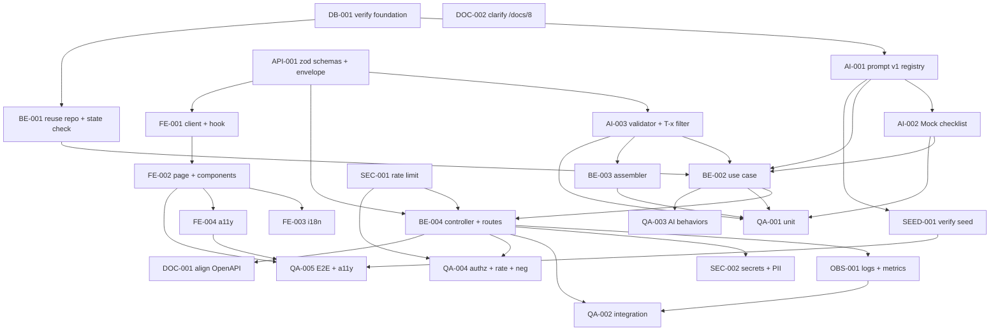

# Development Tasks — PB-P1-012 / US-018: Generar checklist IA con fechas relativas (AI-002)

## 1. Metadata

| Field | Value |
|---|---|
| User Story ID | US-018 |
| Source User Story | `management/user-stories/US-018-generate-ai-checklist.md` |
| Source Technical Specification | `management/technical-specs/P1/PB-P1-012/US-018-technical-spec.md` |
| Decision Resolution Artifact | No aplica |
| Priority | P1 |
| Backlog ID | PB-P1-012 |
| Backlog Title | Generar checklist IA con fechas relativas T-x |
| Backlog Execution Order | 30 (P0: 18 + posición 12 en P1) |
| User Story Position in Backlog Item | 1 de 1 |
| Related User Stories in Backlog Item | US-018 |
| Epic | EPIC-AIP-001 — AI-Assisted Event Planning |
| Backlog Item Dependencies | PB-P1-011, PB-P1-015, PB-P0-009, PB-P0-010, PB-P0-011, PB-P0-007, PB-P0-014 |
| Feature | AI-002 — Checklist IA |
| Module / Domain | AI / Tasks |
| Backlog Alignment Status | Found |
| Task Breakdown Status | Ready for Sprint Planning |
| Created Date | 2026-06-25 |
| Last Updated | 2026-06-25 |

---

## 2. Source Validation

| Source | Found | Used | Notes |
|---|---|---|---|
| User Story | Yes | Yes | Approved with Minor Notes; scope acotado a generación (sin EventTask). |
| Technical Specification | Yes | Yes | Ready for Task Breakdown; fuente primaria. |
| Decision Resolution Artifact | No | No | Decisiones PO ya formalizadas (8.1 #9, #15). |
| Product Backlog Prioritized | Yes | Yes | PB-P1-012; deps PB-P1-011, PB-P1-015, PB-P0-009..011, PB-P0-007, PB-P0-014. |
| ADRs | Yes | Yes | ADR-AI-001, ADR-API-001, ADR-SEC-002. |

---

## 3. Backlog Execution Context

### Parent Backlog Item

PB-P1-012 — Generación de checklist IA con HITL. La generación crea solo `AIRecommendation(type='checklist', status='pending')`. La materialización de `EventTask` y la conversión T-x → fecha absoluta corresponden a US-031 / PB-P1-017.

### Execution Order Rationale

Se ejecuta inmediatamente después de US-017 (AI-001), reutilizando el port `LLMProvider`, el `MockAIProvider`, el prompt registry, el rate limit y los componentes UI compartidos (`AIBadge`, error mapper, banners).

### Related User Stories in Same Backlog Item

| User Story | Role in Backlog Item | Suggested Order |
|---|---|---|
| US-018 | Generación inicial del checklist IA con HITL pending | 1 |

---

## 4. Task Breakdown Summary

| Area | Number of Tasks | Notes |
|---:|---:|---|
| AI / PromptOps (AI) | 3 | Registro `ChecklistPrompt v1`, extensión Mock, validator (consistency phase↔days) + filtro T-x. |
| Database / Prisma (DB) | 1 | Verificación de enums/FKs para `type='checklist'` (sin migraciones). |
| Backend (BE) | 4 | Filtro T-x app, use case, assembler, controller. |
| API Contract (API) | 1 | Schemas Zod (params, input, output). |
| Security / Authorization (SEC) | 2 | Aplicar rate limit; Secrets/PII. |
| Frontend (FE) | 4 | Cliente, hook, página, componentes; i18n y a11y separados. |
| Observability / Audit (OBS) | 1 | Logs `ai.checklist.*` + métricas + correlation ID. |
| QA / Testing (QA) | 5 | Unit, integration, AI behaviors, autorización/rate limit, E2E + a11y. |
| Seed / Demo (SEED) | 1 | Verificar prompt + eventos por idioma + uno próximo. |
| Documentation / Traceability (DOC) | 2 | OpenAPI (US-098) + aclaración `/docs/8`. |
| **Total** | **24** | |

---

## 5. Traceability Matrix

| Acceptance Criterion | Technical Spec Section | Task IDs |
|---|---|---|
| AC-01: Generación con HITL pending sin EventTask | §7 UseCase, §10 DB | AI-001, AI-002, BE-001, BE-002, BE-003, BE-004, API-001, FE-001, FE-002, QA-001, QA-002 |
| AC-02: Idioma respetado | §7 Payload, §11 AI Input | AI-002, BE-002, QA-002 |
| AC-03: Trazabilidad completa | §7 Persistence, §10 DB, §14 OBS | BE-002, OBS-001, QA-002 |
| AC-04: Estructura agrupada por fase T-x | §7 Validator, §8 Components | AI-003, FE-002, QA-002 |
| EC-01: Evento próximo → filtrado T-x | §7 ChecklistTRangeFilter | BE-001, AI-003, QA-002, SEED-001 |
| EC-02: Timeout 60s prod/demo | §7 Error Handling, §11 Provider | AI-002, BE-002, QA-003 |
| EC-03: JSON inválido + 1 retry | §7 Validator | AI-003, BE-002, QA-003 |
| EC-04: Provider error | §11 Provider | AI-002, BE-002, QA-003 |
| EC-05: Rate limit 429 | §12 Security | SEC-001, QA-004 |
| VR-01..06 | §7 DTOs, §9 API | API-001, BE-001, BE-004, QA-004 |
| SEC-01..06 | §12 Security | SEC-001, SEC-002, QA-004 |
| AUTH-TS-01..05 / NT-01..07 | §12 Security | SEC-001, QA-004 |
| TS-05 E2E | §13 Testing, §15 Seed | SEED-001, QA-005 |
| Accesibilidad | §8 A11y | FE-004, QA-005 |
| Documentation Alignment | §16 | DOC-001, DOC-002 |

---

## 6. Development Tasks

### TASK-PB-P1-012-US-018-DB-001 — Verificar enums/FKs para `type='checklist'`

| Field | Value |
|---|---|
| Area | Database / Prisma |
| Type | Setup |
| Priority | Must |
| Estimate | XS |
| Depends On | PB-P0-009, PB-P0-010, PB-P0-011 |
| Source AC(s) | AC-01, AC-03 |
| Technical Spec Section(s) | §10 DB; §16 Documentation Alignment |
| Backlog ID | PB-P1-012 |
| User Story ID | US-018 |
| Owner Role | Backend |
| Status | To Do |

#### Objective

Confirmar que `ai_recommendations`, `ai_prompt_versions`, enum `ai_recommendation_type` (incluye `'checklist'`), enum `ai_recommendation_status` y los índices/FKs existentes están operativos.

#### Scope

##### Include

* Inspección de `prisma/schema.prisma` y migraciones.
* Verificación del enum (incluye `'checklist'`).
* Verificación de FKs e índices reutilizados.

##### Exclude

* Crear migraciones nuevas (escalar a PB-P0-001 si falta).

#### Acceptance Criteria Covered

* AC-01, AC-03 (preparatoria).

#### Definition of Done

- [ ] Verificación documentada por ítem.
- [ ] Gaps escalados a la US correspondiente.

---

### TASK-PB-P1-012-US-018-AI-001 — Registrar `ChecklistPrompt v1` en registry y `ai_prompt_versions`

| Field | Value |
|---|---|
| Area | AI / PromptOps |
| Type | Implementation |
| Priority | Must |
| Estimate | S |
| Depends On | TASK-PB-P1-012-US-018-DB-001 |
| Source AC(s) | AC-01, AC-02, AC-03 |
| Technical Spec Section(s) | §11 Prompt Version; §10 DB |
| Backlog ID | PB-P1-012 |
| User Story ID | US-018 |
| Owner Role | AI |
| Status | To Do |

#### Objective

Crear el archivo de prompt `ChecklistPrompt v1` y semillar el registro en `ai_prompt_versions`.

#### Scope

##### Include

* `prompts/ChecklistPrompt/v1.yaml` con plantilla 4 locales.
* Upsert idempotente en `ai_prompt_versions` (registry US-121).
* Test unitario de lookup por key.

##### Exclude

* Versiones posteriores.

#### Implementation Notes

* Interpolar `event_type_code`, `event_date`, `guest_count`, `language_code`.

#### Acceptance Criteria Covered

* AC-01, AC-02, AC-03.

#### Definition of Done

- [ ] Archivo creado, versionado y cargado.
- [ ] Upsert idempotente verificado.

---

### TASK-PB-P1-012-US-018-AI-002 — Extender `MockAIProvider` con respuesta determinista por idioma para `checklist`

| Field | Value |
|---|---|
| Area | AI / PromptOps |
| Type | Implementation |
| Priority | Must |
| Estimate | S |
| Depends On | TASK-PB-P1-012-US-018-AI-001 |
| Source AC(s) | AC-01, AC-02, EC-01, EC-02, EC-04 |
| Technical Spec Section(s) | §11 Provider; §15 Seed/Demo |
| Backlog ID | PB-P1-012 |
| User Story ID | US-018 |
| Owner Role | AI |
| Status | To Do |

#### Objective

Garantizar que `MockAIProvider.generateStructured` para `ChecklistPrompt v1` retorna respuesta determinista por idioma cumpliendo `EventChecklistSchema`, con tareas en las 5 fases T-x.

#### Scope

##### Include

* Fixture por idioma (es/en/pt/fr) con al menos 8 tareas distribuidas en T-180..T-1.
* Marcar `fallback_used=true` cuando se invoca como fallback.
* Tests unitarios por idioma.

##### Exclude

* Variabilidad o aleatoriedad.

#### Acceptance Criteria Covered

* AC-01, AC-02, EC-01..04.

#### Definition of Done

- [ ] Fixtures listos y validados contra schema.
- [ ] Tests verdes (4 idiomas).

---

### TASK-PB-P1-012-US-018-AI-003 — `ChecklistOutputValidator` (Zod + consistency phase↔days) y `ChecklistTRangeFilter`

| Field | Value |
|---|---|
| Area | AI / PromptOps |
| Type | Implementation |
| Priority | Must |
| Estimate | S |
| Depends On | TASK-PB-P1-012-US-018-API-001 |
| Source AC(s) | AC-04, EC-01, EC-03 |
| Technical Spec Section(s) | §7 Application Services; §11 Output Schema |
| Backlog ID | PB-P1-012 |
| User Story ID | US-018 |
| Owner Role | Backend |
| Status | To Do |

#### Objective

Implementar el validador del output IA (incluyendo consistencia básica `phase ↔ due_relative_days`) y el filtro T-x por días disponibles al evento.

#### Scope

##### Include

* `ChecklistOutputValidator.validate(raw): EventChecklist | ZodError`.
* Helper `withRetryOnSchemaError(fn, maxRetries=1)` (puede reusar el de US-017).
* `ChecklistTRangeFilter.filter(tasks, daysToEvent)`.
* Tests unitarios (válido/inválido/retry, filtrado por umbral).

##### Exclude

* Persistencia y orquestación (en BE-002).

#### Implementation Notes

* Consistencia `phase`: por ejemplo `T-180` debe coincidir con `due_relative_days ∈ [91, 180]` (definir rangos exactos al implementar).

#### Acceptance Criteria Covered

* AC-04, EC-01, EC-03.

#### Definition of Done

- [ ] Validator y filtro implementados con tests.

---

### TASK-PB-P1-012-US-018-API-001 — Definir Zod schemas (params, input, output) y envelope

| Field | Value |
|---|---|
| Area | API Contract |
| Type | Implementation |
| Priority | Must |
| Estimate | S |
| Depends On | — |
| Source AC(s) | VR-01..06, AC-04 |
| Technical Spec Section(s) | §7 DTOs / Schemas; §9 API Contract |
| Backlog ID | PB-P1-012 |
| User Story ID | US-018 |
| Owner Role | Backend |
| Status | To Do |

#### Objective

Especificar el contrato Zod y reutilizar el envelope unificado.

#### Scope

##### Include

* `eventChecklistParamsSchema` (`{ eventId: uuid }`).
* `EventChecklistInputSchema` (payload del prompt).
* `EventChecklistSchema` (output IA con `phase` enum).
* Tests unitarios de los schemas.

##### Exclude

* Snapshot OpenAPI (DOC-001 → US-098).

#### Acceptance Criteria Covered

* VR-01..06, AC-04.

#### Definition of Done

- [ ] Schemas importables por use case y controlador.
- [ ] Tests verdes.

---

### TASK-PB-P1-012-US-018-BE-001 — Reuso `EventRepository.findOwnedById` + validación de estado

| Field | Value |
|---|---|
| Area | Backend |
| Type | Implementation |
| Priority | Must |
| Estimate | XS |
| Depends On | TASK-PB-P1-012-US-018-DB-001 |
| Source AC(s) | AC-01, VR-02, VR-05 |
| Technical Spec Section(s) | §7 Repository; §10 DB |
| Backlog ID | PB-P1-012 |
| User Story ID | US-018 |
| Owner Role | Backend |
| Status | To Do |

#### Objective

Reutilizar `EventRepository.findOwnedById` (introducido en US-017) y agregar verificación de estado (`draft|active`).

#### Scope

##### Include

* Validar disponibilidad del método.
* Helper `assertEventEditableForAI(event)` o inline en el use case.
* Tests unitarios.

##### Exclude

* Modificación del repositorio si ya existe.

#### Acceptance Criteria Covered

* AC-01, VR-02, VR-05.

#### Definition of Done

- [ ] Lectura con ownership + chequeo de estado verificados.

---

### TASK-PB-P1-012-US-018-BE-002 — `GenerateChecklistUseCase` (orquestación)

| Field | Value |
|---|---|
| Area | Backend |
| Type | Implementation |
| Priority | Must |
| Estimate | M |
| Depends On | TASK-PB-P1-012-US-018-BE-001, TASK-PB-P1-012-US-018-AI-001, TASK-PB-P1-012-US-018-AI-002, TASK-PB-P1-012-US-018-AI-003 |
| Source AC(s) | AC-01, AC-02, AC-03, EC-01, EC-02, EC-03, EC-04 |
| Technical Spec Section(s) | §7 Use Cases; §11 AI |
| Backlog ID | PB-P1-012 |
| User Story ID | US-018 |
| Owner Role | Backend |
| Status | To Do |

#### Objective

Orquestar lectura del evento, lookup del prompt, invocación al LLM (con timeout y retry), fallback Mock en demo, filtro T-x y persistencia transaccional.

#### Scope

##### Include

* `GenerateChecklistUseCase.execute(...)` con todas las ramas (happy / failed / fallback).
* Persistencia siempre (éxito y falla), sin tocar `event_tasks`.
* Mapping a `EventChecklistResponseDTO` (vía `ChecklistAssembler` BE-003).

##### Exclude

* HITL accept/edit/discard (US-025/031).

#### Implementation Notes

* La llamada al LLM ocurre fuera de `prisma.$transaction`; el insert dentro.

#### Acceptance Criteria Covered

* AC-01..03, EC-01..04.

#### Definition of Done

- [ ] Use case implementado con todas las ramas.
- [ ] Cobertura unitaria de 8 escenarios mínimos.

---

### TASK-PB-P1-012-US-018-BE-003 — `ChecklistAssembler`

| Field | Value |
|---|---|
| Area | Backend |
| Type | Implementation |
| Priority | Must |
| Estimate | XS |
| Depends On | TASK-PB-P1-012-US-018-AI-003 |
| Source AC(s) | AC-01, AC-03 |
| Technical Spec Section(s) | §7 Application Services |
| Backlog ID | PB-P1-012 |
| User Story ID | US-018 |
| Owner Role | Backend |
| Status | To Do |

#### Objective

Mapear `(AIRecommendation, EventChecklist)` a `EventChecklistResponseDTO`.

#### Scope

##### Include

* Whitelist explícita de campos.
* Tests unitarios.

##### Exclude

* Lógica de negocio.

#### Acceptance Criteria Covered

* AC-01, AC-03.

#### Definition of Done

- [ ] DTO retornado conforme al contrato.

---

### TASK-PB-P1-012-US-018-BE-004 — `AIChecklistController` + rutas + middlewares + error mapping

| Field | Value |
|---|---|
| Area | Backend |
| Type | Implementation |
| Priority | Must |
| Estimate | S |
| Depends On | TASK-PB-P1-012-US-018-BE-002, TASK-PB-P1-012-US-018-API-001, TASK-PB-P1-012-US-018-SEC-001 |
| Source AC(s) | AC-01, VR-01..06, EC-05 |
| Technical Spec Section(s) | §7 Controllers / Routes |
| Backlog ID | PB-P1-012 |
| User Story ID | US-018 |
| Owner Role | Backend |
| Status | To Do |

#### Objective

Exponer `POST /api/v1/events/:eventId/ai/checklist` con la pila completa de middlewares y mapping al envelope unificado.

#### Scope

##### Include

* Stack `requireAuth`, `requireRole('organizer')`, `validateParams`, `aiRateLimitMiddleware`, `withCorrelationId`.
* Mapping de errores 400/401/403/404/409/429/5xx.
* Registro en `routes/events/ai.routes.ts`.

##### Exclude

* Lógica IA (en use case).

#### Acceptance Criteria Covered

* AC-01, VR-01..06, EC-05.

#### Definition of Done

- [ ] Ruta operativa.
- [ ] Códigos HTTP mapeados.
- [ ] Header de correlación presente.

---

### TASK-PB-P1-012-US-018-SEC-001 — Aplicar `aiRateLimitMiddleware`

| Field | Value |
|---|---|
| Area | Security / Authorization |
| Type | Implementation |
| Priority | Must |
| Estimate | XS |
| Depends On | PB-P0-007 |
| Source AC(s) | SEC-02, EC-05 |
| Technical Spec Section(s) | §12 Security |
| Backlog ID | PB-P1-012 |
| User Story ID | US-018 |
| Owner Role | Backend |
| Status | To Do |

#### Objective

Garantizar que el endpoint queda bajo `SEC-POL-AI-007` (20/usuario/hora) y emite `Retry-After`.

#### Scope

##### Include

* Aplicar middleware existente al endpoint.
* Validar header `Retry-After` en respuesta `429`.

##### Exclude

* Reescribir el rate limiter.

#### Acceptance Criteria Covered

* SEC-02, EC-05.

#### Definition of Done

- [ ] Middleware activo en la ruta.
- [ ] 429 emitido con `Retry-After`.

---

### TASK-PB-P1-012-US-018-SEC-002 — Verificar Secrets Manager y redacción PII

| Field | Value |
|---|---|
| Area | Security / Authorization |
| Type | Review |
| Priority | Must |
| Estimate | XS |
| Depends On | PB-P1-029, PB-P1-030 |
| Source AC(s) | SEC-03, SEC-06 |
| Technical Spec Section(s) | §12 Security; §14 Observability |
| Backlog ID | PB-P1-012 |
| User Story ID | US-018 |
| Owner Role | DevOps |
| Status | To Do |

#### Objective

Confirmar que `OPENAI_API_KEY` se inyecta solo desde Secrets Manager y que los logs no contienen PII.

#### Scope

##### Include

* Inspección de la configuración del backend.
* Inspección del logger (campos redactados).

##### Exclude

* Cambios al sistema de secretos.

#### Acceptance Criteria Covered

* SEC-03, SEC-06.

#### Definition of Done

- [ ] Verificación documentada.

---

### TASK-PB-P1-012-US-018-FE-001 — Cliente `aiApi.generateChecklist` y hook `useGenerateAIChecklist`

| Field | Value |
|---|---|
| Area | Frontend |
| Type | Implementation |
| Priority | Must |
| Estimate | S |
| Depends On | TASK-PB-P1-012-US-018-API-001 |
| Source AC(s) | AC-01, EC-02, EC-05 |
| Technical Spec Section(s) | §8 Data Fetching; §8 State Management |
| Backlog ID | PB-P1-012 |
| User Story ID | US-018 |
| Owner Role | Frontend |
| Status | To Do |

#### Objective

Consumir el endpoint con TanStack `useMutation` y soportar loading prolongado.

#### Scope

##### Include

* `aiApi.generateChecklist(eventId)` con cookie auth.
* `useGenerateAIChecklist` con mapping de `error.code`.
* Tests MSW para 200, 400, 401, 403, 404, 409, 429, 5xx.

##### Exclude

* Cancelación por timeout corto del cliente.

#### Acceptance Criteria Covered

* AC-01, EC-02, EC-05.

#### Definition of Done

- [ ] Hook y cliente implementados.
- [ ] Tests MSW verdes.

---

### TASK-PB-P1-012-US-018-FE-002 — Página `/[locale]/organizer/events/[id]/ai/checklist` y componentes

| Field | Value |
|---|---|
| Area | Frontend |
| Type | Implementation |
| Priority | Must |
| Estimate | M |
| Depends On | TASK-PB-P1-012-US-018-FE-001 |
| Source AC(s) | AC-01, AC-04, EC-01..05 |
| Technical Spec Section(s) | §8 Routes / Pages; §8 Components |
| Backlog ID | PB-P1-012 |
| User Story ID | US-018 |
| Owner Role | Frontend |
| Status | To Do |

#### Objective

Renderizar el generador con badge "Sugerido por IA", agrupación por fase y manejo de estados/errores.

#### Scope

##### Include

* `page.tsx`, `AIChecklistGenerator`, `AIChecklistViewer`.
* Reuso de `AIBadge` (US-017).
* Banners de error y rate-limit; loading prolongado.

##### Exclude

* Selección/confirmación de tareas (US-031).

#### Acceptance Criteria Covered

* AC-01, AC-04, EC-01..05.

#### Definition of Done

- [ ] Página accesible vía ruta.
- [ ] Estados implementados.
- [ ] Badge y agrupación renderizados.

---

### TASK-PB-P1-012-US-018-FE-003 — i18n `ai.checklist.*` en 4 locales

| Field | Value |
|---|---|
| Area | Frontend |
| Type | Implementation |
| Priority | Must |
| Estimate | XS |
| Depends On | TASK-PB-P1-012-US-018-FE-002 |
| Source AC(s) | AC-04, EC-01..05 |
| Technical Spec Section(s) | §8 i18n |
| Backlog ID | PB-P1-012 |
| User Story ID | US-018 |
| Owner Role | Frontend |
| Status | To Do |

#### Objective

Proveer claves de traducción para textos UI y mensajes de error en es/en/pt/fr.

#### Scope

##### Include

* Claves `ai.checklist.*` (badges, banners, loading, errores, headings de fase).

##### Exclude

* Cambios al pipeline i18n.

#### Acceptance Criteria Covered

* AC-04, EC-01..05.

#### Definition of Done

- [ ] Claves en 4 locales.
- [ ] Lint i18n pasa.

---

### TASK-PB-P1-012-US-018-FE-004 — Accesibilidad mínima

| Field | Value |
|---|---|
| Area | Frontend |
| Type | Implementation |
| Priority | Must |
| Estimate | XS |
| Depends On | TASK-PB-P1-012-US-018-FE-002 |
| Source AC(s) | AC-04 |
| Technical Spec Section(s) | §8 Accessibility |
| Backlog ID | PB-P1-012 |
| User Story ID | US-018 |
| Owner Role | Frontend |
| Status | To Do |

#### Objective

Garantizar `role="region"` por fase, `aria-live="polite"` y foco controlado.

#### Scope

##### Include

* Atributos ARIA en `AIChecklistViewer` y banners.
* Test axe.

##### Exclude

* Auditoría de toda la sección AIP.

#### Acceptance Criteria Covered

* AC-04.

#### Definition of Done

- [ ] ARIA correcto.
- [ ] Navegación por teclado verificada.

---

### TASK-PB-P1-012-US-018-OBS-001 — Logging estructurado `ai.checklist.*` + métricas + correlation ID

| Field | Value |
|---|---|
| Area | Observability / Audit |
| Type | Implementation |
| Priority | Must |
| Estimate | S |
| Depends On | TASK-PB-P1-012-US-018-BE-004 |
| Source AC(s) | AC-03, SEC-03 |
| Technical Spec Section(s) | §14 Observability & Audit |
| Backlog ID | PB-P1-012 |
| User Story ID | US-018 |
| Owner Role | Backend |
| Status | To Do |

#### Objective

Emitir logs y métricas alineados con NFR-OBS-001 / PB-P0-014.

#### Scope

##### Include

* Eventos `ai.checklist.requested|generated|failed|fallback` con campos canónicos.
* Contadores por `provider`, `fallback_used`, `result`; histograma de latencia.

##### Exclude

* Cambios al stack de observabilidad.

#### Acceptance Criteria Covered

* AC-03, SEC-03.

#### Definition of Done

- [ ] Logs en cada ruta.
- [ ] Métricas expuestas.
- [ ] Correlation ID propagado.

---

### TASK-PB-P1-012-US-018-QA-001 — Unit tests (use case, validator, filter, assembler, providers)

| Field | Value |
|---|---|
| Area | QA / Testing |
| Type | Test |
| Priority | Must |
| Estimate | M |
| Depends On | TASK-PB-P1-012-US-018-BE-002, TASK-PB-P1-012-US-018-BE-003, TASK-PB-P1-012-US-018-AI-002, TASK-PB-P1-012-US-018-AI-003 |
| Source AC(s) | AC-01..04, EC-01..04 |
| Technical Spec Section(s) | §13 Unit Tests |
| Backlog ID | PB-P1-012 |
| User Story ID | US-018 |
| Owner Role | QA |
| Status | To Do |

#### Objective

Cubrir caminos felices y errores del use case y colaboradores.

#### Scope

##### Include

* 8 escenarios del use case (happy, timeout prod/demo, JSON inválido retry exitoso/falla, provider error prod, evento ajeno, evento `cancelled`).
* Tests del validator (consistency phase↔days), filtro T-x y assembler.

##### Exclude

* Tests UI.

#### Acceptance Criteria Covered

* AC-01..04, EC-01..04.

#### Definition of Done

- [ ] Suite verde con todos los escenarios.

---

### TASK-PB-P1-012-US-018-QA-002 — Integration tests del endpoint (happy + i18n + filtrado T-x + persistencia)

| Field | Value |
|---|---|
| Area | QA / Testing |
| Type | Test |
| Priority | Must |
| Estimate | S |
| Depends On | TASK-PB-P1-012-US-018-BE-004, TASK-PB-P1-012-US-018-OBS-001 |
| Source AC(s) | AC-01, AC-02, AC-03, EC-01 |
| Technical Spec Section(s) | §13 Integration Tests |
| Backlog ID | PB-P1-012 |
| User Story ID | US-018 |
| Owner Role | QA |
| Status | To Do |

#### Objective

Validar el endpoint contra BD + `MockAIProvider`.

#### Scope

##### Include

* TS-01 (happy + metadata canónica).
* TS-02 (verificación de campos persistidos).
* TS-03 (idioma `pt` → contenido pt).
* TS-04 (evento próximo → filtrado T-x).

##### Exclude

* Tests UI.

#### Acceptance Criteria Covered

* AC-01..03, EC-01.

#### Definition of Done

- [ ] Suite verde en CI.

---

### TASK-PB-P1-012-US-018-QA-003 — AI tests (timeout, retry, fallback)

| Field | Value |
|---|---|
| Area | QA / Testing |
| Type | Test |
| Priority | Must |
| Estimate | S |
| Depends On | TASK-PB-P1-012-US-018-BE-002 |
| Source AC(s) | EC-02, EC-03, EC-04 |
| Technical Spec Section(s) | §13 AI Tests |
| Backlog ID | PB-P1-012 |
| User Story ID | US-018 |
| Owner Role | QA |
| Status | To Do |

#### Objective

Cubrir AI-TS-02..06.

#### Scope

##### Include

* Timeout 60 s prod/demo (fallback + `fallback_used=true`).
* JSON inválido + retry exitoso/falla.
* Provider 5xx prod.

##### Exclude

* Rate limit (en QA-004).

#### Acceptance Criteria Covered

* EC-02, EC-03, EC-04.

#### Definition of Done

- [ ] 5 escenarios verdes.

---

### TASK-PB-P1-012-US-018-QA-004 — Authorization + rate limit + matriz negativa

| Field | Value |
|---|---|
| Area | QA / Testing |
| Type | Test |
| Priority | Must |
| Estimate | S |
| Depends On | TASK-PB-P1-012-US-018-BE-004, TASK-PB-P1-012-US-018-SEC-001 |
| Source AC(s) | SEC-01..06, EC-05 |
| Technical Spec Section(s) | §13 API Tests; §12 Security |
| Backlog ID | PB-P1-012 |
| User Story ID | US-018 |
| Owner Role | QA |
| Status | To Do |

#### Objective

Cubrir AUTH-TS-01..05, NT-01..07 y AI-TS-07.

#### Scope

##### Include

* Matriz por rol y ownership.
* Datos faltantes / idioma no soportado / estado conflictivo.
* Rate limit excedido → `429 RATE_LIMITED` con `Retry-After`.

##### Exclude

* Tests funcionales positivos (en QA-002).

#### Acceptance Criteria Covered

* SEC-01..06, EC-05.

#### Definition of Done

- [ ] Todos los escenarios verdes.

---

### TASK-PB-P1-012-US-018-QA-005 — E2E Playwright + a11y

| Field | Value |
|---|---|
| Area | QA / Testing |
| Type | Test |
| Priority | Must |
| Estimate | S |
| Depends On | TASK-PB-P1-012-US-018-FE-002, TASK-PB-P1-012-US-018-FE-004, TASK-PB-P1-012-US-018-SEED-001 |
| Source AC(s) | AC-01, AC-04, EC-01 |
| Technical Spec Section(s) | §13 E2E Tests; §13 Accessibility Tests |
| Backlog ID | PB-P1-012 |
| User Story ID | US-018 |
| Owner Role | QA |
| Status | To Do |

#### Objective

Validar TS-05 end-to-end con seed y `MockAIProvider`, y a11y de la página.

#### Scope

##### Include

* Test "organizer genera checklist IA" en al menos 2 idiomas + escenario evento próximo.
* Test axe.

##### Exclude

* Pruebas de carga/rendimiento.

#### Acceptance Criteria Covered

* AC-01, AC-04, EC-01.

#### Definition of Done

- [ ] Playwright verde.
- [ ] axe sin violaciones bloqueantes.

---

### TASK-PB-P1-012-US-018-SEED-001 — Verificar prompt seed + eventos por idioma + evento próximo

| Field | Value |
|---|---|
| Area | Seed / Demo Data |
| Type | Setup |
| Priority | Must |
| Estimate | XS |
| Depends On | TASK-PB-P1-012-US-018-AI-001, PB-P1-035, PB-P1-036 |
| Source AC(s) | AC-02, EC-01, TS-05 |
| Technical Spec Section(s) | §15 Seed/Demo |
| Backlog ID | PB-P1-012 |
| User Story ID | US-018 |
| Owner Role | DevOps |
| Status | To Do |

#### Objective

Confirmar que el seed provee `ChecklistPrompt v1` activo, al menos un evento por idioma y al menos un evento con `event_date - now() < 7 días` para EC-01.

#### Scope

##### Include

* Inspección del seed.
* Verificación post-`/api/v1/admin/reset-demo`.

##### Exclude

* Creación de seed adicional si ya existe.

#### Acceptance Criteria Covered

* AC-02, EC-01, TS-05.

#### Definition of Done

- [ ] Verificación documentada.
- [ ] Gaps escalados a la US de seed correspondiente.

---

### TASK-PB-P1-012-US-018-DOC-001 — Coordinar snapshot OpenAPI con US-098

| Field | Value |
|---|---|
| Area | Documentation / Traceability |
| Type | Documentation |
| Priority | Should |
| Estimate | XS |
| Depends On | TASK-PB-P1-012-US-018-BE-004 |
| Source AC(s) | AC-01 |
| Technical Spec Section(s) | §9 API; §16 Doc Alignment |
| Backlog ID | PB-P1-012 |
| User Story ID | US-018 |
| Owner Role | Backend |
| Status | To Do |

#### Objective

Asegurar que el snapshot OpenAPI refleje `POST /api/v1/events/:eventId/ai/checklist` con todos los códigos y `Retry-After`.

#### Scope

##### Include

* Ticket o PR de coordinación con US-098.

##### Exclude

* Cambios fuera del scope del snapshot.

#### Acceptance Criteria Covered

* AC-01 (alineación documental).

#### Definition of Done

- [ ] Snapshot actualizado o ticket abierto en US-098.

---

### TASK-PB-P1-012-US-018-DOC-002 — Aclaración en `/docs/8` sobre `UC-AI-002`

| Field | Value |
|---|---|
| Area | Documentation / Traceability |
| Type | Documentation |
| Priority | Should |
| Estimate | XS |
| Depends On | — |
| Source AC(s) | — |
| Technical Spec Section(s) | §16 Doc Alignment |
| Backlog ID | PB-P1-012 |
| User Story ID | US-018 |
| Owner Role | Tech Lead |
| Status | To Do |

#### Objective

Alinear la semántica de `UC-AI-002` en `/docs/8` con `/docs/9` (mapeo a AI-002 / checklist).

#### Scope

##### Include

* Edición ligera o nota de alineación en `/docs/8`.

##### Exclude

* Cambios en otras secciones.

#### Acceptance Criteria Covered

* — (alineación documental).

#### Definition of Done

- [ ] Aclaración aplicada o PR abierto.

---

## 7. Required QA Tasks

| Task ID | Test Type | Purpose |
|---|---|---|
| TASK-PB-P1-012-US-018-QA-001 | Unit | Use case, validator (consistency), filtro T-x, assembler, providers. |
| TASK-PB-P1-012-US-018-QA-002 | Integration | Endpoint + persistencia + i18n + filtrado T-x. |
| TASK-PB-P1-012-US-018-QA-003 | AI / behaviors | Timeout, retry, fallback. |
| TASK-PB-P1-012-US-018-QA-004 | API / Security | Authorization + rate limit + matriz negativa. |
| TASK-PB-P1-012-US-018-QA-005 | E2E + A11y | Demo + axe. |

---

## 8. Required Security Tasks

| Task ID | Security Concern | Purpose |
|---|---|---|
| TASK-PB-P1-012-US-018-SEC-001 | Rate limit IA `SEC-POL-AI-007` | Aplicar y verificar `429 + Retry-After`. |
| TASK-PB-P1-012-US-018-SEC-002 | Secrets + PII | Confirmar Secrets Manager y redacción en logs. |

---

## 9. Required Seed / Demo Tasks

| Task ID | Seed/Demo Concern | Purpose |
|---|---|---|
| TASK-PB-P1-012-US-018-SEED-001 | `ChecklistPrompt v1` + eventos por idioma + evento próximo | Habilitar TS-05 y EC-01. |

---

## 10. Observability / Audit Tasks

| Task ID | Concern | Purpose |
|---|---|---|
| TASK-PB-P1-012-US-018-OBS-001 | Logs `ai.checklist.*` + métricas + correlation ID | Cumplir NFR-OBS-001 y AC-03. |

---

## 11. Documentation / Traceability Tasks

| Task ID | Document / Artifact | Purpose |
|---|---|---|
| TASK-PB-P1-012-US-018-DOC-001 | `/docs/16` (OpenAPI vía US-098) | Documentation Alignment Required. |
| TASK-PB-P1-012-US-018-DOC-002 | `/docs/8` (UC-AI-002) | Documentation Alignment Required. |

---

## 12. Dependency Graph

---

## 13. Suggested Implementation Order

### Phase 1 — Foundation

* TASK-PB-P1-012-US-018-DB-001
* TASK-PB-P1-012-US-018-API-001
* TASK-PB-P1-012-US-018-AI-001
* TASK-PB-P1-012-US-018-SEED-001

### Phase 2 — Core Implementation

* TASK-PB-P1-012-US-018-AI-002
* TASK-PB-P1-012-US-018-AI-003
* TASK-PB-P1-012-US-018-BE-001
* TASK-PB-P1-012-US-018-BE-002
* TASK-PB-P1-012-US-018-BE-003
* TASK-PB-P1-012-US-018-SEC-001
* TASK-PB-P1-012-US-018-BE-004
* TASK-PB-P1-012-US-018-OBS-001
* TASK-PB-P1-012-US-018-FE-001
* TASK-PB-P1-012-US-018-FE-002
* TASK-PB-P1-012-US-018-FE-003
* TASK-PB-P1-012-US-018-FE-004

### Phase 3 — Validation / Security / QA

* TASK-PB-P1-012-US-018-SEC-002
* TASK-PB-P1-012-US-018-QA-001
* TASK-PB-P1-012-US-018-QA-002
* TASK-PB-P1-012-US-018-QA-003
* TASK-PB-P1-012-US-018-QA-004
* TASK-PB-P1-012-US-018-QA-005

### Phase 4 — Documentation / Review

* TASK-PB-P1-012-US-018-DOC-001
* TASK-PB-P1-012-US-018-DOC-002

---

## 14. Risks & Mitigations

| Risk | Impact | Mitigation | Related Task |
|---|---|---|---|
| LLM devuelve `phase` inconsistente con `due_relative_days` | Datos confusos para la UI. | Validación cruzada en `ChecklistOutputValidator`; tests dedicados. | AI-003, QA-001 |
| Evento muy próximo → checklist queda casi vacío | UX pobre. | Filtro T-x explícito + mensaje "pocas tareas" en UI. | AI-003, FE-002 |
| Latencia variable del OpenAI cercana a 60 s | Timeouts en prod. | Métricas (OBS-001); fallback Mock solo en demo. | OBS-001, AI-002 |
| Saturación de rate limit en demos | Bloqueo de demos. | `MockAIProvider` no consume cuota; usar Mock en demos. | SEC-001 |
| Fugas de PII en logs | Riesgo de cumplimiento. | Redactor centralizado + verificación. | SEC-002, QA-004 |

---

## 15. Out of Scope Confirmation

* No se implementan acciones HITL `accept|edit|discard` (US-025/US-031).
* No se implementa confirmación bulk ni materialización de `EventTask` (US-031).
* No se implementa conversión T-x → fecha absoluta (US-031 / `BR-TASK-006`).
* No se implementa regeneración con feedback dedicado (US-026).
* No se implementan RAG, vector DB, chatbot conversacional ni generación de imágenes IA.
* No se implementan `AnthropicProvider` operativo, decisiones autónomas ni moderación automática.
* No se introducen migraciones nuevas ni índices nuevos.
* No se cambia el sistema de rate limit ni de secretos.

---

## 16. Readiness for Sprint Planning

| Check                                      | Status |
| ------------------------------------------ | ------ |
| Product Backlog mapping found              | Pass   |
| Every AC maps to tasks                     | Pass   |
| Technical Spec used when available         | Pass   |
| QA tasks included                          | Pass   |
| Security tasks included if applicable      | Pass   |
| Seed/demo tasks included if applicable     | Pass   |
| Observability tasks included if applicable | Pass   |
| Documentation tasks included if applicable | Pass   |
| Task dependencies clear                    | Pass   |
| Tasks small enough                         | Pass   |
| Ready for Sprint Planning                  | Yes    |

---

## 17. Final Recommendation

**Ready for Sprint Planning.** US aprobada, Technical Spec con scope acotado a generación, mapeo a PB-P1-012 confirmado. Las 24 tareas cubren AC, EC, SEC, AI, OBS y QA con dependencias explícitas y reuso de fundación IA y componentes de US-017. Alineaciones documentales no bloquean.
