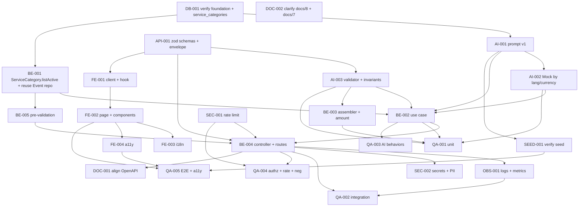

# Development Tasks — PB-P1-013 / US-019: Sugerencia IA de distribución de presupuesto (AI-003)

## 1. Metadata

| Field | Value |
|---|---|
| User Story ID | US-019 |
| Source User Story | `management/user-stories/US-019-ai-budget-distribution.md` |
| Source Technical Specification | `management/technical-specs/P1/PB-P1-013/US-019-technical-spec.md` |
| Decision Resolution Artifact | No aplica |
| Priority | P1 |
| Backlog ID | PB-P1-013 |
| Backlog Title | Sugerencia IA de distribución de presupuesto por categoría |
| Backlog Execution Order | 31 (P0: 18 + posición 13 en P1) |
| User Story Position in Backlog Item | 1 de 1 |
| Related User Stories in Backlog Item | US-019 |
| Epic | EPIC-AIP-001 — AI-Assisted Event Planning |
| Backlog Item Dependencies | PB-P1-011, PB-P1-019, PB-P0-009, PB-P0-010, PB-P0-011, PB-P0-007, PB-P0-014 |
| Feature | AI-003 — Distribución de presupuesto IA |
| Module / Domain | AI / Budget |
| Backlog Alignment Status | Found |
| Task Breakdown Status | Ready for Sprint Planning |
| Created Date | 2026-06-26 |
| Last Updated | 2026-06-26 |

---

## 2. Source Validation

| Source | Found | Used | Notes |
|---|---|---|---|
| User Story | Yes | Yes | Approved with Minor Notes; scope acotado a generación. |
| Technical Specification | Yes | Yes | Ready for Task Breakdown; fuente primaria. |
| Decision Resolution Artifact | No | No | Decisiones PO ya formalizadas (8.1 #7, #9, #15). |
| Product Backlog Prioritized | Yes | Yes | PB-P1-013; deps PB-P1-011, PB-P1-019, PB-P0-009..011, PB-P0-007, PB-P0-014. |
| ADRs | Yes | Yes | ADR-AI-001, ADR-API-001, ADR-SEC-002. |

---

## 3. Backlog Execution Context

### Parent Backlog Item

PB-P1-013 — Sugerencia IA de distribución de presupuesto. La generación crea solo `AIRecommendation(type='budget_suggestion', status='pending')`. La materialización a `BudgetItem(ai_generated=true)` y la edición previa a aceptar viven en US-037 / PB-P1-020.

### Execution Order Rationale

Tras US-017/US-018, reusa fundación IA y componentes UI. Habilita US-037 (aplicación).

### Related User Stories in Same Backlog Item

| User Story | Role in Backlog Item | Suggested Order |
|---|---|---|
| US-019 | Generación inicial de la distribución con HITL pending | 1 |

---

## 4. Task Breakdown Summary

| Area | Number of Tasks | Notes |
|---:|---:|---|
| AI / PromptOps (AI) | 3 | Registro `BudgetSuggestionPrompt v1`, extensión Mock por idioma/moneda, validator con invariantes (suma=100, categorías activas). |
| Database / Prisma (DB) | 1 | Verificación de enums/FKs y `ServiceCategory` activos. |
| Backend (BE) | 5 | Repo `ServiceCategory.listActive`, validador, use case, assembler (cálculo de amount), controller. |
| API Contract (API) | 1 | Schemas Zod (params, input, output con `superRefine`). |
| Security / Authorization (SEC) | 2 | Aplicar rate limit; Secrets/PII. |
| Frontend (FE) | 4 | Cliente, hook, página, componentes con tabla accesible; i18n y a11y. |
| Observability / Audit (OBS) | 1 | Logs `ai.budget-suggestion.*` + métricas + correlation ID. |
| QA / Testing (QA) | 5 | Unit, integration, AI behaviors (suma + categorías), autorización/rate limit, E2E + a11y. |
| Seed / Demo (SEED) | 1 | Verificar prompt + eventos por idioma/moneda con `budget_estimated > 0`. |
| Documentation / Traceability (DOC) | 2 | OpenAPI (US-098) + aclaración `/docs/8` y `/docs/7`. |
| **Total** | **25** | |

---

## 5. Traceability Matrix

| Acceptance Criterion | Technical Spec Section | Task IDs |
|---|---|---|
| AC-01: Generación con HITL pending sin BudgetItem | §7 UseCase, §10 DB | AI-001, AI-002, BE-001, BE-002, BE-003, BE-004, BE-005, API-001, FE-001, FE-002, QA-001, QA-002 |
| AC-02: Idioma + moneda | §7 Payload, §11 AI Input | AI-002, BE-002, BE-004, QA-002 |
| AC-03: Trazabilidad | §7 Persistence, §10, §14 OBS | BE-002, OBS-001, QA-002 |
| AC-04: Estructura suma=100 + amount + categorías | §7 Validator, §7 Assembler | AI-003, BE-003, BE-004, QA-002 |
| EC-01: `budget_estimated <= 0` | §7 Pre-validation | BE-004, API-001, QA-004 |
| EC-02: Suma ≠ 100% | §7 Validator | AI-003, BE-002, QA-003 |
| EC-03: Categoría desconocida | §7 Validator | AI-003, BE-002, QA-003 |
| EC-04: Timeout 60s | §7 Use Case, §11 Provider | AI-002, BE-002, QA-003 |
| EC-05: Provider error | §11 Provider | AI-002, BE-002, QA-003 |
| EC-06: Rate limit 429 | §12 Security | SEC-001, QA-004 |
| VR-01..07 | §7 DTOs, §9 API | API-001, BE-004, QA-004 |
| SEC-01..06 | §12 Security | SEC-001, SEC-002, QA-004 |
| AUTH-TS-01..05 / NT-01..07 | §12 Security | SEC-001, QA-004 |
| TS-04 E2E | §13 Testing, §15 Seed | SEED-001, QA-005 |
| Accesibilidad tabla | §8 A11y | FE-004, QA-005 |
| Documentation Alignment | §16 | DOC-001, DOC-002 |

---

## 6. Development Tasks

### TASK-PB-P1-013-US-019-DB-001 — Verificar enums/FKs y `ServiceCategory` activos

| Field | Value |
|---|---|
| Area | Database / Prisma |
| Type | Setup |
| Priority | Must |
| Estimate | XS |
| Depends On | PB-P0-009, PB-P0-010, PB-P0-011 |
| Source AC(s) | AC-01, AC-04 |
| Technical Spec Section(s) | §10 DB |
| Backlog ID | PB-P1-013 |
| User Story ID | US-019 |
| Owner Role | Backend |
| Status | To Do |

#### Objective

Confirmar enum `ai_recommendation_type` (incluye `'budget_suggestion'`), FKs `ai_recommendations.event_id`/`prompt_version_id`, y que `service_categories` provee `code` activos.

#### Scope

##### Include

* Inspección de `prisma/schema.prisma` y migraciones.
* Verificación de enums y FKs.
* Verificación de `service_categories.code` activos.

##### Exclude

* Crear migraciones nuevas.

#### Acceptance Criteria Covered

* AC-01, AC-04 (preparatoria).

#### Definition of Done

- [ ] Verificación documentada.
- [ ] Gaps escalados si aplica.

---

### TASK-PB-P1-013-US-019-AI-001 — Registrar `BudgetSuggestionPrompt v1`

| Field | Value |
|---|---|
| Area | AI / PromptOps |
| Type | Implementation |
| Priority | Must |
| Estimate | S |
| Depends On | TASK-PB-P1-013-US-019-DB-001 |
| Source AC(s) | AC-01, AC-02, AC-03 |
| Technical Spec Section(s) | §11 Prompt Version |
| Backlog ID | PB-P1-013 |
| User Story ID | US-019 |
| Owner Role | AI |
| Status | To Do |

#### Objective

Crear el archivo de prompt `BudgetSuggestionPrompt v1` y semillar el registro en `ai_prompt_versions`.

#### Scope

##### Include

* `prompts/BudgetSuggestionPrompt/v1.yaml` con anclaje a `service_categories_active` y soporte multi-idioma/moneda.
* Upsert idempotente en `ai_prompt_versions`.
* Test unitario de lookup.

##### Exclude

* Versiones posteriores.

#### Acceptance Criteria Covered

* AC-01, AC-02, AC-03.

#### Definition of Done

- [ ] Prompt cargado y verificable.

---

### TASK-PB-P1-013-US-019-AI-002 — Extender `MockAIProvider` con respuesta determinista por idioma/moneda

| Field | Value |
|---|---|
| Area | AI / PromptOps |
| Type | Implementation |
| Priority | Must |
| Estimate | S |
| Depends On | TASK-PB-P1-013-US-019-AI-001 |
| Source AC(s) | AC-01, AC-02, EC-04, EC-05 |
| Technical Spec Section(s) | §11 Provider; §15 Seed/Demo |
| Backlog ID | PB-P1-013 |
| User Story ID | US-019 |
| Owner Role | AI |
| Status | To Do |

#### Objective

Garantizar respuesta determinista del Mock cumpliendo `BudgetSuggestionSchema` con suma=100 exacta y categorías activas, por idioma y moneda.

#### Scope

##### Include

* Fixture por idioma y moneda (es/en/pt/fr × GTQ/EUR/MXN/COP/USD).
* Marcar `fallback_used=true` cuando se invoca como fallback.
* Tests unitarios.

##### Exclude

* Variabilidad.

#### Acceptance Criteria Covered

* AC-01, AC-02, EC-04, EC-05.

#### Definition of Done

- [ ] Fixtures listos y validados.
- [ ] Tests por idioma verdes.

---

### TASK-PB-P1-013-US-019-AI-003 — `BudgetSuggestionOutputValidator` (Zod + `superRefine` invariantes)

| Field | Value |
|---|---|
| Area | AI / PromptOps |
| Type | Implementation |
| Priority | Must |
| Estimate | S |
| Depends On | TASK-PB-P1-013-US-019-API-001 |
| Source AC(s) | AC-04, EC-02, EC-03 |
| Technical Spec Section(s) | §7 Application Services; §11 Output Schema |
| Backlog ID | PB-P1-013 |
| User Story ID | US-019 |
| Owner Role | Backend |
| Status | To Do |

#### Objective

Validar el output IA: schema Zod + invariantes (`Σ percentage = 100 ±0.01`, sin duplicados, `service_category_code ∈ activeCodes`).

#### Scope

##### Include

* `BudgetSuggestionOutputValidator.validate(raw, activeCodes)`.
* Helper `withRetryOnSchemaError(fn, maxRetries=1)` (reuso del de US-017).
* Tests unitarios (válido/inválido/retry/duplicado/categoría desconocida).

##### Exclude

* Cálculo de `amount` (en BE-003).

#### Acceptance Criteria Covered

* AC-04, EC-02, EC-03.

#### Definition of Done

- [ ] Validador con todas las invariantes.
- [ ] Tests verdes.

---

### TASK-PB-P1-013-US-019-API-001 — Definir Zod schemas y envelope

| Field | Value |
|---|---|
| Area | API Contract |
| Type | Implementation |
| Priority | Must |
| Estimate | S |
| Depends On | — |
| Source AC(s) | VR-01..07, AC-04 |
| Technical Spec Section(s) | §7 DTOs / Schemas; §9 API Contract |
| Backlog ID | PB-P1-013 |
| User Story ID | US-019 |
| Owner Role | Backend |
| Status | To Do |

#### Objective

Especificar el contrato Zod y reutilizar el envelope unificado.

#### Scope

##### Include

* `eventBudgetSuggestionParamsSchema` (`{ eventId: uuid }`).
* `BudgetSuggestionInputSchema` (payload del prompt con `service_categories_active`).
* `BudgetSuggestionSchema` (output IA con `superRefine` por suma y duplicados).
* Tests unitarios.

##### Exclude

* Snapshot OpenAPI (DOC-001 → US-098).

#### Acceptance Criteria Covered

* VR-01..07, AC-04.

#### Definition of Done

- [ ] Schemas importables.
- [ ] Tests verdes.

---

### TASK-PB-P1-013-US-019-BE-001 — `ServiceCategoryRepository.listActive` + reuso `EventRepository.findOwnedById`

| Field | Value |
|---|---|
| Area | Backend |
| Type | Implementation |
| Priority | Must |
| Estimate | S |
| Depends On | TASK-PB-P1-013-US-019-DB-001 |
| Source AC(s) | AC-01, AC-04, VR-02 |
| Technical Spec Section(s) | §7 Repository / Persistence |
| Backlog ID | PB-P1-013 |
| User Story ID | US-019 |
| Owner Role | Backend |
| Status | To Do |

#### Objective

Habilitar lookup de categorías activas y reusar repo del evento con ownership.

#### Scope

##### Include

* `ServiceCategoryPrismaRepository.listActive(): Promise<string[]>`.
* Validar disponibilidad de `EventRepository.findOwnedById` (US-017).
* Tests unitarios.

##### Exclude

* Mutaciones del catálogo.

#### Acceptance Criteria Covered

* AC-01, AC-04, VR-02.

#### Definition of Done

- [ ] Métodos implementados y testeados.

---

### TASK-PB-P1-013-US-019-BE-002 — `GenerateBudgetSuggestionUseCase` (orquestación)

| Field | Value |
|---|---|
| Area | Backend |
| Type | Implementation |
| Priority | Must |
| Estimate | M |
| Depends On | TASK-PB-P1-013-US-019-BE-001, TASK-PB-P1-013-US-019-AI-001, TASK-PB-P1-013-US-019-AI-002, TASK-PB-P1-013-US-019-AI-003 |
| Source AC(s) | AC-01, AC-02, AC-03, EC-01..05 |
| Technical Spec Section(s) | §7 Use Cases; §11 AI |
| Backlog ID | PB-P1-013 |
| User Story ID | US-019 |
| Owner Role | Backend |
| Status | To Do |

#### Objective

Orquestar ownership → estado → `budget_estimated > 0` → lookup prompt + categorías activas → LLM → validar → persistir transaccionalmente.

#### Scope

##### Include

* `GenerateBudgetSuggestionUseCase.execute(...)` con todas las ramas.
* Persistencia siempre, sin tocar `budget_items`.

##### Exclude

* HITL accept/edit/discard (US-037).

#### Implementation Notes

* La llamada al LLM ocurre fuera de la transacción; el insert dentro.

#### Acceptance Criteria Covered

* AC-01..03, EC-01..05.

#### Definition of Done

- [ ] Use case con todas las ramas.
- [ ] Cobertura unitaria de 8 escenarios mínimos.

---

### TASK-PB-P1-013-US-019-BE-003 — `BudgetSuggestionAssembler` con cálculo de `amount`

| Field | Value |
|---|---|
| Area | Backend |
| Type | Implementation |
| Priority | Must |
| Estimate | XS |
| Depends On | TASK-PB-P1-013-US-019-AI-003 |
| Source AC(s) | AC-04 |
| Technical Spec Section(s) | §7 Application Services |
| Backlog ID | PB-P1-013 |
| User Story ID | US-019 |
| Owner Role | Backend |
| Status | To Do |

#### Objective

Mapear `(AIRecommendation, distribution, currency_code, budget_estimated)` a `BudgetSuggestionResponseDTO`, computando `amount = round(percentage/100 * budget_estimated)` y asegurando que `Σ amount = budget_estimated` (ajuste de redondeo en la última categoría si aplica).

#### Scope

##### Include

* Whitelist explícita de campos.
* Helper de redondeo determinista.
* Tests unitarios (sumas, redondeo, monedas).

##### Exclude

* Conversión de moneda.

#### Acceptance Criteria Covered

* AC-04.

#### Definition of Done

- [ ] DTO conforme al contrato.

---

### TASK-PB-P1-013-US-019-BE-004 — `AIBudgetSuggestionController` + rutas + middlewares + error mapping

| Field | Value |
|---|---|
| Area | Backend |
| Type | Implementation |
| Priority | Must |
| Estimate | S |
| Depends On | TASK-PB-P1-013-US-019-BE-002, TASK-PB-P1-013-US-019-API-001, TASK-PB-P1-013-US-019-SEC-001 |
| Source AC(s) | AC-01, VR-01..07, EC-01, EC-06 |
| Technical Spec Section(s) | §7 Controllers / Routes |
| Backlog ID | PB-P1-013 |
| User Story ID | US-019 |
| Owner Role | Backend |
| Status | To Do |

#### Objective

Exponer `POST /api/v1/events/:eventId/ai/budget-suggestion` con la pila completa de middlewares y mapping de errores.

#### Scope

##### Include

* Stack `requireAuth`, `requireRole('organizer')`, `validateParams`, `aiRateLimitMiddleware`, `withCorrelationId`.
* Mapping 400/401/403/404/409/429/5xx.
* Registro en `routes/events/ai.routes.ts`.

##### Exclude

* Lógica IA (en use case).

#### Acceptance Criteria Covered

* AC-01, VR-01..07, EC-01, EC-06.

#### Definition of Done

- [ ] Ruta operativa.
- [ ] Códigos HTTP mapeados.
- [ ] Header de correlación presente.

---

### TASK-PB-P1-013-US-019-BE-005 — Pre-validación `budget_estimated > 0` y estado del evento

| Field | Value |
|---|---|
| Area | Backend |
| Type | Implementation |
| Priority | Must |
| Estimate | XS |
| Depends On | TASK-PB-P1-013-US-019-BE-001 |
| Source AC(s) | VR-03, VR-06, EC-01 |
| Technical Spec Section(s) | §7 Use Case (steps 2–3) |
| Backlog ID | PB-P1-013 |
| User Story ID | US-019 |
| Owner Role | Backend |
| Status | To Do |

#### Objective

Implementar la pre-validación temprana del estado del evento (`draft|active`) y `budget_estimated > 0`, devolviendo `409 CONFLICT` o `400 INVALID_BUDGET` antes de invocar al LLM.

#### Scope

##### Include

* Helpers `assertEventEditableForAI(event)` y `assertBudgetPositive(event)`.
* Tests unitarios.

##### Exclude

* Otras validaciones (en API-001).

#### Acceptance Criteria Covered

* VR-03, VR-06, EC-01.

#### Definition of Done

- [ ] Helpers reusables.
- [ ] Tests verdes.

---

### TASK-PB-P1-013-US-019-SEC-001 — Aplicar `aiRateLimitMiddleware`

| Field | Value |
|---|---|
| Area | Security / Authorization |
| Type | Implementation |
| Priority | Must |
| Estimate | XS |
| Depends On | PB-P0-007 |
| Source AC(s) | SEC-02, EC-06 |
| Technical Spec Section(s) | §12 Security |
| Backlog ID | PB-P1-013 |
| User Story ID | US-019 |
| Owner Role | Backend |
| Status | To Do |

#### Objective

Garantizar que el endpoint queda bajo `SEC-POL-AI-007` (20/usuario/hora) y emite `Retry-After`.

#### Scope

##### Include

* Aplicar middleware existente al endpoint.
* Validar `Retry-After`.

##### Exclude

* Reescribir el rate limiter.

#### Acceptance Criteria Covered

* SEC-02, EC-06.

#### Definition of Done

- [ ] Middleware activo.
- [ ] `429` con `Retry-After`.

---

### TASK-PB-P1-013-US-019-SEC-002 — Verificar Secrets Manager y redacción PII

| Field | Value |
|---|---|
| Area | Security / Authorization |
| Type | Review |
| Priority | Must |
| Estimate | XS |
| Depends On | PB-P1-029, PB-P1-030 |
| Source AC(s) | SEC-03, SEC-06 |
| Technical Spec Section(s) | §12 Security; §14 Observability |
| Backlog ID | PB-P1-013 |
| User Story ID | US-019 |
| Owner Role | DevOps |
| Status | To Do |

#### Objective

Confirmar que `OPENAI_API_KEY` se inyecta solo desde Secrets Manager y que los logs no contienen PII.

#### Scope

##### Include

* Inspección de configuración.
* Inspección del logger.

##### Exclude

* Cambios al sistema de secretos.

#### Acceptance Criteria Covered

* SEC-03, SEC-06.

#### Definition of Done

- [ ] Verificación documentada.

---

### TASK-PB-P1-013-US-019-FE-001 — Cliente `aiApi.generateBudgetSuggestion` y hook `useGenerateAIBudget`

| Field | Value |
|---|---|
| Area | Frontend |
| Type | Implementation |
| Priority | Must |
| Estimate | S |
| Depends On | TASK-PB-P1-013-US-019-API-001 |
| Source AC(s) | AC-01, EC-01, EC-04, EC-06 |
| Technical Spec Section(s) | §8 Data Fetching; §8 State Management |
| Backlog ID | PB-P1-013 |
| User Story ID | US-019 |
| Owner Role | Frontend |
| Status | To Do |

#### Objective

Consumir el endpoint con TanStack `useMutation` y mapear estados/errores.

#### Scope

##### Include

* `aiApi.generateBudgetSuggestion(eventId)` con cookie auth.
* `useGenerateAIBudget` con mapping de `error.code`.
* Tests MSW para 200, 400 (validation/invalid_budget), 401, 403, 404, 409, 429, 5xx.

##### Exclude

* Cancelación por timeout corto del cliente.

#### Acceptance Criteria Covered

* AC-01, EC-01, EC-04, EC-06.

#### Definition of Done

- [ ] Hook y cliente implementados.
- [ ] Tests MSW verdes.

---

### TASK-PB-P1-013-US-019-FE-002 — Página `/[locale]/organizer/events/[id]/ai/budget` y componentes

| Field | Value |
|---|---|
| Area | Frontend |
| Type | Implementation |
| Priority | Must |
| Estimate | M |
| Depends On | TASK-PB-P1-013-US-019-FE-001 |
| Source AC(s) | AC-01, AC-04, EC-01..06 |
| Technical Spec Section(s) | §8 Routes / Pages; §8 Components |
| Backlog ID | PB-P1-013 |
| User Story ID | US-019 |
| Owner Role | Frontend |
| Status | To Do |

#### Objective

Renderizar la sugerencia con tabla accesible (`<caption>`/headers), barras de porcentaje, badge "Sugerido por IA" y manejo de estados/errores.

#### Scope

##### Include

* `page.tsx`, `AIBudgetSuggestion`, `AIBudgetViewer`.
* Reuso de `AIBadge` (US-017).
* `Intl.NumberFormat` con `currency_code`.
* Banners de error y rate-limit.

##### Exclude

* Edición/aplicación (US-037).

#### Acceptance Criteria Covered

* AC-01, AC-04, EC-01..06.

#### Definition of Done

- [ ] Página accesible vía ruta.
- [ ] Estados implementados.
- [ ] Tabla con `<caption>` y headers.

---

### TASK-PB-P1-013-US-019-FE-003 — i18n `ai.budget.*` en 4 locales

| Field | Value |
|---|---|
| Area | Frontend |
| Type | Implementation |
| Priority | Must |
| Estimate | XS |
| Depends On | TASK-PB-P1-013-US-019-FE-002 |
| Source AC(s) | AC-02, EC-01..06 |
| Technical Spec Section(s) | §8 i18n |
| Backlog ID | PB-P1-013 |
| User Story ID | US-019 |
| Owner Role | Frontend |
| Status | To Do |

#### Objective

Claves de traducción para textos UI y mensajes de error en es/en/pt/fr.

#### Scope

##### Include

* Claves `ai.budget.*` (badges, headers, errores, leyendas).

##### Exclude

* Cambios al pipeline i18n.

#### Acceptance Criteria Covered

* AC-02, EC-01..06.

#### Definition of Done

- [ ] Claves en 4 locales.
- [ ] Lint i18n pasa.

---

### TASK-PB-P1-013-US-019-FE-004 — Accesibilidad mínima

| Field | Value |
|---|---|
| Area | Frontend |
| Type | Implementation |
| Priority | Must |
| Estimate | XS |
| Depends On | TASK-PB-P1-013-US-019-FE-002 |
| Source AC(s) | AC-04 |
| Technical Spec Section(s) | §8 Accessibility |
| Backlog ID | PB-P1-013 |
| User Story ID | US-019 |
| Owner Role | Frontend |
| Status | To Do |

#### Objective

Garantizar tabla con `<caption>` y headers, lectura de % y montos por screen reader, `aria-live="polite"` y contraste WCAG AA en barras.

#### Scope

##### Include

* Atributos ARIA y semántica.
* Test axe.

##### Exclude

* Auditoría de toda la sección AIP.

#### Acceptance Criteria Covered

* AC-04.

#### Definition of Done

- [ ] ARIA correcto.
- [ ] axe sin violaciones bloqueantes.

---

### TASK-PB-P1-013-US-019-OBS-001 — Logging estructurado + métricas + correlation ID

| Field | Value |
|---|---|
| Area | Observability / Audit |
| Type | Implementation |
| Priority | Must |
| Estimate | S |
| Depends On | TASK-PB-P1-013-US-019-BE-004 |
| Source AC(s) | AC-03, SEC-03 |
| Technical Spec Section(s) | §14 Observability & Audit |
| Backlog ID | PB-P1-013 |
| User Story ID | US-019 |
| Owner Role | Backend |
| Status | To Do |

#### Objective

Emitir logs `ai.budget-suggestion.requested|generated|failed|fallback` con campos canónicos + `currency_code` y `budget_estimated`, y métricas (contadores + latencia).

#### Scope

##### Include

* Logger y métricas alineadas con NFR-OBS-001 / PB-P0-014.

##### Exclude

* Cambios al stack de observabilidad.

#### Acceptance Criteria Covered

* AC-03, SEC-03.

#### Definition of Done

- [ ] Logs en cada ruta.
- [ ] Métricas expuestas.
- [ ] Correlation ID propagado.

---

### TASK-PB-P1-013-US-019-QA-001 — Unit tests (use case, validator, assembler, providers)

| Field | Value |
|---|---|
| Area | QA / Testing |
| Type | Test |
| Priority | Must |
| Estimate | M |
| Depends On | TASK-PB-P1-013-US-019-BE-002, TASK-PB-P1-013-US-019-BE-003, TASK-PB-P1-013-US-019-AI-002, TASK-PB-P1-013-US-019-AI-003 |
| Source AC(s) | AC-01..04, EC-01..05 |
| Technical Spec Section(s) | §13 Unit Tests |
| Backlog ID | PB-P1-013 |
| User Story ID | US-019 |
| Owner Role | QA |
| Status | To Do |

#### Objective

Cubrir caminos felices y errores del use case y colaboradores.

#### Scope

##### Include

* 8 escenarios del use case (happy, `budget_estimated=0`, timeout prod/demo, JSON inválido retry exitoso/falla, categoría desconocida, provider error prod, evento ajeno, evento `cancelled`).
* Validator (suma, duplicados, categorías).
* Assembler (cálculo de amount, ajuste de redondeo).

##### Exclude

* Tests UI.

#### Acceptance Criteria Covered

* AC-01..04, EC-01..05.

#### Definition of Done

- [ ] Suite verde con todos los escenarios.

---

### TASK-PB-P1-013-US-019-QA-002 — Integration tests del endpoint (happy + idioma/moneda + persistencia)

| Field | Value |
|---|---|
| Area | QA / Testing |
| Type | Test |
| Priority | Must |
| Estimate | S |
| Depends On | TASK-PB-P1-013-US-019-BE-004, TASK-PB-P1-013-US-019-OBS-001 |
| Source AC(s) | AC-01, AC-02, AC-03, AC-04 |
| Technical Spec Section(s) | §13 Integration Tests |
| Backlog ID | PB-P1-013 |
| User Story ID | US-019 |
| Owner Role | QA |
| Status | To Do |

#### Objective

Validar el endpoint contra BD + `MockAIProvider`.

#### Scope

##### Include

* TS-01 happy + persistencia con metadata.
* TS-02 verificación de campos persistidos.
* TS-03 `language_code='pt'` + `currency_code='EUR'`.

##### Exclude

* Tests UI.

#### Acceptance Criteria Covered

* AC-01..04.

#### Definition of Done

- [ ] Suite verde en CI.

---

### TASK-PB-P1-013-US-019-QA-003 — AI tests (timeout, retry, fallback, suma, categorías)

| Field | Value |
|---|---|
| Area | QA / Testing |
| Type | Test |
| Priority | Must |
| Estimate | S |
| Depends On | TASK-PB-P1-013-US-019-BE-002 |
| Source AC(s) | EC-02..05 |
| Technical Spec Section(s) | §13 AI Tests |
| Backlog ID | PB-P1-013 |
| User Story ID | US-019 |
| Owner Role | QA |
| Status | To Do |

#### Objective

Cubrir AI-TS-02..07.

#### Scope

##### Include

* Suma ≠ 100 con retry exitoso/falla.
* Categoría desconocida.
* Timeout 60 s prod/demo.
* Provider 5xx prod.

##### Exclude

* Rate limit (en QA-004).

#### Acceptance Criteria Covered

* EC-02..05.

#### Definition of Done

- [ ] 6 escenarios verdes.

---

### TASK-PB-P1-013-US-019-QA-004 — Authorization + rate limit + matriz negativa

| Field | Value |
|---|---|
| Area | QA / Testing |
| Type | Test |
| Priority | Must |
| Estimate | S |
| Depends On | TASK-PB-P1-013-US-019-BE-004, TASK-PB-P1-013-US-019-SEC-001 |
| Source AC(s) | SEC-01..06, EC-01, EC-06 |
| Technical Spec Section(s) | §13 API Tests; §12 Security |
| Backlog ID | PB-P1-013 |
| User Story ID | US-019 |
| Owner Role | QA |
| Status | To Do |

#### Objective

Cubrir AUTH-TS-01..05, NT-01..07 y AI-TS-08.

#### Scope

##### Include

* Matriz por rol y ownership.
* `budget_estimated=0`, idioma inválido, estado conflictivo, anónimo.
* Rate limit excedido → `429 RATE_LIMITED` con `Retry-After`.

##### Exclude

* Tests funcionales positivos (en QA-002).

#### Acceptance Criteria Covered

* SEC-01..06, EC-01, EC-06.

#### Definition of Done

- [ ] Todos los escenarios verdes.

---

### TASK-PB-P1-013-US-019-QA-005 — E2E Playwright + a11y

| Field | Value |
|---|---|
| Area | QA / Testing |
| Type | Test |
| Priority | Must |
| Estimate | S |
| Depends On | TASK-PB-P1-013-US-019-FE-002, TASK-PB-P1-013-US-019-FE-004, TASK-PB-P1-013-US-019-SEED-001 |
| Source AC(s) | AC-01, AC-04 |
| Technical Spec Section(s) | §13 E2E Tests; §13 Accessibility Tests |
| Backlog ID | PB-P1-013 |
| User Story ID | US-019 |
| Owner Role | QA |
| Status | To Do |

#### Objective

Validar TS-04 end-to-end con seed y `MockAIProvider`, y a11y de la página (tabla accesible).

#### Scope

##### Include

* Test "organizer genera distribución IA" en al menos 2 idiomas y 2 monedas.
* Test axe sobre la tabla.

##### Exclude

* Pruebas de carga/rendimiento.

#### Acceptance Criteria Covered

* AC-01, AC-04.

#### Definition of Done

- [ ] Playwright verde.
- [ ] axe sin violaciones bloqueantes.

---

### TASK-PB-P1-013-US-019-SEED-001 — Verificar prompt + eventos por idioma/moneda con `budget_estimated > 0`

| Field | Value |
|---|---|
| Area | Seed / Demo Data |
| Type | Setup |
| Priority | Must |
| Estimate | XS |
| Depends On | TASK-PB-P1-013-US-019-AI-001, PB-P1-035, PB-P1-036 |
| Source AC(s) | AC-02, AC-04, TS-04 |
| Technical Spec Section(s) | §15 Seed/Demo |
| Backlog ID | PB-P1-013 |
| User Story ID | US-019 |
| Owner Role | DevOps |
| Status | To Do |

#### Objective

Confirmar que el seed provee `BudgetSuggestionPrompt v1` activo y al menos un evento por idioma y por moneda con `budget_estimated > 0`.

#### Scope

##### Include

* Inspección del seed.
* Verificación post-reset demo.

##### Exclude

* Creación de seed adicional si ya existe.

#### Acceptance Criteria Covered

* AC-02, AC-04, TS-04.

#### Definition of Done

- [ ] Verificación documentada.
- [ ] Gaps escalados.

---

### TASK-PB-P1-013-US-019-DOC-001 — Coordinar snapshot OpenAPI con US-098

| Field | Value |
|---|---|
| Area | Documentation / Traceability |
| Type | Documentation |
| Priority | Should |
| Estimate | XS |
| Depends On | TASK-PB-P1-013-US-019-BE-004 |
| Source AC(s) | AC-01 |
| Technical Spec Section(s) | §9 API; §16 Doc Alignment |
| Backlog ID | PB-P1-013 |
| User Story ID | US-019 |
| Owner Role | Backend |
| Status | To Do |

#### Objective

Asegurar que el snapshot OpenAPI refleje `POST /api/v1/events/:eventId/ai/budget-suggestion` con todos los códigos y `Retry-After`.

#### Scope

##### Include

* Ticket o PR de coordinación con US-098.

##### Exclude

* Cambios fuera del scope del snapshot.

#### Acceptance Criteria Covered

* AC-01 (alineación documental).

#### Definition of Done

- [ ] Snapshot actualizado o ticket abierto en US-098.

---

### TASK-PB-P1-013-US-019-DOC-002 — Aclaración en `/docs/8` y `/docs/7`

| Field | Value |
|---|---|
| Area | Documentation / Traceability |
| Type | Documentation |
| Priority | Should |
| Estimate | XS |
| Depends On | — |
| Source AC(s) | — |
| Technical Spec Section(s) | §16 Doc Alignment |
| Backlog ID | PB-P1-013 |
| User Story ID | US-019 |
| Owner Role | Tech Lead |
| Status | To Do |

#### Objective

Alinear `/docs/8` (UC-AI-003 mapeado a AI-003) y registrar en `/docs/7` la invariante `Σ percentage = 100` (±0.01) y el mapeo a `ServiceCategory.code` activos.

#### Scope

##### Include

* Ediciones livianas o notas de alineación.

##### Exclude

* Cambios en otras secciones.

#### Acceptance Criteria Covered

* — (alineación documental).

#### Definition of Done

- [ ] Cambios aplicados o PR abierto.

---

## 7. Required QA Tasks

| Task ID | Test Type | Purpose |
|---|---|---|
| TASK-PB-P1-013-US-019-QA-001 | Unit | Use case, validator (suma/duplicados/categorías), assembler (amounts), providers. |
| TASK-PB-P1-013-US-019-QA-002 | Integration | Endpoint + persistencia + idioma/moneda. |
| TASK-PB-P1-013-US-019-QA-003 | AI / behaviors | Timeout, retry, fallback, suma, categorías. |
| TASK-PB-P1-013-US-019-QA-004 | API / Security | Authorization + rate limit + matriz negativa. |
| TASK-PB-P1-013-US-019-QA-005 | E2E + A11y | Demo + axe sobre tabla accesible. |

---

## 8. Required Security Tasks

| Task ID | Security Concern | Purpose |
|---|---|---|
| TASK-PB-P1-013-US-019-SEC-001 | Rate limit IA `SEC-POL-AI-007` | Aplicar y verificar `429 + Retry-After`. |
| TASK-PB-P1-013-US-019-SEC-002 | Secrets + PII | Confirmar Secrets Manager y redacción en logs. |

---

## 9. Required Seed / Demo Tasks

| Task ID | Seed/Demo Concern | Purpose |
|---|---|---|
| TASK-PB-P1-013-US-019-SEED-001 | `BudgetSuggestionPrompt v1` + eventos por idioma/moneda con `budget_estimated > 0` | Habilitar TS-04 y demo determinista. |

---

## 10. Observability / Audit Tasks

| Task ID | Concern | Purpose |
|---|---|---|
| TASK-PB-P1-013-US-019-OBS-001 | Logs `ai.budget-suggestion.*` + métricas + correlation ID | Cumplir NFR-OBS-001 y AC-03. |

---

## 11. Documentation / Traceability Tasks

| Task ID | Document / Artifact | Purpose |
|---|---|---|
| TASK-PB-P1-013-US-019-DOC-001 | `/docs/16` (OpenAPI vía US-098) | Documentation Alignment Required. |
| TASK-PB-P1-013-US-019-DOC-002 | `/docs/8` (`UC-AI-003`) + `/docs/7` (invariante suma=100 + `ServiceCategory`) | Documentation Alignment Required. |

---

## 12. Dependency Graph

---

## 13. Suggested Implementation Order

### Phase 1 — Foundation

* TASK-PB-P1-013-US-019-DB-001
* TASK-PB-P1-013-US-019-API-001
* TASK-PB-P1-013-US-019-AI-001
* TASK-PB-P1-013-US-019-SEED-001

### Phase 2 — Core Implementation

* TASK-PB-P1-013-US-019-AI-002
* TASK-PB-P1-013-US-019-AI-003
* TASK-PB-P1-013-US-019-BE-001
* TASK-PB-P1-013-US-019-BE-005
* TASK-PB-P1-013-US-019-BE-002
* TASK-PB-P1-013-US-019-BE-003
* TASK-PB-P1-013-US-019-SEC-001
* TASK-PB-P1-013-US-019-BE-004
* TASK-PB-P1-013-US-019-OBS-001
* TASK-PB-P1-013-US-019-FE-001
* TASK-PB-P1-013-US-019-FE-002
* TASK-PB-P1-013-US-019-FE-003
* TASK-PB-P1-013-US-019-FE-004

### Phase 3 — Validation / Security / QA

* TASK-PB-P1-013-US-019-SEC-002
* TASK-PB-P1-013-US-019-QA-001
* TASK-PB-P1-013-US-019-QA-002
* TASK-PB-P1-013-US-019-QA-003
* TASK-PB-P1-013-US-019-QA-004
* TASK-PB-P1-013-US-019-QA-005

### Phase 4 — Documentation / Review

* TASK-PB-P1-013-US-019-DOC-001
* TASK-PB-P1-013-US-019-DOC-002

---

## 14. Risks & Mitigations

| Risk | Impact | Mitigation | Related Task |
|---|---|---|---|
| LLM devuelve categorías fuera del catálogo activo | `5xx AI_INVALID_OUTPUT`. | Anclaje en prompt + retry; mejora v2 si persiste. | AI-001, AI-003, QA-003 |
| Drift de redondeo hace que `Σ amount ≠ budget_estimated` | UX errónea. | Ajuste en última categoría en `BudgetSuggestionAssembler`. | BE-003, QA-001 |
| Renderizado de moneda inconsistente entre locales | UX errónea. | `Intl.NumberFormat` con `currency_code`; tests por moneda. | FE-002, QA-005 |
| Latencia variable LLM | Timeouts. | Métricas (OBS-001); fallback Mock en demo. | OBS-001, AI-002 |
| Saturación de rate limit en demos | Bloqueo de demos. | Usar Mock en demos. | SEC-001 |
| Fugas de PII | Cumplimiento. | Redactor centralizado + verificación. | SEC-002, QA-004 |

---

## 15. Out of Scope Confirmation

* No se implementan acciones HITL `accept|edit|discard` (US-025/US-037).
* No se implementa aceptación que materialice `BudgetItem(ai_generated=true)` (US-037).
* No se implementa edición previa a aceptar (US-037).
* No se implementa CRUD de items (US-036).
* No se implementan RAG, vector DB, chatbot, generación de imágenes IA.
* No se implementan `AnthropicProvider` operativo, decisiones autónomas, ni moderación automática.
* No se introducen migraciones nuevas ni índices nuevos.
* No se introduce conversión automática de moneda.

---

## 16. Readiness for Sprint Planning

| Check                                      | Status |
| ------------------------------------------ | ------ |
| Product Backlog mapping found              | Pass   |
| Every AC maps to tasks                     | Pass   |
| Technical Spec used when available         | Pass   |
| QA tasks included                          | Pass   |
| Security tasks included if applicable      | Pass   |
| Seed/demo tasks included if applicable     | Pass   |
| Observability tasks included if applicable | Pass   |
| Documentation tasks included if applicable | Pass   |
| Task dependencies clear                    | Pass   |
| Tasks small enough                         | Pass   |
| Ready for Sprint Planning                  | Yes    |

---

## 17. Final Recommendation

**Ready for Sprint Planning.** US aprobada, Technical Spec acotada a generación con invariantes financieras explícitas (suma=100, mapeo a `ServiceCategory.code`, moneda inmutable). Las 25 tareas cubren AC, EC, SEC, AI, OBS y QA con dependencias explícitas y reuso de fundación IA/US-017. Alineaciones documentales no bloquean.
