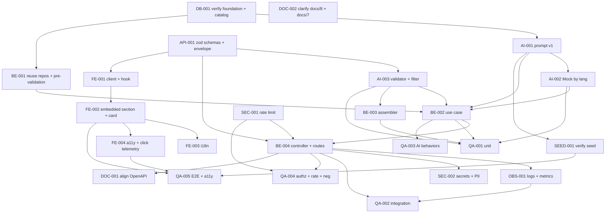

# Development Tasks — PB-P1-014 / US-020: Categorías IA priorizadas (AI-004)

## 1. Metadata

| Field | Value |
|---|---|
| User Story ID | US-020 |
| Source User Story | `management/user-stories/US-020-ai-recommended-categories.md` |
| Source Technical Specification | `management/technical-specs/P1/PB-P1-014/US-020-technical-spec.md` |
| Decision Resolution Artifact | No aplica |
| Priority | P1 |
| Backlog ID | PB-P1-014 |
| Backlog Title | AI Categorías priorizadas (AI-004) |
| Backlog Execution Order | 32 (P0: 18 + posición 14 en P1) |
| User Story Position in Backlog Item | 1 de 1 |
| Related User Stories in Backlog Item | US-020 |
| Epic | EPIC-AIP-001 — AI-Assisted Event Planning |
| Backlog Item Dependencies | PB-P1-011, PB-P1-006, PB-P0-009, PB-P0-010, PB-P0-011, PB-P0-007, PB-P0-014, PB-P1-019 |
| Feature | AI-004 — Categorías priorizadas |
| Module / Domain | AI / Vendors |
| Backlog Alignment Status | Found |
| Task Breakdown Status | Ready for Sprint Planning |
| Created Date | 2026-06-26 |
| Last Updated | 2026-06-26 |

---

## 2. Source Validation

| Source | Found | Used | Notes |
|---|---|---|---|
| User Story | Yes | Yes | Approved with Minor Notes; scope acotado a generación informativa. |
| Technical Specification | Yes | Yes | Ready for Task Breakdown; fuente primaria. |
| Decision Resolution Artifact | No | No | Decisiones PO ya formalizadas (8.1 #9, #15). |
| Product Backlog Prioritized | Yes | Yes | PB-P1-014; deps PB-P1-011, PB-P1-006, PB-P0-009..011/007/014, PB-P1-019. |
| ADRs | Yes | Yes | ADR-AI-001, ADR-API-001, ADR-SEC-002. |

---

## 3. Backlog Execution Context

### Parent Backlog Item

PB-P1-014 — Sugerencia IA informativa de categorías priorizadas de proveedor. La generación crea solo `AIRecommendation(type='vendor_categories', status='pending')`. El click-through conecta con el directorio (US-045) con filtros prearmados.

### Execution Order Rationale

Tras US-017/018/019, reutiliza fundación IA, `ServiceCategoryRepository.listActive` (US-019) y componentes UI compartidos.

### Related User Stories in Same Backlog Item

| User Story | Role in Backlog Item | Suggested Order |
|---|---|---|
| US-020 | Generación informativa de categorías priorizadas con HITL | 1 |

---

## 4. Task Breakdown Summary

| Area | Number of Tasks | Notes |
|---:|---:|---|
| AI / PromptOps (AI) | 3 | Registro `VendorCategoriesPrompt v1`, extensión Mock, validator + filtro contra catálogo activo. |
| Database / Prisma (DB) | 1 | Verificación de enums/FKs y `service_categories` activos. |
| Backend (BE) | 4 | Reuso repos, use case, assembler, controller. |
| API Contract (API) | 1 | Schemas Zod (params, input, output). |
| Security / Authorization (SEC) | 2 | Aplicar rate limit; Secrets/PII. |
| Frontend (FE) | 4 | Cliente+hook, sección embebida + AICategoryCard, i18n, a11y + telemetría click. |
| Observability / Audit (OBS) | 1 | Logs `ai.vendor-categories.*` (incl. unknown_category, clicked) + métricas + correlation ID. |
| QA / Testing (QA) | 5 | Unit, integration, AI behaviors, autorización/rate limit, E2E + a11y. |
| Seed / Demo (SEED) | 1 | Verificar prompt y catálogo activo. |
| Documentation / Traceability (DOC) | 2 | OpenAPI (US-098) + aclaración `/docs/8` y `/docs/7`. |
| **Total** | **24** | |

---

## 5. Traceability Matrix

| Acceptance Criterion | Technical Spec Section | Task IDs |
|---|---|---|
| AC-01: Generación con HITL pending sin downstream | §7 UseCase, §10 DB | AI-001, AI-002, BE-001, BE-002, BE-003, BE-004, API-001, FE-001, FE-002, QA-001, QA-002 |
| AC-02: Idioma respetado | §7 Payload | AI-002, BE-002, QA-002 |
| AC-03: Trazabilidad | §7 Persistence, §10, §14 OBS | BE-002, OBS-001, QA-002 |
| AC-04: Click-through canónico + telemetría | §8 Components, §14 OBS | FE-002, FE-004, OBS-001, QA-005 |
| EC-01: Categoría desconocida → omitir + log | §7 VendorCategoriesFilter, §14 OBS | AI-003, BE-002, OBS-001, QA-002 |
| EC-02: Lista vacía tras filtro | §7 UseCase | AI-003, BE-002, QA-003 |
| EC-03: Timeout 60s | §7 Use Case, §11 Provider | AI-002, BE-002, QA-003 |
| EC-04: Provider error | §11 Provider | AI-002, BE-002, QA-003 |
| EC-05: Rate limit 429 | §12 Security | SEC-001, QA-004 |
| VR-01..06 | §7 DTOs, §9 API | API-001, BE-002, BE-004, QA-004 |
| SEC-01..06 | §12 Security | SEC-001, SEC-002, QA-004 |
| AUTH-TS-01..05 / NT-01..07 | §12 Security | SEC-001, QA-004 |
| TS-05 E2E | §13 Testing, §15 Seed | SEED-001, QA-005 |
| Accesibilidad | §8 A11y | FE-004, QA-005 |
| Documentation Alignment | §16 | DOC-001, DOC-002 |

---

## 6. Development Tasks

### TASK-PB-P1-014-US-020-DB-001 — Verificar enums/FKs y `service_categories` activos

| Field | Value |
|---|---|
| Area | Database / Prisma |
| Type | Setup |
| Priority | Must |
| Estimate | XS |
| Depends On | PB-P0-009, PB-P0-010, PB-P0-011, PB-P1-019 |
| Source AC(s) | AC-01, AC-03 |
| Technical Spec Section(s) | §10 DB |
| Backlog ID | PB-P1-014 |
| User Story ID | US-020 |
| Owner Role | Backend |
| Status | To Do |

#### Objective

Confirmar enum `ai_recommendation_type` (incluye `'vendor_categories'`), FKs, e índice de `ai_recommendations(event_id, type, status, created_at)`; verificar `service_categories.is_active`.

#### Scope

##### Include

* Inspección de `prisma/schema.prisma` y migraciones.
* Verificación de catálogo cargado por PB-P1-019.

##### Exclude

* Crear migraciones nuevas.

#### Acceptance Criteria Covered

* AC-01, AC-03 (preparatoria).

#### Definition of Done

- [ ] Verificación documentada.
- [ ] Gaps escalados si aplica.

---

### TASK-PB-P1-014-US-020-AI-001 — Registrar `VendorCategoriesPrompt v1`

| Field | Value |
|---|---|
| Area | AI / PromptOps |
| Type | Implementation |
| Priority | Must |
| Estimate | S |
| Depends On | TASK-PB-P1-014-US-020-DB-001 |
| Source AC(s) | AC-01, AC-02, AC-03 |
| Technical Spec Section(s) | §11 Prompt Version |
| Backlog ID | PB-P1-014 |
| User Story ID | US-020 |
| Owner Role | AI |
| Status | To Do |

#### Objective

Crear `prompts/VendorCategoriesPrompt/v1.yaml` y semillar `ai_prompt_versions`.

#### Scope

##### Include

* Plantilla 4 locales anclada a `service_categories_active`.
* Upsert idempotente.
* Test de lookup.

##### Exclude

* Versiones posteriores.

#### Acceptance Criteria Covered

* AC-01, AC-02, AC-03.

#### Definition of Done

- [ ] Prompt cargado y verificable.

---

### TASK-PB-P1-014-US-020-AI-002 — Extender `MockAIProvider` con respuesta determinista por idioma

| Field | Value |
|---|---|
| Area | AI / PromptOps |
| Type | Implementation |
| Priority | Must |
| Estimate | S |
| Depends On | TASK-PB-P1-014-US-020-AI-001 |
| Source AC(s) | AC-01, AC-02, EC-03, EC-04 |
| Technical Spec Section(s) | §11 Provider; §15 Seed/Demo |
| Backlog ID | PB-P1-014 |
| User Story ID | US-020 |
| Owner Role | AI |
| Status | To Do |

#### Objective

Garantizar respuesta determinista cumpliendo `VendorCategoriesSchema` (categorías válidas, `priority_score ∈ [0,1]`, `reason` ≤ 240) por idioma.

#### Scope

##### Include

* Fixtures por idioma (es/en/pt/fr).
* Marcar `fallback_used=true` cuando se invoca como fallback.
* Tests unitarios.

##### Exclude

* Variabilidad.

#### Acceptance Criteria Covered

* AC-01, AC-02, EC-03, EC-04.

#### Definition of Done

- [ ] Fixtures listos y validados.
- [ ] Tests por idioma verdes.

---

### TASK-PB-P1-014-US-020-AI-003 — `VendorCategoriesOutputValidator` (Zod) + `VendorCategoriesFilter`

| Field | Value |
|---|---|
| Area | AI / PromptOps |
| Type | Implementation |
| Priority | Must |
| Estimate | S |
| Depends On | TASK-PB-P1-014-US-020-API-001 |
| Source AC(s) | AC-04, EC-01, EC-02 |
| Technical Spec Section(s) | §7 Application Services; §11 Output Schema |
| Backlog ID | PB-P1-014 |
| User Story ID | US-020 |
| Owner Role | Backend |
| Status | To Do |

#### Objective

Validar el output IA y filtrar contra códigos activos del catálogo (omitiendo desconocidos/inactivos con log).

#### Scope

##### Include

* `VendorCategoriesOutputValidator.validate(raw)`.
* `VendorCategoriesFilter.filter(rawCategories, activeCodes)` puro y testeable; retorna `{ kept, unknown }`.
* Helper de retry (reuso del de US-017).
* Tests unitarios.

##### Exclude

* Persistencia / orquestación (en BE-002).

#### Acceptance Criteria Covered

* AC-04, EC-01, EC-02.

#### Definition of Done

- [ ] Validator y filter implementados.
- [ ] Tests verdes (válido/inválido/omisión).

---

### TASK-PB-P1-014-US-020-API-001 — Definir Zod schemas y envelope

| Field | Value |
|---|---|
| Area | API Contract |
| Type | Implementation |
| Priority | Must |
| Estimate | S |
| Depends On | — |
| Source AC(s) | VR-01..06, AC-04 |
| Technical Spec Section(s) | §7 DTOs / Schemas; §9 API Contract |
| Backlog ID | PB-P1-014 |
| User Story ID | US-020 |
| Owner Role | Backend |
| Status | To Do |

#### Objective

Especificar el contrato Zod y reutilizar el envelope unificado.

#### Scope

##### Include

* `eventVendorCategoriesParamsSchema` (`{ eventId: uuid }`).
* `VendorCategoriesInputSchema` y `VendorCategoriesSchema` (output) con invariantes (`priority_score ∈ [0,1]`, `reason` ≤ 240).
* Tests unitarios.

##### Exclude

* Snapshot OpenAPI (DOC-001).

#### Acceptance Criteria Covered

* VR-01..06, AC-04.

#### Definition of Done

- [ ] Schemas importables.
- [ ] Tests verdes.

---

### TASK-PB-P1-014-US-020-BE-001 — Reuso `EventRepository.findOwnedById` + `ServiceCategoryRepository.listActive` + pre-validación

| Field | Value |
|---|---|
| Area | Backend |
| Type | Implementation |
| Priority | Must |
| Estimate | S |
| Depends On | TASK-PB-P1-014-US-020-DB-001 |
| Source AC(s) | AC-01, VR-02, VR-04 |
| Technical Spec Section(s) | §7 Repository; §7 Use Case (steps 1–3) |
| Backlog ID | PB-P1-014 |
| User Story ID | US-020 |
| Owner Role | Backend |
| Status | To Do |

#### Objective

Habilitar lookup de evento con ownership, catálogo activo y validación temprana de estado.

#### Scope

##### Include

* Confirmar disponibilidad de `EventRepository.findOwnedById` (US-017) y `ServiceCategoryRepository.listActive` (US-019).
* Helper `assertEventEditableForAI(event)` (reuso si existe).
* Tests unitarios.

##### Exclude

* Mutaciones del catálogo.

#### Acceptance Criteria Covered

* AC-01, VR-02, VR-04.

#### Definition of Done

- [ ] Helpers disponibles y testeados.

---

### TASK-PB-P1-014-US-020-BE-002 — `GenerateVendorCategoriesUseCase` (orquestación)

| Field | Value |
|---|---|
| Area | Backend |
| Type | Implementation |
| Priority | Must |
| Estimate | M |
| Depends On | TASK-PB-P1-014-US-020-BE-001, TASK-PB-P1-014-US-020-AI-001, TASK-PB-P1-014-US-020-AI-002, TASK-PB-P1-014-US-020-AI-003 |
| Source AC(s) | AC-01..03, EC-01..04 |
| Technical Spec Section(s) | §7 Use Cases; §11 AI |
| Backlog ID | PB-P1-014 |
| User Story ID | US-020 |
| Owner Role | Backend |
| Status | To Do |

#### Objective

Orquestar ownership → catálogo activo → LLM → validar + filtrar → persistir transaccionalmente.

#### Scope

##### Include

* `GenerateVendorCategoriesUseCase.execute(...)` con todas las ramas.
* Ordenar por `priority_score` desc.
* Persistencia siempre, sin tocar otras entidades.

##### Exclude

* Feedback "no relevante" (out of scope).
* Click-through (vive en frontend).

#### Implementation Notes

* La llamada al LLM ocurre fuera de la transacción; el insert dentro.

#### Acceptance Criteria Covered

* AC-01..03, EC-01..04.

#### Definition of Done

- [ ] Use case con todas las ramas.
- [ ] Cobertura unitaria de ≥ 7 escenarios.

---

### TASK-PB-P1-014-US-020-BE-003 — `VendorCategoriesAssembler`

| Field | Value |
|---|---|
| Area | Backend |
| Type | Implementation |
| Priority | Must |
| Estimate | XS |
| Depends On | TASK-PB-P1-014-US-020-AI-003 |
| Source AC(s) | AC-01, AC-03 |
| Technical Spec Section(s) | §7 Application Services |
| Backlog ID | PB-P1-014 |
| User Story ID | US-020 |
| Owner Role | Backend |
| Status | To Do |

#### Objective

Mapear `(AIRecommendation, categories)` a `VendorCategoriesResponseDTO` (orden desc).

#### Scope

##### Include

* Whitelist explícita.
* Tests unitarios.

##### Exclude

* Lógica de negocio.

#### Acceptance Criteria Covered

* AC-01, AC-03.

#### Definition of Done

- [ ] DTO conforme al contrato.

---

### TASK-PB-P1-014-US-020-BE-004 — `AIVendorCategoriesController` + rutas + middlewares + error mapping

| Field | Value |
|---|---|
| Area | Backend |
| Type | Implementation |
| Priority | Must |
| Estimate | S |
| Depends On | TASK-PB-P1-014-US-020-BE-002, TASK-PB-P1-014-US-020-API-001, TASK-PB-P1-014-US-020-SEC-001 |
| Source AC(s) | AC-01, VR-01..06, EC-05 |
| Technical Spec Section(s) | §7 Controllers / Routes |
| Backlog ID | PB-P1-014 |
| User Story ID | US-020 |
| Owner Role | Backend |
| Status | To Do |

#### Objective

Exponer `POST /api/v1/events/:eventId/ai/vendor-categories` con la pila completa de middlewares y mapping de errores.

#### Scope

##### Include

* Stack `requireAuth`, `requireRole('organizer')`, `validateParams`, `aiRateLimitMiddleware`, `withCorrelationId`.
* Mapping 400/401/403/404/409/429/5xx.
* Registro en `routes/events/ai.routes.ts`.

##### Exclude

* Lógica IA (en use case).

#### Acceptance Criteria Covered

* AC-01, VR-01..06, EC-05.

#### Definition of Done

- [ ] Ruta operativa.
- [ ] Códigos HTTP mapeados.
- [ ] Header de correlación presente.

---

### TASK-PB-P1-014-US-020-SEC-001 — Aplicar `aiRateLimitMiddleware`

| Field | Value |
|---|---|
| Area | Security / Authorization |
| Type | Implementation |
| Priority | Must |
| Estimate | XS |
| Depends On | PB-P0-007 |
| Source AC(s) | SEC-02, EC-05 |
| Technical Spec Section(s) | §12 Security |
| Backlog ID | PB-P1-014 |
| User Story ID | US-020 |
| Owner Role | Backend |
| Status | To Do |

#### Objective

Garantizar que el endpoint queda bajo `SEC-POL-AI-007` y emite `Retry-After`.

#### Scope

##### Include

* Aplicar middleware existente al endpoint.
* Validar `Retry-After`.

##### Exclude

* Reescribir el rate limiter.

#### Acceptance Criteria Covered

* SEC-02, EC-05.

#### Definition of Done

- [ ] Middleware activo.
- [ ] `429` con `Retry-After`.

---

### TASK-PB-P1-014-US-020-SEC-002 — Verificar Secrets Manager y redacción PII

| Field | Value |
|---|---|
| Area | Security / Authorization |
| Type | Review |
| Priority | Must |
| Estimate | XS |
| Depends On | PB-P1-029, PB-P1-030 |
| Source AC(s) | SEC-03, SEC-06 |
| Technical Spec Section(s) | §12 Security; §14 Observability |
| Backlog ID | PB-P1-014 |
| User Story ID | US-020 |
| Owner Role | DevOps |
| Status | To Do |

#### Objective

Confirmar que `OPENAI_API_KEY` se inyecta solo desde Secrets Manager y que los logs no contienen PII.

#### Scope

##### Include

* Inspección de configuración.
* Inspección del logger.

##### Exclude

* Cambios al sistema de secretos.

#### Acceptance Criteria Covered

* SEC-03, SEC-06.

#### Definition of Done

- [ ] Verificación documentada.

---

### TASK-PB-P1-014-US-020-FE-001 — Cliente `aiApi.generateVendorCategories` y hook `useGenerateAIVendorCategories`

| Field | Value |
|---|---|
| Area | Frontend |
| Type | Implementation |
| Priority | Must |
| Estimate | S |
| Depends On | TASK-PB-P1-014-US-020-API-001 |
| Source AC(s) | AC-01, EC-03, EC-05 |
| Technical Spec Section(s) | §8 Data Fetching; §8 State Management |
| Backlog ID | PB-P1-014 |
| User Story ID | US-020 |
| Owner Role | Frontend |
| Status | To Do |

#### Objective

Consumir el endpoint con TanStack `useMutation` y mapear estados/errores.

#### Scope

##### Include

* `aiApi.generateVendorCategories(eventId)` con cookie auth.
* `useGenerateAIVendorCategories` con mapping de `error.code`.
* Tests MSW para 200, 400, 401, 403, 404, 409, 429, 5xx.

##### Exclude

* Cancelación por timeout corto del cliente.

#### Acceptance Criteria Covered

* AC-01, EC-03, EC-05.

#### Definition of Done

- [ ] Hook y cliente implementados.
- [ ] Tests MSW verdes.

---

### TASK-PB-P1-014-US-020-FE-002 — Sección embebida `AIRecommendedCategories` + `AICategoryCard`

| Field | Value |
|---|---|
| Area | Frontend |
| Type | Implementation |
| Priority | Must |
| Estimate | M |
| Depends On | TASK-PB-P1-014-US-020-FE-001 |
| Source AC(s) | AC-01, AC-04, EC-01..05 |
| Technical Spec Section(s) | §8 Routes / Pages; §8 Components |
| Backlog ID | PB-P1-014 |
| User Story ID | US-020 |
| Owner Role | Frontend |
| Status | To Do |

#### Objective

Integrar la sección "Recomendado para ti" en el dashboard del evento con badge "Sugerido por IA" y click-through canónico al directorio (`/[locale]/organizer/vendors?category=<code>&city=<city>`).

#### Scope

##### Include

* `AIRecommendedCategories`, `AICategoryCard`.
* Integración en `app/[locale]/organizer/events/[id]/page.tsx`.
* Estados loading/empty/error/success.
* CTA "Ocultar sección" (preferencia local en cliente).

##### Exclude

* Feedback "no relevante" persistente.

#### Acceptance Criteria Covered

* AC-01, AC-04, EC-01..05.

#### Definition of Done

- [ ] Sección visible en dashboard.
- [ ] Click navega al directorio con filtros prearmados.

---

### TASK-PB-P1-014-US-020-FE-003 — i18n `ai.vendorCategories.*` en 4 locales

| Field | Value |
|---|---|
| Area | Frontend |
| Type | Implementation |
| Priority | Must |
| Estimate | XS |
| Depends On | TASK-PB-P1-014-US-020-FE-002 |
| Source AC(s) | AC-02, EC-01..05 |
| Technical Spec Section(s) | §8 i18n |
| Backlog ID | PB-P1-014 |
| User Story ID | US-020 |
| Owner Role | Frontend |
| Status | To Do |

#### Objective

Claves de traducción para textos UI y mensajes de error en es/en/pt/fr.

#### Scope

##### Include

* Claves `ai.vendorCategories.*` (badges, headings, errores, CTA).

##### Exclude

* Cambios al pipeline i18n.

#### Acceptance Criteria Covered

* AC-02, EC-01..05.

#### Definition of Done

- [ ] Claves en 4 locales.
- [ ] Lint i18n pasa.

---

### TASK-PB-P1-014-US-020-FE-004 — Accesibilidad mínima + telemetría de click

| Field | Value |
|---|---|
| Area | Frontend |
| Type | Implementation |
| Priority | Must |
| Estimate | XS |
| Depends On | TASK-PB-P1-014-US-020-FE-002 |
| Source AC(s) | AC-04 |
| Technical Spec Section(s) | §8 Accessibility; §14 Observability |
| Backlog ID | PB-P1-014 |
| User Story ID | US-020 |
| Owner Role | Frontend |
| Status | To Do |

#### Objective

Garantizar `role="list"`/`<li>`, `aria-label` por tarjeta, `aria-live="polite"` y emitir telemetría `ai.vendor-categories.clicked` al navegar a la categoría.

#### Scope

##### Include

* Atributos ARIA y semántica.
* Handler de telemetría con `service_category_code`, `event_id`, `correlation_id`.
* Test axe.

##### Exclude

* Auditoría de toda la sección AIP.

#### Acceptance Criteria Covered

* AC-04.

#### Definition of Done

- [ ] ARIA correcto.
- [ ] Telemetría emitida.
- [ ] axe sin violaciones bloqueantes.

---

### TASK-PB-P1-014-US-020-OBS-001 — Logging estructurado (`unknown_category`, `clicked`) + métricas + correlation ID

| Field | Value |
|---|---|
| Area | Observability / Audit |
| Type | Implementation |
| Priority | Must |
| Estimate | S |
| Depends On | TASK-PB-P1-014-US-020-BE-004 |
| Source AC(s) | AC-03, AC-04, EC-01, SEC-03 |
| Technical Spec Section(s) | §14 Observability & Audit |
| Backlog ID | PB-P1-014 |
| User Story ID | US-020 |
| Owner Role | Backend |
| Status | To Do |

#### Objective

Emitir logs `ai.vendor-categories.requested|generated|failed|fallback|unknown_category|clicked` y métricas.

#### Scope

##### Include

* Logger y métricas alineadas con NFR-OBS-001 / PB-P0-014.
* Endpoint `POST /api/v1/telemetry/ai-events` o reuso del existente para `clicked` (si aplica; si no, vía pipeline de telemetría del front).

##### Exclude

* Cambios al stack de observabilidad.

#### Acceptance Criteria Covered

* AC-03, AC-04, EC-01, SEC-03.

#### Definition of Done

- [ ] Logs en cada ruta.
- [ ] Métricas expuestas.
- [ ] Correlation ID propagado.

---

### TASK-PB-P1-014-US-020-QA-001 — Unit tests (use case, validator, filter, assembler, providers)

| Field | Value |
|---|---|
| Area | QA / Testing |
| Type | Test |
| Priority | Must |
| Estimate | M |
| Depends On | TASK-PB-P1-014-US-020-BE-002, TASK-PB-P1-014-US-020-BE-003, TASK-PB-P1-014-US-020-AI-002, TASK-PB-P1-014-US-020-AI-003 |
| Source AC(s) | AC-01..03, EC-01..04 |
| Technical Spec Section(s) | §13 Unit Tests |
| Backlog ID | PB-P1-014 |
| User Story ID | US-020 |
| Owner Role | QA |
| Status | To Do |

#### Objective

Cubrir caminos felices y errores del use case y colaboradores.

#### Scope

##### Include

* ≥ 7 escenarios del use case (happy, lista vacía tras filtro con retry exitoso/falla, timeout prod/demo, provider error prod, evento ajeno, evento `cancelled`).
* Validator (rangos, longitud) y filter (omisión).
* Assembler (orden desc).

##### Exclude

* Tests UI.

#### Acceptance Criteria Covered

* AC-01..03, EC-01..04.

#### Definition of Done

- [ ] Suite verde.

---

### TASK-PB-P1-014-US-020-QA-002 — Integration tests del endpoint (happy + filtrado + idioma + persistencia)

| Field | Value |
|---|---|
| Area | QA / Testing |
| Type | Test |
| Priority | Must |
| Estimate | S |
| Depends On | TASK-PB-P1-014-US-020-BE-004, TASK-PB-P1-014-US-020-OBS-001 |
| Source AC(s) | AC-01..03, EC-01 |
| Technical Spec Section(s) | §13 Integration Tests |
| Backlog ID | PB-P1-014 |
| User Story ID | US-020 |
| Owner Role | QA |
| Status | To Do |

#### Objective

Validar el endpoint contra BD + `MockAIProvider`.

#### Scope

##### Include

* TS-01 happy + filtrado contra catálogo + persistencia.
* TS-02 verificación de metadata.
* TS-03 `language_code='pt'`.
* TS-04 categoría desconocida → omitida + log `unknown_category`.

##### Exclude

* Tests UI.

#### Acceptance Criteria Covered

* AC-01..03, EC-01.

#### Definition of Done

- [ ] Suite verde en CI.

---

### TASK-PB-P1-014-US-020-QA-003 — AI tests (timeout, retry, fallback, lista vacía)

| Field | Value |
|---|---|
| Area | QA / Testing |
| Type | Test |
| Priority | Must |
| Estimate | S |
| Depends On | TASK-PB-P1-014-US-020-BE-002 |
| Source AC(s) | EC-02..04 |
| Technical Spec Section(s) | §13 AI Tests |
| Backlog ID | PB-P1-014 |
| User Story ID | US-020 |
| Owner Role | QA |
| Status | To Do |

#### Objective

Cubrir AI-TS-02..06.

#### Scope

##### Include

* Lista vacía tras filtro con retry exitoso/falla.
* Timeout 60 s prod/demo.
* Provider 5xx prod.

##### Exclude

* Rate limit (en QA-004).

#### Acceptance Criteria Covered

* EC-02..04.

#### Definition of Done

- [ ] 5 escenarios verdes.

---

### TASK-PB-P1-014-US-020-QA-004 — Authorization + rate limit + matriz negativa

| Field | Value |
|---|---|
| Area | QA / Testing |
| Type | Test |
| Priority | Must |
| Estimate | S |
| Depends On | TASK-PB-P1-014-US-020-BE-004, TASK-PB-P1-014-US-020-SEC-001 |
| Source AC(s) | SEC-01..06, EC-05 |
| Technical Spec Section(s) | §13 API Tests; §12 Security |
| Backlog ID | PB-P1-014 |
| User Story ID | US-020 |
| Owner Role | QA |
| Status | To Do |

#### Objective

Cubrir AUTH-TS-01..05, NT-01..07 y AI-TS-07.

#### Scope

##### Include

* Matriz por rol y ownership.
* `language_code` inválido, estado conflictivo, anónimo.
* Rate limit excedido → `429` con `Retry-After`.

##### Exclude

* Tests funcionales positivos (en QA-002).

#### Acceptance Criteria Covered

* SEC-01..06, EC-05.

#### Definition of Done

- [ ] Todos los escenarios verdes.

---

### TASK-PB-P1-014-US-020-QA-005 — E2E Playwright + a11y + click-through

| Field | Value |
|---|---|
| Area | QA / Testing |
| Type | Test |
| Priority | Must |
| Estimate | S |
| Depends On | TASK-PB-P1-014-US-020-FE-002, TASK-PB-P1-014-US-020-FE-004, TASK-PB-P1-014-US-020-SEED-001 |
| Source AC(s) | AC-01, AC-04 |
| Technical Spec Section(s) | §13 E2E Tests; §13 Accessibility Tests |
| Backlog ID | PB-P1-014 |
| User Story ID | US-020 |
| Owner Role | QA |
| Status | To Do |

#### Objective

Validar end-to-end con seed y `MockAIProvider` que el organizer ve recomendaciones y navega al directorio con filtros, además de a11y sobre la sección.

#### Scope

##### Include

* Test "ve recomendaciones + click → directorio con `category` y `city`".
* Test axe.

##### Exclude

* Pruebas de carga/rendimiento.

#### Acceptance Criteria Covered

* AC-01, AC-04.

#### Definition of Done

- [ ] Playwright verde.
- [ ] axe sin violaciones bloqueantes.

---

### TASK-PB-P1-014-US-020-SEED-001 — Verificar prompt + eventos por idioma + catálogo activo en seed

| Field | Value |
|---|---|
| Area | Seed / Demo Data |
| Type | Setup |
| Priority | Must |
| Estimate | XS |
| Depends On | TASK-PB-P1-014-US-020-AI-001, PB-P1-035, PB-P1-036 |
| Source AC(s) | AC-02, TS-05 |
| Technical Spec Section(s) | §15 Seed/Demo |
| Backlog ID | PB-P1-014 |
| User Story ID | US-020 |
| Owner Role | DevOps |
| Status | To Do |

#### Objective

Confirmar que el seed provee `VendorCategoriesPrompt v1`, eventos por idioma con datos completos y `service_categories` activos (cargados por PB-P1-019).

#### Scope

##### Include

* Inspección del seed.
* Verificación post-reset demo.

##### Exclude

* Creación de seed adicional si ya existe.

#### Acceptance Criteria Covered

* AC-02, TS-05.

#### Definition of Done

- [ ] Verificación documentada.

---

### TASK-PB-P1-014-US-020-DOC-001 — Coordinar snapshot OpenAPI con US-098

| Field | Value |
|---|---|
| Area | Documentation / Traceability |
| Type | Documentation |
| Priority | Should |
| Estimate | XS |
| Depends On | TASK-PB-P1-014-US-020-BE-004 |
| Source AC(s) | AC-01 |
| Technical Spec Section(s) | §9 API; §16 Doc Alignment |
| Backlog ID | PB-P1-014 |
| User Story ID | US-020 |
| Owner Role | Backend |
| Status | To Do |

#### Objective

Asegurar que el snapshot OpenAPI refleje el endpoint canónico con todos los códigos y `Retry-After`.

#### Scope

##### Include

* Ticket o PR de coordinación con US-098.

##### Exclude

* Cambios fuera del scope del snapshot.

#### Acceptance Criteria Covered

* AC-01 (alineación documental).

#### Definition of Done

- [ ] Snapshot actualizado o ticket abierto en US-098.

---

### TASK-PB-P1-014-US-020-DOC-002 — Aclaración en `/docs/8` y `/docs/7`

| Field | Value |
|---|---|
| Area | Documentation / Traceability |
| Type | Documentation |
| Priority | Should |
| Estimate | XS |
| Depends On | — |
| Source AC(s) | — |
| Technical Spec Section(s) | §16 Doc Alignment |
| Backlog ID | PB-P1-014 |
| User Story ID | US-020 |
| Owner Role | Tech Lead |
| Status | To Do |

#### Objective

Alinear `/docs/8` (`UC-AI-004` mapeado a AI-004) y registrar en `/docs/7` las invariantes del output (`priority_score ∈ [0,1]`, `reason ≤ 240`, filtro estricto contra `ServiceCategory.is_active=true`).

#### Scope

##### Include

* Ediciones livianas o notas de alineación.

##### Exclude

* Cambios en otras secciones.

#### Acceptance Criteria Covered

* — (alineación documental).

#### Definition of Done

- [ ] Cambios aplicados o PR abierto.

---

## 7. Required QA Tasks

| Task ID | Test Type | Purpose |
|---|---|---|
| TASK-PB-P1-014-US-020-QA-001 | Unit | Use case, validator, filter (omisión), assembler, providers. |
| TASK-PB-P1-014-US-020-QA-002 | Integration | Endpoint + filtrado + persistencia + idioma. |
| TASK-PB-P1-014-US-020-QA-003 | AI / behaviors | Timeout, retry, fallback, lista vacía. |
| TASK-PB-P1-014-US-020-QA-004 | API / Security | Authorization + rate limit + matriz negativa. |
| TASK-PB-P1-014-US-020-QA-005 | E2E + A11y | Click-through + axe. |

---

## 8. Required Security Tasks

| Task ID | Security Concern | Purpose |
|---|---|---|
| TASK-PB-P1-014-US-020-SEC-001 | Rate limit IA `SEC-POL-AI-007` | Aplicar y verificar `429 + Retry-After`. |
| TASK-PB-P1-014-US-020-SEC-002 | Secrets + PII | Confirmar Secrets Manager y redacción en logs. |

---

## 9. Required Seed / Demo Tasks

| Task ID | Seed/Demo Concern | Purpose |
|---|---|---|
| TASK-PB-P1-014-US-020-SEED-001 | `VendorCategoriesPrompt v1` + eventos por idioma + catálogo activo | Habilitar TS-05 y demo determinista. |

---

## 10. Observability / Audit Tasks

| Task ID | Concern | Purpose |
|---|---|---|
| TASK-PB-P1-014-US-020-OBS-001 | Logs `ai.vendor-categories.*` (incl. unknown_category, clicked) + métricas + correlation ID | Cumplir NFR-OBS-001, AC-03, AC-04 y EC-01. |

---

## 11. Documentation / Traceability Tasks

| Task ID | Document / Artifact | Purpose |
|---|---|---|
| TASK-PB-P1-014-US-020-DOC-001 | `/docs/16` (OpenAPI vía US-098) | Documentation Alignment Required. |
| TASK-PB-P1-014-US-020-DOC-002 | `/docs/8` (UC-AI-004) + `/docs/7` (invariantes del output) | Documentation Alignment Required. |

---

## 12. Dependency Graph

---

## 13. Suggested Implementation Order

### Phase 1 — Foundation

* TASK-PB-P1-014-US-020-DB-001
* TASK-PB-P1-014-US-020-API-001
* TASK-PB-P1-014-US-020-AI-001
* TASK-PB-P1-014-US-020-SEED-001

### Phase 2 — Core Implementation

* TASK-PB-P1-014-US-020-AI-002
* TASK-PB-P1-014-US-020-AI-003
* TASK-PB-P1-014-US-020-BE-001
* TASK-PB-P1-014-US-020-BE-002
* TASK-PB-P1-014-US-020-BE-003
* TASK-PB-P1-014-US-020-SEC-001
* TASK-PB-P1-014-US-020-BE-004
* TASK-PB-P1-014-US-020-OBS-001
* TASK-PB-P1-014-US-020-FE-001
* TASK-PB-P1-014-US-020-FE-002
* TASK-PB-P1-014-US-020-FE-003
* TASK-PB-P1-014-US-020-FE-004

### Phase 3 — Validation / Security / QA

* TASK-PB-P1-014-US-020-SEC-002
* TASK-PB-P1-014-US-020-QA-001
* TASK-PB-P1-014-US-020-QA-002
* TASK-PB-P1-014-US-020-QA-003
* TASK-PB-P1-014-US-020-QA-004
* TASK-PB-P1-014-US-020-QA-005

### Phase 4 — Documentation / Review

* TASK-PB-P1-014-US-020-DOC-001
* TASK-PB-P1-014-US-020-DOC-002

---

## 14. Risks & Mitigations

| Risk | Impact | Mitigation | Related Task |
|---|---|---|---|
| LLM devuelve categorías inactivas o desconocidas | Lista vacía / pobre. | Anclaje en prompt + retry; filtro estricto + log. | AI-001, AI-003, QA-003 |
| `priority_score` fuera de rango o `reason` muy largo | Validación falla. | Validator estricto + tests. | AI-003, QA-001 |
| Cambios en `ServiceCategory` durante la sesión | Inconsistencia. | Captura del snapshot al inicio del use case. | BE-002 |
| Latencia LLM cerca del timeout | Timeouts. | Métricas + fallback Mock en demo. | OBS-001, AI-002 |
| CTR engañoso | Métricas. | Telemetría con `correlation_id`. | FE-004, OBS-001 |
| Filtración de PII en logs | Cumplimiento. | Redactor centralizado + verificación. | SEC-002, QA-004 |

---

## 15. Out of Scope Confirmation

* No se implementan acciones HITL `accept|edit|discard`.
* No se implementa recomendación de vendors específicos ni creación de `QuoteRequest`.
* No se implementa feedback "no relevante" persistente.
* No se implementa enriquecimiento automático del catálogo.
* No se implementan RAG, vector DB, chatbot, generación de imágenes IA.
* No se implementan `AnthropicProvider` operativo, decisiones autónomas ni moderación automática.
* No se introducen migraciones nuevas ni índices nuevos.

---

## 16. Readiness for Sprint Planning

| Check                                      | Status |
| ------------------------------------------ | ------ |
| Product Backlog mapping found              | Pass   |
| Every AC maps to tasks                     | Pass   |
| Technical Spec used when available         | Pass   |
| QA tasks included                          | Pass   |
| Security tasks included if applicable      | Pass   |
| Seed/demo tasks included if applicable     | Pass   |
| Observability tasks included if applicable | Pass   |
| Documentation tasks included if applicable | Pass   |
| Task dependencies clear                    | Pass   |
| Tasks small enough                         | Pass   |
| Ready for Sprint Planning                  | Yes    |

---

## 17. Final Recommendation

**Ready for Sprint Planning.** US aprobada, Technical Spec acotada a generación informativa con filtro estricto contra catálogo activo y telemetría de click. Las 24 tareas cubren AC, EC, SEC, AI, OBS y QA con dependencias explícitas y reuso de fundación IA/US-017/US-019. Alineaciones documentales no bloquean.
