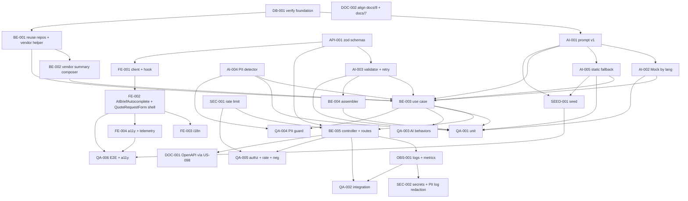

# Development Tasks — PB-P1-015 / US-021: Autocompletar brief de QuoteRequest con IA (AI-005)

## 1. Metadata

| Field | Value |
|---|---|
| User Story ID | US-021 |
| Source User Story | `management/user-stories/US-021-ai-quote-brief-autocompletion.md` |
| Source Technical Specification | `management/technical-specs/P1/PB-P1-015/US-021-technical-spec.md` |
| Decision Resolution Artifact | No aplica |
| Priority | P1 |
| Backlog ID | PB-P1-015 |
| Backlog Title | AI Brief de cotización autocompletado (AI-005) |
| Backlog Execution Order | 33 (P0: 18 + posición 15 en P1) |
| User Story Position in Backlog Item | 1 de 1 |
| Related User Stories in Backlog Item | US-021 |
| Epic | EPIC-AIP-001 — AI-Assisted Event Planning |
| Backlog Item Dependencies | PB-P1-011, PB-P1-006, PB-P1-019, PB-P1-030, PB-P0-007, PB-P0-009, PB-P0-010, PB-P0-011, PB-P0-014 |
| Feature | AI-005 — Brief autocompletado de QuoteRequest |
| Module / Domain | AI / Quotes |
| Backlog Alignment Status | Found |
| Task Breakdown Status | Ready for Sprint Planning |
| Created Date | 2026-06-26 |
| Last Updated | 2026-06-26 |

---

## 2. Source Validation

| Source | Found | Used | Notes |
|---|---|---|---|
| User Story | Yes | Yes | Approved with Minor Notes; HITL editable; sin creación de `QuoteRequest`. |
| Technical Specification | Yes | Yes | Ready for Task Breakdown; fuente primaria. |
| Decision Resolution Artifact | No | No | Decisiones PO ya formalizadas (8.1 #9, #15). |
| Product Backlog Prioritized | Yes | Yes | PB-P1-015; deps PB-P1-011, PB-P1-006, PB-P1-019, PB-P1-030, PB-P0-007/009..011/014. |
| ADRs | Yes | Yes | ADR-AI-001, ADR-API-001, ADR-SEC-002. |

---

## 3. Backlog Execution Context

### Parent Backlog Item

PB-P1-015 — Genera el brief estructurado (`brief`, `requirements[]`, `questions[]`, `constraints[]`) que precarga el `QuoteRequestForm`. Solo persiste `AIRecommendation(type='quote_brief', status='pending')`; la creación de `QuoteRequest` y la persistencia final del brief con `ai_generated_brief=true` y `ai_recommendation_id` quedan en US-023 / PB-P1-030.

### Execution Order Rationale

Tras US-017/018/019/020, reutiliza la fundación IA (`LLMProvider`, `MockAIProvider`, `AIRecommendation`, prompt registry, rate limit `SEC-POL-AI-007`), `EventRepository.findOwnedById` (US-017) y `ServiceCategoryRepository.findActiveByCode` (US-019/US-020). Habilita el embudo "Categorías → Brief → QuoteRequest" y desbloquea US-023.

### Related User Stories in Same Backlog Item

| User Story | Role in Backlog Item | Suggested Order |
|---|---|---|
| US-021 | Generación de brief estructurado con HITL editable | 1 |

---

## 4. Task Breakdown Summary

| Area | Number of Tasks | Notes |
|---|---:|---|
| AI / PromptOps (AI) | 5 | `QuoteBriefPrompt v1`, Mock determinista, validator Zod, `OrganizerPiiDetector`, `StaticQuoteBriefFallback`. |
| Database / Prisma (DB) | 1 | Verificación de enums/FKs/índices (sin migraciones nuevas). |
| Backend (BE) | 5 | Reuso repos + helper `VendorProfile`, `VendorSummaryComposer`, `GenerateQuoteBriefUseCase`, assembler, controller. |
| API Contract (API) | 1 | Zod schemas (path/body/output) y envelope unificado. |
| Security / Authorization (SEC) | 2 | Rate limit `SEC-POL-AI-007`; Secrets + redacción PII en logs. |
| Frontend (FE) | 4 | Cliente+hook, `AIBriefAutocomplete` + `AIBriefField` + `QuoteRequestForm` shell, i18n, a11y + telemetría. |
| Observability / Audit (OBS) | 1 | Logs `ai.quote-brief.*` (incl. `pii_detected`, `fallback`) + métricas + correlation ID. |
| QA / Testing (QA) | 6 | Unit, integration, AI behaviors, PII guard, authz + rate limit, E2E + a11y. |
| Seed / Demo (SEED) | 1 | Prompt v1, plantillas estáticas, eventos por idioma, categoría activa, `VendorProfile` aprobado. |
| Documentation / Traceability (DOC) | 2 | Snapshot OpenAPI (US-098) + aclaración `/docs/8` (UC-AI-005 vs UC-AI-006) y `/docs/7` (cadena de fallback). |
| **Total** | **28** | |

---

## 5. Traceability Matrix

| Acceptance Criterion | Technical Spec Section | Task IDs |
|---|---|---|
| AC-01: Brief generado con HITL pending | §7 UseCase, §10 DB, §9 API | AI-001, AI-002, AI-003, AI-005, BE-001, BE-002, BE-003, BE-004, BE-005, API-001, FE-001, FE-002, QA-001, QA-002 |
| AC-02: Precarga editable del formulario | §8 Components, §8 Forms | FE-002, FE-003, FE-004, QA-006 |
| AC-03: Idioma respetado | §7 Payload, §11 AI | AI-001, AI-002, BE-003, QA-002 |
| AC-04: Trazabilidad completa | §7 Persistence, §10 DB, §14 OBS | BE-003, OBS-001, QA-002 |
| AC-05: Sin PII del organizador | §7 PII Detector, §11 Safety | AI-004, BE-003, OBS-001, QA-004 |
| EC-01: Descartar pre-envío (handoff a US-025) | §6, §8 Components | FE-002, QA-006 |
| EC-02: Regenerar brief | §6, §8 Forms | BE-003, FE-002, QA-002 |
| EC-03: Categoría inválida/inactiva | §7 UseCase | BE-001, BE-003, QA-005 |
| EC-04: Timeout 60s | §7 UseCase, §11 Provider | AI-002, BE-003, QA-003 |
| EC-05: Provider error | §11 Provider, §7 Fallback | AI-002, AI-005, BE-003, QA-003 |
| EC-06: JSON inválido del LLM | §7 Validator, §11 NFR-AI-005 | AI-003, BE-003, QA-003 |
| EC-07: Rate limit excedido | §12 Security | SEC-001, QA-005 |
| VR-01..09 | §7 DTOs, §9 API | API-001, BE-003, BE-005, AI-003, AI-004 |
| SEC-01..07 | §12 Security | SEC-001, SEC-002, AI-004, QA-005 |
| AUTH-TS-01..05 / NT-01..08 | §12 Security | BE-005, SEC-001, QA-005 |
| AI-TS-01..11 | §13 AI Tests | QA-003, QA-004 |
| TS-05 E2E | §13 E2E, §15 Seed | SEED-001, QA-006 |
| Accesibilidad | §8 A11y | FE-004, QA-006 |
| Documentation Alignment | §16 | DOC-001, DOC-002 |

---

## 6. Development Tasks

### TASK-PB-P1-015-US-021-DB-001 — Verificar fundación IA, enums, FKs e índices

| Field | Value |
|---|---|
| Area | Database / Prisma |
| Type | Setup |
| Priority | Must |
| Estimate | XS |
| Depends On | PB-P0-009, PB-P0-010, PB-P0-011, PB-P1-019 |
| Source AC(s) | AC-01, AC-04 |
| Technical Spec Section(s) | §10 DB |
| Backlog ID | PB-P1-015 |
| User Story ID | US-021 |
| Owner Role | Backend |
| Status | To Do |

#### Objective

Confirmar que `ai_recommendation_type` incluye `'quote_brief'`, que `ai_recommendations(event_id, type, status, created_at)` está disponible, y que `service_categories.is_active` y `vendor_profiles.status` están operativos.

#### Scope

##### Include

* Inspección de `prisma/schema.prisma` y migraciones.
* Verificación de catálogo `service_categories` cargado por PB-P1-019.
* Verificación de presencia del enum `'quote_brief'`.

##### Exclude

* Crear migraciones nuevas.
* Modificar enums existentes.

#### Implementation Notes

* No requiere cambios estructurales; solo verificación.

#### Acceptance Criteria Covered

* AC-01, AC-04 (preparatoria).

#### Definition of Done

- [ ] Verificación documentada en PR.
- [ ] Gaps escalados si aplica.

---

### TASK-PB-P1-015-US-021-AI-001 — Registrar `QuoteBriefPrompt v1` (`PROMPT-QUOTE-BRIEF-V1`)

| Field | Value |
|---|---|
| Area | AI / PromptOps |
| Type | Implementation |
| Priority | Must |
| Estimate | S |
| Depends On | TASK-PB-P1-015-US-021-DB-001 |
| Source AC(s) | AC-01, AC-03, AC-05 |
| Technical Spec Section(s) | §11 Prompt Version |
| Backlog ID | PB-P1-015 |
| User Story ID | US-021 |
| Owner Role | AI |
| Status | To Do |

#### Objective

Crear `prompts/QuoteBriefPrompt/v1.yaml` con instrucciones anti-PII, anclaje al schema canónico y soporte 4 locales; semillar `ai_prompt_versions` con key `PROMPT-QUOTE-BRIEF-V1`.

#### Scope

##### Include

* Plantilla por idioma (es/en/pt/fr).
* Instrucciones explícitas para respetar invariantes (`brief ≤ 2000`, ítems ≤ 240, máx. 10 por array).
* Instrucciones explícitas para excluir email/teléfono/dirección del organizador.
* Upsert idempotente.
* Test de lookup vía `AIPromptVersionRepository.findActiveByPromptKey`.

##### Exclude

* Versiones posteriores del prompt.

#### Acceptance Criteria Covered

* AC-01, AC-03, AC-05.

#### Definition of Done

- [ ] Prompt cargado y verificable en `ai_prompt_versions`.
- [ ] Test de lookup verde.

---

### TASK-PB-P1-015-US-021-AI-002 — Extender `MockAIProvider` con respuesta determinista para `quote_brief`

| Field | Value |
|---|---|
| Area | AI / PromptOps |
| Type | Implementation |
| Priority | Must |
| Estimate | S |
| Depends On | TASK-PB-P1-015-US-021-AI-001 |
| Source AC(s) | AC-01, AC-03, EC-04, EC-05 |
| Technical Spec Section(s) | §11 Provider; §15 Seed/Demo |
| Backlog ID | PB-P1-015 |
| User Story ID | US-021 |
| Owner Role | AI |
| Status | To Do |

#### Objective

Garantizar respuesta determinista (`NFR-AI-008`) por `(event_id, service_category_code, vendor_id?, language_code)` cumpliendo `QuoteBriefOutputSchema`, sin PII del organizador.

#### Scope

##### Include

* Fixtures por idioma (`es`, `en`, `pt`, `fr`) por categoría representativa.
* Marcar `fallback_used=true` cuando se invoca como fallback.
* Snapshot tests por `(event_id, service_category_code, language_code)`.

##### Exclude

* Variabilidad aleatoria.
* Generación con `OpenAIProvider`.

#### Acceptance Criteria Covered

* AC-01, AC-03, EC-04, EC-05.

#### Definition of Done

- [ ] Fixtures listos y validados contra el schema.
- [ ] Snapshot tests por idioma verdes.

---

### TASK-PB-P1-015-US-021-AI-003 — `QuoteBriefOutputValidator` (Zod) + retry handler

| Field | Value |
|---|---|
| Area | AI / PromptOps |
| Type | Implementation |
| Priority | Must |
| Estimate | S |
| Depends On | TASK-PB-P1-015-US-021-API-001 |
| Source AC(s) | EC-06, VR-07, VR-08 |
| Technical Spec Section(s) | §7 Application Services; §11 Output Schema |
| Backlog ID | PB-P1-015 |
| User Story ID | US-021 |
| Owner Role | Backend |
| Status | To Do |

#### Objective

Validar el output del LLM contra `QuoteBriefOutputSchema` con invariantes (`brief ≤ 2000`, ítems ≤ 240, máx. 10 por array) y orquestar 1 reintento con prompt reforzado ante fallo.

#### Scope

##### Include

* `QuoteBriefOutputValidator.validate(raw): QuoteBriefOutput` con `superRefine`.
* Helper `retryOnce(fn, reinforcePrompt)` (reuso del de US-017 si está disponible).
* Tests unitarios (válido / arrays vacíos / ítems extralargos / brief sobre el límite).

##### Exclude

* Persistencia / orquestación (en BE-003).
* Detección de PII (en AI-004).

#### Acceptance Criteria Covered

* EC-06, VR-07, VR-08.

#### Definition of Done

- [ ] Validator implementado.
- [ ] Tests unitarios verdes (positivo y negativo).

---

### TASK-PB-P1-015-US-021-AI-004 — `OrganizerPiiDetector` puro

| Field | Value |
|---|---|
| Area | AI / PromptOps |
| Type | Implementation |
| Priority | Must |
| Estimate | S |
| Depends On | — |
| Source AC(s) | AC-05, VR-09, SEC-07 |
| Technical Spec Section(s) | §7 PII Detector; §11 Safety; §12 Sensitive Data |
| Backlog ID | PB-P1-015 |
| User Story ID | US-021 |
| Owner Role | Backend |
| Status | To Do |

#### Objective

Implementar detector puro y testeable que escanea `brief`, `requirements`, `questions`, `constraints` en busca de email, teléfono internacional y dirección postal del organizador.

#### Scope

##### Include

* `OrganizerPiiDetector.scan(output, organizerPiiSet): { ok: boolean, matches: string[] }`.
* Regex para email (`/[\w.+-]+@[\w-]+\.[\w.-]+/`), teléfono (E.164 y formatos comunes), dirección postal por keywords + matching contra calle del organizador si conocida.
* Tests unitarios por categoría de PII (positivo y negativo, falsos positivos esperados).

##### Exclude

* Detección de PII de vendor (cubierto por `VendorSummaryComposer`).
* Persistencia del log de PII detectada (en OBS-001).

#### Acceptance Criteria Covered

* AC-05, VR-09, SEC-07.

#### Definition of Done

- [ ] Detector implementado con ≥ 6 escenarios de tests.
- [ ] Funcionamiento determinista en CI.

---

### TASK-PB-P1-015-US-021-AI-005 — `StaticQuoteBriefFallback` por categoría e idioma

| Field | Value |
|---|---|
| Area | AI / PromptOps |
| Type | Implementation |
| Priority | Must |
| Estimate | S |
| Depends On | TASK-PB-P1-015-US-021-AI-001 |
| Source AC(s) | EC-05 |
| Technical Spec Section(s) | §7 Fallback; §11 Fallback Chain |
| Backlog ID | PB-P1-015 |
| User Story ID | US-021 |
| Owner Role | AI |
| Status | To Do |

#### Objective

Implementar fallback estático de último recurso (cuando provider y Mock fallan) con plantillas por categoría e idioma; siempre persiste `AIRecommendation { status='failed', fallback_used=true }`.

#### Scope

##### Include

* `StaticQuoteBriefFallback.byCategory(serviceCategoryCode, languageCode): QuoteBriefOutput`.
* Plantillas en `prompts/QuoteBriefPrompt/static-templates.json` por categoría representativa y los 4 locales.
* Tests unitarios por categoría e idioma.

##### Exclude

* Fallback automático en producción cuando hay error transitorio (cadena prod=error / demo=Mock / último recurso=estática se orquesta en BE-003).

#### Acceptance Criteria Covered

* EC-05.

#### Definition of Done

- [ ] Plantillas registradas y testeadas.
- [ ] Fallback cumple `QuoteBriefOutputSchema`.

---

### TASK-PB-P1-015-US-021-API-001 — Definir Zod schemas (path/body/output) y envelope

| Field | Value |
|---|---|
| Area | API Contract |
| Type | Implementation |
| Priority | Must |
| Estimate | S |
| Depends On | — |
| Source AC(s) | VR-01..09, AC-01, AC-04 |
| Technical Spec Section(s) | §7 DTOs / Schemas; §9 API Contract |
| Backlog ID | PB-P1-015 |
| User Story ID | US-021 |
| Owner Role | Backend |
| Status | To Do |

#### Objective

Especificar el contrato Zod del endpoint y reutilizar el envelope unificado.

#### Scope

##### Include

* `eventQuoteBriefParamsSchema` (`{ eventId: uuid }`).
* `quoteBriefRequestBodySchema` (`{ service_category_code: string, vendor_id?: uuid }`, strict).
* `QuoteBriefInputSchema` (payload al prompt).
* `QuoteBriefOutputSchema` (output canónico `/docs/16` líneas 1600–1605).
* `QuoteBriefResponseDTO`.
* Tests unitarios.

##### Exclude

* Snapshot OpenAPI (DOC-001).

#### Acceptance Criteria Covered

* VR-01..09, AC-01, AC-04.

#### Definition of Done

- [ ] Schemas importables desde BE.
- [ ] Tests unitarios verdes.

---

### TASK-PB-P1-015-US-021-BE-001 — Reuso de repos + helper `VendorProfile.findApprovedById` + pre-validación

| Field | Value |
|---|---|
| Area | Backend |
| Type | Implementation |
| Priority | Must |
| Estimate | S |
| Depends On | TASK-PB-P1-015-US-021-DB-001 |
| Source AC(s) | AC-01, VR-02, VR-03, VR-04, VR-05, EC-03 |
| Technical Spec Section(s) | §7 Repository; §7 Use Case (steps 1–4) |
| Backlog ID | PB-P1-015 |
| User Story ID | US-021 |
| Owner Role | Backend |
| Status | To Do |

#### Objective

Habilitar lookups con ownership y catálogo activo; agregar helper `VendorProfilePrismaRepository.findApprovedById(vendorId)` si no existe; centralizar `assertEventEditableForAI(event)`.

#### Scope

##### Include

* Confirmar disponibilidad de `EventRepository.findOwnedById` (US-017) y `ServiceCategoryRepository.findActiveByCode` (US-019/US-020).
* Implementar `VendorProfilePrismaRepository.findApprovedById` (read-only) si no existe.
* Helper `assertEventEditableForAI(event)` (reuso si existe).
* Tests unitarios.

##### Exclude

* Mutaciones sobre `vendor_profiles`.
* Lógica del use case (en BE-003).

#### Acceptance Criteria Covered

* AC-01, VR-02, VR-03, VR-04, VR-05, EC-03.

#### Definition of Done

- [ ] Helpers disponibles y testeados.

---

### TASK-PB-P1-015-US-021-BE-002 — `VendorSummaryComposer` (datos públicos no sensibles)

| Field | Value |
|---|---|
| Area | Backend |
| Type | Implementation |
| Priority | Must |
| Estimate | XS |
| Depends On | TASK-PB-P1-015-US-021-BE-001 |
| Source AC(s) | AC-01, SEC-07 |
| Technical Spec Section(s) | §7 Application Services; §12 Sensitive Data |
| Backlog ID | PB-P1-015 |
| User Story ID | US-021 |
| Owner Role | Backend |
| Status | To Do |

#### Objective

Componer `vendor_summary` con `categories_served[]`, `city`, `languages[]`, `public_packages[]` cuando `vendor_id` está aprobado; nunca email, teléfono, ni nombre del titular.

#### Scope

##### Include

* `VendorSummaryComposer.compose(vendorProfile?)`: pure function.
* Whitelist explícita de campos.
* Tests unitarios (con y sin `vendor_id`, sin filtrar campos sensibles).

##### Exclude

* Lectura del repo (queda en BE-001).

#### Acceptance Criteria Covered

* AC-01, SEC-07.

#### Definition of Done

- [ ] Composer implementado y testeado.

---

### TASK-PB-P1-015-US-021-BE-003 — `GenerateQuoteBriefUseCase` (orquestación + fallback chain)

| Field | Value |
|---|---|
| Area | Backend |
| Type | Implementation |
| Priority | Must |
| Estimate | M |
| Depends On | TASK-PB-P1-015-US-021-BE-001, TASK-PB-P1-015-US-021-BE-002, TASK-PB-P1-015-US-021-AI-001, TASK-PB-P1-015-US-021-AI-002, TASK-PB-P1-015-US-021-AI-003, TASK-PB-P1-015-US-021-AI-004, TASK-PB-P1-015-US-021-AI-005 |
| Source AC(s) | AC-01, AC-03, AC-04, AC-05, EC-02..06 |
| Technical Spec Section(s) | §7 Use Cases; §11 AI |
| Backlog ID | PB-P1-015 |
| User Story ID | US-021 |
| Owner Role | Backend |
| Status | To Do |

#### Objective

Orquestar ownership → estado del evento → categoría activa → vendor aprobado opcional → vendor summary → lookup prompt activo → invocar `LLMProvider` → validar Zod → detectar PII → 1 reintento ante PII o JSON inválido → cadena de fallback (prod=error / demo=Mock / último recurso=estática) → persistir `AIRecommendation` transaccionalmente.

#### Scope

##### Include

* `GenerateQuoteBriefUseCase.execute({ eventId, serviceCategoryCode, vendorId?, actor, correlationId })` con todas las ramas.
* Llamada al LLM fuera de la transacción; insert dentro.
* Persistencia siempre (éxito y falla) con metadata canónica completa.
* No tocar otras entidades.

##### Exclude

* Acciones HITL `accept`/`edit`/`discard` (US-025).
* Creación de `QuoteRequest` (US-023).
* Streaming de respuestas IA.

#### Implementation Notes

* Selección de provider por env (`LLM_PROVIDER`, `AI_DEMO_MODE`).
* Marcar `fallback_used=true` cuando se cae a Mock o a la plantilla estática.
* La regeneración crea un nuevo `AIRecommendation`; el anterior conserva su `status`.

#### Acceptance Criteria Covered

* AC-01, AC-03, AC-04, AC-05, EC-02..06.

#### Definition of Done

- [ ] Use case con todas las ramas cubiertas.
- [ ] Cobertura unitaria de ≥ 10 escenarios.

---

### TASK-PB-P1-015-US-021-BE-004 — `QuoteBriefAssembler`

| Field | Value |
|---|---|
| Area | Backend |
| Type | Implementation |
| Priority | Must |
| Estimate | XS |
| Depends On | TASK-PB-P1-015-US-021-AI-003 |
| Source AC(s) | AC-01, AC-04 |
| Technical Spec Section(s) | §7 Application Services |
| Backlog ID | PB-P1-015 |
| User Story ID | US-021 |
| Owner Role | Backend |
| Status | To Do |

#### Objective

Mapear `(AIRecommendation, brief, requirements, questions, constraints)` a `QuoteBriefResponseDTO` con whitelist explícita.

#### Scope

##### Include

* `QuoteBriefAssembler.toDTO(recommendation, output)`.
* Tests unitarios.

##### Exclude

* Lógica de negocio.

#### Acceptance Criteria Covered

* AC-01, AC-04.

#### Definition of Done

- [ ] DTO conforme al contrato.
- [ ] Tests verdes.

---

### TASK-PB-P1-015-US-021-BE-005 — `AIQuoteBriefController` + rutas + middlewares + error mapping

| Field | Value |
|---|---|
| Area | Backend |
| Type | Implementation |
| Priority | Must |
| Estimate | S |
| Depends On | TASK-PB-P1-015-US-021-BE-003, TASK-PB-P1-015-US-021-API-001, TASK-PB-P1-015-US-021-SEC-001 |
| Source AC(s) | AC-01, VR-01..06, EC-07 |
| Technical Spec Section(s) | §7 Controllers / Routes |
| Backlog ID | PB-P1-015 |
| User Story ID | US-021 |
| Owner Role | Backend |
| Status | To Do |

#### Objective

Exponer `POST /api/v1/events/:eventId/ai/quote-brief` con la pila completa de middlewares y mapping de errores al envelope unificado.

#### Scope

##### Include

* Stack `requireAuth`, `requireRole('organizer')`, `validateParams`, `validateBody`, `aiRateLimitMiddleware`, `withCorrelationId`.
* Mapping 400/401/403/404/409/429/5xx.
* Registro en `routes/events/ai.routes.ts`.

##### Exclude

* Lógica IA (en use case).

#### Acceptance Criteria Covered

* AC-01, VR-01..06, EC-07.

#### Definition of Done

- [ ] Ruta operativa.
- [ ] Códigos HTTP mapeados correctamente.
- [ ] Header `x-correlation-id` presente en respuestas.

---

### TASK-PB-P1-015-US-021-SEC-001 — Aplicar `aiRateLimitMiddleware` (`SEC-POL-AI-007`)

| Field | Value |
|---|---|
| Area | Security / Authorization |
| Type | Implementation |
| Priority | Must |
| Estimate | XS |
| Depends On | PB-P0-007 |
| Source AC(s) | SEC-02, EC-07 |
| Technical Spec Section(s) | §12 Security |
| Backlog ID | PB-P1-015 |
| User Story ID | US-021 |
| Owner Role | Backend |
| Status | To Do |

#### Objective

Garantizar que el endpoint queda bajo `SEC-POL-AI-007` (20/usuario/hora) y emite `Retry-After`.

#### Scope

##### Include

* Aplicar el middleware existente al endpoint.
* Validar `Retry-After` y semántica de `429`.

##### Exclude

* Reescribir el rate limiter.

#### Acceptance Criteria Covered

* SEC-02, EC-07.

#### Definition of Done

- [ ] Middleware activo.
- [ ] `429` con `Retry-After`.

---

### TASK-PB-P1-015-US-021-SEC-002 — Verificar Secrets Manager y redacción PII en logs

| Field | Value |
|---|---|
| Area | Security / Authorization |
| Type | Review |
| Priority | Must |
| Estimate | XS |
| Depends On | TASK-PB-P1-015-US-021-OBS-001 |
| Source AC(s) | SEC-03, SEC-06 |
| Technical Spec Section(s) | §12 Security; §14 Observability |
| Backlog ID | PB-P1-015 |
| User Story ID | US-021 |
| Owner Role | DevOps |
| Status | To Do |

#### Objective

Confirmar que `OPENAI_API_KEY` se inyecta solo desde Secrets Manager y que los logs no contienen el contenido del brief ni PII del organizador.

#### Scope

##### Include

* Inspección de configuración de secretos.
* Inspección del logger y formatter.

##### Exclude

* Cambios al sistema de secretos.

#### Acceptance Criteria Covered

* SEC-03, SEC-06.

#### Definition of Done

- [ ] Verificación documentada.

---

### TASK-PB-P1-015-US-021-FE-001 — Cliente `aiApi.generateQuoteBrief` + hook `useGenerateAIQuoteBrief`

| Field | Value |
|---|---|
| Area | Frontend |
| Type | Implementation |
| Priority | Must |
| Estimate | S |
| Depends On | TASK-PB-P1-015-US-021-API-001 |
| Source AC(s) | AC-01, EC-04, EC-05, EC-06, EC-07 |
| Technical Spec Section(s) | §8 Data Fetching; §8 State Management |
| Backlog ID | PB-P1-015 |
| User Story ID | US-021 |
| Owner Role | Frontend |
| Status | To Do |

#### Objective

Consumir el endpoint con TanStack `useMutation` y mapear estados/errores.

#### Scope

##### Include

* `aiApi.generateQuoteBrief({ eventId, serviceCategoryCode, vendorId? })` con cookie auth.
* `useGenerateAIQuoteBrief(eventId)` con `queryKey` canónica y mapping de `error.code`.
* Tests MSW para 200, 400, 401, 403, 404, 409, 429, 5xx (`AI_TIMEOUT`, `AI_INVALID_OUTPUT`, `AI_PROVIDER_ERROR`).

##### Exclude

* Render UI (en FE-002).

#### Acceptance Criteria Covered

* AC-01, EC-04, EC-05, EC-06, EC-07.

#### Definition of Done

- [ ] Hook y cliente implementados.
- [ ] Tests MSW verdes.

---

### TASK-PB-P1-015-US-021-FE-002 — `AIBriefAutocomplete` + `AIBriefField` + `QuoteRequestForm` shell

| Field | Value |
|---|---|
| Area | Frontend |
| Type | Implementation |
| Priority | Must |
| Estimate | M |
| Depends On | TASK-PB-P1-015-US-021-FE-001 |
| Source AC(s) | AC-01, AC-02, EC-01, EC-02, EC-04..07 |
| Technical Spec Section(s) | §8 Routes / Pages; §8 Components; §8 Forms |
| Backlog ID | PB-P1-015 |
| User Story ID | US-021 |
| Owner Role | Frontend |
| Status | To Do |

#### Objective

Integrar el formulario "Nueva solicitud de cotización" con sección IA precargada, badge "Sugerido por IA" por campo, acciones "Autocompletar con IA", "Regenerar" y "Descartar". El envío final queda delegado a US-023.

#### Scope

##### Include

* `AIBriefAutocomplete` con CTAs y estados loading/empty/error/success.
* `AIBriefField` (textarea + badge IA por sección: `brief`, `requirements`, `questions`, `constraints`).
* `QuoteRequestForm` shell con RHF + Zod (`quoteRequestFormSchema`).
* Integración en `app/[locale]/organizer/events/[id]/quotes/new/page.tsx`.
* Confirmación al "Regenerar" si hay ediciones manuales.
* Descartar limpia el form e invoca el endpoint común HITL (US-025).

##### Exclude

* Envío de la `QuoteRequest` (US-023).
* Endpoints HITL `accept`/`edit`/`discard` (US-025).

#### Acceptance Criteria Covered

* AC-01, AC-02, EC-01, EC-02, EC-04..07.

#### Definition of Done

- [ ] Formulario operativo con precarga IA.
- [ ] Regenerar y Descartar funcionales.

---

### TASK-PB-P1-015-US-021-FE-003 — i18n `ai.quoteBrief.*` en 4 locales

| Field | Value |
|---|---|
| Area | Frontend |
| Type | Implementation |
| Priority | Must |
| Estimate | XS |
| Depends On | TASK-PB-P1-015-US-021-FE-002 |
| Source AC(s) | AC-02, EC-04..07 |
| Technical Spec Section(s) | §8 i18n |
| Backlog ID | PB-P1-015 |
| User Story ID | US-021 |
| Owner Role | Frontend |
| Status | To Do |

#### Objective

Proveer claves de traducción para textos UI (CTAs, banners, headings, errores) en es/en/pt/fr; el contenido del brief permanece en `event.language_code`.

#### Scope

##### Include

* Claves `ai.quoteBrief.*` en los 4 locales (`autocomplete`, `regenerate`, `discard`, `loading`, `errors.*`, `badge`).

##### Exclude

* Cambios al pipeline `next-intl`.

#### Acceptance Criteria Covered

* AC-02, EC-04..07.

#### Definition of Done

- [ ] Claves en 4 locales.
- [ ] Lint i18n pasa.

---

### TASK-PB-P1-015-US-021-FE-004 — Accesibilidad + telemetría del flujo

| Field | Value |
|---|---|
| Area | Frontend |
| Type | Implementation |
| Priority | Must |
| Estimate | XS |
| Depends On | TASK-PB-P1-015-US-021-FE-002 |
| Source AC(s) | AC-02 |
| Technical Spec Section(s) | §8 Accessibility; §14 Observability |
| Backlog ID | PB-P1-015 |
| User Story ID | US-021 |
| Owner Role | Frontend |
| Status | To Do |

#### Objective

Garantizar `label`/`aria-describedby` con "Editable", badge IA con `aria-label="Contenido generado por IA, editable"`, `aria-live="polite"` al completarse la generación, y telemetría `ai.quote-brief.generated|edited|discarded|regenerated`.

#### Scope

##### Include

* Atributos ARIA y semántica.
* Handler de telemetría con `event_id`, `service_category_code`, `correlation_id`.
* Test axe.

##### Exclude

* Auditoría completa del módulo Quotes.

#### Acceptance Criteria Covered

* AC-02 (a11y), telemetría AI.

#### Definition of Done

- [ ] ARIA correcto.
- [ ] Telemetría emitida en CTAs.
- [ ] axe sin violaciones bloqueantes.

---

### TASK-PB-P1-015-US-021-OBS-001 — Logging estructurado + métricas + correlation ID

| Field | Value |
|---|---|
| Area | Observability / Audit |
| Type | Implementation |
| Priority | Must |
| Estimate | S |
| Depends On | TASK-PB-P1-015-US-021-BE-005 |
| Source AC(s) | AC-04, AC-05, SEC-03 |
| Technical Spec Section(s) | §14 Observability & Audit |
| Backlog ID | PB-P1-015 |
| User Story ID | US-021 |
| Owner Role | Backend |
| Status | To Do |

#### Objective

Emitir logs `ai.quote-brief.requested|generated|failed|fallback|invalid_output|pii_detected|rate_limited` y métricas canónicas; propagar `correlation_id` end-to-end.

#### Scope

##### Include

* Logger estructurado sin contenido del brief (solo metadata canónica).
* Métricas: contadores por `provider`, `fallback_used`, `result`, `pii_detected_count`; histograma de latencia.
* `withCorrelationId` propaga `x-correlation-id` al log y a `AIRecommendation.correlation_id`.

##### Exclude

* Cambios al stack de observabilidad.

#### Acceptance Criteria Covered

* AC-04, AC-05, SEC-03.

#### Definition of Done

- [ ] Logs en cada ruta de control.
- [ ] Métricas expuestas.
- [ ] Correlation ID propagado.

---

### TASK-PB-P1-015-US-021-QA-001 — Unit tests (use case, validator, PII detector, vendor summary, assembler, fallback)

| Field | Value |
|---|---|
| Area | QA / Testing |
| Type | Test |
| Priority | Must |
| Estimate | M |
| Depends On | TASK-PB-P1-015-US-021-BE-003, TASK-PB-P1-015-US-021-BE-004, TASK-PB-P1-015-US-021-AI-002, TASK-PB-P1-015-US-021-AI-003, TASK-PB-P1-015-US-021-AI-004, TASK-PB-P1-015-US-021-AI-005 |
| Source AC(s) | AC-01, AC-03, AC-04, AC-05, EC-02..06 |
| Technical Spec Section(s) | §13 Unit Tests |
| Backlog ID | PB-P1-015 |
| User Story ID | US-021 |
| Owner Role | QA |
| Status | To Do |

#### Objective

Cubrir caminos felices y de error del use case y de los colaboradores puros.

#### Scope

##### Include

* ≥ 10 escenarios del use case (happy, timeout prod/demo, provider error prod/demo, PII con retry exitoso/falla, JSON inválido con retry exitoso/falla, fallback estática como último recurso, regenerar, evento ajeno, evento `cancelled`).
* Validator (`brief ≤ 2000`, ítems ≤ 240, máx. 10 por array).
* PII detector (email, teléfono, dirección).
* Vendor summary composer (whitelist).
* Assembler (mapeo).
* Static fallback (por categoría e idioma).

##### Exclude

* Tests UI.

#### Acceptance Criteria Covered

* AC-01, AC-03, AC-04, AC-05, EC-02..06.

#### Definition of Done

- [ ] Suite unitaria verde.

---

### TASK-PB-P1-015-US-021-QA-002 — Integration tests del endpoint

| Field | Value |
|---|---|
| Area | QA / Testing |
| Type | Test |
| Priority | Must |
| Estimate | S |
| Depends On | TASK-PB-P1-015-US-021-BE-005, TASK-PB-P1-015-US-021-OBS-001 |
| Source AC(s) | AC-01, AC-03, AC-04, EC-02 |
| Technical Spec Section(s) | §13 Integration Tests |
| Backlog ID | PB-P1-015 |
| User Story ID | US-021 |
| Owner Role | QA |
| Status | To Do |

#### Objective

Validar el endpoint contra BD test + `MockAIProvider`.

#### Scope

##### Include

* TS-01 happy + persistencia con metadata completa.
* TS-02 verificación de campos canónicos (`prompt_version_id`, `llm_provider`, `language_code`, `latency_ms`, `fallback_used`, `timeout_ms`, `correlation_id`).
* TS-03 `language_code='pt'` → contenido en pt.
* TS-04 `vendor_id` válido incluye contexto del proveedor en el payload.
* TS-07 EC-02 regenerar crea un nuevo `AIRecommendation`.

##### Exclude

* Tests UI.

#### Acceptance Criteria Covered

* AC-01, AC-03, AC-04, EC-02.

#### Definition of Done

- [ ] Suite verde en CI.

---

### TASK-PB-P1-015-US-021-QA-003 — AI behaviors (timeout, retry, fallback chain)

| Field | Value |
|---|---|
| Area | QA / Testing |
| Type | Test |
| Priority | Must |
| Estimate | S |
| Depends On | TASK-PB-P1-015-US-021-BE-003 |
| Source AC(s) | EC-04, EC-05, EC-06 |
| Technical Spec Section(s) | §13 AI Tests |
| Backlog ID | PB-P1-015 |
| User Story ID | US-021 |
| Owner Role | QA |
| Status | To Do |

#### Objective

Cubrir AI-TS-04..09, AI-TS-11.

#### Scope

##### Include

* JSON inválido → retry exitoso / falla.
* Timeout 60 s prod (`AI_TIMEOUT` + failed) / demo (fallback Mock + `fallback_used=true`).
* Provider 5xx prod (`AI_PROVIDER_ERROR`) / demo (Mock).
* Provider + Mock fallan → `StaticQuoteBriefFallback` + failed + `fallback_used=true`.
* Mock determinista (snapshot por evento+categoría+idioma).

##### Exclude

* Tests de PII (en QA-004).
* Rate limit (en QA-005).

#### Acceptance Criteria Covered

* EC-04, EC-05, EC-06.

#### Definition of Done

- [ ] 7 escenarios verdes.

---

### TASK-PB-P1-015-US-021-QA-004 — PII guard tests (AI-TS-02, AI-TS-03)

| Field | Value |
|---|---|
| Area | QA / Testing |
| Type | Test |
| Priority | Must |
| Estimate | S |
| Depends On | TASK-PB-P1-015-US-021-AI-004, TASK-PB-P1-015-US-021-BE-003 |
| Source AC(s) | AC-05, VR-09, SEC-07 |
| Technical Spec Section(s) | §13 AI Tests; §12 Sensitive Data |
| Backlog ID | PB-P1-015 |
| User Story ID | US-021 |
| Owner Role | QA |
| Status | To Do |

#### Objective

Validar la cadena de protección contra PII del organizador en el output del LLM.

#### Scope

##### Include

* AI-TS-02: PII detectada → retry exitoso (brief sin PII, `pending`).
* AI-TS-03: PII persistente tras retry → `AI_INVALID_OUTPUT` + `failed`.
* Verificación de que `pii_detected_count` se registra en métricas.
* Verificación de que el log `pii_detected` no incluye el contenido del brief.

##### Exclude

* Detección de PII de vendor (whitelist en BE-002).

#### Acceptance Criteria Covered

* AC-05, VR-09, SEC-07.

#### Definition of Done

- [ ] 2 escenarios principales verdes + verificación de logging.

---

### TASK-PB-P1-015-US-021-QA-005 — Authorization + rate limit + matriz negativa

| Field | Value |
|---|---|
| Area | QA / Testing |
| Type | Test |
| Priority | Must |
| Estimate | S |
| Depends On | TASK-PB-P1-015-US-021-BE-005, TASK-PB-P1-015-US-021-SEC-001 |
| Source AC(s) | SEC-01..06, EC-03, EC-07 |
| Technical Spec Section(s) | §13 API Tests; §12 Security |
| Backlog ID | PB-P1-015 |
| User Story ID | US-021 |
| Owner Role | QA |
| Status | To Do |

#### Objective

Cubrir AUTH-TS-01..05, NT-01..08, AI-TS-10.

#### Scope

##### Include

* Matriz por rol y ownership (organizer dueño, no dueño, vendor, admin, anónimo).
* `service_category_code` inexistente/inactiva, `vendor_id` inválido, evento `cancelled`/`completed`/`deleted`, `language_code` no soportado, `eventId` con formato inválido.
* Rate limit excedido → `429` con `Retry-After`.

##### Exclude

* Tests funcionales positivos (en QA-002).

#### Acceptance Criteria Covered

* SEC-01..06, EC-03, EC-07.

#### Definition of Done

- [ ] Todos los escenarios verdes.

---

### TASK-PB-P1-015-US-021-QA-006 — E2E Playwright + a11y + handoff a US-023

| Field | Value |
|---|---|
| Area | QA / Testing |
| Type | Test |
| Priority | Must |
| Estimate | S |
| Depends On | TASK-PB-P1-015-US-021-FE-002, TASK-PB-P1-015-US-021-FE-004, TASK-PB-P1-015-US-021-SEED-001 |
| Source AC(s) | AC-01, AC-02, EC-01 |
| Technical Spec Section(s) | §13 E2E Tests; §13 Accessibility Tests |
| Backlog ID | PB-P1-015 |
| User Story ID | US-021 |
| Owner Role | QA |
| Status | To Do |

#### Objective

Validar end-to-end con seed y `MockAIProvider` que el organizer precarga el brief, lo edita y queda listo para enviarlo (handoff a US-023); además a11y sobre el formulario.

#### Scope

##### Include

* Test "abrir formulario → autocompletar IA → editar campo → preparado para enviar".
* Test "abrir → autocompletar → descartar → form vacío + `AIRecommendation.status='discarded'`".
* Test axe sobre el formulario.

##### Exclude

* Pruebas de carga/rendimiento.
* Envío real de `QuoteRequest` (US-023).

#### Acceptance Criteria Covered

* AC-01, AC-02, EC-01.

#### Definition of Done

- [ ] Playwright verde.
- [ ] axe sin violaciones bloqueantes.

---

### TASK-PB-P1-015-US-021-SEED-001 — Seed: prompt v1 + plantillas estáticas + eventos por idioma + vendor aprobado

| Field | Value |
|---|---|
| Area | Seed / Demo Data |
| Type | Setup |
| Priority | Must |
| Estimate | XS |
| Depends On | TASK-PB-P1-015-US-021-AI-001, TASK-PB-P1-015-US-021-AI-005, PB-P1-035, PB-P1-036 |
| Source AC(s) | AC-02, AC-03 |
| Technical Spec Section(s) | §15 Seed/Demo |
| Backlog ID | PB-P1-015 |
| User Story ID | US-021 |
| Owner Role | DevOps |
| Status | To Do |

#### Objective

Confirmar que el seed provee `QuoteBriefPrompt v1` activo, plantillas estáticas por categoría e idioma, al menos un evento por idioma con datos completos, `service_categories` activos (PB-P1-019) y al menos un `VendorProfile` aprobado por categoría.

#### Scope

##### Include

* Inspección del seed.
* Verificación post-reset demo.

##### Exclude

* Creación de seed adicional si ya existe.

#### Acceptance Criteria Covered

* AC-02, AC-03.

#### Definition of Done

- [ ] Verificación documentada.

---

### TASK-PB-P1-015-US-021-DOC-001 — Coordinar snapshot OpenAPI con US-098

| Field | Value |
|---|---|
| Area | Documentation / Traceability |
| Type | Documentation |
| Priority | Should |
| Estimate | XS |
| Depends On | TASK-PB-P1-015-US-021-BE-005 |
| Source AC(s) | AC-01 |
| Technical Spec Section(s) | §9 API; §16 Doc Alignment |
| Backlog ID | PB-P1-015 |
| User Story ID | US-021 |
| Owner Role | Backend |
| Status | To Do |

#### Objective

Asegurar que el snapshot OpenAPI refleje el endpoint canónico, el DTO de salida y todos los códigos (incluyendo `Retry-After` en `429`).

#### Scope

##### Include

* Ticket o PR de coordinación con US-098.

##### Exclude

* Cambios fuera del scope del snapshot.

#### Acceptance Criteria Covered

* AC-01 (alineación documental).

#### Definition of Done

- [ ] Snapshot actualizado o ticket abierto en US-098.

---

### TASK-PB-P1-015-US-021-DOC-002 — Aclaración en `/docs/8` y `/docs/7`

| Field | Value |
|---|---|
| Area | Documentation / Traceability |
| Type | Documentation |
| Priority | Should |
| Estimate | XS |
| Depends On | — |
| Source AC(s) | — |
| Technical Spec Section(s) | §16 Doc Alignment |
| Backlog ID | PB-P1-015 |
| User Story ID | US-021 |
| Owner Role | Tech Lead |
| Status | To Do |

#### Objective

Alinear `/docs/8` (`UC-AI-005` para brief vs `UC-AI-006`) siguiendo la autoridad del FRD, y formalizar en `/docs/7` la cadena canónica de fallback (prod=error / demo=Mock / último recurso=plantilla estática).

#### Scope

##### Include

* Ediciones livianas o notas de alineación.

##### Exclude

* Cambios en otras secciones.

#### Acceptance Criteria Covered

* — (alineación documental).

#### Definition of Done

- [ ] Cambios aplicados o PR abierto.

---

## 7. Required QA Tasks

| Task ID | Test Type | Purpose |
|---|---|---|
| TASK-PB-P1-015-US-021-QA-001 | Unit | Use case + validator + PII detector + vendor summary + assembler + static fallback. |
| TASK-PB-P1-015-US-021-QA-002 | Integration | Endpoint + persistencia + idioma + regeneración. |
| TASK-PB-P1-015-US-021-QA-003 | AI / behaviors | Timeout, retry, fallback chain, Mock determinista. |
| TASK-PB-P1-015-US-021-QA-004 | AI / Security | PII guard (retry + falla) + logging sin contenido. |
| TASK-PB-P1-015-US-021-QA-005 | API / Security | Authorization + rate limit + matriz negativa. |
| TASK-PB-P1-015-US-021-QA-006 | E2E + A11y | Precarga + edición + descartar + axe. |

---

## 8. Required Security Tasks

| Task ID | Security Concern | Purpose |
|---|---|---|
| TASK-PB-P1-015-US-021-SEC-001 | Rate limit IA `SEC-POL-AI-007` | Aplicar y verificar `429 + Retry-After`. |
| TASK-PB-P1-015-US-021-SEC-002 | Secrets Manager + redacción PII en logs | Confirmar `OPENAI_API_KEY` solo en backend y logs sin contenido del brief. |
| TASK-PB-P1-015-US-021-AI-004 | PII detector en output IA | Bloquear filtración de email/teléfono/dirección del organizador. |

---

## 9. Required Seed / Demo Tasks

| Task ID | Seed/Demo Concern | Purpose |
|---|---|---|
| TASK-PB-P1-015-US-021-SEED-001 | `QuoteBriefPrompt v1` + plantillas estáticas + eventos por idioma + `VendorProfile` aprobado | Habilitar TS-05 y demo determinista del flujo brief → handoff a US-023. |

---

## 10. Observability / Audit Tasks

| Task ID | Concern | Purpose |
|---|---|---|
| TASK-PB-P1-015-US-021-OBS-001 | Logs `ai.quote-brief.*` (incl. `pii_detected`, `fallback`) + métricas + correlation ID | Cumplir NFR-OBS-001, AC-04, AC-05 y SEC-03. |

---

## 11. Documentation / Traceability Tasks

| Task ID | Document / Artifact | Purpose |
|---|---|---|
| TASK-PB-P1-015-US-021-DOC-001 | `/docs/16` (OpenAPI vía US-098) | Documentation Alignment Required. |
| TASK-PB-P1-015-US-021-DOC-002 | `/docs/8` (UC-AI-005 vs UC-AI-006) + `/docs/7` (cadena de fallback) | Documentation Alignment Required. |

---

## 12. Dependency Graph

---

## 13. Suggested Implementation Order

### Phase 1 — Foundation

* TASK-PB-P1-015-US-021-DB-001
* TASK-PB-P1-015-US-021-API-001
* TASK-PB-P1-015-US-021-AI-001
* TASK-PB-P1-015-US-021-AI-004
* TASK-PB-P1-015-US-021-AI-005
* TASK-PB-P1-015-US-021-SEED-001

### Phase 2 — Core Implementation

* TASK-PB-P1-015-US-021-AI-002
* TASK-PB-P1-015-US-021-AI-003
* TASK-PB-P1-015-US-021-BE-001
* TASK-PB-P1-015-US-021-BE-002
* TASK-PB-P1-015-US-021-BE-003
* TASK-PB-P1-015-US-021-BE-004
* TASK-PB-P1-015-US-021-SEC-001
* TASK-PB-P1-015-US-021-BE-005
* TASK-PB-P1-015-US-021-OBS-001
* TASK-PB-P1-015-US-021-FE-001
* TASK-PB-P1-015-US-021-FE-002
* TASK-PB-P1-015-US-021-FE-003
* TASK-PB-P1-015-US-021-FE-004

### Phase 3 — Validation / Security / QA

* TASK-PB-P1-015-US-021-SEC-002
* TASK-PB-P1-015-US-021-QA-001
* TASK-PB-P1-015-US-021-QA-002
* TASK-PB-P1-015-US-021-QA-003
* TASK-PB-P1-015-US-021-QA-004
* TASK-PB-P1-015-US-021-QA-005
* TASK-PB-P1-015-US-021-QA-006

### Phase 4 — Documentation / Review

* TASK-PB-P1-015-US-021-DOC-001
* TASK-PB-P1-015-US-021-DOC-002

---

## 14. Risks & Mitigations

| Risk | Impact | Mitigation | Related Task |
|---|---|---|---|
| LLM filtra PII del organizador en el brief | Riesgo legal/UX. | `OrganizerPiiDetector` + retry + plantilla estática como último recurso; tests dedicados. | AI-004, BE-003, QA-004 |
| Output excede longitud (`brief > 2000` o ítems > 240) | Validación falla. | Schema Zod estricto + invariantes en el prompt + tests. | AI-001, AI-003, QA-001 |
| Latencia LLM cercana al timeout (60 s) | Timeouts frecuentes. | Métricas + fallback Mock solo en demo + comunicación en UI. | OBS-001, AI-002, FE-002 |
| `vendor_summary` filtra datos sensibles del vendor | Privacidad. | Whitelist en `VendorSummaryComposer` + tests dedicados. | BE-002, QA-001 |
| Cambios en `ServiceCategory` durante la sesión | Inconsistencia. | Validación previa a invocar LLM; resolver `code` al inicio del use case. | BE-001, BE-003 |
| Confusión persistencia brief vs creación `QuoteRequest` | Doble responsabilidad. | Esta US solo persiste `AIRecommendation`; persistencia final delegada a US-023. | BE-003, FE-002, QA-006 |
| Snapshot OpenAPI desactualizado | Drift documental. | Coordinación explícita con US-098. | DOC-001 |

---

## 15. Out of Scope Confirmation

* No se crea `QuoteRequest` ni se escribe sobre `quote_requests` (US-023 / PB-P1-030).
* No se implementan endpoints HITL `accept`/`edit`/`discard`/`reject` sobre `AIRecommendation` (US-025 / PB-P1-016).
* No se implementa `AnthropicProvider` operativo.
* No se implementa selección automática del proveedor objetivo por IA.
* No se implementa generación de adjuntos / referencias visuales con IA.
* No se implementa negociación automática con el vendor.
* No se persiste feedback "no relevante" sobre el brief.
* No se implementa streaming de respuestas IA.
* No se introducen migraciones ni enums nuevos.

---

## 16. Readiness for Sprint Planning

| Check                                      | Status |
| ------------------------------------------ | ------ |
| Product Backlog mapping found              | Pass   |
| Every AC maps to tasks                     | Pass   |
| Technical Spec used when available         | Pass   |
| QA tasks included                          | Pass   |
| Security tasks included if applicable      | Pass   |
| Seed/demo tasks included if applicable     | Pass   |
| Observability tasks included if applicable | Pass   |
| Documentation tasks included if applicable | Pass   |
| Task dependencies clear                    | Pass   |
| Tasks small enough                         | Pass   |
| Ready for Sprint Planning                  | Yes    |

---

## 17. Final Recommendation

**Ready for Sprint Planning.** US-021 aprobada; Technical Spec acotada a generación de brief estructurado con HITL editable, sin creación de `QuoteRequest` y con cadena de fallback canónica (prod=error / demo=Mock / último recurso=estática). Las 28 tareas cubren AC, EC, VR, SEC, AI, OBS, QA y dependencias explícitas, reutilizando la fundación IA de US-017 y los repos de US-019/US-020. Las 3 alineaciones documentales no bloquean. Handoff explícito a US-023 (creación de `QuoteRequest`) y US-025 (acciones HITL).
