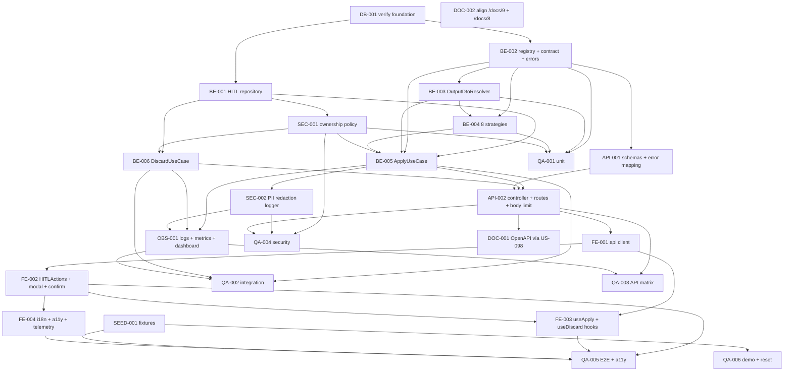

# Development Tasks — PB-P1-016 / US-025: Aplicar, editar o descartar una sugerencia IA (HITL transversal)

## 1. Metadata

| Field | Value |
|---|---|
| User Story ID | US-025 |
| Source User Story | `management/user-stories/US-025-accept-edit-discard-ai-suggestion.md` |
| Source Technical Specification | `management/technical-specs/P1/PB-P1-016/US-025-technical-spec.md` |
| Decision Resolution Artifact | No aplica |
| Priority | P1 |
| Backlog ID | PB-P1-016 |
| Backlog Title | HITL Accept / Edit / Discard transversal |
| Backlog Execution Order | 34 (P0: 18 + posición 16 en P1) |
| User Story Position in Backlog Item | 1 de 1 |
| Related User Stories in Backlog Item | US-025 |
| Epic | EPIC-AIP-001 — AI-Assisted Event Planning |
| Backlog Item Dependencies | PB-P0-010 (fundación AI). Consumido por PB-P1-012..015, PB-P1-017, PB-P1-030 |
| Feature | HITL transversal sobre `AIRecommendation` |
| Module / Domain | AI / Cross-cutting |
| Backlog Alignment Status | Found |
| Task Breakdown Status | Ready for Sprint Planning |
| Created Date | 2026-06-26 |
| Last Updated | 2026-06-26 |

---

## 2. Source Validation

| Source | Found | Used | Notes |
|---|---|---|---|
| User Story | Yes | Yes | Approved with Minor Notes; HITL canónico; 6 AC, 8 EC, 9 VR, 9 SEC. |
| Technical Specification | Yes | Yes | Ready for Task Breakdown; fuente primaria. |
| Decision Resolution Artifact | No | No | Decisiones HITL formalizadas en `BR-AI-001..004`, `FR-AI-019`, PO 8.1 nota canónica, `/docs/16` §35.3. |
| Product Backlog Prioritized | Yes | Yes | PB-P1-016; deps PB-P0-010; consumido por PB-P1-012..015, PB-P1-017, PB-P1-030. |
| ADRs | Yes | Yes | ADR-AI-001 (tangencial: HITL no invoca LLM). |

---

## 3. Backlog Execution Context

### Parent Backlog Item

`PB-P1-016` — API y UX común para que el usuario actúe sobre cualquier `AIRecommendation`. Define los endpoints canónicos `POST /api/v1/ai-recommendations/:id/apply` y `POST /api/v1/ai-recommendations/:id/discard`, el strategy registry de side effects por `type` (8 tipos MVP) y el componente reusable `HITLActions`. No introduce migraciones nuevas; reusa columnas y enums sembrados por la fundación AI-001 (`US-017`, `/docs/18`).

### Execution Order Rationale

Se ejecuta inmediatamente después de los flujos de generación IA (`US-017..US-021`) porque:

* Los flujos de generación persisten `AIRecommendation { status='pending' }` y delegan explícitamente el cierre HITL a esta historia.
* `US-021` (procesada previamente) y `US-020` referencian explícitamente estos endpoints para descarte y click-through.
* Cualquier integración HITL adicional (`US-022`, `US-023`, `US-024`, `US-031`) depende del strategy registry definido aquí.
* No introduce migraciones nuevas: reusa columnas y enums sembrados por la fundación AI-001 (`US-017`, `/docs/18`).

### Related User Stories in Same Backlog Item

| User Story | Role in Backlog Item | Suggested Order |
|---|---|---|
| US-025 | Único integrante de PB-P1-016: define la API HITL transversal, el strategy registry y el componente reusable `HITLActions` | 1 |

---

## 4. Task Breakdown Summary

| Area | Number of Tasks | Notes |
|---|---:|---|
| Database / Prisma (DB) | 1 | Verificación de enums/columnas/índices; check constraint opcional (sin migraciones nuevas). |
| Backend (BE) | 6 | Repository HITL, registry + contract + errors, `OutputDtoResolver`, 8 strategies, use cases `Apply`/`Discard`. |
| API Contract (API) | 2 | Schemas Zod + error mapping; controller + routes + body limit 256KB. |
| Security / Authorization (SEC) | 2 | `AIRecommendationOwnershipPolicy` + admin-exclusión + no-revelación; redacción PII en logs reusando `OrganizerPiiDetector`. |
| Frontend (FE) | 4 | Cliente API, `HITLActions` + `HITLEditModal` + `HITLConfirmDiscardDialog`, hooks `useApply`/`useDiscard` con invalidación, i18n + a11y + telemetría. |
| Observability / Audit (OBS) | 1 | 6 logs estructurados + 4 métricas + dashboard "HITL Adoption". |
| QA / Testing (QA) | 6 | Unit, integration (atomicidad + concurrencia + rollback), API matrix, security (roles × types + no-revelación + PII), E2E + a11y, seed/demo. |
| Seed / Demo (SEED) | 1 | Verificación de fixtures con `AIRecommendation pending` por tipo para flujos demo. |
| Documentation / Traceability (DOC) | 2 | OpenAPI snapshot vía `US-098`; alineación `/docs/9` (FR-AI-019/018) y `/docs/8` (UC-AI-002 ancla). |
| **Total** | **25** | |

---

## 5. Traceability Matrix

| Acceptance Criterion | Technical Spec Section | Task IDs |
|---|---|---|
| AC-01: Apply sin edición | §7 UseCase, §10 DB | BE-001, BE-002, BE-003, BE-004, BE-005, API-001, API-002, QA-001, QA-002, QA-003 |
| AC-02: Apply con `editedPayload` válido | §7 Validation, §11 Input Schema | BE-003, BE-005, API-001, QA-001, QA-002 |
| AC-03: Discard | §7 UseCase Discard | BE-001, BE-006, API-001, API-002, QA-001, QA-002, QA-003 |
| AC-04: Trazabilidad bidireccional | §7 Persistence, §10 DB | BE-001, BE-004, BE-005, QA-002 |
| AC-05: Strategy extensible | §7 Registry, §17 Risks | BE-002, BE-004, QA-001, QA-003 |
| AC-06: Idioma propagado en logs | §14 Observability | OBS-001, QA-002 |
| EC-01: No pending | §6 EC-01, §10 DB | BE-001, BE-005, BE-006, QA-002, QA-003 |
| EC-02: Ajena | §12 OwnershipPolicy | SEC-001, QA-004 |
| EC-03: Schema inválido | §7 Validation | BE-003, BE-005, API-001, QA-003 |
| EC-04: Side effect falla | §7 Transactions | BE-005, OBS-001, QA-002 |
| EC-05: Type sin strategy | §7 Registry | BE-002, BE-005, QA-001, QA-003 |
| EC-06: Payload >256KB | §7 Controllers, §17 Risks | API-002, QA-003 |
| EC-07: Concurrencia | §10 DB, §13 Integration | BE-001, BE-005, QA-002 |
| EC-08: Discard con body | §7 Controllers | API-002, QA-003 |
| VR-01..09 | §7 DTOs, §9 API | API-001, API-002, BE-005, BE-006 |
| SEC-01..09 | §12 Security | SEC-001, SEC-002, OBS-001, QA-004 |
| AUTH-TS-01..06 | §12 Negative Authz | SEC-001, QA-004 |
| AI-TS-01..07 | §13 AI Tests | QA-001, QA-002, QA-004 |
| Accesibilidad | §8 Accessibility | FE-002, FE-004, QA-005 |
| Documentation Alignment | §16 | DOC-001, DOC-002 |

Every Acceptance Criterion mapea al menos a una tarea.

---

## 6. Development Tasks

### TASK-PB-P1-016-US-025-DB-001 — Verificar fundación `ai_recommendations`, enum y check constraint

| Field | Value |
|---|---|
| Area | Database / Prisma |
| Type | Setup |
| Priority | Must |
| Estimate | XS |
| Depends On | PB-P0-010 |
| Source AC(s) | AC-01, AC-03, AC-04, EC-01, EC-07 |
| Technical Spec Section(s) | §10 DB |
| Backlog ID | PB-P1-016 |
| User Story ID | US-025 |
| Owner Role | Backend |
| Status | To Do |

#### Objective

Confirmar que `ai_recommendation_status` incluye `pending|accepted|rejected|discarded|failed|expired`, que las columnas `edited`, `applied_entity_type`, `applied_entity_id`, `decided_by_user_id`, `decided_at`, `correlation_id` están disponibles, que el índice `ai_recommendations(requested_by_user_id, status, created_at)` existe y registrar (si no existe) la check constraint sugerida en §10.

#### Scope

##### Include

* Inspección de `prisma/schema.prisma` y migraciones de `US-017`.
* Verificación de presencia y default del enum.
* Documentación de la check constraint `status='accepted' ⇒ applied_entity_type IS NOT NULL OR type IN ('vendor_categories','quote_brief','quote_comparison')`.

##### Exclude

* Crear migraciones nuevas para columnas o enums.
* Renombrar identificadores existentes.

#### Implementation Notes

* No se requieren cambios estructurales; solo verificación y, si aplica, documentación de la check constraint para futura migración no bloqueante.

#### Acceptance Criteria Covered

* AC-01, AC-03, AC-04, EC-01, EC-07 (preparatoria).

#### Definition of Done

- [ ] Verificación documentada en PR.
- [ ] Gaps escalados si aplica.
- [ ] Decisión registrada respecto a la check constraint (aplicar como migración separada o diferir).

---

### TASK-PB-P1-016-US-025-BE-001 — Implementar `AIRecommendationHITLRepository`

| Field | Value |
|---|---|
| Area | Backend |
| Type | Implementation |
| Priority | Must |
| Estimate | S |
| Depends On | TASK-PB-P1-016-US-025-DB-001 |
| Source AC(s) | AC-01, AC-03, AC-04, EC-01, EC-07 |
| Technical Spec Section(s) | §7 Repository / Persistence |
| Backlog ID | PB-P1-016 |
| User Story ID | US-025 |
| Owner Role | Backend |
| Status | To Do |

#### Objective

Implementar `AIRecommendationHITLRepository` con `findOwnedById(id, actorId)`, `markAccepted(tx, ...)` y `markDiscarded(tx, ...)` usando `UPDATE ... WHERE id=? AND status='pending'` para idempotencia natural.

#### Scope

##### Include

* `findOwnedById(id, actorId)`: filtra por `requested_by_user_id`.
* `markAccepted(tx, { id, finalOutput, edited, appliedEntityType?, appliedEntityId?, actorId })` con retorno `{ updatedCount }`.
* `markDiscarded(tx, { id, actorId })` con retorno `{ updatedCount }`.
* Unit tests con Prisma test client + transacción.

##### Exclude

* Lógica de strategies.
* Composición transaccional con side effects (en BE-005).

#### Implementation Notes

* La transacción la inyecta el caller (`tx: Prisma.TransactionClient`).
* `updatedCount=0` señaliza conflicto (estado no `pending`).

#### Acceptance Criteria Covered

* AC-01, AC-03, AC-04, EC-01, EC-07.

#### Definition of Done

- [ ] Repository implementado con cobertura ≥ 90%.
- [ ] Tests de `WHERE status='pending'` verdes para los caminos terminales.

---

### TASK-PB-P1-016-US-025-BE-002 — `AIRecommendationApplyStrategyRegistry` + contrato + errores tipados

| Field | Value |
|---|---|
| Area | Backend |
| Type | Implementation |
| Priority | Must |
| Estimate | S |
| Depends On | TASK-PB-P1-016-US-025-DB-001 |
| Source AC(s) | AC-05, EC-05 |
| Technical Spec Section(s) | §7 Modules, §7 Use Cases, §17 Risks |
| Backlog ID | PB-P1-016 |
| User Story ID | US-025 |
| Owner Role | Backend |
| Status | To Do |

#### Objective

Definir el contrato `ApplyStrategy<T extends AIRecommendationType>` y el `AIRecommendationApplyStrategyRegistry` con `register(type, strategy)` y `resolve(type)`. Implementar los errores tipados (`RecommendationNotPendingError`, `RecommendationTypeNotApplicableError`, `EditedPayloadInvalidError`, `SideEffectFailedError`, `OwnershipDeniedError`).

#### Scope

##### Include

* Interface `ApplyStrategy` con `applyInTransaction(tx, recommendation, finalOutput)` y `appliedEntityResolver?`.
* Registry con detección de duplicados y test que enumera el enum `ai_recommendation_type` para garantizar cobertura completa.
* Errores con `code`, `httpStatus` y `correlationId` opcional.

##### Exclude

* Implementaciones concretas de strategies (en BE-004).

#### Implementation Notes

* El registry debe ser instanciado vía DI con todas las strategies inyectadas.
* El test de cobertura de tipos se ejecuta en CI y bloquea si un nuevo `type` no está registrado.

#### Acceptance Criteria Covered

* AC-05, EC-05.

#### Definition of Done

- [ ] Registry + contract + errores implementados.
- [ ] Test de enumeración del enum verde.
- [ ] Errores mapeables por error-handler centralizado.

---

### TASK-PB-P1-016-US-025-BE-003 — Implementar `OutputDtoResolver` con unión dinámica de `*OutputDto`

| Field | Value |
|---|---|
| Area | Backend |
| Type | Implementation |
| Priority | Must |
| Estimate | S |
| Depends On | TASK-PB-P1-016-US-025-BE-002 |
| Source AC(s) | AC-02, EC-03 |
| Technical Spec Section(s) | §7 DTOs / Schemas, §9 API Contract |
| Backlog ID | PB-P1-016 |
| User Story ID | US-025 |
| Owner Role | Backend |
| Status | To Do |

#### Objective

Implementar `OutputDtoResolver.schemaFor(type)` que devuelve el `*OutputDto` Zod registrado por cada feature IA (`EventPlanOutputDto`, `EventChecklistOutputDto`, `BudgetSuggestionOutputDto`, `VendorCategoriesOutputDto`, `QuoteBriefOutputDto`, `QuoteComparisonOutputDto`, `VendorBioOutputDto`, `TaskPrioritizationOutputDto`).

#### Scope

##### Include

* Resolver con map `type → Zod schema`.
* Importación canónica desde cada US dueña (los schemas viven en sus módulos respectivos).
* Tests por `type` (8 escenarios) y caso `unknown` (devuelve `null` o lanza error tipado).

##### Exclude

* Definición o modificación de los `*OutputDto` (responsabilidad de cada US dueña).

#### Implementation Notes

* Si un `*OutputDto` aún no existe en la base de código, declarar interfaz local como placeholder y marcar TODO con dependencia hacia la US dueña.

#### Acceptance Criteria Covered

* AC-02, EC-03.

#### Definition of Done

- [ ] Resolver implementado con los 8 tipos mapeados.
- [ ] Tests verdes; cobertura del `unknown` case.

---

### TASK-PB-P1-016-US-025-BE-004 — Implementar 8 `ApplyStrategy` (delegan a repositorios de cada US dueña)

| Field | Value |
|---|---|
| Area | Backend |
| Type | Implementation |
| Priority | Must |
| Estimate | M |
| Depends On | TASK-PB-P1-016-US-025-BE-002, TASK-PB-P1-016-US-025-BE-003 |
| Source AC(s) | AC-01, AC-04, AC-05 |
| Technical Spec Section(s) | §7 Strategies, §10 DB Models Impacted |
| Backlog ID | PB-P1-016 |
| User Story ID | US-025 |
| Owner Role | Backend |
| Status | To Do |

#### Objective

Implementar las 8 strategies MVP (`event_plan`, `checklist`, `budget_suggestion`, `vendor_categories`, `quote_brief`, `quote_comparison`, `vendor_bio`, `task_prioritization`) delegando los efectos a los repositorios de cada US dueña y poblando trazabilidad bidireccional (`applied_entity_type`, `applied_entity_id`, `ai_recommendation_id` en la entidad destino cuando aplique).

#### Scope

##### Include

* Esqueletos de las 8 strategies con interfaces locales por repositorio destino cuando aún no existen.
* `event_plan` → delega a `EventAiPlanRepository` (US-017).
* `checklist` → delega a `EventTaskRepository.createMany` (US-018); `applied_entity_*` queda en `NULL` (múltiples entidades).
* `budget_suggestion` → delega a `BudgetItemRepository.createMany` (US-019); `applied_entity_*` en `NULL`.
* `vendor_categories` → no materializa entidad; registra adopción/click-through (US-020).
* `quote_brief` → marca el brief como listo; la creación de `QuoteRequest` queda en `US-023`/`PB-P1-030`.
* `quote_comparison` → no materializa entidad; registra adopción.
* `vendor_bio` → delega a `VendorProfileRepository`/`VendorServiceRepository` (US-024).
* `task_prioritization` → actualiza `EventTask.priority` (US-031).
* Tests unitarios por strategy con mock del repositorio.

##### Exclude

* Implementar los repositorios destino (responsabilidad de cada US dueña).
* Editar entidades fuera del scope del side effect declarado.

#### Implementation Notes

* Cada strategy es inyectable y registrada vía DI.
* Lint custom que prohíba operaciones de repositorio fuera de `$transaction` dentro de strategies (riesgo §17).

#### Acceptance Criteria Covered

* AC-01, AC-04, AC-05.

#### Definition of Done

- [ ] 8 strategies con tests unitarios verdes.
- [ ] Trazabilidad bidireccional verificada para los `type` con entidad única.
- [ ] Test del registry confirma que las 8 strategies están registradas.

---

### TASK-PB-P1-016-US-025-BE-005 — `ApplyAIRecommendationUseCase` con `prismaService.$transaction`

| Field | Value |
|---|---|
| Area | Backend |
| Type | Implementation |
| Priority | Must |
| Estimate | M |
| Depends On | TASK-PB-P1-016-US-025-BE-001, TASK-PB-P1-016-US-025-BE-002, TASK-PB-P1-016-US-025-BE-003, TASK-PB-P1-016-US-025-BE-004, TASK-PB-P1-016-US-025-SEC-001 |
| Source AC(s) | AC-01, AC-02, AC-04, AC-05, AC-06, EC-01, EC-03, EC-04, EC-05, EC-06, EC-07 |
| Technical Spec Section(s) | §7 Use Cases, §7 Transactions, §11 AI Safety |
| Backlog ID | PB-P1-016 |
| User Story ID | US-025 |
| Owner Role | Backend |
| Status | To Do |

#### Objective

Orquestar el flujo `apply`: cargar la `AIRecommendation` con `OwnershipPolicy`, resolver la strategy por `type`, validar `editedPayload` con `OutputDtoResolver.schemaFor(type)` cuando se provee, ejecutar `prismaService.$transaction(async (tx) => { strategy.applyInTransaction(tx, ...); repo.markAccepted(tx, ...) })` y emitir log estructurado.

#### Scope

##### Include

* Validación de `editedPayload` y marca `edited=true`.
* `markAccepted` con `WHERE status='pending'`; si `updatedCount=0`, lanza `RecommendationNotPendingError`.
* Recolección de `appliedEntityType`/`appliedEntityId` desde la strategy.
* Persistencia de log `ai.recommendation.applied` con `latency_ms`, `correlation_id`, `language_code`, `actorId`, `type`, `edited`.
* Manejo de errores (rollback automático ⇒ `SideEffectFailedError` con `5xx`).

##### Exclude

* Implementación del controller (en API-002).
* Mapping HTTP de errores (en API-001).

#### Implementation Notes

* `language_code` se lee desde `AIRecommendation.language_code` (propagado por la generación).
* La transacción debe envolver side effect + update; no se permiten operaciones fuera de la transacción.

#### Acceptance Criteria Covered

* AC-01, AC-02, AC-04, AC-05, AC-06, EC-01, EC-03, EC-04, EC-05, EC-06, EC-07.

#### Definition of Done

- [ ] Use case implementado con cobertura ≥ 90%.
- [ ] Tests verdes para happy path, conflict (409), schema-invalid (400), type unsupported (422), rollback (5xx).
- [ ] Logs emitidos con todos los campos requeridos.

---

### TASK-PB-P1-016-US-025-BE-006 — `DiscardAIRecommendationUseCase`

| Field | Value |
|---|---|
| Area | Backend |
| Type | Implementation |
| Priority | Must |
| Estimate | S |
| Depends On | TASK-PB-P1-016-US-025-BE-001, TASK-PB-P1-016-US-025-SEC-001 |
| Source AC(s) | AC-03, AC-06, EC-01, EC-02, EC-08 |
| Technical Spec Section(s) | §7 Use Cases, §6 Functional Interpretation |
| Backlog ID | PB-P1-016 |
| User Story ID | US-025 |
| Owner Role | Backend |
| Status | To Do |

#### Objective

Implementar el flujo `discard`: ownership policy, `UPDATE ai_recommendations SET status='discarded', decided_by_user_id=?, decided_at=NOW() WHERE id=? AND status='pending'`, log `ai.recommendation.discarded` y respuesta `204`.

#### Scope

##### Include

* Resolución de ownership previa al update.
* `markDiscarded` con `WHERE status='pending'`; si `updatedCount=0`, lanza `RecommendationNotPendingError`.
* Log `ai.recommendation.discarded` con `correlation_id`, `actorId`, `type`, `language_code`.
* Test que verifica que el body se ignora (EC-08).

##### Exclude

* Side effects (por diseño, `discard` no los tiene).
* Mapping HTTP en el controller.

#### Implementation Notes

* `discard` no requiere transacción explícita salvo la del propio `UPDATE`.

#### Acceptance Criteria Covered

* AC-03, AC-06, EC-01, EC-02, EC-08.

#### Definition of Done

- [ ] Use case implementado y testeado.
- [ ] Conflict 409 cubierto para todos los estados terminales.

---

### TASK-PB-P1-016-US-025-API-001 — Zod schemas + error mapping

| Field | Value |
|---|---|
| Area | API Contract |
| Type | Implementation |
| Priority | Must |
| Estimate | S |
| Depends On | TASK-PB-P1-016-US-025-BE-002 |
| Source AC(s) | AC-02, EC-03, EC-05, EC-06, VR-01..09 |
| Technical Spec Section(s) | §7 DTOs/Schemas, §9 API Contract Design, §12 Error Codes |
| Backlog ID | PB-P1-016 |
| User Story ID | US-025 |
| Owner Role | Backend |
| Status | To Do |

#### Objective

Definir `aiRecommendationIdParamSchema`, `applyRequestBodySchema`, `AIRecommendationResponseDto`, y el error-handler que mapea los errores tipados (`RecommendationNotPendingError` → 409 `RECOMMENDATION_NOT_PENDING`, `RecommendationTypeNotApplicableError` → 422 `RECOMMENDATION_TYPE_NOT_APPLICABLE`, `EditedPayloadInvalidError` → 400 `EDITED_PAYLOAD_INVALID`, `SideEffectFailedError` → 5xx `SIDE_EFFECT_FAILED`, `OwnershipDeniedError(not_owner)` → 404 `NOT_FOUND`, `OwnershipDeniedError(admin_excluded)` → 403 `FORBIDDEN`).

#### Scope

##### Include

* Schemas Zod tipados.
* Serializador `AIRecommendationResponseDto`.
* Envelope de error con `code`, `message`, `correlationId`, `details?`.

##### Exclude

* Validación fuerte de `editedPayload` por `type` (en BE-005 vía resolver).

#### Acceptance Criteria Covered

* AC-02, EC-03, EC-05, EC-06, VR-01..09.

#### Definition of Done

- [ ] Schemas + DTO + error-handler implementados.
- [ ] Tests de mapping para cada error code.

---

### TASK-PB-P1-016-US-025-API-002 — Controller `AIRecommendationHITLController` + routes + middleware body limit 256KB

| Field | Value |
|---|---|
| Area | API Contract |
| Type | Implementation |
| Priority | Must |
| Estimate | S |
| Depends On | TASK-PB-P1-016-US-025-BE-005, TASK-PB-P1-016-US-025-BE-006, TASK-PB-P1-016-US-025-API-001 |
| Source AC(s) | AC-01, AC-02, AC-03, EC-06, EC-08 |
| Technical Spec Section(s) | §7 Controllers/Routes, §9 API Contract Design, §17 Risks (body limit) |
| Backlog ID | PB-P1-016 |
| User Story ID | US-025 |
| Owner Role | Backend |
| Status | To Do |

#### Objective

Implementar `AIRecommendationHITLController.apply` y `.discard`, registrar el subrouter Express con `express.json({ limit: '256kb' })` scoped (solo `/apply` parsea body; `/discard` no parsea), y exponer las rutas canónicas `/api/v1/ai-recommendations/:aiRecommendationId/(apply|discard)`.

#### Scope

##### Include

* Thin controllers que delegan en los use cases.
* Body limit aplicado vía subrouter, NO global.
* Manejo del header `correlation-id` (heredado o generado).
* Test que envía 257KB y verifica `413 PAYLOAD_TOO_LARGE`.

##### Exclude

* Lógica de negocio (use cases).
* Logging detallado (en OBS-001).

#### Acceptance Criteria Covered

* AC-01, AC-02, AC-03, EC-06, EC-08.

#### Definition of Done

- [ ] Endpoints respondiendo con códigos correctos.
- [ ] Body limit aislado al subrouter.
- [ ] Test de 257KB → 413 verde.

---

### TASK-PB-P1-016-US-025-SEC-001 — `AIRecommendationOwnershipPolicy` con admin-exclusión y no-revelación

| Field | Value |
|---|---|
| Area | Security / Authorization |
| Type | Implementation |
| Priority | Must |
| Estimate | S |
| Depends On | TASK-PB-P1-016-US-025-BE-001 |
| Source AC(s) | EC-02, SEC-01..04, SEC-08 |
| Technical Spec Section(s) | §12 Security & Authorization Design |
| Backlog ID | PB-P1-016 |
| User Story ID | US-025 |
| Owner Role | Backend |
| Status | To Do |

#### Objective

Implementar `AIRecommendationOwnershipPolicy.assertOwnership({ aiRecommendation, actor })` que verifica `actor.id === requested_by_user_id`, rechaza rol `admin` con `OwnershipDeniedError('admin_excluded')` (→ 403) y rechaza no-dueños con `OwnershipDeniedError('not_owner')` (→ 404 no-revelación).

#### Scope

##### Include

* Policy unitaria con matriz roles × ownership.
* Distinción entre admin-excluded (403) y not-owner (404).
* Validación de que la respuesta `404` para ajena es indistinguible de `404` inexistente (mismo body).
* Tests por escenario (organizer dueño, organizer ajeno, vendor dueño, vendor ajeno, admin, anónimo).

##### Exclude

* Tests del endpoint completo (en QA-004).

#### Acceptance Criteria Covered

* EC-02, SEC-01..04, SEC-08.

#### Definition of Done

- [ ] Policy implementada con tests verdes.
- [ ] No-revelación verificada (respuesta idéntica para ajena vs inexistente).

---

### TASK-PB-P1-016-US-025-SEC-002 — Redacción PII en logs reusando `OrganizerPiiDetector`

| Field | Value |
|---|---|
| Area | Security / Authorization |
| Type | Implementation |
| Priority | Must |
| Estimate | XS |
| Depends On | TASK-PB-P1-016-US-025-BE-005 |
| Source AC(s) | SEC-05 |
| Technical Spec Section(s) | §12 Sensitive Data, §14 Logs |
| Backlog ID | PB-P1-016 |
| User Story ID | US-025 |
| Owner Role | Backend |
| Status | To Do |

#### Objective

Integrar `OrganizerPiiDetector.redact()` (provisto por US-021) en el logger del módulo HITL para redactar email/teléfono/dirección antes de loguear `editedPayload` o `zodIssues` en eventos de error.

#### Scope

##### Include

* Wrapper de logger que aplica `OrganizerPiiDetector.redact()` al payload antes de serializar.
* Test que emite un log de error con PII y verifica `[REDACTED]`.

##### Exclude

* Re-implementación del detector (vive en US-021).
* Logs sin PII potencial (paths felices).

#### Acceptance Criteria Covered

* SEC-05.

#### Definition of Done

- [ ] Logger envuelto.
- [ ] Test de redacción verde.

---

### TASK-PB-P1-016-US-025-OBS-001 — Logs estructurados + métricas Prometheus + dashboard "HITL Adoption"

| Field | Value |
|---|---|
| Area | Observability / Audit |
| Type | Implementation |
| Priority | Must |
| Estimate | S |
| Depends On | TASK-PB-P1-016-US-025-BE-005, TASK-PB-P1-016-US-025-BE-006, TASK-PB-P1-016-US-025-SEC-002 |
| Source AC(s) | AC-04, AC-06, SEC-06 |
| Technical Spec Section(s) | §14 Observability & Audit |
| Backlog ID | PB-P1-016 |
| User Story ID | US-025 |
| Owner Role | Backend |
| Status | To Do |

#### Objective

Emitir los 6 logs canónicos (`ai.recommendation.applied|discarded|apply_failed|type_unsupported|conflict|payload_invalid`) con `correlation_id`, `actorId`, `type`, `language_code`; exponer las 4 métricas Prometheus (`hitl_apply_total`, `hitl_discard_total`, `hitl_apply_failure_total`, `hitl_apply_latency_ms`); construir el dashboard "HITL Adoption" (apply/discard ratio por `type`, P50/P95 latencia, error rate) y alerta sobre `hitl_apply_failure_total`.

#### Scope

##### Include

* 6 eventos logueados desde use cases y controller.
* Registro de las 4 métricas con labels por `type` (`edited`/`error_code` cuando aplica).
* Dashboard Grafana (o equivalente).
* Alerta sobre fallas sostenidas en `hitl_apply_failure_total`.

##### Exclude

* Cambios al stack de observabilidad.
* Métricas no listadas.

#### Acceptance Criteria Covered

* AC-04, AC-06, SEC-06.

#### Definition of Done

- [ ] Logs y métricas operativos.
- [ ] Dashboard publicado.
- [ ] Alerta validada en staging.

---

### TASK-PB-P1-016-US-025-FE-001 — Cliente API `aiApi.applyRecommendation` / `aiApi.discardRecommendation`

| Field | Value |
|---|---|
| Area | Frontend |
| Type | Implementation |
| Priority | Must |
| Estimate | XS |
| Depends On | TASK-PB-P1-016-US-025-API-002 |
| Source AC(s) | AC-01, AC-02, AC-03 |
| Technical Spec Section(s) | §8 Data Fetching, §9 API Contract |
| Backlog ID | PB-P1-016 |
| User Story ID | US-025 |
| Owner Role | Frontend |
| Status | To Do |

#### Objective

Extender `frontend/src/lib/api/ai-api.ts` con `applyRecommendation(id, { editedPayload? })` y `discardRecommendation(id)`, tipados contra `AIRecommendationResponseDto`.

#### Scope

##### Include

* Funciones tipadas; manejo de errores con `error.code`.
* Tests con MSW para 200, 204, 409, 422, 413.

##### Exclude

* Hooks de TanStack Query (en FE-003).

#### Acceptance Criteria Covered

* AC-01, AC-02, AC-03.

#### Definition of Done

- [ ] Cliente API implementado y testeado.

---

### TASK-PB-P1-016-US-025-FE-002 — `HITLActions` + `HITLEditModal` + `HITLConfirmDiscardDialog`

| Field | Value |
|---|---|
| Area | Frontend |
| Type | Implementation |
| Priority | Must |
| Estimate | M |
| Depends On | TASK-PB-P1-016-US-025-FE-001 |
| Source AC(s) | AC-01, AC-02, AC-03, EC-04 |
| Technical Spec Section(s) | §8 Components, §8 Forms, §8 Accessibility |
| Backlog ID | PB-P1-016 |
| User Story ID | US-025 |
| Owner Role | Frontend |
| Status | To Do |

#### Objective

Implementar el componente reusable `HITLActions { recommendation, onApplied?, onDiscarded?, EditorComponent? }`, el `HITLEditModal` genérico (envuelve el editor específico por `type`) y `HITLConfirmDiscardDialog`. Incluir orden de tab `Aplicar → Editar → Descartar`, captura/restauración de foco en el modal, `aria-label` explícitos y `aria-live="polite"` para anunciar resultados.

#### Scope

##### Include

* Botonera con estados loading/disabled.
* Modal genérico que recibe el `EditorComponent` provisto por la US dueña.
* Diálogo de confirmación para descarte.
* Atributos ARIA + contraste AA + tab order.

##### Exclude

* Editores concretos por `type` (responsabilidad de cada US dueña).
* Integración en vistas existentes (puede hacerse por oleadas con cada US).

#### Acceptance Criteria Covered

* AC-01, AC-02, AC-03, EC-04 (sin auto-recovery; preserva `editedPayload` local).

#### Definition of Done

- [ ] Componentes funcionales en Storybook (o equivalente).
- [ ] axe sin violaciones bloqueantes.
- [ ] Tests RTL básicos.

---

### TASK-PB-P1-016-US-025-FE-003 — Hooks `useApplyAIRecommendation` / `useDiscardAIRecommendation` con invalidación

| Field | Value |
|---|---|
| Area | Frontend |
| Type | Implementation |
| Priority | Must |
| Estimate | S |
| Depends On | TASK-PB-P1-016-US-025-FE-001, TASK-PB-P1-016-US-025-FE-002 |
| Source AC(s) | AC-01, AC-02, AC-03 |
| Technical Spec Section(s) | §8 State Management |
| Backlog ID | PB-P1-016 |
| User Story ID | US-025 |
| Owner Role | Frontend |
| Status | To Do |

#### Objective

Implementar los hooks `useApplyAIRecommendation(aiRecommendationId, { invalidateQueryKeys })` y `useDiscardAIRecommendation(aiRecommendationId, { invalidateQueryKeys })` con TanStack Query `useMutation`, manejo de error (toast + `error.code` traducido) y resultado (toast éxito + invalidación de queries origen pasadas por el consumidor).

#### Scope

##### Include

* Hooks tipados contra `aiApi`.
* Tipos genéricos para `queryKey` (el consumidor pasa las keys a invalidar).
* Tests con MSW.

##### Exclude

* Lógica de UI (en FE-002).

#### Acceptance Criteria Covered

* AC-01, AC-02, AC-03.

#### Definition of Done

- [ ] Hooks implementados y testeados.
- [ ] Invalidación verificada por test.

---

### TASK-PB-P1-016-US-025-FE-004 — i18n `hitl.*` en 4 locales + accesibilidad + telemetría

| Field | Value |
|---|---|
| Area | Frontend |
| Type | Implementation |
| Priority | Must |
| Estimate | XS |
| Depends On | TASK-PB-P1-016-US-025-FE-002 |
| Source AC(s) | AC-01, AC-02, AC-03 |
| Technical Spec Section(s) | §8 i18n, §8 Accessibility |
| Backlog ID | PB-P1-016 |
| User Story ID | US-025 |
| Owner Role | Frontend |
| Status | To Do |

#### Objective

Proveer claves de traducción `hitl.actions.*`, `hitl.errors.*`, `hitl.toasts.*` en `es-LATAM`, `es-ES`, `pt`, `en`. Garantizar `aria-label` explícitos, `aria-live="polite"`, contraste AA y emitir telemetría frontend `hitl.action.{applied|discarded|edited_apply}` con `type`, `correlation_id`, `latencyMs`.

#### Scope

##### Include

* Claves i18n en los 4 locales.
* Telemetría frontend en CTAs.
* Test axe sobre `HITLActions` + `HITLEditModal`.

##### Exclude

* Cambios al pipeline `next-intl`.

#### Acceptance Criteria Covered

* AC-01, AC-02, AC-03 (UX/A11y).

#### Definition of Done

- [ ] Claves en 4 locales presentes.
- [ ] Lint i18n pasa.
- [ ] axe sin violaciones bloqueantes.
- [ ] Telemetría emitida en CTAs.

---

### TASK-PB-P1-016-US-025-QA-001 — Unit tests (registry, strategies, ownership policy, resolver, errores)

| Field | Value |
|---|---|
| Area | QA / Testing |
| Type | Test |
| Priority | Must |
| Estimate | M |
| Depends On | TASK-PB-P1-016-US-025-BE-002, TASK-PB-P1-016-US-025-BE-003, TASK-PB-P1-016-US-025-BE-004, TASK-PB-P1-016-US-025-SEC-001 |
| Source AC(s) | AC-01, AC-02, AC-04, AC-05, EC-05 |
| Technical Spec Section(s) | §13 Unit Tests |
| Backlog ID | PB-P1-016 |
| User Story ID | US-025 |
| Owner Role | QA |
| Status | To Do |

#### Objective

Cubrir unit tests de `AIRecommendationApplyStrategyRegistry`, las 8 strategies, `AIRecommendationOwnershipPolicy`, `OutputDtoResolver` y los errores tipados.

#### Scope

##### Include

* Registry: resolve happy + unknown lanza error tipado; test que enumera el enum.
* 8 strategies: cada una verifica la mutación esperada en el repositorio destino (mock).
* OwnershipPolicy: matriz de roles (6 escenarios).
* OutputDtoResolver: 8 tipos + unknown.
* Errores: serialización con `code`, `httpStatus`, `correlationId`.

##### Exclude

* Tests del endpoint completo (en QA-002/QA-003).

#### Acceptance Criteria Covered

* AC-01, AC-02, AC-04, AC-05, EC-05.

#### Definition of Done

- [ ] Suite unitaria verde con cobertura ≥ 90% en `modules/ai/recommendations/hitl/`.

---

### TASK-PB-P1-016-US-025-QA-002 — Integration tests (atomicidad, rollback, concurrencia)

| Field | Value |
|---|---|
| Area | QA / Testing |
| Type | Test |
| Priority | Must |
| Estimate | M |
| Depends On | TASK-PB-P1-016-US-025-BE-005, TASK-PB-P1-016-US-025-BE-006, TASK-PB-P1-016-US-025-OBS-001 |
| Source AC(s) | AC-01, AC-02, AC-03, AC-04, AC-06, EC-01, EC-04, EC-07 |
| Technical Spec Section(s) | §13 Integration Tests |
| Backlog ID | PB-P1-016 |
| User Story ID | US-025 |
| Owner Role | QA |
| Status | To Do |

#### Objective

Validar contra Postgres real (test DB) la atomicidad de `$transaction`, el rollback ante side effect fallido (EC-04 — `status` permanece `pending`), la idempotencia ante concurrencia (`Promise.all` con dos `apply` simultáneos → primero `200`, segundo `409`), y la propagación de `language_code` en logs.

#### Scope

##### Include

* AC-01: apply sin `editedPayload` para `checklist` crea N `EventTask` con `ai_recommendation_id`.
* AC-02: apply con `editedPayload` válido marca `edited=true`.
* AC-03: discard sin side effects.
* AC-06: log incluye `language_code`.
* EC-01: apply/discard sobre cada estado terminal → 409.
* EC-04: side effect lanza error ⇒ rollback ⇒ `status` permanece `pending`.
* EC-07: dos `apply` simultáneos con `Promise.all`.

##### Exclude

* Tests con UI (en QA-005).

#### Acceptance Criteria Covered

* AC-01, AC-02, AC-03, AC-04, AC-06, EC-01, EC-04, EC-07.

#### Definition of Done

- [ ] Suite verde en CI con DB real.
- [ ] Cobertura del happy path para los 8 tipos.

---

### TASK-PB-P1-016-US-025-QA-003 — API matrix tests (400/401/403/404/409/413/422/5xx + 204)

| Field | Value |
|---|---|
| Area | QA / Testing |
| Type | Test |
| Priority | Must |
| Estimate | M |
| Depends On | TASK-PB-P1-016-US-025-API-002, TASK-PB-P1-016-US-025-OBS-001 |
| Source AC(s) | AC-01, AC-03, AC-05, EC-01, EC-03, EC-05, EC-06, EC-08, VR-01..09 |
| Technical Spec Section(s) | §13 API Tests, §12 Error Codes |
| Backlog ID | PB-P1-016 |
| User Story ID | US-025 |
| Owner Role | QA |
| Status | To Do |

#### Objective

Cubrir el endpoint POST `/apply` y POST `/discard` con la matriz completa de respuestas: 200 happy + 204 discard + todos los códigos de error.

#### Scope

##### Include

* `apply` 200 happy con cada `type` (8 tests).
* `apply` 400 VALIDATION (path no UUID) + 400 EDITED_PAYLOAD_INVALID (schema mismatch).
* `apply` 401 anónimo, 403 admin, 404 ajena, 409 conflict.
* `apply` 413 con body 257KB.
* `apply` 422 con `type` deregistrado del registry (mockeado).
* `apply` 5xx con strategy mockeada para fallar.
* `discard` 204 happy, 409 conflict por cada estado terminal, 400 VALIDATION, 401, 403, 404.
* EC-08: `discard` con body es aceptado.

##### Exclude

* Tests E2E con UI (en QA-005).
* Tests de seguridad multi-rol (en QA-004).

#### Acceptance Criteria Covered

* AC-01, AC-03, AC-05, EC-01, EC-03, EC-05, EC-06, EC-08, VR-01..09.

#### Definition of Done

- [ ] Matriz completa cubierta en Supertest.
- [ ] Códigos de error consistentes con §9 API.

---

### TASK-PB-P1-016-US-025-QA-004 — Security tests (roles × types, no-revelación, PII redaction)

| Field | Value |
|---|---|
| Area | QA / Testing |
| Type | Test |
| Priority | Must |
| Estimate | S |
| Depends On | TASK-PB-P1-016-US-025-SEC-001, TASK-PB-P1-016-US-025-SEC-002, TASK-PB-P1-016-US-025-API-002 |
| Source AC(s) | EC-02, SEC-01..09, AUTH-TS-01..06 |
| Technical Spec Section(s) | §12 Negative Authorization, §12 Sensitive Data |
| Backlog ID | PB-P1-016 |
| User Story ID | US-025 |
| Owner Role | QA |
| Status | To Do |

#### Objective

Verificar la matriz de autorización roles × `type`, la no-revelación de IDs ajenos (respuesta `404` indistinguible de inexistente) y la redacción PII en logs de error.

#### Scope

##### Include

* Matriz roles (organizer/vendor/admin/anónimo) × `type` representativos (organizer-owned, vendor-owned).
* No-revelación: comparar bodies de `404` ajena vs inexistente.
* PII redaction: emitir log de error con email/teléfono/dirección y verificar `[REDACTED]`.
* Verificar `403` para admin y `404` para roles cruzados (vendor sobre organizer-owned y viceversa).

##### Exclude

* Penetration testing (fuera de scope).

#### Acceptance Criteria Covered

* EC-02, SEC-01..09, AUTH-TS-01..06.

#### Definition of Done

- [ ] Matriz cubierta.
- [ ] Test de PII redaction verde.
- [ ] Bodies de no-revelación verificados como idénticos.

---

### TASK-PB-P1-016-US-025-QA-005 — E2E Playwright + accesibilidad (2 flujos representativos)

| Field | Value |
|---|---|
| Area | QA / Testing |
| Type | Test |
| Priority | Must |
| Estimate | M |
| Depends On | TASK-PB-P1-016-US-025-FE-002, TASK-PB-P1-016-US-025-FE-003, TASK-PB-P1-016-US-025-FE-004, TASK-PB-P1-016-US-025-SEED-001 |
| Source AC(s) | AC-01, AC-02, AC-03 |
| Technical Spec Section(s) | §13 E2E Tests, §13 Accessibility Tests |
| Backlog ID | PB-P1-016 |
| User Story ID | US-025 |
| Owner Role | QA |
| Status | To Do |

#### Objective

E2E con seed y `MockAIProvider`: (1) organizer genera plan (US-017) → edita en modal → aplica → tareas/fases visibles; (2) organizer genera brief (US-021) → edita → aplica → handoff a US-023 (creación de `QuoteRequest`) o discard de categorías (US-020) → vista vuelve a estado vacío. Más axe sobre `HITLActions` + `HITLEditModal`.

#### Scope

##### Include

* 2 flujos representativos cubriendo apply con edición y discard.
* Test axe con Playwright.
* Verificación de invalidación de queries origen (la vista refleja el resultado sin recargar).
* Navegación por teclado completa.

##### Exclude

* Carga/performance.
* Flujos no canónicos.

#### Acceptance Criteria Covered

* AC-01, AC-02, AC-03 (E2E + a11y).

#### Definition of Done

- [ ] Playwright verde.
- [ ] axe sin violaciones bloqueantes.

---

### TASK-PB-P1-016-US-025-QA-006 — Verificación de demo + reset

| Field | Value |
|---|---|
| Area | QA / Testing |
| Type | Test |
| Priority | Should |
| Estimate | XS |
| Depends On | TASK-PB-P1-016-US-025-SEED-001 |
| Source AC(s) | AC-01, AC-03 |
| Technical Spec Section(s) | §15 Seed / Demo |
| Backlog ID | PB-P1-016 |
| User Story ID | US-025 |
| Owner Role | QA |
| Status | To Do |

#### Objective

Verificar que después del reset de demo, las fixtures `AIRecommendation pending` por cada `type` pueden ser aplicadas y descartadas sin errores, y que el flujo demo end-to-end queda en un estado consistente.

#### Scope

##### Include

* Smoke test post-reset.
* Verificación de cada `type` con apply y/o discard.

##### Exclude

* Cobertura exhaustiva (cubierta por QA-002/QA-005).

#### Acceptance Criteria Covered

* AC-01, AC-03 (demo readiness).

#### Definition of Done

- [ ] Demo verificada en local + staging.
- [ ] Reporte adjunto al PR.

---

### TASK-PB-P1-016-US-025-SEED-001 — Verificación de fixtures `AIRecommendation pending` por tipo

| Field | Value |
|---|---|
| Area | Seed / Demo Data |
| Type | Setup |
| Priority | Must |
| Estimate | XS |
| Depends On | PB-P0-010, PB-P1-011..015 |
| Source AC(s) | AC-01, AC-03 |
| Technical Spec Section(s) | §15 Seed / Demo Data Impact |
| Backlog ID | PB-P1-016 |
| User Story ID | US-025 |
| Owner Role | DevOps |
| Status | To Do |

#### Objective

Confirmar que el seed provee `AIRecommendation pending` por cada `type` MVP (al menos uno por `type`) para que el flujo demo de US-025 funcione sin generación previa. Esta US no crea seeds; solo verifica que las US dueñas los proveen.

#### Scope

##### Include

* Inspección del seed unificado.
* Mapping `type → fixture` documentado en el PR.
* Reset demo verificado.

##### Exclude

* Crear seeds nuevos (responsabilidad de cada US dueña).

#### Acceptance Criteria Covered

* AC-01, AC-03.

#### Definition of Done

- [ ] Verificación documentada.
- [ ] Gaps escalados a la US dueña correspondiente.

---

### TASK-PB-P1-016-US-025-DOC-001 — Coordinar snapshot OpenAPI con US-098

| Field | Value |
|---|---|
| Area | Documentation / Traceability |
| Type | Documentation |
| Priority | Should |
| Estimate | XS |
| Depends On | TASK-PB-P1-016-US-025-API-002 |
| Source AC(s) | AC-01, AC-03 |
| Technical Spec Section(s) | §9 API Contract Design, §16 Documentation Alignment |
| Backlog ID | PB-P1-016 |
| User Story ID | US-025 |
| Owner Role | Backend |
| Status | To Do |

#### Objective

Asegurar que el snapshot OpenAPI refleje los dos POST canónicos (`/apply` y `/discard`), el body `editedPayload?`, los códigos de error documentados y el `AIRecommendationResponseDto`.

#### Scope

##### Include

* Ticket o PR de coordinación con US-098.
* Validación del snapshot en CI.

##### Exclude

* Cambios fuera del scope del snapshot.

#### Acceptance Criteria Covered

* AC-01, AC-03 (alineación documental).

#### Definition of Done

- [ ] Snapshot actualizado o ticket abierto en US-098.

---

### TASK-PB-P1-016-US-025-DOC-002 — Alineación `/docs/9` (FR-AI-019/018) y `/docs/8` (UC-AI-002 ancla)

| Field | Value |
|---|---|
| Area | Documentation / Traceability |
| Type | Documentation |
| Priority | Should |
| Estimate | XS |
| Depends On | — |
| Source AC(s) | — |
| Technical Spec Section(s) | §16 Documentation Alignment |
| Backlog ID | PB-P1-016 |
| User Story ID | US-025 |
| Owner Role | Tech Lead |
| Status | To Do |

#### Objective

Aplicar cleanup editorial en `/docs/9-FRD.md` para reflejar la trazabilidad canónica `FR-AI-019` + `FR-AI-018` y aclaración liviana en `/docs/8-Use-Cases-Specification.md` indicando que el HITL transversal se ancla en `UC-AI-002` y aplica a `UC-AI-001..008`.

#### Scope

##### Include

* Ediciones livianas o notas de alineación.

##### Exclude

* Cambios en otras secciones de FRD/UCS.

#### Acceptance Criteria Covered

* — (alineación documental).

#### Definition of Done

- [ ] Cambios aplicados o PR abierto.

---

## 7. Required QA Tasks

| Task ID | Test Type | Purpose |
|---|---|---|
| TASK-PB-P1-016-US-025-QA-001 | Unit | Registry, strategies, ownership policy, resolver, errores. |
| TASK-PB-P1-016-US-025-QA-002 | Integration | Atomicidad, rollback, concurrencia, propagación de `language_code`. |
| TASK-PB-P1-016-US-025-QA-003 | API | Matriz completa de respuestas para `/apply` y `/discard`. |
| TASK-PB-P1-016-US-025-QA-004 | Security | Roles × types, no-revelación, PII redaction. |
| TASK-PB-P1-016-US-025-QA-005 | E2E + A11y | Flujos plan + brief/discard con axe. |
| TASK-PB-P1-016-US-025-QA-006 | Smoke / Demo | Reset demo + apply/discard por `type`. |

---

## 8. Required Security Tasks

| Task ID | Security Concern | Purpose |
|---|---|---|
| TASK-PB-P1-016-US-025-SEC-001 | Ownership + admin-exclusión + no-revelación | Bloqueo de ajenas (404) y admin (403); respuesta indistinguible para ajena vs inexistente. |
| TASK-PB-P1-016-US-025-SEC-002 | PII redaction en logs | Reuso de `OrganizerPiiDetector` para redactar email/teléfono/dirección antes de loguear. |
| TASK-PB-P1-016-US-025-QA-004 | Tests de seguridad | Matriz roles × types + no-revelación + PII redaction. |

---

## 9. Required Seed / Demo Tasks

| Task ID | Seed/Demo Concern | Purpose |
|---|---|---|
| TASK-PB-P1-016-US-025-SEED-001 | Fixtures `AIRecommendation pending` por `type` | Habilitar QA-005 y demo end-to-end sin generación previa. |

---

## 10. Observability / Audit Tasks

| Task ID | Concern | Purpose |
|---|---|---|
| TASK-PB-P1-016-US-025-OBS-001 | 6 logs estructurados + 4 métricas + dashboard "HITL Adoption" | Cumplir NFR-OBS-001..003, AC-04, AC-06 y SEC-06; alerta sobre `hitl_apply_failure_total`. |

---

## 11. Documentation / Traceability Tasks

| Task ID | Document / Artifact | Purpose |
|---|---|---|
| TASK-PB-P1-016-US-025-DOC-001 | `/docs/16` (OpenAPI vía US-098) | Documentation Alignment Required. |
| TASK-PB-P1-016-US-025-DOC-002 | `/docs/9` (FR-AI-019/018) + `/docs/8` (UC-AI-002 ancla) | Documentation Alignment Required. |

---

## 12. Dependency Graph

---

## 13. Suggested Implementation Order

### Phase 1 — Foundation

* TASK-PB-P1-016-US-025-DB-001
* TASK-PB-P1-016-US-025-BE-001
* TASK-PB-P1-016-US-025-BE-002
* TASK-PB-P1-016-US-025-BE-003
* TASK-PB-P1-016-US-025-SEC-001
* TASK-PB-P1-016-US-025-API-001
* TASK-PB-P1-016-US-025-SEED-001

### Phase 2 — Core Implementation

* TASK-PB-P1-016-US-025-BE-004
* TASK-PB-P1-016-US-025-BE-005
* TASK-PB-P1-016-US-025-BE-006
* TASK-PB-P1-016-US-025-API-002
* TASK-PB-P1-016-US-025-SEC-002
* TASK-PB-P1-016-US-025-OBS-001
* TASK-PB-P1-016-US-025-FE-001
* TASK-PB-P1-016-US-025-FE-002
* TASK-PB-P1-016-US-025-FE-003
* TASK-PB-P1-016-US-025-FE-004

### Phase 3 — Validation / Security / QA

* TASK-PB-P1-016-US-025-QA-001
* TASK-PB-P1-016-US-025-QA-002
* TASK-PB-P1-016-US-025-QA-003
* TASK-PB-P1-016-US-025-QA-004
* TASK-PB-P1-016-US-025-QA-005
* TASK-PB-P1-016-US-025-QA-006

### Phase 4 — Documentation / Review

* TASK-PB-P1-016-US-025-DOC-001
* TASK-PB-P1-016-US-025-DOC-002

---

## 14. Risks & Mitigations

| Risk | Impact | Mitigation | Related Task |
|---|---|---|---|
| Strategy nueva no registrada al introducir un `type` IA | Medio (apply 422 en producción) | Test que enumera el enum `ai_recommendation_type` y verifica cobertura; CI bloquea. | BE-002, QA-001 |
| Side effect parcial sin transacción | Alto (estado inconsistente) | Lint custom o code review prohíbe operaciones de repository fuera de `$transaction` dentro de strategies. | BE-004, BE-005, QA-002 |
| PII en logs sin redactar | Alto (compliance) | `OrganizerPiiDetector.redact()` envuelto en el logger; test dedicado. | SEC-002, OBS-001, QA-004 |
| Body limit configurado globalmente | Medio (rechaza requests legítimos en otras rutas) | Subrouter HITL con `express.json({ limit: '256kb' })` propio; test con 257KB. | API-002, QA-003 |
| Concurrencia mal manejada en tests | Bajo (lógica DB correcta) | Test explícito con `Promise.all`. | BE-005, QA-002 |
| Repositorios destino aún no existen al implementar strategies | Medio (acoplamiento prematuro) | Interfaces locales como placeholder; TODO con dependencia hacia la US dueña. | BE-004 |
| Frontend invalida queries equivocadas | Bajo (UX confuso) | El consumidor pasa explícitamente las `queryKey`; tipos lo garantizan. | FE-003, QA-005 |
| `editedPayload` con XSS al renderizar en la entidad oficial | Medio | Sanitización en la vista consumidora; documentar en `/docs/15`. | FE-002, DOC-002 |
| Snapshot OpenAPI desactualizado | Bajo (drift documental) | Coordinación explícita con US-098. | DOC-001 |

---

## 15. Out of Scope Confirmation

* No se introduce un endpoint `PATCH` único (canónico: dos POST).
* No se invoca al `LLMProvider` (HITL es post-generación).
* No se introducen migraciones nuevas (reusa fundación AI-001 de US-017).
* No se implementan endpoints admin para HITL (`FR-ADMIN-010`).
* No se implementa bulk apply/discard transversal (bulk de tareas IA queda en US-031 / PB-P1-017).
* No se implementa cache de salidas IA (`BR-AI-013` MVP).
* No se implementa `If-Match`/`ETag` (idempotencia garantizada por update condicional).
* No se modera el `editedPayload` con IA (solo schema y tamaño).
* No se persiste feedback "no relevante" sobre el descarte (Future).
* No se edita la entidad oficial después del `apply` (cada entidad usa su propio endpoint).
* No se crea `QuoteRequest` ni se persiste el brief final en `quote_requests.brief` (US-023 / PB-P1-030).

---

## 16. Readiness for Sprint Planning

| Check                                      | Status |
| ------------------------------------------ | ------ |
| Product Backlog mapping found              | Pass   |
| Every AC maps to tasks                     | Pass   |
| Technical Spec used when available         | Pass   |
| QA tasks included                          | Pass   |
| Security tasks included if applicable      | Pass   |
| Seed/demo tasks included if applicable     | Pass   |
| Observability tasks included if applicable | Pass   |
| Documentation tasks included if applicable | Pass   |
| Task dependencies clear                    | Pass   |
| Tasks small enough                         | Pass   |
| Ready for Sprint Planning                  | Yes    |

---

## 17. Final Recommendation

**Ready for Sprint Planning.** US-025 aprobada (Approved with Minor Notes); Technical Spec define dos endpoints canónicos (`/apply`, `/discard`), strategy registry con 8 implementaciones MVP, transacción atómica con idempotencia por update condicional, ownership policy con admin excluido y no-revelación, redacción PII en logs y observabilidad completa. Las 25 tareas cubren AC-01..06, EC-01..08, VR-01..09, SEC-01..09, AI-TS-01..07 y AUTH-TS-01..06; reusan la fundación AI-001 (`US-017`), `OrganizerPiiDetector` (`US-021`) y los repositorios de las US dueñas de cada `type` (`US-017..US-024`, `US-031`). Las 3 alineaciones documentales son no bloqueantes. Handoffs explícitos a `US-023` (creación de `QuoteRequest` con `ai_generated_brief=true`/`ai_recommendation_id`) y `US-031` (priorización de tareas IA en bloque).
