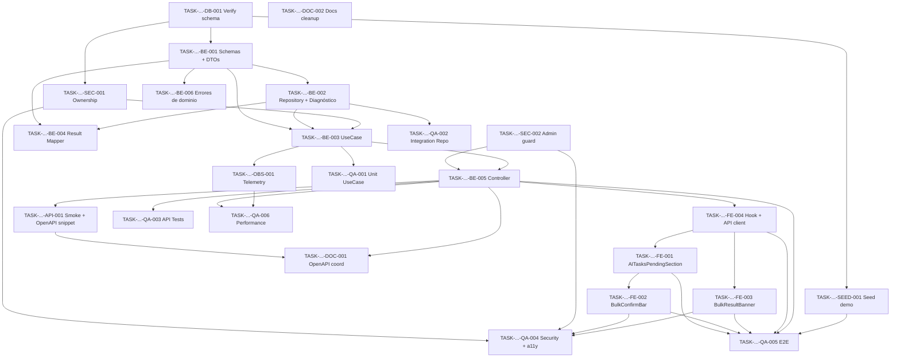

# Development Tasks — PB-P1-017 / US-031: Confirmar tareas IA en bloque

## 1. Metadata

| Field | Value |
|---|---|
| User Story ID | US-031 |
| Source User Story | `management/user-stories/US-031-confirm-ai-tasks-bulk.md` |
| Source Technical Specification | `management/technical-specs/P1/PB-P1-017/US-031-technical-spec.md` |
| Decision Resolution Artifact | No aplica |
| Priority | P1 |
| Backlog ID | PB-P1-017 |
| Backlog Title | Confirmar hasta 50 tareas IA en una sola operación |
| Backlog Execution Order | 35 (P0: 18 + posición 17 en P1) |
| User Story Position in Backlog Item | 1 de 1 |
| Related User Stories in Backlog Item | US-031 |
| Epic | EPIC-TASK-001 |
| Backlog Item Dependencies | PB-P1-012 (US-018 checklist IA), PB-P1-016 (US-025 HITL transversal) |
| Feature | HITL bulk para tareas IA (AI-002 / checklist) |
| Module / Domain | Tasks / AI |
| Backlog Alignment Status | Found |
| Task Breakdown Status | Ready for Sprint Planning |
| Created Date | 2026-06-26 |
| Last Updated | 2026-06-26 |

---

## 2. Source Validation

| Source | Found | Used | Notes |
|---|---|---|---|
| User Story | Yes | Yes | Approved with Minor Notes; 5 AC, 10 EC, 10 VR, 9 SEC; semántica de éxito parcial controlado. |
| Technical Specification | Yes | Yes | Ready for Task Breakdown; fuente primaria. |
| Decision Resolution Artifact | No | No | No requerido; decisiones formalizadas en PB-P1-017 y `/docs/16` (P-API-08). |
| Product Backlog Prioritized | Yes | Yes | PB-P1-017; deps PB-P1-012 + PB-P1-016. |
| ADRs | Yes | Yes | ADR-AI-001 tangencial (este flujo no invoca al LLM). |

---

## 3. Backlog Execution Context

### Parent Backlog Item

`PB-P1-017` — Endpoint dedicado para confirmar hasta 50 tareas IA en una sola operación con semántica de éxito parcial controlado. Cierra el ciclo HITL en bloque sobre `EventTask` IA `pending` materializadas por la strategy `checklist` de US-025/PB-P1-016 a partir de `AIRecommendation type='checklist'` generada por US-018/PB-P1-012. No introduce migraciones nuevas; reusa columnas y enums sembrados por la fundación AI-001 (`US-017`) y la gestión de tareas (`PB-P1-018`).

### Execution Order Rationale

Se ejecuta en la posición 35 del orden global porque depende de:

* `PB-P1-012` (US-018) que crea la `AIRecommendation type='checklist'` con `status='pending'`.
* `PB-P1-016` (US-025) cuyo strategy `checklist` materializa las `EventTask` IA `pending` que este endpoint confirmará.

US-031 opera exclusivamente sobre `EventTask`. No modifica la `AIRecommendation` padre (ya quedó `accepted` en el `apply` de US-025) y no invoca al `LLMProvider`.

### Related User Stories in Same Backlog Item

| User Story | Role in Backlog Item | Suggested Order |
|---|---|---|
| US-031 | Único entregable funcional del backlog item | 1 |

---

## 4. Task Breakdown Summary

| Area | Number of Tasks | Notes |
|---|---:|---|
| Database / Prisma (DB) | 1 | Verificación del schema `event_tasks` (columnas, enum `event_task_status`, índice); sin migraciones nuevas. |
| Backend (BE) | 6 | Schemas + DTOs + errores; repository condicional + diagnóstico; use case con dedup + agregación; mapper; controller + ruta; telemetry helper. |
| API Contract (API) | 1 | Smoke test del contrato + ejemplo OpenAPI canónico. |
| Security / Authorization (SEC) | 2 | `EventOwnershipPolicy` reuso + no-revelación; `adminExclusionGuard` (`FR-ADMIN-010`). |
| Frontend (FE) | 4 | `AITasksPendingSection` (SSR + selección); `BulkConfirmBar` sticky + a11y; `BulkResultBanner` con desglose por `error.code`; hook + cliente API + invalidación TanStack + i18n. |
| Observability / Audit (OBS) | 1 | 5 logs estructurados + 5 métricas Prometheus + dashboard delta `tasks_bulk_confirm_*`. |
| QA / Testing (QA) | 6 | Unit use case; integration repository + diagnóstico; API Supertest matrix; security + a11y axe; E2E Playwright; performance smoke (`NFR-PERF-001`). |
| Seed / Demo (SEED) | 1 | Verificación del fixture demo (≥10 `EventTask` IA `pending` por evento demo). |
| Documentation / Traceability (DOC) | 2 | OpenAPI snapshot vía US-098; cleanup de 4 alineaciones documentales (`/docs/9`, `/docs/8`, `/docs/4`, `/docs/10`). |
| **Total** | **24** | AI = 0 — el endpoint no invoca `LLMProvider`. |

---

## 5. Traceability Matrix

| Acceptance Criterion | Technical Spec Section | Task IDs |
|---|---|---|
| AC-01: Confirmación bulk completa | §7 UseCase, §10 DB | DB-001, BE-001, BE-002, BE-003, BE-005, API-001, QA-001, QA-002, QA-003 |
| AC-02: Éxito parcial controlado | §7 UseCase, §10 Diagnóstico | BE-002, BE-003, BE-004, QA-001, QA-003 |
| AC-03: Dedup silencioso | §7 UseCase | BE-003, QA-001, QA-003 |
| AC-04: Trazabilidad preservada | §7 Repository, §10 DB | BE-002, QA-002 |
| AC-05: Idempotencia por ítem | §7 Repository | BE-002, QA-002, QA-003 |
| EC-01: Duplicados | §6, §7 UseCase | BE-003, QA-001, QA-003 |
| EC-02: Evento ajeno | §12 Ownership | SEC-001, QA-004 |
| EC-03: Tarea no IA | §10 Diagnóstico | BE-002, BE-004, QA-002 |
| EC-04: Tarea no pending | §10 Diagnóstico | BE-002, BE-004, QA-002 |
| EC-05: Tarea de otro evento | §10 Diagnóstico | BE-002, BE-004, QA-002 |
| EC-06: Tarea inexistente | §10 Diagnóstico | BE-002, BE-004, QA-002 |
| EC-07: >50 post-dedup | §7 Schema, §9 API | BE-001, API-001, QA-003 |
| EC-08: Body vacío | §7 Schema | BE-001, API-001, QA-003 |
| EC-09: Evento no mutable | §7 UseCase | BE-003, BE-005, QA-003 |
| EC-10: Concurrencia | §10 DB | BE-002, QA-002 |
| VR-01..10 | §7 DTOs, §9 API, §12 Security | BE-001, API-001, BE-005, SEC-001, SEC-002 |
| SEC-01..09 | §12 Security | SEC-001, SEC-002, OBS-001, QA-004 |
| AI-TS-01..03 | §11 Persistence | BE-002, QA-002 |
| AUTH-TS-01..05 | §12 Negative Authz | SEC-001, SEC-002, QA-004 |
| Performance (`NFR-PERF-001`) | §13 Performance Tests | OBS-001, QA-006 |
| Accesibilidad | §8 Accessibility | FE-002, FE-003, QA-004 |

Cada AC mapea al menos a una tarea.

---

## 6. Development Tasks

### TASK-PB-P1-017-US-031-DB-001 — Verificar schema `event_tasks` y enum `event_task_status`

| Field | Value |
|---|---|
| Area | DB |
| Type | Review |
| Priority | Must |
| Estimate | S |
| Depends On | — |
| Source AC(s) | AC-01, AC-04 |
| Technical Spec Section(s) | §5 Database Architecture, §10 Database / Prisma Design, §17 Risks |
| Backlog ID | PB-P1-017 |
| User Story ID | US-031 |
| Owner Role | Backend |
| Status | To Do |

#### Objective

Confirmar que el esquema actual de `event_tasks` y el enum `event_task_status` cubren el flujo del bulk sin migraciones nuevas.

#### Scope

##### Include

* Validar columnas `id`, `event_id`, `ai_generated`, `ai_recommendation_id`, `status`, `confirmed_by_user_id`, `confirmed_at`, `updated_at`.
* Validar enum `event_task_status` con valores canónicos `(pending, active, ...)` contra `/docs/18`.
* Validar índice existente `(event_id, ai_generated, status)`.
* Documentar cualquier divergencia en el ticket como bloqueante.

##### Exclude

* Crear migraciones (si hay divergencia se difiere a sprint correspondiente).
* Modificar el modelo Prisma.

#### Implementation Notes

* Ejecutar `psql \d event_tasks` en entorno de desarrollo o revisar el `schema.prisma`.
* Cotejar con sección 10 del Tech Spec y `/docs/18`.

#### Acceptance Criteria Covered

* AC-01, AC-04.

#### Definition of Done

- [ ] Reporte de verificación adjunto al ticket.
- [ ] Confirmación de que no se requieren migraciones.
- [ ] Issue separado si se detecta divergencia.

---

### TASK-PB-P1-017-US-031-BE-001 — Zod schemas + DTOs + tipos de respuesta

| Field | Value |
|---|---|
| Area | BE |
| Type | Implementation |
| Priority | Must |
| Estimate | S |
| Depends On | DB-001 |
| Source AC(s) | AC-01, AC-02, EC-07, EC-08, VR-01..03 |
| Technical Spec Section(s) | §7 DTOs / Schemas, §9 API Contract |
| Backlog ID | PB-P1-017 |
| User Story ID | US-031 |
| Owner Role | Backend |
| Status | To Do |

#### Objective

Definir los Zod schemas (`confirmAITasksBulkParamsSchema`, `confirmAITasksBulkBodySchema`) y los DTOs (`ConfirmAITasksBulkResponseDto`, `BulkItemErrorCode`).

#### Scope

##### Include

* `eventId` UUID v4.
* `taskIds: z.array(z.string().uuid()).min(1).max(50)`.
* Errores Zod mapeados a `400 VALIDATION` (vacío) y `400 BULK_LIMIT_EXCEEDED` (>50).
* Enum `BulkItemErrorCode` con 4 valores.

##### Exclude

* Dedup (se realiza en use case).
* Mapeo HTTP detallado (en error middleware).

#### Implementation Notes

* Ubicar bajo `src/modules/tasks/bulk-confirm/interface/http/schemas/` y `application/dtos/`.
* Exportar tipos TS para compartir con el frontend.

#### Acceptance Criteria Covered

* AC-01, AC-02, EC-07, EC-08, VR-01..03.

#### Definition of Done

- [ ] Schemas y DTOs implementados.
- [ ] Tests unitarios cubriendo casos límite (1, 50, 51, 0, UUID inválido).
- [ ] Tipos compartidos con frontend.

---

### TASK-PB-P1-017-US-031-BE-002 — `AITaskBulkRepository.confirmConditional` + diagnóstico

| Field | Value |
|---|---|
| Area | BE |
| Type | Implementation |
| Priority | Must |
| Estimate | M |
| Depends On | BE-001 |
| Source AC(s) | AC-01, AC-04, AC-05, EC-03, EC-04, EC-05, EC-06, EC-10 |
| Technical Spec Section(s) | §7 Repository / Persistence, §10 DB Diagnóstico, §17 Risks |
| Backlog ID | PB-P1-017 |
| User Story ID | US-031 |
| Owner Role | Backend |
| Status | To Do |

#### Objective

Implementar el repositorio que ejecuta el `UPDATE` condicional por ítem y mapea el `error.code` cuando `affected=0` vía una segunda query de diagnóstico.

#### Scope

##### Include

* `UPDATE event_tasks SET status='active', confirmed_by_user_id, confirmed_at, updated_at WHERE id AND event_id AND ai_generated AND status='pending'`.
* Si `affected=0`: `SELECT id, event_id, ai_generated, status WHERE id=$id` y mapeo a `TASK_NOT_FOUND`, `TASK_NOT_IN_EVENT`, `TASK_NOT_AI`, `TASK_NOT_PENDING`.
* Preservar `ai_recommendation_id` y `ai_generated` (no se tocan).

##### Exclude

* Iteración del batch (responsabilidad del use case).
* Logging estructurado (se hace en use case + telemetry helper).

#### Implementation Notes

* `PrismaService.$executeRaw` para el `UPDATE`; `$queryRaw` para el diagnóstico.
* Considerar row-level lock implícito del `UPDATE` para concurrencia (cubierto por QA-002).

#### Acceptance Criteria Covered

* AC-01, AC-04, AC-05, EC-03..06, EC-10.

#### Definition of Done

- [ ] Repository implementado con interface explícita.
- [ ] Tests de integración para cada `error.code`.
- [ ] Test de concurrencia (dos `UPDATE` casi simultáneos sobre el mismo ID).

---

### TASK-PB-P1-017-US-031-BE-003 — `ConfirmAITasksBulkUseCase` (dedup, validaciones globales, agregación)

| Field | Value |
|---|---|
| Area | BE |
| Type | Implementation |
| Priority | Must |
| Estimate | M |
| Depends On | BE-001, BE-002, SEC-001 |
| Source AC(s) | AC-01, AC-02, AC-03, EC-01, EC-02, EC-09 |
| Technical Spec Section(s) | §7 Use Cases, §6 Functional Interpretation |
| Backlog ID | PB-P1-017 |
| User Story ID | US-031 |
| Owner Role | Backend |
| Status | To Do |

#### Objective

Orquestar dedup, pre-checks (ownership + evento mutable), llamadas al repositorio y agregación de `results` y `summary`.

#### Scope

##### Include

* `const uniqueIds = Array.from(new Set(input.taskIds))`.
* Validación defensiva de límite.
* Cargar evento; aplicar `EventOwnershipPolicy.assert` → `EventNotFoundError` (`404`).
* Verificar `event.status` mutable → `EventNotMutableError` (`409`).
* Loop por ítem llamando al repositorio.
* Construir `summary: { requested, deduped, accepted, rejected }`.
* Emitir métricas y logs al final (delegando a telemetry helper de OBS-001).

##### Exclude

* Modificar `AIRecommendation`.
* Invocar al `LLMProvider`.
* Envolver el batch en una sola transacción global.

#### Implementation Notes

* Mantener el loop secuencial en MVP; si las métricas justifican, considerar `Promise.all` con concurrencia limitada en iteración futura.

#### Acceptance Criteria Covered

* AC-01, AC-02, AC-03, EC-01, EC-02, EC-09.

#### Definition of Done

- [ ] Use case con tests unitarios mockeando repository y policy.
- [ ] Cobertura de happy path, partial success, ownership failure, evento no mutable.

---

### TASK-PB-P1-017-US-031-BE-004 — `BulkConfirmResultMapper` (DB diagnóstico → DTO de resultado)

| Field | Value |
|---|---|
| Area | BE |
| Type | Implementation |
| Priority | Must |
| Estimate | XS |
| Depends On | BE-001, BE-002 |
| Source AC(s) | AC-02, EC-03..06 |
| Technical Spec Section(s) | §7 Repository, §10 Diagnóstico |
| Backlog ID | PB-P1-017 |
| User Story ID | US-031 |
| Owner Role | Backend |
| Status | To Do |

#### Objective

Mapear el resultado crudo del diagnóstico de base al DTO `{ taskId, accepted, error? }` con mensajes localizables.

#### Scope

##### Include

* Función pura que toma `(taskId, raw diagnostic row | null)` y retorna `{ taskId, accepted, error? }`.
* Tabla de mensajes por `error.code` (i18n key sugerido).

##### Exclude

* Traducción real (se hace en frontend o middleware de i18n del backend).

#### Implementation Notes

* Mensaje por defecto en `en` para logs; el frontend traduce a partir del `error.code`.

#### Acceptance Criteria Covered

* AC-02, EC-03..06.

#### Definition of Done

- [ ] Mapper implementado.
- [ ] Tests unitarios por cada `error.code`.

---

### TASK-PB-P1-017-US-031-BE-005 — Controller + ruta + integración con guards y middleware

| Field | Value |
|---|---|
| Area | BE |
| Type | Implementation |
| Priority | Must |
| Estimate | S |
| Depends On | BE-001, BE-003, SEC-001, SEC-002 |
| Source AC(s) | AC-01, EC-07, EC-08, EC-09 |
| Technical Spec Section(s) | §7 Controllers, §9 API Contract |
| Backlog ID | PB-P1-017 |
| User Story ID | US-031 |
| Owner Role | Backend |
| Status | To Do |

#### Objective

Exponer `POST /api/v1/events/:eventId/tasks/confirm-bulk` con `AuthGuard`, `adminExclusionGuard`, validación Zod y delegación al use case.

#### Scope

##### Include

* Definir la ruta en `src/modules/tasks/routes.ts`.
* Registrar el controller con los guards en el orden canónico (`AuthGuard` → `adminExclusionGuard` → `zodValidate` → handler).
* Respuesta `200 OK` con `{ results, summary }`.

##### Exclude

* Lógica de negocio (en use case).
* Mapeo HTTP detallado (en error middleware central).

#### Implementation Notes

* Reusar el patrón de controllers existentes en `src/modules/tasks/`.

#### Acceptance Criteria Covered

* AC-01, EC-07, EC-08, EC-09.

#### Definition of Done

- [ ] Ruta registrada y operativa.
- [ ] Smoke test que confirma la respuesta para 1 ID válido.

---

### TASK-PB-P1-017-US-031-BE-006 — Errores de dominio + integración con error middleware

| Field | Value |
|---|---|
| Area | BE |
| Type | Implementation |
| Priority | Must |
| Estimate | XS |
| Depends On | BE-001 |
| Source AC(s) | EC-02, EC-07, EC-08, EC-09 |
| Technical Spec Section(s) | §7 Error Handling |
| Backlog ID | PB-P1-017 |
| User Story ID | US-031 |
| Owner Role | Backend |
| Status | To Do |

#### Objective

Definir los errores de dominio (`BulkValidationError`, `BulkLimitExceededError`, `EventNotFoundError`, `EventNotMutableError`, `AdminNotAllowedError`) y asegurar el mapeo HTTP en el error middleware central.

#### Scope

##### Include

* Clases de error con `code` y `message`.
* Mapeo a HTTP en el middleware central.

##### Exclude

* Errores por ítem (no se lanzan).

#### Acceptance Criteria Covered

* EC-02, EC-07, EC-08, EC-09.

#### Definition of Done

- [ ] Errores y mapeo implementados.
- [ ] Tests unitarios del mapper.

---

### TASK-PB-P1-017-US-031-API-001 — Smoke test del contrato + ejemplo OpenAPI canónico

| Field | Value |
|---|---|
| Area | API |
| Type | Documentation |
| Priority | Must |
| Estimate | XS |
| Depends On | BE-005 |
| Source AC(s) | AC-01, AC-02 |
| Technical Spec Section(s) | §9 API Contract Design |
| Backlog ID | PB-P1-017 |
| User Story ID | US-031 |
| Owner Role | Backend |
| Status | To Do |

#### Objective

Verificar el contrato HTTP del endpoint y producir el snippet OpenAPI canónico para coordinación con `US-098`.

#### Scope

##### Include

* Smoke test que valida estructura de la respuesta (200 con `{ results, summary }`).
* Snippet OpenAPI listo para integrar.

##### Exclude

* Regenerar el snapshot completo (responsabilidad de `US-098`).

#### Acceptance Criteria Covered

* AC-01, AC-02.

#### Definition of Done

- [ ] Smoke test verde.
- [ ] Snippet OpenAPI commiteado bajo `docs/openapi/snippets/`.

---

### TASK-PB-P1-017-US-031-SEC-001 — `EventOwnershipPolicy` reuso + no-revelación

| Field | Value |
|---|---|
| Area | SEC |
| Type | Implementation |
| Priority | Must |
| Estimate | S |
| Depends On | DB-001 |
| Source AC(s) | EC-02, SEC-01, SEC-03, SEC-05 |
| Technical Spec Section(s) | §12 Security & Authorization |
| Backlog ID | PB-P1-017 |
| User Story ID | US-031 |
| Owner Role | Backend |
| Status | To Do |

#### Objective

Reutilizar (o extender) la policy `EventOwnershipPolicy` y garantizar la respuesta `404 NOT_FOUND` para eventos ajenos sin filtrar existencia.

#### Scope

##### Include

* Policy reutilizable importada desde `src/modules/auth/` o `src/modules/events/`.
* Tests que validan que el cuerpo del 404 no expone IDs.

##### Exclude

* Cambios al modelo de roles.

#### Acceptance Criteria Covered

* EC-02, SEC-01, SEC-03, SEC-05.

#### Definition of Done

- [ ] Policy integrada en el use case.
- [ ] Tests de no-revelación verdes.

---

### TASK-PB-P1-017-US-031-SEC-002 — `adminExclusionGuard` (`FR-ADMIN-010`)

| Field | Value |
|---|---|
| Area | SEC |
| Type | Implementation |
| Priority | Must |
| Estimate | XS |
| Depends On | — |
| Source AC(s) | SEC-02, AUTH-TS-04 |
| Technical Spec Section(s) | §12 Role Rules |
| Backlog ID | PB-P1-017 |
| User Story ID | US-031 |
| Owner Role | Backend |
| Status | To Do |

#### Objective

Crear o reutilizar el guard que rechaza con `403 FORBIDDEN` cuando `actor.role === 'admin'`.

#### Scope

##### Include

* Guard reutilizable bajo `src/modules/auth/guards/`.
* Registro en el controller (`BE-005`).

##### Exclude

* Otros roles (la policy de ownership cubre vendor y organizer no dueño).

#### Acceptance Criteria Covered

* SEC-02, AUTH-TS-04.

#### Definition of Done

- [ ] Guard implementado.
- [ ] Tests unitarios verdes.

---

### TASK-PB-P1-017-US-031-FE-001 — `AITasksPendingSection` + selección multi-checkbox

| Field | Value |
|---|---|
| Area | FE |
| Type | Implementation |
| Priority | Must |
| Estimate | M |
| Depends On | BE-001 (tipos compartidos) |
| Source AC(s) | AC-01, EC-01 |
| Technical Spec Section(s) | §8 Components, §8 Accessibility |
| Backlog ID | PB-P1-017 |
| User Story ID | US-031 |
| Owner Role | Frontend |
| Status | To Do |

#### Objective

Renderizar la sección "Sugeridas por IA — pendientes" con checkboxes accesibles y estado de selección controlado por `Set<string>`.

#### Scope

##### Include

* SSR de la lista filtrada (`ai_generated=true`, `status='pending'`).
* Checkbox por tarea con `aria-label="Seleccionar tarea: <title>"`.
* Navegación por teclado.

##### Exclude

* Barra sticky (FE-002).
* Banner de resultado (FE-003).

#### Acceptance Criteria Covered

* AC-01, EC-01.

#### Definition of Done

- [ ] Componente implementado.
- [ ] Test de render + a11y axe.

---

### TASK-PB-P1-017-US-031-FE-002 — `BulkConfirmBar` sticky + acciones + a11y

| Field | Value |
|---|---|
| Area | FE |
| Type | Implementation |
| Priority | Must |
| Estimate | M |
| Depends On | FE-001, FE-004 |
| Source AC(s) | AC-01, EC-07, EC-08 |
| Technical Spec Section(s) | §8 Components, §8 Accessibility |
| Backlog ID | PB-P1-017 |
| User Story ID | US-031 |
| Owner Role | Frontend |
| Status | To Do |

#### Objective

Mostrar la barra sticky con conteo de selección y acciones "Confirmar seleccionadas (N)", "Limpiar selección", "Seleccionar todas las visibles".

#### Scope

##### Include

* Sticky con contraste WCAG AA.
* Botón `Confirmar` deshabilitado si `N=0` o si `N>50` (cliente bloquea antes de enviar).
* Spinner durante el submit.

##### Exclude

* Lógica de selección (en FE-001).
* Resultado post-submit (en FE-003).

#### Acceptance Criteria Covered

* AC-01, EC-07, EC-08.

#### Definition of Done

- [ ] Componente implementado.
- [ ] Tests unit + a11y axe.

---

### TASK-PB-P1-017-US-031-FE-003 — `BulkResultBanner` con desglose por `error.code`

| Field | Value |
|---|---|
| Area | FE |
| Type | Implementation |
| Priority | Must |
| Estimate | S |
| Depends On | FE-004 |
| Source AC(s) | AC-02, EC-03..06 |
| Technical Spec Section(s) | §8 Components, §8 i18n |
| Backlog ID | PB-P1-017 |
| User Story ID | US-031 |
| Owner Role | Frontend |
| Status | To Do |

#### Objective

Banner inline con resumen `{ accepted, rejected }` y desglose por `error.code` traducido en 4 locales.

#### Scope

##### Include

* `aria-live="polite"`, `role="status"`.
* Desglose con conteo por `error.code`.

##### Exclude

* Toasts (gestionados por el hook).

#### Acceptance Criteria Covered

* AC-02, EC-03..06.

#### Definition of Done

- [ ] Componente implementado.
- [ ] i18n para `es`, `en`, `pt`, `fr`.
- [ ] a11y axe verde.

---

### TASK-PB-P1-017-US-031-FE-004 — Hook + cliente API + invalidación TanStack + i18n

| Field | Value |
|---|---|
| Area | FE |
| Type | Implementation |
| Priority | Must |
| Estimate | S |
| Depends On | BE-005 |
| Source AC(s) | AC-01, AC-02, EC-09 |
| Technical Spec Section(s) | §8 Data Fetching, §8 State Management, §8 i18n |
| Backlog ID | PB-P1-017 |
| User Story ID | US-031 |
| Owner Role | Frontend |
| Status | To Do |

#### Objective

Implementar `useConfirmAITasksBulk` (TanStack mutation), extender `tasksApi.confirmBulk` y configurar la invalidación de queries.

#### Scope

##### Include

* `useConfirmAITasksBulk(eventId)` con `onMutate`, `onSuccess`, `onError`.
* Invalidación de `['events', eventId, 'tasks']` y `['events', eventId, 'tasks', 'ai-pending']`.
* Mensajes i18n bajo `tasks.bulk-confirm` y `errors.bulk-confirm`.

##### Exclude

* UI (otros tickets FE).

#### Acceptance Criteria Covered

* AC-01, AC-02, EC-09.

#### Definition of Done

- [ ] Hook y cliente implementados.
- [ ] Tests con MSW para casos de respuesta mixta.

---

### TASK-PB-P1-017-US-031-OBS-001 — 5 logs estructurados + 5 métricas + dashboard delta

| Field | Value |
|---|---|
| Area | OBS |
| Type | Implementation |
| Priority | Must |
| Estimate | S |
| Depends On | BE-003 |
| Source AC(s) | AC-01, AC-02, EC-09 |
| Technical Spec Section(s) | §7 Observability, §14 Observability & Audit |
| Backlog ID | PB-P1-017 |
| User Story ID | US-031 |
| Owner Role | Backend |
| Status | To Do |

#### Objective

Emitir los 5 logs estructurados (`requested`, `succeeded`, `partial_failed`, `rejected`, `conflict`) y las 5 métricas Prometheus (`tasks_bulk_confirm_total|_accepted_total|_rejected_total|_batch_size|_latency_ms`).

#### Scope

##### Include

* Helper `bulkConfirmTelemetry` reutilizable por el use case.
* Labels para `outcome` y `error_code`.
* Delta sobre el dashboard existente `tasks_*`.

##### Exclude

* AdminAction (no aplica).

#### Acceptance Criteria Covered

* AC-01, AC-02, EC-09.

#### Definition of Done

- [ ] Helper implementado.
- [ ] Métricas verificadas en `/metrics`.
- [ ] Dashboard actualizado.

---

### TASK-PB-P1-017-US-031-QA-001 — Unit tests del use case

| Field | Value |
|---|---|
| Area | QA |
| Type | Test |
| Priority | Must |
| Estimate | S |
| Depends On | BE-003 |
| Source AC(s) | AC-01, AC-02, AC-03, EC-01, EC-02, EC-09 |
| Technical Spec Section(s) | §13 Unit Tests |
| Backlog ID | PB-P1-017 |
| User Story ID | US-031 |
| Owner Role | QA |
| Status | To Do |

#### Objective

Cubrir el use case con tests unitarios (Vitest) mockeando repository y policy.

#### Scope

##### Include

* Dedup correcto.
* Límite 50 (defensa adicional).
* Manejo de `EventNotFoundError`, `EventNotMutableError`.
* Happy path y partial success.

##### Exclude

* Integración con DB real (cubierto en QA-002).

#### Acceptance Criteria Covered

* AC-01, AC-02, AC-03, EC-01, EC-02, EC-09.

#### Definition of Done

- [ ] Cobertura ≥ 90% del use case.

---

### TASK-PB-P1-017-US-031-QA-002 — Integration tests del repository (incl. concurrencia y trazabilidad)

| Field | Value |
|---|---|
| Area | QA |
| Type | Test |
| Priority | Must |
| Estimate | M |
| Depends On | BE-002 |
| Source AC(s) | AC-04, AC-05, EC-03..06, EC-10, AI-TS-01..03 |
| Technical Spec Section(s) | §13 Integration Tests |
| Backlog ID | PB-P1-017 |
| User Story ID | US-031 |
| Owner Role | QA |
| Status | To Do |

#### Objective

Verificar `confirmConditional` contra Postgres real con un fixture mínimo.

#### Scope

##### Include

* Cada `error.code` con su fixture.
* Test de concurrencia (dos `UPDATE` simultáneos).
* Verificación de que `ai_recommendation_id` y `ai_generated` se preservan.

##### Exclude

* Endpoint HTTP (en QA-003).

#### Acceptance Criteria Covered

* AC-04, AC-05, EC-03..06, EC-10, AI-TS-01..03.

#### Definition of Done

- [ ] Tests verdes contra DB efímera.

---

### TASK-PB-P1-017-US-031-QA-003 — API tests Supertest (matrix)

| Field | Value |
|---|---|
| Area | QA |
| Type | Test |
| Priority | Must |
| Estimate | M |
| Depends On | BE-005, API-001 |
| Source AC(s) | AC-01, AC-02, AC-03, EC-01, EC-07, EC-08, EC-09 |
| Technical Spec Section(s) | §13 API Tests |
| Backlog ID | PB-P1-017 |
| User Story ID | US-031 |
| Owner Role | QA |
| Status | To Do |

#### Objective

Cubrir el contrato HTTP con Supertest sobre el server real.

#### Scope

##### Include

* TS-01 (5 IA pending → 200, todas aceptadas).
* TS-02 (3 válidas + 2 inválidas → 200 mix).
* TS-03 (60 IDs → 400 `BULK_LIMIT_EXCEEDED`).
* TS-04 (10 IDs con duplicados → 200, `summary.deduped=5`).
* TS-05 (segundo request idéntico → 200, todos `TASK_NOT_PENDING`).
* NT-01..NT-12 (códigos de error globales y por ítem).

##### Exclude

* E2E UI (en QA-005).

#### Acceptance Criteria Covered

* AC-01, AC-02, AC-03, EC-01, EC-07, EC-08, EC-09.

#### Definition of Done

- [ ] Matrix completa en CI.

---

### TASK-PB-P1-017-US-031-QA-004 — Security tests + a11y axe

| Field | Value |
|---|---|
| Area | QA |
| Type | Test |
| Priority | Must |
| Estimate | S |
| Depends On | SEC-001, SEC-002, FE-001, FE-002, FE-003 |
| Source AC(s) | EC-02, SEC-01..09, AUTH-TS-01..05 |
| Technical Spec Section(s) | §13 Security Tests, §13 Accessibility Tests |
| Backlog ID | PB-P1-017 |
| User Story ID | US-031 |
| Owner Role | QA |
| Status | To Do |

#### Objective

Verificar autorización, no-revelación, ausencia de PII en logs y accesibilidad de la UI.

#### Scope

##### Include

* Roles (organizer dueño, organizer no dueño, vendor, admin, anónimo).
* No-revelación de IDs ajenos en `404` global.
* axe sobre `AITasksPendingSection`, `BulkConfirmBar`, `BulkResultBanner`.

##### Exclude

* Performance (en QA-006).

#### Acceptance Criteria Covered

* EC-02, SEC-01..09, AUTH-TS-01..05.

#### Definition of Done

- [ ] Tests verdes.

---

### TASK-PB-P1-017-US-031-QA-005 — E2E Playwright (happy + partial)

| Field | Value |
|---|---|
| Area | QA |
| Type | Test |
| Priority | Must |
| Estimate | M |
| Depends On | FE-001, FE-002, FE-003, FE-004, BE-005, SEED-001 |
| Source AC(s) | AC-01, AC-02 |
| Technical Spec Section(s) | §13 E2E Tests |
| Backlog ID | PB-P1-017 |
| User Story ID | US-031 |
| Owner Role | QA |
| Status | To Do |

#### Objective

Validar el flujo completo desde la UI hasta la base con datos demo.

#### Scope

##### Include

* Escenario happy (5 confirmadas).
* Escenario partial success (con desglose por `error.code`).
* Verificación de que las tareas confirmadas aparecen en "Activas".

##### Exclude

* Cuenta admin (en QA-004).

#### Acceptance Criteria Covered

* AC-01, AC-02.

#### Definition of Done

- [ ] 2 escenarios verdes en CI.

---

### TASK-PB-P1-017-US-031-QA-006 — Performance smoke (`NFR-PERF-001`)

| Field | Value |
|---|---|
| Area | QA |
| Type | Test |
| Priority | Must |
| Estimate | S |
| Depends On | BE-005, OBS-001 |
| Source AC(s) | Performance — `NFR-PERF-001` |
| Technical Spec Section(s) | §13 Performance Tests |
| Backlog ID | PB-P1-017 |
| User Story ID | US-031 |
| Owner Role | QA |
| Status | To Do |

#### Objective

Validar que el endpoint cumple `NFR-PERF-001` (P95 ≤ 1.5 s) tanto en happy path como con muchos errores por ítem.

#### Scope

##### Include

* PERF-01: 50 IDs válidos.
* PERF-02: 50 IDs con 30 inválidos.

##### Exclude

* Carga sostenida (fuera de MVP).

#### Acceptance Criteria Covered

* `NFR-PERF-001`.

#### Definition of Done

- [ ] Reporte de latencia adjunto.
- [ ] Métricas confirmadas en Prometheus.

---

### TASK-PB-P1-017-US-031-SEED-001 — Verificación / extensión del fixture demo

| Field | Value |
|---|---|
| Area | SEED |
| Type | Setup |
| Priority | Must |
| Estimate | S |
| Depends On | DB-001 |
| Source AC(s) | AC-01 |
| Technical Spec Section(s) | §15 Seed / Demo Data Impact |
| Backlog ID | PB-P1-017 |
| User Story ID | US-031 |
| Owner Role | DevOps |
| Status | To Do |

#### Objective

Garantizar que el seed demo crea al menos 10 `EventTask` IA `pending` por evento del organizador demo.

#### Scope

##### Include

* Verificación del seed actual.
* Extensión si falta cobertura.

##### Exclude

* Datos de carga (fuera de MVP).

#### Acceptance Criteria Covered

* AC-01.

#### Definition of Done

- [ ] Seed idempotente con la cobertura mínima.

---

### TASK-PB-P1-017-US-031-DOC-001 — Coordinar OpenAPI snapshot vía US-098

| Field | Value |
|---|---|
| Area | DOC |
| Type | Documentation |
| Priority | Should |
| Estimate | XS |
| Depends On | BE-005, API-001 |
| Source AC(s) | AC-01 |
| Technical Spec Section(s) | §16 Documentation Alignment Required |
| Backlog ID | PB-P1-017 |
| User Story ID | US-031 |
| Owner Role | Tech Lead |
| Status | To Do |

#### Objective

Notificar a `US-098` (snapshot OpenAPI) la inclusión del endpoint `POST /events/:eventId/tasks/confirm-bulk` con su contrato.

#### Scope

##### Include

* Snippet OpenAPI canónico bajo `docs/openapi/snippets/`.
* Referencia cruzada en el changelog del backlog `US-098`.

##### Exclude

* Regeneración completa del snapshot.

#### Acceptance Criteria Covered

* AC-01.

#### Definition of Done

- [ ] Issue/PR abierto contra `US-098`.

---

### TASK-PB-P1-017-US-031-DOC-002 — Cleanup de 4 alineaciones documentales

| Field | Value |
|---|---|
| Area | DOC |
| Type | Documentation |
| Priority | Should |
| Estimate | S |
| Depends On | — |
| Source AC(s) | N/A |
| Technical Spec Section(s) | §16 Documentation Alignment Required |
| Backlog ID | PB-P1-017 |
| User Story ID | US-031 |
| Owner Role | Tech Lead |
| Status | To Do |

#### Objective

Cleanup editorial no bloqueante en `/docs/9` (`FR-TASK-006 → FR-TASK-005`), `/docs/8` (`UC-TASK-005 → UC-TASK-001`), `/docs/4` (BR expandidos), `/docs/10` (`NFR-PERF-API-001 → NFR-PERF-001`).

#### Scope

##### Include

* PR editorial con las 4 actualizaciones.
* Referencias cruzadas a US-031.

##### Exclude

* Reescritura de las secciones.

#### Acceptance Criteria Covered

* N/A (cleanup documental).

#### Definition of Done

- [ ] PR mergeado.

---

## 7. Required QA Tasks

| Task ID | Test Type | Purpose |
|---|---|---|
| TASK-PB-P1-017-US-031-QA-001 | Unit | Use case (dedup, validaciones globales, agregación). |
| TASK-PB-P1-017-US-031-QA-002 | Integration | Repository + diagnóstico + concurrencia + trazabilidad IA. |
| TASK-PB-P1-017-US-031-QA-003 | API (Supertest) | Matrix de respuestas y `error.code` globales/por ítem. |
| TASK-PB-P1-017-US-031-QA-004 | Security + a11y | Roles, no-revelación, axe sobre componentes. |
| TASK-PB-P1-017-US-031-QA-005 | E2E (Playwright) | Flujo demo happy + partial success. |
| TASK-PB-P1-017-US-031-QA-006 | Performance | `NFR-PERF-001` con 50 IDs (válidos / mix). |

---

## 8. Required Security Tasks

| Task ID | Security Concern | Purpose |
|---|---|---|
| TASK-PB-P1-017-US-031-SEC-001 | Ownership + no-revelación | Evento ajeno → `404` global sin filtrar existencia. |
| TASK-PB-P1-017-US-031-SEC-002 | `FR-ADMIN-010` | Admin excluido del HITL. |
| TASK-PB-P1-017-US-031-QA-004 | Roles + PII en logs | Validar roles negativos y ausencia de PII en logs. |

---

## 9. Required Seed / Demo Tasks

| Task ID | Seed/Demo Concern | Purpose |
|---|---|---|
| TASK-PB-P1-017-US-031-SEED-001 | Fixture demo | ≥ 10 `EventTask` IA `pending` por evento del organizador demo. |

---

## 10. Observability / Audit Tasks

| Task ID | Concern | Purpose |
|---|---|---|
| TASK-PB-P1-017-US-031-OBS-001 | Logs + métricas | 5 logs estructurados + 5 métricas Prometheus + dashboard delta. |

---

## 11. Documentation / Traceability Tasks

| Task ID | Document / Artifact | Purpose |
|---|---|---|
| TASK-PB-P1-017-US-031-DOC-001 | OpenAPI snapshot | Coordinación con `US-098`. |
| TASK-PB-P1-017-US-031-DOC-002 | `/docs/9`, `/docs/8`, `/docs/4`, `/docs/10` | Cleanup editorial no bloqueante. |

---

## 12. Dependency Graph

---

## 13. Suggested Implementation Order

### Phase 1 — Foundation

* DB-001: Verificar schema.
* SEC-002: Admin exclusion guard.
* SEED-001: Verificación/extensión del seed demo.

### Phase 2 — Core Implementation

* BE-001: Schemas + DTOs.
* BE-006: Errores de dominio.
* BE-002: Repository + diagnóstico.
* BE-004: Mapper.
* SEC-001: Ownership reuso + no-revelación.
* BE-003: Use case.
* BE-005: Controller + ruta.
* OBS-001: Telemetría.
* FE-004: Hook + API client + i18n.
* FE-001: Sección IA-pending + selección.
* FE-002: BulkConfirmBar sticky.
* FE-003: BulkResultBanner.

### Phase 3 — Validation / Security / QA

* QA-001 → QA-002 → QA-003 → QA-004 → QA-005 → QA-006.
* API-001: smoke del contrato.

### Phase 4 — Documentation / Review

* DOC-001: coordinar OpenAPI snapshot vía US-098.
* DOC-002: cleanup editorial de 4 alineaciones documentales.

---

## 14. Risks & Mitigations

| Risk | Impact | Mitigation | Related Task |
| ---- | ------ | ---------- | ------------ |
| Diagnóstico por ítem genera N+1 queries cuando todos fallan | Latencia degradada en casos extremos | Diagnóstico solo cuando `affected=0`; iteración futura puede consolidar en una sola query si las métricas lo justifican. | BE-002, QA-006 |
| Concurrencia de dos bulks solapados del mismo organizador | Doble actualización | `UPDATE` condicional con row-level lock; segundo bulk recibe `TASK_NOT_PENDING`. | BE-002, QA-002 |
| Enum `event_task_status` divergente vs `/docs/18` | Fallo silencioso | Task DB-001 verifica antes de implementar; bloquea si difiere. | DB-001 |
| Lista IA-pending crece demasiado en demos extensas | UX degradada | Paginación futura; MVP usa lista plana con límite visual razonable. | FE-001 |
| `correlation_id` no persiste en `event_tasks` si la columna no existe | Auditoría parcial en DB | Aceptable en MVP: siempre en logs; columna opcional. | DB-001, OBS-001 |

---

## 15. Out of Scope Confirmation

No deben implementarse:

* Bulk discard / bulk reject de tareas IA (Future).
* Edición masiva del contenido de las tareas.
* Bulk transversal sobre otros tipos de `AIRecommendation`.
* `If-Match` / `ETag` para concurrencia.
* `AdminAction` o flujos admin para HITL.
* Notificaciones push / email post-confirmación.
* Modificación de la `AIRecommendation` padre.
* Invocación al `LLMProvider`.

---

## 16. Readiness for Sprint Planning

| Check                                      | Status |
| ------------------------------------------ | ----------------- |
| Product Backlog mapping found              | Pass              |
| Every AC maps to tasks                     | Pass              |
| Technical Spec used when available         | Pass              |
| QA tasks included                          | Pass              |
| Security tasks included if applicable      | Pass              |
| Seed/demo tasks included if applicable     | Pass              |
| Observability tasks included if applicable | Pass              |
| Documentation tasks included if applicable | Pass              |
| Task dependencies clear                    | Pass              |
| Tasks small enough                         | Pass              |
| Ready for Sprint Planning                  | Yes               |

---

## 17. Final Recommendation

`Ready for Sprint Planning`

US-031 cuenta con AC/EC/VR/SEC granulares, decisiones PO formalizadas (PB-P1-017), contrato API canónico (`/docs/16` P-API-08), esquema DB ya sembrado por la fundación (`/docs/18`), reuso explícito de policies, guards y telemetría existentes, y los 5 Documentation Alignment son no bloqueantes (cleanup editorial cubierto por `DOC-002`). 24 tareas dependency-aware listas para sprint.
