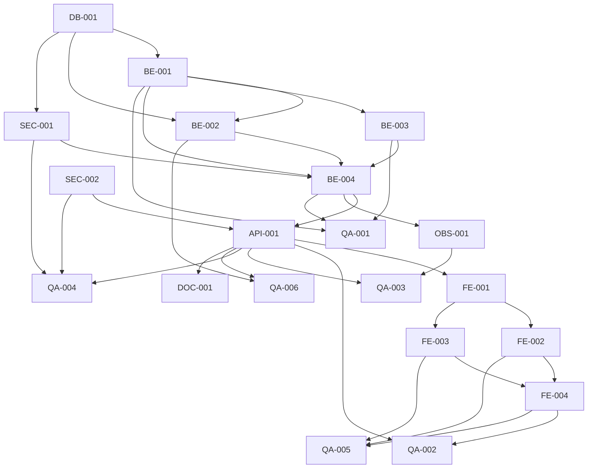

# Development Tasks — PB-P1-018 / US-027: Ver mi checklist del evento

## 1. Metadata

| Field | Value |
|---|---|
| User Story ID | US-027 |
| Source User Story | `management/user-stories/US-027-view-event-checklist.md` |
| Source Technical Specification | `management/technical-specs/P1/PB-P1-018/US-027-technical-spec.md` |
| Decision Resolution Artifact | No aplica |
| Priority | P1 |
| Backlog ID | PB-P1-018 |
| Backlog Title | CRUD de tareas manuales y máquina de estados |
| Backlog Execution Order | 36 (P0: 18 + posición 18 en P1) |
| User Story Position in Backlog Item | 1 de 4 |
| Related User Stories in Backlog Item | US-027, US-028, US-029, US-030 |
| Epic | EPIC-TASK-001 — Checklist & Task Management |
| Backlog Item Dependencies | PB-P0-001, PB-P1-006 |
| Feature | Visualización paginada del checklist del evento |
| Module / Domain | Tasks |
| Backlog Alignment Status | Found |
| Task Breakdown Status | Ready for Sprint Planning |
| Created Date | 2026-06-26 |
| Last Updated | 2026-06-26 |

---

## 2. Source Validation

| Source | Found | Used | Notes |
|---|---|---|---|
| User Story | Yes | Yes | Approved with Minor Notes; 8 AC, 8 EC, 8 VR, 8 SEC; trazabilidad IA mínima. |
| Technical Specification | Yes | Yes | Ready for Task Breakdown; fuente primaria. |
| Decision Resolution Artifact | No | No | No requerido; decisiones formalizadas en `/docs/16` §28 + US-013 + PB-P1-018 Acceptance Summary. |
| Product Backlog Prioritized | Yes | Yes | PB-P1-018; deps PB-P0-001 + PB-P1-006. |
| ADRs | Yes | Yes | ADR-API-001 (versionado /api/v1), ADR-API-004 (correlation id). |

---

## 3. Backlog Execution Context

### Parent Backlog Item

`PB-P1-018` — CRUD de tareas manuales y máquina de estados. Agrupa US-027 (vista de lectura paginada), US-028 (crear), US-029 (editar + transiciones), US-030 (eliminar / soft delete). US-027 abre el backlog item porque establece el contrato del `TaskListItemDto`, las invariantes de ownership / soft delete / read-only por `event.status` y la única superficie consumidora de los outputs IA upstream (`PB-P1-012`/US-018, `PB-P1-016`/US-025, `PB-P1-017`/US-031).

### Execution Order Rationale

Se ejecuta en la posición 36 del orden global porque depende de:

* `PB-P0-001` (schema base de la DB y de `event_tasks`).
* `PB-P1-006` (creación de eventos; provee `event_id` y `owner_user_id` para ownership).

US-027 NO depende funcionalmente de US-018, US-025 ni US-031: si esas tareas IA no existen, simplemente se renderiza el estado vacío con doble CTA. Es un GET puro, sin invocación al `LLMProvider`, sin transacciones de mutación.

### Related User Stories in Same Backlog Item

| User Story | Role in Backlog Item | Suggested Order |
|---|---|---|
| US-027 | Vista de lectura paginada (contrato DTO + invariantes) | 1 |
| US-028 | Crear tarea manual | 2 |
| US-029 | Editar tarea + transiciones de estado | 3 |
| US-030 | Eliminar (soft delete) tarea manual | 4 |

---

## 4. Task Breakdown Summary

| Area | Number of Tasks | Notes |
|---|---:|---|
| Database / Prisma (DB) | 1 | Verificación de schema `event_tasks` + índice canónico `idx_event_tasks_event_status_due`; sin migraciones nuevas. |
| Backend (BE) | 5 | Zod schemas tolerantes + DTOs; repository paginado; mapper IA-mínimo; use case orquestador; domain errors. |
| API Contract (API) | 1 | Controller + ruta + cableado en módulo. |
| Security / Authorization (SEC) | 2 | `EventOwnershipPolicy` reuso/no-revelación; `OrganizerRoleGuard` + `adminExclusionGuard`. |
| Observability / Audit (OBS) | 1 | Log estructurado `tasks.list.requested` + 3 métricas Prometheus. |
| Frontend (FE) | 4 | API client + hook TanStack; `TaskList` + `TaskListItem` + `AIBadge`; `TaskFilters` URL-driven + `Pagination`; page Server Component + `EmptyChecklistState` + read-only/bloqueado banners + i18n 4 locales. |
| QA / Testing (QA) | 6 | Unit (use case + mapper + schemas); integration TS-01..08; negative NT-01..11; authorization AUTH-TS-01..05; accesibilidad (axe + teclado + `aria-live`); performance dataset 200 tareas. |
| Documentation / Traceability (DOC) | 2 | OpenAPI snapshot vía US-098; cleanup editorial en `/docs/10` + `/docs/16`. |
| **Total** | **22** | AI = 0 (no invoca `LLMProvider`). SEED = 0 (seed cubierto por US-018, US-028..030). |

---

## 5. Traceability Matrix

| Acceptance Criterion | Technical Spec Section | Task IDs |
|---|---|---|
| AC-01: Listado por defecto | §7 UseCase, §10 DB | DB-001, BE-002, BE-004, API-001, QA-002 |
| AC-02: Filtro por estado | §7 Schema, §10 DB | BE-001, BE-002, BE-004, QA-002 |
| AC-03: Filtro por origen IA | §7 Schema, §7 Mapper | BE-001, BE-002, BE-003, BE-004, QA-002 |
| AC-04: Filtro por categoría | §7 Schema, §10 DB | BE-001, BE-002, BE-004, QA-002 |
| AC-05: Paginación explícita | §7 Schema, §10 DB | BE-001, BE-002, BE-004, FE-003, QA-002 |
| AC-06: Estado vacío | §8 Frontend | FE-004, QA-002 |
| AC-07: Trazabilidad IA mínima | §7 Mapper | BE-003, QA-001, QA-002 |
| AC-08: i18n del response | §7 UseCase, §8 Frontend | BE-004, FE-004, QA-002 |
| EC-01: Filtros inválidos descartados | §7 Schema | BE-001, OBS-001, QA-003 |
| EC-02..05: NT-01..11 | §7 Schema, §12 Security | BE-001, SEC-001, SEC-002, QA-003 |
| EC-06: Evento ajeno / inexistente / soft-deleted | §12 Security | SEC-001, QA-004 |
| EC-07: Read-only `completed` | §8 Frontend | FE-004, QA-005 |
| EC-08: Bloqueado `cancelled` | §8 Frontend | FE-004, QA-005 |
| VR-01..08 | §7 Schemas, §12 Security | BE-001, BE-004, SEC-001, SEC-002 |
| SEC-01..08 | §12 Security | SEC-001, SEC-002, OBS-001, QA-004 |
| AUTH-TS-01..05 | §12 Negative Authz | SEC-001, SEC-002, QA-004 |
| Accesibilidad | §8 Accessibility | FE-002, FE-003, FE-004, QA-005 |
| Performance (`NFR-PERF-001`) | §13 Performance Tests | OBS-001, QA-006 |
| `BR-AI-010` (no leak LLM payload) | §7 Mapper | BE-003, QA-001 |

Cada AC mapea al menos a una tarea. Cada NT/AUTH-TS/SEC mapea a una QA o SEC task.

---

## 6. Development Tasks

### TASK-PB-P1-018-US-027-DB-001 — Verificar schema `event_tasks` e índice canónico

| Field | Value |
|---|---|
| Area | DB |
| Type | Review |
| Priority | Must |
| Estimate | XS |
| Depends On | — |
| Source AC(s) | AC-01, AC-05 |
| Technical Spec Section(s) | §5 Database Architecture, §10 Database / Prisma Design |
| Backlog ID | PB-P1-018 |
| User Story ID | US-027 |
| Owner Role | Backend |
| Status | To Do |

#### Objective

Confirmar que el esquema actual de `event_tasks`, el enum `task_status` y el índice canónico `idx_event_tasks_event_status_due (event_id, status, due_date)` cubren US-027 sin requerir migraciones nuevas.

#### Scope

##### Include

* Validar columnas: `id`, `event_id`, `title`, `description`, `due_date`, `status`, `category_code`, `ai_generated`, `ai_recommendation_id`, `confirmed_at`, `created_at`, `updated_at`, `deleted_at`.
* Validar enum `task_status` con valores `pending`, `in_progress`, `done`, `skipped`.
* Validar presencia del índice `idx_event_tasks_event_status_due` y FK a `service_categories(code)` y `ai_recommendations(id)`.
* Documentar opcionalmente la recomendación futura de índice parcial `(event_id, ai_generated) WHERE deleted_at IS NULL` para `/docs/18`.

##### Exclude

* Crear migraciones (si hay divergencia, abrir issue separado).
* Implementar el índice parcial opcional (queda como propuesta para US-028..030).

#### Implementation Notes

* Revisar `schema.prisma` y/o `psql \d event_tasks`.
* Cotejar con la sección 10 del Tech Spec y `/docs/18`.

#### Acceptance Criteria Covered

* AC-01, AC-05.

#### Definition of Done

- [ ] Reporte de verificación adjunto al ticket.
- [ ] Confirmación de que no se requieren migraciones nuevas.
- [ ] Issue separado si se detecta divergencia.

---

### TASK-PB-P1-018-US-027-BE-001 — Zod schemas tolerantes + DTOs

| Field | Value |
|---|---|
| Area | BE |
| Type | Implementation |
| Priority | Must |
| Estimate | S |
| Depends On | DB-001 |
| Source AC(s) | AC-02, AC-03, AC-04, AC-05, EC-01, VR-01..08 |
| Technical Spec Section(s) | §7 DTOs / Schemas, §9 API Contract |
| Backlog ID | PB-P1-018 |
| User Story ID | US-027 |
| Owner Role | Backend |
| Status | To Do |

#### Objective

Definir `listEventTasksParamsSchema` (path), `listEventTasksQuerySchema` (query con `.catch()` por campo y acumulador `filtersDropped`), `TaskListItemDto` y `ListEventTasksResponseDto`.

#### Scope

##### Include

* `listEventTasksParamsSchema = z.object({ eventId: z.string().uuid() })`.
* Query: `status` (enum tolerante), `aiGenerated` (preprocess bool tolerante), `categoryCode` (string + literal `"null"` permitido), `page` (coerce int ≥ 1, default 1), `pageSize` (coerce int 1..100, default 20, clamp por encima de 100).
* Acumulador `filtersDropped: Array<{ key, value, reason }>` poblado por hooks de validación.
* `TaskListItemDto` con los 11 campos canónicos del Tech Spec (id, title, due_date, status, category_code, ai_generated, ai_recommendation_id, confirmed_at, created_at, updated_at) en orden estable.
* `ListEventTasksResponseDto = { items, pagination: { page, pageSize, totalItems, totalPages } }`.
* Exportar tipos TS para uso compartido con frontend.

##### Exclude

* Persistencia y queries (en repository).
* Mapeo de filas DB → DTO (en mapper).

#### Implementation Notes

* Ubicación: `src/modules/tasks/list/interface/http/schemas/list-event-tasks.schema.ts` y `src/modules/tasks/list/application/dtos/`.
* Reusar utilitarios de paginación canónica de US-013 si existen; si no, definir helper `paginationEnvelope(items, page, pageSize, totalItems)`.

#### Acceptance Criteria Covered

* AC-02, AC-03, AC-04, AC-05.

#### Definition of Done

- [ ] Schemas y DTOs compilan con types estrictos.
- [ ] Test unit demuestra `.catch()` por filtro y registro en `filtersDropped`.
- [ ] Snapshot del DTO documentado en el JSDoc.

---

### TASK-PB-P1-018-US-027-BE-002 — `EventTaskListRepository.findByEventPaginated`

| Field | Value |
|---|---|
| Area | BE |
| Type | Implementation |
| Priority | Must |
| Estimate | M |
| Depends On | DB-001, BE-001 |
| Source AC(s) | AC-01, AC-02, AC-03, AC-04, AC-05 |
| Technical Spec Section(s) | §7 Repository / Persistence, §10 Database / Prisma Design |
| Backlog ID | PB-P1-018 |
| User Story ID | US-027 |
| Owner Role | Backend |
| Status | To Do |

#### Objective

Implementar el repositorio Prisma que ejecuta `findMany` + `count` con `WHERE deleted_at IS NULL` enforced, filtros opcionales y ordenamiento canónico.

#### Scope

##### Include

* Método `findByEventPaginated(eventId, filters, pagination) → { items: EventTaskRow[], totalItems: number }`.
* `WHERE event_id = $eventId AND deleted_at IS NULL` siempre presente.
* Aplicar filtros opcionales: `status`, `ai_generated`, `category_code` (incluyendo el literal `"null"` mapeado a `category_code IS NULL`).
* `ORDER BY due_date ASC NULLS LAST, created_at DESC`.
* `LIMIT pageSize OFFSET (page-1)*pageSize`.
* `count(*)` con los mismos filtros para `totalItems`.
* Opcional: envolver `findMany` + `count` en `$transaction([readOnly])` para consistencia de cuenta.

##### Exclude

* Ownership checks (delegados a `EventOwnershipPolicy`).
* Mapping a DTO (delegado al mapper).

#### Implementation Notes

* Tipar el retorno como un row plano (no entidad de dominio) para evitar over-fetching.
* Verificar plan de query con `EXPLAIN ANALYZE` en local con dataset de 200 tareas.

#### Acceptance Criteria Covered

* AC-01..05.

#### Definition of Done

- [ ] Tests integration con seed mínimo verifican filtros + orden + paginación + soft-delete.
- [ ] `EXPLAIN ANALYZE` usa el índice canónico para la query por defecto.

---

### TASK-PB-P1-018-US-027-BE-003 — `TaskListItemMapper` con trazabilidad IA mínima

| Field | Value |
|---|---|
| Area | BE |
| Type | Implementation |
| Priority | Must |
| Estimate | S |
| Depends On | BE-001 |
| Source AC(s) | AC-03, AC-07 |
| Technical Spec Section(s) | §7 Mapper, §11 AI / PromptOps Design |
| Backlog ID | PB-P1-018 |
| User Story ID | US-027 |
| Owner Role | Backend |
| Status | To Do |

#### Objective

Mapear `EventTaskRow → TaskListItemDto` exponiendo únicamente la trazabilidad IA mínima (`ai_generated`, `ai_recommendation_id`, `confirmed_at`) y omitiendo cualquier metadata sensible del `LLMProvider`.

#### Scope

##### Include

* Función pura `toDto(row): TaskListItemDto` y `toDtoList(rows, locale): TaskListItemDto[]`.
* Normalización de fechas a ISO-8601 (date para `due_date`, datetime para timestamps).
* Garantía explícita de que NO se exponen `prompt_version_id`, `llm_provider`, `language_code`, ni payloads de `AIRecommendation` (`BR-AI-010`).

##### Exclude

* Resolución del locale (delegada al use case).
* Traducción de valores enum (se realiza en frontend con `next-intl`).

#### Implementation Notes

* Implementar un test snapshot del DTO con todos los campos opcionales = null para evitar regresiones.
* Considerar agregar un campo `__sensitive_check` solo en tests para asegurar que claves prohibidas no aparecen.

#### Acceptance Criteria Covered

* AC-03, AC-07.

#### Definition of Done

- [ ] Test unit del mapper cubre filas IA y manuales.
- [ ] Test verifica explícitamente que claves del LLM no están presentes.

---

### TASK-PB-P1-018-US-027-BE-004 — `ListEventTasksUseCase` + domain errors

| Field | Value |
|---|---|
| Area | BE |
| Type | Implementation |
| Priority | Must |
| Estimate | M |
| Depends On | BE-001, BE-002, BE-003, SEC-001 |
| Source AC(s) | AC-01..08 |
| Technical Spec Section(s) | §7 Use Cases, §6 Functional Interpretation |
| Backlog ID | PB-P1-018 |
| User Story ID | US-027 |
| Owner Role | Backend |
| Status | To Do |

#### Objective

Orquestar la vista paginada: ownership → repositorio → mapper → envelope con paginación. Definir errores de dominio para no-revelación y validación.

#### Scope

##### Include

* `ListEventTasksUseCase.execute(input)` con la firma del Tech Spec §7.
* Invocación `EventOwnershipPolicy.assertOwnership(actorId, eventId)`.
* Resolución del `Accept-Language` con fallback `es-LATAM`.
* Cálculo `totalPages = ceil(totalItems / pageSize)` con manejo `totalItems = 0 → totalPages = 0`.
* Emitir evento `tasks.list.requested` con `filtersDropped` y métricas (delegado a OBS-001 helper).
* Domain errors: `EventNotFoundError` (→ 404), `EventAccessForbiddenError` (→ 403, usado por SEC-002).

##### Exclude

* Persistencia (delegada al repo).
* Detalles HTTP (controller).

#### Implementation Notes

* Inyectar el logger y los counters como dependencias para testabilidad.
* `filtersDropped` se recibe del schema (BE-001) y se pasa al logger sin modificar.

#### Acceptance Criteria Covered

* AC-01..08.

#### Definition of Done

- [ ] Tests unit con mocks de repo + policy cubren happy + ajeno + filtros + i18n.
- [ ] Use case no contiene lógica DB ni HTTP.

---

### TASK-PB-P1-018-US-027-API-001 — Controller `GET /events/:eventId/tasks` + cableado del módulo

| Field | Value |
|---|---|
| Area | API |
| Type | Implementation |
| Priority | Must |
| Estimate | S |
| Depends On | BE-001, BE-004, SEC-001, SEC-002 |
| Source AC(s) | AC-01..08 |
| Technical Spec Section(s) | §7 Controllers / Routes, §9 API Contract |
| Backlog ID | PB-P1-018 |
| User Story ID | US-027 |
| Owner Role | Backend |
| Status | To Do |

#### Objective

Registrar el endpoint REST canónico, aplicar guards en orden y delegar al use case.

#### Scope

##### Include

* `ListEventTasksController.handle(req, res)`:
  1. Validar path con `listEventTasksParamsSchema`.
  2. Validar query con `listEventTasksQuerySchema` (`.catch()` tolerante).
  3. Aplicar `OrganizerRoleGuard` + `adminExclusionGuard`.
  4. Invocar use case.
  5. Responder `200 + envelope` o mapear errores de dominio a HTTP.
* Registrar la ruta en `tasks.module.ts` o equivalente.

##### Exclude

* Lógica de negocio (en use case).
* Validaciones específicas de filtros (en schema).

#### Implementation Notes

* Thin controller sin `try/catch` granular: usar el error middleware central.
* Propagar `X-Correlation-Id` mediante el middleware estándar.

#### Acceptance Criteria Covered

* AC-01..08.

#### Definition of Done

- [ ] Endpoint accesible en `/api/v1/events/:eventId/tasks`.
- [ ] Smoke test con Supertest devuelve 200 + envelope.
- [ ] Lint y typecheck verdes.

---

### TASK-PB-P1-018-US-027-SEC-001 — `EventOwnershipPolicy` reuso + no-revelación 404

| Field | Value |
|---|---|
| Area | SEC |
| Type | Implementation |
| Priority | Must |
| Estimate | S |
| Depends On | DB-001 |
| Source AC(s) | EC-06, SEC-01, SEC-05, SEC-06, AUTH-TS-02 |
| Technical Spec Section(s) | §12 Security & Authorization Design |
| Backlog ID | PB-P1-018 |
| User Story ID | US-027 |
| Owner Role | Backend |
| Status | To Do |

#### Objective

Reusar (o crear si no existe) `EventOwnershipPolicy.assertOwnership(actorId, eventId)` con política de no-revelación (`404`) para evento ajeno, inexistente o soft-deleted.

#### Scope

##### Include

* Buscar `EventOwnershipPolicy` en `src/modules/events/policies/`. Reusar si existe; si no, crear bajo `src/modules/events/policies/event-ownership.policy.ts`.
* Lógica: `SELECT id FROM events WHERE id = $eventId AND owner_user_id = $actorId AND deleted_at IS NULL`. Si no hay fila → `throw new EventNotFoundError(eventId)`.
* Sin distinguir entre los 3 casos en el error (no-revelación).

##### Exclude

* Validaciones de rol (en SEC-002).
* Cualquier exposición de la causa del 404 en logs accesibles al cliente.

#### Implementation Notes

* `EventNotFoundError` se mapea a `404 NOT_FOUND` en el error middleware central.
* Test unit cubre los 3 casos colapsando todos en el mismo error.

#### Acceptance Criteria Covered

* EC-06, SEC-01, SEC-05, SEC-06, AUTH-TS-02.

#### Definition of Done

- [ ] Política reutilizable por US-028..030 y otros endpoints `/events/:eventId/*`.
- [ ] Tests unit cubren ajeno, inexistente, soft-deleted → mismo error.

---

### TASK-PB-P1-018-US-027-SEC-002 — `OrganizerRoleGuard` + `adminExclusionGuard`

| Field | Value |
|---|---|
| Area | SEC |
| Type | Implementation |
| Priority | Must |
| Estimate | S |
| Depends On | — |
| Source AC(s) | SEC-02, SEC-03, AUTH-TS-03, AUTH-TS-04, AUTH-TS-05 |
| Technical Spec Section(s) | §12 Security & Authorization Design |
| Backlog ID | PB-P1-018 |
| User Story ID | US-027 |
| Owner Role | Backend |
| Status | To Do |

#### Objective

Aplicar (o reusar) los guards de rol que restringen el endpoint a `organizer` y excluyen explícitamente al `admin` (debe usar el endpoint admin de US-016) y al `vendor`.

#### Scope

##### Include

* Verificar existencia de `OrganizerRoleGuard` y `adminExclusionGuard` en `src/modules/auth/guards/`. Reusar si existen; si no, crear con la convención del proyecto.
* `vendor` autenticado → `403 FORBIDDEN`.
* `admin` autenticado → `403 FORBIDDEN` con `errorCode = ADMIN_USE_ADMIN_ENDPOINT` y un hint logueado (no expuesto al cliente).
* Sin sesión → `401 UNAUTHORIZED` (delegado al auth middleware estándar).

##### Exclude

* Ownership (en SEC-001).
* Lógica del endpoint admin (en US-016).

#### Implementation Notes

* Reusar la respuesta de `403` canónica del error middleware.

#### Acceptance Criteria Covered

* SEC-02, SEC-03, AUTH-TS-03, AUTH-TS-04, AUTH-TS-05.

#### Definition of Done

- [ ] Tests unit cubren vendor, admin, anónimo.
- [ ] Guards registrados antes del use case en el pipeline del controller.

---

### TASK-PB-P1-018-US-027-OBS-001 — Log estructurado + métricas Prometheus

| Field | Value |
|---|---|
| Area | OBS |
| Type | Implementation |
| Priority | Must |
| Estimate | S |
| Depends On | BE-004 |
| Source AC(s) | EC-01, SEC-04, NFR-OBS-001, NFR-OBS-002 |
| Technical Spec Section(s) | §14 Observability & Audit |
| Backlog ID | PB-P1-018 |
| User Story ID | US-027 |
| Owner Role | Backend |
| Status | To Do |

#### Objective

Emitir telemetría operativa del endpoint: un log estructurado + tres métricas.

#### Scope

##### Include

* Log `tasks.list.requested` con: `correlation_id`, `actor_id`, `event_id`, `filters.applied`, `filters.dropped`, `items_count`, `page`, `pageSize`, `latency_ms`, `status_code`.
* Métrica `tasks_list_latency_ms` (histograma con buckets 50, 100, 250, 500, 1000, 1500, 3000).
* Métrica `tasks_list_total` (counter por `status_code`).
* Métrica `tasks_list_items_returned` (histograma con buckets 0, 1, 5, 10, 20, 50, 100).
* Verificación: ningún log contiene `title`, `description` ni payloads del LLM.

##### Exclude

* Dashboards Grafana (queda para OBS de plataforma; basta con declarar las series).
* `AdminAction` (no aplica).

#### Implementation Notes

* Reusar el logger central y el registro Prometheus de la plataforma.
* Asegurar que la latencia se mide alrededor del use case completo, no solo del repo.

#### Acceptance Criteria Covered

* EC-01, SEC-04.

#### Definition of Done

- [ ] Log + métricas visibles en entorno de dev.
- [ ] Test verifica que `filters.dropped` aparece cuando se descarta un filtro inválido.

---

### TASK-PB-P1-018-US-027-FE-001 — `tasksApi.list` + `useEventTasks` hook

| Field | Value |
|---|---|
| Area | FE |
| Type | Implementation |
| Priority | Must |
| Estimate | S |
| Depends On | API-001 |
| Source AC(s) | AC-01..06, AC-08 |
| Technical Spec Section(s) | §8 Frontend Technical Design |
| Backlog ID | PB-P1-018 |
| User Story ID | US-027 |
| Owner Role | Frontend |
| Status | To Do |

#### Objective

Extender el cliente API y crear el hook TanStack con SSR-friendly `initialData`, prefetch de página siguiente y filtros como cache key.

#### Scope

##### Include

* `tasksApi.list({ eventId, status?, aiGenerated?, categoryCode?, page?, pageSize? })` con tipado del DTO.
* `useEventTasks({ eventId, filters, page, pageSize })` con `queryKey: ['tasks', eventId, filters, page, pageSize]`, `staleTime: 30s`, `placeholderData: keepPreviousData`.
* Prefetch de `page + 1` cuando hay siguiente página.

##### Exclude

* Persistencia de filtros en backend (Future).
* Mutaciones (en US-028..030 / US-031).

#### Implementation Notes

* Reusar el wrapper `fetcher` con `credentials: 'include'` para cookies HTTP-only.
* Tipos compartidos desde `@eventflow/shared-types` si existe.

#### Acceptance Criteria Covered

* AC-01..06, AC-08.

#### Definition of Done

- [ ] Hook integrado en `EventChecklistPage`.
- [ ] Tipos exportados para componentes consumidores.

---

### TASK-PB-P1-018-US-027-FE-002 — `TaskList` + `TaskListItem` + `AIBadge`

| Field | Value |
|---|---|
| Area | FE |
| Type | Implementation |
| Priority | Must |
| Estimate | M |
| Depends On | FE-001 |
| Source AC(s) | AC-01, AC-03, AC-07 |
| Technical Spec Section(s) | §8 Components, §8 Accessibility |
| Backlog ID | PB-P1-018 |
| User Story ID | US-027 |
| Owner Role | Frontend |
| Status | To Do |

#### Objective

Renderizar la lista semántica de tareas con badges accesibles para estado, categoría y origen IA, reusando `AIBadge` de US-017.

#### Scope

##### Include

* `TaskList` como `<ul role="list">` con `<li>` por tarea.
* `TaskListItem` con badges combinados y `aria-label` agregado (`Tarea: <título>, estado: <estado>, generada por IA, vence: <fecha>`).
* Reuso de `AIBadge` cuando `ai_generated=true`.
* Skeleton `TaskListItemSkeleton × 5` durante carga.
* Tap target ≥ 44 px en mobile.

##### Exclude

* Filtros y paginación (FE-003).
* Acciones de mutación (US-028..030 / US-031).

#### Implementation Notes

* Mantener componentes presentational; recibir datos via props.
* Documentar el contrato del DTO consumido (referencia a BE-001).

#### Acceptance Criteria Covered

* AC-01, AC-03, AC-07.

#### Definition of Done

- [ ] Storybook stories (si existe Storybook) o equivalente para variantes.
- [ ] Tests unit con React Testing Library cubren estado IA y manual.

---

### TASK-PB-P1-018-US-027-FE-003 — `TaskFilters` URL-driven + `Pagination`

| Field | Value |
|---|---|
| Area | FE |
| Type | Implementation |
| Priority | Must |
| Estimate | M |
| Depends On | FE-001 |
| Source AC(s) | AC-02, AC-03, AC-04, AC-05 |
| Technical Spec Section(s) | §8 Components, §8 State Management |
| Backlog ID | PB-P1-018 |
| User Story ID | US-027 |
| Owner Role | Frontend |
| Status | To Do |

#### Objective

Implementar la barra de filtros sincronizada con `useSearchParams`/`useRouter.push` y el componente de paginación canónico.

#### Scope

##### Include

* `TaskFilters` como `<fieldset>` con `<legend>` y controles `<select>`/`<input>` etiquetados. Colapsable en mobile (con `
` o equivalente).
* Cada cambio de filtro actualiza la URL (shareability + back button) y dispara `useEventTasks` re-fetch.
* `Pagination` con `<nav aria-label="Paginación">` y botones Prev/Next + página actual.
* Soporte para `?page=` y `?pageSize=` en la URL.

##### Exclude

* Persistencia server-side de filtros.
* Búsqueda full-text (Future).

#### Implementation Notes

* Considerar reusar el `Pagination` de US-013 si existe; si no, crearlo aquí y dejarlo como reusable.
* Asegurar que limpiar un filtro elimina la query string asociada (no setear `undefined`).

#### Acceptance Criteria Covered

* AC-02, AC-03, AC-04, AC-05.

#### Definition of Done

- [ ] Filtros y paginación bookmarkeables.
- [ ] Tests unit verifican que los cambios de URL disparan re-fetch.

---

### TASK-PB-P1-018-US-027-FE-004 — `EventChecklistPage` SSR + `EmptyChecklistState` + banners + i18n 4 locales

| Field | Value |
|---|---|
| Area | FE |
| Type | Implementation |
| Priority | Must |
| Estimate | M |
| Depends On | FE-001, FE-002, FE-003 |
| Source AC(s) | AC-06, AC-08, EC-07, EC-08 |
| Technical Spec Section(s) | §8 Routes / Pages, §8 i18n |
| Backlog ID | PB-P1-018 |
| User Story ID | US-027 |
| Owner Role | Frontend |
| Status | To Do |

#### Objective

Construir la página Server Component que SSR-renderiza la primera página, integra el modo read-only/bloqueado por `event.status` y entrega el estado vacío con doble CTA.

#### Scope

##### Include

* `app/[locale]/organizer/events/[id]/tasks/page.tsx` (Server Component) que prefetch la primera página vía `tasksApi.list` y la pasa como `initialData` al hook.
* `EmptyChecklistState` con dos CTAs: "Crear tarea" (→ ruta de US-028) y "Generar checklist IA" (→ flujo de US-018).
* Banner read-only cuando `event.status='completed'` (lista visible, acciones de mutación deshabilitadas).
* Banner bloqueado cuando `event.status='cancelled'` (lista visible, acciones bloqueadas + mensaje).
* `aria-live="polite"` para anunciar cambios de página o filtro ("X tareas encontradas").
* Claves i18n agregadas en `messages/{es-LATAM,es-ES,pt,en}.json` para status, categorías, CTAs, mensajes vacío/error.

##### Exclude

* Lógica de las CTAs de destino (en US-028 / US-018).
* Persistencia de preferencias de filtro por usuario.

#### Implementation Notes

* Fallback `es-LATAM` cuando el locale solicitado no esté disponible.
* Asegurar que el SSR no expone datos sensibles (cookies se pasan al fetcher con `credentials: 'include'`).

#### Acceptance Criteria Covered

* AC-06, AC-08, EC-07, EC-08.

#### Definition of Done

- [ ] Página accesible en `/[locale]/organizer/events/:id/tasks` con SSR de la primera página.
- [ ] Banners read-only/bloqueado renderizados según `event.status`.
- [ ] Claves i18n presentes en los 4 locales.

---

### TASK-PB-P1-018-US-027-QA-001 — Unit tests (schemas + mapper + use case)

| Field | Value |
|---|---|
| Area | QA |
| Type | Test |
| Priority | Must |
| Estimate | S |
| Depends On | BE-001, BE-003, BE-004 |
| Source AC(s) | AC-03, AC-07, EC-01, VR-01..08 |
| Technical Spec Section(s) | §13 Unit Tests |
| Backlog ID | PB-P1-018 |
| User Story ID | US-027 |
| Owner Role | QA |
| Status | To Do |

#### Objective

Cubrir con Vitest los componentes puros del backend: Zod tolerante, mapper y orquestación del use case con mocks.

#### Scope

##### Include

* Test `listEventTasksQuerySchema`: cada filtro inválido se descarta y se acumula en `filtersDropped` con `reason`.
* Test `TaskListItemMapper`: filas IA y manuales mapean a DTO; verificación explícita de que claves del LLM NO están presentes (`prompt_version_id`, `llm_provider`, `language_code`, payloads).
* Test `ListEventTasksUseCase`: happy, ajeno (`EventNotFoundError`), paginación límites, i18n fallback.

##### Exclude

* Persistencia real (en QA-002).
* HTTP (en QA-002/003).

#### Acceptance Criteria Covered

* AC-03, AC-07, EC-01.

#### Definition of Done

- [ ] Cobertura de los archivos BE-001/BE-003/BE-004 ≥ 90%.

---

### TASK-PB-P1-018-US-027-QA-002 — Integration tests (TS-01..08)

| Field | Value |
|---|---|
| Area | QA |
| Type | Test |
| Priority | Must |
| Estimate | M |
| Depends On | API-001, FE-004 |
| Source AC(s) | AC-01..08 |
| Technical Spec Section(s) | §13 Integration Tests, §13 E2E Tests |
| Backlog ID | PB-P1-018 |
| User Story ID | US-027 |
| Owner Role | QA |
| Status | To Do |

#### Objective

Cubrir los 8 escenarios funcionales (TS-01..08) con Supertest end-to-end al endpoint y Playwright para los flujos UX críticos (vacío, read-only, bloqueado).

#### Scope

##### Include

* Supertest:
  - TS-01 listado por defecto con tareas mixtas (manuales + IA).
  - TS-02 filtro por `status=pending`.
  - TS-03 filtro por `aiGenerated=true` expone `ai_recommendation_id`.
  - TS-04 filtro por `categoryCode='catering'` y `categoryCode='null'`.
  - TS-05 paginación `?page=2&pageSize=20` con `totalItems` correcto.
  - TS-06 orden `due_date ASC NULLS LAST, created_at DESC`.
  - TS-08 i18n con `Accept-Language=pt`.
* Playwright:
  - TS-07 estado vacío con dual CTAs.
  - Modo read-only con `event.status='completed'`.
  - Estado bloqueado con `event.status='cancelled'`.

##### Exclude

* Pruebas negativas (QA-003).
* Pruebas de autorización (QA-004).

#### Acceptance Criteria Covered

* AC-01..08, EC-07, EC-08.

#### Definition of Done

- [ ] Suite de tests integrada al pipeline CI.

---

### TASK-PB-P1-018-US-027-QA-003 — Negative tests (NT-01..11) + tolerancia EC-01

| Field | Value |
|---|---|
| Area | QA |
| Type | Test |
| Priority | Must |
| Estimate | M |
| Depends On | API-001, OBS-001 |
| Source AC(s) | EC-01..05 |
| Technical Spec Section(s) | §13 API Tests |
| Backlog ID | PB-P1-018 |
| User Story ID | US-027 |
| Owner Role | QA |
| Status | To Do |

#### Objective

Cubrir los 11 escenarios negativos (NT-01..11) de la story y la tolerancia a filtros inválidos (EC-01) con verificación del log `filters.dropped`.

#### Scope

##### Include

* Supertest matrix: UUID inválido → 400; `status` inválido → 200 con `filters.dropped` registrado; `aiGenerated` inválido → 200 con drop; `categoryCode` inexistente → 200 con drop (decisión de tolerancia); `page` o `pageSize` fuera de rango → clamp/default; `pageSize > 100` → clamp a 100; body con tipos incorrectos → 400 (cuando aplique al path).
* Verificación de que `filters.dropped` aparece en el log estructurado.

##### Exclude

* Authorization (QA-004).
* Accesibilidad (QA-005).

#### Acceptance Criteria Covered

* EC-01..05.

#### Definition of Done

- [ ] Tests verdes y deterministas en CI.

---

### TASK-PB-P1-018-US-027-QA-004 — Authorization tests (AUTH-TS-01..05) + no-revelación

| Field | Value |
|---|---|
| Area | QA |
| Type | Test |
| Priority | Must |
| Estimate | S |
| Depends On | API-001, SEC-001, SEC-002 |
| Source AC(s) | SEC-01..08, AUTH-TS-01..05 |
| Technical Spec Section(s) | §12 Security & Authorization, §13 Security Tests |
| Backlog ID | PB-P1-018 |
| User Story ID | US-027 |
| Owner Role | QA |
| Status | To Do |

#### Objective

Verificar la matriz de roles y la política de no-revelación.

#### Scope

##### Include

* AUTH-TS-01 organizer dueño → 200.
* AUTH-TS-02 organizer no dueño → 404 con misma forma que evento inexistente.
* AUTH-TS-03 vendor → 403.
* AUTH-TS-04 admin → 403.
* AUTH-TS-05 anónimo → 401.
* No-revelación: evento ajeno, inexistente y soft-deleted devuelven el mismo cuerpo `404`.
* Verificación de que el log NO incluye PII (`title`, `description`).

##### Exclude

* Casos de IA (no aplica).

#### Acceptance Criteria Covered

* SEC-01..08, AUTH-TS-01..05, EC-06.

#### Definition of Done

- [ ] Tests por cada rol cubiertos.
- [ ] Test verifica que los tres casos del 404 no se distinguen externamente.

---

### TASK-PB-P1-018-US-027-QA-005 — Accesibilidad (axe + teclado + `aria-live`)

| Field | Value |
|---|---|
| Area | QA |
| Type | Test |
| Priority | Must |
| Estimate | S |
| Depends On | FE-002, FE-003, FE-004 |
| Source AC(s) | AC-01, EC-07, EC-08 |
| Technical Spec Section(s) | §8 Accessibility, §13 Accessibility Tests |
| Backlog ID | PB-P1-018 |
| User Story ID | US-027 |
| Owner Role | QA |
| Status | To Do |

#### Objective

Verificar accesibilidad de la lista, filtros, paginación y banners con axe-core y pruebas de teclado.

#### Scope

##### Include

* axe-core sobre `TaskList` + `TaskFilters` + `EmptyChecklistState` + `Pagination`.
* Navegación por teclado completa (Tab/Shift+Tab/Enter) en filtros + paginación + items.
* Anuncio `aria-live="polite"` al cambiar de página o filtro.
* Contraste WCAG AA en badges.
* Verificar banners read-only/bloqueado anuncian el estado correctamente.

##### Exclude

* Tests cross-browser exhaustivos (cubiertos en E2E general).

#### Acceptance Criteria Covered

* AC-01, EC-07, EC-08.

#### Definition of Done

- [ ] Cero violaciones axe en CI para los componentes listados.
- [ ] Test e2e con teclado verifica orden de foco.

---

### TASK-PB-P1-018-US-027-QA-006 — Performance test con dataset 200 (P95 ≤ 1.5 s)

| Field | Value |
|---|---|
| Area | QA |
| Type | Test |
| Priority | Must |
| Estimate | S |
| Depends On | BE-002, API-001 |
| Source AC(s) | AC-01, AC-05 |
| Technical Spec Section(s) | §13 CI Checks, §17 Risks |
| Backlog ID | PB-P1-018 |
| User Story ID | US-027 |
| Owner Role | QA |
| Status | To Do |

#### Objective

Garantizar el cumplimiento de `NFR-PERF-001` (P95 ≤ 1.5 s) con un dataset realista de 200 tareas.

#### Scope

##### Include

* Sembrar dataset de 200 tareas en evento de fixture (mix manual + IA + varios `status`).
* Medir P95 del endpoint en 100 ejecuciones; aceptar ≤ 1.5 s.
* Registrar baseline en el ticket.

##### Exclude

* Stress test masivo (Future).

#### Acceptance Criteria Covered

* AC-01, AC-05.

#### Definition of Done

- [ ] Reporte adjunto con P50/P95/P99.
- [ ] Gate de CI configurado para alertar si P95 > 1.5 s.

---

### TASK-PB-P1-018-US-027-DOC-001 — Coordinar regeneración del snapshot OpenAPI vía US-098

| Field | Value |
|---|---|
| Area | DOC |
| Type | Documentation |
| Priority | Should |
| Estimate | XS |
| Depends On | API-001 |
| Source AC(s) | AC-01..08 |
| Technical Spec Section(s) | §16 Documentation Alignment Required |
| Backlog ID | PB-P1-018 |
| User Story ID | US-027 |
| Owner Role | Tech Lead |
| Status | To Do |

#### Objective

Asegurar que el snapshot OpenAPI de EventFlow refleja el endpoint `GET /events/:eventId/tasks`, sus filtros tolerantes y el envelope de paginación.

#### Scope

##### Include

* Abrir o coordinar el ticket US-098 con el contrato canónico actualizado.
* Confirmar que la documentación menciona el comportamiento tolerante (filtros inválidos → 200 con `filters.dropped`).

##### Exclude

* Implementación del snapshot (responsabilidad de US-098).

#### Acceptance Criteria Covered

* AC-01..08.

#### Definition of Done

- [ ] Ticket US-098 actualizado o referenciado en este task.
- [ ] Confirmación de que el contrato canónico está alineado.

---

### TASK-PB-P1-018-US-027-DOC-002 — Cleanup editorial en `/docs/10` y `/docs/16`

| Field | Value |
|---|---|
| Area | DOC |
| Type | Documentation |
| Priority | Should |
| Estimate | XS |
| Depends On | — |
| Source AC(s) | — |
| Technical Spec Section(s) | §16 Documentation Alignment Required |
| Backlog ID | PB-P1-018 |
| User Story ID | US-027 |
| Owner Role | Tech Lead |
| Status | To Do |

#### Objective

Cerrar las 3 alineaciones documentales no bloqueantes detectadas durante el refinamiento/spec.

#### Scope

##### Include

* `/docs/10`: renumerar `NFR-PERF-API-001` (stale) → `NFR-PERF-001` + `NFR-PERF-005` (paginación).
* `/docs/16`: confirmar paginación canónica `pageSize=20` default / `100` máx en sección 28 (consistencia con US-013).
* `/docs/16`: nota explícita sobre filtros tolerantes (descartados silenciosamente con log).

##### Exclude

* Cambios de contrato API (no aplica).

#### Acceptance Criteria Covered

* — (cleanup documental).

#### Definition of Done

- [ ] Commits en `/docs/10` y `/docs/16` mergeados.
- [ ] Referencia a este ticket en los PR.

---

## 7. Required QA Tasks

| Task ID | Test Type | Purpose |
|---|---|---|
| QA-001 | Unit | Schemas tolerantes, mapper IA-mínimo, use case orquestador. |
| QA-002 | Integration / E2E | TS-01..08 (happy, filtros, paginación, i18n, vacío, read-only, bloqueado). |
| QA-003 | API / Negative | NT-01..11 + tolerancia EC-01 (filtros inválidos descartados). |
| QA-004 | Security / Authorization | AUTH-TS-01..05 + no-revelación. |
| QA-005 | Accessibility | axe + teclado + `aria-live` + WCAG AA. |
| QA-006 | Performance | P95 ≤ 1.5 s con dataset 200. |

---

## 8. Required Security Tasks

| Task ID | Security Concern | Purpose |
|---|---|---|
| SEC-001 | Ownership + no-revelación | `EventOwnershipPolicy.assertOwnership` con 404 único. |
| SEC-002 | RBAC + admin-exclusion | `OrganizerRoleGuard` + `adminExclusionGuard` (FR-ADMIN-010). |
| OBS-001 | Logs sin PII | Verificación de redacción del log estructurado. |

---

## 9. Required Seed / Demo Tasks

`No aplica`. El seed de tareas se cubre por US-018 (IA), US-028..030 (manuales) y los fixtures de tests definidos en QA-002/QA-006.

---

## 10. Observability / Audit Tasks

| Task ID | Concern | Purpose |
|---|---|---|
| OBS-001 | Logs + métricas | `tasks.list.requested` + 3 métricas Prometheus + verificación de redacción de PII. |

---

## 11. Documentation / Traceability Tasks

| Task ID | Document / Artifact | Purpose |
|---|---|---|
| DOC-001 | Snapshot OpenAPI vía US-098 | Reflejar `GET /events/:eventId/tasks` + filtros tolerantes + envelope. |
| DOC-002 | `/docs/10` + `/docs/16` | Cleanup editorial de IDs stale y paginación canónica. |

---

## 12. Dependency Graph

---

## 13. Suggested Implementation Order

### Phase 1 — Foundation

1. DB-001 — verificar schema/índice.
2. BE-001 — Zod schemas tolerantes + DTOs.
3. SEC-001 — `EventOwnershipPolicy` reuso + no-revelación.
4. SEC-002 — `OrganizerRoleGuard` + `adminExclusionGuard`.

### Phase 2 — Core Implementation

5. BE-002 — `EventTaskListRepository.findByEventPaginated`.
6. BE-003 — `TaskListItemMapper`.
7. BE-004 — `ListEventTasksUseCase` + domain errors.
8. API-001 — Controller + ruta + cableado.
9. OBS-001 — log + métricas.
10. FE-001 — API client + hook TanStack.
11. FE-002 — `TaskList` + `TaskListItem`.
12. FE-003 — `TaskFilters` + `Pagination`.
13. FE-004 — `EventChecklistPage` SSR + `EmptyChecklistState` + banners + i18n.

### Phase 3 — Validation / Security / QA

14. QA-001 — unit tests (schemas + mapper + use case).
15. QA-003 — negative tests + tolerancia EC-01.
16. QA-004 — authorization tests + no-revelación.
17. QA-002 — integration + E2E TS-01..08.
18. QA-005 — accesibilidad.
19. QA-006 — performance test.

### Phase 4 — Documentation / Review

20. DOC-001 — coordinar OpenAPI snapshot vía US-098.
21. DOC-002 — cleanup editorial `/docs/10` + `/docs/16`.

---

## 14. Risks & Mitigations

| Risk | Impact | Mitigation | Related Task |
| ---- | ------ | ---------- | ------------ |
| Paginación lenta para datasets crecientes | Latencia P95 > 1.5 s | Índice canónico cubre el caso; MVP asume ≤ 200 tareas | DB-001, QA-006 |
| Filtros inválidos descartados silenciosamente confunden al cliente | UX poco descubrible | Log `filters.dropped` + documentación OpenAPI explícita | OBS-001, DOC-001 |
| Conflicto futuro de DTO con US-028..030 al introducir mutaciones | Inconsistencia API | Contrato `TaskListItemDto` establecido aquí; US-028..030 deben mantener backward compatibility | BE-001 |
| `COUNT(*)` degrada en eventos grandes | Performance | MVP acepta hasta 200; future: estimado o materializado | BE-002, QA-006 |
| Leak accidental de campos LLM en el DTO | Filtrado de información sensible | Mapper explícito + test que verifica claves prohibidas | BE-003, QA-001 |
| `EventOwnershipPolicy` ausente en el codebase | Bloqueo de implementación | SEC-001 contempla creación si no existe; arquitectura ya la prevé | SEC-001 |

---

## 15. Out of Scope Confirmation

* Crear, editar, eliminar o transicionar tareas (US-028 / US-029 / US-030).
* Confirmación bulk de tareas IA (US-031).
* Filtros temporales (próximos 7/30 días, vencidas) → US-032 / PB-P1-019.
* Cálculo de % de progreso → US-033 / PB-P1-019.
* Búsqueda full-text en `title`/`description`.
* Asignación múltiple, subtareas anidadas.
* Recordatorios push o email basados en `due_date`.
* Export CSV / PDF del checklist.
* Endpoint admin global `/admin/events/:id/tasks` (cubierto por US-016).
* Vistas guardadas o filtros personalizados persistidos.
* Migraciones nuevas en `event_tasks` (excepto cleanup futuro de índice parcial).
* Caching del listado en MVP.
* Invocación al `LLMProvider`.

---

## 16. Readiness for Sprint Planning

| Check                                      | Status            |
| ------------------------------------------ | ----------------- |
| Product Backlog mapping found              | Pass              |
| Every AC maps to tasks                     | Pass              |
| Technical Spec used when available         | Pass              |
| QA tasks included                          | Pass              |
| Security tasks included if applicable      | Pass              |
| Seed/demo tasks included if applicable     | N/A               |
| Observability tasks included if applicable | Pass              |
| Documentation tasks included if applicable | Pass              |
| Task dependencies clear                    | Pass              |
| Tasks small enough                         | Pass              |
| Ready for Sprint Planning                  | Yes               |

---

## 17. Final Recommendation

`Ready for Sprint Planning`

US-027 entrega un endpoint REST de lectura puro alineado con el patrón canónico de EventFlow (US-013 + `/docs/16` §28). El backlog item PB-P1-018 ejecuta US-027 primero para establecer el contrato `TaskListItemDto` y las invariantes que US-028..030 deben mantener. No introduce migraciones, no invoca al `LLMProvider`, y reutiliza la fundación (`event_tasks`, ownership policy, role guards, observabilidad central). Las 3 alineaciones documentales son cleanup editorial cubierto por DOC-001 (snapshot OpenAPI vía US-098) y DOC-002 (`/docs/10` + `/docs/16`).
