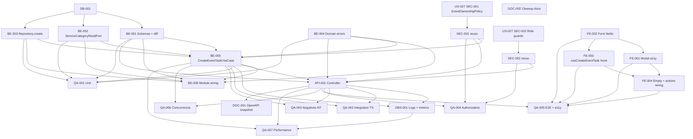

# Development Tasks — PB-P1-018 / US-028: Crear tarea manual del checklist (Organizer)

## 1. Metadata

| Field | Value |
|---|---|
| User Story ID | US-028 |
| Source User Story | `management/user-stories/US-028-create-manual-task.md` |
| Source Technical Specification | `management/technical-specs/P1/PB-P1-018/US-028-technical-spec.md` |
| Decision Resolution Artifact | No aplica |
| Priority | P1 |
| Backlog ID | PB-P1-018 |
| Backlog Title | CRUD de tareas manuales y máquina de estados |
| Backlog Execution Order | 37 (P0: 18 + posición 19 en P1) |
| User Story Position in Backlog Item | 2 de 4 |
| Related User Stories in Backlog Item | US-027, US-028, US-029, US-030 |
| Epic | EPIC-TASK-001 — Checklist & Task Management |
| Backlog Item Dependencies | PB-P0-001, PB-P1-006, PB-P1-019 (opcional para prefill de categoría) |
| Feature | Creación manual de `EventTask` (origen no IA) |
| Module / Domain | Tasks |
| Backlog Alignment Status | Found |
| Task Breakdown Status | Ready for Sprint Planning |
| Created Date | 2026-06-26 |
| Last Updated | 2026-06-26 |

---

## 2. Source Validation

| Source | Found | Used | Notes |
|---|---|---|---|
| User Story | Yes | Yes | Approved with Minor Notes; 5 AC, 12 EC, 10 VR, 9 SEC. Estado inicial canónico `pending`; body Zod tolerante con descarte silencioso de server-controlled fields. |
| Technical Specification | Yes | Yes | Ready for Task Breakdown; fuente primaria. |
| Decision Resolution Artifact | No | No | No requerido; decisiones formalizadas en `FR-TASK-002/004/011/012`, `UC-TASK-001`, `BR-TASK-001/002/006/008/009/010`, `BR-AI-008`, PB-P1-018 Acceptance Summary. |
| Product Backlog Prioritized | Yes | Yes | PB-P1-018; deps PB-P0-001, PB-P1-006, PB-P1-019 (opcional). |
| ADRs | Yes | Yes | ADR-API-001 (`/api/v1` versionado), ADR-API-004 (correlation id). |

---

## 3. Backlog Execution Context

### Parent Backlog Item

`PB-P1-018` — CRUD de tareas manuales y máquina de estados. US-028 es la **mutación de entrada** del checklist manual: introduce nuevas `EventTask` con `ai_generated=false` y reusa el contrato `TaskListItemDto` consolidado por US-027 para invalidación de cache sin GET adicional. Se ejecuta después de US-027 porque depende del repositorio, mapper, DTO, ownership policy y guards introducidos por la posición 1 del backlog item.

### Execution Order Rationale

Se ejecuta en la posición 37 del orden global porque:

1. Reusa el contrato `TaskListItemDto` y el módulo `EventTaskRepository` (extensión con `create`) introducidos por US-027.
2. Reusa `EventOwnershipPolicy`, `OrganizerRoleGuard` y `adminExclusionGuard` cableados en US-027.
3. La UI del modal `CreateTaskDialog` se invoca desde el `EmptyChecklistState` y la barra de acciones de la página de US-027.
4. Depende de `PB-P0-001` (schema base), `PB-P1-006` (creación de eventos) y `PB-P1-019` (catálogo `ServiceCategory` activo) — esta última solo si se quiere validar `category_code`.

US-028 NO depende funcionalmente de US-018, US-025 ni US-031: es una mutación pura sin invocación al `LLMProvider`.

### Related User Stories in Same Backlog Item

| User Story | Role in Backlog Item | Suggested Order |
|---|---|---|
| US-027 | Vista de lectura paginada (contrato DTO + invariantes) | 1 |
| US-028 | Crear tarea manual | 2 |
| US-029 | Editar tarea + transiciones de estado | 3 |
| US-030 | Eliminar (soft delete) tarea manual | 4 |

---

## 4. Task Breakdown Summary

| Area | Number of Tasks | Notes |
|---|---:|---|
| Database / Prisma (DB) | 1 | Verificación de columnas y constraints de `event_tasks` para el insert path; sin migraciones nuevas. |
| Backend (BE) | 6 | Zod schemas tolerantes con diff `ignoredFields`; `ServiceCategoryReadPort` + adapter Prisma; extensión `EventTaskRepository.create`; domain errors (`EventNotMutableError`, `CategoryNotAvailableError`); `CreateEventTaskUseCase` orquestador con transacción + lock; cableado del módulo. |
| API Contract (API) | 1 | Controller `POST /events/:eventId/tasks` con `201 Created` + header `Location` + `TaskListItemDto`. |
| Security / Authorization (SEC) | 2 | Reuso `EventOwnershipPolicy` (no-revelación 404); reuso `OrganizerRoleGuard` + `adminExclusionGuard` con hint `details.use_endpoint` para admin. |
| Observability / Audit (OBS) | 1 | Log estructurado `tasks.created` sin PII + 2 métricas Prometheus + log `body.ignoredFields`. |
| Frontend (FE) | 4 | `CreateTaskDialog` accesible con focus trap; campos (`TaskTitleField`, `TaskDescriptionField`, `TaskDueDateField`, `TaskCategoryCombobox`); hook TanStack `useCreateEventTask` con cache invalidation + setQueryData; integración con `EmptyChecklistState` y barra de acciones + i18n 4 locales. |
| QA / Testing (QA) | 7 | Unit (use case + schemas + mapper diff); integration TS-01..07; E2E TS-08..09; negative NT-01..19; authorization AUTH-TS-01..05; concurrency CONC-01..02; accesibilidad (axe + teclado + focus trap + aria-live); performance budget `NFR-PERF-001`. |
| Documentation / Traceability (DOC) | 2 | OpenAPI snapshot vía US-098; cleanup editorial en `/docs/10` (NFR renumeración) + `/docs/8` (UC canónico). |
| **Total** | **24** | AI = 0 (no invoca `LLMProvider`). SEED = 0 (fundación PB-P1-018 + catálogo de US-019/US-020 ya sembrados). |

---

## 5. Traceability Matrix

| Acceptance Criterion | Technical Spec Section | Task IDs |
|---|---|---|
| AC-01: Crear con solo `title` | §7 UseCase, §7 Schema, §10 DB | BE-001, BE-003, BE-005, API-001, QA-002 |
| AC-02: Crear con todos los campos | §7 UseCase, §7 Schema, §10 DB | BE-001, BE-002, BE-003, BE-005, API-001, QA-002 |
| AC-03: Server-controlled fields descartados | §7 Schema, §12 Security | BE-001, OBS-001, QA-003 |
| AC-04: `category_code=null` explícito | §7 Schema, §7 UseCase | BE-001, BE-005, QA-002 |
| AC-05: i18n del response y errores | §8 Frontend, §7 UseCase | BE-005, FE-001, FE-004, QA-002 |
| EC-01..03: Validaciones de `title` y `description` | §7 Schema | BE-001, QA-003 |
| EC-04: `due_date` en el pasado | §7 Schema | BE-001, QA-003 |
| EC-05: `due_date` formato inválido | §7 Schema | BE-001, QA-003 |
| EC-06: Categoría inexistente / inactiva | §7 UseCase, §7 ServiceCategoryReadPort | BE-002, BE-005, QA-003 |
| EC-07: Evento no mutable (`cancelled`/`completed`) | §7 UseCase, §10 DB | BE-004, BE-005, QA-003 |
| EC-08: Carrera contra cambio de estado | §7 UseCase, §10 DB | BE-005, QA-006 |
| EC-09: Evento soft-deleted | §12 Security, §7 UseCase | SEC-001, BE-005, QA-004 |
| EC-10: Evento ajeno | §12 Security | SEC-001, QA-004 |
| EC-11: Body con keys extras | §7 Schema | BE-001, OBS-001, QA-003 |
| EC-12: Content-Type inválido | §7 Controller | API-001, QA-003 |
| VR-01..10 | §7 Schemas, §12 Security | BE-001, BE-002, BE-005, SEC-001, SEC-002 |
| SEC-01..09 | §12 Security | SEC-001, SEC-002, OBS-001, QA-004 |
| AUTH-TS-01..05 | §12 Negative Authz | SEC-001, SEC-002, QA-004 |
| CONC-01..02 | §13 Concurrency Tests | BE-005, QA-006 |
| Accesibilidad | §8 Accessibility | FE-001, FE-002, FE-003, QA-005 |
| Performance (`NFR-PERF-001`) | §13 CI Checks | OBS-001, QA-007 |
| `BR-AI-008` (`ai_generated=false` enforced) | §7 UseCase | BE-005, QA-003 |
| `body.ignoredFields` log | §14 Logs | OBS-001, BE-001, QA-003 |

Cada AC mapea al menos a una tarea. Cada NT/AUTH-TS/SEC/CONC mapea a una tarea QA o SEC.

---

## 6. Development Tasks

### TASK-PB-P1-018-US-028-DB-001 — Verificar columnas, defaults y constraints de `event_tasks` para insert path

| Field | Value |
|---|---|
| Area | DB |
| Type | Review |
| Priority | Must |
| Estimate | XS |
| Depends On | — |
| Source AC(s) | AC-01, AC-02, AC-04 |
| Technical Spec Section(s) | §10 Database / Prisma Design |
| Backlog ID | PB-P1-018 |
| User Story ID | US-028 |
| Owner Role | Backend |
| Status | To Do |

#### Objective

Confirmar que el esquema vigente de `event_tasks` y `service_categories` soporta la inserción de US-028 sin migraciones nuevas.

#### Scope

##### Include

* `event_tasks` columnas: `id (uuid)`, `event_id (uuid FK)`, `title (text NOT NULL)`, `description (text NULL)`, `due_date (timestamptz NULL)`, `status (task_status DEFAULT 'pending')`, `category_code (text FK NULL)`, `ai_generated (boolean DEFAULT false)`, `ai_recommendation_id (uuid NULL)`, `confirmed_at (timestamptz NULL)`, `language_code (text NOT NULL)`, `created_by_user_id (uuid FK)`, `created_at`, `updated_at`, `deleted_at`.
* FKs: `event_id → events.id ON DELETE RESTRICT`; `category_code → service_categories.code ON DELETE RESTRICT`; `created_by_user_id → users.id`.
* Enum `task_status` con valor `'pending'`.
* Check `language_code ∈ {es, en, pt, fr}`.
* Reusa `idx_event_tasks_event_status_due (event_id, status, due_date)` verificado en US-027.

##### Exclude

* Migraciones nuevas.
* Optimización de índices de búsqueda.

#### Implementation Notes

* Si alguna columna o constraint falta, abrir issue separado y bloquear US-028.
* Verificar también que `event_tasks.created_by_user_id` está NOT NULL (auditoría intrínseca).

#### Acceptance Criteria Covered

AC-01, AC-02, AC-04.

#### Definition of Done

- [ ] Schema confirmado en migraciones existentes.
- [ ] Reporte de verificación adjunto en el PR.
- [ ] Si hay gaps, ticket de migración separado abierto.

---

### TASK-PB-P1-018-US-028-BE-001 — Zod schemas + diff `ignoredFields` para POST tareas

| Field | Value |
|---|---|
| Area | BE |
| Type | Implementation |
| Priority | Must |
| Estimate | S |
| Depends On | DB-001 |
| Source AC(s) | AC-01, AC-02, AC-03, AC-04, EC-01..05, EC-11, VR-01, VR-04..09 |
| Technical Spec Section(s) | §7 DTOs / Schemas, §7 Validation Rules |
| Backlog ID | PB-P1-018 |
| User Story ID | US-028 |
| Owner Role | Backend |
| Status | To Do |

#### Objective

Definir `createEventTaskParamsSchema` (path) y `createEventTaskBodySchema` (body) con `.strip()` + helper `extractIgnoredFields(rawBody, schema)` que devuelva el listado de keys descartadas (server-controlled + extras desconocidas) para logging.

#### Scope

##### Include

* `createEventTaskParamsSchema`: `eventId: z.string().uuid()`.
* `createEventTaskBodySchema` con:
  - `title: z.string().trim().min(2).max(200)`.
  - `description: z.string().max(2000).nullable().optional().transform(v => v ?? null)`.
  - `due_date: z.string().datetime({ offset: true }).nullable().optional().transform(...).refine(v => v === null || Date.parse(v) >= Date.now() - 60_000, { message: 'DUE_DATE_IN_PAST', path: ['due_date'] })`.
  - `category_code: z.string().min(1).max(64).nullable().optional().transform(v => v ?? null)`.
  - `.strip()` al final para descartar campos extras.
* Listado canónico de server-controlled keys (`ServerControlledKeys`): `ai_generated, ai_recommendation_id, status, id, created_by_user_id, created_at, updated_at, deleted_at, confirmed_at, language_code`.
* Helper `extractIgnoredFields(rawBody, allowedKeys)` que detecta keys descartadas para el log `body.ignoredFields`.
* `CreateEventTaskRequestDto` (interno post-parse).

##### Exclude

* Mensajes de error traducidos (los códigos permanecen en inglés; la traducción es responsabilidad de FE).
* Rechazar `400` por keys extras (decisión PO: descarte silencioso).

#### Implementation Notes

* El `refine()` de `due_date` debe ejecutarse sobre el valor ya parseado para usar `Date.parse`.
* Tolerancia de skew `60_000` ms.
* El helper de diff debe correrse **antes** del `.strip()` (sobre el body crudo) para detectar keys descartadas.

#### Acceptance Criteria Covered

AC-01, AC-02, AC-03, AC-04, EC-01..05, EC-11, VR-01, VR-04..09.

#### Definition of Done

- [ ] Schemas exportados desde `interface/http/schemas/create-event-task.schema.ts`.
- [ ] Helper `extractIgnoredFields` con tests unitarios.
- [ ] Refine de `due_date` con tolerancia 60 s probado en happy + past + skew límite.

---

### TASK-PB-P1-018-US-028-BE-002 — `ServiceCategoryReadPort` + adapter Prisma `findActiveByCode`

| Field | Value |
|---|---|
| Area | BE |
| Type | Implementation |
| Priority | Must |
| Estimate | S |
| Depends On | DB-001 |
| Source AC(s) | AC-02, EC-06, VR-08 |
| Technical Spec Section(s) | §5 Backend Architecture, §7 UseCase |
| Backlog ID | PB-P1-018 |
| User Story ID | US-028 |
| Owner Role | Backend |
| Status | To Do |

#### Objective

Exponer un puerto de lectura del catálogo de `ServiceCategory` que valide existencia + `is_active=true` por `code`, reusable por US-028 y por las US de prefill de categoría (US-019, US-020).

#### Scope

##### Include

* `interface ServiceCategoryReadPort { findActiveByCode(code: string, tx?: Prisma.TransactionClient): Promise<ServiceCategoryRow | null>; }`.
* `PrismaServiceCategoryReadAdapter` que ejecuta `tx.serviceCategory.findFirst({ where: { code, is_active: true }, select: { code, name } })`.
* Cache in-memory opcional con TTL 60 s en el adapter (mitigación del riesgo de latencia §17); apagable por flag.
* Si ya existe el puerto en el módulo de catálogo (introducido por US-019/US-020), reusar y solo declarar la dependencia.

##### Exclude

* Mutaciones sobre `service_categories`.
* Endpoint HTTP.

#### Implementation Notes

* El adapter recibe `tx` opcional para correr dentro de la transacción del use case.
* El cache TTL es local por instancia; no requiere Redis en MVP.

#### Acceptance Criteria Covered

AC-02, EC-06, VR-08.

#### Definition of Done

- [ ] Puerto + adapter cableados en `tasks.module.ts`.
- [ ] Tests unitarios con `code` activo / inactivo / inexistente.
- [ ] Si se reusa puerto existente, registro de reuso documentado en el PR.

---

### TASK-PB-P1-018-US-028-BE-003 — Extender `EventTaskRepository` con `create()`

| Field | Value |
|---|---|
| Area | BE |
| Type | Implementation |
| Priority | Must |
| Estimate | S |
| Depends On | DB-001, US-027 BE-002 |
| Source AC(s) | AC-01, AC-02, AC-04 |
| Technical Spec Section(s) | §7 Repository / Persistence, §10 DB |
| Backlog ID | PB-P1-018 |
| User Story ID | US-028 |
| Owner Role | Backend |
| Status | To Do |

#### Objective

Agregar `create(input, tx)` al repositorio de tareas establecido por US-027, con valores canónicos server-controlled.

#### Scope

##### Include

* Firma:
  ```ts
  create(input: {
    eventId: string;
    title: string;
    description: string | null;
    dueDate: string | null;
    categoryCode: string | null;
    languageCode: SupportedLocale;
    createdByUserId: string;
  }, tx: Prisma.TransactionClient): Promise<EventTaskRow>
  ```
* `tx.eventTask.create({ data: { ...input, status: 'pending', ai_generated: false, ai_recommendation_id: null, confirmed_at: null, deleted_at: null }, select: { ... } })` con el mismo `select` que consume el `TaskListItemMapper`.
* Renombrar (opcional) el archivo de US-027 a `event-task.repository.ts` si reduce confusión.

##### Exclude

* Cambios al método `findByEventPaginated` de US-027.
* Métodos `update`/`delete` (US-029/US-030).

#### Implementation Notes

* El `tx` permite participar en la transacción del use case.
* Mantener compatibilidad con la interfaz consumida por US-027.

#### Acceptance Criteria Covered

AC-01, AC-02, AC-04.

#### Definition of Done

- [ ] Método `create()` implementado y exportado.
- [ ] Tests unitarios contra Prisma testcontainer cubren happy + FK violation.
- [ ] El mapper `TaskListItemMapper` recibe el shape esperado.

---

### TASK-PB-P1-018-US-028-BE-004 — Domain errors específicos del módulo `create`

| Field | Value |
|---|---|
| Area | BE |
| Type | Implementation |
| Priority | Must |
| Estimate | XS |
| Depends On | — |
| Source AC(s) | EC-06, EC-07, EC-09, EC-10 |
| Technical Spec Section(s) | §7 Error Handling |
| Backlog ID | PB-P1-018 |
| User Story ID | US-028 |
| Owner Role | Backend |
| Status | To Do |

#### Objective

Definir el árbol de errores de dominio del módulo `tasks/create/` con mapeo a HTTP claro y consistente con US-027.

#### Scope

##### Include

* `EventNotMutableError(eventStatus)` → mapeo `409 EVENT_NOT_MUTABLE { event_status }`.
* `CategoryNotAvailableError(code)` → mapeo `400 CATEGORY_NOT_AVAILABLE { field: 'category_code' }`.
* `DueDateInPastError` (opcional si Zod ya devuelve el código) → `400 DUE_DATE_IN_PAST`.
* Reuso de `EventNotFoundError` y `RoleNotAllowedError` de US-027.
* Registro en el error handler global del módulo.

##### Exclude

* Errores cross-modulares.

#### Implementation Notes

* Mantener el patrón de error class de US-027 con `code` discriminator.

#### Acceptance Criteria Covered

EC-06, EC-07, EC-09, EC-10.

#### Definition of Done

- [ ] Clases de error con tests unitarios.
- [ ] Tabla de mapeo HTTP documentada en el módulo.
- [ ] Error handler registra `correlation_id`.

---

### TASK-PB-P1-018-US-028-BE-005 — `CreateEventTaskUseCase` con transacción + lock + lookup categoría + insert

| Field | Value |
|---|---|
| Area | BE |
| Type | Implementation |
| Priority | Must |
| Estimate | M |
| Depends On | BE-001, BE-002, BE-003, BE-004, SEC-001 |
| Source AC(s) | AC-01..05, EC-04, EC-06..10 |
| Technical Spec Section(s) | §7 Use Cases, §7 Transactions, §11 AI = no aplica |
| Backlog ID | PB-P1-018 |
| User Story ID | US-028 |
| Owner Role | Backend |
| Status | To Do |

#### Objective

Implementar el caso de uso `CreateEventTaskUseCase.execute(input)` que orquesta autorización + verificación de mutabilidad bajo lock + validación de categoría + insert + mapping a `TaskListItemDto`.

#### Scope

##### Include

* `EventOwnershipPolicy.assertOwnership(actorId, eventId)` previo a abrir la transacción → `EventNotFoundError` (`404`).
* `prismaService.$transaction(async (tx) => { ... })`:
  - `pg_advisory_xact_lock(hashtext(eventId))` o `SELECT id, status, deleted_at, language_code FROM events WHERE id = $1 FOR UPDATE`.
  - Si `deleted_at != NULL` → `EventNotFoundError` (`404` no-revelación).
  - Si `status ∈ {cancelled, completed, deleted}` → `EventNotMutableError(status)` (`409`).
  - Si `body.category_code != null` → `serviceCategoryReadPort.findActiveByCode(code, tx)`; si `null` → `CategoryNotAvailableError`.
  - `eventTaskRepository.create({ ...body, languageCode: event.language_code, createdByUserId: actorId }, tx)`.
* `TaskListItemMapper.toDto(row, acceptLanguage)` fuera de la transacción.
* Emit log `tasks.created` con métricas latencia + `body.ignoredFields?` recibidos del controller.

##### Exclude

* Cálculo de progreso del evento (US-033 / US-014).
* Cualquier interacción con `AIRecommendation`.

#### Implementation Notes

* Mantener la transacción corta para no bloquear `events`.
* El use case no debe conocer detalles del controller (recibe `actorId`, `body`, `ignoredFields`, `acceptLanguage`, `correlationId`).
* `ai_generated=false` y `ai_recommendation_id=null` son fijados por el repo, no por el use case.

#### Acceptance Criteria Covered

AC-01..05, EC-04, EC-06..10.

#### Definition of Done

- [ ] Use case implementado y unitario con mocks (`policy`, `tx`, `port`, `repo`, `mapper`, `logger`).
- [ ] Cobertura de cada error path con asserts del rollback.
- [ ] Log `tasks.created` emitido con campos canónicos en happy y con `body.ignoredFields` cuando aplique.

---

### TASK-PB-P1-018-US-028-BE-006 — Cablear módulo `tasks/create/` y registrar controller en `tasks.module.ts`

| Field | Value |
|---|---|
| Area | BE |
| Type | Setup |
| Priority | Must |
| Estimate | XS |
| Depends On | BE-001..005, API-001 |
| Source AC(s) | AC-01..05 |
| Technical Spec Section(s) | §5 Backend Architecture, §18 Files / Folders Impacted |
| Backlog ID | PB-P1-018 |
| User Story ID | US-028 |
| Owner Role | Backend |
| Status | To Do |

#### Objective

Registrar el use case, repositorio extendido, port + adapter de categoría, controller y guards en `tasks.module.ts` (y `catalog.module.ts` si aplica) con la inyección de dependencias adecuada.

#### Scope

##### Include

* DI bindings nuevos.
* Re-export de `EventTaskRepository` actualizado.
* Cableado del controller a la ruta REST en el router HTTP.

##### Exclude

* Refactor de US-027.

#### Implementation Notes

* Si se renombró el repo a `EventTaskRepository`, actualizar las referencias de US-027 dentro del mismo PR para evitar romper la build.

#### Acceptance Criteria Covered

AC-01..05.

#### Definition of Done

- [ ] App arranca y la ruta responde `404` por método incorrecto, `415` por Content-Type, `400` por path inválido (sin lógica de negocio).
- [ ] Tests de smoke pasan.

---

### TASK-PB-P1-018-US-028-API-001 — Controller `POST /api/v1/events/:eventId/tasks` con `201 + Location + TaskListItemDto`

| Field | Value |
|---|---|
| Area | API |
| Type | Implementation |
| Priority | Must |
| Estimate | S |
| Depends On | BE-001, BE-004, BE-005, SEC-001, SEC-002 |
| Source AC(s) | AC-01..05, EC-11, EC-12 |
| Technical Spec Section(s) | §7 Controllers / Routes, §9 API Contract |
| Backlog ID | PB-P1-018 |
| User Story ID | US-028 |
| Owner Role | Backend |
| Status | To Do |

#### Objective

Implementar el controller fino que:

1. Asegura `Content-Type: application/json` (else `415 UNSUPPORTED_MEDIA_TYPE`).
2. Valida path y body con Zod (`createEventTaskParamsSchema`, `createEventTaskBodySchema`).
3. Calcula `ignoredFields` desde el body crudo.
4. Aplica guards (`OrganizerRoleGuard`, `adminExclusionGuard`).
5. Invoca `CreateEventTaskUseCase`.
6. Devuelve `201 Created` con `Location: /api/v1/events/:eventId/tasks/:taskId` y body `TaskListItemDto`.

#### Scope

##### Include

* Manejo de errores Zod → `400 VALIDATION` con `details.field` y `details.reason`.
* Body crudo capturado por middleware `express.json()` con tope de tamaño razonable.
* Logging del `correlation_id` propagado por el middleware (`NFR-OBS-001`).

##### Exclude

* Idempotency key.
* Cache headers.

#### Implementation Notes

* El header `Location` debe usar la ruta versionada `/api/v1/...`.
* `details.use_endpoint` solo aplica al `403` de admin.

#### Acceptance Criteria Covered

AC-01..05, EC-11, EC-12.

#### Definition of Done

- [ ] Controller con tests Supertest mínimos (status codes happy + Content-Type + path inválido).
- [ ] Header `Location` presente y correcto.
- [ ] Mensajes de error con `details` consistentes con el módulo `errors`.

---

### TASK-PB-P1-018-US-028-SEC-001 — Aplicar `EventOwnershipPolicy` con no-revelación 404 y soft-delete handling

| Field | Value |
|---|---|
| Area | SEC |
| Type | Implementation |
| Priority | Must |
| Estimate | XS |
| Depends On | US-027 SEC-001 |
| Source AC(s) | EC-09, EC-10 |
| Technical Spec Section(s) | §12 Security & Authorization |
| Backlog ID | PB-P1-018 |
| User Story ID | US-028 |
| Owner Role | Backend |
| Status | To Do |

#### Objective

Reusar la `EventOwnershipPolicy` introducida por US-027 para enforce `actor.id === event.owner_user_id` y devolver `404 NOT_FOUND` ante evento ajeno, inexistente o soft-deleted.

#### Scope

##### Include

* Invocación desde `CreateEventTaskUseCase` antes de abrir la transacción.
* Caso soft-deleted: la policy reusa el filtro `deleted_at IS NULL`.
* Documentar la integración en el PR.

##### Exclude

* Cambios a la policy existente.

#### Implementation Notes

* No agregar nuevos códigos de error; reuso `EventNotFoundError`.

#### Acceptance Criteria Covered

EC-09, EC-10.

#### Definition of Done

- [ ] Policy invocada desde el use case con tests AUTH-TS-02 / NT (ajeno, inexistente, soft-deleted) → `404`.
- [ ] Documentación de reuso en `tasks.module.ts`.

---

### TASK-PB-P1-018-US-028-SEC-002 — Reuso `OrganizerRoleGuard` + `adminExclusionGuard` con hint para admin

| Field | Value |
|---|---|
| Area | SEC |
| Type | Implementation |
| Priority | Must |
| Estimate | XS |
| Depends On | US-027 SEC-002 |
| Source AC(s) | AUTH-TS-03, AUTH-TS-04 |
| Technical Spec Section(s) | §12 Role Rules, §7 Error Handling |
| Backlog ID | PB-P1-018 |
| User Story ID | US-028 |
| Owner Role | Backend |
| Status | To Do |

#### Objective

Aplicar al endpoint los guards de US-027 sin duplicar lógica; agregar `details.use_endpoint: '/api/v1/admin/...'` al `403` cuando el rol es admin para mejorar la UX de los clientes admin.

#### Scope

##### Include

* Cableado en la ruta `POST /api/v1/events/:eventId/tasks`.
* Configuración del payload de `403` con `details.use_endpoint` (sin filtrar IDs).
* Vendor → `403 FORBIDDEN` sin `details.use_endpoint`.

##### Exclude

* Cambios a la implementación del guard.

#### Implementation Notes

* Mantener consistencia con US-027 (vendor/admin → `403`).

#### Acceptance Criteria Covered

AUTH-TS-03, AUTH-TS-04, SEC-01, SEC-02.

#### Definition of Done

- [ ] Guards aplicados; tests Supertest cubren vendor y admin → `403`.
- [ ] Hint `details.use_endpoint` documentado.

---

### TASK-PB-P1-018-US-028-OBS-001 — Log `tasks.created` sin PII + métricas Prometheus + log `body.ignoredFields`

| Field | Value |
|---|---|
| Area | OBS |
| Type | Implementation |
| Priority | Must |
| Estimate | S |
| Depends On | BE-005, API-001 |
| Source AC(s) | AC-03, AC-05, EC-11 |
| Technical Spec Section(s) | §14 Observability & Audit |
| Backlog ID | PB-P1-018 |
| User Story ID | US-028 |
| Owner Role | Backend |
| Status | To Do |

#### Objective

Emitir telemetría estructurada sin filtrar PII (no `title`, no `description`) y exponer métricas Prometheus alineadas con la convención de US-027.

#### Scope

##### Include

* Log JSON `tasks.created` con: `correlation_id`, `actor_id`, `event_id`, `task_id`, `ai_generated=false`, `has_due_date`, `has_category`, `language_code`, `latency_ms`, `status_code`, `body.ignoredFields?`.
* Counter `tasks_created_total{ai_generated="false", status_code}`.
* Histograma `tasks_created_latency_ms` con buckets `[50, 100, 250, 500, 1000, 1500, 3000]`.
* Para errores `4xx/5xx`, log adicional con `error_code` y sin payload sensible.

##### Exclude

* Trazas distribuidas.
* Dashboards.

#### Implementation Notes

* Si `body.ignoredFields` es vacío, omitir el campo del log.
* Las métricas se exponen vía el endpoint Prometheus existente.

#### Acceptance Criteria Covered

AC-03, AC-05, EC-11.

#### Definition of Done

- [ ] Tests verifican ausencia de `title`/`description` en logs.
- [ ] Métricas registradas en `/metrics`.
- [ ] Documentación de las métricas añadida.

---

### TASK-PB-P1-018-US-028-FE-001 — `CreateTaskDialog` accesible con focus trap + i18n 4 locales

| Field | Value |
|---|---|
| Area | FE |
| Type | Implementation |
| Priority | Must |
| Estimate | M |
| Depends On | FE-002, FE-003 |
| Source AC(s) | AC-05, EC-04 (UX), EC-12 (UX) |
| Technical Spec Section(s) | §8 Frontend Technical Design, §8 Accessibility, §8 i18n |
| Backlog ID | PB-P1-018 |
| User Story ID | US-028 |
| Owner Role | Frontend |
| Status | To Do |

#### Objective

Implementar el modal accesible que aloja el formulario de creación, con focus trap, cierre por `Esc`, retorno de foco al disparador, mensajes de error con `aria-live` y soporte i18n para 4 locales (`es-LATAM`, `es-ES`, `pt`, `en`).

#### Scope

##### Include

* `CreateTaskDialog.tsx` con `role="dialog"`, `aria-modal="true"`, `aria-labelledby`.
* Composición de campos (FE-002).
* Botón "Crear tarea" con estado `loading`/`disabled`.
* `FormErrorBanner` para errores globales (`409`, `404`, `403`).
* `TaskCreatedToast` post-success.
* Claves i18n en `messages/{es-LATAM,es-ES,pt,en}.json`.

##### Exclude

* Lógica de submit (FE-003).
* Selección automática de categoría por IA (la sugerencia es prefill desde US-020).

#### Implementation Notes

* Usar primitive de modal accesible existente en el design system.
* Tap target ≥ 44 px, contraste WCAG AA.

#### Acceptance Criteria Covered

AC-05.

#### Definition of Done

- [ ] Modal renderiza con focus trap activo.
- [ ] Test axe-core sin violaciones críticas.
- [ ] Snapshot i18n en 4 locales.

---

### TASK-PB-P1-018-US-028-FE-002 — Campos del formulario: title, description, due_date, category_code

| Field | Value |
|---|---|
| Area | FE |
| Type | Implementation |
| Priority | Must |
| Estimate | M |
| Depends On | — |
| Source AC(s) | AC-01, AC-02, AC-04, EC-01..06 |
| Technical Spec Section(s) | §8 Components, §8 Forms |
| Backlog ID | PB-P1-018 |
| User Story ID | US-028 |
| Owner Role | Frontend |
| Status | To Do |

#### Objective

Implementar los componentes de campo del formulario con React Hook Form + Zod local mirror, validación inline con `aria-describedby`, contadores de longitud y serialización ISO-8601 UTC para `due_date` respetando la TZ del usuario.

#### Scope

##### Include

* `TaskTitleField` con contador 2..200.
* `TaskDescriptionField` con contador 0..2000.
* `TaskDueDateField` con date-time picker.
* `TaskCategoryCombobox` reusando el endpoint de categorías; muestra "Sugerida por IA" cuando hay prefill desde US-020.
* Validación local mirroring del schema backend (`createEventTaskFormSchema`).

##### Exclude

* Submit y manejo de errores globales (FE-003, FE-001).

#### Implementation Notes

* `due_date` con tolerancia local: no permitir fechas pasadas; usar el reloj del cliente con margen de seguridad.
* `category_code` se envía como `null` cuando el usuario no selecciona.

#### Acceptance Criteria Covered

AC-01, AC-02, AC-04, EC-01..06.

#### Definition of Done

- [ ] Cada campo con label + `aria-describedby`.
- [ ] Tests unit + Storybook para estados (vacío, válido, error).

---

### TASK-PB-P1-018-US-028-FE-003 — `useCreateEventTask` hook con TanStack mutation + cache invalidation + setQueryData

| Field | Value |
|---|---|
| Area | FE |
| Type | Implementation |
| Priority | Must |
| Estimate | S |
| Depends On | FE-002 |
| Source AC(s) | AC-01, AC-02 |
| Technical Spec Section(s) | §8 State Management, §8 Data Fetching |
| Backlog ID | PB-P1-018 |
| User Story ID | US-028 |
| Owner Role | Frontend |
| Status | To Do |

#### Objective

Encapsular la mutación `tasksApi.create({ eventId, payload })` con TanStack y manejo de cache: `setQueryData` para inyectar la nueva fila en la primera página de US-027 e `invalidateQueries(['tasks', eventId])` para refrescar conteos y otras páginas.

#### Scope

##### Include

* `useCreateEventTask(eventId)` exporta `{ mutate, isLoading, error, reset }`.
* `tasksApi.create` POST JSON al endpoint canónico.
* `onError(error)` mapea `details.field` a errores inline + banner global para `409/404/403`.
* Deshabilita doble submit por `isLoading`.

##### Exclude

* Idempotency key.
* Retry policy más allá del default.

#### Implementation Notes

* Si los filtros actuales de la lista no incluyen la nueva tarea, hacer solo `invalidateQueries`.
* No usar optimistic update completo: solo `setQueryData` post-`onSuccess` cuando los filtros coincidan.

#### Acceptance Criteria Covered

AC-01, AC-02.

#### Definition of Done

- [ ] Hook con tests cubriendo happy + 409 + 404 + 403 + Zod errors.
- [ ] Cache invalidation verificada en E2E.

---

### TASK-PB-P1-018-US-028-FE-004 — Integración con `EmptyChecklistState` + barra de acciones y `EventChecklistPage`

| Field | Value |
|---|---|
| Area | FE |
| Type | Implementation |
| Priority | Must |
| Estimate | S |
| Depends On | FE-001, FE-003 |
| Source AC(s) | AC-05 |
| Technical Spec Section(s) | §8 Routes / Pages, §18 Files Impacted |
| Backlog ID | PB-P1-018 |
| User Story ID | US-028 |
| Owner Role | Frontend |
| Status | To Do |

#### Objective

Cablear el modal de creación a los dos puntos de entrada de la página de checklist de US-027 y agregar una barra de acciones con el botón "Crear tarea" persistente.

#### Scope

##### Include

* `EmptyChecklistState` CTA "Crear tarea" abre el modal.
* Botón "Crear tarea" en la barra de acciones de `EventChecklistPage`.
* Banners read-only / bloqueado en `event.status` `completed` / `cancelled` (la UI deshabilita el botón).
* i18n keys para los CTAs y banners.

##### Exclude

* Cambios a la lista de US-027 (solo cableado).

#### Implementation Notes

* En modo read-only del evento (`completed`/`cancelled`), el botón "Crear tarea" debe estar deshabilitado con tooltip explicativo (la UI evita el `409`).

#### Acceptance Criteria Covered

AC-05.

#### Definition of Done

- [ ] Empty state abre el modal correctamente.
- [ ] Botón persistente visible y respetando el modo read-only.
- [ ] Test E2E del flujo completo verde.

---

### TASK-PB-P1-018-US-028-QA-001 — Unit tests del use case, schemas y diff `ignoredFields`

| Field | Value |
|---|---|
| Area | QA |
| Type | Test |
| Priority | Must |
| Estimate | S |
| Depends On | BE-001..005 |
| Source AC(s) | AC-01..05, EC-01..06, EC-11 |
| Technical Spec Section(s) | §13 Unit Tests |
| Backlog ID | PB-P1-018 |
| User Story ID | US-028 |
| Owner Role | QA |
| Status | To Do |

#### Objective

Vitest unit tests para `CreateEventTaskUseCase`, `createEventTaskBodySchema`, `extractIgnoredFields` y `ServiceCategoryReadPort` adapter.

#### Scope

##### Include

* `CreateEventTaskUseCase` con mocks de policy, transaction, port y repo: happy + cada error path.
* Schemas: matriz de casos para `title`, `description`, `due_date`, `category_code`.
* Helper diff: detección de server-controlled keys + extras desconocidas.
* `ServiceCategoryReadPort` adapter Prisma (testcontainer).

##### Exclude

* Tests de controller (cubiertos en QA-002).

#### Implementation Notes

* Snapshots de payload del log `tasks.created`.

#### Acceptance Criteria Covered

AC-01..05, EC-01..06, EC-11.

#### Definition of Done

- [ ] Cobertura > 90% del módulo `tasks/create/`.
- [ ] Snapshots reviewed.

---

### TASK-PB-P1-018-US-028-QA-002 — Integration tests TS-01..07 (happy paths + i18n)

| Field | Value |
|---|---|
| Area | QA |
| Type | Test |
| Priority | Must |
| Estimate | S |
| Depends On | BE-005, API-001 |
| Source AC(s) | AC-01..05 |
| Technical Spec Section(s) | §13 Integration Tests |
| Backlog ID | PB-P1-018 |
| User Story ID | US-028 |
| Owner Role | QA |
| Status | To Do |

#### Objective

Supertest contra el controller, verificando happy paths con todas las combinaciones de campos + i18n.

#### Scope

##### Include

* TS-01 sólo `title`.
* TS-02 todos los campos.
* TS-03 `category_code=null` explícito.
* TS-04 `description=null` explícito.
* TS-05 server-controlled fields se descartan + se persisten valores canónicos.
* TS-06 body con keys extras loguea `body.ignoredFields`.
* TS-07 `Accept-Language=pt` retorna mensajes en pt.

##### Exclude

* E2E (QA-005).

#### Implementation Notes

* Cada test debe verificar también el header `Location` y el shape de `TaskListItemDto`.

#### Acceptance Criteria Covered

AC-01..05.

#### Definition of Done

- [ ] Todos los TS verdes en CI.
- [ ] Verificación de log `tasks.created` por al menos un test.

---

### TASK-PB-P1-018-US-028-QA-003 — Negative tests NT-01..19 (validación + categoría + evento no mutable + Content-Type)

| Field | Value |
|---|---|
| Area | QA |
| Type | Test |
| Priority | Must |
| Estimate | M |
| Depends On | API-001, BE-005 |
| Source AC(s) | EC-01..08, EC-11, EC-12, VR-01..10 |
| Technical Spec Section(s) | §13 API Tests |
| Backlog ID | PB-P1-018 |
| User Story ID | US-028 |
| Owner Role | QA |
| Status | To Do |

#### Objective

Supertest cubriendo todos los caminos negativos canónicos definidos en la US: UUID inválido, sin título, whitespace, min/max length, fecha pasada, fecha formato inválido, categoría inexistente/inactiva, evento `cancelled`/`completed`/`soft-deleted`, `Content-Type` no JSON, JSON inválido.

#### Scope

##### Include

* NT-01..19 mapeados uno a uno a tests con asserts del `error.code` y `details`.
* Verificación de que el log `tasks.created` no se emite para `400/409` (logueo se hace al final, sólo si la inserción ocurre).

##### Exclude

* AUTH-TS (QA-004).
* Concurrencia (QA-006).

#### Implementation Notes

* Para `NT-09..NT-11` (categoría), usar fixtures con `is_active=false`.

#### Acceptance Criteria Covered

EC-01..08, EC-11, EC-12, VR-01..10.

#### Definition of Done

- [ ] 19 tests verdes con asserts del `error.code` correcto.
- [ ] No-revelación verificada (`404` para soft-deleted y ajeno con misma forma).

---

### TASK-PB-P1-018-US-028-QA-004 — Authorization tests AUTH-TS-01..05 (organizer dueño / no dueño / vendor / admin / anónimo)

| Field | Value |
|---|---|
| Area | QA |
| Type | Test |
| Priority | Must |
| Estimate | S |
| Depends On | SEC-001, SEC-002, API-001 |
| Source AC(s) | EC-09, EC-10 |
| Technical Spec Section(s) | §12 Security & Authorization |
| Backlog ID | PB-P1-018 |
| User Story ID | US-028 |
| Owner Role | QA |
| Status | To Do |

#### Objective

Verificar los 5 escenarios de autorización con sesiones de cada rol.

#### Scope

##### Include

* AUTH-TS-01 organizer dueño → `201`.
* AUTH-TS-02 organizer no dueño → `404`.
* AUTH-TS-03 vendor → `403`.
* AUTH-TS-04 admin → `403` con `details.use_endpoint`.
* AUTH-TS-05 anónimo → `401`.

##### Exclude

* Tests UI (QA-005).

#### Implementation Notes

* Usar fixtures con cookies HTTP-only firmadas.

#### Acceptance Criteria Covered

EC-09, EC-10, SEC-01..09 (parcial).

#### Definition of Done

- [ ] Los 5 tests verdes con asserts del response body.
- [ ] No-revelación verificada (`404` ajeno con misma forma que inexistente).

---

### TASK-PB-P1-018-US-028-QA-005 — E2E TS-08..09 (Playwright) + accesibilidad (axe + teclado + focus trap)

| Field | Value |
|---|---|
| Area | QA |
| Type | Test |
| Priority | Must |
| Estimate | M |
| Depends On | FE-001..004, API-001 |
| Source AC(s) | AC-05 |
| Technical Spec Section(s) | §13 E2E Tests, §13 Accessibility Tests |
| Backlog ID | PB-P1-018 |
| User Story ID | US-028 |
| Owner Role | QA |
| Status | To Do |

#### Objective

E2E del flujo "abrir modal desde empty state → completar form → submit → ver tarea en lista" y verificación de accesibilidad del modal con axe-core + navegación por teclado completa.

#### Scope

##### Include

* TS-08 Playwright happy path.
* TS-09 Playwright doble click sin doble creación.
* axe-core sobre el modal con focus trap activo.
* Tab/Shift+Tab/Enter/Esc completos.
* Mensajes de error con `aria-live="assertive"`.

##### Exclude

* Backend tests (cubiertos en QA-002..004).

#### Implementation Notes

* Datos de evento + categoría seedados por fixtures Playwright.
* axe-core debe pasar sin violaciones críticas.

#### Acceptance Criteria Covered

AC-05.

#### Definition of Done

- [ ] Playwright tests verdes.
- [ ] axe-core report sin violaciones críticas adjunto al PR.

---

### TASK-PB-P1-018-US-028-QA-006 — Concurrencia CONC-01..02 (carrera + doble creación sin idempotency)

| Field | Value |
|---|---|
| Area | QA |
| Type | Test |
| Priority | Should |
| Estimate | S |
| Depends On | BE-005, API-001 |
| Source AC(s) | EC-08 |
| Technical Spec Section(s) | §13 Concurrency Tests, §17 Risks |
| Backlog ID | PB-P1-018 |
| User Story ID | US-028 |
| Owner Role | QA |
| Status | To Do |

#### Objective

Asegurar que la transacción + lock garantizan que una creación concurrente con un cambio de `event.status` a `cancelled` resuelve a `201` o `409`, nunca tarea huérfana, y que sin `Idempotency-Key` un doble submit produce dos tareas con `id` distintos (comportamiento esperado documentado).

#### Scope

##### Include

* CONC-01 dos requests Supertest paralelos: uno crea tarea, otro cancela evento; verificar el resultado.
* CONC-02 doble POST con mismo body → dos `id` distintos.

##### Exclude

* Stress tests de carga.

#### Implementation Notes

* Usar `Promise.all` con dos clientes Supertest distintos.

#### Acceptance Criteria Covered

EC-08.

#### Definition of Done

- [ ] CONC-01 verde con asserts: tarea huérfana = 0.
- [ ] CONC-02 verde con asserts: 2 ids distintos.

---

### TASK-PB-P1-018-US-028-QA-007 — Performance budget `NFR-PERF-001` (P95 ≤ 1.5 s)

| Field | Value |
|---|---|
| Area | QA |
| Type | Test |
| Priority | Should |
| Estimate | S |
| Depends On | BE-005, API-001, OBS-001 |
| Source AC(s) | NFR `NFR-PERF-001` |
| Technical Spec Section(s) | §13 CI Checks, §17 Risks |
| Backlog ID | PB-P1-018 |
| User Story ID | US-028 |
| Owner Role | QA |
| Status | To Do |

#### Objective

Validar en CI que el endpoint cumple el budget de latencia `NFR-PERF-001` (P95 ≤ 1.5 s) con `lookup` de categoría + lock + insert.

#### Scope

##### Include

* Script de benchmark con 100 requests serializadas y muestreo P95 sobre la métrica `tasks_created_latency_ms`.
* Reporte adjunto al PR si excede el umbral.

##### Exclude

* Load testing real.

#### Implementation Notes

* Si el budget se excede, validar primero el cache TTL de `ServiceCategoryReadPort`.

#### Acceptance Criteria Covered

`NFR-PERF-001`.

#### Definition of Done

- [ ] Bench corre en CI con resultado verde.
- [ ] Métrica documentada en el PR.

---

### TASK-PB-P1-018-US-028-DOC-001 — Coordinar regeneración del snapshot OpenAPI vía US-098

| Field | Value |
|---|---|
| Area | DOC |
| Type | Documentation |
| Priority | Should |
| Estimate | XS |
| Depends On | API-001 |
| Source AC(s) | — |
| Technical Spec Section(s) | §16 Documentation Alignment |
| Backlog ID | PB-P1-018 |
| User Story ID | US-028 |
| Owner Role | Backend |
| Status | To Do |

#### Objective

Asegurar que el snapshot OpenAPI canónico (`/docs/16`) refleje el endpoint `POST /events/:eventId/tasks` con el body Zod y los códigos de error de US-028, vía la pipeline establecida en US-098.

#### Scope

##### Include

* Apertura del ticket en US-098 con los cambios contractuales (body, status codes, headers, error codes).
* Verificación del diff generado.

##### Exclude

* Migración manual del documento `/docs/16`.

#### Implementation Notes

* No bloquea release; la implementación queda lista para que US-098 regenere.

#### Definition of Done

- [ ] Ticket creado en US-098 con la entrada de US-028.
- [ ] Diff verificado.

---

### TASK-PB-P1-018-US-028-DOC-002 — Cleanup editorial en `/docs/10` (NFR-PERF-API-001 → NFR-PERF-001) y `/docs/8` (UC-TASK-002 → UC-TASK-001)

| Field | Value |
|---|---|
| Area | DOC |
| Type | Documentation |
| Priority | Should |
| Estimate | XS |
| Depends On | — |
| Source AC(s) | — |
| Technical Spec Section(s) | §16 Documentation Alignment |
| Backlog ID | PB-P1-018 |
| User Story ID | US-028 |
| Owner Role | Tech Lead |
| Status | To Do |

#### Objective

Limpiar las referencias stale en docs canónicos sin alterar decisiones técnicas.

#### Scope

##### Include

* Reemplazar `NFR-PERF-API-001` por `NFR-PERF-001` en `/docs/10`.
* Aclarar `UC-TASK-001` como canónico para `FR-TASK-002` en `/docs/8`, marcando `UC-TASK-002` como referencia secundaria.

##### Exclude

* Reescritura semántica de los NFRs / UCs.

#### Implementation Notes

* Mantener consistente con US-027 (mismas alineaciones).

#### Definition of Done

- [ ] PR de docs aprobado.
- [ ] Referencias cruzadas verificadas con grep.

---

## 7. Required QA Tasks

| Task ID | Test Type | Purpose |
|---|---|---|
| TASK-PB-P1-018-US-028-QA-001 | Unit | Use case + schemas + diff helper |
| TASK-PB-P1-018-US-028-QA-002 | Integration | TS-01..07 happy paths + i18n |
| TASK-PB-P1-018-US-028-QA-003 | API negativos | NT-01..19 validación + mutabilidad + Content-Type |
| TASK-PB-P1-018-US-028-QA-004 | Authorization | AUTH-TS-01..05 |
| TASK-PB-P1-018-US-028-QA-005 | E2E + Accesibilidad | TS-08..09 + axe + teclado + focus trap |
| TASK-PB-P1-018-US-028-QA-006 | Concurrencia | CONC-01..02 |
| TASK-PB-P1-018-US-028-QA-007 | Performance | NFR-PERF-001 budget |

---

## 8. Required Security Tasks

| Task ID | Security Concern | Purpose |
|---|---|---|
| TASK-PB-P1-018-US-028-SEC-001 | Ownership + no-revelación | EventOwnershipPolicy → 404 ajeno/inexistente/soft-deleted |
| TASK-PB-P1-018-US-028-SEC-002 | Role exclusion | OrganizerRoleGuard + adminExclusionGuard con hint |
| TASK-PB-P1-018-US-028-BE-001 | Server-controlled fields | Zod `.strip()` + diff `ignoredFields` para evitar bypass de `ai_generated`/`status` |
| TASK-PB-P1-018-US-028-OBS-001 | Logs sin PII | No loguear `title`/`description` |

---

## 9. Required Seed / Demo Tasks

`No aplica`.

El seed de tareas para demo y fixtures se cubre por US-018 (IA) y por US-028..030 (manuales). El catálogo `ServiceCategory` ya está sembrado por la fundación de US-019/US-020.

---

## 10. Observability / Audit Tasks

| Task ID | Concern | Purpose |
|---|---|---|
| TASK-PB-P1-018-US-028-OBS-001 | Log estructurado + métricas + `body.ignoredFields` | Telemetría sin PII alineada con `NFR-OBS-001..002` |

---

## 11. Documentation / Traceability Tasks

| Task ID | Document / Artifact | Purpose |
|---|---|---|
| TASK-PB-P1-018-US-028-DOC-001 | Snapshot OpenAPI `/docs/16` | Reflejar el endpoint y el body Zod vía US-098 |
| TASK-PB-P1-018-US-028-DOC-002 | `/docs/10` + `/docs/8` | Cleanup editorial (NFR ID + UC canónico) |

---

## 12. Dependency Graph



---

## 13. Suggested Implementation Order

### Phase 1 — Foundation

1. DB-001 — Verificación de schema.
2. BE-001 — Schemas Zod + diff helper.
3. BE-002 — `ServiceCategoryReadPort` + adapter.
4. BE-004 — Domain errors.
5. SEC-001, SEC-002 — Reuso de policies/guards.

### Phase 2 — Core Implementation

6. BE-003 — Extensión del repository.
7. BE-005 — `CreateEventTaskUseCase`.
8. API-001 — Controller.
9. BE-006 — Cableado del módulo.
10. OBS-001 — Logs + métricas.

### Phase 3 — Validation / Security / QA

11. FE-002 — Campos del form.
12. FE-001 — Modal accesible.
13. FE-003 — Hook TanStack.
14. FE-004 — Integración con empty state + barra.
15. QA-001..007.

### Phase 4 — Documentation / Review

16. DOC-001 — Snapshot OpenAPI.
17. DOC-002 — Cleanup editorial.

---

## 14. Risks & Mitigations

| Risk | Impact | Mitigation | Related Task |
|---|---|---|---|
| Carrera entre creación y cambio de evento a `cancelled` | Tarea huérfana | `prismaService.$transaction` con `SELECT FOR UPDATE` o `pg_advisory_xact_lock` | BE-005, QA-006 |
| Cliente envía `ai_generated=true` | Trazabilidad IA corrupta | Zod `.strip()` + diff; valores canónicos en repo | BE-001, BE-003, QA-001 |
| Lookup de categoría agrega latencia | Excede `NFR-PERF-001` | Cache in-memory TTL 60 s en `ServiceCategoryReadPort` | BE-002, QA-007 |
| Skew de reloj cliente/servidor | Falsos `400 DUE_DATE_IN_PAST` | Tolerancia ±60 s en `.refine()` + reloj local UI | BE-001, FE-002 |
| Lock advisory global sobre `events` | Latencia bajo carga | Hash por `eventId` aísla por evento | BE-005 |
| Doble click sin idempotency | Dos tareas creadas | TanStack disabling + E2E TS-09 | FE-003, QA-005 |

---

## 15. Out of Scope Confirmation

* Editar la tarea ya creada (US-029).
* Transicionar estado (`pending → in_progress → done | skipped`) — US-029.
* Eliminar / cancelar la tarea (US-030; soft delete).
* Confirmar tareas IA en bloque (US-031).
* Asignar la tarea a otros usuarios.
* Subtareas anidadas, recurrencia, recordatorios externos.
* Bulk create.
* `Idempotency-Key` en MVP.
* Selección automática de categoría por LLM (la sugerencia es prefill UX desde US-020).
* Migraciones nuevas.

---

## 16. Readiness for Sprint Planning

| Check | Status |
|---|---|
| Product Backlog mapping found | Pass |
| Every AC maps to tasks | Pass |
| Technical Spec used when available | Pass |
| QA tasks included | Pass |
| Security tasks included if applicable | Pass |
| Seed/demo tasks included if applicable | N/A |
| Observability tasks included if applicable | Pass |
| Documentation tasks included if applicable | Pass |
| Task dependencies clear | Pass |
| Tasks small enough | Pass |
| Ready for Sprint Planning | Yes |

---

## 17. Final Recommendation

`Ready for Sprint Planning`

US-028 está totalmente alineada con las decisiones PO formalizadas (`FR-TASK-002/004/011/012`, `UC-TASK-001`, `BR-TASK-001/002/006/008/009/010`, `BR-AI-008`, PB-P1-018 Acceptance Summary), reusa la fundación de `event_tasks` y los guards/policies estándar de US-027, y no introduce migraciones nuevas. Las 3 alineaciones documentales son no bloqueantes. El endpoint es una mutación pura sin invocación al `LLMProvider`. La cobertura QA es completa: 7 grupos de tests cubren happy + 19 negativos + autorización + concurrencia + accesibilidad + performance.
