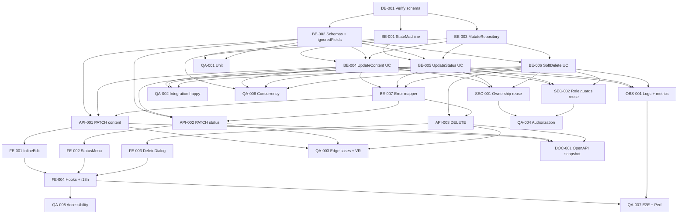

# Development Tasks — PB-P1-018 / US-029: Editar, transicionar estado o eliminar mi tarea (Organizer)

## 1. Metadata

| Field | Value |
|---|---|
| User Story ID | US-029 |
| Source User Story | `management/user-stories/US-029-edit-delete-task.md` |
| Source Technical Specification | `management/technical-specs/P1/PB-P1-018/US-029-technical-spec.md` |
| Decision Resolution Artifact | No aplica |
| Priority | P1 |
| Backlog ID | PB-P1-018 |
| Backlog Title | Gestión manual de tareas (CRUD + estados) |
| Backlog Execution Order | 36 (P0: 18 + posición 18 en P1); US-029 es la posición 3 de 4 dentro del item |
| User Story Position in Backlog Item | 3 de 4 |
| Related User Stories in Backlog Item | US-027, US-028, US-029, US-030 |
| Epic | EPIC-TASK-001 — Checklist & Task Management |
| Backlog Item Dependencies | PB-P0-001 (schema), PB-P1-006 (evento), PB-P1-012/016/017 (origen IA), PB-P0-014 (observabilidad) |
| Feature | Edición de contenido, transición de estado y soft delete de `EventTask` |
| Module / Domain | Tasks |
| Backlog Alignment Status | Found |
| Task Breakdown Status | Ready for Sprint Planning |
| Created Date | 2026-06-26 |
| Last Updated | 2026-06-26 |

---

## 2. Source Validation

| Source | Found | Used | Notes |
|---|---|---|---|
| User Story | Yes | Yes | Approved with Minor Notes; 6 AC, 14 EC, 14 VR, 9 SEC, 12 TS, 24 NT, 3 CONC. State machine canónica + inmutabilidad IA + soft delete enforced. |
| Technical Specification | Yes | Yes | Ready for Task Breakdown; fuente primaria. |
| Decision Resolution Artifact | No | No | No requerido; decisiones formalizadas en `/docs/16` §25.2/§25.4, `FR-TASK-003/004/005/011/012`, `UC-TASK-003`, `BR-TASK-002/004/005/006/010`, PO Decision PB-P1-018. |
| Product Backlog Prioritized | Yes | Yes | PB-P1-018 (posición 3 de 4). |
| ADRs | Yes | Yes | ADR-API-001 (`/api/v1` versionado), ADR-API-004 (correlation id). |

---

## 3. Backlog Execution Context

### Parent Backlog Item

`PB-P1-018 — Gestión manual de tareas (CRUD + estados)` agrupa la operación CRUD del checklist con state machine `pending → in_progress → done | skipped`, soft delete enforced y read-only sobre eventos `completed`. US-029 entrega las **tres mutaciones canónicas** del backlog item: PATCH content, PATCH status, DELETE (soft).

### Execution Order Rationale

US-029 se ejecuta en la posición 36 del orden global y posición 3 dentro del item porque:

1. Reusa `EventTaskRepository`, `TaskListItemDto`, `TaskListItemMapper`, `EventOwnershipPolicy`, `OrganizerRoleGuard`, `adminExclusionGuard` entregados por US-027 (vía Tech Spec) y `ServiceCategoryReadPort` formalizado por US-028.
2. US-030 (auditoría admin de soft-deleted) requiere que esta historia ya pueble correctamente `deleted_at` y `deleted_by_user_id`.
3. Los filtros temporales y % progreso (PB-P1-019 / US-032..033) consumen el state machine definitivo entregado aquí.

### Related User Stories in Same Backlog Item

| User Story | Role in Backlog Item | Suggested Order |
|---|---|---|
| US-027 | Listar tareas paginadas con filtros tolerantes | 1 |
| US-028 | Crear tarea manual | 2 |
| US-029 | Editar contenido + transicionar estado + soft delete | 3 |
| US-030 | Auditoría admin de tareas eliminadas (lectura) | 4 |

---

## 4. Task Breakdown Summary

| Area | Number of Tasks | Notes |
|---|---:|---|
| Database / Prisma (DB) | 1 | Verificación de columnas `updated_by_user_id`, `deleted_by_user_id`, `correlation_id`, enum `event_task_status` y reuso del índice parcial `idx_event_tasks_event_active`. Sin migraciones. |
| Backend (BE) | 7 | `EventTaskStateMachineService` puro; Zod schemas + helper `extractIgnoredFields`; `EventTaskMutateRepository` (interfaz + adapter Prisma); `UpdateEventTaskContentUseCase`; `UpdateEventTaskStatusUseCase`; `SoftDeleteEventTaskUseCase`; domain errors. |
| API Contract (API) | 3 | Controller `patchContent` (200 + `TaskListItemDto`), `patchStatus` (200 + idempotente `no_op`), `delete` (204). |
| Security / Authorization (SEC) | 2 | Reuso `EventOwnershipPolicy` (no-revelación 404); reuso `OrganizerRoleGuard` + `adminExclusionGuard`. |
| Observability / Audit (OBS) | 1 | 5 logs (`tasks.updated`, `tasks.updated.no_op`, `tasks.updated.blocked`, `tasks.deleted`, `tasks.deleted.blocked`) sin PII + 4 métricas Prometheus (`tasks_updated_total`, `tasks_deleted_total`, `tasks_mutate_latency_ms`, `tasks_transition_rejected_total{reason}`). |
| Frontend (FE) | 4 | `TaskItemInlineEdit` (RHF + Zod) con autosave/explicit save; `TaskStatusMenu` con transiciones permitidas derivadas del state machine; `DeleteTaskDialog` con focus trap; tres hooks TanStack (`useUpdateEventTaskContent`, `useUpdateEventTaskStatus`, `useDeleteEventTask`) con invalidación de `['tasks', eventId]` + i18n 4 locales + a11y WCAG AA. |
| QA / Testing (QA) | 7 | Unit (state machine + schemas + mappers); integration por use case (TS-01..09); API (Supertest, todos los códigos); concurrencia con `pg_advisory_xact_lock` (CONC-01..03); E2E (TS-12); a11y (axe + teclado + focus trap); performance budget `NFR-PERF-001`. |
| Documentation / Traceability (DOC) | 2 | OpenAPI snapshot vía US-098; cleanup editorial en `/docs/9` (UC canónico), `/docs/10` (NFR renumeración), `/docs/16` (`categoryHint`/`isSeed` legacy). |
| **Total** | **27** | AI = 0 (no invoca `LLMProvider`; preserva `ai_*` y `confirmed_at` como inmutables). SEED = 0 (fundación PB-P1-018 ya sembrada). |

---

## 5. Traceability Matrix

| Acceptance Criterion | Technical Spec Section | Task IDs |
|---|---|---|
| AC-01: Editar contenido válido | §7 UseCase, §7 Schema, §10 DB | BE-002, BE-003, BE-004, API-001, QA-002 |
| AC-02: Transicionar estado siguiendo state machine | §7 UseCase, §7 StateMachine | BE-001, BE-003, BE-005, API-002, QA-002 |
| AC-03: Soft delete | §7 UseCase, §10 DB | BE-003, BE-006, API-003, QA-002 |
| AC-04: Edición de tarea IA preserva trazabilidad | §7 UseCase, §10 DB | BE-002, BE-004, QA-002 |
| AC-05: `category_code=null` vacía | §7 Schema, §7 UseCase | BE-002, BE-004, QA-002 |
| AC-06: PATCH content y status independientes | §7 UseCases, §9 API | BE-004, BE-005, API-001, API-002, QA-002 |
| EC-01: Evento bloqueado | §7 UseCase, §10 DB | BE-004, BE-005, BE-006, QA-003 |
| EC-02: Transición inválida | §7 StateMachine | BE-001, BE-005, QA-003 |
| EC-03: Transición a sí mismo (no_op) | §7 StateMachine, §14 Logs | BE-001, BE-005, OBS-001, QA-003 |
| EC-04: Tarea soft-deleted o inexistente | §7 UseCase, §12 Security | BE-003, BE-004, BE-005, BE-006, SEC-001, QA-004 |
| EC-05: Doble DELETE | §7 UseCase | BE-006, QA-003 |
| EC-06: PATCH content vacío | §7 Schema | BE-002, QA-003 |
| EC-07: Server-controlled fields descartados | §7 Schema, §14 Logs | BE-002, OBS-001, QA-003 |
| EC-08: `due_date` pasada en pending | §7 UseCase | BE-002, BE-004, QA-003 |
| EC-09: `due_date` pasada en activas | §7 UseCase | BE-004, QA-003 |
| EC-10: `category_code` inválida | §7 UseCase, §7 ServiceCategoryReadPort | BE-004, QA-003 |
| EC-11: `description=null` | §7 Schema, §10 DB | BE-002, BE-004, QA-003 |
| EC-12: Vendor/admin | §12 Security | SEC-002, QA-004 |
| EC-13: Cancelación concurrente | §7 UseCase, §10 DB | BE-003, BE-004, QA-006 |
| EC-14: Content-Type inválido | §7 Controller | API-001, API-002, QA-003 |
| VR-01..14 | §7 Schemas, §7 UseCase | BE-002, BE-004, BE-005, BE-006, SEC-001, SEC-002 |
| SEC-01..09 | §12 Security | SEC-001, SEC-002, OBS-001, QA-004 |
| AUTH-TS-01..05 | §12 Negative Authz | SEC-001, SEC-002, QA-004 |
| CONC-01..03 | §13 Concurrency Tests | BE-003, BE-004, BE-005, QA-006 |
| Accesibilidad | §8 Accessibility | FE-001, FE-002, FE-003, QA-005 |
| Performance (`NFR-PERF-001`) | §13 CI Checks | OBS-001, QA-007 |
| `BR-AI-008/010` (`ai_generated`, `ai_recommendation_id`, `confirmed_at` inmutables) | §7 UseCase, §10 DB | BE-004, BE-005, QA-002 |
| `body.ignoredFields` log | §14 Logs | OBS-001, BE-002, QA-003 |

Cada AC mapea al menos a una tarea. Cada NT/AUTH-TS/SEC/CONC mapea a una tarea QA o SEC.

---

## 6. Development Tasks

### TASK-PB-P1-018-US-029-DB-001 — Verificar columnas, enum y constraints de `event_tasks` para el mutate path

| Field | Value |
|---|---|
| Area | DB |
| Type | Review |
| Priority | Must |
| Estimate | XS |
| Depends On | — |
| Source AC(s) | AC-01, AC-02, AC-03 |
| Technical Spec Section(s) | §10 Database / Prisma Design |
| Backlog ID | PB-P1-018 |
| User Story ID | US-029 |
| Owner Role | Backend |
| Status | To Do |

#### Objective

Confirmar que el schema vigente soporta las tres mutaciones de US-029 sin migraciones nuevas.

#### Scope

##### Include

* Columnas requeridas en `event_tasks`: `updated_at`, `updated_by_user_id (uuid FK → users.id)`, `deleted_at (timestamptz NULL)`, `deleted_by_user_id (uuid FK → users.id NULL)`, `correlation_id`.
* Enum `event_task_status` con valores `('pending', 'in_progress', 'done', 'skipped')`.
* Reuso del índice parcial `idx_event_tasks_event_active (event_id, status, due_date) WHERE deleted_at IS NULL` creado por US-027.
* FKs `event_tasks.event_id → events.id ON DELETE RESTRICT`, `event_tasks.category_code → service_categories.code ON DELETE RESTRICT`.

##### Exclude

* Migraciones nuevas.
* Cambios de índices.

#### Implementation Notes

* Si alguna columna faltase, abrir issue separado y bloquear US-029 antes del task breakdown.
* Verificar que `pg_advisory_xact_lock` es accesible desde Prisma (`tx.$executeRaw`).

#### Acceptance Criteria Covered

AC-01, AC-02, AC-03.

#### Definition of Done

- [ ] Schema confirmado en migraciones existentes (PB-P1-018 + PB-P0-014).
- [ ] Reporte de verificación adjunto en el PR.
- [ ] Si hay gaps, ticket de migración separado abierto.

---

### TASK-PB-P1-018-US-029-BE-001 — `EventTaskStateMachineService` puro con transiciones canónicas

| Field | Value |
|---|---|
| Area | BE |
| Type | Implementation |
| Priority | Must |
| Estimate | S |
| Depends On | DB-001 |
| Source AC(s) | AC-02, EC-02, EC-03 |
| Technical Spec Section(s) | §7 Backend Technical Design, §13 Unit Tests |
| Backlog ID | PB-P1-018 |
| User Story ID | US-029 |
| Owner Role | Backend |
| Status | To Do |

#### Objective

Implementar el servicio puro `EventTaskStateMachineService` con la state machine canónica `pending → {in_progress, done, skipped}`, `in_progress → {done, skipped}`, `done` y `skipped` terminales; idempotencia same-state.

#### Scope

##### Include

* Métodos:
  - `assertCanTransition(from: EventTaskStatus, to: EventTaskStatus): void` (lanza `InvalidTransitionError` con `details.current/requested/allowed`).
  - `allowedTransitionsFrom(status: EventTaskStatus): EventTaskStatus[]`.
  - `isSameState(from, to): boolean`.
* Constante exportable `TaskStatusTransitionsTable` para consumo del cliente.
* Sin I/O; sin dependencias Prisma.

##### Exclude

* Lógica de persistencia.
* Cualquier referencia a `confirmed_at` (delegado a US-025/US-031).

#### Implementation Notes

* `done → skipped` y `skipped → done` están **NO permitidas** en MVP (ambos terminales).
* `pending → pending`, `in_progress → in_progress`, etc., devuelven `isSameState=true` para que el use case devuelva `200 no_op`.

#### Acceptance Criteria Covered

AC-02, EC-02, EC-03.

#### Definition of Done

- [ ] Servicio exportado desde `domain/EventTaskStateMachineService.ts`.
- [ ] Tests unitarios cubren matriz completa (válidas, inválidas, idempotentes).
- [ ] Cobertura ≥ 95 % en este archivo.

---

### TASK-PB-P1-018-US-029-BE-002 — Zod schemas + helper `extractIgnoredFields` para los tres endpoints

| Field | Value |
|---|---|
| Area | BE |
| Type | Implementation |
| Priority | Must |
| Estimate | S |
| Depends On | DB-001 |
| Source AC(s) | AC-01, AC-04, AC-05, EC-06, EC-07, EC-08, EC-11, VR-01, VR-06, VR-07, VR-10, VR-14 |
| Technical Spec Section(s) | §7 DTOs / Schemas |
| Backlog ID | PB-P1-018 |
| User Story ID | US-029 |
| Owner Role | Backend |
| Status | To Do |

#### Objective

Definir los tres schemas Zod (`taskMutationParamsSchema`, `updateEventTaskBodySchema`, `updateEventTaskStatusBodySchema`) con `.strip()` + helper `extractIgnoredFields` reutilizado de US-028 para logging `body.ignoredFields`.

#### Scope

##### Include

* `taskMutationParamsSchema`: `eventId` + `taskId` ambos UUID v4.
* `updateEventTaskBodySchema` (content):
  - `title: z.string().trim().min(2).max(200).optional()`.
  - `description: z.string().max(2000).nullable().optional()`.
  - `due_date: z.string().datetime({ offset: true }).nullable().optional()`.
  - `category_code: z.string().min(1).max(64).nullable().optional()`.
  - `.strip()` final.
  - `.refine(hasAtLeastOneEditableField, { code: 'EMPTY_PATCH' })`.
* `updateEventTaskStatusBodySchema`: `status: z.enum(['pending','in_progress','done','skipped'])` + `.strip()`.
* `ServerControlledKeys` set canónico: `ai_generated, ai_recommendation_id, status (en content), id, created_by_user_id, created_at, updated_at, deleted_at, confirmed_at, language_code, event_id`.
* Reuso del helper `extractIgnoredFields(rawBody, allowedKeys)` de US-028.

##### Exclude

* Mensajes traducidos.
* Rechazar `400` por keys extras (descarte silencioso).

#### Implementation Notes

* El helper debe correrse **antes** del `.strip()` (sobre el body crudo).
* Validación de `due_date` futura se ejecuta en el use case (depende de `currentStatus`), no en el schema.

#### Acceptance Criteria Covered

AC-01, AC-04, AC-05, EC-06, EC-07, EC-08, EC-11, VR-01, VR-06, VR-07, VR-10, VR-14.

#### Definition of Done

- [ ] Schemas exportados desde `interface/schemas/`.
- [ ] Tests unitarios de límites + EMPTY_PATCH + ignoredFields.
- [ ] Schema cliente espejado compartido vía type-only import.

---

### TASK-PB-P1-018-US-029-BE-003 — `EventTaskMutateRepository` (interfaz + adapter Prisma)

| Field | Value |
|---|---|
| Area | BE |
| Type | Implementation |
| Priority | Must |
| Estimate | M |
| Depends On | DB-001, BE-002 |
| Source AC(s) | AC-01, AC-02, AC-03, EC-01, EC-04, EC-13 |
| Technical Spec Section(s) | §7 Repository / Persistence, §10 DB |
| Backlog ID | PB-P1-018 |
| User Story ID | US-029 |
| Owner Role | Backend |
| Status | To Do |

#### Objective

Implementar la interfaz `EventTaskMutateRepository` y su adapter Prisma con lock cooperativo y UPDATEs condicionales para las tres operaciones.

#### Scope

##### Include

* Interfaz con métodos: `acquireEventLock`, `findEventForMutation`, `findTaskOwnedByEvent`, `updateContent`, `updateStatusConditional`, `softDeleteConditional`.
* Adapter `PrismaEventTaskMutateRepository`:
  - `acquireEventLock(tx, eventId)` → `tx.$executeRaw\`SELECT pg_advisory_xact_lock(hashtext(${eventId}::text))\``.
  - `findEventForMutation(tx, eventId)` → SELECT que devuelve `id, owner_user_id, status, language_code` con `deleted_at IS NULL`.
  - `findTaskOwnedByEvent(tx, eventId, taskId)` → SELECT con `deleted_at IS NULL`.
  - `updateContent(tx, ..., fields, actorId, correlationId)` → UPDATE proyectando solo columnas editables + `updated_at`, `updated_by_user_id`, `correlation_id`.
  - `updateStatusConditional(tx, ..., currentStatus, newStatus, actorId, correlationId)` → UPDATE condicional `WHERE id=$task AND event_id=$event AND status=$current AND deleted_at IS NULL`; retorna `EventTaskRow | null` según `affected`.
  - `softDeleteConditional(tx, ..., actorId, correlationId)` → UPDATE `SET deleted_at=now(), deleted_by_user_id, updated_at, correlation_id WHERE deleted_at IS NULL`; retorna `boolean` según `affected`.
* SELECT diagnóstico tras `affected=0` para distinguir `404` vs `409 INVALID_TRANSITION` en `updateStatusConditional`.

##### Exclude

* Lógica de autorización (corresponde a use cases + policies).
* Modificación de `ai_generated`, `ai_recommendation_id`, `confirmed_at`, `language_code`, `created_by_user_id` (inmutables).

#### Implementation Notes

* Reuso del `EventTaskRepository` base de US-027 mediante composición.
* `isolationLevel: ReadCommitted` en el `$transaction` que llama a estos métodos (lo setean los use cases).

#### Acceptance Criteria Covered

AC-01, AC-02, AC-03, EC-01, EC-04, EC-13.

#### Definition of Done

- [ ] Adapter implementado y registrado en DI container.
- [ ] Tests integration con DB real validan lock + UPDATEs condicionales.
- [ ] Documentación del comportamiento de `affected=0` por método.

---

### TASK-PB-P1-018-US-029-BE-004 — `UpdateEventTaskContentUseCase` con transacción + lock + validación condicional

| Field | Value |
|---|---|
| Area | BE |
| Type | Implementation |
| Priority | Must |
| Estimate | M |
| Depends On | BE-001, BE-002, BE-003 |
| Source AC(s) | AC-01, AC-04, AC-05, AC-06, EC-01, EC-04, EC-08, EC-09, EC-10, EC-11, EC-13 |
| Technical Spec Section(s) | §7 UpdateEventTaskContentUseCase |
| Backlog ID | PB-P1-018 |
| User Story ID | US-029 |
| Owner Role | Backend |
| Status | To Do |

#### Objective

Orquestar pre-checks + lock + validaciones condicionales + UPDATE de contenido + mapeo a `TaskListItemDto`.

#### Scope

##### Include

* Orquestación:
  1. `OrganizerRoleGuard` + `adminExclusionGuard`.
  2. `prismaService.$transaction(async (tx) => { ... }, { isolationLevel: ReadCommitted })`.
  3. `acquireEventLock(tx, eventId)`.
  4. `findEventForMutation` → `EventOwnershipPolicy.assertOwnsEvent` (404 si no aplica); `EventNotMutableError` (`409 EVENT_NOT_MUTABLE`) si `event.status ∈ {cancelled, completed}`.
  5. `findTaskOwnedByEvent` (404 si soft-deleted).
  6. Validación `due_date` futura **solo** cuando `currentStatus === 'pending'` (tolerancia ±60s); en otro estado, acepta fecha pasada.
  7. Validación `category_code` cuando se envía y no es `null` vía `ServiceCategoryReadPort.findActiveByCode` (reuso US-028); `400 CATEGORY_NOT_AVAILABLE` si inválida o inactiva.
  8. `repository.updateContent(...)` proyectando solo campos editables.
  9. `TaskListItemMapper.toDto(updatedTask)`.
  10. Log `tasks.updated` con `fields_changed[]`.
* Domain errors: `EmptyPatchError`, `DueDateInPastError`, `CategoryNotAvailableError`, `EventNotMutableError`, `EventNotFoundError`, `TaskNotFoundError`.

##### Exclude

* Cambios en `status` (delegado a `UpdateEventTaskStatusUseCase`).
* Cualquier mutación en `confirmed_at`, `ai_generated`, `ai_recommendation_id`, `language_code`.

#### Implementation Notes

* Computar `fields_changed[]` comparando body parseado con la fila pre-UPDATE.
* `EMPTY_PATCH` se atrapa en el schema (BE-002), no aquí.

#### Acceptance Criteria Covered

AC-01, AC-04, AC-05, AC-06, EC-01, EC-04, EC-08, EC-09, EC-10, EC-11, EC-13.

#### Definition of Done

- [ ] Use case implementado con tests integration por AC/EC.
- [ ] Cobertura unit + integration ≥ 90 %.
- [ ] Verificación de inmutabilidad de campos prohibidos en respuesta.

---

### TASK-PB-P1-018-US-029-BE-005 — `UpdateEventTaskStatusUseCase` con state machine + idempotencia + UPDATE condicional

| Field | Value |
|---|---|
| Area | BE |
| Type | Implementation |
| Priority | Must |
| Estimate | M |
| Depends On | BE-001, BE-002, BE-003 |
| Source AC(s) | AC-02, AC-06, EC-01, EC-02, EC-03, EC-04, EC-13 |
| Technical Spec Section(s) | §7 UpdateEventTaskStatusUseCase, §7 StateMachine |
| Backlog ID | PB-P1-018 |
| User Story ID | US-029 |
| Owner Role | Backend |
| Status | To Do |

#### Objective

Orquestar pre-checks + lock + validación de state machine + UPDATE condicional + mapeo. Idempotencia same-state con `200 no_op`.

#### Scope

##### Include

* Orquestación:
  1. Pre-checks (`OrganizerRoleGuard`, `adminExclusionGuard`).
  2. `$transaction` + `acquireEventLock`.
  3. `findEventForMutation` → ownership + mutabilidad.
  4. `findTaskOwnedByEvent`.
  5. Si `current === requested` → no UPDATE; log `tasks.updated.no_op`; mapear y retornar DTO actual con `200`.
  6. En otro caso: `EventTaskStateMachineService.assertCanTransition(current, requested)` (puede lanzar `InvalidTransitionError → 409 INVALID_TRANSITION`).
  7. `repository.updateStatusConditional(...)`; si retorna `null`, diagnosticar `404` vs `409 INVALID_TRANSITION` con SELECT.
  8. `TaskListItemMapper.toDto`.
  9. Log `tasks.updated` con `previous_status`, `new_status`, `fields_changed: ['status']`.
* `confirmed_at` **NO** se actualiza aquí (delegado a US-025/US-031).

##### Exclude

* Cambios en otros campos del contenido.
* Cualquier interacción con `AIRecommendation`.

#### Implementation Notes

* La carrera `pending → in_progress` aplicada por dos clientes simultáneos: el primero gana, el segundo recibe `404` o `409 INVALID_TRANSITION` según diagnóstico. El lock minimiza esta carrera.

#### Acceptance Criteria Covered

AC-02, AC-06, EC-01, EC-02, EC-03, EC-04, EC-13.

#### Definition of Done

- [ ] Use case implementado con tests integration por AC/EC.
- [ ] Tests de idempotencia `same-state` validan ausencia de UPDATE (no avanza `updated_at`).
- [ ] Tests de inmutabilidad de `confirmed_at` durante transiciones.

---

### TASK-PB-P1-018-US-029-BE-006 — `SoftDeleteEventTaskUseCase` con UPDATE idempotente

| Field | Value |
|---|---|
| Area | BE |
| Type | Implementation |
| Priority | Must |
| Estimate | S |
| Depends On | BE-002, BE-003 |
| Source AC(s) | AC-03, EC-01, EC-04, EC-05 |
| Technical Spec Section(s) | §7 SoftDeleteEventTaskUseCase |
| Backlog ID | PB-P1-018 |
| User Story ID | US-029 |
| Owner Role | Backend |
| Status | To Do |

#### Objective

Orquestar soft delete idempotente; doble DELETE devuelve `404` (no-revelación).

#### Scope

##### Include

* Orquestación:
  1. Pre-checks.
  2. `$transaction` + lock.
  3. `findEventForMutation` → ownership + mutabilidad (`409 EVENT_NOT_MUTABLE`).
  4. `repository.softDeleteConditional(...)`; si retorna `false` → `404 NOT_FOUND`.
  5. `204 No Content` sin body.
  6. Log `tasks.deleted` con `task_id`, `event_id`, `actor_id`, `ai_generated`, `correlation_id`, `latency_ms`.
* Ignorar silenciosamente cualquier body recibido (DELETE).

##### Exclude

* Hard delete.
* Restauración (Future / US-030 lectura).

#### Implementation Notes

* Mantener consistencia con US-025/US-031: la `AIRecommendation` no se toca aunque la tarea sea IA.

#### Acceptance Criteria Covered

AC-03, EC-01, EC-04, EC-05.

#### Definition of Done

- [ ] Use case implementado con tests integration.
- [ ] Verificación de respuesta sin body en `204`.
- [ ] Tests de doble DELETE devuelven `404`.

---

### TASK-PB-P1-018-US-029-BE-007 — Domain errors + error mapper central para mutaciones de tareas

| Field | Value |
|---|---|
| Area | BE |
| Type | Implementation |
| Priority | Must |
| Estimate | XS |
| Depends On | BE-004, BE-005, BE-006 |
| Source AC(s) | AC-01..06, EC-01..14 |
| Technical Spec Section(s) | §7 Error Handling |
| Backlog ID | PB-P1-018 |
| User Story ID | US-029 |
| Owner Role | Backend |
| Status | To Do |

#### Objective

Centralizar el mapeo de errores de dominio a respuestas HTTP canónicas.

#### Scope

##### Include

* Mapping table:
  - `EmptyPatchError → 400 EMPTY_PATCH`.
  - `ZodError → 400 VALIDATION`.
  - `DueDateInPastError → 400 DUE_DATE_IN_PAST`.
  - `CategoryNotAvailableError → 400 CATEGORY_NOT_AVAILABLE`.
  - `RoleNotAllowedError → 403 FORBIDDEN`.
  - `EventNotFoundError | TaskNotFoundError | OwnershipMismatch → 404 NOT_FOUND`.
  - `EventNotMutableError → 409 EVENT_NOT_MUTABLE`.
  - `InvalidTransitionError → 409 INVALID_TRANSITION` (con `details.current/requested/allowed`).
  - Falla inesperada → `500 INTERNAL_ERROR`.
* Envelope `{ error: { code, message, details? } }`.

##### Exclude

* Mensajes traducidos al cliente (responsabilidad FE).

#### Implementation Notes

* Reusar el error mapper central de US-027/028 si ya existe; añadir solo los nuevos códigos.

#### Acceptance Criteria Covered

Todos los AC/EC.

#### Definition of Done

- [ ] Mapper actualizado en `interface/http/error-mapper.ts`.
- [ ] Tests unitarios por código.

---

### TASK-PB-P1-018-US-029-API-001 — Controller `patchContent` `PATCH /events/:eventId/tasks/:taskId`

| Field | Value |
|---|---|
| Area | API |
| Type | Implementation |
| Priority | Must |
| Estimate | S |
| Depends On | BE-002, BE-004, BE-007 |
| Source AC(s) | AC-01, AC-04, AC-05, AC-06, EC-14 |
| Technical Spec Section(s) | §9 API Contract Design |
| Backlog ID | PB-P1-018 |
| User Story ID | US-029 |
| Owner Role | Backend |
| Status | To Do |

#### Objective

Exponer el endpoint canónico de edición de contenido con respuesta `200 OK` + `TaskListItemDto`.

#### Scope

##### Include

* Handler `patchContent` en `EventTaskMutateController`.
* Validación `Content-Type: application/json` → `415 UNSUPPORTED_MEDIA_TYPE` si difiere.
* Validación path con `taskMutationParamsSchema`.
* Validación body con `updateEventTaskBodySchema` + cálculo de `body.ignoredFields` antes del `.strip()`.
* Inyección de `actor`, `correlationId` desde middleware.
* Llamada a `UpdateEventTaskContentUseCase`.
* Mapeo de errores con error mapper (BE-007).
* Response `200 OK` con `TaskListItemDto`.

##### Exclude

* Lógica de negocio (delegada al use case).

#### Implementation Notes

* Verificar registro en `src/router/v1.ts` y middleware de auth.

#### Acceptance Criteria Covered

AC-01, AC-04, AC-05, AC-06, EC-14.

#### Definition of Done

- [ ] Ruta registrada y accesible.
- [ ] Tests Supertest validan `200 OK` + envelope error por código.

---

### TASK-PB-P1-018-US-029-API-002 — Controller `patchStatus` `PATCH /events/:eventId/tasks/:taskId/status`

| Field | Value |
|---|---|
| Area | API |
| Type | Implementation |
| Priority | Must |
| Estimate | S |
| Depends On | BE-002, BE-005, BE-007 |
| Source AC(s) | AC-02, AC-06, EC-02, EC-03, EC-14 |
| Technical Spec Section(s) | §9 API Contract Design |
| Backlog ID | PB-P1-018 |
| User Story ID | US-029 |
| Owner Role | Backend |
| Status | To Do |

#### Objective

Exponer el endpoint canónico de transición de estado con respuesta `200 OK` + `TaskListItemDto` (idempotente same-state).

#### Scope

##### Include

* Handler `patchStatus`.
* Validación Content-Type → `415`.
* Validación path con `taskMutationParamsSchema`.
* Validación body con `updateEventTaskStatusBodySchema`.
* Llamada a `UpdateEventTaskStatusUseCase`.
* Mapeo de errores.

##### Exclude

* Edición de contenido (delegado a `API-001`).

#### Implementation Notes

* Mismo router; ruta `/status` registrada explícitamente para evitar matching ambiguo.

#### Acceptance Criteria Covered

AC-02, AC-06, EC-02, EC-03, EC-14.

#### Definition of Done

- [ ] Ruta registrada y accesible.
- [ ] Tests Supertest cubren transiciones válidas, inválidas e idempotentes.

---

### TASK-PB-P1-018-US-029-API-003 — Controller `delete` `DELETE /events/:eventId/tasks/:taskId`

| Field | Value |
|---|---|
| Area | API |
| Type | Implementation |
| Priority | Must |
| Estimate | XS |
| Depends On | BE-006, BE-007 |
| Source AC(s) | AC-03, EC-04, EC-05 |
| Technical Spec Section(s) | §9 API Contract Design |
| Backlog ID | PB-P1-018 |
| User Story ID | US-029 |
| Owner Role | Backend |
| Status | To Do |

#### Objective

Exponer el endpoint canónico de soft delete con respuesta `204 No Content`.

#### Scope

##### Include

* Handler `delete`.
* Validación path con `taskMutationParamsSchema`.
* Ignorar cualquier body recibido (no se valida Content-Type).
* Llamada a `SoftDeleteEventTaskUseCase`.
* Mapeo de errores.
* Response `204` sin body.

##### Exclude

* Hard delete.
* Validación de body.

#### Implementation Notes

* `204` no debe incluir `Content-Type` ni body.

#### Acceptance Criteria Covered

AC-03, EC-04, EC-05.

#### Definition of Done

- [ ] Ruta registrada y accesible.
- [ ] Tests Supertest validan `204` + doble DELETE devuelve `404`.

---

### TASK-PB-P1-018-US-029-SEC-001 — Reuso de `EventOwnershipPolicy` con no-revelación 404

| Field | Value |
|---|---|
| Area | SEC |
| Type | Review |
| Priority | Must |
| Estimate | XS |
| Depends On | BE-004, BE-005, BE-006 |
| Source AC(s) | EC-04, SEC-04 |
| Technical Spec Section(s) | §12 Security & Authorization Design |
| Backlog ID | PB-P1-018 |
| User Story ID | US-029 |
| Owner Role | Backend |
| Status | To Do |

#### Objective

Garantizar que los tres use cases reusan `EventOwnershipPolicy` y que las tres operaciones devuelven `404 NOT_FOUND` para evento ajeno, tarea de otro evento o tarea soft-deleted (no-revelación).

#### Scope

##### Include

* Verificación de uso en `UpdateEventTaskContentUseCase`, `UpdateEventTaskStatusUseCase`, `SoftDeleteEventTaskUseCase`.
* Tests de no-revelación cruzada: `taskId` válido pero de otro `eventId`; `eventId` ajeno.
* Documentar reuso en el módulo `mutate/` (no duplicar la policy).

##### Exclude

* Cambios a la policy en sí.

#### Implementation Notes

* Cualquier intento de inferencia desde `403` vs `404` debe rechazarse: siempre `404` para los casos arriba.

#### Acceptance Criteria Covered

EC-04, SEC-04.

#### Definition of Done

- [ ] Reuso documentado en `mutate/README.md` o cabecera del módulo.
- [ ] Tests de no-revelación verdes.

---

### TASK-PB-P1-018-US-029-SEC-002 — Reuso de `OrganizerRoleGuard` + `adminExclusionGuard`

| Field | Value |
|---|---|
| Area | SEC |
| Type | Review |
| Priority | Must |
| Estimate | XS |
| Depends On | BE-004, BE-005, BE-006 |
| Source AC(s) | EC-12, SEC-02, AUTH-TS-01..05 |
| Technical Spec Section(s) | §12 Role Rules |
| Backlog ID | PB-P1-018 |
| User Story ID | US-029 |
| Owner Role | Backend |
| Status | To Do |

#### Objective

Garantizar que vendor y admin reciben `403 FORBIDDEN` antes de tocar la base en los tres endpoints (no mutación, no leak de IDs).

#### Scope

##### Include

* Verificación de orden de ejecución: `OrganizerRoleGuard` y `adminExclusionGuard` corren **antes** del `$transaction`.
* Reuso documentado, sin duplicación.
* Tests por rol + por endpoint.

##### Exclude

* Modificación de las guards (responsabilidad US-027/028).

#### Implementation Notes

* `FR-ADMIN-010`: admin no participa en HITL ni en mutaciones de checklist.

#### Acceptance Criteria Covered

EC-12, SEC-02, AUTH-TS-01..05.

#### Definition of Done

- [ ] Reuso documentado.
- [ ] Tests por rol verdes.

---

### TASK-PB-P1-018-US-029-OBS-001 — 5 logs estructurados + 4 métricas Prometheus + propagación correlation

| Field | Value |
|---|---|
| Area | OBS |
| Type | Implementation |
| Priority | Must |
| Estimate | S |
| Depends On | BE-004, BE-005, BE-006 |
| Source AC(s) | AC-01, AC-02, AC-03, EC-01, EC-03, SEC-05, SEC-06 |
| Technical Spec Section(s) | §14 Observability & Audit |
| Backlog ID | PB-P1-018 |
| User Story ID | US-029 |
| Owner Role | Backend |
| Status | To Do |

#### Objective

Instrumentar telemetría granular para las tres mutaciones, sin PII en logs.

#### Scope

##### Include

* Logs estructurados:
  - `tasks.updated`: PATCH content o status que persiste; campos `task_id`, `event_id`, `actor_id`, `ai_generated`, `fields_changed[]`, `previous_status?`, `new_status?`, `correlation_id`, `latency_ms`.
  - `tasks.updated.no_op`: PATCH status `from === to`; campos `task_id`, `event_id`, `actor_id`, `status`, `correlation_id`.
  - `tasks.updated.blocked`: PATCH rechazado por `409 EVENT_NOT_MUTABLE`; campos `task_id`, `event_id`, `actor_id`, `event_status`, `correlation_id`.
  - `tasks.deleted`: DELETE exitoso; campos `task_id`, `event_id`, `actor_id`, `ai_generated`, `correlation_id`, `latency_ms`.
  - `tasks.deleted.blocked`: DELETE rechazado por `409`; campos `task_id`, `event_id`, `actor_id`, `event_status`, `correlation_id`.
  - Atributo embebido `body.ignoredFields` cuando aplique.
* Métricas Prometheus:
  - `tasks_updated_total{operation="content|status", ai_generated="true|false"}` Counter.
  - `tasks_deleted_total{ai_generated="true|false"}` Counter.
  - `tasks_mutate_latency_ms{operation="content|status|delete"}` Histogram.
  - `tasks_transition_rejected_total{reason="invalid_transition|event_not_mutable"}` Counter.
* Propagación de `correlation_id` desde header `X-Correlation-Id` (o generado por middleware) a la columna `event_tasks.correlation_id` y a los logs.

##### Exclude

* `title`, `description`, `category_code` literales en logs.
* `AdminAction` (no aplica).

#### Implementation Notes

* `latency_ms` medido desde entrada del controller hasta respuesta.

#### Acceptance Criteria Covered

AC-01, AC-02, AC-03, EC-01, EC-03, SEC-05, SEC-06.

#### Definition of Done

- [ ] Logs disponibles en pipeline de observabilidad.
- [ ] Métricas exportadas en `/metrics`.
- [ ] Verificación de ausencia de PII en logs.

---

### TASK-PB-P1-018-US-029-FE-001 — `TaskItemInlineEdit` con RHF + Zod + a11y WCAG AA

| Field | Value |
|---|---|
| Area | FE |
| Type | Implementation |
| Priority | Must |
| Estimate | M |
| Depends On | API-001 |
| Source AC(s) | AC-01, AC-04, AC-05, EC-06, EC-08, EC-10, EC-11 |
| Technical Spec Section(s) | §8 Components, §8 Accessibility |
| Backlog ID | PB-P1-018 |
| User Story ID | US-029 |
| Owner Role | Frontend |
| Status | To Do |

#### Objective

Implementar la edición inline de campos de `TaskItem` con RHF + Zod y soporte completo de teclado y lectores de pantalla.

#### Scope

##### Include

* Campos editables independientes: `title` (single-line), `description` (textarea), `due_date` (date picker), `category_code` (combobox con catálogo activo de `ServiceCategory` reuso de US-028).
* Cada campo tiene mini-form propio con `zodResolver` (schema cliente espejado del backend).
* Atajos teclado: `Enter` guarda, `Esc` cancela, `Tab` avanza entre acciones.
* `aria-describedby` para errores; `aria-live='polite'` para anuncios.
* Reuso de `TaskItem` de US-027 integrando este sub-componente.
* Estados loading (spinner inline) y error (banner inline con `role='alert'` por código).

##### Exclude

* Edición global con un único Save.
* Edición del badge IA.

#### Implementation Notes

* No incluir `category_code` lookup en el cliente; lo valida server-side.
* Mensajes de error: `EMPTY_PATCH`, `DUE_DATE_IN_PAST`, `CATEGORY_NOT_AVAILABLE`, `EVENT_NOT_MUTABLE`, `NOT_FOUND`.

#### Acceptance Criteria Covered

AC-01, AC-04, AC-05, EC-06, EC-08, EC-10, EC-11.

#### Definition of Done

- [ ] Componente implementado en `apps/web/src/features/tasks/mutate/`.
- [ ] Tests RTL + axe verdes.
- [ ] Verificación de operación 100 % por teclado.

---

### TASK-PB-P1-018-US-029-FE-002 — `TaskStatusMenu` con transiciones permitidas + confirm dialog terminal

| Field | Value |
|---|---|
| Area | FE |
| Type | Implementation |
| Priority | Must |
| Estimate | S |
| Depends On | API-002 |
| Source AC(s) | AC-02, EC-02, EC-03 |
| Technical Spec Section(s) | §8 Components, §8 Accessibility |
| Backlog ID | PB-P1-018 |
| User Story ID | US-029 |
| Owner Role | Frontend |
| Status | To Do |

#### Objective

Implementar el menú de transición de estado que solo muestra las transiciones válidas según `currentStatus`, derivadas de la constante compartida `TaskStatusTransitionsTable`.

#### Scope

##### Include

* Dropdown `aria-haspopup='menu'` con navegación por flechas y `Enter`.
* Confirm dialog cuando la transición es a `done` o `skipped` (terminal).
* Manejo de error `409 INVALID_TRANSITION` con banner localizado.
* Indicador visual de `no_op` cuando se selecciona el estado actual.

##### Exclude

* Edición libre del estado (no input de texto).

#### Implementation Notes

* Consumir la constante exportada desde `EventTaskStateMachineService` para evitar drift cliente/servidor.

#### Acceptance Criteria Covered

AC-02, EC-02, EC-03.

#### Definition of Done

- [ ] Componente implementado.
- [ ] Tests RTL + axe verdes.
- [ ] Navegación por flechas validada.

---

### TASK-PB-P1-018-US-029-FE-003 — `DeleteTaskDialog` con focus trap + i18n + confirmación destructiva

| Field | Value |
|---|---|
| Area | FE |
| Type | Implementation |
| Priority | Must |
| Estimate | S |
| Depends On | API-003 |
| Source AC(s) | AC-03, EC-05 |
| Technical Spec Section(s) | §8 Components, §8 Accessibility |
| Backlog ID | PB-P1-018 |
| User Story ID | US-029 |
| Owner Role | Frontend |
| Status | To Do |

#### Objective

Implementar el diálogo de confirmación de eliminación con focus trap y patrón destructivo accesible.

#### Scope

##### Include

* `aria-modal='true'`, `aria-labelledby`, focus trap, foco inicial en "Cancelar".
* Botón destructivo "Eliminar" con `data-testid='delete-task-confirm'`.
* Mensajes localizados (`tasks.mutate.delete.*`).
* Cierre con `Esc` y click fuera (solo cierra; no elimina).
* Estado loading durante DELETE.
* Manejo de error: `409 EVENT_NOT_MUTABLE` banner persistente; `404` toast + invalidate.

##### Exclude

* Undo en el toast (Future).
* Restauración self-service.

#### Implementation Notes

* Reuso del primitivo `Dialog` del design system.

#### Acceptance Criteria Covered

AC-03, EC-05.

#### Definition of Done

- [ ] Componente implementado.
- [ ] Tests RTL + axe + focus trap verdes.

---

### TASK-PB-P1-018-US-029-FE-004 — Hooks TanStack (3) con invalidación + i18n 4 locales

| Field | Value |
|---|---|
| Area | FE |
| Type | Implementation |
| Priority | Must |
| Estimate | S |
| Depends On | FE-001, FE-002, FE-003 |
| Source AC(s) | AC-01, AC-02, AC-03, AC-06 |
| Technical Spec Section(s) | §8 State Management, §8 i18n |
| Backlog ID | PB-P1-018 |
| User Story ID | US-029 |
| Owner Role | Frontend |
| Status | To Do |

#### Objective

Implementar `useUpdateEventTaskContent`, `useUpdateEventTaskStatus`, `useDeleteEventTask` con TanStack Query y mensajes traducidos en 4 locales.

#### Scope

##### Include

* `useMutation` por endpoint.
* `onSuccess`: `queryClient.invalidateQueries({ queryKey: ['tasks', eventId] })`; opcional `setQueryData` con el `TaskListItemDto` recibido para optimistic UI.
* `onError`: rollback de optimistic update si aplica; toast localizado derivado de `error.code`.
* `next-intl` namespace `tasks.mutate.*` con claves para labels, errores, confirmaciones, toasts (4 locales: `es`, `en`, `pt`, `fr`).
* Mensajes interpolan `{currentStatus}` con traducción independiente.

##### Exclude

* Lógica de UI (delegada a FE-001/002/003).

#### Implementation Notes

* Reusar el cliente `tasksApi` extendiendo con `update(eventId, taskId, payload)`, `updateStatus(...)`, `delete(...)`.

#### Acceptance Criteria Covered

AC-01, AC-02, AC-03, AC-06.

#### Definition of Done

- [ ] Hooks exportados y consumidos por FE-001/002/003.
- [ ] Catálogos i18n completos en 4 locales.
- [ ] Tests con MSW cubren onSuccess + onError por código.

---

### TASK-PB-P1-018-US-029-QA-001 — Tests unitarios: state machine + schemas + mappers

| Field | Value |
|---|---|
| Area | QA |
| Type | Test |
| Priority | Must |
| Estimate | S |
| Depends On | BE-001, BE-002 |
| Source AC(s) | AC-01..06, EC-02, EC-03 |
| Technical Spec Section(s) | §13 Unit Tests |
| Backlog ID | PB-P1-018 |
| User Story ID | US-029 |
| Owner Role | QA |
| Status | To Do |

#### Objective

Cubrir con tests unitarios el state machine, los schemas Zod y el mapper.

#### Scope

##### Include

* `EventTaskStateMachineService`: matriz completa de transiciones.
* `updateEventTaskBodySchema`: límites de `title`, `description`, `due_date`, `category_code`, `EMPTY_PATCH`, stripping de server-controlled fields.
* `updateEventTaskStatusBodySchema`: enum válido / inválido.
* `extractIgnoredFields` helper.
* `TaskListItemMapper.toDto` preserva `ai_generated`, `ai_recommendation_id`, `confirmed_at`.

##### Exclude

* Tests integration (delegados a QA-002).

#### Implementation Notes

* Vitest con `describe.each` para la matriz de transiciones.

#### Acceptance Criteria Covered

AC-01..06, EC-02, EC-03.

#### Definition of Done

- [ ] Cobertura unit ≥ 95 % en archivos cubiertos.
- [ ] Tests verdes en CI.

---

### TASK-PB-P1-018-US-029-QA-002 — Tests integration por use case (Happy Path AC-01..06)

| Field | Value |
|---|---|
| Area | QA |
| Type | Test |
| Priority | Must |
| Estimate | M |
| Depends On | BE-004, BE-005, BE-006 |
| Source AC(s) | AC-01..06 |
| Technical Spec Section(s) | §13 Integration Tests |
| Backlog ID | PB-P1-018 |
| User Story ID | US-029 |
| Owner Role | QA |
| Status | To Do |

#### Objective

Cubrir con tests integration los happy paths de los tres use cases incluyendo preservación de inmutabilidad IA.

#### Scope

##### Include

* `UpdateEventTaskContentUseCase`: AC-01, AC-04 (tarea IA), AC-05 (category null), AC-06 (independencia).
* `UpdateEventTaskStatusUseCase`: AC-02, AC-06 (independencia), inmutabilidad de `confirmed_at` en transiciones.
* `SoftDeleteEventTaskUseCase`: AC-03.
* Verificación de respuesta `TaskListItemDto` consistente con US-027.

##### Exclude

* Edge cases (delegados a QA-003).

#### Implementation Notes

* DB de pruebas con fixtures de tareas IA y manuales.

#### Acceptance Criteria Covered

AC-01..06.

#### Definition of Done

- [ ] Tests verdes con DB real.
- [ ] Cobertura ≥ 90 % en `mutate/`.

---

### TASK-PB-P1-018-US-029-QA-003 — Tests integration de Edge Cases (EC-01..14) + Validation Rules

| Field | Value |
|---|---|
| Area | QA |
| Type | Test |
| Priority | Must |
| Estimate | M |
| Depends On | BE-004, BE-005, BE-006, API-001, API-002, API-003 |
| Source AC(s) | EC-01..14, VR-01..14 |
| Technical Spec Section(s) | §13 Integration / API Tests |
| Backlog ID | PB-P1-018 |
| User Story ID | US-029 |
| Owner Role | QA |
| Status | To Do |

#### Objective

Cubrir los 14 Edge Cases y las 14 Validation Rules con tests integration + API.

#### Scope

##### Include

* EC-01 evento bloqueado → `409 EVENT_NOT_MUTABLE`.
* EC-02 transición inválida → `409 INVALID_TRANSITION` con `details`.
* EC-03 transición a sí mismo → `200 no_op` sin avance de `updated_at`.
* EC-05 doble DELETE → `404`.
* EC-06 PATCH vacío → `400 EMPTY_PATCH`.
* EC-07 server-controlled fields descartados + log `body.ignoredFields`.
* EC-08 `due_date` pasada en pending → `400 DUE_DATE_IN_PAST`.
* EC-09 `due_date` pasada en activas → aceptada.
* EC-10 `category_code` inválida → `400 CATEGORY_NOT_AVAILABLE`.
* EC-11 `description=null` persiste.
* EC-14 Content-Type incorrecto → `415`.

##### Exclude

* Tests de authz (delegados a QA-004).
* Tests de concurrencia (delegados a QA-006).

#### Implementation Notes

* Supertest + Vitest + DB de pruebas.

#### Acceptance Criteria Covered

EC-01..03, EC-05..11, EC-14, VR-01..14.

#### Definition of Done

- [ ] Tests verdes.
- [ ] Verificación de envelope de error por código.

---

### TASK-PB-P1-018-US-029-QA-004 — Tests authorization (AUTH-TS-01..05) + no-revelación cruzada

| Field | Value |
|---|---|
| Area | QA |
| Type | Test |
| Priority | Must |
| Estimate | S |
| Depends On | SEC-001, SEC-002 |
| Source AC(s) | EC-04, EC-12, SEC-01..09, AUTH-TS-01..05 |
| Technical Spec Section(s) | §12 Security & Authorization Design |
| Backlog ID | PB-P1-018 |
| User Story ID | US-029 |
| Owner Role | QA |
| Status | To Do |

#### Objective

Validar exhaustivamente el modelo de autorización y la no-revelación.

#### Scope

##### Include

* Vendor → `403` por endpoint (×3).
* Admin → `403` por endpoint (×3).
* Organizer no dueño → `404`.
* Tarea de otro evento → `404`.
* Tarea soft-deleted → `404`.
* Anónimo → `401`.

##### Exclude

* Tests de happy/edge (otras QA).

#### Implementation Notes

* Usar sesiones reales por rol; no mockear el role guard.

#### Acceptance Criteria Covered

EC-04, EC-12, SEC-01..09, AUTH-TS-01..05.

#### Definition of Done

- [ ] Tests verdes.
- [ ] Verificación de ausencia de leak entre `403` y `404` para no-revelación.

---

### TASK-PB-P1-018-US-029-QA-005 — Tests de accesibilidad (axe + teclado + focus trap + aria-live)

| Field | Value |
|---|---|
| Area | QA |
| Type | Test |
| Priority | Must |
| Estimate | S |
| Depends On | FE-001, FE-002, FE-003, FE-004 |
| Source AC(s) | Accesibilidad |
| Technical Spec Section(s) | §8 Accessibility, §13 Accessibility Tests |
| Backlog ID | PB-P1-018 |
| User Story ID | US-029 |
| Owner Role | QA |
| Status | To Do |

#### Objective

Validar accesibilidad de los componentes de mutación.

#### Scope

##### Include

* `TaskItemInlineEdit` operable por teclado (Enter/Esc/Tab).
* `TaskStatusMenu` con `role='menu'` y navegación con flechas.
* `DeleteTaskDialog` con focus trap y `aria-modal`.
* `aria-live='polite'` para anuncios de éxito/error.
* Contraste AA en banners, badges y botones destructivos.
* `axe-core` sin violaciones.

##### Exclude

* Tests funcionales (delegados a otras QA).

#### Implementation Notes

* `@testing-library` + `jest-axe` o equivalente.

#### Acceptance Criteria Covered

Accesibilidad (transversal).

#### Definition of Done

- [ ] Tests verdes en CI.
- [ ] Reporte axe sin violaciones críticas.

---

### TASK-PB-P1-018-US-029-QA-006 — Tests de concurrencia con `pg_advisory_xact_lock` (CONC-01..03)

| Field | Value |
|---|---|
| Area | QA |
| Type | Test |
| Priority | Must |
| Estimate | S |
| Depends On | BE-003, BE-004, BE-005, BE-006 |
| Source AC(s) | EC-13, CONC-01..03 |
| Technical Spec Section(s) | §13 Concurrency Tests, §10 DB |
| Backlog ID | PB-P1-018 |
| User Story ID | US-029 |
| Owner Role | QA |
| Status | To Do |

#### Objective

Validar el comportamiento bajo concurrencia con lock cooperativo.

#### Scope

##### Include

* Dos PATCH content simultáneos al mismo `taskId`: ambos persisten secuencialmente; ninguno corrompe data.
* Dos PATCH status `pending → in_progress` simultáneos: el primero gana; el segundo recibe `404` o `409 INVALID_TRANSITION` según diagnóstico.
* Cancelación de evento concurrente con PATCH status: el lock cooperativo garantiza consistencia (200 o 409 según orden).
* Dos DELETE simultáneos: uno gana con `204`; el otro recibe `404`.

##### Exclude

* Tests de happy path (delegados a QA-002).

#### Implementation Notes

* Usar `Promise.all` con DB real y aislamiento `ReadCommitted`.

#### Acceptance Criteria Covered

EC-13, CONC-01..03.

#### Definition of Done

- [ ] Tests verdes con DB real.
- [ ] Documentado el comportamiento esperado por escenario.

---

### TASK-PB-P1-018-US-029-QA-007 — Tests E2E (Playwright TS-12) + performance budget `NFR-PERF-001`

| Field | Value |
|---|---|
| Area | QA |
| Type | Test |
| Priority | Must |
| Estimate | M |
| Depends On | FE-001, FE-002, FE-003, FE-004, OBS-001 |
| Source AC(s) | AC-01..06, EC-01, EC-02, EC-12, NFR-PERF-001 |
| Technical Spec Section(s) | §13 E2E Tests, §13 CI Checks |
| Backlog ID | PB-P1-018 |
| User Story ID | US-029 |
| Owner Role | QA |
| Status | To Do |

#### Objective

Cubrir el flujo completo end-to-end y validar el budget de performance.

#### Scope

##### Include

* Playwright TS-12: inline edit → transición de estado → soft delete sobre seed de demo con rol Organizer.
* Verificación visual de banner read-only en evento `completed`.
* Verificación visual de feedback `409 INVALID_TRANSITION`.
* Budget P95 < 1.5 s validado en stage con dataset realista (≥ 1k tasks por evento).

##### Exclude

* Tests unit/integration (delegados a otras QA).

#### Implementation Notes

* Reuso del seed de demo de PB-P0-014.
* Métrica de latencia validada vía `tasks_mutate_latency_ms`.

#### Acceptance Criteria Covered

AC-01..06, EC-01, EC-02, EC-12, NFR-PERF-001.

#### Definition of Done

- [ ] E2E verde en CI canary.
- [ ] Reporte de budget < 1.5 s P95 adjunto.

---

### TASK-PB-P1-018-US-029-DOC-001 — Coordinación de snapshot OpenAPI vía US-098

| Field | Value |
|---|---|
| Area | DOC |
| Type | Documentation |
| Priority | Should |
| Estimate | XS |
| Depends On | API-001, API-002, API-003 |
| Source AC(s) | AC-01..06 |
| Technical Spec Section(s) | §16 Documentation Alignment |
| Backlog ID | PB-P1-018 |
| User Story ID | US-029 |
| Owner Role | Tech Lead |
| Status | To Do |

#### Objective

Regenerar el snapshot OpenAPI para reflejar los tres endpoints canónicos de US-029.

#### Scope

##### Include

* Coordinación con US-098 para regenerar `docs/16-API-Design-Specification.md` snapshot.
* Validación de que los tres endpoints aparecen con `TaskListItemDto`, `EMPTY_PATCH`, `INVALID_TRANSITION`, etc.

##### Exclude

* Modificación manual del snapshot.

#### Implementation Notes

* Tarea no bloqueante; el snapshot se cierra cuando US-098 corra.

#### Acceptance Criteria Covered

AC-01..06.

#### Definition of Done

- [ ] PR de coordinación abierto contra US-098.

---

### TASK-PB-P1-018-US-029-DOC-002 — Cleanup editorial en `/docs/9`, `/docs/10`, `/docs/16`

| Field | Value |
|---|---|
| Area | DOC |
| Type | Documentation |
| Priority | Should |
| Estimate | XS |
| Depends On | — |
| Source AC(s) | — (cleanup editorial transversal) |
| Technical Spec Section(s) | §16 Documentation Alignment |
| Backlog ID | PB-P1-018 |
| User Story ID | US-029 |
| Owner Role | Tech Lead |
| Status | To Do |

#### Objective

Aplicar las 3 alineaciones documentales no bloqueantes detectadas durante el refinamiento.

#### Scope

##### Include

* `/docs/10`: renumerar `NFR-PERF-API-001 → NFR-PERF-001`.
* `/docs/9`: mapear `FR-TASK-003` → `UC-TASK-003` y `FR-TASK-005` → `UC-TASK-003` (autoridad UCS).
* `/docs/16` §25.3: eliminar `categoryHint: string` y `EventTaskResponseDto.isSeed` (legacy); reemplazar por `category_code` FK + `TaskListItemDto` canónico.

##### Exclude

* Modificación del schema o del código fuente.

#### Implementation Notes

* Cleanup editorial; no afecta implementación.

#### Acceptance Criteria Covered

— (cleanup editorial).

#### Definition of Done

- [ ] PR editorial mergeado contra `/docs/9`, `/docs/10`, `/docs/16`.

---

## 7. Required QA Tasks

| Task ID | Test Type | Purpose |
|---|---|---|
| QA-001 | Unit | State machine + schemas + mappers. |
| QA-002 | Integration | Happy paths AC-01..06 + inmutabilidad IA. |
| QA-003 | Integration / API | Edge cases EC-01..14 + VR-01..14. |
| QA-004 | Authorization | AUTH-TS-01..05 + no-revelación cruzada. |
| QA-005 | Accessibility | axe + teclado + focus trap + aria-live. |
| QA-006 | Concurrency | CONC-01..03 con `pg_advisory_xact_lock`. |
| QA-007 | E2E + Performance | TS-12 + budget `NFR-PERF-001`. |

---

## 8. Required Security Tasks

| Task ID | Security Concern | Purpose |
|---|---|---|
| SEC-001 | Ownership / no-revelación | Reuso de `EventOwnershipPolicy`; verificación de `404` para no-dueños/tarea de otro evento/soft-deleted. |
| SEC-002 | Role exclusion (vendor/admin) | Reuso de `OrganizerRoleGuard` + `adminExclusionGuard` con ejecución previa al `$transaction`. |

---

## 9. Required Seed / Demo Tasks

`No aplica`. La fundación PB-P1-018 ya cubre los datos demo de tareas IA y manuales necesarios. Los tests integration reusan ese seed.

---

## 10. Observability / Audit Tasks

| Task ID | Concern | Purpose |
|---|---|---|
| OBS-001 | Telemetría granular sin PII | 5 logs estructurados + 4 métricas Prometheus + propagación `correlation_id` a `event_tasks`. |

---

## 11. Documentation / Traceability Tasks

| Task ID | Document / Artifact | Purpose |
|---|---|---|
| DOC-001 | OpenAPI snapshot vía US-098 | Coordinar regeneración del snapshot con los tres endpoints. |
| DOC-002 | `/docs/9`, `/docs/10`, `/docs/16` | Cleanup editorial de las 3 alineaciones detectadas. |

---

## 12. Dependency Graph

---

## 13. Suggested Implementation Order

### Phase 1 — Foundation
1. DB-001 (verificación schema).
2. BE-001 (state machine) + BE-002 (schemas) en paralelo.
3. BE-003 (repository).

### Phase 2 — Core Implementation
4. BE-004, BE-005, BE-006 (use cases) en paralelo.
5. BE-007 (error mapper).
6. API-001, API-002, API-003 (controllers) en paralelo.
7. OBS-001 (telemetría).

### Phase 3 — Validation / Security / QA
8. SEC-001, SEC-002 (reuso + tests no-revelación).
9. FE-001, FE-002, FE-003 (componentes) en paralelo.
10. FE-004 (hooks + i18n).
11. QA-001..007 (suite completa).

### Phase 4 — Documentation / Review
12. DOC-001 (OpenAPI snapshot) y DOC-002 (cleanup editorial).
13. Code review + cierre del PR.

---

## 14. Risks & Mitigations

| Risk | Impact | Mitigation | Related Task |
| ---- | ------ | ---------- | ------------ |
| Carrera entre HITL (US-025) y PATCH status sobre la misma tarea | UPDATE pisa `confirmed_at` indirectamente | `confirmed_at` no se toca; UPDATE proyecta solo `status`, `updated_*`, `correlation_id`; test integration explícito. | BE-005, QA-002 |
| Lock cooperativo agresivo bloquea otros endpoints | Latencia P95 incrementada | Lock scope `xact` (libera al final); transacciones cortas; lock por `eventId` aísla impacto. | BE-003, QA-007 |
| Drift entre state machine cliente y servidor | UI ofrece transición que backend rechaza | Constante compartida `TaskStatusTransitionsTable`; test E2E valida coherencia. | BE-001, FE-002, QA-007 |
| Pérdida de trazabilidad IA por bug en mapper | Badge IA desaparece tras edición | Unit test del mapper + integration AC-04 con tarea IA. | QA-001, QA-002 |
| Cliente envía body grande en DELETE | Pérdida de banda | Express estándar limita body; use case ignora cualquier body en DELETE. | API-003 |
| Snapshot OpenAPI desactualizado | Discrepancia documental | DOC-001 coordina con US-098. | DOC-001 |

---

## 15. Out of Scope Confirmation

* Hard delete por API.
* Restauración self-service de tareas eliminadas (admin only en US-030 o Future).
* Undo en el toast tras eliminar (Future).
* Bulk PATCH/DELETE transversal (bulk confirm IA cubierto por US-031).
* Edición de `ai_generated`, `ai_recommendation_id`, `confirmed_at`, `language_code`, `created_by_user_id`.
* `If-Match` / `ETag` para concurrencia.
* Endpoint admin paralelo de mutación.
* Notificaciones push o email tras la mutación (Future).
* Edición masiva vía CSV o import.
* Asignación a múltiples usuarios o reasignación (Future).
* Cualquier mutación de `confirmed_at` (delegado a US-025/US-031).

---

## 16. Readiness for Sprint Planning

| Check                                      | Status |
| ------------------------------------------ | ------ |
| Product Backlog mapping found              | Pass   |
| Every AC maps to tasks                     | Pass   |
| Technical Spec used when available         | Pass   |
| QA tasks included                          | Pass   |
| Security tasks included if applicable      | Pass   |
| Seed/demo tasks included if applicable     | N/A    |
| Observability tasks included if applicable | Pass   |
| Documentation tasks included if applicable | Pass   |
| Task dependencies clear                    | Pass   |
| Tasks small enough                         | Pass   |
| Ready for Sprint Planning                  | Yes    |

---

## 17. Final Recommendation

`Ready for Sprint Planning`

US-029 queda lista para Sprint Planning. Las 27 tareas cubren los 6 AC, 14 EC, 14 VR, 9 SEC, 12 TS, 24 NT y 3 CONC documentados en la User Story y la Technical Specification. La arquitectura reusa todo el andamiaje de US-027 (repository, DTO, mapper, ownership policy, role guards) y de US-028 (`ServiceCategoryReadPort`, helper `extractIgnoredFields`), aislando lo nuevo en `src/modules/tasks/mutate/` y un servicio puro `EventTaskStateMachineService`. Sin migraciones nuevas. Las 3 alineaciones documentales (`/docs/9`, `/docs/10`, `/docs/16`) son cleanup editorial cubierto por DOC-001/DOC-002.
