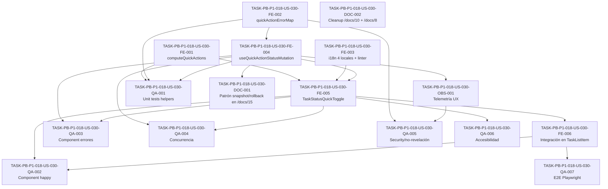

# Development Tasks — PB-P1-018 / US-030: Cambiar el estado de mi tarea con un toque rápido (Organizer)

## 1. Metadata

| Field | Value |
|---|---|
| User Story ID | US-030 |
| Source User Story | `management/user-stories/US-030-change-task-status.md` |
| Source Technical Specification | `management/technical-specs/P1/PB-P1-018/US-030-technical-spec.md` |
| Decision Resolution Artifact | No aplica |
| Priority | P1 |
| Backlog ID | PB-P1-018 |
| Backlog Title | CRUD de tareas manuales y máquina de estados |
| Backlog Execution Order | 36 (P0: 18 + posición 18 en P1); US-030 es la posición **4 de 4** dentro del item |
| User Story Position in Backlog Item | 4 de 4 |
| Related User Stories in Backlog Item | US-027, US-028, US-029, US-030 |
| Epic | EPIC-TASK-001 — Checklist & Task Management |
| Backlog Item Dependencies | PB-P0-001 (auth + sesión), PB-P1-006 (creación de eventos), PB-P0-014 (observabilidad cliente); dependencia hard de US-029 dentro del mismo item |
| Feature | Quick-action UX para transición de estado de `EventTask` |
| Module / Domain | Tasks (Frontend UX layer) |
| Backlog Alignment Status | Found |
| Task Breakdown Status | Ready for Sprint Planning |
| Created Date | 2026-06-26 |
| Last Updated | 2026-06-26 |

---

## 2. Source Validation

| Source | Found | Used | Notes |
|---|---|---|---|
| User Story | Yes | Yes | Approved with Minor Notes; 5 AC, 8 EC, 6 VR (UX layer), 5 SEC, 8 TS, 6 NT, 3 AUTH-TS, 4 A11Y, 2 CONC. UX-only — sin backend. |
| Technical Specification | Yes | Yes | Ready for Task Breakdown; fuente primaria. |
| Decision Resolution Artifact | No | No | No requerido; decisiones formalizadas en FR-TASK-004/011, UC-TASK-004 transversal, BR-TASK-004/010, NFR-PERF-001/OBS-001/A11Y-001, PO Decision PB-P1-018. |
| Product Backlog Prioritized | Yes | Yes | PB-P1-018 (posición 4 de 4). |
| ADRs | Yes | Yes | Reuso íntegro de ADRs ya aplicados por US-029 (ADR-API-001, ADR-API-004). |

---

## 3. Backlog Execution Context

### Parent Backlog Item

`PB-P1-018 — CRUD de tareas manuales y máquina de estados` agrupa las cuatro historias del módulo de checklist manual: lista (US-027), creación (US-028), edición + transición de estado + soft delete (US-029) y la **capa UX de transición rápida (US-030)** que es esta historia.

Acceptance Summary del item:

* Validación de estados (no transiciones inválidas).
* Read-only en `event.status='completed'`; bloqueado en `cancelled`.
* Soft delete enforced.

Traceability del item: `FR-TASK-001..005 · UC-TASK-001..004 · BR-TASK-001..010`.

### Execution Order Rationale

US-030 es la **última posición** del item (4 de 4) porque consume directamente:

1. El endpoint canónico `PATCH /api/v1/events/:eventId/tasks/:taskId/status` y el hook `useUpdateEventTaskStatus` que entrega **US-029**.
2. La fila `TaskListItem`, el `TaskListItemDto` y la query TanStack `['tasks', eventId]` que entrega **US-027**.

No tiene sentido implementarla antes de US-029. Su posición también respeta el principio "MVP-first / foundation before product": los CRUD básicos preceden a los refinamientos de UX.

### Related User Stories in Same Backlog Item

| User Story | Role in Backlog Item | Suggested Order |
|---|---|---|
| US-027 | Vista paginada del checklist; provee `TaskListItem`, `TaskListItemDto`, query TanStack | 1 |
| US-028 | Creación manual de tareas; provee `EventTaskRepository`, `EventOwnershipPolicy`, `OrganizerRoleGuard`, `adminExclusionGuard`, `ServiceCategoryReadPort` | 2 |
| US-029 | Edición de contenido, transición de estado y soft delete; provee endpoint canónico de status, state machine, `useUpdateEventTaskStatus` y `TaskStatusMenu` | 3 |
| US-030 | Capa UX-only de transición rápida (esta historia) | 4 |

---

## 4. Task Breakdown Summary

| Area | Number of Tasks | Notes |
|---|---:|---|
| Database / Prisma (DB) | **0** | UX-only. Sin tablas, columnas, índices, constraints, migraciones ni seeds nuevos. |
| Backend (BE) | **0** | UX-only. Sin controllers, use cases, Zod schemas, repositorios, errores de dominio. Reuso íntegro de US-029. |
| API Contract (API) | **0** | Sin endpoints nuevos. Reuso de `PATCH /api/v1/events/:eventId/tasks/:taskId/status` de US-029. |
| Security / Authorization (SEC) | **0** | Authorization 100% backend (US-029). El cliente sólo decide affordances visuales. |
| AI / PromptOps (AI) | **0** | No invoca `LLMProvider` ni persiste `AIRecommendation`. |
| Seed / Demo Data (SEED) | **0** | Se aprovecha el seed sembrado por US-018 / US-028 (tareas IA + manuales). |
| DevOps / Environment (OPS) | **0** | Sin cambios de infraestructura. |
| Frontend (FE) | 6 | Helper puro `computeQuickActions`; mapeo de errores `quickActionErrorMap`; catálogos i18n 4 locales con linter; wrapper `useQuickActionStatusMutation` (snapshot/rollback); componente `TaskStatusQuickToggle` (WCAG AA); integración mínima en `TaskListItem` (US-027). |
| Observability / Audit (OBS) | 1 | Wiring de 4 eventos UX `task.status.quick_action.{requested|succeeded|failed|rolled_back}` con payload sin PII + fallback `console.debug` con flag `EVENTFLOW_TELEMETRY_DEBUG`. |
| QA / Testing (QA) | 7 | Unit (matriz + mapeo + rewrite); component tests (TS-01..07, NT-01..06); concurrencia (CONC-01..02); seguridad (no-revelación + ausencia PII); accesibilidad (A11Y-01..04 + axe + NVDA/VoiceOver smoke); E2E Playwright (TS-08); performance UX (latencia percibida < 100 ms). |
| Documentation / Traceability (DOC) | 2 | Documentation Alignment: `/docs/15` patrón snapshot/rollback; `/docs/10` NFR renumeración + `/docs/8` UC anclaje. OpenAPI snapshot no aplica (endpoint reusado de US-029). |
| **Total** | **16** | **Sin tareas DB/BE/API/SEC/AI/SEED/OPS.** Toda la historia se concentra en FE + OBS + QA + DOC. |

---

## 5. Traceability Matrix

| Acceptance Criterion | Technical Spec Section | Task IDs |
|---|---|---|
| AC-01: Marcar como hecho desde `pending` con optimistic update | §6, §8 Componente, §8 Wrapper | FE-001, FE-004, FE-005, FE-006, QA-002, QA-003 |
| AC-02: Saltar tarea desde `in_progress` | §6, §8 Componente, §8 Matriz | FE-001, FE-005, FE-006, QA-002 |
| AC-03: Desmarcar hecho (`done → in_progress`) | §6, §8 Matriz, §8 Componente | FE-001, FE-005, FE-006, QA-002 |
| AC-04: Reanudar desde `skipped` | §6, §8 Matriz, §8 Componente | FE-001, FE-005, FE-006, QA-002 |
| AC-05: Idempotencia same-state percibida como no_op | §6, §8 Wrapper | FE-004, OBS-001, QA-002 |
| EC-01: 409 INVALID_TRANSITION | §6, §8 Wrapper, §8 Error Map | FE-002, FE-004, OBS-001, QA-003 |
| EC-02: 409 EVENT_NOT_MUTABLE | §6, §8 Wrapper, §8 Error Map | FE-002, FE-004, OBS-001, QA-003 |
| EC-03: 404 NOT_FOUND (tarea ajena/soft-deleted) | §6, §8 Error Map, §12 Security | FE-002, FE-004, QA-003, QA-005 |
| EC-04: 403 FORBIDDEN | §6, §8 Error Map, §12 Security | FE-002, FE-004, QA-003, QA-005 |
| EC-05: 5xx con Toast transient + retry | §6, §8 Estados, §8 Error Map | FE-002, FE-004, FE-005, QA-003 |
| EC-06: Doble click rápido | §8 Estados, §8 Wrapper | FE-004, FE-005, QA-003 |
| EC-07: Evento bloqueado (`cancelled|completed`) | §6, §8 Estados, §8 Componente | FE-001, FE-005, QA-002, QA-006 |
| EC-08: Tarea soft-deleted transitoria | §6, §8 Wrapper | FE-004, QA-003 |

Cada AC mapea al menos a una tarea. Cada EC mapea al menos a una tarea de implementación o QA.

---

## 6. Development Tasks

### TASK-PB-P1-018-US-030-FE-001 — Helper puro `computeQuickActions(taskStatus, eventStatus)` con matriz canónica

| Field | Value |
|---|---|
| Area | FE |
| Type | Implementation |
| Priority | Must |
| Estimate | S |
| Depends On | — |
| Source AC(s) | AC-01..04, EC-07 |
| Technical Spec Section(s) | §8 Frontend — Helper puro `computeQuickActions`; §8 Matriz canónica |
| Backlog ID | PB-P1-018 |
| User Story ID | US-030 |
| Owner Role | Frontend |
| Status | To Do |

#### Objective

Crear un helper puro y libre de dependencias que devuelva las acciones rápidas visibles + habilitadas para un par `(taskStatus, eventStatus)` siguiendo la matriz canónica del Tech Spec.

#### Scope

##### Include

* Función `computeQuickActions(taskStatus, eventStatus): QuickActionMatrixRow[]`.
* Tipos `QuickAction`, `QuickActionMatrixRow` exportados desde `apps/web/src/features/tasks/quick-action/compute-quick-actions.ts`.
* Matriz canónica: `pending|in_progress → done`, `done → in_progress`, `* → skipped`, `skipped → in_progress`.
* Reglas de `enabled`: `eventStatus ∉ {cancelled, completed}`.
* Exposición de `ariaLabelKey` y `iconKey` por fila.

##### Exclude

* Cualquier hook de TanStack o efecto secundario.
* La transición `pending ↔ in_progress` (queda en `TaskStatusMenu` de US-029).

#### Implementation Notes

* Mantener el helper puro y serializable; los tests deben validar la matriz completa caso por caso.
* Las claves i18n se mantienen en string; este helper no resuelve traducciones.

#### Acceptance Criteria Covered

AC-01, AC-02, AC-03, AC-04, EC-07.

#### Definition of Done

- [ ] Helper exportado con tipos.
- [ ] Matriz canónica completa documentada en JSDoc.
- [ ] Unit tests cubren las 8 filas canónicas + bordes (`cancelled`, `completed`).
- [ ] Sin dependencias de React/TanStack.

---

### TASK-PB-P1-018-US-030-FE-002 — Mapeo de errores `quickActionErrorMap(error)` → clave i18n + variante de Toast

| Field | Value |
|---|---|
| Area | FE |
| Type | Implementation |
| Priority | Must |
| Estimate | S |
| Depends On | — |
| Source AC(s) | EC-01..05 |
| Technical Spec Section(s) | §8 Frontend — Error mapping; §12 Security (no-revelación) |
| Backlog ID | PB-P1-018 |
| User Story ID | US-030 |
| Owner Role | Frontend |
| Status | To Do |

#### Objective

Mapear `error.code` / `error.httpStatus` del backend de US-029 a una clave i18n + variante de Toast (`info` / `warning` / `error` / `transient`) para que `useQuickActionStatusMutation` consuma una única función pura.

#### Scope

##### Include

* `quickActionErrorMap(error): { i18nKey, toastVariant, includeRetry, errorCode }`.
* Mapa explícito de:
  * `409 INVALID_TRANSITION` → `tasks.status.error.invalid_transition` (interpola `{currentStatus}`, `{requestedStatus}`).
  * `409 EVENT_NOT_MUTABLE` → `tasks.status.error.event_not_mutable`.
  * `404 NOT_FOUND` → `tasks.status.error.not_found_or_forbidden` (no-revelación).
  * `403 FORBIDDEN` → `tasks.status.error.not_found_or_forbidden` (mismo string que 404).
  * `5xx` → `tasks.status.error.transient` con `includeRetry=true`.
* `errorCode` se propaga a telemetría pero **no** al DOM visible.

##### Exclude

* Resolución real de i18n (responsabilidad del componente).
* Renderizado del Toast.

#### Implementation Notes

* La función es pura y testeable sin React.
* Mantener `403`/`404` con la misma `i18nKey` para garantizar no-revelación.

#### Acceptance Criteria Covered

EC-01, EC-02, EC-03, EC-04, EC-05.

#### Definition of Done

- [ ] Mapa exportado y tipado.
- [ ] Unit tests para los 5 códigos canónicos + caso default (red unknown).
- [ ] Verificación de que `403` y `404` devuelven la **misma** `i18nKey`.

---

### TASK-PB-P1-018-US-030-FE-003 — Catálogos i18n en 4 locales + linter build-time

| Field | Value |
|---|---|
| Area | FE |
| Type | Implementation |
| Priority | Must |
| Estimate | S |
| Depends On | — |
| Source AC(s) | AC-01..05, EC-01..05, EC-07 |
| Technical Spec Section(s) | §8 Frontend — i18n |
| Backlog ID | PB-P1-018 |
| User Story ID | US-030 |
| Owner Role | Frontend |
| Status | To Do |

#### Objective

Agregar las claves i18n canónicas en los 4 locales (`es-MX`, `es-AR`, `en-US`, `pt-BR`) y activar el linter build-time que falla si alguna clave existe en `es-MX` pero falta en cualquier otro locale.

#### Scope

##### Include

* Claves nuevas en `apps/web/locales/{es-MX,es-AR,en-US,pt-BR}/tasks.json`:
  * `tasks.status.quick_action.label.{check_done|uncheck_done|skip|resume}`.
  * `tasks.status.quick_action.aria.{check_done|uncheck_done|skip|resume}`.
  * `tasks.status.quick_action.announce.{done|in_progress|skipped}`.
  * `tasks.status.error.{invalid_transition|event_not_mutable|not_found_or_forbidden|transient}`.
  * `tasks.status.disabled.{event_locked|mutation_pending}`.
* Linter (script en `pnpm` o equivalente) que compara claves entre locales y falla en CI si falta alguna.

##### Exclude

* Cambios fuera del namespace `tasks.status.quick_action.*` y `tasks.status.error.*` / `tasks.status.disabled.*`.

#### Implementation Notes

* Mantener la `i18nKey` para `403` y `404` igual (`not_found_or_forbidden`) para garantizar no-revelación en los 4 locales.
* Usar redacciones neutras y consistentes con la guía de tono ya aplicada en US-027/028/029.

#### Acceptance Criteria Covered

AC-01..05, EC-01..05, EC-07.

#### Definition of Done

- [ ] Claves presentes en los 4 locales.
- [ ] Linter falla deterministamente si falta una clave.
- [ ] CI ejecuta el linter en cada PR.

---

### TASK-PB-P1-018-US-030-FE-004 — Wrapper `useQuickActionStatusMutation(eventId, task)` con snapshot/rollback verificable

| Field | Value |
|---|---|
| Area | FE |
| Type | Implementation |
| Priority | Must |
| Estimate | M |
| Depends On | FE-002 |
| Source AC(s) | AC-01..05, EC-01..06, EC-08 |
| Technical Spec Section(s) | §8 Frontend — Wrapper de hook; §17 Risks; §14 Observability |
| Backlog ID | PB-P1-018 |
| User Story ID | US-030 |
| Owner Role | Frontend |
| Status | To Do |

#### Objective

Wrapper composable sobre `useUpdateEventTaskStatus` (US-029) que implementa el patrón canónico optimistic update + rollback con snapshot deep-clone, `cancelQueries`, `setQueryData`, `invalidateQueries` en `onSettled`, y emite los 4 eventos UX de telemetría.

#### Scope

##### Include

* `useQuickActionStatusMutation(eventId, task)` con:
  * `onMutate`: `await queryClient.cancelQueries({ queryKey: ['tasks', eventId] })`, snapshot deep-clone vía `structuredClone` o helper equivalente, `setQueryData` con `rewriteTaskStatus`, generación de `correlation_id` cliente si no existe, emisión de `requested`. Retorna `{ snapshot, requestedAt }`.
  * `onSuccess`: sustituir entrada con `TaskListItemDto` devuelto, emitir `succeeded` con `latency_ms` y `idempotent` cuando aplica.
  * `onError`: `setQueryData(snapshot)`, invocar `quickActionErrorMap`, disparar `Toast`, emitir `failed` + `rolled_back` con `errorCode` y `http_status`.
  * `onSettled`: `queryClient.invalidateQueries({ queryKey: ['tasks', eventId] })`.
* Helper `rewriteTaskStatus(tasks, taskId, status)` puro: devuelve nueva lista con la tarea reescrita; no muta input.

##### Exclude

* Cualquier componente UI.
* Cambios en la query `['tasks', eventId]` provisto por US-027.

#### Implementation Notes

* `cancelQueries` debe completarse **antes** del snapshot para evitar race con re-fetch.
* `requested` se emite después del `setQueryData` (para garantizar que el orden de la telemetría refleje el flujo real).
* Para garantizar el rollback verificable, los tests deben hacer deep-equal entre el estado post-rollback y el snapshot original.

#### Acceptance Criteria Covered

AC-01..05, EC-01..06, EC-08.

#### Definition of Done

- [ ] Hook exportado y tipado.
- [ ] Unit tests con TanStack `QueryClient` instanciado en memoria.
- [ ] Verificación deep-equal post-rollback en al menos un test.
- [ ] Cobertura de los 4 eventos de telemetría con payload correcto.

---

### TASK-PB-P1-018-US-030-FE-005 — Componente `TaskStatusQuickToggle` (WCAG AA + animación reducida)

| Field | Value |
|---|---|
| Area | FE |
| Type | Implementation |
| Priority | Must |
| Estimate | M |
| Depends On | FE-001, FE-003, FE-004 |
| Source AC(s) | AC-01..05, EC-05..07 |
| Technical Spec Section(s) | §8 Frontend — Componente; §8 Accessibility; §17 Risks |
| Backlog ID | PB-P1-018 |
| User Story ID | US-030 |
| Owner Role | Frontend |
| Status | To Do |

#### Objective

Implementar el componente reusable `TaskStatusQuickToggle` que renderiza el checkbox principal + botón secundario según `computeQuickActions`, dispara la mutación vía `useQuickActionStatusMutation` y respeta WCAG AA + `prefers-reduced-motion`.

#### Scope

##### Include

* Estructura visual: checkbox principal (`role="checkbox"`, `aria-checked`) + botón secundario (`role="button"`, `aria-pressed` cuando aplica).
* Etiquetas dinámicas (`Marcar como hecho` / `Desmarcar` / `Saltar` / `Reanudar`) según la fila de la matriz.
* Región `aria-live="polite"` contigua que anuncia el nuevo estado al éxito.
* Bloqueo `aria-disabled="true"` + tooltip cuando `event.status ∈ {cancelled, completed}` o `mutation.isPending`.
* Spinner inline ≤ 16 px durante `mutation.isPending`.
* Animación de check ≤ 200 ms respetando `@media (prefers-reduced-motion: reduce)`.
* Target táctil ≥ 44 × 44 px.
* Contraste WCAG AA en modos light/dark.
* Soporte de teclado `Tab`, `Space`, `Enter`.

##### Exclude

* `TaskStatusMenu` (transiciones `pending ↔ in_progress`, responsabilidad de US-029).
* Bulk transitions (responsabilidad de US-031).
* Estados personalizados o workflow configurable.

#### Implementation Notes

* No leer la cache directamente; recibir `task` y `eventStatus` por props desde `TaskListItem`.
* Si `event.status` cambia a `cancelled|completed` durante la sesión, deshabilitar suave con animación reducida.
* Reutilizar tokens de design system existentes (`/docs/15`).

#### Acceptance Criteria Covered

AC-01..05, EC-05, EC-06, EC-07.

#### Definition of Done

- [ ] Componente exportado y documentado en Storybook (o equivalente).
- [ ] Estados `default`, `pending`, `success`, `error`, `disabled` visualmente verificados.
- [ ] Verificación manual de `prefers-reduced-motion`.
- [ ] Snapshot de a11y axe-core verde.

---

### TASK-PB-P1-018-US-030-FE-006 — Integración del Toggle en `TaskListItem` (US-027) con diff mínimo

| Field | Value |
|---|---|
| Area | FE |
| Type | Implementation |
| Priority | Must |
| Estimate | S |
| Depends On | FE-005 |
| Source AC(s) | AC-01..05 |
| Technical Spec Section(s) | §8 Frontend — Composición con `TaskListItem`; §18 Implementation Guidance |
| Backlog ID | PB-P1-018 |
| User Story ID | US-030 |
| Owner Role | Frontend |
| Status | To Do |

#### Objective

Componer `TaskStatusQuickToggle` dentro de `TaskListItem` (US-027) con un diff mínimo, propagando `task`, `eventId` y `eventStatus` desde el contexto de lista.

#### Scope

##### Include

* Modificación de `TaskListItem.tsx` para renderizar el Toggle en la zona izquierda de la fila.
* Propagación de `event.status` desde el padre (`EventChecklistPage`) si aún no llegaba.
* Smoke test del listado existente para asegurar no-regresión.

##### Exclude

* Cambios en la query `['tasks', eventId]`.
* Cambios en la paginación o filtros.

#### Implementation Notes

* Si la fila ya tenía un placeholder de toggle/check, sustituirlo manteniendo layout existente.
* Opcional: feature flag de cliente para activar gradualmente (si la organización lo requiere); no obligatorio.

#### Acceptance Criteria Covered

AC-01..05.

#### Definition of Done

- [ ] `TaskListItem` renderiza el Toggle sin romper layout responsive.
- [ ] Tests existentes de US-027 siguen verdes.
- [ ] Verificación visual en modo light/dark.

---

### TASK-PB-P1-018-US-030-OBS-001 — Wiring de 4 eventos UX `task.status.quick_action.*` con fallback `console.debug`

| Field | Value |
|---|---|
| Area | OBS |
| Type | Implementation |
| Priority | Must |
| Estimate | S |
| Depends On | FE-004 |
| Source AC(s) | AC-01, AC-05, EC-01..05 |
| Technical Spec Section(s) | §14 Observability & Audit; §17 Risks |
| Backlog ID | PB-P1-018 |
| User Story ID | US-030 |
| Owner Role | Frontend |
| Status | To Do |

#### Objective

Integrar los 4 eventos UX (`requested|succeeded|failed|rolled_back`) en el wrapper de mutation con payload canónico **sin PII**. Implementar fallback `console.debug` con flag `EVENTFLOW_TELEMETRY_DEBUG` cuando `useTelemetryClient` aún no esté disponible.

#### Scope

##### Include

* Wiring de los 4 eventos en `onMutate` / `onSuccess` / `onError`:
  * `requested`: `{ event_id, task_id, from_status, to_status, action, correlation_id, ui_origin: 'quick_action' }`.
  * `succeeded`: `requested.payload + { latency_ms, idempotent?: boolean }`.
  * `failed`: `requested.payload + { error_code, http_status }`.
  * `rolled_back`: `requested.payload + { reason: 'mutation_error', error_code }`.
* Verificación explícita en runtime: nunca incluir `title` o `description`.
* Fallback `console.debug` activado por env `EVENTFLOW_TELEMETRY_DEBUG=true` cuando el cliente real (PB-P0-014) no esté disponible.

##### Exclude

* Definición del transporte o backend de telemetría (responsabilidad de PB-P0-014).
* Métricas backend (responsabilidad de US-029).

#### Implementation Notes

* Mantener el payload serializable y compatible con la convención del backend.
* Emitir `requested` después del `setQueryData` pero dentro del mismo `onMutate` para garantizar orden temporal.

#### Acceptance Criteria Covered

AC-01, AC-05, EC-01..05.

#### Definition of Done

- [ ] Cuatro eventos emitidos con payload validado por schema.
- [ ] Smoke test que asegura ausencia de `title`/`description` en payload.
- [ ] Fallback `console.debug` activable vía env.

---

### TASK-PB-P1-018-US-030-QA-001 — Unit tests: matriz `computeQuickActions` + `rewriteTaskStatus` + `quickActionErrorMap`

| Field | Value |
|---|---|
| Area | QA |
| Type | Test |
| Priority | Must |
| Estimate | S |
| Depends On | FE-001, FE-002, FE-004 |
| Source AC(s) | AC-01..05, EC-01..05, EC-07 |
| Technical Spec Section(s) | §13 Testing Strategy — Unit Tests |
| Backlog ID | PB-P1-018 |
| User Story ID | US-030 |
| Owner Role | QA |
| Status | To Do |

#### Objective

Cubrir con Vitest los tres helpers puros que sustentan la historia: matriz canónica, reescritura de cache y mapeo de errores.

#### Scope

##### Include

* `computeQuickActions`: 8 filas canónicas + bordes (`event.status ∈ {cancelled, completed}`).
* `rewriteTaskStatus`: idempotencia, no muta input, tarea inexistente devuelve lista intacta.
* `quickActionErrorMap`: 5 códigos canónicos + caso default; verificación de igualdad de `i18nKey` para 403/404.

##### Exclude

* Tests del componente o de TanStack.

#### Implementation Notes

* Snapshot tests permitidos para la matriz; no para el mapeo de errores.

#### Acceptance Criteria Covered

AC-01..05, EC-01..05, EC-07.

#### Definition of Done

- [ ] ≥ 95% de cobertura en los tres helpers.
- [ ] Tests deterministas.

---

### TASK-PB-P1-018-US-030-QA-002 — Component tests happy path (TS-01..05)

| Field | Value |
|---|---|
| Area | QA |
| Type | Test |
| Priority | Must |
| Estimate | M |
| Depends On | FE-005, FE-006 |
| Source AC(s) | AC-01..05, EC-07 |
| Technical Spec Section(s) | §13 Testing Strategy — Integration Tests |
| Backlog ID | PB-P1-018 |
| User Story ID | US-030 |
| Owner Role | QA |
| Status | To Do |

#### Objective

Cubrir con Vitest + RTL + MSW los 5 AC happy-path y los casos de idempotencia y bloqueo por evento.

#### Scope

##### Include

* TS-01 AC-01 happy path con MSW `200 OK` + `TaskListItemDto` actualizado.
* TS-02 AC-02 "Saltar" desde `in_progress`.
* TS-03 AC-03 desmarcar `done → in_progress`.
* TS-04 AC-04 reanudar desde `skipped`.
* TS-05 AC-05 idempotent same-state — cache idéntica al snapshot, sin Toast.
* Cobertura de EC-07 (`event.status='completed'` → `disabled`).

##### Exclude

* Casos de error (cubiertos por QA-003).
* Concurrencia (cubierta por QA-004).

#### Implementation Notes

* Usar MSW handlers configurables por test.
* Validar que la región `aria-live` anuncia el estado correcto.

#### Acceptance Criteria Covered

AC-01, AC-02, AC-03, AC-04, AC-05, EC-07.

#### Definition of Done

- [ ] 6 tests verdes en CI.
- [ ] Sin flakiness en 50 corridas seguidas.

---

### TASK-PB-P1-018-US-030-QA-003 — Component tests errores + rollback (NT-01..06, TS-06..07)

| Field | Value |
|---|---|
| Area | QA |
| Type | Test |
| Priority | Must |
| Estimate | M |
| Depends On | FE-004, FE-005 |
| Source AC(s) | EC-01..06 |
| Technical Spec Section(s) | §13 Testing Strategy — Integration Tests; §17 Risks |
| Backlog ID | PB-P1-018 |
| User Story ID | US-030 |
| Owner Role | QA |
| Status | To Do |

#### Objective

Verificar que cada respuesta de error del backend produce: rollback verificable (deep-equal con snapshot), Toast con clave i18n correcta, y emisión de `failed` + `rolled_back`.

#### Scope

##### Include

* TS-06 optimistic + rollback verifica snapshot deep equal.
* TS-07 doble click rápido emite solo una mutación (`mutation.isPending` deshabilita el toggle).
* NT-01 `409 INVALID_TRANSITION` → rollback + Toast `invalid_transition` + telemetría.
* NT-02 `409 EVENT_NOT_MUTABLE` → rollback + Toast `event_not_mutable` + telemetría.
* NT-03 `404 NOT_FOUND` → rollback + Toast `not_found_or_forbidden` (genérico).
* NT-04 `403 FORBIDDEN` → rollback + Toast `not_found_or_forbidden` (idéntico al 404).
* NT-05 `5xx` → rollback + Toast `transient` + botón "Reintentar".
* NT-06 `event.status='completed'` recibido → toggle `disabled` + `aria-disabled='true'`.

##### Exclude

* Concurrencia con re-fetch (cubierta por QA-004).

#### Implementation Notes

* El test de deep-equal debe usar `structuredClone(snapshot)` y comparar con la cache post-rollback.

#### Acceptance Criteria Covered

EC-01..06, EC-07.

#### Definition of Done

- [ ] 8 tests verdes en CI.
- [ ] Verificación explícita de la igualdad de `i18nKey` para 403 y 404.

---

### TASK-PB-P1-018-US-030-QA-004 — Concurrencia (CONC-01..02): dobles clicks + re-fetch en vuelo

| Field | Value |
|---|---|
| Area | QA |
| Type | Test |
| Priority | Must |
| Estimate | S |
| Depends On | FE-004, FE-005 |
| Source AC(s) | AC-01, EC-06 |
| Technical Spec Section(s) | §13 Testing Strategy — Integration Tests; §17 Risks |
| Backlog ID | PB-P1-018 |
| User Story ID | US-030 |
| Owner Role | QA |
| Status | To Do |

#### Objective

Verificar el comportamiento del wrapper bajo concurrencia: dobles clicks rápidos, click mientras la query está re-fetcheando.

#### Scope

##### Include

* CONC-01: dos clicks rápidos antes de que la mutación resuelva → segundo ignorado.
* CONC-02: click mientras `['tasks', eventId]` está re-fetcheando → `cancelQueries` cancela el fetch; `onSettled` reconcilia.
* Verificación de orden de telemetría: `requested` precede a `succeeded`/`failed`.

##### Exclude

* Concurrencia entre múltiples tareas distintas (out of scope).

#### Implementation Notes

* Usar `QueryClient` con `staleTime: 0` para forzar re-fetch.
* Simular latencia con MSW.

#### Acceptance Criteria Covered

AC-01, EC-06.

#### Definition of Done

- [ ] Ambos tests verdes en CI.
- [ ] Orden de telemetría verificado.

---

### TASK-PB-P1-018-US-030-QA-005 — Seguridad: no-revelación + ausencia de PII en telemetría

| Field | Value |
|---|---|
| Area | QA |
| Type | Test |
| Priority | Must |
| Estimate | S |
| Depends On | FE-002, OBS-001 |
| Source AC(s) | EC-03, EC-04 |
| Technical Spec Section(s) | §12 Security; §14 Observability |
| Backlog ID | PB-P1-018 |
| User Story ID | US-030 |
| Owner Role | QA |
| Status | To Do |

#### Objective

Verificar que:

1. El Toast para `403` y `404` produce **exactamente** el mismo string visible.
2. Los payloads de los 4 eventos UX **nunca** incluyen `title`, `description` ni ningún otro campo PII.

#### Scope

##### Include

* Test que monta la respuesta `403` y `404` y captura el contenido del DOM del Toast: debe ser idéntico.
* Snapshot del payload emitido en cada uno de los 4 eventos; assertions de exclusión de claves PII.

##### Exclude

* Verificación backend (cubierta en US-029).

#### Implementation Notes

* Validar contra una lista negra explícita: `['title', 'description', 'note', 'organizer_email', 'organizer_phone']`.

#### Acceptance Criteria Covered

EC-03, EC-04 + Política transversal de no-revelación.

#### Definition of Done

- [ ] Snapshot test verde.
- [ ] Falla determinísticamente si alguien agrega un campo PII al payload.

---

### TASK-PB-P1-018-US-030-QA-006 — Accesibilidad (A11Y-01..04 + axe + smoke NVDA/VoiceOver)

| Field | Value |
|---|---|
| Area | QA |
| Type | Test |
| Priority | Must |
| Estimate | M |
| Depends On | FE-005 |
| Source AC(s) | AC-01..05, EC-07 |
| Technical Spec Section(s) | §8 Accessibility; §13 Testing Strategy — Accessibility |
| Backlog ID | PB-P1-018 |
| User Story ID | US-030 |
| Owner Role | QA |
| Status | To Do |

#### Objective

Cubrir los 4 escenarios de accesibilidad declarados en el Tech Spec más una verificación automatizada con axe-core y un smoke manual con NVDA + VoiceOver.

#### Scope

##### Include

* A11Y-01 navegación con teclado (`Tab`, `Space`, `Enter`); foco visible.
* A11Y-02 axe-core sin violaciones; smoke manual NVDA / VoiceOver anuncia `aria-checked` + cambio vía `aria-live`.
* A11Y-03 estado `disabled` cuando `event.status='completed'`: `aria-disabled='true'` + tooltip leído.
* A11Y-04 contraste WCAG AA ≥ 4.5:1 verificado con axe + medición manual.
* Verificación `prefers-reduced-motion: reduce` deshabilita la animación de check.

##### Exclude

* Verificación de otros componentes ajenos al toggle.

#### Implementation Notes

* axe-core integrado en el pipeline frontend.
* Smoke manual documentado en notas de QA (no automatizable en MVP).

#### Acceptance Criteria Covered

AC-01..05, EC-07 + Política transversal de accesibilidad.

#### Definition of Done

- [ ] axe-core verde en CI.
- [ ] Smoke manual ejecutado y documentado al menos una vez por release.
- [ ] Animación respeta `prefers-reduced-motion`.

---

### TASK-PB-P1-018-US-030-QA-007 — E2E Playwright happy path (TS-08) + medición de latencia percibida

| Field | Value |
|---|---|
| Area | QA |
| Type | Test |
| Priority | Should |
| Estimate | M |
| Depends On | FE-006 |
| Source AC(s) | AC-01 |
| Technical Spec Section(s) | §13 Testing Strategy — E2E |
| Backlog ID | PB-P1-018 |
| User Story ID | US-030 |
| Owner Role | QA |
| Status | To Do |

#### Objective

Cubrir el flujo completo lista → click → backend real con Playwright y verificar que la latencia percibida desde el click hasta el cambio visible es < 100 ms (`NFR-PERF-001` UX).

#### Scope

##### Include

* TS-08 happy path: abrir checklist sembrado, marcar tarea como hecha, verificar cambio inmediato + persistencia tras `reload`.
* Medición de delta `click → DOM update` < 100 ms (latencia percibida).

##### Exclude

* E2E de error paths (cubiertos por component tests con MSW).

#### Implementation Notes

* Usar `page.evaluate(() => performance.now())` antes/después del click.

#### Acceptance Criteria Covered

AC-01 + Business Impact `< 100 ms percibido`.

#### Definition of Done

- [ ] E2E verde en CI.
- [ ] Métrica de latencia anotada en el reporte de Playwright.

---

### TASK-PB-P1-018-US-030-DOC-001 — Documentation Alignment: formalizar patrón snapshot/rollback en `/docs/15`

| Field | Value |
|---|---|
| Area | DOC |
| Type | Documentation |
| Priority | Could |
| Estimate | S |
| Depends On | FE-004 |
| Source AC(s) | AC-01..05 (patrón canónico) |
| Technical Spec Section(s) | §16 Documentation Alignment Required |
| Backlog ID | PB-P1-018 |
| User Story ID | US-030 |
| Owner Role | Tech Lead |
| Status | To Do |

#### Objective

Agregar el patrón canónico `onMutate` → snapshot deep-clone → `setQueryData` → `onError` rollback → `onSettled` invalidate como referencia oficial en `/docs/15`. No es bloqueante; documenta la decisión tomada en esta historia.

#### Scope

##### Include

* Sección nueva o ampliada en `/docs/15` con el patrón formalizado.
* Referencia explícita a US-030 como primera implementación canónica.

##### Exclude

* Migración de otros componentes existentes.

#### Implementation Notes

* OpenAPI snapshot **no aplica** a esta historia porque US-030 no introduce endpoints nuevos. La regeneración del snapshot la coordina US-029 vía US-098.

#### Acceptance Criteria Covered

Política transversal de documentación.

#### Definition of Done

- [ ] Sección agregada en `/docs/15`.
- [ ] PR aprobado por Tech Lead.

---

### TASK-PB-P1-018-US-030-DOC-002 — Documentation Alignment: cleanup `/docs/10` (NFR renumeración) + `/docs/8` (UC anclaje)

| Field | Value |
|---|---|
| Area | DOC |
| Type | Documentation |
| Priority | Could |
| Estimate | XS |
| Depends On | — |
| Source AC(s) | Política transversal |
| Technical Spec Section(s) | §16 Documentation Alignment Required |
| Backlog ID | PB-P1-018 |
| User Story ID | US-030 |
| Owner Role | Tech Lead |
| Status | To Do |

#### Objective

Cerrar dos cleanups editoriales no bloqueantes detectados durante el refinamiento de US-030.

#### Scope

##### Include

* `/docs/10`: actualizar referencias `NFR-PERF-API-001 → NFR-PERF-001` (la misma renumeración detectada por US-027..029).
* `/docs/8`: aclarar el anclaje de `UC-TASK-004` a `UC-TASK-001` transversal (consistente con US-027/028/029).

##### Exclude

* Cambios funcionales en cualquier doc.

#### Implementation Notes

* Si US-029 ya ejecutó este cleanup, marcar la tarea como "ya cubierta por US-029-DOC-002" y cerrar sin cambios.

#### Acceptance Criteria Covered

Política transversal de trazabilidad.

#### Definition of Done

- [ ] Diffs aplicados en `/docs/10` y `/docs/8`, o registro explícito de "cubierto por US-029".
- [ ] PR aprobado por Tech Lead.

---

## 7. Required QA Tasks

| Task ID | Test Type | Purpose |
|---|---|---|
| QA-001 | Unit | Cobertura de los 3 helpers puros (`computeQuickActions`, `rewriteTaskStatus`, `quickActionErrorMap`). |
| QA-002 | Component (RTL + MSW) | TS-01..05: happy paths + idempotencia + `disabled` por evento bloqueado. |
| QA-003 | Component (RTL + MSW) | TS-06..07 + NT-01..06: rollback verificable + Toast localizado por código de error. |
| QA-004 | Component (RTL + MSW) | CONC-01..02: dobles clicks + race con re-fetch. |
| QA-005 | Component + Security | Verificación de no-revelación 403/404 + ausencia de PII en telemetría. |
| QA-006 | Accessibility (axe-core + manual) | A11Y-01..04 + `prefers-reduced-motion`. |
| QA-007 | E2E (Playwright) | TS-08 happy path con backend real + medición de latencia < 100 ms. |

---

## 8. Required Security Tasks

| Task ID | Security Concern | Purpose |
|---|---|---|
| QA-005 | No-revelación + ausencia de PII | Garantizar que la UI nunca filtre códigos backend en 403/404 y que la telemetría UX no incluya `title`/`description` ni otros campos PII. |

> Toda la autorización es backend (US-029). Esta historia no introduce policies ni guards de cliente; el componente sólo decide affordances visuales según `task.status` y `event.status`.

---

## 9. Required Seed / Demo Tasks

`No aplica`. Esta historia aprovecha el seed sembrado por US-018 (tareas IA) y US-028 (tareas manuales). El reset de demo se cubre por PB-P0-016.

---

## 10. Observability / Audit Tasks

| Task ID | Concern | Purpose |
|---|---|---|
| OBS-001 | Telemetría UX `task.status.quick_action.*` | Wiring de los 4 eventos canónicos con payload sin PII + fallback `console.debug` cuando `useTelemetryClient` no esté disponible. La auditoría operativa la mantiene US-029 (logs `tasks.updated*` + columnas `updated_by_user_id` / `updated_at`). |

---

## 11. Documentation / Traceability Tasks

| Task ID | Document / Artifact | Purpose |
|---|---|---|
| DOC-001 | `/docs/15` | Formalizar el patrón snapshot/rollback con `onMutate` / `onError` / `onSettled` como referencia canónica. No bloqueante. |
| DOC-002 | `/docs/10`, `/docs/8` | Cleanup editorial: `NFR-PERF-API-001 → NFR-PERF-001`; aclaración del anclaje de `UC-TASK-004` a `UC-TASK-001` transversal. Si US-029-DOC-002 ya cubrió esto, cerrar sin cambios. |

> OpenAPI snapshot **no aplica** a esta historia (no introduce endpoints nuevos). La regeneración la coordina US-029 vía US-098.

---

## 12. Dependency Graph

---

## 13. Suggested Implementation Order

### Phase 1 — Foundation (puros + i18n)

1. FE-001 helper `computeQuickActions`.
2. FE-002 mapeo de errores.
3. FE-003 catálogos i18n + linter.

### Phase 2 — Core Implementation (wrapper + componente + integración)

4. FE-004 wrapper `useQuickActionStatusMutation` (snapshot/rollback).
5. OBS-001 wiring de telemetría dentro del wrapper.
6. FE-005 componente `TaskStatusQuickToggle`.
7. FE-006 integración en `TaskListItem`.

### Phase 3 — Validation / Security / QA

8. QA-001 unit tests de helpers.
9. QA-002 happy paths.
10. QA-003 errores + rollback.
11. QA-004 concurrencia.
12. QA-005 seguridad/no-revelación.
13. QA-006 accesibilidad.
14. QA-007 E2E + medición de latencia.

### Phase 4 — Documentation / Review

15. DOC-001 patrón canónico en `/docs/15`.
16. DOC-002 cleanup `/docs/10` + `/docs/8` (o cierre por reuso de US-029-DOC-002).

---

## 14. Risks & Mitigations

| Risk | Impact | Mitigation | Related Task |
|---|---|---|---|
| Rollback incompleto deja la cache inconsistente con backend | Usuario ve estado erróneo y reporta bug | Snapshot deep-clone + invalidación obligatoria en `onSettled`; test deep-equal en QA-003 | FE-004, QA-003 |
| Telemetría dispara antes que el `setQueryData` (race en `onMutate`) | Métricas UX inexactas | Emitir `requested` después del `setQueryData` y del snapshot; test ordenado de telemetría en QA-004 | FE-004, OBS-001, QA-004 |
| Doble click crea dos mutaciones que entran en race | Flicker o inconsistencia | `mutation.isPending` deshabilita el toggle; cubierto por QA-003 (TS-07) y QA-004 (CONC-01) | FE-005, QA-003, QA-004 |
| Concurrencia con re-fetch automático de TanStack | Snapshot apunta a datos viejos | `await queryClient.cancelQueries(...)` antes de capturar snapshot; QA-004 CONC-02 | FE-004, QA-004 |
| Mensajes i18n inconsistentes entre locales | Demo pierde claridad | Linter build-time en FE-003 + tests de mapeo en al menos 2 locales | FE-003, QA-001 |
| `useTelemetryClient` aún no provisto por PB-P0-014 al implementar | Bloquea wiring | Fallback `console.debug` con flag `EVENTFLOW_TELEMETRY_DEBUG=true` documentado en OBS-001 | OBS-001 |
| Animación de check rompe a11y sin `prefers-reduced-motion` | Falla WCAG | `@media (prefers-reduced-motion: reduce)` deshabilita la animación; verificado en QA-006 | FE-005, QA-006 |
| 403 y 404 con strings distintos en el DOM | Filtración de info para enumeración | `i18nKey` idéntica para ambos en FE-002; verificado en QA-005 | FE-002, QA-005 |

---

## 15. Out of Scope Confirmation

* Cualquier endpoint, controller, use case, Zod schema, repositorio, error de dominio o migración (responsabilidad de US-029).
* `TaskStatusMenu` con el set completo de transiciones (responsabilidad de US-029).
* Bulk transitions (responsabilidad de US-031).
* Estados personalizados o workflow configurable.
* Auto-completion al cumplirse `due_date` (Future).
* Notificaciones push / email tras transición (Future).
* Métricas backend (`tasks_updated_total`, `tasks_transition_rejected_total{reason}`, `tasks_mutate_latency_ms`) — las emite US-029.
* OpenAPI snapshot — no aplica (sin endpoint nuevo); coordinación con US-098 la maneja US-029.

---

## 16. Readiness for Sprint Planning

| Check | Status |
|---|---|
| Product Backlog mapping found | Pass |
| Every AC maps to tasks | Pass |
| Technical Spec used when available | Pass |
| QA tasks included | Pass |
| Security tasks included if applicable | Pass (QA-005 cubre no-revelación + ausencia de PII) |
| Seed/demo tasks included if applicable | N/A |
| Observability tasks included if applicable | Pass (OBS-001) |
| Documentation tasks included if applicable | Pass (DOC-001, DOC-002) |
| Task dependencies clear | Pass |
| Tasks small enough | Pass (todas XS/S/M; ninguna L) |
| Ready for Sprint Planning | Yes |

---

## 17. Final Recommendation

**Ready for Sprint Planning.**

US-030 queda formalmente desglosada como una historia **UX-only de 16 tareas** con distribución `DB(0) · BE(0) · API(0) · SEC(0) · AI(0) · SEED(0) · OPS(0) · FE(6) · OBS(1) · QA(7) · DOC(2)`.

Toda la historia compone componentes y hooks frontend sobre el endpoint y el hook que entrega US-029 (`PATCH /api/v1/events/:eventId/tasks/:taskId/status` y `useUpdateEventTaskStatus`) y sobre la fila `TaskListItem` que entrega US-027.

Las decisiones canónicas (matriz de transiciones rápidas, mapeo de errores no-revelación, snapshot/rollback verificable, accesibilidad WCAG AA, 4 eventos UX sin PII, i18n en 4 locales) están formalizadas en el Tech Spec y materializadas en tareas concretas. Los 3 Documentation Alignment son **no bloqueantes** y se cierran con DOC-001/DOC-002.

La historia depende exclusivamente de US-029 (entrega 3 de 4 dentro de PB-P1-018) y US-027 (entrega 1 de 4). Sprint Planning puede agendarla en el mismo sprint que US-029 o como follow-up inmediato.
