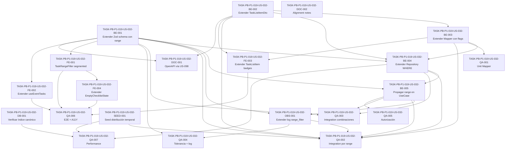

# Development Tasks — PB-P1-019 / US-032: Filtrar tareas por rango temporal (próximos 7/30 días + vencidas)

## 1. Metadata

| Field | Value |
|---|---|
| User Story ID | US-032 |
| Source User Story | `management/user-stories/US-032-filter-tasks-by-timerange.md` |
| Source Technical Specification | `management/technical-specs/P1/PB-P1-019/US-032-technical-spec.md` |
| Decision Resolution Artifact | No aplica |
| Priority | P1 |
| Backlog ID | PB-P1-019 |
| Backlog Title | Filtros y progreso del checklist |
| Backlog Execution Order | 37 (P0: 18 + P1: 19) |
| User Story Position in Backlog Item | 1 de 2 |
| Related User Stories in Backlog Item | US-032, US-033 |
| Epic | EPIC-TASK-001 — Checklist & Task Management |
| Backlog Item Dependencies | PB-P1-018 (CRUD de tareas manuales y máquina de estados) |
| Feature | Filtros temporales server-side sobre el listado de `EventTask` |
| Module / Domain | Tasks (extensión de `src/modules/tasks/list/` de US-027) |
| Backlog Alignment Status | Found |
| Task Breakdown Status | Ready for Sprint Planning |
| Created Date | 2026-06-26 |
| Last Updated | 2026-06-26 |

---

## 2. Source Validation

| Source | Found | Used | Notes |
|---|---|---|---|
| User Story | Yes | Yes | Approved (PO/BA Review, 2026-06-26); 8 AC, 10 EC, 8 VR, 8 SEC, telemetría sin PII. |
| Technical Specification | Yes | Yes | Ready for Task Breakdown; fuente primaria. |
| Decision Resolution Artifact | No | No | No requerido; decisiones formalizadas en `/docs/9` FR-TASK-009/010, `/docs/8` UC-TASK-006, `/docs/4` BR-TASK-007/008/009/010, `/docs/16` §28, PB-P1-019 Acceptance Summary. |
| Product Backlog Prioritized | Yes | Yes | PB-P1-019; dep PB-P1-018 (US-027/028/029/030). |
| ADRs | Yes | Yes | ADR-API-001 (versionado /api/v1), ADR-API-004 (correlation id). Reuso US-027. |

---

## 3. Backlog Execution Context

### Parent Backlog Item

`PB-P1-019 — Filtros y progreso del checklist` agrupa US-032 (filtros temporales `overdue`/`7d`/`30d`/`all`) y US-033 (`% done`). Ambas extienden el endpoint canónico `GET /api/v1/events/:eventId/tasks` de US-027 sin introducir nuevos verbos HTTP. El item depende de `PB-P1-018` (US-027/028/029/030) porque consume el repositorio paginado, el DTO `TaskListItemDto`, los policies (`EventOwnershipPolicy`, `OrganizerRoleGuard`, `adminExclusionGuard`) y el logger `tasks.list.requested` ya entregados.

### Execution Order Rationale

US-032 ocupa la posición global 37 porque depende exclusivamente de `PB-P1-018`. Dentro del backlog item, US-032 va primero porque US-033 (% done) reusa el DTO extendido (`overdue`, `is_t_minus_7`) y los `WHERE` por `range` para sus agregaciones. Sin US-032, US-033 tendría que duplicar la lógica de cálculo de flags.

### Related User Stories in Same Backlog Item

| User Story | Role in Backlog Item | Suggested Order |
|---|---|---|
| US-032 — Filtros temporales (`overdue`, `7d`, `30d`, `all`) + DTO extendido (`overdue`, `is_t_minus_7`) | Extiende el GET de tareas con filtros temporales server-side y flags derivados | 1 |
| US-033 — `% done` agregado sobre tareas confirmadas | Consume DTO + filtros para calcular el porcentaje agregado; expone surface en dashboard (PB-P1-008) | 2 |

---

## 4. Task Breakdown Summary

| Area | Number of Tasks | Notes |
|---|---:|---|
| Database / Prisma (DB) | 1 | Verificación operativa del índice canónico `idx_event_tasks_event_status_due` contra dataset de 200 tareas; sin migraciones nuevas. |
| Backend (BE) | 5 | Extensión Zod schema con `range`; extensión `TaskListItemDto` con flags derivados; extensión `TaskListItemMapper` (cálculo server-side); extensión `EventTaskListRepository` (WHERE por `range`); extensión `ListEventTasksUseCase` (propagación). |
| API Contract (API) | 0 | Sin endpoint nuevo. Reuso íntegro del controller `GET /api/v1/events/:eventId/tasks` de US-027. |
| Security / Authorization (SEC) | 0 | Reuso íntegro de `EventOwnershipPolicy`, `OrganizerRoleGuard`, `adminExclusionGuard` de US-027. Declarado explícitamente en tareas BE. |
| Observability / Audit (OBS) | 1 | Extensión del log `tasks.list.requested` con `range_filter` y `range_dropped`; sin métricas nuevas (reuso `tasks_list_latency_ms`, `tasks_list_total`). |
| Frontend (FE) | 4 | `TaskRangeFilter` segmented control URL-driven WCAG AA; extensión `useEventTasks` (cache key con `range`); extensión `TaskListItem` con badges `Vencido`/`Próximo a vencer`; extensión `EmptyChecklistState` con copy del rango filtrado; i18n 4 locales. |
| QA / Testing (QA) | 7 | Unit del mapper (6+ casos); integration por cada `range` (TS-01..04); combinaciones (TS-05..06, AC-05/06); paginación + ordering; tolerancia (NT-01, NT-07, NT-08); autorización (AUTH-TS-01..05); E2E + accesibilidad (A11Y-01..04); performance (PERF-01..03). |
| Seed / Demo Data (SEED) | 1 | Verificación / extensión de fixtures de seed para garantizar distribución temporal canónica (vencidas, T-7, T-30, sin `due_date`). |
| AI / PromptOps (AI) | 0 | Endpoint de lectura; no invoca `LLMProvider`. |
| DevOps / Environment (OPS) | 0 | Sin cambios de infraestructura. |
| Documentation / Traceability (DOC) | 2 | Coordinación de snapshot OpenAPI vía US-098 (DOC-001); alignment notes para `/docs/9`, `/docs/10`, `/docs/16` (DOC-002). |
| **Total** | **21** | AI = 0, API = 0, SEC = 0, OPS = 0 — extensión limpia que reusa íntegramente las superficies de US-027. |

---

## 5. Traceability Matrix

| Acceptance Criterion | Technical Spec Section | Task IDs |
|---|---|---|
| AC-01: Filtro `range=7d` | §7 Repository, §7 Mapper, §7 Schema | BE-001, BE-003, BE-004, BE-005, QA-002 |
| AC-02: Filtro `range=30d` | §7 Repository, §7 Mapper | BE-003, BE-004, BE-005, QA-002 |
| AC-03: Filtro `range=overdue` | §7 Repository, §7 Mapper | BE-003, BE-004, BE-005, QA-002 |
| AC-04: Filtro `range=all` (default) | §7 Schema, §7 Repository | BE-001, BE-004, BE-005, QA-002 |
| AC-05: Combinación `range` + `status` + `aiGenerated` | §7 Repository | BE-004, BE-005, QA-003 |
| AC-06: Combinación `range` + `categoryCode` | §7 Repository | BE-004, BE-005, QA-003 |
| AC-07: UI segmented control activo | §8 Frontend | FE-001, FE-002, QA-006 |
| AC-08: UI badges `Vencido` / `Próximo a vencer` | §8 Frontend, §7 Mapper | BE-003, FE-003, FE-004, QA-006 |
| EC-01: `range` inválido → `all` con `filters.dropped` | §7 Schema, §14 Observability | BE-001, OBS-001, QA-004 |
| EC-02..05: Combinaciones tolerantes y boundary `due_date` | §7 Mapper | BE-003, QA-001, QA-002 |
| EC-06: Empty state filtrado | §8 Frontend | FE-004, QA-006 |
| EC-07: Tarea con `due_date IS NULL` excluida de `overdue`/`7d`/`30d` | §7 Repository, §7 Mapper | BE-003, BE-004, QA-001, QA-002 |
| EC-08: Paginación preservada bajo `range` | §7 Repository | BE-004, QA-003 |
| EC-09: Cache stale cross-día | §8 State Management | FE-002, QA-006 |
| EC-10: Evento ajeno / inexistente / soft-deleted | §12 Security | QA-005 |
| VR-01..08 | §7 Schemas, §7 Repository | BE-001, BE-004, QA-004 |
| SEC-01..08 (reuso US-027) | §12 Security | OBS-001, QA-005 |
| AUTH-TS-01..05 | §12 Negative Authz | QA-005 |
| CONC-01..03 | §7 Repository, §10 DB | DB-001, QA-002 |
| A11Y-01..04 | §8 Accessibility | FE-001, FE-003, QA-006 |
| PERF-01..03 (`NFR-PERF-001`) | §10 DB, §13 Performance | DB-001, QA-007 |
| `BR-AI-010` (sin payload LLM en DTO) | §7 Mapper | BE-003, QA-001 |
| Seed con distribución temporal canónica | §15 Seed | SEED-001, QA-002 |
| Documentation Alignment (`/docs/9`, `/docs/10`, `/docs/16`) | §16 Doc Alignment | DOC-001, DOC-002 |

Cada AC mapea al menos a una tarea. Cada NT/AUTH-TS/SEC mapea a una QA o BE/OBS task.

---

## 6. Development Tasks

### TASK-PB-P1-019-US-032-DB-001 — Verificar índice canónico `idx_event_tasks_event_status_due` contra dataset de 200 tareas

| Field | Value |
|---|---|
| Area | DB |
| Type | Review |
| Priority | Must |
| Estimate | S |
| Depends On | — |
| Source AC(s) | AC-01..04, EC-08, CONC-01..03 |
| Technical Spec Section(s) | §10 Database / Prisma Design, §17 Risks |
| Backlog ID | PB-P1-019 |
| User Story ID | US-032 |
| Owner Role | Backend |
| Status | To Do |

#### Objective

Confirmar que el índice canónico `idx_event_tasks_event_status_due (event_id, status, due_date)` (`/docs/18`) cubre las cláusulas `WHERE` introducidas por `range=overdue|7d|30d|all` y que el cumplimiento del `NFR-PERF-001` (P95 ≤ 1.5 s) se mantiene con un dataset de 200 tareas mixtas por evento.

#### Scope

##### Include

- Ejecutar `EXPLAIN ANALYZE` para los 4 valores de `range` sobre dataset de 200 tareas con distribución temporal variada.
- Verificar uso de índice y ausencia de seq scan sobre `event_tasks` filtrado por `event_id`.
- Documentar plan de ejecución y latencia observada por cada `range`.
- Si `range=overdue` no cumple el budget, proponer (sin crear) índice parcial `(event_id, due_date) WHERE status IN ('pending','in_progress') AND deleted_at IS NULL` como ticket Future.

##### Exclude

- Crear migraciones nuevas.
- Modificar índices existentes.

#### Implementation Notes

- Reutilizar el seed canónico de US-027/PB-P1-018 ampliado por `SEED-001`.
- Ejecutar en entorno de staging con datos similares a producción.
- Adjuntar evidencia (EXPLAIN ANALYZE + latencia) en el PR como comentario.

#### Acceptance Criteria Covered

AC-01..04 (cobertura del índice para cada `range`), EC-08 (paginación preservada), CONC-01..03 (carga concurrente).

#### Definition of Done

- [ ] EXPLAIN ANALYZE documentado por cada valor de `range`.
- [ ] P95 ≤ 1.5 s para los 4 valores con dataset de 200 tareas.
- [ ] Si `range=overdue` no cumple, ticket Future creado (sin bloquear).
- [ ] Evidencia adjunta en PR.

---

### TASK-PB-P1-019-US-032-BE-001 — Extender `listEventTasksQuerySchema` con `range` tolerante

| Field | Value |
|---|---|
| Area | BE |
| Type | Implementation |
| Priority | Must |
| Estimate | S |
| Depends On | — |
| Source AC(s) | AC-04, EC-01 |
| Technical Spec Section(s) | §7 DTOs / Schemas, §14 Observability |
| Backlog ID | PB-P1-019 |
| User Story ID | US-032 |
| Owner Role | Backend |
| Status | To Do |

#### Objective

Extender el schema Zod `listEventTasksQuerySchema` (de US-027) con `range: z.enum(['overdue', '7d', '30d', 'all']).catch('all').optional()`, manteniendo la tolerancia `.catch()` consistente con el patrón EC-01 de US-027. Valores inválidos se normalizan a `'all'` sin devolver `400`, y se propagan al helper `filters.dropped` existente para emitir log estructurado.

#### Scope

##### Include

- Definir `RangeEnum = z.enum(['overdue', '7d', '30d', 'all']).catch('all')`.
- Extender `listEventTasksQuerySchema` con `range: RangeEnum.optional()`.
- Extender el helper `extractDroppedFilters` (o equivalente de US-027) para capturar el caso `range`.
- Actualizar el tipo TypeScript derivado `ListEventTasksQuery`.

##### Exclude

- Crear un nuevo controller, módulo o endpoint.
- Devolver `400` para `range` inválido.

#### Implementation Notes

- Conservar el `.catch('all')` aunque el campo sea opcional para que valores presentes pero inválidos también caigan en el default.
- El tipo derivado debe exponer `range: 'overdue' | '7d' | '30d' | 'all' | undefined`.
- El helper `filters.dropped` debe registrar `{ field: 'range', received: <raw>, applied: 'all' }`.

#### Acceptance Criteria Covered

AC-04 (default `all`), EC-01 (tolerancia + log).

#### Definition of Done

- [ ] Schema Zod extendido y compilando.
- [ ] Tipo derivado actualizado y consumido por use case.
- [ ] Helper `filters.dropped` capta `range` inválido.
- [ ] Test unitario del schema (en QA-004) referenciado.

---

### TASK-PB-P1-019-US-032-BE-002 — Extender `TaskListItemDto` con `overdue` e `is_t_minus_7`

| Field | Value |
|---|---|
| Area | BE |
| Type | Implementation |
| Priority | Must |
| Estimate | XS |
| Depends On | — |
| Source AC(s) | AC-01, AC-02, AC-03, AC-08 |
| Technical Spec Section(s) | §7 DTOs / Schemas, §9 API Contract |
| Backlog ID | PB-P1-019 |
| User Story ID | US-032 |
| Owner Role | Backend |
| Status | To Do |

#### Objective

Extender el DTO canónico `TaskListItemDto` (de US-027) con dos campos booleanos no opcionales: `overdue: boolean` e `is_t_minus_7: boolean`. Ambos son derivados server-side por el mapper (BE-003); cuando `due_date IS NULL`, ambos valen `false`.

#### Scope

##### Include

- Agregar `overdue: boolean` y `is_t_minus_7: boolean` al tipo `TaskListItemDto`.
- Actualizar tipos compartidos en `apps/web` si el contrato se exporta (validar paquete shared o tipo duplicado controlado).
- Documentar invariantes en JSDoc / comentarios mínimos del DTO.

##### Exclude

- Exponer payloads del LLM (`prompt_version_id`, `output`, etc.) — `BR-AI-010` enforced.
- Hacer los campos opcionales (deben ser siempre booleanos en el contrato).

#### Implementation Notes

- Ambos campos forman parte del envelope canónico de respuesta, no son metadata opcional.
- El frontend (`TaskListItem`) los consume directo sin lógica condicional adicional.

#### Acceptance Criteria Covered

AC-01, AC-02, AC-03 (cada flag se evalúa por tarea), AC-08 (badges UI consumen los flags).

#### Definition of Done

- [ ] DTO extendido y exportado.
- [ ] Contrato visible en respuesta (verificable en QA-002).
- [ ] Tipo TypeScript consumido por mapper y por frontend.

---

### TASK-PB-P1-019-US-032-BE-003 — Extender `TaskListItemMapper.fromEntity` con derivación de flags

| Field | Value |
|---|---|
| Area | BE |
| Type | Implementation |
| Priority | Must |
| Estimate | S |
| Depends On | BE-002 |
| Source AC(s) | AC-01, AC-02, AC-03, AC-08, EC-07 |
| Technical Spec Section(s) | §7 DTOs / Schemas, §13 Testing |
| Backlog ID | PB-P1-019 |
| User Story ID | US-032 |
| Owner Role | Backend |
| Status | To Do |

#### Objective

Extender `TaskListItemMapper.fromEntity` (de US-027) para calcular server-side los flags `overdue` e `is_t_minus_7` usando `CURRENT_DATE` de PostgreSQL como referencia. La comparación se ejecuta en la base (no en JS) y los valores se proyectan en la query del repositorio (BE-004); el mapper los expone tal cual los recibe.

#### Scope

##### Include

- Aceptar `overdue` e `is_t_minus_7` como columnas calculadas desde el repository (proyectadas vía `SELECT ... AS overdue`).
- Mapear directamente a los campos del DTO.
- Defaultear ambos a `false` cuando `due_date IS NULL`.
- Mantener idempotencia con tareas `done`/`skipped` (overdue solo es `true` si `status NOT IN ('done','skipped')`).

##### Exclude

- Recalcular flags en JS (debe venir de la query).
- Modificar otros campos del DTO.

#### Implementation Notes

- Definición canónica de `overdue`: `due_date < CURRENT_DATE AND status NOT IN ('done', 'skipped') AND due_date IS NOT NULL`.
- Definición canónica de `is_t_minus_7`: `due_date BETWEEN CURRENT_DATE AND CURRENT_DATE + INTERVAL '7 days' AND due_date IS NOT NULL`.
- Ambas son booleanos no nullable.

#### Acceptance Criteria Covered

AC-01, AC-02, AC-03 (cálculo correcto por tarea), AC-08 (consumido por badges), EC-07 (NULL excluido).

#### Definition of Done

- [ ] Mapper extendido; flags proyectados desde repository.
- [ ] Test unitario QA-001 cubre los 6+ casos canónicos.
- [ ] `BR-AI-010` preservado (sin payload LLM expuesto).

---

### TASK-PB-P1-019-US-032-BE-004 — Extender `EventTaskListRepository.findByEventPaginated` con `WHERE` por `range`

| Field | Value |
|---|---|
| Area | BE |
| Type | Implementation |
| Priority | Must |
| Estimate | M |
| Depends On | BE-001, BE-002, BE-003 |
| Source AC(s) | AC-01, AC-02, AC-03, AC-04, AC-05, AC-06, EC-07, EC-08 |
| Technical Spec Section(s) | §7 Repository, §10 DB |
| Backlog ID | PB-P1-019 |
| User Story ID | US-032 |
| Owner Role | Backend |
| Status | To Do |

#### Objective

Extender `EventTaskListRepository.findByEventPaginated` (de US-027) para aceptar un parámetro `range: 'overdue' | '7d' | '30d' | 'all'` y aplicar la cláusula `WHERE` correspondiente sobre `due_date`. Adicionalmente, proyectar los flags `overdue` e `is_t_minus_7` como columnas calculadas para que el mapper (BE-003) los consuma directamente.

#### Scope

##### Include

- Extender la firma de `findByEventPaginated` con el parámetro `range` (mantener compatibilidad con la firma anterior vía default `'all'`).
- Implementar `WHERE` por valor:
  - `overdue` → `due_date < CURRENT_DATE AND status NOT IN ('done', 'skipped') AND due_date IS NOT NULL`
  - `7d` → `due_date >= CURRENT_DATE AND due_date <= CURRENT_DATE + INTERVAL '7 days' AND due_date IS NOT NULL`
  - `30d` → `due_date >= CURRENT_DATE AND due_date <= CURRENT_DATE + INTERVAL '30 days' AND due_date IS NOT NULL`
  - `all` → sin filtro temporal adicional
- Componer con filtros existentes (`status`, `aiGenerated`, `categoryCode`, soft delete) mediante AND lógico.
- Proyectar columnas calculadas `overdue` y `is_t_minus_7` para que el mapper las consuma directamente.
- Preservar el ordenamiento canónico `ORDER BY due_date ASC NULLS LAST, created_at DESC`.

##### Exclude

- Aceptar `today` como parámetro del cliente.
- Crear endpoint, controller, use case o módulo nuevos.
- Modificar ownership, paginación, soft delete o ordenamiento.

#### Implementation Notes

- `CURRENT_DATE` siempre se evalúa por la base; nunca se acepta input temporal del cliente.
- Tanto Prisma `findMany`+`count` como `$queryRaw` son aceptables; preferir Prisma con `where` condicional + `select` con expresión calculada para `overdue`/`is_t_minus_7`. Si Prisma no soporta proyección calculada directamente, usar `$queryRaw` con tipado seguro.
- El parámetro `range='all'` debe ser indistinguible (a nivel de query) del path actual sin filtro temporal — preservar comportamiento de US-027.

#### Acceptance Criteria Covered

AC-01..04 (filtros), AC-05, AC-06 (combinaciones), EC-07 (NULL excluido), EC-08 (paginación preservada).

#### Definition of Done

- [ ] Repositorio extendido y compilando.
- [ ] Columnas calculadas proyectadas correctamente.
- [ ] Tests integration QA-002, QA-003 verdes.
- [ ] Ordenamiento canónico preservado.

---

### TASK-PB-P1-019-US-032-BE-005 — Propagar `range` desde `ListEventTasksUseCase` y validar reuso de policies

| Field | Value |
|---|---|
| Area | BE |
| Type | Implementation |
| Priority | Must |
| Estimate | XS |
| Depends On | BE-001, BE-004 |
| Source AC(s) | AC-01..06 |
| Technical Spec Section(s) | §7 Use Cases, §12 Security |
| Backlog ID | PB-P1-019 |
| User Story ID | US-032 |
| Owner Role | Backend |
| Status | To Do |

#### Objective

Extender `ListEventTasksUseCase` (de US-027) para recibir `range` desde el query validado y propagarlo al repositorio. Confirmar explícitamente el reuso íntegro de `EventOwnershipPolicy`, `OrganizerRoleGuard` y `adminExclusionGuard` de US-027 sin duplicar código.

#### Scope

##### Include

- Recibir `range` desde el query validado y propagarlo a `EventTaskListRepository.findByEventPaginated`.
- Declarar explícitamente en JSDoc / comentarios el reuso de policies de US-027.
- Mantener firma pública del use case (cambio aditivo en el objeto de query).

##### Exclude

- Crear nuevas policies o guards.
- Modificar ownership, role exclusion o no-revelación 404.

#### Implementation Notes

- El use case sigue siendo orquestador delgado (pre-checks → repository → mapper → response envelope).
- Los policies se ejecutan idéntico que en US-027; el nuevo parámetro `range` no afecta la decisión de autorización.

#### Acceptance Criteria Covered

AC-01..06 (ruta funcional completa).

#### Definition of Done

- [ ] Use case extendido sin romper la firma pública del controller.
- [ ] Reuso explícito de policies documentado.
- [ ] Tests integration QA-002..005 pasan.

---

### TASK-PB-P1-019-US-032-OBS-001 — Extender log `tasks.list.requested` con `range_filter` y `range_dropped`

| Field | Value |
|---|---|
| Area | OBS |
| Type | Implementation |
| Priority | Must |
| Estimate | XS |
| Depends On | BE-001, BE-005 |
| Source AC(s) | EC-01 |
| Technical Spec Section(s) | §14 Observability |
| Backlog ID | PB-P1-019 |
| User Story ID | US-032 |
| Owner Role | Backend |
| Status | To Do |

#### Objective

Extender el logger estructurado `tasks.list.requested` (de US-027) con dos campos adicionales: `range_filter` (valor aplicado tras `.catch()`, siempre uno de los 4 enums) y `range_dropped: boolean` (`true` cuando el cliente envió un valor inválido descartado por la tolerancia Zod). Sin métricas Prometheus nuevas.

#### Scope

##### Include

- Extender el payload del log con `range_filter` y `range_dropped`.
- Asegurar que `filters_dropped` incluya `{ field: 'range', received: <raw>, applied: 'all' }` cuando aplique (consistente con el patrón EC-01 de US-027).
- Sin métricas Prometheus nuevas (reuso de `tasks_list_latency_ms`, `tasks_list_total`).

##### Exclude

- Crear métricas nuevas.
- Incluir PII en el log.

#### Implementation Notes

- `range_filter` siempre es un enum válido (post-tolerancia).
- `range_dropped` es booleano; cuando es `true`, el detalle del descarte vive en `filters_dropped`.

#### Acceptance Criteria Covered

EC-01 (tolerancia + log).

#### Definition of Done

- [ ] Log extendido y verificable en QA-004.
- [ ] Sin PII en el payload.
- [ ] Correlation ID propagado (reuso US-027).

---

### TASK-PB-P1-019-US-032-FE-001 — Componente `TaskRangeFilter` segmented control accesible WCAG AA

| Field | Value |
|---|---|
| Area | FE |
| Type | Implementation |
| Priority | Must |
| Estimate | M |
| Depends On | BE-001 |
| Source AC(s) | AC-07, A11Y-01..04 |
| Technical Spec Section(s) | §8 Frontend, §8 Accessibility |
| Backlog ID | PB-P1-019 |
| User Story ID | US-032 |
| Owner Role | Frontend |
| Status | To Do |

#### Objective

Implementar el componente `TaskRangeFilter` como segmented control accesible con 4 toggles ("Vencidas", "Próx. 7 días", "Próx. 30 días", "Todas"), URL-driven via `useSearchParams` + `router.replace`. Cumple WCAG AA con `aria-pressed`, navegación por teclado (`ArrowLeft`/`ArrowRight` mueven foco; `Space`/`Enter` activan) y soporte `prefers-reduced-motion`.

#### Scope

##### Include

- Componente Client Component (`use client`) que lee/escribe URL.
- `
` con 4 `<button aria-pressed={isActive}>`.
- Mobile-first: etiquetas cortas (V / 7d / 30d / Todas) con tooltip.
- Reset de `page` a `1` en cada cambio de toggle (`router.replace({ ..., page: 1 }, { scroll: false })`).
- i18n con claves canónicas (`tasks.filter.range.*`).

##### Exclude

- Mantener estado local (debe vivir en URL).
- Persistir filtro en perfil o cookies.

#### Implementation Notes

- Usar `useSearchParams` para leer y `useRouter().replace` para escribir.
- Valor canónico tras `.catch()` por default (`'all'` cuando ausente).
- Outline visible con design tokens; sin reset del outline nativo.

#### Acceptance Criteria Covered

AC-07 (segmented control activo + URL sync), A11Y-01 (teclado), A11Y-02 (NVDA/VoiceOver), A11Y-04 (contraste).

#### Definition of Done

- [ ] Componente implementado y montado en `TaskListPage`.
- [ ] axe-core sin issues críticos.
- [ ] Navegación por teclado verificable.
- [ ] i18n 4 locales completas.

---

### TASK-PB-P1-019-US-032-FE-002 — Extender `useEventTasks` con `range` en cache key

| Field | Value |
|---|---|
| Area | FE |
| Type | Implementation |
| Priority | Must |
| Estimate | XS |
| Depends On | BE-001 |
| Source AC(s) | AC-07, EC-09 |
| Technical Spec Section(s) | §8 State Management, §8 Data Fetching |
| Backlog ID | PB-P1-019 |
| User Story ID | US-032 |
| Owner Role | Frontend |
| Status | To Do |

#### Objective

Extender el hook TanStack `useEventTasks` (de US-027) para incluir `range` en el cache key y propagarlo al API client `tasksApi.listEventTasks`. Cambiar de toggle dispara automáticamente un refetch al cambiar la key.

#### Scope

##### Include

- Cache key extendido: `['tasks', eventId, { status, aiGenerated, categoryCode, range, page, pageSize }]`.
- Extender el API client `tasksApi.listEventTasks` para aceptar `range`.
- Documentar como nota: el cache stale cross-día es aceptable en MVP (EC-09); el próximo refetch lo actualiza.

##### Exclude

- Invalidación automática cross-día (Future).
- Caché persistente en localStorage.

#### Implementation Notes

- Si el hook recibe `range` undefined, no incluirlo en la query string (default server-side `'all'`).
- Mantener el resto del comportamiento (SSR primera página, prefetch) intacto.

#### Acceptance Criteria Covered

AC-07 (URL ↔ cache), EC-09 (stale cross-día documentado).

#### Definition of Done

- [ ] Hook extendido sin romper US-027.
- [ ] Cache key auditable en devtools.
- [ ] API client tipado correctamente.

---

### TASK-PB-P1-019-US-032-FE-003 — Extender `TaskListItem` con badges `Vencido` y `Próximo a vencer`

| Field | Value |
|---|---|
| Area | FE |
| Type | Implementation |
| Priority | Must |
| Estimate | S |
| Depends On | BE-002, BE-003 |
| Source AC(s) | AC-08, A11Y-03 |
| Technical Spec Section(s) | §8 Components, §8 Accessibility |
| Backlog ID | PB-P1-019 |
| User Story ID | US-032 |
| Owner Role | Frontend |
| Status | To Do |

#### Objective

Extender `TaskListItem` (de US-027) para renderizar un badge rojo "Vencido" cuando `task.overdue === true` y un badge ámbar "Próximo a vencer" cuando `task.is_t_minus_7 === true && task.overdue === false`. Ambos con `aria-label` semántico y contraste WCAG AA.

#### Scope

##### Include

- Sub-componente `TaskListItemBadge` (opcional) accesible.
- Color tokens: rojo (`bg-red-100`/`text-red-800`) para vencido, ámbar (`bg-amber-100`/`text-amber-800`) para T-7.
- `aria-label="Tarea vencida"` / `aria-label="Tarea próxima a vencer en 7 días"`.
- Iconos decorativos con `aria-hidden="true"`.

##### Exclude

- Mostrar ambos badges simultáneamente (overdue tiene prioridad visual; excluyentes).
- Cambiar el estilo del row o de otros campos del item.

#### Implementation Notes

- Mantener compatibilidad visual con el render de US-027 cuando ambos flags son `false`.
- Verificar contraste con design tokens del sistema (>= 4.5:1).

#### Acceptance Criteria Covered

AC-08 (badges visibles), A11Y-03 (aria-label semántico), A11Y-04 (contraste).

#### Definition of Done

- [ ] Badges renderizados correctamente.
- [ ] axe-core sin issues.
- [ ] Tests visuales / snapshot verdes.

---

### TASK-PB-P1-019-US-032-FE-004 — Extender `EmptyChecklistState` con copy del rango filtrado e i18n 4 locales

| Field | Value |
|---|---|
| Area | FE |
| Type | Implementation |
| Priority | Must |
| Estimate | S |
| Depends On | FE-001 |
| Source AC(s) | AC-07, EC-06 |
| Technical Spec Section(s) | §8 Loading / Empty / Error / Success States, §8 i18n |
| Backlog ID | PB-P1-019 |
| User Story ID | US-032 |
| Owner Role | Frontend |
| Status | To Do |

#### Objective

Extender `EmptyChecklistState` (de US-027) para mostrar copy "No hay tareas en el rango seleccionado" + CTA "Probá con 'Todas' o creá una nueva tarea" (deep-link a US-028) cuando `range !== 'all'` y la lista viene vacía. Agregar las claves i18n para los 4 locales (`es-MX`, `es-AR`, `en-US`, `pt-BR`).

#### Scope

##### Include

- Detectar caso "vacío por filtro" (cuando `range !== 'all'` y `items.length === 0`).
- Claves i18n canónicas: `tasks.empty.range_filtered`, `tasks.filter.range.label`, `tasks.filter.range.overdue|7d|30d|all`, `tasks.badge.overdue`, `tasks.badge.t_minus_7`.
- Deep-link al botón "Crear tarea" (US-028) preservando `eventId`.
- Linter build-time (o checklist QA) para paridad de claves entre 4 locales.

##### Exclude

- Reemplazar el empty state existente cuando `range = 'all'`.
- Crear el endpoint de creación (responsabilidad de US-028).

#### Implementation Notes

- Si el empty state base de US-027 maneja CTAs distintos, mantenerlos como rama `range = 'all'`.
- Probar `range=overdue&status=done` como caso explícito de empty (EC-06).

#### Acceptance Criteria Covered

AC-07 (CTA sigue funcional), EC-06 (empty state filtrado).

#### Definition of Done

- [ ] Copy localizado en 4 locales.
- [ ] CTA funcional con deep-link a US-028.
- [ ] Linter de paridad i18n pasa.

---

### TASK-PB-P1-019-US-032-SEED-001 — Verificar/extender seed con distribución temporal canónica

| Field | Value |
|---|---|
| Area | SEED |
| Type | Setup |
| Priority | Must |
| Estimate | S |
| Depends On | — |
| Source AC(s) | AC-01..04, EC-07 |
| Technical Spec Section(s) | §15 Seed / Demo |
| Backlog ID | PB-P1-019 |
| User Story ID | US-032 |
| Owner Role | Backend |
| Status | To Do |

#### Objective

Verificar que el seed canónico de PB-P1-018 (entregado por US-018/US-028) incluye por cada evento demo una distribución temporal mínima que permita exercitar los 4 valores de `range`. Si falta, extender los fixtures.

#### Scope

##### Include

- Distribución mínima por evento demo:
  - ≥ 2 tareas con `due_date < today` (vencidas).
  - ≥ 2 tareas con `due_date BETWEEN today AND today+7` (T-7).
  - ≥ 2 tareas con `due_date BETWEEN today+8 AND today+30` (T-30 fuera de T-7).
  - ≥ 1 tarea con `due_date > today+30`.
  - ≥ 1 tarea con `due_date IS NULL`.
- Usar fechas relativas (`now() + INTERVAL '...'`) en seed runtime.

##### Exclude

- Crear migraciones nuevas.
- Modificar fixtures fuera del scope de tareas.

#### Implementation Notes

- Coordinar con seed canónico de US-018/US-028 si ya existen tareas; agregar solo lo faltante.
- Documentar la distribución mínima en el README del seed para futuras historias.

#### Acceptance Criteria Covered

AC-01..04 (cada `range` tiene datos para validar), EC-07 (NULL presente).

#### Definition of Done

- [ ] Seed runtime ejecutable con distribución verificada.
- [ ] Documentación de fixtures actualizada.

---

### TASK-PB-P1-019-US-032-QA-001 — Tests unitarios de `TaskListItemMapper` (flags derivados)

| Field | Value |
|---|---|
| Area | QA |
| Type | Test |
| Priority | Must |
| Estimate | S |
| Depends On | BE-003 |
| Source AC(s) | AC-01, AC-02, AC-03, AC-08, EC-07 |
| Technical Spec Section(s) | §13 Unit Tests |
| Backlog ID | PB-P1-019 |
| User Story ID | US-032 |
| Owner Role | QA |
| Status | To Do |

#### Objective

Cubrir con tests unitarios (Vitest) la derivación de los flags `overdue` e `is_t_minus_7` en `TaskListItemMapper.fromEntity` o equivalente, considerando los 6+ casos canónicos definidos en la Tech Spec §13.

#### Scope

##### Include

- 6 casos canónicos:
  1. `due_date < CURRENT_DATE` + `status='pending'` → `overdue=true`, `is_t_minus_7=false`.
  2. `due_date < CURRENT_DATE` + `status='done'` → `overdue=false`.
  3. `due_date = CURRENT_DATE` → `overdue=false`, `is_t_minus_7=true`.
  4. `due_date = CURRENT_DATE + 7d` → `overdue=false`, `is_t_minus_7=true`.
  5. `due_date = CURRENT_DATE + 8d` → ambos `false`.
  6. `due_date IS NULL` → ambos `false`.
- Verificar que el DTO no expone payloads del LLM (`BR-AI-010`).

##### Exclude

- Tests de integración con DB (van en QA-002).

#### Implementation Notes

- Mockear el resultado del repository con columnas calculadas pre-evaluadas (suficiente para validar el mapping).

#### Acceptance Criteria Covered

AC-01..03 (flags por tarea), AC-08 (badges UI), EC-07 (NULL), `BR-AI-010`.

#### Definition of Done

- [ ] Tests Vitest verdes.
- [ ] Cobertura ≥ 95% del mapper.

---

### TASK-PB-P1-019-US-032-QA-002 — Tests de integración por cada `range` (TS-01..04)

| Field | Value |
|---|---|
| Area | QA |
| Type | Test |
| Priority | Must |
| Estimate | M |
| Depends On | BE-001..005, OBS-001, SEED-001 |
| Source AC(s) | AC-01, AC-02, AC-03, AC-04, AC-08, EC-07, EC-08 |
| Technical Spec Section(s) | §13 Integration Tests |
| Backlog ID | PB-P1-019 |
| User Story ID | US-032 |
| Owner Role | QA |
| Status | To Do |

#### Objective

Verificar end-to-end (con DB) que cada valor de `range` devuelve el subconjunto correcto de tareas, con los flags `overdue` e `is_t_minus_7` derivados correctamente y el ordenamiento canónico preservado.

#### Scope

##### Include

- TS-01: `range=7d` devuelve solo tareas en `[today, today+7]`.
- TS-02: `range=30d` devuelve solo tareas en `[today, today+30]`.
- TS-03: `range=overdue` excluye `done`/`skipped` y `due_date IS NULL`.
- TS-04: `range=all` incluye `due_date IS NULL`.
- Verificar `overdue` e `is_t_minus_7` por tarea.
- Verificar paginación funciona sobre subconjuntos filtrados.
- Verificar ordenamiento `due_date ASC NULLS LAST, created_at DESC`.

##### Exclude

- Combinaciones con otros filtros (van en QA-003).
- Tests de UI (van en QA-006).

#### Implementation Notes

- Usar Supertest contra el server Express con DB de test.
- Reusar el seed cargado por `SEED-001`.

#### Acceptance Criteria Covered

AC-01..04, AC-08, EC-07, EC-08.

#### Definition of Done

- [ ] 4 tests verdes en CI.
- [ ] Asserts sobre items y pagination envelope.
- [ ] Flags derivados verificados.

---

### TASK-PB-P1-019-US-032-QA-003 — Tests de integración de combinaciones (AC-05, AC-06, TS-05..09)

| Field | Value |
|---|---|
| Area | QA |
| Type | Test |
| Priority | Must |
| Estimate | M |
| Depends On | BE-001..005 |
| Source AC(s) | AC-05, AC-06, EC-08 |
| Technical Spec Section(s) | §13 Integration Tests |
| Backlog ID | PB-P1-019 |
| User Story ID | US-032 |
| Owner Role | QA |
| Status | To Do |

#### Objective

Verificar la composición de `range` con otros filtros tolerantes (`status`, `aiGenerated`, `categoryCode`), paginación y ordenamiento, garantizando AND lógico correcto y consistencia entre páginas.

#### Scope

##### Include

- TS-05: `range=7d` + `status=pending`.
- TS-06: `range=overdue` + `aiGenerated=true`.
- AC-05: `range` + `status` + `aiGenerated`.
- AC-06: `range` + `categoryCode`.
- TS-08: paginación coherente con `range` (`page=2` retorna siguiente sub-página filtrada).
- TS-09: ordenamiento canónico preservado bajo `range`.
- Verificar que `range=overdue` + `status='done'` retorna empty (idempotencia, EC-06).

##### Exclude

- Tests UI o de tolerancia (van en QA-004/QA-006).

#### Implementation Notes

- Tests Supertest + asserts sobre envelope.

#### Acceptance Criteria Covered

AC-05, AC-06, EC-08.

#### Definition of Done

- [ ] Combinaciones canónicas verdes.
- [ ] Paginación + ordering verificados.

---

### TASK-PB-P1-019-US-032-QA-004 — Tests de tolerancia y validación (NT-01, NT-07, NT-08)

| Field | Value |
|---|---|
| Area | QA |
| Type | Test |
| Priority | Must |
| Estimate | S |
| Depends On | BE-001, OBS-001 |
| Source AC(s) | EC-01, VR-01..08 |
| Technical Spec Section(s) | §13 API Tests, §14 Observability |
| Backlog ID | PB-P1-019 |
| User Story ID | US-032 |
| Owner Role | QA |
| Status | To Do |

#### Objective

Verificar que valores inválidos de `range` se normalizan a `'all'` con `200 OK` y que el log estructurado captura `range_dropped=true` con el detalle del valor recibido.

#### Scope

##### Include

- NT-01: `range=foo` → `200 OK`, `range_filter='all'`, `range_dropped=true`.
- NT-07: `range='Overdue'` → `200 OK`, `range_filter='all'` (case-sensitive).
- NT-08: `range='OVERDUE'` → ídem.
- Validación: ausencia de `range` → default `'all'`.
- `eventId` mal formado → `400 VALIDATION` (NT-09).
- Verificar contenido del log `tasks.list.requested` con `range_filter` y `range_dropped`.

##### Exclude

- Tests de autorización (van en QA-005).

#### Implementation Notes

- Capturar logs vía test helper o interceptor del logger.
- Tests Supertest contra el server.

#### Acceptance Criteria Covered

EC-01, VR-01..08.

#### Definition of Done

- [ ] Tests verdes en CI.
- [ ] Log estructurado auditado.

---

### TASK-PB-P1-019-US-032-QA-005 — Tests de autorización (AUTH-TS-01..05, EC-10)

| Field | Value |
|---|---|
| Area | QA |
| Type | Test |
| Priority | Must |
| Estimate | S |
| Depends On | BE-005 |
| Source AC(s) | SEC-01..08, AUTH-TS-01..05, EC-10 |
| Technical Spec Section(s) | §12 Security |
| Backlog ID | PB-P1-019 |
| User Story ID | US-032 |
| Owner Role | QA |
| Status | To Do |

#### Objective

Verificar el reuso íntegro de policies y guards de US-027 sobre el endpoint extendido con `range`. Sin tareas SEC nuevas; los tests confirman que el reuso es efectivo.

#### Scope

##### Include

- AUTH-TS-01: Organizer dueño → `200`.
- AUTH-TS-02: Organizer no dueño → `404` (no-revelación).
- AUTH-TS-03: Vendor → `403`.
- AUTH-TS-04: Admin → `403`.
- AUTH-TS-05: Anónimo → `401`.
- EC-10: Evento ajeno con `range=overdue` → `404`.

##### Exclude

- Tests funcionales por `range` (van en QA-002).

#### Implementation Notes

- Reutilizar fixtures de auth/role de US-027.
- Cada caso debe ejecutarse con `range=overdue` para asegurar que la nueva ruta no rompe ownership.

#### Acceptance Criteria Covered

SEC-01..08, AUTH-TS-01..05, EC-10.

#### Definition of Done

- [ ] 5+ tests verdes.
- [ ] Reuso de policies de US-027 confirmado en code review.

---

### TASK-PB-P1-019-US-032-QA-006 — E2E + accesibilidad (TS-10, A11Y-01..04)

| Field | Value |
|---|---|
| Area | QA |
| Type | Test |
| Priority | Must |
| Estimate | M |
| Depends On | FE-001..004 |
| Source AC(s) | AC-07, AC-08, EC-06, EC-09, A11Y-01..04 |
| Technical Spec Section(s) | §13 E2E Tests, §13 Accessibility Tests |
| Backlog ID | PB-P1-019 |
| User Story ID | US-032 |
| Owner Role | QA |
| Status | To Do |

#### Objective

Cubrir flujos E2E con Playwright (segmented control + badges + empty state filtrado) y verificar accesibilidad (axe-core + navegación por teclado + ARIA semántico) sobre `TaskRangeFilter` y `TaskListItem` extendido.

#### Scope

##### Include

- E2E: Organizer entra a `/organizer/events/:id/tasks` → ve toggle activo `Todas` por default.
- E2E: Click en "Próx. 7 días" → URL actualiza con `range=7d`, lista refresca con badges `Próximo a vencer`.
- E2E: Click en "Vencidas" → solo tareas con badge `Vencido`.
- E2E: Empty state visible cuando `range=overdue&status=done` (TS-10, EC-06).
- A11Y-01: navegación por teclado (`ArrowLeft`/`ArrowRight`/`Space`/`Enter`).
- A11Y-02: NVDA/VoiceOver smoke con `aria-pressed`.
- A11Y-03: badges con `aria-label` semántico.
- A11Y-04: contraste WCAG AA con axe-core.
- Verificar `prefers-reduced-motion` respetado.

##### Exclude

- Tests de backend (van en QA-002..005).
- Performance (va en QA-007).

#### Implementation Notes

- Playwright + @axe-core/playwright.
- Smoke de screen reader vía CI (NVDA/VoiceOver) o manual checklist documentado.

#### Acceptance Criteria Covered

AC-07, AC-08, EC-06, EC-09, A11Y-01..04.

#### Definition of Done

- [ ] Playwright suite verde.
- [ ] axe-core sin issues críticos.
- [ ] Checklist NVDA/VoiceOver documentado.

---

### TASK-PB-P1-019-US-032-QA-007 — Tests de performance (PERF-01..03)

| Field | Value |
|---|---|
| Area | QA |
| Type | Test |
| Priority | Must |
| Estimate | S |
| Depends On | BE-001..005, DB-001, SEED-001 |
| Source AC(s) | CONC-01..03 |
| Technical Spec Section(s) | §13 Performance, §17 Risks |
| Backlog ID | PB-P1-019 |
| User Story ID | US-032 |
| Owner Role | QA |
| Status | To Do |

#### Objective

Verificar el cumplimiento del `NFR-PERF-001` (P95 ≤ 1.5 s) para los 4 valores de `range` contra un dataset de 200 tareas mixtas por evento, usando k6 o herramienta interna equivalente.

#### Scope

##### Include

- PERF-01: `range=overdue` con concurrencia moderada.
- PERF-02: `range=7d` con concurrencia moderada.
- PERF-03: `range=30d` y `range=all` con concurrencia moderada.
- Validar contra `NFR-PERF-001` (P95 ≤ 1.5 s).
- Reporte de latencias en PR.

##### Exclude

- Stress testing extremo (Future).
- Creación de índices nuevos (gate por DB-001).

#### Implementation Notes

- Reutilizar el seed extendido por `SEED-001`.
- Documentar resultados en el PR.

#### Acceptance Criteria Covered

CONC-01..03, `NFR-PERF-001`.

#### Definition of Done

- [ ] P95 ≤ 1.5 s para los 4 `range`.
- [ ] Resultados adjuntados en PR.
- [ ] Si `range=overdue` falla, ticket Future creado (sin bloquear el merge — consistente con `DB-001`).

---

### TASK-PB-P1-019-US-032-DOC-001 — Coordinar snapshot OpenAPI vía US-098

| Field | Value |
|---|---|
| Area | DOC |
| Type | Documentation |
| Priority | Should |
| Estimate | XS |
| Depends On | BE-001, BE-002 |
| Source AC(s) | — (alignment) |
| Technical Spec Section(s) | §16 Documentation Alignment |
| Backlog ID | PB-P1-019 |
| User Story ID | US-032 |
| Owner Role | Tech Lead |
| Status | To Do |

#### Objective

Coordinar con la US-098 (snapshot OpenAPI) la regeneración del contrato `GET /api/v1/events/:eventId/tasks` para reflejar el nuevo query param `range` y los campos derivados `overdue`, `is_t_minus_7` en el `TaskListItemDto`.

#### Scope

##### Include

- Notificar a US-098 con el diff del contrato.
- Validar el snapshot generado contra el response real (test contractual).

##### Exclude

- Cambios en el endpoint canónico.

#### Implementation Notes

- Comentar en el ticket de US-098 con la lista de cambios.

#### Acceptance Criteria Covered

Documentation Alignment Required (`/docs/16`).

#### Definition of Done

- [ ] Ticket de US-098 actualizado.
- [ ] Snapshot OpenAPI regenerado.

---

### TASK-PB-P1-019-US-032-DOC-002 — Alignment notes para `/docs/9`, `/docs/10`, `/docs/16`

| Field | Value |
|---|---|
| Area | DOC |
| Type | Documentation |
| Priority | Should |
| Estimate | XS |
| Depends On | — |
| Source AC(s) | — (alignment) |
| Technical Spec Section(s) | §16 Documentation Alignment |
| Backlog ID | PB-P1-019 |
| User Story ID | US-032 |
| Owner Role | Tech Lead |
| Status | To Do |

#### Objective

Aplicar cleanup editorial no bloqueante en la documentación afectada por la promoción canónica de US-032: `/docs/9` (FR-TASK-009/010 `Should → Must`), `/docs/10` (`NFR-PERF-API-001 → NFR-PERF-001 + NFR-PERF-005`), `/docs/16` (presencia del param `range`).

#### Scope

##### Include

- PR editorial en `/docs/9`, `/docs/10`, `/docs/16` con los ajustes documentados.
- Referencia cruzada al `Acceptance Summary` de PB-P1-019.

##### Exclude

- Cambios funcionales en los documentos.

#### Implementation Notes

- Coordinar con el responsable del documento si aplica.

#### Acceptance Criteria Covered

Documentation Alignment Required (3 notas no bloqueantes).

#### Definition of Done

- [ ] PR mergeado o ticket documentado.
- [ ] Trazabilidad cruzada con PB-P1-019.

---

## 7. Required QA Tasks

| Task ID | Test Type | Purpose |
|---|---|---|
| QA-001 | Unit (Vitest) | Derivación de flags `overdue` / `is_t_minus_7` (6+ casos). |
| QA-002 | Integration (Supertest) | Cada `range` retorna subconjunto correcto + flags + ordering. |
| QA-003 | Integration (Supertest) | Combinaciones `range` + `status`/`aiGenerated`/`categoryCode` + paginación. |
| QA-004 | API (Supertest) | Tolerancia `range` inválido + log estructurado. |
| QA-005 | API (Supertest) | Autorización (AUTH-TS-01..05, EC-10). |
| QA-006 | E2E (Playwright) + Accesibilidad (axe) | UX segmented control, badges, empty state, A11Y-01..04. |
| QA-007 | Performance (k6) | `NFR-PERF-001` con dataset de 200 tareas para 4 `range`. |

---

## 8. Required Security Tasks

`No aplica` — Reuso íntegro de `EventOwnershipPolicy`, `OrganizerRoleGuard`, `adminExclusionGuard` de US-027. Los tests QA-005 validan el reuso efectivo sobre la ruta extendida con `range`. Sin nuevas políticas ni controllers que requieran tarea SEC dedicada.

---

## 9. Required Seed / Demo Tasks

| Task ID | Seed/Demo Concern | Purpose |
|---|---|---|
| SEED-001 | Distribución temporal canónica (vencidas, T-7, T-30, sin `due_date`) | Garantizar dataset para exercitar los 4 valores de `range` y para la demo del segmented control. |

---

## 10. Observability / Audit Tasks

| Task ID | Concern | Purpose |
|---|---|---|
| OBS-001 | Log `tasks.list.requested` extendido con `range_filter` y `range_dropped` | Trazar adopción del filtro y tolerancia EC-01 sin PII. |

---

## 11. Documentation / Traceability Tasks

| Task ID | Document / Artifact | Purpose |
|---|---|---|
| DOC-001 | Snapshot OpenAPI vía US-098 | Reflejar `range` y DTO derivado en el contrato canónico. |
| DOC-002 | `/docs/9` + `/docs/10` + `/docs/16` | Cleanup editorial no bloqueante (Should→Must, renumeración NFR, param `range`). |

---

## 12. Dependency Graph

---

## 13. Suggested Implementation Order

### Phase 1 — Foundation

- DB-001 (verificación de índice).
- BE-001 (schema Zod).
- BE-002 (DTO extendido).
- BE-003 (mapper con flags).
- SEED-001 (distribución temporal canónica).

### Phase 2 — Core Implementation

- BE-004 (repository WHERE por `range`).
- BE-005 (propagación en use case).
- OBS-001 (log extendido).
- FE-002 (hook extendido).
- FE-001 (segmented control).
- FE-003 (badges).
- FE-004 (empty state filtrado).

### Phase 3 — Validation / Security / QA

- QA-001 (unit mapper).
- QA-002 (integration por `range`).
- QA-003 (integration combinaciones).
- QA-004 (tolerancia + log).
- QA-005 (autorización).
- QA-006 (E2E + A11Y).
- QA-007 (performance).

### Phase 4 — Documentation / Review

- DOC-001 (OpenAPI vía US-098).
- DOC-002 (alignment notes).

---

## 14. Risks & Mitigations

| Risk | Impact | Mitigation | Related Task |
|---|---|---|---|
| Performance de `range=overdue` con `WHERE status NOT IN ('done','skipped')` puede degenerar a scan filtrado | Medio | Tests PERF-01..03 contra dataset de 200 tareas. Si falla, ticket Future para índice parcial. | DB-001, QA-007 |
| Discrepancia de 1 día entre cliente (TZ local) y servidor (`CURRENT_DATE`) | Bajo | Documentado en EC-09. Aceptable para MVP. | FE-002 |
| Cache stale cross-día en TanStack | Bajo | EC-09; refetch siguiente actualiza. | FE-002, QA-006 |
| Inconsistencia accidental si otro filtro futuro reusa `.catch()` con default distinto | Medio | Convención documentada en US-027 EC-01. | BE-001 |
| Snapshot OpenAPI desactualizado en CI | Bajo | Coordinación con US-098. | DOC-001 |
| Linter i18n no detecta claves nuevas | Bajo | Tarea QA-006 valida 4 locales en E2E. | FE-001, FE-004 |

---

## 15. Out of Scope Confirmation

- Nuevo endpoint o verbos HTTP (US-032 extiende GET de US-027).
- Nuevo controller, use case, módulo backend.
- Nuevas migraciones o índices (solo verificación operativa).
- Cálculo de `% de progreso` (US-033).
- Rangos personalizados (`due_before`/`due_after`).
- Notificaciones in-app de vencidas/próximas (UC-NOTIF-001, fuera de scope).
- Búsqueda full-text en `title`/`description`.
- Vistas guardadas o filtros persistidos en perfil.
- Filtros sobre tareas soft-deleted (enforced excluidas).
- Endpoint admin global (US-016).
- Cambios al ordenamiento canónico.
- Selector de timezone por evento.
- Métricas Prometheus nuevas.

---

## 16. Readiness for Sprint Planning

| Check | Status |
|---|---|
| Product Backlog mapping found | Pass |
| Every AC maps to tasks | Pass |
| Technical Spec used when available | Pass |
| QA tasks included | Pass |
| Security tasks included if applicable | N/A (reuso US-027 declarado) |
| Seed/demo tasks included if applicable | Pass |
| Observability tasks included if applicable | Pass |
| Documentation tasks included if applicable | Pass |
| Task dependencies clear | Pass |
| Tasks small enough | Pass |
| Ready for Sprint Planning | Yes |

---

## 17. Final Recommendation

`Ready for Sprint Planning`.

US-032 es una extensión limpia y bien delimitada del endpoint canónico de US-027. Las 21 tareas distribuidas en 7 áreas activas (DB, BE, OBS, FE, SEED, QA, DOC) cubren íntegramente los 8 AC, 10 EC, 8 VR, 8 SEC, 5 AUTH-TS, 3 CONC, 4 A11Y y 3 PERF de la User Story aprobada. Sin migraciones nuevas, sin endpoints nuevos, sin policies nuevas — el reuso de US-027 es explícito y verificado por QA-005. Las 3 Documentation Alignment se cierran como cleanup editorial no bloqueante (DOC-001 + DOC-002).

Próximo paso: Sprint Planning.
