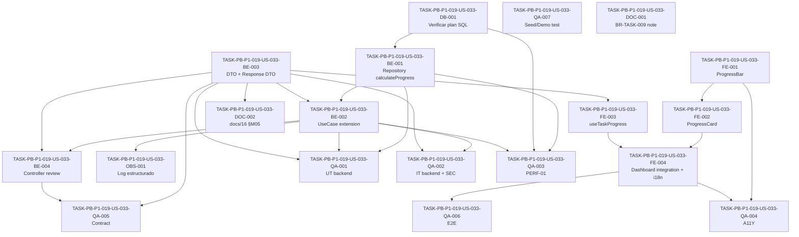

# Development Tasks — PB-P1-019 / US-033: Ver progreso (% done) en el dashboard

## 1. Metadata

| Field                                | Value                                                                                                          |
| ------------------------------------ | -------------------------------------------------------------------------------------------------------------- |
| User Story ID                        | US-033                                                                                                         |
| Source User Story                    | `management/user-stories/US-033-view-progress-dashboard.md`                                                    |
| Source Technical Specification       | `management/technical-specs/P1/PB-P1-019/US-033-technical-spec.md`                                             |
| Decision Resolution Artifact         | `management/user-stories/decision-resolutions/US-033-decision-resolution.md`                                   |
| Priority                             | P1                                                                                                             |
| Backlog ID                           | PB-P1-019                                                                                                      |
| Backlog Title                        | Filtros y progreso del checklist                                                                               |
| Backlog Execution Order              | 37 (P0: 18 items + P1: 19 items)                                                                               |
| User Story Position in Backlog Item  | 2 de 2 (US-032 → US-033)                                                                                       |
| Related User Stories in Backlog Item | US-032 (filtros temporales `range`), US-033 (% de progreso)                                                    |
| Epic                                 | EPIC-TASK-001 — Checklist y tareas                                                                             |
| Backlog Item Dependencies            | PB-P1-018 (US-027, US-029, US-030, US-031)                                                                     |
| Feature                              | Indicador de progreso                                                                                          |
| Module / Domain                      | Tasks / Dashboard                                                                                              |
| Backlog Alignment Status             | Found                                                                                                          |
| Task Breakdown Status                | Ready for Sprint Planning                                                                                      |
| Created Date                         | 2026-06-27                                                                                                     |
| Last Updated                         | 2026-06-27                                                                                                     |

---

## 2. Source Validation

| Source                          | Found | Used | Notes                                                                                              |
| ------------------------------- | ----- | ---- | -------------------------------------------------------------------------------------------------- |
| User Story                       | Yes   | Yes  | Approved with Minor Notes (2026-06-27).                                                            |
| Technical Specification          | Yes   | Yes  | `Ready for Task Breakdown`; primary source de implementación.                                       |
| Decision Resolution Artifact     | Yes   | Yes  | D1–D4 formalizadas.                                                                                |
| Product Backlog Prioritized      | Yes   | Yes  | `PB-P1-019`, posición 2 de 2.                                                                      |
| ADRs                             | No    | N/A  | US-033 no introduce ADR nuevo.                                                                     |

---

## 3. Backlog Execution Context

### Parent Backlog Item

`PB-P1-019 — Filtros y progreso del checklist` cierra el set de capacidades sobre el listado canónico de tareas: filtros temporales (US-032) y agregado server-side de `% done` (US-033). Ambas historias **extienden** el endpoint canónico `GET /api/v1/events/:eventId/tasks` entregado por `PB-P1-018 / US-027`, sin nuevos verbos HTTP y sin migraciones nuevas.

### Execution Order Rationale

US-033 va después de US-032 dentro del mismo item porque:

1. US-032 ya extendió `listEventTasksQuerySchema` con `range` y enriqueció el DTO de items.
2. US-032 validó el plan SQL y la cobertura del índice `idx_event_tasks_event_status_due` con `COUNT(*) FILTER`-like queries (`status NOT IN ('done','skipped')` para `range=overdue`); US-033 reusa el mismo patrón para los predicados de "tarea contable".
3. US-033 cierra el handoff a `PB-P1-008 / US-014` (dashboard), aprobado y operativo.

PB-P1-019 ocupa la posición 37 en el Product Backlog Prioritized.

### Related User Stories in Same Backlog Item

| User Story                                       | Role in Backlog Item                                                       | Suggested Order |
| ------------------------------------------------ | -------------------------------------------------------------------------- | --------------- |
| US-032 — Filtros temporales por `range`           | Extiende query schema + DTO; sin endpoint nuevo; entregada                  | 1               |
| US-033 — Agregado `progress` server-side          | Añade campo `progress` al response; sin endpoint nuevo; pendiente            | 2               |

---

## 4. Task Breakdown Summary

| Area  | Number of Tasks | Notes                                                                                                                      |
| ----- | --------------: | -------------------------------------------------------------------------------------------------------------------------- |
| DB    | 1               | Verificación del plan SQL (sin migraciones).                                                                                |
| BE    | 4               | Repository `calculateProgress`, use case extension, DTO `EventTaskProgressDto`, verificación del controller.                |
| API   | 0               | Sin cambios de routing (extensión del response existente cubierta por BE-003).                                              |
| SEC   | 0               | Reuso íntegro de policies/guards de US-027; las pruebas SEC viven en QA.                                                    |
| OBS   | 1               | Extensión del log estructurado `tasks.list.requested`.                                                                      |
| FE    | 4               | `ProgressBar`, `ProgressCard`, hook `useTaskProgress`, integración con dashboard + i18n (4 locales).                          |
| SEED  | 0               | Reuso del seed existente (US-027/US-031).                                                                                   |
| QA    | 7               | UT, IT, PERF, A11Y, CONTRACT, E2E, SEED-test.                                                                               |
| AI    | 0               | No aplica.                                                                                                                  |
| OPS   | 0               | Reuso íntegro del pipeline.                                                                                                 |
| DOC   | 2               | Documentation Alignment (BR-TASK-009 + `docs/16 §M05`).                                                                     |

**Total: 19 tareas.**

---

## 5. Traceability Matrix

| Acceptance Criterion                                       | Technical Spec Section(s)                                              | Task IDs                                                                                                                            |
| ---------------------------------------------------------- | ---------------------------------------------------------------------- | ----------------------------------------------------------------------------------------------------------------------------------- |
| AC-01 Cálculo canónico (D2)                                 | §6, §7 (use case + repository), §10                                    | DB-001, BE-001, BE-002, BE-003, QA-001, QA-002                                                                                      |
| AC-02 Refresco por invalidación TanStack                    | §6, §8 (hook + invalidación)                                            | FE-003, FE-004, QA-006                                                                                                              |
| AC-03 Shape canónico del agregado                           | §6, §7 (DTO), §9 (API), §16 (DOC alignment)                            | BE-003, BE-004, QA-005, DOC-002                                                                                                      |
| AC-04 i18n del valor formateado                             | §8 (i18n)                                                              | FE-001, FE-004, QA-004                                                                                                              |
| AC-05 Independencia respecto a `event.status` (D3)          | §6, §7 (use case), §12 (SEC)                                            | BE-002, QA-002                                                                                                                      |
| AC-06 Performance (NFR-PERF-001)                             | §7 (repository), §10 (índice), §13 (PERF-01)                            | DB-001, BE-001, QA-003                                                                                                              |
| EC-01..06                                                   | §6 (interpretación funcional)                                           | BE-001, BE-002, QA-001, QA-002                                                                                                      |
| VR-01..04                                                   | §7 (validation), §12 (SEC)                                              | BE-002, BE-003, QA-002, QA-004                                                                                                       |
| SEC-01..05                                                  | §12 (Security & Authorization Design)                                   | BE-002, QA-002, OBS-001                                                                                                              |
| Observability                                               | §14 (Logs)                                                              | OBS-001, QA-001                                                                                                                      |
| Documentation Alignment                                     | §16                                                                    | DOC-001, DOC-002                                                                                                                     |

---

## 6. Development Tasks

### TASK-PB-P1-019-US-033-DB-001 — Verificar plan SQL del agregado `COUNT(*) FILTER (...)` contra el índice canónico

| Field                     | Value                                                                          |
| ------------------------- | ------------------------------------------------------------------------------ |
| Area                      | Database / Prisma                                                              |
| Type                      | Setup                                                                          |
| Priority                  | Must                                                                           |
| Estimate                  | S                                                                              |
| Depends On                | —                                                                              |
| Source AC(s)              | AC-06                                                                          |
| Technical Spec Section(s) | §10, §17 (riesgo de plan SQL), §18 (orden recomendado paso 1)                  |
| Backlog ID                | PB-P1-019                                                                      |
| User Story ID             | US-033                                                                         |
| Owner Role                | Backend                                                                        |
| Status                    | To Do                                                                          |

#### Objective

Validar que el cálculo del agregado en una sola query SQL aprovecha `idx_event_tasks_event_status_due` (entregado por US-032) sin escaneo secuencial sobre datasets representativos.

#### Scope

##### Include

* Ejecutar `EXPLAIN ANALYZE` de la query canónica de `calculateProgress({ eventId })` contra el seed que incluye un evento con 200 `EventTask` mixtas.
* Confirmar uso del índice (no Seq Scan).
* Documentar plan, tiempo y memoria en una nota técnica en el repo (por ejemplo, `docs/notes/US-033-explain-analyze.md` o en el PR).

##### Exclude

* Crear índices nuevos (no se requieren).
* Tunear `work_mem` o parámetros del planner.

#### Implementation Notes

* Query canónica documentada en el tech spec §7 (Repository / Persistence).
* Si el plan deja de usar el índice canónico (por ejemplo por estadísticas obsoletas), abrir follow-up (Future) para índice parcial; **no** bloquea US-033.
* No se ejecutan migraciones.

#### Acceptance Criteria Covered

AC-06 (preparación de PERF-01).

#### Definition of Done

- [ ] `EXPLAIN ANALYZE` ejecutado contra el seed con 200 tareas.
- [ ] Evidencia adjunta al PR mostrando uso del índice.
- [ ] Latencia observada estimada < 100 ms en local con seed (preflight de PERF-01).

---

### TASK-PB-P1-019-US-033-BE-001 — Extender `EventTaskListRepository` con `calculateProgress({ eventId })` (`prisma.$queryRaw`)

| Field                     | Value                                                                          |
| ------------------------- | ------------------------------------------------------------------------------ |
| Area                      | Backend                                                                        |
| Type                      | Implementation                                                                 |
| Priority                  | Must                                                                           |
| Estimate                  | M                                                                              |
| Depends On                | DB-001                                                                          |
| Source AC(s)              | AC-01, AC-03, AC-06                                                            |
| Technical Spec Section(s) | §7 (Repository), §10, §17                                                       |
| Backlog ID                | PB-P1-019                                                                      |
| User Story ID             | US-033                                                                         |
| Owner Role                | Backend                                                                        |
| Status                    | To Do                                                                          |

#### Objective

Implementar el método `calculateProgress({ eventId })` en `EventTaskListRepository` que retorna `EventTaskProgressDto` en una sola query SQL.

#### Scope

##### Include

* Método `calculateProgress({ eventId }): Promise<EventTaskProgressDto>`.
* Uso de `prisma.$queryRaw` con la query canónica de tres `COUNT(*) FILTER (...)` y `::int` casts.
* Predicado de "tarea contable": `deleted_at IS NULL AND (ai_generated = false OR (ai_generated = true AND confirmed = true))`.
* Logs estructurados de errores del repositorio (sin PII).

##### Exclude

* No introducir cache server-side (Redis/memo).
* No introducir nuevo método/endpoint de progreso aislado.
* No tocar el código del listado paginado existente.

#### Implementation Notes

* Archivo: `apps/api/src/modules/tasks/repositories/event-task-list.repository.ts`.
* Mantener la firma del método con tipos Zod-inferidos.
* `total_countable` debe excluir `skipped` (D2).
* `skipped` se reporta como contador para auditoría.
* `Math.round` no aplica aquí; el redondeo se calcula en el use case (BE-002).
* Mantener un único round-trip SQL.

#### Acceptance Criteria Covered

AC-01, AC-03, AC-06.

#### Definition of Done

- [ ] Método agregado y exportado.
- [ ] Tipos consistentes con `EventTaskProgressDto` (BE-003).
- [ ] Tests unitarios + integration que validan exclusión de IA no confirmadas y soft-deleted (cubiertos por QA-001 y QA-002).
- [ ] Sin cambios en migraciones ni en el schema Prisma.

---

### TASK-PB-P1-019-US-033-BE-002 — Extender `ListEventTasksUseCase` para invocar `calculateProgress` y componer el response

| Field                     | Value                                                                          |
| ------------------------- | ------------------------------------------------------------------------------ |
| Area                      | Backend                                                                        |
| Type                      | Implementation                                                                 |
| Priority                  | Must                                                                           |
| Estimate                  | S                                                                              |
| Depends On                | BE-001                                                                          |
| Source AC(s)              | AC-01, AC-05, EC-01..06, VR-01..04                                              |
| Technical Spec Section(s) | §7 (Use Cases), §6                                                              |
| Backlog ID                | PB-P1-019                                                                      |
| User Story ID             | US-033                                                                         |
| Owner Role                | Backend                                                                        |
| Status                    | To Do                                                                          |

#### Objective

Extender el use case existente para invocar `calculateProgress` tras paginar items y exponer `progress` en el response. Aplicar redondeo half-up del `percentage` con `Math.round` sobre el ratio.

#### Scope

##### Include

* Composición del response final `{ items, pagination, progress }`.
* `percentage = total_countable === 0 ? 0 : Math.round((done / total_countable) * 100)` (D2/D4).
* No consultar `event.status` (D3): la autorización ocurre en el middleware/guard; el cálculo no se ramifica por estado.
* Preservar el contrato del listado paginado (no breaking change).

##### Exclude

* No invalidar caches client-side desde el backend.
* No cambiar la estrategia de paginación de US-027.
* No tocar el filtro `range` de US-032.

#### Implementation Notes

* Archivo: `apps/api/src/modules/tasks/use-cases/list-event-tasks.use-case.ts`.
* `Math.round` en JS es half-up para positivos enteros del producto `D / T * 100`; si en pruebas (UT-01) surge banker's rounding por imprecisión float, ajustar a `Math.floor((D / T) * 100 + 0.5)`.
* Mantener una sola ida al repositorio para `calculateProgress` por request.

#### Acceptance Criteria Covered

AC-01, AC-05, EC-01..06, VR-01..04.

#### Definition of Done

- [ ] Use case compone `{ items, pagination, progress }`.
- [ ] `percentage` cumple D2/D4 (rango entero `0..100`, half-up).
- [ ] No introduce branching por `event.status` (D3).
- [ ] Tests del use case (UT-02..05, IT-01..10) verdes vía QA-001/QA-002.

---

### TASK-PB-P1-019-US-033-BE-003 — Crear `EventTaskProgressDto` y extender `ListEventTasksResponseDto`

| Field                     | Value                                                                          |
| ------------------------- | ------------------------------------------------------------------------------ |
| Area                      | Backend                                                                        |
| Type                      | Implementation                                                                 |
| Priority                  | Must                                                                           |
| Estimate                  | XS                                                                             |
| Depends On                | —                                                                              |
| Source AC(s)              | AC-03                                                                          |
| Technical Spec Section(s) | §7 (DTOs / Schemas), §9                                                         |
| Backlog ID                | PB-P1-019                                                                      |
| User Story ID             | US-033                                                                         |
| Owner Role                | Backend                                                                        |
| Status                    | To Do                                                                          |

#### Objective

Definir el DTO Zod `EventTaskProgressDto` y extender `ListEventTasksResponseDto` con el campo `progress` para fijar el contrato API.

#### Scope

##### Include

* Archivo `apps/api/src/modules/tasks/dto/event-task-progress.dto.ts` con el schema Zod:

  ```ts
  export const eventTaskProgressDto = z.object({
    percentage: z.number().int().min(0).max(100),
    done: z.number().int().min(0),
    total_countable: z.number().int().min(0),
    skipped: z.number().int().min(0),
  });
  export type EventTaskProgressDto = z.infer<typeof eventTaskProgressDto>;
  ```
* Extensión del DTO de response existente (`ListEventTasksResponseDto`) con `progress: eventTaskProgressDto`.
* Tipado consistente con el use case (BE-002) y el repositorio (BE-001).

##### Exclude

* No exponer ratios ni decimales.
* No omitir el campo cuando `total_countable = 0` (siempre presente, con ceros).

#### Implementation Notes

* Reusar utilidades Zod ya existentes en `modules/tasks/dto/`.
* Si la serialización pasa por una capa `ResponseSerializer`, asegurar que `progress` no se filtra.

#### Acceptance Criteria Covered

AC-03.

#### Definition of Done

- [ ] DTO Zod definido y exportado.
- [ ] Response DTO extendido.
- [ ] Tipos compartidos con frontend en paquete `packages/shared-types` si existe (o duplicar tipo en frontend si no).

---

### TASK-PB-P1-019-US-033-BE-004 — Verificar que `ListEventTasksController` serializa el response extendido sin modificar routing

| Field                     | Value                                                                          |
| ------------------------- | ------------------------------------------------------------------------------ |
| Area                      | Backend                                                                        |
| Type                      | Review                                                                         |
| Priority                  | Must                                                                           |
| Estimate                  | XS                                                                             |
| Depends On                | BE-002, BE-003                                                                  |
| Source AC(s)              | AC-03                                                                          |
| Technical Spec Section(s) | §7 (Controllers), §9                                                            |
| Backlog ID                | PB-P1-019                                                                      |
| User Story ID             | US-033                                                                         |
| Owner Role                | Backend                                                                        |
| Status                    | To Do                                                                          |

#### Objective

Confirmar que el controller existente `ListEventTasksController` propaga el response extendido (`{ items, pagination, progress }`) sin alteraciones de routing, autorización ni códigos de estado.

#### Scope

##### Include

* Revisión del controller para confirmar que delega al use case y serializa el response completo.
* Aseguramiento de que no se filtra `progress` accidentalmente en middlewares de respuesta.

##### Exclude

* No introducir nuevas rutas.
* No reescribir la firma del handler.

#### Implementation Notes

* Si existe un response interceptor que aplica `pick`/`omit`, validar que `progress` está incluido por defecto.

#### Acceptance Criteria Covered

AC-03.

#### Definition of Done

- [ ] Controller revisado; sin cambios funcionales o cambios mínimos confirmados.
- [ ] Contract test (QA-005) verde tras esta verificación.

---

### TASK-PB-P1-019-US-033-OBS-001 — Extender log estructurado `tasks.list.requested` con campos del agregado `progress`

| Field                     | Value                                                                          |
| ------------------------- | ------------------------------------------------------------------------------ |
| Area                      | Observability / Audit                                                          |
| Type                      | Implementation                                                                 |
| Priority                  | Must                                                                           |
| Estimate                  | XS                                                                             |
| Depends On                | BE-002                                                                          |
| Source AC(s)              | AC-01                                                                          |
| Technical Spec Section(s) | §14 (Logs), §7 (Observability)                                                  |
| Backlog ID                | PB-P1-019                                                                      |
| User Story ID             | US-033                                                                         |
| Owner Role                | Backend                                                                        |
| Status                    | To Do                                                                          |

#### Objective

Añadir los campos `progress.percentage`, `progress.done`, `progress.total_countable`, `progress.skipped` al log estructurado existente `tasks.list.requested` sin introducir nuevas métricas Prometheus.

#### Scope

##### Include

* Extensión del contrato del evento de log en `apps/api/src/shared/logging/task-events.ts` (o equivalente).
* Inclusión del bloque `progress` en el log emitido por el use case.

##### Exclude

* No registrar PII.
* No crear nuevos histogramas o counters (reuso de `http_request_duration_seconds`).

#### Implementation Notes

* `correlationId` y `userId` heredan del middleware existente.
* Si el log usa schema-based validation (Zod), actualizar el schema.

#### Acceptance Criteria Covered

AC-01 (auditoría del cálculo) y SEC-05.

#### Definition of Done

- [ ] Log emitido contiene `progress.*` con tipos correctos.
- [ ] Snapshot test del log verde.
- [ ] Sin PII en el payload del log.

---

### TASK-PB-P1-019-US-033-FE-001 — Implementar componente `ProgressBar` con atributos ARIA y consumo de i18n

| Field                     | Value                                                                          |
| ------------------------- | ------------------------------------------------------------------------------ |
| Area                      | Frontend                                                                       |
| Type                      | Implementation                                                                 |
| Priority                  | Must                                                                           |
| Estimate                  | M                                                                              |
| Depends On                | —                                                                              |
| Source AC(s)              | AC-04, A11Y-01..03                                                              |
| Technical Spec Section(s) | §8 (Components, Accessibility, i18n)                                            |
| Backlog ID                | PB-P1-019                                                                      |
| User Story ID             | US-033                                                                         |
| Owner Role                | Frontend                                                                       |
| Status                    | To Do                                                                          |

#### Objective

Crear el componente `ProgressBar` que renderiza el porcentaje con atributos ARIA, soporta el estado `loading` (`aria-busy="true"`) y formatea el valor según locale.

#### Scope

##### Include

* Archivo `apps/web/components/events/dashboard/ProgressBar.tsx`.
* Props: `{ percentage, done, totalCountable, skipped, loading?, eventStatus? }`.
* Render `role="progressbar"` con `aria-valuenow`, `aria-valuemin=0`, `aria-valuemax=100`, `aria-label` localizado.
* Tooltip opcional con `done / totalCountable` y nota "{skipped} omitidas".
* Banner condicional para `eventStatus = 'cancelled'` o `'completed'` (consumo de patrones de US-014 y US-015).
* Uso de `Intl.NumberFormat(locale, { style: 'percent' })` aplicado a `percentage / 100`.

##### Exclude

* No recalcular `percentage` localmente (D2/VR-04).
* No incluir el banner de overcommit (pertenece a US-014/US-022).

#### Implementation Notes

* Tokens del design system para color y radio.
* Mantener componente puramente presentacional; sin fetches internos.

#### Acceptance Criteria Covered

AC-04, A11Y-01, A11Y-02, A11Y-03.

#### Definition of Done

- [ ] Componente exporta el render con ARIA correctos.
- [ ] Tests RTL + jest-axe verdes (cubiertos en QA-004).
- [ ] Storybook (si aplica) con 4 historias: `0%`, parcial, `100%`, loading.

---

### TASK-PB-P1-019-US-033-FE-002 — Implementar `ProgressCard` para el dashboard del evento

| Field                     | Value                                                                          |
| ------------------------- | ------------------------------------------------------------------------------ |
| Area                      | Frontend                                                                       |
| Type                      | Implementation                                                                 |
| Priority                  | Must                                                                           |
| Estimate                  | S                                                                              |
| Depends On                | FE-001                                                                          |
| Source AC(s)              | AC-04                                                                          |
| Technical Spec Section(s) | §8 (Components)                                                                  |
| Backlog ID                | PB-P1-019                                                                      |
| User Story ID             | US-033                                                                         |
| Owner Role                | Frontend                                                                       |
| Status                    | To Do                                                                          |

#### Objective

Envoltorio de tarjeta para `ProgressBar` con título localizado, CTA "Ir al checklist" y estados de carga/error/empty.

#### Scope

##### Include

* Archivo `apps/web/components/events/dashboard/ProgressCard.tsx`.
* Empty state con copy `progress.empty_cta` cuando `total_countable = 0`.
* Skeleton durante loading.
* Reuso del banner de error de US-014.

##### Exclude

* No agregar métricas de presupuesto ni booking (pertenecen a US-014).

#### Implementation Notes

* Recibe `progress` y `eventStatus` desde el dashboard.
* Mantener responsabilidad acotada: presentación.

#### Acceptance Criteria Covered

AC-04.

#### Definition of Done

- [ ] Card renderiza la barra, el tooltip opcional y los estados loading/empty/error.
- [ ] Tests RTL básicos verdes.

---

### TASK-PB-P1-019-US-033-FE-003 — Extender `useEventTasks` y crear hook `useTaskProgress`

| Field                     | Value                                                                          |
| ------------------------- | ------------------------------------------------------------------------------ |
| Area                      | Frontend                                                                       |
| Type                      | Implementation                                                                 |
| Priority                  | Must                                                                           |
| Estimate                  | S                                                                              |
| Depends On                | BE-003                                                                          |
| Source AC(s)              | AC-02                                                                          |
| Technical Spec Section(s) | §8 (State Management, Data Fetching)                                            |
| Backlog ID                | PB-P1-019                                                                      |
| User Story ID             | US-033                                                                         |
| Owner Role                | Frontend                                                                       |
| Status                    | To Do                                                                          |

#### Objective

Extender el tipo de retorno de `useEventTasks` con `progress` y exponer un selector liviano `useTaskProgress(eventId)` sobre el mismo query key.

#### Scope

##### Include

* Archivo `apps/web/hooks/useEventTasks.ts` — actualización del tipo de retorno.
* Archivo `apps/web/hooks/useTaskProgress.ts` — nuevo selector con `select: (data) => data.progress`.
* Mantener la query key canónica `['event', eventId, 'tasks', { range, page, pageSize }]`.

##### Exclude

* No crear nuevo `queryFn` ni nuevo endpoint.
* No introducir invalidadores adicionales (los de US-029/US-030/US-031 cubren el caso).

#### Implementation Notes

* `useTaskProgress` debe usar `useEventTasks({ eventId, page: 1, pageSize: 1, range: 'all' }, { select })` o equivalente para asegurar que reusa el mismo cache.
* Documentar la convención en `apps/web/lib/queryKeys.ts`.

#### Acceptance Criteria Covered

AC-02.

#### Definition of Done

- [ ] Tipos actualizados; sin breaking changes para consumidores existentes.
- [ ] Tests del hook (UT-09-FE) verdes.

---

### TASK-PB-P1-019-US-033-FE-004 — Integrar `ProgressCard` con el dashboard del evento (US-014) y añadir claves i18n en 4 locales

| Field                     | Value                                                                          |
| ------------------------- | ------------------------------------------------------------------------------ |
| Area                      | Frontend                                                                       |
| Type                      | Implementation                                                                 |
| Priority                  | Must                                                                           |
| Estimate                  | S                                                                              |
| Depends On                | FE-002, FE-003                                                                  |
| Source AC(s)              | AC-02, AC-04                                                                    |
| Technical Spec Section(s) | §8 (Routes / Pages, i18n)                                                        |
| Backlog ID                | PB-P1-019                                                                      |
| User Story ID             | US-033                                                                         |
| Owner Role                | Frontend                                                                       |
| Status                    | To Do                                                                          |

#### Objective

Reemplazar el cálculo client-side actual del `%` (si lo hubiere en US-014) por consumo del `progress` del backend, y añadir las claves i18n en `es-LATAM`, `es-ES`, `pt`, `en`.

#### Scope

##### Include

* Integración en `apps/web/app/[locale]/organizer/events/[eventId]/page.tsx`.
* Claves nuevas: `progress.label`, `progress.skipped_note`, `progress.empty_cta`, `progress.event_completed_banner`, `progress.event_cancelled_banner`.
* Archivos: `apps/web/messages/{es-LATAM,es-ES,pt,en}.json`.

##### Exclude

* No introducir nuevos locales fuera del MVP.
* No tocar las cards de presupuesto, quotes o booking (pertenecen a US-014).

#### Implementation Notes

* Si US-014 cómputa `%` client-side, eliminar el cálculo y delegar a `useTaskProgress`.
* Mantener handoff documentado en el PR.

#### Acceptance Criteria Covered

AC-02, AC-04.

#### Definition of Done

- [ ] Dashboard consume `useTaskProgress`.
- [ ] Claves i18n añadidas y revisadas en los 4 locales.
- [ ] E2E (QA-006) verde.

---

### TASK-PB-P1-019-US-033-QA-001 — Tests unitarios backend (fórmula, predicados, DTO Zod, rounding boundary)

| Field                     | Value                                                                          |
| ------------------------- | ------------------------------------------------------------------------------ |
| Area                      | QA / Testing                                                                   |
| Type                      | Test                                                                           |
| Priority                  | Must                                                                           |
| Estimate                  | M                                                                              |
| Depends On                | BE-001, BE-002, BE-003                                                          |
| Source AC(s)              | AC-01, AC-03, EC-01..06                                                         |
| Technical Spec Section(s) | §13 (Unit Tests UT-01..07)                                                      |
| Backlog ID                | PB-P1-019                                                                      |
| User Story ID             | US-033                                                                         |
| Owner Role                | QA                                                                             |
| Status                    | To Do                                                                          |

#### Objective

Cobertura unitaria del use case y el repositorio en backend para la fórmula canónica, los predicados de "tarea contable", el rounding half-up y el contrato DTO.

#### Scope

##### Include

* UT-01 `ROUND_HALF_UP(50.5) = 51`; `ROUND_HALF_UP(50.4) = 50`.
* UT-02 `total_countable = 0 ⇒ percentage = 0`.
* UT-03 predicado "contable" excluye `ai_generated=true ∧ confirmed=false`.
* UT-04 predicado "contable" excluye `deleted_at IS NOT NULL`.
* UT-05 `total_countable` excluye `skipped`.
* UT-06 invariante `done <= total_countable`.
* UT-07 DTO Zod rechaza `percentage = 101` y `percentage = -1`.

##### Exclude

* No incluir tests de autorización (van en QA-002).
* No incluir tests E2E.

#### Implementation Notes

* Vitest + mocks del repositorio para el use case.
* Para el repositorio, usar test database de integración (cubierto en QA-002 también).

#### Acceptance Criteria Covered

AC-01, AC-03, EC-01..06.

#### Definition of Done

- [ ] 7 tests unitarios verdes.
- [ ] Cobertura del módulo `tasks` ≥ 50% (consistente con MVP §12.4).

---

### TASK-PB-P1-019-US-033-QA-002 — Tests integration backend (autorización, `event.status`, soft-delete, filtros, paginación)

| Field                     | Value                                                                          |
| ------------------------- | ------------------------------------------------------------------------------ |
| Area                      | QA / Testing                                                                   |
| Type                      | Test                                                                           |
| Priority                  | Must                                                                           |
| Estimate                  | L                                                                              |
| Depends On                | BE-002, BE-003                                                                  |
| Source AC(s)              | AC-01, AC-05, EC-04..06, VR-01..04, SEC-01..05                                   |
| Technical Spec Section(s) | §13 (Integration Tests IT-01..10, Security Tests SEC-T-01..05)                  |
| Backlog ID                | PB-P1-019                                                                      |
| User Story ID             | US-033                                                                         |
| Owner Role                | QA                                                                             |
| Status                    | To Do                                                                          |

#### Objective

Cobertura integration via Supertest sobre el endpoint extendido: autorización, `event.status`, soft-delete, exclusiones, filtros y paginación.

#### Scope

##### Include

* IT-01 mix de estados ⇒ `percentage` correcto.
* IT-02 IA confirmadas vs no confirmadas.
* IT-03 soft-deleted ignoradas.
* IT-04 evento `cancelled` ⇒ 200 con cálculo real.
* IT-05 evento `completed` ⇒ 200 con cálculo real.
* IT-06 solo IA no confirmadas ⇒ `{0,0,0,0}`.
* IT-07 todas `skipped` ⇒ `{0,0,0,N}`.
* IT-08 sin tareas ⇒ `{0,0,0,0}`.
* IT-09 `range=overdue` NO altera `progress`.
* IT-10 paginación NO altera `progress`.
* SEC-T-01..05: 401 sin sesión, 404 ajeno, 403 vendor, 403 admin, 400 UUID inválido.

##### Exclude

* No incluir tests A11Y (QA-004), PERF (QA-003), CONTRACT (QA-005), E2E (QA-006).

#### Implementation Notes

* Supertest + base de datos de integración (testcontainers o equivalente).
* Reusar fixtures de eventos demo (`event-demo-active`, `cancelled`, `completed`).

#### Acceptance Criteria Covered

AC-01, AC-05, EC-04..06, VR-01..04, SEC-01..05.

#### Definition of Done

- [ ] 10 IT + 5 SEC-T verdes.
- [ ] Sin flakiness en CI.

---

### TASK-PB-P1-019-US-033-QA-003 — Test de performance PERF-01 (P95 < 1.5 s con 200 tareas)

| Field                     | Value                                                                          |
| ------------------------- | ------------------------------------------------------------------------------ |
| Area                      | QA / Testing                                                                   |
| Type                      | Test                                                                           |
| Priority                  | Must                                                                           |
| Estimate                  | S                                                                              |
| Depends On                | BE-001, BE-002, DB-001                                                          |
| Source AC(s)              | AC-06                                                                          |
| Technical Spec Section(s) | §13 (Performance Tests PERF-01), §10                                            |
| Backlog ID                | PB-P1-019                                                                      |
| User Story ID             | US-033                                                                         |
| Owner Role                | QA                                                                             |
| Status                    | To Do                                                                          |

#### Objective

Medir el P95 del endpoint contra un dataset de 200 `EventTask` mixtas y validar `NFR-PERF-001` (P95 < 1.5 s).

#### Scope

##### Include

* Suite de performance dedicada (Vitest + Supertest o herramienta equivalente).
* Generación del dataset de 200 tareas mixtas (`pending`, `in_progress`, `done`, `skipped`, IA confirmadas/no confirmadas, soft-deleted).
* Cálculo de P95 sobre N (≥ 30) repeticiones.

##### Exclude

* No incluir IA en el flujo.
* No considerar carga concurrente extrema (queda como mejora futura).

#### Implementation Notes

* Si el dataset usa SQL bulk insert, no contaminar el seed normal.
* Marcar el test como `@perf` para que CI lo ejecute en pipeline dedicado.

#### Acceptance Criteria Covered

AC-06.

#### Definition of Done

- [ ] P95 observado < 1.5 s en CI bajo condiciones normales.
- [ ] Reporte adjunto en el PR.

---

### TASK-PB-P1-019-US-033-QA-004 — Tests A11Y de `ProgressBar` (atributos ARIA + locales)

| Field                     | Value                                                                          |
| ------------------------- | ------------------------------------------------------------------------------ |
| Area                      | QA / Testing                                                                   |
| Type                      | Test                                                                           |
| Priority                  | Must                                                                           |
| Estimate                  | S                                                                              |
| Depends On                | FE-001, FE-004                                                                  |
| Source AC(s)              | AC-04, A11Y-01..03                                                              |
| Technical Spec Section(s) | §13 (Accessibility Tests A11Y-01..03)                                           |
| Backlog ID                | PB-P1-019                                                                      |
| User Story ID             | US-033                                                                         |
| Owner Role                | QA                                                                             |
| Status                    | To Do                                                                          |

#### Objective

Validar accesibilidad y formateo i18n de `ProgressBar` en los 4 locales canónicos.

#### Scope

##### Include

* A11Y-01: `role="progressbar"` con atributos `aria-valuenow/min/max`.
* A11Y-02: `aria-busy="true"` durante loading.
* A11Y-03: `aria-label` localizado en `es-LATAM`, `es-ES`, `pt`, `en`.
* UT-08-FE: render del `percentage` recibido sin transformación aritmética.

##### Exclude

* No incluir tests de tema oscuro/claro.

#### Implementation Notes

* @testing-library + jest-axe.
* Render con `next-intl` provider en los 4 locales.

#### Acceptance Criteria Covered

AC-04, A11Y-01..03.

#### Definition of Done

- [ ] Tests verdes en CI.
- [ ] `jest-axe` sin violaciones.

---

### TASK-PB-P1-019-US-033-QA-005 — Contract test CONTRACT-01 contra OpenAPI snapshot

| Field                     | Value                                                                          |
| ------------------------- | ------------------------------------------------------------------------------ |
| Area                      | QA / Testing                                                                   |
| Type                      | Test                                                                           |
| Priority                  | Should                                                                         |
| Estimate                  | S                                                                              |
| Depends On                | BE-003, BE-004                                                                  |
| Source AC(s)              | AC-03                                                                          |
| Technical Spec Section(s) | §13 (Contract Tests CONTRACT-01), §16                                          |
| Backlog ID                | PB-P1-019                                                                      |
| User Story ID             | US-033                                                                         |
| Owner Role                | QA                                                                             |
| Status                    | To Do                                                                          |

#### Objective

Validar el shape extendido `progress: { percentage, done, total_countable, skipped }` en el response contra el snapshot OpenAPI mantenido por US-098.

#### Scope

##### Include

* Snapshot test del response real vs el contrato OpenAPI generado.
* Tolerancia mínima: nuevos campos opcionales documentados.

##### Exclude

* No incluir tests de campos no relacionados (`items`, `pagination`).

#### Implementation Notes

* Si el snapshot OpenAPI no está disponible al momento (US-098 es Future), generar un snapshot interno temporal en `apps/api/tests/contracts/`.

#### Acceptance Criteria Covered

AC-03.

#### Definition of Done

- [ ] Contract test verde.
- [ ] Si snapshot OpenAPI ausente, snapshot interno commiteado.

---

### TASK-PB-P1-019-US-033-QA-006 — E2E del ciclo demoable (Playwright)

| Field                     | Value                                                                          |
| ------------------------- | ------------------------------------------------------------------------------ |
| Area                      | QA / Testing                                                                   |
| Type                      | Test                                                                           |
| Priority                  | Must                                                                           |
| Estimate                  | M                                                                              |
| Depends On                | FE-004                                                                          |
| Source AC(s)              | AC-02, AC-04, AC-05                                                              |
| Technical Spec Section(s) | §13 (E2E Tests E2E-01..03)                                                      |
| Backlog ID                | PB-P1-019                                                                      |
| User Story ID             | US-033                                                                         |
| Owner Role                | QA                                                                             |
| Status                    | To Do                                                                          |

#### Objective

Validar el ciclo demoable end-to-end: cambio de estado en US-030 actualiza `%`; confirmación HITL en US-031 actualiza `total_countable`; estado `completed` muestra banner sobre la barra.

#### Scope

##### Include

* E2E-01: cambio a `done` ⇒ refresh visible.
* E2E-02: confirmación HITL ⇒ `total_countable` aumenta y `%` recalcula.
* E2E-03: evento `completed` muestra banner "Evento completado" sobre la barra.

##### Exclude

* No incluir flujos de overcommit o quotes.

#### Implementation Notes

* Usar seed de demo existente.
* Estabilizar selectores ARIA (`role="progressbar"`).

#### Acceptance Criteria Covered

AC-02, AC-04, AC-05.

#### Definition of Done

- [ ] 3 E2E verdes en CI.
- [ ] Sin flakiness > 1% en 50 corridas.

---

### TASK-PB-P1-019-US-033-QA-007 — Test de seed/demo: cobertura de tres escenarios (0%, parcial, 100%)

| Field                     | Value                                                                          |
| ------------------------- | ------------------------------------------------------------------------------ |
| Area                      | QA / Testing                                                                   |
| Type                      | Test                                                                           |
| Priority                  | Should                                                                         |
| Estimate                  | XS                                                                             |
| Depends On                | —                                                                              |
| Source AC(s)              | AC-04                                                                          |
| Technical Spec Section(s) | §15 (Seed / Demo Data Impact)                                                   |
| Backlog ID                | PB-P1-019                                                                      |
| User Story ID             | US-033                                                                         |
| Owner Role                | QA                                                                             |
| Status                    | To Do                                                                          |

#### Objective

Validar que el seed por defecto contiene al menos un evento por cada nivel de progreso (0%, parcial, 100%) para soportar la demo.

#### Scope

##### Include

* Vitest que verifica conteos por evento demo tras seed.

##### Exclude

* No modificar el seed (reuso).

#### Implementation Notes

* Si el seed ya cubre los tres, validar; si no, abrir follow-up en US-031.

#### Acceptance Criteria Covered

AC-04 (Demo readiness).

#### Definition of Done

- [ ] Test verde contra seed estándar.

---

### TASK-PB-P1-019-US-033-DOC-001 — Nota interpretativa en `docs/4 §BR-TASK-009` referenciando D2

| Field                     | Value                                                                          |
| ------------------------- | ------------------------------------------------------------------------------ |
| Area                      | Documentation / Traceability                                                   |
| Type                      | Documentation                                                                  |
| Priority                  | Should                                                                         |
| Estimate                  | XS                                                                             |
| Depends On                | —                                                                              |
| Source AC(s)              | AC-01                                                                          |
| Technical Spec Section(s) | §16 (Documentation Alignment Required)                                          |
| Backlog ID                | PB-P1-019                                                                      |
| User Story ID             | US-033                                                                         |
| Owner Role                | Tech Lead                                                                      |
| Status                    | To Do                                                                          |

#### Objective

Añadir nota interpretativa a BR-TASK-009 que formaliza el predicado de "tarea contable" (excluye `skipped` y `ai_generated=true ∧ confirmed=false`) y referencia D2 de US-033.

#### Scope

##### Include

* Edición de `docs/4-Business-Rules-Document.md` en la entrada BR-TASK-009.

##### Exclude

* No crear ADR (no es necesario; D2 está formalizada en el artefacto de decisiones).

#### Implementation Notes

* Mantener el wording de la regla; añadir una nota explicativa abajo.

#### Acceptance Criteria Covered

AC-01 (alineación documental).

#### Definition of Done

- [ ] Nota merge-eada en `docs/4`.
- [ ] No bloqueante.

---

### TASK-PB-P1-019-US-033-DOC-002 — Actualizar `docs/16 §M05 Event Tasks` con el campo `progress` en el response

| Field                     | Value                                                                          |
| ------------------------- | ------------------------------------------------------------------------------ |
| Area                      | Documentation / Traceability                                                   |
| Type                      | Documentation                                                                  |
| Priority                  | Should                                                                         |
| Estimate                  | XS                                                                             |
| Depends On                | BE-003                                                                          |
| Source AC(s)              | AC-03                                                                          |
| Technical Spec Section(s) | §16 (Documentation Alignment Required), §9                                      |
| Backlog ID                | PB-P1-019                                                                      |
| User Story ID             | US-033                                                                         |
| Owner Role                | Tech Lead                                                                      |
| Status                    | To Do                                                                          |

#### Objective

Reflejar el shape extendido del response del listado canónico en la sección M05 de la API Design Specification y dejar handoff a US-098 para el snapshot OpenAPI.

#### Scope

##### Include

* Edición de `docs/16-API-Design-Specification.md` §M05.
* Mención explícita: handoff a US-098 (snapshot OpenAPI).

##### Exclude

* No crear el snapshot OpenAPI (Future, US-098).

#### Implementation Notes

* Reusar el ejemplo de payload del tech spec §9.

#### Acceptance Criteria Covered

AC-03.

#### Definition of Done

- [ ] `docs/16 §M05` actualizado.
- [ ] No bloqueante.

---

## 7. Required QA Tasks

| Task ID                                          | Test Type     | Purpose                                                                                |
| ------------------------------------------------ | ------------- | -------------------------------------------------------------------------------------- |
| TASK-PB-P1-019-US-033-QA-001                      | Unit          | Fórmula canónica, predicados, rounding, DTO Zod.                                       |
| TASK-PB-P1-019-US-033-QA-002                      | Integration   | Autorización, `event.status`, soft-delete, filtros, paginación.                         |
| TASK-PB-P1-019-US-033-QA-003                      | Performance   | P95 < 1.5 s con 200 tareas (NFR-PERF-001).                                              |
| TASK-PB-P1-019-US-033-QA-004                      | Accessibility | ARIA + locales en `ProgressBar`.                                                       |
| TASK-PB-P1-019-US-033-QA-005                      | Contract      | Shape del response vs OpenAPI snapshot (handoff a US-098).                              |
| TASK-PB-P1-019-US-033-QA-006                      | E2E           | Cambio de estado, confirmación HITL, `completed` banner.                                |
| TASK-PB-P1-019-US-033-QA-007                      | Seed / Demo   | Cobertura de los tres escenarios de progreso en seed (0%, parcial, 100%).                |

---

## 8. Required Security Tasks

No aplica como tareas dedicadas: el surface reusa íntegramente `EventOwnershipPolicy`, `OrganizerRoleGuard`, `adminExclusionGuard` y la no-revelación 404 de US-027. Las pruebas SEC-T-01..05 viven en `TASK-PB-P1-019-US-033-QA-002` (Integration).

| Task ID                                          | Security Concern                                  | Purpose                                                              |
| ------------------------------------------------ | ------------------------------------------------- | -------------------------------------------------------------------- |
| TASK-PB-P1-019-US-033-QA-002                      | 401 / 403 / 404 / 400 (negative cases completos)   | Cobertura de autorización y validación de input (reuso de US-027).    |

---

## 9. Required Seed / Demo Tasks

No aplica como tareas dedicadas: reuso del seed entregado en US-027/US-031. La validación de cobertura de escenarios (0%, parcial, 100%) vive en `TASK-PB-P1-019-US-033-QA-007`.

| Task ID                                          | Seed/Demo Concern                                  | Purpose                                                              |
| ------------------------------------------------ | -------------------------------------------------- | -------------------------------------------------------------------- |
| TASK-PB-P1-019-US-033-QA-007                      | Cobertura de demo de progreso                       | Validar que el seed soporta la demo end-to-end.                       |

---

## 10. Observability / Audit Tasks

| Task ID                                          | Concern                                                | Purpose                                                                     |
| ------------------------------------------------ | ------------------------------------------------------ | --------------------------------------------------------------------------- |
| TASK-PB-P1-019-US-033-OBS-001                     | Log estructurado del agregado `progress`                | Auditoría del cálculo + correlación con `tasks.list.requested`.              |

---

## 11. Documentation / Traceability Tasks

| Task ID                                          | Document / Artifact                                | Purpose                                                                           |
| ------------------------------------------------ | -------------------------------------------------- | --------------------------------------------------------------------------------- |
| TASK-PB-P1-019-US-033-DOC-001                     | `docs/4-Business-Rules-Document.md` §BR-TASK-009    | Nota interpretativa referenciando D2 (formaliza predicado de "tarea contable").    |
| TASK-PB-P1-019-US-033-DOC-002                     | `docs/16-API-Design-Specification.md` §M05          | Documentar el campo `progress` en el response del listado canónico de tareas.      |

---

## 12. Dependency Graph



---

## 13. Suggested Implementation Order

### Phase 1 — Foundation

* `TASK-PB-P1-019-US-033-DB-001` (verificación plan SQL).
* `TASK-PB-P1-019-US-033-BE-003` (DTOs).

### Phase 2 — Core Implementation

* `TASK-PB-P1-019-US-033-BE-001` (Repository).
* `TASK-PB-P1-019-US-033-BE-002` (UseCase).
* `TASK-PB-P1-019-US-033-BE-004` (Controller review).
* `TASK-PB-P1-019-US-033-OBS-001` (Log estructurado).
* `TASK-PB-P1-019-US-033-FE-003` (Hook).
* `TASK-PB-P1-019-US-033-FE-001` (ProgressBar).
* `TASK-PB-P1-019-US-033-FE-002` (ProgressCard).
* `TASK-PB-P1-019-US-033-FE-004` (Dashboard integration + i18n).

### Phase 3 — Validation / Security / QA

* `TASK-PB-P1-019-US-033-QA-001` (UT backend).
* `TASK-PB-P1-019-US-033-QA-002` (IT + SEC).
* `TASK-PB-P1-019-US-033-QA-003` (PERF).
* `TASK-PB-P1-019-US-033-QA-004` (A11Y).
* `TASK-PB-P1-019-US-033-QA-005` (Contract).
* `TASK-PB-P1-019-US-033-QA-006` (E2E).
* `TASK-PB-P1-019-US-033-QA-007` (Seed/Demo test).

### Phase 4 — Documentation / Review

* `TASK-PB-P1-019-US-033-DOC-001`.
* `TASK-PB-P1-019-US-033-DOC-002`.

---

## 14. Risks & Mitigations

| Risk                                                                                                          | Impact                                          | Mitigation                                                                                                                                  | Related Task                                |
| ------------------------------------------------------------------------------------------------------------- | ----------------------------------------------- | ------------------------------------------------------------------------------------------------------------------------------------------- | ------------------------------------------- |
| Cómputo del agregado en query secundaria duplicaría el costo y violaría `NFR-PERF-001`.                        | P95 > 1.5 s en datasets grandes.                | BE-001 implementa una sola query SQL; DB-001 valida plan; QA-003 mide P95.                                                                  | DB-001, BE-001, QA-003                       |
| Frontend recalcula `percentage` localmente y genera drift con el backend.                                       | UI inconsistente con backend.                   | D2/VR-04 explícitos. UT-08-FE valida que el componente no recalcula. FE-004 reemplaza cualquier cálculo client-side previo.                  | FE-001, FE-004, QA-001                       |
| `Math.round` half-up de JS difiere del esperado en boundaries (`0.5`).                                          | Boundary errors detectables en demo.            | UT-01 cubre el boundary. Si surge banker's rounding, ajustar a `Math.floor((x) + 0.5)` o `ROUND` PostgreSQL.                                  | BE-002, QA-001                                |
| Documentation Alignment Required no se ejecuta y queda residual.                                                 | Documentación divergente.                       | DOC-001 y DOC-002 incluidos como tareas explícitas (Should, no bloqueantes).                                                                | DOC-001, DOC-002                              |
| Cambios futuros en la query key TanStack rompen el selector `useTaskProgress`.                                   | Refetch fallido / cache obsoleto.               | FE-003 documenta la clave canónica en `lib/queryKeys.ts`; tests UT-09-FE protegen el contrato.                                              | FE-003, QA-001                                |

---

## 15. Out of Scope Confirmation

* Nuevo endpoint `GET /api/v1/events/:eventId/tasks/progress`.
* Endpoint agregado `/events/:eventId/dashboard` (Future).
* Gráficos avanzados / tendencias.
* Breakdown del progreso por categoría o por responsable.
* Cálculo client-side del `percentage`.
* Migraciones nuevas o índices nuevos.
* Cache server-side (Redis/memo).
* Push notifications derivadas del `%`.

---

## 16. Readiness for Sprint Planning

| Check                                                                | Status |
| -------------------------------------------------------------------- | ------ |
| Product Backlog mapping found                                        | Pass   |
| Every AC maps to tasks                                               | Pass   |
| Technical Spec used when available                                   | Pass   |
| QA tasks included                                                    | Pass   |
| Security tasks included if applicable                                | Pass (via QA-002) |
| Seed/demo tasks included if applicable                               | Pass (via QA-007) |
| Observability tasks included if applicable                           | Pass   |
| Documentation tasks included if applicable                           | Pass   |
| Task dependencies clear                                              | Pass   |
| Tasks small enough                                                   | Pass   |
| Ready for Sprint Planning                                            | Yes    |

---

## 17. Final Recommendation

`Ready for Sprint Planning`

US-033 desglosa en 19 tareas atómicas, ordenadas por dependencia técnica y trazables a las 6 AC y los 6 EC documentados. El surface backend reusa íntegramente policies, controller, use case base y repositorio de US-027 (extendidos por US-032), y se limita a añadir un método `calculateProgress` con una sola query SQL `COUNT(*) FILTER (...)`. El surface frontend introduce un componente `ProgressBar` accesible, un selector liviano `useTaskProgress` sobre el cache canónico de TanStack, y la integración con el dashboard de US-014. Las 4 decisiones (D1–D4) están formalizadas en el artefacto de decisiones y referenciadas en cada tarea; las 3 Documentation Alignment Required (BR-TASK-009 / `NFR-PERF-001` / `docs/16 §M05`) están planificadas como Should no bloqueantes (`DOC-001`, `DOC-002`, recuperación del ID NFR ya cubierta en la User Story). No se introduce nuevo endpoint, ni nuevo verbo HTTP, ni migraciones, ni cache server-side. Próximo paso: Sprint Planning de PB-P1-019.
