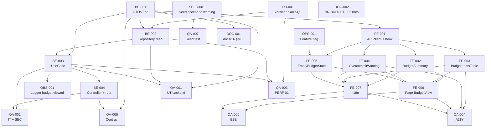

# Development Tasks — PB-P1-020 / US-035: Ver mi presupuesto

## 1. Metadata

| Field                                | Value                                                                                                          |
| ------------------------------------ | -------------------------------------------------------------------------------------------------------------- |
| User Story ID                        | US-035                                                                                                         |
| Source User Story                    | `management/user-stories/US-035-view-edit-budget.md`                                                          |
| Source Technical Specification       | `management/technical-specs/P1/PB-P1-020/US-035-technical-spec.md`                                             |
| Decision Resolution Artifact         | `management/user-stories/decision-resolutions/US-035-decision-resolution.md`                                   |
| Priority                             | P1                                                                                                             |
| Backlog ID                           | PB-P1-020                                                                                                      |
| Backlog Title                        | Gestión de presupuesto + BudgetItems                                                                          |
| Backlog Execution Order              | 38 (P0: 18 items + P1: 20 items)                                                                               |
| User Story Position in Backlog Item  | 1 de 2 (US-035 → US-036)                                                                                       |
| Related User Stories in Backlog Item | US-035 (vista), US-036 (CRUD de BudgetItem)                                                                     |
| Epic                                 | EPIC-BUD-001 — Budget Management & Currency                                                                    |
| Backlog Item Dependencies            | PB-P0-001 (schema base), PB-P1-006 (creación de evento con `currency_code`)                                     |
| Feature                              | Vista del presupuesto del evento                                                                                |
| Module / Domain                      | Budget                                                                                                         |
| Backlog Alignment Status             | Found                                                                                                          |
| Task Breakdown Status                | Ready for Sprint Planning                                                                                      |
| Created Date                         | 2026-06-27                                                                                                     |
| Last Updated                         | 2026-06-27                                                                                                     |

---

## 2. Source Validation

| Source                          | Found | Used | Notes                                                                                              |
| ------------------------------- | ----- | ---- | -------------------------------------------------------------------------------------------------- |
| User Story                       | Yes   | Yes  | Approved with Minor Notes (2026-06-27).                                                            |
| Technical Specification          | Yes   | Yes  | `Ready for Task Breakdown`; primary source.                                                         |
| Decision Resolution Artifact     | Yes   | Yes  | D1–D4 formalizadas.                                                                                |
| Product Backlog Prioritized      | Yes   | Yes  | `PB-P1-020`, posición 1 de 2.                                                                      |
| ADRs                             | No    | N/A  | US-035 no introduce ADR nuevo.                                                                     |

---

## 3. Backlog Execution Context

### Parent Backlog Item

`PB-P1-020 — Gestión de presupuesto + BudgetItems` agrupa la vista del presupuesto (US-035) y el CRUD de `BudgetItem` (US-036). Depende de `PB-P0-001` (schema base) y `PB-P1-006` (creación del evento con `currency_code`). Items iniciales pueden venir de `PB-P1-013` con HITL en `PB-P1-016`.

### Execution Order Rationale

US-035 va primero porque entrega la surface de lectura sobre la que US-036 itera; ambas comparten la query key TanStack canónica `['event', eventId, 'budget']`. PB-P1-020 ocupa la posición 38 en el Product Backlog Prioritized.

### Related User Stories in Same Backlog Item

| User Story                                  | Role in Backlog Item                                                                       | Suggested Order |
| ------------------------------------------- | ------------------------------------------------------------------------------------------ | --------------- |
| US-035 — Vista del presupuesto                | `GET /api/v1/events/:eventId/budget` con `summary` server-side                              | 1               |
| US-036 — CRUD de BudgetItem                  | `POST/PATCH/DELETE /api/v1/events/:eventId/budget/items`; invalida cache de US-035          | 2               |

---

## 4. Task Breakdown Summary

| Area  | Number of Tasks | Notes                                                                                                                      |
| ----- | --------------: | -------------------------------------------------------------------------------------------------------------------------- |
| DB    | 1               | Verificación de plan SQL (sin migraciones).                                                                                 |
| BE    | 4               | DTOs Zod, repository read, use case, controller + ruta.                                                                     |
| API   | 0               | Cubierto por BE-004 + DOC-01.                                                                                               |
| SEC   | 0               | Reuso íntegro de policies/guards; pruebas SEC en QA.                                                                        |
| OBS   | 1               | Logger `budget.viewed`.                                                                                                     |
| FE    | 7               | API client + hook; componentes (BudgetSummary, BudgetItemsTable, OvercommitWarning, EmptyBudgetState); page; i18n.            |
| SEED  | 1               | Verificación de seed para escenario `over_committed = true`.                                                                |
| QA    | 7               | UT, IT, PERF, A11Y, CONTRACT, E2E, SEC-T.                                                                                   |
| AI    | 0               | No aplica.                                                                                                                  |
| OPS   | 1               | Verificación del feature flag `ai.budget-suggestion.enabled`.                                                                |
| DOC   | 2               | `docs/16 §M06` (shape extendido), `BR-BUDGET-002` (nota interpretativa).                                                    |

**Total: 24 tareas.**

---

## 5. Traceability Matrix

| Acceptance Criterion                                       | Technical Spec Section(s)                                              | Task IDs                                                                                                                            |
| ---------------------------------------------------------- | ---------------------------------------------------------------------- | ----------------------------------------------------------------------------------------------------------------------------------- |
| AC-01 Vista canónica                                        | §6, §7, §10                                                            | DB-001, BE-001, BE-002, BE-003, BE-004, QA-001, QA-002                                                                              |
| AC-03 Warning visible                                       | §6, §7, §8 (OvercommitWarning)                                          | BE-003, FE-004, QA-001, QA-004                                                                                                      |
| AC-04 Shape canónico                                        | §7, §9, §16                                                            | BE-001, BE-004, QA-005, DOC-001                                                                                                      |
| AC-05 i18n + currency CLDR                                  | §8 (i18n)                                                              | FE-002, FE-007, QA-004                                                                                                              |
| AC-06 Independencia event.status                            | §6, §12                                                                | BE-003, QA-002                                                                                                                      |
| AC-07 Performance                                            | §7 (Repository), §10, §13 (PERF-01)                                    | DB-001, BE-002, QA-003                                                                                                              |
| AC-08 A11Y                                                  | §8 (Accessibility), §13 (A11Y-01..04)                                  | FE-002, FE-003, FE-004, QA-004                                                                                                      |
| EC-01..06                                                   | §6 (interpretación funcional)                                           | BE-003, FE-005, QA-002                                                                                                              |
| VR-01..05                                                   | §7 (validation), §8 (FE)                                                | BE-001, BE-004, QA-002                                                                                                              |
| SEC-01..05                                                  | §12 (Security & Authorization)                                          | BE-004, OBS-001, QA-002                                                                                                              |
| Observability                                               | §14 (Logs)                                                              | OBS-001                                                                                                                              |
| Documentation Alignment                                     | §16                                                                    | DOC-001, DOC-002                                                                                                                     |

---

## 6. Development Tasks

### TASK-PB-P1-020-US-035-DB-001 — Verificar plan SQL del `summary` agregado contra los índices canónicos

| Field                     | Value                                                                          |
| ------------------------- | ------------------------------------------------------------------------------ |
| Area                      | Database / Prisma                                                              |
| Type                      | Setup                                                                          |
| Priority                  | Must                                                                           |
| Estimate                  | S                                                                              |
| Depends On                | —                                                                              |
| Source AC(s)              | AC-07                                                                          |
| Technical Spec Section(s) | §10, §17, §18 (orden recomendado paso 1)                                       |
| Backlog ID                | PB-P1-020                                                                      |
| User Story ID             | US-035                                                                         |
| Owner Role                | Backend                                                                        |
| Status                    | To Do                                                                          |

#### Objective

Validar que el cálculo de `summary` (3 SUM + listado de items) en una sola transacción de lectura aprovecha los índices `budget.event_id` (unique) y `budget_items.budget_id` entregados por PB-P0-001.

#### Scope

##### Include

* `EXPLAIN ANALYZE` de la query de listado de items + agregados sobre el seed con 30 items.
* Confirmar uso de índices (no Seq Scan).
* Documentar plan, tiempo y memoria en el PR.

##### Exclude

* No crear índices nuevos.
* No materializar `total_planned`/`total_committed` (decisión de implementación pertenece a BE-002).

#### Acceptance Criteria Covered

AC-07 (preparación de PERF-01).

#### Definition of Done

- [ ] `EXPLAIN ANALYZE` ejecutado contra el seed.
- [ ] Evidencia adjunta al PR.
- [ ] Latencia estimada < 100 ms en local con seed.

---

### TASK-PB-P1-020-US-035-BE-001 — Crear DTOs Zod `BudgetSummaryDto`, `BudgetItemDto`, `GetBudgetResponseDto`

| Field                     | Value                                                                          |
| ------------------------- | ------------------------------------------------------------------------------ |
| Area                      | Backend                                                                        |
| Type                      | Implementation                                                                 |
| Priority                  | Must                                                                           |
| Estimate                  | XS                                                                             |
| Depends On                | —                                                                              |
| Source AC(s)              | AC-04, VR-01..04                                                                |
| Technical Spec Section(s) | §7 (DTOs / Schemas)                                                             |
| Backlog ID                | PB-P1-020                                                                      |
| User Story ID             | US-035                                                                         |
| Owner Role                | Backend                                                                        |
| Status                    | To Do                                                                          |

#### Objective

Definir el contrato canónico del response del endpoint con validación Zod.

#### Scope

##### Include

* `apps/api/src/modules/budget/dto/budget-summary.dto.ts` (con `over_committed: boolean`, `currency_code` como enum).
* `apps/api/src/modules/budget/dto/budget-item.dto.ts` (con `paid: number ≥ 0` siempre presente).
* `apps/api/src/modules/budget/dto/get-budget-response.dto.ts`.

##### Exclude

* No exponer ratios ni decimales con más precisión que la del dominio.

#### Implementation Notes

* `currency_code` enum: `['GTQ', 'EUR', 'MXN', 'COP', 'USD']` (BR-BUDGET-006).
* Mantener tipos compartidos con frontend en `packages/shared-types` si existe.

#### Acceptance Criteria Covered

AC-04, VR-01..04.

#### Definition of Done

- [ ] 3 DTOs Zod definidos y exportados.
- [ ] Tipos accesibles desde frontend.

---

### TASK-PB-P1-020-US-035-BE-002 — Implementar `BudgetReadRepository.getByEventId` con transacción de lectura

| Field                     | Value                                                                          |
| ------------------------- | ------------------------------------------------------------------------------ |
| Area                      | Backend                                                                        |
| Type                      | Implementation                                                                 |
| Priority                  | Must                                                                           |
| Estimate                  | M                                                                              |
| Depends On                | DB-001, BE-001                                                                  |
| Source AC(s)              | AC-01, AC-03, AC-04, AC-07                                                      |
| Technical Spec Section(s) | §7 (Repository), §10                                                           |
| Backlog ID                | PB-P1-020                                                                      |
| User Story ID             | US-035                                                                         |
| Owner Role                | Backend                                                                        |
| Status                    | To Do                                                                          |

#### Objective

Implementar lectura del presupuesto con cálculo de agregados (`SUM`) en una sola transacción/query SQL.

#### Scope

##### Include

* Método `getByEventId(eventId): Promise<{ budget, items, sums }>`.
* Implementación con `prisma.$transaction([...])` o `prisma.$queryRaw` para una sola ida.
* `JOIN` con `service_categories` para resolver `category_name`.
* `SUM(COALESCE(paid, 0))` para `paid_total`.

##### Exclude

* No materializar totales en BD (decisión: cálculo en vivo en esta US).
* No introducir cache.

#### Implementation Notes

* Si el método retorna `budget = null`, el use case devuelve 404 (degradación esperada solo si el wizard no creó el `Budget`).

#### Acceptance Criteria Covered

AC-01, AC-03, AC-04, AC-07.

#### Definition of Done

- [ ] Método implementado y testeado (UT/IT en QA-001/QA-002).
- [ ] Plan SQL confirmado por DB-001.
- [ ] Sin migraciones.

---

### TASK-PB-P1-020-US-035-BE-003 — Implementar `GetBudgetUseCase` con cálculo de `over_committed` y normalización `paid`

| Field                     | Value                                                                          |
| ------------------------- | ------------------------------------------------------------------------------ |
| Area                      | Backend                                                                        |
| Type                      | Implementation                                                                 |
| Priority                  | Must                                                                           |
| Estimate                  | S                                                                              |
| Depends On                | BE-001, BE-002                                                                  |
| Source AC(s)              | AC-01, AC-03, AC-04, AC-06, EC-01..06                                            |
| Technical Spec Section(s) | §7 (Use Cases), §6, §12                                                          |
| Backlog ID                | PB-P1-020                                                                      |
| User Story ID             | US-035                                                                         |
| Owner Role                | Backend                                                                        |
| Status                    | To Do                                                                          |

#### Objective

Componer el response final: ownership check, ensamble del `summary` (incluido `over_committed`), normalización `paid null → 0`, emisión de log estructurado.

#### Scope

##### Include

* Composición `{ summary, items[] }` consistente con `GetBudgetResponseDto`.
* `over_committed = total_committed > total_planned`.
* Normalización `paid ?? 0` en cada item.
* Invocación de `EventOwnershipPolicy.assertOwner` antes del repo.
* Emisión del log `budget.viewed` (OBS-001 define el catálogo).
* Independencia de `event.status` (no se ramifica).

##### Exclude

* No invocar LLMProvider.
* No tocar mutaciones.

#### Acceptance Criteria Covered

AC-01, AC-03, AC-04, AC-06, EC-01..06.

#### Definition of Done

- [ ] Use case implementado.
- [ ] Tests UT (QA-001) e IT (QA-002) verdes.
- [ ] Log estructurado emitido.

---

### TASK-PB-P1-020-US-035-BE-004 — Registrar controller `GetBudgetController` y ruta `GET /api/v1/events/:eventId/budget`

| Field                     | Value                                                                          |
| ------------------------- | ------------------------------------------------------------------------------ |
| Area                      | Backend                                                                        |
| Type                      | Implementation                                                                 |
| Priority                  | Must                                                                           |
| Estimate                  | S                                                                              |
| Depends On                | BE-003                                                                          |
| Source AC(s)              | AC-04, VR-02, VR-03, SEC-01..05                                                  |
| Technical Spec Section(s) | §7 (Controllers / Routes), §9, §12                                              |
| Backlog ID                | PB-P1-020                                                                      |
| User Story ID             | US-035                                                                         |
| Owner Role                | Backend                                                                        |
| Status                    | To Do                                                                          |

#### Objective

Exponer la ruta canónica con validación Zod del path param y la cadena de guards.

#### Scope

##### Include

* Controller delgado que delega al use case.
* Validación Zod `eventId: z.string().uuid()` (400).
* Middlewares: `authRequired`, `OrganizerRoleGuard`, `adminExclusionGuard`.
* Registro en el router central.

##### Exclude

* No introducir nuevos verbos HTTP.
* No exponer query params adicionales.

#### Acceptance Criteria Covered

AC-04, VR-02, VR-03, SEC-01..05.

#### Definition of Done

- [ ] Ruta operativa (`200` con dueño; `400/401/403/404` en negative cases).
- [ ] Pruebas SEC-T (QA-002) verdes.

---

### TASK-PB-P1-020-US-035-OBS-001 — Definir y emitir log estructurado `budget.viewed`

| Field                     | Value                                                                          |
| ------------------------- | ------------------------------------------------------------------------------ |
| Area                      | Observability / Audit                                                          |
| Type                      | Implementation                                                                 |
| Priority                  | Must                                                                           |
| Estimate                  | XS                                                                             |
| Depends On                | BE-003                                                                          |
| Source AC(s)              | AC-01, SEC-05                                                                   |
| Technical Spec Section(s) | §14 (Logs), §7 (Observability)                                                  |
| Backlog ID                | PB-P1-020                                                                      |
| User Story ID             | US-035                                                                         |
| Owner Role                | Backend                                                                        |
| Status                    | To Do                                                                          |

#### Objective

Añadir el evento de log al catálogo de eventos del módulo `budget` y emitirlo desde `GetBudgetUseCase`.

#### Scope

##### Include

* Archivo `apps/api/src/shared/logging/budget-events.ts` con schema del evento `budget.viewed`.
* Campos: `eventId`, `userId`, `currency_code`, `total_planned`, `total_committed`, `paid_total`, `over_committed`, `items_count`, `correlationId`, `duration_ms`.

##### Exclude

* No registrar PII.
* No crear nuevos histogramas (reuso del `http_request_duration_seconds`).

#### Acceptance Criteria Covered

AC-01 (auditoría), SEC-05.

#### Definition of Done

- [ ] Schema definido y validado.
- [ ] Snapshot test del log verde.
- [ ] Sin PII.

---

### TASK-PB-P1-020-US-035-FE-001 — Implementar `budgetApi.get(eventId)` y hook `useEventBudget`

| Field                     | Value                                                                          |
| ------------------------- | ------------------------------------------------------------------------------ |
| Area                      | Frontend                                                                       |
| Type                      | Implementation                                                                 |
| Priority                  | Must                                                                           |
| Estimate                  | S                                                                              |
| Depends On                | BE-001                                                                          |
| Source AC(s)              | AC-01, AC-04                                                                    |
| Technical Spec Section(s) | §8 (Data Fetching, State Management)                                            |
| Backlog ID                | PB-P1-020                                                                      |
| User Story ID             | US-035                                                                         |
| Owner Role                | Frontend                                                                       |
| Status                    | To Do                                                                          |

#### Objective

Crear el cliente HTTP y el hook TanStack con la query key canónica.

#### Scope

##### Include

* `apps/web/lib/api/budgetApi.ts` con `get(eventId): Promise<GetBudgetResponseDto>`.
* `apps/web/hooks/useEventBudget.ts` con key `['event', eventId, 'budget']`, `staleTime` corto, refetch on focus.
* Documentar la key canónica en `apps/web/lib/queryKeys.ts`.

##### Exclude

* No crear invalidadores en US-035 (los introduce US-036).

#### Acceptance Criteria Covered

AC-01, AC-04.

#### Definition of Done

- [ ] Hook y cliente operativos.
- [ ] Tipos compartidos con backend.

---

### TASK-PB-P1-020-US-035-FE-002 — Implementar componente `BudgetSummary`

| Field                     | Value                                                                          |
| ------------------------- | ------------------------------------------------------------------------------ |
| Area                      | Frontend                                                                       |
| Type                      | Implementation                                                                 |
| Priority                  | Must                                                                           |
| Estimate                  | S                                                                              |
| Depends On                | FE-001                                                                          |
| Source AC(s)              | AC-01, AC-05, AC-08                                                              |
| Technical Spec Section(s) | §8 (Components, Accessibility, i18n)                                            |
| Backlog ID                | PB-P1-020                                                                      |
| User Story ID             | US-035                                                                         |
| Owner Role                | Frontend                                                                       |
| Status                    | To Do                                                                          |

#### Objective

Componente que muestra `total_planned`, `total_committed`, `paid_total` y `currency_code` con formato CLDR.

#### Scope

##### Include

* Props tipados con `BudgetSummaryDto`.
* `Intl.NumberFormat(locale, { style: 'currency', currency })` para cada monto.
* Atributos A11Y básicos (`<dl>`/`<dt>`/`<dd>` o `<table>` con `<caption>`).

##### Exclude

* No incluir lógica del warning (vive en `OvercommitWarning`).

#### Acceptance Criteria Covered

AC-01, AC-05, AC-08.

#### Definition of Done

- [ ] Componente renderiza valores correctos en 4 locales.
- [ ] Tests RTL verdes.

---

### TASK-PB-P1-020-US-035-FE-003 — Implementar componente `BudgetItemsTable`

| Field                     | Value                                                                          |
| ------------------------- | ------------------------------------------------------------------------------ |
| Area                      | Frontend                                                                       |
| Type                      | Implementation                                                                 |
| Priority                  | Must                                                                           |
| Estimate                  | M                                                                              |
| Depends On                | FE-001                                                                          |
| Source AC(s)              | AC-01, AC-05, AC-08                                                              |
| Technical Spec Section(s) | §8 (Components, Accessibility), §13 (A11Y-01)                                    |
| Backlog ID                | PB-P1-020                                                                      |
| User Story ID             | US-035                                                                         |
| Owner Role                | Frontend                                                                       |
| Status                    | To Do                                                                          |

#### Objective

Tabla accesible con columnas Categoría, Planned, Committed, Paid y Δ (`planned - committed`).

#### Scope

##### Include

* `<table role="table">` con `<caption>` localizado, `<th scope="col">`.
* Tooltip opcional sobre `ai_generated`.
* Deeplinks por fila para `Editar` y `Eliminar` (apuntan a US-036, sin invocar mutación desde US-035).
* Formato CLDR de moneda.

##### Exclude

* No implementar drag&drop ni edición inline.

#### Acceptance Criteria Covered

AC-01, AC-05, AC-08.

#### Definition of Done

- [ ] Componente renderiza correctamente con dataset de prueba.
- [ ] Tests A11Y (QA-004) verdes.

---

### TASK-PB-P1-020-US-035-FE-004 — Implementar componente `OvercommitWarning`

| Field                     | Value                                                                          |
| ------------------------- | ------------------------------------------------------------------------------ |
| Area                      | Frontend                                                                       |
| Type                      | Implementation                                                                 |
| Priority                  | Must                                                                           |
| Estimate                  | XS                                                                             |
| Depends On                | FE-001                                                                          |
| Source AC(s)              | AC-03, AC-08                                                                    |
| Technical Spec Section(s) | §8 (Components, Accessibility)                                                   |
| Backlog ID                | PB-P1-020                                                                      |
| User Story ID             | US-035                                                                         |
| Owner Role                | Frontend                                                                       |
| Status                    | To Do                                                                          |

#### Objective

Banner accesible que aparece solo cuando `summary.over_committed = true`.

#### Scope

##### Include

* `role="alert"` o `aria-live="polite"`.
* Copy localizado `budget.overcommit_warning`.
* Contraste AA verificado.

##### Exclude

* No bloquear interacción.
* No recalcular la condición en frontend.

#### Acceptance Criteria Covered

AC-03, AC-08.

#### Definition of Done

- [ ] Renderiza solo si `over_committed = true`.
- [ ] Tests A11Y y RTL verdes.

---

### TASK-PB-P1-020-US-035-FE-005 — Implementar componente `EmptyBudgetState` con deeplinks

| Field                     | Value                                                                          |
| ------------------------- | ------------------------------------------------------------------------------ |
| Area                      | Frontend                                                                       |
| Type                      | Implementation                                                                 |
| Priority                  | Must                                                                           |
| Estimate                  | S                                                                              |
| Depends On                | FE-001, OPS-001                                                                 |
| Source AC(s)              | EC-01                                                                          |
| Technical Spec Section(s) | §8 (Components)                                                                  |
| Backlog ID                | PB-P1-020                                                                      |
| User Story ID             | US-035                                                                         |
| Owner Role                | Frontend                                                                       |
| Status                    | To Do                                                                          |

#### Objective

Estado vacío con CTAs: "Crear primera categoría" (deeplink US-036) y, condicional al feature flag, "Sugerir IA" (deeplink US-037).

#### Scope

##### Include

* `<Link>` Next.js con rutas verificadas.
* Render condicional del CTA IA según feature flag `ai.budget-suggestion.enabled`.

##### Exclude

* No invocar mutación de US-036 ni LLMProvider.

#### Acceptance Criteria Covered

EC-01.

#### Definition of Done

- [ ] Empty state operativo con/sin flag.
- [ ] Tests E2E (QA-006) verdes para ambos casos.

---

### TASK-PB-P1-020-US-035-FE-006 — Implementar página `/[locale]/organizer/events/[eventId]/budget` con `BudgetView`

| Field                     | Value                                                                          |
| ------------------------- | ------------------------------------------------------------------------------ |
| Area                      | Frontend                                                                       |
| Type                      | Implementation                                                                 |
| Priority                  | Must                                                                           |
| Estimate                  | M                                                                              |
| Depends On                | FE-002, FE-003, FE-004, FE-005                                                  |
| Source AC(s)              | AC-01, AC-06, EC-04, EC-05                                                       |
| Technical Spec Section(s) | §8 (Routes / Pages)                                                              |
| Backlog ID                | PB-P1-020                                                                      |
| User Story ID             | US-035                                                                         |
| Owner Role                | Frontend                                                                       |
| Status                    | To Do                                                                          |

#### Objective

Página orquestadora con manejo de estados (loading/empty/error/success), banners read-only para `cancelled`/`completed` y composición de componentes.

#### Scope

##### Include

* Manejo de error con banner reusable.
* Skeleton con `aria-busy="true"`.
* Banners read-only heredados de US-014/US-015.

##### Exclude

* No implementar mutaciones.

#### Acceptance Criteria Covered

AC-01, AC-06, EC-04, EC-05.

#### Definition of Done

- [ ] Página renderiza la vista completa con sus estados.
- [ ] Tests RTL + E2E verdes.

---

### TASK-PB-P1-020-US-035-FE-007 — Añadir claves i18n `budget.*` en `es-LATAM`, `es-ES`, `pt`, `en`

| Field                     | Value                                                                          |
| ------------------------- | ------------------------------------------------------------------------------ |
| Area                      | Frontend                                                                       |
| Type                      | Implementation                                                                 |
| Priority                  | Must                                                                           |
| Estimate                  | S                                                                              |
| Depends On                | FE-002, FE-003, FE-004, FE-005                                                  |
| Source AC(s)              | AC-05                                                                          |
| Technical Spec Section(s) | §8 (i18n)                                                                       |
| Backlog ID                | PB-P1-020                                                                      |
| User Story ID             | US-035                                                                         |
| Owner Role                | Frontend                                                                       |
| Status                    | To Do                                                                          |

#### Objective

Catálogo completo de strings localizadas.

#### Scope

##### Include

* `budget.label`, `budget.column.{category,planned,committed,paid}`, `budget.overcommit_warning`, `budget.empty_title`, `budget.empty_cta_create`, `budget.empty_cta_ai`, `budget.event_cancelled_banner`, `budget.event_completed_banner`.

##### Exclude

* No introducir nuevos locales fuera del MVP.

#### Acceptance Criteria Covered

AC-05.

#### Definition of Done

- [ ] Cuatro archivos `messages/<locale>.json` actualizados.
- [ ] Tests RTL con cada locale verdes.

---

### TASK-PB-P1-020-US-035-OPS-001 — Verificar disponibilidad del feature flag `ai.budget-suggestion.enabled`

| Field                     | Value                                                                          |
| ------------------------- | ------------------------------------------------------------------------------ |
| Area                      | DevOps / Environment                                                           |
| Type                      | Setup                                                                          |
| Priority                  | Should                                                                         |
| Estimate                  | XS                                                                             |
| Depends On                | —                                                                              |
| Source AC(s)              | EC-01                                                                          |
| Technical Spec Section(s) | §5 (Frontend Architecture), §11 (AI), §17                                       |
| Backlog ID                | PB-P1-020                                                                      |
| User Story ID             | US-035                                                                         |
| Owner Role                | DevOps                                                                         |
| Status                    | To Do                                                                          |

#### Objective

Confirmar que el sistema de feature flags expone `ai.budget-suggestion.enabled`. Si no existe, crearlo o usar variable de entorno equivalente.

#### Scope

##### Include

* Revisión de la herramienta de feature flags (config repo o servicio).
* Si falta, abrir follow-up DevOps (no bloqueante para US-035).

##### Exclude

* No diseñar un nuevo sistema de feature flags.

#### Acceptance Criteria Covered

EC-01.

#### Definition of Done

- [ ] Feature flag accesible desde Next.js.

---

### TASK-PB-P1-020-US-035-SEED-001 — Verificar/garantizar seed con escenario `over_committed = true`

| Field                     | Value                                                                          |
| ------------------------- | ------------------------------------------------------------------------------ |
| Area                      | Seed / Demo Data                                                               |
| Type                      | Setup                                                                          |
| Priority                  | Should                                                                         |
| Estimate                  | S                                                                              |
| Depends On                | —                                                                              |
| Source AC(s)              | AC-03                                                                          |
| Technical Spec Section(s) | §15 (Seed / Demo Data Impact)                                                   |
| Backlog ID                | PB-P1-020                                                                      |
| User Story ID             | US-035                                                                         |
| Owner Role                | Backend                                                                        |
| Status                    | To Do                                                                          |

#### Objective

Verificar que el seed contiene al menos un evento con `total_committed > total_planned` para demoar el warning. Si falta, ajustar (idealmente como parte del seed de US-036/US-038).

#### Scope

##### Include

* Auditoría del seed actual.
* Ajuste si falta el escenario.

##### Exclude

* No mover el seed a un módulo separado.

#### Acceptance Criteria Covered

AC-03 (demo).

#### Definition of Done

- [ ] Seed verificado y, si aplica, ajustado.

---

### TASK-PB-P1-020-US-035-QA-001 — Tests unitarios backend (cálculo, normalización, DTOs)

| Field                     | Value                                                                          |
| ------------------------- | ------------------------------------------------------------------------------ |
| Area                      | QA / Testing                                                                   |
| Type                      | Test                                                                           |
| Priority                  | Must                                                                           |
| Estimate                  | S                                                                              |
| Depends On                | BE-001, BE-002, BE-003                                                          |
| Source AC(s)              | AC-01, AC-03, AC-04                                                              |
| Technical Spec Section(s) | §13 (Unit Tests UT-01..05)                                                      |
| Backlog ID                | PB-P1-020                                                                      |
| User Story ID             | US-035                                                                         |
| Owner Role                | QA                                                                             |
| Status                    | To Do                                                                          |

#### Objective

Cobertura unitaria del use case y los DTOs.

#### Scope

##### Include

* UT-01 `over_committed` boundary (igual no es exceso).
* UT-02 normalización `paid null → 0`.
* UT-03 `paid_total` con mix de null/no null.
* UT-04 DTO rechaza valores negativos.
* UT-05 DTO rechaza `currency_code` fuera del enum.

#### Acceptance Criteria Covered

AC-01, AC-03, AC-04.

#### Definition of Done

- [ ] 5 tests verdes.

---

### TASK-PB-P1-020-US-035-QA-002 — Tests integration backend (autorización, estados del evento, empty/warning)

| Field                     | Value                                                                          |
| ------------------------- | ------------------------------------------------------------------------------ |
| Area                      | QA / Testing                                                                   |
| Type                      | Test                                                                           |
| Priority                  | Must                                                                           |
| Estimate                  | M                                                                              |
| Depends On                | BE-003, BE-004                                                                  |
| Source AC(s)              | AC-01, AC-03, AC-06, EC-01..06, VR-01..03, SEC-01..05                              |
| Technical Spec Section(s) | §13 (Integration Tests IT-01..07, Security Tests SEC-T-01..05)                  |
| Backlog ID                | PB-P1-020                                                                      |
| User Story ID             | US-035                                                                         |
| Owner Role                | QA                                                                             |
| Status                    | To Do                                                                          |

#### Objective

Cobertura integration con Supertest sobre el endpoint.

#### Scope

##### Include

* IT-01 vista completa.
* IT-02 empty state.
* IT-03 warning cuando `committed > total`.
* IT-04 todos `paid IS NULL` ⇒ `paid_total = 0`.
* IT-05 evento `cancelled` ⇒ 200.
* IT-06 evento `completed` ⇒ 200.
* IT-07 independencia del estado en autorización.
* SEC-T-01..05.

#### Acceptance Criteria Covered

AC-01, AC-03, AC-06, EC-01..06, VR-01..03, SEC-01..05.

#### Definition of Done

- [ ] 7 IT + 5 SEC-T verdes en CI.

---

### TASK-PB-P1-020-US-035-QA-003 — Test de performance PERF-01 (P95 < 1.5 s con 30 items)

| Field                     | Value                                                                          |
| ------------------------- | ------------------------------------------------------------------------------ |
| Area                      | QA / Testing                                                                   |
| Type                      | Test                                                                           |
| Priority                  | Must                                                                           |
| Estimate                  | S                                                                              |
| Depends On                | DB-001, BE-002, BE-003                                                          |
| Source AC(s)              | AC-07                                                                          |
| Technical Spec Section(s) | §13 (Performance Tests PERF-01), §10                                            |
| Backlog ID                | PB-P1-020                                                                      |
| User Story ID             | US-035                                                                         |
| Owner Role                | QA                                                                             |
| Status                    | To Do                                                                          |

#### Objective

Medir el P95 contra dataset de 30 items mixtos y validar `NFR-PERF-001`.

#### Scope

##### Include

* Suite de performance dedicada.
* Reporte adjunto al PR.

#### Acceptance Criteria Covered

AC-07.

#### Definition of Done

- [ ] P95 < 1.5 s en CI.

---

### TASK-PB-P1-020-US-035-QA-004 — Tests A11Y de componentes (tabla, warning, skeleton, locales)

| Field                     | Value                                                                          |
| ------------------------- | ------------------------------------------------------------------------------ |
| Area                      | QA / Testing                                                                   |
| Type                      | Test                                                                           |
| Priority                  | Must                                                                           |
| Estimate                  | S                                                                              |
| Depends On                | FE-003, FE-004, FE-006, FE-007                                                  |
| Source AC(s)              | AC-05, AC-08                                                                    |
| Technical Spec Section(s) | §13 (Accessibility Tests A11Y-01..04)                                           |
| Backlog ID                | PB-P1-020                                                                      |
| User Story ID             | US-035                                                                         |
| Owner Role                | QA                                                                             |
| Status                    | To Do                                                                          |

#### Objective

Validar A11Y de tabla, warning, skeleton y currency CLDR en 4 locales.

#### Scope

##### Include

* `jest-axe` sin violaciones.
* Render con `next-intl` provider en cada locale.

#### Acceptance Criteria Covered

AC-05, AC-08.

#### Definition of Done

- [ ] Tests verdes en CI sin violaciones.

---

### TASK-PB-P1-020-US-035-QA-005 — Contract test CONTRACT-01 contra OpenAPI snapshot

| Field                     | Value                                                                          |
| ------------------------- | ------------------------------------------------------------------------------ |
| Area                      | QA / Testing                                                                   |
| Type                      | Test                                                                           |
| Priority                  | Should                                                                         |
| Estimate                  | S                                                                              |
| Depends On                | BE-001, BE-004                                                                  |
| Source AC(s)              | AC-04                                                                          |
| Technical Spec Section(s) | §13 (Contract Tests CONTRACT-01), §16                                          |
| Backlog ID                | PB-P1-020                                                                      |
| User Story ID             | US-035                                                                         |
| Owner Role                | QA                                                                             |
| Status                    | To Do                                                                          |

#### Objective

Validar el shape `{ summary, items[] }` contra el snapshot OpenAPI (handoff US-098).

#### Scope

##### Include

* Snapshot test del response real vs contrato.
* Si snapshot OpenAPI ausente, snapshot interno en `apps/api/tests/contracts/`.

#### Acceptance Criteria Covered

AC-04.

#### Definition of Done

- [ ] Contract test verde.

---

### TASK-PB-P1-020-US-035-QA-006 — E2E Playwright (vista, empty state, deeplinks, banners read-only)

| Field                     | Value                                                                          |
| ------------------------- | ------------------------------------------------------------------------------ |
| Area                      | QA / Testing                                                                   |
| Type                      | Test                                                                           |
| Priority                  | Must                                                                           |
| Estimate                  | M                                                                              |
| Depends On                | FE-006, FE-007                                                                  |
| Source AC(s)              | AC-01, AC-03, AC-05, AC-08, EC-01, EC-04, EC-05                                  |
| Technical Spec Section(s) | §13 (E2E Tests E2E-01..04)                                                      |
| Backlog ID                | PB-P1-020                                                                      |
| User Story ID             | US-035                                                                         |
| Owner Role                | QA                                                                             |
| Status                    | To Do                                                                          |

#### Objective

Cobertura E2E con seed: vista completa, empty state con CTAs, banner read-only en `cancelled`/`completed`, invalidación tras mutación (cuando US-036 esté disponible; ambiente puede mockear con MSW si no).

#### Scope

##### Include

* E2E-01 vista completa con warning.
* E2E-02 Empty state CTA US-036.
* E2E-03 Empty state CTA US-037 con feature flag.
* E2E-04 invalidación tras mutación (puede stub-earse con MSW).

#### Acceptance Criteria Covered

AC-01, AC-03, AC-05, AC-08, EC-01, EC-04, EC-05.

#### Definition of Done

- [ ] 4 E2E verdes en CI.

---

### TASK-PB-P1-020-US-035-QA-007 — Test de seed/demo (cobertura de escenarios)

| Field                     | Value                                                                          |
| ------------------------- | ------------------------------------------------------------------------------ |
| Area                      | QA / Testing                                                                   |
| Type                      | Test                                                                           |
| Priority                  | Should                                                                         |
| Estimate                  | XS                                                                             |
| Depends On                | SEED-001                                                                          |
| Source AC(s)              | AC-03                                                                          |
| Technical Spec Section(s) | §15 (Seed / Demo Data Impact)                                                   |
| Backlog ID                | PB-P1-020                                                                      |
| User Story ID             | US-035                                                                         |
| Owner Role                | QA                                                                             |
| Status                    | To Do                                                                          |

#### Objective

Validar que el seed cubre los escenarios canónicos (`empty`, `dentro`, `exceso`).

#### Scope

##### Include

* Vitest con asserts sobre el seed cargado.

#### Acceptance Criteria Covered

AC-03 (demo).

#### Definition of Done

- [ ] Test verde.

---

### TASK-PB-P1-020-US-035-DOC-001 — Actualizar `docs/16 §M06 Budget` con shape extendido del response

| Field                     | Value                                                                          |
| ------------------------- | ------------------------------------------------------------------------------ |
| Area                      | Documentation / Traceability                                                   |
| Type                      | Documentation                                                                  |
| Priority                  | Should                                                                         |
| Estimate                  | XS                                                                             |
| Depends On                | BE-001                                                                          |
| Source AC(s)              | AC-04                                                                          |
| Technical Spec Section(s) | §16 (Documentation Alignment Required)                                          |
| Backlog ID                | PB-P1-020                                                                      |
| User Story ID             | US-035                                                                         |
| Owner Role                | Tech Lead                                                                      |
| Status                    | To Do                                                                          |

#### Objective

Reflejar el shape `{ summary, items[] }` en M06 y dejar handoff a US-098 para el snapshot OpenAPI.

#### Scope

##### Include

* Edición de `docs/16-API-Design-Specification.md §M06`.

##### Exclude

* No generar OpenAPI snapshot (Future, US-098).

#### Acceptance Criteria Covered

AC-04 (alineación documental).

#### Definition of Done

- [ ] `docs/16 §M06` actualizado.

---

### TASK-PB-P1-020-US-035-DOC-002 — Añadir nota interpretativa a `docs/4 §BR-BUDGET-002` referenciando D3

| Field                     | Value                                                                          |
| ------------------------- | ------------------------------------------------------------------------------ |
| Area                      | Documentation / Traceability                                                   |
| Type                      | Documentation                                                                  |
| Priority                  | Should                                                                         |
| Estimate                  | XS                                                                             |
| Depends On                | —                                                                              |
| Source AC(s)              | AC-04                                                                          |
| Technical Spec Section(s) | §16 (Documentation Alignment Required)                                          |
| Backlog ID                | PB-P1-020                                                                      |
| User Story ID             | US-035                                                                         |
| Owner Role                | Tech Lead                                                                      |
| Status                    | To Do                                                                          |

#### Objective

Documentar que `paid` se normaliza a `0` en serialización (D3); BD permanece nullable.

#### Scope

##### Include

* Edición de `docs/4-Business-Rules-Document.md §BR-BUDGET-002`.

#### Acceptance Criteria Covered

AC-04 (alineación documental).

#### Definition of Done

- [ ] Nota merge-eada en `docs/4`.

---

## 7. Required QA Tasks

| Task ID                                          | Test Type     | Purpose                                                                          |
| ------------------------------------------------ | ------------- | -------------------------------------------------------------------------------- |
| TASK-PB-P1-020-US-035-QA-001                      | Unit          | Fórmula `over_committed`, normalización `paid`, DTOs.                            |
| TASK-PB-P1-020-US-035-QA-002                      | Integration   | Autorización, estados del evento, empty/warning, soft-paid null.                 |
| TASK-PB-P1-020-US-035-QA-003                      | Performance   | P95 < 1.5 s con 30 items (NFR-PERF-001).                                          |
| TASK-PB-P1-020-US-035-QA-004                      | Accessibility | Tabla, warning, skeleton, locales.                                                |
| TASK-PB-P1-020-US-035-QA-005                      | Contract      | Shape contra OpenAPI snapshot.                                                    |
| TASK-PB-P1-020-US-035-QA-006                      | E2E           | Vista completa, empty state, deeplinks, banners read-only.                        |
| TASK-PB-P1-020-US-035-QA-007                      | Seed / Demo   | Cobertura de escenarios canónicos.                                                |

---

## 8. Required Security Tasks

No aplica como tareas dedicadas: reuso íntegro de policies/guards. Pruebas SEC-T-01..05 viven en `TASK-PB-P1-020-US-035-QA-002`.

| Task ID                                          | Security Concern                                | Purpose                                                              |
| ------------------------------------------------ | ----------------------------------------------- | -------------------------------------------------------------------- |
| TASK-PB-P1-020-US-035-QA-002                      | 401 / 403 / 404 / 400 (negative cases completos) | Cobertura de autorización y validación de input.                     |

---

## 9. Required Seed / Demo Tasks

| Task ID                                          | Seed/Demo Concern                                  | Purpose                                                              |
| ------------------------------------------------ | -------------------------------------------------- | -------------------------------------------------------------------- |
| TASK-PB-P1-020-US-035-SEED-001                    | Escenario `over_committed = true`                   | Verificar/garantizar que el seed soporta el warning demoable.         |
| TASK-PB-P1-020-US-035-QA-007                      | Validación de seed                                  | Auditoría automatizada de cobertura.                                 |

---

## 10. Observability / Audit Tasks

| Task ID                                          | Concern                                                | Purpose                                                                     |
| ------------------------------------------------ | ------------------------------------------------------ | --------------------------------------------------------------------------- |
| TASK-PB-P1-020-US-035-OBS-001                     | Log estructurado `budget.viewed`                       | Auditoría de vistas + correlación.                                          |

---

## 11. Documentation / Traceability Tasks

| Task ID                                          | Document / Artifact                                | Purpose                                                                           |
| ------------------------------------------------ | -------------------------------------------------- | --------------------------------------------------------------------------------- |
| TASK-PB-P1-020-US-035-DOC-001                     | `docs/16-API-Design-Specification.md §M06`         | Documentar shape extendido del response (summary + items).                          |
| TASK-PB-P1-020-US-035-DOC-002                     | `docs/4-Business-Rules-Document.md §BR-BUDGET-002` | Nota interpretativa referenciando D3 (normalización `paid null → 0`).               |

---

## 12. Dependency Graph

---

## 13. Suggested Implementation Order

### Phase 1 — Foundation

* DB-001 (plan SQL).
* BE-001 (DTOs Zod).
* OPS-001 (feature flag).
* SEED-001 (escenario warning).

### Phase 2 — Core Implementation

* BE-002 (repository).
* BE-003 (use case).
* BE-004 (controller + ruta).
* OBS-001 (logger).
* FE-001 (API client + hook).
* FE-002..005 (componentes).
* FE-006 (page).
* FE-007 (i18n).

### Phase 3 — Validation / Security / QA

* QA-001 (UT backend).
* QA-002 (IT + SEC).
* QA-003 (PERF).
* QA-004 (A11Y).
* QA-005 (Contract).
* QA-006 (E2E).
* QA-007 (Seed).

### Phase 4 — Documentation / Review

* DOC-001 (`docs/16 §M06`).
* DOC-002 (`docs/4 §BR-BUDGET-002`).

---

## 14. Risks & Mitigations

| Risk                                                                                                          | Impact                                          | Mitigation                                                                                                                                  | Related Task                                |
| ------------------------------------------------------------------------------------------------------------- | ----------------------------------------------- | ------------------------------------------------------------------------------------------------------------------------------------------- | ------------------------------------------- |
| Cómputo del `summary` en queries separadas degrada P95.                                                        | P95 > 1.5 s.                                    | Implementar lectura en una sola transacción o `$queryRaw`. DB-001 valida plan; QA-003 mide P95.                                              | DB-001, BE-002, QA-003                       |
| Frontend recalcula `over_committed` o totales y genera drift.                                                  | UI inconsistente.                               | D4/VR-05 explícitos; UT-FE valida que el componente lee del prop sin recalcular.                                                            | FE-004, QA-001                                |
| Feature flag `ai.budget-suggestion.enabled` no existe.                                                         | CTA "Sugerir IA" no controlado.                 | OPS-001 verifica; si falta, abrir follow-up. No bloquea US-035.                                                                             | OPS-001, FE-005                               |
| Cambios futuros en la query key TanStack rompen invalidaciones desde US-036.                                  | Vista no se refresca tras CRUD.                  | FE-001 documenta la key canónica en `lib/queryKeys.ts`; US-036 invalida la misma key.                                                       | FE-001                                        |
| Documentation Alignment Required no se ejecuta.                                                                | Documentación divergente.                       | DOC-001/DOC-002 explícitas; no bloqueantes.                                                                                                  | DOC-001, DOC-002                              |

---

## 15. Out of Scope Confirmation

* `PATCH/POST/DELETE` sobre `/budget` o `/budget/items` (US-036).
* Generación IA (US-037).
* Multi-moneda y conversión FX.
* Cambio de moneda post-creación.
* Edición de `paid`.
* Cache server-side adicional.
* Métricas/observabilidad nuevas más allá del histogram existente.
* Migraciones o índices nuevos.

---

## 16. Readiness for Sprint Planning

| Check                                                                | Status |
| -------------------------------------------------------------------- | ------ |
| Product Backlog mapping found                                        | Pass   |
| Every AC maps to tasks                                               | Pass   |
| Technical Spec used when available                                   | Pass   |
| QA tasks included                                                    | Pass   |
| Security tasks included if applicable                                | Pass (via QA-002) |
| Seed/demo tasks included if applicable                               | Pass (SEED-001 + QA-007) |
| Observability tasks included if applicable                           | Pass   |
| Documentation tasks included if applicable                           | Pass   |
| Task dependencies clear                                              | Pass   |
| Tasks small enough                                                   | Pass   |
| Ready for Sprint Planning                                            | Yes    |

---

## 17. Final Recommendation

`Ready for Sprint Planning`

US-035 desglosa en 24 tareas atómicas, ordenadas por dependencia técnica y trazables a las 7 AC + 6 EC documentados. El módulo `modules/budget` se introduce con scope mínimo (una sola ruta de lectura, un solo use case, un solo repository), reusando policies/guards de US-027 y los índices canónicos entregados por PB-P0-001. Las 4 decisiones (D1–D4) están formalizadas y referenciadas en cada tarea; las 3 Documentation Alignment Required son Should no bloqueantes. No se introducen migraciones, ni endpoints nuevos fuera del catálogo M06, ni cache server-side, ni invocaciones a LLMProvider. Próximo paso: Sprint Planning de PB-P1-020 con handoff explícito a US-036.
