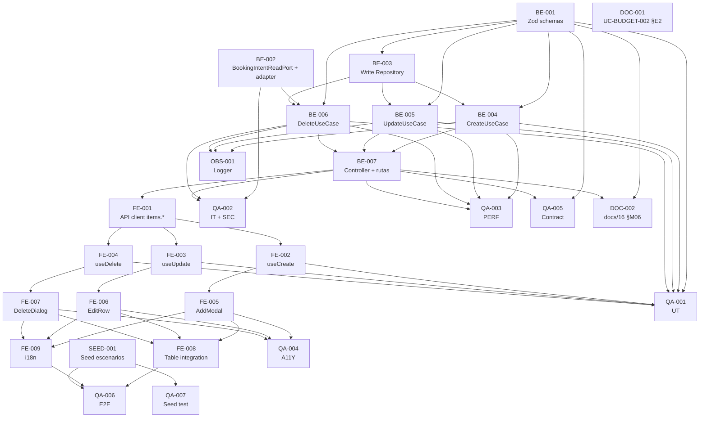

# Development Tasks — PB-P1-020 / US-036: Crear, editar y eliminar BudgetItem por categoría

## 1. Metadata

| Field                                | Value                                                                                                          |
| ------------------------------------ | -------------------------------------------------------------------------------------------------------------- |
| User Story ID                        | US-036                                                                                                         |
| Source User Story                    | `management/user-stories/US-036-crud-budget-items.md`                                                          |
| Source Technical Specification       | `management/technical-specs/P1/PB-P1-020/US-036-technical-spec.md`                                             |
| Decision Resolution Artifact         | `management/user-stories/decision-resolutions/US-036-decision-resolution.md`                                   |
| Priority                             | P1                                                                                                             |
| Backlog ID                           | PB-P1-020                                                                                                      |
| Backlog Title                        | Gestión de presupuesto + BudgetItems                                                                          |
| Backlog Execution Order              | 38 (P0: 18 items + P1: 20 items)                                                                               |
| User Story Position in Backlog Item  | 2 de 2 (US-035 → US-036)                                                                                       |
| Related User Stories in Backlog Item | US-035 (vista), US-036 (CRUD)                                                                                  |
| Epic                                 | EPIC-BUD-001 — Budget Management & Currency                                                                    |
| Backlog Item Dependencies            | PB-P0-001 (schema base con `deleted_at`), PB-P1-006 (creación de evento)                                        |
| Feature                              | CRUD de BudgetItems                                                                                            |
| Module / Domain                      | Budget                                                                                                         |
| Backlog Alignment Status             | Found                                                                                                          |
| Task Breakdown Status                | Ready for Sprint Planning                                                                                      |
| Created Date                         | 2026-06-27                                                                                                     |
| Last Updated                         | 2026-06-27                                                                                                     |

---

## 2. Source Validation

| Source                          | Found | Used | Notes                                                                                              |
| ------------------------------- | ----- | ---- | -------------------------------------------------------------------------------------------------- |
| User Story                       | Yes   | Yes  | Approved with Minor Notes (2026-06-27).                                                            |
| Technical Specification          | Yes   | Yes  | `Ready for Task Breakdown`.                                                                         |
| Decision Resolution Artifact     | Yes   | Yes  | D1–D5 formalizadas.                                                                                |
| Product Backlog Prioritized      | Yes   | Yes  | `PB-P1-020`, posición 2 de 2.                                                                      |
| ADRs                             | No    | N/A  | Sin ADR nuevo.                                                                                     |

---

## 3. Backlog Execution Context

### Parent Backlog Item

`PB-P1-020 — Gestión de presupuesto + BudgetItems` se cierra con US-036. Las mutaciones consumen el módulo `modules/budget` entregado por US-035 y delegan a `modules/booking` mediante un port para detectar `BookingIntent.pending`. Cada mutación invalida la query key TanStack `['event', eventId, 'budget']` que US-035 consume.

### Execution Order Rationale

US-036 va después de US-035 en el item: reusa el módulo, el repositorio read, los componentes UI base y la query key. PB-P1-020 ocupa la posición 38 en el Product Backlog Prioritized.

### Related User Stories in Same Backlog Item

| User Story                                  | Role in Backlog Item                                                                       | Suggested Order |
| ------------------------------------------- | ------------------------------------------------------------------------------------------ | --------------- |
| US-035 — Vista del presupuesto                | `GET /budget` con summary + tabla por categoría                                              | 1               |
| US-036 — CRUD de BudgetItem                  | `POST/PATCH/DELETE /budget/items[/:itemId]`; invalida cache de US-035                       | 2               |

---

## 4. Task Breakdown Summary

| Area  | Number of Tasks | Notes                                                                                                                      |
| ----- | --------------: | -------------------------------------------------------------------------------------------------------------------------- |
| DB    | 0               | Sin migraciones.                                                                                                            |
| BE    | 7               | DTOs Zod (1), Port + Adapter (1), Write Repository (1), 3 use cases, Controller + rutas (1).                                |
| API   | 0               | Cubierto por BE-007.                                                                                                        |
| SEC   | 0               | Reuso íntegro; pruebas SEC en QA.                                                                                           |
| OBS   | 1               | Logger estructurado `budget.item.{created,updated,deleted}`.                                                                |
| FE    | 7               | API client + 3 hooks + 3 componentes + integración con BudgetItemsTable + i18n.                                              |
| SEED  | 1               | Verificación de seed con escenarios de bloqueo.                                                                              |
| QA    | 7               | UT, IT (+ SEC), A11Y, PERF, CONTRACT, E2E, SEED test.                                                                       |
| AI    | 0               | No aplica.                                                                                                                  |
| OPS   | 0               | Sin cambios de pipeline.                                                                                                    |
| DOC   | 2               | `docs/8 §UC-BUDGET-002 §E2`, `docs/16 §M06` + `§error format`.                                                                |

**Total: 25 tareas.**

---

## 5. Traceability Matrix

| Acceptance Criterion                                       | Technical Spec Section(s)                                              | Task IDs                                                                                                                                                          |
| ---------------------------------------------------------- | ---------------------------------------------------------------------- | ----------------------------------------------------------------------------------------------------------------------------------------------------------------- |
| AC-01 Crear item                                            | §6, §7, §10                                                            | BE-001, BE-003, BE-004, BE-007, QA-001, QA-002                                                                                                                    |
| AC-02 Editar item                                           | §6, §7, §10                                                            | BE-001, BE-005, BE-007, QA-001, QA-002                                                                                                                            |
| AC-03 Soft delete                                           | §6, §7, §10                                                            | BE-002, BE-006, BE-007, QA-002 (IT-11 regresión soft delete en US-035)                                                                                            |
| AC-04 Bloqueo committed > 0                                 | §6, §7 (DeleteUseCase)                                                 | BE-006, QA-001, QA-002                                                                                                                                            |
| AC-05 Bloqueo pending intent / paid > 0                     | §6, §7 (DeleteUseCase + Port)                                          | BE-002, BE-006, QA-001, QA-002                                                                                                                                    |
| AC-06 Bloqueo cancelled/completed                           | §6, §7 (UseCases)                                                      | BE-004, BE-005, BE-006, QA-002                                                                                                                                    |
| AC-07 PATCH categoría + warnings                            | §6, §7 (UpdateUseCase), §8                                              | BE-005, FE-006, QA-001                                                                                                                                            |
| AC-08 Invalidación TanStack                                  | §8 (Hooks)                                                              | FE-002, FE-003, FE-004, QA-006                                                                                                                                    |
| AC-09 A11Y                                                  | §8, §13 (A11Y-01..03)                                                  | FE-005, FE-006, FE-007, FE-008, QA-004                                                                                                                            |
| AC-10 Performance                                            | §7, §13 (PERF-01)                                                      | QA-003                                                                                                                                                            |
| EC-01..09                                                   | §6                                                                     | BE-004, BE-005, BE-006, QA-002                                                                                                                                    |
| VR-01..10                                                   | §7                                                                     | BE-001, BE-004, BE-005, BE-006, BE-007                                                                                                                            |
| SEC-01..06                                                  | §12                                                                    | BE-007, QA-002                                                                                                                                                    |
| Observability                                               | §14                                                                    | OBS-001, QA-001                                                                                                                                                    |
| Documentation Alignment                                     | §16                                                                    | DOC-001, DOC-002                                                                                                                                                  |

---

## 6. Development Tasks

### TASK-PB-P1-020-US-036-BE-001 — Definir Zod schemas `createBudgetItemBodySchema` y `updateBudgetItemBodySchema` con `.strict()`

| Field                     | Value                                                                          |
| ------------------------- | ------------------------------------------------------------------------------ |
| Area                      | Backend                                                                        |
| Type                      | Implementation                                                                 |
| Priority                  | Must                                                                           |
| Estimate                  | XS                                                                             |
| Depends On                | —                                                                              |
| Source AC(s)              | AC-01, AC-02, AC-04, VR-01, VR-02, VR-04                                        |
| Technical Spec Section(s) | §7 (DTOs / Schemas), §9                                                         |
| Backlog ID                | PB-P1-020                                                                      |
| User Story ID             | US-036                                                                         |
| Owner Role                | Backend                                                                        |
| Status                    | To Do                                                                          |

#### Objective

Definir los contratos de body para POST y PATCH con validación Zod estricta que rechaza campos no permitidos (incluido `committed`).

#### Scope

##### Include

* Archivo `apps/api/src/modules/budget/dto/create-budget-item.body.ts`.
* Archivo `apps/api/src/modules/budget/dto/update-budget-item.body.ts`.
* Ambos schemas usan `.strict()`.
* Campos: `service_category_id` (UUID), `label?` (string min/max), `planned` (number ≥ 0), `paid?` (number ≥ 0).
* PATCH hace todos los campos opcionales.

##### Exclude

* No declarar `committed` ni `ai_generated`.

#### Acceptance Criteria Covered

AC-01, AC-02, AC-04, VR-01, VR-02, VR-04.

#### Definition of Done

- [ ] Schemas exportados.
- [ ] Tipos derivados (`z.infer`) disponibles.
- [ ] UT-01/UT-02 verdes (QA-001).

---

### TASK-PB-P1-020-US-036-BE-002 — Crear `BookingIntentReadPort` y adapter en `modules/booking`

| Field                     | Value                                                                          |
| ------------------------- | ------------------------------------------------------------------------------ |
| Area                      | Backend                                                                        |
| Type                      | Implementation                                                                 |
| Priority                  | Must                                                                           |
| Estimate                  | S                                                                              |
| Depends On                | —                                                                              |
| Source AC(s)              | AC-05                                                                          |
| Technical Spec Section(s) | §5 (Cross-module), §7 (Repository / Persistence), §17                          |
| Backlog ID                | PB-P1-020                                                                      |
| User Story ID             | US-036                                                                         |
| Owner Role                | Backend                                                                        |
| Status                    | To Do                                                                          |

#### Objective

Mantener el acoplamiento hexagonal entre `modules/budget` y `modules/booking`: definir el port (interface) en `modules/budget` e implementar el adaptador concreto en `modules/booking`.

#### Scope

##### Include

* `apps/api/src/modules/budget/ports/booking-intent-read.port.ts` con método `findPendingByEventAndCategory({ eventId, serviceCategoryId }): Promise<{ id: string }[]>`.
* `apps/api/src/modules/booking/adapters/booking-intent-read.adapter.ts` que implementa el port consultando `prisma.bookingIntent.findMany({ where: { event_id, service_category_id, status: 'pending' }, select: { id: true } })`.
* Wire del adapter en el DI container.

##### Exclude

* No exponer otras operaciones de booking desde `modules/budget`.

#### Acceptance Criteria Covered

AC-05.

#### Definition of Done

- [ ] Port y adapter implementados.
- [ ] DI container wired.
- [ ] Test unitario de adapter con BD verde (parte de QA-002).

---

### TASK-PB-P1-020-US-036-BE-003 — Implementar `BudgetItemWriteRepository` con `create`, `update`, `softDelete`

| Field                     | Value                                                                          |
| ------------------------- | ------------------------------------------------------------------------------ |
| Area                      | Backend                                                                        |
| Type                      | Implementation                                                                 |
| Priority                  | Must                                                                           |
| Estimate                  | S                                                                              |
| Depends On                | BE-001                                                                          |
| Source AC(s)              | AC-01, AC-02, AC-03                                                              |
| Technical Spec Section(s) | §7 (Repository), §10                                                            |
| Backlog ID                | PB-P1-020                                                                      |
| User Story ID             | US-036                                                                         |
| Owner Role                | Backend                                                                        |
| Status                    | To Do                                                                          |

#### Objective

Encapsular las operaciones write sobre `budget_items` con Prisma. Extender adicionalmente `BudgetReadRepository` (US-035) con filtro `deleted_at IS NULL` si aún no estaba.

#### Scope

##### Include

* `apps/api/src/modules/budget/repositories/budget-item-write.repository.ts`:
  * `create({ budgetId, serviceCategoryId, label, planned, paid }): Promise<BudgetItem>`.
  * `update(itemId, partial): Promise<BudgetItem>`.
  * `softDelete(itemId, deletedBy): Promise<void>`.
* Ajuste en `BudgetReadRepository` (US-035) para incluir `WHERE deleted_at IS NULL` en items y agregados.

##### Exclude

* No introducir transacciones explícitas (single-row updates en MVP).
* No materializar `total_planned`/`total_committed` en `Budget`.

#### Acceptance Criteria Covered

AC-01, AC-02, AC-03 (soft delete persistido).

#### Definition of Done

- [ ] Métodos implementados y testeados (UT/IT).
- [ ] `BudgetReadRepository` filtra soft-deleted (IT-11 verde en QA-002).
- [ ] Sin migraciones.

---

### TASK-PB-P1-020-US-036-BE-004 — Implementar `CreateBudgetItemUseCase`

| Field                     | Value                                                                          |
| ------------------------- | ------------------------------------------------------------------------------ |
| Area                      | Backend                                                                        |
| Type                      | Implementation                                                                 |
| Priority                  | Must                                                                           |
| Estimate                  | S                                                                              |
| Depends On                | BE-001, BE-003                                                                  |
| Source AC(s)              | AC-01, AC-06, EC-05, EC-06, VR-03, VR-10                                         |
| Technical Spec Section(s) | §7 (Use Cases — Create)                                                          |
| Backlog ID                | PB-P1-020                                                                      |
| User Story ID             | US-036                                                                         |
| Owner Role                | Backend                                                                        |
| Status                    | To Do                                                                          |

#### Objective

Use case de creación con validación de evento editable, categoría activa y normalización `paid null → 0`.

#### Scope

##### Include

* `apps/api/src/modules/budget/use-cases/create-budget-item.use-case.ts`.
* Validación `event.status ∈ {'draft','active'}` → 409 `EVENT_NOT_EDITABLE`.
* Validación `service_category.is_active = true` → 400 `INVALID_VALUE`.
* Persiste con `committed = 0`, `ai_generated = false`, `paid = body.paid ?? 0`.
* Emite log `budget.item.created` (OBS-001 define el catálogo).

##### Exclude

* No tocar `committed` (se sobreescribe a 0 explícitamente).

#### Acceptance Criteria Covered

AC-01, AC-06, EC-05, EC-06, VR-03, VR-10.

#### Definition of Done

- [ ] Use case implementado.
- [ ] UT-03, UT-09 verdes (QA-001).
- [ ] IT-01 verde (QA-002).

---

### TASK-PB-P1-020-US-036-BE-005 — Implementar `UpdateBudgetItemUseCase`

| Field                     | Value                                                                          |
| ------------------------- | ------------------------------------------------------------------------------ |
| Area                      | Backend                                                                        |
| Type                      | Implementation                                                                 |
| Priority                  | Must                                                                           |
| Estimate                  | S                                                                              |
| Depends On                | BE-001, BE-003                                                                  |
| Source AC(s)              | AC-02, AC-06, AC-07, EC-07, VR-04, VR-05, VR-09, VR-10                          |
| Technical Spec Section(s) | §7 (Use Cases — Update)                                                          |
| Backlog ID                | PB-P1-020                                                                      |
| User Story ID             | US-036                                                                         |
| Owner Role                | Backend                                                                        |
| Status                    | To Do                                                                          |

#### Objective

Use case de edición con verificación de campos editables, bloqueo de cambio de categoría con `committed > 0` y preservación de `ai_generated`.

#### Scope

##### Include

* `apps/api/src/modules/budget/use-cases/update-budget-item.use-case.ts`.
* Verifica cross-event check (`item.budget.event_id === eventId`).
* Verifica `deleted_at IS NULL`.
* Si `body.service_category_id` difiere del actual, verifica `committed === 0` → 409 `ITEM_HAS_COMMITMENT_CATEGORY_LOCKED`.
* Verifica que la nueva categoría existe y `is_active = true`.
* Preserva `committed` y `ai_generated`.
* Emite log `budget.item.updated`.

##### Exclude

* No tocar el body para añadir/quitar `committed` (Zod ya lo rechaza).

#### Acceptance Criteria Covered

AC-02, AC-06, AC-07, EC-07, VR-04, VR-05, VR-09, VR-10.

#### Definition of Done

- [ ] Use case implementado.
- [ ] UT-04, UT-08, UT-09 verdes (QA-001).
- [ ] IT-02, IT-04, IT-08, IT-12 verdes (QA-002).

---

### TASK-PB-P1-020-US-036-BE-006 — Implementar `DeleteBudgetItemUseCase` con cross-module check

| Field                     | Value                                                                          |
| ------------------------- | ------------------------------------------------------------------------------ |
| Area                      | Backend                                                                        |
| Type                      | Implementation                                                                 |
| Priority                  | Must                                                                           |
| Estimate                  | M                                                                              |
| Depends On                | BE-002, BE-003                                                                  |
| Source AC(s)              | AC-03, AC-04, AC-05, AC-06, EC-01..06, VR-07, VR-09, VR-10                      |
| Technical Spec Section(s) | §7 (Use Cases — Delete), §17                                                     |
| Backlog ID                | PB-P1-020                                                                      |
| User Story ID             | US-036                                                                         |
| Owner Role                | Backend                                                                        |
| Status                    | To Do                                                                          |

#### Objective

Use case de soft delete con los tres bloqueos D2 (`committed > 0`, `BookingIntent.pending`, `paid > 0`) y bloqueo D3 por estado del evento.

#### Scope

##### Include

* `apps/api/src/modules/budget/use-cases/delete-budget-item.use-case.ts`.
* Secuencia: ownership → event editable → item válido (no soft-deleted, cross-event) → `committed > 0` → `paid > 0` → `BookingIntent.pending` (port BE-002).
* Errores específicos: `ITEM_HAS_COMMITMENT`, `ITEM_HAS_PAID_AMOUNT`, `ITEM_HAS_PENDING_INTENT`, `EVENT_NOT_EDITABLE`, `ITEM_NOT_FOUND`.
* Aplica `deleted_at = NOW()`, `deleted_by = currentUser.id`.
* Emite log `budget.item.deleted` con `block_reason` cuando aplica.

##### Exclude

* No tocar relaciones; el item se preserva con auditoría.

#### Acceptance Criteria Covered

AC-03, AC-04, AC-05, AC-06, EC-01..06, VR-07, VR-09, VR-10.

#### Definition of Done

- [ ] Use case implementado.
- [ ] UT-05, UT-06, UT-07, UT-09 verdes (QA-001).
- [ ] IT-03, IT-05, IT-06, IT-07, IT-09, IT-10, IT-11 verdes (QA-002).

---

### TASK-PB-P1-020-US-036-BE-007 — Implementar controller `BudgetItemsMutationController` con tres rutas

| Field                     | Value                                                                          |
| ------------------------- | ------------------------------------------------------------------------------ |
| Area                      | Backend                                                                        |
| Type                      | Implementation                                                                 |
| Priority                  | Must                                                                           |
| Estimate                  | S                                                                              |
| Depends On                | BE-004, BE-005, BE-006                                                          |
| Source AC(s)              | AC-01, AC-02, AC-03, VR-06, VR-07, VR-08, SEC-01..06                            |
| Technical Spec Section(s) | §7 (Controllers / Routes), §9, §12                                              |
| Backlog ID                | PB-P1-020                                                                      |
| User Story ID             | US-036                                                                         |
| Owner Role                | Backend                                                                        |
| Status                    | To Do                                                                          |

#### Objective

Exponer las tres rutas catalogadas en `docs/16 §M06` con middleware chain de autorización y validación Zod de path params.

#### Scope

##### Include

* `apps/api/src/modules/budget/controllers/budget-items-mutation.controller.ts`.
* Tres handlers para `POST/PATCH/DELETE`.
* Middleware chain: `authRequired` → `OrganizerRoleGuard` → `adminExclusionGuard` → handler.
* Validación Zod de `eventId`/`itemId` UUID → 400 `INVALID_PARAMS`.
* Mapeo de respuestas: 201, 200, 204.
* Mapeo de DomainError → response `{ error_code, message, details? }` consistente con `docs/16 §error format`.
* Registro de rutas en el router central.

##### Exclude

* No introducir nuevos verbos HTTP.

#### Acceptance Criteria Covered

AC-01, AC-02, AC-03, VR-06, VR-07, VR-08, SEC-01..06.

#### Definition of Done

- [ ] Controller registrado con rutas operativas.
- [ ] SEC-T-01..06 verdes (QA-002).
- [ ] Contract test verde (QA-005).

---

### TASK-PB-P1-020-US-036-OBS-001 — Logger estructurado `budget.item.{created,updated,deleted}`

| Field                     | Value                                                                          |
| ------------------------- | ------------------------------------------------------------------------------ |
| Area                      | Observability / Audit                                                          |
| Type                      | Implementation                                                                 |
| Priority                  | Must                                                                           |
| Estimate                  | XS                                                                             |
| Depends On                | BE-004, BE-005, BE-006                                                          |
| Source AC(s)              | AC-01, AC-02, AC-03, SEC-05                                                      |
| Technical Spec Section(s) | §14 (Logs), §7 (Observability)                                                  |
| Backlog ID                | PB-P1-020                                                                      |
| User Story ID             | US-036                                                                         |
| Owner Role                | Backend                                                                        |
| Status                    | To Do                                                                          |

#### Objective

Definir el catálogo de eventos del módulo budget para mutaciones y emitirlos desde los use cases.

#### Scope

##### Include

* Archivo `apps/api/src/shared/logging/budget-item-events.ts` con schemas para los 3 eventos.
* Campos por evento documentados en §14 del Tech Spec.
* Manejo de `block_reason` para errores 409 en `budget.item.deleted`.

##### Exclude

* No registrar PII.

#### Acceptance Criteria Covered

AC-01, AC-02, AC-03, SEC-05.

#### Definition of Done

- [ ] Logs emitidos con shape validado.
- [ ] Snapshot test del log verde.

---

### TASK-PB-P1-020-US-036-FE-001 — Extender `budgetApi.items.*` con `create`, `update`, `delete`

| Field                     | Value                                                                          |
| ------------------------- | ------------------------------------------------------------------------------ |
| Area                      | Frontend                                                                       |
| Type                      | Implementation                                                                 |
| Priority                  | Must                                                                           |
| Estimate                  | XS                                                                             |
| Depends On                | BE-007                                                                          |
| Source AC(s)              | AC-01, AC-02, AC-03, AC-04                                                      |
| Technical Spec Section(s) | §8 (Data Fetching)                                                              |
| Backlog ID                | PB-P1-020                                                                      |
| User Story ID             | US-036                                                                         |
| Owner Role                | Frontend                                                                       |
| Status                    | To Do                                                                          |

#### Objective

Cliente HTTP tipado para las tres mutaciones.

#### Scope

##### Include

* Extensión de `apps/web/lib/api/budgetApi.ts`:
  * `items.create(eventId, body): Promise<BudgetItemDto>`.
  * `items.update(eventId, itemId, body): Promise<BudgetItemDto>`.
  * `items.delete(eventId, itemId): Promise<void>`.
* Tipado de errores `{ error_code, message, details? }`.

##### Exclude

* No introducir interceptores globales.

#### Acceptance Criteria Covered

AC-01, AC-02, AC-03, AC-04.

#### Definition of Done

- [ ] Funciones tipadas y exportadas.
- [ ] Tests con MSW verdes.

---

### TASK-PB-P1-020-US-036-FE-002 — Hook `useCreateBudgetItem` con invalidación de cache

| Field                     | Value                                                                          |
| ------------------------- | ------------------------------------------------------------------------------ |
| Area                      | Frontend                                                                       |
| Type                      | Implementation                                                                 |
| Priority                  | Must                                                                           |
| Estimate                  | XS                                                                             |
| Depends On                | FE-001                                                                          |
| Source AC(s)              | AC-01, AC-08                                                                    |
| Technical Spec Section(s) | §8 (State Management, Hooks)                                                    |
| Backlog ID                | PB-P1-020                                                                      |
| User Story ID             | US-036                                                                         |
| Owner Role                | Frontend                                                                       |
| Status                    | To Do                                                                          |

#### Objective

Hook TanStack que crea un item e invalida la query key canónica de US-035.

#### Scope

##### Include

* `apps/web/hooks/useCreateBudgetItem.ts`.
* `onSuccess` invoca `queryClient.invalidateQueries({ queryKey: ['event', eventId, 'budget'] })`.
* Mapeo de error_codes → mensajes localizados (vía catálogo i18n FE-009).

#### Acceptance Criteria Covered

AC-01, AC-08.

#### Definition of Done

- [ ] Hook tipado y testeado.
- [ ] UT-10-FE verde (QA-001).

---

### TASK-PB-P1-020-US-036-FE-003 — Hook `useUpdateBudgetItem` con invalidación de cache

| Field                     | Value                                                                          |
| ------------------------- | ------------------------------------------------------------------------------ |
| Area                      | Frontend                                                                       |
| Type                      | Implementation                                                                 |
| Priority                  | Must                                                                           |
| Estimate                  | XS                                                                             |
| Depends On                | FE-001                                                                          |
| Source AC(s)              | AC-02, AC-08                                                                    |
| Technical Spec Section(s) | §8                                                                              |
| Backlog ID                | PB-P1-020                                                                      |
| User Story ID             | US-036                                                                         |
| Owner Role                | Frontend                                                                       |
| Status                    | To Do                                                                          |

#### Objective

Hook TanStack para editar un item e invalidar el cache.

#### Scope

##### Include

* `apps/web/hooks/useUpdateBudgetItem.ts`.
* Invalidación tras éxito.
* Mapeo de errores (incluido `ITEM_HAS_COMMITMENT_CATEGORY_LOCKED`).

#### Acceptance Criteria Covered

AC-02, AC-08.

#### Definition of Done

- [ ] Hook tipado y testeado.

---

### TASK-PB-P1-020-US-036-FE-004 — Hook `useDeleteBudgetItem` con invalidación de cache

| Field                     | Value                                                                          |
| ------------------------- | ------------------------------------------------------------------------------ |
| Area                      | Frontend                                                                       |
| Type                      | Implementation                                                                 |
| Priority                  | Must                                                                           |
| Estimate                  | XS                                                                             |
| Depends On                | FE-001                                                                          |
| Source AC(s)              | AC-03, AC-04, AC-05, AC-08                                                      |
| Technical Spec Section(s) | §8                                                                              |
| Backlog ID                | PB-P1-020                                                                      |
| User Story ID             | US-036                                                                         |
| Owner Role                | Frontend                                                                       |
| Status                    | To Do                                                                          |

#### Objective

Hook TanStack para eliminar (soft) un item e invalidar el cache.

#### Scope

##### Include

* `apps/web/hooks/useDeleteBudgetItem.ts`.
* Mapeo de error_codes 409 a copy localizado.

#### Acceptance Criteria Covered

AC-03, AC-04, AC-05, AC-08.

#### Definition of Done

- [ ] Hook tipado y testeado.

---

### TASK-PB-P1-020-US-036-FE-005 — Componente `AddBudgetItemModal`

| Field                     | Value                                                                          |
| ------------------------- | ------------------------------------------------------------------------------ |
| Area                      | Frontend                                                                       |
| Type                      | Implementation                                                                 |
| Priority                  | Must                                                                           |
| Estimate                  | M                                                                              |
| Depends On                | FE-002                                                                          |
| Source AC(s)              | AC-01, AC-09                                                                    |
| Technical Spec Section(s) | §8 (Components), §13 (A11Y-01)                                                  |
| Backlog ID                | PB-P1-020                                                                      |
| User Story ID             | US-036                                                                         |
| Owner Role                | Frontend                                                                       |
| Status                    | To Do                                                                          |

#### Objective

Modal con RHF + Zod (espejo del schema backend) para crear items.

#### Scope

##### Include

* `apps/web/components/events/budget/AddBudgetItemModal.tsx`.
* `role="dialog"`, `aria-labelledby`, `aria-describedby`, focus trap, ESC para cerrar.
* Select de categorías activas (consume hook existente o expone uno mínimo).
* Inputs `planned`, `paid?`, `label?` con validación Zod cliente.
* Manejo de errores 4xx con `aria-live`.

##### Exclude

* No invocar la mutación dentro del modal; el envío usa `useCreateBudgetItem`.

#### Acceptance Criteria Covered

AC-01, AC-09.

#### Definition of Done

- [ ] Modal renderizado y operativo.
- [ ] A11Y-01 verde (QA-004).

---

### TASK-PB-P1-020-US-036-FE-006 — Componente `EditBudgetItemRow` con inline edit

| Field                     | Value                                                                          |
| ------------------------- | ------------------------------------------------------------------------------ |
| Area                      | Frontend                                                                       |
| Type                      | Implementation                                                                 |
| Priority                  | Must                                                                           |
| Estimate                  | M                                                                              |
| Depends On                | FE-003                                                                          |
| Source AC(s)              | AC-02, AC-07, AC-09                                                              |
| Technical Spec Section(s) | §8 (Components, Accessibility)                                                   |
| Backlog ID                | PB-P1-020                                                                      |
| User Story ID             | US-036                                                                         |
| Owner Role                | Frontend                                                                       |
| Status                    | To Do                                                                          |

#### Objective

Edición inline en la fila de `BudgetItemsTable` con manejo de UX para cambio de categoría (disabled si `committed > 0`).

#### Scope

##### Include

* `apps/web/components/events/budget/EditBudgetItemRow.tsx`.
* Selector de categoría con `disabled` cuando `item.committed > 0` y tooltip explicativo.
* Validación inline y mensajes con `aria-live`.
* Botones "Guardar"/"Cancelar".

##### Exclude

* No mutar `committed` ni `ai_generated`.

#### Acceptance Criteria Covered

AC-02, AC-07, AC-09.

#### Definition of Done

- [ ] Componente operativo.
- [ ] A11Y-02 verde (QA-004).

---

### TASK-PB-P1-020-US-036-FE-007 — Componente `DeleteBudgetItemDialog` con manejo de 409

| Field                     | Value                                                                          |
| ------------------------- | ------------------------------------------------------------------------------ |
| Area                      | Frontend                                                                       |
| Type                      | Implementation                                                                 |
| Priority                  | Must                                                                           |
| Estimate                  | S                                                                              |
| Depends On                | FE-004                                                                          |
| Source AC(s)              | AC-03, AC-04, AC-05, AC-09                                                      |
| Technical Spec Section(s) | §8 (Components), §13 (A11Y-03)                                                  |
| Backlog ID                | PB-P1-020                                                                      |
| User Story ID             | US-036                                                                         |
| Owner Role                | Frontend                                                                       |
| Status                    | To Do                                                                          |

#### Objective

Modal de confirmación con copy específico por `error_code` (`ITEM_HAS_COMMITMENT`, `ITEM_HAS_PENDING_INTENT`, `ITEM_HAS_PAID_AMOUNT`, `EVENT_NOT_EDITABLE`).

#### Scope

##### Include

* `apps/web/components/events/budget/DeleteBudgetItemDialog.tsx`.
* `role="dialog"`, `aria-labelledby`, `aria-describedby`.
* Localización de mensajes vía catálogo i18n.

#### Acceptance Criteria Covered

AC-03, AC-04, AC-05, AC-09.

#### Definition of Done

- [ ] Modal renderiza copy correcto para cada error_code.
- [ ] A11Y-03 verde (QA-004).

---

### TASK-PB-P1-020-US-036-FE-008 — Integrar componentes en `BudgetItemsTable` con badges advisory

| Field                     | Value                                                                          |
| ------------------------- | ------------------------------------------------------------------------------ |
| Area                      | Frontend                                                                       |
| Type                      | Implementation                                                                 |
| Priority                  | Must                                                                           |
| Estimate                  | S                                                                              |
| Depends On                | FE-005, FE-006, FE-007                                                          |
| Source AC(s)              | AC-07, AC-08                                                                    |
| Technical Spec Section(s) | §8 (Components — extensión de BudgetItemsTable)                                  |
| Backlog ID                | PB-P1-020                                                                      |
| User Story ID             | US-036                                                                         |
| Owner Role                | Frontend                                                                       |
| Status                    | To Do                                                                          |

#### Objective

Conectar los tres componentes con la tabla entregada por US-035 y añadir badges advisory cuando `paid > committed` o `paid > planned`.

#### Scope

##### Include

* Extensión de `BudgetItemsTable.tsx` con botones "Editar"/"Eliminar" por fila y CTA "Agregar item" sobre la tabla.
* Badge advisory cuando aplica (sin enviar al backend).
* Reuso del hook `useEventBudget` para recargar tras invalidación.

##### Exclude

* No reescribir la tabla completa.

#### Acceptance Criteria Covered

AC-07, AC-08.

#### Definition of Done

- [ ] Tabla operativa con todos los flujos CRUD demoables.

---

### TASK-PB-P1-020-US-036-FE-009 — Añadir claves i18n `budget.item.*` en 4 locales

| Field                     | Value                                                                          |
| ------------------------- | ------------------------------------------------------------------------------ |
| Area                      | Frontend                                                                       |
| Type                      | Implementation                                                                 |
| Priority                  | Must                                                                           |
| Estimate                  | S                                                                              |
| Depends On                | FE-005, FE-006, FE-007                                                          |
| Source AC(s)              | AC-09                                                                          |
| Technical Spec Section(s) | §8 (i18n)                                                                       |
| Backlog ID                | PB-P1-020                                                                      |
| User Story ID             | US-036                                                                         |
| Owner Role                | Frontend                                                                       |
| Status                    | To Do                                                                          |

#### Objective

Catálogo completo de strings (etiquetas de campos, CTAs, mensajes de error mapeados por `error_code`, advisory copies) en `es-LATAM`, `es-ES`, `pt`, `en`.

#### Scope

##### Include

* `messages/<locale>.json` actualizados con `budget.item.*`.
* Mapeo `error_code` → texto.

##### Exclude

* No introducir nuevos locales.

#### Acceptance Criteria Covered

AC-09.

#### Definition of Done

- [ ] 4 archivos actualizados.
- [ ] E2E del locale verde (QA-006).

---

### TASK-PB-P1-020-US-036-SEED-001 — Verificar/garantizar seed con escenarios de bloqueo

| Field                     | Value                                                                          |
| ------------------------- | ------------------------------------------------------------------------------ |
| Area                      | Seed / Demo Data                                                               |
| Type                      | Setup                                                                          |
| Priority                  | Should                                                                         |
| Estimate                  | S                                                                              |
| Depends On                | —                                                                              |
| Source AC(s)              | AC-04, AC-05                                                                    |
| Technical Spec Section(s) | §15 (Seed / Demo Data Impact)                                                   |
| Backlog ID                | PB-P1-020                                                                      |
| User Story ID             | US-036                                                                         |
| Owner Role                | Backend                                                                        |
| Status                    | To Do                                                                          |

#### Objective

Garantizar que el seed contiene al menos un item con `committed > 0`, uno con `paid > 0` y uno con `BookingIntent.pending` para demoar los tres bloqueos.

#### Scope

##### Include

* Auditoría del seed actual.
* Ajustes mínimos si faltan los tres escenarios.

##### Exclude

* No mover el seed a un módulo separado.

#### Acceptance Criteria Covered

AC-04, AC-05 (demo).

#### Definition of Done

- [ ] Seed verificado.
- [ ] SEED-T-01 verde (QA-007).

---

### TASK-PB-P1-020-US-036-QA-001 — Tests unitarios (schemas, use cases, hooks de mutación)

| Field                     | Value                                                                          |
| ------------------------- | ------------------------------------------------------------------------------ |
| Area                      | QA / Testing                                                                   |
| Type                      | Test                                                                           |
| Priority                  | Must                                                                           |
| Estimate                  | M                                                                              |
| Depends On                | BE-001, BE-004, BE-005, BE-006, FE-002, FE-003, FE-004                          |
| Source AC(s)              | AC-01..07, EC-01..07                                                              |
| Technical Spec Section(s) | §13 (Unit Tests UT-01..11)                                                      |
| Backlog ID                | PB-P1-020                                                                      |
| User Story ID             | US-036                                                                         |
| Owner Role                | QA                                                                             |
| Status                    | To Do                                                                          |

#### Objective

Cobertura UT: rechazo de `committed`, bloqueos, normalización, preservación de flags, invalidación TanStack.

#### Scope

##### Include

* UT-01..09 (backend).
* UT-10-FE, UT-11-FE (frontend).

#### Acceptance Criteria Covered

AC-01..07, EC-01..07.

#### Definition of Done

- [ ] 11 tests verdes.

---

### TASK-PB-P1-020-US-036-QA-002 — Tests integration (CRUD, soft delete, cross-module check, SEC)

| Field                     | Value                                                                          |
| ------------------------- | ------------------------------------------------------------------------------ |
| Area                      | QA / Testing                                                                   |
| Type                      | Test                                                                           |
| Priority                  | Must                                                                           |
| Estimate                  | L                                                                              |
| Depends On                | BE-002, BE-006, BE-007                                                          |
| Source AC(s)              | AC-01..06, EC-01..09, VR-01..10, SEC-01..06                                       |
| Technical Spec Section(s) | §13 (Integration Tests IT-01..13, Security Tests SEC-T-01..06)                  |
| Backlog ID                | PB-P1-020                                                                      |
| User Story ID             | US-036                                                                         |
| Owner Role                | QA                                                                             |
| Status                    | To Do                                                                          |

#### Objective

Cobertura integration de los tres endpoints + cross-module check + regresión soft delete en US-035 + SEC.

#### Scope

##### Include

* IT-01..13 (incluye IT-11 regresión: soft-deleted no aparece en US-035).
* SEC-T-01..06 (incluye anti-IDOR).

#### Acceptance Criteria Covered

AC-01..06, EC-01..09, VR-01..10, SEC-01..06.

#### Definition of Done

- [ ] 13 IT + 6 SEC-T verdes en CI.

---

### TASK-PB-P1-020-US-036-QA-003 — Test de performance PERF-01

| Field                     | Value                                                                          |
| ------------------------- | ------------------------------------------------------------------------------ |
| Area                      | QA / Testing                                                                   |
| Type                      | Test                                                                           |
| Priority                  | Must                                                                           |
| Estimate                  | S                                                                              |
| Depends On                | BE-004, BE-005, BE-006, BE-007                                                  |
| Source AC(s)              | AC-10                                                                          |
| Technical Spec Section(s) | §13 (Performance Tests PERF-01)                                                 |
| Backlog ID                | PB-P1-020                                                                      |
| User Story ID             | US-036                                                                         |
| Owner Role                | QA                                                                             |
| Status                    | To Do                                                                          |

#### Objective

Validar P95 < 1.5 s (NFR-PERF-001) sobre POST/PATCH/DELETE con dataset de 30 items.

#### Scope

##### Include

* Suite dedicada con N ≥ 30 repeticiones por endpoint.
* Reporte adjunto al PR.

#### Acceptance Criteria Covered

AC-10.

#### Definition of Done

- [ ] P95 < 1.5 s en CI.

---

### TASK-PB-P1-020-US-036-QA-004 — Tests A11Y de modales e inline edit

| Field                     | Value                                                                          |
| ------------------------- | ------------------------------------------------------------------------------ |
| Area                      | QA / Testing                                                                   |
| Type                      | Test                                                                           |
| Priority                  | Must                                                                           |
| Estimate                  | S                                                                              |
| Depends On                | FE-005, FE-006, FE-007                                                          |
| Source AC(s)              | AC-09                                                                          |
| Technical Spec Section(s) | §13 (Accessibility Tests A11Y-01..03)                                           |
| Backlog ID                | PB-P1-020                                                                      |
| User Story ID             | US-036                                                                         |
| Owner Role                | QA                                                                             |
| Status                    | To Do                                                                          |

#### Objective

Validar accesibilidad con jest-axe y @testing-library.

#### Scope

##### Include

* A11Y-01..03 + verificación de foco preservado tras error de validación.

#### Acceptance Criteria Covered

AC-09.

#### Definition of Done

- [ ] Tests verdes sin violaciones.

---

### TASK-PB-P1-020-US-036-QA-005 — Contract test CONTRACT-01 contra OpenAPI snapshot

| Field                     | Value                                                                          |
| ------------------------- | ------------------------------------------------------------------------------ |
| Area                      | QA / Testing                                                                   |
| Type                      | Test                                                                           |
| Priority                  | Should                                                                         |
| Estimate                  | S                                                                              |
| Depends On                | BE-001, BE-007                                                                  |
| Source AC(s)              | AC-04                                                                          |
| Technical Spec Section(s) | §13 (Contract Tests CONTRACT-01), §16                                          |
| Backlog ID                | PB-P1-020                                                                      |
| User Story ID             | US-036                                                                         |
| Owner Role                | QA                                                                             |
| Status                    | To Do                                                                          |

#### Objective

Validar shapes de request/response y catálogo de errores contra el snapshot OpenAPI (handoff US-098).

#### Scope

##### Include

* Snapshot interno si US-098 aún no está disponible.

#### Acceptance Criteria Covered

AC-04.

#### Definition of Done

- [ ] Contract test verde.

---

### TASK-PB-P1-020-US-036-QA-006 — E2E Playwright (CRUD + bloqueos + warnings)

| Field                     | Value                                                                          |
| ------------------------- | ------------------------------------------------------------------------------ |
| Area                      | QA / Testing                                                                   |
| Type                      | Test                                                                           |
| Priority                  | Must                                                                           |
| Estimate                  | M                                                                              |
| Depends On                | FE-008, FE-009, SEED-001                                                        |
| Source AC(s)              | AC-01, AC-02, AC-03, AC-04, AC-05, AC-07, AC-08, AC-09                          |
| Technical Spec Section(s) | §13 (E2E Tests E2E-01..04)                                                      |
| Backlog ID                | PB-P1-020                                                                      |
| User Story ID             | US-036                                                                         |
| Owner Role                | QA                                                                             |
| Status                    | To Do                                                                          |

#### Objective

Validar el ciclo demoable: crear → editar → eliminar → ver bloqueo con copy localizado → ver warning advisory.

#### Scope

##### Include

* E2E-01..04 contra seed con escenarios de bloqueo (SEED-001).

#### Acceptance Criteria Covered

AC-01, AC-02, AC-03, AC-04, AC-05, AC-07, AC-08, AC-09.

#### Definition of Done

- [ ] 4 E2E verdes en CI.

---

### TASK-PB-P1-020-US-036-QA-007 — Test de seed (escenarios de bloqueo presentes)

| Field                     | Value                                                                          |
| ------------------------- | ------------------------------------------------------------------------------ |
| Area                      | QA / Testing                                                                   |
| Type                      | Test                                                                           |
| Priority                  | Should                                                                         |
| Estimate                  | XS                                                                             |
| Depends On                | SEED-001                                                                          |
| Source AC(s)              | AC-04, AC-05                                                                    |
| Technical Spec Section(s) | §15                                                                              |
| Backlog ID                | PB-P1-020                                                                      |
| User Story ID             | US-036                                                                         |
| Owner Role                | QA                                                                             |
| Status                    | To Do                                                                          |

#### Objective

Validar que el seed contiene los tres escenarios canónicos (`committed > 0`, `paid > 0`, `BookingIntent.pending`).

#### Scope

##### Include

* Vitest con asserts sobre el seed cargado.

#### Acceptance Criteria Covered

AC-04, AC-05.

#### Definition of Done

- [ ] Test verde.

---

### TASK-PB-P1-020-US-036-DOC-001 — Extender `docs/8 §UC-BUDGET-002 §E2` con `completed`

| Field                     | Value                                                                          |
| ------------------------- | ------------------------------------------------------------------------------ |
| Area                      | Documentation / Traceability                                                   |
| Type                      | Documentation                                                                  |
| Priority                  | Should                                                                         |
| Estimate                  | XS                                                                             |
| Depends On                | —                                                                              |
| Source AC(s)              | AC-06                                                                          |
| Technical Spec Section(s) | §16                                                                              |
| Backlog ID                | PB-P1-020                                                                      |
| User Story ID             | US-036                                                                         |
| Owner Role                | Tech Lead                                                                      |
| Status                    | To Do                                                                          |

#### Objective

Documentar el bloqueo de mutaciones también en `event.status = 'completed'`, alineado con D3.

#### Scope

##### Include

* Edición de `docs/8-Use-Cases-Specification.md §UC-BUDGET-002 §E2`.

#### Acceptance Criteria Covered

AC-06 (alineación documental).

#### Definition of Done

- [ ] Nota merge-eada en `docs/8`.

---

### TASK-PB-P1-020-US-036-DOC-002 — Actualizar `docs/16 §M06` y `§error format`

| Field                     | Value                                                                          |
| ------------------------- | ------------------------------------------------------------------------------ |
| Area                      | Documentation / Traceability                                                   |
| Type                      | Documentation                                                                  |
| Priority                  | Should                                                                         |
| Estimate                  | XS                                                                             |
| Depends On                | BE-001, BE-007                                                                  |
| Source AC(s)              | AC-04                                                                          |
| Technical Spec Section(s) | §16, §9                                                                          |
| Backlog ID                | PB-P1-020                                                                      |
| User Story ID             | US-036                                                                         |
| Owner Role                | Tech Lead                                                                      |
| Status                    | To Do                                                                          |

#### Objective

Reflejar request/response shapes y nuevos `error_code` (`INVALID_FIELD`, `ITEM_HAS_PENDING_INTENT`, `ITEM_HAS_PAID_AMOUNT`, `ITEM_HAS_COMMITMENT_CATEGORY_LOCKED`, `EVENT_NOT_EDITABLE`) en la API spec.

#### Scope

##### Include

* Edición de `docs/16-API-Design-Specification.md §M06` y `§error format`.
* Handoff a US-098 (snapshot OpenAPI).

#### Acceptance Criteria Covered

AC-04 (alineación documental).

#### Definition of Done

- [ ] `docs/16` actualizado.

---

## 7. Required QA Tasks

| Task ID                                          | Test Type     | Purpose                                                                                |
| ------------------------------------------------ | ------------- | -------------------------------------------------------------------------------------- |
| TASK-PB-P1-020-US-036-QA-001                      | Unit          | Schemas Zod estrictos, use cases (bloqueos), normalización, hooks de invalidación.     |
| TASK-PB-P1-020-US-036-QA-002                      | Integration   | CRUD, soft delete, cross-module check, regresión soft delete en US-035, SEC anti-IDOR. |
| TASK-PB-P1-020-US-036-QA-003                      | Performance   | P95 < 1.5 s con 30 items.                                                              |
| TASK-PB-P1-020-US-036-QA-004                      | Accessibility | Modales (Add/Delete) e inline edit con foco y aria-live.                                |
| TASK-PB-P1-020-US-036-QA-005                      | Contract      | Shapes y catálogo de errores vs OpenAPI snapshot.                                       |
| TASK-PB-P1-020-US-036-QA-006                      | E2E           | CRUD + bloqueos visibles + warnings advisory.                                           |
| TASK-PB-P1-020-US-036-QA-007                      | Seed / Demo   | Cobertura de escenarios de bloqueo.                                                    |

---

## 8. Required Security Tasks

No aplica como tareas dedicadas: reuso íntegro de policies/guards. Pruebas SEC-T-01..06 viven en `TASK-PB-P1-020-US-036-QA-002`.

| Task ID                                          | Security Concern                                | Purpose                                                                  |
| ------------------------------------------------ | ----------------------------------------------- | ------------------------------------------------------------------------ |
| TASK-PB-P1-020-US-036-QA-002                      | 401/403/404/400 + anti-IDOR cruzado              | Cobertura completa de autorización y validación de input.                 |

---

## 9. Required Seed / Demo Tasks

| Task ID                                          | Seed/Demo Concern                          | Purpose                                                              |
| ------------------------------------------------ | ------------------------------------------ | -------------------------------------------------------------------- |
| TASK-PB-P1-020-US-036-SEED-001                    | Escenarios de bloqueo                       | Garantizar items con committed > 0, paid > 0, BookingIntent.pending.  |
| TASK-PB-P1-020-US-036-QA-007                      | Validación de seed                          | Auditoría automatizada.                                              |

---

## 10. Observability / Audit Tasks

| Task ID                                          | Concern                                                | Purpose                                                                     |
| ------------------------------------------------ | ------------------------------------------------------ | --------------------------------------------------------------------------- |
| TASK-PB-P1-020-US-036-OBS-001                     | Logs estructurados `budget.item.{created,updated,deleted}` | Auditoría + correlación.                                                   |

---

## 11. Documentation / Traceability Tasks

| Task ID                                          | Document / Artifact                                | Purpose                                                                           |
| ------------------------------------------------ | -------------------------------------------------- | --------------------------------------------------------------------------------- |
| TASK-PB-P1-020-US-036-DOC-001                     | `docs/8 §UC-BUDGET-002 §E2`                         | Extender con `completed` (D3).                                                     |
| TASK-PB-P1-020-US-036-DOC-002                     | `docs/16 §M06` + `§error format`                    | Shapes + catálogo de errores extendido.                                            |

---

## 12. Dependency Graph

---

## 13. Suggested Implementation Order

### Phase 1 — Foundation

* BE-001 (Zod schemas).
* BE-002 (Port + Adapter).
* SEED-001 (escenarios).

### Phase 2 — Core Implementation

* BE-003 (Write Repository).
* BE-004 (CreateUseCase).
* BE-005 (UpdateUseCase).
* BE-006 (DeleteUseCase).
* BE-007 (Controller + rutas).
* OBS-001 (Logger).
* FE-001 (API client).
* FE-002..004 (Hooks).
* FE-005..007 (Componentes).
* FE-008 (Integración con tabla).
* FE-009 (i18n).

### Phase 3 — Validation / Security / QA

* QA-001 (UT).
* QA-002 (IT + SEC).
* QA-003 (PERF).
* QA-004 (A11Y).
* QA-005 (Contract).
* QA-006 (E2E).
* QA-007 (Seed test).

### Phase 4 — Documentation / Review

* DOC-001.
* DOC-002.

---

## 14. Risks & Mitigations

| Risk                                                                                                          | Impact                                          | Mitigation                                                                                                                                  | Related Task                                |
| ------------------------------------------------------------------------------------------------------------- | ----------------------------------------------- | ------------------------------------------------------------------------------------------------------------------------------------------- | ------------------------------------------- |
| Acoplamiento cruzado entre `modules/budget` y `modules/booking`.                                                | Dependencias circulares; mantenimiento complejo.| BE-002 introduce port/adapter; sin imports directos cruzados.                                                                               | BE-002                                       |
| Cross-module query degrada P95 del DELETE.                                                                      | NFR-PERF-001 incumplido.                        | Dataset MVP pequeño; QA-003 valida; índice opcional si falla.                                                                               | QA-003                                       |
| Last-write-wins en concurrencia sobrescribe cambios.                                                            | UX confuso.                                     | Documentado en EC-08 de la US (Out of Scope locking optimista).                                                                             | —                                            |
| Mapeo de error_codes en frontend queda desactualizado.                                                          | UX confuso.                                     | QA-006 E2E con cada error_code y FE-009 con mapeo explícito.                                                                                | FE-009, QA-006                                |
| `BudgetReadRepository` de US-035 no filtra soft-deleted al inicio.                                              | Items eliminados aparecen en US-035.            | BE-003 extiende el repositorio + IT-11 (regresión) en QA-002.                                                                              | BE-003, QA-002                                |

---

## 15. Out of Scope Confirmation

* Endpoints batch / bulk updates.
* Edición de `committed` o `ai_generated`.
* Hard delete.
* Locking optimista para concurrencia.
* Materialización de totales en `Budget`.
* Cache server-side.
* Conversión FX y multi-moneda.

---

## 16. Readiness for Sprint Planning

| Check                                                                | Status |
| -------------------------------------------------------------------- | ------ |
| Product Backlog mapping found                                        | Pass   |
| Every AC maps to tasks                                               | Pass   |
| Technical Spec used when available                                   | Pass   |
| QA tasks included                                                    | Pass   |
| Security tasks included if applicable                                | Pass (via QA-002) |
| Seed/demo tasks included if applicable                               | Pass (SEED-001 + QA-007) |
| Observability tasks included if applicable                           | Pass   |
| Documentation tasks included if applicable                           | Pass   |
| Task dependencies clear                                              | Pass   |
| Tasks small enough                                                   | Pass   |
| Ready for Sprint Planning                                            | Yes    |

---

## 17. Final Recommendation

`Ready for Sprint Planning`

US-036 desglosa en 25 tareas atómicas, ordenadas por dependencia técnica y trazables a las 10 AC + 9 EC documentados. El módulo `modules/budget` recibe tres use cases write, un repositorio write y un port/adapter para preservar la hexagonalidad con `modules/booking`. Frontend extiende los componentes y la query key entregados por US-035 con tres componentes nuevos, tres hooks de mutación con invalidación automática y warnings advisory client-side. Las 5 decisiones (D1–D5) están materializadas en Zod estricto + verificaciones explícitas. Las 3 Documentation Alignment Required son Should no bloqueantes. Sin migraciones, sin endpoints fuera del catálogo M06, sin LLMProvider. Próximo paso: Sprint Planning de PB-P1-020 con handoff a US-035 cerrado.
