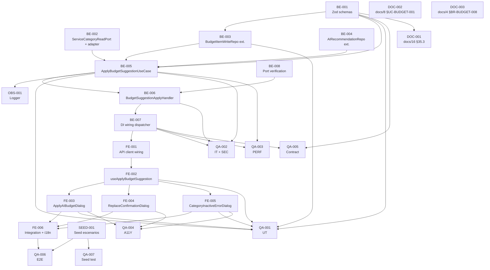

# Development Tasks — PB-P1-021 / US-037: Aceptar distribución IA como BudgetItems editables

## 1. Metadata

| Field                                | Value                                                                                                                                                              |
| ------------------------------------ | ------------------------------------------------------------------------------------------------------------------------------------------------------------------ |
| User Story ID                        | US-037                                                                                                                                                             |
| Source User Story                    | `management/user-stories/US-037-accept-ai-budget-distribution.md`                                                                                                   |
| Source Technical Specification       | `management/technical-specs/P1/PB-P1-021/US-037-technical-spec.md`                                                                                                  |
| Decision Resolution Artifact         | `management/user-stories/decision-resolutions/US-037-decision-resolution.md`                                                                                        |
| Priority                             | P1                                                                                                                                                                 |
| Backlog ID                           | PB-P1-021                                                                                                                                                          |
| Backlog Title                        | Aceptar distribución IA como BudgetItems                                                                                                                          |
| Backlog Execution Order              | 39 (P0: 18 items + P1: 21 items)                                                                                                                                   |
| User Story Position in Backlog Item  | 1 de 1                                                                                                                                                              |
| Related User Stories in Backlog Item | US-037                                                                                                                                                              |
| Epic                                 | EPIC-BUD-001 — Budget Management & Currency                                                                                                                        |
| Backlog Item Dependencies            | PB-P1-013 (US-019), PB-P1-016 (US-025), PB-P1-020 (US-035 + US-036)                                                                                                |
| Feature                              | Aceptación de distribución IA                                                                                                                                       |
| Module / Domain                      | Budget / AI (HITL)                                                                                                                                                  |
| Backlog Alignment Status             | Found                                                                                                                                                              |
| Task Breakdown Status                | Ready for Sprint Planning                                                                                                                                            |
| Created Date                         | 2026-06-27                                                                                                                                                          |
| Last Updated                         | 2026-06-27                                                                                                                                                          |

---

## 2. Source Validation

| Source                          | Found | Used | Notes                                                                                              |
| ------------------------------- | ----- | ---- | -------------------------------------------------------------------------------------------------- |
| User Story                       | Yes   | Yes  | Approved with Minor Notes (2026-06-27).                                                            |
| Technical Specification          | Yes   | Yes  | `Ready for Task Breakdown`.                                                                         |
| Decision Resolution Artifact     | Yes   | Yes  | D1–D6 formalizadas.                                                                                |
| Product Backlog Prioritized      | Yes   | Yes  | `PB-P1-021`, posición 1 de 1.                                                                      |
| ADRs                             | Yes   | Yes  | ADR-AI-001 (LLMProvider; honrado upstream).                                                         |

---

## 3. Backlog Execution Context

### Parent Backlog Item

`PB-P1-021 — Aceptar distribución IA como BudgetItems` cierra el ciclo Budget IA con un handler que se enchufa al dispatcher de US-025 sin introducir routing nuevo. Reusa repositorios de US-035/US-036 y consume el AIRecommendation persistido por US-019.

### Execution Order Rationale

US-037 depende de US-019 (productor), US-025 (dispatcher) y US-035/US-036 (consumidores cache + CRUD). PB-P1-021 ocupa la posición 39 del backlog.

### Related User Stories in Same Backlog Item

| User Story                                  | Role in Backlog Item                                                            | Suggested Order |
| ------------------------------------------- | ------------------------------------------------------------------------------- | --------------- |
| US-037 — Aplicar sugerencia IA                | Handler para `type='budget_suggestion'` del dispatcher de US-025                 | 1               |

---

## 4. Task Breakdown Summary

| Area  | Number of Tasks | Notes                                                                                                                                                |
| ----- | --------------: | ---------------------------------------------------------------------------------------------------------------------------------------------------- |
| DB    | 0               | Sin migraciones.                                                                                                                                      |
| BE    | 8               | DTOs, ServiceCategoryReadPort + adapter, BudgetItemWriteRepository ext., AIRecommendationRepository ext., UseCase, BudgetSuggestionApplyHandler, DI wiring, AIRecommendationApplyHandlerPort verificación. |
| API   | 0               | Reuso del controller de US-025.                                                                                                                       |
| SEC   | 0               | Reuso íntegro; pruebas SEC en QA.                                                                                                                     |
| OBS   | 1               | Logger `budget.ai_suggestion.applied`.                                                                                                                |
| FE    | 6               | API client wiring, hook de mutación, 3 dialogs, integración con vista de US-035, i18n.                                                                  |
| SEED  | 1               | Garantizar AIRecommendation pending + items previos para reemplazo.                                                                                    |
| QA    | 7               | UT, IT (con SEC + regresión soft delete), PERF, A11Y, CONTRACT, E2E, SEED test.                                                                       |
| AI    | 0               | No aplica.                                                                                                                                            |
| OPS   | 0               | Sin cambios.                                                                                                                                          |
| DOC   | 3               | `docs/16 §35.3`, `docs/8 §UC-BUDGET-001 §E1`, `docs/4 §BR-BUDGET-008`.                                                                                  |

**Total: 26 tareas.**

---

## 5. Traceability Matrix

| Acceptance Criterion                                       | Technical Spec Section(s)                                              | Task IDs                                                                                                                            |
| ---------------------------------------------------------- | ---------------------------------------------------------------------- | ----------------------------------------------------------------------------------------------------------------------------------- |
| AC-01 Aplicar total o editada                               | §6, §7                                                                  | BE-001, BE-003, BE-004, BE-005, BE-006, BE-007, QA-001, QA-002                                                                       |
| AC-02 Aceptación parcial (subset)                           | §6, §7                                                                  | BE-001, BE-005, QA-001, QA-002                                                                                                       |
| AC-03 Reemplazo (D2)                                        | §6, §7                                                                  | BE-003, BE-005, QA-001, QA-002                                                                                                       |
| AC-04 Bloqueo event status (D5)                              | §6, §7                                                                  | BE-005, QA-002                                                                                                                       |
| AC-05 CATEGORY_INACTIVE (D6)                                | §6, §7                                                                  | BE-002, BE-005, QA-001, QA-002                                                                                                       |
| AC-06 Cache invalidation                                    | §8 (Hook)                                                                | FE-002, QA-006                                                                                                                       |
| AC-07 Atomicidad                                            | §7 (Transactions)                                                       | BE-005, QA-002 (IT-04)                                                                                                                |
| AC-08 Currency consistency                                  | §6, §7                                                                  | BE-005, QA-002                                                                                                                       |
| AC-09 A11Y                                                  | §8, §13                                                                  | FE-003, FE-004, FE-005, QA-004                                                                                                       |
| AC-10 Performance                                            | §7, §13                                                                  | QA-003                                                                                                                               |
| EC-01..09                                                   | §6                                                                      | BE-005, QA-002                                                                                                                       |
| VR-01..10                                                   | §7                                                                      | BE-001, BE-005                                                                                                                       |
| SEC-01..06                                                  | §12                                                                     | BE-005, BE-006, QA-002                                                                                                               |
| Observability                                               | §14                                                                     | OBS-001                                                                                                                              |
| Documentation Alignment                                     | §16                                                                     | DOC-001, DOC-002, DOC-003                                                                                                            |

---

## 6. Development Tasks

### TASK-PB-P1-021-US-037-BE-001 — Definir Zod schemas `editedPayload` y response

| Field                     | Value                                                                          |
| ------------------------- | ------------------------------------------------------------------------------ |
| Area                      | Backend                                                                        |
| Type                      | Implementation                                                                 |
| Priority                  | Must                                                                           |
| Estimate                  | XS                                                                             |
| Depends On                | —                                                                              |
| Source AC(s)              | AC-01, AC-02, AC-04, VR-03, VR-04, VR-05                                        |
| Technical Spec Section(s) | §7 (DTOs / Schemas), §9                                                         |
| Backlog ID                | PB-P1-021                                                                      |
| User Story ID             | US-037                                                                         |
| Owner Role                | Backend                                                                        |
| Status                    | To Do                                                                          |

#### Objective

Definir el contrato cliente↔backend con validación Zod estricta.

#### Scope

##### Include

* `apps/api/src/modules/budget/dto/edited-payload.body.ts` con `editedBudgetPayloadCategorySchema`, `editedBudgetPayloadSchema`, `applyBudgetSuggestionBodySchema` (todos `.strict()`).
* `apps/api/src/modules/budget/dto/apply-budget-suggestion-response.dto.ts` con `applyBudgetSuggestionResponseSchema`.
* `categories[].min(1)` para rechazar vacío.

##### Exclude

* No declarar campos extras (incluyendo `committed`, `ai_generated`).

#### Acceptance Criteria Covered

AC-01, AC-02, AC-04, VR-03, VR-04, VR-05.

#### Definition of Done

- [ ] Schemas exportados.
- [ ] UT-01, UT-02 verdes (QA-001).

---

### TASK-PB-P1-021-US-037-BE-002 — Crear `ServiceCategoryReadPort` y adapter

| Field                     | Value                                                                          |
| ------------------------- | ------------------------------------------------------------------------------ |
| Area                      | Backend                                                                        |
| Type                      | Implementation                                                                 |
| Priority                  | Must                                                                           |
| Estimate                  | S                                                                              |
| Depends On                | —                                                                              |
| Source AC(s)              | AC-05, VR-07                                                                    |
| Technical Spec Section(s) | §5, §7                                                                          |
| Backlog ID                | PB-P1-021                                                                      |
| User Story ID             | US-037                                                                         |
| Owner Role                | Backend                                                                        |
| Status                    | To Do                                                                          |

#### Objective

Preservar la hexagonalidad para el lookup de categorías por `code` y la verificación `is_active`.

#### Scope

##### Include

* `apps/api/src/modules/budget/ports/service-category-read.port.ts` con `findManyByCodes(codes: string[]): Promise<ServiceCategory[]>`.
* `apps/api/src/modules/catalog/adapters/service-category-read.adapter.ts` que delega a Prisma.

##### Exclude

* No exponer otras operaciones (write/CRUD) desde el port.

#### Acceptance Criteria Covered

AC-05, VR-07.

#### Definition of Done

- [ ] Port y adapter implementados.
- [ ] DI wired (BE-007).
- [ ] UT-08, IT-08 verdes (QA-001/QA-002).

---

### TASK-PB-P1-021-US-037-BE-003 — Extender `BudgetItemWriteRepository` con `findReplaceable`, `createMany`, `softDeleteMany`

| Field                     | Value                                                                          |
| ------------------------- | ------------------------------------------------------------------------------ |
| Area                      | Backend                                                                        |
| Type                      | Implementation                                                                 |
| Priority                  | Must                                                                           |
| Estimate                  | S                                                                              |
| Depends On                | BE-001                                                                          |
| Source AC(s)              | AC-01, AC-03, AC-07                                                              |
| Technical Spec Section(s) | §7 (Repository / Persistence)                                                   |
| Backlog ID                | PB-P1-021                                                                      |
| User Story ID             | US-037                                                                         |
| Owner Role                | Backend                                                                        |
| Status                    | To Do                                                                          |

#### Objective

Extender el repository entregado por US-036 con las operaciones batch que necesita el use case.

#### Scope

##### Include

* `findReplaceable({ eventId, aiRecommendationId }): Promise<{ id: string }[]>` con predicado D2 (`ai_generated=true AND ai_recommendation_id != aiRecommendationId AND deleted_at IS NULL AND event_id = path.eventId`).
* `createMany(items): Promise<BudgetItem[]>` (con segundo `findMany` por `ai_recommendation_id` si Prisma `createMany` no retorna registros).
* `softDeleteMany(itemIds, deletedBy): Promise<void>`.

##### Exclude

* No introducir hard delete.

#### Acceptance Criteria Covered

AC-01, AC-03, AC-07.

#### Definition of Done

- [ ] Métodos implementados.
- [ ] UT-05, UT-06 + IT-01, IT-03 verdes (QA-001/QA-002).

---

### TASK-PB-P1-021-US-037-BE-004 — Extender `AIRecommendationRepository` con `markAccepted`

| Field                     | Value                                                                          |
| ------------------------- | ------------------------------------------------------------------------------ |
| Area                      | Backend                                                                        |
| Type                      | Implementation                                                                 |
| Priority                  | Must                                                                           |
| Estimate                  | XS                                                                             |
| Depends On                | —                                                                              |
| Source AC(s)              | AC-01                                                                          |
| Technical Spec Section(s) | §7 (Repository / Persistence)                                                   |
| Backlog ID                | PB-P1-021                                                                      |
| User Story ID             | US-037                                                                         |
| Owner Role                | Backend                                                                        |
| Status                    | To Do                                                                          |

#### Objective

Persistir la transición `status='pending' → 'accepted'` con campos `edited`, `accepted_at`, `accepted_by`.

#### Scope

##### Include

* Método `markAccepted({ id, edited, acceptedAt, acceptedBy }): Promise<AIRecommendation>` en el repository de US-019.
* Update Prisma con WHERE por id + status='pending' (idempotencia: si no afecta filas, lanzar conflict).

##### Exclude

* No alterar el shape del payload del AIRecommendation.

#### Acceptance Criteria Covered

AC-01.

#### Definition of Done

- [ ] Método implementado y testeado.

---

### TASK-PB-P1-021-US-037-BE-005 — Implementar `ApplyBudgetSuggestionUseCase` con lógica D1–D6 en `prisma.$transaction`

| Field                     | Value                                                                          |
| ------------------------- | ------------------------------------------------------------------------------ |
| Area                      | Backend                                                                        |
| Type                      | Implementation                                                                 |
| Priority                  | Must                                                                           |
| Estimate                  | L                                                                              |
| Depends On                | BE-001, BE-002, BE-003, BE-004                                                  |
| Source AC(s)              | AC-01..08, EC-01..09, VR-01..10, SEC-01..06                                       |
| Technical Spec Section(s) | §7 (Use Cases)                                                                  |
| Backlog ID                | PB-P1-021                                                                      |
| User Story ID             | US-037                                                                         |
| Owner Role                | Backend                                                                        |
| Status                    | To Do                                                                          |

#### Objective

Implementar el handler core con todas las verificaciones D1–D6 dentro de una sola transacción.

#### Scope

##### Include

* Secuencia de validaciones documentada en Tech Spec §7.1: ownership + status + event status + currency + categorías activas + Zod editedPayload + cálculo `edited`.
* `prisma.$transaction([softDeleteMany?, createMany, markAccepted])`.
* Errores tipados (`RECOMMENDATION_NOT_PENDING`, `EVENT_NOT_EDITABLE`, `CATEGORY_INACTIVE`, `CURRENCY_MISMATCH`, `PAYLOAD_INVALID`, `INVALID_VALUE`, `NOT_FOUND`).
* Emisión de log `budget.ai_suggestion.applied` (OBS-001).
* Response `{ created_items, replaced_items_count, recommendation }`.

##### Exclude

* No invocar LLMProvider.
* No mutar `ai_generated` ni reemplazar `ai_recommendation_id` de items históricos.

#### Acceptance Criteria Covered

AC-01..08, EC-01..09, VR-01..10, SEC-01..06.

#### Definition of Done

- [ ] Use case operativo.
- [ ] UT-03, UT-04, UT-07, UT-09, UT-10 verdes (QA-001).
- [ ] IT-01..12 verdes (QA-002).

---

### TASK-PB-P1-021-US-037-BE-006 — Implementar `BudgetSuggestionApplyHandler` (adapter del port de US-025)

| Field                     | Value                                                                          |
| ------------------------- | ------------------------------------------------------------------------------ |
| Area                      | Backend                                                                        |
| Type                      | Implementation                                                                 |
| Priority                  | Must                                                                           |
| Estimate                  | S                                                                              |
| Depends On                | BE-005                                                                          |
| Source AC(s)              | AC-01, SEC-01..06                                                                |
| Technical Spec Section(s) | §5, §7                                                                          |
| Backlog ID                | PB-P1-021                                                                      |
| User Story ID             | US-037                                                                         |
| Owner Role                | Backend                                                                        |
| Status                    | To Do                                                                          |

#### Objective

Adaptar el use case al contrato `AIRecommendationApplyHandlerPort` que el dispatcher de US-025 expone.

#### Scope

##### Include

* `apps/api/src/modules/budget/adapters/budget-suggestion-apply-handler.ts`.
* Implementa el método `apply({ aiRecommendationId, currentUser, body })` delegando al use case.
* Mapea errores tipados al formato esperado por el dispatcher.

##### Exclude

* No introducir routing.

#### Acceptance Criteria Covered

AC-01, SEC-01..06.

#### Definition of Done

- [ ] Adapter implementado.
- [ ] Registro en DI verificado (BE-007).

---

### TASK-PB-P1-021-US-037-BE-007 — Wiring DI: registrar handler en el dispatcher de US-025

| Field                     | Value                                                                          |
| ------------------------- | ------------------------------------------------------------------------------ |
| Area                      | Backend                                                                        |
| Type                      | Setup                                                                          |
| Priority                  | Must                                                                           |
| Estimate                  | XS                                                                             |
| Depends On                | BE-006                                                                          |
| Source AC(s)              | AC-01                                                                          |
| Technical Spec Section(s) | §5, §7                                                                          |
| Backlog ID                | PB-P1-021                                                                      |
| User Story ID             | US-037                                                                         |
| Owner Role                | Backend                                                                        |
| Status                    | To Do                                                                          |

#### Objective

Registrar `BudgetSuggestionApplyHandler` para `type='budget_suggestion'` en el dispatcher de US-025.

#### Scope

##### Include

* Edición del módulo de configuración DI (módulo de bootstrap).
* Verificación de que el dispatcher resuelve correctamente el handler vía `type`.

##### Exclude

* No modificar el dispatcher.

#### Acceptance Criteria Covered

AC-01.

#### Definition of Done

- [ ] Dispatcher invoca el handler para `type='budget_suggestion'`.
- [ ] Smoke test del wiring verde.

---

### TASK-PB-P1-021-US-037-BE-008 — Verificar `AIRecommendationApplyHandlerPort` y catálogo de handlers

| Field                     | Value                                                                          |
| ------------------------- | ------------------------------------------------------------------------------ |
| Area                      | Backend                                                                        |
| Type                      | Review                                                                         |
| Priority                  | Should                                                                         |
| Estimate                  | XS                                                                             |
| Depends On                | —                                                                              |
| Source AC(s)              | AC-01                                                                          |
| Technical Spec Section(s) | §5, §18                                                                          |
| Backlog ID                | PB-P1-021                                                                      |
| User Story ID             | US-037                                                                         |
| Owner Role                | Backend                                                                        |
| Status                    | To Do                                                                          |

#### Objective

Confirmar que US-025 expone el port. Si está incompleto, abrir follow-up o, como fallback, implementar un mini-dispatcher dentro de `modules/budget`.

#### Scope

##### Include

* Inspección del módulo de US-025 / `ai-recommendations`.
* Si el port falta, registrar issue y planificar fallback documentado.

##### Exclude

* No reescribir el dispatcher si existe.

#### Acceptance Criteria Covered

AC-01.

#### Definition of Done

- [ ] Verificación completada y documentada en el PR.

---

### TASK-PB-P1-021-US-037-OBS-001 — Logger estructurado `budget.ai_suggestion.applied`

| Field                     | Value                                                                          |
| ------------------------- | ------------------------------------------------------------------------------ |
| Area                      | Observability / Audit                                                          |
| Type                      | Implementation                                                                 |
| Priority                  | Must                                                                           |
| Estimate                  | XS                                                                             |
| Depends On                | BE-005                                                                          |
| Source AC(s)              | AC-01, SEC-05                                                                   |
| Technical Spec Section(s) | §14 (Logs), §7 (Observability)                                                  |
| Backlog ID                | PB-P1-021                                                                      |
| User Story ID             | US-037                                                                         |
| Owner Role                | Backend                                                                        |
| Status                    | To Do                                                                          |

#### Objective

Definir y emitir el evento de log del apply.

#### Scope

##### Include

* `apps/api/src/shared/logging/budget-ai-events.ts` con schema validado.
* Campos documentados en Tech Spec §7.observability.

##### Exclude

* No registrar PII; no incluir el payload completo del `AIRecommendation`.

#### Acceptance Criteria Covered

AC-01, SEC-05.

#### Definition of Done

- [ ] Log emitido con shape validado.
- [ ] Snapshot test verde.

---

### TASK-PB-P1-021-US-037-FE-001 — Verificar/extender `aiRecommendationsApi.apply` (entregado por US-025)

| Field                     | Value                                                                          |
| ------------------------- | ------------------------------------------------------------------------------ |
| Area                      | Frontend                                                                       |
| Type                      | Review / Implementation                                                        |
| Priority                  | Must                                                                           |
| Estimate                  | XS                                                                             |
| Depends On                | BE-007                                                                          |
| Source AC(s)              | AC-01                                                                          |
| Technical Spec Section(s) | §8 (Data Fetching)                                                              |
| Backlog ID                | PB-P1-021                                                                      |
| User Story ID             | US-037                                                                         |
| Owner Role                | Frontend                                                                       |
| Status                    | To Do                                                                          |

#### Objective

Asegurar que el cliente HTTP `apply(aiRecommendationId, body)` está disponible y tipado.

#### Scope

##### Include

* Confirmar el wiring entregado por US-025; si falta tipado de response específico para budget, extender.

##### Exclude

* No reescribir el cliente; solo extender si necesario.

#### Acceptance Criteria Covered

AC-01.

#### Definition of Done

- [ ] Cliente verificado y tipado correctamente.

---

### TASK-PB-P1-021-US-037-FE-002 — Hook `useApplyBudgetSuggestion` con invalidación TanStack

| Field                     | Value                                                                          |
| ------------------------- | ------------------------------------------------------------------------------ |
| Area                      | Frontend                                                                       |
| Type                      | Implementation                                                                 |
| Priority                  | Must                                                                           |
| Estimate                  | S                                                                              |
| Depends On                | FE-001                                                                          |
| Source AC(s)              | AC-06                                                                          |
| Technical Spec Section(s) | §8 (State Management, Hook)                                                     |
| Backlog ID                | PB-P1-021                                                                      |
| User Story ID             | US-037                                                                         |
| Owner Role                | Frontend                                                                       |
| Status                    | To Do                                                                          |

#### Objective

Encapsular la mutación con invalidación automática del cache de US-035.

#### Scope

##### Include

* `apps/web/hooks/useApplyBudgetSuggestion.ts`.
* `onSuccess` invoca `queryClient.invalidateQueries({ queryKey: ['event', eventId, 'budget'] })`.
* Mapeo `error_code → copy localizado`; manejo dedicado de 409 `CATEGORY_INACTIVE` para abrir el modal específico.

##### Exclude

* No introducir optimistic updates.

#### Acceptance Criteria Covered

AC-06.

#### Definition of Done

- [ ] Hook tipado y testeado.
- [ ] UT-11-FE verde (QA-001).

---

### TASK-PB-P1-021-US-037-FE-003 — Componente `ApplyAIBudgetDialog` con preview + edición + toggle

| Field                     | Value                                                                          |
| ------------------------- | ------------------------------------------------------------------------------ |
| Area                      | Frontend                                                                       |
| Type                      | Implementation                                                                 |
| Priority                  | Must                                                                           |
| Estimate                  | L                                                                              |
| Depends On                | FE-002                                                                          |
| Source AC(s)              | AC-01, AC-02, AC-09                                                              |
| Technical Spec Section(s) | §8 (Components, A11Y, i18n)                                                     |
| Backlog ID                | PB-P1-021                                                                      |
| User Story ID             | US-037                                                                         |
| Owner Role                | Frontend                                                                       |
| Status                    | To Do                                                                          |

#### Objective

Dialog principal con preview de entradas, edición inline de `planned`, toggle por fila y total acumulado.

#### Scope

##### Include

* `apps/web/components/events/budget/ApplyAIBudgetDialog.tsx`.
* RHF + Zod (espejo de `editedBudgetPayloadSchema`).
* A11Y: `role="dialog"`, focus trap, ESC, `aria-busy`.
* Botón "Aplicar" deshabilitado si 0 filas incluidas.

##### Exclude

* No invocar el endpoint directamente; usa el hook (FE-002).

#### Acceptance Criteria Covered

AC-01, AC-02, AC-09.

#### Definition of Done

- [ ] Dialog operativo.
- [ ] UT-12-FE + A11Y-01 verdes (QA-001/QA-004).

---

### TASK-PB-P1-021-US-037-FE-004 — Componente `ReplaceConfirmationDialog`

| Field                     | Value                                                                          |
| ------------------------- | ------------------------------------------------------------------------------ |
| Area                      | Frontend                                                                       |
| Type                      | Implementation                                                                 |
| Priority                  | Must                                                                           |
| Estimate                  | S                                                                              |
| Depends On                | FE-002                                                                          |
| Source AC(s)              | AC-03, AC-09                                                                    |
| Technical Spec Section(s) | §8 (Components)                                                                  |
| Backlog ID                | PB-P1-021                                                                      |
| User Story ID             | US-037                                                                         |
| Owner Role                | Frontend                                                                       |
| Status                    | To Do                                                                          |

#### Objective

Modal de confirmación previa cuando se detecta `replaced_items_count > 0`.

#### Scope

##### Include

* `apps/web/components/events/budget/ReplaceConfirmationDialog.tsx`.
* Copy localizado con conteo y lista de categorías afectadas.

##### Exclude

* No invocar el endpoint; solo confirma.

#### Acceptance Criteria Covered

AC-03, AC-09.

#### Definition of Done

- [ ] Modal operativo.
- [ ] A11Y-02 verde (QA-004).

---

### TASK-PB-P1-021-US-037-FE-005 — Componente `CategoryInactiveErrorDialog` con CTAs deeplink

| Field                     | Value                                                                          |
| ------------------------- | ------------------------------------------------------------------------------ |
| Area                      | Frontend                                                                       |
| Type                      | Implementation                                                                 |
| Priority                  | Must                                                                           |
| Estimate                  | S                                                                              |
| Depends On                | FE-002                                                                          |
| Source AC(s)              | AC-05, AC-09                                                                    |
| Technical Spec Section(s) | §8 (Components)                                                                  |
| Backlog ID                | PB-P1-021                                                                      |
| User Story ID             | US-037                                                                         |
| Owner Role                | Frontend                                                                       |
| Status                    | To Do                                                                          |

#### Objective

Modal de error con CTAs "Regenerar sugerencia" (deeplink US-019) y "Aplicar manualmente" (deeplink US-036).

#### Scope

##### Include

* `apps/web/components/events/budget/CategoryInactiveErrorDialog.tsx`.
* Renderiza `inactive_categories[]` con `service_category_code` y `name`.

##### Exclude

* No invocar US-019 ni US-036 desde el dialog; solo navega.

#### Acceptance Criteria Covered

AC-05, AC-09.

#### Definition of Done

- [ ] Modal operativo.
- [ ] UT-13-FE + A11Y-03 verdes (QA-001/QA-004).

---

### TASK-PB-P1-021-US-037-FE-006 — Integrar con la vista de US-035 + i18n en 4 locales

| Field                     | Value                                                                          |
| ------------------------- | ------------------------------------------------------------------------------ |
| Area                      | Frontend                                                                       |
| Type                      | Implementation                                                                 |
| Priority                  | Must                                                                           |
| Estimate                  | M                                                                              |
| Depends On                | FE-003, FE-004, FE-005                                                          |
| Source AC(s)              | AC-06, AC-09                                                                    |
| Technical Spec Section(s) | §8 (Routes / Pages, i18n)                                                        |
| Backlog ID                | PB-P1-021                                                                      |
| User Story ID             | US-037                                                                         |
| Owner Role                | Frontend                                                                       |
| Status                    | To Do                                                                          |

#### Objective

Mostrar CTA "Aplicar sugerencia IA" en la vista de US-035 cuando existe `AIRecommendation pending` y orquestar los 3 dialogs. Añadir claves `budget.apply_ai.*` en `es-LATAM`, `es-ES`, `pt`, `en`.

#### Scope

##### Include

* Edición de la página de US-035 (`/[locale]/organizer/events/[eventId]/budget`).
* CTA condicional con manejo de carga.
* Claves i18n: `budget.apply_ai.dialog_title`, `budget.apply_ai.cta_apply`, `budget.apply_ai.cta_cancel`, `budget.apply_ai.confirm_replace.*`, `budget.apply_ai.category_inactive.*`, `budget.apply_ai.success_toast`, `budget.apply_ai.error.<code>`.

##### Exclude

* No modificar la lógica de US-035.

#### Acceptance Criteria Covered

AC-06, AC-09.

#### Definition of Done

- [ ] CTA visible solo cuando aplica.
- [ ] 4 archivos `messages/<locale>.json` actualizados.

---

### TASK-PB-P1-021-US-037-SEED-001 — Garantizar seed con AIRecommendation pending + items previos AI

| Field                     | Value                                                                          |
| ------------------------- | ------------------------------------------------------------------------------ |
| Area                      | Seed / Demo Data                                                               |
| Type                      | Setup                                                                          |
| Priority                  | Should                                                                         |
| Estimate                  | S                                                                              |
| Depends On                | —                                                                              |
| Source AC(s)              | AC-01, AC-03                                                                    |
| Technical Spec Section(s) | §15                                                                              |
| Backlog ID                | PB-P1-021                                                                      |
| User Story ID             | US-037                                                                         |
| Owner Role                | Backend                                                                        |
| Status                    | To Do                                                                          |

#### Objective

Asegurar el seed contiene:
- Al menos un `AIRecommendation { type='budget_suggestion', status='pending' }` con 5–8 entradas.
- Al menos un evento con items `ai_generated=true` de una recomendación anterior para demoar reemplazo.

#### Scope

##### Include

* Auditoría y ajustes mínimos del seed.

##### Exclude

* No invocar LLMProvider para generar el seed; usar payload fijo (consistente con MockAIProvider).

#### Acceptance Criteria Covered

AC-01, AC-03.

#### Definition of Done

- [ ] Seed verificado y, si aplica, ajustado.

---

### TASK-PB-P1-021-US-037-QA-001 — Tests unitarios (Zod, predicados, edited, hooks de mutación)

| Field                     | Value                                                                          |
| ------------------------- | ------------------------------------------------------------------------------ |
| Area                      | QA / Testing                                                                   |
| Type                      | Test                                                                           |
| Priority                  | Must                                                                           |
| Estimate                  | M                                                                              |
| Depends On                | BE-001, BE-003, BE-005, FE-002, FE-003, FE-005                                  |
| Source AC(s)              | AC-01..05, EC-01..09                                                              |
| Technical Spec Section(s) | §13 (Unit Tests UT-01..13)                                                      |
| Backlog ID                | PB-P1-021                                                                      |
| User Story ID             | US-037                                                                         |
| Owner Role                | QA                                                                             |
| Status                    | To Do                                                                          |

#### Objective

Cobertura UT del use case, predicados D2/D6, edited y hooks de mutación.

#### Scope

##### Include

* UT-01..10 (backend).
* UT-11-FE, UT-12-FE, UT-13-FE (frontend).

#### Acceptance Criteria Covered

AC-01..05, EC-01..09.

#### Definition of Done

- [ ] 13 tests verdes.

---

### TASK-PB-P1-021-US-037-QA-002 — Tests integration (happy paths, 409, atomicidad, SEC, regresión)

| Field                     | Value                                                                          |
| ------------------------- | ------------------------------------------------------------------------------ |
| Area                      | QA / Testing                                                                   |
| Type                      | Test                                                                           |
| Priority                  | Must                                                                           |
| Estimate                  | L                                                                              |
| Depends On                | BE-005, BE-006, BE-007                                                          |
| Source AC(s)              | AC-01..08, EC-01..09, VR-01..10, SEC-01..06                                       |
| Technical Spec Section(s) | §13 (Integration Tests IT-01..12, Security Tests SEC-T-01..05)                  |
| Backlog ID                | PB-P1-021                                                                      |
| User Story ID             | US-037                                                                         |
| Owner Role                | QA                                                                             |
| Status                    | To Do                                                                          |

#### Objective

Cobertura integration con Supertest contra el dispatcher de US-025 (incluida regresión soft delete en US-035 y SEC anti-IDOR).

#### Scope

##### Include

* IT-01..12.
* SEC-T-01..05.

#### Acceptance Criteria Covered

AC-01..08, EC-01..09, VR-01..10, SEC-01..06.

#### Definition of Done

- [ ] 12 IT + 5 SEC-T verdes.

---

### TASK-PB-P1-021-US-037-QA-003 — Test de performance PERF-01

| Field                     | Value                                                                          |
| ------------------------- | ------------------------------------------------------------------------------ |
| Area                      | QA / Testing                                                                   |
| Type                      | Test                                                                           |
| Priority                  | Must                                                                           |
| Estimate                  | S                                                                              |
| Depends On                | BE-005, BE-007                                                                  |
| Source AC(s)              | AC-10                                                                          |
| Technical Spec Section(s) | §13 (Performance Tests PERF-01)                                                 |
| Backlog ID                | PB-P1-021                                                                      |
| User Story ID             | US-037                                                                         |
| Owner Role                | QA                                                                             |
| Status                    | To Do                                                                          |

#### Objective

Validar P95 < 1.5 s con 12 entradas en la transacción.

#### Scope

##### Include

* Suite dedicada con N ≥ 30 repeticiones.
* Reporte adjunto al PR.

#### Acceptance Criteria Covered

AC-10.

#### Definition of Done

- [ ] P95 < 1.5 s en CI.

---

### TASK-PB-P1-021-US-037-QA-004 — Tests A11Y de los 3 dialogs

| Field                     | Value                                                                          |
| ------------------------- | ------------------------------------------------------------------------------ |
| Area                      | QA / Testing                                                                   |
| Type                      | Test                                                                           |
| Priority                  | Must                                                                           |
| Estimate                  | S                                                                              |
| Depends On                | FE-003, FE-004, FE-005                                                          |
| Source AC(s)              | AC-09                                                                          |
| Technical Spec Section(s) | §13 (Accessibility Tests A11Y-01..03)                                           |
| Backlog ID                | PB-P1-021                                                                      |
| User Story ID             | US-037                                                                         |
| Owner Role                | QA                                                                             |
| Status                    | To Do                                                                          |

#### Objective

Validar A11Y de `ApplyAIBudgetDialog`, `ReplaceConfirmationDialog`, `CategoryInactiveErrorDialog`.

#### Scope

##### Include

* `jest-axe` + @testing-library para cada dialog.

#### Acceptance Criteria Covered

AC-09.

#### Definition of Done

- [ ] Tests verdes sin violaciones.

---

### TASK-PB-P1-021-US-037-QA-005 — Contract test CONTRACT-01 contra OpenAPI snapshot

| Field                     | Value                                                                          |
| ------------------------- | ------------------------------------------------------------------------------ |
| Area                      | QA / Testing                                                                   |
| Type                      | Test                                                                           |
| Priority                  | Should                                                                         |
| Estimate                  | S                                                                              |
| Depends On                | BE-001, BE-007                                                                  |
| Source AC(s)              | AC-01                                                                          |
| Technical Spec Section(s) | §13 (Contract Tests CONTRACT-01), §16                                          |
| Backlog ID                | PB-P1-021                                                                      |
| User Story ID             | US-037                                                                         |
| Owner Role                | QA                                                                             |
| Status                    | To Do                                                                          |

#### Objective

Validar shapes de request/response y catálogo de errores extendido contra el snapshot OpenAPI.

#### Scope

##### Include

* Snapshot interno si US-098 todavía no entrega el snapshot global.

#### Acceptance Criteria Covered

AC-01.

#### Definition of Done

- [ ] Contract test verde.

---

### TASK-PB-P1-021-US-037-QA-006 — E2E Playwright (apply as-is, parcial, reemplazo, CATEGORY_INACTIVE)

| Field                     | Value                                                                          |
| ------------------------- | ------------------------------------------------------------------------------ |
| Area                      | QA / Testing                                                                   |
| Type                      | Test                                                                           |
| Priority                  | Must                                                                           |
| Estimate                  | M                                                                              |
| Depends On                | FE-006, SEED-001                                                                |
| Source AC(s)              | AC-01, AC-02, AC-03, AC-05, AC-06                                                |
| Technical Spec Section(s) | §13 (E2E Tests E2E-01..04)                                                      |
| Backlog ID                | PB-P1-021                                                                      |
| User Story ID             | US-037                                                                         |
| Owner Role                | QA                                                                             |
| Status                    | To Do                                                                          |

#### Objective

Validar el ciclo demoable end-to-end con seed.

#### Scope

##### Include

* E2E-01: apply as-is → tabla US-035 actualizada.
* E2E-02: apply parcial editado.
* E2E-03: modal de confirmación de reemplazo.
* E2E-04: CATEGORY_INACTIVE con CTAs deeplink.

#### Acceptance Criteria Covered

AC-01, AC-02, AC-03, AC-05, AC-06.

#### Definition of Done

- [ ] 4 E2E verdes.

---

### TASK-PB-P1-021-US-037-QA-007 — Seed test (escenarios canónicos)

| Field                     | Value                                                                          |
| ------------------------- | ------------------------------------------------------------------------------ |
| Area                      | QA / Testing                                                                   |
| Type                      | Test                                                                           |
| Priority                  | Should                                                                         |
| Estimate                  | XS                                                                             |
| Depends On                | SEED-001                                                                          |
| Source AC(s)              | AC-01, AC-03                                                                    |
| Technical Spec Section(s) | §15                                                                              |
| Backlog ID                | PB-P1-021                                                                      |
| User Story ID             | US-037                                                                         |
| Owner Role                | QA                                                                             |
| Status                    | To Do                                                                          |

#### Objective

Validar que el seed contiene los escenarios canónicos (`AIRecommendation pending` + items previos AI).

#### Scope

##### Include

* Vitest con asserts sobre el seed cargado.

#### Acceptance Criteria Covered

AC-01, AC-03.

#### Definition of Done

- [ ] Test verde.

---

### TASK-PB-P1-021-US-037-DOC-001 — Actualizar `docs/16 §35.3` con catálogo de errores por type

| Field                     | Value                                                                          |
| ------------------------- | ------------------------------------------------------------------------------ |
| Area                      | Documentation / Traceability                                                   |
| Type                      | Documentation                                                                  |
| Priority                  | Should                                                                         |
| Estimate                  | XS                                                                             |
| Depends On                | BE-001                                                                          |
| Source AC(s)              | AC-01                                                                          |
| Technical Spec Section(s) | §16                                                                              |
| Backlog ID                | PB-P1-021                                                                      |
| User Story ID             | US-037                                                                         |
| Owner Role                | Tech Lead                                                                      |
| Status                    | To Do                                                                          |

#### Objective

Documentar `RECOMMENDATION_NOT_PENDING`, `EVENT_NOT_EDITABLE`, `CATEGORY_INACTIVE`, `CURRENCY_MISMATCH`, `PAYLOAD_INVALID` para `type='budget_suggestion'`.

#### Scope

##### Include

* Edición de `docs/16-API-Design-Specification.md §35.3`.
* Handoff a US-098 (snapshot OpenAPI).

#### Acceptance Criteria Covered

AC-01.

#### Definition of Done

- [ ] `docs/16` actualizado.

---

### TASK-PB-P1-021-US-037-DOC-002 — Nota interpretativa en `docs/8 §UC-BUDGET-001 §E1`

| Field                     | Value                                                                          |
| ------------------------- | ------------------------------------------------------------------------------ |
| Area                      | Documentation / Traceability                                                   |
| Type                      | Documentation                                                                  |
| Priority                  | Should                                                                         |
| Estimate                  | XS                                                                             |
| Depends On                | —                                                                              |
| Source AC(s)              | AC-05                                                                          |
| Technical Spec Section(s) | §16                                                                              |
| Backlog ID                | PB-P1-021                                                                      |
| User Story ID             | US-037                                                                         |
| Owner Role                | Tech Lead                                                                      |
| Status                    | To Do                                                                          |

#### Objective

Extender §E1 con el caso "categoría desactivada → 409 CATEGORY_INACTIVE" (D6).

#### Scope

##### Include

* Edición de `docs/8-Use-Cases-Specification.md §UC-BUDGET-001 §E1`.

#### Acceptance Criteria Covered

AC-05.

#### Definition of Done

- [ ] Nota merge-eada.

---

### TASK-PB-P1-021-US-037-DOC-003 — Nota interpretativa en `docs/4 §BR-BUDGET-008`

| Field                     | Value                                                                          |
| ------------------------- | ------------------------------------------------------------------------------ |
| Area                      | Documentation / Traceability                                                   |
| Type                      | Documentation                                                                  |
| Priority                  | Should                                                                         |
| Estimate                  | XS                                                                             |
| Depends On                | —                                                                              |
| Source AC(s)              | AC-02                                                                          |
| Technical Spec Section(s) | §16                                                                              |
| Backlog ID                | PB-P1-021                                                                      |
| User Story ID             | US-037                                                                         |
| Owner Role                | Tech Lead                                                                      |
| Status                    | To Do                                                                          |

#### Objective

Documentar el shape de `editedPayload` referenciando D3.

#### Scope

##### Include

* Edición de `docs/4-Business-Rules-Document.md §BR-BUDGET-008`.

#### Acceptance Criteria Covered

AC-02.

#### Definition of Done

- [ ] Nota merge-eada.

---

## 7. Required QA Tasks

| Task ID                                          | Test Type     | Purpose                                                                                |
| ------------------------------------------------ | ------------- | -------------------------------------------------------------------------------------- |
| TASK-PB-P1-021-US-037-QA-001                      | Unit          | Zod, predicados D2/D6, edited, hooks de mutación.                                       |
| TASK-PB-P1-021-US-037-QA-002                      | Integration   | Happy paths, 409 (todos), atomicidad/rollback, SEC anti-IDOR, regresión soft delete US-035. |
| TASK-PB-P1-021-US-037-QA-003                      | Performance   | P95 < 1.5 s.                                                                            |
| TASK-PB-P1-021-US-037-QA-004                      | Accessibility | 3 dialogs con jest-axe.                                                                 |
| TASK-PB-P1-021-US-037-QA-005                      | Contract      | Shapes y catálogo de errores vs OpenAPI snapshot.                                       |
| TASK-PB-P1-021-US-037-QA-006                      | E2E           | Apply as-is, parcial, reemplazo, CATEGORY_INACTIVE.                                     |
| TASK-PB-P1-021-US-037-QA-007                      | Seed / Demo   | Cobertura de escenarios canónicos.                                                      |

---

## 8. Required Security Tasks

No aplica como tareas dedicadas; reuso íntegro. Pruebas SEC-T-01..05 viven en `TASK-PB-P1-021-US-037-QA-002`.

| Task ID                                          | Security Concern                                | Purpose                                                              |
| ------------------------------------------------ | ----------------------------------------------- | -------------------------------------------------------------------- |
| TASK-PB-P1-021-US-037-QA-002                      | Anti-IDOR, 401/403/404, atomicidad               | Cobertura completa de autorización + atomicidad transaccional.        |

---

## 9. Required Seed / Demo Tasks

| Task ID                                          | Seed/Demo Concern                          | Purpose                                                              |
| ------------------------------------------------ | ------------------------------------------ | -------------------------------------------------------------------- |
| TASK-PB-P1-021-US-037-SEED-001                    | AIRecommendation pending + items previos AI | Soportar demo as-is, parcial y reemplazo.                             |
| TASK-PB-P1-021-US-037-QA-007                      | Validación de seed                          | Auditoría automatizada.                                              |

---

## 10. Observability / Audit Tasks

| Task ID                                          | Concern                                                | Purpose                                                                     |
| ------------------------------------------------ | ------------------------------------------------------ | --------------------------------------------------------------------------- |
| TASK-PB-P1-021-US-037-OBS-001                     | Log estructurado `budget.ai_suggestion.applied`         | Auditoría del apply.                                                       |

---

## 11. Documentation / Traceability Tasks

| Task ID                                          | Document / Artifact                                | Purpose                                                                           |
| ------------------------------------------------ | -------------------------------------------------- | --------------------------------------------------------------------------- |
| TASK-PB-P1-021-US-037-DOC-001                     | `docs/16 §35.3`                                     | Catálogo de errores extendido para `type='budget_suggestion'`.                     |
| TASK-PB-P1-021-US-037-DOC-002                     | `docs/8 §UC-BUDGET-001 §E1`                          | Nota interpretativa CATEGORY_INACTIVE.                                            |
| TASK-PB-P1-021-US-037-DOC-003                     | `docs/4 §BR-BUDGET-008`                              | Nota interpretativa shape `editedPayload`.                                        |

---

## 12. Dependency Graph

---

## 13. Suggested Implementation Order

### Phase 1 — Foundation

* BE-001 (Zod schemas).
* BE-002 (ServiceCategoryReadPort + adapter).
* BE-003 (BudgetItemWriteRepository extension).
* BE-004 (AIRecommendationRepository extension).
* BE-008 (verificación del port de US-025).
* SEED-001 (seed escenarios).

### Phase 2 — Core Implementation

* BE-005 (UseCase).
* BE-006 (Handler adapter).
* BE-007 (DI wiring).
* OBS-001 (Logger).
* FE-001 (API client wiring).
* FE-002 (Hook).
* FE-003 (ApplyAIBudgetDialog).
* FE-004 (ReplaceConfirmationDialog).
* FE-005 (CategoryInactiveErrorDialog).
* FE-006 (Integration + i18n).

### Phase 3 — Validation / Security / QA

* QA-001 (UT).
* QA-002 (IT + SEC).
* QA-003 (PERF).
* QA-004 (A11Y).
* QA-005 (Contract).
* QA-006 (E2E).
* QA-007 (Seed).

### Phase 4 — Documentation / Review

* DOC-001 (`docs/16 §35.3`).
* DOC-002 (`docs/8 §UC-BUDGET-001 §E1`).
* DOC-003 (`docs/4 §BR-BUDGET-008`).

---

## 14. Risks & Mitigations

| Risk                                                                                                          | Impact                                          | Mitigation                                                                                                                                  | Related Task                                |
| ------------------------------------------------------------------------------------------------------------- | ----------------------------------------------- | ------------------------------------------------------------------------------------------------------------------------------------------- | ------------------------------------------- |
| US-025 no expone `AIRecommendationApplyHandlerPort` o dispatch por type.                                       | US-037 no se puede enchufar al endpoint.        | BE-008 verifica antes de BE-006; fallback: mini-dispatcher en `modules/budget` (documentado en PR).                                          | BE-008                                       |
| `createMany` Prisma no retorna registros, perdiendo `created_items` para el response.                          | Response incompleto.                            | BE-003 hace segundo `findMany` por `ai_recommendation_id` tras `createMany` para resolver los IDs.                                          | BE-003                                       |
| Rollback parcial si falla a mitad de la transacción.                                                            | Inconsistencia.                                 | Toda la lógica en `$transaction`; IT-04 (en QA-002) valida rollback.                                                                        | BE-005, QA-002                                |
| Acoplamiento entre `modules/budget` y `modules/ai-recommendations`.                                              | Dependencias cruzadas.                          | Port en US-025 + adapter en US-037; sin imports directos.                                                                                  | BE-006, BE-008                                |
| `service_category` desactivada justo entre US-019 y US-037 daña la demo.                                         | UX confuso.                                     | D6 + FE-005 ofrecen CTAs claros; SEED-001 garantiza ruta feliz.                                                                              | FE-005, SEED-001                              |

---

## 15. Out of Scope Confirmation

* Endpoint nuevo `/budget/apply-ai`.
* Hard delete.
* Invocación al `LLMProvider`.
* Locking optimista.
* Mutación de `ai_generated`.
* Estados nuevos en `AIRecommendation.status`.
* Aplicación parcial silenciosa ante `CATEGORY_INACTIVE`.

---

## 16. Readiness for Sprint Planning

| Check                                                                | Status |
| -------------------------------------------------------------------- | ------ |
| Product Backlog mapping found                                        | Pass   |
| Every AC maps to tasks                                               | Pass   |
| Technical Spec used when available                                   | Pass   |
| QA tasks included                                                    | Pass   |
| Security tasks included if applicable                                | Pass (via QA-002) |
| Seed/demo tasks included if applicable                               | Pass (SEED-001 + QA-007) |
| Observability tasks included if applicable                           | Pass   |
| Documentation tasks included if applicable                           | Pass   |
| Task dependencies clear                                              | Pass   |
| Tasks small enough                                                   | Pass   |
| Ready for Sprint Planning                                            | Yes    |

---

## 17. Final Recommendation

`Ready for Sprint Planning`

US-037 desglosa en 26 tareas atómicas, ordenadas por dependencia técnica y trazables a las 10 AC + 9 EC documentados. El handler `ApplyBudgetSuggestionUseCase` se enchufa al dispatcher de US-025 mediante port/adapter sin imports directos, ejecuta toda la lógica D1–D6 dentro de `prisma.$transaction` y reutiliza repositorios de US-035/US-036/US-019. Frontend introduce 3 dialogs accesibles y un hook con invalidación TanStack. Las 6 decisiones (D1–D6) están materializadas mediante Zod estricto + verificaciones explícitas. Las 3 Documentation Alignment Required son Should no bloqueantes. Sin migraciones, sin endpoints nuevos, sin LLMProvider en runtime. Próximo paso: Sprint Planning de PB-P1-021 cerrando el ciclo Budget IA: US-019 → US-025 → US-037 → US-035/US-036.
