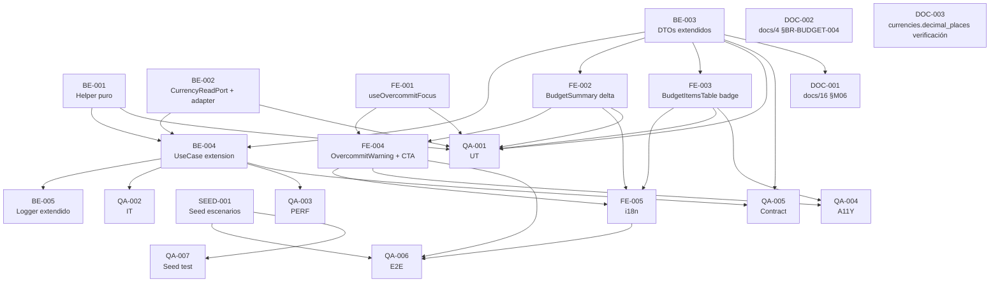

# Development Tasks — PB-P1-022 / US-038: Warning con delta y badges per-item

## 1. Metadata

| Field                                | Value                                                                                                              |
| ------------------------------------ | ------------------------------------------------------------------------------------------------------------------ |
| User Story ID                        | US-038                                                                                                             |
| Source User Story                    | `management/user-stories/US-038-budget-overcommitted-warning.md`                                                   |
| Source Technical Specification       | `management/technical-specs/P1/PB-P1-022/US-038-technical-spec.md`                                                  |
| Decision Resolution Artifact         | `management/user-stories/decision-resolutions/US-038-decision-resolution.md`                                       |
| Priority                             | P1                                                                                                                 |
| Backlog ID                           | PB-P1-022                                                                                                          |
| Backlog Title                        | Warning de overcommit del presupuesto                                                                              |
| Backlog Execution Order              | 40 (P0: 18 items + P1: 22 items)                                                                                   |
| User Story Position in Backlog Item  | 1 de 1                                                                                                              |
| Related User Stories in Backlog Item | US-038                                                                                                              |
| Epic                                 | EPIC-BUD-001 — Budget Management & Currency                                                                        |
| Backlog Item Dependencies            | PB-P1-020 (US-035 productor del summary, US-036 mutaciones que invalidan cache)                                    |
| Feature                              | Warning de sobrecompromiso (delta + badges per-item)                                                                |
| Module / Domain                      | Budget                                                                                                              |
| Backlog Alignment Status             | Found                                                                                                              |
| Task Breakdown Status                | Ready for Sprint Planning                                                                                            |
| Created Date                         | 2026-06-27                                                                                                          |
| Last Updated                         | 2026-06-27                                                                                                          |

---

## 2. Source Validation

| Source                          | Found | Used | Notes                                                                                              |
| ------------------------------- | ----- | ---- | -------------------------------------------------------------------------------------------------- |
| User Story                       | Yes   | Yes  | Approved with Minor Notes (2026-06-27).                                                            |
| Technical Specification          | Yes   | Yes  | `Ready for Task Breakdown`.                                                                         |
| Decision Resolution Artifact     | Yes   | Yes  | D1–D4 formalizadas.                                                                                |
| Product Backlog Prioritized      | Yes   | Yes  | `PB-P1-022`, posición 1 de 1.                                                                      |
| ADRs                             | No    | N/A  | Sin ADR nuevo.                                                                                     |

---

## 3. Backlog Execution Context

### Parent Backlog Item

`PB-P1-022 — Warning de overcommit del presupuesto` enriquece el contrato server-side de US-035 con delta + badges per-item + tolerancia adaptativa. Sin endpoint nuevo. Sin migraciones.

### Execution Order Rationale

US-038 va después de US-035 (productor) y US-036 (mutaciones que invalidan cache). PB-P1-022 ocupa la posición 40.

### Related User Stories in Same Backlog Item

| User Story                                  | Role in Backlog Item                                                            | Suggested Order |
| ------------------------------------------- | ------------------------------------------------------------------------------- | --------------- |
| US-038 — Warning + delta + badges per-item   | Extensión incremental del contrato server-side de US-035                         | 1               |

---

## 4. Task Breakdown Summary

| Area  | Number of Tasks | Notes                                                                                                                                                |
| ----- | --------------: | ---------------------------------------------------------------------------------------------------------------------------------------------------- |
| DB    | 0               | Sin migraciones.                                                                                                                                      |
| BE    | 5               | Helper puro, CurrencyReadPort + adapter, extensión DTOs, extensión UseCase, extensión logger.                                                          |
| API   | 0               | Cubierto por BE.                                                                                                                                      |
| SEC   | 0               | Reuso íntegro.                                                                                                                                        |
| OBS   | 0               | Cubierto por BE (extensión de `budget.viewed` + `currency.decimal_places.missing`).                                                                     |
| FE    | 5               | Hook focus, extensión BudgetSummary, extensión BudgetItemsTable, extensión OvercommitWarning con CTA, i18n.                                              |
| SEED  | 1               | Garantizar evento con overcommit + badge demoable; opcional currency CLP.                                                                              |
| QA    | 7               | UT, IT, PERF, A11Y, CONTRACT, E2E, SEED test.                                                                                                          |
| AI    | 0               | No aplica.                                                                                                                                            |
| OPS   | 0               | Sin cambios.                                                                                                                                          |
| DOC   | 3               | `docs/16 §M06`, `docs/4 §BR-BUDGET-004`, verificación `currencies.decimal_places`.                                                                      |

**Total: 21 tareas.**

---

## 5. Traceability Matrix

| Acceptance Criterion                                       | Technical Spec Section(s)                                              | Task IDs                                                                                                                            |
| ---------------------------------------------------------- | ---------------------------------------------------------------------- | ----------------------------------------------------------------------------------------------------------------------------------- |
| AC-01 Shape extendido                                       | §6, §7, §9                                                              | BE-001, BE-003, BE-004, QA-005                                                                                                       |
| AC-02 Tolerancia adaptativa                                 | §6, §7                                                                  | BE-001, BE-002, BE-004, QA-001, QA-002                                                                                               |
| AC-03 Badge per-item accesible                              | §8 (Components, A11Y)                                                   | FE-003, QA-004                                                                                                                       |
| AC-04 CTA "Editar items"                                    | §8 (Components, Hooks)                                                  | FE-001, FE-004, QA-006                                                                                                               |
| AC-05 Cache invalidation                                    | §6 (regresión)                                                          | QA-002, QA-006                                                                                                                       |
| AC-06 Performance                                           | §13 (PERF-01)                                                           | QA-003                                                                                                                               |
| AC-07 A11Y                                                  | §8, §13                                                                  | FE-002, FE-003, FE-004, QA-004                                                                                                       |
| EC-01..06                                                  | §6                                                                      | BE-001, BE-004, QA-001, QA-002                                                                                                       |
| VR-01..04                                                  | §7                                                                      | BE-001, BE-003, BE-004                                                                                                               |
| SEC-01                                                     | §12                                                                     | QA-002 (regresión)                                                                                                                   |
| Observability                                              | §14                                                                     | BE-005                                                                                                                               |
| Documentation Alignment                                    | §16                                                                     | DOC-001, DOC-002, DOC-003                                                                                                            |

---

## 6. Development Tasks

### TASK-PB-P1-022-US-038-BE-001 — Helper puro `calculateOvercommitFields`

| Field                     | Value                                                                          |
| ------------------------- | ------------------------------------------------------------------------------ |
| Area                      | Backend                                                                        |
| Type                      | Implementation                                                                 |
| Priority                  | Must                                                                           |
| Estimate                  | XS                                                                             |
| Depends On                | —                                                                              |
| Source AC(s)              | AC-01, AC-02, EC-01..06, VR-03                                                  |
| Technical Spec Section(s) | §7 (Helper Puro)                                                                |
| Backlog ID                | PB-P1-022                                                                      |
| User Story ID             | US-038                                                                         |
| Owner Role                | Backend                                                                        |
| Status                    | To Do                                                                          |

#### Objective

Encapsular el cálculo de `overcommitted_amount` y `over_committed` en una función pura sin dependencias.

#### Scope

##### Include

* `apps/api/src/modules/budget/domain/overcommit-calculator.ts`.
* Firma documentada en Tech Spec §7.
* Manejo de `tolerance = 1` (CLP/JPY) y boundaries.
* `Math.max(0, ...)` para garantizar `overcommitted_amount ≥ 0`.

##### Exclude

* No leer de BD desde el helper.
* No formatear con `Intl.NumberFormat` (es responsabilidad del frontend).

#### Acceptance Criteria Covered

AC-01, AC-02, EC-01..06, VR-03.

#### Definition of Done

- [ ] Función exportada.
- [ ] UT-01..04 verdes (QA-001).

---

### TASK-PB-P1-022-US-038-BE-002 — `CurrencyReadPort` + adapter en `modules/catalog`

| Field                     | Value                                                                          |
| ------------------------- | ------------------------------------------------------------------------------ |
| Area                      | Backend                                                                        |
| Type                      | Implementation                                                                 |
| Priority                  | Must                                                                           |
| Estimate                  | S                                                                              |
| Depends On                | —                                                                              |
| Source AC(s)              | AC-02, VR-02                                                                    |
| Technical Spec Section(s) | §5, §7                                                                          |
| Backlog ID                | PB-P1-022                                                                      |
| User Story ID             | US-038                                                                         |
| Owner Role                | Backend                                                                        |
| Status                    | To Do                                                                          |

#### Objective

Preservar hexagonalidad para lookup `Currency.decimal_places`.

#### Scope

##### Include

* `apps/api/src/modules/budget/ports/currency-read.port.ts` con `findByCode(code): Promise<{ code: string; decimal_places: number } | null>`.
* `apps/api/src/modules/catalog/adapters/currency-read.adapter.ts` (Prisma).
* DI wiring.

##### Exclude

* No exponer otras operaciones de Currency.

#### Acceptance Criteria Covered

AC-02, VR-02.

#### Definition of Done

- [ ] Port y adapter implementados.
- [ ] UT-06 verde (QA-001).

---

### TASK-PB-P1-022-US-038-BE-003 — Extender DTOs Zod (`BudgetSummaryDto` + `BudgetItemDto`)

| Field                     | Value                                                                          |
| ------------------------- | ------------------------------------------------------------------------------ |
| Area                      | Backend                                                                        |
| Type                      | Implementation                                                                 |
| Priority                  | Must                                                                           |
| Estimate                  | XS                                                                             |
| Depends On                | —                                                                              |
| Source AC(s)              | AC-01, VR-03                                                                    |
| Technical Spec Section(s) | §7 (DTOs), §9                                                                   |
| Backlog ID                | PB-P1-022                                                                      |
| User Story ID             | US-038                                                                         |
| Owner Role                | Backend                                                                        |
| Status                    | To Do                                                                          |

#### Objective

Forward-compat: agregar `overcommitted_amount` al summary, y `over_committed` + `overcommitted_amount` a `BudgetItemDto`, siempre presentes.

#### Scope

##### Include

* Edición de `apps/api/src/modules/budget/dto/budget-summary.dto.ts`.
* Edición de `apps/api/src/modules/budget/dto/budget-item.dto.ts`.
* Validación Zod `nonnegative()`.

##### Exclude

* No introducir campos opcionales (siempre presentes).

#### Acceptance Criteria Covered

AC-01, VR-03.

#### Definition of Done

- [ ] DTOs actualizados.
- [ ] UT-05 verde (QA-001).

---

### TASK-PB-P1-022-US-038-BE-004 — Extender `GetBudgetUseCase` con lookup currency + cálculo + composición

| Field                     | Value                                                                          |
| ------------------------- | ------------------------------------------------------------------------------ |
| Area                      | Backend                                                                        |
| Type                      | Implementation                                                                 |
| Priority                  | Must                                                                           |
| Estimate                  | S                                                                              |
| Depends On                | BE-001, BE-002, BE-003                                                          |
| Source AC(s)              | AC-01, AC-02, EC-01..06, VR-01, VR-02, VR-03                                    |
| Technical Spec Section(s) | §7 (Use Case extension)                                                          |
| Backlog ID                | PB-P1-022                                                                      |
| User Story ID             | US-038                                                                         |
| Owner Role                | Backend                                                                        |
| Status                    | To Do                                                                          |

#### Objective

Integrar el lookup de currency, el cálculo del helper y la composición del response extendido.

#### Scope

##### Include

* Edición de `apps/api/src/modules/budget/use-cases/get-budget.use-case.ts`.
* Invocación de `CurrencyReadPort.findByCode(event.currency_code)`.
* Fallback defensivo `decimal_places = 2` con `currency.decimal_places.missing` log warning.
* Composición de campos nuevos en summary e items.

##### Exclude

* No reescribir la lógica existente de US-035; solo añadir.

#### Acceptance Criteria Covered

AC-01, AC-02, EC-01..06, VR-01, VR-02, VR-03.

#### Definition of Done

- [ ] Use case actualizado.
- [ ] IT-01..06 verdes (QA-002).

---

### TASK-PB-P1-022-US-038-BE-005 — Extender logger `budget.viewed` + nuevo evento `currency.decimal_places.missing`

| Field                     | Value                                                                          |
| ------------------------- | ------------------------------------------------------------------------------ |
| Area                      | Backend                                                                        |
| Type                      | Implementation                                                                 |
| Priority                  | Must                                                                           |
| Estimate                  | XS                                                                             |
| Depends On                | BE-004                                                                          |
| Source AC(s)              | AC-01, AC-02                                                                    |
| Technical Spec Section(s) | §14 (Logs), §7 (Observability)                                                  |
| Backlog ID                | PB-P1-022                                                                      |
| User Story ID             | US-038                                                                         |
| Owner Role                | Backend                                                                        |
| Status                    | To Do                                                                          |

#### Objective

Enriquecer el logger sin introducir métricas nuevas.

#### Scope

##### Include

* Extender schema de `budget.viewed` con `overcommitted_amount` y `over_committed_items_count`.
* Añadir schema de `currency.decimal_places.missing` (warning).

##### Exclude

* No incluir PII.

#### Acceptance Criteria Covered

AC-01, AC-02.

#### Definition of Done

- [ ] Logs emitidos con shape validado.
- [ ] Snapshot test verde.

---

### TASK-PB-P1-022-US-038-FE-001 — Hook `useOvercommitFocus`

| Field                     | Value                                                                          |
| ------------------------- | ------------------------------------------------------------------------------ |
| Area                      | Frontend                                                                       |
| Type                      | Implementation                                                                 |
| Priority                  | Must                                                                           |
| Estimate                  | S                                                                              |
| Depends On                | —                                                                              |
| Source AC(s)              | AC-04                                                                          |
| Technical Spec Section(s) | §8 (Hooks / Helpers)                                                            |
| Backlog ID                | PB-P1-022                                                                      |
| User Story ID             | US-038                                                                         |
| Owner Role                | Frontend                                                                       |
| Status                    | To Do                                                                          |

#### Objective

Helper de navegación: scroll + focus a la primera fila `over_committed=true`.

#### Scope

##### Include

* `apps/web/hooks/useOvercommitFocus.ts`.
* Lookup por `[data-overcommit="true"]`; fallback `[data-budget-items-table]`.
* `scrollIntoView({ behavior: 'smooth' })` + `focus({ preventScroll: true })`.

##### Exclude

* No invocar APIs; solo manipula DOM.

#### Acceptance Criteria Covered

AC-04.

#### Definition of Done

- [ ] Hook implementado.
- [ ] UT-07, UT-08 verdes (QA-001).

---

### TASK-PB-P1-022-US-038-FE-002 — Extender `BudgetSummary` con render del delta

| Field                     | Value                                                                          |
| ------------------------- | ------------------------------------------------------------------------------ |
| Area                      | Frontend                                                                       |
| Type                      | Implementation                                                                 |
| Priority                  | Must                                                                           |
| Estimate                  | XS                                                                             |
| Depends On                | BE-003                                                                          |
| Source AC(s)              | AC-01, AC-07                                                                    |
| Technical Spec Section(s) | §8 (Components — BudgetSummary)                                                  |
| Backlog ID                | PB-P1-022                                                                      |
| User Story ID             | US-038                                                                         |
| Owner Role                | Frontend                                                                       |
| Status                    | To Do                                                                          |

#### Objective

Mostrar `overcommitted_amount` formateado con CLDR debajo del banner cuando `over_committed = true`.

#### Scope

##### Include

* Edición de `apps/web/components/events/budget/BudgetSummary.tsx`.
* `Intl.NumberFormat(locale, { style: 'currency', currency: summary.currency_code })`.

##### Exclude

* No recalcular `overcommitted_amount` (VR-01).

#### Acceptance Criteria Covered

AC-01, AC-07.

#### Definition of Done

- [ ] Componente actualizado.
- [ ] UT-10 verde (QA-001).

---

### TASK-PB-P1-022-US-038-FE-003 — Extender `BudgetItemsTable` con badge per-fila accesible

| Field                     | Value                                                                          |
| ------------------------- | ------------------------------------------------------------------------------ |
| Area                      | Frontend                                                                       |
| Type                      | Implementation                                                                 |
| Priority                  | Must                                                                           |
| Estimate                  | S                                                                              |
| Depends On                | BE-003                                                                          |
| Source AC(s)              | AC-03, AC-07                                                                    |
| Technical Spec Section(s) | §8 (Components — BudgetItemsTable)                                                |
| Backlog ID                | PB-P1-022                                                                      |
| User Story ID             | US-038                                                                         |
| Owner Role                | Frontend                                                                       |
| Status                    | To Do                                                                          |

#### Objective

Renderizar badge cuando `item.over_committed = true` con `aria-label` localizado interpolando el delta. Añadir `data-overcommit="true"` y `id` a las filas correspondientes.

#### Scope

##### Include

* Edición de `apps/web/components/events/budget/BudgetItemsTable.tsx`.
* Badge con `role="img"` o `role="status"`.
* `aria-label` localizado con `{amount}` y `{currency}`.

##### Exclude

* No introducir CTA en el badge.

#### Acceptance Criteria Covered

AC-03, AC-07.

#### Definition of Done

- [ ] Tabla actualizada.
- [ ] UT-09 + A11Y-01 verdes (QA-001/QA-004).

---

### TASK-PB-P1-022-US-038-FE-004 — Extender `OvercommitWarning` con CTA "Editar items"

| Field                     | Value                                                                          |
| ------------------------- | ------------------------------------------------------------------------------ |
| Area                      | Frontend                                                                       |
| Type                      | Implementation                                                                 |
| Priority                  | Must                                                                           |
| Estimate                  | S                                                                              |
| Depends On                | FE-001, FE-002                                                                  |
| Source AC(s)              | AC-04, AC-07                                                                    |
| Technical Spec Section(s) | §8 (Components — OvercommitWarning)                                              |
| Backlog ID                | PB-P1-022                                                                      |
| User Story ID             | US-038                                                                         |
| Owner Role                | Frontend                                                                       |
| Status                    | To Do                                                                          |

#### Objective

Añadir el botón "Editar items" al banner existente, invocando `useOvercommitFocus.focusFirstOvercommitItem`.

#### Scope

##### Include

* Edición de `apps/web/components/events/budget/OvercommitWarning.tsx`.
* Prop `eventId` (necesaria para el hook).
* Botón accesible con foco visible y contraste AA.

##### Exclude

* No modificar la lógica de visibilidad del banner (heredada de US-035).

#### Acceptance Criteria Covered

AC-04, AC-07.

#### Definition of Done

- [ ] CTA operativo.
- [ ] A11Y-02 verde (QA-004).

---

### TASK-PB-P1-022-US-038-FE-005 — Añadir claves i18n `budget.overcommit.*` en 4 locales

| Field                     | Value                                                                          |
| ------------------------- | ------------------------------------------------------------------------------ |
| Area                      | Frontend                                                                       |
| Type                      | Implementation                                                                 |
| Priority                  | Must                                                                           |
| Estimate                  | XS                                                                             |
| Depends On                | FE-002, FE-003, FE-004                                                          |
| Source AC(s)              | AC-03, AC-04, AC-07                                                              |
| Technical Spec Section(s) | §8 (i18n)                                                                       |
| Backlog ID                | PB-P1-022                                                                      |
| User Story ID             | US-038                                                                         |
| Owner Role                | Frontend                                                                       |
| Status                    | To Do                                                                          |

#### Objective

Catálogo de strings en `es-LATAM`, `es-ES`, `pt`, `en`.

#### Scope

##### Include

* `messages/<locale>.json` con `budget.overcommit.delta_label`, `budget.overcommit.item_badge`, `budget.overcommit.item_aria_label`, `budget.overcommit.cta_edit_items`.

##### Exclude

* No introducir nuevos locales.

#### Acceptance Criteria Covered

AC-03, AC-04, AC-07.

#### Definition of Done

- [ ] 4 archivos actualizados.

---

### TASK-PB-P1-022-US-038-SEED-001 — Garantizar seed con escenarios de overcommit + CLP opcional

| Field                     | Value                                                                          |
| ------------------------- | ------------------------------------------------------------------------------ |
| Area                      | Seed / Demo Data                                                               |
| Type                      | Setup                                                                          |
| Priority                  | Should                                                                         |
| Estimate                  | S                                                                              |
| Depends On                | —                                                                              |
| Source AC(s)              | AC-01, AC-03                                                                    |
| Technical Spec Section(s) | §15                                                                              |
| Backlog ID                | PB-P1-022                                                                      |
| User Story ID             | US-038                                                                         |
| Owner Role                | Backend                                                                        |
| Status                    | To Do                                                                          |

#### Objective

Asegurar que el seed contiene:
- 1 evento demo con `summary.over_committed = true` Y al menos un item con `committed > planned + tolerance`.
- Opcional: 1 evento con `currency_code = 'CLP'` para validar tolerance = 1.

#### Scope

##### Include

* Auditoría y ajustes mínimos.

##### Exclude

* No introducir generadores complejos.

#### Acceptance Criteria Covered

AC-01, AC-03.

#### Definition of Done

- [ ] Seed verificado/ajustado.

---

### TASK-PB-P1-022-US-038-QA-001 — Tests unitarios (helper, fallback, DTOs, hook focus, componentes)

| Field                     | Value                                                                          |
| ------------------------- | ------------------------------------------------------------------------------ |
| Area                      | QA / Testing                                                                   |
| Type                      | Test                                                                           |
| Priority                  | Must                                                                           |
| Estimate                  | M                                                                              |
| Depends On                | BE-001, BE-002, BE-003, FE-001, FE-002, FE-003                                  |
| Source AC(s)              | AC-01, AC-02, AC-03, AC-04, AC-07, EC-01..06                                     |
| Technical Spec Section(s) | §13 (Unit Tests UT-01..10)                                                      |
| Backlog ID                | PB-P1-022                                                                      |
| User Story ID             | US-038                                                                         |
| Owner Role                | QA                                                                             |
| Status                    | To Do                                                                          |

#### Objective

Cobertura UT de helper puro, lookup currency, fallback defensivo, hook focus, render del badge.

#### Scope

##### Include

* UT-01..06 (backend).
* UT-07..10 (frontend).

#### Acceptance Criteria Covered

AC-01, AC-02, AC-03, AC-04, AC-07, EC-01..06.

#### Definition of Done

- [ ] 10 tests verdes.

---

### TASK-PB-P1-022-US-038-QA-002 — Tests integration (USD, CLP, currency desconocida, planned=0, cancelled/completed, regresión forward-compat)

| Field                     | Value                                                                          |
| ------------------------- | ------------------------------------------------------------------------------ |
| Area                      | QA / Testing                                                                   |
| Type                      | Test                                                                           |
| Priority                  | Must                                                                           |
| Estimate                  | M                                                                              |
| Depends On                | BE-004                                                                          |
| Source AC(s)              | AC-01, AC-02, AC-05, EC-01..06, VR-01..04                                       |
| Technical Spec Section(s) | §13 (Integration Tests IT-01..07)                                               |
| Backlog ID                | PB-P1-022                                                                      |
| User Story ID             | US-038                                                                         |
| Owner Role                | QA                                                                             |
| Status                    | To Do                                                                          |

#### Objective

Cobertura integration con Supertest contra el endpoint de US-035 extendido.

#### Scope

##### Include

* IT-01..07 (incluida regresión forward-compat IT-07).

#### Acceptance Criteria Covered

AC-01, AC-02, AC-05, EC-01..06, VR-01..04.

#### Definition of Done

- [ ] 7 IT verdes.

---

### TASK-PB-P1-022-US-038-QA-003 — Test de performance PERF-01 (sin regresión vs US-035)

| Field                     | Value                                                                          |
| ------------------------- | ------------------------------------------------------------------------------ |
| Area                      | QA / Testing                                                                   |
| Type                      | Test                                                                           |
| Priority                  | Must                                                                           |
| Estimate                  | S                                                                              |
| Depends On                | BE-004                                                                          |
| Source AC(s)              | AC-06                                                                          |
| Technical Spec Section(s) | §13 (Performance Tests PERF-01)                                                 |
| Backlog ID                | PB-P1-022                                                                      |
| User Story ID             | US-038                                                                         |
| Owner Role                | QA                                                                             |
| Status                    | To Do                                                                          |

#### Objective

Validar que el cálculo extendido no degrada P95 vs US-035 (mantiene < 1.5 s).

#### Scope

##### Include

* Suite con 30 items + 1 lookup currency.
* Comparativa baseline (US-035) vs extendido.

#### Acceptance Criteria Covered

AC-06.

#### Definition of Done

- [ ] P95 < 1.5 s sin regresión > 5% vs baseline.

---

### TASK-PB-P1-022-US-038-QA-004 — Tests A11Y de badge y CTA

| Field                     | Value                                                                          |
| ------------------------- | ------------------------------------------------------------------------------ |
| Area                      | QA / Testing                                                                   |
| Type                      | Test                                                                           |
| Priority                  | Must                                                                           |
| Estimate                  | S                                                                              |
| Depends On                | FE-003, FE-004                                                                  |
| Source AC(s)              | AC-03, AC-04, AC-07                                                              |
| Technical Spec Section(s) | §13 (Accessibility Tests A11Y-01..03)                                           |
| Backlog ID                | PB-P1-022                                                                      |
| User Story ID             | US-038                                                                         |
| Owner Role                | QA                                                                             |
| Status                    | To Do                                                                          |

#### Objective

Validar A11Y de badge per-item y CTA.

#### Scope

##### Include

* A11Y-01..03 con jest-axe y @testing-library.

#### Acceptance Criteria Covered

AC-03, AC-04, AC-07.

#### Definition of Done

- [ ] Tests verdes sin violaciones.

---

### TASK-PB-P1-022-US-038-QA-005 — Contract test CONTRACT-01 (forward-compat + shape extendido)

| Field                     | Value                                                                          |
| ------------------------- | ------------------------------------------------------------------------------ |
| Area                      | QA / Testing                                                                   |
| Type                      | Test                                                                           |
| Priority                  | Should                                                                         |
| Estimate                  | S                                                                              |
| Depends On                | BE-003, BE-004                                                                  |
| Source AC(s)              | AC-01                                                                          |
| Technical Spec Section(s) | §13 (Contract Tests CONTRACT-01), §16                                          |
| Backlog ID                | PB-P1-022                                                                      |
| User Story ID             | US-038                                                                         |
| Owner Role                | QA                                                                             |
| Status                    | To Do                                                                          |

#### Objective

Validar shape extendido + forward-compat: clientes que solo consumen campos de US-035 no se rompen.

#### Scope

##### Include

* Snapshot test del response real vs OpenAPI / snapshot interno.
* Test de parseo con DTO de US-035 ignorando campos nuevos.

#### Acceptance Criteria Covered

AC-01.

#### Definition of Done

- [ ] Contract test verde.

---

### TASK-PB-P1-022-US-038-QA-006 — E2E Playwright (banner+delta, badge, CTA scroll/focus, refresh tras mutación)

| Field                     | Value                                                                          |
| ------------------------- | ------------------------------------------------------------------------------ |
| Area                      | QA / Testing                                                                   |
| Type                      | Test                                                                           |
| Priority                  | Must                                                                           |
| Estimate                  | M                                                                              |
| Depends On                | FE-004, FE-005, SEED-001                                                        |
| Source AC(s)              | AC-01, AC-03, AC-04, AC-05, AC-07                                                |
| Technical Spec Section(s) | §13 (E2E Tests E2E-01..04)                                                      |
| Backlog ID                | PB-P1-022                                                                      |
| User Story ID             | US-038                                                                         |
| Owner Role                | QA                                                                             |
| Status                    | To Do                                                                          |

#### Objective

Validar el ciclo demoable end-to-end.

#### Scope

##### Include

* E2E-01..04 contra seed.

#### Acceptance Criteria Covered

AC-01, AC-03, AC-04, AC-05, AC-07.

#### Definition of Done

- [ ] 4 E2E verdes.

---

### TASK-PB-P1-022-US-038-QA-007 — Seed test

| Field                     | Value                                                                          |
| ------------------------- | ------------------------------------------------------------------------------ |
| Area                      | QA / Testing                                                                   |
| Type                      | Test                                                                           |
| Priority                  | Should                                                                         |
| Estimate                  | XS                                                                             |
| Depends On                | SEED-001                                                                          |
| Source AC(s)              | AC-01, AC-03                                                                    |
| Technical Spec Section(s) | §15                                                                              |
| Backlog ID                | PB-P1-022                                                                      |
| User Story ID             | US-038                                                                         |
| Owner Role                | QA                                                                             |
| Status                    | To Do                                                                          |

#### Objective

Validar que el seed contiene los escenarios canónicos.

#### Scope

##### Include

* Vitest con asserts sobre el seed cargado.

#### Acceptance Criteria Covered

AC-01, AC-03.

#### Definition of Done

- [ ] Test verde.

---

### TASK-PB-P1-022-US-038-DOC-001 — Actualizar `docs/16 §M06` con shape extendido

| Field                     | Value                                                                          |
| ------------------------- | ------------------------------------------------------------------------------ |
| Area                      | Documentation / Traceability                                                   |
| Type                      | Documentation                                                                  |
| Priority                  | Should                                                                         |
| Estimate                  | XS                                                                             |
| Depends On                | BE-003                                                                          |
| Source AC(s)              | AC-01                                                                          |
| Technical Spec Section(s) | §16                                                                              |
| Backlog ID                | PB-P1-022                                                                      |
| User Story ID             | US-038                                                                         |
| Owner Role                | Tech Lead                                                                      |
| Status                    | To Do                                                                          |

#### Objective

Reflejar los tres campos nuevos del response en M06.

#### Scope

##### Include

* Edición de `docs/16 §M06`.
* Handoff a US-098 (snapshot OpenAPI).

#### Acceptance Criteria Covered

AC-01.

#### Definition of Done

- [ ] `docs/16` actualizado.

---

### TASK-PB-P1-022-US-038-DOC-002 — Nota interpretativa en `docs/4 §BR-BUDGET-004`

| Field                     | Value                                                                          |
| ------------------------- | ------------------------------------------------------------------------------ |
| Area                      | Documentation / Traceability                                                   |
| Type                      | Documentation                                                                  |
| Priority                  | Should                                                                         |
| Estimate                  | XS                                                                             |
| Depends On                | —                                                                              |
| Source AC(s)              | AC-02                                                                          |
| Technical Spec Section(s) | §16                                                                              |
| Backlog ID                | PB-P1-022                                                                      |
| User Story ID             | US-038                                                                         |
| Owner Role                | Tech Lead                                                                      |
| Status                    | To Do                                                                          |

#### Objective

Documentar la tolerancia adaptativa por `currency.decimal_places` (D3).

#### Scope

##### Include

* Edición de `docs/4 §BR-BUDGET-004`.

#### Acceptance Criteria Covered

AC-02.

#### Definition of Done

- [ ] Nota merge-eada.

---

### TASK-PB-P1-022-US-038-DOC-003 — Verificar `currencies.decimal_places` en `docs/6` + PB-P0-001

| Field                     | Value                                                                          |
| ------------------------- | ------------------------------------------------------------------------------ |
| Area                      | Documentation / Traceability                                                   |
| Type                      | Documentation                                                                  |
| Priority                  | Should                                                                         |
| Estimate                  | XS                                                                             |
| Depends On                | —                                                                              |
| Source AC(s)              | AC-02                                                                          |
| Technical Spec Section(s) | §16                                                                              |
| Backlog ID                | PB-P1-022                                                                      |
| User Story ID             | US-038                                                                         |
| Owner Role                | Tech Lead                                                                      |
| Status                    | To Do                                                                          |

#### Objective

Confirmar que `Currency.decimal_places` está documentado y presente en el schema; si falta, abrir follow-up.

#### Scope

##### Include

* Revisión de `docs/6 §Currency` y `prisma schema`.
* Si falta, abrir issue con migración mínima.

#### Acceptance Criteria Covered

AC-02.

#### Definition of Done

- [ ] Verificación documentada; issue abierto si aplica.

---

## 7. Required QA Tasks

| Task ID                                          | Test Type     | Purpose                                                                                |
| ------------------------------------------------ | ------------- | -------------------------------------------------------------------------------------- |
| TASK-PB-P1-022-US-038-QA-001                      | Unit          | Helper, lookup, fallback, DTOs, hook focus, badge render.                                |
| TASK-PB-P1-022-US-038-QA-002                      | Integration   | USD/CLP/desconocida, planned=0, cancelled/completed, regresión forward-compat.          |
| TASK-PB-P1-022-US-038-QA-003                      | Performance   | P95 < 1.5 s sin regresión vs US-035.                                                    |
| TASK-PB-P1-022-US-038-QA-004                      | Accessibility | Badge + CTA.                                                                            |
| TASK-PB-P1-022-US-038-QA-005                      | Contract      | Shape extendido + forward-compat.                                                       |
| TASK-PB-P1-022-US-038-QA-006                      | E2E           | Banner+delta, badge, CTA scroll/focus, refresh tras mutación.                            |
| TASK-PB-P1-022-US-038-QA-007                      | Seed / Demo   | Cobertura de escenarios canónicos.                                                      |

---

## 8. Required Security Tasks

No aplica como tareas dedicadas; reuso íntegro de US-035.

| Task ID                                          | Security Concern                                | Purpose                                                              |
| ------------------------------------------------ | ----------------------------------------------- | -------------------------------------------------------------------- |
| TASK-PB-P1-022-US-038-QA-002                      | 401/403/404 (heredados)                          | Cobertura mínima vía regresión integration.                          |

---

## 9. Required Seed / Demo Tasks

| Task ID                                          | Seed/Demo Concern                          | Purpose                                                              |
| ------------------------------------------------ | ------------------------------------------ | -------------------------------------------------------------------- |
| TASK-PB-P1-022-US-038-SEED-001                    | Escenarios overcommit + opcional CLP        | Soportar demo end-to-end.                                            |
| TASK-PB-P1-022-US-038-QA-007                      | Validación de seed                          | Auditoría automatizada.                                              |

---

## 10. Observability / Audit Tasks

| Task ID                                          | Concern                                                | Purpose                                                                     |
| ------------------------------------------------ | ------------------------------------------------------ | --------------------------------------------------------------------------- |
| TASK-PB-P1-022-US-038-BE-005                      | Extensión de `budget.viewed` + `currency.decimal_places.missing` | Auditoría enriquecida sin nuevas métricas.                                  |

---

## 11. Documentation / Traceability Tasks

| Task ID                                          | Document / Artifact                                | Purpose                                                                           |
| ------------------------------------------------ | -------------------------------------------------- | --------------------------------------------------------------------------------- |
| TASK-PB-P1-022-US-038-DOC-001                     | `docs/16 §M06`                                      | Shape extendido del response.                                                      |
| TASK-PB-P1-022-US-038-DOC-002                     | `docs/4 §BR-BUDGET-004`                              | Nota interpretativa tolerancia adaptativa (D3).                                    |
| TASK-PB-P1-022-US-038-DOC-003                     | `docs/6 §Currency` + PB-P0-001                       | Verificar `decimal_places` en dominio y schema.                                    |

---

## 12. Dependency Graph

---

## 13. Suggested Implementation Order

### Phase 1 — Foundation

* BE-001 (Helper puro).
* BE-002 (Port + adapter).
* BE-003 (DTOs).
* FE-001 (Hook focus).
* SEED-001 (Seed escenarios).

### Phase 2 — Core Implementation

* BE-004 (UseCase extension).
* BE-005 (Logger).
* FE-002 (BudgetSummary).
* FE-003 (BudgetItemsTable).
* FE-004 (OvercommitWarning + CTA).
* FE-005 (i18n).

### Phase 3 — Validation / Security / QA

* QA-001 (UT).
* QA-002 (IT).
* QA-003 (PERF).
* QA-004 (A11Y).
* QA-005 (Contract).
* QA-006 (E2E).
* QA-007 (Seed test).

### Phase 4 — Documentation / Review

* DOC-001, DOC-002, DOC-003.

---

## 14. Risks & Mitigations

| Risk                                                                                                          | Impact                                          | Mitigation                                                                                                                                  | Related Task                                |
| ------------------------------------------------------------------------------------------------------------- | ----------------------------------------------- | ------------------------------------------------------------------------------------------------------------------------------------------- | ------------------------------------------- |
| `currencies.decimal_places` no existe en el schema.                                                            | Fallback defensivo aplica siempre; pierde precisión para CLP/JPY. | DOC-003 verifica; si falta, abrir migración menor en US futura. US-038 sigue funcional con fallback.                                        | DOC-003, BE-004                              |
| Forward-compat puede romper clientes existentes.                                                              | Cliente desactualizado falla.                   | Campos siempre presentes; CONTRACT-01 valida.                                                                                                | BE-003, QA-005                                |
| `Math.pow(10, -decimal_places)` con inexactitud float.                                                          | Tolerancia ligeramente off.                     | Usar `Number(...).toFixed(decimal_places)` o lookup table en BE-001.                                                                        | BE-001                                       |
| Focus management falla en contenedores con scroll propio.                                                      | UX confuso.                                     | E2E-03 valida.                                                                                                                              | FE-001, QA-006                                |
| Documentation Alignment Required no se ejecuta.                                                                | Documentación divergente.                       | DOC-01..03 explícitos (Should, no bloqueantes).                                                                                              | DOC-001, DOC-002, DOC-003                     |

---

## 15. Out of Scope Confirmation

* Endpoint nuevo.
* Persistencia del flag/delta en BD.
* Cálculo client-side.
* Cache server-side adicional.
* Métricas Prometheus nuevas.
* Migraciones de schema.

---

## 16. Readiness for Sprint Planning

| Check                                                                | Status |
| -------------------------------------------------------------------- | ------ |
| Product Backlog mapping found                                        | Pass   |
| Every AC maps to tasks                                               | Pass   |
| Technical Spec used when available                                   | Pass   |
| QA tasks included                                                    | Pass   |
| Security tasks included if applicable                                | Pass (via QA-002 regresión) |
| Seed/demo tasks included if applicable                               | Pass (SEED-001 + QA-007) |
| Observability tasks included if applicable                           | Pass (BE-005) |
| Documentation tasks included if applicable                           | Pass   |
| Task dependencies clear                                              | Pass   |
| Tasks small enough                                                   | Pass   |
| Ready for Sprint Planning                                            | Yes    |

---

## 17. Final Recommendation

`Ready for Sprint Planning`

US-038 desglosa en 21 tareas atómicas, ordenadas por dependencia técnica y trazables a las 7 AC + 6 EC documentados. La extensión incremental se hace en el `GetBudgetUseCase` (US-035) con un helper puro testeable + un port hexagonal para `Currency.decimal_places` con fallback defensivo. Frontend extiende los tres componentes existentes de US-035 (`BudgetSummary`, `BudgetItemsTable`, `OvercommitWarning`) sin breaking changes. Las 4 decisiones (D1–D4) están materializadas. Las 3 Documentation Alignment Required son Should no bloqueantes. Sin migraciones, sin endpoints nuevos, sin breaking changes (forward-compat verificado por contract test). Próximo paso: Sprint Planning de PB-P1-022 cerrando la trilogía Budget: vista (US-035) + CRUD (US-036) + warning enriquecido (US-038), con IA (US-037) y sync booking (US-039) como flujos transversales que disparan cambios en el estado del warning.
