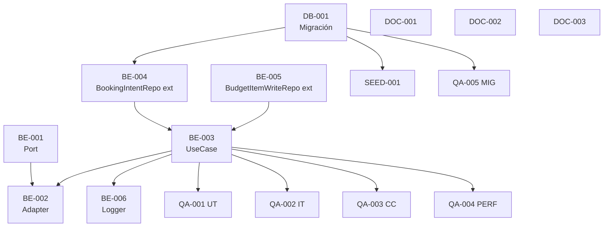

# Development Tasks — PB-P1-023 / US-039: Sync atómico de `BudgetItem.committed` por BookingIntent

## 1. Metadata

| Field                                | Value                                                                                                              |
| ------------------------------------ | ------------------------------------------------------------------------------------------------------------------ |
| User Story ID                        | US-039                                                                                                             |
| Source User Story                    | `management/user-stories/US-039-committed-updated-on-booking-confirm.md`                                           |
| Source Technical Specification       | `management/technical-specs/P1/PB-P1-023/US-039-technical-spec.md`                                                  |
| Decision Resolution Artifact         | `management/user-stories/decision-resolutions/US-039-decision-resolution.md`                                       |
| Priority                             | P1                                                                                                                 |
| Backlog ID                           | PB-P1-023                                                                                                          |
| Backlog Title                        | Sync atómico del committed por BookingIntent                                                                      |
| Backlog Execution Order              | 41                                                                                                                |
| User Story Position in Backlog Item  | 1 de 1                                                                                                              |
| Related User Stories in Backlog Item | US-039                                                                                                              |
| Epic                                 | EPIC-BUD-001                                                                                                        |
| Backlog Item Dependencies            | PB-P1-020 (US-035/US-036), PB-P1-022 (US-038)                                                                       |
| Feature                              | Sync committed por BookingIntent                                                                                    |
| Module / Domain                      | Budget × Booking                                                                                                    |
| Backlog Alignment Status             | Found                                                                                                              |
| Task Breakdown Status                | Ready for Sprint Planning                                                                                            |
| Created Date                         | 2026-06-27                                                                                                          |
| Last Updated                         | 2026-06-27                                                                                                          |

---

## 2. Source Validation

| Source                          | Found | Used | Notes                                  |
| ------------------------------- | ----- | ---- | -------------------------------------- |
| User Story                       | Yes   | Yes  | Approved with Minor Notes.             |
| Technical Specification          | Yes   | Yes  | Ready for Task Breakdown.              |
| Decision Resolution              | Yes   | Yes  | D1–D4.                                 |
| Product Backlog Prioritized      | Yes   | Yes  | PB-P1-023.                             |
| ADRs                             | No    | N/A  | Sin ADR nuevo.                         |

---

## 3. Backlog Execution Context

PB-P1-023 cierra el ciclo Budget × Booking con un handler hexagonal. Sin frontend. Sin endpoint público. Migración menor en `booking_intents`.

---

## 4. Task Breakdown Summary

| Area  | Number of Tasks | Notes                                                                                  |
| ----- | --------------: | -------------------------------------------------------------------------------------- |
| DB    | 1               | Migración menor `add_committed_synced_to_booking_intents`.                              |
| BE    | 6               | Port, adapter, use case, repository extensions (×2), logger.                            |
| API   | 0               | N/A.                                                                                    |
| SEC   | 0               | Heredado.                                                                                |
| OBS   | 0               | Cubierto en BE.                                                                          |
| FE    | 0               | Sin cambios.                                                                            |
| SEED  | 1               | Confirmed intent con sync coherente.                                                   |
| QA    | 5               | UT, IT, CC, PERF, MIG.                                                                  |
| AI    | 0               | No aplica.                                                                              |
| OPS   | 0               | Sin cambios.                                                                            |
| DOC   | 3               | `docs/6`, `docs/16 §M07`, `docs/4 §BR-BOOKING-008`.                                       |

**Total: 16 tareas.**

---

## 5. Traceability Matrix

| AC                                       | Tech Spec Section(s)                          | Task IDs                                          |
| ---------------------------------------- | --------------------------------------------- | ------------------------------------------------- |
| AC-01 Apply increment                     | §6, §7                                         | DB-001, BE-001..006, QA-001, QA-002                |
| AC-02 Revert decrement                    | §6, §7                                         | BE-003, BE-006, QA-001, QA-002                     |
| AC-03 Idempotencia                       | §7                                             | BE-003, QA-001, QA-002                             |
| AC-04 Auto-create                        | §7                                             | BE-003, BE-005, QA-001, QA-002                     |
| AC-05 Currency mismatch                  | §7                                             | BE-003, QA-001, QA-002                             |
| AC-06 Monto 0                             | §7                                             | BE-003, QA-001                                     |
| AC-07 Cache invalidation                 | §6 (regresión upstream)                       | N/A (US futura)                                    |
| AC-08 Performance                        | §13 (PERF)                                     | QA-004                                             |
| EC-01..08                               | §6                                             | BE-003, QA-002                                     |
| VR-01..05                               | §7                                             | BE-003                                             |
| SEC-01..05                              | §12                                            | BE-003                                             |
| Observability                            | §14                                            | BE-006                                             |
| Documentation Alignment                  | §16                                            | DOC-001..003                                       |

---

## 6. Development Tasks

### TASK-PB-P1-023-US-039-DB-001 — Migración menor `add_committed_synced_to_booking_intents`

| Field | Value |
|---|---|
| Area | DB | Type | Setup | Priority | Must | Estimate | XS |
| Depends On | — | Source AC(s) | AC-01, AC-03 |
| Tech Spec Section(s) | §7 (Migrations), §10 |
| Owner Role | Backend | Status | To Do |

#### Objective
Añadir `committed_synced_at: timestamp NULL` y `committed_synced_amount: decimal(18,2) NULL` a `booking_intents`. Si PB-P0-001 ya los entrega, esta tarea valida la presencia y se cierra sin migración.

#### Definition of Done
- [ ] Migración aplicada y `prisma migrate` reproducible.
- [ ] Schema Prisma actualizado.
- [ ] MIG-01 (QA-005) verde.

---

### TASK-PB-P1-023-US-039-BE-001 — `BudgetCommittedSyncPort` en `modules/booking`

| Field | Value |
|---|---|
| Area | BE | Type | Implementation | Priority | Must | Estimate | XS |
| Depends On | — | Source AC(s) | AC-01, AC-02 |
| Tech Spec Section(s) | §5, §7 (Ports/Adapters) |

#### Scope
* `modules/booking/ports/budget-committed-sync.port.ts` con la interfaz `applyOnConfirm`/`revertOnCancel`.

#### Definition of Done
- [ ] Interface tipado.

---

### TASK-PB-P1-023-US-039-BE-002 — Adapter `BudgetCommittedSyncAdapter` en `modules/budget`

| Field | Value |
|---|---|
| Area | BE | Type | Implementation | Priority | Must | Estimate | XS |
| Depends On | BE-001, BE-003 | Source AC(s) | AC-01, AC-02 |
| Tech Spec Section(s) | §5, §7 |

#### Scope
* `modules/budget/adapters/budget-committed-sync.adapter.ts` que implementa el port y delega al use case (BE-003).

#### Definition of Done
- [ ] Adapter wired via DI.

---

### TASK-PB-P1-023-US-039-BE-003 — `UpdateCommittedFromBookingIntentUseCase` (`applyOnConfirm` + `revertOnCancel`)

| Field | Value |
|---|---|
| Area | BE | Type | Implementation | Priority | Must | Estimate | L |
| Depends On | DB-001, BE-004, BE-005 | Source AC(s) | AC-01..06, EC-01..08, VR-01..05 |
| Tech Spec Section(s) | §7 (Use Cases) |

#### Scope
* `modules/budget/use-cases/update-committed-from-booking-intent.use-case.ts`.
* Secuencia documentada en Tech Spec §7 (apply/revert).
* Errores tipados (`BookingIntentNotFoundError`, `CurrencyMismatchError`).

#### Definition of Done
- [ ] Use case operativo.
- [ ] UT-01..07 verdes (QA-001).
- [ ] IT-01..08 verdes (QA-002).

---

### TASK-PB-P1-023-US-039-BE-004 — Extender `BookingIntentRepository` con `findByIdForUpdate`, `markCommittedSynced`, `clearCommittedSync`

| Field | Value |
|---|---|
| Area | BE | Type | Implementation | Priority | Must | Estimate | S |
| Depends On | DB-001 | Source AC(s) | AC-01, AC-02, AC-03 |
| Tech Spec Section(s) | §7 (Repositories) |

#### Scope
* `SELECT FOR UPDATE` en `findByIdForUpdate`.
* `markCommittedSynced({ id, amount, tx })`.
* `clearCommittedSync({ id, tx })`.

#### Definition of Done
- [ ] Métodos implementados.
- [ ] IT verdes (QA-002).

---

### TASK-PB-P1-023-US-039-BE-005 — Extender `BudgetItemWriteRepository` con `findActiveBy`, `incrementCommittedBy`, `decrementCommittedBy`, `create(tx)`

| Field | Value |
|---|---|
| Area | BE | Type | Implementation | Priority | Must | Estimate | S |
| Depends On | — | Source AC(s) | AC-01, AC-02, AC-04 |
| Tech Spec Section(s) | §7 (Repositories) |

#### Scope
* `findActiveBy({ budgetId, serviceCategoryId, tx })`.
* `incrementCommittedBy` y `decrementCommittedBy` con `SELECT FOR UPDATE`.
* Overload `create({ ..., tx })` (D2).

#### Definition of Done
- [ ] Métodos implementados.
- [ ] IT-02, IT-07 (auto-create + soft-delete preservado) verdes (QA-002).

---

### TASK-PB-P1-023-US-039-BE-006 — Logger estructurado `budget.committed.synced` + eventos auxiliares

| Field | Value |
|---|---|
| Area | BE | Type | Implementation | Priority | Must | Estimate | XS |
| Depends On | BE-003 | Source AC(s) | AC-01, AC-02, SEC-03 |
| Tech Spec Section(s) | §14 |

#### Scope
* `apps/api/src/shared/logging/budget-sync-events.ts` con schemas para los 6 eventos documentados.

#### Definition of Done
- [ ] Logs emitidos con shape validado.
- [ ] Snapshot test verde.

---

### TASK-PB-P1-023-US-039-SEED-001 — Garantizar seed con `confirmed_intent` sincronizado + auto-create demoable

| Field | Value |
|---|---|
| Area | SEED | Type | Setup | Priority | Should | Estimate | S |
| Depends On | DB-001 | Source AC(s) | AC-01, AC-04 |
| Tech Spec Section(s) | §15 |

#### Scope
* Al menos un `BookingIntent.confirmed_intent` con `committed_synced_at` set y BudgetItem reflejándolo.
* Recomendado: un escenario auto-created.

#### Definition of Done
- [ ] Seed verificado.

---

### TASK-PB-P1-023-US-039-QA-001 — Tests unitarios (use case)

| Field | Value |
|---|---|
| Area | QA | Type | Test | Priority | Must | Estimate | M |
| Depends On | BE-003, BE-004, BE-005 | Source AC(s) | AC-01..06, EC-01..08 |
| Tech Spec Section(s) | §13 (UT-01..07) |

#### Scope
UT-01..07 (backend).

#### Definition of Done
- [ ] 7 tests verdes.

---

### TASK-PB-P1-023-US-039-QA-002 — Integration tests (apply, revert, idempotencia, currency, auto-create, escenarios complejos)

| Field | Value |
|---|---|
| Area | QA | Type | Test | Priority | Must | Estimate | L |
| Depends On | BE-003, BE-004, BE-005 | Source AC(s) | AC-01..05, EC-01..08, VR-01..05 |
| Tech Spec Section(s) | §13 (IT-01..08) |

#### Scope
IT-01..08.

#### Definition of Done
- [ ] 8 IT verdes en CI con DB real (Prisma test container).

---

### TASK-PB-P1-023-US-039-QA-003 — Concurrency tests CC-01..03

| Field | Value |
|---|---|
| Area | QA | Type | Test | Priority | Must | Estimate | M |
| Depends On | BE-003, BE-004, BE-005 | Source AC(s) | EC-02 |
| Tech Spec Section(s) | §13 (CC) |

#### Scope
* CC-01: doble apply paralelo.
* CC-02: apply en distintos intents misma categoría.
* CC-03: apply + revert simultáneos.

#### Definition of Done
- [ ] 3 CC verdes; sin double-count detectado.

---

### TASK-PB-P1-023-US-039-QA-004 — Performance test PERF-01 (latencia handler) + PERF-02 (endpoint upstream)

| Field | Value |
|---|---|
| Area | QA | Type | Test | Priority | Must | Estimate | S |
| Depends On | BE-003 | Source AC(s) | AC-08 |
| Tech Spec Section(s) | §13 (PERF) |

#### Scope
* PERF-01: latencia interna < 50 ms local.
* PERF-02: P95 endpoint upstream < 1.5 s (cuando el módulo Booking entregue confirm endpoint; mock con stub upstream si no está disponible aún).

#### Definition of Done
- [ ] PERF-01 verde; PERF-02 ejecutable con mock o pendiente de US futura.

---

### TASK-PB-P1-023-US-039-QA-005 — Migration test MIG-01

| Field | Value |
|---|---|
| Area | QA | Type | Test | Priority | Must | Estimate | XS |
| Depends On | DB-001 | Source AC(s) | AC-01 |
| Tech Spec Section(s) | §13 (Migration Test) |

#### Scope
* Aplicar migración sobre BD limpia y BD con datos pre-existentes (`booking_intents` con `status='confirmed_intent'` pre-migración); verificar que ningún registro existente se rompe.

#### Definition of Done
- [ ] Migration test verde en CI.

---

### TASK-PB-P1-023-US-039-DOC-001 — Documentar `committed_synced_at` y `committed_synced_amount` en `docs/6 §BookingIntent`

| Field | Value |
|---|---|
| Area | DOC | Type | Documentation | Priority | Should | Estimate | XS |
| Source AC(s) | AC-01, AC-03 | Tech Spec Section(s) | §16 |

#### Definition of Done
- [ ] `docs/6` actualizado.

---

### TASK-PB-P1-023-US-039-DOC-002 — Documentar catálogo de logs del handler en `docs/16 §M07`

| Field | Value |
|---|---|
| Area | DOC | Type | Documentation | Priority | Should | Estimate | XS |
| Source AC(s) | AC-01, AC-02 | Tech Spec Section(s) | §16 |

#### Scope
* 6 eventos de log (`budget.committed.synced`, `skipped_*`, `auto_created_by_booking`, `currency_mismatch`).

#### Definition of Done
- [ ] `docs/16` actualizado.

---

### TASK-PB-P1-023-US-039-DOC-003 — Nota interpretativa en `docs/4 §BR-BOOKING-008` (D1, D2)

| Field | Value |
|---|---|
| Area | DOC | Type | Documentation | Priority | Should | Estimate | XS |
| Source AC(s) | AC-01, AC-04 | Tech Spec Section(s) | §16 |

#### Definition of Done
- [ ] Nota merge-eada.

---

## 7. Required QA Tasks

| Task ID                                          | Test Type     | Purpose                                                              |
| ------------------------------------------------ | ------------- | -------------------------------------------------------------------- |
| TASK-PB-P1-023-US-039-QA-001                      | Unit          | Use case lógica.                                                     |
| TASK-PB-P1-023-US-039-QA-002                      | Integration   | Happy paths + edge cases + idempotencia + currency.                   |
| TASK-PB-P1-023-US-039-QA-003                      | Concurrency   | SELECT FOR UPDATE serialization.                                     |
| TASK-PB-P1-023-US-039-QA-004                      | Performance   | Handler latency + endpoint upstream.                                  |
| TASK-PB-P1-023-US-039-QA-005                      | Migration     | Migración sin breaking.                                              |

---

## 8. Required Security Tasks

No aplica como tareas dedicadas; heredado.

---

## 9. Required Seed / Demo Tasks

| Task ID                                          | Seed/Demo Concern                          | Purpose                                                              |
| ------------------------------------------------ | ------------------------------------------ | -------------------------------------------------------------------- |
| TASK-PB-P1-023-US-039-SEED-001                    | Confirmed intent + auto-created BudgetItem  | Demoar D1/D2.                                                        |

---

## 10. Observability / Audit Tasks

| Task ID                                          | Concern                                                | Purpose                                                                     |
| ------------------------------------------------ | ------------------------------------------------------ | --------------------------------------------------------------------------- |
| TASK-PB-P1-023-US-039-BE-006                     | 6 eventos de log estructurado                          | Auditoría completa del handler.                                             |

---

## 11. Documentation / Traceability Tasks

| Task ID                                          | Document / Artifact                  | Purpose                                                                 |
| ------------------------------------------------ | ------------------------------------ | ----------------------------------------------------------------------- |
| TASK-PB-P1-023-US-039-DOC-001                    | `docs/6 §BookingIntent`              | Documentar campos nuevos.                                              |
| TASK-PB-P1-023-US-039-DOC-002                    | `docs/16 §M07`                        | Catálogo de logs.                                                       |
| TASK-PB-P1-023-US-039-DOC-003                    | `docs/4 §BR-BOOKING-008`              | Nota interpretativa D1/D2.                                              |

---

## 12. Dependency Graph

---

## 13. Suggested Implementation Order

### Phase 1 — Foundation
* DB-001 (Migración).
* SEED-001 (Seed).
* BE-001 (Port).

### Phase 2 — Core
* BE-004 (BookingIntent repo).
* BE-005 (BudgetItem write repo).
* BE-003 (Use case).
* BE-002 (Adapter).
* BE-006 (Logger).

### Phase 3 — QA
* QA-005 (Migration).
* QA-001 (UT).
* QA-002 (IT).
* QA-003 (CC).
* QA-004 (PERF).

### Phase 4 — Docs
* DOC-001..003.

---

## 14. Risks & Mitigations

| Risk                                                       | Impact                          | Mitigation                                                                              | Related Task          |
| ---------------------------------------------------------- | ------------------------------- | --------------------------------------------------------------------------------------- | --------------------- |
| Acoplamiento `modules/budget` ↔ `modules/booking`.          | Dependencias cruzadas.          | Port/adapter; sin imports directos.                                                     | BE-001, BE-002        |
| Race condition no manejado.                                  | Double-counting.                | SELECT FOR UPDATE en ambos; CC-01..03 validan.                                          | BE-004, BE-005, QA-003 |
| Migración rompe entornos con datos.                          | Despliegue bloqueado.           | Columnas NULL sin backfill; QA-005 valida.                                              | DB-001, QA-005         |
| `BookingIntent.total` cambia post-sync (anómalo).            | Reversa incorrecta.              | Persistir `committed_synced_amount` para reversa exacta.                                | BE-003                 |

---

## 15. Out of Scope Confirmation

* Endpoint público.
* Transacción propia.
* Reuso de soft-deleted.
* Validación de `event.status`.
* Penalización financiera.

---

## 16. Readiness for Sprint Planning

| Check                                          | Status |
| ---------------------------------------------- | ------ |
| Product Backlog mapping found                   | Pass   |
| Every AC maps to tasks                          | Pass   |
| Technical Spec used                             | Pass   |
| QA tasks included                               | Pass   |
| Security tasks included if applicable           | Pass (heredado) |
| Seed/demo tasks                                  | Pass   |
| Observability tasks                              | Pass (BE-006) |
| Documentation tasks                              | Pass   |
| Task dependencies clear                          | Pass   |
| Tasks small enough                               | Pass   |
| Ready for Sprint Planning                        | Yes    |

---

## 17. Final Recommendation

`Ready for Sprint Planning`

US-039 desglosa en 16 tareas atómicas con foco backend (handler hexagonal + repositorios + migración menor) y QA centrado en idempotencia, concurrencia y performance. Sin frontend, sin endpoint. Cierre del flow Budget × Booking del MVP.
