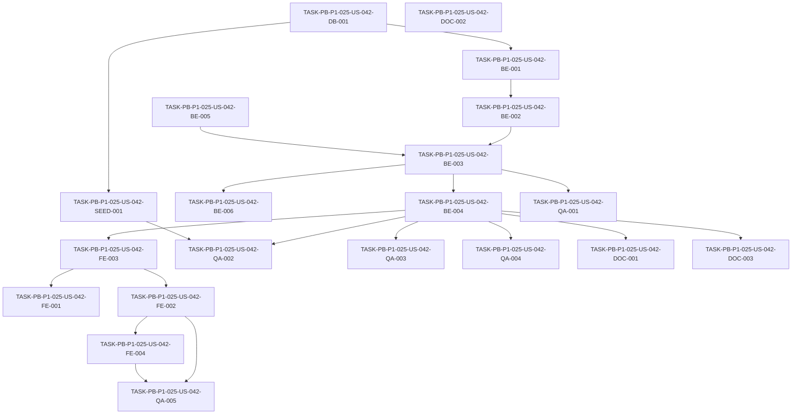

# Development Tasks — PB-P1-025 / US-042: Cambiar categorías del vendor (máx 5 cambios acumulados)

## 1. Metadata

| Field                                | Value                                                                              |
| ------------------------------------ | ---------------------------------------------------------------------------------- |
| User Story ID                        | US-042                                                                             |
| Source User Story                    | `management/user-stories/US-042-change-vendor-categories.md`                       |
| Source Technical Specification       | `management/technical-specs/P1/PB-P1-025/US-042-technical-spec.md`                 |
| Decision Resolution Artifact         | `management/user-stories/decision-resolutions/US-042-decision-resolution.md`       |
| Priority                             | P1                                                                                 |
| Backlog ID                           | PB-P1-025                                                                          |
| Backlog Title                        | Categorías del vendor con tope acumulado (5)                                       |
| Backlog Execution Order              | 44                                                                                 |
| User Story Position in Backlog Item  | 1 de 1                                                                              |
| Related User Stories in Backlog Item | US-042                                                                             |
| Epic                                 | EPIC-VND-001                                                                       |
| Backlog Item Dependencies            | PB-P1-024 (US-040 + US-041)                                                        |
| Feature                              | Cambio de categorías con tope y revisión admin                                      |
| Module / Domain                      | Vendors                                                                            |
| Backlog Alignment Status             | Found                                                                              |
| Task Breakdown Status                | Ready for Sprint Planning                                                          |
| Created Date                         | 2026-06-26                                                                         |
| Last Updated                         | 2026-06-26                                                                         |

---

## 2. Source Validation

| Source                          | Found | Used | Notes                                                       |
| ------------------------------- | ----- | ---- | ----------------------------------------------------------- |
| User Story                      | Yes   | Yes  | Approved with Minor Notes.                                  |
| Technical Specification         | Yes   | Yes  | Ready for Task Breakdown.                                   |
| Decision Resolution Artifact    | Yes   | Yes  | 6/6 decisiones D1–D6 formalizadas.                          |
| Product Backlog Prioritized     | Yes   | Yes  | PB-P1-025 encontrado, execution order 44.                   |
| ADRs                            | N/A   | N/A  | No hay ADRs específicos para esta US.                       |

---

## 3. Backlog Execution Context

### Parent Backlog Item

`PB-P1-025` cierra la regla #3 de Decisión PO 8.1 (límite acumulado de 5 cambios de categorías con revisión admin obligatoria). Depende de `PB-P1-024` (US-040 + US-041 ya cerrados).

### Execution Order Rationale

Se ejecuta después de PB-P1-024 porque reusa módulo `modules/vendors`, repository, guards, `AdminActionWritePort` + adapter (US-041) y banner `RependingNotice` (US-041). Execution order 44.

### Related User Stories in Same Backlog Item

| User Story | Role in Backlog Item                                              | Suggested Order |
| ---------- | ---------------------------------------------------------------- | --------------- |
| US-042     | Endpoint dedicado con contador, revisión admin y transición auto. | 1               |

---

## 4. Task Breakdown Summary

| Area  | Number of Tasks | Notes                                                                                  |
| ----- | --------------: | -------------------------------------------------------------------------------------- |
| DB    |              1  | Verificación documental del schema entregado por PB-P0-001.                            |
| BE    |              6  | DTO, repo extension, service-categories read port, use case, controller, logger.       |
| FE    |              4  | Page, CategoryChangeForm, vendorsApi extension, i18n.                                 |
| SEED  |              1  | Vendor demo con `category_change_count=4`.                                             |
| QA    |              5  | UT, IT, AUTH, Contract, A11Y.                                                          |
| DOC   |              3  | `docs/16 §M07`, housekeeping `docs/4/8/9`, OpenAPI snapshot.                          |
| **Total** |           20  |                                                                                        |

---

## 5. Traceability Matrix

| Acceptance Criterion              | Technical Spec Section              | Task IDs                                                                                                                                            |
| --------------------------------- | ----------------------------------- | --------------------------------------------------------------------------------------------------------------------------------------------------- |
| AC-01 cambio desde `approved`     | §7 UseCase, §10 DB                  | TASK-PB-P1-025-US-042-BE-001..004, TASK-PB-P1-025-US-042-QA-002, TASK-PB-P1-025-US-042-FE-003                                                       |
| AC-02 límite 409                  | §7 UseCase, §6 EC-02                | TASK-PB-P1-025-US-042-BE-003, TASK-PB-P1-025-US-042-QA-001, TASK-PB-P1-025-US-042-QA-002                                                            |
| AC-03 desde `pending`              | §7 UseCase branches                  | TASK-PB-P1-025-US-042-BE-003, TASK-PB-P1-025-US-042-QA-002                                                                                          |
| AC-04 desde `rejected`             | §7 UseCase branches                  | TASK-PB-P1-025-US-042-BE-003, TASK-PB-P1-025-US-042-QA-002                                                                                          |
| EC-01 noop                         | §7 setEquals                         | TASK-PB-P1-025-US-042-BE-003, TASK-PB-P1-025-US-042-QA-001                                                                                          |
| EC-02 hidden                       | §7 status check                      | TASK-PB-P1-025-US-042-BE-003, TASK-PB-P1-025-US-042-QA-003                                                                                          |
| EC-03 soft-deleted                 | §7 status check                      | TASK-PB-P1-025-US-042-BE-003, TASK-PB-P1-025-US-042-QA-003                                                                                          |
| EC-04 cardinalidad                 | §7 Zod refine                        | TASK-PB-P1-025-US-042-BE-001, TASK-PB-P1-025-US-042-QA-001                                                                                          |
| EC-05 catálogo inactivo            | §7 catálogo check                    | TASK-PB-P1-025-US-042-BE-002, TASK-PB-P1-025-US-042-BE-003, TASK-PB-P1-025-US-042-QA-002                                                            |
| AUTH-TS-01..05                     | §12 Security                         | TASK-PB-P1-025-US-042-QA-003                                                                                                                         |
| A11Y contador + CTA                | §8 Accessibility                     | TASK-PB-P1-025-US-042-FE-002, TASK-PB-P1-025-US-042-QA-005                                                                                          |
| i18n 4 locales                     | §8 i18n                              | TASK-PB-P1-025-US-042-FE-004                                                                                                                         |
| Audit `AdminAction`                | §12 + §14                            | TASK-PB-P1-025-US-042-BE-003, TASK-PB-P1-025-US-042-QA-002                                                                                          |
| Log `vendor.category.changed`      | §14                                  | TASK-PB-P1-025-US-042-BE-006                                                                                                                         |

---

## 6. Development Tasks

### TASK-PB-P1-025-US-042-DB-001 — Verificar schema `vendor_profiles` (campos y CHECK) y `vendor_profile_categories` UNIQUE

| Field                     | Value                                                            |
| ------------------------- | ---------------------------------------------------------------- |
| Area                      | Database / Prisma                                                |
| Type                      | Review                                                           |
| Priority                  | Must                                                             |
| Estimate                  | XS                                                               |
| Depends On                | PB-P0-001, PB-P1-024                                              |
| Source AC(s)              | AC-01, AC-02 (precondiciones)                                     |
| Technical Spec Section(s) | §10 Database, §17 Risks                                          |
| Backlog ID                | PB-P1-025                                                         |
| User Story ID             | US-042                                                            |
| Owner Role                | Backend                                                           |
| Status                    | To Do                                                             |

#### Objective

Confirmar que `vendor_profiles.category_change_count`, `last_category_change_at`, `requires_admin_review` y el CHECK `(category_change_count <= 5)` existen en Prisma schema y migraciones, y que `vendor_profile_categories` tiene `UNIQUE (vendor_profile_id, service_category_id)`.

#### Scope

##### Include
- Lectura de `prisma/schema.prisma` y de migraciones de PB-P0-001.
- Si falta `UNIQUE` o el CHECK, abrir issue y migración menor previa a BE-001.

##### Exclude
- Cambios cosméticos al schema.
- Renombrado de columnas.

#### Implementation Notes

- Si todo existe, marcar la tarea como Pass.
- Si falta UNIQUE, agregar migración `add_unique_vendor_profile_categories` antes de iniciar BE.

#### Acceptance Criteria Covered

Precondiciones de AC-01 y AC-02.

#### Definition of Done

- [ ] Verificación documentada en el PR.
- [ ] Migración menor abierta si aplica.
- [ ] Sin cambios cuando todo el schema ya está correcto.

---

### TASK-PB-P1-025-US-042-BE-001 — DTO Zod `changeVendorCategoriesBody` y helper `setEquals`

| Field                     | Value                                                            |
| ------------------------- | ---------------------------------------------------------------- |
| Area                      | Backend                                                           |
| Type                      | Implementation                                                    |
| Priority                  | Must                                                              |
| Estimate                  | S                                                                 |
| Depends On                | TASK-PB-P1-025-US-042-DB-001                                      |
| Source AC(s)              | EC-04, EC-01                                                     |
| Technical Spec Section(s) | §7 DTOs, §6 Interpretation                                       |
| Backlog ID                | PB-P1-025                                                         |
| User Story ID             | US-042                                                            |
| Owner Role                | Backend                                                           |
| Status                    | To Do                                                             |

#### Objective

Crear `src/modules/vendors/dto/change-vendor-categories.body.ts` con Zod `.strict()` (`1..5` UUIDs distintos) y helper `setEquals(a: Set<string>, b: Set<string>): boolean` con tests unitarios.

#### Scope

##### Include
- Schema Zod con `.strict()` y `.refine(size>=1)`.
- Helper puro `setEquals`.
- Unit tests del DTO (rechazo: 0, 6, duplicados normalizados, UUID inválidos, claves extra).

##### Exclude
- Lógica de comparación con el set persistido (vive en el use case).
- Validación de catálogo activo.

#### Implementation Notes

- Reusar conveniones de DTO de US-041 (`updateVendorProfileBody`).
- Exportar tipo TS derivado del schema.

#### Acceptance Criteria Covered

EC-01 (parcial, helper), EC-04.

#### Definition of Done

- [ ] DTO y helper exportados.
- [ ] Unit tests verdes.
- [ ] Sin warnings de ESLint.

---

### TASK-PB-P1-025-US-042-BE-002 — Extender `VendorProfileRepository` con `findActiveWithCategoriesByVendorUserId` y `replaceCategoriesAndAdvanceCounter`

| Field                     | Value                                                            |
| ------------------------- | ---------------------------------------------------------------- |
| Area                      | Backend                                                           |
| Type                      | Implementation                                                    |
| Priority                  | Must                                                              |
| Estimate                  | M                                                                 |
| Depends On                | TASK-PB-P1-025-US-042-BE-001                                      |
| Source AC(s)              | AC-01, AC-03, AC-04, EC-05                                       |
| Technical Spec Section(s) | §7 Repository                                                     |
| Backlog ID                | PB-P1-025                                                         |
| User Story ID             | US-042                                                            |
| Owner Role                | Backend                                                           |
| Status                    | To Do                                                             |

#### Objective

Añadir al `VendorProfileRepository` (extensión de US-040/041) los métodos `findActiveWithCategoriesByVendorUserId` (que retorna perfil + categorías + status + `deletedAt` + `categoryChangeCount`) y `replaceCategoriesAndAdvanceCounter` (delete/insert diff + update counters + flag), más `updateStatusToPending`. Añadir `ServiceCategoryReadPort.findByIds(ids)`.

#### Scope

##### Include
- Métodos del repository con tipos.
- Port `ServiceCategoryReadPort.findByIds` + adapter Prisma.
- `SELECT FOR UPDATE` sobre `vendor_profiles.id` cuando se opera dentro de la transacción.
- Unit tests con mocks de Prisma (`jest-mock-extended` o similar).

##### Exclude
- Use case (vive en BE-003).
- Logging (vive en BE-006).

#### Implementation Notes

- Reusar patrón `tx?: PrismaTx` de US-041.
- En `replaceCategoriesAndAdvanceCounter`, calcular el diff fuera de SQL: `toRemove = current - desired`, `toAdd = desired - current`.

#### Acceptance Criteria Covered

AC-01, AC-03, AC-04, EC-05.

#### Definition of Done

- [ ] Métodos implementados con tipos estrictos.
- [ ] Unit tests verdes.
- [ ] Adapter Prisma para `ServiceCategoryReadPort` registrado.

---

### TASK-PB-P1-025-US-042-BE-003 — `ChangeVendorCategoriesUseCase` con branches completas y transacción

| Field                     | Value                                                            |
| ------------------------- | ---------------------------------------------------------------- |
| Area                      | Backend                                                           |
| Type                      | Implementation                                                    |
| Priority                  | Must                                                              |
| Estimate                  | L                                                                 |
| Depends On                | TASK-PB-P1-025-US-042-BE-002                                      |
| Source AC(s)              | AC-01, AC-02, AC-03, AC-04, EC-01..EC-05                         |
| Technical Spec Section(s) | §7 UseCase, §6 Interpretation                                    |
| Backlog ID                | PB-P1-025                                                         |
| User Story ID             | US-042                                                            |
| Owner Role                | Backend                                                           |
| Status                    | To Do                                                             |

#### Objective

Implementar `ChangeVendorCategoriesUseCase` con todas las branches (noop, hidden, soft-deleted, límite, catálogo inactivo, approved→pending, rejected→pending, pending sin transición), `prisma.$transaction` con `SELECT FOR UPDATE`, e inserción de `AdminAction(action='vendor_category_change')` mediante el port heredado de US-041.

#### Scope

##### Include
- Use case con dependencias inyectadas (`VendorProfileRepository`, `ServiceCategoryReadPort`, `AdminActionWritePort`, `Logger`, `PrismaClient`).
- Errores tipados (`CategoryChangeLimitError`, `ProfileHiddenError`, `ProfileNotFoundError`, `InvalidCategoriesError`, `InvalidCategoryError`).
- Mapeo de errores a HTTP en error mapper compartido (extensión).
- Unit tests por branch.

##### Exclude
- Controller (vive en BE-004).
- Logger (vive en BE-006).

#### Implementation Notes

- Verificar status y `deleted_at` ANTES de abrir la transacción.
- Dentro de la transacción: re-leer el perfil con `SELECT FOR UPDATE`, recomprobar contador para evitar TOCTOU.
- AdminAction siempre dentro de la transacción.

#### Acceptance Criteria Covered

AC-01..AC-04, EC-01..EC-05.

#### Definition of Done

- [ ] Branches cubiertas con tests unitarios (≥ 90% coverage del archivo).
- [ ] Sin uso de `any`.
- [ ] Errores tipados mapeados al envelope estándar.

---

### TASK-PB-P1-025-US-042-BE-004 — Extender `VendorProfileController` y registrar `POST /api/v1/vendors/me/categories`

| Field                     | Value                                                            |
| ------------------------- | ---------------------------------------------------------------- |
| Area                      | Backend / API                                                     |
| Type                      | Implementation                                                    |
| Priority                  | Must                                                              |
| Estimate                  | S                                                                 |
| Depends On                | TASK-PB-P1-025-US-042-BE-003                                      |
| Source AC(s)              | AC-01..AC-04                                                      |
| Technical Spec Section(s) | §7 Controllers, §9 API Contract                                  |
| Backlog ID                | PB-P1-025                                                         |
| User Story ID             | US-042                                                            |
| Owner Role                | Backend                                                           |
| Status                    | To Do                                                             |

#### Objective

Añadir handler `changeCategories(req, res)` y registrar la ruta con `VendorRoleGuard` + `adminExclusionGuard` + `organizerExclusionGuard` + Zod validator.

#### Scope

##### Include
- Extensión del controller existente.
- Registro en `vendor-profile.routes.ts`.
- Mapping del DTO al use case.

##### Exclude
- Lógica de negocio (vive en BE-003).
- Tests de integración (viven en QA-002).

#### Implementation Notes

- Reusar middleware chain del controller de US-040/041.
- `correlation_id` debe propagarse al use case.

#### Acceptance Criteria Covered

AC-01..AC-04 (entrada/salida HTTP).

#### Definition of Done

- [ ] Ruta funcional en `/api/v1/vendors/me/categories`.
- [ ] Middleware chain idéntico a US-041.
- [ ] Sin warnings de TS.

---

### TASK-PB-P1-025-US-042-BE-005 — Reusar `AdminActionWritePort` con nueva action `vendor_category_change`

| Field                     | Value                                                            |
| ------------------------- | ---------------------------------------------------------------- |
| Area                      | Backend                                                           |
| Type                      | Implementation                                                    |
| Priority                  | Must                                                              |
| Estimate                  | XS                                                                |
| Depends On                | PB-P1-024 (US-041)                                                |
| Source AC(s)              | AC-01, AC-03, AC-04                                              |
| Technical Spec Section(s) | §7 AdminActionWritePort                                          |
| Backlog ID                | PB-P1-025                                                         |
| User Story ID             | US-042                                                            |
| Owner Role                | Backend                                                           |
| Status                    | To Do                                                             |

#### Objective

Confirmar que el `AdminActionWritePort` introducido en US-041 acepta el nuevo `action='vendor_category_change'` sin modificación de firma; documentar el nuevo valor en el enum/lista de actions del módulo.

#### Scope

##### Include
- Verificar el adapter `admin-action-write.adapter.ts`.
- Si existe un enum/whitelist de acciones, añadir `'vendor_category_change'`.

##### Exclude
- Nuevos ports/adapters.
- Cambios en `target_type` (sigue siendo `'VendorProfile'`).

#### Implementation Notes

- Si el port tipa `action` como `string` libre, no requiere cambios.

#### Acceptance Criteria Covered

AC-01, AC-03, AC-04 (auditoría).

#### Definition of Done

- [ ] Enum/whitelist actualizado.
- [ ] Tests del adapter siguen verdes.

---

### TASK-PB-P1-025-US-042-BE-006 — Extender logger estructurado con eventos `vendor.category.*`

| Field                     | Value                                                            |
| ------------------------- | ---------------------------------------------------------------- |
| Area                      | Backend / Observability                                           |
| Type                      | Implementation                                                    |
| Priority                  | Must                                                              |
| Estimate                  | S                                                                 |
| Depends On                | TASK-PB-P1-025-US-042-BE-003                                      |
| Source AC(s)              | AC-01, EC-01, AC-02                                               |
| Technical Spec Section(s) | §7 Observability, §14                                            |
| Backlog ID                | PB-P1-025                                                         |
| User Story ID             | US-042                                                            |
| Owner Role                | Backend                                                           |
| Status                    | To Do                                                             |

#### Objective

Añadir a `src/shared/logging/vendor-events.ts` los eventos `vendor.category.changed` (info), `vendor.category.noop` (debug) y `vendor.category.limit_reached` (warn) con shape tipado.

#### Scope

##### Include
- Definiciones de eventos.
- Invocación desde el use case.
- Unit tests del logger con spies.

##### Exclude
- Cambios en transport del logger.

#### Implementation Notes

- Incluir `correlation_id`, `vendor_profile_id`, `vendor_user_id` y `repending` en `vendor.category.changed`.

#### Acceptance Criteria Covered

AC-01, AC-02, EC-01.

#### Definition of Done

- [ ] Eventos emitidos en las branches correctas.
- [ ] Tests verdes.

---

### TASK-PB-P1-025-US-042-FE-001 — Page `vendor/profile/edit/categories` (Server Component + hydration)

| Field                     | Value                                                            |
| ------------------------- | ---------------------------------------------------------------- |
| Area                      | Frontend                                                          |
| Type                      | Implementation                                                    |
| Priority                  | Must                                                              |
| Estimate                  | S                                                                 |
| Depends On                | TASK-PB-P1-025-US-042-FE-003                                      |
| Source AC(s)              | AC-01..AC-04                                                      |
| Technical Spec Section(s) | §8 Routes / Pages                                                |
| Backlog ID                | PB-P1-025                                                         |
| User Story ID             | US-042                                                            |
| Owner Role                | Frontend                                                          |
| Status                    | To Do                                                             |

#### Objective

Crear `app/[locale]/vendor/profile/edit/categories/page.tsx` (Server Component) que carga el perfil del vendor y renderiza `CategoryChangeForm`.

#### Scope

##### Include
- Server Component con `prefetchQuery('vendor.me')`.
- Boundary de error con i18n.
- Layout coherente con el editor de perfil de US-041.

##### Exclude
- Lógica del formulario (vive en FE-002).

#### Implementation Notes

- Reusar el layout/sidebar de la sección "Editar perfil" de US-041.

#### Acceptance Criteria Covered

AC-01..AC-04 (carga del estado).

#### Definition of Done

- [ ] Página renderiza con datos del vendor.
- [ ] Locale resuelto correctamente.

---

### TASK-PB-P1-025-US-042-FE-002 — Componente `CategoryChangeForm` con contador accesible

| Field                     | Value                                                            |
| ------------------------- | ---------------------------------------------------------------- |
| Area                      | Frontend                                                          |
| Type                      | Implementation                                                    |
| Priority                  | Must                                                              |
| Estimate                  | M                                                                 |
| Depends On                | TASK-PB-P1-025-US-042-FE-003                                      |
| Source AC(s)              | AC-01, AC-02, EC-04, A11Y                                        |
| Technical Spec Section(s) | §8 Components, §8 Accessibility                                  |
| Backlog ID                | PB-P1-025                                                         |
| User Story ID             | US-042                                                            |
| Owner Role                | Frontend                                                          |
| Status                    | To Do                                                             |

#### Objective

Crear `components/vendor/profile/CategoryChangeForm.tsx` (Client Component) con multi-select, contador `aria-live="polite"`, CTA con `aria-describedby` cuando límite alcanzado, banner `RependingNotice` reutilizado y modal de confirmación previo a submit cuando hay diff y `status='approved'`.

#### Scope

##### Include
- RHF + Zod (espejo del backend).
- TanStack Query mutation `useChangeVendorCategories`.
- Renderizado del banner `RependingNotice` cuando `repending=true` en la respuesta.
- Modal de confirmación accesible (`role="dialog"`, focus trap, ESC).

##### Exclude
- Internacionalización de strings (vive en FE-004).
- Integración con MSW (vive en QA).

#### Implementation Notes

- Reusar `RependingNotice` de US-041 sin modificarlo.
- Tracking de diff usando `Set` en el cliente para habilitar/deshabilitar el CTA.

#### Acceptance Criteria Covered

AC-01..AC-04, EC-04, A11Y.

#### Definition of Done

- [ ] Componente con tests unitarios (RTL).
- [ ] Contraste AA verificado.
- [ ] Navegación por teclado funcional.

---

### TASK-PB-P1-025-US-042-FE-003 — Extender `vendorsApi` con `changeCategories` + MSW handler

| Field                     | Value                                                            |
| ------------------------- | ---------------------------------------------------------------- |
| Area                      | Frontend / API Client                                             |
| Type                      | Implementation                                                    |
| Priority                  | Must                                                              |
| Estimate                  | S                                                                 |
| Depends On                | TASK-PB-P1-025-US-042-BE-004                                      |
| Source AC(s)              | AC-01..AC-04                                                      |
| Technical Spec Section(s) | §8 Data Fetching                                                 |
| Backlog ID                | PB-P1-025                                                         |
| User Story ID             | US-042                                                            |
| Owner Role                | Frontend                                                          |
| Status                    | To Do                                                             |

#### Objective

Extender `lib/api/vendorsApi.ts` con `changeCategories({ service_category_ids })`. Añadir MSW handler para tests.

#### Scope

##### Include
- Función tipada en el cliente.
- Manejo del envelope de error (mapear códigos a constantes).
- MSW handler simulando todos los códigos.

##### Exclude
- UI (vive en FE-002).

#### Implementation Notes

- Reusar pattern de `vendorsApi.update` introducido en US-041.

#### Acceptance Criteria Covered

AC-01..AC-04 (cliente HTTP).

#### Definition of Done

- [ ] Cliente tipado.
- [ ] MSW handler cubre 200/200-noop/400/401/403/404/409.

---

### TASK-PB-P1-025-US-042-FE-004 — i18n: claves `vendor.categories.change.*` en 4 locales

| Field                     | Value                                                            |
| ------------------------- | ---------------------------------------------------------------- |
| Area                      | Frontend / i18n                                                   |
| Type                      | Implementation                                                    |
| Priority                  | Must                                                              |
| Estimate                  | S                                                                 |
| Depends On                | TASK-PB-P1-025-US-042-FE-002                                      |
| Source AC(s)              | AC-01..AC-04, EC-02..EC-04                                       |
| Technical Spec Section(s) | §8 i18n                                                          |
| Backlog ID                | PB-P1-025                                                         |
| User Story ID             | US-042                                                            |
| Owner Role                | Frontend                                                          |
| Status                    | To Do                                                             |

#### Objective

Añadir claves `vendor.categories.change.*` (titles, helper, contador, mensajes de error por code, banner repending) en `messages/{es-LATAM,es-ES,pt,en}.json`.

#### Scope

##### Include
- 4 archivos de mensajes actualizados.
- Verificación de paridad de claves.

##### Exclude
- Traducciones avanzadas; usar strings claros y consistentes con US-041.

#### Implementation Notes

- Reusar el banner key de US-041 (`vendor.profile.repending.title`).

#### Acceptance Criteria Covered

Locale support.

#### Definition of Done

- [ ] 4 locales completos.
- [ ] Lint i18n verde.

---

### TASK-PB-P1-025-US-042-SEED-001 — Seed: vendor demo con `category_change_count=4`

| Field                     | Value                                                            |
| ------------------------- | ---------------------------------------------------------------- |
| Area                      | Seed / Demo                                                       |
| Type                      | Implementation                                                    |
| Priority                  | Should                                                            |
| Estimate                  | XS                                                                |
| Depends On                | TASK-PB-P1-025-US-042-DB-001                                      |
| Source AC(s)              | AC-02                                                              |
| Technical Spec Section(s) | §15 Seed                                                         |
| Backlog ID                | PB-P1-025                                                         |
| User Story ID             | US-042                                                            |
| Owner Role                | Backend                                                           |
| Status                    | To Do                                                             |

#### Objective

Extender el seed de PB-P0-014/US-040 con un vendor `approved` y `category_change_count=4` para demostrar el bloqueo en el 5to/6to cambio.

#### Scope

##### Include
- Inserts adicionales en el seed.
- Documentación inline del vendor demo.

##### Exclude
- Cambios al reset script.

#### Implementation Notes

- Mantener idempotencia.

#### Acceptance Criteria Covered

AC-02 (demo).

#### Definition of Done

- [ ] Seed reproducible.
- [ ] `npm run seed` exitoso sin duplicados.

---

### TASK-PB-P1-025-US-042-QA-001 — Unit tests (DTO, helper `setEquals`, branches del use case)

| Field                     | Value                                                            |
| ------------------------- | ---------------------------------------------------------------- |
| Area                      | QA / Testing                                                      |
| Type                      | Test                                                              |
| Priority                  | Must                                                              |
| Estimate                  | M                                                                 |
| Depends On                | TASK-PB-P1-025-US-042-BE-003                                      |
| Source AC(s)              | AC-02, EC-01, EC-04, EC-05                                        |
| Technical Spec Section(s) | §13 Unit Tests                                                   |
| Backlog ID                | PB-P1-025                                                         |
| User Story ID             | US-042                                                            |
| Owner Role                | QA / Backend                                                      |
| Status                    | To Do                                                             |

#### Objective

Vitest unit tests del DTO, del helper `setEquals` y de cada branch del use case (con mocks de `prisma.$transaction`).

#### Scope

##### Include
- Branches: noop, hidden, soft-deleted, límite, catálogo inactivo, approved→pending, rejected→pending, pending sin transición.

##### Exclude
- API tests (viven en QA-002).

#### Implementation Notes

- Usar `jest-mock-extended` o equivalente para `PrismaClient`.

#### Acceptance Criteria Covered

AC-02, EC-01, EC-04, EC-05 + branches AC-01/03/04.

#### Definition of Done

- [ ] ≥ 90% coverage del use case y del DTO.
- [ ] Tests verdes en CI.

---

### TASK-PB-P1-025-US-042-QA-002 — Integration / API tests con Supertest (matriz completa)

| Field                     | Value                                                            |
| ------------------------- | ---------------------------------------------------------------- |
| Area                      | QA / Testing                                                      |
| Type                      | Test                                                              |
| Priority                  | Must                                                              |
| Estimate                  | M                                                                 |
| Depends On                | TASK-PB-P1-025-US-042-BE-004, TASK-PB-P1-025-US-042-SEED-001     |
| Source AC(s)              | AC-01..AC-04, EC-01..EC-05, NT-01..NT-05                          |
| Technical Spec Section(s) | §13 Integration / API Tests                                       |
| Backlog ID                | PB-P1-025                                                         |
| User Story ID             | US-042                                                            |
| Owner Role                | QA / Backend                                                      |
| Status                    | To Do                                                             |

#### Objective

Cobertura Supertest E2E del endpoint con DB de prueba: AC-01..AC-04, EC-01..EC-05, NT-01..NT-05, verificación de `AdminAction` y de `last_category_change_at`.

#### Scope

##### Include
- Setup/teardown de DB.
- Verificación de la transacción atómica (rollback si AdminAction falla — simulado por adapter spy).

##### Exclude
- A11Y/Frontend (viven en QA-005).

#### Implementation Notes

- Usar `pg-mem` o test container según convención del proyecto.

#### Acceptance Criteria Covered

AC-01..AC-04, EC-01..EC-05, NT-01..NT-05.

#### Definition of Done

- [ ] Todos los casos pasan en CI.
- [ ] Verificación explícita de inserción de `AdminAction`.

---

### TASK-PB-P1-025-US-042-QA-003 — Authorization tests (AUTH-TS-01..AUTH-TS-05)

| Field                     | Value                                                            |
| ------------------------- | ---------------------------------------------------------------- |
| Area                      | QA / Security                                                     |
| Type                      | Test                                                              |
| Priority                  | Must                                                              |
| Estimate                  | S                                                                 |
| Depends On                | TASK-PB-P1-025-US-042-BE-004                                      |
| Source AC(s)              | AUTH-TS-01..AUTH-TS-05, EC-02, EC-03                              |
| Technical Spec Section(s) | §12 Security                                                     |
| Backlog ID                | PB-P1-025                                                         |
| User Story ID             | US-042                                                            |
| Owner Role                | QA / Security                                                     |
| Status                    | To Do                                                             |

#### Objective

Matriz de auth × estado: vendor sobre propio (200), otro vendor (403), perfil hidden (409 PROFILE_HIDDEN), perfil soft-deleted (404), sin sesión (401).

#### Scope

##### Include
- Setup de fixtures con 5 estados.

##### Exclude
- Tests funcionales (viven en QA-002).

#### Implementation Notes

- Reusar fixtures de US-040/041.

#### Acceptance Criteria Covered

AUTH-TS-01..AUTH-TS-05, EC-02, EC-03.

#### Definition of Done

- [ ] 5 escenarios verdes.

---

### TASK-PB-P1-025-US-042-QA-004 — Contract test del response shape

| Field                     | Value                                                            |
| ------------------------- | ---------------------------------------------------------------- |
| Area                      | QA / API                                                          |
| Type                      | Test                                                              |
| Priority                  | Should                                                            |
| Estimate                  | XS                                                                |
| Depends On                | TASK-PB-P1-025-US-042-BE-004                                      |
| Source AC(s)              | AC-01..AC-04, EC-01                                               |
| Technical Spec Section(s) | §9 API Contract                                                  |
| Backlog ID                | PB-P1-025                                                         |
| User Story ID             | US-042                                                            |
| Owner Role                | QA                                                                |
| Status                    | To Do                                                             |

#### Objective

Test de contrato que valida el shape de response (`category_change_count`, `requires_admin_review`, `repending`, `noop`, `status`) contra un schema Zod compartido.

#### Scope

##### Include
- Schema de response derivado.
- Test que rompe si el shape cambia.

##### Exclude
- OpenAPI snapshot (vive en DOC-003).

#### Acceptance Criteria Covered

AC-01..AC-04, EC-01.

#### Definition of Done

- [ ] Test contractual verde en CI.

---

### TASK-PB-P1-025-US-042-QA-005 — Accessibility tests (contador + CTA + modal)

| Field                     | Value                                                            |
| ------------------------- | ---------------------------------------------------------------- |
| Area                      | QA / A11Y                                                         |
| Type                      | Test                                                              |
| Priority                  | Must                                                              |
| Estimate                  | S                                                                 |
| Depends On                | TASK-PB-P1-025-US-042-FE-002, TASK-PB-P1-025-US-042-FE-004      |
| Source AC(s)              | A11Y                                                              |
| Technical Spec Section(s) | §13 Accessibility                                                |
| Backlog ID                | PB-P1-025                                                         |
| User Story ID             | US-042                                                            |
| Owner Role                | QA / Frontend                                                     |
| Status                    | To Do                                                             |

#### Objective

Verificar `aria-live` del contador, `aria-describedby` del CTA cuando límite alcanzado, focus trap del modal de confirmación, navegación por teclado y contraste AA.

#### Scope

##### Include
- Tests con `@testing-library/jest-dom` + `axe`.

##### Exclude
- E2E completos (opcionales MVP).

#### Acceptance Criteria Covered

A11Y.

#### Definition of Done

- [ ] axe sin issues serios.
- [ ] Tests verdes.

---

### TASK-PB-P1-025-US-042-DOC-001 — Actualizar `docs/16 §M07` con el contrato del endpoint

| Field                     | Value                                                            |
| ------------------------- | ---------------------------------------------------------------- |
| Area                      | Documentation                                                     |
| Type                      | Documentation                                                     |
| Priority                  | Must                                                              |
| Estimate                  | S                                                                 |
| Depends On                | TASK-PB-P1-025-US-042-BE-004                                      |
| Source AC(s)              | AC-01..AC-04, EC-01..EC-05                                        |
| Technical Spec Section(s) | §16 Documentation Alignment                                       |
| Backlog ID                | PB-P1-025                                                         |
| User Story ID             | US-042                                                            |
| Owner Role                | Backend / Doc                                                     |
| Status                    | To Do                                                             |

#### Objective

Añadir a `docs/16-API-Design-Specification.md §M07` el contrato de `POST /api/v1/vendors/me/categories` con request, response, error codes y ejemplos.

#### Scope

##### Include
- Sección nueva con request body, success shape y todos los errores.
- Referencia cruzada a la US y al Decision Resolution.

##### Exclude
- Cambios al snapshot OpenAPI (vive en DOC-003).

#### Definition of Done

- [ ] Sección añadida.
- [ ] Lint de docs verde.

---

### TASK-PB-P1-025-US-042-DOC-002 — Housekeeping documental `docs/4`, `docs/8`, `docs/9`

| Field                     | Value                                                            |
| ------------------------- | ---------------------------------------------------------------- |
| Area                      | Documentation                                                     |
| Type                      | Documentation                                                     |
| Priority                  | Should                                                            |
| Estimate                  | S                                                                 |
| Depends On                | -                                                                 |
| Source AC(s)              | -                                                                 |
| Technical Spec Section(s) | §16 Documentation Alignment                                       |
| Backlog ID                | PB-P1-025                                                         |
| User Story ID             | US-042                                                            |
| Owner Role                | Doc                                                               |
| Status                    | To Do                                                             |

#### Objective

Aplicar las 3 acciones de Documentation Alignment Required: (a) `docs/4 §BR-VENDOR-004` con la regla "cada cambio dispara revisión admin", (b) `docs/8 §UC-VENDOR-002 E2` con código `409 CATEGORY_CHANGE_LIMIT`, (c) `docs/9 §FR-VENDOR-004` con `409`.

#### Scope

##### Include
- Tres ediciones puntuales.
- Nota de referencia al Decision Resolution US-042.

##### Exclude
- Re-redacciones extensas.

#### Definition of Done

- [ ] 3 ediciones aplicadas y revisadas.

---

### TASK-PB-P1-025-US-042-DOC-003 — Regenerar OpenAPI snapshot (Doc 5 / PB-P0-005)

| Field                     | Value                                                            |
| ------------------------- | ---------------------------------------------------------------- |
| Area                      | Documentation / API                                               |
| Type                      | Documentation                                                     |
| Priority                  | Should                                                            |
| Estimate                  | XS                                                                |
| Depends On                | TASK-PB-P1-025-US-042-BE-004                                      |
| Source AC(s)              | AC-01..AC-04                                                      |
| Technical Spec Section(s) | §9 API Contract                                                  |
| Backlog ID                | PB-P1-025                                                         |
| User Story ID             | US-042                                                            |
| Owner Role                | Backend / Doc                                                     |
| Status                    | To Do                                                             |

#### Objective

Ejecutar el generador de OpenAPI desde Zod (PB-P0-005) y commitear el snapshot actualizado con el nuevo endpoint.

#### Scope

##### Include
- Regeneración del snapshot.
- Commit del diff.

##### Exclude
- Cambios al pipeline OpenAPI.

#### Definition of Done

- [ ] Snapshot actualizado en repo.
- [ ] CI verde.

---

## 7. Required QA Tasks

| Task ID                            | Test Type     | Purpose                                                                |
| ---------------------------------- | ------------- | ---------------------------------------------------------------------- |
| TASK-PB-P1-025-US-042-QA-001       | Unit          | DTO + helper + branches del use case.                                  |
| TASK-PB-P1-025-US-042-QA-002       | Integration / API | Matriz completa de AC, EC, NT con DB real.                              |
| TASK-PB-P1-025-US-042-QA-003       | Authorization | Matriz auth × estado.                                                  |
| TASK-PB-P1-025-US-042-QA-004       | Contract      | Validación del shape del response.                                     |
| TASK-PB-P1-025-US-042-QA-005       | Accessibility | Contador con `aria-live`, CTA con `aria-describedby`, modal accesible.  |

---

## 8. Required Security Tasks

| Task ID                            | Security Concern                                  | Purpose                                                            |
| ---------------------------------- | ------------------------------------------------- | ------------------------------------------------------------------ |
| TASK-PB-P1-025-US-042-QA-003       | Ownership + estado bloqueante                     | Matriz `AUTH-TS-01..05`.                                            |
| TASK-PB-P1-025-US-042-BE-005       | Auditoría inmutable                               | Asegurar inserción de `AdminAction(action='vendor_category_change')`. |

---

## 9. Required Seed / Demo Tasks

| Task ID                              | Seed/Demo Concern                                       | Purpose                                                 |
| ------------------------------------ | ------------------------------------------------------- | ------------------------------------------------------- |
| TASK-PB-P1-025-US-042-SEED-001       | Vendor demo con `category_change_count=4` para 5to/6to. | Soporte de demo del bloqueo `409 CATEGORY_CHANGE_LIMIT`. |

---

## 10. Observability / Audit Tasks

| Task ID                              | Concern                                                                | Purpose                                                          |
| ------------------------------------ | ---------------------------------------------------------------------- | ---------------------------------------------------------------- |
| TASK-PB-P1-025-US-042-BE-006         | Logs `vendor.category.{changed,noop,limit_reached}`.                   | Trazabilidad operativa.                                          |
| TASK-PB-P1-025-US-042-BE-005         | `AdminAction(action='vendor_category_change')`.                        | Auditoría compatible con `PB-P1-024`.                            |

---

## 11. Documentation / Traceability Tasks

| Task ID                              | Document / Artifact                                           | Purpose                                                           |
| ------------------------------------ | ------------------------------------------------------------- | ----------------------------------------------------------------- |
| TASK-PB-P1-025-US-042-DOC-001        | `docs/16 §M07`                                                | Contrato del endpoint en API Design Specification.                |
| TASK-PB-P1-025-US-042-DOC-002        | `docs/4 §BR-VENDOR-004`, `docs/8 §UC-VENDOR-002 E2`, `docs/9 §FR-VENDOR-004` | Documentation Alignment Required (códigos y alcance del trigger). |
| TASK-PB-P1-025-US-042-DOC-003        | Snapshot OpenAPI (PB-P0-005)                                  | Actualización generada desde Zod.                                 |

---

## 12. Dependency Graph

---

## 13. Suggested Implementation Order

### Phase 1 — Foundation
- TASK-PB-P1-025-US-042-DB-001
- TASK-PB-P1-025-US-042-BE-005 (verificación enum action)
- TASK-PB-P1-025-US-042-BE-001 (DTO + helper)

### Phase 2 — Core Implementation
- TASK-PB-P1-025-US-042-BE-002 (repository + service-categories port)
- TASK-PB-P1-025-US-042-BE-003 (use case)
- TASK-PB-P1-025-US-042-BE-006 (logger)
- TASK-PB-P1-025-US-042-BE-004 (controller + ruta)
- TASK-PB-P1-025-US-042-FE-003 (vendorsApi + MSW)
- TASK-PB-P1-025-US-042-FE-002 (CategoryChangeForm)
- TASK-PB-P1-025-US-042-FE-001 (page)
- TASK-PB-P1-025-US-042-FE-004 (i18n)
- TASK-PB-P1-025-US-042-SEED-001 (seed demo)

### Phase 3 — Validation / Security / QA
- TASK-PB-P1-025-US-042-QA-001 (UT)
- TASK-PB-P1-025-US-042-QA-002 (IT)
- TASK-PB-P1-025-US-042-QA-003 (AUTH)
- TASK-PB-P1-025-US-042-QA-004 (Contract)
- TASK-PB-P1-025-US-042-QA-005 (A11Y)

### Phase 4 — Documentation / Review
- TASK-PB-P1-025-US-042-DOC-001 (docs/16)
- TASK-PB-P1-025-US-042-DOC-002 (housekeeping docs/4, /8, /9)
- TASK-PB-P1-025-US-042-DOC-003 (OpenAPI snapshot)

---

## 14. Risks & Mitigations

| Risk                                                                              | Impact                                       | Mitigation                                                                   | Related Task                                                                |
| --------------------------------------------------------------------------------- | -------------------------------------------- | ---------------------------------------------------------------------------- | --------------------------------------------------------------------------- |
| Race con `PATCH /vendors/me` o `DELETE /vendors/me` (US-041).                      | Cambios inconsistentes.                       | `SELECT FOR UPDATE` dentro de `prisma.$transaction`.                          | TASK-PB-P1-025-US-042-BE-003                                                |
| AdminAction insert falla.                                                          | Cambio sin auditoría.                         | Insert dentro de la misma transacción; rollback en error.                     | TASK-PB-P1-025-US-042-BE-003, TASK-PB-P1-025-US-042-QA-002                  |
| Falta UNIQUE en `vendor_profile_categories`.                                       | Duplicados al re-insertar.                    | DB-001 verifica; abrir migración menor antes de BE-001 si aplica.             | TASK-PB-P1-025-US-042-DB-001                                                |
| Comparación de Sets incorrecta.                                                    | Cambios reales como `noop`.                   | Helper `setEquals` con UT exhaustivos.                                        | TASK-PB-P1-025-US-042-BE-001, TASK-PB-P1-025-US-042-QA-001                  |
| Categoría desactivada entre validación y commit.                                   | Cambio con catálogo inactivo.                 | `SELECT FOR SHARE` o verificación dentro de la transacción.                   | TASK-PB-P1-025-US-042-BE-002, TASK-PB-P1-025-US-042-BE-003                  |

---

## 15. Out of Scope Confirmation

- Reverso/UNDO de cambios de categorías.
- Rotación admin del contador `category_change_count`.
- Auto-aprobación tras el cambio.
- Subcategorías ilimitadas.
- Edición de categorías por `PATCH /vendors/me` (sigue siendo competencia exclusiva de este endpoint).
- Notificación push/email al admin (US futura).
- Búsqueda de directorio (PB-P1-028).

---

## 16. Readiness for Sprint Planning

| Check                                      | Status |
| ------------------------------------------ | ------ |
| Product Backlog mapping found              | Pass   |
| Every AC maps to tasks                     | Pass   |
| Technical Spec used when available         | Pass   |
| QA tasks included                          | Pass   |
| Security tasks included if applicable      | Pass   |
| Seed/demo tasks included if applicable     | Pass   |
| Observability tasks included if applicable | Pass   |
| Documentation tasks included if applicable | Pass   |
| Task dependencies clear                    | Pass   |
| Tasks small enough                         | Pass   |
| Ready for Sprint Planning                  | Yes    |

---

## 17. Final Recommendation

`Ready for Sprint Planning`.

US-042 cierra `PB-P1-025` con 20 tareas atómicas en 6 áreas (DB, BE, FE, SEED, QA, DOC) sin migraciones nuevas, reutilizando port + adapter + banner introducidos por `PB-P1-024`. Cobertura completa de AC/EC/NT/AUTH-TS y plan de documentación para cerrar las 5 acciones de Documentation Alignment Required.
