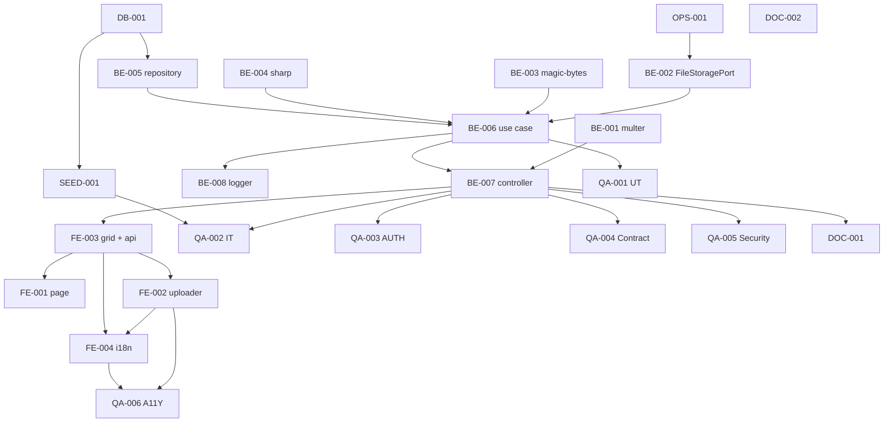

# Development Tasks — PB-P1-026 / US-043: Subir hasta 10 imágenes por trabajo del portafolio

## 1. Metadata

| Field                                | Value                                                                              |
| ------------------------------------ | ---------------------------------------------------------------------------------- |
| User Story ID                        | US-043                                                                             |
| Source User Story                    | `management/user-stories/US-043-upload-portfolio-images.md`                        |
| Source Technical Specification       | `management/technical-specs/P1/PB-P1-026/US-043-technical-spec.md`                 |
| Decision Resolution Artifact         | `management/user-stories/decision-resolutions/US-043-decision-resolution.md`       |
| Priority                             | P1                                                                                 |
| Backlog ID                           | PB-P1-026                                                                          |
| Backlog Title                        | Portafolio del vendor (10 imágenes / trabajo)                                      |
| Backlog Execution Order              | 45                                                                                 |
| User Story Position in Backlog Item  | 1 de 2 (US-043 → US-048)                                                            |
| Related User Stories in Backlog Item | US-043, US-048                                                                     |
| Epic                                 | EPIC-VND-001                                                                       |
| Backlog Item Dependencies            | PB-P1-024, PB-P0-001, PB-P0-003, PB-P0-007                                         |
| Feature                              | Portafolio del vendor con `work_label` polimórfico y resize básico                  |
| Module / Domain                      | Attachments / Vendors                                                              |
| Backlog Alignment Status             | Found                                                                              |
| Task Breakdown Status                | Ready for Sprint Planning                                                          |
| Created Date                         | 2026-06-26                                                                         |
| Last Updated                         | 2026-06-26                                                                         |

---

## 2. Source Validation

| Source                          | Found | Used | Notes                                                       |
| ------------------------------- | ----- | ---- | ----------------------------------------------------------- |
| User Story                      | Yes   | Yes  | Approved with Minor Notes.                                  |
| Technical Specification         | Yes   | Yes  | Ready for Task Breakdown.                                   |
| Decision Resolution Artifact    | Yes   | Yes  | 6/6 decisiones D1–D6 formalizadas.                          |
| Product Backlog Prioritized     | Yes   | Yes  | PB-P1-026 encontrado, execution order 45.                   |
| ADRs                            | N/A   | N/A  | No hay ADRs específicos.                                    |

---

## 3. Backlog Execution Context

### Parent Backlog Item

`PB-P1-026` — Portafolio del vendor con 10 imágenes/trabajo + soft delete. Dependiente de PB-P1-024 (US-040 + US-041) y de PB-P0-001 (schema attachments).

### Execution Order Rationale

Posición 1 de 2 en PB-P1-026. US-043 entrega el upload; US-048 cierra con DELETE soft. Execution order 45.

### Related User Stories in Same Backlog Item

| User Story | Role in Backlog Item                          | Suggested Order |
| ---------- | --------------------------------------------- | --------------- |
| US-043     | Upload de imágenes por `work_label`.          | 1               |
| US-048     | Soft delete del attachment.                   | 2               |

---

## 4. Task Breakdown Summary

| Area  | Number of Tasks | Notes                                                                                  |
| ----- | --------------: | -------------------------------------------------------------------------------------- |
| DB    |              1  | Verificación documental del schema.                                                     |
| BE    |              8  | Middleware multer, port + adapter, magic-bytes, sharp, repository, use case, controller, logger. |
| FE    |              4  | Page, PortfolioUploader, WorkGrid + vendorsApi, i18n.                                 |
| SEED  |              1  | Vendors demo con 9/10 imágenes + hidden.                                              |
| OPS   |              1  | Env vars + .gitignore + storage dir.                                                  |
| QA    |              6  | UT, IT, AUTH, Contract, Security, A11Y.                                               |
| DOC   |              2  | `docs/16 §M07`, considerar NFR upload.                                                |
| **Total** |           23  |                                                                                        |

---

## 5. Traceability Matrix

| Acceptance Criterion                | Technical Spec Section | Task IDs                                                                                                                                              |
| ----------------------------------- | ---------------------- | ----------------------------------------------------------------------------------------------------------------------------------------------------- |
| AC-01 upload válido                  | §7 UseCase, §10 DB     | TASK-PB-P1-026-US-043-BE-002..007, TASK-PB-P1-026-US-043-QA-002                                                                                       |
| AC-02 límite 10                      | §7 UseCase, §6        | TASK-PB-P1-026-US-043-BE-005, TASK-PB-P1-026-US-043-BE-006, TASK-PB-P1-026-US-043-QA-001, TASK-PB-P1-026-US-043-QA-002                                |
| AC-03 resize                         | §7 sharp pipeline      | TASK-PB-P1-026-US-043-BE-004, TASK-PB-P1-026-US-043-QA-002                                                                                            |
| EC-01 INVALID_MIME                   | §7 magic-bytes         | TASK-PB-P1-026-US-043-BE-003, TASK-PB-P1-026-US-043-QA-005                                                                                            |
| EC-02 FILE_TOO_LARGE                 | §7 multer              | TASK-PB-P1-026-US-043-BE-001, TASK-PB-P1-026-US-043-QA-002                                                                                            |
| EC-03 PROFILE_HIDDEN                 | §7 status check        | TASK-PB-P1-026-US-043-BE-006, TASK-PB-P1-026-US-043-QA-003                                                                                            |
| EC-04 soft-deleted                   | §7 status check        | TASK-PB-P1-026-US-043-BE-006, TASK-PB-P1-026-US-043-QA-003                                                                                            |
| EC-05 INVALID_WORK_LABEL             | §7 Zod path param      | TASK-PB-P1-026-US-043-BE-007, TASK-PB-P1-026-US-043-QA-001                                                                                            |
| EC-06 WORK_LABEL_LIMIT_REACHED       | §7 count distinct      | TASK-PB-P1-026-US-043-BE-005, TASK-PB-P1-026-US-043-BE-006, TASK-PB-P1-026-US-043-QA-002                                                              |
| AUTH-TS-01..07                       | §12 Security           | TASK-PB-P1-026-US-043-QA-003                                                                                                                            |
| A11Y dropzone + contador             | §8 Accessibility       | TASK-PB-P1-026-US-043-FE-002, TASK-PB-P1-026-US-043-QA-006                                                                                            |
| i18n 4 locales                       | §8 i18n                | TASK-PB-P1-026-US-043-FE-004                                                                                                                            |
| Log `vendor.portfolio.uploaded`      | §14 Observability      | TASK-PB-P1-026-US-043-BE-008                                                                                                                            |

---

## 6. Development Tasks

### TASK-PB-P1-026-US-043-DB-001 — Verificar schema `attachments` (columnas, enums, índice parcial)

| Field                     | Value                                                            |
| ------------------------- | ---------------------------------------------------------------- |
| Area                      | Database / Prisma                                                |
| Type                      | Review                                                           |
| Priority                  | Must                                                             |
| Estimate                  | XS                                                               |
| Depends On                | PB-P0-001                                                         |
| Source AC(s)              | Precondiciones de AC-01..AC-03                                   |
| Technical Spec Section(s) | §10 Database, §15 Seed                                          |
| Backlog ID                | PB-P1-026                                                         |
| User Story ID             | US-043                                                            |
| Owner Role                | Backend                                                           |
| Status                    | To Do                                                             |

#### Objective

Confirmar que `attachments` incluye `mime`, `size_bytes`, `storage_url`, `work_label`, `owner_type`, `owner_id`, `status`, `uploaded_by`, `deleted_at`, `deleted_by`, `deletion_reason`; enums `attachment_status` y `attachment_owner_type`; índice `idx_attachments_vendor_work_active`.

#### Scope

##### Include
- Verificación de `prisma/schema.prisma` y migraciones.
- Abrir issue + migración menor si falta algún campo.

##### Exclude
- Renombrado de columnas.

#### Implementation Notes

Si todo existe, marcar como Pass.

#### Acceptance Criteria Covered

Precondiciones de AC-01..AC-03.

#### Definition of Done

- [ ] Verificación documentada.
- [ ] Migración menor abierta si aplica.

---

### TASK-PB-P1-026-US-043-OPS-001 — Configurar storage local (env + .gitignore + bootstrap dir)

| Field                     | Value                                                            |
| ------------------------- | ---------------------------------------------------------------- |
| Area                      | DevOps / Environment                                              |
| Type                      | Setup                                                             |
| Priority                  | Must                                                              |
| Estimate                  | XS                                                                |
| Depends On                | -                                                                 |
| Source AC(s)              | AC-01                                                              |
| Technical Spec Section(s) | §18 Implementation Guidance                                       |
| Backlog ID                | PB-P1-026                                                         |
| User Story ID             | US-043                                                            |
| Owner Role                | DevOps                                                            |
| Status                    | To Do                                                             |

#### Objective

Agregar `FILE_STORAGE_DRIVER=local` y `FILE_STORAGE_PATH=./storage/uploads` a `.env.example`; agregar `storage/uploads/` a `.gitignore`; script de bootstrap del directorio.

#### Scope

##### Include
- Variables de entorno documentadas.
- Bootstrap del directorio durante `npm run dev` y `npm run start`.

##### Exclude
- ObjectStorageAdapter.

#### Acceptance Criteria Covered

AC-01.

#### Definition of Done

- [ ] `.env.example` actualizado.
- [ ] `.gitignore` actualizado.
- [ ] Bootstrap funcional.

---

### TASK-PB-P1-026-US-043-BE-001 — Middleware `file-upload` (multer memory + límite 5 MB)

| Field                     | Value                                                            |
| ------------------------- | ---------------------------------------------------------------- |
| Area                      | Backend                                                           |
| Type                      | Implementation                                                    |
| Priority                  | Must                                                              |
| Estimate                  | S                                                                 |
| Depends On                | -                                                                 |
| Source AC(s)              | EC-02                                                              |
| Technical Spec Section(s) | §7 Controllers, §18                                              |
| Backlog ID                | PB-P1-026                                                         |
| User Story ID             | US-043                                                            |
| Owner Role                | Backend                                                           |
| Status                    | To Do                                                             |

#### Objective

Crear `src/shared/middlewares/file-upload.middleware.ts` con multer en `memoryStorage`, límite `fileSize: 5 MB`, helper `single(fieldName, opts)`.

#### Scope

##### Include
- Mapeo de error de multer a `413 FILE_TOO_LARGE`.
- Unit tests con request mock.

##### Exclude
- Validación MIME (vive en BE-003).

#### Acceptance Criteria Covered

EC-02.

#### Definition of Done

- [ ] Middleware exportado.
- [ ] UT verde.

---

### TASK-PB-P1-026-US-043-BE-002 — `FileStoragePort` + `LocalFileStorageAdapter`

| Field                     | Value                                                            |
| ------------------------- | ---------------------------------------------------------------- |
| Area                      | Backend                                                           |
| Type                      | Implementation                                                    |
| Priority                  | Must                                                              |
| Estimate                  | M                                                                 |
| Depends On                | TASK-PB-P1-026-US-043-OPS-001                                     |
| Source AC(s)              | AC-01                                                              |
| Technical Spec Section(s) | §7, §18                                                          |
| Backlog ID                | PB-P1-026                                                         |
| User Story ID             | US-043                                                            |
| Owner Role                | Backend                                                           |
| Status                    | To Do                                                             |

#### Objective

Definir `FileStoragePort` con métodos `save(buffer, opts)` y `delete(storageUrl)`. Implementar `LocalFileStorageAdapter` con path `storage/uploads/<yyyy>/<mm>/<uuid>.<ext>`.

#### Scope

##### Include
- Generación de UUID v4 para filename.
- Manejo de errores de I/O.
- UT con fs mockeado.

##### Exclude
- ObjectStorageAdapter.

#### Acceptance Criteria Covered

AC-01.

#### Definition of Done

- [ ] Port + adapter funcionales.
- [ ] UT verde.

---

### TASK-PB-P1-026-US-043-BE-003 — Validador de magic-bytes (allowlist `image/jpeg|png|webp`)

| Field                     | Value                                                            |
| ------------------------- | ---------------------------------------------------------------- |
| Area                      | Backend / Security                                                |
| Type                      | Implementation                                                    |
| Priority                  | Must                                                              |
| Estimate                  | S                                                                 |
| Depends On                | -                                                                 |
| Source AC(s)              | EC-01, NT-07                                                      |
| Technical Spec Section(s) | §7, §12, §17                                                    |
| Backlog ID                | PB-P1-026                                                         |
| User Story ID             | US-043                                                            |
| Owner Role                | Backend                                                           |
| Status                    | To Do                                                             |

#### Objective

Implementar `magic-bytes-validator.ts` que verifica el header binario contra firmas conocidas de `image/jpeg`, `image/png`, `image/webp` (usar `file-type` o detección manual). Compara con el MIME del header HTTP; rechaza inconsistencia.

#### Scope

##### Include
- Firmas binarias.
- UT con buffers reales y spoofeados.

##### Exclude
- Otros MIME.

#### Acceptance Criteria Covered

EC-01, NT-07.

#### Definition of Done

- [ ] Validador funcional.
- [ ] UT verde incluyendo MIME spoofing.

---

### TASK-PB-P1-026-US-043-BE-004 — Pipeline `sharp` (resize long-edge 2048, JPEG quality 80)

| Field                     | Value                                                            |
| ------------------------- | ---------------------------------------------------------------- |
| Area                      | Backend                                                           |
| Type                      | Implementation                                                    |
| Priority                  | Must                                                              |
| Estimate                  | S                                                                 |
| Depends On                | -                                                                 |
| Source AC(s)              | AC-03, TS-03                                                      |
| Technical Spec Section(s) | §7 sharp                                                          |
| Backlog ID                | PB-P1-026                                                         |
| User Story ID             | US-043                                                            |
| Owner Role                | Backend                                                           |
| Status                    | To Do                                                             |

#### Objective

Implementar `sharp-pipeline.ts` con función `processImage(buffer): Promise<{ buffer, width, height, mime: 'image/jpeg' }>` con long-edge ≤ 2048 px y JPEG quality 80, preservando aspect ratio. Manejo de errores con `400 INVALID_IMAGE`.

#### Scope

##### Include
- `sharp` dependency en `package.json`.
- UT con imágenes reales (fixtures pequeñas).

##### Exclude
- Múltiples thumbnails.

#### Acceptance Criteria Covered

AC-03, TS-03.

#### Definition of Done

- [ ] Pipeline funcional.
- [ ] UT verde.

---

### TASK-PB-P1-026-US-043-BE-005 — `AttachmentRepository` (create + counts case-insensitive)

| Field                     | Value                                                            |
| ------------------------- | ---------------------------------------------------------------- |
| Area                      | Backend                                                           |
| Type                      | Implementation                                                    |
| Priority                  | Must                                                              |
| Estimate                  | M                                                                 |
| Depends On                | TASK-PB-P1-026-US-043-DB-001                                      |
| Source AC(s)              | AC-01, AC-02, EC-06                                              |
| Technical Spec Section(s) | §7 Repository                                                     |
| Backlog ID                | PB-P1-026                                                         |
| User Story ID             | US-043                                                            |
| Owner Role                | Backend                                                           |
| Status                    | To Do                                                             |

#### Objective

Crear `AttachmentRepository` con `create`, `existsActiveByOwnerAndLabel`, `countActiveByOwnerAndLabel`, `countDistinctActiveLabelsByOwner`. Conteos con `LOWER(work_label)`.

#### Scope

##### Include
- Métodos tipados con `tx?: PrismaTx`.
- UT con mocks de Prisma.

##### Exclude
- DELETE (US-048).

#### Acceptance Criteria Covered

AC-01, AC-02, EC-06.

#### Definition of Done

- [ ] Métodos funcionales.
- [ ] UT verde.

---

### TASK-PB-P1-026-US-043-BE-006 — `UploadPortfolioImageUseCase` con branches completas + compensación

| Field                     | Value                                                            |
| ------------------------- | ---------------------------------------------------------------- |
| Area                      | Backend                                                           |
| Type                      | Implementation                                                    |
| Priority                  | Must                                                              |
| Estimate                  | L                                                                 |
| Depends On                | BE-002, BE-003, BE-004, BE-005                                    |
| Source AC(s)              | AC-01..AC-03, EC-01..EC-06                                        |
| Technical Spec Section(s) | §7 UseCase                                                        |
| Backlog ID                | PB-P1-026                                                         |
| User Story ID             | US-043                                                            |
| Owner Role                | Backend                                                           |
| Status                    | To Do                                                             |

#### Objective

Implementar el use case con todas las branches definidas en §7 TS y la compensación (eliminar binario si la transacción de DB falla).

#### Scope

##### Include
- Errores tipados (`InvalidMimeError`, `InvalidWorkLabelError`, `ImageLimitReachedError`, `WorkLabelLimitReachedError`, `ProfileHiddenError`, `VendorProfileNotFoundError`, `InvalidImageError`).
- Mapping a HTTP envelope.
- UT por branch.

##### Exclude
- Controller (BE-007).

#### Acceptance Criteria Covered

AC-01..AC-03, EC-01..EC-06.

#### Definition of Done

- [ ] Branches cubiertas (coverage ≥ 90%).
- [ ] Compensación verificada en UT.

---

### TASK-PB-P1-026-US-043-BE-007 — Controller + ruta `POST /vendors/me/portfolio/works/:workLabel/images`

| Field                     | Value                                                            |
| ------------------------- | ---------------------------------------------------------------- |
| Area                      | Backend / API                                                     |
| Type                      | Implementation                                                    |
| Priority                  | Must                                                              |
| Estimate                  | S                                                                 |
| Depends On                | BE-001, BE-006                                                    |
| Source AC(s)              | AC-01, EC-05                                                      |
| Technical Spec Section(s) | §7 Controllers, §9 API Contract                                  |
| Backlog ID                | PB-P1-026                                                         |
| User Story ID             | US-043                                                            |
| Owner Role                | Backend                                                           |
| Status                    | To Do                                                             |

#### Objective

Implementar `PortfolioController.uploadPortfolioImage` y registrar la ruta con guards Vendor + exclusion + `fileUploadMiddleware.single('file')` + Zod validador del path param.

#### Scope

##### Include
- Zod del path param.
- Mapeo de errores a HTTP.

##### Exclude
- Lógica (vive en BE-006).

#### Acceptance Criteria Covered

AC-01, EC-05.

#### Definition of Done

- [ ] Ruta funcional.
- [ ] Middleware chain coherente con US-040/041.

---

### TASK-PB-P1-026-US-043-BE-008 — Logger estructurado `vendor.portfolio.uploaded` / `upload_failed`

| Field                     | Value                                                            |
| ------------------------- | ---------------------------------------------------------------- |
| Area                      | Backend / Observability                                           |
| Type                      | Implementation                                                    |
| Priority                  | Must                                                              |
| Estimate                  | XS                                                                |
| Depends On                | BE-006                                                            |
| Source AC(s)              | AC-01                                                              |
| Technical Spec Section(s) | §14 Observability                                                |
| Backlog ID                | PB-P1-026                                                         |
| User Story ID             | US-043                                                            |
| Owner Role                | Backend                                                           |
| Status                    | To Do                                                             |

#### Objective

Extender `vendor-events.ts` con `vendor.portfolio.uploaded` (info) y `vendor.portfolio.upload_failed` (warn). Incluir `vendor_profile_id`, `work_label`, `attachment_id`, `size_bytes`, `mime`, `dimensions`, `correlation_id`, `code` (en failed).

#### Scope

##### Include
- Definiciones tipadas.
- Invocación desde el use case.

##### Exclude
- Cambios al transport del logger.

#### Acceptance Criteria Covered

AC-01.

#### Definition of Done

- [ ] Eventos emitidos.
- [ ] UT verde.

---

### TASK-PB-P1-026-US-043-FE-001 — Page `vendor/portfolio`

| Field                     | Value                                                            |
| ------------------------- | ---------------------------------------------------------------- |
| Area                      | Frontend                                                          |
| Type                      | Implementation                                                    |
| Priority                  | Must                                                              |
| Estimate                  | S                                                                 |
| Depends On                | FE-003                                                            |
| Source AC(s)              | AC-01                                                              |
| Technical Spec Section(s) | §8 Routes / Pages                                                |
| Backlog ID                | PB-P1-026                                                         |
| User Story ID             | US-043                                                            |
| Owner Role                | Frontend                                                          |
| Status                    | To Do                                                             |

#### Objective

Crear `app/[locale]/vendor/portfolio/page.tsx` que renderiza `PortfolioUploader` + `WorkGrid`.

#### Acceptance Criteria Covered

AC-01.

#### Definition of Done

- [ ] Página renderiza con datos del vendor.

---

### TASK-PB-P1-026-US-043-FE-002 — Componente `PortfolioUploader` (dropzone accesible + progress)

| Field                     | Value                                                            |
| ------------------------- | ---------------------------------------------------------------- |
| Area                      | Frontend                                                          |
| Type                      | Implementation                                                    |
| Priority                  | Must                                                              |
| Estimate                  | M                                                                 |
| Depends On                | FE-003                                                            |
| Source AC(s)              | AC-01, EC-01..EC-06, A11Y                                        |
| Technical Spec Section(s) | §8 Components                                                    |
| Backlog ID                | PB-P1-026                                                         |
| User Story ID             | US-043                                                            |
| Owner Role                | Frontend                                                          |
| Status                    | To Do                                                             |

#### Objective

Dropzone keyboard-accessible (Enter/Space abre file picker), input `work_label`, barra de progreso multipart, manejo de errores i18n por code.

#### Acceptance Criteria Covered

AC-01, EC-01..EC-06, A11Y.

#### Definition of Done

- [ ] Componente con UT.
- [ ] axe sin issues serios.

---

### TASK-PB-P1-026-US-043-FE-003 — `WorkGrid` + `vendorsApi.uploadPortfolioImage` + MSW handler

| Field                     | Value                                                            |
| ------------------------- | ---------------------------------------------------------------- |
| Area                      | Frontend                                                          |
| Type                      | Implementation                                                    |
| Priority                  | Must                                                              |
| Estimate                  | M                                                                 |
| Depends On                | BE-007                                                            |
| Source AC(s)              | AC-01, AC-02                                                      |
| Technical Spec Section(s) | §8 Components, §8 Data Fetching                                  |
| Backlog ID                | PB-P1-026                                                         |
| User Story ID             | US-043                                                            |
| Owner Role                | Frontend                                                          |
| Status                    | To Do                                                             |

#### Objective

`WorkGrid` agrupa por `work_label` con contador `aria-live`. Extender `vendorsApi` con `uploadPortfolioImage({ workLabel, file })`. MSW handler para tests cubriendo todos los códigos.

#### Acceptance Criteria Covered

AC-01, AC-02.

#### Definition of Done

- [ ] Componente + cliente.
- [ ] MSW cubre `201/400/401/403/404/409/413`.

---

### TASK-PB-P1-026-US-043-FE-004 — i18n: claves `vendor.portfolio.*` en 4 locales

| Field                     | Value                                                            |
| ------------------------- | ---------------------------------------------------------------- |
| Area                      | Frontend / i18n                                                   |
| Type                      | Implementation                                                    |
| Priority                  | Must                                                              |
| Estimate                  | S                                                                 |
| Depends On                | FE-002, FE-003                                                    |
| Source AC(s)              | Locale support                                                    |
| Technical Spec Section(s) | §8 i18n                                                          |
| Backlog ID                | PB-P1-026                                                         |
| User Story ID             | US-043                                                            |
| Owner Role                | Frontend                                                          |
| Status                    | To Do                                                             |

#### Objective

Añadir claves `vendor.portfolio.*` en `messages/{es-LATAM,es-ES,pt,en}.json`.

#### Acceptance Criteria Covered

i18n.

#### Definition of Done

- [ ] 4 locales completos.
- [ ] Lint i18n verde.

---

### TASK-PB-P1-026-US-043-SEED-001 — Seed: vendors demo con 9/10 imágenes + vendor hidden

| Field                     | Value                                                            |
| ------------------------- | ---------------------------------------------------------------- |
| Area                      | Seed / Demo                                                       |
| Type                      | Implementation                                                    |
| Priority                  | Should                                                            |
| Estimate                  | S                                                                 |
| Depends On                | DB-001                                                            |
| Source AC(s)              | AC-02, EC-03                                                      |
| Technical Spec Section(s) | §15 Seed                                                         |
| Backlog ID                | PB-P1-026                                                         |
| User Story ID             | US-043                                                            |
| Owner Role                | Backend                                                           |
| Status                    | To Do                                                             |

#### Objective

Extender seed con: vendor A con 9 imágenes en `boda-pareja-2024`, vendor B con 10 imágenes en `xv-anos-2024` (demo bloqueo), vendor C con `status='hidden'` (AUTH-TS-04).

#### Acceptance Criteria Covered

AC-02, EC-03.

#### Definition of Done

- [ ] Seed reproducible.

---

### TASK-PB-P1-026-US-043-QA-001 — Unit tests (DTO, magic-bytes, sharp, repository, use case branches)

| Field                     | Value                                                            |
| ------------------------- | ---------------------------------------------------------------- |
| Area                      | QA / Testing                                                      |
| Type                      | Test                                                              |
| Priority                  | Must                                                              |
| Estimate                  | M                                                                 |
| Depends On                | BE-006                                                            |
| Source AC(s)              | AC-01..AC-03, EC-01, EC-05, EC-06                                 |
| Technical Spec Section(s) | §13 Unit Tests                                                   |
| Backlog ID                | PB-P1-026                                                         |
| User Story ID             | US-043                                                            |
| Owner Role                | QA / Backend                                                      |
| Status                    | To Do                                                             |

#### Definition of Done

- [ ] ≥ 90% coverage del use case.
- [ ] Tests verdes.

---

### TASK-PB-P1-026-US-043-QA-002 — Integration / API tests (matriz completa)

| Field                     | Value                                                            |
| ------------------------- | ---------------------------------------------------------------- |
| Area                      | QA / Testing                                                      |
| Type                      | Test                                                              |
| Priority                  | Must                                                              |
| Estimate                  | M                                                                 |
| Depends On                | BE-007, SEED-001                                                  |
| Source AC(s)              | AC-01..AC-03, EC-01..EC-06, NT-01..NT-07                          |
| Technical Spec Section(s) | §13 Integration / API Tests                                       |
| Backlog ID                | PB-P1-026                                                         |
| User Story ID             | US-043                                                            |
| Owner Role                | QA / Backend                                                      |
| Status                    | To Do                                                             |

#### Definition of Done

- [ ] Todos los casos pasan en CI.
- [ ] Verificación de compensación (binario eliminado en fallo de DB).

---

### TASK-PB-P1-026-US-043-QA-003 — Authorization tests (AUTH-TS-01..AUTH-TS-07)

| Field                     | Value                                                            |
| ------------------------- | ---------------------------------------------------------------- |
| Area                      | QA / Security                                                     |
| Type                      | Test                                                              |
| Priority                  | Must                                                              |
| Estimate                  | S                                                                 |
| Depends On                | BE-007                                                            |
| Source AC(s)              | AUTH-TS-01..AUTH-TS-07                                            |
| Technical Spec Section(s) | §12 Security                                                     |
| Backlog ID                | PB-P1-026                                                         |
| User Story ID             | US-043                                                            |
| Owner Role                | QA / Security                                                     |
| Status                    | To Do                                                             |

#### Definition of Done

- [ ] 7 escenarios verdes.

---

### TASK-PB-P1-026-US-043-QA-004 — Contract test del response shape

| Field                     | Value                                                            |
| ------------------------- | ---------------------------------------------------------------- |
| Area                      | QA / API                                                          |
| Type                      | Test                                                              |
| Priority                  | Should                                                            |
| Estimate                  | XS                                                                |
| Depends On                | BE-007                                                            |
| Source AC(s)              | AC-01                                                              |
| Technical Spec Section(s) | §9 API Contract                                                  |
| Backlog ID                | PB-P1-026                                                         |
| User Story ID             | US-043                                                            |
| Owner Role                | QA                                                                |
| Status                    | To Do                                                             |

#### Definition of Done

- [ ] Schema response validado.

---

### TASK-PB-P1-026-US-043-QA-005 — Security tests (MIME spoofing, path traversal, storage location)

| Field                     | Value                                                            |
| ------------------------- | ---------------------------------------------------------------- |
| Area                      | QA / Security                                                     |
| Type                      | Test                                                              |
| Priority                  | Must                                                              |
| Estimate                  | M                                                                 |
| Depends On                | BE-006, BE-007                                                    |
| Source AC(s)              | EC-01, NT-07, SEC-02, SEC-06                                      |
| Technical Spec Section(s) | §13 Security Tests, §17 Risks                                    |
| Backlog ID                | PB-P1-026                                                         |
| User Story ID             | US-043                                                            |
| Owner Role                | QA / Security                                                     |
| Status                    | To Do                                                             |

#### Objective

Tests dedicados de:
- MIME spoofing (PDF con extensión `.png`).
- Path traversal (`work_label` malformado intentando salir del dir).
- Storage path (assert que el binario se escribe fuera del web root).
- Filename: usar UUID, no `originalname`.

#### Definition of Done

- [ ] 4 escenarios verdes.

---

### TASK-PB-P1-026-US-043-QA-006 — Accessibility tests (dropzone + contador + errores)

| Field                     | Value                                                            |
| ------------------------- | ---------------------------------------------------------------- |
| Area                      | QA / A11Y                                                         |
| Type                      | Test                                                              |
| Priority                  | Must                                                              |
| Estimate                  | S                                                                 |
| Depends On                | FE-002, FE-003, FE-004                                            |
| Source AC(s)              | A11Y                                                              |
| Technical Spec Section(s) | §13 Accessibility                                                |
| Backlog ID                | PB-P1-026                                                         |
| User Story ID             | US-043                                                            |
| Owner Role                | QA / Frontend                                                     |
| Status                    | To Do                                                             |

#### Definition of Done

- [ ] axe sin issues serios.
- [ ] Tests verdes.

---

### TASK-PB-P1-026-US-043-DOC-001 — Documentar `POST /vendors/me/portfolio/works/:workLabel/images` en `docs/16 §M07`

| Field                     | Value                                                            |
| ------------------------- | ---------------------------------------------------------------- |
| Area                      | Documentation                                                     |
| Type                      | Documentation                                                     |
| Priority                  | Must                                                              |
| Estimate                  | S                                                                 |
| Depends On                | BE-007                                                            |
| Source AC(s)              | AC-01..AC-03, EC-01..EC-06                                        |
| Technical Spec Section(s) | §16 Documentation Alignment                                       |
| Backlog ID                | PB-P1-026                                                         |
| User Story ID             | US-043                                                            |
| Owner Role                | Backend / Doc                                                     |
| Status                    | To Do                                                             |

#### Definition of Done

- [ ] Sección documentada.

---

### TASK-PB-P1-026-US-043-DOC-002 — Considerar `NFR-PERF-UPLOAD-001` (housekeeping)

| Field                     | Value                                                            |
| ------------------------- | ---------------------------------------------------------------- |
| Area                      | Documentation                                                     |
| Type                      | Documentation                                                     |
| Priority                  | Could                                                             |
| Estimate                  | XS                                                                |
| Depends On                | -                                                                 |
| Source AC(s)              | -                                                                 |
| Technical Spec Section(s) | §16                                                              |
| Backlog ID                | PB-P1-026                                                         |
| User Story ID             | US-043                                                            |
| Owner Role                | Doc                                                               |
| Status                    | To Do                                                             |

#### Objective

Propuesta de `NFR-PERF-UPLOAD-001` (tamaño máx 5 MB, allowlist MIME) en `docs/10` para futura ratificación.

#### Definition of Done

- [ ] Propuesta documentada.

---

## 7. Required QA Tasks

| Task ID                              | Test Type     | Purpose                                                       |
| ------------------------------------ | ------------- | ------------------------------------------------------------- |
| TASK-PB-P1-026-US-043-QA-001         | Unit          | DTO + magic-bytes + sharp + repository + use case branches.   |
| TASK-PB-P1-026-US-043-QA-002         | Integration   | Matriz completa con DB + storage real.                        |
| TASK-PB-P1-026-US-043-QA-003         | Authorization | Matriz auth × estado (7 escenarios).                          |
| TASK-PB-P1-026-US-043-QA-004         | Contract      | Validación del shape del response.                            |
| TASK-PB-P1-026-US-043-QA-005         | Security      | MIME spoofing, path traversal, storage location, filename UUID. |
| TASK-PB-P1-026-US-043-QA-006         | Accessibility | Dropzone keyboard, contador `aria-live`, errores accesibles.  |

---

## 8. Required Security Tasks

| Task ID                              | Security Concern                                  | Purpose                                                  |
| ------------------------------------ | ------------------------------------------------- | -------------------------------------------------------- |
| TASK-PB-P1-026-US-043-BE-003         | MIME spoofing (THR-008).                          | Magic-bytes validator.                                   |
| TASK-PB-P1-026-US-043-BE-002         | Path traversal / RCE.                             | Filename UUID en `LocalFileStorageAdapter`.              |
| TASK-PB-P1-026-US-043-QA-003         | Ownership + estado bloqueante.                    | Matriz auth (AUTH-TS-01..07).                            |
| TASK-PB-P1-026-US-043-QA-005         | MIME spoofing, path traversal, storage location.  | Tests dedicados.                                          |

---

## 9. Required Seed / Demo Tasks

| Task ID                              | Seed/Demo Concern                                            | Purpose                                            |
| ------------------------------------ | ------------------------------------------------------------ | -------------------------------------------------- |
| TASK-PB-P1-026-US-043-SEED-001       | Vendors demo con 9/10 imágenes + vendor hidden.              | Soporte de demo del bloqueo y de `hidden`.         |

---

## 10. Observability / Audit Tasks

| Task ID                              | Concern                                                              | Purpose                                          |
| ------------------------------------ | -------------------------------------------------------------------- | ------------------------------------------------ |
| TASK-PB-P1-026-US-043-BE-008         | Logs `vendor.portfolio.uploaded` / `upload_failed`.                  | Trazabilidad operativa.                          |

---

## 11. Documentation / Traceability Tasks

| Task ID                              | Document / Artifact                                           | Purpose                                                   |
| ------------------------------------ | ------------------------------------------------------------- | --------------------------------------------------------- |
| TASK-PB-P1-026-US-043-DOC-001        | `docs/16 §M07`.                                              | Contrato del endpoint.                                    |
| TASK-PB-P1-026-US-043-DOC-002        | `docs/10`.                                                    | Propuesta `NFR-PERF-UPLOAD-001`.                          |

---

## 12. Dependency Graph

---

## 13. Suggested Implementation Order

### Phase 1 — Foundation
- DB-001
- OPS-001
- BE-001 multer
- BE-002 FileStoragePort
- BE-003 magic-bytes
- BE-004 sharp

### Phase 2 — Core Implementation
- BE-005 repository
- BE-006 use case
- BE-007 controller
- BE-008 logger
- FE-003 grid + vendorsApi + MSW
- FE-002 uploader
- FE-001 page
- FE-004 i18n
- SEED-001

### Phase 3 — Validation / Security / QA
- QA-001 UT
- QA-002 IT
- QA-003 AUTH
- QA-004 Contract
- QA-005 Security
- QA-006 A11Y

### Phase 4 — Documentation / Review
- DOC-001 `docs/16 §M07`
- DOC-002 NFR housekeeping

---

## 14. Risks & Mitigations

| Risk                                                            | Impact                | Mitigation                                              | Related Task                                                |
| --------------------------------------------------------------- | --------------------- | ------------------------------------------------------- | ----------------------------------------------------------- |
| MIME spoofing.                                                   | Malware.              | Magic-bytes + allowlist.                                 | BE-003, QA-005                                              |
| Race entre COUNT() y INSERT() (10ª simultánea).                  | Crear 11ª.            | `SELECT FOR UPDATE` o reintento con verificación post.  | BE-006                                                      |
| Fallo de DB tras escritura en disk.                              | Orphan files.         | Compensación (delete binario).                           | BE-006, QA-002                                              |
| Path traversal vía filename u `work_label`.                      | RCE / sobreescritura. | UUID filename + regex strict.                            | BE-002, BE-007, QA-005                                      |
| `sharp` con imagen corrupta.                                      | Exception.            | Try/catch + `400 INVALID_IMAGE`.                         | BE-004, BE-006                                              |

---

## 15. Out of Scope Confirmation

- DELETE (soft delete) → US-048.
- Antimalware, watermarking, CDN, lifecycle policies, thumbnails múltiples, galería avanzada.
- `ObjectStorageAdapter` (future).
- Edición de imagen post-upload.

---

## 16. Readiness for Sprint Planning

| Check                                      | Status |
| ------------------------------------------ | ------ |
| Product Backlog mapping found              | Pass   |
| Every AC maps to tasks                     | Pass   |
| Technical Spec used when available         | Pass   |
| QA tasks included                          | Pass   |
| Security tasks included if applicable      | Pass   |
| Seed/demo tasks included if applicable     | Pass   |
| Observability tasks included if applicable | Pass   |
| Documentation tasks included if applicable | Pass   |
| Task dependencies clear                    | Pass   |
| Tasks small enough                         | Pass   |
| Ready for Sprint Planning                  | Yes    |

---

## 17. Final Recommendation

`Ready for Sprint Planning`.

US-043 introduce el módulo `modules/attachments` con 23 tareas en 7 áreas (DB, OPS, BE, FE, SEED, QA, DOC). Sin migraciones nuevas. Cobertura completa de AC/EC/NT/AUTH-TS + tests de seguridad dedicados (MIME spoofing, path traversal, storage location). PB-P1-026 cerrará con US-048 (DELETE soft).
