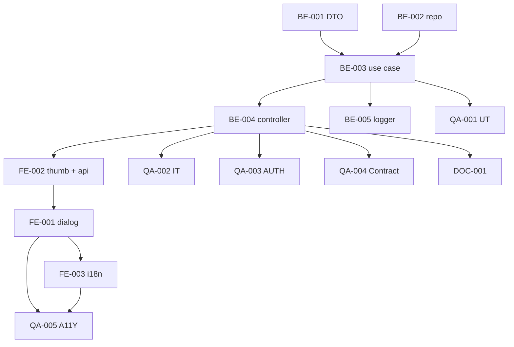

# Development Tasks — PB-P1-026 / US-048: Soft-deletear una imagen del portafolio

## 1. Metadata

| Field                                | Value                                                                              |
| ------------------------------------ | ---------------------------------------------------------------------------------- |
| User Story ID                        | US-048                                                                             |
| Source User Story                    | `management/user-stories/US-048-soft-delete-portfolio-image.md`                    |
| Source Technical Specification       | `management/technical-specs/P1/PB-P1-026/US-048-technical-spec.md`                 |
| Decision Resolution Artifact         | `management/user-stories/decision-resolutions/US-048-decision-resolution.md`       |
| Priority                             | P1                                                                                 |
| Backlog ID                           | PB-P1-026                                                                          |
| Backlog Title                        | Portafolio del vendor (10 imágenes / trabajo)                                      |
| Backlog Execution Order              | 45                                                                                 |
| User Story Position in Backlog Item  | 2 de 2 (US-043 → US-048)                                                            |
| Related User Stories in Backlog Item | US-043, US-048                                                                     |
| Epic                                 | EPIC-VND-001                                                                       |
| Backlog Item Dependencies            | PB-P1-024, PB-P0-001, PB-P0-003, US-043                                            |
| Feature                              | Soft delete vendor-driven del portafolio                                            |
| Module / Domain                      | Attachments / Vendors                                                              |
| Backlog Alignment Status             | Found                                                                              |
| Task Breakdown Status                | Ready for Sprint Planning                                                          |
| Created Date                         | 2026-06-26                                                                         |
| Last Updated                         | 2026-06-26                                                                         |

---

## 2. Source Validation

| Source                          | Found | Used | Notes                                                       |
| ------------------------------- | ----- | ---- | ----------------------------------------------------------- |
| User Story                      | Yes   | Yes  | Approved with Minor Notes.                                  |
| Technical Specification         | Yes   | Yes  | Ready for Task Breakdown.                                   |
| Decision Resolution Artifact    | Yes   | Yes  | 4/4 decisiones D1–D4 formalizadas.                          |
| Product Backlog Prioritized     | Yes   | Yes  | PB-P1-026 encontrado, execution order 45.                   |
| ADRs                            | N/A   | N/A  | No hay ADRs específicos.                                    |

---

## 3. Backlog Execution Context

### Parent Backlog Item

`PB-P1-026` cierre del backlog item con US-048. Reuso íntegro del módulo `modules/attachments` introducido en US-043.

### Execution Order Rationale

Posición 2 de 2 en PB-P1-026. Sin migraciones nuevas. Execution order 45.

### Related User Stories in Same Backlog Item

| User Story | Role in Backlog Item                          | Suggested Order |
| ---------- | --------------------------------------------- | --------------- |
| US-043     | Upload de imágenes por `work_label`.          | 1               |
| US-048     | Soft delete vendor-driven del attachment.     | 2               |

---

## 4. Task Breakdown Summary

| Area  | Number of Tasks | Notes                                                                                  |
| ----- | --------------: | -------------------------------------------------------------------------------------- |
| BE    |              5  | DTO, repository ext., use case, controller ext., logger ext.                            |
| FE    |              3  | DeleteImageDialog, ImageThumb ext. + vendorsApi, i18n.                                  |
| QA    |              5  | UT, IT, AUTH, Contract, A11Y.                                                           |
| DOC   |              1  | `docs/16 §M07`.                                                                         |
| **Total** |           14  |                                                                                        |

---

## 5. Traceability Matrix

| Acceptance Criterion       | Technical Spec Section | Task IDs                                                                                                                |
| -------------------------- | ---------------------- | ----------------------------------------------------------------------------------------------------------------------- |
| AC-01 soft delete válido    | §7 UseCase, §10 DB     | TASK-PB-P1-026-US-048-BE-002..004, TASK-PB-P1-026-US-048-BE-005, TASK-PB-P1-026-US-048-QA-002                          |
| AC-02 sin body              | §7 DTO                  | TASK-PB-P1-026-US-048-BE-001, TASK-PB-P1-026-US-048-QA-001                                                              |
| EC-01 ajeno/inexistente     | §7 repository           | TASK-PB-P1-026-US-048-BE-002, TASK-PB-P1-026-US-048-QA-002                                                              |
| EC-02 idempotencia          | §7 use case             | TASK-PB-P1-026-US-048-BE-003, TASK-PB-P1-026-US-048-QA-002                                                              |
| EC-03 PROFILE_HIDDEN        | §7 status check         | TASK-PB-P1-026-US-048-BE-003, TASK-PB-P1-026-US-048-QA-003                                                              |
| EC-04 perfil soft-deleted   | §7 status check         | TASK-PB-P1-026-US-048-BE-003, TASK-PB-P1-026-US-048-QA-003                                                              |
| EC-05 deletion_reason >500  | §7 DTO                  | TASK-PB-P1-026-US-048-BE-001, TASK-PB-P1-026-US-048-QA-001                                                              |
| AUTH-TS-01..08              | §12 Security            | TASK-PB-P1-026-US-048-QA-003                                                                                              |
| A11Y modal                  | §8 Accessibility        | TASK-PB-P1-026-US-048-FE-001, TASK-PB-P1-026-US-048-QA-005                                                              |
| i18n 4 locales              | §8 i18n                 | TASK-PB-P1-026-US-048-FE-003                                                                                              |
| Log `vendor.portfolio.deleted` | §14 Observability   | TASK-PB-P1-026-US-048-BE-005                                                                                              |

---

## 6. Development Tasks

### TASK-PB-P1-026-US-048-BE-001 — DTO Zod (path param + body opcional)

| Field                     | Value                                                            |
| ------------------------- | ---------------------------------------------------------------- |
| Area                      | Backend                                                           |
| Type                      | Implementation                                                    |
| Priority                  | Must                                                              |
| Estimate                  | XS                                                                |
| Depends On                | -                                                                 |
| Source AC(s)              | AC-02, EC-05                                                      |
| Technical Spec Section(s) | §7 DTOs                                                          |
| Backlog ID                | PB-P1-026                                                         |
| User Story ID             | US-048                                                            |
| Owner Role                | Backend                                                           |
| Status                    | To Do                                                             |

#### Objective

Crear `imageIdParam` (Zod `uuid()`) y `softDeletePortfolioImageBody` (Zod `.strict()` opcional con `deletion_reason 1..500`).

#### Acceptance Criteria Covered

AC-02, EC-05.

#### Definition of Done

- [ ] DTOs exportados.
- [ ] UT (UUID inválido, body vacío, body con reason válido/excedido).

---

### TASK-PB-P1-026-US-048-BE-002 — Repository: `findActiveOwnedByIdAndVendor` + `softDeleteByIdOwned`

| Field                     | Value                                                            |
| ------------------------- | ---------------------------------------------------------------- |
| Area                      | Backend                                                           |
| Type                      | Implementation                                                    |
| Priority                  | Must                                                              |
| Estimate                  | S                                                                 |
| Depends On                | US-043 (módulo attachments)                                       |
| Source AC(s)              | AC-01, EC-01                                                      |
| Technical Spec Section(s) | §7 Repository                                                     |
| Backlog ID                | PB-P1-026                                                         |
| User Story ID             | US-048                                                            |
| Owner Role                | Backend                                                           |
| Status                    | To Do                                                             |

#### Objective

Extender `AttachmentRepository` con `findActiveOwnedByIdAndVendor(imageId, ownerId)` y `softDeleteByIdOwned({ id, ownerId, deletedBy, deletionReason })`. WHERE incluye `status='active'` para guard TOCTOU.

#### Acceptance Criteria Covered

AC-01, EC-01.

#### Definition of Done

- [ ] Métodos funcionales.
- [ ] UT con mocks de Prisma.

---

### TASK-PB-P1-026-US-048-BE-003 — `SoftDeletePortfolioImageUseCase` con todas las branches

| Field                     | Value                                                            |
| ------------------------- | ---------------------------------------------------------------- |
| Area                      | Backend                                                           |
| Type                      | Implementation                                                    |
| Priority                  | Must                                                              |
| Estimate                  | M                                                                 |
| Depends On                | BE-001, BE-002                                                    |
| Source AC(s)              | AC-01..AC-02, EC-01..EC-05                                        |
| Technical Spec Section(s) | §7 UseCase                                                        |
| Backlog ID                | PB-P1-026                                                         |
| User Story ID             | US-048                                                            |
| Owner Role                | Backend                                                           |
| Status                    | To Do                                                             |

#### Objective

Implementar el use case con todas las branches: éxito, hidden, perfil soft-deleted, ajeno/inexistente/ya borrado (404 uniforme). Mapping a HTTP envelope.

#### Acceptance Criteria Covered

AC-01..AC-02, EC-01..EC-05.

#### Definition of Done

- [ ] Coverage ≥ 90%.
- [ ] Branches verificadas.

---

### TASK-PB-P1-026-US-048-BE-004 — Controller + ruta `DELETE /vendors/me/portfolio/images/:imageId`

| Field                     | Value                                                            |
| ------------------------- | ---------------------------------------------------------------- |
| Area                      | Backend / API                                                     |
| Type                      | Implementation                                                    |
| Priority                  | Must                                                              |
| Estimate                  | S                                                                 |
| Depends On                | BE-003                                                            |
| Source AC(s)              | AC-01                                                              |
| Technical Spec Section(s) | §7 Controllers, §9 API                                           |
| Backlog ID                | PB-P1-026                                                         |
| User Story ID             | US-048                                                            |
| Owner Role                | Backend                                                           |
| Status                    | To Do                                                             |

#### Objective

Extender `PortfolioController` con `deletePortfolioImage(req, res)` (responde `204`). Registrar la ruta con `VendorRoleGuard` + exclusion guards + Zod validador.

#### Acceptance Criteria Covered

AC-01.

#### Definition of Done

- [ ] Ruta funcional.

---

### TASK-PB-P1-026-US-048-BE-005 — Logger estructurado `vendor.portfolio.deleted`

| Field                     | Value                                                            |
| ------------------------- | ---------------------------------------------------------------- |
| Area                      | Backend / Observability                                           |
| Type                      | Implementation                                                    |
| Priority                  | Must                                                              |
| Estimate                  | XS                                                                |
| Depends On                | BE-003                                                            |
| Source AC(s)              | AC-01                                                              |
| Technical Spec Section(s) | §14 Observability                                                |
| Backlog ID                | PB-P1-026                                                         |
| User Story ID             | US-048                                                            |
| Owner Role                | Backend                                                           |
| Status                    | To Do                                                             |

#### Objective

Extender `vendor-events.ts` con `vendor.portfolio.deleted` (info) con `vendor_profile_id`, `attachment_id`, `work_label`, `deletion_reason`, `correlation_id`.

#### Acceptance Criteria Covered

AC-01.

#### Definition of Done

- [ ] Evento emitido desde el use case.
- [ ] UT verde.

---

### TASK-PB-P1-026-US-048-FE-001 — Componente `DeleteImageDialog` accesible

| Field                     | Value                                                            |
| ------------------------- | ---------------------------------------------------------------- |
| Area                      | Frontend                                                          |
| Type                      | Implementation                                                    |
| Priority                  | Must                                                              |
| Estimate                  | M                                                                 |
| Depends On                | FE-002                                                            |
| Source AC(s)              | AC-01, AC-02, A11Y                                                |
| Technical Spec Section(s) | §8 Components                                                    |
| Backlog ID                | PB-P1-026                                                         |
| User Story ID             | US-048                                                            |
| Owner Role                | Frontend                                                          |
| Status                    | To Do                                                             |

#### Objective

`DeleteImageDialog` modal con `role="dialog"`, focus trap, ESC, textarea opcional `deletion_reason` (con label visible), botones "Cancelar" (foco inicial) y "Eliminar".

#### Acceptance Criteria Covered

AC-01, AC-02, A11Y.

#### Definition of Done

- [ ] axe sin issues serios.
- [ ] Tests RTL verdes.

---

### TASK-PB-P1-026-US-048-FE-002 — Extender `ImageThumb` con CTA Eliminar + `vendorsApi.deletePortfolioImage` + MSW

| Field                     | Value                                                            |
| ------------------------- | ---------------------------------------------------------------- |
| Area                      | Frontend                                                          |
| Type                      | Implementation                                                    |
| Priority                  | Must                                                              |
| Estimate                  | S                                                                 |
| Depends On                | BE-004                                                            |
| Source AC(s)              | AC-01, AC-02                                                      |
| Technical Spec Section(s) | §8 Components, §8 Data Fetching                                  |
| Backlog ID                | PB-P1-026                                                         |
| User Story ID             | US-048                                                            |
| Owner Role                | Frontend                                                          |
| Status                    | To Do                                                             |

#### Objective

Extender `ImageThumb` con botón "Eliminar" (con `aria-label` que incluye el `work_label`). Añadir `vendorsApi.deletePortfolioImage({ imageId, deletionReason? })` y MSW handler cubriendo todos los códigos.

#### Acceptance Criteria Covered

AC-01, AC-02.

#### Definition of Done

- [ ] MSW cubre `204/400/401/403/404/409`.

---

### TASK-PB-P1-026-US-048-FE-003 — i18n: claves `vendor.portfolio.delete.*` en 4 locales

| Field                     | Value                                                            |
| ------------------------- | ---------------------------------------------------------------- |
| Area                      | Frontend / i18n                                                   |
| Type                      | Implementation                                                    |
| Priority                  | Must                                                              |
| Estimate                  | XS                                                                |
| Depends On                | FE-001                                                            |
| Source AC(s)              | Locale support                                                    |
| Technical Spec Section(s) | §8 i18n                                                          |
| Backlog ID                | PB-P1-026                                                         |
| User Story ID             | US-048                                                            |
| Owner Role                | Frontend                                                          |
| Status                    | To Do                                                             |

#### Objective

Añadir claves `vendor.portfolio.delete.*` en `messages/{es-LATAM,es-ES,pt,en}.json`.

#### Acceptance Criteria Covered

i18n.

#### Definition of Done

- [ ] 4 locales completos.

---

### TASK-PB-P1-026-US-048-QA-001 — Unit tests (DTO, repository, use case branches)

| Field                     | Value                                                            |
| ------------------------- | ---------------------------------------------------------------- |
| Area                      | QA                                                                |
| Type                      | Test                                                              |
| Priority                  | Must                                                              |
| Estimate                  | S                                                                 |
| Depends On                | BE-003                                                            |
| Source AC(s)              | AC-01..AC-02, EC-01..EC-05                                        |
| Technical Spec Section(s) | §13 Unit                                                          |
| Backlog ID                | PB-P1-026                                                         |
| User Story ID             | US-048                                                            |
| Owner Role                | QA / Backend                                                      |
| Status                    | To Do                                                             |

#### Definition of Done

- [ ] Coverage ≥ 90% del use case.

---

### TASK-PB-P1-026-US-048-QA-002 — Integration / API tests (matriz completa)

| Field                     | Value                                                            |
| ------------------------- | ---------------------------------------------------------------- |
| Area                      | QA                                                                |
| Type                      | Test                                                              |
| Priority                  | Must                                                              |
| Estimate                  | M                                                                 |
| Depends On                | BE-004                                                            |
| Source AC(s)              | AC-01..AC-02, EC-01..EC-05, NT-01..NT-06                          |
| Technical Spec Section(s) | §13 Integration                                                  |
| Backlog ID                | PB-P1-026                                                         |
| User Story ID             | US-048                                                            |
| Owner Role                | QA / Backend                                                      |
| Status                    | To Do                                                             |

#### Definition of Done

- [ ] Idempotencia (segundo DELETE → 404) verificada.
- [ ] Verificación del log emitido.

---

### TASK-PB-P1-026-US-048-QA-003 — Authorization tests (AUTH-TS-01..AUTH-TS-08)

| Field                     | Value                                                            |
| ------------------------- | ---------------------------------------------------------------- |
| Area                      | QA / Security                                                     |
| Type                      | Test                                                              |
| Priority                  | Must                                                              |
| Estimate                  | S                                                                 |
| Depends On                | BE-004                                                            |
| Source AC(s)              | AUTH-TS-01..AUTH-TS-08                                            |
| Technical Spec Section(s) | §12 Security                                                     |
| Backlog ID                | PB-P1-026                                                         |
| User Story ID             | US-048                                                            |
| Owner Role                | QA / Security                                                     |
| Status                    | To Do                                                             |

#### Definition of Done

- [ ] 8 escenarios verdes.
- [ ] Confirmación de `404` uniforme (no `403` para ajeno).

---

### TASK-PB-P1-026-US-048-QA-004 — Contract test del response

| Field                     | Value                                                            |
| ------------------------- | ---------------------------------------------------------------- |
| Area                      | QA / API                                                          |
| Type                      | Test                                                              |
| Priority                  | Should                                                            |
| Estimate                  | XS                                                                |
| Depends On                | BE-004                                                            |
| Source AC(s)              | AC-01                                                              |
| Technical Spec Section(s) | §9 API                                                           |
| Backlog ID                | PB-P1-026                                                         |
| User Story ID             | US-048                                                            |
| Owner Role                | QA                                                                |
| Status                    | To Do                                                             |

#### Definition of Done

- [ ] Test contractual (status code y body vacío).

---

### TASK-PB-P1-026-US-048-QA-005 — Accessibility tests (modal + foco + ESC + textarea)

| Field                     | Value                                                            |
| ------------------------- | ---------------------------------------------------------------- |
| Area                      | QA / A11Y                                                         |
| Type                      | Test                                                              |
| Priority                  | Must                                                              |
| Estimate                  | S                                                                 |
| Depends On                | FE-001, FE-003                                                    |
| Source AC(s)              | A11Y                                                              |
| Technical Spec Section(s) | §13 Accessibility                                                |
| Backlog ID                | PB-P1-026                                                         |
| User Story ID             | US-048                                                            |
| Owner Role                | QA / Frontend                                                     |
| Status                    | To Do                                                             |

#### Definition of Done

- [ ] axe sin issues serios.
- [ ] Focus trap y ESC verificados.

---

### TASK-PB-P1-026-US-048-DOC-001 — Documentar `DELETE /vendors/me/portfolio/images/:imageId` en `docs/16 §M07`

| Field                     | Value                                                            |
| ------------------------- | ---------------------------------------------------------------- |
| Area                      | Documentation                                                     |
| Type                      | Documentation                                                     |
| Priority                  | Must                                                              |
| Estimate                  | XS                                                                |
| Depends On                | BE-004                                                            |
| Source AC(s)              | AC-01..AC-02, EC-01..EC-05                                        |
| Technical Spec Section(s) | §16                                                               |
| Backlog ID                | PB-P1-026                                                         |
| User Story ID             | US-048                                                            |
| Owner Role                | Backend / Doc                                                     |
| Status                    | To Do                                                             |

#### Definition of Done

- [ ] Sección añadida con request, response y errors.

---

## 7. Required QA Tasks

| Task ID                              | Test Type     | Purpose                                              |
| ------------------------------------ | ------------- | ---------------------------------------------------- |
| TASK-PB-P1-026-US-048-QA-001         | Unit          | DTO + repository + use case branches.                |
| TASK-PB-P1-026-US-048-QA-002         | Integration   | Matriz completa + idempotencia + log.                |
| TASK-PB-P1-026-US-048-QA-003         | Authorization | Matriz auth × estado + `404` uniforme.               |
| TASK-PB-P1-026-US-048-QA-004         | Contract      | Status code + body vacío.                            |
| TASK-PB-P1-026-US-048-QA-005         | Accessibility | Modal accesible.                                     |

---

## 8. Required Security Tasks

| Task ID                              | Security Concern                                  | Purpose                                       |
| ------------------------------------ | ------------------------------------------------- | --------------------------------------------- |
| TASK-PB-P1-026-US-048-QA-003         | Information leakage vía 403 vs 404.                | `404` uniforme verificado.                    |
| TASK-PB-P1-026-US-048-BE-002         | TOCTOU en UPDATE.                                  | Guard `status='active'` en WHERE.             |

---

## 9. Required Seed / Demo Tasks

`No aplica` (reuso del seed extendido de US-043). Opcional: añadir un attachment soft-deleted en seed para demo de idempotencia; no bloqueante.

---

## 10. Observability / Audit Tasks

| Task ID                              | Concern                                  | Purpose                              |
| ------------------------------------ | ---------------------------------------- | ------------------------------------ |
| TASK-PB-P1-026-US-048-BE-005         | Log `vendor.portfolio.deleted`.          | Trazabilidad operativa.              |

---

## 11. Documentation / Traceability Tasks

| Task ID                              | Document / Artifact      | Purpose                                |
| ------------------------------------ | ------------------------ | -------------------------------------- |
| TASK-PB-P1-026-US-048-DOC-001        | `docs/16 §M07`.          | Contrato del endpoint DELETE.          |

---

## 12. Dependency Graph

---

## 13. Suggested Implementation Order

### Phase 1 — Foundation
- BE-001 DTO
- BE-002 repository

### Phase 2 — Core Implementation
- BE-003 use case
- BE-005 logger
- BE-004 controller
- FE-002 thumb + vendorsApi + MSW
- FE-001 DeleteImageDialog
- FE-003 i18n

### Phase 3 — Validation / Security / QA
- QA-001 UT
- QA-002 IT
- QA-003 AUTH (con verificación de `404` uniforme)
- QA-004 Contract
- QA-005 A11Y

### Phase 4 — Documentation / Review
- DOC-001 `docs/16 §M07`

---

## 14. Risks & Mitigations

| Risk                                                           | Impact            | Mitigation                                              | Related Task         |
| -------------------------------------------------------------- | ----------------- | ------------------------------------------------------- | -------------------- |
| Race entre dos DELETE concurrentes.                             | Doble side-effect.| UPDATE con `WHERE status='active'` (TOCTOU-safe).        | BE-002, QA-002       |
| Information leakage vía discriminación 403/404.                  | Privacy issue.    | `404 ATTACHMENT_NOT_FOUND` uniforme.                     | BE-003, QA-003       |
| `deletion_reason` mal validado pasa al log.                      | Log pollution.    | Zod `.max(500)` + sanitize en logger.                    | BE-001, BE-005       |

---

## 15. Out of Scope Confirmation

- Hard delete físico, lifecycle policies, restauración (undelete), edición de `deletion_reason` post-delete, `AdminAction` para vendor-driven.

---

## 16. Readiness for Sprint Planning

| Check                                      | Status |
| ------------------------------------------ | ------ |
| Product Backlog mapping found              | Pass   |
| Every AC maps to tasks                     | Pass   |
| Technical Spec used when available         | Pass   |
| QA tasks included                          | Pass   |
| Security tasks included if applicable      | Pass   |
| Seed/demo tasks included if applicable     | N/A    |
| Observability tasks included if applicable | Pass   |
| Documentation tasks included if applicable | Pass   |
| Task dependencies clear                    | Pass   |
| Tasks small enough                         | Pass   |
| Ready for Sprint Planning                  | Yes    |

---

## 17. Final Recommendation

`Ready for Sprint Planning`.

US-048 cierra `PB-P1-026` con 14 tareas atómicas en 4 áreas (BE=5, FE=3, QA=5, DOC=1) reusando íntegramente el módulo `modules/attachments` introducido en US-043. Sin migraciones. Política `404 ATTACHMENT_NOT_FOUND` uniforme protege contra information leakage.
