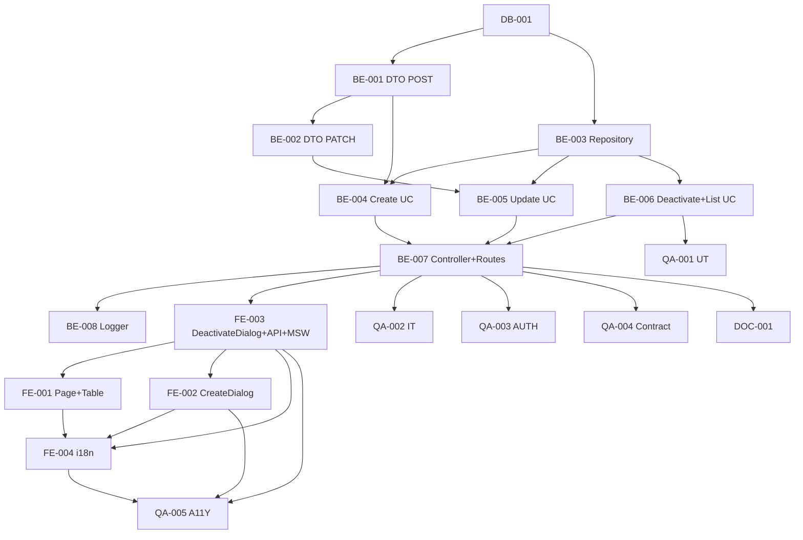

# Development Tasks — PB-P1-027 / US-044: CRUD VendorService

## 1. Metadata

| Field                                | Value                                                                              |
| ------------------------------------ | ---------------------------------------------------------------------------------- |
| User Story ID                        | US-044                                                                             |
| Source User Story                    | `management/user-stories/US-044-manage-vendor-services.md`                         |
| Source Technical Specification       | `management/technical-specs/P1/PB-P1-027/US-044-technical-spec.md`                 |
| Decision Resolution Artifact         | `management/user-stories/decision-resolutions/US-044-decision-resolution.md`       |
| Priority                             | P1                                                                                 |
| Backlog ID                           | PB-P1-027                                                                          |
| Backlog Title                        | VendorService (paquetes)                                                            |
| Backlog Execution Order              | 46                                                                                 |
| User Story Position in Backlog Item  | 1 de 1                                                                              |
| Related User Stories in Backlog Item | US-044                                                                              |
| Epic                                 | EPIC-VND-001                                                                       |
| Backlog Item Dependencies            | PB-P1-024, PB-P0-001, PB-P0-003                                                    |
| Feature                              | CRUD VendorService con soft delete via `is_active`                                  |
| Module / Domain                      | Vendors                                                                            |
| Backlog Alignment Status             | Found                                                                              |
| Task Breakdown Status                | Ready for Sprint Planning                                                          |
| Created Date                         | 2026-06-27                                                                         |
| Last Updated                         | 2026-06-27                                                                         |

---

## 2. Source Validation

| Source                          | Found | Used | Notes                                                       |
| ------------------------------- | ----- | ---- | ----------------------------------------------------------- |
| User Story                      | Yes   | Yes  | Approved with Minor Notes.                                  |
| Technical Specification         | Yes   | Yes  | Ready for Task Breakdown.                                   |
| Decision Resolution Artifact    | Yes   | Yes  | 6/6 decisiones D1–D6 formalizadas.                          |
| Product Backlog Prioritized     | Yes   | Yes  | PB-P1-027 encontrado, execution order 46.                   |
| ADRs                            | N/A   | N/A  | -                                                            |

---

## 3. Backlog Execution Context

`PB-P1-027` single-story (sólo US-044). Execution order 46. Depende de PB-P1-024 (US-040/041).

| User Story | Role in Backlog Item                          | Suggested Order |
| ---------- | --------------------------------------------- | --------------- |
| US-044     | CRUD VendorService.                            | 1               |

---

## 4. Task Breakdown Summary

| Area  | Number of Tasks | Notes                                                       |
| ----- | --------------: | ----------------------------------------------------------- |
| DB    |              1  | Verificación documental.                                     |
| BE    |              8  | 2 DTOs, repository, 4 use cases, controller + routes, logger. |
| FE    |              4  | Page + tabla, create dialog, deactivate dialog + vendorsApi, i18n. |
| QA    |              5  | UT, IT, AUTH, Contract, A11Y.                               |
| DOC   |              1  | `docs/16 §M07`.                                              |
| **Total** |           19  |                                                              |

---

## 5. Traceability Matrix

| Acceptance Criterion       | Technical Spec Section | Task IDs                                                                                                       |
| -------------------------- | ---------------------- | -------------------------------------------------------------------------------------------------------------- |
| AC-01a POST                 | §7 Create              | TASK-PB-P1-027-US-044-BE-001/003/006, TASK-PB-P1-027-US-044-QA-002                                            |
| AC-01b PATCH                | §7 Update              | TASK-PB-P1-027-US-044-BE-002/003/006, TASK-PB-P1-027-US-044-QA-002                                            |
| AC-01c DELETE soft          | §7 Deactivate          | TASK-PB-P1-027-US-044-BE-003/006, TASK-PB-P1-027-US-044-QA-002                                                |
| AC-01d GET                  | §7 List                | TASK-PB-P1-027-US-044-BE-003/006, TASK-PB-P1-027-US-044-QA-002                                                |
| EC-01..EC-09                | §6, §7                  | TASK-PB-P1-027-US-044-BE-001/002/003, TASK-PB-P1-027-US-044-QA-001/002                                        |
| AUTH-TS-01..08              | §12                     | TASK-PB-P1-027-US-044-QA-003                                                                                    |
| A11Y                        | §8                      | TASK-PB-P1-027-US-044-FE-002/003, TASK-PB-P1-027-US-044-QA-005                                                |
| i18n                         | §8                      | TASK-PB-P1-027-US-044-FE-004                                                                                    |
| Logs                         | §14                     | TASK-PB-P1-027-US-044-BE-008                                                                                    |

---

## 6. Development Tasks

### TASK-PB-P1-027-US-044-DB-001 — Verificar schema `vendor_services`

| Field                     | Value                                                            |
| ------------------------- | ---------------------------------------------------------------- |
| Area                      | Database / Prisma                                                |
| Type                      | Review                                                           |
| Priority                  | Must                                                             |
| Estimate                  | XS                                                               |
| Depends On                | PB-P0-001                                                         |
| Source AC(s)              | Precondiciones                                                    |
| Technical Spec Section(s) | §10                                                              |
| Backlog ID                | PB-P1-027                                                         |
| User Story ID             | US-044                                                            |
| Owner Role                | Backend                                                           |
| Status                    | To Do                                                             |

#### Objective

Confirmar columnas `package_name`, `description`, `base_price (numeric(14,2))`, `currency_code`, `service_category_id`, `is_active`, `ai_generated_description`; CHECK `base_price >= 0`; índices `idx_vendor_services_*`.

#### Definition of Done

- [ ] Pass o issue + migración menor abierta.

---

### TASK-PB-P1-027-US-044-BE-001 — DTO `createVendorServiceBody` (Zod estricto)

| Field                     | Value                                                            |
| ------------------------- | ---------------------------------------------------------------- |
| Area                      | Backend                                                           |
| Type                      | Implementation                                                    |
| Priority                  | Must                                                              |
| Estimate                  | S                                                                 |
| Depends On                | DB-001                                                            |
| Source AC(s)              | AC-01a, EC-01, EC-03, EC-05                                       |
| Technical Spec Section(s) | §7 DTOs                                                          |
| Backlog ID                | PB-P1-027                                                         |
| User Story ID             | US-044                                                            |
| Owner Role                | Backend                                                           |
| Status                    | To Do                                                             |

#### Objective

DTO POST con `.strict()`: longitudes D6, `base_price` `numeric(14,2)` regex `>= 0`, `currency_code` enum, `service_category_id` UUID.

#### Definition of Done

- [ ] DTO + UT (positivos y negativos).

---

### TASK-PB-P1-027-US-044-BE-002 — DTO `updateVendorServiceBody` (parcial estricto)

| Field                     | Value                                                            |
| ------------------------- | ---------------------------------------------------------------- |
| Area                      | Backend                                                           |
| Type                      | Implementation                                                    |
| Priority                  | Must                                                              |
| Estimate                  | S                                                                 |
| Depends On                | BE-001                                                            |
| Source AC(s)              | AC-01b                                                             |
| Technical Spec Section(s) | §7 DTOs                                                          |
| Backlog ID                | PB-P1-027                                                         |
| User Story ID             | US-044                                                            |
| Owner Role                | Backend                                                           |
| Status                    | To Do                                                             |

#### Objective

DTO PATCH con todos los campos opcionales + `is_active`, `.strict()`, `.refine` (al menos 1 campo).

#### Definition of Done

- [ ] DTO + UT.

---

### TASK-PB-P1-027-US-044-BE-003 — Repository `VendorServiceRepository` (7 métodos)

| Field                     | Value                                                            |
| ------------------------- | ---------------------------------------------------------------- |
| Area                      | Backend                                                           |
| Type                      | Implementation                                                    |
| Priority                  | Must                                                              |
| Estimate                  | M                                                                 |
| Depends On                | DB-001                                                            |
| Source AC(s)              | AC-01a..AC-01d                                                    |
| Technical Spec Section(s) | §7 Repository                                                     |
| Backlog ID                | PB-P1-027                                                         |
| User Story ID             | US-044                                                            |
| Owner Role                | Backend                                                           |
| Status                    | To Do                                                             |

#### Objective

`countActiveByVendorProfileId`, `findAllByVendorProfileId`, `findOwnedById`, `findActiveOwnedById`, `create`, `update`, `softDeleteByIdOwned`.

#### Definition of Done

- [ ] Métodos + UT con mocks de Prisma.

---

### TASK-PB-P1-027-US-044-BE-004 — `CreateVendorServiceUseCase`

| Field                     | Value                                                            |
| ------------------------- | ---------------------------------------------------------------- |
| Area                      | Backend                                                           |
| Type                      | Implementation                                                    |
| Priority                  | Must                                                              |
| Estimate                  | M                                                                 |
| Depends On                | BE-001, BE-003                                                    |
| Source AC(s)              | AC-01a, EC-01..EC-07                                              |
| Technical Spec Section(s) | §7 UseCase                                                        |
| Backlog ID                | PB-P1-027                                                         |
| User Story ID             | US-044                                                            |
| Owner Role                | Backend                                                           |
| Status                    | To Do                                                             |

#### Objective

Use case con todas las branches (status del perfil, tope, currency, categoría activa).

#### Definition of Done

- [ ] Coverage ≥ 90%.

---

### TASK-PB-P1-027-US-044-BE-005 — `UpdateVendorServiceUseCase` (incluye recheck tope al reactivar)

| Field                     | Value                                                            |
| ------------------------- | ---------------------------------------------------------------- |
| Area                      | Backend                                                           |
| Type                      | Implementation                                                    |
| Priority                  | Must                                                              |
| Estimate                  | M                                                                 |
| Depends On                | BE-002, BE-003                                                    |
| Source AC(s)              | AC-01b, EC-04, EC-08                                              |
| Technical Spec Section(s) | §7 UseCase                                                        |
| Backlog ID                | PB-P1-027                                                         |
| User Story ID             | US-044                                                            |
| Owner Role                | Backend                                                           |
| Status                    | To Do                                                             |

#### Definition of Done

- [ ] Coverage ≥ 90%.
- [ ] Reactivación verificada con tope.

---

### TASK-PB-P1-027-US-044-BE-006 — `DeactivateVendorServiceUseCase` y `ListVendorServicesUseCase`

| Field                     | Value                                                            |
| ------------------------- | ---------------------------------------------------------------- |
| Area                      | Backend                                                           |
| Type                      | Implementation                                                    |
| Priority                  | Must                                                              |
| Estimate                  | M                                                                 |
| Depends On                | BE-003                                                            |
| Source AC(s)              | AC-01c, AC-01d, EC-08, EC-09                                       |
| Technical Spec Section(s) | §7 UseCase                                                        |
| Backlog ID                | PB-P1-027                                                         |
| User Story ID             | US-044                                                            |
| Owner Role                | Backend                                                           |
| Status                    | To Do                                                             |

#### Objective

Deactivate: idempotente (servicio ya inactivo → 204 sin log de transición). List: orden `createdAt desc`.

#### Definition of Done

- [ ] Branches verificadas.
- [ ] Idempotencia testeada.

---

### TASK-PB-P1-027-US-044-BE-007 — Controller `VendorServiceController` + 4 rutas

| Field                     | Value                                                            |
| ------------------------- | ---------------------------------------------------------------- |
| Area                      | Backend / API                                                     |
| Type                      | Implementation                                                    |
| Priority                  | Must                                                              |
| Estimate                  | S                                                                 |
| Depends On                | BE-004, BE-005, BE-006                                            |
| Source AC(s)              | AC-01a..AC-01d                                                    |
| Technical Spec Section(s) | §7 Controllers, §9                                               |
| Backlog ID                | PB-P1-027                                                         |
| User Story ID             | US-044                                                            |
| Owner Role                | Backend                                                           |
| Status                    | To Do                                                             |

#### Definition of Done

- [ ] 4 rutas registradas con guards.

---

### TASK-PB-P1-027-US-044-BE-008 — Logger `vendor.service.{created,updated,deactivated}`

| Field                     | Value                                                            |
| ------------------------- | ---------------------------------------------------------------- |
| Area                      | Backend / Observability                                           |
| Type                      | Implementation                                                    |
| Priority                  | Must                                                              |
| Estimate                  | XS                                                                |
| Depends On                | BE-004, BE-005, BE-006                                            |
| Source AC(s)              | AC-01a..AC-01c                                                    |
| Technical Spec Section(s) | §14                                                               |
| Backlog ID                | PB-P1-027                                                         |
| User Story ID             | US-044                                                            |
| Owner Role                | Backend                                                           |
| Status                    | To Do                                                             |

#### Definition of Done

- [ ] 3 eventos definidos y emitidos.

---

### TASK-PB-P1-027-US-044-FE-001 — Page `vendor/services` + tabla

| Field                     | Value                                                            |
| ------------------------- | ---------------------------------------------------------------- |
| Area                      | Frontend                                                          |
| Type                      | Implementation                                                    |
| Priority                  | Must                                                              |
| Estimate                  | M                                                                 |
| Depends On                | FE-003                                                            |
| Source AC(s)              | AC-01d                                                             |
| Technical Spec Section(s) | §8                                                                |
| Backlog ID                | PB-P1-027                                                         |
| User Story ID             | US-044                                                            |
| Owner Role                | Frontend                                                          |
| Status                    | To Do                                                             |

#### Objective

Page + `VendorServiceTable` (tabla semántica con `<th scope="col">`, contador "N/50" `aria-live`).

#### Definition of Done

- [ ] Página renderiza con TanStack prefetch.

---

### TASK-PB-P1-027-US-044-FE-002 — `CreateServiceDialog` accesible

| Field                     | Value                                                            |
| ------------------------- | ---------------------------------------------------------------- |
| Area                      | Frontend                                                          |
| Type                      | Implementation                                                    |
| Priority                  | Must                                                              |
| Estimate                  | M                                                                 |
| Depends On                | FE-003                                                            |
| Source AC(s)              | AC-01a                                                             |
| Technical Spec Section(s) | §8 Components                                                    |
| Backlog ID                | PB-P1-027                                                         |
| User Story ID             | US-044                                                            |
| Owner Role                | Frontend                                                          |
| Status                    | To Do                                                             |

#### Objective

Modal con RHF + Zod (espejo del backend POST), selector de categoría y moneda.

#### Definition of Done

- [ ] Modal accesible (role, focus trap, ESC).

---

### TASK-PB-P1-027-US-044-FE-003 — `DeactivateServiceDialog` + `vendorsApi.services.*` + MSW

| Field                     | Value                                                            |
| ------------------------- | ---------------------------------------------------------------- |
| Area                      | Frontend                                                          |
| Type                      | Implementation                                                    |
| Priority                  | Must                                                              |
| Estimate                  | M                                                                 |
| Depends On                | BE-007                                                            |
| Source AC(s)              | AC-01c, AC-01b reactivar                                          |
| Technical Spec Section(s) | §8                                                                |
| Backlog ID                | PB-P1-027                                                         |
| User Story ID             | US-044                                                            |
| Owner Role                | Frontend                                                          |
| Status                    | To Do                                                             |

#### Objective

Modal de confirmación de desactivación + namespace `vendorsApi.services` con 4 métodos + MSW handlers.

#### Definition of Done

- [ ] MSW cubre `200/201/204/400/401/403/404/409`.

---

### TASK-PB-P1-027-US-044-FE-004 — i18n `vendor.services.*` en 4 locales

| Field                     | Value                                                            |
| ------------------------- | ---------------------------------------------------------------- |
| Area                      | Frontend / i18n                                                   |
| Type                      | Implementation                                                    |
| Priority                  | Must                                                              |
| Estimate                  | S                                                                 |
| Depends On                | FE-001, FE-002, FE-003                                            |
| Source AC(s)              | i18n                                                              |
| Technical Spec Section(s) | §8 i18n                                                          |
| Backlog ID                | PB-P1-027                                                         |
| User Story ID             | US-044                                                            |
| Owner Role                | Frontend                                                          |
| Status                    | To Do                                                             |

#### Definition of Done

- [ ] 4 locales completos.

---

### TASK-PB-P1-027-US-044-QA-001 — Unit tests (DTOs + repository + use case branches)

| Field                     | Value                                                            |
| ------------------------- | ---------------------------------------------------------------- |
| Area                      | QA                                                                |
| Type                      | Test                                                              |
| Priority                  | Must                                                              |
| Estimate                  | M                                                                 |
| Depends On                | BE-004, BE-005, BE-006                                            |
| Source AC(s)              | EC-01..EC-09                                                       |
| Technical Spec Section(s) | §13                                                               |
| Backlog ID                | PB-P1-027                                                         |
| User Story ID             | US-044                                                            |
| Owner Role                | QA / Backend                                                      |
| Status                    | To Do                                                             |

#### Definition of Done

- [ ] Coverage ≥ 90%.

---

### TASK-PB-P1-027-US-044-QA-002 — Integration tests (4 endpoints, matriz completa)

| Field                     | Value                                                            |
| ------------------------- | ---------------------------------------------------------------- |
| Area                      | QA                                                                |
| Type                      | Test                                                              |
| Priority                  | Must                                                              |
| Estimate                  | M                                                                 |
| Depends On                | BE-007                                                            |
| Source AC(s)              | AC-01a..AC-01d, EC-01..EC-09, NT-01..NT-09                        |
| Technical Spec Section(s) | §13                                                               |
| Backlog ID                | PB-P1-027                                                         |
| User Story ID             | US-044                                                            |
| Owner Role                | QA                                                                |
| Status                    | To Do                                                             |

#### Definition of Done

- [ ] Verificación de visibilidad pública.
- [ ] Idempotencia DELETE.
- [ ] Reactivación con tope.

---

### TASK-PB-P1-027-US-044-QA-003 — Authorization tests (AUTH-TS-01..08)

| Field                     | Value                                                            |
| ------------------------- | ---------------------------------------------------------------- |
| Area                      | QA / Security                                                     |
| Type                      | Test                                                              |
| Priority                  | Must                                                              |
| Estimate                  | S                                                                 |
| Depends On                | BE-007                                                            |
| Source AC(s)              | AUTH-TS-01..08                                                    |
| Technical Spec Section(s) | §12                                                               |
| Backlog ID                | PB-P1-027                                                         |
| User Story ID             | US-044                                                            |
| Owner Role                | QA / Security                                                     |
| Status                    | To Do                                                             |

#### Definition of Done

- [ ] 8 escenarios verdes.
- [ ] `404 SERVICE_NOT_FOUND` uniforme.

---

### TASK-PB-P1-027-US-044-QA-004 — Contract tests del response shape

| Field                     | Value                                                            |
| ------------------------- | ---------------------------------------------------------------- |
| Area                      | QA / API                                                          |
| Type                      | Test                                                              |
| Priority                  | Should                                                            |
| Estimate                  | XS                                                                |
| Depends On                | BE-007                                                            |
| Source AC(s)              | AC-01a..AC-01d                                                    |
| Technical Spec Section(s) | §9                                                                |
| Backlog ID                | PB-P1-027                                                         |
| User Story ID             | US-044                                                            |
| Owner Role                | QA                                                                |
| Status                    | To Do                                                             |

#### Definition of Done

- [ ] Schema response validado.

---

### TASK-PB-P1-027-US-044-QA-005 — Accessibility tests (tabla + modales + contador)

| Field                     | Value                                                            |
| ------------------------- | ---------------------------------------------------------------- |
| Area                      | QA / A11Y                                                         |
| Type                      | Test                                                              |
| Priority                  | Must                                                              |
| Estimate                  | S                                                                 |
| Depends On                | FE-002, FE-003, FE-004                                            |
| Source AC(s)              | A11Y                                                              |
| Technical Spec Section(s) | §13                                                               |
| Backlog ID                | PB-P1-027                                                         |
| User Story ID             | US-044                                                            |
| Owner Role                | QA / Frontend                                                     |
| Status                    | To Do                                                             |

#### Definition of Done

- [ ] axe sin issues serios.

---

### TASK-PB-P1-027-US-044-DOC-001 — Documentar 4 endpoints en `docs/16 §M07`

| Field                     | Value                                                            |
| ------------------------- | ---------------------------------------------------------------- |
| Area                      | Documentation                                                     |
| Type                      | Documentation                                                     |
| Priority                  | Must                                                              |
| Estimate                  | S                                                                 |
| Depends On                | BE-007                                                            |
| Source AC(s)              | AC-01a..AC-01d                                                    |
| Technical Spec Section(s) | §16                                                               |
| Backlog ID                | PB-P1-027                                                         |
| User Story ID             | US-044                                                            |
| Owner Role                | Backend / Doc                                                     |
| Status                    | To Do                                                             |

#### Definition of Done

- [ ] 4 endpoints documentados.

---

## 7. Required QA Tasks

| Task ID                              | Test Type     | Purpose                                              |
| ------------------------------------ | ------------- | ---------------------------------------------------- |
| TASK-PB-P1-027-US-044-QA-001         | Unit          | DTOs + repository + use case branches.               |
| TASK-PB-P1-027-US-044-QA-002         | Integration   | Matriz 4 endpoints + visibilidad + idempotencia.     |
| TASK-PB-P1-027-US-044-QA-003         | Authorization | Matriz auth × estado + `404` uniforme.               |
| TASK-PB-P1-027-US-044-QA-004         | Contract      | Schema response.                                      |
| TASK-PB-P1-027-US-044-QA-005         | Accessibility | Tabla + modales + contador.                          |

---

## 8. Required Security Tasks

| Task ID                              | Security Concern                                  | Purpose                                       |
| ------------------------------------ | ------------------------------------------------- | --------------------------------------------- |
| TASK-PB-P1-027-US-044-QA-003         | Information leakage 403 vs 404.                   | `404 SERVICE_NOT_FOUND` uniforme.             |
| TASK-PB-P1-027-US-044-BE-005         | Race en reactivación con tope.                    | Recheck `countActive` antes de update.         |

---

## 9. Required Seed / Demo Tasks

`No aplica` (reuso de US-040). Opcional: vendor demo con 3 servicios mixtos; no bloqueante.

---

## 10. Observability / Audit Tasks

| Task ID                              | Concern                                                              | Purpose                                          |
| ------------------------------------ | -------------------------------------------------------------------- | ------------------------------------------------ |
| TASK-PB-P1-027-US-044-BE-008         | Logs `vendor.service.{created,updated,deactivated}`.                 | Trazabilidad operativa.                          |

---

## 11. Documentation / Traceability Tasks

| Task ID                              | Document / Artifact   | Purpose                                  |
| ------------------------------------ | --------------------- | ---------------------------------------- |
| TASK-PB-P1-027-US-044-DOC-001        | `docs/16 §M07`.       | Contrato de 4 endpoints.                 |

---

## 12. Dependency Graph

---

## 13. Suggested Implementation Order

### Phase 1 — Foundation
- DB-001
- BE-001 DTO POST
- BE-002 DTO PATCH
- BE-003 Repository

### Phase 2 — Core Implementation
- BE-004 Create UC
- BE-005 Update UC
- BE-006 Deactivate + List UC
- BE-007 Controller + 4 rutas
- BE-008 Logger
- FE-003 API + MSW + DeactivateDialog
- FE-001 Page + Table
- FE-002 CreateDialog
- FE-004 i18n

### Phase 3 — Validation / Security / QA
- QA-001 UT
- QA-002 IT
- QA-003 AUTH
- QA-004 Contract
- QA-005 A11Y

### Phase 4 — Documentation / Review
- DOC-001 `docs/16 §M07`

---

## 14. Risks & Mitigations

| Risk                                                            | Impact                | Mitigation                                              | Related Task         |
| --------------------------------------------------------------- | --------------------- | ------------------------------------------------------- | -------------------- |
| Race count vs create.                                            | Tope rebasado.        | Reintento o `SELECT FOR UPDATE`.                         | BE-004               |
| PATCH reactiva con tope rebasado.                                | Inconsistencia.       | Recheck `countActive` antes de update.                   | BE-005               |
| Información ajena vía 403 vs 404.                                | Privacy leak.         | `404 SERVICE_NOT_FOUND` uniforme.                         | BE-005, QA-003       |
| Categoría desactivada entre validación y commit.                 | FK fail.              | RESTRICT en FK + verificación previa.                    | BE-004, BE-005       |

---

## 15. Out of Scope Confirmation

- AI description (US-023), reordenamiento, bulk operations, hard delete, CRUD de categorías, visibilidad pública (US-045/US-047).

---

## 16. Readiness for Sprint Planning

| Check                                      | Status |
| ------------------------------------------ | ------ |
| Product Backlog mapping found              | Pass   |
| Every AC maps to tasks                     | Pass   |
| Technical Spec used when available         | Pass   |
| QA tasks included                          | Pass   |
| Security tasks included if applicable      | Pass   |
| Seed/demo tasks included if applicable     | N/A    |
| Observability tasks included if applicable | Pass   |
| Documentation tasks included if applicable | Pass   |
| Task dependencies clear                    | Pass   |
| Tasks small enough                         | Pass   |
| Ready for Sprint Planning                  | Yes    |

---

## 17. Final Recommendation

`Ready for Sprint Planning`.

US-044 cierra `PB-P1-027` con 19 tareas atómicas en 5 áreas (DB=1, BE=8, FE=4, QA=5, DOC=1). Sin migraciones. Política `404 SERVICE_NOT_FOUND` uniforme protege contra information leakage. Soft delete via `is_active` con guard TOCTOU.
