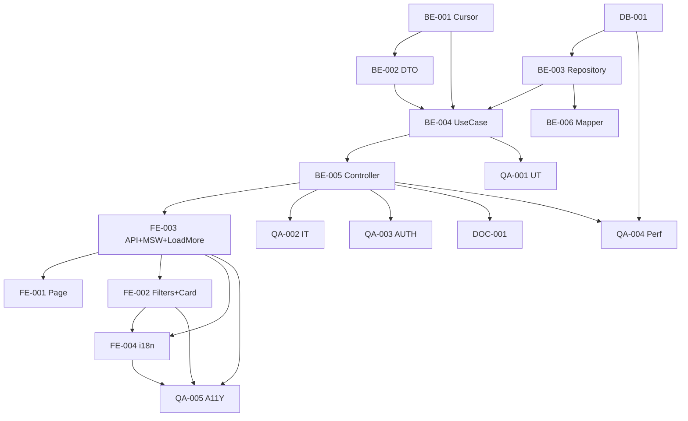

# Development Tasks — PB-P1-028 / US-045: Buscar proveedores en directorio (autenticado)

## 1. Metadata

| Field                                | Value                                                                              |
| ------------------------------------ | ---------------------------------------------------------------------------------- |
| User Story ID                        | US-045                                                                             |
| Source User Story                    | `management/user-stories/US-045-search-vendors.md`                                 |
| Source Technical Specification       | `management/technical-specs/P1/PB-P1-028/US-045-technical-spec.md`                 |
| Decision Resolution Artifact         | `management/user-stories/decision-resolutions/US-045-decision-resolution.md`       |
| Priority                             | P1                                                                                 |
| Backlog ID                           | PB-P1-028                                                                          |
| Backlog Title                        | Búsqueda de directorio de proveedores (organizer)                                  |
| Backlog Execution Order              | 47                                                                                 |
| User Story Position in Backlog Item  | 1 de 1                                                                              |
| Related User Stories in Backlog Item | US-045                                                                              |
| Epic                                 | EPIC-VND-001                                                                       |
| Backlog Item Dependencies            | PB-P1-024, PB-P1-027, US-047, PB-P0-001                                            |
| Feature                              | Búsqueda autenticada con cursor pagination                                          |
| Module / Domain                      | Vendors                                                                            |
| Backlog Alignment Status             | Found                                                                              |
| Task Breakdown Status                | Ready for Sprint Planning                                                          |
| Created Date                         | 2026-06-27                                                                         |
| Last Updated                         | 2026-06-27                                                                         |

---

## 2. Source Validation

| Source                          | Found | Used | Notes                                                       |
| ------------------------------- | ----- | ---- | ----------------------------------------------------------- |
| User Story                      | Yes   | Yes  | Approved with Minor Notes.                                  |
| Technical Specification         | Yes   | Yes  | Ready for Task Breakdown.                                   |
| Decision Resolution Artifact    | Yes   | Yes  | 8/8 decisiones D1–D8.                                       |
| Product Backlog Prioritized     | Yes   | Yes  | PB-P1-028 encontrado.                                       |
| ADRs                            | N/A   | N/A  | -                                                            |

---

## 3. Backlog Execution Context

PB-P1-028 single-story. Execution order 47. Depende de US-040/044/047 y PB-P0-001.

---

## 4. Task Breakdown Summary

| Area  | Number of Tasks | Notes                                                       |
| ----- | --------------: | ----------------------------------------------------------- |
| DB    |              1  | Verificación + posible índice compuesto.                     |
| BE    |              6  | Cursor helper, DTO, repository, use case, controller, mapper. |
| FE    |              4  | Page, filtros, grid + infinite scroll + vendorsApi, i18n.    |
| QA    |              5  | UT, IT, AUTH, Performance, A11Y.                             |
| DOC   |              1  | `docs/16 §M07`.                                              |
| **Total** |           17  |                                                              |

---

## 5. Traceability Matrix

| Acceptance Criterion | Technical Spec Section | Task IDs                                                                                                       |
| -------------------- | ---------------------- | -------------------------------------------------------------------------------------------------------------- |
| AC-01 búsqueda        | §7 UseCase             | TASK-PB-P1-028-US-045-BE-002..005, QA-002                                                                      |
| AC-02 cursor          | §7 Cursor              | TASK-PB-P1-028-US-045-BE-001, QA-001, QA-002                                                                   |
| AC-03 empty           | §7                      | TASK-PB-P1-028-US-045-BE-004, QA-002                                                                            |
| AC-04 auth            | §12                     | TASK-PB-P1-028-US-045-QA-003                                                                                    |
| EC-01..05             | §6, §7                  | TASK-PB-P1-028-US-045-BE-002/004, QA-001/002                                                                   |
| AUTH-TS-01..04        | §12                     | TASK-PB-P1-028-US-045-QA-003                                                                                    |
| A11Y                  | §8                      | TASK-PB-P1-028-US-045-FE-002, QA-005                                                                            |
| i18n                  | §8                      | TASK-PB-P1-028-US-045-FE-004                                                                                    |
| Performance           | §13                     | TASK-PB-P1-028-US-045-QA-004                                                                                    |

---

## 6. Development Tasks

### TASK-PB-P1-028-US-045-DB-001 — Verificar índices + decidir índice compuesto

| Field                     | Value                                                            |
| ------------------------- | ---------------------------------------------------------------- |
| Area                      | Database / Prisma                                                |
| Type                      | Review                                                           |
| Priority                  | Must                                                             |
| Estimate                  | S                                                                |
| Depends On                | PB-P0-001                                                         |
| Source AC(s)              | Performance NFR-PERF-001                                          |
| Technical Spec Section(s) | §10                                                              |
| Backlog ID                | PB-P1-028                                                         |
| User Story ID             | US-045                                                            |
| Owner Role                | Backend / DevOps                                                  |
| Status                    | To Do                                                             |

#### Objective

Confirmar `idx_vendor_profiles_status_location` y `idx_vendor_services_active`. Evaluar EXPLAIN ANALYZE de la query principal con seed; decidir si agregar `idx_vendor_profiles_directory (rating_avg, created_at, id) WHERE status='approved' AND deleted_at IS NULL`.

#### Definition of Done

- [ ] Pass o migración menor abierta.

---

### TASK-PB-P1-028-US-045-BE-001 — Helper `encodeCursor` / `decodeCursor` (base64url)

| Field                     | Value                                                            |
| ------------------------- | ---------------------------------------------------------------- |
| Area                      | Backend                                                           |
| Type                      | Implementation                                                    |
| Priority                  | Must                                                              |
| Estimate                  | S                                                                 |
| Depends On                | -                                                                 |
| Source AC(s)              | AC-02, EC-05                                                      |
| Technical Spec Section(s) | §7 Cursor                                                         |
| Backlog ID                | PB-P1-028                                                         |
| User Story ID             | US-045                                                            |
| Owner Role                | Backend                                                           |
| Status                    | To Do                                                             |

#### Definition of Done

- [ ] Funciones puras exportadas.
- [ ] UT (positivos + cursor corrupto).

---

### TASK-PB-P1-028-US-045-BE-002 — DTO Zod `searchVendorsQuery` con refines cross-field

| Field                     | Value                                                            |
| ------------------------- | ---------------------------------------------------------------- |
| Area                      | Backend                                                           |
| Type                      | Implementation                                                    |
| Priority                  | Must                                                              |
| Estimate                  | S                                                                 |
| Depends On                | BE-001                                                            |
| Source AC(s)              | EC-01..EC-04                                                      |
| Technical Spec Section(s) | §7 DTOs                                                          |
| Backlog ID                | PB-P1-028                                                         |
| User Story ID             | US-045                                                            |
| Owner Role                | Backend                                                           |
| Status                    | To Do                                                             |

#### Objective

Query schema con todos los params + refines (`currency_required_with_price`, `priceMin <= priceMax`).

#### Definition of Done

- [ ] DTO + UT.

---

### TASK-PB-P1-028-US-045-BE-003 — `VendorSearchRepository.searchApprovedVendors`

| Field                     | Value                                                            |
| ------------------------- | ---------------------------------------------------------------- |
| Area                      | Backend                                                           |
| Type                      | Implementation                                                    |
| Priority                  | Must                                                              |
| Estimate                  | L                                                                 |
| Depends On                | DB-001                                                            |
| Source AC(s)              | AC-01, AC-02                                                      |
| Technical Spec Section(s) | §7 Repository                                                     |
| Backlog ID                | PB-P1-028                                                         |
| User Story ID             | US-045                                                            |
| Owner Role                | Backend                                                           |
| Status                    | To Do                                                             |

#### Objective

Query Prisma con `$queryRaw` o builder: joins, EXISTS para category + price+currency, keyset predicate, `LIMIT (limit+1)`, mapping a row + `priceRange` agg.

#### Definition of Done

- [ ] Repository con UT (mocks) + smoke en DB de test.

---

### TASK-PB-P1-028-US-045-BE-004 — `SearchVendorsUseCase` (resolve slugs + branches)

| Field                     | Value                                                            |
| ------------------------- | ---------------------------------------------------------------- |
| Area                      | Backend                                                           |
| Type                      | Implementation                                                    |
| Priority                  | Must                                                              |
| Estimate                  | M                                                                 |
| Depends On                | BE-001, BE-002, BE-003                                            |
| Source AC(s)              | AC-01..AC-04, EC-01..EC-05                                        |
| Technical Spec Section(s) | §7 UseCase                                                        |
| Backlog ID                | PB-P1-028                                                         |
| User Story ID             | US-045                                                            |
| Owner Role                | Backend                                                           |
| Status                    | To Do                                                             |

#### Objective

Use case con resolución de slugs → IDs (errores ⇒ `400 INVALID_FILTERS`), decode cursor, llamada al repository, mapping del response.

#### Definition of Done

- [ ] Coverage ≥ 90%.

---

### TASK-PB-P1-028-US-045-BE-005 — Controller + ruta `GET /vendors`

| Field                     | Value                                                            |
| ------------------------- | ---------------------------------------------------------------- |
| Area                      | Backend / API                                                     |
| Type                      | Implementation                                                    |
| Priority                  | Must                                                              |
| Estimate                  | S                                                                 |
| Depends On                | BE-004                                                            |
| Source AC(s)              | AC-01..AC-04                                                      |
| Technical Spec Section(s) | §7 Controllers                                                    |
| Backlog ID                | PB-P1-028                                                         |
| User Story ID             | US-045                                                            |
| Owner Role                | Backend                                                           |
| Status                    | To Do                                                             |

#### Definition of Done

- [ ] Ruta con `authenticatedGuard` registrada.

---

### TASK-PB-P1-028-US-045-BE-006 — Mapper a card response shape

| Field                     | Value                                                            |
| ------------------------- | ---------------------------------------------------------------- |
| Area                      | Backend                                                           |
| Type                      | Implementation                                                    |
| Priority                  | Should                                                            |
| Estimate                  | XS                                                                |
| Depends On                | BE-003                                                            |
| Source AC(s)              | AC-01                                                              |
| Technical Spec Section(s) | §9                                                                |
| Backlog ID                | PB-P1-028                                                         |
| User Story ID             | US-045                                                            |
| Owner Role                | Backend                                                           |
| Status                    | To Do                                                             |

#### Objective

Mapper puro: row + `priceRange` agg → shape de card.

#### Definition of Done

- [ ] Mapper + UT.

---

### TASK-PB-P1-028-US-045-FE-001 — Page `organizer/vendors` con URL state

| Field                     | Value                                                            |
| ------------------------- | ---------------------------------------------------------------- |
| Area                      | Frontend                                                          |
| Type                      | Implementation                                                    |
| Priority                  | Must                                                              |
| Estimate                  | M                                                                 |
| Depends On                | FE-003                                                            |
| Source AC(s)              | AC-01..AC-03                                                      |
| Technical Spec Section(s) | §8                                                                |
| Backlog ID                | PB-P1-028                                                         |
| User Story ID             | US-045                                                            |
| Owner Role                | Frontend                                                          |
| Status                    | To Do                                                             |

#### Definition of Done

- [ ] Filtros sincronizados con URL.
- [ ] Página renderiza con `useInfiniteQuery`.

---

### TASK-PB-P1-028-US-045-FE-002 — `VendorFilters` + `VendorCard` accesibles

| Field                     | Value                                                            |
| ------------------------- | ---------------------------------------------------------------- |
| Area                      | Frontend                                                          |
| Type                      | Implementation                                                    |
| Priority                  | Must                                                              |
| Estimate                  | M                                                                 |
| Depends On                | FE-003                                                            |
| Source AC(s)              | AC-01, A11Y                                                       |
| Technical Spec Section(s) | §8                                                                |
| Backlog ID                | PB-P1-028                                                         |
| User Story ID             | US-045                                                            |
| Owner Role                | Frontend                                                          |
| Status                    | To Do                                                             |

#### Definition of Done

- [ ] Filtros con labels semánticos.
- [ ] Cards con `aria-labelledby`.

---

### TASK-PB-P1-028-US-045-FE-003 — `vendorsApi.search` + MSW + grid con "Cargar más"

| Field                     | Value                                                            |
| ------------------------- | ---------------------------------------------------------------- |
| Area                      | Frontend                                                          |
| Type                      | Implementation                                                    |
| Priority                  | Must                                                              |
| Estimate                  | M                                                                 |
| Depends On                | BE-005                                                            |
| Source AC(s)              | AC-02                                                              |
| Technical Spec Section(s) | §8                                                                |
| Backlog ID                | PB-P1-028                                                         |
| User Story ID             | US-045                                                            |
| Owner Role                | Frontend                                                          |
| Status                    | To Do                                                             |

#### Definition of Done

- [ ] MSW cubre `200/400/401`.
- [ ] "Cargar más" con `aria-busy`.

---

### TASK-PB-P1-028-US-045-FE-004 — i18n `directory.*` en 4 locales

| Field                     | Value                                                            |
| ------------------------- | ---------------------------------------------------------------- |
| Area                      | Frontend / i18n                                                   |
| Type                      | Implementation                                                    |
| Priority                  | Must                                                              |
| Estimate                  | S                                                                 |
| Depends On                | FE-002                                                            |
| Source AC(s)              | i18n + Empty                                                      |
| Technical Spec Section(s) | §8                                                                |
| Backlog ID                | PB-P1-028                                                         |
| User Story ID             | US-045                                                            |
| Owner Role                | Frontend                                                          |
| Status                    | To Do                                                             |

#### Definition of Done

- [ ] 4 locales completos.

---

### TASK-PB-P1-028-US-045-QA-001 — Unit tests (cursor, DTO, mapper, use case branches)

| Field                     | Value                                                            |
| ------------------------- | ---------------------------------------------------------------- |
| Area                      | QA                                                                |
| Type                      | Test                                                              |
| Priority                  | Must                                                              |
| Estimate                  | S                                                                 |
| Depends On                | BE-004                                                            |
| Source AC(s)              | EC-01..EC-05                                                      |
| Technical Spec Section(s) | §13                                                               |
| Backlog ID                | PB-P1-028                                                         |
| User Story ID             | US-045                                                            |
| Owner Role                | QA / Backend                                                      |
| Status                    | To Do                                                             |

#### Definition of Done

- [ ] Coverage ≥ 90%.

---

### TASK-PB-P1-028-US-045-QA-002 — Integration tests (visibilidad + filtros + cursor)

| Field                     | Value                                                            |
| ------------------------- | ---------------------------------------------------------------- |
| Area                      | QA                                                                |
| Type                      | Test                                                              |
| Priority                  | Must                                                              |
| Estimate                  | M                                                                 |
| Depends On                | BE-005                                                            |
| Source AC(s)              | AC-01..AC-04, EC-01..EC-05, NT-01..NT-07                          |
| Technical Spec Section(s) | §13                                                               |
| Backlog ID                | PB-P1-028                                                         |
| User Story ID             | US-045                                                            |
| Owner Role                | QA                                                                |
| Status                    | To Do                                                             |

#### Definition of Done

- [ ] Visibilidad (hidden/pending/rejected/soft-deleted no aparecen).
- [ ] Vendor exclusion verificado.
- [ ] Cursor consistente (sin duplicados).

---

### TASK-PB-P1-028-US-045-QA-003 — Authorization tests (AUTH-TS-01..04)

| Field                     | Value                                                            |
| ------------------------- | ---------------------------------------------------------------- |
| Area                      | QA / Security                                                     |
| Type                      | Test                                                              |
| Priority                  | Must                                                              |
| Estimate                  | XS                                                                |
| Depends On                | BE-005                                                            |
| Source AC(s)              | AUTH-TS-01..04                                                    |
| Technical Spec Section(s) | §12                                                               |
| Backlog ID                | PB-P1-028                                                         |
| User Story ID             | US-045                                                            |
| Owner Role                | QA                                                                |
| Status                    | To Do                                                             |

#### Definition of Done

- [ ] 4 escenarios verdes.

---

### TASK-PB-P1-028-US-045-QA-004 — Performance smoke (`< 1s p95` con seed)

| Field                     | Value                                                            |
| ------------------------- | ---------------------------------------------------------------- |
| Area                      | QA / Performance                                                  |
| Type                      | Test                                                              |
| Priority                  | Must                                                              |
| Estimate                  | S                                                                 |
| Depends On                | DB-001, BE-005                                                    |
| Source AC(s)              | NFR-PERF-001                                                      |
| Technical Spec Section(s) | §13 Performance                                                  |
| Backlog ID                | PB-P1-028                                                         |
| User Story ID             | US-045                                                            |
| Owner Role                | QA / DevOps                                                       |
| Status                    | To Do                                                             |

#### Definition of Done

- [ ] Smoke con N=1000 vendors aprobados.
- [ ] p95 < 1s reportado.

---

### TASK-PB-P1-028-US-045-QA-005 — Accessibility (filtros + cards + cargar más)

| Field                     | Value                                                            |
| ------------------------- | ---------------------------------------------------------------- |
| Area                      | QA / A11Y                                                         |
| Type                      | Test                                                              |
| Priority                  | Must                                                              |
| Estimate                  | S                                                                 |
| Depends On                | FE-002, FE-003, FE-004                                            |
| Source AC(s)              | A11Y                                                              |
| Technical Spec Section(s) | §13                                                               |
| Backlog ID                | PB-P1-028                                                         |
| User Story ID             | US-045                                                            |
| Owner Role                | QA / Frontend                                                     |
| Status                    | To Do                                                             |

#### Definition of Done

- [ ] axe sin issues serios.

---

### TASK-PB-P1-028-US-045-DOC-001 — Documentar `GET /api/v1/vendors` en `docs/16 §M07`

| Field                     | Value                                                            |
| ------------------------- | ---------------------------------------------------------------- |
| Area                      | Documentation                                                     |
| Type                      | Documentation                                                     |
| Priority                  | Must                                                              |
| Estimate                  | S                                                                 |
| Depends On                | BE-005                                                            |
| Source AC(s)              | AC-01..AC-04                                                      |
| Technical Spec Section(s) | §16                                                               |
| Backlog ID                | PB-P1-028                                                         |
| User Story ID             | US-045                                                            |
| Owner Role                | Backend / Doc                                                     |
| Status                    | To Do                                                             |

#### Definition of Done

- [ ] Query params + response shape + error codes documentados.

---

## 7. Required QA Tasks

| Task ID                              | Test Type     | Purpose                                              |
| ------------------------------------ | ------------- | ---------------------------------------------------- |
| TASK-PB-P1-028-US-045-QA-001         | Unit          | Cursor + DTO + mapper + use case.                    |
| TASK-PB-P1-028-US-045-QA-002         | Integration   | Filtros + visibilidad + cursor + vendor exclusion.   |
| TASK-PB-P1-028-US-045-QA-003         | Authorization | Matriz roles + sin sesión.                           |
| TASK-PB-P1-028-US-045-QA-004         | Performance   | `< 1s p95` con N=1000.                                |
| TASK-PB-P1-028-US-045-QA-005         | Accessibility | Filtros + cards + cargar más.                        |

---

## 8. Required Security Tasks

| Task ID                              | Security Concern                                  | Purpose                                       |
| ------------------------------------ | ------------------------------------------------- | --------------------------------------------- |
| TASK-PB-P1-028-US-045-QA-003         | Auth requerido + visibilidad por status.          | Matriz AUTH-TS.                                |
| TASK-PB-P1-028-US-045-BE-001         | Inyección via cursor.                              | Decode estricto + tipos validados.            |

---

## 9. Required Seed / Demo Tasks

`No aplica` (reuso). Verificación: que el seed produce ≥ 10 vendors aprobados con cobertura de categorías y ciudades distintas.

---

## 10. Observability / Audit Tasks

`No aplica` (solo log estándar). Opcional: métrica `request_duration_seconds` con label `endpoint=vendor_search`.

---

## 11. Documentation / Traceability Tasks

| Task ID                              | Document / Artifact   | Purpose                                  |
| ------------------------------------ | --------------------- | ---------------------------------------- |
| TASK-PB-P1-028-US-045-DOC-001        | `docs/16 §M07`.       | Contrato del endpoint.                    |

---

## 12. Dependency Graph

---

## 13. Suggested Implementation Order

### Phase 1 — Foundation
- DB-001
- BE-001 Cursor
- BE-002 DTO

### Phase 2 — Core
- BE-003 Repository
- BE-006 Mapper
- BE-004 UseCase
- BE-005 Controller
- FE-003 API + MSW + Grid
- FE-002 Filters + Card
- FE-001 Page
- FE-004 i18n

### Phase 3 — QA
- QA-001 UT
- QA-002 IT
- QA-003 AUTH
- QA-004 Performance
- QA-005 A11Y

### Phase 4 — Doc
- DOC-001

---

## 14. Risks & Mitigations

| Risk                                                            | Impact                | Mitigation                                              | Related Task         |
| --------------------------------------------------------------- | --------------------- | ------------------------------------------------------- | -------------------- |
| Query lenta sin índice compuesto.                                | `> 1s` p95.            | DB-001 + QA-004 deciden.                                 | DB-001, QA-004       |
| Cursor inconsistente bajo cambios concurrentes.                  | Saltos/duplicados.    | Aceptar inconsistencia mínima MVP; documentado.          | BE-001               |
| N+1 cargando `priceRange`.                                       | Performance.           | Subquery agg en la query principal.                      | BE-003               |
| Inyección via cursor decode.                                     | RCE / data leak.       | Decode estricto, sólo `string`/`Date`.                   | BE-001, QA-001       |

---

## 15. Out of Scope Confirmation

- Cache, full-text avanzado, geoespacial, conversión moneda, sugerencias, sort override, versión pública (US-046).

---

## 16. Readiness for Sprint Planning

| Check                                      | Status |
| ------------------------------------------ | ------ |
| Product Backlog mapping found              | Pass   |
| Every AC maps to tasks                     | Pass   |
| Technical Spec used when available         | Pass   |
| QA tasks included                          | Pass   |
| Security tasks included if applicable      | Pass   |
| Seed/demo tasks included if applicable     | N/A    |
| Observability tasks included if applicable | N/A    |
| Documentation tasks included if applicable | Pass   |
| Task dependencies clear                    | Pass   |
| Tasks small enough                         | Pass   |
| Ready for Sprint Planning                  | Yes    |

---

## 17. Final Recommendation

`Ready for Sprint Planning`.

US-045 cierra PB-P1-028 con 17 tareas atómicas en 5 áreas. Keyset pagination + EXISTS subqueries + filtros slug-based. Sin migraciones obligatorias (1 índice compuesto opcional). 1 acción documental no bloqueante.
