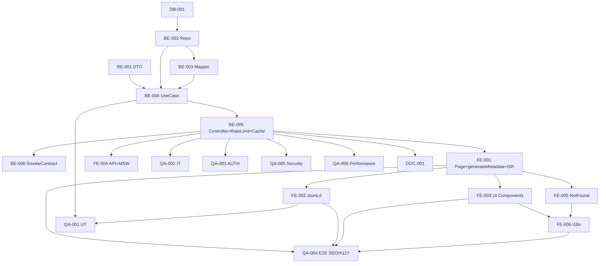

# Development Tasks — PB-P1-029 / US-046: Perfil público SEO del vendor

## 1. Metadata

| Field                                | Value                                                                              |
| ------------------------------------ | ---------------------------------------------------------------------------------- |
| User Story ID                        | US-046                                                                             |
| Source User Story                    | `management/user-stories/US-046-public-vendor-profile-seo.md`                      |
| Source Technical Specification       | `management/technical-specs/P1/PB-P1-029/US-046-technical-spec.md`                 |
| Decision Resolution Artifact         | `management/user-stories/decision-resolutions/US-046-decision-resolution.md`       |
| Priority                             | P1                                                                                 |
| Backlog ID                           | PB-P1-029                                                                          |
| Backlog Title                        | Perfil público SEO del vendor                                                      |
| Backlog Execution Order              | 48                                                                                 |
| User Story Position in Backlog Item  | 1 de 1                                                                              |
| Related User Stories in Backlog Item | US-046                                                                              |
| Epic                                 | EPIC-VND-001                                                                       |
| Backlog Item Dependencies            | PB-P1-024, PB-P1-026, PB-P1-027, US-047, PB-P0-001, PB-P0-007                       |
| Feature                              | Página pública SEO con SSR + ISR + JSON-LD                                          |
| Module / Domain                      | Vendors                                                                            |
| Backlog Alignment Status             | Found                                                                              |
| Task Breakdown Status                | Ready for Sprint Planning                                                          |
| Created Date                         | 2026-06-27                                                                         |
| Last Updated                         | 2026-06-27                                                                         |

---

## 2. Source Validation

| Source                          | Found | Used | Notes                                                       |
| ------------------------------- | ----- | ---- | ----------------------------------------------------------- |
| User Story                      | Yes   | Yes  | Approved with Minor Notes.                                  |
| Technical Specification         | Yes   | Yes  | Ready for Task Breakdown.                                   |
| Decision Resolution Artifact    | Yes   | Yes  | 7/7 decisiones D1–D7.                                       |
| Product Backlog Prioritized     | Yes   | Yes  | PB-P1-029 encontrado.                                       |
| ADRs                            | Yes   | Yes  | ADR-FE-001 (Next.js + App Router).                          |

---

## 3. Backlog Execution Context

PB-P1-029 single-story. Execution order 48.

| User Story | Role in Backlog Item                          | Suggested Order |
| ---------- | --------------------------------------------- | --------------- |
| US-046     | Perfil público SEO con SSR + JSON-LD.          | 1               |

---

## 4. Task Breakdown Summary

| Area  | Number of Tasks | Notes                                                                  |
| ----- | --------------: | ---------------------------------------------------------------------- |
| DB    |              1  | Verificación.                                                            |
| BE    |              6  | DTO, repository, mapper, use case, controller + rate limit + cache, smoke OG. |
| FE    |              6  | Page + generateMetadata, JsonLd, hero/gallery/packages/reviews, not-found, vendorsApi, i18n. |
| QA    |              6  | UT, IT, AUTH, E2E SEO, Security whitelist, Performance.                 |
| DOC   |              1  | `docs/16 §M07`.                                                          |
| **Total** |           20  |                                                                          |

---

## 5. Traceability Matrix

| Acceptance Criterion       | Technical Spec Section | Task IDs                                                                                                       |
| -------------------------- | ---------------------- | -------------------------------------------------------------------------------------------------------------- |
| AC-01 metadata + JSON-LD    | §8, §7                  | TASK-PB-P1-029-US-046-BE-002/003/004, FE-001/002, QA-004                                                       |
| AC-02 404 uniforme           | §7                      | TASK-PB-P1-029-US-046-BE-004, FE-005, QA-002, QA-003                                                            |
| AC-03 reviews 10             | §7 Repository           | TASK-PB-P1-029-US-046-BE-002/003, QA-002                                                                       |
| AC-04 cache headers          | §7 Controller, §8 ISR  | TASK-PB-P1-029-US-046-BE-005, FE-001, QA-002                                                                   |
| AC-05 rate limit             | §7                      | TASK-PB-P1-029-US-046-BE-005, QA-002                                                                            |
| EC-01..03                    | §7                      | TASK-PB-P1-029-US-046-BE-001/004, QA-002                                                                        |
| AUTH-TS-01..02              | §12                     | TASK-PB-P1-029-US-046-QA-003                                                                                    |
| A11Y                       | §8                      | TASK-PB-P1-029-US-046-FE-003/005, QA-004                                                                       |
| i18n                        | §8                      | TASK-PB-P1-029-US-046-FE-006                                                                                    |
| Whitelist                  | §12                     | TASK-PB-P1-029-US-046-BE-003, QA-005                                                                            |
| Performance                | §13                     | TASK-PB-P1-029-US-046-QA-006                                                                                    |

---

## 6. Development Tasks

### TASK-PB-P1-029-US-046-DB-001 — Verificar schema + índice slug

| Field                     | Value                                                            |
| ------------------------- | ---------------------------------------------------------------- |
| Area                      | Database / Prisma                                                |
| Type                      | Review                                                           |
| Priority                  | Must                                                             |
| Estimate                  | XS                                                               |
| Depends On                | PB-P0-001                                                         |
| Source AC(s)              | Precondiciones                                                    |
| Technical Spec Section(s) | §10                                                              |
| Backlog ID                | PB-P1-029                                                         |
| User Story ID             | US-046                                                            |
| Owner Role                | Backend                                                           |
| Status                    | To Do                                                             |

#### Definition of Done

- [ ] Pass o issue.

---

### TASK-PB-P1-029-US-046-BE-001 — DTO Zod `slugParam`

| Field                     | Value                                                            |
| ------------------------- | ---------------------------------------------------------------- |
| Area                      | Backend                                                           |
| Type                      | Implementation                                                    |
| Priority                  | Must                                                              |
| Estimate                  | XS                                                                |
| Depends On                | -                                                                 |
| Source AC(s)              | EC-03                                                              |
| Technical Spec Section(s) | §7 DTO                                                            |
| Backlog ID                | PB-P1-029                                                         |
| User Story ID             | US-046                                                            |
| Owner Role                | Backend                                                           |
| Status                    | To Do                                                             |

#### Objective

Slug regex `^[a-z0-9\-]+$`, longitud `[1..200]`.

#### Definition of Done

- [ ] DTO + UT (positivos + malformados).

---

### TASK-PB-P1-029-US-046-BE-002 — `PublicVendorRepository` (joins eager + reviews top 10)

| Field                     | Value                                                            |
| ------------------------- | ---------------------------------------------------------------- |
| Area                      | Backend                                                           |
| Type                      | Implementation                                                    |
| Priority                  | Must                                                              |
| Estimate                  | M                                                                 |
| Depends On                | DB-001                                                            |
| Source AC(s)              | AC-01, AC-03                                                      |
| Technical Spec Section(s) | §7 Repository                                                     |
| Backlog ID                | PB-P1-029                                                         |
| User Story ID             | US-046                                                            |
| Owner Role                | Backend                                                           |
| Status                    | To Do                                                             |

#### Objective

`findApprovedBySlug` + `countPublishedReviews` + `findFirstNPublishedReviews`. Eager loading de categories/packages activos/portfolio attachments activos.

#### Definition of Done

- [ ] Métodos + UT con mocks.

---

### TASK-PB-P1-029-US-046-BE-003 — Whitelist mapper `PublicVendorMapper`

| Field                     | Value                                                            |
| ------------------------- | ---------------------------------------------------------------- |
| Area                      | Backend / Security                                                |
| Type                      | Implementation                                                    |
| Priority                  | Must                                                              |
| Estimate                  | S                                                                 |
| Depends On                | BE-002                                                            |
| Source AC(s)              | AC-01, SEC-02, SEC-03                                              |
| Technical Spec Section(s) | §7 Mapper, §12                                                   |
| Backlog ID                | PB-P1-029                                                         |
| User Story ID             | US-046                                                            |
| Owner Role                | Backend / Security                                                |
| Status                    | To Do                                                             |

#### Objective

Mapper puro que transforma `VendorWithRelations` (Prisma) en `PublicVendorDto` con whitelist explícita (sólo D1).

#### Definition of Done

- [ ] Mapper exportado.
- [ ] UT verifica que email/teléfono/IDs internos NO aparecen en output.

---

### TASK-PB-P1-029-US-046-BE-004 — `GetPublicVendorBySlugUseCase`

| Field                     | Value                                                            |
| ------------------------- | ---------------------------------------------------------------- |
| Area                      | Backend                                                           |
| Type                      | Implementation                                                    |
| Priority                  | Must                                                              |
| Estimate                  | M                                                                 |
| Depends On                | BE-001, BE-002, BE-003                                            |
| Source AC(s)              | AC-01..AC-03, EC-01..EC-03                                        |
| Technical Spec Section(s) | §7 UseCase                                                        |
| Backlog ID                | PB-P1-029                                                         |
| User Story ID             | US-046                                                            |
| Owner Role                | Backend                                                           |
| Status                    | To Do                                                             |

#### Definition of Done

- [ ] Coverage ≥ 90%.

---

### TASK-PB-P1-029-US-046-BE-005 — Controller + ruta con rate limit + cache headers

| Field                     | Value                                                            |
| ------------------------- | ---------------------------------------------------------------- |
| Area                      | Backend / API                                                     |
| Type                      | Implementation                                                    |
| Priority                  | Must                                                              |
| Estimate                  | S                                                                 |
| Depends On                | BE-004, PB-P0-007                                                 |
| Source AC(s)              | AC-04, AC-05                                                      |
| Technical Spec Section(s) | §7 Controllers                                                    |
| Backlog ID                | PB-P1-029                                                         |
| User Story ID             | US-046                                                            |
| Owner Role                | Backend                                                           |
| Status                    | To Do                                                             |

#### Objective

Registrar `GET /api/v1/public/vendors/:slug` con rate limit middleware (60/min/IP) + `Cache-Control: public, max-age=60, stale-while-revalidate=300`.

#### Definition of Done

- [ ] Ruta operativa con headers.
- [ ] Rate limit verificado.

---

### TASK-PB-P1-029-US-046-BE-006 — Smoke OG / Twitter response shape validation

| Field                     | Value                                                            |
| ------------------------- | ---------------------------------------------------------------- |
| Area                      | Backend                                                           |
| Type                      | Test                                                              |
| Priority                  | Should                                                            |
| Estimate                  | XS                                                                |
| Depends On                | BE-005                                                            |
| Source AC(s)              | AC-01                                                              |
| Technical Spec Section(s) | §9                                                                |
| Backlog ID                | PB-P1-029                                                         |
| User Story ID             | US-046                                                            |
| Owner Role                | Backend                                                           |
| Status                    | To Do                                                             |

#### Objective

Test contractual del response shape contra Zod schema.

#### Definition of Done

- [ ] Schema validation verde.

---

### TASK-PB-P1-029-US-046-FE-001 — Page Server Component + `generateMetadata` + ISR

| Field                     | Value                                                            |
| ------------------------- | ---------------------------------------------------------------- |
| Area                      | Frontend                                                          |
| Type                      | Implementation                                                    |
| Priority                  | Must                                                              |
| Estimate                  | M                                                                 |
| Depends On                | BE-005                                                            |
| Source AC(s)              | AC-01, AC-04                                                      |
| Technical Spec Section(s) | §8                                                                |
| Backlog ID                | PB-P1-029                                                         |
| User Story ID             | US-046                                                            |
| Owner Role                | Frontend                                                          |
| Status                    | To Do                                                             |

#### Objective

`app/vendors/[slug]/page.tsx` con `export const revalidate = 300`, `generateMetadata` con OG + Twitter + canonical.

#### Definition of Done

- [ ] SSR funcional.
- [ ] Metadata presente.

---

### TASK-PB-P1-029-US-046-FE-002 — Componente `JsonLdLocalBusiness`

| Field                     | Value                                                            |
| ------------------------- | ---------------------------------------------------------------- |
| Area                      | Frontend / SEO                                                    |
| Type                      | Implementation                                                    |
| Priority                  | Must                                                              |
| Estimate                  | S                                                                 |
| Depends On                | FE-001                                                            |
| Source AC(s)              | AC-01                                                              |
| Technical Spec Section(s) | §8                                                                |
| Backlog ID                | PB-P1-029                                                         |
| User Story ID             | US-046                                                            |
| Owner Role                | Frontend                                                          |
| Status                    | To Do                                                             |

#### Objective

`<script type="application/ld+json">` con `LocalBusiness` schema (D2). Omitir `image` si no hay portfolio, omitir `aggregateRating` si `reviewsCount=0`.

#### Definition of Done

- [ ] Componente exportado.
- [ ] UT validan shape contra schema.org `LocalBusiness`.

---

### TASK-PB-P1-029-US-046-FE-003 — Componentes UI (hero, gallery, packages, reviews)

| Field                     | Value                                                            |
| ------------------------- | ---------------------------------------------------------------- |
| Area                      | Frontend                                                          |
| Type                      | Implementation                                                    |
| Priority                  | Must                                                              |
| Estimate                  | M                                                                 |
| Depends On                | FE-001                                                            |
| Source AC(s)              | AC-01, AC-03                                                      |
| Technical Spec Section(s) | §8                                                                |
| Backlog ID                | PB-P1-029                                                         |
| User Story ID             | US-046                                                            |
| Owner Role                | Frontend                                                          |
| Status                    | To Do                                                             |

#### Objective

`VendorHero`, `PortfolioGallery`, `PackageList`, `ReviewList` con encabezados semánticos + `alt` + landmarks.

#### Definition of Done

- [ ] Componentes accesibles.
- [ ] Empty states correctos.

---

### TASK-PB-P1-029-US-046-FE-004 — `vendorsApi.public.get` (server-side fetch) + MSW

| Field                     | Value                                                            |
| ------------------------- | ---------------------------------------------------------------- |
| Area                      | Frontend                                                          |
| Type                      | Implementation                                                    |
| Priority                  | Must                                                              |
| Estimate                  | S                                                                 |
| Depends On                | BE-005                                                            |
| Source AC(s)              | AC-01                                                              |
| Technical Spec Section(s) | §8                                                                |
| Backlog ID                | PB-P1-029                                                         |
| User Story ID             | US-046                                                            |
| Owner Role                | Frontend                                                          |
| Status                    | To Do                                                             |

#### Definition of Done

- [ ] MSW handlers para `200/400/404/429`.

---

### TASK-PB-P1-029-US-046-FE-005 — Not-found page accesible

| Field                     | Value                                                            |
| ------------------------- | ---------------------------------------------------------------- |
| Area                      | Frontend                                                          |
| Type                      | Implementation                                                    |
| Priority                  | Must                                                              |
| Estimate                  | XS                                                                |
| Depends On                | FE-001                                                            |
| Source AC(s)              | AC-02                                                              |
| Technical Spec Section(s) | §8                                                                |
| Backlog ID                | PB-P1-029                                                         |
| User Story ID             | US-046                                                            |
| Owner Role                | Frontend                                                          |
| Status                    | To Do                                                             |

#### Objective

`app/vendors/[slug]/not-found.tsx` con encabezado semántico + CTA "Volver al directorio".

#### Definition of Done

- [ ] Page renderiza.
- [ ] Accesible.

---

### TASK-PB-P1-029-US-046-FE-006 — i18n `public_vendor.*` en 4 locales

| Field                     | Value                                                            |
| ------------------------- | ---------------------------------------------------------------- |
| Area                      | Frontend / i18n                                                   |
| Type                      | Implementation                                                    |
| Priority                  | Must                                                              |
| Estimate                  | S                                                                 |
| Depends On                | FE-003, FE-005                                                    |
| Source AC(s)              | i18n                                                              |
| Technical Spec Section(s) | §8                                                                |
| Backlog ID                | PB-P1-029                                                         |
| User Story ID             | US-046                                                            |
| Owner Role                | Frontend                                                          |
| Status                    | To Do                                                             |

#### Definition of Done

- [ ] 4 locales completos.

---

### TASK-PB-P1-029-US-046-QA-001 — Unit tests (DTO, mapper, use case branches, JSON-LD)

| Field                     | Value                                                            |
| ------------------------- | ---------------------------------------------------------------- |
| Area                      | QA                                                                |
| Type                      | Test                                                              |
| Priority                  | Must                                                              |
| Estimate                  | M                                                                 |
| Depends On                | BE-004, FE-002                                                    |
| Source AC(s)              | Múltiples                                                          |
| Technical Spec Section(s) | §13                                                               |
| Backlog ID                | PB-P1-029                                                         |
| User Story ID             | US-046                                                            |
| Owner Role                | QA                                                                |
| Status                    | To Do                                                             |

#### Definition of Done

- [ ] Coverage ≥ 90%.

---

### TASK-PB-P1-029-US-046-QA-002 — Integration tests (visibility, cache, rate limit)

| Field                     | Value                                                            |
| ------------------------- | ---------------------------------------------------------------- |
| Area                      | QA                                                                |
| Type                      | Test                                                              |
| Priority                  | Must                                                              |
| Estimate                  | M                                                                 |
| Depends On                | BE-005                                                            |
| Source AC(s)              | AC-02..AC-05, EC-01..EC-03, NT-01..NT-07                          |
| Technical Spec Section(s) | §13                                                               |
| Backlog ID                | PB-P1-029                                                         |
| User Story ID             | US-046                                                            |
| Owner Role                | QA                                                                |
| Status                    | To Do                                                             |

#### Definition of Done

- [ ] Visibility por status + cache headers + rate limit verificados.

---

### TASK-PB-P1-029-US-046-QA-003 — Authorization tests (AUTH-TS-01..02)

| Field                     | Value                                                            |
| ------------------------- | ---------------------------------------------------------------- |
| Area                      | QA / Security                                                     |
| Type                      | Test                                                              |
| Priority                  | Must                                                              |
| Estimate                  | XS                                                                |
| Depends On                | BE-005                                                            |
| Source AC(s)              | AUTH-TS-01..02                                                    |
| Technical Spec Section(s) | §12                                                               |
| Backlog ID                | PB-P1-029                                                         |
| User Story ID             | US-046                                                            |
| Owner Role                | QA                                                                |
| Status                    | To Do                                                             |

#### Definition of Done

- [ ] Anonymous y sesión retornan idéntico response.

---

### TASK-PB-P1-029-US-046-QA-004 — E2E SEO (metadata, OG, JSON-LD, A11Y)

| Field                     | Value                                                            |
| ------------------------- | ---------------------------------------------------------------- |
| Area                      | QA / E2E / A11Y                                                   |
| Type                      | Test                                                              |
| Priority                  | Must                                                              |
| Estimate                  | M                                                                 |
| Depends On                | FE-001..FE-006                                                    |
| Source AC(s)              | AC-01, A11Y                                                       |
| Technical Spec Section(s) | §13                                                               |
| Backlog ID                | PB-P1-029                                                         |
| User Story ID             | US-046                                                            |
| Owner Role                | QA / Frontend                                                     |
| Status                    | To Do                                                             |

#### Definition of Done

- [ ] Playwright valida metadata + OG + JSON-LD shape.
- [ ] axe sin issues serios.

---

### TASK-PB-P1-029-US-046-QA-005 — Security: whitelist + XSS

| Field                     | Value                                                            |
| ------------------------- | ---------------------------------------------------------------- |
| Area                      | QA / Security                                                     |
| Type                      | Test                                                              |
| Priority                  | Must                                                              |
| Estimate                  | S                                                                 |
| Depends On                | BE-005, FE-003                                                    |
| Source AC(s)              | SEC-02, SEC-03, SEC-06                                            |
| Technical Spec Section(s) | §12, §17                                                          |
| Backlog ID                | PB-P1-029                                                         |
| User Story ID             | US-046                                                            |
| Owner Role                | QA / Security                                                     |
| Status                    | To Do                                                             |

#### Objective

- Assert que email/teléfono/IDs internos NO aparecen en response.
- Bio con `<script>` se renderiza como texto.

#### Definition of Done

- [ ] Whitelist verificada.
- [ ] XSS test verde.

---

### TASK-PB-P1-029-US-046-QA-006 — Performance smoke (TTFB < 500ms)

| Field                     | Value                                                            |
| ------------------------- | ---------------------------------------------------------------- |
| Area                      | QA / Performance                                                  |
| Type                      | Test                                                              |
| Priority                  | Must                                                              |
| Estimate                  | S                                                                 |
| Depends On                | BE-005                                                            |
| Source AC(s)              | NFR-PERF-001                                                      |
| Technical Spec Section(s) | §13                                                               |
| Backlog ID                | PB-P1-029                                                         |
| User Story ID             | US-046                                                            |
| Owner Role                | QA / DevOps                                                       |
| Status                    | To Do                                                             |

#### Definition of Done

- [ ] TTFB `< 500ms` reportado en seed.

---

### TASK-PB-P1-029-US-046-DOC-001 — Documentar endpoint público en `docs/16 §M07`

| Field                     | Value                                                            |
| ------------------------- | ---------------------------------------------------------------- |
| Area                      | Documentation                                                     |
| Type                      | Documentation                                                     |
| Priority                  | Must                                                              |
| Estimate                  | S                                                                 |
| Depends On                | BE-005                                                            |
| Source AC(s)              | AC-01..AC-05                                                      |
| Technical Spec Section(s) | §16                                                               |
| Backlog ID                | PB-P1-029                                                         |
| User Story ID             | US-046                                                            |
| Owner Role                | Backend / Doc                                                     |
| Status                    | To Do                                                             |

#### Definition of Done

- [ ] Endpoint documentado con whitelist + headers + errores.

---

## 7. Required QA Tasks

Ver §6 (QA-001..QA-006).

---

## 8. Required Security Tasks

| Task ID                              | Security Concern                                  | Purpose                                       |
| ------------------------------------ | ------------------------------------------------- | --------------------------------------------- |
| TASK-PB-P1-029-US-046-BE-003         | Whitelist mapper.                                  | Prevenir PII leak.                            |
| TASK-PB-P1-029-US-046-BE-005         | Rate limit.                                        | DoS protection.                                |
| TASK-PB-P1-029-US-046-QA-005         | Whitelist + XSS.                                   | Test dedicado.                                |

---

## 9. Required Seed / Demo Tasks

`No aplica` (reuso). Verificar que al menos 1 vendor approved completo está en seed.

---

## 10. Observability / Audit Tasks

`No aplica` (solo log estándar).

---

## 11. Documentation / Traceability Tasks

| Task ID                              | Document / Artifact   | Purpose                                  |
| ------------------------------------ | --------------------- | ---------------------------------------- |
| TASK-PB-P1-029-US-046-DOC-001        | `docs/16 §M07`.       | Contrato del endpoint público.            |

---

## 12. Dependency Graph

---

## 13. Suggested Implementation Order

### Phase 1 — Foundation
- DB-001
- BE-001 DTO
- BE-002 Repository

### Phase 2 — Core Backend
- BE-003 Mapper
- BE-004 UseCase
- BE-005 Controller + rate limit + cache
- BE-006 Smoke contract

### Phase 3 — Frontend
- FE-004 API + MSW
- FE-001 Page + generateMetadata + ISR
- FE-002 JsonLd
- FE-003 UI components
- FE-005 NotFound
- FE-006 i18n

### Phase 4 — QA
- QA-001 UT
- QA-002 IT
- QA-003 AUTH
- QA-005 Security
- QA-004 E2E SEO + A11Y
- QA-006 Performance

### Phase 5 — Doc
- DOC-001

---

## 14. Risks & Mitigations

Ver §17 del Technical Spec.

---

## 15. Out of Scope Confirmation

- Sitemap.xml, invalidación on-demand, SEO localizado completo, reviews paginadas, comentarios/chat.

---

## 16. Readiness for Sprint Planning

| Check                                      | Status |
| ------------------------------------------ | ------ |
| Product Backlog mapping found              | Pass   |
| Every AC maps to tasks                     | Pass   |
| Technical Spec used when available         | Pass   |
| QA tasks included                          | Pass   |
| Security tasks included if applicable      | Pass   |
| Seed/demo tasks included if applicable     | N/A    |
| Observability tasks included if applicable | N/A    |
| Documentation tasks included if applicable | Pass   |
| Task dependencies clear                    | Pass   |
| Tasks small enough                         | Pass   |
| Ready for Sprint Planning                  | Yes    |

---

## 17. Final Recommendation

`Ready for Sprint Planning`.

US-046 cierra PB-P1-029 con 20 tareas atómicas en 5 áreas. Server Components + ISR + JSON-LD + endpoint público con rate limit y whitelist. Sin migraciones. 2 acciones documentales no bloqueantes.
