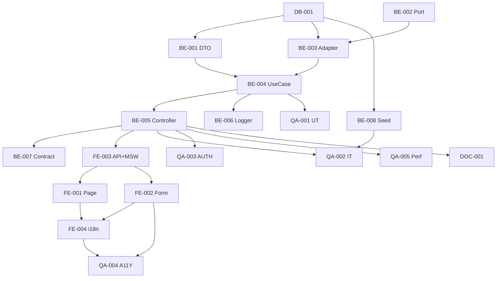

# Development Tasks — PB-P1-030 / US-049: Crear QuoteRequest con brief estructurado

## 1. Metadata

| Field                                | Value                                                                              |
| ------------------------------------ | ---------------------------------------------------------------------------------- |
| User Story ID                        | US-049                                                                             |
| Source User Story                    | `management/user-stories/US-049-send-quote-request.md`                             |
| Source Technical Specification       | `management/technical-specs/P1/PB-P1-030/US-049-technical-spec.md`                 |
| Decision Resolution Artifact         | `management/user-stories/decision-resolutions/US-049-decision-resolution.md`       |
| Priority                             | P1                                                                                 |
| Backlog ID                           | PB-P1-030                                                                          |
| Backlog Title                        | Crear QuoteRequest con brief estructurado (+ límite 5)                              |
| Backlog Execution Order              | 49                                                                                 |
| User Story Position in Backlog Item  | 1 de 2 (US-049 → US-050)                                                            |
| Related User Stories in Backlog Item | US-049, US-050                                                                     |
| Epic                                 | EPIC-QR-001                                                                        |
| Backlog Item Dependencies            | PB-P1-006, PB-P1-028, PB-P0-001, PB-P0-007                                         |
| Feature                              | Crear QuoteRequest con brief + transacción + 2 Notifications                        |
| Module / Domain                      | Quotes                                                                             |
| Backlog Alignment Status             | Found                                                                              |
| Task Breakdown Status                | Ready for Sprint Planning                                                          |
| Created Date                         | 2026-06-27                                                                         |
| Last Updated                         | 2026-06-27                                                                         |

---

## 2. Source Validation

| Source                          | Found | Used | Notes                                                       |
| ------------------------------- | ----- | ---- | ----------------------------------------------------------- |
| User Story                      | Yes   | Yes  | Approved with Minor Notes.                                  |
| Technical Specification         | Yes   | Yes  | Ready for Task Breakdown.                                   |
| Decision Resolution Artifact    | Yes   | Yes  | 9/9 decisiones.                                              |
| Product Backlog Prioritized     | Yes   | Yes  | PB-P1-030 encontrado.                                       |

---

## 3. Backlog Execution Context

PB-P1-030 con US-049 (1 de 2) + US-050 (QA exhaustivo del límite 5). Execution order 49.

---

## 4. Task Breakdown Summary

| Area  | Number of Tasks | Notes                                                       |
| ----- | --------------: | ----------------------------------------------------------- |
| DB    |              1  | Verificación + posible UNIQUE parcial activa.               |
| BE    |              8  | DTO, NotificationSenderPort, adapter, use case, controller, ruta + rate limit, logger, smoke contract. |
| FE    |              4  | Page, EventSnapshotCard + VendorCardSummary, form + quotesApi + MSW, i18n. |
| QA    |              5  | UT, IT, AUTH, A11Y, Performance.                            |
| DOC   |              1  | `docs/16 §M07`.                                              |
| **Total** |           19  |                                                              |

---

## 5. Traceability Matrix

| Acceptance Criterion       | Technical Spec Section | Task IDs                                                                                                       |
| -------------------------- | ---------------------- | -------------------------------------------------------------------------------------------------------------- |
| AC-01 envío exitoso         | §7                      | TASK-PB-P1-030-US-049-BE-001..006, QA-002                                                                      |
| AC-02 una activa par         | §7                      | TASK-PB-P1-030-US-049-BE-004, QA-002                                                                            |
| AC-03 reactivación          | §7                      | TASK-PB-P1-030-US-049-BE-004, QA-002                                                                            |
| AC-04 AI flag                | §7                      | TASK-PB-P1-030-US-049-BE-001/004, QA-002                                                                       |
| EC-01..06                    | §6                      | TASK-PB-P1-030-US-049-BE-001/004, QA-002                                                                       |
| AUTH-TS-01..05              | §12                     | TASK-PB-P1-030-US-049-QA-003                                                                                    |
| A11Y                       | §8                      | TASK-PB-P1-030-US-049-FE-002, QA-004                                                                            |
| i18n                        | §8                      | TASK-PB-P1-030-US-049-FE-004                                                                                    |
| Performance                | §13                     | TASK-PB-P1-030-US-049-QA-005                                                                                    |

---

## 6. Development Tasks

### TASK-PB-P1-030-US-049-DB-001 — Verificar schema `quote_requests` + UNIQUE parcial activa

| Field                     | Value                                                            |
| ------------------------- | ---------------------------------------------------------------- |
| Area                      | Database / Prisma                                                |
| Type                      | Review                                                           |
| Priority                  | Must                                                             |
| Estimate                  | S                                                                |
| Depends On                | PB-P0-001                                                         |
| Source AC(s)              | Precondiciones, AC-02                                             |
| Technical Spec Section(s) | §10                                                              |
| Backlog ID                | PB-P1-030                                                         |
| User Story ID             | US-049                                                            |
| Owner Role                | Backend                                                           |
| Status                    | To Do                                                             |

#### Objective

Confirmar columnas snapshot del evento, `ai_generated_brief`, `budget`, `currency_code`, `message`, índices `idx_quote_requests_event_category_active`, y UNIQUE parcial activa por (event_id, vendor_profile_id) WHERE `status IN (sent,viewed,responded,preferred)`. Si falta, abrir migración menor.

#### Definition of Done

- [ ] Pass o migración menor abierta.

---

### TASK-PB-P1-030-US-049-BE-001 — DTO Zod `createQuoteRequestBody`

| Field                     | Value                                                            |
| ------------------------- | ---------------------------------------------------------------- |
| Area                      | Backend                                                           |
| Type                      | Implementation                                                    |
| Priority                  | Must                                                              |
| Estimate                  | S                                                                 |
| Depends On                | DB-001                                                            |
| Source AC(s)              | AC-04, EC-03, EC-04                                               |
| Technical Spec Section(s) | §7 DTOs                                                          |
| Backlog ID                | PB-P1-030                                                         |
| User Story ID             | US-049                                                            |
| Owner Role                | Backend                                                           |
| Status                    | To Do                                                             |

#### Definition of Done

- [ ] DTO + UT.

---

### TASK-PB-P1-030-US-049-BE-002 — `NotificationSenderPort` (port)

| Field                     | Value                                                            |
| ------------------------- | ---------------------------------------------------------------- |
| Area                      | Backend                                                           |
| Type                      | Implementation                                                    |
| Priority                  | Must                                                              |
| Estimate                  | S                                                                 |
| Depends On                | -                                                                 |
| Source AC(s)              | AC-01                                                              |
| Technical Spec Section(s) | §7 Notification, docs/14                                          |
| Backlog ID                | PB-P1-030                                                         |
| User Story ID             | US-049                                                            |
| Owner Role                | Backend                                                           |
| Status                    | To Do                                                             |

#### Objective

Definir interfaz `notify({ channel, recipientUserId, event, deliveryStatus, payload, tx })` consistente con docs/14 §4.2. Reusable.

#### Definition of Done

- [ ] Port exportado.

---

### TASK-PB-P1-030-US-049-BE-003 — `NotificationSenderAdapter` (Prisma)

| Field                     | Value                                                            |
| ------------------------- | ---------------------------------------------------------------- |
| Area                      | Backend                                                           |
| Type                      | Implementation                                                    |
| Priority                  | Must                                                              |
| Estimate                  | S                                                                 |
| Depends On                | BE-002, DB-001                                                    |
| Source AC(s)              | AC-01                                                              |
| Technical Spec Section(s) | §7                                                                |
| Backlog ID                | PB-P1-030                                                         |
| User Story ID             | US-049                                                            |
| Owner Role                | Backend                                                           |
| Status                    | To Do                                                             |

#### Objective

Adapter Prisma que INSERT `notifications` row dentro de `tx`.

#### Definition of Done

- [ ] Adapter + UT.

---

### TASK-PB-P1-030-US-049-BE-004 — `CreateQuoteRequestUseCase` con transacción

| Field                     | Value                                                            |
| ------------------------- | ---------------------------------------------------------------- |
| Area                      | Backend                                                           |
| Type                      | Implementation                                                    |
| Priority                  | Must                                                              |
| Estimate                  | L                                                                 |
| Depends On                | BE-001, BE-002, BE-003                                            |
| Source AC(s)              | AC-01..AC-04, EC-01..EC-06                                        |
| Technical Spec Section(s) | §7 UseCase                                                        |
| Backlog ID                | PB-P1-030                                                         |
| User Story ID             | US-049                                                            |
| Owner Role                | Backend                                                           |
| Status                    | To Do                                                             |

#### Objective

UseCase con `prisma.$transaction` + SELECT FOR UPDATE + todas las branches + INSERT QR + 2 Notifications.

#### Definition of Done

- [ ] Coverage ≥ 90%.
- [ ] Rollback test verificado.

---

### TASK-PB-P1-030-US-049-BE-005 — Controller + ruta `POST /quote-requests` con rate limit

| Field                     | Value                                                            |
| ------------------------- | ---------------------------------------------------------------- |
| Area                      | Backend / API                                                     |
| Type                      | Implementation                                                    |
| Priority                  | Must                                                              |
| Estimate                  | S                                                                 |
| Depends On                | BE-004, PB-P0-007                                                 |
| Source AC(s)              | AC-01, EC-06                                                      |
| Technical Spec Section(s) | §7 Controllers                                                    |
| Backlog ID                | PB-P1-030                                                         |
| User Story ID             | US-049                                                            |
| Owner Role                | Backend                                                           |
| Status                    | To Do                                                             |

#### Definition of Done

- [ ] Ruta operativa con guards + rate limit.

---

### TASK-PB-P1-030-US-049-BE-006 — Logger `quote_request.created`

| Field                     | Value                                                            |
| ------------------------- | ---------------------------------------------------------------- |
| Area                      | Backend / Observability                                           |
| Type                      | Implementation                                                    |
| Priority                  | Must                                                              |
| Estimate                  | XS                                                                |
| Depends On                | BE-004                                                            |
| Source AC(s)              | AC-01                                                              |
| Technical Spec Section(s) | §14                                                               |
| Backlog ID                | PB-P1-030                                                         |
| User Story ID             | US-049                                                            |
| Owner Role                | Backend                                                           |
| Status                    | To Do                                                             |

#### Definition of Done

- [ ] Evento emitido con campos requeridos.

---

### TASK-PB-P1-030-US-049-BE-007 — Smoke contract del response

| Field                     | Value                                                            |
| ------------------------- | ---------------------------------------------------------------- |
| Area                      | Backend                                                           |
| Type                      | Test                                                              |
| Priority                  | Should                                                            |
| Estimate                  | XS                                                                |
| Depends On                | BE-005                                                            |
| Source AC(s)              | AC-01                                                              |
| Technical Spec Section(s) | §9                                                                |
| Backlog ID                | PB-P1-030                                                         |
| User Story ID             | US-049                                                            |
| Owner Role                | Backend                                                           |
| Status                    | To Do                                                             |

#### Definition of Done

- [ ] Schema response validado.

---

### TASK-PB-P1-030-US-049-BE-008 — Seed demo opcional

| Field                     | Value                                                            |
| ------------------------- | ---------------------------------------------------------------- |
| Area                      | Backend / Seed                                                    |
| Type                      | Implementation                                                    |
| Priority                  | Should                                                            |
| Estimate                  | XS                                                                |
| Depends On                | DB-001                                                            |
| Source AC(s)              | AC-01                                                              |
| Technical Spec Section(s) | §15                                                               |
| Backlog ID                | PB-P1-030                                                         |
| User Story ID             | US-049                                                            |
| Owner Role                | Backend                                                           |
| Status                    | To Do                                                             |

#### Objective

Escenario demo: organizer con evento active + vendor approved sin QR previa.

#### Definition of Done

- [ ] Seed reproducible.

---

### TASK-PB-P1-030-US-049-FE-001 — Page `events/[id]/quotes/new` con `EventSnapshotCard`

| Field                     | Value                                                            |
| ------------------------- | ---------------------------------------------------------------- |
| Area                      | Frontend                                                          |
| Type                      | Implementation                                                    |
| Priority                  | Must                                                              |
| Estimate                  | M                                                                 |
| Depends On                | FE-003                                                            |
| Source AC(s)              | AC-01                                                              |
| Technical Spec Section(s) | §8                                                                |
| Backlog ID                | PB-P1-030                                                         |
| User Story ID             | US-049                                                            |
| Owner Role                | Frontend                                                          |
| Status                    | To Do                                                             |

#### Definition of Done

- [ ] Page renderiza con snapshot.

---

### TASK-PB-P1-030-US-049-FE-002 — `QuoteRequestForm` accesible + `VendorCardSummary`

| Field                     | Value                                                            |
| ------------------------- | ---------------------------------------------------------------- |
| Area                      | Frontend                                                          |
| Type                      | Implementation                                                    |
| Priority                  | Must                                                              |
| Estimate                  | M                                                                 |
| Depends On                | FE-003                                                            |
| Source AC(s)              | AC-01, A11Y                                                       |
| Technical Spec Section(s) | §8                                                                |
| Backlog ID                | PB-P1-030                                                         |
| User Story ID             | US-049                                                            |
| Owner Role                | Frontend                                                          |
| Status                    | To Do                                                             |

#### Objective

Form RHF + Zod con labels semánticos + manejo de errores i18n por código.

#### Definition of Done

- [ ] axe sin issues serios.

---

### TASK-PB-P1-030-US-049-FE-003 — `quotesApi.createRequest` + MSW

| Field                     | Value                                                            |
| ------------------------- | ---------------------------------------------------------------- |
| Area                      | Frontend                                                          |
| Type                      | Implementation                                                    |
| Priority                  | Must                                                              |
| Estimate                  | S                                                                 |
| Depends On                | BE-005                                                            |
| Source AC(s)              | AC-01..AC-04                                                      |
| Technical Spec Section(s) | §8                                                                |
| Backlog ID                | PB-P1-030                                                         |
| User Story ID             | US-049                                                            |
| Owner Role                | Frontend                                                          |
| Status                    | To Do                                                             |

#### Definition of Done

- [ ] MSW handlers para `201/400/401/403/404/409/429`.

---

### TASK-PB-P1-030-US-049-FE-004 — i18n `quotes.create.*` en 4 locales

| Field                     | Value                                                            |
| ------------------------- | ---------------------------------------------------------------- |
| Area                      | Frontend / i18n                                                   |
| Type                      | Implementation                                                    |
| Priority                  | Must                                                              |
| Estimate                  | S                                                                 |
| Depends On                | FE-002                                                            |
| Source AC(s)              | i18n                                                              |
| Technical Spec Section(s) | §8                                                                |
| Backlog ID                | PB-P1-030                                                         |
| User Story ID             | US-049                                                            |
| Owner Role                | Frontend                                                          |
| Status                    | To Do                                                             |

#### Definition of Done

- [ ] 4 locales completos.

---

### TASK-PB-P1-030-US-049-QA-001 — Unit tests (DTO + UseCase branches + adapter)

| Field                     | Value                                                            |
| ------------------------- | ---------------------------------------------------------------- |
| Area                      | QA                                                                |
| Type                      | Test                                                              |
| Priority                  | Must                                                              |
| Estimate                  | M                                                                 |
| Depends On                | BE-004                                                            |
| Source AC(s)              | EC-01..EC-06                                                      |
| Technical Spec Section(s) | §13                                                               |
| Backlog ID                | PB-P1-030                                                         |
| User Story ID             | US-049                                                            |
| Owner Role                | QA / Backend                                                      |
| Status                    | To Do                                                             |

#### Definition of Done

- [ ] Coverage ≥ 90%.

---

### TASK-PB-P1-030-US-049-QA-002 — Integration tests (matriz + transacción + notifications)

| Field                     | Value                                                            |
| ------------------------- | ---------------------------------------------------------------- |
| Area                      | QA                                                                |
| Type                      | Test                                                              |
| Priority                  | Must                                                              |
| Estimate                  | M                                                                 |
| Depends On                | BE-005, BE-008                                                    |
| Source AC(s)              | AC-01..AC-04, EC-01..EC-06, NT-01..NT-08                          |
| Technical Spec Section(s) | §13                                                               |
| Backlog ID                | PB-P1-030                                                         |
| User Story ID             | US-049                                                            |
| Owner Role                | QA                                                                |
| Status                    | To Do                                                             |

#### Definition of Done

- [ ] 2 Notifications creadas verificadas.
- [ ] Rollback en error de Notification verificado.

---

### TASK-PB-P1-030-US-049-QA-003 — Authorization tests (AUTH-TS-01..05)

| Field                     | Value                                                            |
| ------------------------- | ---------------------------------------------------------------- |
| Area                      | QA / Security                                                     |
| Type                      | Test                                                              |
| Priority                  | Must                                                              |
| Estimate                  | S                                                                 |
| Depends On                | BE-005                                                            |
| Source AC(s)              | AUTH-TS-01..05                                                    |
| Technical Spec Section(s) | §12                                                               |
| Backlog ID                | PB-P1-030                                                         |
| User Story ID             | US-049                                                            |
| Owner Role                | QA                                                                |
| Status                    | To Do                                                             |

#### Definition of Done

- [ ] 5 escenarios verdes + uniformidad de `404 EVENT_NOT_FOUND`.

---

### TASK-PB-P1-030-US-049-QA-004 — Accessibility (form + errores)

| Field                     | Value                                                            |
| ------------------------- | ---------------------------------------------------------------- |
| Area                      | QA / A11Y                                                         |
| Type                      | Test                                                              |
| Priority                  | Must                                                              |
| Estimate                  | S                                                                 |
| Depends On                | FE-002, FE-004                                                    |
| Source AC(s)              | A11Y                                                              |
| Technical Spec Section(s) | §13                                                               |
| Backlog ID                | PB-P1-030                                                         |
| User Story ID             | US-049                                                            |
| Owner Role                | QA / Frontend                                                     |
| Status                    | To Do                                                             |

#### Definition of Done

- [ ] axe sin issues serios.

---

### TASK-PB-P1-030-US-049-QA-005 — Performance smoke (< 1s p95)

| Field                     | Value                                                            |
| ------------------------- | ---------------------------------------------------------------- |
| Area                      | QA / Performance                                                  |
| Type                      | Test                                                              |
| Priority                  | Must                                                              |
| Estimate                  | S                                                                 |
| Depends On                | BE-005                                                            |
| Source AC(s)              | NFR-PERF-001                                                      |
| Technical Spec Section(s) | §13                                                               |
| Backlog ID                | PB-P1-030                                                         |
| User Story ID             | US-049                                                            |
| Owner Role                | QA / DevOps                                                       |
| Status                    | To Do                                                             |

#### Definition of Done

- [ ] p95 `< 1s` reportado.

---

### TASK-PB-P1-030-US-049-DOC-001 — Documentar endpoint en `docs/16 §M07`

| Field                     | Value                                                            |
| ------------------------- | ---------------------------------------------------------------- |
| Area                      | Documentation                                                     |
| Type                      | Documentation                                                     |
| Priority                  | Must                                                              |
| Estimate                  | S                                                                 |
| Depends On                | BE-005                                                            |
| Source AC(s)              | AC-01                                                              |
| Technical Spec Section(s) | §16                                                               |
| Backlog ID                | PB-P1-030                                                         |
| User Story ID             | US-049                                                            |
| Owner Role                | Backend / Doc                                                     |
| Status                    | To Do                                                             |

#### Definition of Done

- [ ] Request + response + error codes documentados.

---

## 7. Required QA Tasks

Ver §6 (QA-001..QA-005).

---

## 8. Required Security Tasks

| Task ID                              | Security Concern                                  | Purpose                                       |
| ------------------------------------ | ------------------------------------------------- | --------------------------------------------- |
| TASK-PB-P1-030-US-049-QA-003         | Uniformidad de errores 404 vs 403.                | `404 EVENT_NOT_FOUND` uniforme.               |
| TASK-PB-P1-030-US-049-BE-005         | Rate limit por user.                              | DoS protection.                                |

---

## 9. Required Seed / Demo Tasks

| Task ID                              | Concern                                                              | Purpose                              |
| ------------------------------------ | -------------------------------------------------------------------- | ------------------------------------ |
| TASK-PB-P1-030-US-049-BE-008         | Escenario demo organizer + vendor approved.                          | Demo del happy path.                  |

---

## 10. Observability / Audit Tasks

| Task ID                              | Concern                                  | Purpose                              |
| ------------------------------------ | ---------------------------------------- | ------------------------------------ |
| TASK-PB-P1-030-US-049-BE-006         | Log `quote_request.created`.             | Trazabilidad operativa.              |

---

## 11. Documentation / Traceability Tasks

| Task ID                              | Document / Artifact   | Purpose                                  |
| ------------------------------------ | --------------------- | ---------------------------------------- |
| TASK-PB-P1-030-US-049-DOC-001        | `docs/16 §M07`.       | Contrato del endpoint.                    |

---

## 12. Dependency Graph

---

## 13. Suggested Implementation Order

### Phase 1 — Foundation
- DB-001
- BE-001 DTO
- BE-002 Port
- BE-003 Adapter

### Phase 2 — Core
- BE-004 UseCase
- BE-005 Controller
- BE-006 Logger
- BE-007 Contract
- BE-008 Seed
- FE-003 API + MSW
- FE-002 Form
- FE-001 Page
- FE-004 i18n

### Phase 3 — QA
- QA-001 UT
- QA-002 IT
- QA-003 AUTH
- QA-004 A11Y
- QA-005 Performance

### Phase 4 — Doc
- DOC-001

---

## 14. Risks & Mitigations

Ver §17 del Technical Spec.

---

## 15. Out of Scope Confirmation

- QA exhaustivo del límite 5 → US-050.
- Cambios de estado, edición de brief, email real, chat real-time.

---

## 16. Readiness for Sprint Planning

| Check                                      | Status |
| ------------------------------------------ | ------ |
| Product Backlog mapping found              | Pass   |
| Every AC maps to tasks                     | Pass   |
| Technical Spec used when available         | Pass   |
| QA tasks included                          | Pass   |
| Security tasks included if applicable      | Pass   |
| Seed/demo tasks included if applicable     | Pass   |
| Observability tasks included if applicable | Pass   |
| Documentation tasks included if applicable | Pass   |
| Task dependencies clear                    | Pass   |
| Tasks small enough                         | Pass   |
| Ready for Sprint Planning                  | Yes    |

---

## 17. Final Recommendation

`Ready for Sprint Planning`.

US-049 introduce el módulo `modules/quotes` con 19 tareas atómicas en 5 áreas. Transacción atómica con SELECT FOR UPDATE + 2 Notifications. US-050 cerrará PB-P1-030 con QA del límite 5 por categoría.
