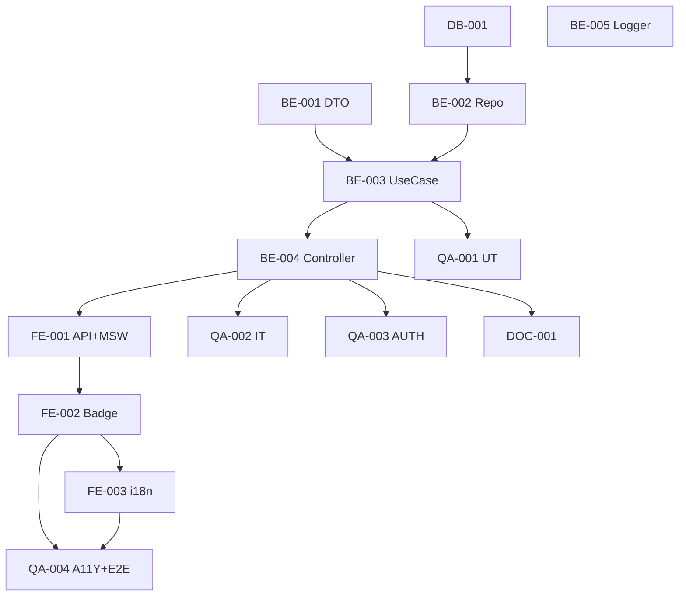

# Development Tasks — PB-P1-030 / US-050: Enforcement + UX del límite de 5 QR activas por categoría

## 1. Metadata

| Field                                | Value                                                                              |
| ------------------------------------ | ---------------------------------------------------------------------------------- |
| User Story ID                        | US-050                                                                             |
| Source User Story                    | `management/user-stories/US-050-quote-request-category-limit.md`                   |
| Source Technical Specification       | `management/technical-specs/P1/PB-P1-030/US-050-technical-spec.md`                 |
| Decision Resolution Artifact         | `management/user-stories/decision-resolutions/US-050-decision-resolution.md`       |
| Priority                             | P1                                                                                 |
| Backlog ID                           | PB-P1-030                                                                          |
| Backlog Title                        | Crear QuoteRequest con brief estructurado (+ límite 5)                              |
| Backlog Execution Order              | 50                                                                                 |
| User Story Position in Backlog Item  | 2 de 2 (US-049 → US-050)                                                            |
| Related User Stories in Backlog Item | US-049, US-050                                                                     |
| Epic                                 | EPIC-QR-001                                                                        |
| Backlog Item Dependencies            | US-049, PB-P0-001, PB-P0-007                                                       |
| Feature                              | Endpoint `active-count` + UX `QRLimitBadge` + QA exhaustivo                          |
| Module / Domain                      | Quotes                                                                             |
| Backlog Alignment Status             | Found                                                                              |
| Task Breakdown Status                | Ready for Sprint Planning                                                          |
| Created Date                         | 2026-06-27                                                                         |
| Last Updated                         | 2026-06-27                                                                         |

---

## 2. Source Validation

| Source                          | Found | Used | Notes                                                       |
| ------------------------------- | ----- | ---- | ----------------------------------------------------------- |
| User Story                      | Yes   | Yes  | Approved with Minor Notes.                                  |
| Technical Specification         | Yes   | Yes  | Ready for Task Breakdown.                                   |
| Decision Resolution Artifact    | Yes   | Yes  | 6/6 decisiones D1–D6.                                       |
| Product Backlog Prioritized     | Yes   | Yes  | PB-P1-030 cierre.                                            |

---

## 3. Backlog Execution Context

US-050 cierra PB-P1-030. Execution order 50. Depende del módulo `modules/quotes` introducido en US-049.

| User Story | Role in Backlog Item                          | Suggested Order |
| ---------- | --------------------------------------------- | --------------- |
| US-049     | Endpoint POST + brief + notificación.          | 1               |
| US-050     | Enforcement + endpoint count + UX badge.       | 2               |

---

## 4. Task Breakdown Summary

| Area  | Number of Tasks | Notes                                                       |
| ----- | --------------: | ----------------------------------------------------------- |
| DB    |              1  | Verificación + posible índice parcial nuevo.                |
| BE    |              5  | DTO, repository ext., use case, controller ext., logger ext. |
| FE    |              3  | `quotesApi.activeCount` + MSW, `QRLimitBadge`, i18n.        |
| QA    |              4  | UT, IT (incluye concurrencia + expiración lazy), AUTH, A11Y. |
| DOC   |              1  | `docs/16 §M07`.                                              |
| **Total** |           14  |                                                              |

---

## 5. Traceability Matrix

| Acceptance Criterion       | Technical Spec Section | Task IDs                                                                                                       |
| -------------------------- | ---------------------- | -------------------------------------------------------------------------------------------------------------- |
| AC-01 5ª OK                  | §7 US-049              | TASK-PB-P1-030-US-050-QA-002                                                                                    |
| AC-02 6ª 409                 | §7 US-049              | TASK-PB-P1-030-US-050-QA-002                                                                                    |
| AC-03 endpoint count          | §7                      | TASK-PB-P1-030-US-050-BE-001..004, QA-002                                                                      |
| AC-04 badge visible           | §8                      | TASK-PB-P1-030-US-050-FE-002, QA-004                                                                            |
| AC-05 concurrencia            | §7                      | TASK-PB-P1-030-US-050-QA-002                                                                                    |
| EC-01 expiración lazy        | §7 repository           | TASK-PB-P1-030-US-050-BE-002, QA-002                                                                            |
| EC-02 evento ajeno            | §7                      | TASK-PB-P1-030-US-050-BE-003, QA-003                                                                            |
| EC-03 categoría inválida      | §7                      | TASK-PB-P1-030-US-050-BE-001/003, QA-002                                                                       |
| AUTH-TS-01..06              | §12                     | TASK-PB-P1-030-US-050-QA-003                                                                                    |
| A11Y                       | §8                      | TASK-PB-P1-030-US-050-FE-002, QA-004                                                                            |
| Log limit_reached           | §14                     | TASK-PB-P1-030-US-050-BE-005                                                                                    |

---

## 6. Development Tasks

### TASK-PB-P1-030-US-050-DB-001 — Verificar + agregar índice parcial activo (opcional)

| Field                     | Value                                                            |
| ------------------------- | ---------------------------------------------------------------- |
| Area                      | Database / Prisma                                                |
| Type                      | Review                                                           |
| Priority                  | Must                                                             |
| Estimate                  | S                                                                |
| Depends On                | PB-P0-001, US-049 DB-001                                          |
| Source AC(s)              | Performance NFR-PERF-001                                          |
| Technical Spec Section(s) | §10                                                              |
| Backlog ID                | PB-P1-030                                                         |
| User Story ID             | US-050                                                            |
| Owner Role                | Backend / DevOps                                                  |
| Status                    | To Do                                                             |

#### Objective

Evaluar EXPLAIN ANALYZE del conteo y decidir si agregar `idx_quote_requests_event_category_active_status (event_id, service_category_id) WHERE status IN ('sent','viewed','responded','preferred')`.

#### Definition of Done

- [ ] Pass o migración menor abierta.

---

### TASK-PB-P1-030-US-050-BE-001 — DTO Zod `activeQrCountQuery`

| Field                     | Value                                                            |
| ------------------------- | ---------------------------------------------------------------- |
| Area                      | Backend                                                           |
| Type                      | Implementation                                                    |
| Priority                  | Must                                                              |
| Estimate                  | XS                                                                |
| Depends On                | -                                                                 |
| Source AC(s)              | AC-03, EC-03                                                      |
| Technical Spec Section(s) | §7                                                                |
| Backlog ID                | PB-P1-030                                                         |
| User Story ID             | US-050                                                            |
| Owner Role                | Backend                                                           |
| Status                    | To Do                                                             |

#### Definition of Done

- [ ] DTO + UT.

---

### TASK-PB-P1-030-US-050-BE-002 — Repository extension `countActiveByEventAndCategory` con conteo lazy

| Field                     | Value                                                            |
| ------------------------- | ---------------------------------------------------------------- |
| Area                      | Backend                                                           |
| Type                      | Implementation                                                    |
| Priority                  | Must                                                              |
| Estimate                  | S                                                                 |
| Depends On                | DB-001                                                            |
| Source AC(s)              | AC-03, EC-01                                                      |
| Technical Spec Section(s) | §7 Repository                                                     |
| Backlog ID                | PB-P1-030                                                         |
| User Story ID             | US-050                                                            |
| Owner Role                | Backend                                                           |
| Status                    | To Do                                                             |

#### Objective

`countActiveByEventAndCategory({ eventId, serviceCategoryId, activeStatuses, notExpired })`. WHERE incluye `expires_at IS NULL OR expires_at > NOW()`.

#### Definition of Done

- [ ] Método + UT (con QRs vencidas y no vencidas).

---

### TASK-PB-P1-030-US-050-BE-003 — `GetActiveQrCountUseCase`

| Field                     | Value                                                            |
| ------------------------- | ---------------------------------------------------------------- |
| Area                      | Backend                                                           |
| Type                      | Implementation                                                    |
| Priority                  | Must                                                              |
| Estimate                  | S                                                                 |
| Depends On                | BE-001, BE-002                                                    |
| Source AC(s)              | AC-03, EC-02, EC-03                                                |
| Technical Spec Section(s) | §7 UseCase                                                        |
| Backlog ID                | PB-P1-030                                                         |
| User Story ID             | US-050                                                            |
| Owner Role                | Backend                                                           |
| Status                    | To Do                                                             |

#### Objective

UseCase con verificación ownership + categoría activa + conteo lazy + cálculo de `available_slots`.

#### Definition of Done

- [ ] Coverage ≥ 90%.

---

### TASK-PB-P1-030-US-050-BE-004 — Controller + ruta `GET /quote-requests/active-count`

| Field                     | Value                                                            |
| ------------------------- | ---------------------------------------------------------------- |
| Area                      | Backend / API                                                     |
| Type                      | Implementation                                                    |
| Priority                  | Must                                                              |
| Estimate                  | XS                                                                |
| Depends On                | BE-003                                                            |
| Source AC(s)              | AC-03                                                              |
| Technical Spec Section(s) | §7 Controllers                                                    |
| Backlog ID                | PB-P1-030                                                         |
| User Story ID             | US-050                                                            |
| Owner Role                | Backend                                                           |
| Status                    | To Do                                                             |

#### Definition of Done

- [ ] Ruta registrada con guards.

---

### TASK-PB-P1-030-US-050-BE-005 — Logger `quote_request.limit_reached`

| Field                     | Value                                                            |
| ------------------------- | ---------------------------------------------------------------- |
| Area                      | Backend / Observability                                           |
| Type                      | Implementation                                                    |
| Priority                  | Must                                                              |
| Estimate                  | XS                                                                |
| Depends On                | US-049 BE-006                                                     |
| Source AC(s)              | AC-02                                                              |
| Technical Spec Section(s) | §14                                                               |
| Backlog ID                | PB-P1-030                                                         |
| User Story ID             | US-050                                                            |
| Owner Role                | Backend                                                           |
| Status                    | To Do                                                             |

#### Objective

Emitir `quote_request.limit_reached` (warn) en `CreateQuoteRequestUseCase` (US-049) cuando se lanza `QrCategoryLimitReachedError`. Campos: `event_id`, `service_category_id`, `active_count=5`, `correlation_id`.

#### Definition of Done

- [ ] Evento emitido en error de límite.

---

### TASK-PB-P1-030-US-050-FE-001 — `quotesApi.activeCount` + MSW

| Field                     | Value                                                            |
| ------------------------- | ---------------------------------------------------------------- |
| Area                      | Frontend                                                          |
| Type                      | Implementation                                                    |
| Priority                  | Must                                                              |
| Estimate                  | S                                                                 |
| Depends On                | BE-004                                                            |
| Source AC(s)              | AC-03, AC-04                                                      |
| Technical Spec Section(s) | §8                                                                |
| Backlog ID                | PB-P1-030                                                         |
| User Story ID             | US-050                                                            |
| Owner Role                | Frontend                                                          |
| Status                    | To Do                                                             |

#### Definition of Done

- [ ] MSW handlers para `200/400/401/403/404`.

---

### TASK-PB-P1-030-US-050-FE-002 — `QRLimitBadge` accesible + disable CTA en `QuoteRequestForm`

| Field                     | Value                                                            |
| ------------------------- | ---------------------------------------------------------------- |
| Area                      | Frontend                                                          |
| Type                      | Implementation                                                    |
| Priority                  | Must                                                              |
| Estimate                  | M                                                                 |
| Depends On                | FE-001, US-049 FE-002                                             |
| Source AC(s)              | AC-04, A11Y                                                       |
| Technical Spec Section(s) | §8                                                                |
| Backlog ID                | PB-P1-030                                                         |
| User Story ID             | US-050                                                            |
| Owner Role                | Frontend                                                          |
| Status                    | To Do                                                             |

#### Objective

Componente con `useQuery` + `aria-live` + disable del CTA con `aria-describedby` cuando `available_slots=0`. Invalidate tras mutation exitosa.

#### Definition of Done

- [ ] Badge accesible.
- [ ] CTA deshabilitado correctamente.

---

### TASK-PB-P1-030-US-050-FE-003 — i18n `quotes.limit.*` en 4 locales

| Field                     | Value                                                            |
| ------------------------- | ---------------------------------------------------------------- |
| Area                      | Frontend / i18n                                                   |
| Type                      | Implementation                                                    |
| Priority                  | Must                                                              |
| Estimate                  | S                                                                 |
| Depends On                | FE-002                                                            |
| Source AC(s)              | i18n                                                              |
| Technical Spec Section(s) | §8                                                                |
| Backlog ID                | PB-P1-030                                                         |
| User Story ID             | US-050                                                            |
| Owner Role                | Frontend                                                          |
| Status                    | To Do                                                             |

#### Definition of Done

- [ ] 4 locales completos (`label`, `reached`).

---

### TASK-PB-P1-030-US-050-QA-001 — Unit tests (DTO + repository + use case)

| Field                     | Value                                                            |
| ------------------------- | ---------------------------------------------------------------- |
| Area                      | QA                                                                |
| Type                      | Test                                                              |
| Priority                  | Must                                                              |
| Estimate                  | S                                                                 |
| Depends On                | BE-003                                                            |
| Source AC(s)              | AC-03, EC-01..EC-03                                                |
| Technical Spec Section(s) | §13                                                               |
| Backlog ID                | PB-P1-030                                                         |
| User Story ID             | US-050                                                            |
| Owner Role                | QA / Backend                                                      |
| Status                    | To Do                                                             |

#### Definition of Done

- [ ] Coverage ≥ 90%.

---

### TASK-PB-P1-030-US-050-QA-002 — Integration tests (límite + concurrencia + expiración lazy)

| Field                     | Value                                                            |
| ------------------------- | ---------------------------------------------------------------- |
| Area                      | QA                                                                |
| Type                      | Test                                                              |
| Priority                  | Must                                                              |
| Estimate                  | L                                                                 |
| Depends On                | BE-004, US-049 BE-005                                             |
| Source AC(s)              | AC-01, AC-02, AC-03, AC-05, EC-01..EC-03, NT-01..NT-04            |
| Technical Spec Section(s) | §13                                                               |
| Backlog ID                | PB-P1-030                                                         |
| User Story ID             | US-050                                                            |
| Owner Role                | QA / Backend                                                      |
| Status                    | To Do                                                             |

#### Objective

- TS-01..TS-04 (5 OK, 6º bloqueado, concurrencia, expiración).
- Log `quote_request.limit_reached` emitido en 409.

#### Definition of Done

- [ ] Concurrencia: 2 POST simultáneos → 1 `201` + 1 `409`.
- [ ] Expiración: QR vencida no cuenta.
- [ ] Log verificado.

---

### TASK-PB-P1-030-US-050-QA-003 — Authorization tests (AUTH-TS-01..06)

| Field                     | Value                                                            |
| ------------------------- | ---------------------------------------------------------------- |
| Area                      | QA / Security                                                     |
| Type                      | Test                                                              |
| Priority                  | Must                                                              |
| Estimate                  | S                                                                 |
| Depends On                | BE-004                                                            |
| Source AC(s)              | AUTH-TS-01..06                                                    |
| Technical Spec Section(s) | §12                                                               |
| Backlog ID                | PB-P1-030                                                         |
| User Story ID             | US-050                                                            |
| Owner Role                | QA                                                                |
| Status                    | To Do                                                             |

#### Definition of Done

- [ ] 6 escenarios verdes + `404 EVENT_NOT_FOUND` uniforme.

---

### TASK-PB-P1-030-US-050-QA-004 — Accessibility + E2E (badge + CTA + UI deshabilitado)

| Field                     | Value                                                            |
| ------------------------- | ---------------------------------------------------------------- |
| Area                      | QA / A11Y / E2E                                                   |
| Type                      | Test                                                              |
| Priority                  | Must                                                              |
| Estimate                  | M                                                                 |
| Depends On                | FE-002, FE-003                                                    |
| Source AC(s)              | AC-04, AC-05 (visual), A11Y                                       |
| Technical Spec Section(s) | §13                                                               |
| Backlog ID                | PB-P1-030                                                         |
| User Story ID             | US-050                                                            |
| Owner Role                | QA / Frontend                                                     |
| Status                    | To Do                                                             |

#### Objective

- Playwright TS-05 (badge se actualiza tras envío exitoso) y TS-06 (CTA deshabilitado con 5/5).
- axe sin issues serios.

#### Definition of Done

- [ ] axe verde.
- [ ] E2E verdes.

---

### TASK-PB-P1-030-US-050-DOC-001 — Documentar endpoint count en `docs/16 §M07`

| Field                     | Value                                                            |
| ------------------------- | ---------------------------------------------------------------- |
| Area                      | Documentation                                                     |
| Type                      | Documentation                                                     |
| Priority                  | Must                                                              |
| Estimate                  | XS                                                                |
| Depends On                | BE-004                                                            |
| Source AC(s)              | AC-03                                                              |
| Technical Spec Section(s) | §16                                                               |
| Backlog ID                | PB-P1-030                                                         |
| User Story ID             | US-050                                                            |
| Owner Role                | Backend / Doc                                                     |
| Status                    | To Do                                                             |

#### Definition of Done

- [ ] Request + response + error codes documentados.

---

## 7. Required QA Tasks

Ver §6 (QA-001..QA-004).

---

## 8. Required Security Tasks

| Task ID                              | Security Concern                                  | Purpose                                       |
| ------------------------------------ | ------------------------------------------------- | --------------------------------------------- |
| TASK-PB-P1-030-US-050-QA-003         | `404 EVENT_NOT_FOUND` uniforme.                   | Sin leak de ownership.                        |

---

## 9. Required Seed / Demo Tasks

`No aplica` (reuso US-049 BE-008). Verificar que el seed incluye escenario "4 QRs activas + 1 vencida".

---

## 10. Observability / Audit Tasks

| Task ID                              | Concern                                  | Purpose                              |
| ------------------------------------ | ---------------------------------------- | ------------------------------------ |
| TASK-PB-P1-030-US-050-BE-005         | Log `quote_request.limit_reached`.       | Trazabilidad operativa.              |

---

## 11. Documentation / Traceability Tasks

| Task ID                              | Document / Artifact   | Purpose                                  |
| ------------------------------------ | --------------------- | ---------------------------------------- |
| TASK-PB-P1-030-US-050-DOC-001        | `docs/16 §M07`.       | Contrato del endpoint count.              |

---

## 12. Dependency Graph

---

## 13. Suggested Implementation Order

### Phase 1 — Foundation
- DB-001
- BE-001 DTO
- BE-002 Repository

### Phase 2 — Core
- BE-003 UseCase
- BE-004 Controller
- BE-005 Logger
- FE-001 API + MSW
- FE-002 Badge
- FE-003 i18n

### Phase 3 — QA
- QA-001 UT
- QA-002 IT (concurrencia + expiración)
- QA-003 AUTH
- QA-004 A11Y + E2E

### Phase 4 — Doc
- DOC-001

---

## 14. Risks & Mitigations

Ver §17 del Technical Spec.

---

## 15. Out of Scope Confirmation

- Configurabilidad del límite, job background de expiración, bloqueo optimista.

---

## 16. Readiness for Sprint Planning

| Check                                      | Status |
| ------------------------------------------ | ------ |
| Product Backlog mapping found              | Pass   |
| Every AC maps to tasks                     | Pass   |
| Technical Spec used when available         | Pass   |
| QA tasks included                          | Pass   |
| Security tasks included if applicable      | Pass   |
| Seed/demo tasks included if applicable     | N/A    |
| Observability tasks included if applicable | Pass   |
| Documentation tasks included if applicable | Pass   |
| Task dependencies clear                    | Pass   |
| Tasks small enough                         | Pass   |
| Ready for Sprint Planning                  | Yes    |

---

## 17. Final Recommendation

`Ready for Sprint Planning`.

US-050 cierra PB-P1-030 con 14 tareas atómicas en 5 áreas. Endpoint dedicado de count + UX `QRLimitBadge` + QA exhaustivo incluyendo concurrencia y expiración lazy. Reuso del UseCase POST de US-049. Sin migraciones obligatorias.
