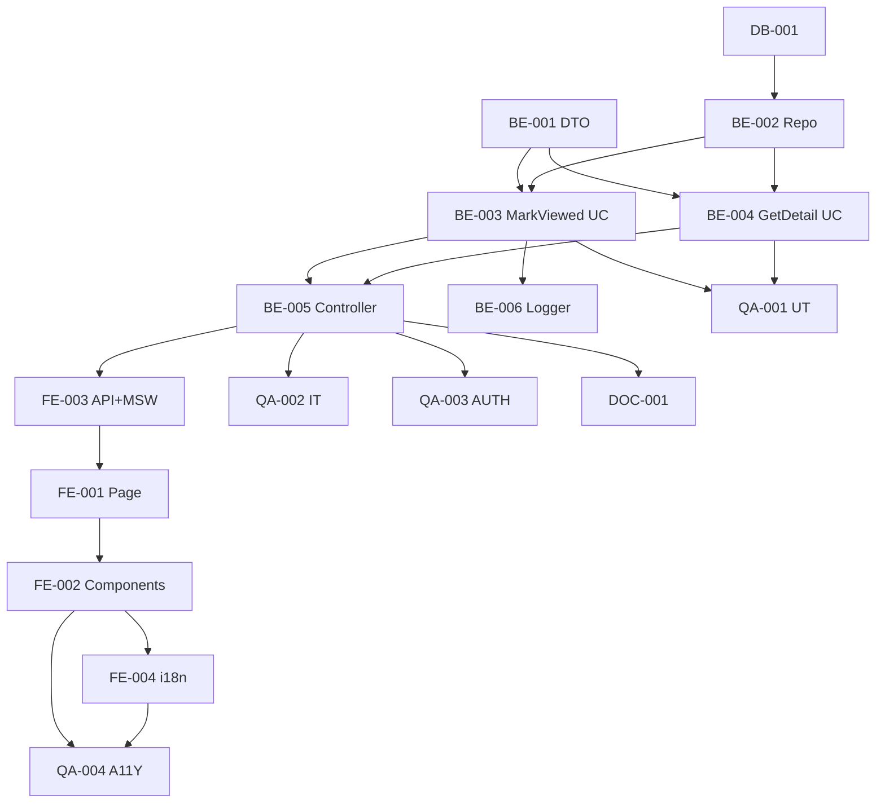

# Development Tasks — PB-P1-031 / US-051: Vendor marca QR como viewed

## 1. Metadata

| Field                                | Value                                                                              |
| ------------------------------------ | ---------------------------------------------------------------------------------- |
| User Story ID                        | US-051                                                                             |
| Source User Story                    | `management/user-stories/US-051-vendor-mark-quote-request-viewed.md`               |
| Source Technical Specification       | `management/technical-specs/P1/PB-P1-031/US-051-technical-spec.md`                 |
| Decision Resolution Artifact         | `management/user-stories/decision-resolutions/US-051-decision-resolution.md`       |
| Priority                             | P1                                                                                 |
| Backlog ID                           | PB-P1-031                                                                          |
| Backlog Title                        | Vendor visualiza y responde Quote (validez 15 días default)                        |
| Backlog Execution Order              | 51                                                                                 |
| User Story Position in Backlog Item  | 1 de 3 (US-051 → US-052 → US-053)                                                  |
| Related User Stories in Backlog Item | US-051, US-052, US-053                                                             |
| Epic                                 | EPIC-QR-001                                                                        |
| Backlog Item Dependencies            | US-049, PB-P0-001                                                                  |
| Feature                              | GET detalle + POST mark-viewed transaccional                                        |
| Module / Domain                      | Quotes                                                                             |
| Backlog Alignment Status             | Found                                                                              |
| Task Breakdown Status                | Ready for Sprint Planning                                                          |
| Created Date                         | 2026-06-27                                                                         |
| Last Updated                         | 2026-06-27                                                                         |

---

## 2. Source Validation

| Source                          | Found | Used | Notes                                                       |
| ------------------------------- | ----- | ---- | ----------------------------------------------------------- |
| User Story                      | Yes   | Yes  | Approved with Minor Notes.                                  |
| Technical Specification         | Yes   | Yes  | Ready for Task Breakdown.                                   |
| Decision Resolution Artifact    | Yes   | Yes  | 6/6 decisiones.                                             |
| Product Backlog Prioritized     | Yes   | Yes  | PB-P1-031.                                                  |

---

## 3. Backlog Execution Context

PB-P1-031 con 3 USs. US-051 es 1 de 3. Execution order 51.

---

## 4. Task Breakdown Summary

| Area  | Number of Tasks | Notes                                                       |
| ----- | --------------: | ----------------------------------------------------------- |
| DB    |              1  | Verificar columnas `viewed_at`/`viewed_by`.                 |
| BE    |              6  | DTO, repo ext., 2 use cases, controller + 2 rutas, logger.  |
| FE    |              4  | Page + orquestación, components, vendorApi + MSW, i18n.     |
| QA    |              4  | UT, IT (idempotencia), AUTH, A11Y.                          |
| DOC   |              1  | `docs/16 §M07`.                                              |
| **Total** |           16  |                                                              |

---

## 5. Traceability Matrix

| Acceptance Criterion       | Technical Spec Section | Task IDs                                                                                                       |
| -------------------------- | ---------------------- | -------------------------------------------------------------------------------------------------------------- |
| AC-01 primera transición    | §7 UseCase              | TASK-PB-P1-031-US-051-BE-003/004/005, QA-002                                                                  |
| AC-02 GET sin side-effect    | §7 UseCase              | TASK-PB-P1-031-US-051-BE-002/004, QA-002                                                                       |
| AC-03 idempotencia POST      | §7                      | TASK-PB-P1-031-US-051-BE-003, QA-002                                                                            |
| AC-04 estados distintos      | §7                      | TASK-PB-P1-031-US-051-BE-003, QA-002                                                                            |
| EC-01..05                    | §6                      | TASK-PB-P1-031-US-051-BE-001/002/003, QA-002                                                                   |
| AUTH-TS-01..05              | §12                     | TASK-PB-P1-031-US-051-QA-003                                                                                    |
| A11Y                       | §8                      | TASK-PB-P1-031-US-051-FE-002, QA-004                                                                            |
| i18n                       | §8                      | TASK-PB-P1-031-US-051-FE-004                                                                                    |
| Log viewed                  | §14                     | TASK-PB-P1-031-US-051-BE-006                                                                                    |

---

## 6. Development Tasks

### TASK-PB-P1-031-US-051-DB-001 — Verificar columnas `viewed_at`/`viewed_by` en `quote_requests`

| Field                     | Value                                                            |
| ------------------------- | ---------------------------------------------------------------- |
| Area                      | Database / Prisma                                                |
| Type                      | Review                                                           |
| Priority                  | Must                                                             |
| Estimate                  | XS                                                               |
| Depends On                | PB-P0-001                                                         |
| Source AC(s)              | Precondiciones AC-01                                              |
| Technical Spec Section(s) | §10                                                              |
| Backlog ID                | PB-P1-031                                                         |
| User Story ID             | US-051                                                            |
| Owner Role                | Backend                                                           |
| Status                    | To Do                                                             |

#### Objective

Confirmar `viewed_at` (timestamptz nullable) y `viewed_by` (uuid nullable FK users). Si faltan, abrir migración menor.

#### Definition of Done

- [ ] Pass o migración menor abierta.

---

### TASK-PB-P1-031-US-051-BE-001 — DTO Zod `qrIdParam`

| Field                     | Value                                                            |
| ------------------------- | ---------------------------------------------------------------- |
| Area                      | Backend                                                           |
| Type                      | Implementation                                                    |
| Priority                  | Must                                                              |
| Estimate                  | XS                                                                |
| Depends On                | -                                                                 |
| Source AC(s)              | EC-05                                                              |
| Technical Spec Section(s) | §7                                                                |
| Backlog ID                | PB-P1-031                                                         |
| User Story ID             | US-051                                                            |
| Owner Role                | Backend                                                           |
| Status                    | To Do                                                             |

#### Definition of Done

- [ ] DTO + UT.

---

### TASK-PB-P1-031-US-051-BE-002 — Repository extension `findByIdAndVendorProfile`

| Field                     | Value                                                            |
| ------------------------- | ---------------------------------------------------------------- |
| Area                      | Backend                                                           |
| Type                      | Implementation                                                    |
| Priority                  | Must                                                              |
| Estimate                  | S                                                                 |
| Depends On                | DB-001                                                            |
| Source AC(s)              | AC-02, EC-02..04                                                  |
| Technical Spec Section(s) | §7 Repository                                                     |
| Backlog ID                | PB-P1-031                                                         |
| User Story ID             | US-051                                                            |
| Owner Role                | Backend                                                           |
| Status                    | To Do                                                             |

#### Definition of Done

- [ ] Método + UT.

---

### TASK-PB-P1-031-US-051-BE-003 — `MarkVendorQrViewedUseCase` con transacción + Notification

| Field                     | Value                                                            |
| ------------------------- | ---------------------------------------------------------------- |
| Area                      | Backend                                                           |
| Type                      | Implementation                                                    |
| Priority                  | Must                                                              |
| Estimate                  | L                                                                 |
| Depends On                | BE-001, BE-002, US-049 BE-002/003 (NotificationSenderPort)        |
| Source AC(s)              | AC-01, AC-03, AC-04, EC-01..04                                    |
| Technical Spec Section(s) | §7 UseCase                                                        |
| Backlog ID                | PB-P1-031                                                         |
| User Story ID             | US-051                                                            |
| Owner Role                | Backend                                                           |
| Status                    | To Do                                                             |

#### Objective

UseCase con `prisma.$transaction` + SELECT FOR UPDATE + guard `status='sent'` + filtro `expires_at` + INSERT Notification.

#### Definition of Done

- [ ] Coverage ≥ 90%.
- [ ] Branches verificadas.

---

### TASK-PB-P1-031-US-051-BE-004 — `GetVendorQrDetailUseCase`

| Field                     | Value                                                            |
| ------------------------- | ---------------------------------------------------------------- |
| Area                      | Backend                                                           |
| Type                      | Implementation                                                    |
| Priority                  | Must                                                              |
| Estimate                  | S                                                                 |
| Depends On                | BE-002                                                            |
| Source AC(s)              | AC-02                                                              |
| Technical Spec Section(s) | §7 UseCase                                                        |
| Backlog ID                | PB-P1-031                                                         |
| User Story ID             | US-051                                                            |
| Owner Role                | Backend                                                           |
| Status                    | To Do                                                             |

#### Definition of Done

- [ ] UseCase + UT.

---

### TASK-PB-P1-031-US-051-BE-005 — Controller + 2 rutas (GET + POST)

| Field                     | Value                                                            |
| ------------------------- | ---------------------------------------------------------------- |
| Area                      | Backend / API                                                     |
| Type                      | Implementation                                                    |
| Priority                  | Must                                                              |
| Estimate                  | S                                                                 |
| Depends On                | BE-003, BE-004                                                    |
| Source AC(s)              | AC-01, AC-02                                                      |
| Technical Spec Section(s) | §7 Controllers                                                    |
| Backlog ID                | PB-P1-031                                                         |
| User Story ID             | US-051                                                            |
| Owner Role                | Backend                                                           |
| Status                    | To Do                                                             |

#### Definition of Done

- [ ] 2 rutas registradas con guards.

---

### TASK-PB-P1-031-US-051-BE-006 — Logger `quote_request.viewed`

| Field                     | Value                                                            |
| ------------------------- | ---------------------------------------------------------------- |
| Area                      | Backend / Observability                                           |
| Type                      | Implementation                                                    |
| Priority                  | Must                                                              |
| Estimate                  | XS                                                                |
| Depends On                | BE-003                                                            |
| Source AC(s)              | AC-01                                                              |
| Technical Spec Section(s) | §14                                                               |
| Backlog ID                | PB-P1-031                                                         |
| User Story ID             | US-051                                                            |
| Owner Role                | Backend                                                           |
| Status                    | To Do                                                             |

#### Definition of Done

- [ ] Evento emitido sólo en transición real.

---

### TASK-PB-P1-031-US-051-FE-001 — Page detalle + orquestación GET + POST

| Field                     | Value                                                            |
| ------------------------- | ---------------------------------------------------------------- |
| Area                      | Frontend                                                          |
| Type                      | Implementation                                                    |
| Priority                  | Must                                                              |
| Estimate                  | M                                                                 |
| Depends On                | FE-003                                                            |
| Source AC(s)              | AC-01, AC-02                                                      |
| Technical Spec Section(s) | §8                                                                |
| Backlog ID                | PB-P1-031                                                         |
| User Story ID             | US-051                                                            |
| Owner Role                | Frontend                                                          |
| Status                    | To Do                                                             |

#### Objective

`app/[locale]/vendor/quote-requests/[id]/page.tsx` con TanStack Query + `useEffect` que dispara mutation `mark-viewed` cuando `status === 'sent'`.

#### Definition of Done

- [ ] Page renderiza.
- [ ] Orquestación dispara POST sólo una vez por mount.

---

### TASK-PB-P1-031-US-051-FE-002 — Componentes (`QuoteRequestDetail`, `EventBriefSnapshot`, `StatusBadge`)

| Field                     | Value                                                            |
| ------------------------- | ---------------------------------------------------------------- |
| Area                      | Frontend                                                          |
| Type                      | Implementation                                                    |
| Priority                  | Must                                                              |
| Estimate                  | M                                                                 |
| Depends On                | FE-001                                                            |
| Source AC(s)              | AC-01, A11Y                                                       |
| Technical Spec Section(s) | §8                                                                |
| Backlog ID                | PB-P1-031                                                         |
| User Story ID             | US-051                                                            |
| Owner Role                | Frontend                                                          |
| Status                    | To Do                                                             |

#### Objective

`StatusBadge` con `aria-live="polite"`. Encabezados semánticos.

#### Definition of Done

- [ ] axe sin issues serios.

---

### TASK-PB-P1-031-US-051-FE-003 — `vendorApi.qr.detail/markViewed` + MSW + not-found page

| Field                     | Value                                                            |
| ------------------------- | ---------------------------------------------------------------- |
| Area                      | Frontend                                                          |
| Type                      | Implementation                                                    |
| Priority                  | Must                                                              |
| Estimate                  | S                                                                 |
| Depends On                | BE-005                                                            |
| Source AC(s)              | AC-01, AC-02                                                      |
| Technical Spec Section(s) | §8                                                                |
| Backlog ID                | PB-P1-031                                                         |
| User Story ID             | US-051                                                            |
| Owner Role                | Frontend                                                          |
| Status                    | To Do                                                             |

#### Definition of Done

- [ ] MSW handlers para `200/400/401/403/404`.
- [ ] not-found.tsx accesible.

---

### TASK-PB-P1-031-US-051-FE-004 — i18n `vendor.qr.detail.*` en 4 locales

| Field                     | Value                                                            |
| ------------------------- | ---------------------------------------------------------------- |
| Area                      | Frontend / i18n                                                   |
| Type                      | Implementation                                                    |
| Priority                  | Must                                                              |
| Estimate                  | S                                                                 |
| Depends On                | FE-002                                                            |
| Source AC(s)              | i18n                                                              |
| Technical Spec Section(s) | §8                                                                |
| Backlog ID                | PB-P1-031                                                         |
| User Story ID             | US-051                                                            |
| Owner Role                | Frontend                                                          |
| Status                    | To Do                                                             |

#### Definition of Done

- [ ] 4 locales completos.

---

### TASK-PB-P1-031-US-051-QA-001 — Unit tests (DTO + use cases branches)

| Field                     | Value                                                            |
| ------------------------- | ---------------------------------------------------------------- |
| Area                      | QA                                                                |
| Type                      | Test                                                              |
| Priority                  | Must                                                              |
| Estimate                  | M                                                                 |
| Depends On                | BE-003, BE-004                                                    |
| Source AC(s)              | EC-01..05                                                          |
| Technical Spec Section(s) | §13                                                               |
| Backlog ID                | PB-P1-031                                                         |
| User Story ID             | US-051                                                            |
| Owner Role                | QA                                                                |
| Status                    | To Do                                                             |

#### Definition of Done

- [ ] Coverage ≥ 90%.

---

### TASK-PB-P1-031-US-051-QA-002 — Integration tests (idempotencia + transición + Notification)

| Field                     | Value                                                            |
| ------------------------- | ---------------------------------------------------------------- |
| Area                      | QA                                                                |
| Type                      | Test                                                              |
| Priority                  | Must                                                              |
| Estimate                  | M                                                                 |
| Depends On                | BE-005                                                            |
| Source AC(s)              | AC-01..AC-04, EC-01..EC-05, NT-01..NT-05                          |
| Technical Spec Section(s) | §13                                                               |
| Backlog ID                | PB-P1-031                                                         |
| User Story ID             | US-051                                                            |
| Owner Role                | QA                                                                |
| Status                    | To Do                                                             |

#### Definition of Done

- [ ] Notification creada al transicionar verificada.
- [ ] Idempotencia (2 POST consecutivos) verificada.

---

### TASK-PB-P1-031-US-051-QA-003 — Authorization tests (AUTH-TS-01..05)

| Field                     | Value                                                            |
| ------------------------- | ---------------------------------------------------------------- |
| Area                      | QA / Security                                                     |
| Type                      | Test                                                              |
| Priority                  | Must                                                              |
| Estimate                  | S                                                                 |
| Depends On                | BE-005                                                            |
| Source AC(s)              | AUTH-TS-01..05                                                    |
| Technical Spec Section(s) | §12                                                               |
| Backlog ID                | PB-P1-031                                                         |
| User Story ID             | US-051                                                            |
| Owner Role                | QA                                                                |
| Status                    | To Do                                                             |

#### Definition of Done

- [ ] `404 QR_NOT_FOUND` uniforme verificado.

---

### TASK-PB-P1-031-US-051-QA-004 — Accessibility (`aria-live` + 404 page)

| Field                     | Value                                                            |
| ------------------------- | ---------------------------------------------------------------- |
| Area                      | QA / A11Y                                                         |
| Type                      | Test                                                              |
| Priority                  | Must                                                              |
| Estimate                  | S                                                                 |
| Depends On                | FE-002, FE-004                                                    |
| Source AC(s)              | A11Y                                                              |
| Technical Spec Section(s) | §13                                                               |
| Backlog ID                | PB-P1-031                                                         |
| User Story ID             | US-051                                                            |
| Owner Role                | QA / Frontend                                                     |
| Status                    | To Do                                                             |

#### Definition of Done

- [ ] axe sin issues serios.

---

### TASK-PB-P1-031-US-051-DOC-001 — Documentar GET + POST en `docs/16 §M07`

| Field                     | Value                                                            |
| ------------------------- | ---------------------------------------------------------------- |
| Area                      | Documentation                                                     |
| Type                      | Documentation                                                     |
| Priority                  | Must                                                              |
| Estimate                  | S                                                                 |
| Depends On                | BE-005                                                            |
| Source AC(s)              | AC-01, AC-02                                                      |
| Technical Spec Section(s) | §16                                                               |
| Backlog ID                | PB-P1-031                                                         |
| User Story ID             | US-051                                                            |
| Owner Role                | Backend / Doc                                                     |
| Status                    | To Do                                                             |

#### Definition of Done

- [ ] Endpoints documentados.

---

## 7. Required QA Tasks

Ver §6 (QA-001..QA-004).

---

## 8. Required Security Tasks

| Task ID                              | Security Concern                                  | Purpose                                       |
| ------------------------------------ | ------------------------------------------------- | --------------------------------------------- |
| TASK-PB-P1-031-US-051-QA-003         | `404 QR_NOT_FOUND` uniforme.                       | Sin information leakage.                       |

---

## 9. Required Seed / Demo Tasks

`No aplica` (reuso US-049).

---

## 10. Observability / Audit Tasks

| Task ID                              | Concern                                  | Purpose                              |
| ------------------------------------ | ---------------------------------------- | ------------------------------------ |
| TASK-PB-P1-031-US-051-BE-006         | Log `quote_request.viewed`.              | Trazabilidad operativa.              |

---

## 11. Documentation / Traceability Tasks

| Task ID                              | Document / Artifact   | Purpose                                  |
| ------------------------------------ | --------------------- | ---------------------------------------- |
| TASK-PB-P1-031-US-051-DOC-001        | `docs/16 §M07`.       | Contrato GET + POST.                      |

---

## 12. Dependency Graph

---

## 13. Suggested Implementation Order

### Phase 1 — Foundation
- DB-001
- BE-001 DTO
- BE-002 Repo

### Phase 2 — Core
- BE-004 GetDetail UC
- BE-003 MarkViewed UC
- BE-006 Logger
- BE-005 Controller
- FE-003 API + MSW
- FE-001 Page + orquestación
- FE-002 Components
- FE-004 i18n

### Phase 3 — QA
- QA-001 UT
- QA-002 IT
- QA-003 AUTH
- QA-004 A11Y

### Phase 4 — Doc
- DOC-001

---

## 14. Risks & Mitigations

Ver §17 del Technical Spec.

---

## 15. Out of Scope Confirmation

- Listado QRs vendor, cambios de estado posteriores, email simulado para viewed.

---

## 16. Readiness for Sprint Planning

| Check                                      | Status |
| ------------------------------------------ | ------ |
| Product Backlog mapping found              | Pass   |
| Every AC maps to tasks                     | Pass   |
| Technical Spec used when available         | Pass   |
| QA tasks included                          | Pass   |
| Security tasks included if applicable      | Pass   |
| Seed/demo tasks included if applicable     | N/A    |
| Observability tasks included if applicable | Pass   |
| Documentation tasks included if applicable | Pass   |
| Task dependencies clear                    | Pass   |
| Tasks small enough                         | Pass   |
| Ready for Sprint Planning                  | Yes    |

---

## 17. Final Recommendation

`Ready for Sprint Planning`.

US-051 inicia PB-P1-031 con 16 tareas atómicas en 5 áreas. GET + POST mark-viewed con transición atómica y Notification al organizer. US-052/US-053 cerrarán el backlog item con la respuesta de Quote y validez 15 días.
