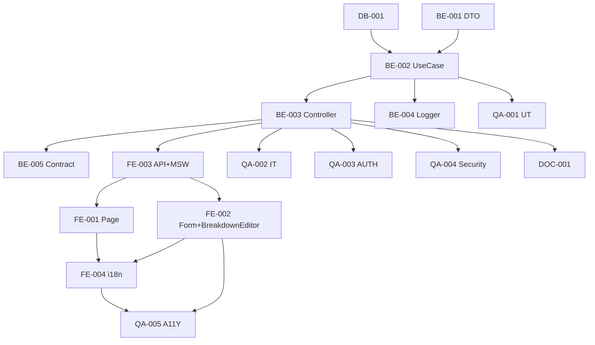

# Development Tasks — PB-P1-031 / US-052: Vendor responde Quote con desglose

## 1. Metadata

| Field                                | Value                                                                              |
| ------------------------------------ | ---------------------------------------------------------------------------------- |
| User Story ID                        | US-052                                                                             |
| Source User Story                    | `management/user-stories/US-052-vendor-respond-quote.md`                           |
| Source Technical Specification       | `management/technical-specs/P1/PB-P1-031/US-052-technical-spec.md`                 |
| Decision Resolution Artifact         | `management/user-stories/decision-resolutions/US-052-decision-resolution.md`       |
| Priority                             | P1                                                                                 |
| Backlog ID                           | PB-P1-031                                                                          |
| Backlog Title                        | Vendor visualiza y responde Quote                                                  |
| Backlog Execution Order              | 52                                                                                 |
| User Story Position in Backlog Item  | 2 de 3                                                                              |
| Related User Stories in Backlog Item | US-051, US-052, US-053                                                             |
| Epic                                 | EPIC-QR-001                                                                        |
| Backlog Item Dependencies            | US-051, PB-P0-001                                                                  |
| Feature                              | Single-shot respond con Quote + 2 Notifications atómicas                            |
| Module / Domain                      | Quotes                                                                             |
| Backlog Alignment Status             | Found                                                                              |
| Task Breakdown Status                | Ready for Sprint Planning                                                          |
| Created Date                         | 2026-06-27                                                                         |
| Last Updated                         | 2026-06-27                                                                         |

---

## 2. Source Validation

| Source                          | Found | Used | Notes                                                       |
| ------------------------------- | ----- | ---- | ----------------------------------------------------------- |
| User Story                      | Yes   | Yes  | Approved with Minor Notes.                                  |
| Technical Specification         | Yes   | Yes  | Ready for Task Breakdown.                                   |
| Decision Resolution Artifact    | Yes   | Yes  | 7/7 decisiones.                                              |
| Product Backlog Prioritized     | Yes   | Yes  | PB-P1-031.                                                  |

---

## 3. Backlog Execution Context

PB-P1-031 con 3 USs. US-052 es 2 de 3. Execution order 52.

---

## 4. Task Breakdown Summary

| Area  | Number of Tasks | Notes                                                       |
| ----- | --------------: | ----------------------------------------------------------- |
| DB    |              1  | Verificar UNIQUE parcial.                                    |
| BE    |              5  | DTO, use case, controller, logger, smoke contract.           |
| FE    |              4  | Page, form + BreakdownEditor, vendorApi + MSW, i18n.        |
| QA    |              5  | UT, IT (atomicidad + suma), AUTH, Security, A11Y.            |
| DOC   |              1  | `docs/16 §M07`.                                              |
| **Total** |           16  |                                                              |

---

## 5. Traceability Matrix

| Acceptance Criterion       | Technical Spec Section | Task IDs                                                                                                       |
| -------------------------- | ---------------------- | -------------------------------------------------------------------------------------------------------------- |
| AC-01 envío exitoso         | §7                      | TASK-PB-P1-031-US-052-BE-001..004, QA-002                                                                      |
| AC-02 `valid_until` custom   | §7                      | TASK-PB-P1-031-US-052-BE-002, QA-002                                                                            |
| AC-03 currency heredada      | §7                      | TASK-PB-P1-031-US-052-BE-002, QA-004                                                                            |
| AC-04 breakdown sum          | §7 DTO                  | TASK-PB-P1-031-US-052-BE-001, QA-001, QA-002                                                                  |
| EC-01..07                    | §6                      | TASK-PB-P1-031-US-052-BE-001/002, QA-002                                                                       |
| AUTH-TS-01..05              | §12                     | TASK-PB-P1-031-US-052-QA-003                                                                                    |
| A11Y                       | §8                      | TASK-PB-P1-031-US-052-FE-002, QA-005                                                                            |
| i18n                       | §8                      | TASK-PB-P1-031-US-052-FE-004                                                                                    |
| Log quote.sent              | §14                     | TASK-PB-P1-031-US-052-BE-004                                                                                    |

---

## 6. Development Tasks

### TASK-PB-P1-031-US-052-DB-001 — Verificar UNIQUE parcial `uq_quotes_request_active`

| Field                     | Value                                                            |
| ------------------------- | ---------------------------------------------------------------- |
| Area                      | Database / Prisma                                                |
| Type                      | Review                                                           |
| Priority                  | Must                                                             |
| Estimate                  | XS                                                               |
| Depends On                | PB-P0-001                                                         |
| Source AC(s)              | EC-02                                                              |
| Technical Spec Section(s) | §10                                                              |
| Backlog ID                | PB-P1-031                                                         |
| User Story ID             | US-052                                                            |
| Owner Role                | Backend                                                           |
| Status                    | To Do                                                             |

#### Definition of Done

- [ ] Pass o migración menor.

---

### TASK-PB-P1-031-US-052-BE-001 — DTO Zod `respondQuoteRequestBody` con refines

| Field                     | Value                                                            |
| ------------------------- | ---------------------------------------------------------------- |
| Area                      | Backend                                                           |
| Type                      | Implementation                                                    |
| Priority                  | Must                                                              |
| Estimate                  | S                                                                 |
| Depends On                | -                                                                 |
| Source AC(s)              | AC-04, EC-03..06                                                  |
| Technical Spec Section(s) | §7 DTO                                                            |
| Backlog ID                | PB-P1-031                                                         |
| User Story ID             | US-052                                                            |
| Owner Role                | Backend                                                           |
| Status                    | To Do                                                             |

#### Objective

Zod estricto con refines: `total > 0`, `breakdown 1..20 items`, `label 1..150`, `amount >= 0`, suma con tolerancia ±0.01, `valid_until` rango.

#### Definition of Done

- [ ] DTO + UT exhaustivos.

---

### TASK-PB-P1-031-US-052-BE-002 — `RespondQuoteRequestUseCase` con `prisma.$transaction`

| Field                     | Value                                                            |
| ------------------------- | ---------------------------------------------------------------- |
| Area                      | Backend                                                           |
| Type                      | Implementation                                                    |
| Priority                  | Must                                                              |
| Estimate                  | L                                                                 |
| Depends On                | BE-001, DB-001                                                    |
| Source AC(s)              | AC-01..AC-04, EC-01..EC-07                                        |
| Technical Spec Section(s) | §7 UseCase                                                        |
| Backlog ID                | PB-P1-031                                                         |
| User Story ID             | US-052                                                            |
| Owner Role                | Backend                                                           |
| Status                    | To Do                                                             |

#### Objective

UseCase con SELECT FOR UPDATE, currency override, default 15d, INSERT Quote + UPDATE QR + 2 Notifications.

#### Definition of Done

- [ ] Coverage ≥ 90%.
- [ ] Rollback verificado.

---

### TASK-PB-P1-031-US-052-BE-003 — Controller + ruta `POST /vendor/quote-requests/:id/respond`

| Field                     | Value                                                            |
| ------------------------- | ---------------------------------------------------------------- |
| Area                      | Backend / API                                                     |
| Type                      | Implementation                                                    |
| Priority                  | Must                                                              |
| Estimate                  | S                                                                 |
| Depends On                | BE-002                                                            |
| Source AC(s)              | AC-01                                                              |
| Technical Spec Section(s) | §7 Controllers                                                    |
| Backlog ID                | PB-P1-031                                                         |
| User Story ID             | US-052                                                            |
| Owner Role                | Backend                                                           |
| Status                    | To Do                                                             |

#### Definition of Done

- [ ] Ruta operativa con guards.

---

### TASK-PB-P1-031-US-052-BE-004 — Logger `quote.sent`

| Field                     | Value                                                            |
| ------------------------- | ---------------------------------------------------------------- |
| Area                      | Backend / Observability                                           |
| Type                      | Implementation                                                    |
| Priority                  | Must                                                              |
| Estimate                  | XS                                                                |
| Depends On                | BE-002                                                            |
| Source AC(s)              | AC-01                                                              |
| Technical Spec Section(s) | §14                                                               |
| Backlog ID                | PB-P1-031                                                         |
| User Story ID             | US-052                                                            |
| Owner Role                | Backend                                                           |
| Status                    | To Do                                                             |

#### Definition of Done

- [ ] Evento emitido en transacción exitosa.

---

### TASK-PB-P1-031-US-052-BE-005 — Smoke contract response

| Field                     | Value                                                            |
| ------------------------- | ---------------------------------------------------------------- |
| Area                      | Backend                                                           |
| Type                      | Test                                                              |
| Priority                  | Should                                                            |
| Estimate                  | XS                                                                |
| Depends On                | BE-003                                                            |
| Source AC(s)              | AC-01                                                              |
| Technical Spec Section(s) | §9                                                                |
| Backlog ID                | PB-P1-031                                                         |
| User Story ID             | US-052                                                            |
| Owner Role                | Backend                                                           |
| Status                    | To Do                                                             |

#### Definition of Done

- [ ] Schema response validado.

---

### TASK-PB-P1-031-US-052-FE-001 — Page `respond` + Server Component prefetch

| Field                     | Value                                                            |
| ------------------------- | ---------------------------------------------------------------- |
| Area                      | Frontend                                                          |
| Type                      | Implementation                                                    |
| Priority                  | Must                                                              |
| Estimate                  | M                                                                 |
| Depends On                | FE-003                                                            |
| Source AC(s)              | AC-01                                                              |
| Technical Spec Section(s) | §8                                                                |
| Backlog ID                | PB-P1-031                                                         |
| User Story ID             | US-052                                                            |
| Owner Role                | Frontend                                                          |
| Status                    | To Do                                                             |

#### Definition of Done

- [ ] Page renderiza con summary del evento.

---

### TASK-PB-P1-031-US-052-FE-002 — `QuoteResponseForm` + `BreakdownEditor` accesible

| Field                     | Value                                                            |
| ------------------------- | ---------------------------------------------------------------- |
| Area                      | Frontend                                                          |
| Type                      | Implementation                                                    |
| Priority                  | Must                                                              |
| Estimate                  | L                                                                 |
| Depends On                | FE-003                                                            |
| Source AC(s)              | AC-01, AC-04, A11Y                                                |
| Technical Spec Section(s) | §8                                                                |
| Backlog ID                | PB-P1-031                                                         |
| User Story ID             | US-052                                                            |
| Owner Role                | Frontend                                                          |
| Status                    | To Do                                                             |

#### Objective

Form RHF + Zod. `BreakdownEditor` dinámico con add/remove items + indicador visual de suma vs total. Currency read-only.

#### Definition of Done

- [ ] axe sin issues serios.
- [ ] Keyboard accessible.

---

### TASK-PB-P1-031-US-052-FE-003 — `vendorApi.qr.respond` + MSW

| Field                     | Value                                                            |
| ------------------------- | ---------------------------------------------------------------- |
| Area                      | Frontend                                                          |
| Type                      | Implementation                                                    |
| Priority                  | Must                                                              |
| Estimate                  | S                                                                 |
| Depends On                | BE-003                                                            |
| Source AC(s)              | AC-01                                                              |
| Technical Spec Section(s) | §8                                                                |
| Backlog ID                | PB-P1-031                                                         |
| User Story ID             | US-052                                                            |
| Owner Role                | Frontend                                                          |
| Status                    | To Do                                                             |

#### Definition of Done

- [ ] MSW handlers para `201/400/401/403/404/409`.

---

### TASK-PB-P1-031-US-052-FE-004 — i18n `vendor.qr.respond.*` en 4 locales

| Field                     | Value                                                            |
| ------------------------- | ---------------------------------------------------------------- |
| Area                      | Frontend / i18n                                                   |
| Type                      | Implementation                                                    |
| Priority                  | Must                                                              |
| Estimate                  | S                                                                 |
| Depends On                | FE-002                                                            |
| Source AC(s)              | i18n                                                              |
| Technical Spec Section(s) | §8                                                                |
| Backlog ID                | PB-P1-031                                                         |
| User Story ID             | US-052                                                            |
| Owner Role                | Frontend                                                          |
| Status                    | To Do                                                             |

#### Definition of Done

- [ ] 4 locales completos.

---

### TASK-PB-P1-031-US-052-QA-001 — Unit tests (DTO refines exhaustivos)

| Field                     | Value                                                            |
| ------------------------- | ---------------------------------------------------------------- |
| Area                      | QA                                                                |
| Type                      | Test                                                              |
| Priority                  | Must                                                              |
| Estimate                  | M                                                                 |
| Depends On                | BE-002                                                            |
| Source AC(s)              | AC-04, EC-03..06                                                  |
| Technical Spec Section(s) | §13                                                               |
| Backlog ID                | PB-P1-031                                                         |
| User Story ID             | US-052                                                            |
| Owner Role                | QA / Backend                                                      |
| Status                    | To Do                                                             |

#### Definition of Done

- [ ] Coverage ≥ 90%.
- [ ] Casos: suma exacta, ±0.01, suma fuera, items 0/20/21, labels, amounts.

---

### TASK-PB-P1-031-US-052-QA-002 — Integration tests (atomicidad + casos)

| Field                     | Value                                                            |
| ------------------------- | ---------------------------------------------------------------- |
| Area                      | QA                                                                |
| Type                      | Test                                                              |
| Priority                  | Must                                                              |
| Estimate                  | M                                                                 |
| Depends On                | BE-003                                                            |
| Source AC(s)              | AC-01..AC-04, EC-01..EC-07, NT-01..NT-10                          |
| Technical Spec Section(s) | §13                                                               |
| Backlog ID                | PB-P1-031                                                         |
| User Story ID             | US-052                                                            |
| Owner Role                | QA                                                                |
| Status                    | To Do                                                             |

#### Definition of Done

- [ ] 2 Notifications verificadas.
- [ ] Rollback verificado.
- [ ] UNIQUE parcial enforced.

---

### TASK-PB-P1-031-US-052-QA-003 — Authorization tests (AUTH-TS-01..05)

| Field                     | Value                                                            |
| ------------------------- | ---------------------------------------------------------------- |
| Area                      | QA / Security                                                     |
| Type                      | Test                                                              |
| Priority                  | Must                                                              |
| Estimate                  | S                                                                 |
| Depends On                | BE-003                                                            |
| Source AC(s)              | AUTH-TS-01..05                                                    |
| Technical Spec Section(s) | §12                                                               |
| Backlog ID                | PB-P1-031                                                         |
| User Story ID             | US-052                                                            |
| Owner Role                | QA                                                                |
| Status                    | To Do                                                             |

#### Definition of Done

- [ ] `404 QR_NOT_FOUND` uniforme.

---

### TASK-PB-P1-031-US-052-QA-004 — Security: currency override + uniformidad 404

| Field                     | Value                                                            |
| ------------------------- | ---------------------------------------------------------------- |
| Area                      | QA / Security                                                     |
| Type                      | Test                                                              |
| Priority                  | Must                                                              |
| Estimate                  | S                                                                 |
| Depends On                | BE-003                                                            |
| Source AC(s)              | AC-03, SEC-04                                                     |
| Technical Spec Section(s) | §13                                                               |
| Backlog ID                | PB-P1-031                                                         |
| User Story ID             | US-052                                                            |
| Owner Role                | QA / Security                                                     |
| Status                    | To Do                                                             |

#### Objective

Assert que cliente con `currency_code: "USD"` en body es ignorado y se persiste la del evento.

#### Definition of Done

- [ ] Test verde.

---

### TASK-PB-P1-031-US-052-QA-005 — Accessibility (form + BreakdownEditor)

| Field                     | Value                                                            |
| ------------------------- | ---------------------------------------------------------------- |
| Area                      | QA / A11Y                                                         |
| Type                      | Test                                                              |
| Priority                  | Must                                                              |
| Estimate                  | S                                                                 |
| Depends On                | FE-002, FE-004                                                    |
| Source AC(s)              | A11Y                                                              |
| Technical Spec Section(s) | §13                                                               |
| Backlog ID                | PB-P1-031                                                         |
| User Story ID             | US-052                                                            |
| Owner Role                | QA / Frontend                                                     |
| Status                    | To Do                                                             |

#### Definition of Done

- [ ] axe sin issues serios.

---

### TASK-PB-P1-031-US-052-DOC-001 — Documentar endpoint en `docs/16 §M07`

| Field                     | Value                                                            |
| ------------------------- | ---------------------------------------------------------------- |
| Area                      | Documentation                                                     |
| Type                      | Documentation                                                     |
| Priority                  | Must                                                              |
| Estimate                  | S                                                                 |
| Depends On                | BE-003                                                            |
| Source AC(s)              | AC-01                                                              |
| Technical Spec Section(s) | §16                                                               |
| Backlog ID                | PB-P1-031                                                         |
| User Story ID             | US-052                                                            |
| Owner Role                | Backend / Doc                                                     |
| Status                    | To Do                                                             |

#### Definition of Done

- [ ] Documentado.

---

## 7. Required QA Tasks

Ver §6.

---

## 8. Required Security Tasks

| Task ID                              | Security Concern                                  | Purpose                                       |
| ------------------------------------ | ------------------------------------------------- | --------------------------------------------- |
| TASK-PB-P1-031-US-052-QA-003         | `404 QR_NOT_FOUND` uniforme.                       | Sin information leakage.                       |
| TASK-PB-P1-031-US-052-QA-004         | Currency override server-side.                     | Defense in depth.                              |

---

## 9. Required Seed / Demo Tasks

`No aplica` (reuso seed US-051).

---

## 10. Observability / Audit Tasks

| Task ID                              | Concern                                  | Purpose                              |
| ------------------------------------ | ---------------------------------------- | ------------------------------------ |
| TASK-PB-P1-031-US-052-BE-004         | Log `quote.sent`.                        | Trazabilidad operativa.              |

---

## 11. Documentation / Traceability Tasks

| Task ID                              | Document / Artifact   | Purpose                                  |
| ------------------------------------ | --------------------- | ---------------------------------------- |
| TASK-PB-P1-031-US-052-DOC-001        | `docs/16 §M07`.       | Contrato del endpoint.                    |

---

## 12. Dependency Graph

---

## 13. Suggested Implementation Order

### Phase 1 — Foundation
- DB-001
- BE-001 DTO

### Phase 2 — Core
- BE-002 UseCase
- BE-004 Logger
- BE-003 Controller
- BE-005 Smoke
- FE-003 API+MSW
- FE-002 Form
- FE-001 Page
- FE-004 i18n

### Phase 3 — QA
- QA-001 UT
- QA-002 IT
- QA-003 AUTH
- QA-004 Security
- QA-005 A11Y

### Phase 4 — Doc
- DOC-001

---

## 14. Risks & Mitigations

Ver §17 del Technical Spec.

---

## 15. Out of Scope Confirmation

- Draft CRUD, edición post-sent, job de expiración (US-053), vista comparativa.

---

## 16. Readiness for Sprint Planning

| Check                                      | Status |
| ------------------------------------------ | ------ |
| Product Backlog mapping found              | Pass   |
| Every AC maps to tasks                     | Pass   |
| Technical Spec used when available         | Pass   |
| QA tasks included                          | Pass   |
| Security tasks included if applicable      | Pass   |
| Seed/demo tasks included if applicable     | N/A    |
| Observability tasks included if applicable | Pass   |
| Documentation tasks included if applicable | Pass   |
| Task dependencies clear                    | Pass   |
| Tasks small enough                         | Pass   |
| Ready for Sprint Planning                  | Yes    |

---

## 17. Final Recommendation

`Ready for Sprint Planning`.

US-052 introduce 16 tareas atómicas. Transacción atómica con SELECT FOR UPDATE + 2 Notifications + currency override server-side. US-053 cerrará PB-P1-031 con job de expiración.
