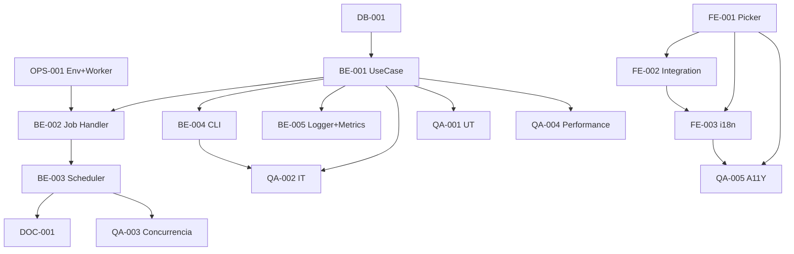

# Development Tasks — PB-P1-031 / US-053: ValidUntilPicker + ExpireQuotesJob

## 1. Metadata

| Field                                | Value                                                                              |
| ------------------------------------ | ---------------------------------------------------------------------------------- |
| User Story ID                        | US-053                                                                             |
| Source User Story                    | `management/user-stories/US-053-quote-validity-15-days.md`                         |
| Source Technical Specification       | `management/technical-specs/P1/PB-P1-031/US-053-technical-spec.md`                 |
| Decision Resolution Artifact         | `management/user-stories/decision-resolutions/US-053-decision-resolution.md`       |
| Priority                             | P1                                                                                 |
| Backlog ID                           | PB-P1-031                                                                          |
| Backlog Title                        | Vendor visualiza y responde Quote (validez 15 días default)                        |
| Backlog Execution Order              | 53                                                                                 |
| User Story Position in Backlog Item  | 3 de 3                                                                              |
| Related User Stories in Backlog Item | US-051, US-052, US-053                                                             |
| Epic                                 | EPIC-QR-001                                                                        |
| Backlog Item Dependencies            | US-052, PB-P0-001, PB-P1-009                                                       |
| Feature                              | `ValidUntilPicker` accesible + `ExpireQuotesJob` idempotente                        |
| Module / Domain                      | Quotes                                                                             |
| Backlog Alignment Status             | Found                                                                              |
| Task Breakdown Status                | Ready for Sprint Planning                                                          |
| Created Date                         | 2026-06-27                                                                         |
| Last Updated                         | 2026-06-27                                                                         |

---

## 2. Source Validation

| Source                          | Found | Used | Notes                                                       |
| ------------------------------- | ----- | ---- | ----------------------------------------------------------- |
| User Story                      | Yes   | Yes  | Approved with Minor Notes.                                  |
| Technical Specification         | Yes   | Yes  | Ready for Task Breakdown.                                   |
| Decision Resolution Artifact    | Yes   | Yes  | 5/5 decisiones D1–D5.                                       |
| Product Backlog Prioritized     | Yes   | Yes  | PB-P1-031 cierre.                                            |

---

## 3. Backlog Execution Context

US-053 cierra PB-P1-031. Execution order 53. Depende del scheduler patrón de PB-P1-009.

---

## 4. Task Breakdown Summary

| Area  | Number of Tasks | Notes                                                                 |
| ----- | --------------: | --------------------------------------------------------------------- |
| DB    |              1  | Verificar índice parcial `idx_quotes_valid_until_active`.             |
| BE    |              5  | UseCase, Job handler, Scheduler bootstrap, CLI, Logger + métricas.    |
| FE    |              3  | `ValidUntilPicker`, integración en form US-052, i18n.                 |
| OPS   |              1  | Env vars + worker process.                                            |
| QA    |              5  | UT, IT, Concurrencia, Performance, A11Y.                              |
| DOC   |              1  | `docs/14 §Jobs` + `docs/21 §Cron`.                                    |
| **Total** |           16  |                                                                        |

---

## 5. Traceability Matrix

| Acceptance Criterion       | Technical Spec Section | Task IDs                                                                                                       |
| -------------------------- | ---------------------- | -------------------------------------------------------------------------------------------------------------- |
| AC-01 picker default        | §8                      | TASK-PB-P1-031-US-053-FE-001/002, QA-005                                                                       |
| AC-02 job marca expiradas    | §7                      | TASK-PB-P1-031-US-053-BE-001..005, QA-002                                                                      |
| AC-03 idempotente            | §7                      | TASK-PB-P1-031-US-053-BE-001, QA-002                                                                            |
| AC-04 convención corte       | §7                      | TASK-PB-P1-031-US-053-BE-001, QA-002                                                                            |
| EC-01..04                    | §7                      | TASK-PB-P1-031-US-053-BE-001, QA-002                                                                            |
| Concurrencia                | §17                     | TASK-PB-P1-031-US-053-QA-003                                                                                    |
| Performance                | §13                     | TASK-PB-P1-031-US-053-QA-004                                                                                    |
| i18n                       | §8                      | TASK-PB-P1-031-US-053-FE-003                                                                                    |

---

## 6. Development Tasks

### TASK-PB-P1-031-US-053-DB-001 — Verificar índice `idx_quotes_valid_until_active`

| Field                     | Value                                                            |
| ------------------------- | ---------------------------------------------------------------- |
| Area                      | Database / Prisma                                                |
| Type                      | Review                                                           |
| Priority                  | Must                                                             |
| Estimate                  | XS                                                               |
| Depends On                | PB-P0-001                                                         |
| Source AC(s)              | Performance                                                       |
| Technical Spec Section(s) | §10                                                              |
| Backlog ID                | PB-P1-031                                                         |
| User Story ID             | US-053                                                            |
| Owner Role                | Backend                                                           |
| Status                    | To Do                                                             |

#### Definition of Done

- [ ] Pass o migración menor.

---

### TASK-PB-P1-031-US-053-BE-001 — `ExpireQuotesUseCase` con batching + SKIP LOCKED

| Field                     | Value                                                            |
| ------------------------- | ---------------------------------------------------------------- |
| Area                      | Backend                                                           |
| Type                      | Implementation                                                    |
| Priority                  | Must                                                              |
| Estimate                  | L                                                                 |
| Depends On                | DB-001, US-049 BE-002 (NotificationSenderPort)                    |
| Source AC(s)              | AC-02, AC-03, AC-04, EC-01..EC-04                                 |
| Technical Spec Section(s) | §7 UseCase                                                        |
| Backlog ID                | PB-P1-031                                                         |
| User Story ID             | US-053                                                            |
| Owner Role                | Backend                                                           |
| Status                    | To Do                                                             |

#### Objective

UseCase con loop de batches `LIMIT 100 FOR UPDATE SKIP LOCKED`, transacción por batch, 2 Notifications por Quote, logs estructurados.

#### Definition of Done

- [ ] Coverage ≥ 90%.
- [ ] Tests de boundary (1 batch, 250 = 3 iter, 0 quotes).

---

### TASK-PB-P1-031-US-053-BE-002 — Job handler `ExpireQuotesJob` con cron + jitter

| Field                     | Value                                                            |
| ------------------------- | ---------------------------------------------------------------- |
| Area                      | Backend                                                           |
| Type                      | Implementation                                                    |
| Priority                  | Must                                                              |
| Estimate                  | M                                                                 |
| Depends On                | BE-001, OPS-001                                                   |
| Source AC(s)              | AC-02                                                              |
| Technical Spec Section(s) | §7 Job                                                            |
| Backlog ID                | PB-P1-031                                                         |
| User Story ID             | US-053                                                            |
| Owner Role                | Backend                                                           |
| Status                    | To Do                                                             |

#### Objective

`node-cron` schedule `5 0 * * *` UTC + jitter `[0..10min]`. Try/catch + logger.

#### Definition of Done

- [ ] Handler con jitter implementado.
- [ ] UT del handler con mock de cron.

---

### TASK-PB-P1-031-US-053-BE-003 — Scheduler bootstrap (nuevo o extender)

| Field                     | Value                                                            |
| ------------------------- | ---------------------------------------------------------------- |
| Area                      | Backend                                                           |
| Type                      | Implementation                                                    |
| Priority                  | Must                                                              |
| Estimate                  | M                                                                 |
| Depends On                | BE-002                                                            |
| Source AC(s)              | AC-02                                                              |
| Technical Spec Section(s) | §7                                                                |
| Backlog ID                | PB-P1-031                                                         |
| User Story ID             | US-053                                                            |
| Owner Role                | Backend                                                           |
| Status                    | To Do                                                             |

#### Objective

`src/jobs/scheduler.ts` que arranca todos los jobs configurados. Invocado desde `worker` process.

#### Definition of Done

- [ ] Scheduler arranca todos los jobs.
- [ ] `npm run worker` operativo.

---

### TASK-PB-P1-031-US-053-BE-004 — CLI command `npm run job:expire-quotes`

| Field                     | Value                                                            |
| ------------------------- | ---------------------------------------------------------------- |
| Area                      | Backend                                                           |
| Type                      | Implementation                                                    |
| Priority                  | Should                                                            |
| Estimate                  | XS                                                                |
| Depends On                | BE-001                                                            |
| Source AC(s)              | -                                                                 |
| Technical Spec Section(s) | §7 CLI                                                            |
| Backlog ID                | PB-P1-031                                                         |
| User Story ID             | US-053                                                            |
| Owner Role                | Backend                                                           |
| Status                    | To Do                                                             |

#### Objective

CLI para forzar ejecución (útil en QA y demo).

#### Definition of Done

- [ ] Comando registrado en `package.json`.

---

### TASK-PB-P1-031-US-053-BE-005 — Logger `quote.expired.*` + métricas

| Field                     | Value                                                            |
| ------------------------- | ---------------------------------------------------------------- |
| Area                      | Backend / Observability                                           |
| Type                      | Implementation                                                    |
| Priority                  | Must                                                              |
| Estimate                  | S                                                                 |
| Depends On                | BE-001                                                            |
| Source AC(s)              | AC-02                                                              |
| Technical Spec Section(s) | §14                                                               |
| Backlog ID                | PB-P1-031                                                         |
| User Story ID             | US-053                                                            |
| Owner Role                | Backend                                                           |
| Status                    | To Do                                                             |

#### Objective

Eventos: `quote.expired.run.start`, `quote.expired.batch`, `quote.expired.run.end`, `quote.expired.run.failed`. Métricas: `quotes.expired.total`, `quotes.expired.duration_ms`.

#### Definition of Done

- [ ] Eventos y métricas emitidos.

---

### TASK-PB-P1-031-US-053-FE-001 — `ValidUntilPicker` accesible

| Field                     | Value                                                            |
| ------------------------- | ---------------------------------------------------------------- |
| Area                      | Frontend                                                          |
| Type                      | Implementation                                                    |
| Priority                  | Must                                                              |
| Estimate                  | M                                                                 |
| Depends On                | -                                                                 |
| Source AC(s)              | AC-01, A11Y                                                       |
| Technical Spec Section(s) | §8                                                                |
| Backlog ID                | PB-P1-031                                                         |
| User Story ID             | US-053                                                            |
| Owner Role                | Frontend                                                          |
| Status                    | To Do                                                             |

#### Objective

`react-day-picker` o equivalente. Default `today+15d`, rango `[today+1, today+90]`, `aria-invalid` + `aria-describedby`.

#### Definition of Done

- [ ] axe sin issues serios.
- [ ] Keyboard accessible.

---

### TASK-PB-P1-031-US-053-FE-002 — Integración en `QuoteResponseForm` (US-052)

| Field                     | Value                                                            |
| ------------------------- | ---------------------------------------------------------------- |
| Area                      | Frontend                                                          |
| Type                      | Implementation                                                    |
| Priority                  | Must                                                              |
| Estimate                  | S                                                                 |
| Depends On                | FE-001, US-052 FE-002                                             |
| Source AC(s)              | AC-01                                                              |
| Technical Spec Section(s) | §8                                                                |
| Backlog ID                | PB-P1-031                                                         |
| User Story ID             | US-053                                                            |
| Owner Role                | Frontend                                                          |
| Status                    | To Do                                                             |

#### Definition of Done

- [ ] Picker reemplaza input de fecha simple en el form.

---

### TASK-PB-P1-031-US-053-FE-003 — i18n `vendor.qr.respond.valid_until.*` en 4 locales

| Field                     | Value                                                            |
| ------------------------- | ---------------------------------------------------------------- |
| Area                      | Frontend / i18n                                                   |
| Type                      | Implementation                                                    |
| Priority                  | Must                                                              |
| Estimate                  | S                                                                 |
| Depends On                | FE-001                                                            |
| Source AC(s)              | i18n                                                              |
| Technical Spec Section(s) | §8                                                                |
| Backlog ID                | PB-P1-031                                                         |
| User Story ID             | US-053                                                            |
| Owner Role                | Frontend                                                          |
| Status                    | To Do                                                             |

#### Definition of Done

- [ ] 4 locales completos.

---

### TASK-PB-P1-031-US-053-OPS-001 — Env vars + worker process

| Field                     | Value                                                            |
| ------------------------- | ---------------------------------------------------------------- |
| Area                      | DevOps                                                            |
| Type                      | Setup                                                             |
| Priority                  | Must                                                              |
| Estimate                  | S                                                                 |
| Depends On                | -                                                                 |
| Source AC(s)              | AC-02                                                              |
| Technical Spec Section(s) | §18                                                               |
| Backlog ID                | PB-P1-031                                                         |
| User Story ID             | US-053                                                            |
| Owner Role                | DevOps                                                            |
| Status                    | To Do                                                             |

#### Objective

`.env.example`: `WORKER_ENABLED=true`, `EXPIRE_QUOTES_CRON='5 0 * * *'`. Script `npm run worker`.

#### Definition of Done

- [ ] Env vars documentadas.
- [ ] Worker process operativo.

---

### TASK-PB-P1-031-US-053-QA-001 — Unit tests (UseCase branches + boundary)

| Field                     | Value                                                            |
| ------------------------- | ---------------------------------------------------------------- |
| Area                      | QA                                                                |
| Type                      | Test                                                              |
| Priority                  | Must                                                              |
| Estimate                  | M                                                                 |
| Depends On                | BE-001                                                            |
| Source AC(s)              | AC-02..AC-04, EC-01..EC-04                                        |
| Technical Spec Section(s) | §13                                                               |
| Backlog ID                | PB-P1-031                                                         |
| User Story ID             | US-053                                                            |
| Owner Role                | QA / Backend                                                      |
| Status                    | To Do                                                             |

#### Objective

UT: 0 quotes, 1 batch, 250 quotes (3 iter), boundary day, idempotencia.

#### Definition of Done

- [ ] Coverage ≥ 90%.

---

### TASK-PB-P1-031-US-053-QA-002 — Integration tests (job E2E + rollback)

| Field                     | Value                                                            |
| ------------------------- | ---------------------------------------------------------------- |
| Area                      | QA                                                                |
| Type                      | Test                                                              |
| Priority                  | Must                                                              |
| Estimate                  | M                                                                 |
| Depends On                | BE-001, BE-004                                                    |
| Source AC(s)              | AC-02..AC-04, EC-01..EC-04                                        |
| Technical Spec Section(s) | §13                                                               |
| Backlog ID                | PB-P1-031                                                         |
| User Story ID             | US-053                                                            |
| Owner Role                | QA                                                                |
| Status                    | To Do                                                             |

#### Definition of Done

- [ ] 2 Notifications creadas verificadas.
- [ ] Rollback en error verificado.

---

### TASK-PB-P1-031-US-053-QA-003 — Concurrencia (2 workers + SKIP LOCKED)

| Field                     | Value                                                            |
| ------------------------- | ---------------------------------------------------------------- |
| Area                      | QA / Security                                                     |
| Type                      | Test                                                              |
| Priority                  | Must                                                              |
| Estimate                  | M                                                                 |
| Depends On                | BE-004                                                            |
| Source AC(s)              | AC-03                                                              |
| Technical Spec Section(s) | §17                                                               |
| Backlog ID                | PB-P1-031                                                         |
| User Story ID             | US-053                                                            |
| Owner Role                | QA                                                                |
| Status                    | To Do                                                             |

#### Objective

Lanzar 2 procesos del job simultáneos: SKIP LOCKED evita doble procesamiento.

#### Definition of Done

- [ ] Sin Notifications duplicadas.

---

### TASK-PB-P1-031-US-053-QA-004 — Performance smoke (10k Quotes < 60s)

| Field                     | Value                                                            |
| ------------------------- | ---------------------------------------------------------------- |
| Area                      | QA / Performance                                                  |
| Type                      | Test                                                              |
| Priority                  | Must                                                              |
| Estimate                  | M                                                                 |
| Depends On                | BE-001                                                            |
| Source AC(s)              | NFR-PERF-001                                                      |
| Technical Spec Section(s) | §13                                                               |
| Backlog ID                | PB-P1-031                                                         |
| User Story ID             | US-053                                                            |
| Owner Role                | QA / DevOps                                                       |
| Status                    | To Do                                                             |

#### Definition of Done

- [ ] 10,000 Quotes procesadas `< 60s`.

---

### TASK-PB-P1-031-US-053-QA-005 — Accessibility (`ValidUntilPicker`)

| Field                     | Value                                                            |
| ------------------------- | ---------------------------------------------------------------- |
| Area                      | QA / A11Y                                                         |
| Type                      | Test                                                              |
| Priority                  | Must                                                              |
| Estimate                  | S                                                                 |
| Depends On                | FE-001, FE-003                                                    |
| Source AC(s)              | A11Y                                                              |
| Technical Spec Section(s) | §13                                                               |
| Backlog ID                | PB-P1-031                                                         |
| User Story ID             | US-053                                                            |
| Owner Role                | QA / Frontend                                                     |
| Status                    | To Do                                                             |

#### Definition of Done

- [ ] axe sin issues serios.
- [ ] Keyboard navigation OK.

---

### TASK-PB-P1-031-US-053-DOC-001 — Documentar job en `docs/14` y `docs/21`

| Field                     | Value                                                            |
| ------------------------- | ---------------------------------------------------------------- |
| Area                      | Documentation                                                     |
| Type                      | Documentation                                                     |
| Priority                  | Must                                                              |
| Estimate                  | S                                                                 |
| Depends On                | BE-003                                                            |
| Source AC(s)              | AC-02                                                              |
| Technical Spec Section(s) | §16                                                               |
| Backlog ID                | PB-P1-031                                                         |
| User Story ID             | US-053                                                            |
| Owner Role                | Backend / Doc                                                     |
| Status                    | To Do                                                             |

#### Definition of Done

- [ ] Job documentado en `docs/14 §Jobs` y cron en `docs/21`.

---

## 7. Required QA Tasks

Ver §6 (QA-001..QA-005).

---

## 8. Required Security Tasks

| Task ID                              | Security Concern                                  | Purpose                                       |
| ------------------------------------ | ------------------------------------------------- | --------------------------------------------- |
| TASK-PB-P1-031-US-053-QA-003         | Concurrencia con SKIP LOCKED.                     | Sin doble procesamiento.                       |

---

## 9. Required Seed / Demo Tasks

`No aplica` (extensión opcional del seed con Quote `valid_until` pasado).

---

## 10. Observability / Audit Tasks

| Task ID                              | Concern                                  | Purpose                              |
| ------------------------------------ | ---------------------------------------- | ------------------------------------ |
| TASK-PB-P1-031-US-053-BE-005         | Logs + métricas `quote.expired.*`.       | Trazabilidad del job.                |

---

## 11. Documentation / Traceability Tasks

| Task ID                              | Document / Artifact                | Purpose                                  |
| ------------------------------------ | ---------------------------------- | ---------------------------------------- |
| TASK-PB-P1-031-US-053-DOC-001        | `docs/14 §Jobs` + `docs/21 §Cron`. | Documentación del job y cron.            |

---

## 12. Dependency Graph

---

## 13. Suggested Implementation Order

### Phase 1 — Foundation
- DB-001
- OPS-001
- BE-001 UseCase

### Phase 2 — Core
- BE-002 Job Handler
- BE-003 Scheduler
- BE-004 CLI
- BE-005 Logger + Métricas
- FE-001 Picker
- FE-002 Integración
- FE-003 i18n

### Phase 3 — QA
- QA-001 UT
- QA-002 IT
- QA-003 Concurrencia
- QA-004 Performance
- QA-005 A11Y

### Phase 4 — Doc
- DOC-001

---

## 14. Risks & Mitigations

Ver §17 del Technical Spec.

---

## 15. Out of Scope Confirmation

- Notif al organizer, ejecuciones intra-day, email real.

---

## 16. Readiness for Sprint Planning

| Check                                      | Status |
| ------------------------------------------ | ------ |
| Product Backlog mapping found              | Pass   |
| Every AC maps to tasks                     | Pass   |
| Technical Spec used when available         | Pass   |
| QA tasks included                          | Pass   |
| Security tasks included if applicable      | Pass   |
| Seed/demo tasks included if applicable     | N/A    |
| Observability tasks included if applicable | Pass   |
| Documentation tasks included if applicable | Pass   |
| Task dependencies clear                    | Pass   |
| Tasks small enough                         | Pass   |
| Ready for Sprint Planning                  | Yes    |

---

## 17. Final Recommendation

`Ready for Sprint Planning`.

US-053 cierra PB-P1-031 con 16 tareas atómicas en 6 áreas. `ValidUntilPicker` accesible + `ExpireQuotesJob` idempotente con SKIP LOCKED + jitter + 2 Notifications por Quote. Performance smoke a 10k Quotes en `< 60s`.
