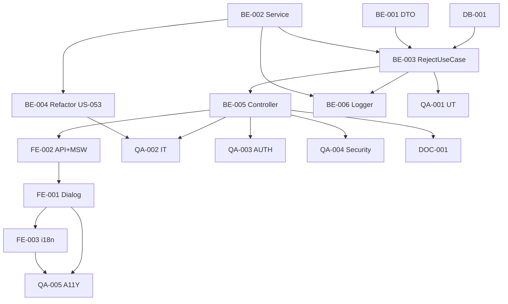

# Development Tasks — PB-P1-032 / US-054: Reject Quote + QuoteNotificationService

## 1. Metadata

| Field                                | Value                                                                              |
| ------------------------------------ | ---------------------------------------------------------------------------------- |
| User Story ID                        | US-054                                                                             |
| Source User Story                    | `management/user-stories/US-054-notify-vendor-quote-rejected-expired.md`           |
| Source Technical Specification       | `management/technical-specs/P1/PB-P1-032/US-054-technical-spec.md`                 |
| Decision Resolution Artifact         | `management/user-stories/decision-resolutions/US-054-decision-resolution.md`       |
| Priority                             | P1                                                                                 |
| Backlog ID                           | PB-P1-032                                                                          |
| Backlog Title                        | Notificación a vendor por Quote rechazada/expirada                                  |
| Backlog Execution Order              | 54                                                                                 |
| User Story Position in Backlog Item  | 1 de 1                                                                              |
| Related User Stories in Backlog Item | US-054                                                                              |
| Epic                                 | EPIC-QR-001                                                                        |
| Backlog Item Dependencies            | PB-P1-031, PB-P0-001                                                               |
| Feature                              | Endpoint reject + service común + refactor US-053                                   |
| Module / Domain                      | Quotes / Notifications                                                              |
| Backlog Alignment Status             | Found                                                                              |
| Task Breakdown Status                | Ready for Sprint Planning                                                          |
| Created Date                         | 2026-06-28                                                                         |
| Last Updated                         | 2026-06-28                                                                         |

---

## 2. Source Validation

| Source                          | Found | Used | Notes                                                       |
| ------------------------------- | ----- | ---- | ----------------------------------------------------------- |
| User Story                      | Yes   | Yes  | Approved with Minor Notes.                                  |
| Technical Specification         | Yes   | Yes  | Ready for Task Breakdown.                                   |
| Decision Resolution Artifact    | Yes   | Yes  | 8/8 decisiones.                                              |
| Product Backlog Prioritized     | Yes   | Yes  | PB-P1-032.                                                  |

---

## 3. Backlog Execution Context

PB-P1-032 single-story. Execution order 54. Reuso intensivo del módulo de US-049..053.

---

## 4. Task Breakdown Summary

| Area  | Number of Tasks | Notes                                                       |
| ----- | --------------: | ----------------------------------------------------------- |
| DB    |              1  | Verificar `rejection_reason`/`rejected_at`.                  |
| BE    |              6  | DTO, Service común, UseCase reject, Refactor US-053, Controller, Logger. |
| FE    |              3  | `RejectQuoteDialog`, `organizerApi.quotes.reject` + MSW, i18n. |
| QA    |              5  | UT, IT (incluye regresión US-053), AUTH, Security, A11Y.    |
| DOC   |              1  | `docs/16 §M07`.                                              |
| **Total** |           16  |                                                              |

---

## 5. Traceability Matrix

| Acceptance Criterion       | Technical Spec Section | Task IDs                                                                                                       |
| -------------------------- | ---------------------- | -------------------------------------------------------------------------------------------------------------- |
| AC-01 rechazo               | §7 UseCase              | TASK-PB-P1-032-US-054-BE-001..005, QA-002                                                                      |
| AC-02 expired reuso         | §7 Refactor             | TASK-PB-P1-032-US-054-BE-004, QA-002                                                                            |
| AC-03 sin reason            | §7                      | TASK-PB-P1-032-US-054-BE-001/003, QA-002                                                                       |
| EC-01..05                    | §6                      | TASK-PB-P1-032-US-054-BE-001/003, QA-002                                                                       |
| AUTH-TS-01..05              | §12                     | TASK-PB-P1-032-US-054-QA-003                                                                                    |
| A11Y                       | §8                      | TASK-PB-P1-032-US-054-FE-001, QA-005                                                                            |
| i18n                       | §8                      | TASK-PB-P1-032-US-054-FE-003                                                                                    |
| Log rejected                 | §14                     | TASK-PB-P1-032-US-054-BE-006                                                                                    |

---

## 6. Development Tasks

### TASK-PB-P1-032-US-054-DB-001 — Verificar `rejection_reason` + `rejected_at`

| Field                     | Value                                                            |
| ------------------------- | ---------------------------------------------------------------- |
| Area                      | Database / Prisma                                                |
| Type                      | Review                                                           |
| Priority                  | Must                                                             |
| Estimate                  | XS                                                               |
| Depends On                | PB-P0-001                                                         |
| Source AC(s)              | AC-01                                                              |
| Technical Spec Section(s) | §10                                                              |
| Backlog ID                | PB-P1-032                                                         |
| User Story ID             | US-054                                                            |
| Owner Role                | Backend                                                           |
| Status                    | To Do                                                             |

#### Definition of Done

- [ ] Pass o migración menor abierta.

---

### TASK-PB-P1-032-US-054-BE-001 — DTO Zod `rejectQuoteBody`

| Field                     | Value                                                            |
| ------------------------- | ---------------------------------------------------------------- |
| Area                      | Backend                                                           |
| Type                      | Implementation                                                    |
| Priority                  | Must                                                              |
| Estimate                  | XS                                                                |
| Depends On                | -                                                                 |
| Source AC(s)              | EC-03, EC-04                                                      |
| Technical Spec Section(s) | §7 DTOs                                                          |
| Backlog ID                | PB-P1-032                                                         |
| User Story ID             | US-054                                                            |
| Owner Role                | Backend                                                           |
| Status                    | To Do                                                             |

#### Definition of Done

- [ ] DTO + UT.

---

### TASK-PB-P1-032-US-054-BE-002 — `QuoteNotificationService` reusable

| Field                     | Value                                                            |
| ------------------------- | ---------------------------------------------------------------- |
| Area                      | Backend                                                           |
| Type                      | Implementation                                                    |
| Priority                  | Must                                                              |
| Estimate                  | S                                                                 |
| Depends On                | US-049 BE-002 (NotificationSenderPort)                            |
| Source AC(s)              | AC-01, AC-02                                                      |
| Technical Spec Section(s) | §7 Service                                                        |
| Backlog ID                | PB-P1-032                                                         |
| User Story ID             | US-054                                                            |
| Owner Role                | Backend                                                           |
| Status                    | To Do                                                             |

#### Objective

Service con método `emitQuoteStateChange` que inserta 2 Notifications (`in_app` + `email_simulated`) atómicamente vía `NotificationSenderPort`.

#### Definition of Done

- [ ] UT verifican exactamente 2 Notifications creadas.

---

### TASK-PB-P1-032-US-054-BE-003 — `RejectQuoteUseCase` con transacción

| Field                     | Value                                                            |
| ------------------------- | ---------------------------------------------------------------- |
| Area                      | Backend                                                           |
| Type                      | Implementation                                                    |
| Priority                  | Must                                                              |
| Estimate                  | M                                                                 |
| Depends On                | BE-001, BE-002, DB-001                                            |
| Source AC(s)              | AC-01, AC-03, EC-01..EC-05                                        |
| Technical Spec Section(s) | §7 UseCase                                                        |
| Backlog ID                | PB-P1-032                                                         |
| User Story ID             | US-054                                                            |
| Owner Role                | Backend                                                           |
| Status                    | To Do                                                             |

#### Definition of Done

- [ ] Coverage ≥ 90%.
- [ ] Rollback verificado.

---

### TASK-PB-P1-032-US-054-BE-004 — Refactor `ExpireQuotesUseCase` (US-053) para invocar el service

| Field                     | Value                                                            |
| ------------------------- | ---------------------------------------------------------------- |
| Area                      | Backend                                                           |
| Type                      | Refactor                                                          |
| Priority                  | Must                                                              |
| Estimate                  | S                                                                 |
| Depends On                | BE-002, US-053 BE-001                                             |
| Source AC(s)              | AC-02                                                              |
| Technical Spec Section(s) | §7 Refactor                                                       |
| Backlog ID                | PB-P1-032                                                         |
| User Story ID             | US-054                                                            |
| Owner Role                | Backend                                                           |
| Status                    | To Do                                                             |

#### Objective

Reemplazar las 2 llamadas a `NotificationSenderPort.notify` del job de US-053 por una sola llamada a `quoteNotificationService.emitQuoteStateChange({ ..., eventName: 'quote.expired' })`.

#### Definition of Done

- [ ] Tests de US-053 siguen verdes (regresión).
- [ ] Sin pérdida de funcionalidad.

---

### TASK-PB-P1-032-US-054-BE-005 — Controller + ruta `POST /organizer/quotes/:id/reject`

| Field                     | Value                                                            |
| ------------------------- | ---------------------------------------------------------------- |
| Area                      | Backend / API                                                     |
| Type                      | Implementation                                                    |
| Priority                  | Must                                                              |
| Estimate                  | S                                                                 |
| Depends On                | BE-003                                                            |
| Source AC(s)              | AC-01                                                              |
| Technical Spec Section(s) | §7 Controllers                                                    |
| Backlog ID                | PB-P1-032                                                         |
| User Story ID             | US-054                                                            |
| Owner Role                | Backend                                                           |
| Status                    | To Do                                                             |

#### Definition of Done

- [ ] Ruta operativa con guards.

---

### TASK-PB-P1-032-US-054-BE-006 — Logger `quote.rejected` + `quote.notification.emitted`

| Field                     | Value                                                            |
| ------------------------- | ---------------------------------------------------------------- |
| Area                      | Backend / Observability                                           |
| Type                      | Implementation                                                    |
| Priority                  | Must                                                              |
| Estimate                  | XS                                                                |
| Depends On                | BE-002, BE-003                                                    |
| Source AC(s)              | AC-01                                                              |
| Technical Spec Section(s) | §14                                                               |
| Backlog ID                | PB-P1-032                                                         |
| User Story ID             | US-054                                                            |
| Owner Role                | Backend                                                           |
| Status                    | To Do                                                             |

#### Definition of Done

- [ ] Eventos emitidos.

---

### TASK-PB-P1-032-US-054-FE-001 — `RejectQuoteDialog` accesible

| Field                     | Value                                                            |
| ------------------------- | ---------------------------------------------------------------- |
| Area                      | Frontend                                                          |
| Type                      | Implementation                                                    |
| Priority                  | Must                                                              |
| Estimate                  | M                                                                 |
| Depends On                | FE-002                                                            |
| Source AC(s)              | AC-01, A11Y                                                       |
| Technical Spec Section(s) | §8                                                                |
| Backlog ID                | PB-P1-032                                                         |
| User Story ID             | US-054                                                            |
| Owner Role                | Frontend                                                          |
| Status                    | To Do                                                             |

#### Objective

Modal `role="dialog"` con focus trap, ESC, textarea opcional `reason` con label.

#### Definition of Done

- [ ] axe sin issues serios.

---

### TASK-PB-P1-032-US-054-FE-002 — `organizerApi.quotes.reject` + MSW

| Field                     | Value                                                            |
| ------------------------- | ---------------------------------------------------------------- |
| Area                      | Frontend                                                          |
| Type                      | Implementation                                                    |
| Priority                  | Must                                                              |
| Estimate                  | S                                                                 |
| Depends On                | BE-005                                                            |
| Source AC(s)              | AC-01                                                              |
| Technical Spec Section(s) | §8                                                                |
| Backlog ID                | PB-P1-032                                                         |
| User Story ID             | US-054                                                            |
| Owner Role                | Frontend                                                          |
| Status                    | To Do                                                             |

#### Definition of Done

- [ ] MSW handlers para `200/400/401/403/404/409`.

---

### TASK-PB-P1-032-US-054-FE-003 — i18n `organizer.quote.reject.*` en 4 locales

| Field                     | Value                                                            |
| ------------------------- | ---------------------------------------------------------------- |
| Area                      | Frontend / i18n                                                   |
| Type                      | Implementation                                                    |
| Priority                  | Must                                                              |
| Estimate                  | S                                                                 |
| Depends On                | FE-001                                                            |
| Source AC(s)              | i18n                                                              |
| Technical Spec Section(s) | §8                                                                |
| Backlog ID                | PB-P1-032                                                         |
| User Story ID             | US-054                                                            |
| Owner Role                | Frontend                                                          |
| Status                    | To Do                                                             |

#### Definition of Done

- [ ] 4 locales completos.

---

### TASK-PB-P1-032-US-054-QA-001 — Unit tests (DTO + Service + UseCase branches)

| Field                     | Value                                                            |
| ------------------------- | ---------------------------------------------------------------- |
| Area                      | QA                                                                |
| Type                      | Test                                                              |
| Priority                  | Must                                                              |
| Estimate                  | M                                                                 |
| Depends On                | BE-003                                                            |
| Source AC(s)              | EC-01..EC-05                                                      |
| Technical Spec Section(s) | §13                                                               |
| Backlog ID                | PB-P1-032                                                         |
| User Story ID             | US-054                                                            |
| Owner Role                | QA                                                                |
| Status                    | To Do                                                             |

#### Definition of Done

- [ ] Coverage ≥ 90%.

---

### TASK-PB-P1-032-US-054-QA-002 — Integration tests (rechazo + regresión US-053)

| Field                     | Value                                                            |
| ------------------------- | ---------------------------------------------------------------- |
| Area                      | QA                                                                |
| Type                      | Test                                                              |
| Priority                  | Must                                                              |
| Estimate                  | M                                                                 |
| Depends On                | BE-005, BE-004                                                    |
| Source AC(s)              | AC-01..AC-03, EC-01..EC-05, NT-01..NT-07                          |
| Technical Spec Section(s) | §13                                                               |
| Backlog ID                | PB-P1-032                                                         |
| User Story ID             | US-054                                                            |
| Owner Role                | QA                                                                |
| Status                    | To Do                                                             |

#### Definition of Done

- [ ] Idempotencia verificada.
- [ ] Regresión US-053 verde (job sigue creando 2 Notifications).

---

### TASK-PB-P1-032-US-054-QA-003 — Authorization tests (AUTH-TS-01..05)

| Field                     | Value                                                            |
| ------------------------- | ---------------------------------------------------------------- |
| Area                      | QA / Security                                                     |
| Type                      | Test                                                              |
| Priority                  | Must                                                              |
| Estimate                  | S                                                                 |
| Depends On                | BE-005                                                            |
| Source AC(s)              | AUTH-TS-01..05                                                    |
| Technical Spec Section(s) | §12                                                               |
| Backlog ID                | PB-P1-032                                                         |
| User Story ID             | US-054                                                            |
| Owner Role                | QA                                                                |
| Status                    | To Do                                                             |

#### Definition of Done

- [ ] `404 QUOTE_NOT_FOUND` uniforme.

---

### TASK-PB-P1-032-US-054-QA-004 — Security: aislamiento FR-NOTIF-005

| Field                     | Value                                                            |
| ------------------------- | ---------------------------------------------------------------- |
| Area                      | QA / Security                                                     |
| Type                      | Test                                                              |
| Priority                  | Must                                                              |
| Estimate                  | S                                                                 |
| Depends On                | BE-005                                                            |
| Source AC(s)              | TS-06, SEC-04                                                     |
| Technical Spec Section(s) | §13                                                               |
| Backlog ID                | PB-P1-032                                                         |
| User Story ID             | US-054                                                            |
| Owner Role                | QA / Security                                                     |
| Status                    | To Do                                                             |

#### Objective

Verificar que el vendor destinatario sólo ve sus propias Notifications generadas por el rechazo.

#### Definition of Done

- [ ] Test verde.

---

### TASK-PB-P1-032-US-054-QA-005 — Accessibility (`RejectQuoteDialog`)

| Field                     | Value                                                            |
| ------------------------- | ---------------------------------------------------------------- |
| Area                      | QA / A11Y                                                         |
| Type                      | Test                                                              |
| Priority                  | Must                                                              |
| Estimate                  | S                                                                 |
| Depends On                | FE-001, FE-003                                                    |
| Source AC(s)              | A11Y                                                              |
| Technical Spec Section(s) | §13                                                               |
| Backlog ID                | PB-P1-032                                                         |
| User Story ID             | US-054                                                            |
| Owner Role                | QA / Frontend                                                     |
| Status                    | To Do                                                             |

#### Definition of Done

- [ ] axe sin issues serios.

---

### TASK-PB-P1-032-US-054-DOC-001 — Documentar endpoint reject en `docs/16 §M07`

| Field                     | Value                                                            |
| ------------------------- | ---------------------------------------------------------------- |
| Area                      | Documentation                                                     |
| Type                      | Documentation                                                     |
| Priority                  | Must                                                              |
| Estimate                  | S                                                                 |
| Depends On                | BE-005                                                            |
| Source AC(s)              | AC-01                                                              |
| Technical Spec Section(s) | §16                                                               |
| Backlog ID                | PB-P1-032                                                         |
| User Story ID             | US-054                                                            |
| Owner Role                | Backend / Doc                                                     |
| Status                    | To Do                                                             |

#### Definition of Done

- [ ] Documentado.

---

## 7. Required QA Tasks

Ver §6 (QA-001..QA-005).

---

## 8. Required Security Tasks

| Task ID                              | Security Concern                                  | Purpose                                       |
| ------------------------------------ | ------------------------------------------------- | --------------------------------------------- |
| TASK-PB-P1-032-US-054-QA-003         | `404 QUOTE_NOT_FOUND` uniforme.                    | Sin information leakage.                       |
| TASK-PB-P1-032-US-054-QA-004         | Aislamiento FR-NOTIF-005.                          | Vendor sólo ve sus notifs.                    |

---

## 9. Required Seed / Demo Tasks

`No aplica` (reuso US-052/053). Opcional: Quote `sent` propia del organizer demo para rechazar.

---

## 10. Observability / Audit Tasks

| Task ID                              | Concern                                  | Purpose                              |
| ------------------------------------ | ---------------------------------------- | ------------------------------------ |
| TASK-PB-P1-032-US-054-BE-006         | Logs `quote.rejected` + `quote.notification.emitted`. | Trazabilidad operativa.              |

---

## 11. Documentation / Traceability Tasks

| Task ID                              | Document / Artifact   | Purpose                                  |
| ------------------------------------ | --------------------- | ---------------------------------------- |
| TASK-PB-P1-032-US-054-DOC-001        | `docs/16 §M07`.       | Contrato del endpoint reject.            |

---

## 12. Dependency Graph

---

## 13. Suggested Implementation Order

### Phase 1 — Foundation
- DB-001
- BE-001 DTO
- BE-002 Service

### Phase 2 — Core
- BE-003 RejectUseCase
- BE-004 Refactor US-053
- BE-005 Controller
- BE-006 Logger
- FE-002 API + MSW
- FE-001 Dialog
- FE-003 i18n

### Phase 3 — QA
- QA-001 UT
- QA-002 IT (con regresión US-053)
- QA-003 AUTH
- QA-004 Security
- QA-005 A11Y

### Phase 4 — Doc
- DOC-001

---

## 14. Risks & Mitigations

Ver §17 del Technical Spec.

---

## 15. Out of Scope Confirmation

- Inbox del vendor, vista comparativa, email real, push/SMS.

---

## 16. Readiness for Sprint Planning

| Check                                      | Status |
| ------------------------------------------ | ------ |
| Product Backlog mapping found              | Pass   |
| Every AC maps to tasks                     | Pass   |
| Technical Spec used when available         | Pass   |
| QA tasks included                          | Pass   |
| Security tasks included if applicable      | Pass   |
| Seed/demo tasks included if applicable     | N/A    |
| Observability tasks included if applicable | Pass   |
| Documentation tasks included if applicable | Pass   |
| Task dependencies clear                    | Pass   |
| Tasks small enough                         | Pass   |
| Ready for Sprint Planning                  | Yes    |

---

## 17. Final Recommendation

`Ready for Sprint Planning`.

US-054 introduce 16 tareas: endpoint reject + service común + refactor US-053. Cierra PB-P1-032. Test de regresión integral garantiza que US-053 sigue funcional tras el refactor.
