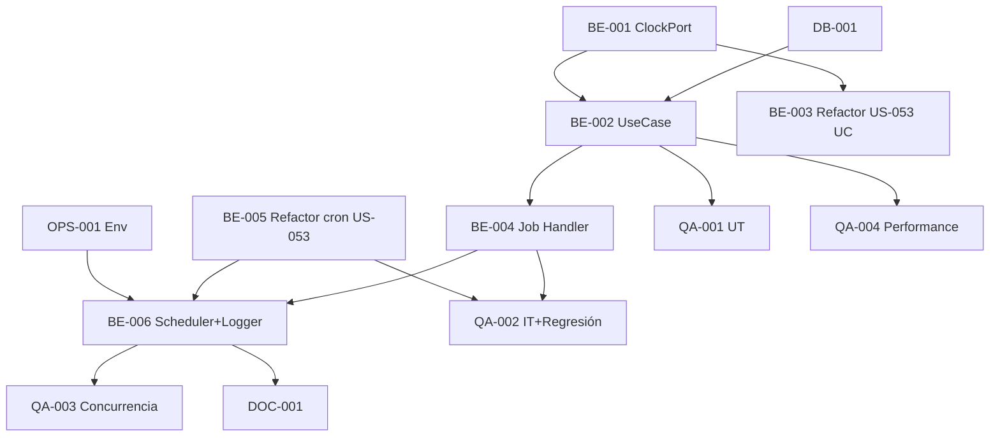

# Development Tasks — PB-P1-033 / US-055: ExpireQuoteRequestsJob + ClockPort

## 1. Metadata

| Field                                | Value                                                                              |
| ------------------------------------ | ---------------------------------------------------------------------------------- |
| User Story ID                        | US-055                                                                             |
| Source User Story                    | `management/user-stories/US-055-auto-expire-quotes-job.md`                         |
| Source Technical Specification       | `management/technical-specs/P1/PB-P1-033/US-055-technical-spec.md`                 |
| Decision Resolution Artifact         | `management/user-stories/decision-resolutions/US-055-decision-resolution.md`       |
| Priority                             | P1                                                                                 |
| Backlog ID                           | PB-P1-033                                                                          |
| Backlog Title                        | Jobs de expiración QR / Quote                                                       |
| Backlog Execution Order              | 55                                                                                 |
| User Story Position in Backlog Item  | 1 de 1                                                                              |
| Related User Stories in Backlog Item | US-055                                                                              |
| Epic                                 | EPIC-QR-001                                                                        |
| Backlog Item Dependencies            | US-049, US-053, PB-P0-001                                                          |
| Feature                              | `ExpireQuoteRequestsJob` + `ClockPort` + refactor cron US-053                       |
| Module / Domain                      | Quotes                                                                             |
| Backlog Alignment Status             | Found                                                                              |
| Task Breakdown Status                | Ready for Sprint Planning                                                          |
| Created Date                         | 2026-06-28                                                                         |
| Last Updated                         | 2026-06-28                                                                         |

---

## 2. Source Validation

| Source                          | Found | Used | Notes                                                       |
| ------------------------------- | ----- | ---- | ----------------------------------------------------------- |
| User Story                      | Yes   | Yes  | Approved with Minor Notes.                                  |
| Technical Specification         | Yes   | Yes  | Ready for Task Breakdown.                                   |
| Decision Resolution Artifact    | Yes   | Yes  | 7/7 decisiones.                                              |
| Product Backlog Prioritized     | Yes   | Yes  | PB-P1-033.                                                  |

---

## 3. Backlog Execution Context

PB-P1-033 single-story. Execution order 55. Reuso del scheduler de US-053.

---

## 4. Task Breakdown Summary

| Area  | Number of Tasks | Notes                                                       |
| ----- | --------------: | ----------------------------------------------------------- |
| DB    |              1  | Verificar + posible índice parcial.                          |
| BE    |              6  | ClockPort + adapters, UseCase, refactor US-053 inyectar ClockPort, Job handler, refactor cron US-053, Scheduler+Logger. |
| OPS   |              1  | Env vars `QR_EXPIRATION_DAYS=30` + cron strings.            |
| QA    |              4  | UT, IT (regresión US-053), Concurrencia, Performance.        |
| DOC   |              1  | `docs/14 §Jobs` + `docs/21 §Cron`.                          |
| **Total** |           13  |                                                              |

---

## 5. Traceability Matrix

| Acceptance Criterion       | Technical Spec Section | Task IDs                                                                                                       |
| -------------------------- | ---------------------- | -------------------------------------------------------------------------------------------------------------- |
| AC-01 marca QRs             | §7 UseCase              | TASK-PB-P1-033-US-055-BE-002, QA-002                                                                            |
| AC-02 horario unificado     | §7 Refactor             | TASK-PB-P1-033-US-055-BE-004/005, QA-002                                                                       |
| AC-03 idempotente            | §7                      | TASK-PB-P1-033-US-055-BE-002, QA-002                                                                            |
| AC-04 clock injectable       | §7 ClockPort            | TASK-PB-P1-033-US-055-BE-001, QA-001                                                                            |
| AC-05 estados excluidos      | §7                      | TASK-PB-P1-033-US-055-BE-002, QA-002                                                                            |
| EC-01..04                    | §7                      | TASK-PB-P1-033-US-055-BE-002, QA-002, QA-003                                                                   |
| Performance                | §13                     | TASK-PB-P1-033-US-055-QA-004                                                                                    |
| Concurrencia                | §17                     | TASK-PB-P1-033-US-055-QA-003                                                                                    |

---

## 6. Development Tasks

### TASK-PB-P1-033-US-055-DB-001 — Verificar índice parcial `(status, sent_at) WHERE status IN ('sent','viewed')`

| Field                     | Value                                                            |
| ------------------------- | ---------------------------------------------------------------- |
| Area                      | Database / Prisma                                                |
| Type                      | Review                                                           |
| Priority                  | Must                                                             |
| Estimate                  | XS                                                               |
| Depends On                | PB-P0-001                                                         |
| Source AC(s)              | Performance                                                       |
| Technical Spec Section(s) | §10                                                              |
| Backlog ID                | PB-P1-033                                                         |
| User Story ID             | US-055                                                            |
| Owner Role                | Backend / DevOps                                                  |
| Status                    | To Do                                                             |

#### Definition of Done

- [ ] Pass o migración menor abierta.

---

### TASK-PB-P1-033-US-055-BE-001 — `ClockPort` + `LocalClockAdapter` + `FrozenClockAdapter`

| Field                     | Value                                                            |
| ------------------------- | ---------------------------------------------------------------- |
| Area                      | Backend                                                           |
| Type                      | Implementation                                                    |
| Priority                  | Must                                                              |
| Estimate                  | S                                                                 |
| Depends On                | -                                                                 |
| Source AC(s)              | AC-04                                                              |
| Technical Spec Section(s) | §7 ClockPort                                                      |
| Backlog ID                | PB-P1-033                                                         |
| User Story ID             | US-055                                                            |
| Owner Role                | Backend                                                           |
| Status                    | To Do                                                             |

#### Definition of Done

- [ ] Port + adapters exportados.
- [ ] UT del Frozen con `advance(days)`.

---

### TASK-PB-P1-033-US-055-BE-002 — `ExpireQuoteRequestsUseCase` con batching + ClockPort

| Field                     | Value                                                            |
| ------------------------- | ---------------------------------------------------------------- |
| Area                      | Backend                                                           |
| Type                      | Implementation                                                    |
| Priority                  | Must                                                              |
| Estimate                  | L                                                                 |
| Depends On                | DB-001, BE-001                                                    |
| Source AC(s)              | AC-01, AC-03, AC-05, EC-01..EC-04                                 |
| Technical Spec Section(s) | §7 UseCase                                                        |
| Backlog ID                | PB-P1-033                                                         |
| User Story ID             | US-055                                                            |
| Owner Role                | Backend                                                           |
| Status                    | To Do                                                             |

#### Definition of Done

- [ ] Coverage ≥ 90%.
- [ ] Tests con FrozenClock.

---

### TASK-PB-P1-033-US-055-BE-003 — Refactor `ExpireQuotesUseCase` (US-053) para inyectar `ClockPort`

| Field                     | Value                                                            |
| ------------------------- | ---------------------------------------------------------------- |
| Area                      | Backend                                                           |
| Type                      | Refactor                                                          |
| Priority                  | Must                                                              |
| Estimate                  | S                                                                 |
| Depends On                | BE-001, US-053 BE-001                                             |
| Source AC(s)              | AC-04                                                              |
| Technical Spec Section(s) | §7 Refactor                                                       |
| Backlog ID                | PB-P1-033                                                         |
| User Story ID             | US-055                                                            |
| Owner Role                | Backend                                                           |
| Status                    | To Do                                                             |

#### Objective

Reemplazar `new Date()` y `CURRENT_DATE` por `this.clock.now()` y pasarlo en la query. Tests de US-053 siguen verdes.

#### Definition of Done

- [ ] Tests de US-053 verdes con FrozenClock.

---

### TASK-PB-P1-033-US-055-BE-004 — `ExpireQuoteRequestsJob` handler (cron `0 1 * * *` + jitter)

| Field                     | Value                                                            |
| ------------------------- | ---------------------------------------------------------------- |
| Area                      | Backend                                                           |
| Type                      | Implementation                                                    |
| Priority                  | Must                                                              |
| Estimate                  | S                                                                 |
| Depends On                | BE-002                                                            |
| Source AC(s)              | AC-01, AC-02                                                      |
| Technical Spec Section(s) | §7 Job                                                            |
| Backlog ID                | PB-P1-033                                                         |
| User Story ID             | US-055                                                            |
| Owner Role                | Backend                                                           |
| Status                    | To Do                                                             |

#### Definition of Done

- [ ] Handler con jitter.

---

### TASK-PB-P1-033-US-055-BE-005 — Refactor cron `ExpireQuotesJob` (US-053) a `0 1 * * *`

| Field                     | Value                                                            |
| ------------------------- | ---------------------------------------------------------------- |
| Area                      | Backend                                                           |
| Type                      | Refactor                                                          |
| Priority                  | Must                                                              |
| Estimate                  | XS                                                                |
| Depends On                | US-053 BE-002                                                     |
| Source AC(s)              | AC-02                                                              |
| Technical Spec Section(s) | §7 Refactor                                                       |
| Backlog ID                | PB-P1-033                                                         |
| User Story ID             | US-055                                                            |
| Owner Role                | Backend                                                           |
| Status                    | To Do                                                             |

#### Objective

Cambiar cron string en `expire-quotes.job.ts` de `5 0 * * *` a `0 1 * * *`.

#### Definition of Done

- [ ] Cron actualizado.
- [ ] Test de regresión verde.

---

### TASK-PB-P1-033-US-055-BE-006 — Scheduler bootstrap + Logger + métricas

| Field                     | Value                                                            |
| ------------------------- | ---------------------------------------------------------------- |
| Area                      | Backend / Observability                                           |
| Type                      | Implementation                                                    |
| Priority                  | Must                                                              |
| Estimate                  | S                                                                 |
| Depends On                | BE-004                                                            |
| Source AC(s)              | AC-01, AC-02                                                      |
| Technical Spec Section(s) | §7, §14                                                          |
| Backlog ID                | PB-P1-033                                                         |
| User Story ID             | US-055                                                            |
| Owner Role                | Backend                                                           |
| Status                    | To Do                                                             |

#### Objective

Añadir `startExpireQuoteRequestsJob` al bootstrap. Eventos: `quote_request.expired.run.start/batch/end/failed`. Métricas: `quote_requests.expired.total/duration_ms`.

#### Definition of Done

- [ ] Bootstrap + métricas emitidas.

---

### TASK-PB-P1-033-US-055-OPS-001 — Env vars

| Field                     | Value                                                            |
| ------------------------- | ---------------------------------------------------------------- |
| Area                      | DevOps                                                            |
| Type                      | Setup                                                             |
| Priority                  | Must                                                              |
| Estimate                  | XS                                                                |
| Depends On                | -                                                                 |
| Source AC(s)              | AC-01, AC-02                                                      |
| Technical Spec Section(s) | §18                                                               |
| Backlog ID                | PB-P1-033                                                         |
| User Story ID             | US-055                                                            |
| Owner Role                | DevOps                                                            |
| Status                    | To Do                                                             |

#### Definition of Done

- [ ] `.env.example` con `QR_EXPIRATION_DAYS=30`, `EXPIRE_QUOTE_REQUESTS_CRON`, `EXPIRE_QUOTES_CRON`.

---

### TASK-PB-P1-033-US-055-QA-001 — Unit tests (ClockPort + UseCase + branches)

| Field                     | Value                                                            |
| ------------------------- | ---------------------------------------------------------------- |
| Area                      | QA                                                                |
| Type                      | Test                                                              |
| Priority                  | Must                                                              |
| Estimate                  | M                                                                 |
| Depends On                | BE-002                                                            |
| Source AC(s)              | AC-04, EC-01..EC-04                                                |
| Technical Spec Section(s) | §13                                                               |
| Backlog ID                | PB-P1-033                                                         |
| User Story ID             | US-055                                                            |
| Owner Role                | QA / Backend                                                      |
| Status                    | To Do                                                             |

#### Definition of Done

- [ ] Coverage ≥ 90%.

---

### TASK-PB-P1-033-US-055-QA-002 — Integration (job + regresión US-053)

| Field                     | Value                                                            |
| ------------------------- | ---------------------------------------------------------------- |
| Area                      | QA                                                                |
| Type                      | Test                                                              |
| Priority                  | Must                                                              |
| Estimate                  | M                                                                 |
| Depends On                | BE-004, BE-005                                                    |
| Source AC(s)              | AC-01..AC-05, EC-01..EC-04                                        |
| Technical Spec Section(s) | §13                                                               |
| Backlog ID                | PB-P1-033                                                         |
| User Story ID             | US-055                                                            |
| Owner Role                | QA                                                                |
| Status                    | To Do                                                             |

#### Definition of Done

- [ ] Regresión: US-053 sigue marcando Quotes correctamente con nuevo cron.

---

### TASK-PB-P1-033-US-055-QA-003 — Concurrencia (2 workers + SKIP LOCKED)

| Field                     | Value                                                            |
| ------------------------- | ---------------------------------------------------------------- |
| Area                      | QA / Security                                                     |
| Type                      | Test                                                              |
| Priority                  | Must                                                              |
| Estimate                  | M                                                                 |
| Depends On                | BE-006                                                            |
| Source AC(s)              | EC-04                                                              |
| Technical Spec Section(s) | §17                                                               |
| Backlog ID                | PB-P1-033                                                         |
| User Story ID             | US-055                                                            |
| Owner Role                | QA                                                                |
| Status                    | To Do                                                             |

#### Definition of Done

- [ ] Sin doble procesamiento.

---

### TASK-PB-P1-033-US-055-QA-004 — Performance (10k QRs < 60s)

| Field                     | Value                                                            |
| ------------------------- | ---------------------------------------------------------------- |
| Area                      | QA / Performance                                                  |
| Type                      | Test                                                              |
| Priority                  | Must                                                              |
| Estimate                  | M                                                                 |
| Depends On                | BE-002                                                            |
| Source AC(s)              | NFR-PERF-001                                                      |
| Technical Spec Section(s) | §13                                                               |
| Backlog ID                | PB-P1-033                                                         |
| User Story ID             | US-055                                                            |
| Owner Role                | QA / DevOps                                                       |
| Status                    | To Do                                                             |

#### Definition of Done

- [ ] 10k QRs procesadas `< 60s`.

---

### TASK-PB-P1-033-US-055-DOC-001 — Documentar en `docs/14 §Jobs` + `docs/21 §Cron`

| Field                     | Value                                                            |
| ------------------------- | ---------------------------------------------------------------- |
| Area                      | Documentation                                                     |
| Type                      | Documentation                                                     |
| Priority                  | Must                                                              |
| Estimate                  | S                                                                 |
| Depends On                | BE-006                                                            |
| Source AC(s)              | AC-01, AC-02                                                      |
| Technical Spec Section(s) | §16                                                               |
| Backlog ID                | PB-P1-033                                                         |
| User Story ID             | US-055                                                            |
| Owner Role                | Backend / Doc                                                     |
| Status                    | To Do                                                             |

#### Definition of Done

- [ ] Job nuevo + cron unificado documentado.

---

## 7. Required QA Tasks

Ver §6.

---

## 8. Required Security Tasks

| Task ID                              | Security Concern                                  | Purpose                                       |
| ------------------------------------ | ------------------------------------------------- | --------------------------------------------- |
| TASK-PB-P1-033-US-055-QA-003         | Concurrencia con SKIP LOCKED.                     | Sin doble procesamiento.                       |

---

## 9. Required Seed / Demo Tasks

`No aplica` (extensión opcional con QR `sent_at` viejo).

---

## 10. Observability / Audit Tasks

| Task ID                              | Concern                                  | Purpose                              |
| ------------------------------------ | ---------------------------------------- | ------------------------------------ |
| TASK-PB-P1-033-US-055-BE-006         | Logs + métricas.                          | Trazabilidad.                        |

---

## 11. Documentation / Traceability Tasks

| Task ID                              | Document / Artifact                | Purpose                                  |
| ------------------------------------ | ---------------------------------- | ---------------------------------------- |
| TASK-PB-P1-033-US-055-DOC-001        | `docs/14 §Jobs` + `docs/21 §Cron`. | Documentación.                            |

---

## 12. Dependency Graph

---

## 13. Suggested Implementation Order

### Phase 1 — Foundation
- DB-001
- OPS-001
- BE-001 ClockPort

### Phase 2 — Core
- BE-002 UseCase
- BE-003 Refactor US-053 (inyectar Clock)
- BE-004 Job Handler
- BE-005 Refactor cron US-053
- BE-006 Scheduler + Logger

### Phase 3 — QA
- QA-001 UT
- QA-002 IT + Regresión
- QA-003 Concurrencia
- QA-004 Performance

### Phase 4 — Doc
- DOC-001

---

## 14. Risks & Mitigations

Ver §17 del Technical Spec.

---

## 15. Out of Scope Confirmation

- Notif QR expirada, recordatorios, badge separado.

---

## 16. Readiness for Sprint Planning

| Check                                      | Status |
| ------------------------------------------ | ------ |
| Product Backlog mapping found              | Pass   |
| Every AC maps to tasks                     | Pass   |
| Technical Spec used when available         | Pass   |
| QA tasks included                          | Pass   |
| Security tasks included if applicable      | Pass   |
| Seed/demo tasks included if applicable     | N/A    |
| Observability tasks included if applicable | Pass   |
| Documentation tasks included if applicable | Pass   |
| Task dependencies clear                    | Pass   |
| Tasks small enough                         | Pass   |
| Ready for Sprint Planning                  | Yes    |

---

## 17. Final Recommendation

`Ready for Sprint Planning`.

US-055 entrega 13 tareas: `ClockPort` + `ExpireQuoteRequestsJob` + refactor del cron y use case de US-053. Performance smoke a 10k QRs `< 60s`. PB-P1-033 cerrado.
