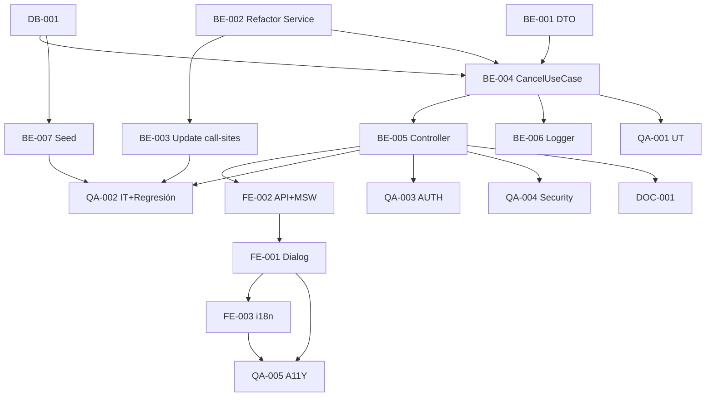

# Development Tasks — PB-P1-034 / US-056: Cancel QR + service refactor

## 1. Metadata

| Field                                | Value                                                                              |
| ------------------------------------ | ---------------------------------------------------------------------------------- |
| User Story ID                        | US-056                                                                             |
| Source User Story                    | `management/user-stories/US-056-cancel-active-quote-request.md`                    |
| Source Technical Specification       | `management/technical-specs/P1/PB-P1-034/US-056-technical-spec.md`                 |
| Decision Resolution Artifact         | `management/user-stories/decision-resolutions/US-056-decision-resolution.md`       |
| Priority                             | P1                                                                                 |
| Backlog ID                           | PB-P1-034                                                                          |
| Backlog Title                        | Cancelar QuoteRequest activa (con restricción)                                      |
| Backlog Execution Order              | 56                                                                                 |
| User Story Position in Backlog Item  | 1 de 1                                                                              |
| Related User Stories in Backlog Item | US-056                                                                              |
| Epic                                 | EPIC-QR-001                                                                        |
| Backlog Item Dependencies            | US-049, US-054, PB-P1-036                                                          |
| Feature                              | Endpoint cancel + `QuoteEventNotificationService` genérico                          |
| Module / Domain                      | Quotes / Notifications                                                              |
| Backlog Alignment Status             | Found                                                                              |
| Task Breakdown Status                | Ready for Sprint Planning                                                          |
| Created Date                         | 2026-06-28                                                                         |
| Last Updated                         | 2026-06-28                                                                         |

---

## 2. Source Validation

| Source                          | Found | Used | Notes                                                       |
| ------------------------------- | ----- | ---- | ----------------------------------------------------------- |
| User Story                      | Yes   | Yes  | Approved with Minor Notes.                                  |
| Technical Specification         | Yes   | Yes  | Ready for Task Breakdown.                                   |
| Decision Resolution Artifact    | Yes   | Yes  | 8/8 decisiones.                                              |
| Product Backlog Prioritized     | Yes   | Yes  | PB-P1-034.                                                  |

---

## 3. Backlog Execution Context

PB-P1-034 single-story. Execution order 56.

---

## 4. Task Breakdown Summary

| Area  | Number of Tasks | Notes                                                                  |
| ----- | --------------: | ---------------------------------------------------------------------- |
| DB    |              1  | Verificar columnas cancel + índice booking_intents.                     |
| BE    |              7  | DTO, refactor service, update call-sites US-053/054, UseCase, controller, logger. |
| FE    |              3  | Dialog, API + MSW, i18n.                                                |
| QA    |              5  | UT, IT (con regresión US-053/054), AUTH, Security, A11Y.                |
| DOC   |              1  | `docs/16 §M07`.                                                          |
| **Total** |           17  |                                                                          |

---

## 5. Traceability Matrix

| Acceptance Criterion       | Technical Spec Section | Task IDs                                                                                                       |
| -------------------------- | ---------------------- | -------------------------------------------------------------------------------------------------------------- |
| AC-01 cancel exitoso         | §7 UseCase              | TASK-PB-P1-034-US-056-BE-001..006, QA-002                                                                      |
| AC-02 sin reason             | §7                      | TASK-PB-P1-034-US-056-BE-001/004, QA-002                                                                       |
| AC-03 Quote intacta          | §7                      | TASK-PB-P1-034-US-056-BE-004, QA-002                                                                            |
| EC-01 confirmed_intent       | §7                      | TASK-PB-P1-034-US-056-BE-004, QA-002                                                                            |
| EC-02..06                    | §6                      | TASK-PB-P1-034-US-056-BE-001/004, QA-002                                                                       |
| AUTH-TS-01..05              | §12                     | TASK-PB-P1-034-US-056-QA-003                                                                                    |
| A11Y                       | §8                      | TASK-PB-P1-034-US-056-FE-001, QA-005                                                                            |
| i18n                       | §8                      | TASK-PB-P1-034-US-056-FE-003                                                                                    |
| Regresión service           | §7 Refactor             | TASK-PB-P1-034-US-056-BE-002/003, QA-002                                                                       |

---

## 6. Development Tasks

### TASK-PB-P1-034-US-056-DB-001 — Verificar columnas cancel + índice booking_intents

| Field                     | Value                                                            |
| ------------------------- | ---------------------------------------------------------------- |
| Area                      | Database / Prisma                                                |
| Type                      | Review                                                           |
| Priority                  | Must                                                             |
| Estimate                  | S                                                                |
| Depends On                | PB-P0-001                                                         |
| Source AC(s)              | AC-01, EC-01                                                      |
| Technical Spec Section(s) | §10                                                              |
| Backlog ID                | PB-P1-034                                                         |
| User Story ID             | US-056                                                            |
| Owner Role                | Backend                                                           |
| Status                    | To Do                                                             |

#### Objective

Confirmar `quote_requests.cancellation_reason/cancelled_at/cancelled_by` y considerar índice en `booking_intents(quote_id, status)`.

#### Definition of Done

- [ ] Pass o migración menor abierta.

---

### TASK-PB-P1-034-US-056-BE-001 — DTO Zod `cancelQuoteRequestBody`

| Field                     | Value                                                            |
| ------------------------- | ---------------------------------------------------------------- |
| Area                      | Backend                                                           |
| Type                      | Implementation                                                    |
| Priority                  | Must                                                              |
| Estimate                  | XS                                                                |
| Depends On                | -                                                                 |
| Source AC(s)              | EC-04, EC-05                                                      |
| Technical Spec Section(s) | §7 DTOs                                                          |
| Backlog ID                | PB-P1-034                                                         |
| User Story ID             | US-056                                                            |
| Owner Role                | Backend                                                           |
| Status                    | To Do                                                             |

#### Definition of Done

- [ ] DTO + UT.

---

### TASK-PB-P1-034-US-056-BE-002 — Refactor `QuoteNotificationService` → `QuoteEventNotificationService`

| Field                     | Value                                                            |
| ------------------------- | ---------------------------------------------------------------- |
| Area                      | Backend                                                           |
| Type                      | Refactor                                                          |
| Priority                  | Must                                                              |
| Estimate                  | M                                                                 |
| Depends On                | US-054 BE-002                                                     |
| Source AC(s)              | AC-01, AC-02                                                      |
| Technical Spec Section(s) | §7 Service                                                        |
| Backlog ID                | PB-P1-034                                                         |
| User Story ID             | US-056                                                            |
| Owner Role                | Backend                                                           |
| Status                    | To Do                                                             |

#### Objective

Rename + generalize a método `emit({ recipientUserId, eventName, payload, tx })`. Tipo `eventName` ∈ `{ 'quote.rejected', 'quote.expired', 'quote_request.cancelled' }`.

#### Definition of Done

- [ ] Service refactorizado.
- [ ] UT verifican los 3 eventos.

---

### TASK-PB-P1-034-US-056-BE-003 — Update call-sites US-053 / US-054

| Field                     | Value                                                            |
| ------------------------- | ---------------------------------------------------------------- |
| Area                      | Backend                                                           |
| Type                      | Refactor                                                          |
| Priority                  | Must                                                              |
| Estimate                  | S                                                                 |
| Depends On                | BE-002                                                            |
| Source AC(s)              | -                                                                 |
| Technical Spec Section(s) | §7                                                                |
| Backlog ID                | PB-P1-034                                                         |
| User Story ID             | US-056                                                            |
| Owner Role                | Backend                                                           |
| Status                    | To Do                                                             |

#### Objective

Actualizar `ExpireQuotesUseCase` (US-053) y `RejectQuoteUseCase` (US-054) para usar el nuevo API del service.

#### Definition of Done

- [ ] Tests de US-053/054 verdes.

---

### TASK-PB-P1-034-US-056-BE-004 — `CancelQuoteRequestUseCase` con check `confirmed_intent`

| Field                     | Value                                                            |
| ------------------------- | ---------------------------------------------------------------- |
| Area                      | Backend                                                           |
| Type                      | Implementation                                                    |
| Priority                  | Must                                                              |
| Estimate                  | L                                                                 |
| Depends On                | BE-001, BE-002, DB-001                                            |
| Source AC(s)              | AC-01..AC-03, EC-01..EC-06                                        |
| Technical Spec Section(s) | §7 UseCase                                                        |
| Backlog ID                | PB-P1-034                                                         |
| User Story ID             | US-056                                                            |
| Owner Role                | Backend                                                           |
| Status                    | To Do                                                             |

#### Objective

UseCase con `prisma.$transaction` + SELECT FOR UPDATE + EXISTS check booking + UPDATE + service.

#### Definition of Done

- [ ] Coverage ≥ 90%.
- [ ] Rollback verificado.

---

### TASK-PB-P1-034-US-056-BE-005 — Controller + ruta `POST /organizer/quote-requests/:id/cancel`

| Field                     | Value                                                            |
| ------------------------- | ---------------------------------------------------------------- |
| Area                      | Backend / API                                                     |
| Type                      | Implementation                                                    |
| Priority                  | Must                                                              |
| Estimate                  | S                                                                 |
| Depends On                | BE-004                                                            |
| Source AC(s)              | AC-01                                                              |
| Technical Spec Section(s) | §7 Controllers                                                    |
| Backlog ID                | PB-P1-034                                                         |
| User Story ID             | US-056                                                            |
| Owner Role                | Backend                                                           |
| Status                    | To Do                                                             |

#### Definition of Done

- [ ] Ruta operativa con guards.

---

### TASK-PB-P1-034-US-056-BE-006 — Logger `quote_request.cancelled`

| Field                     | Value                                                            |
| ------------------------- | ---------------------------------------------------------------- |
| Area                      | Backend / Observability                                           |
| Type                      | Implementation                                                    |
| Priority                  | Must                                                              |
| Estimate                  | XS                                                                |
| Depends On                | BE-004                                                            |
| Source AC(s)              | AC-01                                                              |
| Technical Spec Section(s) | §14                                                               |
| Backlog ID                | PB-P1-034                                                         |
| User Story ID             | US-056                                                            |
| Owner Role                | Backend                                                           |
| Status                    | To Do                                                             |

#### Definition of Done

- [ ] Evento emitido.

---

### TASK-PB-P1-034-US-056-BE-007 — Seed demo

| Field                     | Value                                                            |
| ------------------------- | ---------------------------------------------------------------- |
| Area                      | Backend / Seed                                                    |
| Type                      | Implementation                                                    |
| Priority                  | Should                                                            |
| Estimate                  | XS                                                                |
| Depends On                | DB-001                                                            |
| Source AC(s)              | AC-01, EC-01                                                      |
| Technical Spec Section(s) | §15                                                               |
| Backlog ID                | PB-P1-034                                                         |
| User Story ID             | US-056                                                            |
| Owner Role                | Backend                                                           |
| Status                    | To Do                                                             |

#### Objective

QR `viewed` propia y QR con `confirmed_intent` para demos.

#### Definition of Done

- [ ] Seed reproducible.

---

### TASK-PB-P1-034-US-056-FE-001 — `CancelQRDialog` accesible

| Field                     | Value                                                            |
| ------------------------- | ---------------------------------------------------------------- |
| Area                      | Frontend                                                          |
| Type                      | Implementation                                                    |
| Priority                  | Must                                                              |
| Estimate                  | M                                                                 |
| Depends On                | FE-002                                                            |
| Source AC(s)              | AC-01, A11Y                                                       |
| Technical Spec Section(s) | §8                                                                |
| Backlog ID                | PB-P1-034                                                         |
| User Story ID             | US-056                                                            |
| Owner Role                | Frontend                                                          |
| Status                    | To Do                                                             |

#### Objective

Modal `role="dialog"` con focus trap, ESC, textarea opcional con label.

#### Definition of Done

- [ ] axe sin issues serios.

---

### TASK-PB-P1-034-US-056-FE-002 — `organizerApi.qr.cancel` + MSW

| Field                     | Value                                                            |
| ------------------------- | ---------------------------------------------------------------- |
| Area                      | Frontend                                                          |
| Type                      | Implementation                                                    |
| Priority                  | Must                                                              |
| Estimate                  | S                                                                 |
| Depends On                | BE-005                                                            |
| Source AC(s)              | AC-01                                                              |
| Technical Spec Section(s) | §8                                                                |
| Backlog ID                | PB-P1-034                                                         |
| User Story ID             | US-056                                                            |
| Owner Role                | Frontend                                                          |
| Status                    | To Do                                                             |

#### Definition of Done

- [ ] MSW handlers para `200/400/401/403/404/409`.

---

### TASK-PB-P1-034-US-056-FE-003 — i18n `organizer.qr.cancel.*` en 4 locales

| Field                     | Value                                                            |
| ------------------------- | ---------------------------------------------------------------- |
| Area                      | Frontend / i18n                                                   |
| Type                      | Implementation                                                    |
| Priority                  | Must                                                              |
| Estimate                  | S                                                                 |
| Depends On                | FE-001                                                            |
| Source AC(s)              | i18n                                                              |
| Technical Spec Section(s) | §8                                                                |
| Backlog ID                | PB-P1-034                                                         |
| User Story ID             | US-056                                                            |
| Owner Role                | Frontend                                                          |
| Status                    | To Do                                                             |

#### Definition of Done

- [ ] 4 locales completos.

---

### TASK-PB-P1-034-US-056-QA-001 — Unit tests (DTO + Service refactor + UseCase branches)

| Field                     | Value                                                            |
| ------------------------- | ---------------------------------------------------------------- |
| Area                      | QA                                                                |
| Type                      | Test                                                              |
| Priority                  | Must                                                              |
| Estimate                  | M                                                                 |
| Depends On                | BE-004                                                            |
| Source AC(s)              | EC-01..EC-06                                                      |
| Technical Spec Section(s) | §13                                                               |
| Backlog ID                | PB-P1-034                                                         |
| User Story ID             | US-056                                                            |
| Owner Role                | QA                                                                |
| Status                    | To Do                                                             |

#### Definition of Done

- [ ] Coverage ≥ 90%.

---

### TASK-PB-P1-034-US-056-QA-002 — Integration tests (cancel + restricción + regresión US-053/054)

| Field                     | Value                                                            |
| ------------------------- | ---------------------------------------------------------------- |
| Area                      | QA                                                                |
| Type                      | Test                                                              |
| Priority                  | Must                                                              |
| Estimate                  | L                                                                 |
| Depends On                | BE-005, BE-007                                                    |
| Source AC(s)              | AC-01..AC-03, EC-01..EC-06, NT-01..NT-08                          |
| Technical Spec Section(s) | §13                                                               |
| Backlog ID                | PB-P1-034                                                         |
| User Story ID             | US-056                                                            |
| Owner Role                | QA                                                                |
| Status                    | To Do                                                             |

#### Objective

- TS de US-056.
- Regresión: US-053 (quote.expired) + US-054 (quote.rejected) siguen emitiendo notif tras el refactor.

#### Definition of Done

- [ ] Confirmed_intent check verificado.
- [ ] Regresión verde.

---

### TASK-PB-P1-034-US-056-QA-003 — Authorization tests (AUTH-TS-01..05)

| Field                     | Value                                                            |
| ------------------------- | ---------------------------------------------------------------- |
| Area                      | QA / Security                                                     |
| Type                      | Test                                                              |
| Priority                  | Must                                                              |
| Estimate                  | S                                                                 |
| Depends On                | BE-005                                                            |
| Source AC(s)              | AUTH-TS-01..05                                                    |
| Technical Spec Section(s) | §12                                                               |
| Backlog ID                | PB-P1-034                                                         |
| User Story ID             | US-056                                                            |
| Owner Role                | QA                                                                |
| Status                    | To Do                                                             |

#### Definition of Done

- [ ] `404 QR_NOT_FOUND` uniforme.

---

### TASK-PB-P1-034-US-056-QA-004 — Security tests (confirmed_intent bypass)

| Field                     | Value                                                            |
| ------------------------- | ---------------------------------------------------------------- |
| Area                      | QA / Security                                                     |
| Type                      | Test                                                              |
| Priority                  | Must                                                              |
| Estimate                  | S                                                                 |
| Depends On                | BE-005                                                            |
| Source AC(s)              | EC-01                                                              |
| Technical Spec Section(s) | §13                                                               |
| Backlog ID                | PB-P1-034                                                         |
| User Story ID             | US-056                                                            |
| Owner Role                | QA / Security                                                     |
| Status                    | To Do                                                             |

#### Objective

Verificar que cliente no puede bypassar el check de `confirmed_intent` (assert que el query check no se omite).

#### Definition of Done

- [ ] Test verde.

---

### TASK-PB-P1-034-US-056-QA-005 — Accessibility (`CancelQRDialog`)

| Field                     | Value                                                            |
| ------------------------- | ---------------------------------------------------------------- |
| Area                      | QA / A11Y                                                         |
| Type                      | Test                                                              |
| Priority                  | Must                                                              |
| Estimate                  | S                                                                 |
| Depends On                | FE-001, FE-003                                                    |
| Source AC(s)              | A11Y                                                              |
| Technical Spec Section(s) | §13                                                               |
| Backlog ID                | PB-P1-034                                                         |
| User Story ID             | US-056                                                            |
| Owner Role                | QA / Frontend                                                     |
| Status                    | To Do                                                             |

#### Definition of Done

- [ ] axe sin issues serios.

---

### TASK-PB-P1-034-US-056-DOC-001 — Documentar endpoint cancel en `docs/16 §M07`

| Field                     | Value                                                            |
| ------------------------- | ---------------------------------------------------------------- |
| Area                      | Documentation                                                     |
| Type                      | Documentation                                                     |
| Priority                  | Must                                                              |
| Estimate                  | S                                                                 |
| Depends On                | BE-005                                                            |
| Source AC(s)              | AC-01                                                              |
| Technical Spec Section(s) | §16                                                               |
| Backlog ID                | PB-P1-034                                                         |
| User Story ID             | US-056                                                            |
| Owner Role                | Backend / Doc                                                     |
| Status                    | To Do                                                             |

#### Definition of Done

- [ ] Documentado.

---

## 7. Required QA Tasks

Ver §6.

---

## 8. Required Security Tasks

| Task ID                              | Security Concern                                  | Purpose                                       |
| ------------------------------------ | ------------------------------------------------- | --------------------------------------------- |
| TASK-PB-P1-034-US-056-QA-003         | `404 QR_NOT_FOUND` uniforme.                       | Sin information leakage.                       |
| TASK-PB-P1-034-US-056-QA-004         | Bypass de confirmed_intent.                        | Integridad del flujo confirmado.               |

---

## 9. Required Seed / Demo Tasks

| Task ID                              | Concern                                  | Purpose                              |
| ------------------------------------ | ---------------------------------------- | ------------------------------------ |
| TASK-PB-P1-034-US-056-BE-007         | QR demo + QR con confirmed_intent.       | Demos del happy path y del bloqueo.   |

---

## 10. Observability / Audit Tasks

| Task ID                              | Concern                                  | Purpose                              |
| ------------------------------------ | ---------------------------------------- | ------------------------------------ |
| TASK-PB-P1-034-US-056-BE-006         | Log `quote_request.cancelled`.            | Trazabilidad operativa.              |

---

## 11. Documentation / Traceability Tasks

| Task ID                              | Document / Artifact   | Purpose                                  |
| ------------------------------------ | --------------------- | ---------------------------------------- |
| TASK-PB-P1-034-US-056-DOC-001        | `docs/16 §M07`.       | Contrato del endpoint cancel.            |

---

## 12. Dependency Graph

---

## 13. Suggested Implementation Order

### Phase 1 — Foundation
- DB-001
- BE-001 DTO
- BE-002 Refactor Service

### Phase 2 — Core
- BE-003 Update call-sites
- BE-004 CancelUseCase
- BE-005 Controller
- BE-006 Logger
- BE-007 Seed
- FE-002 API + MSW
- FE-001 Dialog
- FE-003 i18n

### Phase 3 — QA
- QA-001 UT
- QA-002 IT + Regresión
- QA-003 AUTH
- QA-004 Security
- QA-005 A11Y

### Phase 4 — Doc
- DOC-001

---

## 14. Risks & Mitigations

Ver §17 del Technical Spec.

---

## 15. Out of Scope Confirmation

- Cancel Quote asociada, BookingIntent, penalty.

---

## 16. Readiness for Sprint Planning

| Check                                      | Status |
| ------------------------------------------ | ------ |
| Product Backlog mapping found              | Pass   |
| Every AC maps to tasks                     | Pass   |
| Technical Spec used when available         | Pass   |
| QA tasks included                          | Pass   |
| Security tasks included if applicable      | Pass   |
| Seed/demo tasks included if applicable     | Pass   |
| Observability tasks included if applicable | Pass   |
| Documentation tasks included if applicable | Pass   |
| Task dependencies clear                    | Pass   |
| Tasks small enough                         | Pass   |
| Ready for Sprint Planning                  | Yes    |

---

## 17. Final Recommendation

`Ready for Sprint Planning`.

US-056 entrega 17 tareas: endpoint cancel con restricción confirmed_intent + refactor service común a `QuoteEventNotificationService` con eventos múltiples. QA-002 verifica regresión integral de US-053 (quote.expired) y US-054 (quote.rejected).
