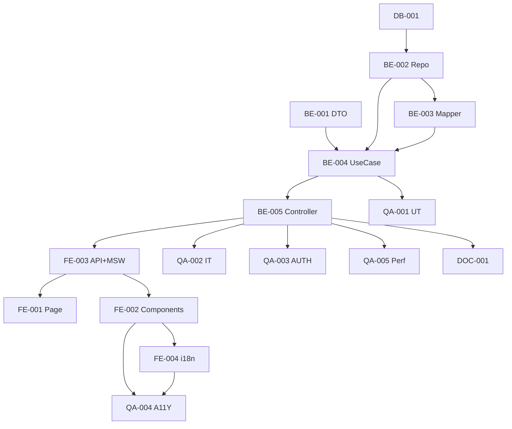

# Development Tasks — PB-P1-035 / US-057: Comparador Quotes lado a lado

## 1. Metadata

| Field                                | Value                                                                              |
| ------------------------------------ | ---------------------------------------------------------------------------------- |
| User Story ID                        | US-057                                                                             |
| Source User Story                    | `management/user-stories/US-057-compare-quotes-side-by-side.md`                    |
| Source Technical Specification       | `management/technical-specs/P1/PB-P1-035/US-057-technical-spec.md`                 |
| Decision Resolution Artifact         | `management/user-stories/decision-resolutions/US-057-decision-resolution.md`       |
| Priority                             | P1                                                                                 |
| Backlog ID                           | PB-P1-035                                                                          |
| Backlog Title                        | Comparador lado a lado + marca preferred                                            |
| Backlog Execution Order              | 57                                                                                 |
| User Story Position in Backlog Item  | 1 de 2 (US-057 → US-058)                                                            |
| Related User Stories in Backlog Item | US-057, US-058                                                                     |
| Epic                                 | EPIC-CMP-001                                                                       |
| Backlog Item Dependencies            | PB-P1-031, PB-P0-001                                                               |
| Feature                              | `CompareQuotesUseCase` + UI responsive                                              |
| Module / Domain                      | Quotes / Booking                                                                   |
| Backlog Alignment Status             | Found                                                                              |
| Task Breakdown Status                | Ready for Sprint Planning                                                          |
| Created Date                         | 2026-06-28                                                                         |
| Last Updated                         | 2026-06-28                                                                         |

---

## 2. Source Validation

| Source                          | Found | Used | Notes                                                       |
| ------------------------------- | ----- | ---- | ----------------------------------------------------------- |
| User Story                      | Yes   | Yes  | Approved with Minor Notes.                                  |
| Technical Specification         | Yes   | Yes  | Ready for Task Breakdown.                                   |
| Decision Resolution Artifact    | Yes   | Yes  | 5/5 decisiones.                                              |
| Product Backlog Prioritized     | Yes   | Yes  | PB-P1-035.                                                  |

---

## 3. Backlog Execution Context

US-057 es 1 de 2 en PB-P1-035 (US-058 cerrará con mark preferred).

---

## 4. Task Breakdown Summary

| Area  | Number of Tasks | Notes                                                       |
| ----- | --------------: | ----------------------------------------------------------- |
| DB    |              1  | Verificar índices.                                            |
| BE    |              5  | DTO, repository, mapper, use case, controller.               |
| FE    |              4  | Page, table desktop, cards mobile + indicator, API + MSW, i18n. |
| QA    |              5  | UT, IT, AUTH, A11Y, Performance.                            |
| DOC   |              1  | `docs/16 §M07`.                                              |
| **Total** |           16  |                                                              |

---

## 5. Traceability Matrix

| Acceptance Criterion       | Technical Spec Section | Task IDs                                                                                                       |
| -------------------------- | ---------------------- | -------------------------------------------------------------------------------------------------------------- |
| AC-01 ≥2 Quotes              | §7                      | TASK-PB-P1-035-US-057-BE-002..005, QA-002                                                                      |
| AC-02 1 Quote                | §7                      | TASK-PB-P1-035-US-057-BE-002/004, FE-002, QA-002                                                              |
| AC-03 empty                  | §7                      | TASK-PB-P1-035-US-057-BE-002/004, FE-002                                                                       |
| AC-04 AI deep-link           | §8                      | TASK-PB-P1-035-US-057-FE-002                                                                                    |
| EC-01..04                    | §6                      | TASK-PB-P1-035-US-057-BE-001/004, QA-002                                                                       |
| AUTH-TS-01..05              | §12                     | TASK-PB-P1-035-US-057-QA-003                                                                                    |
| A11Y                       | §8                      | TASK-PB-P1-035-US-057-FE-002, QA-004                                                                            |
| Performance                | §13                     | TASK-PB-P1-035-US-057-QA-005                                                                                    |

---

## 6. Development Tasks

### TASK-PB-P1-035-US-057-DB-001 — Verificar índices

| Field                     | Value                                                            |
| ------------------------- | ---------------------------------------------------------------- |
| Area                      | Database / Prisma                                                |
| Type                      | Review                                                           |
| Priority                  | Must                                                             |
| Estimate                  | XS                                                               |
| Depends On                | PB-P0-001                                                         |
| Source AC(s)              | Performance                                                       |
| Technical Spec Section(s) | §10                                                              |
| Backlog ID                | PB-P1-035                                                         |
| User Story ID             | US-057                                                            |
| Owner Role                | Backend                                                           |
| Status                    | To Do                                                             |

#### Definition of Done

- [ ] Pass o issue.

---

### TASK-PB-P1-035-US-057-BE-001 — DTO `eventIdParam` + `compareQuotesQuery`

| Field                     | Value                                                            |
| ------------------------- | ---------------------------------------------------------------- |
| Area                      | Backend                                                           |
| Type                      | Implementation                                                    |
| Priority                  | Must                                                              |
| Estimate                  | XS                                                                |
| Depends On                | -                                                                 |
| Source AC(s)              | EC-01                                                              |
| Technical Spec Section(s) | §7 DTOs                                                          |
| Backlog ID                | PB-P1-035                                                         |
| User Story ID             | US-057                                                            |
| Owner Role                | Backend                                                           |
| Status                    | To Do                                                             |

#### Definition of Done

- [ ] DTOs + UT.

---

### TASK-PB-P1-035-US-057-BE-002 — Repository `findComparableByEventAndCategory`

| Field                     | Value                                                            |
| ------------------------- | ---------------------------------------------------------------- |
| Area                      | Backend                                                           |
| Type                      | Implementation                                                    |
| Priority                  | Must                                                              |
| Estimate                  | M                                                                 |
| Depends On                | DB-001                                                            |
| Source AC(s)              | AC-01..AC-03                                                      |
| Technical Spec Section(s) | §7 Repository                                                     |
| Backlog ID                | PB-P1-035                                                         |
| User Story ID             | US-057                                                            |
| Owner Role                | Backend                                                           |
| Status                    | To Do                                                             |

#### Objective

Query con joins + orden estable.

#### Definition of Done

- [ ] Método + UT.

---

### TASK-PB-P1-035-US-057-BE-003 — Mapper `comparable-quote.mapper`

| Field                     | Value                                                            |
| ------------------------- | ---------------------------------------------------------------- |
| Area                      | Backend                                                           |
| Type                      | Implementation                                                    |
| Priority                  | Must                                                              |
| Estimate                  | S                                                                 |
| Depends On                | BE-002                                                            |
| Source AC(s)              | AC-01                                                              |
| Technical Spec Section(s) | §7 Mapper                                                         |
| Backlog ID                | PB-P1-035                                                         |
| User Story ID             | US-057                                                            |
| Owner Role                | Backend                                                           |
| Status                    | To Do                                                             |

#### Objective

Whitelist mapper (no exponer campos sensibles del vendor).

#### Definition of Done

- [ ] Mapper + UT.

---

### TASK-PB-P1-035-US-057-BE-004 — `CompareQuotesUseCase`

| Field                     | Value                                                            |
| ------------------------- | ---------------------------------------------------------------- |
| Area                      | Backend                                                           |
| Type                      | Implementation                                                    |
| Priority                  | Must                                                              |
| Estimate                  | M                                                                 |
| Depends On                | BE-001, BE-002, BE-003                                            |
| Source AC(s)              | AC-01..AC-03, EC-01..EC-04                                        |
| Technical Spec Section(s) | §7 UseCase                                                        |
| Backlog ID                | PB-P1-035                                                         |
| User Story ID             | US-057                                                            |
| Owner Role                | Backend                                                           |
| Status                    | To Do                                                             |

#### Definition of Done

- [ ] Coverage ≥ 90%.

---

### TASK-PB-P1-035-US-057-BE-005 — Controller + ruta

| Field                     | Value                                                            |
| ------------------------- | ---------------------------------------------------------------- |
| Area                      | Backend / API                                                     |
| Type                      | Implementation                                                    |
| Priority                  | Must                                                              |
| Estimate                  | S                                                                 |
| Depends On                | BE-004                                                            |
| Source AC(s)              | AC-01                                                              |
| Technical Spec Section(s) | §7 Controllers                                                    |
| Backlog ID                | PB-P1-035                                                         |
| User Story ID             | US-057                                                            |
| Owner Role                | Backend                                                           |
| Status                    | To Do                                                             |

#### Definition of Done

- [ ] Ruta operativa con guards.

---

### TASK-PB-P1-035-US-057-FE-001 — Page `compare`

| Field                     | Value                                                            |
| ------------------------- | ---------------------------------------------------------------- |
| Area                      | Frontend                                                          |
| Type                      | Implementation                                                    |
| Priority                  | Must                                                              |
| Estimate                  | M                                                                 |
| Depends On                | FE-003                                                            |
| Source AC(s)              | AC-01                                                              |
| Technical Spec Section(s) | §8                                                                |
| Backlog ID                | PB-P1-035                                                         |
| User Story ID             | US-057                                                            |
| Owner Role                | Frontend                                                          |
| Status                    | To Do                                                             |

#### Definition of Done

- [ ] Page renderiza con orchestrator.

---

### TASK-PB-P1-035-US-057-FE-002 — Componentes responsive (Table + Cards + StatusIndicator)

| Field                     | Value                                                            |
| ------------------------- | ---------------------------------------------------------------- |
| Area                      | Frontend                                                          |
| Type                      | Implementation                                                    |
| Priority                  | Must                                                              |
| Estimate                  | L                                                                 |
| Depends On                | FE-003                                                            |
| Source AC(s)              | AC-01..AC-04, A11Y                                                |
| Technical Spec Section(s) | §8                                                                |
| Backlog ID                | PB-P1-035                                                         |
| User Story ID             | US-057                                                            |
| Owner Role                | Frontend                                                          |
| Status                    | To Do                                                             |

#### Objective

`QuoteComparisonTable` (desktop) + `QuoteComparisonCards` (mobile) + `QuoteStatusIndicator`. Empty states 0/1/≥2. CTAs deep-link a US-058 y US-022.

#### Definition of Done

- [ ] axe sin issues serios.
- [ ] Responsive verificado.

---

### TASK-PB-P1-035-US-057-FE-003 — `quotesApi.compare` + MSW

| Field                     | Value                                                            |
| ------------------------- | ---------------------------------------------------------------- |
| Area                      | Frontend                                                          |
| Type                      | Implementation                                                    |
| Priority                  | Must                                                              |
| Estimate                  | S                                                                 |
| Depends On                | BE-005                                                            |
| Source AC(s)              | AC-01..AC-03                                                      |
| Technical Spec Section(s) | §8                                                                |
| Backlog ID                | PB-P1-035                                                         |
| User Story ID             | US-057                                                            |
| Owner Role                | Frontend                                                          |
| Status                    | To Do                                                             |

#### Definition of Done

- [ ] MSW handlers para `200/400/401/403/404`.

---

### TASK-PB-P1-035-US-057-FE-004 — i18n `organizer.quote.compare.*` en 4 locales

| Field                     | Value                                                            |
| ------------------------- | ---------------------------------------------------------------- |
| Area                      | Frontend / i18n                                                   |
| Type                      | Implementation                                                    |
| Priority                  | Must                                                              |
| Estimate                  | S                                                                 |
| Depends On                | FE-002                                                            |
| Source AC(s)              | i18n                                                              |
| Technical Spec Section(s) | §8                                                                |
| Backlog ID                | PB-P1-035                                                         |
| User Story ID             | US-057                                                            |
| Owner Role                | Frontend                                                          |
| Status                    | To Do                                                             |

#### Definition of Done

- [ ] 4 locales completos.

---

### TASK-PB-P1-035-US-057-QA-001 — Unit tests (DTOs + mapper + use case)

| Field                     | Value                                                            |
| ------------------------- | ---------------------------------------------------------------- |
| Area                      | QA                                                                |
| Type                      | Test                                                              |
| Priority                  | Must                                                              |
| Estimate                  | S                                                                 |
| Depends On                | BE-004                                                            |
| Source AC(s)              | Múltiples                                                          |
| Technical Spec Section(s) | §13                                                               |
| Backlog ID                | PB-P1-035                                                         |
| User Story ID             | US-057                                                            |
| Owner Role                | QA                                                                |
| Status                    | To Do                                                             |

#### Definition of Done

- [ ] Coverage ≥ 90%.

---

### TASK-PB-P1-035-US-057-QA-002 — Integration (orden estable + estados + empty)

| Field                     | Value                                                            |
| ------------------------- | ---------------------------------------------------------------- |
| Area                      | QA                                                                |
| Type                      | Test                                                              |
| Priority                  | Must                                                              |
| Estimate                  | M                                                                 |
| Depends On                | BE-005                                                            |
| Source AC(s)              | AC-01..AC-03, EC-01..EC-04                                        |
| Technical Spec Section(s) | §13                                                               |
| Backlog ID                | PB-P1-035                                                         |
| User Story ID             | US-057                                                            |
| Owner Role                | QA                                                                |
| Status                    | To Do                                                             |

#### Definition of Done

- [ ] Casos 0/1/≥2 Quotes verificados.

---

### TASK-PB-P1-035-US-057-QA-003 — Authorization tests

| Field                     | Value                                                            |
| ------------------------- | ---------------------------------------------------------------- |
| Area                      | QA / Security                                                     |
| Type                      | Test                                                              |
| Priority                  | Must                                                              |
| Estimate                  | S                                                                 |
| Depends On                | BE-005                                                            |
| Source AC(s)              | AUTH-TS-01..05                                                    |
| Technical Spec Section(s) | §12                                                               |
| Backlog ID                | PB-P1-035                                                         |
| User Story ID             | US-057                                                            |
| Owner Role                | QA                                                                |
| Status                    | To Do                                                             |

#### Definition of Done

- [ ] `404 EVENT_NOT_FOUND` uniforme.

---

### TASK-PB-P1-035-US-057-QA-004 — Accessibility (tabla + cards)

| Field                     | Value                                                            |
| ------------------------- | ---------------------------------------------------------------- |
| Area                      | QA / A11Y                                                         |
| Type                      | Test                                                              |
| Priority                  | Must                                                              |
| Estimate                  | S                                                                 |
| Depends On                | FE-002, FE-004                                                    |
| Source AC(s)              | A11Y                                                              |
| Technical Spec Section(s) | §13                                                               |
| Backlog ID                | PB-P1-035                                                         |
| User Story ID             | US-057                                                            |
| Owner Role                | QA / Frontend                                                     |
| Status                    | To Do                                                             |

#### Definition of Done

- [ ] axe sin issues serios.

---

### TASK-PB-P1-035-US-057-QA-005 — Performance (< 1s p95)

| Field                     | Value                                                            |
| ------------------------- | ---------------------------------------------------------------- |
| Area                      | QA / Performance                                                  |
| Type                      | Test                                                              |
| Priority                  | Must                                                              |
| Estimate                  | S                                                                 |
| Depends On                | BE-005                                                            |
| Source AC(s)              | NFR-PERF-001                                                      |
| Technical Spec Section(s) | §13                                                               |
| Backlog ID                | PB-P1-035                                                         |
| User Story ID             | US-057                                                            |
| Owner Role                | QA                                                                |
| Status                    | To Do                                                             |

#### Definition of Done

- [ ] `< 1s p95` reportado.

---

### TASK-PB-P1-035-US-057-DOC-001 — Documentar endpoint compare en `docs/16 §M07`

| Field                     | Value                                                            |
| ------------------------- | ---------------------------------------------------------------- |
| Area                      | Documentation                                                     |
| Type                      | Documentation                                                     |
| Priority                  | Must                                                              |
| Estimate                  | S                                                                 |
| Depends On                | BE-005                                                            |
| Source AC(s)              | AC-01                                                              |
| Technical Spec Section(s) | §16                                                               |
| Backlog ID                | PB-P1-035                                                         |
| User Story ID             | US-057                                                            |
| Owner Role                | Backend / Doc                                                     |
| Status                    | To Do                                                             |

#### Definition of Done

- [ ] Documentado.

---

## 7. Required QA Tasks

Ver §6.

---

## 8. Required Security Tasks

| Task ID                              | Security Concern                                  | Purpose                                       |
| ------------------------------------ | ------------------------------------------------- | --------------------------------------------- |
| TASK-PB-P1-035-US-057-QA-003         | `404 EVENT_NOT_FOUND` uniforme.                    | Sin information leakage.                       |
| TASK-PB-P1-035-US-057-BE-003         | Whitelist mapper.                                  | Sin PII del vendor.                            |

---

## 9. Required Seed / Demo Tasks

`No aplica` (reuso seed). Verificar que existen ≥2 Quotes en misma categoría.

---

## 10. Observability / Audit Tasks

`No aplica` (solo log estándar).

---

## 11. Documentation / Traceability Tasks

| Task ID                              | Document / Artifact   | Purpose                                  |
| ------------------------------------ | --------------------- | ---------------------------------------- |
| TASK-PB-P1-035-US-057-DOC-001        | `docs/16 §M07`.       | Contrato del endpoint.                    |

---

## 12. Dependency Graph

---

## 13. Suggested Implementation Order

### Phase 1 — Foundation
- DB-001
- BE-001 DTO

### Phase 2 — Core
- BE-002 Repository
- BE-003 Mapper
- BE-004 UseCase
- BE-005 Controller
- FE-003 API + MSW
- FE-002 Components
- FE-001 Page
- FE-004 i18n

### Phase 3 — QA
- QA-001 UT
- QA-002 IT
- QA-003 AUTH
- QA-004 A11Y
- QA-005 Performance

### Phase 4 — Doc
- DOC-001

---

## 14. Risks & Mitigations

Ver §17 del Technical Spec.

---

## 15. Out of Scope Confirmation

- Mark preferred (US-058), AI summary (US-022), FX, filtros adicionales.

---

## 16. Readiness for Sprint Planning

| Check                                      | Status |
| ------------------------------------------ | ------ |
| Product Backlog mapping found              | Pass   |
| Every AC maps to tasks                     | Pass   |
| Technical Spec used when available         | Pass   |
| QA tasks included                          | Pass   |
| Security tasks included if applicable      | Pass   |
| Seed/demo tasks included if applicable     | N/A    |
| Observability tasks included if applicable | N/A    |
| Documentation tasks included if applicable | Pass   |
| Task dependencies clear                    | Pass   |
| Tasks small enough                         | Pass   |
| Ready for Sprint Planning                  | Yes    |

---

## 17. Final Recommendation

`Ready for Sprint Planning`.

US-057 entrega 16 tareas: `CompareQuotesUseCase` + UI responsive (tabla/cards) + empty states 0/1/≥2. US-058 cerrará PB-P1-035 con mark preferred.
