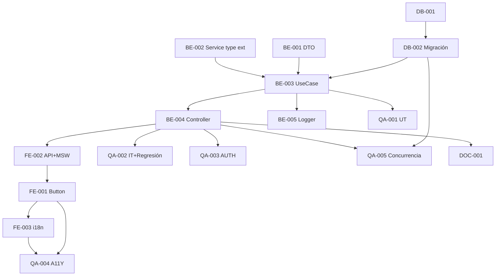

# Development Tasks — PB-P1-035 / US-058: Toggle Quote.is_preferred

## 1. Metadata

| Field | Value |
|---|---|
| User Story ID | US-058 |
| Source User Story | `management/user-stories/US-058-mark-quote-preferred.md` |
| Source Technical Specification | `management/technical-specs/P1/PB-P1-035/US-058-technical-spec.md` |
| Decision Resolution Artifact | `management/user-stories/decision-resolutions/US-058-decision-resolution.md` |
| Priority | P1 |
| Backlog ID | PB-P1-035 |
| Backlog Title | Comparador lado a lado + marca preferred |
| Backlog Execution Order | 58 |
| User Story Position in Backlog Item | 2 de 2 |
| Related User Stories in Backlog Item | US-057, US-058 |
| Epic | EPIC-CMP-001 |
| Backlog Item Dependencies | PB-P1-031, US-054, US-056 |
| Feature | Toggle preferred + service común extendido + migración menor |
| Module / Domain | Quotes / Booking |
| Backlog Alignment Status | Found |
| Task Breakdown Status | Ready for Sprint Planning |
| Created Date | 2026-06-28 |
| Last Updated | 2026-06-28 |

---

## 2. Source Validation

| Source | Found | Used | Notes |
|---|---|---|---|
| User Story | Yes | Yes | Approved with Minor Notes. |
| Technical Specification | Yes | Yes | Ready for Task Breakdown. |
| Decision Resolution Artifact | Yes | Yes | 7/7 decisiones. |
| Product Backlog Prioritized | Yes | Yes | PB-P1-035. |

---

## 3. Backlog Execution Context

US-058 cierra PB-P1-035. Execution order 58.

---

## 4. Task Breakdown Summary

| Area | Count | Notes |
|---|---:|---|
| DB | 2 | Verify + migración denormalize + UNIQUE parcial. |
| BE | 5 | DTO, service refactor type, UseCase, controller, logger. |
| FE | 3 | PreferredToggleButton, API + MSW, i18n. |
| QA | 5 | UT, IT (con regresión service), AUTH, A11Y, Concurrencia UNIQUE. |
| DOC | 1 | `docs/16 §M07`. |
| **Total** | 16 | |

---

## 5. Traceability Matrix

| AC | Task IDs |
|---|---|
| AC-01 mark sin previa | TASK-PB-P1-035-US-058-BE-003, QA-002 |
| AC-02 cambio preferred | TASK-PB-P1-035-US-058-BE-003, QA-002 |
| AC-03 unmark | TASK-PB-P1-035-US-058-BE-003, QA-002 |
| AC-04 idempotencia | TASK-PB-P1-035-US-058-BE-003, QA-002 |
| EC-01..03 | TASK-PB-P1-035-US-058-BE-001/003, QA-002 |
| UNIQUE parcial | TASK-PB-P1-035-US-058-DB-002, QA-005 |
| AUTH-TS-01..04 | TASK-PB-P1-035-US-058-QA-003 |
| A11Y | TASK-PB-P1-035-US-058-FE-001, QA-004 |
| i18n | TASK-PB-P1-035-US-058-FE-003 |

---

## 6. Development Tasks

### TASK-PB-P1-035-US-058-DB-001 — Verificar schema `quotes`

| Field | Value |
|---|---|
| Area | Database / Prisma |
| Type | Review |
| Priority | Must |
| Estimate | XS |
| Depends On | PB-P0-001 |
| Source AC(s) | Precondiciones |
| Technical Spec Section(s) | §10 |
| Backlog ID | PB-P1-035 |
| User Story ID | US-058 |
| Owner Role | Backend |
| Status | To Do |

#### Definition of Done
- [ ] Pass.

---

### TASK-PB-P1-035-US-058-DB-002 — Migración: denormalize + UNIQUE parcial

| Field | Value |
|---|---|
| Area | Database / Prisma |
| Type | Implementation |
| Priority | Must |
| Estimate | M |
| Depends On | DB-001 |
| Source AC(s) | UNIQUE constraint |
| Technical Spec Section(s) | §10 |
| Backlog ID | PB-P1-035 |
| User Story ID | US-058 |
| Owner Role | Backend |
| Status | To Do |

#### Objective
Migración Prisma: add `event_id` + `service_category_id` en `quotes` con backfill; FKs; UNIQUE parcial `(event_id, service_category_id) WHERE is_preferred=true`.

#### Definition of Done
- [ ] Migración aplica sin errores.
- [ ] Backfill validado.
- [ ] UNIQUE parcial enforced (test concurrencia).

---

### TASK-PB-P1-035-US-058-BE-001 — DTO `preferredBody`

| Field | Value |
|---|---|
| Area | Backend |
| Type | Implementation |
| Priority | Must |
| Estimate | XS |
| Depends On | - |
| Source AC(s) | Precondiciones |
| Technical Spec Section(s) | §7 DTO |
| Backlog ID | PB-P1-035 |
| User Story ID | US-058 |
| Owner Role | Backend |
| Status | To Do |

#### Definition of Done
- [ ] Zod + UT.

---

### TASK-PB-P1-035-US-058-BE-002 — Extender type del service común con 2 eventos nuevos

| Field | Value |
|---|---|
| Area | Backend |
| Type | Refactor |
| Priority | Must |
| Estimate | XS |
| Depends On | US-056 BE-002 |
| Source AC(s) | AC-01..AC-03 |
| Technical Spec Section(s) | §7 Service |
| Backlog ID | PB-P1-035 |
| User Story ID | US-058 |
| Owner Role | Backend |
| Status | To Do |

#### Objective
`type QuoteEventName` añade `'quote.marked_preferred' | 'quote.unmarked_preferred'`.

#### Definition of Done
- [ ] Type actualizado.
- [ ] UT cubre los 5 eventos.

---

### TASK-PB-P1-035-US-058-BE-003 — `MarkQuotePreferredUseCase`

| Field | Value |
|---|---|
| Area | Backend |
| Type | Implementation |
| Priority | Must |
| Estimate | L |
| Depends On | BE-001, BE-002, DB-002 |
| Source AC(s) | AC-01..AC-04, EC-01..EC-03 |
| Technical Spec Section(s) | §7 UseCase |
| Backlog ID | PB-P1-035 |
| User Story ID | US-058 |
| Owner Role | Backend |
| Status | To Do |

#### Definition of Done
- [ ] Coverage ≥ 90%.
- [ ] Branches mark/unmark/idempotencia/clear previa/expired/wrong state.

---

### TASK-PB-P1-035-US-058-BE-004 — Controller + ruta

| Field | Value |
|---|---|
| Area | Backend / API |
| Type | Implementation |
| Priority | Must |
| Estimate | S |
| Depends On | BE-003 |
| Source AC(s) | AC-01..AC-04 |
| Technical Spec Section(s) | §7 Controllers |
| Backlog ID | PB-P1-035 |
| User Story ID | US-058 |
| Owner Role | Backend |
| Status | To Do |

#### Definition of Done
- [ ] Ruta `PATCH /quotes/:id/preferred` con guards.

---

### TASK-PB-P1-035-US-058-BE-005 — Logger `quote.preferred.toggled`

| Field | Value |
|---|---|
| Area | Backend / Observability |
| Type | Implementation |
| Priority | Must |
| Estimate | XS |
| Depends On | BE-003 |
| Source AC(s) | AC-01..AC-03 |
| Technical Spec Section(s) | §14 |
| Backlog ID | PB-P1-035 |
| User Story ID | US-058 |
| Owner Role | Backend |
| Status | To Do |

#### Definition of Done
- [ ] Evento emitido con previousValue, newValue, unmarkedQuoteId?.

---

### TASK-PB-P1-035-US-058-FE-001 — `PreferredToggleButton` accesible

| Field | Value |
|---|---|
| Area | Frontend |
| Type | Implementation |
| Priority | Must |
| Estimate | M |
| Depends On | FE-002 |
| Source AC(s) | AC-01..AC-03, A11Y |
| Technical Spec Section(s) | §8 |
| Backlog ID | PB-P1-035 |
| User Story ID | US-058 |
| Owner Role | Frontend |
| Status | To Do |

#### Objective
Star icon llena/vacía con `aria-pressed` + label dinámico i18n.

#### Definition of Done
- [ ] axe sin issues.
- [ ] Mutation con invalidate.

---

### TASK-PB-P1-035-US-058-FE-002 — `quotesApi.preferred` + MSW

| Field | Value |
|---|---|
| Area | Frontend |
| Type | Implementation |
| Priority | Must |
| Estimate | S |
| Depends On | BE-004 |
| Source AC(s) | AC-01..AC-04 |
| Technical Spec Section(s) | §8 |
| Backlog ID | PB-P1-035 |
| User Story ID | US-058 |
| Owner Role | Frontend |
| Status | To Do |

#### Definition of Done
- [ ] MSW handlers `200/400/401/403/404/409`.

---

### TASK-PB-P1-035-US-058-FE-003 — i18n `organizer.quote.preferred.*` en 4 locales

| Field | Value |
|---|---|
| Area | Frontend / i18n |
| Type | Implementation |
| Priority | Must |
| Estimate | S |
| Depends On | FE-001 |
| Source AC(s) | i18n |
| Technical Spec Section(s) | §8 |
| Backlog ID | PB-P1-035 |
| User Story ID | US-058 |
| Owner Role | Frontend |
| Status | To Do |

#### Definition of Done
- [ ] 4 locales completos.

---

### TASK-PB-P1-035-US-058-QA-001 — Unit tests (DTO + UseCase branches)

| Field | Value |
|---|---|
| Area | QA |
| Type | Test |
| Priority | Must |
| Estimate | M |
| Depends On | BE-003 |
| Source AC(s) | AC-01..AC-04, EC-01..EC-03 |
| Technical Spec Section(s) | §13 |
| Backlog ID | PB-P1-035 |
| User Story ID | US-058 |
| Owner Role | QA / Backend |
| Status | To Do |

#### Definition of Done
- [ ] Coverage ≥ 90%.

---

### TASK-PB-P1-035-US-058-QA-002 — IT (toggle + atomicidad + regresión service)

| Field | Value |
|---|---|
| Area | QA |
| Type | Test |
| Priority | Must |
| Estimate | M |
| Depends On | BE-004 |
| Source AC(s) | AC-01..AC-04, EC-01..EC-03 |
| Technical Spec Section(s) | §13 |
| Backlog ID | PB-P1-035 |
| User Story ID | US-058 |
| Owner Role | QA |
| Status | To Do |

#### Definition of Done
- [ ] Cambio preferred dispara 4 notifs (2 target + 2 unmark previa).
- [ ] Regresión: US-053/054/056 siguen funcionando con service extendido.

---

### TASK-PB-P1-035-US-058-QA-003 — Authorization tests

| Field | Value |
|---|---|
| Area | QA / Security |
| Type | Test |
| Priority | Must |
| Estimate | S |
| Depends On | BE-004 |
| Source AC(s) | AUTH-TS-01..04 |
| Technical Spec Section(s) | §12 |
| Backlog ID | PB-P1-035 |
| User Story ID | US-058 |
| Owner Role | QA |
| Status | To Do |

#### Definition of Done
- [ ] `404 QUOTE_NOT_FOUND` uniforme.

---

### TASK-PB-P1-035-US-058-QA-004 — Accessibility (`aria-pressed`)

| Field | Value |
|---|---|
| Area | QA / A11Y |
| Type | Test |
| Priority | Must |
| Estimate | S |
| Depends On | FE-001, FE-003 |
| Source AC(s) | A11Y |
| Technical Spec Section(s) | §13 |
| Backlog ID | PB-P1-035 |
| User Story ID | US-058 |
| Owner Role | QA / Frontend |
| Status | To Do |

#### Definition of Done
- [ ] axe sin issues.

---

### TASK-PB-P1-035-US-058-QA-005 — Concurrencia (UNIQUE parcial)

| Field | Value |
|---|---|
| Area | QA / Security |
| Type | Test |
| Priority | Must |
| Estimate | S |
| Depends On | DB-002, BE-004 |
| Source AC(s) | UNIQUE constraint |
| Technical Spec Section(s) | §17 |
| Backlog ID | PB-P1-035 |
| User Story ID | US-058 |
| Owner Role | QA |
| Status | To Do |

#### Objective
2 PATCH simultáneos marcando preferred a 2 Quotes diferentes del mismo (event, category): uno gana, el otro falla con constraint violation.

#### Definition of Done
- [ ] UNIQUE parcial enforced.

---

### TASK-PB-P1-035-US-058-DOC-001 — Documentar PATCH preferred en `docs/16 §M07`

| Field | Value |
|---|---|
| Area | Documentation |
| Type | Documentation |
| Priority | Must |
| Estimate | S |
| Depends On | BE-004 |
| Source AC(s) | AC-01 |
| Technical Spec Section(s) | §16 |
| Backlog ID | PB-P1-035 |
| User Story ID | US-058 |
| Owner Role | Backend / Doc |
| Status | To Do |

#### Definition of Done
- [ ] Documentado.

---

## 7. Required QA Tasks
Ver §6.

## 8. Required Security Tasks
| Task ID | Concern |
|---|---|
| TASK-PB-P1-035-US-058-QA-003 | `404 QUOTE_NOT_FOUND` uniforme |
| TASK-PB-P1-035-US-058-QA-005 | UNIQUE parcial (race condition) |

## 9. Required Seed / Demo Tasks
`No aplica` (reuso seed).

## 10. Observability / Audit Tasks
| Task ID | Concern |
|---|---|
| TASK-PB-P1-035-US-058-BE-005 | Log `quote.preferred.toggled` |

## 11. Documentation / Traceability Tasks
| Task ID | Doc |
|---|---|
| TASK-PB-P1-035-US-058-DOC-001 | `docs/16 §M07` |

## 12. Dependency Graph

---

## 13. Suggested Implementation Order

**Phase 1 — Foundation**: DB-001, DB-002 (migración), BE-001 DTO, BE-002 service ext.
**Phase 2 — Core**: BE-003 UseCase, BE-004 Controller, BE-005 Logger, FE-002 API+MSW, FE-001 Button, FE-003 i18n.
**Phase 3 — QA**: QA-001 UT, QA-002 IT + regresión, QA-003 AUTH, QA-005 Concurrencia, QA-004 A11Y.
**Phase 4 — Doc**: DOC-001.

---

## 14. Risks & Mitigations
Ver §17 del Technical Spec.

## 15. Out of Scope Confirmation
Multi-preferred, auto-mark al aceptar.

## 16. Readiness for Sprint Planning

| Check | Status |
|---|---|
| Product Backlog mapping found | Pass |
| Every AC maps to tasks | Pass |
| Technical Spec used when available | Pass |
| QA tasks included | Pass |
| Security tasks included | Pass |
| Seed/demo tasks included if applicable | N/A |
| Observability tasks included if applicable | Pass |
| Documentation tasks included if applicable | Pass |
| Task dependencies clear | Pass |
| Tasks small enough | Pass |
| Ready for Sprint Planning | Yes |

---

## 17. Final Recommendation

`Ready for Sprint Planning`.

US-058 cierra PB-P1-035 + EPIC-CMP-001 con 16 tareas atómicas. Migración menor habilita UNIQUE parcial nativo + service común extendido a 5 eventos. QA-002 verifica regresión integral de US-053/054/056; QA-005 valida UNIQUE parcial bajo concurrencia.
