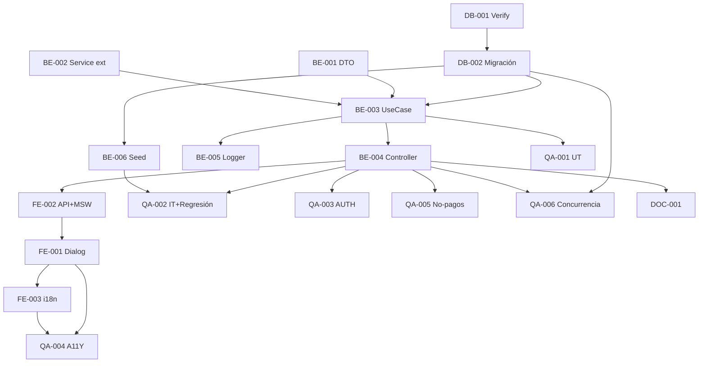

# Development Tasks — PB-P1-036 / US-060: Crear BookingIntent (aceptación atómica)

## 1. Metadata

| Field | Value |
|---|---|
| User Story ID | US-060 |
| Source User Story | `management/user-stories/US-060-create-booking-intent.md` |
| Source Technical Specification | `management/technical-specs/P1/PB-P1-036/US-060-technical-spec.md` |
| Decision Resolution Artifact | `management/user-stories/decision-resolutions/US-060-decision-resolution.md` |
| Priority | P1 |
| Backlog ID | PB-P1-036 |
| Backlog Title | BookingIntent: crear, confirmar, cancelar |
| Backlog Execution Order | 60 |
| User Story Position in Backlog Item | 1 de 3 |
| Related User Stories in Backlog Item | US-060, US-061, US-062 |
| Epic | EPIC-CMP-001 |
| Backlog Item Dependencies | PB-P1-031, PB-P1-035, US-054/056/058, PB-P0-001 |
| Feature | Endpoint atómico Quote→accepted + BookingIntent→pending + 2 notifs |
| Module / Domain | Booking |
| Backlog Alignment Status | Found |
| Task Breakdown Status | Ready for Sprint Planning |
| Created Date | 2026-06-28 |
| Last Updated | 2026-06-28 |

---

## 2. Source Validation

| Source | Found | Used | Notes |
|---|---|---|---|
| User Story | Yes | Yes | Approved with Minor Notes. |
| Technical Specification | Yes | Yes | Ready for Task Breakdown. |
| Decision Resolution Artifact | Yes | Yes | 8/8 decisiones. |
| Product Backlog Prioritized | Yes | Yes | PB-P1-036. |

---

## 3. Backlog Execution Context

US-060 abre PB-P1-036. Execution order 60. US-061 y US-062 cerrarán el ciclo.

---

## 4. Task Breakdown Summary

| Area | Count | Notes |
|---|---:|---|
| DB | 2 | Verify + migración UNIQUE parcial + columnas audit |
| BE | 6 | DTO `.strict()`, service type ext, UseCase, controller, logger, ruta |
| FE | 3 | Dialog accesible, API + MSW, i18n |
| QA | 6 | UT, IT (con regresión), AUTH, A11Y, Security (no pagos), Concurrencia (UNIQUE) |
| DOC | 1 | `docs/16 §M07` + `docs/14` |
| **Total** | 18 | |

---

## 5. Traceability Matrix

| AC | Task IDs |
|---|---|
| AC-01 creación atómica | TASK-PB-P1-036-US-060-BE-003, QA-002 |
| AC-02 disclaimer | TASK-PB-P1-036-US-060-BE-001/003, QA-002 |
| AC-03 no pagos | TASK-PB-P1-036-US-060-BE-001, QA-005 |
| EC-01..05 | TASK-PB-P1-036-US-060-BE-001/003, QA-002 |
| AUTH-TS-01..05 | TASK-PB-P1-036-US-060-QA-003 |
| UNIQUE constraint | TASK-PB-P1-036-US-060-DB-002, QA-006 |
| A11Y | TASK-PB-P1-036-US-060-FE-001, QA-004 |
| i18n | TASK-PB-P1-036-US-060-FE-003 |
| Regresión service | TASK-PB-P1-036-US-060-BE-002, QA-002 |

---

## 6. Development Tasks

### TASK-PB-P1-036-US-060-DB-001 — Verificar schema BookingIntent + Quote audit

| Field | Value |
|---|---|
| Area | Database / Prisma |
| Type | Review |
| Priority | Must |
| Estimate | XS |
| Depends On | PB-P0-001 |
| Source AC(s) | AC-01 |
| Technical Spec Section(s) | §10 |
| Backlog ID | PB-P1-036 |
| User Story ID | US-060 |
| Owner Role | Backend |
| Status | To Do |

#### Objective
Confirmar `quotes.accepted_at` y `booking_intents.created_by`.

#### Definition of Done
- [ ] Pass o issues identificados.

---

### TASK-PB-P1-036-US-060-DB-002 — Migración: UNIQUE parcial + audit columns

| Field | Value |
|---|---|
| Area | Database / Prisma |
| Type | Implementation |
| Priority | Must |
| Estimate | S |
| Depends On | DB-001 |
| Source AC(s) | UNIQUE constraint |
| Technical Spec Section(s) | §10 |
| Backlog ID | PB-P1-036 |
| User Story ID | US-060 |
| Owner Role | Backend |
| Status | To Do |

#### Objective
Añadir columnas si faltan + UNIQUE parcial `(quote_id) WHERE status IN ('pending','confirmed_intent')`.

#### Definition of Done
- [ ] Migración aplica sin errores.
- [ ] UNIQUE parcial enforced.

---

### TASK-PB-P1-036-US-060-BE-001 — DTO Zod `.strict()` `createBookingIntentBody`

| Field | Value |
|---|---|
| Area | Backend |
| Type | Implementation |
| Priority | Must |
| Estimate | S |
| Depends On | - |
| Source AC(s) | AC-02, AC-03, EC-05, VR-01..VR-03 |
| Technical Spec Section(s) | §7 DTOs |
| Backlog ID | PB-P1-036 |
| User Story ID | US-060 |
| Owner Role | Backend |
| Status | To Do |

#### Objective
`z.object({ quote_id: uuid, disclaimer_accepted: literal(true) }).strict()`.

#### Definition of Done
- [ ] DTO + UT cubriendo rechazo de campos de pago.

---

### TASK-PB-P1-036-US-060-BE-002 — Extender type `QuoteEventNotificationService`

| Field | Value |
|---|---|
| Area | Backend |
| Type | Refactor |
| Priority | Must |
| Estimate | XS |
| Depends On | US-058 BE-002 |
| Source AC(s) | AC-01 |
| Technical Spec Section(s) | §7 Service |
| Backlog ID | PB-P1-036 |
| User Story ID | US-060 |
| Owner Role | Backend |
| Status | To Do |

#### Objective
Añadir `'booking_intent.created'` al type. Sin breaking changes.

#### Definition of Done
- [ ] Type extendido a 6 eventos.
- [ ] UT cubre todos los eventos.

---

### TASK-PB-P1-036-US-060-BE-003 — `CreateBookingIntentUseCase` transaccional

| Field | Value |
|---|---|
| Area | Backend |
| Type | Implementation |
| Priority | Must |
| Estimate | L |
| Depends On | BE-001, BE-002, DB-002 |
| Source AC(s) | AC-01..AC-03, EC-01..EC-05 |
| Technical Spec Section(s) | §7 UseCase |
| Backlog ID | PB-P1-036 |
| User Story ID | US-060 |
| Owner Role | Backend |
| Status | To Do |

#### Objective
Use case con `prisma.$transaction` + SELECT FOR UPDATE + validaciones + UPDATE Quote + INSERT BookingIntent + notif via service común.

#### Definition of Done
- [ ] Coverage ≥ 90%.
- [ ] Rollback verificado.

---

### TASK-PB-P1-036-US-060-BE-004 — Controller + ruta

| Field | Value |
|---|---|
| Area | Backend / API |
| Type | Implementation |
| Priority | Must |
| Estimate | S |
| Depends On | BE-003 |
| Source AC(s) | AC-01 |
| Technical Spec Section(s) | §7 Controllers |
| Backlog ID | PB-P1-036 |
| User Story ID | US-060 |
| Owner Role | Backend |
| Status | To Do |

#### Definition of Done
- [ ] Ruta operativa con guards.

---

### TASK-PB-P1-036-US-060-BE-005 — Logger `booking_intent.created`

| Field | Value |
|---|---|
| Area | Backend / Observability |
| Type | Implementation |
| Priority | Must |
| Estimate | XS |
| Depends On | BE-003 |
| Source AC(s) | AC-01 |
| Technical Spec Section(s) | §14 |
| Backlog ID | PB-P1-036 |
| User Story ID | US-060 |
| Owner Role | Backend |
| Status | To Do |

#### Definition of Done
- [ ] Evento emitido.

---

### TASK-PB-P1-036-US-060-BE-006 — Seed demo

| Field | Value |
|---|---|
| Area | Backend / Seed |
| Type | Implementation |
| Priority | Should |
| Estimate | XS |
| Depends On | DB-002 |
| Source AC(s) | AC-01, EC-03 |
| Technical Spec Section(s) | §15 |
| Backlog ID | PB-P1-036 |
| User Story ID | US-060 |
| Owner Role | Backend |
| Status | To Do |

#### Objective
Quote `responded` propia del organizer + opcional BookingIntent `confirmed_intent` para demo de US-061/062.

#### Definition of Done
- [ ] Seed reproducible.

---

### TASK-PB-P1-036-US-060-FE-001 — `CreateBookingDialog` accesible con disclaimer

| Field | Value |
|---|---|
| Area | Frontend |
| Type | Implementation |
| Priority | Must |
| Estimate | M |
| Depends On | FE-002 |
| Source AC(s) | AC-01, AC-02, A11Y |
| Technical Spec Section(s) | §8 |
| Backlog ID | PB-P1-036 |
| User Story ID | US-060 |
| Owner Role | Frontend |
| Status | To Do |

#### Objective
Modal `role="dialog"` con focus trap, ESC, checkbox disclaimer con `aria-describedby`, CTA deshabilitada hasta marcado.

#### Definition of Done
- [ ] axe sin issues serios.

---

### TASK-PB-P1-036-US-060-FE-002 — `organizerApi.bookings.create` + MSW

| Field | Value |
|---|---|
| Area | Frontend |
| Type | Implementation |
| Priority | Must |
| Estimate | S |
| Depends On | BE-004 |
| Source AC(s) | AC-01 |
| Technical Spec Section(s) | §8 |
| Backlog ID | PB-P1-036 |
| User Story ID | US-060 |
| Owner Role | Frontend |
| Status | To Do |

#### Definition of Done
- [ ] MSW handlers `201/400/401/403/404/409`.

---

### TASK-PB-P1-036-US-060-FE-003 — i18n `organizer.booking.create.*` (4 locales) con disclaimer

| Field | Value |
|---|---|
| Area | Frontend / i18n |
| Type | Implementation |
| Priority | Must |
| Estimate | S |
| Depends On | FE-001 |
| Source AC(s) | i18n |
| Technical Spec Section(s) | §8 |
| Backlog ID | PB-P1-036 |
| User Story ID | US-060 |
| Owner Role | Frontend |
| Status | To Do |

#### Definition of Done
- [ ] 4 locales completos.
- [ ] Disclaimer copy revisado.

---

### TASK-PB-P1-036-US-060-QA-001 — Unit tests (DTO + UseCase branches)

| Field | Value |
|---|---|
| Area | QA |
| Type | Test |
| Priority | Must |
| Estimate | M |
| Depends On | BE-003 |
| Source AC(s) | Múltiples |
| Technical Spec Section(s) | §13 |
| Backlog ID | PB-P1-036 |
| User Story ID | US-060 |
| Owner Role | QA / Backend |
| Status | To Do |

#### Definition of Done
- [ ] Coverage ≥ 90%.

---

### TASK-PB-P1-036-US-060-QA-002 — Integration (atómica + regresión service)

| Field | Value |
|---|---|
| Area | QA |
| Type | Test |
| Priority | Must |
| Estimate | L |
| Depends On | BE-004, BE-006 |
| Source AC(s) | AC-01..AC-03, EC-01..EC-05 |
| Technical Spec Section(s) | §13 |
| Backlog ID | PB-P1-036 |
| User Story ID | US-060 |
| Owner Role | QA |
| Status | To Do |

#### Objective
TS-01..TS-05 + regresión US-053/054/056/058.

#### Definition of Done
- [ ] Regresión verde.
- [ ] Rollback transaccional verificado.

---

### TASK-PB-P1-036-US-060-QA-003 — Authorization tests

| Field | Value |
|---|---|
| Area | QA / Security |
| Type | Test |
| Priority | Must |
| Estimate | S |
| Depends On | BE-004 |
| Source AC(s) | AUTH-TS-01..05 |
| Technical Spec Section(s) | §12 |
| Backlog ID | PB-P1-036 |
| User Story ID | US-060 |
| Owner Role | QA |
| Status | To Do |

#### Definition of Done
- [ ] `404 QUOTE_NOT_FOUND` uniforme.

---

### TASK-PB-P1-036-US-060-QA-004 — Accessibility (`CreateBookingDialog` + disclaimer)

| Field | Value |
|---|---|
| Area | QA / A11Y |
| Type | Test |
| Priority | Must |
| Estimate | S |
| Depends On | FE-001, FE-003 |
| Source AC(s) | A11Y |
| Technical Spec Section(s) | §13 |
| Backlog ID | PB-P1-036 |
| User Story ID | US-060 |
| Owner Role | QA / Frontend |
| Status | To Do |

#### Definition of Done
- [ ] axe sin issues serios.

---

### TASK-PB-P1-036-US-060-QA-005 — Security: no-pagos (FR-BOOKING-007)

| Field | Value |
|---|---|
| Area | QA / Security |
| Type | Test |
| Priority | Must |
| Estimate | S |
| Depends On | BE-004 |
| Source AC(s) | AC-03 |
| Technical Spec Section(s) | §13 |
| Backlog ID | PB-P1-036 |
| User Story ID | US-060 |
| Owner Role | QA / Security |
| Status | To Do |

#### Objective
Enviar body con `payment_method`, `card_token`, `card_number`, `amount_paid`, `payment_intent_id` ⇒ `400 INVALID_BODY` por DTO `.strict()`.

#### Definition of Done
- [ ] Test verde para cada campo de pago.

---

### TASK-PB-P1-036-US-060-QA-006 — Concurrencia (UNIQUE parcial)

| Field | Value |
|---|---|
| Area | QA / Security |
| Type | Test |
| Priority | Must |
| Estimate | S |
| Depends On | DB-002, BE-004 |
| Source AC(s) | UNIQUE constraint |
| Technical Spec Section(s) | §17 |
| Backlog ID | PB-P1-036 |
| User Story ID | US-060 |
| Owner Role | QA |
| Status | To Do |

#### Objective
2 POST simultáneos sobre la misma Quote: uno gana (`201`), otro falla con `409 BOOKING_INTENT_ALREADY_EXISTS`.

#### Definition of Done
- [ ] UNIQUE parcial enforced.

---

### TASK-PB-P1-036-US-060-DOC-001 — Documentar endpoint en `docs/16 §M07` + `docs/14`

| Field | Value |
|---|---|
| Area | Documentation |
| Type | Documentation |
| Priority | Must |
| Estimate | S |
| Depends On | BE-004 |
| Source AC(s) | AC-01 |
| Technical Spec Section(s) | §16 |
| Backlog ID | PB-P1-036 |
| User Story ID | US-060 |
| Owner Role | Backend / Doc |
| Status | To Do |

#### Definition of Done
- [ ] Endpoint + module documentado.

---

## 7. Required QA Tasks
Ver §6.

## 8. Required Security Tasks
| Task ID | Concern |
|---|---|
| TASK-PB-P1-036-US-060-QA-003 | `404 QUOTE_NOT_FOUND` uniforme |
| TASK-PB-P1-036-US-060-QA-005 | FR-BOOKING-007 sin pagos |
| TASK-PB-P1-036-US-060-QA-006 | UNIQUE parcial race |

## 9. Required Seed / Demo Tasks
| Task ID | Concern |
|---|---|
| TASK-PB-P1-036-US-060-BE-006 | Demo seed Quote responded + opcional BookingIntent confirmed_intent |

## 10. Observability / Audit Tasks
| Task ID | Concern |
|---|---|
| TASK-PB-P1-036-US-060-BE-005 | Log `booking_intent.created` |

## 11. Documentation / Traceability Tasks
| Task ID | Doc |
|---|---|
| TASK-PB-P1-036-US-060-DOC-001 | `docs/16 §M07` + `docs/14` |

## 12. Dependency Graph

---

## 13. Suggested Implementation Order

**Phase 1 — Foundation**: DB-001, DB-002, BE-001 DTO, BE-002 Service ext.
**Phase 2 — Core**: BE-003 UseCase, BE-004 Controller, BE-005 Logger, BE-006 Seed, FE-002 API+MSW, FE-001 Dialog, FE-003 i18n.
**Phase 3 — QA**: QA-001 UT, QA-002 IT + Regresión, QA-003 AUTH, QA-005 No-pagos, QA-006 Concurrencia, QA-004 A11Y.
**Phase 4 — Doc**: DOC-001.

---

## 14. Risks & Mitigations
Ver §17 del Technical Spec.

## 15. Out of Scope Confirmation
Pagos, confirmación vendor (US-061), cancelación (US-062), contratos.

## 16. Readiness for Sprint Planning

| Check | Status |
|---|---|
| Product Backlog mapping found | Pass |
| Every AC maps to tasks | Pass |
| Technical Spec used when available | Pass |
| QA tasks included | Pass |
| Security tasks included | Pass |
| Seed/demo tasks included | Pass |
| Observability tasks included | Pass |
| Documentation tasks included | Pass |
| Task dependencies clear | Pass |
| Tasks small enough | Pass |
| Ready for Sprint Planning | Yes |

---

## 17. Final Recommendation

`Ready for Sprint Planning`.

US-060 abre PB-P1-036 con 18 tareas: endpoint atómico de aceptación + creación de BookingIntent + extensión del service común a 6 eventos + UNIQUE parcial + DTO `.strict()` enforcing FR-BOOKING-007. QA-002 verifica regresión integral US-053/054/056/058; QA-005 valida explícitamente la prohibición de campos de pago; QA-006 valida UNIQUE parcial bajo concurrencia.
