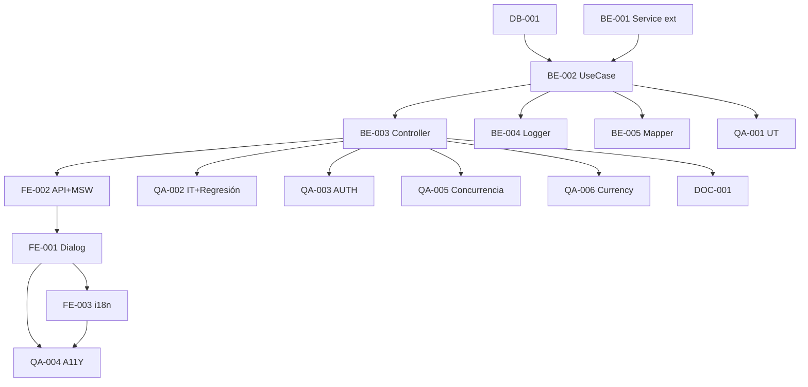

# Development Tasks — PB-P1-036 / US-061: Confirmar BookingIntent + UPDATE committed

## 1. Metadata

| Field | Value |
|---|---|
| User Story ID | US-061 |
| Source User Story | `management/user-stories/US-061-vendor-confirm-booking-intent.md` |
| Source Technical Specification | `management/technical-specs/P1/PB-P1-036/US-061-technical-spec.md` |
| Decision Resolution Artifact | `management/user-stories/decision-resolutions/US-061-decision-resolution.md` |
| Priority | P1 |
| Backlog ID | PB-P1-036 |
| Backlog Title | BookingIntent: crear, confirmar, cancelar |
| Backlog Execution Order | 61 |
| User Story Position in Backlog Item | 2 de 3 |
| Related User Stories in Backlog Item | US-060, US-061, US-062 |
| Epic | EPIC-CMP-001 |
| Backlog Item Dependencies | US-060, US-035..038 |
| Feature | Endpoint vendor confirm + cross-domain UPDATE committed |
| Module / Domain | Booking / Budget |
| Backlog Alignment Status | Found |
| Task Breakdown Status | Ready for Sprint Planning |
| Created Date | 2026-06-28 |
| Last Updated | 2026-06-28 |

---

## 2. Source Validation

| Source | Found | Used | Notes |
|---|---|---|---|
| User Story | Yes | Yes | Approved with Minor Notes. |
| Technical Specification | Yes | Yes | Ready for Task Breakdown. |
| Decision Resolution Artifact | Yes | Yes | 8/8 decisiones. |
| Product Backlog Prioritized | Yes | Yes | PB-P1-036. |

---

## 3. Backlog Execution Context

US-061 es 2 de 3 en PB-P1-036. Execution order 61.

---

## 4. Task Breakdown Summary

| Area | Count | Notes |
|---|---:|---|
| DB | 1 | Verify + posible UNIQUE en budget_items |
| BE | 5 | Service type ext, UseCase, controller, ruta, logger |
| FE | 3 | Dialog accesible, API + MSW, i18n |
| QA | 6 | UT, IT (con regresión + cross-domain), AUTH, A11Y, Concurrencia, Currency mismatch |
| DOC | 1 | `docs/16 §M07` + `docs/14` |
| **Total** | 16 | |

---

## 5. Traceability Matrix

| AC | Task IDs |
|---|---|
| AC-01 confirm + UPDATE | TASK-PB-P1-036-US-061-BE-002, QA-002 |
| AC-02 auto-create BudgetItem | TASK-PB-P1-036-US-061-BE-002, QA-002 |
| AC-03 idempotencia | TASK-PB-P1-036-US-061-BE-002, QA-002 |
| EC-01..04 | TASK-PB-P1-036-US-061-BE-002, QA-002 |
| AUTH-TS-01..05 | TASK-PB-P1-036-US-061-QA-003 |
| Concurrencia | TASK-PB-P1-036-US-061-QA-005 |
| Currency mismatch | TASK-PB-P1-036-US-061-QA-006 |
| A11Y | TASK-PB-P1-036-US-061-FE-001, QA-004 |
| Regresión service | TASK-PB-P1-036-US-061-BE-001, QA-002 |

---

## 6. Development Tasks

### TASK-PB-P1-036-US-061-DB-001 — Verificar índice + UNIQUE en `budget_items`

| Field | Value |
|---|---|
| Area | Database / Prisma |
| Type | Review |
| Priority | Must |
| Estimate | XS |
| Depends On | PB-P0-001 |
| Source AC(s) | AC-01, AC-02 |
| Technical Spec Section(s) | §10 |
| Backlog ID | PB-P1-036 |
| User Story ID | US-061 |
| Owner Role | Backend |
| Status | To Do |

#### Objective
Verificar índice `(budget_id, service_category_id)`. Considerar UNIQUE para evitar duplicados.

#### Definition of Done
- [ ] Pass o migración menor abierta.

---

### TASK-PB-P1-036-US-061-BE-001 — Extender `QuoteEventNotificationService` con `booking_intent.confirmed`

| Field | Value |
|---|---|
| Area | Backend |
| Type | Refactor |
| Priority | Must |
| Estimate | XS |
| Depends On | US-060 BE-002 |
| Source AC(s) | AC-01 |
| Technical Spec Section(s) | §7 Service |
| Backlog ID | PB-P1-036 |
| User Story ID | US-061 |
| Owner Role | Backend |
| Status | To Do |

#### Definition of Done
- [ ] Type extendido a 7 eventos.
- [ ] UT cubre todos los eventos.

---

### TASK-PB-P1-036-US-061-BE-002 — `ConfirmBookingIntentUseCase` con transacción 3-step

| Field | Value |
|---|---|
| Area | Backend |
| Type | Implementation |
| Priority | Must |
| Estimate | L |
| Depends On | BE-001, DB-001 |
| Source AC(s) | AC-01..AC-03, EC-01..EC-04 |
| Technical Spec Section(s) | §7 UseCase |
| Backlog ID | PB-P1-036 |
| User Story ID | US-061 |
| Owner Role | Backend |
| Status | To Do |

#### Objective
Use case con `prisma.$transaction`: validaciones + UPDATE intent + UPDATE/INSERT BudgetItem + 2 notifs organizer + logs.

#### Definition of Done
- [ ] Coverage ≥ 90%.
- [ ] Branches: existing BudgetItem, auto-create, idempotencia, cancelled, currency mismatch.

---

### TASK-PB-P1-036-US-061-BE-003 — Controller + ruta `POST /vendor/booking-intents/:id/confirm`

| Field | Value |
|---|---|
| Area | Backend / API |
| Type | Implementation |
| Priority | Must |
| Estimate | S |
| Depends On | BE-002 |
| Source AC(s) | AC-01 |
| Technical Spec Section(s) | §7 Controllers |
| Backlog ID | PB-P1-036 |
| User Story ID | US-061 |
| Owner Role | Backend |
| Status | To Do |

#### Definition of Done
- [ ] Ruta operativa con guards.

---

### TASK-PB-P1-036-US-061-BE-004 — Logger eventos (3)

| Field | Value |
|---|---|
| Area | Backend / Observability |
| Type | Implementation |
| Priority | Must |
| Estimate | XS |
| Depends On | BE-002 |
| Source AC(s) | AC-01..AC-03 |
| Technical Spec Section(s) | §14 |
| Backlog ID | PB-P1-036 |
| User Story ID | US-061 |
| Owner Role | Backend |
| Status | To Do |

#### Objective
`booking_intent.confirmed`, `budget_item.auto_created_on_booking_confirm`, `budget.committed_exceeds_planned`, `booking.confirm.currency_mismatch`.

#### Definition of Done
- [ ] Eventos emitidos.

---

### TASK-PB-P1-036-US-061-BE-005 — Mapper de response

| Field | Value |
|---|---|
| Area | Backend |
| Type | Implementation |
| Priority | Must |
| Estimate | XS |
| Depends On | BE-002 |
| Source AC(s) | AC-01 |
| Technical Spec Section(s) | §7 |
| Backlog ID | PB-P1-036 |
| User Story ID | US-061 |
| Owner Role | Backend |
| Status | To Do |

#### Definition of Done
- [ ] Mapper limpia campos internos.

---

### TASK-PB-P1-036-US-061-FE-001 — `ConfirmBookingDialog` accesible con disclaimer

| Field | Value |
|---|---|
| Area | Frontend |
| Type | Implementation |
| Priority | Must |
| Estimate | M |
| Depends On | FE-002 |
| Source AC(s) | AC-01, A11Y |
| Technical Spec Section(s) | §8 |
| Backlog ID | PB-P1-036 |
| User Story ID | US-061 |
| Owner Role | Frontend |
| Status | To Do |

#### Objective
Modal `role="dialog"` con focus trap, ESC, texto disclaimer FR-BOOKING-006 con `aria-describedby`. CTA "Confirmar".

#### Definition of Done
- [ ] axe sin issues serios.

---

### TASK-PB-P1-036-US-061-FE-002 — `vendorApi.bookings.confirm` + MSW

| Field | Value |
|---|---|
| Area | Frontend |
| Type | Implementation |
| Priority | Must |
| Estimate | S |
| Depends On | BE-003 |
| Source AC(s) | AC-01 |
| Technical Spec Section(s) | §8 |
| Backlog ID | PB-P1-036 |
| User Story ID | US-061 |
| Owner Role | Frontend |
| Status | To Do |

#### Definition of Done
- [ ] MSW handlers `200/400/401/403/404/409`.

---

### TASK-PB-P1-036-US-061-FE-003 — i18n `vendor.booking.confirm.*` (4 locales)

| Field | Value |
|---|---|
| Area | Frontend / i18n |
| Type | Implementation |
| Priority | Must |
| Estimate | S |
| Depends On | FE-001 |
| Source AC(s) | i18n |
| Technical Spec Section(s) | §8 |
| Backlog ID | PB-P1-036 |
| User Story ID | US-061 |
| Owner Role | Frontend |
| Status | To Do |

#### Definition of Done
- [ ] 4 locales completos con disclaimer.

---

### TASK-PB-P1-036-US-061-QA-001 — Unit tests (UseCase branches)

| Field | Value |
|---|---|
| Area | QA |
| Type | Test |
| Priority | Must |
| Estimate | M |
| Depends On | BE-002 |
| Source AC(s) | AC-01..AC-03, EC-01..EC-04 |
| Technical Spec Section(s) | §13 |
| Backlog ID | PB-P1-036 |
| User Story ID | US-061 |
| Owner Role | QA / Backend |
| Status | To Do |

#### Definition of Done
- [ ] Coverage ≥ 90%.

---

### TASK-PB-P1-036-US-061-QA-002 — Integration (cross-domain + regresión)

| Field | Value |
|---|---|
| Area | QA |
| Type | Test |
| Priority | Must |
| Estimate | L |
| Depends On | BE-003 |
| Source AC(s) | AC-01..AC-03, EC-01..EC-04 |
| Technical Spec Section(s) | §13 |
| Backlog ID | PB-P1-036 |
| User Story ID | US-061 |
| Owner Role | QA |
| Status | To Do |

#### Objective
TS-01..TS-05. Verificar UPDATE/INSERT BudgetItem correcto + 2 notifs organizer + regresión US-053..060.

#### Definition of Done
- [ ] Auto-create BudgetItem verificado.
- [ ] Regresión verde.

---

### TASK-PB-P1-036-US-061-QA-003 — Authorization tests

| Field | Value |
|---|---|
| Area | QA / Security |
| Type | Test |
| Priority | Must |
| Estimate | S |
| Depends On | BE-003 |
| Source AC(s) | AUTH-TS-01..05 |
| Technical Spec Section(s) | §12 |
| Backlog ID | PB-P1-036 |
| User Story ID | US-061 |
| Owner Role | QA |
| Status | To Do |

#### Definition of Done
- [ ] `404 BOOKING_INTENT_NOT_FOUND` uniforme.

---

### TASK-PB-P1-036-US-061-QA-004 — Accessibility (`ConfirmBookingDialog`)

| Field | Value |
|---|---|
| Area | QA / A11Y |
| Type | Test |
| Priority | Must |
| Estimate | S |
| Depends On | FE-001, FE-003 |
| Source AC(s) | A11Y |
| Technical Spec Section(s) | §13 |
| Backlog ID | PB-P1-036 |
| User Story ID | US-061 |
| Owner Role | QA / Frontend |
| Status | To Do |

#### Definition of Done
- [ ] axe sin issues serios.

---

### TASK-PB-P1-036-US-061-QA-005 — Concurrencia (2 confirms simultáneos)

| Field | Value |
|---|---|
| Area | QA |
| Type | Test |
| Priority | Must |
| Estimate | S |
| Depends On | BE-003 |
| Source AC(s) | AC-03 |
| Technical Spec Section(s) | §17 |
| Backlog ID | PB-P1-036 |
| User Story ID | US-061 |
| Owner Role | QA |
| Status | To Do |

#### Objective
2 POST simultáneos: uno actualiza committed, otro idempotente. Sin doble suma.

#### Definition of Done
- [ ] Committed actualizado exactamente una vez.

---

### TASK-PB-P1-036-US-061-QA-006 — Currency mismatch warn

| Field | Value |
|---|---|
| Area | QA |
| Type | Test |
| Priority | Should |
| Estimate | XS |
| Depends On | BE-003 |
| Source AC(s) | EC-04 |
| Technical Spec Section(s) | §13 |
| Backlog ID | PB-P1-036 |
| User Story ID | US-061 |
| Owner Role | QA |
| Status | To Do |

#### Objective
Forzar Quote con currency distinta a Event (data setup): UPDATE se aplica + log warn emitido.

#### Definition of Done
- [ ] Log warn verificado.

---

### TASK-PB-P1-036-US-061-DOC-001 — Documentar endpoint en `docs/16 §M07` + cross-module `docs/14`

| Field | Value |
|---|---|
| Area | Documentation |
| Type | Documentation |
| Priority | Must |
| Estimate | S |
| Depends On | BE-003 |
| Source AC(s) | AC-01 |
| Technical Spec Section(s) | §16 |
| Backlog ID | PB-P1-036 |
| User Story ID | US-061 |
| Owner Role | Backend / Doc |
| Status | To Do |

#### Definition of Done
- [ ] Documentado.

---

## 7. Required QA Tasks
Ver §6.

## 8. Required Security Tasks
| Task ID | Concern |
|---|---|
| TASK-PB-P1-036-US-061-QA-003 | `404 BOOKING_INTENT_NOT_FOUND` uniforme |
| TASK-PB-P1-036-US-061-QA-005 | Race condition committed |

## 9. Required Seed / Demo Tasks
`No aplica` (reuso US-060 seed).

## 10. Observability / Audit Tasks
| Task ID | Concern |
|---|---|
| TASK-PB-P1-036-US-061-BE-004 | Logs cross-domain (4 eventos) |

## 11. Documentation / Traceability Tasks
| Task ID | Doc |
|---|---|
| TASK-PB-P1-036-US-061-DOC-001 | `docs/16 §M07` + `docs/14` |

## 12. Dependency Graph

---

## 13. Suggested Implementation Order

**Phase 1 — Foundation**: DB-001, BE-001 service ext.
**Phase 2 — Core**: BE-002 UseCase, BE-003 Controller, BE-004 Logger, BE-005 Mapper, FE-002 API+MSW, FE-001 Dialog, FE-003 i18n.
**Phase 3 — QA**: QA-001 UT, QA-002 IT+Regresión, QA-003 AUTH, QA-005 Concurrencia, QA-006 Currency, QA-004 A11Y.
**Phase 4 — Doc**: DOC-001.

---

## 14. Risks & Mitigations
Ver §17 del Technical Spec.

## 15. Out of Scope Confirmation
Pagos, cancelación (US-062), edición committed por vendor.

## 16. Readiness for Sprint Planning

| Check | Status |
|---|---|
| Product Backlog mapping found | Pass |
| Every AC maps to tasks | Pass |
| Technical Spec used when available | Pass |
| QA tasks included | Pass |
| Security tasks included | Pass |
| Cross-module impact tested | Pass |
| Observability tasks included | Pass |
| Documentation tasks included | Pass |
| Task dependencies clear | Pass |
| Ready for Sprint Planning | Yes |

---

## 17. Final Recommendation

`Ready for Sprint Planning`.

US-061 entrega 16 tareas: endpoint vendor confirm con efecto cross-domain (Booking → Budget) + extensión del service común a 7 eventos. QA-002 verifica regresión integral US-053..060 y el auto-create de BudgetItem. US-062 cerrará PB-P1-036.
