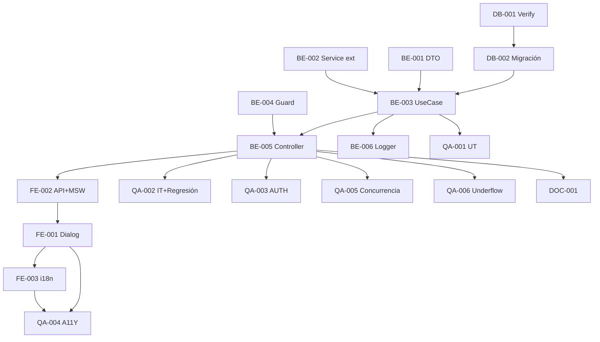

# Development Tasks — PB-P1-036 / US-062: Cancelar BookingIntent (bilateral + revert)

## 1. Metadata

| Field | Value |
|---|---|
| User Story ID | US-062 |
| Source User Story | `management/user-stories/US-062-cancel-booking-intent.md` |
| Source Technical Specification | `management/technical-specs/P1/PB-P1-036/US-062-technical-spec.md` |
| Decision Resolution Artifact | `management/user-stories/decision-resolutions/US-062-decision-resolution.md` |
| Priority | P1 |
| Backlog ID | PB-P1-036 |
| Backlog Title | BookingIntent: crear, confirmar, cancelar |
| Backlog Execution Order | 62 |
| User Story Position in Backlog Item | 3 de 3 |
| Related User Stories in Backlog Item | US-060, US-061, US-062 |
| Epic | EPIC-CMP-001 |
| Backlog Item Dependencies | US-060, US-061 |
| Feature | Endpoint bilateral cancel + revert committed condicional |
| Module / Domain | Booking / Budget |
| Backlog Alignment Status | Found |
| Task Breakdown Status | Ready for Sprint Planning |
| Created Date | 2026-06-28 |
| Last Updated | 2026-06-28 |

---

## 2. Source Validation

| Source | Found | Used | Notes |
|---|---|---|---|
| User Story | Yes | Yes | Approved with Minor Notes. |
| Technical Specification | Yes | Yes | Ready for Task Breakdown. |
| Decision Resolution Artifact | Yes | Yes | 8/8 decisiones. |
| Product Backlog Prioritized | Yes | Yes | PB-P1-036. |

---

## 3. Backlog Execution Context

US-062 cierra PB-P1-036 + EPIC-CMP-001. Execution order 62.

---

## 4. Task Breakdown Summary

| Area | Count | Notes |
|---|---:|---|
| DB | 2 | Verify + migración audit columns |
| BE | 6 | DTO, service ext, UseCase, controller, ruta, BilateralGuard, logger |
| FE | 3 | Dialog accesible compartido, API + MSW, i18n |
| QA | 6 | UT, IT (con regresión + bilateral), AUTH bilateral, A11Y, Concurrencia, Underflow |
| DOC | 1 | `docs/16 §M07` + `docs/14` |
| **Total** | 18 | |

---

## 5. Traceability Matrix

| AC | Task IDs |
|---|---|
| AC-01 confirmed + revert | TASK-PB-P1-036-US-062-BE-003, QA-002 |
| AC-02 pending sin revert | TASK-PB-P1-036-US-062-BE-003, QA-002 |
| AC-03 sin reason | TASK-PB-P1-036-US-062-BE-001/003, QA-002 |
| EC-01..06 | TASK-PB-P1-036-US-062-BE-003, QA-002, QA-006 |
| AUTH-TS-01..06 | TASK-PB-P1-036-US-062-BE-005, QA-003 |
| A11Y | TASK-PB-P1-036-US-062-FE-001, QA-004 |
| Concurrencia | TASK-PB-P1-036-US-062-QA-005 |
| Underflow | TASK-PB-P1-036-US-062-QA-006 |
| Regresión service | TASK-PB-P1-036-US-062-BE-002, QA-002 |

---

## 6. Development Tasks

### TASK-PB-P1-036-US-062-DB-001 — Verificar audit columns `booking_intents`

| Field | Value |
|---|---|
| Area | Database / Prisma |
| Type | Review |
| Priority | Must |
| Estimate | XS |
| Depends On | PB-P0-001 |
| Source AC(s) | AC-01..AC-03 |
| Technical Spec Section(s) | §10 |
| Backlog ID | PB-P1-036 |
| User Story ID | US-062 |
| Owner Role | Backend |
| Status | To Do |

#### Objective
Verificar `cancelled_at`, `cancelled_by`, `cancellation_reason`.

#### Definition of Done
- [ ] Pass o issues identificados.

---

### TASK-PB-P1-036-US-062-DB-002 — Migración audit columns (si faltan)

| Field | Value |
|---|---|
| Area | Database / Prisma |
| Type | Implementation |
| Priority | Must |
| Estimate | S |
| Depends On | DB-001 |
| Source AC(s) | AC-01 |
| Technical Spec Section(s) | §10 |
| Backlog ID | PB-P1-036 |
| User Story ID | US-062 |
| Owner Role | Backend |
| Status | To Do |

#### Objective
Añadir columnas + FK opcional `cancelled_by → users.id`.

#### Definition of Done
- [ ] Migración aplica sin errores.

---

### TASK-PB-P1-036-US-062-BE-001 — DTO `cancelBookingIntentBody`

| Field | Value |
|---|---|
| Area | Backend |
| Type | Implementation |
| Priority | Must |
| Estimate | XS |
| Depends On | - |
| Source AC(s) | EC-05 |
| Technical Spec Section(s) | §7 DTOs |
| Backlog ID | PB-P1-036 |
| User Story ID | US-062 |
| Owner Role | Backend |
| Status | To Do |

#### Definition of Done
- [ ] DTO + UT.

---

### TASK-PB-P1-036-US-062-BE-002 — Extender `QuoteEventNotificationService` con `booking_intent.cancelled`

| Field | Value |
|---|---|
| Area | Backend |
| Type | Refactor |
| Priority | Must |
| Estimate | XS |
| Depends On | US-061 BE-001 |
| Source AC(s) | AC-01..AC-02 |
| Technical Spec Section(s) | §7 Service |
| Backlog ID | PB-P1-036 |
| User Story ID | US-062 |
| Owner Role | Backend |
| Status | To Do |

#### Definition of Done
- [ ] Type extendido a 8 eventos.
- [ ] UT cubre todos los eventos.

---

### TASK-PB-P1-036-US-062-BE-003 — `CancelBookingIntentUseCase` con revert condicional

| Field | Value |
|---|---|
| Area | Backend |
| Type | Implementation |
| Priority | Must |
| Estimate | L |
| Depends On | BE-001, BE-002, DB-002 |
| Source AC(s) | AC-01..AC-03, EC-01..EC-06 |
| Technical Spec Section(s) | §7 UseCase |
| Backlog ID | PB-P1-036 |
| User Story ID | US-062 |
| Owner Role | Backend |
| Status | To Do |

#### Objective
UseCase con `prisma.$transaction`: validaciones + UPDATE intent + UPDATE BudgetItem (condicional, `MAX(0, ...)`) + notif contraparte.

#### Definition of Done
- [ ] Coverage ≥ 90%.
- [ ] Branches: organizer/vendor, pending/confirmed_intent, underflow, sin reason.

---

### TASK-PB-P1-036-US-062-BE-004 — `BilateralRoleGuard`

| Field | Value |
|---|---|
| Area | Backend / Security |
| Type | Implementation |
| Priority | Must |
| Estimate | S |
| Depends On | - |
| Source AC(s) | AUTH-TS-01..02, AUTH-TS-05..06 |
| Technical Spec Section(s) | §7 |
| Backlog ID | PB-P1-036 |
| User Story ID | US-062 |
| Owner Role | Backend |
| Status | To Do |

#### Objective
Guard que permite `organizer` y `vendor` (excluye admin).

#### Definition of Done
- [ ] Guard + UT.

---

### TASK-PB-P1-036-US-062-BE-005 — Controller + ruta `POST /booking-intents/:id/cancel`

| Field | Value |
|---|---|
| Area | Backend / API |
| Type | Implementation |
| Priority | Must |
| Estimate | S |
| Depends On | BE-003, BE-004 |
| Source AC(s) | AC-01..AC-03 |
| Technical Spec Section(s) | §7 Controllers |
| Backlog ID | PB-P1-036 |
| User Story ID | US-062 |
| Owner Role | Backend |
| Status | To Do |

#### Definition of Done
- [ ] Ruta operativa.

---

### TASK-PB-P1-036-US-062-BE-006 — Logger eventos (2)

| Field | Value |
|---|---|
| Area | Backend / Observability |
| Type | Implementation |
| Priority | Must |
| Estimate | XS |
| Depends On | BE-003 |
| Source AC(s) | AC-01, EC-06 |
| Technical Spec Section(s) | §14 |
| Backlog ID | PB-P1-036 |
| User Story ID | US-062 |
| Owner Role | Backend |
| Status | To Do |

#### Objective
`booking_intent.cancelled` + `budget.committed_underflow_corrected` warn.

#### Definition of Done
- [ ] Eventos emitidos.

---

### TASK-PB-P1-036-US-062-FE-001 — `CancelBookingDialog` accesible compartido

| Field | Value |
|---|---|
| Area | Frontend |
| Type | Implementation |
| Priority | Must |
| Estimate | M |
| Depends On | FE-002 |
| Source AC(s) | AC-01..AC-03, A11Y |
| Technical Spec Section(s) | §8 |
| Backlog ID | PB-P1-036 |
| User Story ID | US-062 |
| Owner Role | Frontend |
| Status | To Do |

#### Objective
Modal compartido organizer/vendor con textarea opcional, focus trap, ESC.

#### Definition of Done
- [ ] axe sin issues serios.

---

### TASK-PB-P1-036-US-062-FE-002 — `bookingsApi.cancel` + MSW

| Field | Value |
|---|---|
| Area | Frontend |
| Type | Implementation |
| Priority | Must |
| Estimate | S |
| Depends On | BE-005 |
| Source AC(s) | AC-01..AC-03 |
| Technical Spec Section(s) | §8 |
| Backlog ID | PB-P1-036 |
| User Story ID | US-062 |
| Owner Role | Frontend |
| Status | To Do |

#### Definition of Done
- [ ] MSW handlers `200/400/401/403/404/409`.

---

### TASK-PB-P1-036-US-062-FE-003 — i18n `booking.cancel.*` (4 locales)

| Field | Value |
|---|---|
| Area | Frontend / i18n |
| Type | Implementation |
| Priority | Must |
| Estimate | S |
| Depends On | FE-001 |
| Source AC(s) | i18n |
| Technical Spec Section(s) | §8 |
| Backlog ID | PB-P1-036 |
| User Story ID | US-062 |
| Owner Role | Frontend |
| Status | To Do |

#### Definition of Done
- [ ] 4 locales completos.

---

### TASK-PB-P1-036-US-062-QA-001 — Unit tests (DTO + UseCase + Guard)

| Field | Value |
|---|---|
| Area | QA |
| Type | Test |
| Priority | Must |
| Estimate | M |
| Depends On | BE-003 |
| Source AC(s) | Múltiples |
| Technical Spec Section(s) | §13 |
| Backlog ID | PB-P1-036 |
| User Story ID | US-062 |
| Owner Role | QA / Backend |
| Status | To Do |

#### Definition of Done
- [ ] Coverage ≥ 90%.

---

### TASK-PB-P1-036-US-062-QA-002 — Integration (bilateral + revert + regresión)

| Field | Value |
|---|---|
| Area | QA |
| Type | Test |
| Priority | Must |
| Estimate | L |
| Depends On | BE-005 |
| Source AC(s) | AC-01..AC-03, EC-01..EC-06 |
| Technical Spec Section(s) | §13 |
| Backlog ID | PB-P1-036 |
| User Story ID | US-062 |
| Owner Role | QA |
| Status | To Do |

#### Objective
TS-01..TS-05. Verificar revert correcto + notif contraparte correcta + regresión US-053..061.

#### Definition of Done
- [ ] Bilateral verificado.
- [ ] Regresión verde.

---

### TASK-PB-P1-036-US-062-QA-003 — Authorization bilateral

| Field | Value |
|---|---|
| Area | QA / Security |
| Type | Test |
| Priority | Must |
| Estimate | S |
| Depends On | BE-005 |
| Source AC(s) | AUTH-TS-01..06 |
| Technical Spec Section(s) | §12 |
| Backlog ID | PB-P1-036 |
| User Story ID | US-062 |
| Owner Role | QA |
| Status | To Do |

#### Definition of Done
- [ ] `404 BOOKING_INTENT_NOT_FOUND` uniforme bilateral.

---

### TASK-PB-P1-036-US-062-QA-004 — Accessibility (`CancelBookingDialog`)

| Field | Value |
|---|---|
| Area | QA / A11Y |
| Type | Test |
| Priority | Must |
| Estimate | S |
| Depends On | FE-001, FE-003 |
| Source AC(s) | A11Y |
| Technical Spec Section(s) | §13 |
| Backlog ID | PB-P1-036 |
| User Story ID | US-062 |
| Owner Role | QA / Frontend |
| Status | To Do |

#### Definition of Done
- [ ] axe sin issues serios.

---

### TASK-PB-P1-036-US-062-QA-005 — Concurrencia (2 cancels simultáneos)

| Field | Value |
|---|---|
| Area | QA |
| Type | Test |
| Priority | Must |
| Estimate | S |
| Depends On | BE-005 |
| Source AC(s) | EC-01 |
| Technical Spec Section(s) | §17 |
| Backlog ID | PB-P1-036 |
| User Story ID | US-062 |
| Owner Role | QA |
| Status | To Do |

#### Objective
2 POST simultáneos: uno gana, otro `409 BOOKING_INTENT_NOT_CANCELLABLE`. Sin doble revert.

#### Definition of Done
- [ ] Committed revertido exactamente una vez.

---

### TASK-PB-P1-036-US-062-QA-006 — Underflow protection

| Field | Value |
|---|---|
| Area | QA |
| Type | Test |
| Priority | Must |
| Estimate | S |
| Depends On | BE-005 |
| Source AC(s) | EC-06 |
| Technical Spec Section(s) | §13 |
| Backlog ID | PB-P1-036 |
| User Story ID | US-062 |
| Owner Role | QA |
| Status | To Do |

#### Objective
Data setup con BudgetItem.committed < quote.total_price: cancel ⇒ committed=0 + log warn emitido.

#### Definition of Done
- [ ] MAX(0, ...) aplicado correctamente.
- [ ] Log warn verificado.

---

### TASK-PB-P1-036-US-062-DOC-001 — Documentar endpoint bilateral en `docs/16` + `docs/14`

| Field | Value |
|---|---|
| Area | Documentation |
| Type | Documentation |
| Priority | Must |
| Estimate | S |
| Depends On | BE-005 |
| Source AC(s) | AC-01 |
| Technical Spec Section(s) | §16 |
| Backlog ID | PB-P1-036 |
| User Story ID | US-062 |
| Owner Role | Backend / Doc |
| Status | To Do |

#### Definition of Done
- [ ] Documentado endpoint + interacción cross-module revert.

---

## 7. Required QA Tasks
Ver §6.

## 8. Required Security Tasks
| Task ID | Concern |
|---|---|
| TASK-PB-P1-036-US-062-QA-003 | `404 BOOKING_INTENT_NOT_FOUND` uniforme bilateral |
| TASK-PB-P1-036-US-062-QA-005 | Race condition revert |

## 9. Required Seed / Demo Tasks
`No aplica` (reuso).

## 10. Observability / Audit Tasks
| Task ID | Concern |
|---|---|
| TASK-PB-P1-036-US-062-BE-006 | Logs `booking_intent.cancelled` + `budget.committed_underflow_corrected` |

## 11. Documentation / Traceability Tasks
| Task ID | Doc |
|---|---|
| TASK-PB-P1-036-US-062-DOC-001 | `docs/16 §M07` + `docs/14` |

## 12. Dependency Graph

---

## 13. Suggested Implementation Order

**Phase 1 — Foundation**: DB-001, DB-002, BE-001 DTO, BE-002 Service ext, BE-004 Guard.
**Phase 2 — Core**: BE-003 UseCase, BE-005 Controller, BE-006 Logger, FE-002 API+MSW, FE-001 Dialog, FE-003 i18n.
**Phase 3 — QA**: QA-001 UT, QA-002 IT+Regresión, QA-003 AUTH, QA-005 Concurrencia, QA-006 Underflow, QA-004 A11Y.
**Phase 4 — Doc**: DOC-001.

---

## 14. Risks & Mitigations
Ver §17 del Technical Spec.

## 15. Out of Scope Confirmation
Penalty, reactivación, refunds.

## 16. Readiness for Sprint Planning

| Check | Status |
|---|---|
| Product Backlog mapping found | Pass |
| Every AC maps to tasks | Pass |
| Technical Spec used when available | Pass |
| QA tasks included | Pass |
| Security tasks included | Pass |
| Cross-module impact tested | Pass |
| Observability tasks included | Pass |
| Documentation tasks included | Pass |
| Task dependencies clear | Pass |
| Ready for Sprint Planning | Yes |

---

## 17. Final Recommendation

`Ready for Sprint Planning`.

US-062 entrega 18 tareas: endpoint bilateral cancel con revert atómico condicional + `BilateralRoleGuard` + protección underflow + extensión del service común a 8 eventos. **Cierra PB-P1-036 + EPIC-CMP-001 — Quote Comparison & Booking**. QA-002 verifica regresión integral US-053..061 + flujo bilateral; QA-005 valida concurrencia; QA-006 valida protección de integridad presupuestaria.
